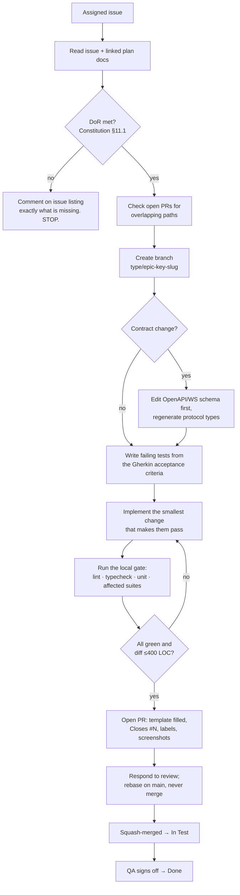

# AGENTS.md — operating manual for AI coding agents

> **Audience:** Claude Code, GitHub Copilot (incl. coding agent), OpenAI Codex, Cursor, and any other
> autonomous or semi-autonomous coding agent operating in this repository. Human contributors should read
> it too — it is the practical companion to [`CONSTITUTION.md`](CONSTITUTION.md).
>
> **Precedence:** `CONSTITUTION.md` > `AGENTS.md` > `CONTRIBUTING.md` > tool defaults. If this file
> contradicts the Constitution, the Constitution wins and this file is a bug.
>
> **Version:** 1.0.0 · Last updated 2026-09-14 · Owner `@basiltt`

---

## 0. Read these first (in this order)

Do not write code before reading the ones relevant to your ticket. Paths are repo-relative.

| # | File | Why |
|---|---|---|
| 1 | `CONSTITUTION.md` | Non-negotiable rules; §1 scope guardrails, §2 invariants, §9 gates |
| 2 | `AGENTS.md` (this file) | How to actually work here |
| 3 | The **GitHub issue** you were assigned | The only authoritative statement of your task |
| 4 | `docs/plan/00-planning-brief.md` | Product, locked decisions, team, deliverables |
| 5 | `docs/research/24-owner-decisions.md` | Owner decisions that override research recommendations |
| 6 | `docs/plan/02-definition-of-ready-done.md` | DoR/DoD you must satisfy |
| 7 | `docs/plan/01-sdlc-and-branching.md` | Branch/PR mechanics in full |
| 8 | `docs/plan/20-architecture.md` | C4 views, module responsibilities |
| 9 | `docs/plan/21-database-schema.md` | Postgres DDL, QuestDB tables, Parquet layouts, retention |
| 10 | `docs/plan/22-api-openapi.yaml` + `23-ws-protocol.md` + `24-internal-schemas.md` | The contract. Change it before code |
| 10b | `docs/plan/28-statechart-catalogue.md` | The lifecycle contracts. **Required before touching any lifecycle** (order, trade group, legs, algos, native-SL protection, rule instance, alert, recorder, replay, connection, book health, auth session, live gate, kill switch, reconciliation, risk lockout) |
| 10c | `docs/plan/27-adrs/ADR-0016-statechart-runtime.md` | Why those contracts exist, which executor runs them, and what may never be one |
| 11 | `docs/plan/26-chart-engine-design.md` | Engine architecture, layers, budgets |
| 12 | `docs/plan/03-testing-strategy.md`, `04-security-program.md`, `05-accessibility-standard.md`, `06-performance-and-load-standard.md` | Gate details |
| 13 | `docs/plan/14-screens-catalogue.md` + `15-component-catalogue.md` + `16-design-system-brief.md` | Required before any UI work |
| 14 | `docs/adr/` | Decisions already made — do not relitigate silently |
| 15 | `SECURITY.md` | Secrets and reporting policy |

**Never** rely on memory of another repository, a generic tutorial, or a model prior about "how trading
apps usually work". This repo has locked decisions; follow them.

**Where the truth lives (C-16.5).** When two documents disagree, the owner below wins and the other file
is the bug:

| You need | Read only |
|---|---|
| A rule / its exact id | `CONSTITUTION.md` (ids are stable and verifiable — C-16.4) |
| Required CI check names | `CONSTITUTION.md` §9 |
| Performance & bundle budget **values** | `CONSTITUTION.md` §14.2 / §14.3 |
| Why a budget is that number, and how it was measured | `docs/plan/06-performance-and-load-standard.md` |
| Command / script names | `AGENTS.md` §4 (a **specification** until ticket `INFRA-001` lands) |
| Who must approve a path | `.github/CODEOWNERS` |
| Ticket schema vs ticket content ownership | `.github/CODEOWNERS` (backlog section) |
| A lifecycle's states, events, guards and transition table | `docs/plan/28-statechart-catalogue.md` §Bn (generated from `machines/*.json` — **never hand-edit the Markdown**) |
| A lifecycle's enums, field types and persistence schema | `docs/plan/24-internal-schemas.md` |

Do not copy any of these lists into a new file — link to them.

---

## 1. What CandleViewer is (30-second brief)

Private, self-hosted trading terminal for one owner + a few account managers. React + TypeScript web app
with a **fully custom WebGL chart engine**, wrapped by an Electron desktop shell. Python 3.12+
FastAPI/asyncio **modular monolith** backend talking to **Bybit v5, USDT linear perpetuals only**.
Storage: QuestDB (hot ticks/L2/bars) + Parquet/DuckDB (cold/replay) + Postgres (relational).
Order-flow analytics (footprint, profiles, CVD, DOM heatmap, Deep Stats), full execution loop with
multi-account trade-group fan-out, rule engine, paper trading on Bybit demo, journal, and RBAC-gated
owner/admin screens **inside the web app**.

**Hard boundaries:** no Android/iOS, no separate admin app, no other exchange or product category, no
options/GEX, no withdrawals, no public internet exposure. (Constitution §1.3.)

---

## 2. Repo map (planned monorepo layout)

Directories are created as their epics land; the layout itself is fixed. Do not invent new top-level
directories without an ADR.

```
CandleViewer/
├─ CONSTITUTION.md            # immutable rules
├─ AGENTS.md                  # this file
├─ CONTRIBUTING.md            # human on-ramp, points here
├─ SECURITY.md                # vulnerability reporting + secrets policy
├─ CHANGELOG.md               # Keep a Changelog, generated from commits
├─ package.json               # pnpm workspace root, shared scripts
├─ pnpm-workspace.yaml
├─ turbo.json                 # task graph for JS/TS packages
├─ .github/
│  ├─ CODEOWNERS              # ownership by directory (normative)
│  ├─ PULL_REQUEST_TEMPLATE.md
│  ├─ ISSUE_TEMPLATE/         # bug_report.yml, feature_request.yml, epic.yml, config.yml
│  └─ workflows/              # CI jobs named exactly as Constitution §9
├─ apps/
│  ├─ web/                    # React 18 + TS app: routing, stores, screens, admin screens
│  │  ├─ src/app/             # shell, routing, providers
│  │  ├─ src/features/        # feature-sliced: chart, dom, ticket, positions, risk,
│  │  │                       #   rules, journal, alerts, replay, admin, settings
│  │  ├─ src/state/           # Jotai atoms (high-frequency) + Zustand stores (global UI)
│  │  ├─ src/transport/       # REST client + WS client (uses packages/protocol)
│  │  └─ tests/               # vitest unit + RTL component tests
│  └─ desktop/                # Electron shell ONLY: windows, GPU flags, updater, deep links
│     ├─ src/main/            # main process (no business logic)
│     ├─ src/preload/         # contextBridge, strictly typed, minimal surface
│     └─ build/               # electron-builder config, entitlements
├─ packages/
│  ├─ chart-engine/           # custom WebGL engine — NO React, NO network, NO Bybit knowledge
│  │  ├─ src/core/            # scene, renderer, scales, viewport, coordinate systems
│  │  ├─ src/layers/          # candles, footprint, profile, heatmap, bubbles, overlays, drawings
│  │  ├─ src/workers/         # OffscreenCanvas worker entry points
│  │  ├─ bench/               # benchmark suite consumed by the `engine-bench` CI job
│  │  └─ tests/
│  ├─ ui/                     # design system (Radix + Tailwind + shadcn-style) + React bindings
│  │  ├─ src/atoms/ molecules/ organisms/ trading/   # per component catalogue
│  │  └─ src/tokens/          # generated design tokens (do not hand-edit)
│  ├─ protocol/               # REST/WS types + codecs, GENERATED from the contract
│  └─ config/                 # shared eslint/tsconfig/tailwind/vitest presets
├─ services/
│  └─ api/                    # Python modular monolith (module list = Constitution §3)
│     ├─ config/ secrets/ auth/ audit/ observability/
│     ├─ exchange/base/ exchange/bybit/
│     ├─ bus/ ingestion/ book/ bars/ orderflow/
│     ├─ storage/ (repositories, questdb, parquet, schemas, migrations/)
│     ├─ recorder/ replay/
│     ├─ accounts/ oms/ rules/ paper/ risk/ journal/ alerts/ admin/
│     ├─ http/ ws/            # contract-first routers
│     ├─ pyproject.toml       # ruff, black, mypy strict, pytest config
│     └─ tests/               # unit + integration (fixtures under tests/fixtures/bybit/)
├─ infra/                     # docker compose, Dockerfiles, Prometheus/Grafana, Tailscale notes
├─ tests/
│  ├─ e2e/                    # Playwright (web + Electron) — owned by QA
│  ├─ load/                   # k6 + Locust scenarios
│  ├─ chaos/                  # chaos scenarios (Constitution §13.6)
│  └─ fixtures/bybit/         # recorded Bybit captures, redacted
└─ docs/
   ├─ plan/                   # planning source of truth (00..33 + backlog/)
   ├─ adr/                    # MADR architecture decision records
   ├─ research/               # research reports + digests (read-only history)
   └─ incidents/              # post-mortems
```

**Placement rules**
- Business logic goes in `services/api/<module>/` or `apps/web/src/features/<feature>/` — never in
  `apps/desktop/`, never in `packages/chart-engine/`.
- Anything Bybit-specific goes in `services/api/exchange/bybit/` only.
- Anything touching a secret goes in `services/api/secrets/` only.
- Shared React components go in `packages/ui/`, not in `apps/web`, once used by ≥2 features.

---

## 3. How to pick up a ticket



Step detail:

1. **Read the issue fully**, then every plan doc it links. If the issue and a plan doc disagree, ask in the
   issue; do not guess.
2. **DoR check (Constitution §11.1).** If acceptance criteria, design sign-off, dependencies, estimate or
   security/a11y/perf notes are missing — **stop and comment**. Starting an un-Ready ticket is a
   violation. You are never punished for stopping; you are for guessing.
3. **Branch** per C-4.4: `feat/oms-fanout-sl-attach`, `fix/engine-dpi-scaling`, etc. Branch from fresh
   `main`.
4. **Contract first** if the API/WS surface changes (C-6.1); regenerate `packages/protocol` with the
   generator, never by hand.
5. **Tests first.** Translate each Gherkin scenario into a test at the correct pyramid level
   (Constitution §13.2–13.4).
6. **Implement** the minimum. Follow existing patterns in the neighbouring module; read two similar files
   before writing a new one.
7. **Run the gate locally** (§4). Do not open a PR that you have not run.
8. **Open the PR** with the template fully completed. Attach: test evidence, before/after screenshots or a
   short capture for UI, benchmark output for engine/perf work, migration up/down output for schema work.
9. **Iterate on review.** Reply to every comment. Rebase on `main` when asked. Never merge yourself before
   the required approvals.
10. **After merge** the ticket is **In Test**, not Done. Support QA; if QA finds a defect, it returns to
    In Progress on a new branch or a fix-up PR to the same issue.

### 3a. Ticket anatomy (the 14 body sections + Agent execution brief)

Detailed tickets live as JSON in `docs/plan/backlog/E*.json` (merged view:
`docs/plan/backlog/all-tickets.json`), one object per ticket, keyed by
`key, kind, title, labels, component, phase, sprint, priority, perspective, risk, estimate, parent,
blocked_by, milestone, body`. `body` is a Markdown string with these sections, in this order, for every
non-Epic ticket:

| # | Section | What it tells you |
|---|---|---|
| 1 | `## Context` | Why this ticket exists; the product/architecture backdrop |
| 2 | `## Scope / Deliverables` | Exactly what to build. Do not exceed this. |
| 3 | `## Out of scope` | Explicitly excluded work — do not creep into it |
| 4 | `## Acceptance criteria` | Gherkin-style scenarios; each one becomes a test |
| 5 | `## Design-ahead waiver (Architect/CDO) — explicit record` | Whether design sign-off is already granted or still required (DoR gate) |
| 6 | `## Technical notes / design` | Implementation guidance, interfaces, data shapes |
| 7 | `## Test plan` | Which pyramid level(s), fixtures, what must be covered |
| 8 | `## Security notes` | Threat-model points, secrets/RBAC/audit considerations |
| 9 | `## Accessibility notes` | WCAG/keyboard/reduced-motion considerations, or N/A |
| 10 | `## Performance notes` | Budgets this ticket must respect or measure |
| 11 | `## Observability` | Logs/metrics/alerts to add or update |
| 12 | `## Definition of Done` | The DoD checklist specific to this ticket |
| 13 | `## Dependencies` | Other tickets/contracts this one needs first (see also `blocked_by`) |
| 14 | `## Branch` | The exact branch name to use |
| 15 | `## References` | Plan docs, ADRs, schema sections this ticket implements |
| 16 | `## Agent execution brief` | **Read this first.** Read first / Repo paths / Interfaces you must not break / Commands / Branch & PR / Done means / Do NOT / If blocked — a self-contained, no-follow-up-questions summary of 1–15 |

Epic tickets (`kind: "Epic"`) end with `## Agent guidance` instead of `## Agent execution brief`:
dependency order, parallel lanes for multiple agents working the epic concurrently, and shared
interfaces to agree on before any lane starts.

**How to consume a ticket:** read the GitHub issue (if the ticket also exists there) or the JSON `body`
in full, then re-read `## Agent execution brief` before writing any code — treat it as the fastest path
to an executable task, but do not skip 1–15 if the brief references something you don't understand.
If any of 1–15 is missing, contradictory, or the brief cannot be executed without asking a question,
the ticket fails DoR (Constitution §11.1) — stop and comment, do not guess.

Edit ticket JSON only with `python`: load the file, modify the dict/list in memory, then
`json.dump(..., ensure_ascii=False, indent=2)`. Never hand-edit with a text-replace tool — the schema
is machine-checked by `docs/plan/backlog/_tools/validate.py`; run it after any backlog edit.

### 3b. Board protocol

The project board is the single source of truth for ticket state; GitHub issue body and `body` JSON are
the source of truth for ticket *content*.

- **Status semantics:** `Backlog` → `Ready` (DoR met) → `In Progress` (an agent/human has a branch open)
  → `In Review` (PR open) → `In Test` (PR merged, awaiting QA) → `Done` (QA or owner signed off) →
  `Blocked` (any status can move here; see below). Only QA or the owner may set `Done` (C-10.4). Only the
  Ready column is a valid pickup point — do not start work from `Backlog`.
- **Who moves what:** the agent/human picking up a ticket moves it `Ready` → `In Progress` when the
  branch is created, and `In Progress` → `In Review` when the PR opens. CI/automation moves
  `In Review` → `In Test` on merge. QA/owner move `In Test` → `Done`. Anyone hitting a blocker moves the
  ticket to `Blocked` themselves — do not wait for the owner to notice.
- **Blocked usage:** move to `Blocked` the moment a required input is missing (failing gate you cannot
  fix in scope, an unmet dependency, an ambiguous acceptance criterion) and leave a comment naming the
  specific blocker and which ticket/PR/decision would unblock it. Never leave a ticket silently stalled
  in `In Progress`. Never work around the blocker by weakening scope or a gate to escape `Blocked`.
- **Sub-issue checklists:** Epics track their child tickets as a GitHub tasklist (`- [ ] #123`) in the
  issue body; check an item only when that child ticket reaches `Done`, never on merge alone. Do not
  add/remove tasklist items by hand — they are generated from `parent` in the ticket JSON; if the list is
  wrong, fix `parent` in the JSON via `_tools/validate.py`-checked edits.
- **`blocked_by`:** the JSON field is the authoritative dependency graph. Before moving a ticket to
  `In Progress`, confirm every key listed in its `blocked_by` is already `Done` (or, for a same-epic
  contract dependency, at least merged with the contract landed — see the Multi-agent house rules above).
  If `blocked_by` is stale (lists a ticket that no longer blocks, or omits one that does), fix it in the
  JSON in the same PR, don't just ignore it.

---

## 4. Commands

> **⚠️ Status of this section — read before you trust a command.**
>
> At the time of writing, the repository contains **planning documents only**: there is no
> `package.json`, `pnpm-workspace.yaml`, `turbo.json` or `pyproject.toml` in the tree yet. The task
> names below are therefore **normative specifications, not verified observations** — they are the
> names the scaffolding is *required* to create, not names anyone has run.
>
> - **Single owning ticket:** `INFRA-001 — Bootstrap monorepo scaffolding and task graph`
>   (`docs/plan/backlog/`, epic `EP-INFRA`). That ticket's acceptance criteria include: every task
>   name in this section exists and exits 0 on a clean checkout, and any deviation is corrected
>   **in this section in the same PR**. Until INFRA-001 is Done, treat this table as the spec.
> - **After INFRA-001 is Done**, the runnable scripts become the source of truth and this section
>   becomes a mirror of them. Drift is caught by the `generated-code-check` CI job (Constitution §9
>   #19), which runs `scripts/check-agents-commands.mjs`: it parses every `|` row in §4, resolves
>   each task against the workspace task graph (`pnpm -r run --help` / `turbo run --dry=json`) and
>   the Python project scripts, and **fails the build** if a documented task is missing or an
>   undocumented user-facing task exists.
> - **If you change a script, update this section in the same PR** (C-15.4). If a command does not
>   yet exist because its epic has not landed, say so in the PR instead of inventing an alternative.
> - This is the **only** place in the repo where command names are enumerated. `CONTRIBUTING.md`,
>   `CONSTITUTION.md` and the PR template link here rather than repeating them.

### Root (pnpm workspace + Turborepo)

| Task | Command |
|---|---|
| Install | `pnpm install --frozen-lockfile` |
| Lint everything | `pnpm lint` |
| Fix lint/format | `pnpm lint:fix` && `pnpm format` |
| Typecheck | `pnpm typecheck` |
| Unit tests (all JS/TS) | `pnpm test` |
| Unit tests with coverage | `pnpm test:cov` |
| Build all | `pnpm build` |
| Bundle-size check | `pnpm size` |
| Regenerate protocol types + tokens | `pnpm generate` |
| Full local gate (what CI runs on a PR) | `pnpm verify` |

### `apps/web`

| Task | Command |
|---|---|
| Dev server | `pnpm --filter @candleviewer/web dev` |
| Unit/component tests | `pnpm --filter @candleviewer/web test` |
| Build | `pnpm --filter @candleviewer/web build` |
| Storybook (design review) | `pnpm --filter @candleviewer/ui storybook` |

### `apps/desktop`

| Task | Command |
|---|---|
| Run Electron against dev web | `pnpm --filter @candleviewer/desktop dev` |
| Package | `pnpm --filter @candleviewer/desktop package` |

### `packages/chart-engine`

| Task | Command |
|---|---|
| Unit tests | `pnpm --filter @candleviewer/chart-engine test` |
| Benchmarks (compare to baseline) | `pnpm --filter @candleviewer/chart-engine bench` |
| Update benchmark baseline (maintainers only, needs CODEOWNER approval) | `pnpm --filter @candleviewer/chart-engine bench:baseline` |

### `services/api` (run from `services/api/`, inside the project venv or `uv`)

| Task | Command |
|---|---|
| Install dev deps | `uv sync --frozen` |
| Lint | `ruff check .` |
| Format check / fix | `black --check .` / `black .` |
| Typecheck | `mypy --strict .` |
| Unit tests | `pytest -m "not integration" --cov=. --cov-fail-under=85` |
| Integration tests (needs docker compose stack) | `pytest -m integration` |
| Architecture contracts | `lint-imports` |
| New migration | `alembic revision -m "<summary>"` (autogenerate then **review by hand**) |
| Apply / roll back migration | `alembic upgrade head` / `alembic downgrade -1` |
| Run API locally | `uvicorn services.api.main:app --host 127.0.0.1 --port 8000 --reload` |

### Stack, E2E, load, security

| Task | Command |
|---|---|
| Bring up local stack (Postgres, QuestDB, API) | `docker compose -f infra/docker-compose.dev.yml up -d` |
| E2E (web) | `pnpm e2e` |
| E2E (Electron) | `pnpm e2e:desktop` |
| Accessibility scan | `pnpm test:a11y` |
| Load test | `k6 run tests/load/api-ws.js` |
| Ingestion soak | `locust -f tests/load/ingestion_soak.py` |
| Chaos suite | `pnpm chaos` |
| Secret scan on your diff | `gitleaks protect --staged --redact` |
| Container scan | `trivy image candleviewer/api:dev` |

---

## 5. Coding standards

### 5.1 TypeScript / React

- **TS strict**: `strict: true`, plus `noUncheckedIndexedAccess`, `exactOptionalPropertyTypes`,
  `noImplicitOverride`, `noFallthroughCasesInSwitch`. **`any` is banned** (`@typescript-eslint/no-explicit-any`
  as an error); use `unknown` + a narrowing guard. `as` casts need a comment justifying them; `as any`,
  `@ts-ignore` and `@ts-expect-error` without a linked issue are rejected.
- **Config names**: ESLint flat config `eslint.config.mjs` (extends `@candleviewer/config/eslint`),
  Prettier `.prettierrc.json` (printWidth 100, singleQuote, trailing commas), `tsconfig.base.json` +
  per-package `tsconfig.json`, Tailwind `tailwind.config.ts` extending `@candleviewer/config/tailwind`,
  Vitest `vitest.config.ts`.
- **Naming**: `PascalCase` for components/types/classes, `camelCase` for variables/functions,
  `SCREAMING_SNAKE_CASE` for module-level constants, `kebab-case` for file and directory names except
  React component files which are `PascalCase.tsx`. Hooks start with `use`. Booleans read as predicates
  (`isLive`, `hasOpenPosition`, `canSubmitOrder`). Event handlers `handleX`; props taking handlers `onX`.
  Never abbreviate domain words (`orderBook` not `ob`, `cumulativeDelta` not `cd`).
- **React**: function components only; no class components. Derive, don't duplicate state. Keep effects
  rare and justified — data flows through the transport layer into stores, not through ad-hoc `useEffect`
  fetches. Memoise only with evidence (a profile or a benchmark). Keys must be stable domain ids.
  High-frequency values live in **Jotai atoms**; global UI state in **Zustand**; WS ingestion is batched
  (rAF/`bufferTime`) before it touches React. Never render more than ~16 ms of work per frame.
- **Chart engine**: no React, no DOM framework, no `fetch`, no global singletons; explicit
  `dispose()` for every resource; all GPU resources pooled; every public API change benchmarked.
- **Imports**: absolute via workspace aliases (`@candleviewer/ui`), no deep imports into another package's
  `src/internal`, no circular imports (enforced by `dependency-cruiser`).

### 5.2 Python

- **Python 3.12+**, `asyncio` throughout. **Ruff** (config in `pyproject.toml`, rule set includes `E,F,W,I,
  N,UP,B,A,C4,SIM,ASYNC,S,PT,RET,ARG,PTH,ERA,TRY,RUF`), **Black** (line length 100), **mypy `--strict`**
  (no `Any` in public signatures, no untyped defs, no implicit `Optional`).
- **Naming**: `snake_case` functions/variables, `PascalCase` classes, `SCREAMING_SNAKE_CASE` constants,
  modules `snake_case`. Async functions that perform I/O are named for the effect (`submit_order`,
  `fetch_positions`). Private helpers prefixed `_`.
- **Types & models**: Pydantic v2 models at every boundary (HTTP, WS, bus, storage). Domain types are
  frozen dataclasses or Pydantic models; money and prices are `Decimal`, never `float`; sizes respect the
  instrument's tick/lot from `instruments-info`. Time is timezone-aware UTC (`datetime.now(UTC)`);
  exchange timestamps are stored as integer milliseconds plus a typed accessor. Never use naive datetimes.
- **Errors**: raise typed domain exceptions from `services/api/<module>/errors.py`; never raise bare
  `Exception`; never `except Exception: pass`. Catch narrowly, add context, and let unexpected errors
  bubble to the boundary handler that maps them to the problem-shape response (C-6.5). Exchange errors map
  through the adapter's taxonomy — `10002` (clock drift) and `10018` (rate limit) get distinct codes and
  metrics. Retries: only for idempotent operations, with jittered exponential backoff and a cap; order
  submission retries **must** reuse the same `orderLinkId` (C-2.10).
- **Async hygiene**: no blocking calls on the event loop (no sync DB drivers, no `time.sleep`, no CPU loops
  >50 ms — offload to a worker process/executor). Every task is tracked and cancelled on shutdown; no
  fire-and-forget `asyncio.create_task` without storing the handle. Every queue is bounded (C-2.18).
- **Logging**: `structlog`-style structured JSON via `services/api/observability/`. Always include
  `traceId`, and where applicable `userId`, `role`, `accountId`, `tradeGroupId`, `orderLinkId`. Never log
  request bodies of key-management endpoints, headers, signatures, or anything from the secrets module.
  Use levels honestly: `error` = needs human attention; `warning` = degraded but handled; `info` = state
  transitions; `debug` = development detail. **Never `print()`.**
- **SQL**: parameterised queries or the repository layer only; no string-built SQL; no ORM lazy-loading in
  hot paths. QuestDB writes go through the writer abstraction with batching.

### 5.3 Universal rules

- **No secrets in code, tests, fixtures, comments, commit messages, or PR text.** Ever. If you think you
  need a real key, you do not — use a fixture (C-12.2).
- **No network access in tests** (C-13.5). No calls to `bybit.com` anywhere outside
  `services/api/exchange/bybit/` and the gated nightly demo job.
- **No dead code, no commented-out code, no speculative abstraction.** Delete it; git remembers.
- **No TODO without an issue number** (`# TODO(#123): ...`).
- **Feature flags** for anything unfinished (C-4.13); default off.
- **Every user-visible string** goes through the copy layer, never hardcoded in a component's JSX where it
  would bypass review by design/content owners.
- **Every heuristic signal** is labelled `(estimated)` in payload and UI (C-2.13).
- **Lifecycles conform to their statechart contract** (C-2.19). If you are implementing or changing one of
  the lifecycles in `docs/plan/28-statechart-catalogue.md`, use **its** state names, event names, guard
  names and transition table. If the contract looks wrong, say so in the issue and change the contract
  through its own gate — do not diverge in code and do not "improve" a state name in passing. Where the
  code and the contract disagree, the contract is right.
- **Never put a hot path in a statechart** (C-2.20). Book deltas, bar builders, footprint aggregation,
  per-tick rule evaluation, the paper matcher and the rate-limit governor are plain Python, always —
  including as "just an internal transition". Nothing running faster than ~100 Hz may query an
  interpreter; read the plain `bool`/enum the machine publishes on state entry.
- **Statecharts record; synchronous code enforces** (C-2.21). Kill switch, live gate, risk caps and rate
  budgets are enforced by a synchronous flag or function *before* any interpreter is involved. If your
  design needs a machine to **return an answer** rather than **record a fact**, it is the wrong design.
- **`xstate-statemachine==0.9.1` IS adopted, and is the only statechart executor** (C-2.22, ADR-0016
  Accepted). Every catalogue lifecycle is a statechart JSON under
  `services/api/candleviewer/statechart/machines/` run through `cv.statechart.factory` — never
  `create_machine`/`Interpreter` directly (CI failure). There is no shim and no dual-runtime; do not write
  either. Follow the FINAL mandatory config block and the standing CV constraints (CV-C60, CV-C62, CV-C63,
  CV-C65′, CV-C66′, CV-C67, CV-C68, CV-C69, CV-C12′, CV-C25, ...) in
  `docs/research/xstate/79-r14-final-readiness-verdict.md` §7 exactly as written.

---

## 6. Test-writing rules

1. **Level selection** (Constitution §13.2–13.4): pure logic → unit; store/adapter/pipeline crossing →
   integration; user-visible critical path → E2E. If you are writing an E2E test for a calculation, you
   chose the wrong level.
2. **Name tests as specifications**: `test_bar_builder_closes_volume_bar_at_threshold`,
   `renders estimated badge when iceberg confidence is heuristic`.
3. **Arrange–Act–Assert**, one behaviour per test, no branching logic inside tests.
4. **Determinism**: freeze the clock (`freezegun` / `vi.useFakeTimers`), seed RNG, sort before comparing,
   no `sleep` — await a condition or advance a fake clock. Any test that is timing-sensitive must use the
   provided test clock, not real time.
5. **Fixtures**: use recorded Bybit captures from `tests/fixtures/bybit/`. Do not invent payload shapes —
   if a fixture is missing, add one via the regeneration script and get it reviewed. Fixtures must be
   redacted of keys and real UIDs.
6. **No network, no real filesystem outside `tmp_path`, no shared global state, no test order dependence.**
7. **Coverage floors are not the goal** — cover branches that matter: error paths, rate-limit rejection,
   reconnect, partial fill, SL attachment failure, permission denial, empty/partial history states.
8. **Every bug fix ships a regression test** that fails without the fix. State this in the PR.
9. **Safety-critical modules** (OMS, risk, rules, secrets, book) need ≥95% coverage plus mutation testing;
   include an explicit test asserting the native-SL invariant for every new order path (C-2.6).
10. **Frontend**: test behaviour through the accessibility tree (Testing Library queries by role/name), not
    implementation details; include a keyboard-navigation assertion for every interactive component and an
    `axe` assertion for every new screen.
11. **Chart engine**: deterministic geometry/scale/LOD/hit-test unit tests plus a benchmark entry; visual
    checks are golden-image tests with a documented tolerance, not eyeballing.
12. **Contract**: a schema change without provider **and** consumer test updates will be rejected.

---

## 7. Pull-request checklist (agent version)

The authoritative checklist is `.github/PULL_REQUEST_TEMPLATE.md`; do not delete items from it. Before
requesting review, confirm:

- [ ] One issue, one branch, one PR; description contains `Closes #N` (C-4.6/C-4.7).
- [ ] Branch name matches `<type>/<epic-key>-<slug>`; commits are conventional with an allowed scope.
- [ ] Diff ≤400 LOC (or a justified `large-pr-approved` label); no unrelated changes.
- [ ] Contract changed first and protocol types regenerated (if applicable); contract tests updated.
- [ ] Tests added at the right level; local `pnpm verify` / `pytest` green; coverage floors held.
- [ ] Migration: additive, reversible, single, never edits an applied revision; up/down output attached.
- [ ] Security: no secrets, no new permissions, redaction verified, `security-review` label if the paths in
      C-10.2 are touched; threat-model impact noted.
- [ ] A11y: keyboard path, focus order, contrast, `aria-live` politeness, canvas alternative; `axe` clean.
- [ ] Performance: budgets in §14.2 respected; benchmark output attached for engine/hot-path changes;
      bundle-size budget respected.
- [ ] Observability: metrics/logs/alerts added or updated; no `print()`/`console.log` left.
- [ ] Docs updated in the same PR (plan docs, ADR if architectural, `AGENTS.md` if commands/standards
      changed, changelog entry).
- [ ] Feature flag added (default off) or removal ticket linked.
- [ ] Screenshots/recording for UI; design ticket is Done and `design-approved` obtained.
- [ ] Self-reviewed the diff line by line.

---

## 8. What agents must NEVER do

Violations of this list are treated as incidents, not mistakes. If you are about to do one of these,
**stop and ask in the issue instead**.

1. **Never force-push, rewrite history on, or push directly to `main`** (or any shared branch). Force-push
   is allowed **only** on your own feature branch after a rebase.
2. **Never edit a migration that has been merged to `main`** — fix forward with a new revision (C-5.4).
   Never create two migrations in one PR. Never grant `UPDATE`/`DELETE` on audit tables.
3. **Never touch `services/api/secrets/`, `services/api/auth/`, `services/api/audit/`, `infra/`, CI
   workflows or dependency manifests without the `security-review` label** and a security-team reviewer.
4. **Never disable, skip, weaken, or "temporarily" bypass a check**: no lowering coverage thresholds, no
   `--no-verify`, no `# noqa`/`eslint-disable`/`# type: ignore` without a rule name **and** a linked
   issue, no `@skip`/`.skip`/`.only` left in tests, no admin merge, no editing branch-protection settings,
   no changing a benchmark baseline to make a regression pass.
5. **Never widen scope.** No drive-by refactors, no reformatting unrelated files, no dependency bumps that
   the ticket did not ask for, no renaming things "while I'm here".
6. **Never handle real credentials.** Do not create, read, copy, print, decode, commit, or paste an API
   key, token, cookie, `.env` value or private key. Do not write code that returns a secret from any
   endpoint. Do not add a key to a fixture.
7. **Never call a live exchange** from code paths that run in CI, tests, or local dev defaults. No network
   in tests at all (C-13.5).
8. **Never remove or bypass a safety invariant**: the native exchange SL (C-2.6), server-side RBAC/risk
   checks (C-2.12), audit writes (C-2.9), the withdrawal self-check (C-2.8), rate-limit reserve (C-12.7),
   demo/live isolation (C-2.11). No flag, env var or "test mode" may do so either.
9. **Never add out-of-scope work**: mobile targets, another exchange or category, a separate admin app,
   options/GEX, withdrawal/transfer calls, public exposure, telemetry to third parties, or a third-party
   chart library in production (C-1.2).
10. **Never add a dependency** without justification, an allowlisted licence, and CODEOWNER approval — and
    never into `packages/chart-engine` without an ADR.
11. **Never approve a pull request.** Agents may review and comment; approvals are human (C-10.1). Never
    merge a PR on a human's behalf, never dismiss a reviewer's requested changes, never resolve someone
    else's review thread.
12. **Never mark a ticket Done.** Merging puts it In Test; only QA or the owner sets Done (C-10.4).
13. **Never invent UI.** No screen, flow, copy, colour or spacing that is not in the signed-off design
    (C-10.3). No placeholder lorem ipsum shipped to `main`.
14. **Never fabricate**: no made-up API fields, exchange behaviours, benchmark numbers, test results,
    citations or "it should work". If you did not run it, do not claim it.
15. **Never delete or rewrite** `docs/research/**`, `docs/adr/**` accepted records, `CONSTITUTION.md`,
    another team's tests, or files outside your ticket's scope.
16. **Never run `git` destructive commands** (`reset --hard` on shared state, `clean -xfd` over untracked
    work you did not create, `rebase` of `main`, `tag -f`, branch deletion you do not own).
17. **Never create local exceptions to the Constitution** (C-16.3). Amend it instead.
18. **Never leave the working tree broken**: no partially applied refactor, no failing build, no
    uncommitted generated artefacts.
19. **Never cite a rule id you have not verified.** Every `C-x.y` you write in a PR, comment, commit
    message, ticket or code comment must exist verbatim as a `**C-x.y**` declaration in `CONSTITUTION.md`
    (C-16.4). Grep for it first. Inventing a plausible-looking rule id is fabrication (rule 14) and fails
    the `pr-metadata` check.
20. **Never duplicate a single-source list** (C-16.5). Required CI check names live only in
    `CONSTITUTION.md` §9; command/script names live only in `AGENTS.md` §4; performance and bundle budget
    *values* live only in `CONSTITUTION.md` §14 with their derivation only in
    `docs/plan/06-performance-and-load-standard.md`. If you need one elsewhere, **link** to it. Copying it
    creates drift and the PR will be rejected.
21. **Never diverge from a statechart contract, and never make a hot path one.** Do not rename a state,
    add an event, or change a transition in a lifecycle listed in `docs/plan/28-statechart-catalogue.md`
    without changing its contract through the contract gate (C-2.19). Do not put book deltas, bar building,
    footprint aggregation, per-tick rule evaluation, paper matching or rate-limit admission control inside a
    statechart in any form (C-2.20). Do not make a machine an enforcement point for a safety decision
    (C-2.21). `xstate-statemachine==0.9.1` is adopted and mandatory via `cv.statechart.factory` only — do
    not bypass it and do not build a shim (C-2.22).
22. **Never assert that a command works because this file lists it.** Until `INFRA-001` lands there is no
    `package.json`/`pyproject.toml` in the repo; §4 is a specification. Run the command; if it does not
    exist, say so in the PR rather than substituting an improvised equivalent.

---

## 9. Agent etiquette and escalation

- **Ask early, ask in the issue.** A blocked agent that comments with a precise question is doing its job;
  an unblocked agent that guessed is creating rework.
- **Report uncertainty explicitly** in the PR description ("I could not verify X because Y").
- **Small, reviewable increments.** If a ticket looks like >400 LOC, propose a split before writing code.
- **Respect other agents and humans working in parallel**: check open PRs for overlapping paths before
  touching a shared file (C-4.15); rebase rather than fight a conflict; never revert someone else's merged
  work without an issue.
- **Idempotent runs.** Re-running your own workflow must not create duplicate branches, PRs or comments.
- **Model tiering** (per the workspace policy) when spawning sub-agents: default `sonnet`, `opus` for
  genuinely complex reasoning, `fable` only for exceptional work. Never pin a versioned model id.
- **Time-boxing**: if you have made no progress after two full attempt cycles on the same failure, stop and
  write up what you tried, what you observed, and what you need.

---

## 10. How to update this file

`AGENTS.md` is living documentation and is expected to change as the repo grows.

1. Update it **in the same PR** as the change that makes it stale (new command, new directory, new
   standard, new prohibition) — C-15.4.
2. Standalone updates use a `docs/` branch and a `docs(repo): update AGENTS.md — <summary>` commit.
3. Required approvals: one CODEOWNER of the affected area; additionally `@CandleViewer/security` for
   changes to §8, and `@CandleViewer/architecture` for §2 (repo map) or §5 (standards).
4. **Never weaken a rule here to make your PR pass.** If a rule is genuinely wrong, and it is a
   Constitution rule, use the amendment process (Constitution §16). If it is only an AGENTS.md rule,
   explain the reasoning in the PR and get the extra approval above.
5. Keep it concrete: exact paths, exact command names, exact rule ids. No aspirational prose, no "TBD".
6. Bump the version at the top (semver: major = a prohibition changes, minor = new section/rules,
   patch = clarification) and keep the table of contents accurate.

---

## 11. Quick reference card

```
Branch    : feat|fix|chore|design|spike|docs / <epic-key>-<short-slug>
Commit    : type(scope): imperative subject   # scopes: Constitution §4.4
PR        : one issue, "Closes #N", ≤400 LOC, template complete, 2 approvals (1 CODEOWNER)
Integrate : git pull --rebase origin main     # never merge, never force-push main
Local gate: pnpm verify   |   ruff check . && black --check . && mypy --strict . && pytest
Contract  : edit docs/plan/22-api-openapi.yaml or 23-ws-protocol.md FIRST, then pnpm generate
Tests     : unit(logic) / integration(boundaries, recorded fixtures) / e2e(critical paths only)
Never     : force-push main · edit applied migrations · touch secrets w/o security label ·
            disable checks · widen scope · call live exchange in CI · approve PRs · set Done
Invariants: native exchange SL on every order · keys never leave secrets module ·
            no withdrawal permission · every order action audited · RBAC server-side
Lifecycles: implement to the contract in docs/plan/28-statechart-catalogue.md §Bn (C-2.19) ·
            hot paths are NEVER statecharts (C-2.20) · machines record, flags enforce (C-2.21) ·
            xstate-statemachine==0.9.1 IS ADOPTED — the only executor, via cv.statechart.factory (C-2.22)
Budgets   : see CONSTITUTION §14.2 (runtime) and §14.3 (bundle) — authoritative values;
            derivation/evidence in docs/plan/06-performance-and-load-standard.md.
            Reminder only: 60 fps · <16 ms p95 frame · <100 ms WS→screen p95 ·
            <300 ms order ack p95 (demo) · WCAG 2.2 AA
Lists     : CI check names → CONSTITUTION §9 · commands → AGENTS.md §4 (spec until INFRA-001)
```
