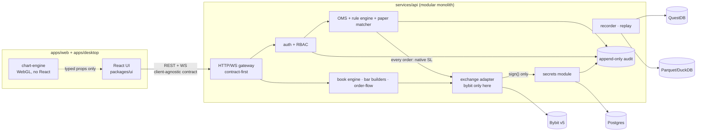
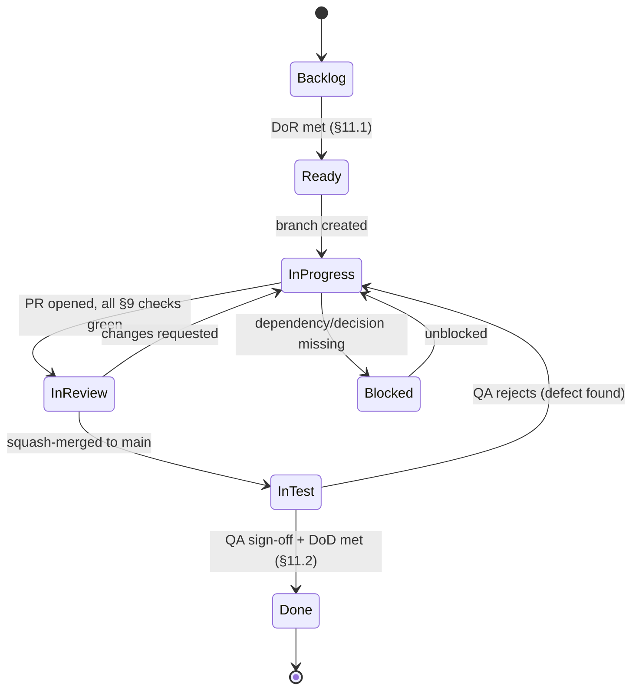

# CandleViewer Constitution

> **Status:** Ratified 2026-09-14 · **Version:** 1.1.0 · **Owner:** @basiltt
> **Applies to:** every human contributor and every AI coding agent working in this repository.
> **Authority:** This document outranks any other document, README, comment, habit, skill, agent prompt or
> tool default in this repository. Where another document conflicts with the Constitution, the Constitution
> wins and the other document is a bug to be fixed. The only way to change a rule here is the
> [Amendment Process](#16-amendment-process).

---

## Table of contents

1. [Mission and scope guardrails](#1-mission-and-scope-guardrails)
2. [Architecture invariants](#2-architecture-invariants)
3. [Module boundaries](#3-module-boundaries)
4. [Parallel-development rules](#4-parallel-development-rules)
5. [Database migration rules](#5-database-migration-rules)
6. [API and protocol change rules](#6-api-and-protocol-change-rules)
7. [Shared-package change protocol](#7-shared-package-change-protocol)
8. [Code ownership](#8-code-ownership)
9. [Quality gates (required CI checks)](#9-quality-gates-required-ci-checks)
10. [Review rules](#10-review-rules)
11. [Definition of Ready and Definition of Done](#11-definition-of-ready-and-definition-of-done)
12. [Security constitution](#12-security-constitution)
13. [Testing constitution](#13-testing-constitution)
14. [Accessibility and performance budgets](#14-accessibility-and-performance-budgets)
15. [Documentation and release rules](#15-documentation-and-release-rules)
16. [Amendment process](#16-amendment-process)
17. [Appendix A — Rule index for agents](#appendix-a--rule-index-for-agents)

Rules are numbered `C-<section>.<n>` and are **stable, never-reused, never-renumbered** identifiers
(C-16.4). Cite them in PR reviews (e.g. "violates C-4.7") and in ticket acceptance criteria. Before citing
a rule, confirm it exists verbatim here — dangling references fail the `pr-metadata` check. See C-16.5 for
which file owns which list; never duplicate an owned list into a second document.

---

## 1. Mission and scope guardrails

### 1.1 Mission

CandleViewer is a **private, self-hosted trading terminal** for one owner and a small number of account
managers. It combines TradingView-grade charting UX, DeepCharts-grade order-flow visibility (footprint,
volume/delta profiles, Deep-Stats rows, big trades, CVD, DOM liquidity heatmap, speed of tape, imbalance
tracker, *estimated* iceberg/stop-run detectors, market regime, tick replay), a full execution loop
(order ticket, chart/DOM trading, brackets, scaled orders, emulated OCO/iceberg/TWAP/chase, rule-based
stops), paper trading on Bybit demo, multi-account trade-group fan-out, journal/analytics, and
owner/admin administration.

**C-1.1** Every change must serve that mission. "Interesting", "modern" or "we might need it later" is
not a justification; a linked, Ready ticket is.

### 1.2 In scope (v1)

| Area | In scope |
|---|---|
| Exchange | **Bybit v5, USDT linear perpetuals only** (`category=linear`), UTA accounts |
| Environments | `live` and `demo` (paper trading); `testnet` only for connectivity smoke-tests |
| Clients | React + TypeScript web app; Electron desktop shell (primary) wrapping the same web app |
| Charting | Fully custom WebGL chart engine in `packages/chart-engine` |
| Backend | Python 3.12+ monolith with modular internals (FastAPI/Starlette, asyncio) |
| Storage | QuestDB (hot) + Parquet/DuckDB (cold) + Postgres (relational) |
| Admin | Owner/admin screens **inside the web app**, RBAC-gated |
| Access | Tailscale-only remote access; backend never bound to a public interface |

### 1.3 Out of scope — hard guardrails

**C-1.2** The following are **out of scope**. A PR that introduces them is rejected on sight, regardless
of quality, unless the Constitution has first been amended:

1. **Android / iOS / any mobile client.** No mobile tickets, designs, code, build targets or architecture
   docs. (Owner decision, 2026-09-14.)
2. **A separate admin application.** Admin is RBAC-gated screens inside `apps/web`.
3. **Any exchange other than Bybit**, and within Bybit any category other than USDT linear perpetuals
   (no spot, inverse, options).
4. **Options / GEX / gamma analytics.**
5. **Withdrawal, transfer or funding operations** of any kind, through any code path. See C-2.7.
6. **Public internet exposure** of the backend, any tunnel other than Tailscale, any third-party SaaS
   that receives market, order or account data.
7. **Multi-tenancy / SaaS productisation**, billing, public sign-up, or "offering the tool to others".
8. **Third-party chart libraries as the production renderer.** Lightweight Charts remains a documented
   fallback only and may be used in spikes; adopting it in production requires an ADR plus amendment.

**C-1.3 (Client-agnostic clause).** Although no mobile client is in scope, the backend REST/WS contract
must remain **client-agnostic**: no endpoint, payload field, auth mechanism or WS topic may assume a
browser, Electron, or a particular renderer. Session handling must work for a non-browser client
(token-based, no reliance on browser-only APIs). This keeps a future mobile client a pure-additive
project without permitting any mobile work now.

**C-1.4 (Scope creep).** An agent or contributor who discovers that a ticket cannot be finished within its
stated scope must stop, comment on the issue, and either split the ticket or request a DoR re-review.
Silently widening a PR is a Constitution violation (see C-4.9).

---

## 2. Architecture invariants

These are *invariants*: properties that must hold after every merged commit. CI, review and the
architect enforce them.

**C-2.1 Modular monolith.** The backend ships as **one deployable process** (plus datastores) with
**explicit internal module boundaries** (§3). No module may import another module's internals; modules
communicate through published interfaces, the in-process event bus, or the database — never by reaching
into private submodules. Rationale: single-user scale does not justify microservice ops, but boundaries
must be strong enough that a module can be extracted to its own process later without a rewrite.

**C-2.2 Exchange-adapter abstraction.** All exchange-specific knowledge (endpoints, signing, symbol
naming, error codes, rate-limit semantics, WS topic strings, position modes) lives **only** inside
`services/api/exchange/bybit/`. Every other module consumes the neutral `ExchangeAdapter` interface and
normalised domain events defined in `services/api/exchange/base/`. A `grep -r "bybit" --ignore-case`
outside the adapter directory, `packages/protocol` enum values and documentation must return nothing but
comments and configuration keys.

**C-2.3 Normalised domain events.** Ingestion converts exchange payloads into normalised domain events
(`Trade`, `BookDelta`, `BookSnapshot`, `Ticker`, `Liquidation`, `OrderUpdate`, `ExecutionUpdate`,
`PositionUpdate`, `WalletUpdate`) at the boundary. Business logic never sees a raw exchange dict.

**C-2.4 Client-agnostic API/WS.** The REST surface is defined by `docs/plan/22-api-openapi.yaml` and the
WS surface by `docs/plan/23-ws-protocol.md`. Both are **the contract**; implementation follows the
contract, never the reverse (see §6). Wire encoding (JSON now, MessagePack later) must be swappable: no
business logic may assume JSON object identity — decode into typed structures at the ingestion boundary.

**C-2.5 Snapshot + delta.** Every streaming topic delivers an authoritative snapshot on subscribe, then
deltas with a monotonic sequence number. Clients detect gaps and re-subscribe; servers must be able to
regenerate a snapshot at any time. No topic may be "delta-only".

**C-2.6 Native exchange stop-loss invariant.** **Every position-opening order, on every account, in every
environment, including every leg of a trade-group fan-out, must carry a native exchange-side
stop-loss.** Rule-engine stops, client-side stops and OMS-managed exits are *additional*, never
substitutes. If the exchange rejects the SL attachment, the OMS must attempt to cancel/flatten the leg
and raise a `SL_ATTACH_FAILED` alert. There is no configuration flag, environment, feature flag or
"advanced mode" that disables this. Any code path that can create an unprotected position is a
**Severity-1 defect** and blocks release.

**C-2.7 Keys never leave the secrets module.** API credentials are envelope-encrypted at rest and exist in
plaintext **only** inside `services/api/secrets/` at the moment of request signing. No other module, log
line, metric, trace, error message, API response, WS frame, database column outside the encrypted keys
table, test fixture, or frontend bundle may contain a secret or a decrypted key. The secrets module
exposes `sign(request, account_id)` and key-metadata reads — never `get_secret()`.

**C-2.8 No withdrawal permission, ever.** Stored keys must have withdrawal permission **off**. The backend
performs a **startup self-check** against Bybit's key-info endpoint and **refuses to enter trading mode**
if any enabled key reports withdrawal or transfer permission, or a missing IP allowlist. No code that
calls a withdrawal/transfer endpoint may exist in the repository; a Semgrep rule enforces this.

**C-2.9 Every order action is audited.** Every submit, amend, cancel, fill, fan-out expansion, rule-engine
action, kill-switch activation, environment switch, auth event and key-management event writes an
**append-only** audit record (actor, role, account, trade-group, symbol, side, qty, price/type, exchange
order id, `orderLinkId`, decision source, redacted raw payload, timestamps). Audit writes are part of the
same transaction boundary as the state change where possible, and are never conditional on log level.
Audit rows are immutable: no `UPDATE`/`DELETE` grants on the audit table.

**C-2.10 Idempotent order submission.** Every outbound order carries a client-generated `orderLinkId`
derived deterministically from (trade-group id, account id, leg index, attempt epoch). Retries reuse the
same id. The OMS reconciles by `orderLinkId` after every reconnect or restart.

**C-2.11 Environment isolation.** `demo` and `live` are separate credential sets, separate base URLs,
separate state and separate UI chrome. A single process may not mix them within one request path, and a
demo-scoped session may never reach a live endpoint. Switching to live requires an explicit typed
confirmation in the UI; hotkeys may not switch environment. Demo has **no WS order entry** — the adapter
must route demo order entry over REST.

**C-2.12 Server-side authority.** RBAC, risk caps, per-account profile resolution, sizing, rate-limit
budgeting and every trading decision are enforced **server-side**. The frontend may hide or disable
controls for UX, but the backend must behave identically if the client is hostile.

**C-2.13 Estimated-signal honesty.** Bybit provides no L3/MBO feed. Iceberg, stop-run, order-count and
similar heuristics must be labelled `(estimated)` in the API payload (`confidence`/`estimated: true`) and
in the UI. Presenting a heuristic as ground truth is a defect.

**C-2.14 Recorder-bounded history.** Any view depending on the local recorder (profiles, replay, journal
backfill, composite lookbacks) must expose the true available range and render explicit empty/partial
states. Never fabricate or interpolate missing history.

**C-2.15 Deterministic replay.** Replay consumes recorded data through the *same* aggregation code as live
(no parallel implementation). Given identical input, replay output must be byte-identical across runs.

**C-2.16 Chart engine independence.** `packages/chart-engine` has **no React dependency**, no application
state, no network access and no knowledge of Bybit. It exposes an imperative TypeScript API plus a thin
React binding that lives in `packages/ui`. It must run in a plain browser page and in a Worker with
`OffscreenCanvas`.

**C-2.17 No blocking work on the event loop.** Backend hot paths (book reconstruction, bar building,
order-flow aggregation) must not block the asyncio loop beyond 50 ms; heavy work goes to worker
processes. Frontend: no synchronous work >8 ms on the main thread per frame.

**C-2.18 Backpressure is mandatory.** Every fan-out path (WS→client, bus→consumer) has a bounded queue and
a documented shedding policy (coalesce deltas, drop to snapshot, or disconnect with a reason code).
Unbounded queues are forbidden.

**C-2.19 Lifecycles conform to their statechart contract.** Every long-lived lifecycle listed in
[`docs/plan/28-statechart-catalogue.md`](docs/plan/28-statechart-catalogue.md) — the order, the trade group
and its legs, the four emulated algos, the native-SL protection invariant, the rule instance, the alert, the
recording and replay sessions, the exchange connection, the book health FSM, the paper-account liquidation
FSM, the auth session, the live-enablement gate, the kill switch, the reconciliation job and the risk lockout
— is specified as an **XState-v5-compatible statechart JSON contract**. The implementation **must conform**:
the same state names, the same event names, the same guard names and the same transition table. Where the
code and the contract disagree, **the contract is right and the code is a defect**. The contract's authored
form is runtime-agnostic, but its executor is fixed: `xstate-statemachine==0.9.1` via `cv.statechart.factory`,
per [`ADR-0016`](docs/plan/27-adrs/ADR-0016-statechart-runtime.md) (Accepted) and C-2.22.
Conformance is asserted mechanically by the contract gates and the conformance harness, not by review
discipline. A contract's semantics may not change without a `machine_hash` bump plus either a version bump or
a registered upcaster carrying a golden-snapshot test — and **a no-op upcaster written to clear a mismatch is
a defect**, not a workaround.

**C-2.20 Hot paths are never statecharts.** A statechart is **never** used for book-engine delta
application, bar builders, footprint aggregation, per-tick rule condition evaluation, the paper-matcher fill
model / queue-position estimator / fee-and-funding arithmetic, or the per-account rate-limit governor and
fan-out admission control — **in any form, including internal (actions-only) transitions**. No path running
faster than ~100 Hz may query an interpreter; a machine publishes a plain `bool`/enum on state entry and hot
paths read that. This is architectural and measured, not stylistic: per-tick rule evaluation is ~744× slower
as a statechart, admission control ~238,000× slower, and a transition costs 33 µs against 15–60 µs of real
book work. The ratios do not improve with faster hardware. See `docs/plan/20-architecture.md` §4.4.

**C-2.21 Statecharts record; synchronous code enforces.** No statechart is an enforcement point for a safety
decision. The kill switch, the live-enablement gate, risk caps and rate budgets are enforced by a
**synchronous flag or function** consulted before any interpreter is involved; the corresponding machine
records and orchestrates the consequences. Blocking must take effect *before* the event that records it is
processed. Anything on the order path that must **return an answer** rather than **record a fact** may not be
a statechart.

**C-2.22 `xstate-statemachine` is the ADOPTED, exclusive statechart executor.** After 14 verification rounds
(`docs/research/xstate/79-r14-final-readiness-verdict.md`, decision-table ROW 8 — ADOPT WITH CONSTRAINTS,
library board 0 Blocker/0 High/1 Medium), `ADR-0016` is **Accepted** and `basiltt/xstate-statemachine` is
pinned as `xstate-statemachine==0.9.1` (tag `v0.9.1` = `45bb7f3`, wheel-equals-tag 42/42,
sha256 `d832d4d9a17b7b8003f61fa0714a8e57eaff316bcd5dd699d81d410362687162`, PEP 740 attested). Every catalogue
lifecycle (`28-statechart-catalogue.md` B1–B20) is implemented as a statechart JSON under
`services/api/candleviewer/statechart/machines/` executed **exclusively** through `cv.statechart.factory`.
There is **no in-house shim, no dual-runtime harness, and no phased shim retirement** — the library is the
runtime from the first line of code. Calling `create_machine`/`Interpreter` (or `SyncInterpreter`) directly,
anywhere outside `cv.statechart.factory`, is a **CI failure**. The FINAL mandatory machine configuration in
`79-r14-final-readiness-verdict.md` §7 is non-negotiable (both engines, both spellings): `strict_config=True`,
`strict=True`, `event_schemas=CV_EVENT_SCHEMAS`, `max_queue_size`/`overflow_policy="refuse"` (async only),
`CvErrorHooks`, root `onUnhandled:"defer"` + ordered unguarded audit arm, `maxIterations=500`. `tests/xstate_contract`
is a **blocking CI gate**; every machine's `machine_hash` is committed. Pin discipline: `==` version pinned
with hash **and** attestation; any upgrade requires `docs/research/xstate/gate/run_gate.py` plus the contract
suite green before the pin moves. The following CV constraint IDs from `79-r14-final-readiness-verdict.md` §7
stand and are binding on the implementation:

1. **CV-C68** — `events.re_mint()` may be called only with payload overrides (`data`, `error`,
   `fired_at`/`scheduled_for`); passing `type=`/`src=` is banned; enforced by lint plus the `cv_re_mint()`
   wrapper (payload-only; contains R14-01).
2. **CV-C69** — supervisors read `interpreter.dropped_receipts`/`on_receipt_dropped`, never the RuntimeWarning;
   the hook body is thread-safe and touches nothing loop-bound (it may run in a finaliser after `stop()`).
3. **CV-C65′** — shutdown drains via `interpreter.drain_pending()` (priority lane first, then inbox), journals
   the drained list *before* `stop()`, persists via `get_persisted_snapshot()`, checks `Receipt.error` on
   drained receipts, and de-duplicates re-submits.
4. **CV-C66′** — `on_interpreter_start` fires on every path (including restore); used for telemetry and to
   branch on `interpreter.restored_from_snapshot`; bring-up itself stays in `cv.statechart.factory`.
5. **CV-C63** — read `interpreter.chain_trips > 0` as the single runaway-chain rule; `isinstance(...,
   RunawayChainError)` is safe on restored latches.
6. **CV-C60** — after `Interpreter.from_snapshot(...)`, assert `interpreter.last_transition_ok is not None`
   before `start()`.
7. **CV-C62** — chart root `"onUnhandled": "defer"` plus an ordered unguarded audit arm, `"maxIterations": 500`.
8. **CV-C12′** — `after:`/`raise(delay=)` timing is coarse-only, ≥250 ms tolerance, ≥10 ms resolution; hard
   deadlines and algo timing stay on the external `MonotonicScheduler`. Watch: BENCH-6 headroom is measured,
   not assumed — re-verify on target hardware before relying on narrow margins.
9. **CV-C25** — no external `send()` from inside an action.
10. **CV-C45″**, **CV-C49′**, **CV-C55**, **CV-C58**, **CV-C64′**, **CV-C67** — stand as recorded in
    `79-r14-final-readiness-verdict.md` §7 (coroutine actions registered directly per CV-C67; no action awaits
    or hands out an `ensure_future` receipt for its own interpreter's `send(wait=True)` per CV-C64′).

C-2.20 and C-2.21 are unaffected and continue to apply in full: hot paths are still never statecharts, and
statecharts still record while synchronous code enforces.

### 2.19 Invariant map



---

## 3. Module boundaries

The backend monolith is composed of the following modules. Each has an owning team (§8), a public
interface module (`__init__.py` re-exports only), and an allowed-dependency list. Imports that violate
the list fail the `import-linter` contract check in CI (`architecture` job).

| # | Module | Path | Responsibility | May depend on |
|---|---|---|---|---|
| M1 | `config` | `services/api/config/` | Typed settings, environment enum (`live`/`demo`/`testnet`) | — |
| M2 | `secrets` | `services/api/secrets/` | Envelope encryption, key metadata, request signing, key self-check | M1 |
| M3 | `exchange.base` | `services/api/exchange/base/` | `ExchangeAdapter` interface, normalised domain events, error taxonomy | M1 |
| M4 | `exchange.bybit` | `services/api/exchange/bybit/` | Bybit v5 REST/WS client, signing via M2, rate-limit governor, reconciliation | M1, M2, M3 |
| M5 | `bus` | `services/api/bus/` | In-process pub/sub, bounded queues, backpressure policies | M1 |
| M6 | `ingestion` | `services/api/ingestion/` | Subscription manager, topic budgeting (≤10 args/request), sequence-gap detection | M1, M3, M4, M5 |
| M7 | `book` | `services/api/book/` | L2 reconstruction, snapshot/delta application, book snapshots | M1, M3, M5 |
| M8 | `bars` | `services/api/bars/` | Time/tick/volume/range/renko bar builders | M1, M3, M5 |
| M9 | `orderflow` | `services/api/orderflow/` | Footprint, profiles, Deep Stats, CVD, imbalance, heatmap, tape speed, regime | M1, M3, M5, M7, M8 |
| M10 | `storage` | `services/api/storage/` | Postgres repositories, QuestDB writer/reader, Parquet/DuckDB tier, retention | M1 |
| M11 | `recorder` | `services/api/recorder/` | Recorded-symbol list, auto-record triggers, retention/pinning, disk budget | M1, M5, M10 |
| M12 | `replay` | `services/api/replay/` | Deterministic replay clock, scrubbing, speed control | M1, M5, M8, M9, M10 |
| M13 | `accounts` | `services/api/accounts/` | Accounts, sub-accounts, per-account profiles, trade groups | M1, M10 |
| M14 | `oms` | `services/api/oms/` | Order state machine, fan-out, brackets, emulated OCO/iceberg/TWAP/chase, reconciliation, SL invariant | M1, M3, M4, M5, M10, M13, M17 |
| M15 | `rules` | `services/api/rules/` | Rule IR, compiler (form + node graph → one IR), evaluator, simulation | M1, M5, M9, M14 |
| M16 | `paper` | `services/api/paper/` | Demo routing and local matching engine for simulated fills | M1, M3, M4, M5, M14 |
| M17 | `risk` | `services/api/risk/` | Risk caps, daily-loss/drawdown lockout, kill-switch, exposure aggregation | M1, M5, M10, M13 |
| M18 | `auth` | `services/api/auth/` | Sessions, TOTP 2FA, RBAC policy decision point | M1, M10 |
| M19 | `audit` | `services/api/audit/` | Append-only audit writer and query API | M1, M10 |
| M20 | `journal` | `services/api/journal/` | Trade journal, tagging, analytics | M1, M10, M14 |
| M21 | `admin` | `services/api/admin/` | Users/roles, key management flows, feature flags, system health | M1, M2, M10, M13, M17, M18, M19 |
| M22 | `alerts` | `services/api/alerts/` | Alert conditions (shared IR with M15), delivery | M1, M5, M15 |
| M23 | `api` | `services/api/http/`, `services/api/ws/` | Contract-first routers, WS topics, serialisation, authz enforcement | all modules' public interfaces |
| M24 | `observability` | `services/api/observability/` | Structured logging, redaction filters, metrics, tracing | M1 |

**C-3.1** Dependencies flow one way down this table's numbering wherever possible; cycles are forbidden.
**C-3.2** M2 (`secrets`) is importable only by M4 and M21, and M21 only for metadata. Enforced by CI.
**C-3.3** M19 (`audit`) is write-only for every module except M21/M23 read paths.
**C-3.4** Adding a module, or an edge to the dependency graph, requires an ADR.

Frontend module boundaries:

| Package | Rule |
|---|---|
| `packages/chart-engine` | No React, no app state, no `fetch`, no Bybit knowledge (C-2.16) |
| `packages/protocol` | Generated + hand-written types for REST/WS contract; no runtime logic beyond codecs and guards |
| `packages/ui` | Design-system components + React bindings; may depend on `protocol` and `chart-engine` |
| `apps/web` | Composition, routing, state stores; may depend on all packages |
| `apps/desktop` | Electron shell only: windows, GPU flags, updater, deep links. **No business logic.** |

**C-3.5** `apps/web` must never import from another app. `packages/*` must never import from `apps/*`.

---
## 4. Parallel-development rules

~15 engineers plus a large design org work on this repository simultaneously, alongside AI agents. These
rules exist so that work merges cleanly without coordination meetings.

### 4.1 Trunk-based development

**C-4.1** `main` is the only long-lived branch. It is **protected**: no direct pushes, no force pushes, no
branch deletion, linear history required, required status checks (§9) must pass, required reviews (§10)
must be present, and stale approvals are dismissed on new commits.

**C-4.2** `main` must be releasable at every commit. Anything not finished ships behind a feature flag
(C-4.13).

**C-4.3** Branches are short-lived: **≤3 working days** from creation to merge. A branch older than 5 days
must be rebased daily and justified in the issue.

### 4.2 Branch naming

**C-4.4** Branch names are `<type>/<epic-key>-<short-slug>`, lowercase, kebab-case, ASCII, ≤60 chars.

| Prefix | Use | Example |
|---|---|---|
| `feat/` | New user-visible capability | `feat/eng-footprint-cell-renderer` |
| `fix/` | Defect repair | `fix/oms-duplicate-orderlinkid` |
| `chore/` | Tooling, deps, CI, refactors with no behaviour change | `chore/ci-trivy-image-scan` |
| `design/` | Design-system, wireframes, tokens, specs | `design/dsn-dom-ladder-density` |
| `spike/` | Time-boxed investigation, never merged to `main` as production code | `spike/eng-questdb-vs-timescale` |
| `docs/` | Documentation and ADRs only | `docs/adr-0007-ws-framing` |

`<epic-key>` is the epic short key from the backlog (e.g. `eng`, `oms`, `dsn`, `sec`, `qa`, `ops`).

**C-4.5** Spike branches produce a written finding (ADR or `docs/plan/` note) and are then deleted. Spike
code may be merged only after being rewritten under a `feat/` ticket with full quality gates.

### 4.3 One ticket, one branch, one PR

**C-4.6** Exactly one GitHub issue ⇄ one branch ⇄ one pull request. No "and while I was in there" work.

**C-4.7** Every PR description must contain `Closes #N` (or `Fixes #N`) referencing its issue. A PR without
a linked issue fails the `pr-metadata` check.

**C-4.8** **Preferred diff size ≤400 changed LOC** (excluding lockfiles, generated code, snapshots and
fixtures, which must be listed in `.gitattributes` as `linguist-generated`). CI warns above 400 and fails
above 800 unless the PR carries the `large-pr-approved` label applied by a CODEOWNER with a written
justification comment.

**C-4.9** Scope discipline: if a PR touches files unrelated to its issue, either revert them or split them
into a follow-up ticket. Reviewers must reject on this alone.

### 4.4 Commits

**C-4.10** [Conventional Commits](https://www.conventionalcommits.org/) are mandatory and enforced by
`commitlint` in CI and by a local `commit-msg` hook.

Format: `<type>(<scope>): <subject>` — imperative mood, ≤72-char subject, body explains *why*.

Allowed types: `feat`, `fix`, `perf`, `refactor`, `docs`, `test`, `build`, `ci`, `chore`, `style`,
`revert`, `security`.

Allowed scopes (extend only via amendment of this list in a `chore(repo):` PR):

`web`, `desktop`, `engine`, `ui`, `protocol`, `api`, `ingestion`, `book`, `bars`, `orderflow`, `oms`,
`rules`, `paper`, `risk`, `accounts`, `recorder`, `replay`, `storage`, `auth`, `rbac`, `secrets`,
`audit`, `admin`, `journal`, `alerts`, `exchange`, `observability`, `ci`, `deps`, `docs`, `design`,
`a11y`, `perf`, `sec`, `test`, `repo`.

**C-4.11** Breaking changes use `!` (`feat(protocol)!: ...`) **and** a `BREAKING CHANGE:` footer describing
migration. See §6.

### 4.5 Rebase, never merge

**C-4.12** Integrate `main` into a branch by **rebase** (`git pull --rebase origin main`). Merge commits on
feature branches are rejected by the `linear-history` check. PRs land on `main` via **squash merge** with
the PR title as the conventional-commit subject. Force-pushing **your own feature branch** is permitted
and expected after a rebase; force-pushing `main` or any shared branch is prohibited absolutely (C-4.1).

### 4.6 Feature flags

**C-4.13** Any feature that spans more than one PR ships behind a flag defined in
`services/api/config/flags.py` and mirrored to the client via the `/v1/flags` endpoint. Flags are:
typed, default **off**, documented in the ticket, owned by a person, and have a removal ticket created at
the same time. A flag older than **2 releases** is a defect (`chore(flags)` cleanup ticket).

**C-4.14** Flags may never gate a safety invariant. There is no flag that disables the native SL (C-2.6),
RBAC (C-2.12), audit (C-2.9) or the withdrawal self-check (C-2.8).

### 4.7 Conflict avoidance

**C-4.15** Before starting, an agent or contributor checks open PRs for overlapping paths and coordinates
in the issue. Two tickets that must edit the same file in the same sprint should be sequenced with
`blocked_by`, not raced.

**C-4.16** Generated artefacts (OpenAPI client, protobuf/typed protocol output, design tokens) are
committed and regenerated by a single command; never hand-edited (`generated-code-check` in CI).

---

## 5. Database migration rules

**C-5.1 Additive first.** Migrations add tables/columns/indexes. Destructive changes follow the
**expand → migrate → contract** pattern across at least two releases: (1) add new shape, (2) dual-write
and backfill, (3) switch reads, (4) drop old shape in a later release once no deployed version uses it.

**C-5.2 Reversible.** Every migration has a tested `downgrade()`. If a downgrade is genuinely impossible
(e.g. data loss), the migration must state why in a docstring and be approved by a CODEOWNER of
`services/api/storage/` plus the architect.

**C-5.3 One migration per PR.** A PR introduces at most one Alembic revision. Parallel branches therefore
never produce two heads for the same parent; a `migration-heads` CI check fails if `alembic heads` returns
more than one head on `main`.

**C-5.4 Never edit an applied migration.** Once a revision is merged to `main`, its file is immutable.
Fix forward with a new revision. Editing an applied migration is a Constitution violation even if the
change is "obviously safe".

**C-5.5 Migrations run on empty and on seeded databases** in CI (`migrations` job), upgrade→downgrade→
upgrade round-trip, against the same Postgres major version used in production.

**C-5.6 Long locks are forbidden.** No `ALTER TABLE` that rewrites a large table during deploy; use
`CREATE INDEX CONCURRENTLY`, nullable-add-then-backfill, and batched backfills in a separate job.

**C-5.7 Audit table.** No migration may grant `UPDATE`/`DELETE` on audit tables or drop audit history.
Retention for audit is *indefinite* (§12.8).

**C-5.8 Time-series stores.** QuestDB table definitions and Parquet partition layouts live in
`services/api/storage/schemas/` and are versioned the same way; changing a partition key requires a
documented re-materialisation script and an ADR.

**C-5.9 Data classification.** Any migration adding a column that can hold credentials, tokens, or PII must
declare classification in the column comment and be reviewed under the `security-review` label.

---

## 6. API and protocol change rules

**C-6.1 Contract first.** Change `docs/plan/22-api-openapi.yaml` (REST) or `docs/plan/23-ws-protocol.md`
plus `packages/protocol` schemas **before** implementation, in the same PR, with the schema change as the
first commit. Reviewers read the contract diff first.

**C-6.2 Contract tests are mandatory.** Every endpoint and every WS topic has:
- a **provider** test asserting the server's responses validate against the schema (Schemathesis for REST,
  JSON-Schema validation for WS frames), and
- a **consumer** test in the frontend asserting the client's expectations, run against recorded fixtures.
CI job `contract` runs both; a contract change without a matching test change fails review.

**C-6.3 Versioning policy.**
- REST is path-versioned: `/v1/...`. WS frames carry `"v": 1` and the subscribe handshake negotiates a
  protocol version.
- **Additive** changes (new optional field, new endpoint, new topic, new enum value in a field documented
  as open-ended) are minor and require no version bump.
- **Breaking** changes (removing/renaming a field, tightening a type, changing semantics, changing a
  required field, changing WS framing) require a new version `/v2` or `"v": 2`, a deprecation entry in
  `docs/plan/23-ws-protocol.md`, and **both versions served for at least one full release**.
- Clients must ignore unknown fields; servers must reject unknown fields on write paths (fail closed).

**C-6.4 Deprecation.** Deprecated endpoints/topics return a `Deprecation` header / frame field and are
logged with a counter metric. Removal requires zero traffic for a full release plus a `BREAKING CHANGE`
commit footer.

**C-6.5 Error taxonomy.** All errors use the shared problem shape (`type`, `title`, `status`, `code`,
`detail`, `traceId`). Exchange error codes are mapped to CandleViewer codes in the adapter; raw Bybit codes
are surfaced only in a `providerCode` field. Notable codes (`10002` clock drift, `10018` rate limit) must
map to distinct, actionable CandleViewer codes.

**C-6.6 No silent contract drift.** `packages/protocol` types are **generated** from the contract; the
`generated-code-check` job regenerates and fails on any diff.

**C-6.7 Rate-limit and backpressure semantics are part of the contract**: documented per topic, including
coalescing rules and the disconnect reason codes.

---

## 7. Shared-package change protocol

Applies to `packages/protocol`, `packages/ui`, `packages/chart-engine`, and any shared backend module
consumed by ≥2 other modules.

**C-7.1 Announce.** Open the issue with label `shared-package` and comment on every open PR that touches
the same package. The package CODEOWNER must be assigned as a reviewer.

**C-7.2 Additive by default.** Add new exports; do not change existing signatures in place. Deprecate with
`@deprecated` (TS) / `warnings.warn(DeprecationWarning)` (Python) plus a removal ticket.

**C-7.3 Two-step breaking change.** PR 1 introduces the new API and migrates all in-repo call sites. PR 2,
in a later release, removes the old API. Never both in one PR unless call sites are ≤3 and all are in the
same PR (allowed with CODEOWNER approval).

**C-7.4 Versioning.** Shared packages are versioned with semver in their `package.json`/`pyproject.toml`
even though they are workspace-internal; breaking changes bump major and require a changelog entry.

**C-7.5 Public surface is explicit.** Each package declares its public API in `src/index.ts`
(or `__init__.py`). Deep imports (`@candleviewer/ui/src/internal/...`) are blocked by ESLint
`no-restricted-imports` and by `import-linter` on the Python side.

**C-7.6 Engine API stability.** `packages/chart-engine` exports are treated as a product API: every change
needs a benchmark run (§9) and a note in `docs/plan/26-chart-engine-design.md`.

---

## 8. Code ownership

Ownership is expressed in `.github/CODEOWNERS`; that file is normative and this section explains it.

| Directory | Owning team |
|---|---|
| `/` root configs, CI | `@CandleViewer/devsecops` |
| `apps/web/` | `@CandleViewer/frontend` |
| `apps/desktop/` | `@CandleViewer/frontend` + `@CandleViewer/devsecops` |
| `packages/chart-engine/` | `@CandleViewer/chart-engine` |
| `packages/ui/` | `@CandleViewer/design-system` + `@CandleViewer/frontend` |
| `packages/protocol/` | `@CandleViewer/architecture` + `@CandleViewer/backend` |
| `services/api/` | `@CandleViewer/backend` |
| `services/api/secrets/`, `services/api/auth/`, `services/api/audit/` | `@CandleViewer/security` |
| `services/api/oms/`, `services/api/risk/`, `services/api/rules/` | `@CandleViewer/backend` + `@CandleViewer/security` |
| `services/api/storage/migrations/` | `@CandleViewer/backend` + `@CandleViewer/architecture` |
| `tests/e2e/`, `tests/load/` | `@CandleViewer/qa` |
| `docs/plan/`, `docs/adr/` | `@CandleViewer/architecture` |
| `docs/plan/1x-*` (UX docs) | `@CandleViewer/design` |
| `.github/`, `infra/` | `@CandleViewer/devsecops` |

**C-8.1** A directory without an owner is a defect; add it to CODEOWNERS in the same PR that creates it.
**C-8.2** Owners are accountable for review latency: first response within one working day.
**C-8.3** `@basiltt` is the owner of last resort and the only approver for amendments (§16).

---

## 9. Quality gates (required CI checks)

**C-9.1** The following checks are **required** on `main` branch protection. Names are exact and must match
the job names in `.github/workflows/`. A red check is never merged; there is no "admin merge".

> **This table is the single source of truth for required-check names.** No other document in the
> repository — `CONTRIBUTING.md`, `AGENTS.md`, `SECURITY.md`, `.github/PULL_REQUEST_TEMPLATE.md`, any
> plan doc or ticket — may restate the list; they link here. Renaming a check therefore costs exactly one
> edit (this table) plus the workflow file. A PR that reintroduces a duplicated list elsewhere is rejected.
> (Conversely, **command/script names** are owned by `AGENTS.md` §4 and are not listed here.)

| # | Check name | Gate |
|---|---|---|
| 1 | `lint` | ESLint (flat config, `eslint.config.mjs`) + Prettier check + Ruff + Black `--check` + markdownlint; zero warnings (`--max-warnings=0`) |
| 2 | `typecheck` | `tsc --noEmit` with `strict: true` across all TS projects + `mypy --strict` for `services/` |
| 3 | `unit-backend` | pytest; **line coverage ≥85%** for `services/api/**`, branch coverage ≥75%; no decrease vs `main` |
| 4 | `unit-engine` | Vitest; **line coverage ≥85%** for `packages/chart-engine/**` |
| 5 | `unit-frontend` | Vitest; **line coverage ≥80%** for `apps/web/**` and `packages/ui/**` |
| 6 | `contract` | OpenAPI provider + consumer tests, WS frame schema validation, Schemathesis fuzz on `/v1` |
| 7 | `integration` | Backend + Postgres + QuestDB in docker compose, driven by **recorded Bybit fixtures**; no network egress |
| 8 | `e2e-smoke` | Playwright critical-path suite against a seeded stack (web + Electron main-window smoke) |
| 9 | `a11y` | `axe-core` via `@axe-core/playwright` on every catalogued screen; **zero** serious/critical violations |
| 10 | `sast` | CodeQL (JS/TS + Python) + Semgrep (custom rules incl. withdrawal-endpoint ban, secret-leak, raw-SQL) + Bandit; zero high/critical |
| 11 | `sca` | `pip-audit` + `npm audit --audit-level=high` + Dependabot alert gate; zero high/critical without an approved, expiring exception |
| 12 | `secrets-scan` | Gitleaks full-history scan + `trufflehog` on the diff; any finding fails |
| 13 | `container-scan` | Trivy on every built image and on the filesystem; zero high/critical OS+library vulns |
| 14 | `license-check` | Allowlist: MIT, Apache-2.0, BSD-2/3, ISC, MPL-2.0, Python-2.0, Unlicense, CC0. **Denylist**: GPL/AGPL/SSPL/BUSL/commercial-without-licence. Unknown licence = fail |
| 15 | `bundle-size` | size-limit budgets per entry (§14.3); fail on exceeding budget or +5% regression vs `main` |
| 16 | `engine-bench` | Chart-engine benchmark suite; **fail on >5% regression** in frame time, draw calls or memory vs the `main` baseline (median of 5 runs, headless Chromium, fixed dataset) |
| 17 | `migrations` | Alembic upgrade/downgrade round-trip on empty + seeded DB; single-head check |
| 18 | `architecture` | `import-linter` module-boundary contracts (§3) + `dependency-cruiser` for TS + deep-import ban |
| 19 | `generated-code-check` | Regenerate protocol types, OpenAPI client, design tokens; fail on diff |
| 20 | `pr-metadata` | Conventional-commit title, `Closes #N` present, branch-name pattern, diff-size policy (C-4.8), changed-files vs labels sanity, **rule-reference link check: every `C-x.y` cited in any tracked file is declared in `CONSTITUTION.md` (C-16.4)**, and no duplicated single-source list (C-16.5) |

**C-9.2** Nightly (not PR-blocking, but a red nightly blocks the next release): DAST (OWASP ZAP baseline),
load tests (k6 API + WS fan-out, Locust ingestion soak), chaos suite (§13.6), full Playwright matrix,
long-run 8-hour ingestion soak, and a coverage-trend report.

**C-9.3** Flaky tests: a test that fails intermittently is quarantined within 24 h via the
`@flaky` marker **and** gets a P1 ticket; quarantine expires in 10 working days, after which the test is
fixed or deleted with owner approval. Re-running CI until green without investigation is prohibited.

**C-9.4** Coverage thresholds are floors, not targets, and may never be lowered in the same PR that fails
them. Lowering a threshold requires an amendment.

---
## 10. Review rules

**C-10.1 Two independent reviews (agent-delivery mode).** Every PR requires **2 approving reviews from
reviewers independent of the author**: (a) a `code-reviewer` agent session that did not write the change,
and (b) for paths under `security-review` (C-10.2), a `security-reviewer` agent session; otherwise a second
independent `code-reviewer` pass. An approving review is recorded as a PR review with the rule ids checked
and the evidence inspected (tests run, screenshots/exports, bench output). Self-approval and approval by the
PR author's own session do not count. **Merge authority:** the owner (`@basiltt`) has delegated merge of
*code* PRs to the delivery orchestrator once both reviews approve and every required check (C-9.1) is green;
the owner receives a per-sprint digest and may revert any merge. **UI/UX design PRs are excluded from this
delegation — every design ticket requires explicit owner approval (`approved` comment or owner merge) before
Done (`docs/design/README.md`).** Constitution amendments (§16), entrenched rules (C-16.2) and the
live-enablement gate (C-15.9) always require the owner personally. *(Amended 2026-09-25 by owner decision:
delivery is executed by parallel AI agents; the original "2 human approvals" text is preserved in the
amendment log.)*

**C-10.2 Security review trigger.** The `security-review` label is applied **automatically** (path-based
CI rule) and requires an approval from `@CandleViewer/security` when a PR touches any of:
`services/api/secrets/`, `services/api/auth/`, `services/api/audit/`, `services/api/exchange/`,
`services/api/oms/`, `services/api/risk/`, `services/api/admin/`, anything under `infra/`,
authentication/session code in `apps/web`, dependency manifests, CI workflow files, or any file matching
`*key*`, `*secret*`, `*token*`, `*crypt*`.

**C-10.3 Design sign-off before UI merge.** No PR that changes user-visible UI merges unless the linked
design ticket is Status **Done** and the PR carries `design-approved` given by `@CandleViewer/design`.
Design runs ≥2 sprints ahead of engineering (design-ahead rule); an engineer must never invent UI.

**C-10.4 QA sign-off before Done.** Merging moves the ticket to **In Test**, not Done. `@CandleViewer/qa`
executes the ticket's test plan on the integration environment and moves it to **Done**. Only QA (or the
owner) may set Done.

**C-10.5 In-Test flow.**



**C-10.6 Review substance.** Reviewers must check, in order: contract diff → invariants (§2) → tests →
security/a11y/perf notes → implementation detail. "LGTM" without evidence of reading is not a review.
Reviewers cite rule IDs when rejecting.

**C-10.7 Review latency.** First review response within 1 working day; re-review within 4 working hours of
a push. Author responds to every comment (resolve or reply); unresolved threads block merge.

**C-10.8 Author responsibilities.** Self-review the diff first, keep the PR description current, do not
merge your own PR before both approvals and all checks, and never dismiss a reviewer's request for changes.

**C-10.9 Escalation.** Disagreements go: reviewer ↔ author → CODEOWNER → architect → `@basiltt`.
The architect decides technical ties; the owner decides scope and product ties. Decisions that set
precedent become ADRs.

---

## 11. Definition of Ready and Definition of Done

Full, authoritative text: **`docs/plan/02-definition-of-ready-done.md`**. Summarised here because both
gates are constitutional.

### 11.1 Definition of Ready (Backlog → Ready)

**C-11.1** A ticket is Ready only when all of the following are true:
1. User story in INVEST form with a clear user/role and value statement.
2. Acceptance criteria written in Gherkin, testable, covering happy path, at least one error path, and
   empty/partial-data states.
3. Scope and explicit **out-of-scope** listed.
4. Links to the relevant plan docs (architecture, screens, API, schema) and to the design ticket if UI.
5. Design signed off (Status Done) for any UI work.
6. Dependencies recorded as `blocked_by` and all of them Ready or Done.
7. Estimate agreed in Fibonacci points, **≤8** (anything larger must be split).
8. Fields set: Kind, Phase, Sprint, Component, Priority, Perspective, Risk, Estimate.
9. Test plan sketched (which pyramid levels, which fixtures).
10. Security notes: STRIDE-relevant impact, data classification, authz effects.
11. A11y notes: keyboard path, focus order, screen-reader expectations, contrast.
12. Performance notes: which budget (§14) the change touches and how it will be measured.
13. Feature-flag decision recorded if the work spans PRs.
14. A developer or agent can implement it **without asking further questions**.

### 11.2 Definition of Done (In Test → Done)

**C-11.2** A ticket is Done only when:
1. All acceptance criteria demonstrably pass, verified by QA.
2. Code merged to `main` via squash with all §9 checks green.
3. Tests at the levels named in the test plan exist and pass; coverage floors held.
4. Contract updated and contract tests pass (if the API/WS surface changed).
5. Migration reviewed, reversible, single-head (if the schema changed).
6. Security review completed if triggered (C-10.2); no unresolved high/critical findings.
7. A11y checks pass, including a manual keyboard + screen-reader pass for new screens.
8. Performance budgets met and evidenced (benchmark output or trace attached).
9. Observability: relevant metrics, structured logs and alerts added; redaction verified.
10. Documentation updated (plan docs, ADR if architectural, `AGENTS.md` if agent-facing, changelog entry).
11. Feature flag either enabled with a rollout note or accompanied by a removal ticket.
12. No new TODO/FIXME without a linked issue number.
13. Demo-able: an owner can see the behaviour on the integration environment.

---

## 12. Security constitution

CandleViewer moves real money. Security rules are not advisory.

**C-12.1 Threat model per epic.** Every epic has a **STRIDE** threat model recorded in
`docs/plan/04-security-program.md` (or a per-epic appendix) before its first implementation ticket leaves
Ready. Mitigations become tickets; accepted risks are recorded with an owner and a review date.

**C-12.2 Secrets handling.**
- Exchange API keys are **envelope-encrypted** (per-key DEK, KEK from OS keyring/`age` identity/KMS, never
  in the repo, never in an image layer).
- Plaintext keys exist only in the `secrets` module, only in memory, only for signing (C-2.7).
- Keys are **never** logged, echoed in errors, returned by any API, stored in browser storage, written to
  fixtures, or included in bug reports; the redaction filter (C-12.6) is a second line of defence.
- Key rotation is a first-class admin flow with audit records; rotation must never require code changes.
- Application secrets come from environment/secret files mounted at runtime; `.env` files are gitignored;
  committed examples contain only placeholders.
- **Withdrawal permission off** and **IP allowlist present** are verified at startup and hourly; failure
  puts the system in read-only mode and raises a P1 alert (C-2.8).
- App-level **TOTP 2FA** is mandatory for every user, independent of Bybit's.

**C-12.3 Dependency policy.**
- New dependencies require justification in the PR, a licence from the allowlist (§9 #14), a maintained
  upstream (release within 12 months, or a documented exception), and CODEOWNER approval.
- Lockfiles are committed; installs in CI are `--frozen-lockfile` / hash-pinned.
- Dependabot/Renovate PRs are triaged weekly. **Critical: patch within 48 h. High: 7 days. Medium: 30
  days. Low: next release.**
- No dependency may be added to `packages/chart-engine` without an ADR (bundle + perf impact).
- Container base images are pinned by digest and rebuilt weekly.

**C-12.4 RBAC enforced server-side.** Roles: **Owner** (full admin), **Manager** (scoped to assigned
accounts: trade, view own positions, no key or user management, cannot see other managers),
**Viewer** (read-only, including audit). Every request is authorised at the API boundary against the
policy decision point in `services/api/auth/`; resource ownership is re-checked at the data layer
(no "trust the id in the URL"). Deny by default. Frontend gating is cosmetic only (C-2.12).

**C-12.5 Trading-safety controls.** Per-account profiles (leverage, sizing rule, SL/TP offsets, max daily
risk, allowed symbols) are enforced server-side; a fan-out leg that violates a cap is rejected, not
clamped silently. The risk module enforces max daily loss/drawdown with auto-flatten + lockout, and the
owner kill-switch ("FREEZE") revokes a manager's trading ability immediately and audibly.

**C-12.6 Logging and redaction.** Logs are structured JSON with `traceId`, `userId`, `role`, `accountId`,
`tradeGroupId`. A central redaction filter removes/masks: API keys and secrets, signatures, auth headers,
session tokens, TOTP codes, recovery codes, full request bodies of key-management endpoints, and any field
named in the deny-list. **No plaintext secret may ever reach a log sink** — a unit test asserts the filter
against a corpus of secret-shaped payloads. Log level never changes redaction behaviour. PII is minimal by
design (owner + a few managers).

**C-12.7 Rate-limit budget per UID.** Bybit limits are **per UID**, so fan-out must budget: the adapter
runs a token-bucket governor per UID, reads `X-Bapi-Limit-Status` headers, reserves headroom
(default 30%) for **risk-critical actions** (stop placement, cancel, flatten), chunks WS subscriptions to
**≤10 topics per request**, respects ≤500 new WS connections / 5 min / IP and ≤1000 concurrent
connections / IP, and never spends the reserve on chart or backfill traffic. Exhaustion degrades
non-critical features first and raises an alert. Error `10018` (rate limit) and `10002` (clock drift) have
dedicated handling and metrics; NTP sync on the host is a deployment prerequisite.

**C-12.8 Audit and retention.** Audit log and order/journal history are retained **indefinitely** and are
append-only (C-2.9). Recorded market data defaults to **30-day** retention with per-symbol override and
"pin to keep forever". Deletion of audit data is impossible through the application.

**C-12.9 Network posture.** Backend binds to `127.0.0.1` / WSL-internal only. Remote access is
**Tailscale-only** with ACLs per manager. No public ingress, no port-forwarding, no UPnP, no reverse
tunnel. A CI/infra check asserts no `0.0.0.0` bind in compose/config. TLS terminates inside the tailnet;
cookies are `Secure`, `HttpOnly`, `SameSite=Strict`.

**C-12.10 Application hardening.** Strict CSP (no `unsafe-eval`, no `unsafe-inline`; WASM/worker sources
explicit), no `dangerouslySetInnerHTML` without a sanitiser and a security review, parameterised queries
only, output encoding, CSRF protection on cookie-authed state-changing routes, Electron hardening
(`contextIsolation: true`, `nodeIntegration: false`, `sandbox: true`, strict `will-navigate` /
`setWindowOpenHandler` allowlists, no remote module).

**C-12.11 Pen test before live.** Release **R4 (Live enablement)** may not ship until an external
penetration test is complete and all high/critical findings are fixed and re-tested (§15.4).

**C-12.12 Incident process.**
1. **Detect** (alert, user report, anomaly).
2. **Declare** severity — S1: capital at risk, unprotected position, key compromise, unauthorised access.
   S2: trading degraded. S3: non-trading defect.
3. **Contain**: kill-switch/FREEZE, revoke keys, set read-only mode, disconnect adapters.
4. **Eradicate & recover**: fix forward or roll back (§15.5), rotate credentials, reconcile OMS state
   against the exchange.
5. **Communicate**: owner notified immediately for S1/S2; timeline maintained in the incident issue.
6. **Post-mortem** within 5 working days: blameless, with root cause, timeline, contributing factors and
   action tickets (each with an owner and due date). Published in `docs/incidents/`.
7. **Verify** actions closed at the next PRR.
Key compromise additionally: revoke at Bybit immediately, rotate KEK, invalidate all sessions, audit all
orders in the exposure window.

**C-12.13 Vulnerability reporting** follows `SECURITY.md`. Never open a public issue for a vulnerability.

---

## 13. Testing constitution

**C-13.1 Pyramid targets.** Roughly **70% unit / 20% integration+contract / 10% E2E** by count.
Coverage floors: backend and chart engine **≥85% lines** (≥75% branches), frontend **≥80% lines**. The
OMS, rule engine, risk module, secrets module and book engine additionally require **≥95% line coverage**
and mutation testing (`mutmut`) with a surviving-mutant budget agreed per module.

**C-13.2 What must be a unit test.** Pure logic with no I/O: bar builders, footprint/profile/CVD/imbalance
maths, book delta application, rule IR compilation and evaluation, sizing and risk calculators, OMS state
machine transitions, `orderLinkId` derivation, redaction filter, RBAC policy decisions, protocol codecs,
chart-engine geometry/scales/LOD/hit-testing. Unit tests are deterministic, use frozen clocks and seeded
RNG, and run in <100 ms each.

**C-13.3 What must be an integration test.** Anything crossing a process or store boundary: repositories
against real Postgres, QuestDB writer/reader, Parquet/DuckDB roll-off, migrations, adapter against a
**recorded-fixture Bybit server**, ingestion → book → orderflow pipelines, OMS ↔ adapter ↔ storage,
reconciliation after simulated reconnect, WS fan-out with backpressure, auth/session flows.

**C-13.4 What must be an E2E test.** Only user-visible critical paths, in Playwright, against a seeded
stack: login + 2FA; open chart and see live data; place/amend/cancel an order on demo through the ticket,
the chart and the DOM ladder; bracket order attaches a native SL; trade-group fan-out to N accounts;
kill-switch freezes a manager; replay playback; journal entry appears after a fill; admin creates a user
and rotates a key; environment switch demo→live requires explicit confirmation; Electron window boots and
renders the engine. E2E must not be used to test business logic reachable at a lower level.

**C-13.5 Fixtures from recorded Bybit data; no live-exchange calls in CI.**
- Fixtures live in `tests/fixtures/bybit/` as recorded WS/REST captures (trades, book snapshot+deltas at
  50/200/500 depth, tickers, liquidations, private order/execution/position/wallet frames, error responses
  including `10002`, `10018`, rejects), with a documented capture date and a regeneration script.
- **CI has no network egress to exchanges.** A test that opens a socket to `bybit.com` fails by policy and
  by sandbox. Any accidental live call is a Severity-2 defect.
- Demo-account tests are run **manually or in a gated nightly job with dedicated demo keys**, never on PRs.
- Fixtures are redacted (no real keys, no real UIDs) and reviewed like code.

**C-13.6 Chaos tests (nightly, required green before a release).**
1. Public WS disconnect and reconnect storm (including mid-snapshot).
2. Private WS disconnect during an open order → reconciliation correctness.
3. Sequence-gap / out-of-order / duplicate delta injection → book resync.
4. Exchange 5xx and timeout bursts on order submit/amend/cancel.
5. Rate-limit `10018` saturation → reserve protects stop/cancel paths.
6. Clock drift beyond `recv_window` → `10002` surfaced distinctly, orders halted.
7. Partial fill then disconnect then restart → no duplicate orders (idempotency).
8. Fan-out with one account failing → other legs consistent, failed leg flattened or retried per policy.
9. SL attachment rejection → position not left unprotected (C-2.6).
10. Datastore outage (Postgres / QuestDB) → graceful degradation, no lost audit records.
11. Backpressure: slow WS client → coalescing then disconnect with reason code, server stays healthy.
12. Process kill (SIGKILL) mid-order → restart reconciliation reaches exchange truth.
13. Disk full during recording → recorder stops cleanly, alerts, does not corrupt data.
14. Replay determinism: same input twice → identical output.

**C-13.7 Test quality rules.** No sleeps (use fake clocks/waiters), no network, no shared mutable global
state, no order dependence, no snapshot tests of large opaque blobs, one behaviour per test, names read as
specifications (`test_fanout_rejects_leg_when_sl_attachment_fails`). Every bug fix ships with a regression
test that fails without the fix.

**C-13.8 Black-box + white-box.** Each feature has a QA black-box test plan (in the ticket) **and** a
white-box review pass recorded by a reviewer. QA owns `tests/e2e/` and `tests/load/`.

**C-13.9 Performance tests.** k6 for REST + WS fan-out, Locust for ingestion soak, engine benchmarks in
`packages/chart-engine/bench/`. Budgets in §14; regression >5% fails (§9 #16).

---

## 14. Accessibility and performance budgets

### 14.1 Accessibility

**C-14.1** **WCAG 2.2 level AA** is the minimum for every screen, including admin and dense trading
surfaces. Full standard: `docs/plan/05-accessibility-standard.md`.

Non-negotiables:
- Every function reachable by keyboard; visible focus indicators meeting 2.2 focus-appearance; logical
  focus order; no keyboard traps; documented, remappable global hotkey layer that never conflicts with
  assistive technology.
- Contrast ≥4.5:1 for text, ≥3:1 for UI components and meaningful graphics. Colour is never the only
  carrier of meaning (buy/sell, imbalance, liquidation, delta must also use shape, label or pattern).
- Live-updating regions use appropriate `aria-live` politeness; high-frequency numbers are not announced
  continuously (use batched, user-controlled announcements).
- Canvas/WebGL surfaces have an accessible alternative: keyboard-navigable data cursor, a textual readout
  of the focused bar/cell/level, and a data-table view for footprint, profile and DOM.
- Forms have programmatic labels, error identification and suggestions; destructive actions require
  confirmation reachable by keyboard.
- Respect `prefers-reduced-motion`; no animation is required to understand state.
- Targets ≥24×24 CSS px (WCAG 2.2 target size) except within the deliberately dense ladder, which must
  provide a density setting that reaches 24 px.
- `axe` is CI-enforced (zero serious/critical) and a **manual screen-reader pass** (NVDA on Windows,
  VoiceOver on macOS) is required per new screen before Done.

### 14.2 Runtime performance budgets

**C-14.2** These budgets are contractual; exceeding them blocks Done.

> **Provenance — where these numbers come from.** The Constitution *entrenches* the budgets; it does not
> invent them. The derivation, measurement harness, hardware baseline, warm-up procedure and the raw
> evidence for every row below are recorded in **`docs/plan/06-performance-and-load-standard.md`**
> (§"Budget derivation"), which is itself traceable to the research digests
> `docs/research/digests/*.digest.md` (WebGL/canvas rendering throughput, Bybit WS message-rate
> observations, and orderflow-tool latency comparisons) and to the owner decisions in
> `docs/research/24-owner-decisions.md`. Spike tickets `PERF-001` (engine frame-budget spike, 100k-bar
> synthetic dataset) and `PERF-002` (ingest→render end-to-end latency spike on the reference machine)
> produce the baseline measurements; their findings are filed as ADRs under `docs/plan/27-adrs/`.
>
> **Reference hardware** for every target in this table: the owner's development workstation as specified
> in `docs/plan/06-performance-and-load-standard.md` §"Reference machine" (discrete GPU, WSL2 backend,
> local network to the exchange over the normal internet link). Numbers are **p95 over a 5-run median**
> unless stated. A budget may only change by amendment (§16), and the amendment PR must cite the
> measurement run in `docs/plan/06-performance-and-load-standard.md` that justifies the new value.
>
> If you are implementing chart-engine or hot-path work: read
> `docs/plan/06-performance-and-load-standard.md` **and** `docs/plan/26-chart-engine-design.md` first —
> this table is the summary, those documents are the method.

| Budget | Target | Measured by |
|---|---|---|
| Chart engine frame rate | **60 fps sustained** with 100k bars + footprint cells + heatmap | `engine-bench`, Playwright trace |
| Frame time | **<16 ms p95**, <33 ms p99, no frame >100 ms | engine bench |
| WS message → pixels on screen | **<100 ms p95** (ingest→render, local network) | end-to-end trace with injected timestamps |
| Order submit → exchange ack | **<300 ms p95 on demo** (UI click → ack rendered) | k6 + E2E timing |
| Backend event-loop lag | <50 ms p95, <100 ms p99 | Prometheus metric |
| Ingestion throughput | Sustain 2 symbols @200-depth + trades with <1% coalescing loss | Locust soak |
| REST API latency (non-order) | <150 ms p95 server-side | k6 |
| Heatmap update cadence | 100 ms cadence held without dropped frames | engine bench |
| App cold start (Electron) | <3 s to interactive chart | Playwright/Electron timing |
| Memory | Renderer <1.5 GB after an 8-hour session; no unbounded growth (<5%/hour after warm-up) | soak test |
| Reconnect recovery | Full book + order state resynced <5 s after disconnect | chaos test |

### 14.3 Bundle-size budgets

**C-14.3** Gzipped, enforced by `size-limit` (§9 #15):

> **Provenance.** These byte budgets are derived in `docs/plan/06-performance-and-load-standard.md`
> §"Bundle budgets", from (a) the target cold-start budget in §14.2 (Electron <3 s to interactive chart)
> back-solved against the reference machine's parse+execute throughput, and (b) a component-by-component
> size estimate for the agreed dependency set (React + router + state, the custom WebGL engine with **no**
> third-party charting library per C-1.2, the design-system primitives). Ticket `PERF-003` establishes the
> first measured baseline once `apps/web` renders a chart; until then the numbers are the design target
> the architecture was chosen to meet. Any change requires an amendment citing a `size-limit` report.

| Entry | Budget |
|---|---|
| `apps/web` initial route (shell + auth) | 250 kB |
| `apps/web` trading route (lazy) | 450 kB |
| `packages/chart-engine` | 180 kB |
| `packages/ui` | 150 kB |
| Any single lazy chunk | 200 kB |
| Total initial JS on first paint | 350 kB |

Regressions >5% fail even when under budget. Adding a dependency that moves a budget requires the
CODEOWNER's explicit approval in the PR.

---

## 15. Documentation and release rules

### 15.1 Documentation

**C-15.1 ADR for every architectural decision.** Anything that is costly to reverse — a dependency in a
shared package, a datastore or schema shape, a protocol/framing choice, a module boundary, a
security mechanism, a rendering strategy, a threading/worker model, a build or packaging change — gets an
ADR in `docs/adr/NNNN-title.md` using the **MADR** template (`docs/adr/adr-template.md`): Title, Status
(Proposed/Accepted/Rejected/Deprecated/Superseded by NNNN), Context and Problem Statement, Decision
Drivers, Considered Options, Decision Outcome, Consequences (good/bad), Confirmation (how we verify), Pros
and Cons of the Options, More Information/links. ADRs are numbered sequentially, never edited after
acceptance except to change Status and add supersession links.

**C-15.2 Docs live with code.** Documentation changes ship in the same PR as the behaviour change. Plan
docs under `docs/plan/` are the design source of truth; a code/doc divergence is a defect against the
code's author.

**C-15.3 Every package has a README** covering purpose, public API, commands and gotchas. Every public
function/class has a docstring/TSDoc explaining *why* where behaviour is non-obvious. Comments explain
intent, not mechanics.

**C-15.4 Agent-facing docs.** Any change to repo layout, commands, standards or prohibitions must update
`AGENTS.md` in the same PR (C-15.2 applies).

### 15.2 Versioning and changelog

**C-15.5 Semantic versioning** for the product and for every shared package. Pre-1.0 the product uses
`0.MINOR.PATCH`, where MINOR carries breaking changes.

**C-15.6 Changelog.** `CHANGELOG.md` follows *Keep a Changelog* and is generated from conventional commits,
then curated by hand for the release notes. Every user-visible change appears there.

**C-15.7 Releases are tagged** `v<semver>`, built once, and promoted (the same artefact is tested and
shipped). Release branches are cut only for patch releases of an already-shipped version.

### 15.3 Release train

| Release | Content | Exit condition |
|---|---|---|
| **R0 Foundations** | Repo, CI, infra, contracts, skeleton services | All §9 checks live and green |
| **R1 Charting alpha** | Chart engine core, live data, layouts | Engine budgets met (§14.2) |
| **R2 Order-flow beta** | Footprint, profiles, DOM heatmap, CVD, Deep Stats, replay | Order-flow accuracy validated vs fixtures |
| **R3 Trading on demo** | OMS, order ticket, chart/DOM trading, brackets, rules, fan-out, paper | Full trading E2E green on demo; SL invariant proven |
| **R4 Live enablement** | Live credentials enabled | **External pen test passed**, §15.4 gate |
| **R5 Hardening / GA** | Performance, resilience, journal/analytics polish | Soak + chaos suites green, PRR passed |

### 15.4 Production Readiness Review (PRR) and the live-enablement gate

**C-15.8** No release ships without a PRR recorded in `docs/plan/07-release-and-prr.md`, covering:
all §9 checks green on the release commit; nightly suites green; open S1/S2 defects = 0; performance and
a11y budgets evidenced; threat model reviewed and mitigations closed; dependency and container scans
clean; migrations rehearsed with rollback; backup and restore rehearsed; runbooks and alerts in place;
observability dashboards updated; rollback plan written and tested; incident actions from the previous
release closed; owner sign-off.

**C-15.9 Live-enablement gate (R4).** Enabling live trading additionally requires **all** of:
1. Independent external penetration test completed; all high/critical findings fixed and re-tested;
   report filed with the owner.
2. Key self-check proven: withdrawal off, IP allowlist present, least-privilege scopes (C-2.8).
3. Native SL invariant proven by automated evidence across every order path, including fan-out and
   rule-engine actions (C-2.6).
4. Risk caps, daily-loss lockout and kill-switch verified end-to-end on demo.
5. Reconciliation and idempotency verified under the full chaos suite (§13.6).
6. Audit completeness verified: a sampled set of actions is traceable end-to-end.
7. ≥2 weeks of continuous demo operation with no S1/S2 incidents.
8. Owner (`@basiltt`) explicit written approval in the release issue.
No feature flag, environment variable or admin toggle may bypass this gate.

### 15.5 Rollback

**C-15.10** Every release has a written rollback plan. Application rollback = redeploy the previous tagged
image. Database: because migrations are additive and reversible (§5), rolling back code must be safe
without rolling back the schema; if a downgrade is needed it is rehearsed in CI and on a restored backup
first. Rollback criteria are pre-agreed (S1 incident, error-rate or latency breach, data-integrity doubt);
the decision is made by the on-call engineer + owner within 15 minutes of detection, and trading is placed
in read-only mode during the operation. Post-rollback, OMS state must be reconciled against the exchange
before trading resumes.

---

## 16. Amendment process

**C-16.1** This Constitution changes only by amendment PR:
1. Open an issue labelled `constitution` describing the rule, the problem, the proposed new text, and the
   consequences (which checks, docs, tickets change).
2. Open a `docs/` PR titled `docs(repo)!: amend constitution — <summary>` editing `CONSTITUTION.md`
   **and** every artefact the amendment affects (CI workflows, CODEOWNERS, PR template, `AGENTS.md`,
   plan docs).
3. Discussion period: **3 working days** minimum (24 hours for a security-emergency amendment, which must
   be re-ratified normally within 2 weeks).
4. Approvals: the architect, the security engineer, one CODEOWNER of each affected directory, and
   **`@basiltt` (mandatory)**.
5. On merge, bump the version at the top of this file (semver: major = removing/weakening a guardrail,
   minor = new rule, patch = clarification) and add a row to the amendment log below.

**C-16.2** Scope guardrails (§1.3), safety invariants (C-2.6, C-2.7, C-2.8, C-2.9, C-2.12) and the
live-enablement gate (C-15.9) are **entrenched**: amending them requires a written owner decision recorded
in `docs/research/24-owner-decisions.md` (or a successor decisions log) in addition to the above.

**C-16.3** Nobody — human or agent — may create a local exception, a "temporary" bypass, a commented-out
check, or an undocumented tribal practice. If a rule is wrong, amend it.

**C-16.4 Rule ids are stable and referentially verified.** Every rule is numbered `C-<section>.<n>` and
declared exactly once, at the start of its paragraph, in bold (`**C-x.y**`). Rule ids are **never reused
and never renumbered**: if a rule is deleted, its id is retired (struck through in place with a pointer to
the amendment), and a new rule takes the next free number in its section. This makes every `C-x.y`
reference in the repo permanently resolvable.

Every `C-x.y` cited anywhere in the repository — `AGENTS.md`, `CONTRIBUTING.md`, `SECURITY.md`,
`.github/CODEOWNERS`, `.github/PULL_REQUEST_TEMPLATE.md`, plan docs, ADRs, tickets, code comments, CI
messages — must exist **verbatim** as a declaration in this file. The `pr-metadata` CI job (§9 #20)
enforces this with a link-check step that extracts every `C-\d+\.\d+` token from all tracked text files
and fails the build on any id with no matching `^\*\*C-x.y\*\*` declaration in `CONSTITUTION.md`.

Equivalent locally:

```bash
# every cited rule id must be declared in CONSTITUTION.md
grep -rhoE 'C-[0-9]+\.[0-9]+' --include='*.md' --include='*.yaml' --include='*.yml' \
     --include='CODEOWNERS' . | sort -u \
  | while read -r id; do
      grep -q "^\*\*$id\*\*\|^\*\*$id " CONSTITUTION.md || echo "DANGLING RULE REFERENCE: $id"
    done
```

An amendment PR must run this pass over **all** affected documents and paste the (empty) output in the PR
description. A dangling rule reference is a merge blocker, not a nit.

**C-16.5 Single-source-of-truth registry.** To stop parallel lists drifting, each of the following is
owned by exactly one file; every other document links to it and must not restate it:

| Content | Sole owner |
|---|---|
| Rule ids and rule text | `CONSTITUTION.md` (this file) |
| Required CI check names and what each enforces | `CONSTITUTION.md` §9 |
| Performance and bundle budgets (values) | `CONSTITUTION.md` §14.2 / §14.3 |
| Performance/bundle budget **derivation and evidence** | `docs/plan/06-performance-and-load-standard.md` |
| Command / task / script names | `AGENTS.md` §4 |
| Repo layout and module paths | `AGENTS.md` §2 (must match §3 of this file) |
| Directory ownership | `.github/CODEOWNERS` |
| PR checklist wording | `.github/PULL_REQUEST_TEMPLATE.md` |
| Vulnerability reporting and supported versions | `SECURITY.md` |
| Ticket schema | `docs/plan/backlog/schema/` |
| Statechart lifecycle contracts (states, events, guards, actions, invariants) | `docs/plan/28-statechart-catalogue.md` (generated from `machines/*.json`) |
| Lifecycle enums, field types and persistence schemas | `docs/plan/24-internal-schemas.md` |

A PR that copies any of these lists into a second file is rejected; replace the copy with a link.

### Amendment log

| Version | Date | Change | Approved by |
|---|---|---|---|
| 1.0.0 | 2026-09-14 | Initial ratification | @basiltt |
| 1.1.0 | 2026-09-25 | C-10.1: agent-delivery review mode — two independent agent reviews + delegated merge of code PRs; design PRs and §16/C-16.2/C-15.9 stay owner-only. Owner decision (chat, 2026-09-25: "I authorise you to do full git operations"). Original text: "2 approving reviews, ≥1 CODEOWNER, approvals come from humans". | @basiltt |

---

## Appendix A — Rule index for agents

Fast lookup for automated compliance checks.

| Rule | One-line obligation |
|---|---|
| C-1.2 | Never add mobile, other exchanges/categories, a separate admin app, options, withdrawals, public exposure, SaaS, or a third-party production chart lib |
| C-1.3 | Keep REST/WS client-agnostic |
| C-2.1 / C-3.* | Respect module boundaries; no cross-module internal imports |
| C-2.2 | Bybit specifics only inside the adapter |
| C-2.6 | Every position-opening order carries a native exchange SL |
| C-2.7 | Keys never leave `services/api/secrets/` |
| C-2.8 | Withdrawal permission off; startup self-check refuses trading otherwise |
| C-2.9 | Every order/auth/key action writes an append-only audit record |
| C-2.10 | Deterministic `orderLinkId`; retries reuse it |
| C-2.12 | Authorisation and risk enforced server-side |
| C-2.13 | Heuristic signals labelled `(estimated)` |
| C-2.19 | Lifecycles in `28-statechart-catalogue.md` conform to their JSON contract; the contract wins over the code |
| C-2.20 | Hot paths are never statecharts, in any form; nothing above ~100 Hz queries an interpreter |
| C-2.21 | Statecharts record and orchestrate; synchronous flags/functions enforce safety decisions |
| C-2.22 | `xstate-statemachine==0.9.1` is ADOPTED (ADR-0016 Accepted) as the sole statechart executor via `cv.statechart.factory`; no shim, no dual-runtime; CV-C60/62/63/65′/66′/67/68/69 etc. bind the implementation |
| C-4.4 | Branch `<type>/<epic-key>-<slug>` |
| C-4.6 / C-4.7 | One ticket = one branch = one PR with `Closes #N` |
| C-4.8 | Prefer ≤400 LOC diff; >800 needs `large-pr-approved` |
| C-4.10 | Conventional commits with an allowed scope |
| C-4.12 | Rebase, never merge; squash into `main`; never force-push shared branches |
| C-4.13 | Incomplete features behind default-off flags |
| C-5.3 / C-5.4 | One migration per PR; never edit an applied migration |
| C-6.1 / C-6.2 | Contract first; contract tests mandatory |
| C-9.1 | All 20 required checks green; no admin merge |
| C-10.1 | 2 approvals including 1 CODEOWNER; agents cannot approve |
| C-10.3 / C-10.4 | Design sign-off before UI merge; QA sign-off before Done |
| C-12.6 | Redact secrets in every log path |
| C-12.7 | Respect per-UID rate-limit budget with a reserve for risk-critical actions |
| C-13.5 | No live-exchange calls in CI; use recorded fixtures |
| C-14.1 | WCAG 2.2 AA, keyboard, contrast, canvas alternatives |
| C-14.2 | 60 fps, <16 ms p95 frame, <100 ms WS→screen p95, <300 ms order ack p95 on demo — derivation in `docs/plan/06-performance-and-load-standard.md` |
| C-14.3 | Bundle budgets per entry; derivation in `docs/plan/06-performance-and-load-standard.md` |
| C-15.1 | ADR (MADR) for every architectural decision |
| C-15.9 | Live enablement only after pen test + owner sign-off |
| C-16.3 | No local exceptions; amend instead |
| C-16.4 | Every `C-x.y` you cite must exist verbatim here; ids are never reused or renumbered |
| C-16.5 | Never duplicate an owned list (checks → §9, commands → `AGENTS.md` §4, budgets → §14); link instead |

