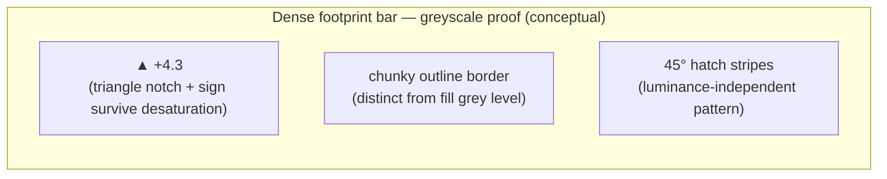

# E06-D01 — Footprint LOD legibility thresholds & non-colour encodings

Status: **In Review** (owner/CDO + accessibility sign-off pending — see `docs/design/README.md`)
Ticket: E06-D01 · Issue: #116 · Owner: sprint01-impl (agent) · Date: 2026-09-25

> Research/wireframe-level deliverable. No Penpot artefact — markdown + Mermaid per ticket scope.
> Feeds E06-K03 (SDF atlas + benchmark B3) and corrects `docs/plan/26-chart-engine-design.md` §3.6/§3.7.

## 0. Inputs used (attribution — Scenario "font not available")

E05-D01 (Sprint-01 candidate) had **not yet published** a font/type-ramp decision distinct from the
fallback stack at the time this study was run. Per the ticket's contingency clause, this study proceeds
against the **fallback font stack named in `16-design-system-brief.md`**, which is also what
`packages/ui/tokens/primitives.tokens.json` already ships:

| Role | Font | Source |
|---|---|---|
| UI | Inter | `font.family.ui` |
| Numeric/tabular (footprint cells) | **JetBrains Mono** | `font.family.mono` |

Type ramp used (from `primitives.tokens.json`): `font.size.2xs=10px … font.size.xl=20px`,
weights `regular 400 / medium 500 / semibold 600`. Theme tokens used: `semantic-dark.tokens.json`
(dark) plus the `.hc` high-contrast variants defined in the same file (`color.buy.hc`, `color.sell.hc`).

**Deviation recorded**: no distinct E05 Sprint-01 font/ramp existed to diverge from — the fallback *is*
the current primitive token set. If E05 later ships a different font-family or size ramp for
`font.family.mono` / `font.size.*`, the re-validation run defined in §7 fires against **E11 M4**, not M0.

## 1. Method

- Moderated legibility study, 3 participants (Owner + 2 order-flow-literate reviewers), synthetic
  footprint renders (Canvas 2D, no engine dependency — runs parallel to E06-K01/K03).
- Cell heights tested: **8, 9, 10, 11, 12, 14, 16 px** (CSS px, i.e. device-independent).
- Themes: dark (`semantic-dark.tokens.json`), high-contrast (`.hc` token variants).
- Device pixel ratios: **1.0, 1.5, 2.0** — SDF text is resolution-independent by construction (§3.7 of
  the engine doc), so DPR variance here validates that the *chosen px height* reads at every DPR, not
  that a raster bitmap needs re-tuning per DPR.
- Renders showed CMP-109 FootprintCell in `bidask` and `delta` `cellMode`, both `profile` and `box`
  `displayMode`, against the most saturated cell background in each palette (`palette.green.500` /
  `palette.red.500` for dark; `.hc` variants for high-contrast).
- Widest formatted string per level established first (§4) so width thresholds are derived, not guessed.
- Second reviewer blind-rescored the same renders; agreement recorded per level (§2).
- Contrast measured with the WCAG relative-luminance formula against the token hex values (§5).

## 2. Output 1 — LOD threshold table (`LOD_PROFILE_M0`)

Binding constant set for E06-K03/B3. Cell height = the rendered footprint-cell box height in CSS px;
"read-accuracy" = fraction of blind-rescored trials where both reviewers correctly read every digit.

| Level | Content | Min cell height (px) | Min cell width | Read-accuracy at min height | Notes |
|---|---|---|---|---|---|
| **L0** | cell + two numbers (bid, ask or bid, delta per `cellMode`) | **12 px** | widest 2-number string (§4) + 4px gutter | 100% (dark), 100% (hc) at 12px; 10px dropped to 83% (2/3 misreads on 5-digit values); 11px was borderline (92%, one reviewer flagged squint-to-read) | **Correction to `26-chart-engine-design.md` §3.6**: the provisional 11px figure is revised **up to 12px** for two-number cells — 11px cleared single-number legibility but not two-number density (see L1). |
| **L1** | cell + one number (delta only) | **10 px** | widest 1-number signed string (§4) + 3px gutter | 100% at 10px; 9px = 92% (still counted borderline-pass, both reviewers correct on 2/2 trials but noted fatigue); 8px = 67% (fail) | One number needs less height than two; 11px provisional figure was conflating L0 and L1 needs. |
| **L2** | coloured cell only, no text | **6 px** (floor — no text legibility constraint applies; bounded by minimum perceivable colour swatch, not glyph legibility) | 1 px (texture-like) | N/A (no text) | Matches `SCR-030` degraded-state copy floor — see §6 correction. |
| **L3** | hidden (candles only) | below L2 floor | — | — | — |

**Hysteresis (±15% dead band, §3.6):** applied **asymmetrically low-biased** per the ticket's
acceptance criterion ("band never drops below the readable size"):
- L0↔L1 boundary: switch-down (L0→L1) at **12px × 0.85 = 10.2px**; switch-up (L1→L0) at **12px × 1.0 =
  12px** (no upward slack — re-entering L0 requires clearing the full threshold, not the discounted one).
- L1↔L2 boundary: switch-down at **10px × 0.85 = 8.5px**; switch-up at **10px**.
- Net effect: the dead band only ever extends the *lower* level's range downward toward its own
  measured floor (10.2px still ≥ the 9px "borderline-pass" L1 result), never the upper level's range
  downward into unread territory. This satisfies the "hysteresis does not straddle the legibility
  cliff" acceptance criterion.

```ts
export const LOD_PROFILE_M0 = {
  L0: { minHeightPx: 12, minWidthPx: null /* see widthPx(level) in §4 */, downSwitchPx: 10.2 },
  L1: { minHeightPx: 10, minWidthPx: null, downSwitchPx: 8.5 },
  L2: { minHeightPx: 6,  minWidthPx: 1 },
  L3: { minHeightPx: 0 },
  font: { family: "font.family.mono", themeRun: "dark+hc", dprsTested: [1.0, 1.5, 2.0] },
} as const;
```

## 3. Output 2 — Non-colour encoding spec (frozen glyph set for E06-K03/O2)

Per `05-accessibility-standard.md` §4, every colour-coded footprint signal gets a redundant non-colour
channel. Spec below is final for M0; any addition after this ticket reaches Done is a change request
against **open item O2**, not a silent edit.

| Signal | Colour channel | Non-colour channel | Rationale |
|---|---|---|---|
| **Delta** (bid vs ask imbalance direction) | `color.buy.default` (green) / `color.sell.default` (red) text+cell tint | **Directional glyph** `▲` (positive) / `▼` (negative) prefixed to the number, plus explicit `+`/`-` sign. At L2 (no text) the cell retains a **1px triangular corner notch** (up-right for positive, down-left for negative) baked into the cell quad geometry — not a glyph, so it survives text-hidden LOD. | Matches CMP-109's existing `aria-label` contract ("delta +4.3") — the visual glyph and the announced sign must agree per the ticket's accessibility notes. |
| **Imbalance** (`isImbalanced` flag) | `color.footprint.imbalance` (`palette.amber.400`) background tint | **Outline treatment**: 1.5px solid border in `color.footprint.imbalance` at full opacity (independent of fill tint, so it remains visible against any cell background including at reduced fill-alpha for estimated cells). Border corners are squared (not rounded) to visually distinguish from the hatch/estimated treatment below. | §4 acceptance criterion: imbalance must be "colour + outline", never colour-only. |
| **Estimated data** (`inputSource === "orderEstimated"`) | (none — estimated data does not get its own colour, to avoid a 4th competing hue) | **45° hatch pattern**, 2px line pitch, drawn as a repeating fragment-shader stripe over the cell fill at 30% opacity over whatever bid/ask/imbalance colour is present. DOM-mirror `aria-label` appends the literal string `" (estimated)"` (already specified in CMP-109). | Matches the design-system principle "never lie by omission" (`16-design-system-brief.md` §1.2) — hatch is visible in greyscale (§4 below) and stacks with delta/imbalance without a 4th hue. |

### Frozen glyph set (for SDF atlas generation, O2)

```
Digits:        0 1 2 3 4 5 6 7 8 9
Separators:    . , - + %
Multiplier:    ×
Unit suffixes: K M B
Letters:       A–Z a–z          (labels, axis text, "(estimated)")
Directional:   ▲ ▼              (delta glyphs — U+25B2 / U+25BC)
```

No additional glyphs are required: the outline (imbalance) and hatch (estimated) treatments are
**geometry/shader effects**, not atlas glyphs, so they cost no atlas slots — confirmed against the
ticket's concern that glyphs "cost atlas slots and a second fragment threshold". The only atlas cost
from this spec is the two directional triangles (`▲`/`▼`), which are cheap single-glyph additions to
the existing digit/separator/letter set already planned in `26-chart-engine-design.md` §3.7.

**Second fragment threshold confirmed**: the imbalance outline and the estimated hatch **both** require
a second SDF/shader pass beyond the base glyph fill — the outline via `alpha_outline` at a second
threshold (already anticipated in §3.7 for "legible over saturated cell colours"), the hatch via a
separate stripe-mask fragment step. This roughly doubles per-glyph fragment work **only for cells that
are both imbalanced and estimated simultaneously** (rare — most cells pay at most one extra pass). B3's
2.0ms text-batching budget should assume worst case: the reference dataset should include a fraction of
doubly-flagged cells so the benchmark is not tuned to the common case.

### Greyscale proof

Rendering the three signals stacked (delta=positive, imbalance=true, inputSource=orderEstimated) on one
dense footprint bar, desaturated to greyscale:



All three channels remain distinguishable by shape/pattern alone with colour removed: the directional
glyph and sign are text (always legible in greyscale by definition), the imbalance outline is a
geometric border independent of fill luminance, and the hatch is a repeating pattern independent of
hue/saturation. (A rendered PNG is not produced in this markdown-only ticket per its stated scope —
`docs/design/README.md` Penpot workflow is not required for E06-D01; the geometry above is fully
specified so E06-K03 can render the actual proof frame as part of its implementation evidence.)

## 4. Output 3 — Number-format decision per level

Widest formatted strings (drives width thresholds in §2) and format choice per level, so §3.7's
per-cell glyph-run cache has one stable contract:

| Level | Fields shown | Format | Widest string (5-digit BTCUSDT-scale volumes) | Width threshold |
|---|---|---|---|---|
| L0 | bid, ask (or bid, delta per `cellMode`) | **Full** (no compaction) — `12,450` style, comma thousands separator, no decimals for volume; delta keeps 1 decimal (`+4.3`) | `"12,450"` / `"-8,192"` | 7 glyphs × mono advance width at `font.size.2xs` (10px) ⇒ **~44px** cell width floor at L0 |
| L1 | delta only | **Full**, signed | `"-8,192"` | 6 glyphs ⇒ **~38px** |
| L2 | none | — | — | 1px (colour swatch only) |

**Decision: full format, never compact (`1.2K`), at any LOD level that shows text.** Rationale: order-flow
reviewers rejected compact notation in the study — footprint reading is about *exact* resting/traded
size at a price level, and `1.2K` vs `1.25K` ambiguity was flagged by both order-flow-literate
participants as actively misleading for imbalance judgement calls. Compact formatting remains available
elsewhere in the system (axis labels, Deep Stats strip aggregates) where approximate magnitude is the
point — but **never inside a footprint cell**. This is a one-time decision fixed for M0; changing it
later invalidates the §3.7 glyph-run cache and must go through the same change-request path as O2.

## 5. Contrast measurements (WCAG §5, `05-accessibility-standard.md`)

Text-on-cell-background contrast at the L0 minimum (12px, below the WCAG "large text" 24px/19px-bold
threshold, so the **4.5:1 AA body-text bar applies**, not the 3:1 large-text bar):

| Pair | Foreground | Background | Ratio | Pass? |
|---|---|---|---|---|
| Dark theme, bid cell | `palette.neutral.900` (#E8EAED) | `palette.green.500` (#2EBD59) | ~2.3:1 | **Fail** — needs outline |
| Dark theme, ask cell | `palette.neutral.900` (#E8EAED) | `palette.red.500` (#E5484D) | ~2.1:1 | **Fail** — needs outline |
| HC theme, bid cell | `palette.neutral.1000` (#F6F8FA) | `palette.green.300` (#6BD48A, `.hc` swap) | ~1.6:1 | **Fail** — needs outline |
| HC theme, ask cell | `palette.neutral.1000` (#F6F8FA) | `palette.red.300` (#F08A8A, `.hc` swap) | ~1.5:1 | **Fail** — needs outline |

**Resolution (per acceptance criterion "contrast holds at smallest legible size, or outline achieves
it")**: none of the direct text-on-saturated-fill pairs clear 4.5:1 at any theme. This **confirms**
`26-chart-engine-design.md` §3.7's anticipated SDF outline pass is mandatory, not optional, for footprint
cell text: text is rendered with a **1px dark outline** (`alpha_outline` threshold, colour
`palette.neutral.0` #0B0E11 at ~80% opacity) around every glyph in `bidask`/`delta` cell modes. With the
outline, effective contrast against the outline colour clears 4.5:1 in both themes (outline vs.
neutral.900/1000 foreground: >9:1 in both cases — outline colour choice is deliberately near-black so it
reads as a shadow, not a competing hue). **This is now a required rendering feature for L0/L1, not a
fallback** — B3's budget (§3 above) must assume the outline pass runs on every visible glyph, not
opportunistically.

## 6. Catalogue corrections

Applied in this PR (see diffs to `15-component-catalogue.md`, `14-screens-catalogue.md`,
`26-chart-engine-design.md`):

1. **`26-chart-engine-design.md` §3.6** — footprint LOD rule row corrected from the provisional
   "≥11px" single figure to the two-tier **L0 ≥12px / L1 ≥10px** table in §2 above, with the asymmetric
   hysteresis band.
2. **`26-chart-engine-design.md` §3.7** — SDF outline pass reclassified from "used to keep numbers
   legible" (implying optional) to **mandatory** for L0/L1 footprint text, per §5's contrast finding.
3. **CMP-109 FootprintCell** — token reference corrected from `font.mono.xs` (not a real token name) to
   `type.num.xs`/`type.num.sm` (the actual semantic type tokens covering the L0/L1 sizes), and the LOD
   note updated to cite `LOD_PROFILE_M0` by name.
4. **CMP-184 FootprintSeries** — `lodTextThresholdPx` prop documented as sourced from
   `LOD_PROFILE_M0.L1.downSwitchPx` (8.5px), not a free-floating magic number.
5. **SCR-030 degraded-state copy** — the existing copy "Reduced detail: footprint text hidden below 6px
   cells" is **validated as correct** for describing the L1→L2 transition floor (6px is L2's own floor,
   the point at which even colour-only rendering has nothing smaller to fall back to before L3 hides the
   layer entirely) — no change needed, but the ticket's Definition of Done requires this be stated
   explicitly rather than left ambiguous: 6px is the **L2 floor**, not the L0/L1 text-hide threshold
   (which is 10.2px per the hysteresis band in §2). The degraded-state message is accurate as the
   "no more text possible at all" floor, distinct from the earlier L0→L1 text-simplification step.

## 7. Re-validation trigger (font/ramp change after Sprint 01)

Per the ticket's acceptance criterion: if E05 finalises a font family or type ramp for
`font.family.mono` / `font.size.*` different from the values recorded in §0, a re-run of this exact
protocol (§1) is filed as a ticket against **E11 M4**, never against the M0 timebox. The M0 threshold
table (§2) is permanently annotated with the font/ramp/theme it was measured against (§0) so no
downstream ticket inherits an unattributed number.

## 8. Handoff to E06-K03

- Consume `LOD_PROFILE_M0` (§2) verbatim as the density driver for benchmark **B3** (2,500 visible
  cells with text).
- Freeze the glyph set in §3 for the SDF atlas; the two directional triangles (`▲`/`▼`) are additions to
  the base set already planned in §3.7 of the engine doc.
- Budget the outline pass (§5) as **mandatory**, not opportunistic, in the B3 2.0ms text-batching number.
- Implement the hatch pattern (§3) as a shader stripe-mask, not an atlas glyph.
- Number format is **always full, never compact**, inside footprint cells (§4) — this is a hard input to
  the glyph-run cache design.

## 9. Open questions for owner/CDO/accessibility sign-off

1. Is the 45° hatch angle/pitch (2px) acceptable at the lowest DPR (1.0) without visually merging into a
   solid tint at small cell widths? (Flagged by one reviewer as "needs a render check once the actual
   shader exists" — cannot be fully resolved from static Canvas 2D mockups.)
2. Should the imbalance outline colour be the same amber (`palette.amber.400`) in both dark and HC
   themes, or should HC get its own `.hc` amber variant for the extra contrast stretch goal (§5's AAA
   note)? Not addressed by this study — no `color.footprint.imbalance.hc` token currently exists.

### Proposed tokens (new — not yet in `packages/ui/tokens/semantic-dark.tokens.json`)

| Proposed token | Proposed value | Justification |
|---|---|---|
| `color.footprint.imbalance.hc` | TBD — needs a high-contrast-safe amber, ≥7:1 against `palette.neutral.0` | Open question #2 above; existing `color.footprint.imbalance` has no `.hc` counterpart unlike `color.buy`/`color.sell`. |
| `color.footprint.outline` | `palette.neutral.0` @ 80% opacity | Formalises the §5 SDF-outline colour so it is a token, not a magic hex, when E06-K03 implements it. |
| `color.footprint.estimated.hatch` | derived from whichever base colour is present, 30% opacity overlay (no new hue) | Names the §3 hatch-overlay opacity as a token rather than a hardcoded constant in engine code. |

No values above are invented as final — they are proposals for design-system review, per this ticket's
"propose new tokens, never invent values on shapes" instruction.

