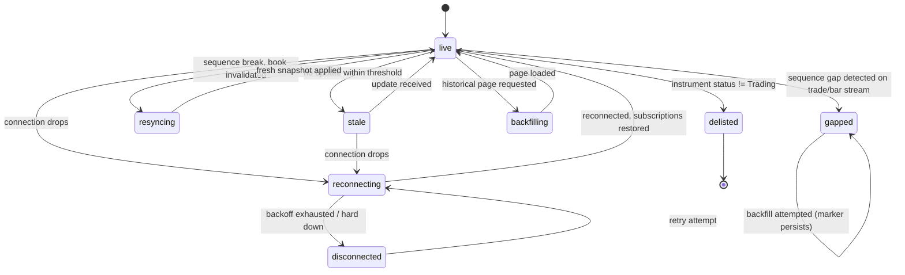

# E08-D01 — Data-confidence vocabulary: research spec & handoff

Kind: research/wireframe-level design ticket (no Penpot required — markdown + Mermaid, per ticket body).
Full findings: `docs/research/findings/E08-data-confidence.md`. This document is the design-facing spec
that E08-D02 (wireframes) and E08-D04 (design-system contribution) consume directly.

## 1. Purpose

Define one shared vocabulary — `live / stale / reconnecting / disconnected / resyncing / gapped /
backfilling / delisted` — for every surface that shows market data whose trustworthiness can lapse
(watchlist `SCR-100`, tape `SCR-053`, DOM ladder + heatmap `SCR-050`, chart price axis / canvas). Today
each screen spec describes its own ad hoc "stale"/"disconnected" wording; this ticket makes the states,
their precedence, their thresholds and their non-colour signal a single source so hi-fi design and
engineering do not reinvent it seven times.

## 2. States (precedence order, highest severity first)

See `docs/research/findings/E08-data-confidence.md` §3 for the full table with backend-detectable
conditions. Summary for design purposes:

1. `delisted` — instrument removed/paused by the exchange.
2. `disconnected` — no connection at all for this data class.
3. `reconnecting` — connection dropped, backoff attempt in flight.
4. `resyncing` — connection healthy, local L2 book re-seeding after a sequence break.
5. `gapped` — a window of trades/bars was missed and (attempted) backfilled; marker persists.
6. `backfilling` — historical data actively loading (not an error).
7. `stale` — connection/book healthy, this specific row hasn't updated within its expected cadence.
8. `live` — baseline, no degraded condition applies.

**Rule:** a surface is in exactly one state — the highest-precedence condition that is true. Never stack
`stale` shading on a row that is part of a `disconnected` outage; show `disconnected` only.

## 3. Data

Each state maps to a plain boolean/enum published by a statechart or a timestamp comparison — never a
per-render interpreter query (C-2.20/C-2.21):

| State | Source |
|---|---|
| `delisted` | Instrument-info cache `status` field |
| `disconnected` / `reconnecting` | Exchange-connection statechart (B-catalogue) |
| `resyncing` | Book-health statechart (B-catalogue), independent of the connection statechart |
| `gapped` | Ingestion gap counter + backfill-attempted flag, persisted per `{topic, windowStart, windowEnd}` |
| `backfilling` | Backfill-in-progress flag + paging progress counter |
| `stale` | `now - lastMessageAgeMs[topic]` vs per-surface threshold (≥2 s for ticker/watchlist cells) |

## 4. Interactions

- State changes are a single flip on enter/exit — no pulsing/flashing motif (rejected treatment, see
  findings §6); respects `prefers-reduced-motion` and stays cheap at 4 Hz+ update rates.
- `disconnected`/`reconnecting`: global banner (SCR-152 pattern) plus per-panel stale shading; `[ Retry
  now ]` action available; trading controls hard-disabled while private feeds are down.
- `resyncing`: **no global banner** — a narrower per-panel treatment only, since the rest of the
  connection may be healthy (decision-log correction #2).
- `gapped`: marker stays on the historical window after backfill completes — it is not a transient toast
  (finding #4); a hover/focus readout states "Reconstructed from REST backfill after a sequence gap."
- `stale`: text chip (e.g. "Stale 4s") is the primary signal; opacity reduction is reinforcing only.

## 5. Hotkeys

None specific to this vocabulary — these are passive status indicators, not interactive controls, except
the existing `[ Retry now ]` / `[ Details ]` actions on the SCR-152 banner (unchanged).

## 6. Accessibility

- Every degraded state carries a non-colour redundant channel: text label (mandatory) + icon (where
  space allows) + opacity (reinforcing only) — colour alone is rejected (findings §6).
- Dimmed/greyed cell text must still meet AA contrast against its dimmed surface (verify token pairs at
  hi-fi time, do not assume dimming preserves contrast).
- Live-region behaviour (see findings §7 for full detail): announce once on entering/leaving a degraded
  state (`role="alert"` for `disconnected`, polite otherwise); never re-announce every tick/attempt;
  collapse flapping within 5 s into one "Connection unstable" announcement.

## 7. Token usage (semantic tokens only — `packages/ui/tokens/semantic-dark.tokens.json`)

No new token values are invented here; states bind to existing semantic tokens:

| State | Text/label | Reinforcing colour |
|---|---|---|
| `live` | `color.text.primary` | — (no chip) |
| `stale` | `color.text.secondary` on `color.surface.sunken` | `color.status.warning.subtle` |
| `reconnecting` / `disconnected` | `color.text.primary` on banner | `color.status.danger.default` (banner), `color.status.warning.default` (per-panel shade) |
| `resyncing` | `color.text.secondary` | `color.status.info.default` |
| `gapped` | `color.text.secondary` | `color.status.warning.subtle` (persistent chip, not danger — it's informational once backfilled) |
| `backfilling` | `color.text.secondary` | `color.status.info.subtle` |
| `delisted` | `color.text.disabled` (struck through, matches existing SCR-100 "Delisted by the exchange" state) | `color.status.danger.subtle` |

### Proposed tokens

None required for this ticket — the existing `color.status.{success,warning,danger,info}.{default,subtle,
strong}` triad and `color.text.*` / `color.surface.*` scales cover every state above. If hi-fi work in
E08-D02..D10 finds a need (e.g. a dedicated `color.status.neutral-degraded` for `resyncing` distinct from
`info`), propose it there against this vocabulary rather than inventing a value on a shape.

## 8. State diagram

Precedence when states could co-occur is resolved by the table in §2 (delisted > disconnected >
reconnecting > resyncing > gapped > backfilling > stale > live) — the diagram shows possible transitions,
not simultaneity.

## 9. Open questions for owner review

1. Should `gapped` markers be clearable by the user (dismiss once acknowledged) or permanent on the
   historical record? Findings favour permanent; flagging for explicit confirmation.
2. Confirm the two catalogue corrections in findings §5 (SCR-100 wording, SCR-152/resync split) before
   they're applied as a follow-up doc PR against `14-screens-catalogue.md`.
3. Reduced sample (Owner + 2 managers, no external traders) — confirm this is sufficient evidence for
   sign-off per the ticket's "Sessions cannot be recruited" scenario, or require a follow-up round.

## 10. Definition of Done tracking

- [x] Findings report at `docs/research/findings/E08-data-confidence.md`.
- [x] Vocabulary + precedence table (this doc §2, findings §3).
- [ ] CDO sign-off comment recorded (pending — Status stays In Review until then).
- [x] Handoff comments recorded on E08-D02 and E08-D04 (see PR description).
- [x] Corrections to `14-screens-catalogue.md` raised (findings §5) — not applied in this PR, tracked as
      a follow-up doc PR pending owner confirmation (open question #2).
- [x] Validity limitations stated (findings §1); participant consent noted (private research area).
