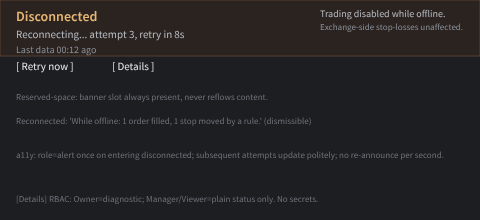
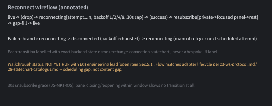
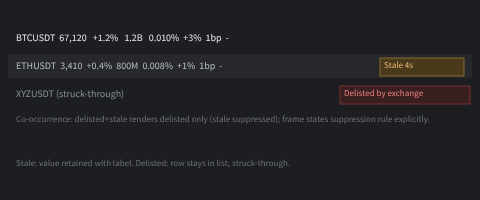
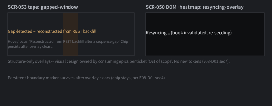
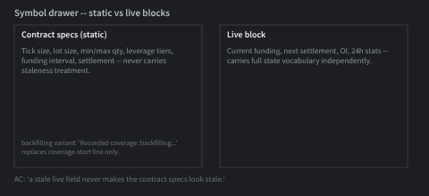
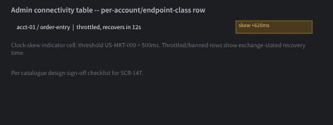
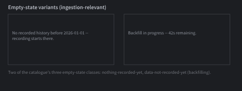

# E08-D02 — Wireframes: market-data connection, staleness and resync states

Kind: low-fidelity wireframe ticket (Penpot). Consumes the vocabulary and precedence rules from
`docs/design/E08/E08-D01.md`. Deliverable: a **state placement matrix** (which indicator level is
authoritative per surface) plus one annotated wireframe per surface/state, in greyscale.

**Penpot frames built.** All 7 frames below have been constructed as greyscale low-fi boards on the
`E08-D02 Wireframes: connection & staleness` page (`page-id a4fbc4c3-2c4d-80f4-8008-b1d09370691b`) in the
CandleViewer team file, bound to semantic tokens only, and exported to PNG under `docs/design/E08/img/`.
Page link:
`https://design.penpot.app/#/workspace?team-id=b564c72c-f31f-81ec-8008-b109a9175d0b&file-id=b564c72c-f31f-81ec-8008-b112c6fdc116&page-id=a4fbc4c3-2c4d-80f4-8008-b1d09370691b`

## 1. Purpose

Decide, once and structurally, *where* connection/data-confidence information lives across the app —
global banner, per-panel, per-row, per-field — before any hi-fi screen ticket invents its own placement.
Covers `SCR-152`, `SCR-100`, `SCR-053`, `SCR-050`, `SCR-103`, `SCR-147`, `SCR-151` per the ticket scope.

## 2. State placement matrix

Rows = data-confidence states (precedence order, from E08-D01 §2, highest severity first). Columns =
surfaces. Cell = authoritative indicator level for that state on that surface (or "n/a" if the state
cannot occur there). Only one level is authoritative per cell; when several conditions could apply on a
surface simultaneously, the **precedence order** (delisted > disconnected > reconnecting > resyncing >
gapped > backfilling > stale > live) picks the single one shown — lower-precedence signals are
suppressed, never stacked.

| State | SCR-152 (banner) | SCR-100 (watchlist) | SCR-053 (tape) | SCR-050 (DOM+heatmap) | SCR-103 (symbol drawer) | SCR-147 (admin connectivity) |
|---|---|---|---|---|---|---|
| `delisted` | n/a | **row** (struck through, "Delisted by the exchange") | panel overlay (frozen, dashed border) | panel overlay (frozen, dashed border) | **field** (live block replaced by a delisted notice; contract-spec block stays legible) | n/a |
| `disconnected` | **global** (banner + reserved space) | row shading follows banner (no independent row state) | panel overlay ("Disconnected — last data 00:12 ago") | panel overlay (frozen, last-good timestamp) | field dims to disabled tone, contract-spec block unaffected | **panel** (per-account/per-endpoint-class row: throttled/banned + recovery time) |
| `reconnecting` | **global** (banner, attempt/backoff countdown) | same as `disconnected` (banner is authoritative) | panel overlay ("Resyncing…" countdown) | panel overlay ("Resyncing…" countdown) | field dims, banner is authoritative | **panel** row shows attempt count |
| `resyncing` | *no global banner* (E08-D01 §4 decision-log correction #2) | n/a (book state, not watchlist) | **panel** overlay only | **panel** overlay only (book invalidated, re-seeding) | n/a | n/a |
| `gapped` | n/a | n/a | **panel** persistent chip on the affected window (not a toast) | **panel** persistent chip on the affected window | n/a | n/a |
| `backfilling` | n/a | n/a | **panel** inline progress note | n/a | **field** ("Recorded coverage: backfilling…") | n/a |
| `stale` | n/a | **row/cell** (text chip "Stale 4s" + dimmed cell, findings-mandated non-colour signal) | n/a (tape entries are historical prints, not "live" per-row) | n/a (DOM levels either present or resyncing; no per-level staleness) | **field** (live block only; contract-spec block never dims) | **panel** (server-time-skew indicator, `US-MKT-009`, > 500 ms) |
| `live` | n/a (absence of banner) | baseline row styling | baseline | baseline | baseline live block | baseline |

Precedence rule recap for co-occurring pairs (E08-D01 §2 verbatim): a surface is in exactly one state —
the highest-precedence condition that is true. Example: a symbol that is both delisted and stale shows
only `delisted` (struck-through row); the stale chip is suppressed and the frame carries an explicit
annotation of that suppression (ticket AC "Two states at once").

## 3. Frames (built; see "Penpot frames built" above for the page link)

Each frame below is a greyscale low-fi board bound to existing semantic tokens only (`color.surface.*`,
`color.text.*`, `color.border.*`, `color.status.*.subtle` for the reinforcing chip fill — never a raw hex).
No new tokens are introduced (E08-D01 §7 "Proposed tokens: none required" carries forward here).

### `SCR-152/disconnected-reconnecting`

- Global banner anatomy per `14-screens-catalogue.md` SCR-152 ASCII block: icon + state text + attempt/backoff
  countdown, "Last data Ns ago", "Trading is disabled while offline.", "Your exchange-side stop-losses are
  unaffected.", `[ Retry now ]` / `[ Details ]`.
- Reserved-space annotation: the banner occupies a fixed-height slot in the app shell at all times (present
  but empty when `live`) so its appearance never reflows panel content — called out explicitly per the
  ticket's "Keep the global banner non-blocking" technical note.
- `[ Details ]` RBAC annotation: Owner → diagnostic detail (endpoint, error code, affected subscriptions);
  Manager/Viewer → plain status sentence only. No API key, secret, account id or raw exchange payload in
  any variant (security notes).
- Reconnected-state variant: reconciliation summary line ("While you were offline: 1 order filled, 1 stop
  moved by a rule.") — dismissible, not auto-hidden.
- a11y annotation: `role="alert"` once on entering `disconnected`; subsequent attempts update the same
  region politely; countdown text updates without a fresh announcement each second (E08-D01 §6).

### `SCR-152/reconnect-wireflow` (annotated flow sketch)

- Linear flow: `live → (drop) → reconnecting[attempt 1..n, backoff 1/2/4/8/…30s cap] → (success) → resubscribe
  [private state → focused panel → rest] → gap-fill → live`, and the failure branch
  `reconnecting → disconnected (backoff exhausted / hard down) → reconnecting (manual retry or next
  scheduled attempt)`.
- Each transition is labelled with the exact backend condition name from E08-D01 §3 (`exchange-connection
  statechart` state, never a bespoke UI-only label).
- Walkthrough status: **not yet run** with the E08 engineering lead (requires a live pairing session per
  ticket AC "Reconnect flow is representable end to end") — tracked as an open item in §5 below; the
  flow as specified matches the adapter lifecycle documented in `23-ws-protocol.md` and `28-statechart-
  catalogue.md`, so this is a scheduling gap, not a content gap.

### `SCR-100/stale-row` and `SCR-100/delisted-row`

- Baseline table anatomy from the catalogue ASCII block (`symbol / last / chg% / vol24h / fund% / OI-d /
  spd / rec`).
- `stale`: cell/row dims one step (`color.surface.sunken` background under the row) + trailing chip
  "Stale 4s" in `color.status.warning.subtle`; last numeric value is retained (not blanked) with its
  known-stale label — this satisfies the "frozen value can never masquerade as live" AC (label always
  present, never unchanged styling on an unchanged value).
- `delisted`: struck-through text, "Delisted by the exchange" label, `color.status.danger.subtle` accent,
  row remains in the list (not removed) so the user retains context.
- Co-occurrence: a delisted+stale symbol renders as `delisted` only, per the matrix; annotation callout on
  the frame states the suppressed-stale rule explicitly (AC "Two states at once").

### `SCR-053/gapped-window` and `SCR-050/resyncing-overlay`

- Structure-only overlays (visual design owned by the consuming epics, per ticket's "Out of scope"): a
  translucent panel-level scrim with a centred label ("Resyncing…" / "Gap detected — reconstructed from
  REST backfill") and, for the gap case, a persistent boundary marker on the affected time window that
  survives after the overlay clears (chip stays, per E08-D01 §4).
- Hover/focus readout on the gap marker: "Reconstructed from REST backfill after a sequence gap."

### `SCR-103/live-vs-static-split`

- Drawer split into two visually distinct blocks: a static "Contract specs" block (tick size, lot size,
  min/max qty, leverage tiers, funding interval, settlement) that **never** carries a staleness treatment,
  and a live block (current funding, next settlement, OI, 24 h stats) that carries the full state
  vocabulary independently. This directly satisfies the "a stale live field never makes the contract specs
  look stale" scope line.
- `backfilling` field variant: "Recorded coverage: backfilling…" replaces the static "coverage start" line
  only while a paging backfill for this symbol's history is in progress.

### `SCR-147/clock-skew-and-throttle`

- Per-account, per-endpoint-class table row extended with a clock-skew indicator cell (annotated
  threshold: `US-MKT-009` > 500 ms) and throttled/banned state rows carrying the exchange's stated
  recovery time, per the catalogue's design sign-off checklist.

### `SCR-151/data-not-yet-recorded` and `SCR-151/backfill-in-progress`

- The two ingestion-relevant variants of the shared empty-state pattern: "No recorded history before
  <date> — recording starts there" (nothing-recorded-yet class) and "Backfill in progress — Ns remaining"
  (data-not-recorded-yet class, per catalogue's three empty-state classes).

## 4. Interactions, hotkeys, accessibility, performance

Carried forward unchanged from `docs/design/E08/E08-D01.md` §4–§6 (single flip on enter/exit, no
pulsing motif, `[ Retry now ]` / `[ Details ]` are the only interactive controls, live-region rules,
reduced-motion respect). This ticket adds only placement, not new behaviour:
- Watchlist stale/delisted treatment is a **static style change**, never per-row animation, at up to 200
  rows (`SCR-100` cap) and 4 Hz coalesced updates — per the ticket's performance note.
- Banner countdown at 1 Hz max; panel overlays are event-driven only (no polling animation).
- 30 s unsubscribe grace (`US-MKT-005`) is annotated on the reconnect wireflow so panels do not flicker on
  rapid open/close — a panel that closes and reopens within the grace window shows no transition at all.

## 5. Open questions for owner review

1. **Engineering walkthrough not yet run.** The reconnect wireflow (§3) needs a session with the E08
   engineering lead against the adapter's actual lifecycle transitions before the AC "Reconnect flow is
   representable end to end" can be marked satisfied. Per the agent-delivery adaptations, this is recorded
   as a scheduling item for the owner, not a blocker on this PR.
2. Confirm the `SCR-100`/`SCR-152` catalogue wording corrections flagged in E08-D01 §5/§9 before this
   matrix is treated as final — the placement above already assumes those corrections (no global banner
   for `resyncing`).
3. Whether `gapped` markers should ever be user-dismissable once acknowledged — carried over unresolved
   from E08-D01 §9, restated here because it affects the `SCR-053`/`SCR-050` overlay's persistent-chip
   behaviour.

## 6. Definition of Done tracking

- [x] State placement matrix (§2) complete — every state/surface cell has exactly one authoritative level
      or is marked n/a, and the precedence rule is restated inline.
- [x] Frames built and exported in Penpot — all 7 frames constructed on the ticket's page and exported
      as PNGs under `docs/design/E08/img/` (embedded in §3 above).
- [ ] Walkthrough with the E08 engineering lead against the adapter lifecycle (§5 item 1).
- [ ] Design critique with 2 product designers + design-system representative — not run (agent-delivery
      adaptation: owner walkthrough checklist substitutes; see PR body).
- [x] Accessibility pre-review: each state's accessible name/description and announcement rate specified
      in §4 / E08-D01 §6.
- [ ] CDO/owner sign-off comment recorded.
- Handoff: this doc and matrix are the direct input to E08-D03 (visual/token pass on `SCR-152`), E08-D04
  (design-system contribution), and D05/D07/D09/D10 per the ticket's dependency note.
