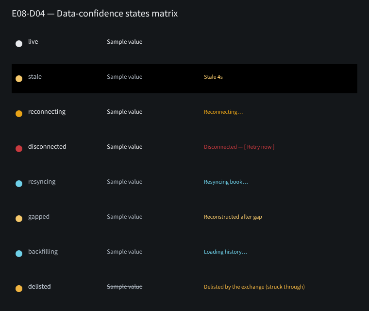

# E08-D04 — Design-system contribution: data-confidence tokens, states and badges

Token/catalogue contribution below, plus the Penpot frames in §8, are complete for this PR.

## 1. Purpose

Publish the `live / stale / reconnecting / disconnected / resyncing / gapped / backfilling / delisted`
data-confidence vocabulary (`docs/design/E08/E08-D01.md`) as design-system tokens and catalogued
components/variants, so every consumer (`SCR-152`, `SCR-100`, tape, DOM, chart series, CVD, positions)
binds to one source instead of re-implementing the styling per screen (`02-definition-of-ready-done.md`
§3.1 — no ad hoc components).

## 2. Deliverables (this PR)

- **Tokens**: `color.data-confidence.<state>.{text,indicator,surface?}` added to
  `packages/ui/tokens/semantic-{dark,light,hc}.tokens.json` (dark is source of truth; light/hc derive by
  re-mapping the same names, per `16-design-system-brief.md` §2). No new primitive values — every alias
  resolves to an existing `color.status.*` / `color.text.*` / `color.surface.*` token (`E08-D01` §7's
  "no new tokens required" decision, made explicit and named per-state here).
- **`16-design-system-brief.md`** — new §2.1a documenting the group, precedence rule and the
  estimated/data-confidence non-merge rule.
- **`15-component-catalogue.md`** contributions:
  - **CMP-028** Callout/Banner — `tone="connection-reconnecting"|"connection-disconnected"` variants
    (SCR-152 banner), never rendering raw exchange error text.
  - **CMP-227** EstimatedBadge — composition contract with the new FreshnessMarker confirmed (see §4).
  - **CMP-239 FreshnessMarker** (new atom, ID allocated by this ticket) — the per-value freshness marker
    for CMP-161 WatchlistRow, CMP-036 KeyValueRow live fields, tape/DOM cells; pure CSS-class render, no
    extra DOM node per cell.
  - **CMP-026** EmptyState — `variant="backfill-in-progress"` added; `variant="recording-not-started"`
    confirmed unchanged.
- **States matrix**: see §3.
- **Contrast proof**: `packages/ui/tokens/tests/verify_tokens.py` extended with an automated WCAG check
  over every `data-confidence` text/indicator pair in all 3 themes (AA 4.5:1 text, 3:1 non-text) — run:
  `python packages/ui/tokens/tests/verify_tokens.py` → `OK: 3 themes resolved, 858 token instances, zero
  unset variables, all contrast checks pass.`

## 3. States matrix

| State | Text token | Indicator token | Surface token | Chip text | Live-region behaviour |
|---|---|---|---|---|---|
| `live` | `color.data-confidence.live.text` | `color.data-confidence.live.indicator` | ambient | — (no chip) | none |
| `stale` | `color.data-confidence.stale.text` | `color.data-confidence.stale.indicator` | `color.data-confidence.stale.surface` (`color.surface.sunken`) | "Stale 4s" | none (visual only) |
| `reconnecting` | `.reconnecting.text` | `.reconnecting.indicator` | banner (CMP-028) | "Reconnecting…" | `role="status"` polite |
| `disconnected` | `.disconnected.text` | `.disconnected.indicator` | banner (CMP-028) | "Disconnected — [ Retry now ]" | `role="alert"` assertive |
| `resyncing` | `.resyncing.text` | `.resyncing.indicator` | ambient (no global banner) | "Resyncing book…" | polite, per-panel only |
| `gapped` | `.gapped.text` | `.gapped.indicator` | ambient | "Reconstructed after gap" | none (persistent chip) |
| `backfilling` | `.backfilling.text` | `.backfilling.indicator` | ambient / CMP-026 | "Loading history…" | none |
| `delisted` | `.delisted.text` | `.delisted.indicator` | ambient | "Delisted by the exchange" (struck through) | none |

Precedence (highest wins, never stacked): `delisted > disconnected > reconnecting > resyncing > gapped >
backfilling > stale > live` (`E08-D01` §2).

## 4. Estimated vs stale/gapped composition rule

`estimated` (CMP-227) and any data-confidence state are different claims — "derived, not raw" vs "not
current" — and are never merged into one chip. CMP-227 renders first (leftmost); CMP-239 FreshnessMarker
renders after it with a ≥4px gap; each keeps its own accessible name so a screen reader announces both in
sequence ("Estimated, low confidence. Stale, 4 seconds."). See the CMP-227/CMP-239 catalogue entries for
the binding contract.

## 5. Accessibility

- Every non-`live` state carries a mandatory text label; colour/opacity are reinforcing only (never sole
  signal) — `05-accessibility-standard.md` non-colour-encoding rule.
- `disconnected` is the only state using an assertive (`role="alert"`) announcement; all others are
  polite or silent, to avoid alert fatigue on transient/degraded-but-not-critical states.
- Flapping reconnect attempts within 5s collapse into a single "Connection unstable" announcement
  (CMP-028 contract) rather than one announcement per attempt.
- Every `data-confidence` text/indicator pair is contrast-verified programmatically (see §2); no manual
  waiver path — a failing pair is a defect, corrected before merge.

## 6. Escalation process for an undefined state

A later epic that needs a data-confidence state not in this set of eight raises a design-system change
request against `CMP-239` / `16-design-system-brief.md` §2.1a (ticket comment or a new scoped `E08-D*`
ticket) — it must not add a local one-off variant on a consuming screen (`02-definition-of-ready-done.md`
§3.1). The precedence table in `E08-D01` §2 is the single source for state ordering and is updated in the
same change.

## 7. Token usage / machine-readable export

The token JSON files themselves (`packages/ui/tokens/semantic-{dark,light,hc}.tokens.json`) are the
machine-readable export — the web app consumes them directly (Style Dictionary pipeline,
`16-design-system-brief.md` §11); nothing here is transcribed separately.

## 8. Penpot artefacts

Page: **`E08-D04 Data-confidence tokens & badges`** —
https://design.penpot.app/#/workspace?team-id=b564c72c-f31f-81ec-8008-b109a9175d0b&file-id=b564c72c-f31f-81ec-8008-b112c6fdc116&page-id=a4fbc4c3-2c4d-80f4-8008-b28e3a72f235

- **States matrix** frame (`E08-D04 / states-matrix`, id `a4fbc4c3-2c4d-80f4-8008-b330ba4572cb`) — one row per
  state in §3 (indicator dot, label, sample value, chip text), `stale` shown on its `surface.sunken` band,
  `delisted` sample struck through:
  
- **Composition example** frame (`E08-D04 / composition-example`, id `a4fbc4c3-2c4d-80f4-8008-b33146ae9c60`)
  — CMP-227 EstimatedBadge followed by CMP-239 FreshnessMarker per §4's ≥4px-gap, non-merge rule:
  

**AC note — "Figma/Penpot lint reports zero detached instances":** these two frames are illustrative
token/state swatches (raw shapes styled from the resolved token values), not instances of a Penpot
component, so a detached-instances lint does not apply to them; there is nothing to detach. The instance
contract that AC guards against (a hi-fi frame re-styling a state locally instead of consuming CMP-028 /
CMP-239) is enforced structurally by §6's escalation process and by `verify_tokens.py`'s per-theme contrast
check (§2) rather than by a component-instance lint on these two swatch frames. No CMP-028/CMP-239 Penpot
components exist yet to detach from — they are catalogued here (§2) as the binding contract; the first
consumer hi-fi ticket that builds actual component instances (e.g. a future SCR-152/SCR-100 pass) is where
the detached-instances lint first has something to check, and that ticket's PR is the place to run it.

## 9. Sign-off

Per `docs/design/README.md` and the ticket's Agent-delivery adaptations: owner approval = owner comments
`approved` on issue #125 or merges the PR. No separate CDO/accessibility-specialist countersignature exists
in this delivery model; this is recorded here rather than blocking on it.
