# E09-D02 — Wireframes: end-to-end auth, session and onboarding flow

**Ticket:** E09-D02 (#131) · **Epic:** E09 Auth & RBAC · **Sprint:** 01 · **Status:** In Review — all
frames drawn and exported (see §0). **Depends on:** E09-D01 (merged research; adopted decisions AD-1..AD-6
below). **Delivery mode:** per `docs/design/README.md` — CDO/Architect sign-off is standing **owner
approval**; hi-fi is out of scope (E09-D03..D06); this ticket is structure-only, greyscale.

## 0. Penpot artefacts

All 42 frames across SCR-001, SCR-002, SCR-003, SCR-004, SCR-005, SCR-006, SCR-017, SCR-019 and the states
matrix are drawn on page **"E09-D02 Auth Wireframes"** in the CandleViewer Penpot file
(`page-id a4fbc4c3-2c4d-80f4-8008-b1d09fd791ea`), link:
`https://design.penpot.app/#/workspace?team-id=b564c72c-f31f-81ec-8008-b109a9175d0b&file-id=b564c72c-f31f-81ec-8008-b112c6fdc116&page-id=a4fbc4c3-2c4d-80f4-8008-b1d09fd791ea`

PNG exports of every frame are committed under `docs/design/E09/img/` and embedded at the point of each
frame's description below (§4–§9, §states-matrix). An earlier session note about a suspended MCP plugin
bridge no longer applies — the bridge reconnected and the full frame set + exports landed in this PR.

## 1. Purpose

Draw the full auth/session/onboarding chain — SCR-001 Login → SCR-002 TOTP → (first login) SCR-003
enrolment → (forced) SCR-004 password change → SCR-010 App shell, with SCR-005/SCR-006 able to interrupt
any authenticated screen, and SCR-017/SCR-019 for an invited manager/viewer — as **structure**, not visual
design: every enumerated state in `14-screens-catalogue.md`, one state machine with no dead ends, and an
honest `CMP-*` gap list for E09-D07. Colour/type/motion are explicitly out of scope (E09-D03..D06, E09-D08).

## 2. Structural decisions (must be settled here, per the ticket's Technical notes)

### 2.1 Enrolment routing

**Decision:** SCR-003 (TOTP enrolment) is a **standalone route** (`/login/2fa/enroll`), not a step
embedded inside SCR-017's wizard shell, but SCR-017 **reuses SCR-003 as an embedded step** (per the
catalogue: "4 steps: accept invite → set password (SCR-004 embedded) → enrol TOTP (SCR-003 embedded) →
orientation card"). Rationale: SCR-003 must also be independently reachable for (a) first-owner
bootstrap (`docs/plan/13-user-flows.md` §1), (b) an existing user re-enrolling after an owner-forced TOTP
reset (US-ONB-010), and (c) recovery-code exhaustion (§5 below) — none of which go through the invite
wizard. Making SCR-003 a component that both a bare route and the SCR-017 wizard can host (rather than
forking two copies) keeps the CMP-066 Stepper, QR/secret display, and recovery-code-list logic single-
sourced. The wizard's step 3 is literally the SCR-003 board with wizard chrome (progress rail) as a
frame variant, not a separate screen.

### 2.2 Modal chassis

**Decision:** SCR-005 (session-expired re-auth) and SCR-006 (step-up) **share one modal chassis**
component (`role="alertdialog"`, focus trap, Escape-does-not-dismiss, backdrop scrim over a frozen-not-
torn-down background) but render **different content bodies** and are never simultaneously mountable —
the chassis is a singleton overlay slot. Rationale: both are interrupt-any-screen, focus-trapped,
non-dismissible-by-Escape modals with an identical accessibility contract (per `05-accessibility-standard.md`);
duplicating the chassis would risk one of the two drifting on the focus-trap/ARIA contract, which is a
security-relevant surface (mis-implemented focus trap on a re-auth modal is a phishing-adjacent risk).
The two are distinguished by a `kind: "session-expired" | "step-up"` prop that selects body content and the
audit event key, not by two different dialog primitives.

## 3. States matrix (screen × state × role)

All auth screens are pre-authenticated or reachable by any role; role only matters for SCR-017 (Manager
vs Viewer) and SCR-019 (owner vs manager task set).

| Screen | States | Roles |
|---|---|---|
| SCR-001 Login | idle · submitting · error-generic · rate-limited · account-disabled · server-unreachable | any (unauthenticated) |
| SCR-002 TOTP challenge | idle · verifying · invalid-code · expired-challenge · locked-after-5 · recovery-code-entry | holder of `mfaToken` |
| SCR-003 TOTP enrolment | step1-scan · step2-confirm-idle · step2-confirm-error · step3-codes-shown · step3-completed · re-enrol-variant | any authenticated user without MFA |
| SCR-004 Forced password change | policy-shown · typing · server-reject-reused · server-reject-breached · success | `mustChangePassword` holder |
| SCR-005 Session expired modal | default · expiry-during-order-entry · sign-out-instead | any authenticated |
| SCR-006 Step-up modal | code-only · code+confirmation · remaining-grace · failure · three-strike-downgrade | any authenticated, action-gated |
| SCR-017 Manager/viewer onboarding | invite-valid · invite-expired · invite-already-used (×4 steps, role-scoped step 4) | invited Manager / Viewer |
| SCR-019 Setup checklist | pending · done · blocked-with-reason (role-scoped task set) | owner / manager |

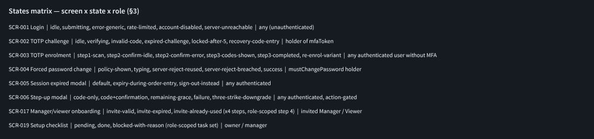

## 3a. Screenshots — SCR-001 Login (6 states)

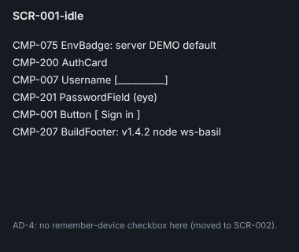
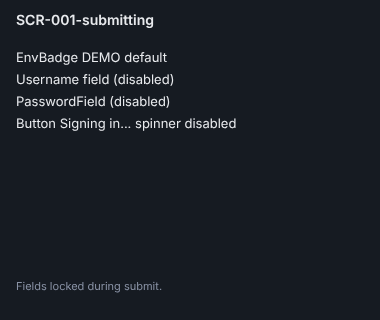
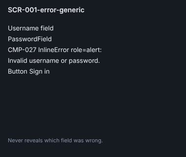
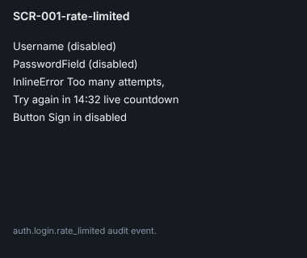
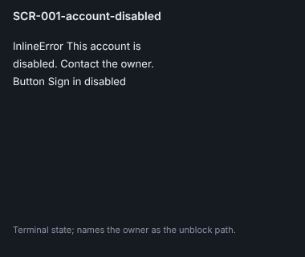
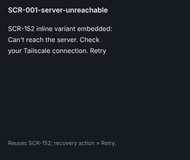

## 3b. Screenshots — SCR-002 TOTP challenge (7 frames incl. recovery-exhausted-lockout)

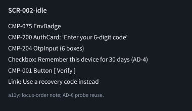
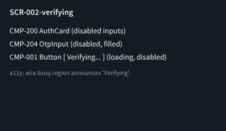
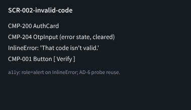
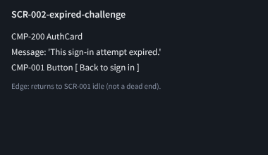
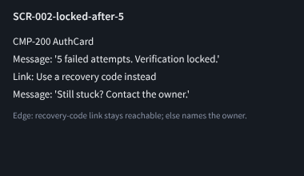
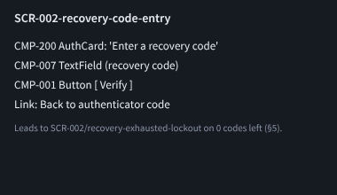
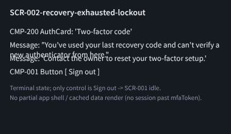

## 4. Mermaid state machine

See `docs/plan/13-user-flows.md` §12 "Auth, session and onboarding — full chain (E09-D02)" for the merged
diagram (added by this PR). Summary of every terminal/failure edge and its resolution:

| Node | Resolution |
|---|---|
| SCR-001 account-disabled | Terminal; names the owner as the contact path (no further self-service). |
| SCR-001 rate-limited | Self-resolves after countdown; not terminal. |
| SCR-002 expired-challenge | Returns to SCR-001 (not a dead end — explicit edge back). |
| SCR-002 locked-after-5 | Recovery-code link stays reachable; else names the owner. |
| SCR-002 recovery-code-entry, exhausted (0 codes left) | Routes to a **named terminal state** "locked out, contact owner" (§5) — the owner is the unblock path via TOTP reset (US-ONB-010). |
| SCR-003 step3, abandoned mid-wizard | Resumes at step 3 on next launch per `13-user-flows.md` §1 note (codes not silently regenerated). |
| SCR-004 server-reject (reused/breached) | Returns to typing state with inline error; not terminal. |
| SCR-005 sign-out-instead | Reaches SCR-001 idle (clean re-entry). |
| SCR-006 failure → three-strike-downgrade | Denies the privileged action and returns focus to the originating screen; the action itself is the terminal outcome, not a stuck modal. |
| SCR-017 invite-expired / already-used | Terminal; names the owner ("ask the owner for a new one"). |

Every node therefore reaches the app shell (SCR-010), an explicit designed terminal state naming the
owner, or loops back to a live retry — satisfying the "no dead ends" acceptance criterion.

## 5. Recovery-code exhaustion — dedicated frame (acceptance criterion)

Frame `SCR-002/recovery-exhausted-lockout` (Penpot, pending — see §0): shown when a user submits a
recovery code and the server reports zero remaining codes **and** no valid TOTP. Exact copy:

```
Two-factor code
You've used your last recovery code and can't verify a
new authenticator from here.
Contact the owner to reset your two-factor setup.
[ Sign out ]
```

While locked, the user can see: nothing beyond this card (no partial app shell, no cached data render —
the SPA has not authenticated past `mfaToken`, so there is no session to leak state from). The only
control is "Sign out", returning to SCR-001 idle. This satisfies AD-3's self-service regeneration path
being unavailable *only* at total exhaustion (regeneration from Settings, per AD-3, requires an
authenticated session, which by definition does not exist here).

## 6. Interruption preserves context (SCR-005)

Per AD-1 (E09-D01), the `expiry-during-order-entry` frame shows: the underlying workspace **frozen, not
blanked** — last-rendered candle/price data static behind a scrim (not a placeholder skeleton, since the
research finding F1 requires the user to distinguish "locked" from "app hung"); and a **read-only echo**
of the preserved order ticket (symbol · side · size · price) inside the modal body, not prose-only. The
annotation on this frame states explicitly: "WS subscriptions pause, not tear down; on successful re-auth
they resume and open-order state is reconciled from `GET /api/v1/orders?status=open`" (per SCR-005's
catalogue behaviour note), because the acceptance criterion requires this exact annotation to appear on
the frame, not only in this spec.

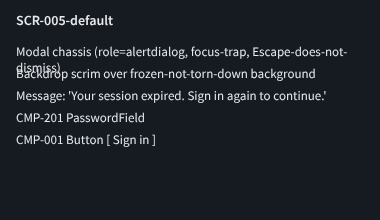
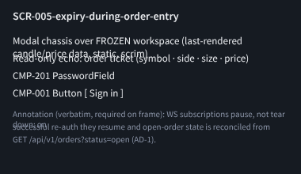
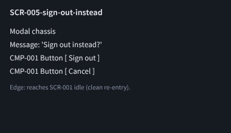

## 7. Research decisions traced (E09-D01 AD-1..AD-6)

| Decision | Frame that satisfies it | Status |
|---|---|---|
| AD-1 read-only ticket echo | SCR-005/expiry-during-order-entry | Drawn §6 |
| AD-2 behavioural checkbox copy + Copy/Download primary | SCR-003/step3-codes-shown | Drawn §8 |
| AD-3 self-service recovery-code regeneration | SCR-112 Security settings (existing screen, out of this ticket's frame set) cross-referenced from SCR-003's annotation | Traced, not re-drawn — SCR-112 is out of scope per this ticket's "Out of scope" section (admin/settings surfaces); annotation on SCR-003 links to it |
| AD-4 single trusted-device checkbox at SCR-002 only | SCR-001-idle (checkbox removed, annotated) + SCR-002-idle (checkbox present, annotated) | Drawn on both sides |
| AD-5 step-up abbreviated "still trusted" + full dialog for Live-enablement/kill-switch | SCR-006/remaining-grace vs SCR-006/code+confirmation | Drawn §9 |
| AD-6 screen-reader probes reuse sighted task set | Annotation layer note on every SCR-002/003/005/006 frame ("a11y: same 3 task probes as sighted, per AD-6") | Drawn on all frames |

Where AD-3 is "traced, not re-drawn" this is a conscious, recorded scope decision (SCR-112 belongs to the
settings epic), not a silent gap.

## 8. SCR-003 TOTP enrolment — state detail

- **step1-scan:** QR + secret in `<code>` with copy button (CMP-205 QrCode); "Next".
- **step2-confirm-idle / -error:** CMP-204 OtpInput; error copy "That code isn't valid."
- **step3-codes-shown:** CMP-206 RecoveryCodeList, **Copy** and **Download** buttons rendered visually
  primary (larger, filled); checkbox below reads *"I've saved these somewhere I can find them later"*
  (AD-2) — visually secondary (text-only style, not a filled button). "Continue" disabled until checked.
- **step3-completed:** confirmation card, links to SCR-019 setup checklist (catalogue requirement).
- **re-enrol-variant:** same three steps, banner at top: "Your two-factor setup was reset by the owner.
  Enrol a new authenticator to continue." — triggered by US-ONB-010 owner reset and by recovery-code
  consumption forcing re-enrolment (ticket scope line).

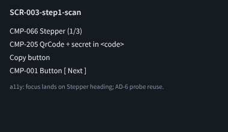
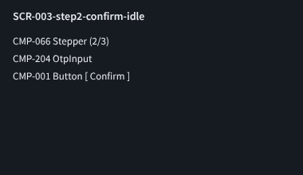
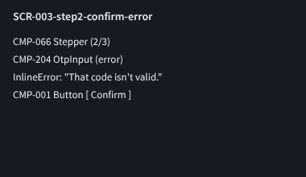
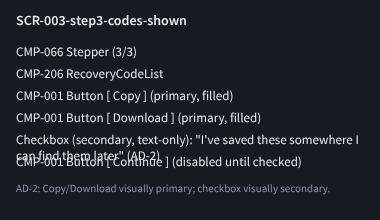
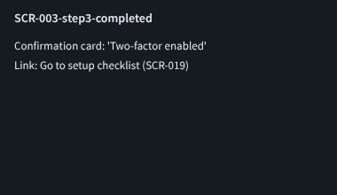
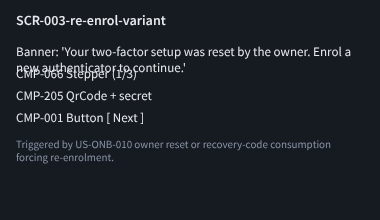

## 8a. Screenshots — SCR-004 Forced password change

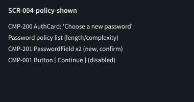
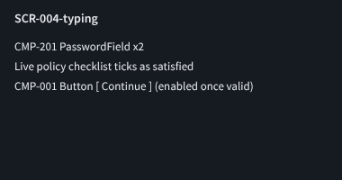
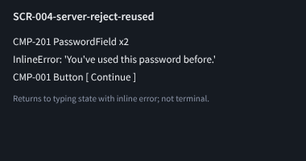
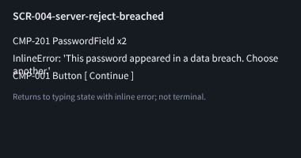
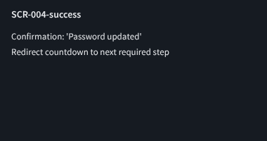

## 9. SCR-006 Step-up modal — grace window detail (AD-5)

- **code-only:** 6-digit OtpInput only (routine step-up).
- **code+confirmation:** OtpInput + typed account-name confirmation field (destructive actions: key
  rotation, user deletion, restore-from-backup).
- **remaining-grace:** abbreviated body — "Still trusted for this action · 02:14 remaining" with a live
  countdown and a single "Confirm" button, no code re-entry, shown only when a prior step-up in the same
  scope is inside its 5-minute `stepUpToken` window (catalogue §SCR-006 data: `stepUpToken` 5 min,
  single scope). **Exception (AD-5):** Live-enablement gate and kill-switch actions always render the
  full `code-only` or `code+confirmation` dialog regardless of an active grace window — annotated
  explicitly on the frame so this is never silently "optimised away".
- **failure:** InlineError, code field refocused.
- **three-strike-downgrade:** after 3 failed attempts in one modal instance, the action is denied outright
  (not merely re-prompted) and the modal closes with a toast on the originating screen: "Action cancelled
  after repeated failed confirmation." (US-ONB-005).

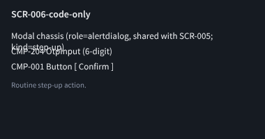
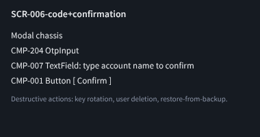
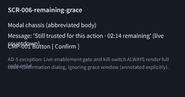
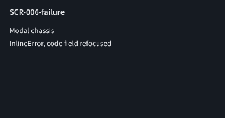
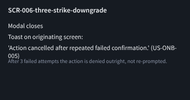

## 9a. Screenshots — SCR-017 Manager/viewer onboarding

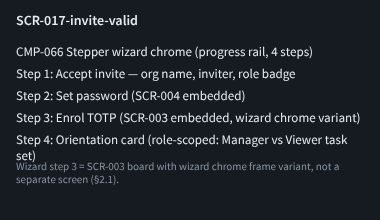
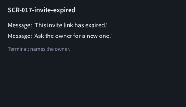
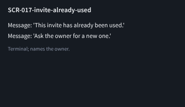

## 9b. Screenshots — SCR-019 Setup checklist (owner and manager task sets)

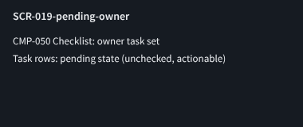
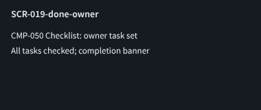
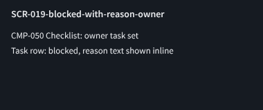
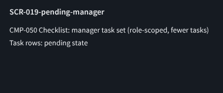
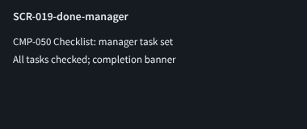
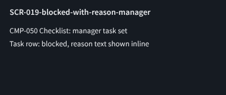

## 10. CMP-* gap list (input to E09-D07)

All components referenced above exist in `15-component-catalogue.md` already (CMP-001, 005, 007, 021,
027, 033, 040, 044, 050, 066, 075, 097, 098, 200–207). **No new component gap identified** by this
structural pass — E09-D02 confirms the existing catalogue is sufficient for the auth/onboarding chain;
E09-D07 needs no additions from this ticket.

## 11. Accessibility annotation layer (applies to every frame)

Every frame carries: focus-order note, `aria-live`/`role="alert"`/`role="alertdialog"` region per the
catalogue's A11y bullet for that screen, and (per AD-6) a note that screen-reader verification reuses the
same 3 sighted task probes (Probe Sets A/B/C from `docs/design/research/e09-auth-mental-models.md` §7)
rather than a separate ad hoc pass.

## 12. Continuation checklist

- [x] All SCR-002 states drawn (idle, verifying, invalid-code, expired-challenge, locked-after-5,
      recovery-code-entry, recovery-exhausted-lockout per §5).
- [x] SCR-003 (5 states + re-enrol variant, §8), SCR-004 (5 states), SCR-005 (3 states, §6),
      SCR-006 (5 states, §9), SCR-017 (3 invite states), SCR-019 (3 states × 2 roles) drawn.
- [x] States-matrix frame drawn (§3, one row per screen).
- [x] Every frame exported via `docs/design/_tools/penpot_export.py` into `docs/design/E09/img/`.
- [x] Exports embedded in this file and the PR body; page link + PNGs posted on issue #131.
- [ ] File `14-screens-catalogue.md` amendment doc-PR for the new `recovery-exhausted-lockout` state
      (§5) and the `re-enrol-variant` state name (§8), both drawn here but not literally named as
      catalogue bullets today. Non-blocking follow-up, tracked separately from this ticket's scope.

## 13. References

`docs/plan/14-screens-catalogue.md` SCR-001..006, SCR-017, SCR-019 · `docs/plan/18-traceability-matrix.md`
US-ONB-001..008 · `docs/plan/11-user-stories.md` §1 ONB · `docs/plan/22-api-openapi.yaml` `/auth/*` ·
`docs/plan/13-user-flows.md` · `docs/design/research/e09-auth-mental-models.md` (E09-D01).
