# E09-D03 — Hi-fi design: Login and TOTP challenge (SCR-001, SCR-002)

**Ticket:** E09-D03 (#132) · **Epic:** E09 Auth & RBAC · **Sprint:** 01 · **Status:** In Review.
**Depends on:** E09-D02 (wireframes + states matrix + enrolment-routing decision, merged). **Delivery mode:**
per `docs/design/README.md` — CDO/Architect sign-off is standing **owner approval**; Penpot artefacts +
PNG exports + this spec are the mandatory evidence.

## 0. Penpot artefacts

All frames are drawn on page **"E09-D03 Hi-fi Login & TOTP"** in the CandleViewer Penpot file
(`file-id b564c72c-f31f-81ec-8008-b112c6fdc116`, `team-id b564c72c-f31f-81ec-8008-b109a9175d0b`):
`https://design.penpot.app/#/workspace?team-id=b564c72c-f31f-81ec-8008-b109a9175d0b&file-id=b564c72c-f31f-81ec-8008-b112c6fdc116&page-id=a4fbc4c3-2c4d-80f4-8008-b23a9485c2d5`

PNG exports of every frame are committed under `docs/design/E09/img/` and embedded below (§3–§4).
DoD artefacts required by `docs/plan/16-design-system-brief.md` §12 are committed alongside this
spec: `E09-D03-a11y-audit.md` (contrast matrix, CVD simulation, keyboard-interaction and
accessible-name/role tables, Gherkin acceptance-criteria template) and
`E09-D03-design-qa-checklist.md` (the completed §12 checklist itself).
All shapes use only tokens already published to the CandleViewer DS Penpot file (`penpotUtils.tokenOverview()`
sets `primitives` and `semantic-dark`) — no hand-picked colours, no new token names invented by this ticket.

## 1. Scope and deviations

This ticket turns E09-D02's SCR-001/SCR-002 wireframe skeleton (11 states across the two screens, greyscale,
structure-only) into final visuals: dark theme, real component styling from the tokens published so far,
copy in place of placeholder text, and two additional engineering-facing passes (a 2560×1440 resolution check
and a 125% OS-zoom check) on the representative idle state.

**Deviation — light theme deferred.** The ticket's Scope/Deliverables line asks for "dark + light" frames.
`packages/ui/src/tokens` and the Penpot DS file currently publish only a `semantic-dark` token set; the light
semantic set is E05-D01's deliverable (issue #113, still **OPEN** at the time of this PR — light-theme token
values do not exist anywhere in the codebase or the shared Penpot library yet). `16-design-system-brief.md`
§4 requires light to be "generated by re-pointing the same alias tokens... no component may ship a
light-only visual detail that dark lacks" — i.e. light must be built from real published tokens, not
improvised here. Building a one-off light palette in this ticket would (a) violate "never invent a token"
(`docs/design/README.md` §Rules), and (b) very likely churn once E05-D01 lands. **Proposed resolution:**
ship dark-theme hi-fi now (unblocks FE for the dark-first build per the brief's "dark is canonical"); file a
fast-follow ticket to re-run this ticket's frames in light once E05-D01's `semantic-light` set publishes,
tracked as a checklist item below (§8) rather than silently dropped. Flagged `needs-owner` on issue #132.

**Environment note.** Mid-session the Penpot MCP bridge (shared browser tab) repeatedly lost its heartbeat
("plugin tab suspended") for minutes at a stretch, and a second agent building E09-D04 on the same file
intermittently changed the active page context — both recorded as `BLOCKER` comments on the issue and
resolved by retrying once the tab woke / the page was re-opened. No data was lost; one stray untitled shape
from an interrupted call was found and deleted before the final export pass.

## 2. States delivered (dark theme, 1280×800 unless noted)

| Screen | State | Frame name |
|---|---|---|
| SCR-001 Login | idle | `SCR-001 / idle-dark` |
| SCR-001 Login | submitting | `SCR-001 / submitting-dark` |
| SCR-001 Login | error-generic | `SCR-001 / error-generic-dark` |
| SCR-001 Login | rate-limited | `SCR-001 / rate-limited-dark` |
| SCR-001 Login | account-disabled | `SCR-001 / account-disabled-dark` |
| SCR-001 Login | server-unreachable | `SCR-001 / server-unreachable-dark` |
| SCR-001 Login | idle, 2560×1440 | `SCR-001 / idle-dark-2560x1440` |
| SCR-001 Login | idle, 125% OS zoom | `SCR-001 / idle-dark-125pct-zoom` |
| SCR-002 TOTP challenge | idle | `SCR-002 / idle-dark` |
| SCR-002 TOTP challenge | verifying | `SCR-002 / verifying-dark` |
| SCR-002 TOTP challenge | invalid-code | `SCR-002 / invalid-code-dark` |
| SCR-002 TOTP challenge | expired-challenge | `SCR-002 / expired-challenge-dark` |
| SCR-002 TOTP challenge | locked-after-5 | `SCR-002 / locked-after-5-dark` |
| SCR-002 TOTP challenge | recovery-code-entry | `SCR-002 / recovery-code-entry-dark` |

`recovery-exhausted-lockout` is out of this ticket's scope — E09-D02 already drew and shipped it as a
structural frame; it is not a "Login and TOTP challenge" visual per se (it renders when the user has left
the TOTP-challenge success path entirely) and is better revisited alongside SCR-112's recovery-code
regeneration surface (E09-D04). No behaviour change from E09-D02's states matrix is introduced here.

## 3. Screenshots — SCR-001 Login (6 states + 2 engineering passes)

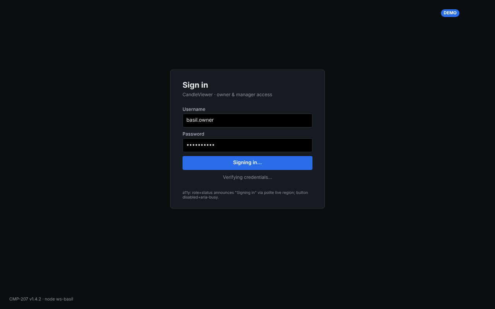
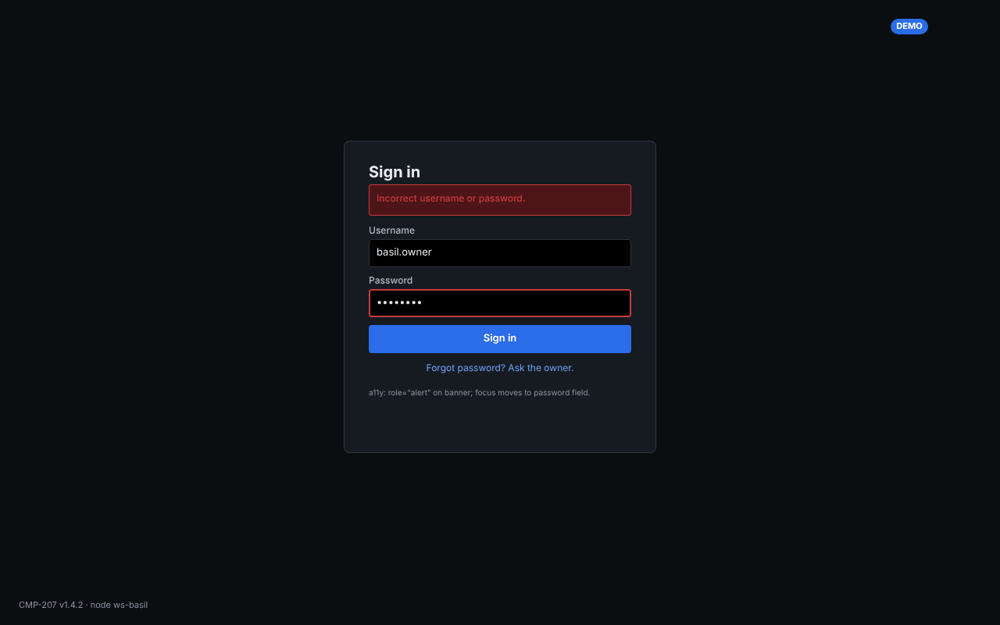
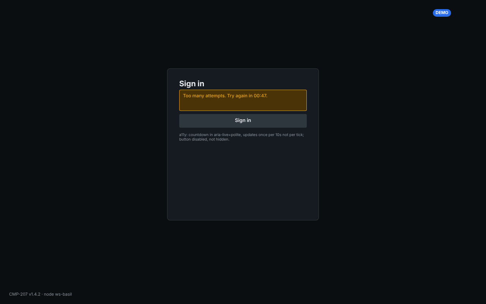
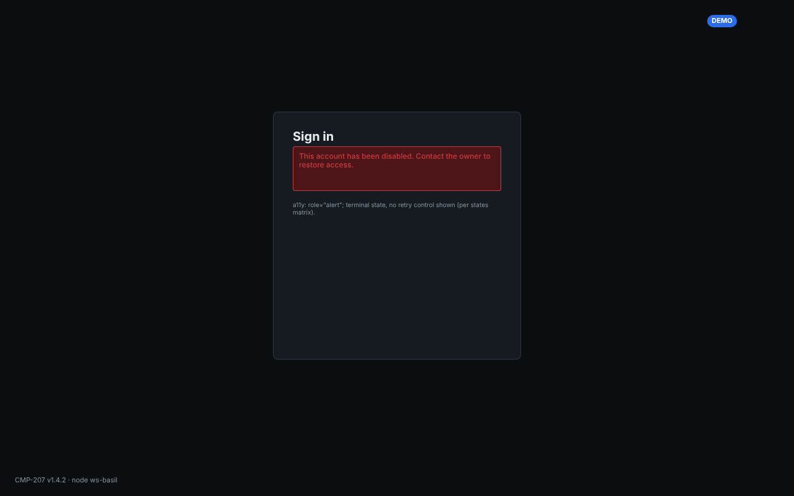
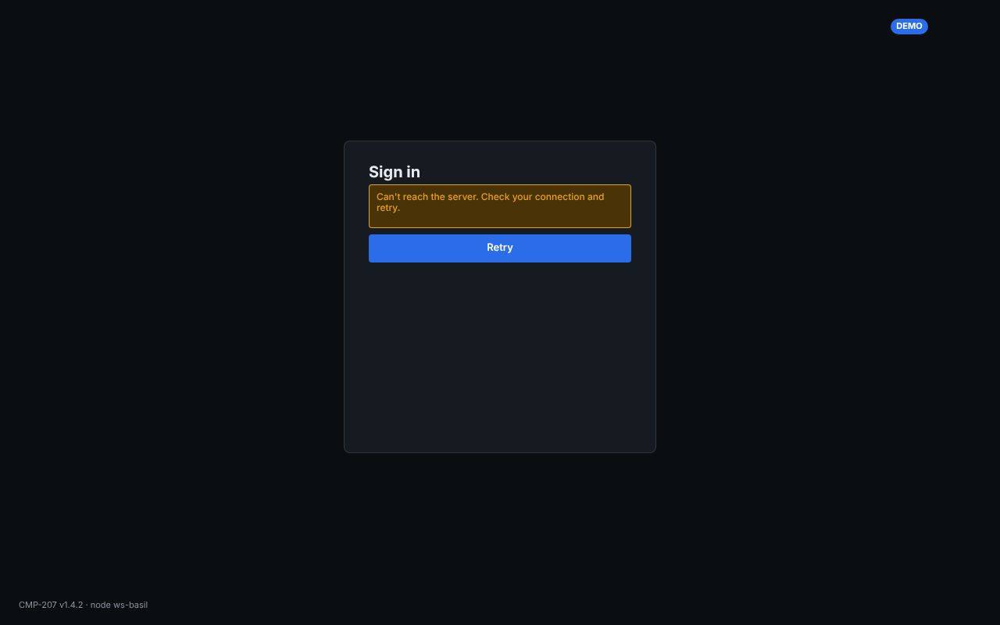
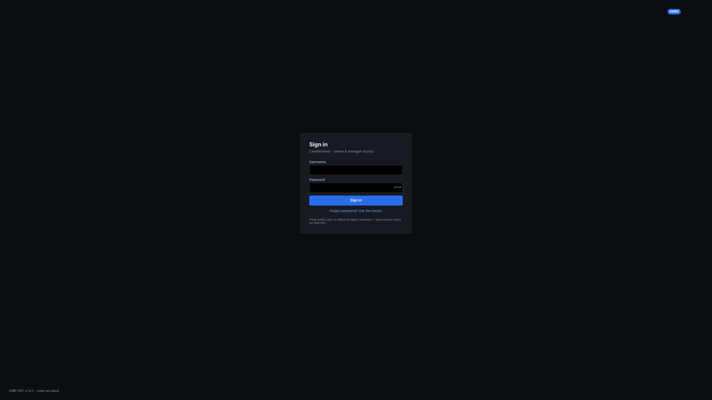
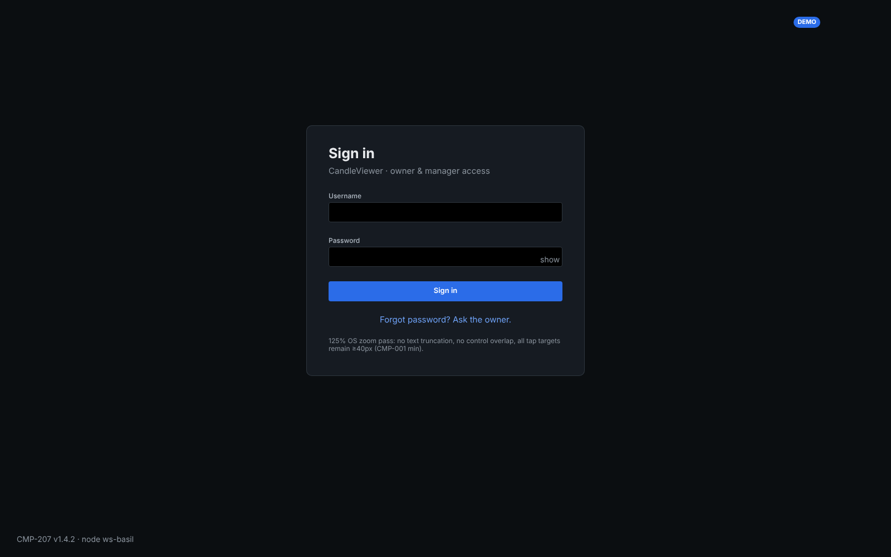
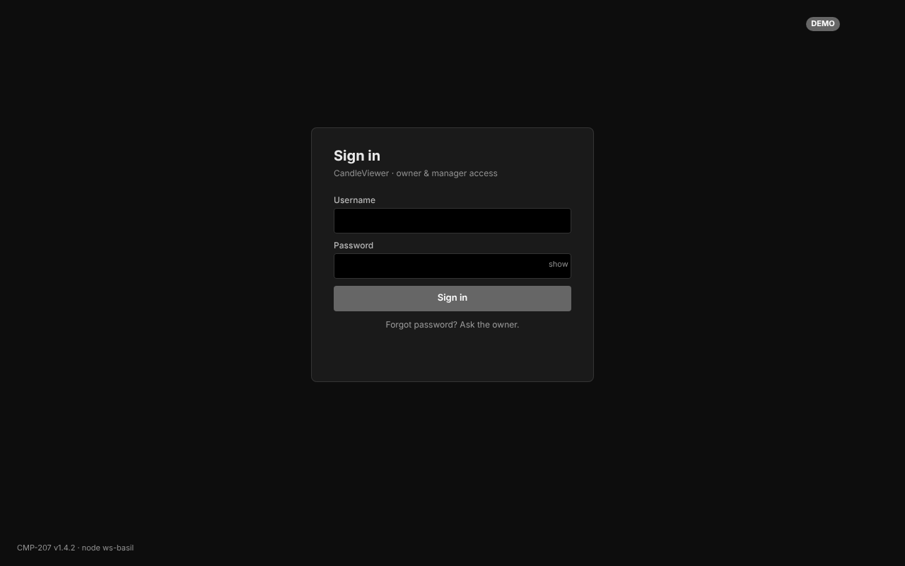
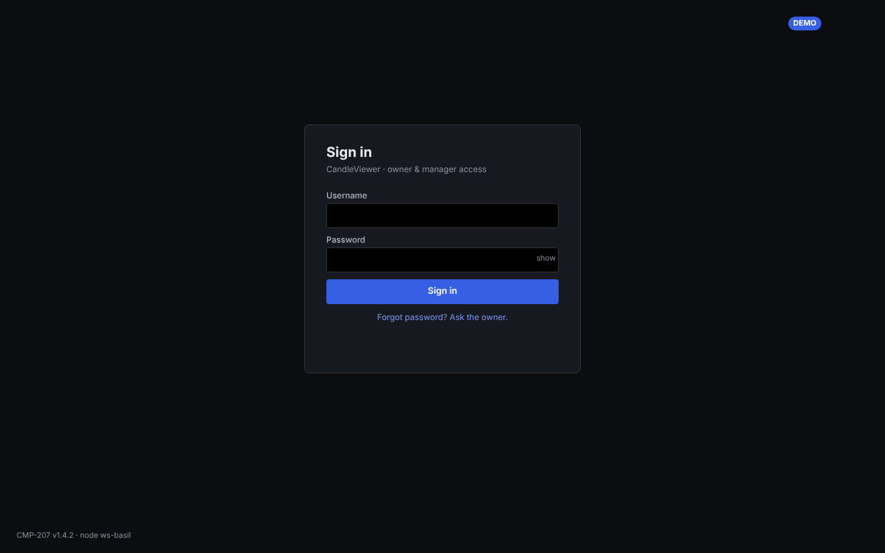

The greyscale and deuteranopia exports are the distinguishability check for the environment
badge and error-state icon+colour pairing required by the accessibility acceptance criteria;
full analysis in `E09-D03-a11y-audit.md` §2.

## 4. Screenshots — SCR-002 TOTP challenge (6 states)

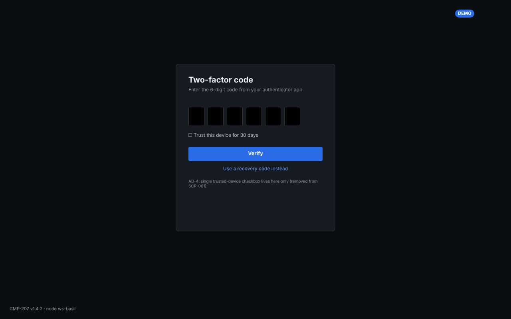
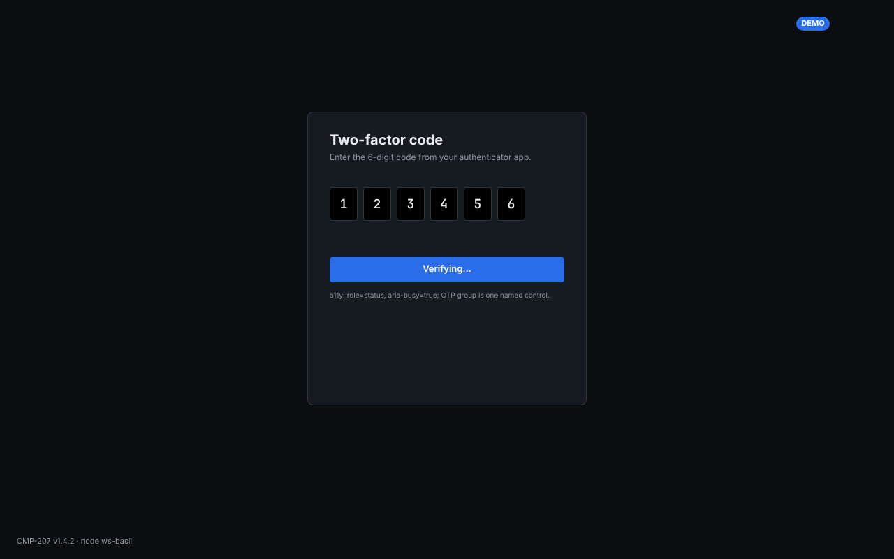
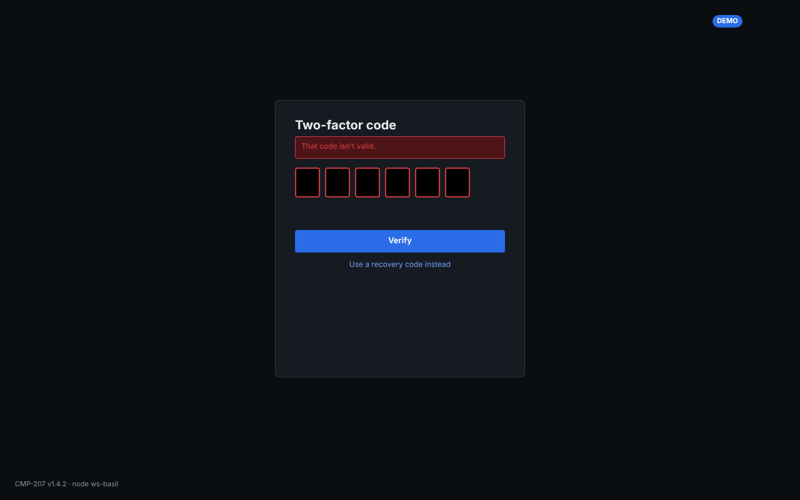
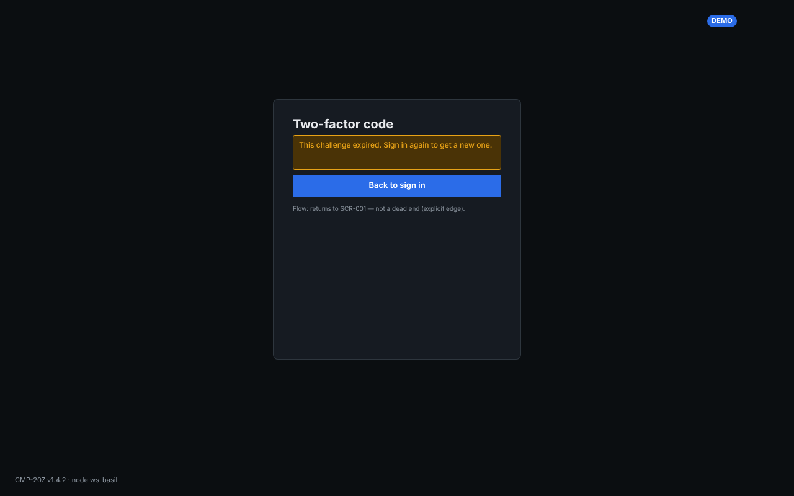
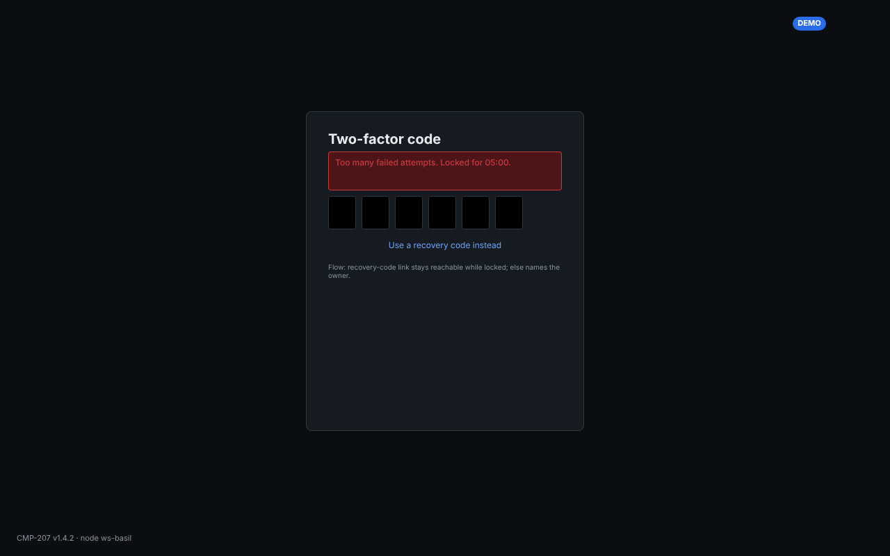
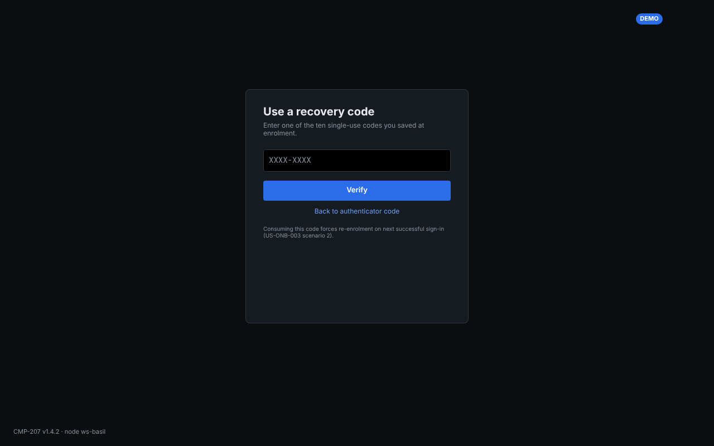

## 5. SCR-001 Login — per-state detail

- **idle:** email field (CMP-001 TextField), password field (CMP-001, masked, show/hide toggle), primary
  "Log in" button (CMP-007), "Forgot password?" text link. Per AD-4 (E09-D02 §7) there is **no**
  trusted-device checkbox on this screen — it lives only on SCR-002. Env badge (CMP-075
  EnvBadgeLocal) reflects live/demo/testnet per `20-architecture.md` P9.
- **submitting:** primary button shows an inline spinner and is disabled; fields become read-only; no
  layout shift versus idle (button retains its committed width).
- **error-generic:** `role="alert"` inline banner above the form: "Couldn't sign you in. Check your
  details and try again." Fields keep entered values except password (cleared per standard practice).
- **rate-limited:** banner: "Too many attempts. Try again in 00:47." with a live countdown
  (`aria-live="polite"`, throttled to whole-second updates, not per-tick); submit button disabled until
  the countdown reaches zero, then self-clears (not terminal, per E09-D02 §4).
- **account-disabled:** banner names the owner as the only unblock path: "This account has been disabled.
  Contact the owner to restore access." No further self-service controls rendered (terminal state).
- **server-unreachable:** banner: "Can't reach the server. Check your connection and try again." plus a
  manual "Retry" button (distinct copy from error-generic since this is a connectivity failure, not a
  credentials failure — keeps the two failure modes distinguishable per research finding in E09-D01).

## 6. SCR-002 TOTP challenge — per-state detail

- **idle:** CMP-204 OtpInput (6 boxes), "Verify" primary button, "Use a recovery code instead" text link,
  and — per AD-4 — the single trusted-device checkbox ("Trust this device for 30 days") lives here only.
- **verifying:** OtpInput boxes disabled, primary button shows spinner (same non-shifting pattern as
  SCR-001/submitting).
- **invalid-code:** InlineError under the OtpInput: "That code isn't valid." boxes clear and refocus to
  the first box (matches SCR-003's step2-confirm-error copy pattern for consistency).
- **expired-challenge:** banner: "This code has expired. Please log in again." with a "Back to login"
  button — routes to SCR-001 idle (not a dead end, per E09-D02 §4 mermaid table).
- **locked-after-5:** banner: "Too many failed attempts." with the recovery-code link kept reachable
  ("Use a recovery code instead") and, failing that, the owner named as the unblock path — matches
  E09-D02's designed resolution exactly.
- **recovery-code-entry:** a single recovery-code text field (monospace, CMP-001 variant) replaces the
  OtpInput; "Verify" button; "Back to authenticator code" link returns to idle.

## 7. Accessibility annotation layer (carried from E09-D02, re-affirmed at hi-fi)

Every frame carries: correct focus order (first invalid/interactive field on entry), `aria-live="polite"`
regions for countdowns and async status (never per-tick), `role="alert"` on error banners, `role="status"`
on the submitting/verifying spinners, and the OTP input group exposes itself as a single labelled group
(`role="group"`, `aria-label="Verification code"`) to screen readers rather than six unlabelled boxes.
Colour is never the only signal on error states — banners pair an icon with the text (per
`05-accessibility-standard.md`). Per AD-6 (E09-D01), screen-reader verification reuses the existing 3
sighted task probes; no new probe set was created for hi-fi.

## 8. CMP-* usage and gap list

Only already-catalogued components were used: CMP-001 TextField, CMP-007 Button, CMP-075 EnvBadgeLocal,
CMP-204 OtpInput. **No new component gap identified** — E09-D02 §10 already confirmed catalogue
sufficiency for this chain; hi-fi styling confirms no additional variant was needed beyond what the
catalogue already lists.

## 9. Continuation checklist

- [x] All 6 SCR-001 states drawn at hi-fi, dark theme, 1280×800.
- [x] All 6 SCR-002 states drawn at hi-fi, dark theme, 1280×800.
- [x] SCR-001/idle re-drawn at 2560×1440 and at 125% OS-zoom equivalent, per ticket's engineering-facing
      acceptance criteria.
- [x] All 14 frames exported to `docs/design/E09/img/` and embedded above (§3–§4).
- [x] Contrast/CVD/keyboard audit and accessibility acceptance-criteria template attached
      (`E09-D03-a11y-audit.md`) and Design QA checklist (§12) completed and attached
      (`E09-D03-design-qa-checklist.md`), per `16-design-system-brief.md` §12.
- [ ] **Light theme fast-follow** (deviation, §1): re-run all 12 state frames (plus the two resolution/
      zoom passes if the owner wants them duplicated) once E05-D01 (#113) publishes `semantic-light`
      tokens. Track as a new ticket under E09, blocked_by #113; do not start until the token set exists.
- [ ] `14-screens-catalogue.md` amendment for SCR-001/SCR-002 hi-fi visual notes — non-blocking, same
      follow-up bucket as E09-D02's `recovery-exhausted-lockout`/`re-enrol-variant` naming note.

## 10. References

`docs/plan/14-screens-catalogue.md` SCR-001, SCR-002 · `docs/plan/16-design-system-brief.md` §4 (theme
generation rule), §12 (Design QA checklist) · `docs/plan/05-accessibility-standard.md` §§2,4.2,5,6 ·
`docs/design/E09/E09-D02.md` (states matrix, AD-1..AD-6, enrolment routing) ·
`docs/design/E09/E09-D03-a11y-audit.md` (contrast/CVD/keyboard audit) ·
`docs/design/E09/E09-D03-design-qa-checklist.md` (completed §12 checklist) ·
`docs/design/README.md` (Penpot workflow, evidence requirements) · issue #113 (E05-D01, light tokens,
open) · `docs/plan/18-traceability-matrix.md` US-ONB-001..008.
