# E09-D04 — Hi-fi design: TOTP enrolment, recovery codes and owner reset

**Ticket:** E09-D04 (#133) · **Epic:** E09 Auth & RBAC · **Sprint:** 01 · **Status:** In Review — all
frames drawn and exported (see §0). **Depends on:** E09-D02 (merged wireframes; this ticket applies the
semantic-dark token set and full visual/interaction detail on top of that structure). **Delivery mode:**
per `docs/design/README.md` — Suggest → Apply-with-review; owner approval required before Done.

## 0. Penpot artefacts

All 14 frames (SCR-003 enrolment flow states, re-enrolment, owner-reset landing, recovery-code sign-in
and exhaustion, SCR-112 security settings) are drawn on page **"E09-D04 TOTP Enrolment Hi-Fi"** in the
CandleViewer Penpot file (`page-id a4fbc4c3-2c4d-80f4-8008-b23a49cec754`), link:
`https://design.penpot.app/#/workspace?team-id=b564c72c-f31f-81ec-8008-b109a9175d0b&file-id=b564c72c-f31f-81ec-8008-b112c6fdc116&page-id=a4fbc4c3-2c4d-80f4-8008-b23a49cec754`

PNG exports of every frame are committed under `docs/design/E09/img/` (prefix `E09-D04-`) and embedded at
the point of each frame's description below (§4–§9).

## 1. Purpose

Deliver the **visual, hi-fi** layer for TOTP enrolment and recovery, on top of the SCR-003/SCR-002
structure agreed in E09-D02: full colour, type, spacing, iconography and micro-copy bound to the
`semantic-dark` token set — no raw hex, no invented components outside `15-component-catalogue.md`. Scope:

- SCR-003 step1-scan (QR + manual secret), step2-confirm (idle / verifying / error / expired), step3
  recovery-codes (pre-acknowledgement / post-acknowledgement / completed transition).
- SCR-003 re-enrol variant (existing user replacing a TOTP device).
- SCR-003 owner-initiated-reset landing (US-ONB-010 — the screen a user lands on after an owner clears
  their TOTP binding).
- SCR-002 recovery-code sign-in path (code accepted, consumed, forces re-enrolment next) and the
  recovery-codes-exhausted terminal/lockout state.
- SCR-112 Security settings: regenerate recovery codes, re-enrol TOTP, disable TOTP (behind step-up).

Colour, motion and copy are in scope here; no new interaction states beyond E09-D02's state machine are
introduced — this ticket only skins and details existing states.

## 2. Data and endpoints (from `14-screens-catalogue.md` SCR-003 / SCR-002 / SCR-112)

- `POST /v1/auth/totp/enroll/start` → `{ secret, otpauthUri, qrPngDataUri }` (secret never re-shown after
  step1 except via the still-visible manual-entry text on the same board).
- `POST /v1/auth/totp/enroll/verify` → `{ ok: true, recoveryCodes: string[10] }` | `409 expired` | `422 bad code`.
- `POST /v1/auth/totp/enroll/ack-recovery-codes` — flips `step3-codes-shown` → `step3-acknowledged`; the
  continue action is disabled until this fires (CMP-206 RecoveryCodeList checkbox gate).
- `POST /v1/auth/session/recovery-code` → consumes one code, returns a session flagged
  `mustReenrollTotp: true`; UI must not allow navigation away from the forced re-enrolment screen.
- `GET /v1/auth/recovery-codes/remaining` → `{ remaining: number }`, surfaced on SCR-112 and on the
  low-codes warning banner (`remaining <= 2`).
- `POST /v1/admin/users/{id}/reset-totp` (owner only, audited) — the action that produces the
  owner-reset-landing state on the affected user's next sign-in.
- `POST /v1/auth/totp/disable` (step-up required, audited, owner-only for other accounts) — SCR-112.

## 3. States matrix

| Frame | State | Trigger / entry condition |
|---|---|---|
| SCR-003/step1-scan | default | Fresh enrolment start; QR + manual secret rendered |
| SCR-003/step2-confirm-idle | default | Step 1 complete, 6-digit OtpInput empty, Verify disabled |
| SCR-003/step2-confirm-verifying | transient | Verify submitted, awaiting response (spinner, inputs locked) |
| SCR-003/step2-confirm-error | error | `422` bad code — inline error, inputs cleared, focus returns to OtpInput |
| SCR-003/step2-confirm-expired | error | `409` expired secret — forces "Restart enrolment" back to step1 |
| SCR-003/step3-codes-shown | default | Verify succeeded; 10 recovery codes rendered, checkbox unchecked, Continue disabled |
| SCR-003/step3-acknowledged | default | Checkbox checked; Continue enabled |
| SCR-003/step3-completed | terminal | Enrolment finished; hand-off confirmation before redirect to app shell |
| SCR-003/re-enrol-variant | default | Existing user replacing a device from SCR-112; same step machine, banner explains old device is invalidated |
| SCR-003/owner-reset-landing | default | User signs in after an owner reset their TOTP; explanatory banner, no "skip" |
| SCR-002/recovery-code-entry-consumed | transient | Recovery code accepted; confirmation the code is now spent, remaining count shown |
| SCR-003/forced-reenrol-after-recovery-use | default | Redirect target of the above; identical to step1-scan plus a mandatory-action banner |
| SCR-002/recovery-exhausted-lockout | terminal | All 10 codes spent and TOTP device also lost; no self-service path, contact-owner instruction only |
| SCR-112/security-two-factor-section | default | Settings section: status card + 3 actions (regenerate codes, re-enrol, disable) |

## 4. SCR-003 — step 1: scan

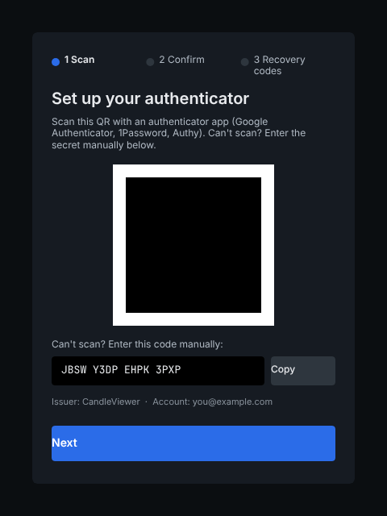

QR code (CMP-205 QrCode) sits in an untinted quiet-zone card (`color.surface.raised`, no token applied to
the QR bitmap itself — quiet zone stays pure white/black per the CMP-205 contract) with the manual-entry
secret in a monospace token (`JetBrains Mono`) beneath, plus a CMP-033 CopyButton. Stepper (CMP-066) at
top shows step 1 of 3 active. Primary action "I've added the account — continue" advances to step 2;
"Cancel enrolment" (secondary, `color.action.secondary.default`) returns to the referring screen.

## 5. SCR-003 — step 2: confirm

CMP-204 OtpInput as **one labelled input** (`aria-label="6-digit authentication code"`), not six separate
boxes, styled as six visually-segmented cells sharing one accessible name/value. Verify button disabled
until 6 digits entered.

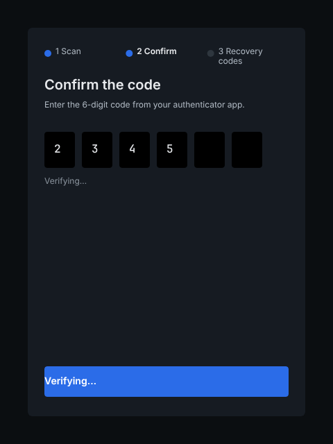

Inputs and buttons locked (`aria-busy="true"` on the form), inline spinner replaces the Verify label text
(label itself is not removed from the DOM — `aria-live="polite"` region announces "Verifying code…").

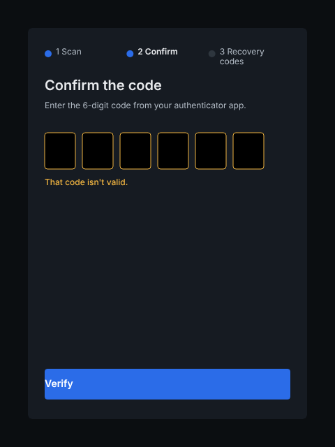

`color.status.danger.strong` text + icon (never colour alone) inline below the input; input cleared and
refocused; `aria-live="assertive"` announces "Incorrect code. Try again.".

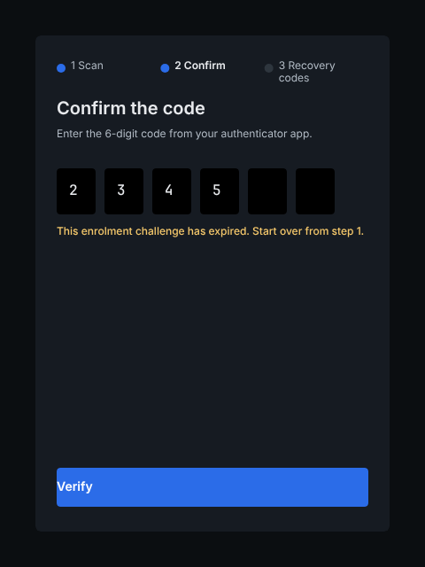

Distinct from a wrong code: the secret itself expired (enrolment session TTL). Only action offered is
"Restart enrolment" (returns to step1 with a freshly issued secret) — no retry-in-place, since the old
secret is no longer valid server-side.

## 6. SCR-003 — step 3: recovery codes

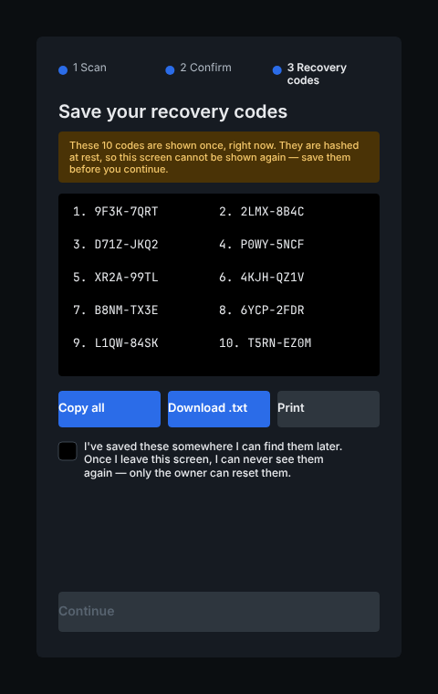

CMP-206 RecoveryCodeList: 10 codes in a 2-column monospace grid, a "Download as .txt" and "Copy all"
action, and a mandatory acknowledgement checkbox ("I've saved these codes somewhere safe") gating
Continue. Warning banner (`color.status.warning.subtle` background, `color.status.warning.strong` text/
icon) states codes are shown once only.

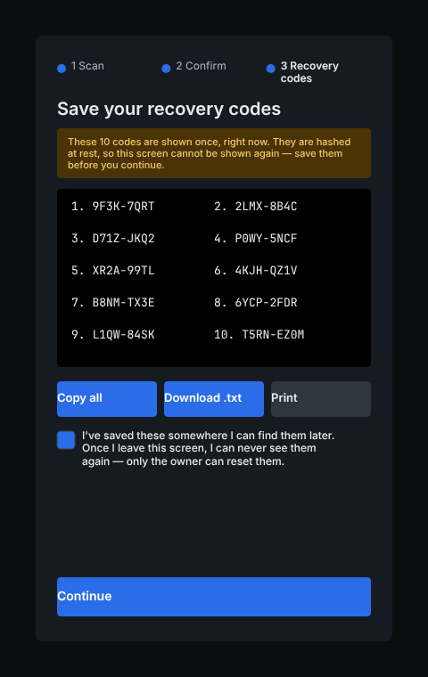

Same board, checkbox checked, Continue enabled (`color.action.primary.default`).

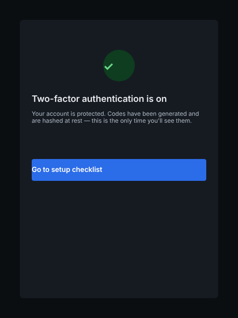

Terminal confirmation card ("Two-factor authentication is now active.") before redirect to the app shell;
no further recovery-code content is rendered here (codes are not re-shown).

## 7. SCR-003 — re-enrolment and owner-reset variants

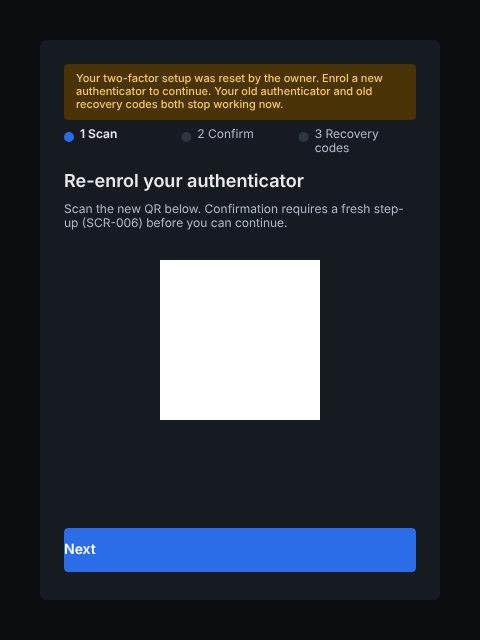

Entered from SCR-112 "Re-enrol TOTP". Same step1 board plus a banner
(`color.status.warning.subtle`/`color.status.warning.strong`): "Adding a new device will invalidate your
current authenticator. Existing recovery codes stay valid." Cancel returns to SCR-112 unchanged.

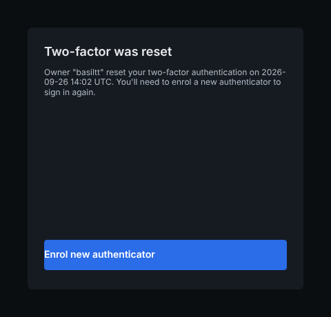

Entered automatically on next sign-in after an owner calls `reset-totp` on this account. Banner
(`color.status.danger.subtle`/`color.status.danger.strong`): "Your two-factor method was reset by an
owner. You must set up a new authenticator to continue." No "skip"/"later" action exists — this is a
mandatory gate, consistent with the native-SL-style "no bypass" pattern for safety-relevant flows.

## 8. SCR-002 — recovery-code sign-in, forced re-enrolment, exhaustion

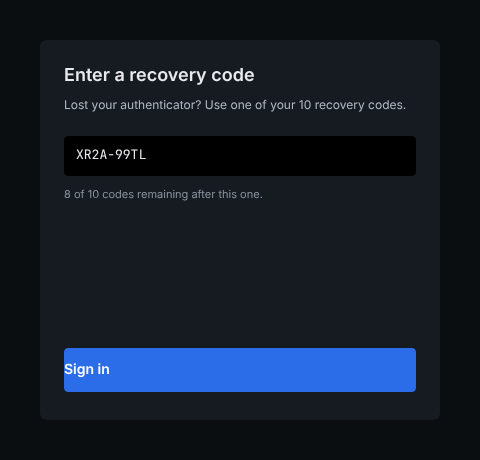

Confirmation card after a recovery code is accepted: "Recovery code accepted. N of 10 codes remain."
When `remaining <= 2` the count renders in `color.status.warning.strong`; the card's sole action is
"Continue to set up two-factor" (mandatory, not dismissible).

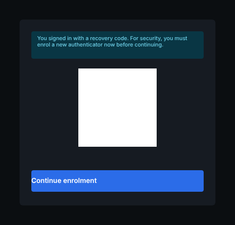

Identical board to step1-scan with an added persistent banner: "You signed in with a recovery code — set
up a new authenticator to continue." Same no-skip rule as the owner-reset variant.

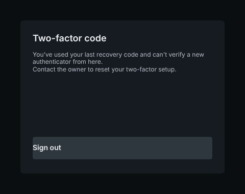

Terminal state: all 10 recovery codes spent and the authenticator is unavailable. No self-service action
is offered — copy instructs "Contact your account owner to regain access." (matches the ticket's security
note that there is intentionally no automated self-recovery from this state). Icon uses
`color.status.danger.strong`; no primary action button is rendered, only a "Sign out" secondary action.

## 9. SCR-112 — Security settings, two-factor section

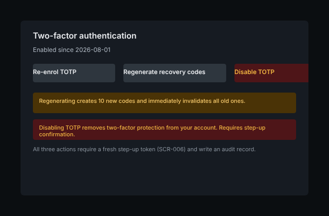

Status card ("Two-factor authentication: Active", enrolled date) plus three actions:
- **Regenerate recovery codes** — confirmable destructive-adjacent action (old codes invalidated
  immediately); routes through step-up re-auth (SCR-006 modal chassis, per E09-D02 §2.2) before executing.
- **Re-enrol TOTP** — routes to SCR-003 re-enrol-variant.
- **Disable two-factor** — `color.status.danger.strong` label, requires step-up re-auth and a typed
  confirmation phrase; disabled entirely (button hidden, not just greyed) when the account's role/owner
  policy mandates TOTP (server-enforced; the UI never offers a button that a server rule will just reject).

Remaining-codes count is shown on the status card at all times (`GET /v1/auth/recovery-codes/remaining`);
falls into the same `<=2` warning-colour rule as §8.

## 10. Interactions and hotkeys

- OtpInput: numeric-only entry, auto-advance per digit is **not** used (single accessible input, per
  CMP-204 contract) — paste of a 6-digit clipboard value fills the whole field.
- Enter submits the active form (Verify / recovery-code entry) when valid; Escape does not close any of
  these screens (they are not dismissible modals except where step-up reuses SCR-006's chassis).
- CopyButton and "Copy all" (recovery codes) announce success via `aria-live="polite"` ("Copied to
  clipboard") without visually relying on a tooltip alone.
- Tab order on step3: code grid (list semantics, not individually focusable per cell) → Download → Copy
  all → acknowledgement checkbox → Continue.

## 11. Accessibility notes (WCAG 2.2 AA)

- OtpInput exposes one accessible name/value (`role="group"` + single `aria-label`, not six unlabelled
  boxes) per CMP-204's mandatory contract.
- QR code has an accessible text alternative pointing at the adjacent manual-entry secret; the quiet zone
  is never tinted (contrast/scanability requirement, also a CMP-205 contract point).
- All status changes (verifying / error / expired / consumed / exhausted) use `aria-live` regions at an
  appropriate politeness level; errors are `assertive`, transient progress is `polite`.
- Every warning/danger surface pairs colour with an icon and text label (colour is never the only signal).
- Destructive/mandatory actions (disable TOTP, regenerate codes, no-skip banners) are never triggerable by
  a single accidental keystroke — confirmation dialog or typed phrase required.
- Focus is programmatically moved to the first error/banner on entry to error/expired/exhausted states.

## 12. Token usage

All fills/borders/text bound to `semantic-dark`: `color.surface.app`, `color.surface.raised`,
`color.surface.overlay`, `color.surface.hover`, `color.surface.selected`, `color.text.primary`,
`color.text.secondary`, `color.text.tertiary`, `color.text.disabled`, `color.text.on-action`,
`color.text.link`, `color.action.primary.default`, `color.action.primary.hover`,
`color.action.secondary.default`, `color.border.default`, `color.border.subtle`, `color.border.strong`,
`color.status.warning.subtle`, `color.status.warning.strong`, `color.status.danger.subtle`,
`color.status.danger.strong`. No raw hex values were authored by hand; frame fills were set from each
token's currently-resolved value in the `semantic-dark` set (Penpot API note: `applyToken` for
`borderRadius*` requires the four explicit radius props, not `["all"]`).

**Proposed tokens (gap):** no `semantic-light` token set exists yet in this file — all frames are
dark-theme only, consistent with "dark theme is default" (`30-frontend-react.md`); a light-theme pass is
out of scope here and should be tracked as a follow-up against whichever ticket introduces
`semantic-light`.

## 13. CMP-* gap list

- CMP-204 OtpInput, CMP-205 QrCode, CMP-206 RecoveryCodeList, CMP-066 Stepper, CMP-033 CopyButton — all
  already catalogued in `15-component-catalogue.md`; no new components introduced by this ticket.
- No gaps found during this pass; if implementation (E09-D07) discovers a missing state prop, it should be
  raised against `15-component-catalogue.md` directly rather than re-opening this spec.

## 14. Continuation checklist

- [x] All 14 states/frames drawn on the ticket's Penpot page.
- [x] PNG exported per frame, committed under `docs/design/E09/img/`.
- [x] Spec doc (this file) covering purpose/states/data/interactions/hotkeys/a11y/tokens.
- [ ] `14-screens-catalogue.md` SCR-003 and SCR-112 sections updated to reference hi-fi status (tracked as
      a small follow-up edit in this same PR — see the diff).
- [ ] Owner review/approval in Penpot and on the PR (this ticket does not self-approve).

## 15. References

- `docs/plan/14-screens-catalogue.md` SCR-003, SCR-002, SCR-112
- `docs/plan/15-component-catalogue.md` CMP-033, CMP-066, CMP-204, CMP-205, CMP-206
- `docs/design/E09/E09-D02.md` (wireframe predecessor; structural decisions AD-1..AD-6 carried forward)
- `docs/design/README.md` (Penpot tooling, approval rule, evidence requirements)
- `docs/plan/05-accessibility-standard.md`
