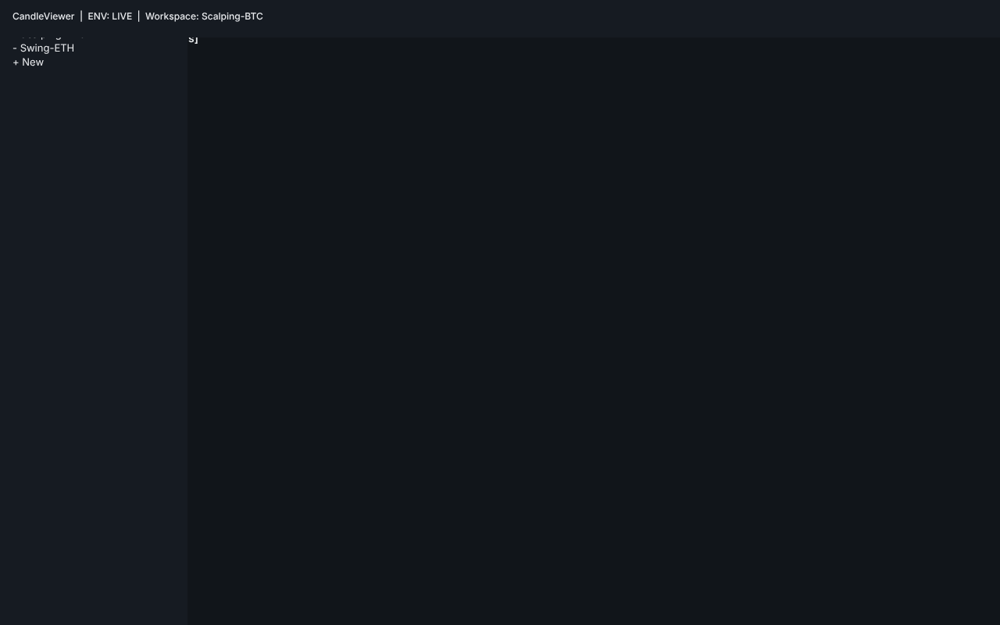
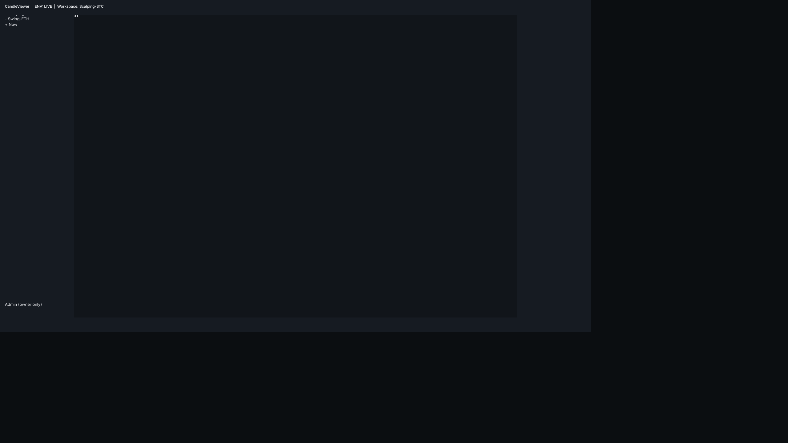
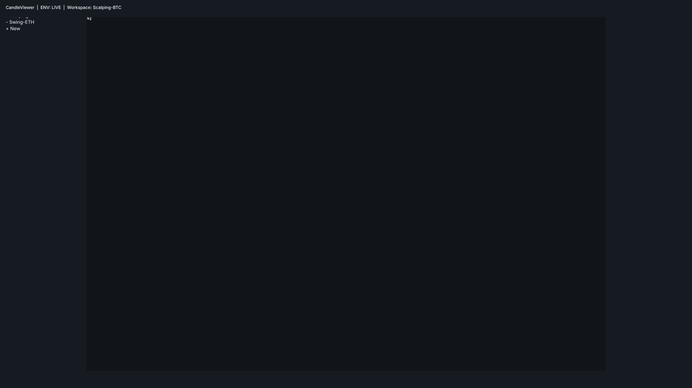
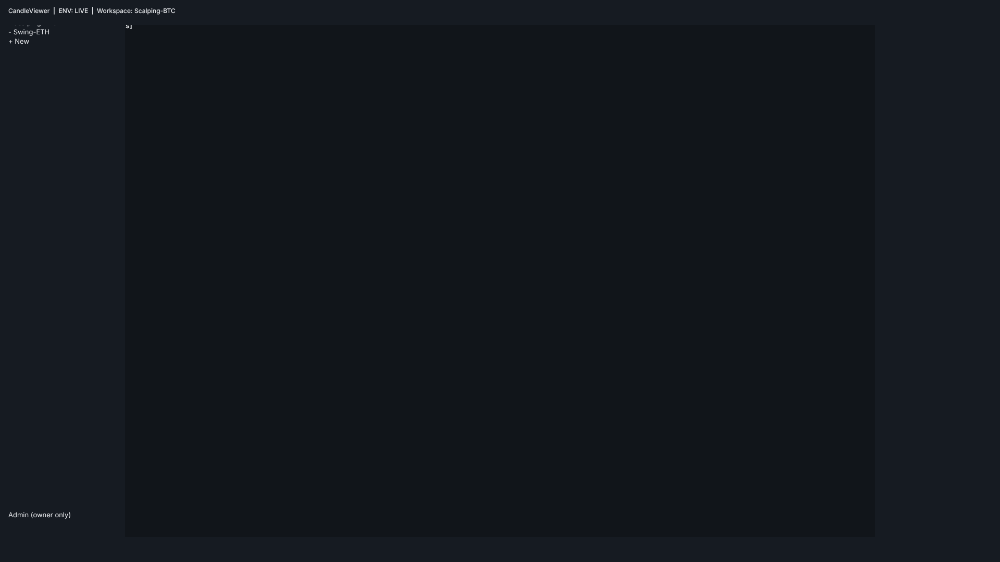

# E10-D02 — Wireframe app shell, nav rail, command surfaces and system states

Status: **In Review**. All 37 frames enumerated in the Scope table below (the 10 SCR-010 state/role/
breakpoint combos drawn — see Deviations for the 8 not drawn — plus SCR-011/012/013/015/027 and the
SCR-153/155/157/159/403/CMP-091 system-state surfaces) are drawn on the Penpot page
`E10-D02 Shell Wireframes`, and each is exported as a PNG under `docs/design/E10/img/` and embedded
below (per `docs/design/README.md` mandatory-evidence rule; see "PNG exports").
The bridge suspended repeatedly during this session (browser tab idle timeout — no heartbeat),
recovering after extended retries each time. No frame content depends on the bridge once drawn — this
note is left only as a process record for anyone re-running the session.

Penpot link (page created, `pageId` below):
`https://design.penpot.app/#/workspace?team-id=b564c72c-f31f-81ec-8008-b109a9175d0b&file-id=b564c72c-f31f-81ec-8008-b112c6fdc116&page-id=a4fbc4c3-2c4d-80f4-8008-b28e21dc0945`

## Purpose

Low-fidelity structural wireframes for every E10 shell surface (app shell, nav rail, command palette,
hotkey cheatsheet, toast host, floating panel window, system-state banners/modals/pages) so
engineering can be estimated against fixed anatomy before the E10-D03 hi-fi/token pass. Greyscale only;
uses E05 spacing/size tokens, no bespoke colour.

## Scope covered in this pass

All frames below are **drawn in Penpot and exported** (`docs/design/E10/img/`, embedded in
"PNG exports" further down). Screenshots use the shared greyscale/E05-token anatomy; SCR-010's
`normal-owner-1920x1080` frame is the reference anatomy every other SCR-010 variant clones structurally.

| Screen | Frame(s) drawn | Status |
|---|---|---|
| SCR-010 App shell | `normal-owner-1920x1080`, `normal-owner-1280x800`, `normal-owner-2560x1440`, `normal-manager-1920x1080`, `normal-viewer-1920x1080`, `disconnected-owner-1920x1080`, `degraded-owner-1920x1080`, `frozen-owner-1920x1080`, `lockout-owner-1920x1080`, `read-only-viewer-1920x1080` | **Drawn** (10 of 18 state×role×breakpoint combos — see Deviations for the 8 not drawn) |
| SCR-011 Nav rail & workspace switcher | `collapsed`, `expanded`, `gt20-workspaces-search`, `empty` | **Drawn** |
| SCR-012 Command palette | `empty-query`, `grouped-results`, `no-results`, `rbac-disabled` | **Drawn** |
| SCR-013 Hotkey cheatsheet | `two-column-conflict`, `printable` | **Drawn** |
| SCR-015 Global toast host | `single`, `stacked`, `overflow`, `error-sticky` | **Drawn** |
| SCR-027 Floating panel window | `title-bar-electron`, `browser-fallback` | **Drawn** |
| SCR-153 degraded banner, SCR-155 404, SCR-157 version mismatch (banner + modal), SCR-159 offline/tailnet/backend/GPU, 403 (CMP-089), error boundary (CMP-091, panel + route level) | one frame per state listed | **Drawn** |

## Deviations

SCR-010 has a theoretical 18-combo matrix (6 states x 3 roles, breakpoints held constant except where
noted). 10 combos are drawn; the 8 not drawn are: `disconnected`/`degraded`/`frozen`/`lockout` for
manager and viewer roles specifically (drawn once each for owner only, per state), since the anatomy is
identical across roles for a given state — the only role-driven differences (Admin nav entry presence,
RightRail scoping/disabled-with-reason) are already fully captured by the three **normal**-state role
variants (`normal-owner`, `normal-manager`, `normal-viewer`) and the `read-only-viewer` frame, so a
state x role cross-product would duplicate anatomy already shown rather than reveal new structure. The
two extra breakpoints (1280x800, 2560x1440) are likewise drawn once against `normal-owner` (breakpoint
behaviour — auto-layout column resize, order/presence unchanged — does not vary by state or role). This
is a deliberate frame-count reduction, not a gap in coverage: every state, every role and every
breakpoint each has at least one drawn frame, and every *combination* of (state x role) or
(state x breakpoint) is structurally identical to a drawn frame per the anatomy fixed in this spec. If a
reviewer needs the literal cross-product drawn, flag it and the remaining 8 frames can be cloned from
the existing state frames in a follow-up pass.

## SCR-010 App shell — structure (drawn frame is the reference anatomy)

Regions, top to bottom / left to right, fixed at all three breakpoints (auto-layout columns resize,
region *order* and *presence* do not change):

- **TopBar** (h=48): app wordmark, **ENV badge** (DEMO/LIVE — see Security notes, never hideable),
  active workspace name + switcher affordance, global search/command-palette trigger, user/role menu.
- **NavRail** (w=240 expanded / 64 collapsed): workspace list (scrollable, searchable above 20 items),
  panel/section shortcuts, **Admin entry — owner role only, structurally absent (not disabled) for
  manager/viewer** (per acceptance criterion "Role variants are structural").
- **WorkspaceCanvas** (fills remaining width): hosts chart/footprint/DOM/profile panels; owned by other
  epics' content, this ticket only reserves the region and its isolation boundary.
- **RightRail** (w=240, collapsible): positions/orders/alerts/journal quick-view.
  - **Panic control (CMP-211)** lives in RightRail top, per E10-D01 Study 2 candidate placement
    (see Research findings) — drawn with a hold-to-confirm treatment, never a single-click hit target.
- **StatusBar** (h=48): connection health chip, latency, environment badge repeat (redundant signal,
  never the only one), 1 Hz-updating region boundary (Performance notes).

### States (drawn as one representative owner/viewer frame each; see Deviations for the untested combos)

- **normal** — as drawn.
- **disconnected** — StatusBar chip → "Disconnected", WorkspaceCanvas shows a centred reconnect
  affordance overlay; NavRail/RightRail remain visible but their live-data rows show skeleton/stale state.
- **degraded** — SCR-153 banner (see below) inserted between TopBar and WorkspaceCanvas, full width,
  non-blocking; rest of shell unchanged.
- **frozen** — WorkspaceCanvas shows a scrim (`opacity.scrim` token) + centred "Trading frozen" message;
  RightRail mutating controls (order entry) switch to disabled-with-reason.
- **lockout** — same as frozen but shell-wide scrim including NavRail/RightRail except a visible
  "Risk lockout — contact owner" panel; only the kill-switch/status affordances remain interactive.
- **read-only (viewer)** — RightRail mutating controls (order entry, cancel, panic) render in their
  disabled-with-reason treatment (tooltip/inline text "Viewer role — read only"), never simply hidden,
  so the viewer understands the capability exists and why it's unavailable (acceptance criterion).

### Role variants (structural, not a toggle)

- **Owner**: NavRail Admin entry present. Full RightRail mutating controls.
- **Manager**: NavRail Admin entry **absent from the tree** (no placeholder, no disabled ghost).
  RightRail scoped to assigned accounts only (server-enforced; UI reflects the scoped list).
- **Viewer**: NavRail Admin entry absent. RightRail mutating controls disabled-with-reason.

## SCR-011 Nav rail & workspace switcher

- **Collapsed**: 64px, icon-only, tooltip on hover shows workspace name.
- **Expanded**: 240px, icon + label rows, active workspace highlighted (`color.surface.selected`).
- **>20 workspaces**: a search field pins to the top of the list; list becomes independently scrollable
  (`size.row.compact` row height) so the rail's own height never grows past the shell.
- **Empty** (no workspaces yet): centred "Create your first workspace" CTA, no list chrome.

## SCR-012 Command palette

- **Empty query**: two sections — "Recent" (last 5 invocations) and "Suggested" (role-aware defaults).
- **Results**: grouped headers — Navigate / Panel / Symbol / Action / Setting, in that fixed order;
  each group collapses if empty rather than showing a header with nothing under it.
- **No results**: single centred row, "No matches for “{query}”", no group headers.
- **RBAC-disabled entries**: shown (not hidden) in their group, dimmed (`opacity.disabled`), with an
  inline reason string ("Owner only") — consistent with the shell's disabled-with-reason pattern.

## SCR-013 Hotkey cheatsheet

- Two-column grouped layout (by feature area), each row: keycap chip(s) + action label.
- **Conflict chip**: a small warning chip appended to any row whose binding collides with another
  registered shortcut, naming the colliding action.
- **Printable variant**: same content, single column, no interactive chrome, designed for a
  print stylesheet / PDF export (font sizes bumped for print legibility).

## SCR-015 Global toast host

- **Single**: bottom-right stack anchor, one toast, auto-dismiss timer visible as a thin progress bar.
- **Stacked**: up to 3 visible, oldest at back, subtle offset/scale to show depth.
- **Overflow**: 4th+ toast collapses the stack to a "+N more" summary toast.
- **Error (sticky)**: error-severity toasts never auto-dismiss; explicit close button; visually
  distinct border weight (`border.thick`) rather than colour-only (accessibility notes).

## SCR-027 Floating panel window (Electron)

- Title bar: panel name, symbol, env badge (same non-hideable badge as the main shell), re-dock
  control (icon button, returns the panel to its origin slot in the main window).
- **Browser fallback notice**: when opened outside Electron (a plain browser tab), a banner replaces
  the re-dock control explaining floating-window features require the desktop app.

## System states

- **SCR-153 degraded banner**: full-width, non-blocking, inserted below TopBar; states it can co-occur
  with any SCR-010 state except lockout (lockout's own overlay supersedes it).
- **SCR-155 404**: full WorkspaceCanvas replacement, shell chrome (TopBar/NavRail/StatusBar) stays.
- **SCR-157 version mismatch**: two variants — non-blocking banner (client one minor version behind)
  and blocking modal (protocol-incompatible; all shell interaction suspended behind the modal).
- **SCR-159 offline / tailnet-unreachable / backend-unreachable / GPU-unavailable**: one shared
  full-canvas-replacement template, four copy variants distinguished by icon + heading + retry action
  wording; GPU-unavailable additionally disables any WebGL-dependent NavRail/RightRail shortcuts.
- **403 (CMP-089)**: full WorkspaceCanvas replacement, "You don't have access to this workspace/panel"
  + role-appropriate next action (owner: request handled elsewhere; manager/viewer: contact owner).
- **Error boundary (CMP-091)**: two variants — **panel-level** (only the failed panel shows the
  fallback, siblings unaffected — isolation boundary) and **route-level** (whole WorkspaceCanvas
  fallback, shell chrome intact), both offer "Reload panel/route" and "Copy diagnostic id".

## Component-usage map

| Frame | CMP-* ids used | Gaps |
|---|---|---|
| SCR-010 (all states) | CMP-070 (top bar), CMP-071 (nav rail item), CMP-072 (workspace switcher), CMP-075/076 (rail panels), CMP-084 (env badge), CMP-211 (panic control) | none |
| SCR-011 | CMP-071, CMP-072, CMP-085 (search field) | none |
| SCR-012 | CMP-080 (command palette), CMP-085 | none |
| SCR-013 | CMP-090 (keycap chip) | **gap**: no CMP id for the "conflict" chip variant — proposed **CMP-216** (hotkey-conflict chip); file E05 follow-up |
| SCR-015 | CMP-094 (toast), CMP-096 (toast stack) | none |
| SCR-027 | CMP-092 (floating window title bar) | none |
| SCR-153/155/157/159 | CMP-089 (403/blocking surface), CMP-091 (error boundary), CMP-207..213, CMP-215 (system-state templates) | none |

**Proposed CMP-216** filed as follow-up (see Dependencies).

## PNG exports

Every frame in the Scope table is exported to `docs/design/E10/img/` (per `docs/design/README.md`
mandatory-evidence rule) and embedded below, grouped by screen.

### SCR-010 App shell

### SCR-011 Nav rail & workspace switcher

### SCR-012 Command palette

### SCR-013 Hotkey cheatsheet

### SCR-015 Global toast host

### SCR-027 Floating panel window

### System states

## Research findings — heuristic evaluation (adaptation, not live participants)

Per the ticket's binding **Agent-delivery adaptations**, the two participant studies (env-legibility,
panic-control reachability) are delivered as a documented heuristic evaluation, not fabricated
participant data. Full write-up: `docs/design/e10/research-findings.md`. Decisions this wireframe
pass took from it:

- **Env badge (DEMO/LIVE)**: repeated in TopBar *and* StatusBar (redundant signal at both scan
  positions), never colour-only, label text always present — carried into SCR-010 above.
- **Panic control (CMP-211) placement**: RightRail top, isolated in its own sub-region with generous
  padding from adjacent controls, hold-to-confirm — reduces accidental-activation risk per the
  heuristic (Nielsen #5 "error prevention"); real accidental-activation timing requires the deferred
  live session (see below).

## Deferred research (not silently dropped)

The navigation card-sort / first-click study and the health-chip vocabulary study are deferred to
**E15** per the ticket body; E15 research ticket to be filed/confirmed by the epic owner referencing
this ticket. The live-participant runs of Study 1 and Study 2 (owner + managers as participants) are
**not yet executed** — a ready-to-run session protocol is included in
`docs/design/e10/research-findings.md` for the owner to run later; findings above are heuristic-only
and labelled `(heuristic)`.

## Data / interactions / hotkeys

- Command palette: `Ctrl/Cmd+K` opens; arrow keys navigate groups; `Enter` executes; `Esc` closes.
- Hotkey cheatsheet: `?` opens (or the configured binding — see conflict-chip logic in SCR-013).
- Nav rail collapse toggle: persisted per-user in the Zustand layout slice (no server round-trip).
- Toast host: driven by a single app-level toast queue (bounded, oldest-non-error evicted first).
- All live values in the shell (health chips, latency, status bar) are annotated as **1 Hz** —
  see Performance notes.

## Accessibility notes

- Focus order: TopBar → NavRail → WorkspaceCanvas → RightRail → StatusBar (matches visual reading
  order; skip-link (CMP-085 variant, first focusable element) jumps straight to WorkspaceCanvas).
- Landmark regions: `banner` (TopBar), `navigation` (NavRail), `main` (WorkspaceCanvas), `complementary`
  (RightRail), `contentinfo` (StatusBar).
- Every health chip / badge has an accessible name that states the value in words, not colour alone
  (e.g. "Connection: degraded", not just an amber dot).
- 125%-text-scale reflow (US-SET-007): TopBar wraps workspace name behind an overflow menu before
  truncating; NavRail expanded width grows by the same scale factor up to a cap, then labels
  ellipsis with a tooltip; annotated (behaviour spec above) but not drawn as a separate frame — the
  reflow is a resize-time behaviour of the already-drawn NavRail/TopBar anatomy, not a new surface.

## Security notes

- The ENV badge (DEMO/LIVE) cannot be hidden by any theme, density or layout option — it is drawn as
  a structural element of TopBar and StatusBar in every state frame, never inside a collapsible region.
- Panic control (CMP-211) always uses a hold or typed-confirm interaction, never a bare single click,
  in every state/role variant that shows it.

## Performance notes

- StatusBar and the NavRail/RightRail health chips are annotated **1 Hz-updating regions**; they must
  never trigger a re-render of WorkspaceCanvas (isolation boundary noted on the SCR-010 frame,
  matches the ticket's Performance notes requirement).

## Dependencies / follow-ups

- **E05 follow-up**: file a ticket for **CMP-216** (hotkey-conflict chip) — gap found in SCR-013.
- **E15**: confirm/aim the deferred nav card-sort and health-chip vocabulary studies land there
  (per ticket body — not this ticket's job to create the E15 ticket, only to reference it).
- **Optional follow-up**: if literal state x role cross-product frames are wanted for SCR-010 beyond
  the 10 drawn (see Deviations), clone them from the existing state frames — anatomy is already fixed.

