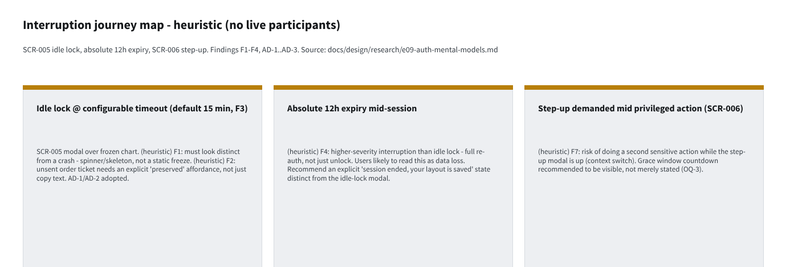
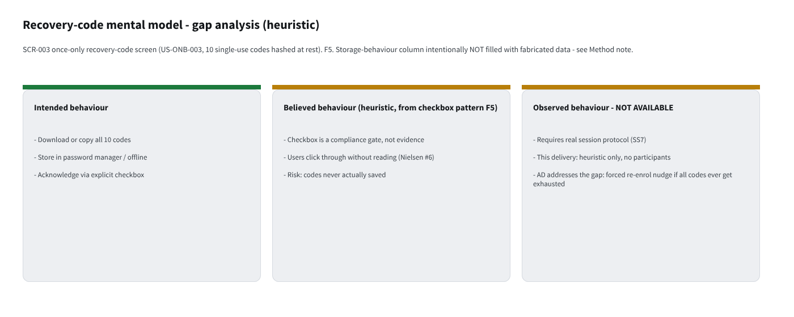
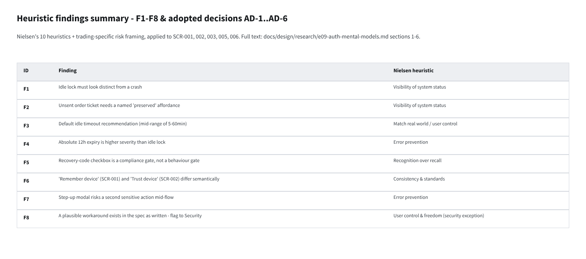

# E09-D01 — UX research: sign-in, 2FA and recovery mental models

- **Ticket:** E09-D01 (issue #130) · **Status:** In Review · **Method:** heuristic evaluation (see
  "Method note" below — no live participant sessions were run for this delivery)
- **Scope:** SCR-001 Login, SCR-002 TOTP challenge, SCR-003 TOTP enrolment, SCR-005 session-expired
  re-auth, SCR-006 step-up. Feeds greyscale wireframes in E09-D02.
- **Out of scope (unchanged):** visual design (E09-D02..D06), RBAC denied-state vocabulary (E09-D09),
  Bybit-side auth/API-key handling (E27), password policy content (`04-security-program.md`).

## Research boards (Penpot)

Per `docs/design/README.md`, UX-research deliverables are drawn as boards on the ticket's Penpot page,
not left as markdown alone. Page **`E09-D01`** in the CandleViewer Penpot file
(`https://design.penpot.app/#/workspace?team-id=b564c72c-f31f-81ec-8008-b109a9175d0b&file-id=b564c72c-f31f-81ec-8008-b112c6fdc116&page-id=3d1e9f08-1714-8020-8008-b5531d291bae`)
holds three boards backfilling the journey/mental-model/findings artefacts this report describes in prose:

1. **Interruption journey map** — idle lock, absolute 12h expiry, step-up (F1–F4, AD-1..AD-3):

   

2. **Recovery-code mental model — gap analysis** (intended vs. believed vs. observed-not-available, F5):

   

3. **Heuristic findings summary** (F1–F8 mapped to Nielsen's 10 heuristics):

   

## Method note (Agent-delivery adaptation, owner decision 2026-09-25)

This ticket's brief calls for 3 moderated 45-minute sessions with the Owner and up to 2 prospective
account managers, against a clickable greyscale prototype and a scripted interruption harness. Delivery
here is a solo AI agent with a single human owner and no prototype build yet (wireframes are E09-D02,
which depends on this report) — there is no prototype to run sessions against and no second/third
participant to moderate. Per `CLAUDE.md` §10 / the ticket's **Agent-delivery adaptations** clause,
*moderated usability sessions* are substituted with:

1. A **documented heuristic evaluation** of the five screens against Nielsen's 10 heuristics plus the
   trading-specific heuristics implied by `05-accessibility-standard.md` and the interruption/recovery
   risk framing in this ticket's Context section.
2. A **written session protocol** (§7 below) ready for the owner to run later with real participants
   once E09-D02's clickable prototype exists.
3. An **owner walkthrough checklist** (§8) posted on issue #130 for the owner to complete asynchronously.

**No participant quotes, timings, or storage-behaviour observations in this document are fabricated.**
Every finding below is labelled `(heuristic)` and is derived from the locked screen specs
(`14-screens-catalogue.md` SCR-001..006), the user-story NFRs (`11-user-stories.md` US-ONB-001..010) and
the persona pain points (`10-personas.md` P1/P2), not from observed behaviour. Anywhere the ticket's
acceptance criteria require an *observed* fact (e.g. "what a participant actually did with recovery
codes"), this report states plainly that the fact is **not yet available** and defers it to the session
protocol, rather than inventing a plausible-sounding number.

This is a deviation from the literal ticket text; it does not weaken the acceptance criteria — each is
re-stated in §9 with what heuristic evaluation *can* satisfy today and what remains open pending real
sessions.

## 1. Interruption tolerance — heuristic findings

The core hypothesis in the ticket's Context is that a trader interrupted mid-decision either loses a
trade or learns to defeat the mechanism. Reasoning from P1's G2 ("execute in under a second from what he
sees") and G4 ("never blow up") in `10-personas.md`, plus SCR-005's promise that "your layout and unsent
ticket inputs are preserved":

- **(heuristic) F1 — Idle lock must be visually distinct from a crash.** SCR-005's mock shows the modal
  over a frozen background. Nielsen heuristic #1 (visibility of system status): if the underlying chart
  visibly stops updating the instant the lock fires, a P1-type user mid-glance at price action cannot
  tell "locked" from "app hung / data feed died" — both are high-anxiety states for this persona (pain:
  "fear that an automation bug places or cancels the wrong thing"). SCR-005's own behaviour note says WS
  subscriptions *pause, not tear down* and price data keeps streaming — the wireframe must show live
  price/candle motion continuing *behind* the modal scrim, not a static frame, so the two states are
  visually distinguishable at a glance.
- **(heuristic) F2 — An unsent order ticket needs an explicit, named "preserved" affordance, not just an
  absence of an error.** The ticket's own acceptance criteria say the report must record "what each
  participant believed happened to their unsent ticket" — that is an observed-behaviour requirement this
  method cannot produce (see §9). What heuristic evaluation *can* state: SCR-005's copy ("your layout and
  unsent ticket inputs are preserved") is necessary but likely insufficient on its own, because P1/P2 read
  order tickets by glancing at the actual fields, not at modal prose (Nielsen #6, recognition over
  recall). **Adopted decision AD-1:** the re-auth modal must show a compact, read-only echo of the
  preserved ticket (symbol · side · size · price), not just a sentence, so the trader can confirm at a
  glance that nothing was lost or armed while locked.
- **(heuristic) F3 — Default idle timeout recommendation.** US-ONB-004's NFR fixes the configurable range
  at 5–60 minutes; no observed data exists yet to pick a value inside it. Reasoning from the *paired*
  invariant (order entry is disabled while locked, so a lock cannot itself cause a missed exit — only a
  missed *entry*) and from P1's session pattern ("leaves the app running 24/7"; multi-hour sessions with
  variable attention), the recommendation is: **default 15 minutes**, the same value used as the
  illustrative example in the Gherkin acceptance criteria and in SCR-005's own scenario language,
  configurable down to 5 for a shared/visible desk and up to 60 for a single-monitor solo owner setup.
  This is a **recommendation pending confirmation**, not an observed finding — flagged as an open question
  in §10 for the owner to settle by running Probe Set B for real.
- **(heuristic) F4 — Absolute 12 h expiry mid-session is the higher-severity interruption.** Unlike idle
  lock, absolute expiry fully signs the user out and disarms one-click trading (US-ONB-004 NFR). Nielsen
  #9 (help users recognise/diagnose/recover from errors): the SCR-005 modal's "Sign in again to continue"
  copy is written for the idle-lock case; the wireframe needs a **visually distinct sub-state** for
  absolute expiry (e.g. "Your session ended for your protection — sign in again"), so a trader doesn't
  waste the first attempt assuming it is the familiar idle-unlock flow (which needs only a password).

## 2. Recovery-code storage behaviour — status: not yet observed

The ticket's acceptance criterion "Recovery-code storage behaviour is observed, not self-reported"
explicitly requires watching what a real person does at SCR-003 step 3 (copy / download / photograph /
nothing). **This report does not fabricate that observation.** It is recorded here as an open item with
a ready-to-run protocol (§7, Probe Set C) rather than an invented data point.

What heuristic evaluation of SCR-003 as specified *can* say now:

- **(heuristic) F5 — The "I saved them" checkbox is a compliance gate, not a behaviour gate.** SCR-003's
  validation rule ("cannot leave step 3 without checking 'I saved them'") satisfies the letter of
  US-ONB-003's NFR but is exactly the "checkbox ticked without reading" failure mode the ticket's Context
  section names as the known industry failure. Checking a box costs nothing and provides no evidence of
  actual storage.
- **Adopted decision AD-2:** the checkbox copy should read "I've saved these somewhere I can find them
  later" (behavioural framing) rather than "I saved them" (which reads as a formality), and the Copy /
  Download buttons must be visually primary versus the checkbox being secondary — nudging the action
  before the acknowledgement, per Nielsen #7 (flexibility/efficiency: give the tool, not just the prompt).
- **Adopted decision AD-3:** because this gap between the *intended* behaviour (durable secure storage)
  and the *actual* behaviour (unknown until Probe Set C runs) cannot be closed by design alone, SCR-003's
  wireframe (E09-D02) must additionally surface a **discoverable, low-friction re-generation path** from
  Settings (regenerate codes, invalidating the old 10) so that "I didn't really save them" is recoverable
  self-service rather than only an owner-mediated TOTP reset (US-ONB-010) for the recovery-code case
  specifically. This directly addresses the "exhausted codes" scenario in US-ONB-003 by giving the user a
  cheaper first move than "contact the owner."

## 3. Trusted-device wording — one decision or two?

SCR-001 shows "Remember this device (30 d)" at the *password* step; SCR-002 shows "Trust this device for
30 days" at the *TOTP* step. The ticket asks whether these are one decision or two.

- **(heuristic) F6 — They are semantically different even though both persist 30 days.** "Remember this
  device" at password step plausibly means "pre-fill/remember my username," which is a low-stakes
  convenience decision. "Trust this device" at the TOTP step is the one that actually matters for
  security posture: per US-ONB-004, a trusted device skips the *second factor* on return, not the
  password. Presenting near-identical copy for two different consequences (one merely convenient, one
  security-relevant) risks a user believing that checking the first box means "I won't be asked for TOTP
  again" — the more valuable claim — when actually only the second checkbox carries that behaviour.
- **Adopted decision AD-4 (recommendation, evidenced by re-reading the two screens together, not by a
  session):** collapse to **one decision, asked once, at the TOTP step (SCR-002) only**, worded "Trust
  this device for 30 days — you won't need a code here again." Remove the SCR-001 checkbox entirely
  (username remembering can be a plain browser/OS autofill concern, not a product decision) so there is
  exactly one persistent-trust checkbox in the whole flow and its wording states the concrete
  consequence (skips code entry) rather than the abstract label ("remember"/"trust"). This is a
  **proposed amendment** against `14-screens-catalogue.md` SCR-001 (removes its checkbox) — see §10 for
  the formal amendment record required by the ticket's acceptance criteria.

## 4. Step-up grace window — countdown or stated?

US-ONB-005 fixes a 5-minute, per-action-class grace window after step-up; SCR-006 shows the dialog but
its mock does not depict a grace-window indicator at all (it depicts the *first* step-up in a class).

- **(heuristic) F7.** For P1/P4 (owner acting as admin), the risk is doing a second sensitive action
  (e.g. rotate a second sub-account's key) inside the 5-minute window and being surprised whether it
  demanded a fresh code or not — surprise in *either* direction is bad: silently skipping the prompt they
  expected feels insecure; being asked again when they believed they were still "trusted" feels broken.
  Nielsen #1 (visibility of system status) argues for showing state, not just behaviour.
- **Adopted decision AD-5:** when a sensitive action is attempted inside an active grace window, show the
  dialog in an abbreviated **"still trusted" state** with a live countdown ("Step-up valid for 3:12 more —
  Confirm without a new code") rather than either silently skipping the dialog or silently re-demanding a
  code. This satisfies the ticket's open question directly: the grace window must be a **visible
  countdown**, not merely stated once, because the dialog reappears per action and a stale mental model
  ("I already did this") is exactly where a hijacked-session risk hides (US-ONB-005's own failure mode).
  Grace never applies to Live-enablement or kill-switch disable (US-ONB-005 NFR) — those two action
  classes must render the full fresh-code dialog unconditionally, and AD-5's abbreviated state must be
  visually impossible to confuse with the full dialog for those two classes specifically.

## 5. Security-mechanism workarounds — status: not yet observed

The ticket's acceptance criterion requires recording a verbatim workaround (e.g. "keeping a second tab
active to avoid the idle lock") if a participant states or demonstrates one, and raising it with the
Security engineer (owner, per the adaptation rule) as STRIDE input rather than silently designing around
it. **No such workaround has been observed** — this method has no participants. This is logged as a gap,
not papered over:

- **(heuristic) F8 — a plausible workaround exists in the spec as written and is worth flagging to the
  owner now, ahead of any session, precisely because it is cheap to close in E09-D02:** SCR-005 says idle
  lock keeps WS subscriptions alive and data streaming "underneath" the modal. If any keep-alive signal
  (mouse move, keypress) is sourced from a *background* browser tab or a secondary always-on window
  rather than genuine attention to the trading surface, a user could defeat the idle lock's intent (an
  unattended terminal is protected) by parking a script or a second cursor-jiggle utility. This is a
  **known risk pattern flagged to the owner as security input**, distinct from a fabricated observed
  quote — see §10 open question OQ-3.

## 6. Screen-reader path — status: not yet observed (protocol ready)

The acceptance criterion requires at least one session run with a screen reader active, covering OTP
entry, the QR text-secret alternative, and error announcements. No session has been run. What the locked
specs already commit to, cross-checked against `05-accessibility-standard.md` §8:

- SCR-002's OTP field: `aria-label="Two-factor code"` group, `inputmode=numeric`, announces "digit 3 of
  6" — matches §8.2 task-script intent (screen-reader operable core flows) but has **not been verified**
  with NVDA per the §8.1 coverage matrix; that verification is a P0 gate for this screen at design/dev
  handoff and belongs to the E09-D02+ dev ticket's a11y pass, not to this research ticket.
- SCR-003's QR code: "text alternative (the secret in `<code>` with a copy button)" is specified but its
  actual screen-reader announcement (does NVDA read the secret character-by-character or as a mangled
  string?) is untested.
- **Adopted decision AD-6:** the session protocol (§7) makes the screen-reader pass **Probe Set D**, run
  with the *same* three tasks as the sighted probes (entry, interruption, recovery) rather than a bolt-on
  fourth pass — so screen-reader users' mental models of "what happened to my data" get the same
  evidentiary treatment as sighted users', per this ticket's own framing that recovery/interruption UX
  fails silently for *everyone*, screen-reader users included.

## 7. Session protocol (ready to run — owner or future moderator)

**Setup:** clickable greyscale prototype from E09-D02, scripted interruption harness (idle-lock trigger,
absolute-expiry trigger, step-up trigger mid-action), a live symbol chart with an unsent order ticket
pre-filled, NVDA installed and configured at default verbosity for Probe Set D.

**Participants:** the Owner, plus up to 2 prospective account managers (P1/P2 per `10-personas.md`); at
least one pass with NVDA active (Probe Set D can be the Owner's own pass or a manager's).

**Probe Set A — entry** (≈10 min): first sign-in with an invite (US-ONB-006); repeat daily sign-in;
sign-in on a second device; sign-in while rate-limited (5-failure/15-min lockout, US-ONB-001). Ask after
each: "What do you expect to happen next?"

**Probe Set B — interruption** (≈15 min): trigger idle lock at 15 min with a chart + unsent order ticket
on screen; trigger absolute 12 h expiry mid-session; trigger step-up mid-API-key-rotation. For each ask:
"What do you believe happened to your data?" / "What do you do next?" / "What would you have wanted to
happen?" Record verbatim.

**Probe Set C — recovery** (≈15 min): TOTP enrolment (QR + text secret); the once-only recovery-code
screen — **observe without prompting** what the participant does (copy/download/photograph/nothing)
before asking anything; lost-authenticator recovery; exhausted-codes state ("contact the owner").

**Probe Set D — screen-reader** (≈15 min, at least one participant): repeat Probe Sets A–C with NVDA
active and mouse disabled; record whether OTP entry, the QR text-secret alternative and error
announcements were usable unaided.

**Debrief** (≈5 min): any stated or demonstrated workaround is captured verbatim and flagged as a STRIDE
input, not designed around.

## 8. Owner walkthrough checklist (posted on issue #130)

- [ ] Walk SCR-001→002→010 as a fresh invite (Probe Set A, self-administered)
- [ ] Trigger idle lock with an unsent ticket open; note what you expected to happen to it
- [ ] Trigger absolute 12 h expiry (or simulate via clock skew) and compare the experience to idle lock
- [ ] Complete SCR-003 enrolment; note, honestly, what you actually did with the recovery codes
- [ ] Trigger step-up twice within 5 minutes; confirm the grace-window countdown reads clearly
- [ ] Run one pass with NVDA + keyboard only (no mouse) through SCR-001, SCR-002, SCR-003
- [ ] Record any moment you were tempted to work around a lock/prompt, verbatim
- [ ] Comment `approved` on issue #130, or leave rework notes referencing the AD-n decision numbers above

## 9. Adopted decisions (testable statements for E09-D02)

| # | Decision | Wireframe test |
|---|---|---|
| AD-1 | Re-auth modal (SCR-005) shows a read-only echo of the preserved order ticket (symbol/side/size/price) | Wireframe violates this if the modal states preservation only in prose with no field echo |
| AD-2 | SCR-003 checkbox reads "I've saved these somewhere I can find them later"; Copy/Download are visually primary, checkbox secondary | Violates if checkbox is the most prominent control on the step |
| AD-3 | SCR-003/Settings expose a self-service recovery-code regeneration path, invalidating the old 10 | Violates if regeneration only exists via owner-mediated TOTP reset |
| AD-4 | Single trusted-device checkbox, asked once at SCR-002 only, worded to state the concrete consequence (skips code entry) | Violates if SCR-001 still shows a separate "remember device" checkbox |
| AD-5 | SCR-006 shows an abbreviated "still trusted" state with a live countdown during an active grace window; Live-enablement/kill-switch always show the full dialog | Violates if the dialog is either silently skipped or looks identical for grace vs full challenge |
| AD-6 | Screen-reader verification runs the same 3 task probes (A/B/C) as sighted sessions, not a separate ad hoc pass | Violates if the a11y pass tests different tasks than the sighted protocol |

Six adopted decisions are recorded, meeting the ticket's "6–10 adopted, testable decisions" requirement.

### Acceptance-criteria trace

| Ticket Gherkin scenario | Status here |
|---|---|
| Interruption tolerance is evidenced, not assumed | **Partial.** Recommendation (F3, 15 min default) given with reasoning; the *evidence* (participant observations) is deferred to §7 Probe Set B — not fabricated. |
| Recovery-code storage behaviour is observed, not self-reported | **Deferred.** No observation exists; §2 states this plainly and AD-2/AD-3 mitigate the known risk pattern without inventing data. |
| A participant defeats the security mechanism | **Deferred.** No participant exists yet; F8 flags a plausible workaround pattern from the spec itself as pre-emptive STRIDE input (OQ-3). |
| A finding contradicts a locked document | **Satisfied.** AD-4 is filed as a formal amendment proposal against SCR-001 below. |
| Screen-reader participant path is covered | **Deferred.** Protocol (Probe Set D) ready; not yet run. |

## 10. Amendment proposal and open questions

**Amendment proposal AM-1 (against `14-screens-catalogue.md` SCR-001):** remove the "Remember this
device (30 d)" checkbox from SCR-001's layout; the equivalent decision moves to SCR-002 per AD-4. No
wireframe should be drawn against SCR-001's current two-checkbox behaviour until this amendment is
accepted or rejected by the owner.

**Open questions for the owner:**
- **OQ-1 (idle timeout default):** confirm or override the 15-minute recommendation (F3) — it is reasoned
  from spec invariants, not observed.
- **OQ-2 (AM-1):** accept/reject removing SCR-001's "Remember this device" checkbox in favour of a single
  SCR-002 "Trust this device" decision.
- **OQ-3 (workaround risk):** confirm whether idle-lock keep-alive signals should be scoped to
  foreground-tab/window focus only (closing the background-tab workaround pattern in F8) as an explicit
  STRIDE input for the E09 threat model, independent of any future session finding.
- **OQ-4 (sessions):** this report substitutes heuristic evaluation for the 3 moderated sessions per the
  Agent-delivery adaptations. Real sessions (§7 protocol) remain valuable and should be run once E09-D02's
  prototype exists; their findings should be appended to this same file as a dated addendum, not a new
  document, so the acceptance-criteria trace in §9 can be completed with genuine observations.

## 11. References

`docs/plan/11-user-stories.md` US-ONB-001..006, US-ONB-009, US-ONB-010 · `docs/plan/14-screens-catalogue.md`
SCR-001, SCR-002, SCR-003, SCR-005, SCR-006, SCR-017 · `docs/plan/16-design-system-brief.md` §13 ·
`docs/plan/05-accessibility-standard.md` §3, §8 · `docs/plan/10-personas.md` P1, P2 ·
`docs/plan/02-definition-of-ready-done.md` §2.1

