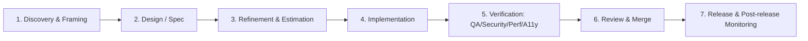
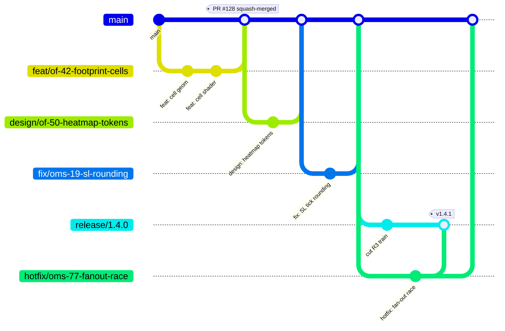
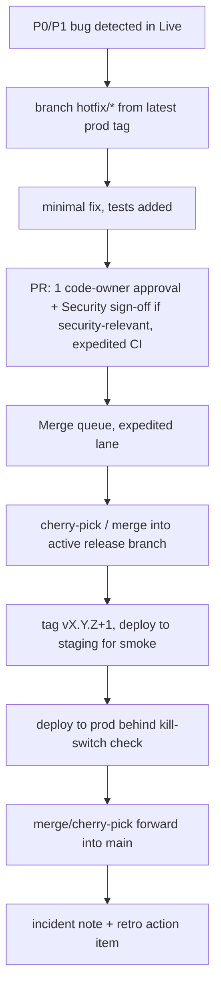
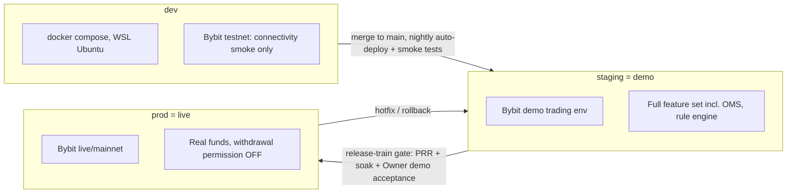

# 01 — SDLC & Branching Model

Status: locked. Applies to CandleViewer (web app: React + custom WebGL engine + Electron shell; Python/FastAPI backend). This document is the single source of truth for how work moves from idea to production. It binds every ticket, PR, and release in this repo. No sub-team may substitute its own process.

Related: `00-planning-brief.md` (team, cadence, locked decisions), `02-definition-of-ready-done.md`, `03-testing-strategy.md`, `04-security-program.md`, `07-release-and-prr.md`.

---

## 1. Team & cadence recap

- ~15 engineers: 5 backend, 5 frontend (incl. chart engine), 2 QA/SDET, 1 DevSecOps, 1 Security engineer, 1 Architect.
- UI/UX org: Chief Design Officer (CDO), UX researchers, product designers, design-system team, motion designer, accessibility specialist.
- **1-week sprints** (7 calendar days, Friday→Thursday; owner decision 2026-09-24 — delivery is executed by parallel Claude Code agents, so the human 2-week cadence was compressed while story points per sprint stay at 90). Sprint 01 starts **Friday 2026-09-25**; Sprint 26 / GA cut ends **Thursday 2027-03-25**. The final day of each sprint is reserved for review + retro. Canonical calendar: `docs/plan/backlog/_tools/calendar_cv.py`.
- Capacity: **90 engineering story points/sprint** across engineering disciplines (see §11 for the breakdown). Design/UX capacity is tracked separately in design-sprint units, not story points, but design tickets still live on the same board.
- **Design-ahead rule (non-negotiable):** design work for a screen/feature must reach Status=Done at least **2 sprints** before the corresponding frontend engineering ticket can enter Ready. No frontend screen implementation starts against a design that is not signed off.

---

## 2. Phases of the SDLC

Each ticket (of any Kind) moves through the same seven phases, though the artifacts produced differ by Kind (see `02-definition-of-ready-done.md` for per-Kind DoR/DoD detail).



1. **Discovery & Framing** — Product/Architect/Owner turn a need into an Epic or Spike. Output: problem statement, links to research digests, rough scope.
2. **Design / Spec** — For product-facing work: UX research → flows → wireframes → hi-fi screens → design-system component check, signed off by CDO. For backend/platform work: technical spec / ADR by Architect, reviewed by leads. Output: Figma/markdown artifacts linked on the ticket, Status reaches Done on the design ticket.
3. **Refinement & Estimation** — Backlog refinement ceremony (see §3). Ticket is broken down to ≤8-point children if needed, acceptance criteria written in Gherkin, dependencies (`blocked_by`) recorded, DoR checked.
4. **Implementation** — Branch created, code written per branching model (§5), interface-first stubs used to unblock parallel work (§10).
5. **Verification** — Automated test pyramid (unit/contract/integration/E2E/perf/security/a11y per `03-testing-strategy.md`) plus manual QA test plan execution, security review for flagged tickets, a11y manual pass for UI tickets.
6. **Review & Merge** — PR lifecycle (§6), 2 approvals incl. 1 code-owner, required checks green, merge queue (§7).
7. **Release & Monitoring** — Ticket rides a release train (`30-release-roadmap.md`, `07-release-and-prr.md`), environment promotion (§8), post-release monitoring, demo to stakeholders at sprint review.

---

## 3. Ceremonies (1-week sprint; asynchronous, agent-driven)

With AI agents doing the implementation, ceremonies are **owner checkpoints**, not meetings: each is a written artefact (issue comment, PR review, doc update) that the owner completes in minutes. Durations below are upper bounds.

| Ceremony | Cadence | Duration | Attendees | Purpose / Output |
|---|---|---|---|---|
| **Sprint Planning** | Day 1 of sprint (Fri) | ≤1h | Full eng team + Architect + CDO delegate | Confirm sprint goal(s), pull Ready tickets into sprint up to capacity (90 pts eng + design capacity), record in `31-sprint-plan.md`. Exit: every ticket in the sprint has an owner, estimate, and Status=Ready→In Progress commitment. |
| **Daily Standup** | Every day, async (agent status comments on claimed issues) | ≤15 min owner scan | Sub-team (backend/frontend/QA standups may run separately, 15 min each) | Blockers, board hygiene (Status accuracy), no problem-solving in the meeting — spin off follow-ups. |
| **Backlog Refinement** | Once per sprint (mid-sprint, Mon) | ≤1h | Product/Architect + rotating discipline reps + CDO for design items | Groom next 2 sprints of backlog: split >8pt tickets, write/refresh acceptance criteria, confirm DoR, re-estimate stale tickets. |
| **Design Review** | Weekly, Wed | 1h | CDO, product designers, a11y specialist, 1 frontend rep, Product | Review in-flight design tickets against `16-design-system-brief.md` tokens and `15-component-catalogue.md`; gate for design Status→Done. |
| **Security Review** | Per-epic kickoff + ad hoc for `security` labelled tickets, plus a standing weekly slot (Wed, 30 min) | 30–60 min | Security engineer, DevSecOps, ticket owner, Architect | STRIDE threat-model walkthrough for new epics; review of SAST/SCA/secrets findings; sign-off recorded on ticket. |
| **PRR (Production Readiness Review)** | Before every release train gate (R0–R5) and before any Live-enablement | 1–2h | Architect, DevSecOps, Security, QA lead, on-call owner | Run `07-release-and-prr.md` checklist; go/no-go decision. |
| **Sprint Review / Demo** | Last day of sprint (Thu) | ≤1h | Full team + Owner (basiltt) | Demo Done tickets on staging(demo); Owner accepts or reopens. |
| **Retro** | Last day of sprint, after review | ≤30 min | Full eng+design team | Start/Stop/Continue; action items become Chore tickets with an owner and next-sprint target. |

Design runs its own weekly design crit outside this list when volume requires it, but Design Review above is the mandatory gate ceremony.

---

## 4. Board workflow — Status semantics

GitHub Project (PenniLogic-style schema): **Backlog → Ready → In Progress → In Review → In Test → Blocked → Done**.

| Status | Meaning | Who moves ticket INTO this status | Entry condition |
|---|---|---|---|
| **Backlog** | Captured, not yet groomed | Anyone (Product/Owner/Architect creates) | Ticket has a title, Kind, and 1-sentence problem statement. |
| **Ready** | Groomed, estimated, unblocked, meets DoR for its Kind | Ticket owner or facilitator, at end of Refinement | DoR checklist complete (see `02-definition-of-ready-done.md`); for frontend Story tickets, linked design ticket is Done and ≥2 sprints old. |
| **In Progress** | Actively being implemented | Assignee, when they start work | Ticket pulled into current sprint at Planning, or pulled mid-sprint only with capacity headroom + async lead approval. |
| **In Review** | PR open, code complete, checks running | Assignee, on opening PR | Branch pushed, PR opened against `main` (or release branch for hotfix), self-checklist in PR template complete. |
| **In Test** | PR approved & merged to `main` (or merged to a feature-flagged path); QA / manual verification pending | Reviewer/code-owner on merge, or QA lead on picking up manual test pass | Merged commit present on the target environment (dev, then staging once promoted). |
| **Blocked** | Cannot progress — external dependency, unresolved question, failing infra | Anyone who discovers the blocker | Ticket must have a linked "blocked by" reference and a comment stating the blocker; owner must post a daily-standup update while blocked. |
| **Done** | Verification complete, DoD satisfied, demoed (if demoable) | Ticket owner, after QA sign-off + (for design) CDO sign-off + (for security-labelled) Security sign-off | Full DoD checklist for the Kind is satisfied (see `02-definition-of-ready-done.md`). |

Rules:
- Only the assignee may move a ticket into **In Progress**; only the PR author moves it to **In Review**; only reviewers/QA move it to **In Test**/**Done**.
- A ticket may bounce from **In Test** back to **In Progress** on QA rejection — this does not reset the estimate but is tracked as a "reopen" for retro metrics.
- **Blocked** is orthogonal to the pipeline position; use a secondary board filter/label if the tool requires it, but the **Status** field itself moves to Blocked so rollups reflect true velocity.
- Design tickets use the same Status column, with "Done" gated by Design Review sign-off, not by code merge.

---

## 5. Ticket taxonomy

### 5.1 Kind (single-select field)

| Kind | Definition | Sizing | Example |
|---|---|---|---|
| **Epic** | A body of work delivering a coherent capability, spans multiple sprints, decomposed into Stories/Tasks/Spikes | Not pointed directly; rolls up children | "Order-flow footprint charting" |
| **Story** | User-facing increment of value, INVEST, has Gherkin acceptance criteria | 1–8 pts (>8 must split) | "As a manager, I can place a bracket order from the DOM ladder" |
| **Task** | Engineering work with no direct independent user value (refactor, infra, migration, wiring) | 1–8 pts | "Add QuestDB connection pool with retry/backoff" |
| **Spike** | Time-boxed research/prototyping to reduce uncertainty; output is a decision/ADR, not shippable code (though code may be thrown away or hardened later) | Timeboxed in days, pointed at 1–5 for planning purposes | "Prototype WebGL footprint rendering at 100k bars / 60fps" |
| **Bug** | Defect against previously Done work | 1–8 pts, prioritized by Priority field | "CVD resets incorrectly on WS reconnect" |
| **Chore** | Maintenance: dependency bumps, doc updates, retro action items, housekeeping | 1–3 pts | "Bump Playwright to latest, fix flaky selectors" |

Epics never go directly to **Done**; an Epic is Done when all child tickets are Done and a rollup demo has occurred.

### 5.2 Labels

**`type/*`** (mirrors Kind for board filtering / automation; applied automatically from Kind field, one per ticket):
`type/epic`, `type/story`, `type/task`, `type/spike`, `type/bug`, `type/chore`

**`area/*`** (exactly one primary area; secondary areas may be added when a ticket genuinely spans components):
`area/chart-engine`, `area/charting-ui`, `area/order-flow`, `area/oms-execution`, `area/rule-engine`, `area/paper-trading`, `area/accounts-admin`, `area/auth-rbac`, `area/ingestion`, `area/recorder-replay`, `area/journal-analytics`, `area/backend-platform`, `area/frontend-platform`, `area/electron-shell`, `area/design-system`, `area/infra-devops`, `area/docs`

**`priority/*`** (exactly one; drives triage order, independent of Estimate):
`priority/p0-critical` (drop everything, e.g. live-trading safety bug), `priority/p1-high`, `priority/p2-normal`, `priority/p3-low`

**Cross-cutting labels** (0 or more, additive; each triggers a required workflow step):
- `design` — needs a design artifact / CDO sign-off before Ready.
- `ux-research` — needs a UX research pass (interview, usability test) before design starts.
- `design-qa` — needs a design-vs-built visual QA pass before Done (pixel/spacing/token audit).
- `handoff` — design→engineering handoff ticket; must include annotated spec, tokens, states, and component mapping.
- `security` — needs Security engineer review/sign-off before Done; triggers STRIDE check for Epics.
- `a11y` — needs axe-core CI pass + manual screen-reader pass before Done.
- `perf` — needs a k6/Locust or engine-FPS benchmark run with recorded numbers before Done.
- `qa` — needs a written black-box test plan and QA execution sign-off before Done (default-on for all Story/Bug; explicit label used for Task/Chore that unusually need it).

Automation (GitHub Actions) enforces: a Story/Bug cannot move to Done without `qa` sign-off recorded (a bot comment or a required "QA Sign-off" checkbox in the issue body); a ticket labelled `security` cannot close without a comment from a Security-team member; `a11y`-labelled tickets require a linked axe-core CI run URL.

---

## 6. Branching model

Trunk-based development on a protected `main`. No long-lived environment branches except transient `release/*` cut at train time.



### 6.1 Branch naming

| Prefix | Use | Example |
|---|---|---|
| `feat/<epic-slug>-<short>` | New functionality tied to a Story/Task | `feat/of-42-footprint-cells` |
| `fix/<area>-<ticket>-<short>` | Bug fix | `fix/oms-19-sl-rounding` |
| `chore/<short>` | Maintenance | `chore/bump-playwright` |
| `design/<epic-slug>-<short>` | Design-system code changes (tokens, Storybook) that accompany a design ticket | `design/of-50-heatmap-tokens` |
| `spike/<short>` | Spike output, may never merge to main as-is | `spike/webgl-footprint-bench` |
| `release/<semver>` | Cut at release-train time, stabilization only | `release/1.4.0` |
| `hotfix/<area>-<ticket>-<short>` | Emergency fix branched from a release tag / main | `hotfix/oms-77-fanout-race` |

`main` is protected: no direct pushes, required status checks, required reviews, required linear history (squash or rebase merge only — no merge commits from feature branches), required conversation resolution.

### 6.2 Conventional commits

`type(scope): summary` — types: `feat`, `fix`, `chore`, `docs`, `test`, `refactor`, `perf`, `build`, `ci`. Scope is the `area/*` slug without the prefix, e.g. `feat(order-flow): render footprint cell text at zoom>4x`. Breaking changes use `!` and a `BREAKING CHANGE:` footer — these drive semver (see `07-release-and-prr.md`).

### 6.3 PR size

Preferred ≤400 LOC diff (excluding generated/lockfiles/snapshots). PRs over this must include a "why this can't be split" note in the description; code-owners may reject oversized PRs outright and require a split.

---

## 7. PR lifecycle & merge queue

```mermaid
sequenceDiagram
    participant Dev as Author
    participant CI as CI (checks)
    participant CO as Code Owner
    participant R2 as 2nd Reviewer
    participant MQ as Merge Queue
    participant Main as main

    Dev->>Dev: branch, commit (conventional commits)
    Dev->>CI: open PR (template filled: scope, test plan, screenshots/video for UI, risk)
    CI-->>Dev: lint, typecheck, unit, contract tests, SAST, secrets scan, build
    CI-->>Dev: a11y (axe-core) if UI change; perf smoke if perf-labelled
    Dev->>CO: request review
    CO-->>Dev: review (approve / changes requested)
    Dev->>R2: request 2nd review
    R2-->>Dev: review (approve / changes requested)
    Dev->>MQ: enqueue (all required checks green, 2 approvals incl. 1 code-owner, conversations resolved)
    MQ->>MQ: rebase PR onto latest main, re-run required checks
    alt checks pass
        MQ->>Main: squash-merge
        Main-->>Dev: ticket auto-moves In Review -> In Test
    else checks fail
        MQ-->>Dev: evicted from queue, must fix and re-enqueue
    end
```

Rules:
- **2 approvals required, at least 1 from a CODEOWNER** for the touched path(s) (see `.github/CODEOWNERS`).
- Required checks (block merge if failing): lint/format, typecheck (TS strict / mypy), unit tests + coverage gate (≥85% backend & engine packages, ≥80% frontend — see `03-testing-strategy.md`), contract tests (OpenAPI/WS schema diff), SAST (CodeQL, Semgrep, Bandit), SCA (Dependabot/pip-audit/npm audit), secrets scan, build success (web + Electron package smoke build on `feat/*` touching shell), a11y check (axe-core) for any PR touching `area/charting-ui`, `area/accounts-admin`, `area/design-system`.
- **Merge queue** (GitHub Merge Queue): once a PR has required approvals and green checks, it is enqueued rather than merged directly; the queue serializes merges, rebasing each PR onto the latest `main` and re-running required checks before merge, preventing "worked on my branch, broke main" races. Max queue concurrency: 3 PRs building in parallel, merged strictly in queue order.
- Draft PRs are used for early feedback / interface-first stubs (§10) and do not count against review SLA.
- Stale PR policy: no activity for 5 working days → auto-comment ping; 10 working days → auto-labeled `stale`, owner escalation at standup.

---

## 8. Hotfix flow

Used only for P0/P1 defects already Live (production) or blocking a release currently in staging soak.



- Hotfix PRs skip the standard 2-reviewer wait only in the sense that the **second reviewer requirement is not waived** — it is expedited: reviewers are paged directly rather than waiting on async queue, and the merge queue has a dedicated expedited lane that jumps normal ordering (never skips checks).
- Any hotfix touching auth/RBAC, keys, OMS, or fan-out safety invariant **must** get Security engineer sign-off even under time pressure — no exception.
- Hotfix must be merged forward into `main` in the same day it goes to prod, to avoid divergence.
- Every hotfix produces a one-page incident note (cause, blast radius, detection time, fix time) feeding `32-risk-register.md` and the next retro.

---

## 9. Environment promotion

Three environments: **dev → staging (demo) → prod (live)**. "Demo" = Bybit demo trading environment (real matching engine, REST order entry only); "Live" = Bybit live/mainnet with real funds.



| Gate | dev → staging | staging → prod |
|---|---|---|
| Automated | All CI checks green on `main`, nightly deploy job succeeds, smoke tests (health checks, WS connect, basic order-ticket dry run against demo) pass | Full regression suite (unit+contract+integration+E2E) green on the release candidate build for ≥48h soak on staging, load test (k6/Locust) within budget, zero P0/P1 open bugs against the release scope |
| **E2E order-flow path constraint (dev/staging)** | dev's Bybit interaction is **testnet-only, connectivity smoke tests for order flow** (no order-flow E2E assertions run against dev; dev E2E covers non-trading paths — charting, auth, admin screens — freely) | staging (demo) E2E for any order-placement/order-management scenario (ticket submit, bracket, scaled order, OCO/iceberg/TWAP/chase emulation, cancel/amend) **must exercise the REST order-entry path only** — per the locked decision in `24-owner-decisions.md` that demo has no WS order entry, only REST. The Playwright E2E suite tags these specs `@demo-rest-only`; the CI job `e2e:staging` runs this tagged subset against the demo REST endpoints and explicitly asserts no WS order-entry frames are sent (network assertion on the WS transcript fixture). Any Story/Task whose acceptance criteria include order placement must include or extend an `@demo-rest-only` spec — DoD (`02-definition-of-ready-done.md`) for such tickets is not satisfied without it. Market-data/streaming E2E (candles, DOM, footprint) continues to use WS on staging as normal; only **order entry** is REST-only on demo. |
| Manual | — | PRR checklist complete (`07-release-and-prr.md`), Owner demo & acceptance at Sprint Review, Security sign-off, **for any release enabling Live trading for the first time or touching OMS/fan-out/keys: pen-test + key-permission audit + kill-switch test** (Live-enablement gate, see `07-release-and-prr.md` §Live-enablement) |
| Rollback | Revert commit + redeploy dev | Documented rollback procedure (`07-release-and-prr.md`), previous release tag re-deployed to prod, feature flags flipped off first if the offending feature is flag-gated |

Dev is always on the tip of `main`. Only tagged `release/*` builds are promoted to staging and prod — no ad hoc hotfix bypasses promotion order except via the hotfix flow (§8), which still passes through staging smoke before prod.

---

## 10. Parallel-work conflict avoidance

With 5 backend + 5 frontend + chart-engine work happening concurrently, the plan prevents collisions via:

1. **Ownership map** — every `area/*` label maps to a primary owning pair (2 engineers) recorded in `33-raci.md`; cross-area changes require a reviewer from each affected area's owning pair, enforced via CODEOWNERS path rules.
2. **Interface-first development** — before implementation starts on any Story that has both a backend and frontend half (e.g. OMS endpoint + order ticket UI), the OpenAPI (`22-api-openapi.yaml`) and/or WS protocol (`23-ws-protocol.md`) contract is updated and reviewed **first**, as its own small PR, before either side's feature PR opens. Frontend builds against the contract using generated types + mock server; backend builds against the same contract with contract tests. This is mandatory for any ticket with both `area/backend-platform` (or a backend area) and a frontend `area/*` label.
3. **Stubs/mocks** — frontend uses MSW (Mock Service Worker) / a local WS mock replaying recorded Bybit fixtures to develop against not-yet-implemented backend endpoints; backend uses recorded fixture-based contract tests so both sides can merge independently once the contract is stable. Chart-engine consumers (charting UI, order-flow UI) build against the engine's public API + a fixture data generator so engine internals can change without blocking UI work.
4. **Feature flags** — every Story/Task delivering user-visible behavior lands behind a flag (`area/infra-devops`-owned flag service, environment-scoped: dev/staging/prod independently toggleable) so partially-complete or risky features (new rule-editor mode, new fan-out logic) can merge to `main` continuously without exposing incomplete UX, and can be rolled back instantly in prod without a code revert. Flags are inventoried in the admin "Feature flags" screen (owner/admin RBAC screen) per the planning brief.

   **Flag promotion/ramp responsibility (explicit rule, full detail in `33-raci.md`):** DevSecOps owns the flag *service* (uptime, schema, environment isolation, audit logging of toggles) but never unilaterally changes a flag's on/off state for a ticket's feature. The **ticket owner** (the engineer/Story owner who built the feature) is Responsible for requesting each environment-level state change (dev: default on for the owning team to dogfood; staging(demo): flip on only once the ticket reaches **In Test** and its demo has passed Design/QA review; prod(live): flip on only as part of a release-train cut, never ad hoc mid-sprint, and never by the ticket owner alone — requires DevSecOps to execute the toggle and the Architect or Owner (basiltt) to be Consulted/Informed for anything touching OMS/fan-out/keys, per the security-labelling rule in `02-definition-of-ready-done.md` §8). DevSecOps is Accountable for the toggle actually being applied correctly and logged; the ticket owner is Accountable for the flag's ramp plan (which environments, in what order, rollback trigger) being recorded on the ticket before it can reach Status=Done. "Feature flag state recorded" in the Story DoD (`02-definition-of-ready-done.md` §3.2) means: current on/off state per environment, who requested each change, and the rollback condition, all logged on the ticket — not merely "a flag exists."
5. **Design-ahead buffer** — the 2-sprint design lead time (see §1) exists specifically so frontend engineers are never blocked waiting on design mid-sprint; refinement rejects any frontend Story whose linked design ticket isn't already Done.
6. **Slice by seam, not by file** — Epics are decomposed along module seams (ingestion / book engine / bar builders / order-flow engines / OMS / rule engine / paper matcher / recorder / replay / auth-RBAC / admin, per the brief's backend module list, and chart-engine / charting-UI / order-flow-UI / accounts-admin-UI / rule-editor-UI on the frontend) specifically so two engineers rarely touch the same files in the same sprint. The ownership map in `33-raci.md` is the enforcement mechanism.
7. **Daily board hygiene** — Status field must reflect reality every day (checked in standup) so Blocked/parallel conflicts surface within 24h, not at PR time.

---

## 11. Estimation guide

### 11.1 Scale

Fibonacci-like: **1, 2, 3, 5, 8, 13**. Any ticket estimated >8 during refinement must be split before it can reach Ready; 13 is only permitted transiently during initial Epic-level sizing and must be broken down before sprint planning pulls it in.

| Points | Meaning | Rough duration for 1 engineer |
|---|---|---|
| 1 | Trivial, well-understood, no unknowns | <2h |
| 2 | Small, understood, maybe 1 file | ~half day |
| 3 | Standard well-scoped unit of work | ~1 day |
| 5 | Non-trivial, multiple files/components, some design decisions | 2–3 days |
| 8 | Complex, touches multiple areas or has real unknowns, upper bound before mandatory split | ~1 sprint-week |
| 13 | Epic-sizing only, never sprint-committed as-is | — |

### 11.2 Reference stories (calibration anchors, used at every planning poker session)

| Points | Reference story | Why |
|---|---|---|
| 1 | "Add a new `priority/*` label option and update issue template" | Config-only, no code risk |
| 2 | "Add a tooltip showing exact OHLC values on candle hover" (chart engine already exposes hit-testing) | Small, isolated UI change on top of existing primitive |
| 3 | "Add a REST endpoint `GET /accounts/{id}/profile` returning the per-account profile schema" | Standard CRUD-shaped backend task, schema already defined |
| 5 | "Implement CVD (cumulative volume delta) computation + chart pane rendering for a single symbol" | New computation + new chart-engine pane + WS wiring, but scoped to one metric |
| 8 | "Implement DOM heatmap rendering (bid/ask liquidity by price level) at 100ms cadence for one symbol, single account" | New WebGL render pass, new WS binary framing, perf budget to hit, cross-area (engine+backend) |
| 13 (must split before sprint) | "Rule engine node-graph editor MVP (React Flow, compiles to shared IR)" | Genuinely epic-sized; split into: IR schema Task, node-graph canvas Task, node-type library Story(x N), IR↔graph round-trip Task, form-editor parity Story |

Estimation happens in Refinement via silent-vote planning poker (async tool comment or live vote); >1-point spread between highest/lowest vote triggers a 2-minute discussion and re-vote. The Architect breaks ties only if consensus fails twice.

### 11.3 Capacity model — 90 points/sprint by discipline

Baseline split (re-tuned every quarter from actual velocity, tracked in `31-sprint-plan.md`):

| Discipline | Engineers | Points/sprint (approx, at ~9 pts/engineer/sprint average velocity accounting for meetings/PTO/review load) | Notes |
|---|---|---|---|
| Backend | 5 | 40 | Ingestion, book engine, bar builders, order-flow engines, OMS, rule engine, paper matcher, recorder/replay, auth/RBAC, admin API |
| Frontend (incl. chart engine) | 5 | 40 | Chart engine core, charting UI, order-flow UI, rule-editor UI, accounts/admin UI, Electron shell |
| QA/SDET | 2 | 6 | Test-plan authoring, automation framework (E2E/contract/load harnesses), QA sign-off is a gating activity not always separately pointed |
| DevSecOps | 1 | 2 | CI/CD, environments, observability, feature-flag service, infra Tasks |
| Security engineer | 1 | 2 | Threat models, SAST/DAST triage, security-labelled review — largely gating/advisory, low point-carrying load by design |
| Architect | 1 | 0 (facilitation role) | ADRs, cross-team unblocking, tie-breaks; not committed against sprint capacity |
| **Total** | 15 | **90** | |

This is a target, not a hard cap per person — points move fluidly within Backend/Frontend based on sprint goal shape (e.g., a heatmap-heavy sprint may run 45/35 backend/frontend). QA/DevSecOps/Security capacity is protected — it must not be raided to hit a feature deadline, since it gates DoD company-wide (`02-definition-of-ready-done.md`).

Design/UX capacity runs on a separate track (design-sprint points, not shown here) but is planned 2 sprints ahead per the design-ahead rule, tracked alongside engineering sprints in `31-sprint-plan.md` so dependency timing is visible on one calendar.
