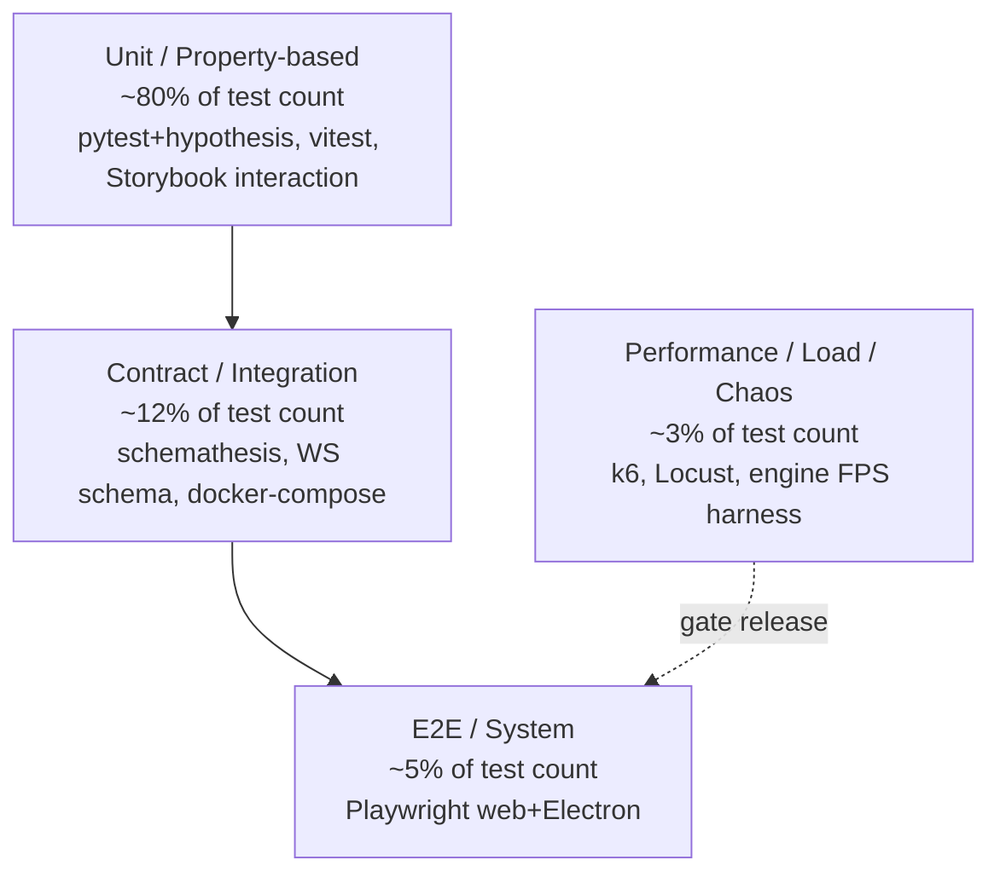
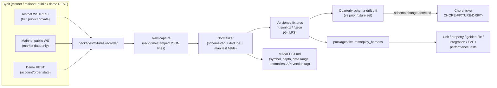
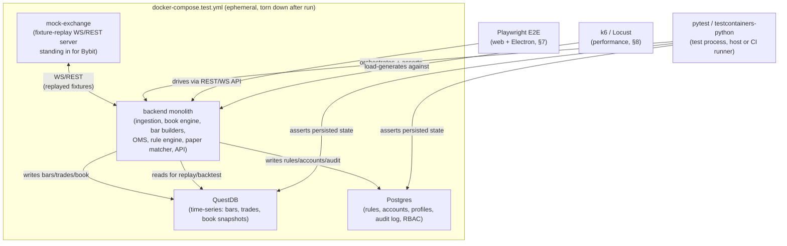
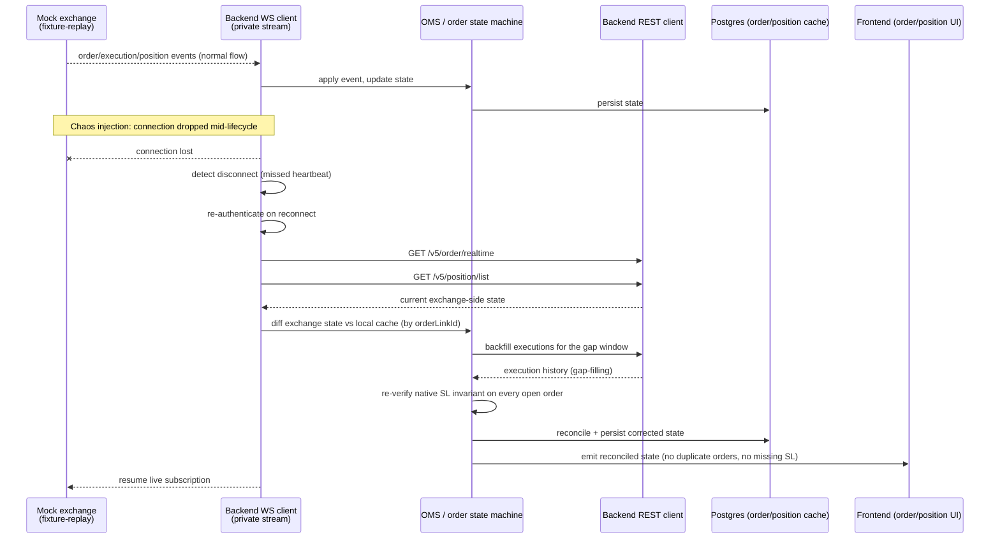
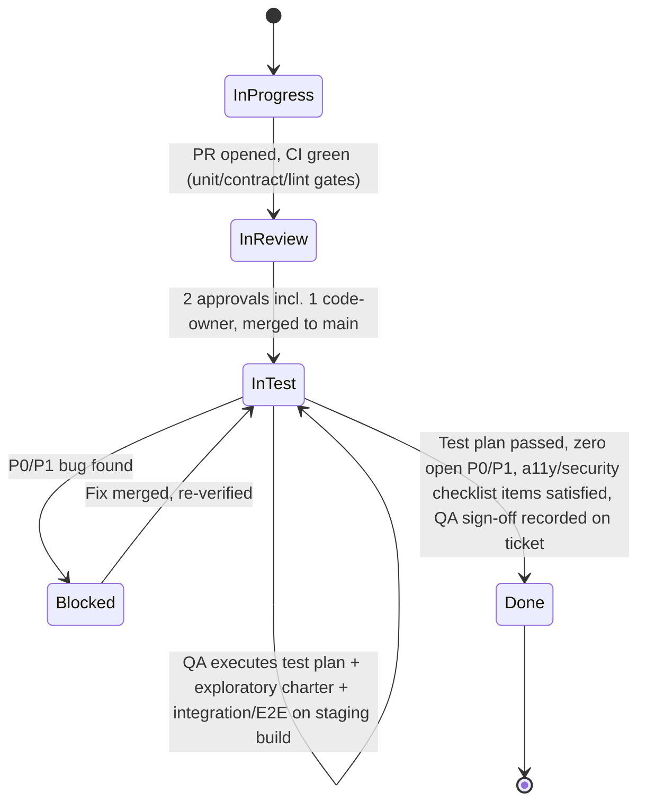

# CandleViewer — Testing Strategy

Status: source of truth for all test types across the platform. Owner: QA/SDET (2 engineers) with contributions from every discipline (backend, frontend/engine, security, DevSecOps). Applies to every epic; referenced by Definition of Ready/Done (`02-definition-of-ready-done.md`), Security Program (`04-security-program.md`), Accessibility Standard (`05-accessibility-standard.md`), Performance Standard (`06-performance-and-load-standard.md`) and Release/PRR (`07-release-and-prr.md`).

## 1. Purpose and scope

CandleViewer is a private, self-hosted trading terminal executing real and paper (Bybit demo) orders with a fully custom WebGL chart engine, an execution/rule engine, and multi-account fan-out. Correctness failures have real financial and safety consequences (wrong order size, missed stop, mis-rendered price). Testing strategy is therefore built around three priorities, in order:

1. **Trading correctness and safety** (OMS, rule engine, fan-out, native SL invariant) — must never silently fail.
2. **Data correctness** (book reconstruction, bar builders, footprint/profile/CVD math) — verified with property-based tests and golden files, because these algorithms are easy to get subtly wrong.
3. **UX quality at scale** (chart engine FPS under 100k bars + heatmap, WS fan-out, accessibility) — verified with dedicated performance/a11y harnesses.

Scope covers backend (Python monolith with modular internals), frontend (React + custom WebGL engine), Electron shell, admin/owner screens (in-app, RBAC-gated), and the public API/WS surface. Android and any separate admin app are explicitly out of scope (owner decision, 2026-09-14).

## 2. Test pyramid with numeric targets

| Layer                              | Share of total test count (target) | Coverage gate                                                                                                                                                                            | Primary tools                                                  |
| ---------------------------------- | ---------------------------------- | ---------------------------------------------------------------------------------------------------------------------------------------------------------------------------------------- | -------------------------------------------------------------- |
| Unit (backend)                     | ~45%                               | ≥85% line coverage, ≥75% branch, on `packages/backend/*` (ingestion, book engine, bar builders, order-flow engines, OMS, rule engine, paper matcher, recorder, replay, auth/RBAC, admin) | pytest, pytest-asyncio, hypothesis, coverage.py                |
| Unit (frontend incl. chart engine) | ~35%                               | ≥80% line coverage frontend; ≥85% line coverage on `packages/chart-engine` (treated as a backend-grade critical package)                                                                 | vitest, @testing-library/react, @testing-library/user-event    |
| Component/interaction (Storybook)  | ~5%                                | Every design-system component + every trading-specific component (order ticket, DOM ladder, rule editors) has ≥1 interaction story; all interaction stories run in CI                    | Storybook 8 test runner (`@storybook/test`), play functions    |
| Contract                           | ~7%                                | 100% of OpenAPI operations covered by schemathesis; 100% of WS topics have a schema test                                                                                                 | schemathesis, custom WS schema validator (pydantic/jsonschema) |
| Integration                        | ~5%                                | Every ingestion→persistence→API path and every OMS state transition covered against a docker-compose test env at least once                                                              | pytest + docker-compose, testcontainers-python                 |
| E2E                                | ~2.5%                              | 100% of P0 user journeys (smoke, trading-demo, rules, multi-account, replay, admin) green on every release candidate                                                                     | Playwright (web + Electron)                                    |
| Performance/load/chaos             | ~0.5% (few, expensive, scheduled)  | All performance budgets in `06-performance-and-load-standard.md` met before Live enablement; chaos scenarios re-run every release                                                        | k6, Locust, custom engine FPS harness, custom chaos harness    |

Numeric quality gates (CI-enforced, see §14):

- Backend package coverage: **≥85% line**, **≥75% branch**, enforced per-package (not just repo aggregate) via `pytest --cov` + `coverage.py` fail-under, per `packages/backend/<module>/pyproject.toml`.
- Chart engine package coverage: **≥85% line** (same bar as backend, because rendering-math bugs are as costly as backend bugs).
- Frontend (non-engine) coverage: **≥80% line**.
- These floors, their per-package ratchet baselines and the 0.5pp regression tolerance are enforced as a
  blocking CI check (`coverage-thresholds`, E03-T04) reading `tools/ci/coverage-baselines.json`; see
  `CONTRIBUTING.md` "Quality gates" for the check name and `tools/ci/coverage_gate.py`'s `CI-COV-00x`
  error codes.
- Mutation-testing spot check (not a gate, a quarterly health check): `mutmut` on rule engine + bar builders, target ≥60% mutation score, tracked as a metric not blocking merges. Process: the on-call QA/SDET engineer (rotates monthly per the QA/SDET pair's shared calendar) runs `mutmut run` against `packages/backend/rules` and `packages/backend/bar_builders` on the first Monday of each quarter (Jan/Apr/Jul/Oct), attaches the HTML report (`mutmut html`) to a recurring backlog chore ticket (`CHORE-MUTATION-<year>-<quarter>`), and files a normal-severity bug (P2, §11.3 taxonomy) for any surviving mutant that reveals a genuinely untested behavior (not for equivalent/no-op mutants, which are logged and ignored in the ticket). The mutation score trend (quarter-over-quarter) is reported in the quarterly QA health review alongside flaky-test metrics (§13).
- Zero P0/P1 open bugs (see §11 taxonomy) to enter "In Test"→"Done" transition.
- Zero flaky tests quarantined for >2 sprints (see §13).

## 3. Test tooling matrix

| Tool                                                                                   | Layer                         | Used for                                                                                                                                                                                                                                                                                                                                                                   |
| -------------------------------------------------------------------------------------- | ----------------------------- | -------------------------------------------------------------------------------------------------------------------------------------------------------------------------------------------------------------------------------------------------------------------------------------------------------------------------------------------------------------------------- |
| **pytest**                                                                             | Unit/Integration              | Backend test runner, fixtures, parametrization                                                                                                                                                                                                                                                                                                                             |
| **hypothesis**                                                                         | Unit (property-based)         | Book engine invariants, bar builders, footprint/profile aggregation, rule-IR round-trip, OMS state machine transitions                                                                                                                                                                                                                                                     |
| **pytest-asyncio**                                                                     | Unit/Integration              | All asyncio code paths: WS ingestion, book engine, OMS, paper matcher                                                                                                                                                                                                                                                                                                      |
| **vitest**                                                                             | Unit (frontend)               | Component logic, hooks, state stores (Jotai/Zustand), chart-engine math/geometry modules, RxJS pipeline transforms                                                                                                                                                                                                                                                         |
| **@testing-library/react**                                                             | Unit/Component                | React component behavior via accessible queries (never test implementation details / internal state)                                                                                                                                                                                                                                                                       |
| **Playwright**                                                                         | E2E                           | Web app (Chromium/WebKit/Firefox smoke) and **Electron** (via `_electron.launch`) end-to-end flows                                                                                                                                                                                                                                                                         |
| **Storybook interaction tests**                                                        | Component                     | Play-function-driven interaction tests for every catalogued component (`15-component-catalogue.md`), run headless in CI via the Storybook test runner on top of Playwright                                                                                                                                                                                                 |
| **k6**                                                                                 | Performance                   | HTTP/WS load generation for REST API and WS fan-out; scriptable thresholds as pass/fail gates in CI                                                                                                                                                                                                                                                                        |
| **Locust**                                                                             | Performance                   | Python-native, used for scenario-shaped load (e.g. simulate N managers submitting trade-group orders concurrently) where k6's JS scripting is less natural; complements k6, not a replacement                                                                                                                                                                              |
| **axe-core**                                                                           | Accessibility                 | Automated WCAG 2.2 AA checks, run in unit/component tests (`vitest-axe`) and in Playwright E2E (`@axe-core/playwright`)                                                                                                                                                                                                                                                    |
| **Lighthouse (CI)**                                                                    | Accessibility/Perf            | Web-vitals + a11y score gate on the marketing-free, app-shell load path (login, dashboard)                                                                                                                                                                                                                                                                                 |
| **pa11y / pa11y-ci**                                                                   | Accessibility                 | Full-page automated a11y sweep across the screens catalogue as a CI job, complementary ruleset to axe-core                                                                                                                                                                                                                                                                 |
| **OWASP ZAP (baseline + full)**                                                        | Security/DAST                 | See §12 and `04-security-program.md`                                                                                                                                                                                                                                                                                                                                       |
| **schemathesis**                                                                       | Contract                      | Property-based fuzzing of the OpenAPI spec (`22-api-openapi.yaml`) against the running API                                                                                                                                                                                                                                                                                 |
| **redocly CLI**                                                                        | Contract                      | OpenAPI 3.1 structural lint of `22-api-openapi.yaml` (unresolved `$ref`s, orphan components, missing 4xx responses)                                                                                                                                                                                                                                                        |
| **openapi-spec-validator**                                                             | Contract                      | Second, independent OpenAPI 3.1 / JSON-Schema-2020-12 validator; catches YAML boolean-coercion and keyword-misuse defects                                                                                                                                                                                                                                                  |
| **jsonschema (Draft 2020-12)**                                                         | Contract                      | Meta-validation of every WS message schema extracted from `23-ws-protocol.md` §13–§15, plus example-frame validation                                                                                                                                                                                                                                                       |
| **Trivy, CodeQL, Semgrep, Bandit, Dependabot/pip-audit/npm audit**                     | Security (SAST/SCA/container) | Referenced here for completeness; owned by `04-security-program.md`                                                                                                                                                                                                                                                                                                        |
| **testcontainers-python / docker-compose**                                             | Integration                   | Spin up QuestDB + Postgres + backend for integration tests                                                                                                                                                                                                                                                                                                                 |
| **Playwright visual snapshots** (`expect(page).toHaveScreenshot()`, `toMatchSnapshot`) | Visual regression             | Chart-engine pixel-diff snapshots (candles, footprint cells, heatmap frames) against golden PNGs, `maxDiffPixelRatio: 0.01` tolerant diff threshold. Chosen over Percy (no third-party SaaS dependency, no extra billing/account for a self-hosted private tool, and it reuses the same Playwright runner/browsers already installed for E2E — one less system to operate) |
| **mutmut**                                                                             | Unit (quality metric)         | Mutation testing spot-checks (quarterly, non-blocking)                                                                                                                                                                                                                                                                                                                     |

## 4. Fixture strategy

### 4.1 Recorded Bybit fixtures (`packages/fixtures`)

- A dedicated **recorder tool** (`packages/fixtures/recorder`) connects to Bybit **testnet** (full WS+REST, including private/order-execution streams) and, for market-data-only fixtures, to **mainnet public WS** plus **demo REST** endpoints — per digest 06 §2, Bybit's demo environment does **not** support its own WS feed (`api-demo.bybit.com` WS is "not supported"; demo consumers use mainnet public WS for market data and demo REST for order/account state), so no recorder connection is ever made to a "demo WS" that does not exist — and captures real message sequences to versioned fixture files (`.jsonl.gz`, one JSON message per line, with a monotonic recv-timestamp prefix for deterministic replay).
- Fixture categories, each with a canonical minimal + a canonical "messy" variant:
  - `orderbook_snapshot_delta_*.jsonl.gz` — `orderbook.{depth}.{symbol}` snapshot + delta sequences, including at least one `seq` gap and one out-of-order delivery, for gap-handling tests.
  - `trades_*.jsonl.gz` — `publicTrade.{symbol}` sequences with block-trade flags, used for CVD/big-trade/tape-speed tests.
  - `kline_*.jsonl.gz` — sanity cross-check fixtures only (not used as bar-builder source of truth).
  - `private_order_execution_*.jsonl.gz` — `order`/`execution`/`execution.fast`/`position`/`wallet` sequences for OMS reconciliation tests, including partial fills, rejects, and reconnect-gap scenarios.
  - `rest_*.json` — REST response fixtures (`/v5/order/realtime`, `/v5/position/list`, `/v5/execution/list`, `/v5/market/time`) for reconciliation and clock-skew tests.
- Fixtures are **checked in via Git LFS** (binary/large jsonl.gz), versioned by capture date + Bybit API version tag, with a `MANIFEST.md` describing capture conditions (symbol, depth, date range, known anomalies).
- The recorder tool is re-run **quarterly** and whenever Bybit API version changes are detected (tracked as a recurring chore ticket), to catch schema drift; recorder output is diffed against the prior fixture's schema and any structural change fails the chore ticket's CI check, forcing a manual review.
- A **fixture replay harness** (`packages/fixtures/replay_harness`) feeds fixture files into the ingestion layer at original cadence, at "as fast as possible," or at a configurable multiplier — the same harness backs integration tests, the replay engine's own tests, and manual dev-loop testing.
- No test ever talks to live Bybit endpoints with a live-money API key; only testnet/demo capture (recorder) and fixture replay (everything else) are permitted in CI. This is a hard CI rule enforced by a lint check on network-allowed hosts in test config.

### 4.2 Golden files for math-heavy modules

- Bar builders (time/tick/volume/range/delta bars), footprint cell aggregation, volume/delta profile aggregation, CVD, imbalance tracker, Deep Stats rows, and DOM heatmap decay/normalization each have a **golden-file test suite**: a recorded fixture is run through the module, output is serialized (deterministic JSON/Parquet), and compared byte-for-byte (or with an explicit float tolerance, e.g. `1e-9` relative) against a checked-in golden output.
- Golden files live under `packages/fixtures/golden/<module>/<case>.golden.json` and are regenerated only via an explicit `--update-golden` test-runner flag, which requires the PR to include a human-written rationale in the PR description explaining why the golden output changed (enforced by a PR-template checklist item + CI diff-size warning on golden file changes).
- Every golden case has a paired **hand-computed or independently-cross-checked** "canonical case" (small, human-verifiable input, e.g. 5 trades forming 1 footprint cell) in addition to realistic recorded-fixture-derived cases, so golden files are trustworthy from day one, not just self-consistent.

### 4.3 Property-based tests (hypothesis)

- **Book engine** (snapshot+delta reconstruction): properties include — book is never negative-size at any price level after any valid delta sequence; applying a snapshot always fully resets state; replaying the same delta sequence twice from the same snapshot yields identical book state (determinism); a delta with `seq` less than or equal to last-applied `seq` is a no-op or triggers resync per Bybit semantics; malformed/duplicate deletes don't crash the engine.
- **Bar builders**: properties include — bar open/high/low/close are internally consistent (`low <= open,close <= high`, `low <= high`) for any valid trade sequence; volume bars close at exactly the configured volume threshold (with defined overflow-carry semantics); tick bars close at exactly N trades; time bars align to interval boundaries regardless of feed gaps; re-running the same trade sequence yields byte-identical bars (determinism, required for replay/backtest trust).
- **Rule engine IR**: properties include — any rule built in the form editor compiles to IR that round-trips losslessly through the node-graph editor and back (and vice versa); IR evaluation is a pure function of (rule, market state) — same inputs always produce same trigger decision; every generated random valid IR graph either compiles or is rejected with a specific validation error (never silently ignored).
- **OMS state machine**: properties include — no valid sequence of exchange events transitions the local order state machine into an undefined state; idempotent resubmission with the same `orderLinkId` never produces two live orders; every fanned-out trade-group order retains its native exchange-side SL invariant regardless of per-account profile combination generated by Hypothesis strategies.
- Hypothesis settings: CI profile uses `max_examples=200` per property (fast profile for pre-commit: `max_examples=20`); nightly scheduled job runs `max_examples=2000` with `deadline=None` and reports new failing examples as bugs (shrunk failing case attached automatically to the bug ticket).

### 4.4 Fixture-recorder pipeline

The recorder never writes directly into `packages/fixtures/golden` (golden files are derived by running fixtures through the module under test, §4.2, not captured from Bybit); it only ever produces the raw/normalized `packages/fixtures` corpus that golden-file generation and replay both read from.

## 5. Contract testing

### 5.0 The `contracts` CI gate (blocking)

The authoritative list of contract gates lives in **`22-api-openapi.yaml` under the `x-contract-validation` extension** — a machine-readable block naming each gate, its tool, its invocation and what it asserts. That block is the source of truth; this section describes the policy around it and must not restate gate definitions (they would drift).

The gate runs as CI job **`contracts`** (`.github/workflows/contracts.yml`) on every PR touching `docs/plan/22-api-openapi.yaml`, `docs/plan/23-ws-protocol.md`, `docs/plan/21-database-schema.md`, `backend/app/api/**` or `backend/app/ws/**`. **All gates block merge**; there is no advisory mode.

| Gate                           | Tool                                                                                                                                                                                 | Why it exists                                                                                                                                                                                                                                                                                                           |
| ------------------------------ | ------------------------------------------------------------------------------------------------------------------------------------------------------------------------------------ | ----------------------------------------------------------------------------------------------------------------------------------------------------------------------------------------------------------------------------------------------------------------------------------------------------------------------- |
| `openapi_structural`           | `redocly lint docs/plan/22-api-openapi.yaml --extends recommended` plus `no-unresolved-refs`, `no-unused-components`, `operation-4xx-response`, `spec-strict-refs` raised to _error_ | An 8 300-line spec is beyond reliable human review; dangling `$ref`s and orphan components are invisible to a reviewer and fatal to codegen.                                                                                                                                                                            |
| `openapi_jsonschema`           | `openapi-spec-validator`                                                                                                                                                             | A **second, independently implemented** validator. Catches JSON-Schema-2020-12 keyword misuse a linter's own resolver tolerates — in particular the YAML 1.1 `on:`/`off:`/`yes:`/`no:` boolean-coercion trap, which silently turned a `required: [on]` entry into `required: [true]` in an early revision of this spec. |
| `ref_closure`                  | `tools/contracts/check_refs.py`                                                                                                                                                      | Every `$ref` resolves; every declared component is referenced at least once.                                                                                                                                                                                                                                            |
| `rbac_coverage`                | `tools/contracts/check_rbac.py`                                                                                                                                                      | Every operation declares `x-rbac` with permissions drawn from `x-permissions`; every order/position mutation declares `x-idempotency: required`. A route shipped without an RBAC declaration is a security defect, so this is enforced, not reviewed.                                                                   |
| `enum_parity_db`               | `tools/contracts/check_enum_parity.py`                                                                                                                                               | Each schema tagged `x-db-enum: <pg_type>` is compared against the _introspected_ Postgres enum from a migrated test database (`21-database-schema.md`), modulo an explicitly declared `x-db-enum-superset`. 31 enums covered; drift in either direction fails.                                                          |
| `error_registry_single_source` | `tools/contracts/check_error_registry.py`                                                                                                                                            | There is **one** canonical error-code registry (`x-error-codes` + `x-error-codes-ws`). The §10.2 table in `23-ws-protocol.md` is asserted to equal it exactly, and the generated `error_codes.py` / `errorCodes.ts` enums are regenerate-and-diffed. Two independently maintained lists cannot exist.                   |
| `ws_message_schemas`           | `tools/contracts/validate_ws_schemas.py --draft 2020-12`                                                                                                                             | Every fenced JSON Schema in `23-ws-protocol.md` §13–§15 passes meta-schema validation, all `$ref`s resolve inside the generated `ws-schemas.json` bundle, and every §12 example frame validates against its declared schema.                                                                                            |
| `schemathesis_fuzz`            | `schemathesis run --checks all`                                                                                                                                                      | Live-instance property fuzzing of all 166 operations (see §5.1).                                                                                                                                                                                                                                                        |
| `runtime_spec_parity`          | `tools/contracts/check_spec_drift.py`                                                                                                                                                | The spec FastAPI emits at runtime is semantically equal to the hand-authored file. The document is the source of truth; the code moves to match it.                                                                                                                                                                     |

`tools/contracts/extract_ws_schemas.py` bundles the WS schemas out of the Markdown into `ws-schemas.json`, the one artefact consumed by server-side dev/test response validation, TS client codegen and the `ws_message_schemas` gate. The Markdown is authoritative; the bundle is always regenerated.

`make contracts` runs the six offline gates (no DB, no running API) in under 10 s for local pre-commit use; the three environment-dependent gates run in CI only.

### 5.1 Surface-by-surface

- **REST (OpenAPI)**: `22-api-openapi.yaml` is the single source of truth. **schemathesis** runs in CI against a live instance of the API (docker-compose test env, §6) for every PR touching backend routes or the OpenAPI spec: fuzzes every operation (path/query/body per schema), asserts response schema conformance, status-code conformance, and checks stateful links (e.g. create-then-fetch) where defined. Failures block merge. Structural validity of the document itself is a separate, earlier gate (§5.0) so a malformed spec fails in seconds rather than after the environment boots.
- **WS protocol**: `23-ws-protocol.md` defines topics, snapshot+delta envelopes, and binary framing. A custom **WS schema test suite** validates: (a) every topic's snapshot message and delta message against a JSON Schema / pydantic model shared by backend (generation) and frontend (consumption codegen), (b) binary-framing round-trip (encode→decode→encode is byte-identical), (c) backward-compatibility check — a new WS protocol version can still be parsed by the previous minor version's schema for fields marked stable (tracked via a protocol version matrix in the same suite).
- **Internal schemas** (`24-internal-schemas.md`: domain events, rule IR, OMS state machine, trade-group model, per-account profile, exchange adapter interface): each has a pydantic/TypeScript-generated schema pair (single source of truth in Python, codegen'd to TS via `datamodel-code-generator`/`openapi-typescript`-style tooling); a CI check fails if the generated TS schema is stale relative to the Python source (regenerate-and-diff check).
- **Error codes**: the product has exactly one error-code registry (`22-api-openapi.yaml` `x-error-codes` for REST/dual-surface codes and `x-error-codes-ws` for WS-only transport codes). Both the Python and TypeScript enums are generated from it, and `23-ws-protocol.md` §10.2 is asserted against it by `error_registry_single_source`. Adding a code in one place and not the other fails the build.
- **Exchange adapter interface**: contract tests run the same test suite against both the real Bybit adapter (using recorded fixtures, §4.1) and any future mock/second-exchange adapter, guaranteeing the abstraction is actually exchange-agnostic before a second exchange is ever built. The executable pack lives in `services/api/tests/contract/bybit/`; its feed-rot (R6) triage procedure is in that directory's [README](../../services/api/tests/contract/bybit/README.md#feed-rot-triage).

## 6. Integration testing

- **Environment**: `docker-compose.test.yml` spins up QuestDB, Postgres, and the backend monolith (plus a fixture-replay WS/REST mock server standing in for Bybit) as an isolated, ephemeral integration environment, torn down after each test run. `testcontainers-python` manages container lifecycle from within pytest for finer-grained integration suites; full docker-compose is used for broader integration/E2E-adjacent suites and CI nightly runs.

- **What is tested at this layer** (things unit tests cannot cover because they require real cross-process behavior):
  - Ingestion → book engine → bar builders → QuestDB persistence → REST/WS read-back, end-to-end through fixture replay.
  - OMS full lifecycle against the fixture-replay mock exchange: submit → ack → partial fill → full fill → reconcile-after-simulated-disconnect.
  - Recorder: auto-record trigger (chart open / position open) → QuestDB write → retention/pin logic → Parquet roll-off to cold tier → DuckDB query of rolled-off data.
  - Rule engine: rule created via API → persisted to Postgres → evaluated against streamed fixture market data → triggers a paper order via the paper matcher.
  - Multi-account fan-out: one ticket → N per-account orders against N mock sub-accounts → trade-group aggregation in read APIs, including partial-account-failure handling (see chaos §9).
  - Auth/RBAC: role-gated endpoints and screens enforce Owner/Manager/Viewer correctly, including audit-log entries being written for every privileged action.
- Integration suite runs on every PR (subset tagged `@integration-fast`, <5 min) and in full nightly (`@integration-full`, includes 24h-compressed soak-lite variants where feasible).

## 7. E2E suites (Playwright, web + Electron)

Playwright drives both the web app (Chromium primary, WebKit/Firefox smoke) and the packaged Electron shell (via `_electron.launch`, exercising the actual desktop binary in CI on a Windows + Linux runner matrix). All E2E suites run against the docker-compose test env + fixture-replay mock exchange — never against real Bybit.

| Suite             | Purpose                                                                                                                                                                                                                                                                            | Runs on                                                 |
| ----------------- | ---------------------------------------------------------------------------------------------------------------------------------------------------------------------------------------------------------------------------------------------------------------------------------- | ------------------------------------------------------- |
| **Smoke**         | App boots, auth works, chart loads and renders candles for a recorded symbol, WS connects and shows live (replayed) ticks, no console errors                                                                                                                                       | Every PR (web), nightly (Electron)                      |
| **Trading-demo**  | Full paper-trading loop on Bybit demo semantics: fast order ticket, chart/DOM trading (draggable lines), bracket order, scaled order, emulated OCO/iceberg/TWAP/chase, order fills reflected in positions/PnL/journal                                                              | Every PR touching OMS/order UI; nightly full run        |
| **Rules**         | Create a rule via form editor, verify it round-trips to node-graph editor and back with identical behavior; rule triggers correctly against replayed market data and places the expected order; rule editing/deletion/enable-disable                                               | Every PR touching rule engine/editors; nightly full run |
| **Multi-account** | Create trade group targeting N accounts with distinct per-account profiles; verify per-account sizing/SL-TP/risk-cap applied correctly; verify native SL present on every fanned-out order; verify partial-account-failure surfaces correctly without blocking successful accounts | Every PR touching accounts/fan-out; nightly full run    |
| **Replay**        | Load a recorded symbol's history, scrub/replay at various speeds, verify footprint/profile/CVD/heatmap reconstruct identically to golden-file expectations at replay time vs original live capture                                                                                 | Nightly full run; every PR touching replay/recorder     |
| **Admin**         | Owner/admin RBAC screens: user/role management, Bybit account & API key CRUD (with envelope encryption verified not to leak plaintext to UI/logs), per-account profile edit, audit log view/search, recorder/storage management, system health dashboard, feature flags            | Every PR touching admin screens; nightly full run       |

E2E test data always originates from fixtures (§4), never live credentials; Electron suite additionally verifies packaged-app-specific concerns: auto-update check (staging channel only), native menu/keyboard shortcuts, window state persistence, and GPU flag behavior relevant to the WebGL engine spike outcome.

## 8. Performance testing

Full budgets and methodology detail live in `06-performance-and-load-standard.md`; this section restates the headline numbers (so this doc is self-sufficient for developers) and defines the **test suites** that enforce those budgets.

**Headline budgets (see `06-performance-and-load-standard.md` for full stage-by-stage breakdown):**

- Chart engine frame time: **≤16.6ms/frame (60fps) sustained**, p95, with 100k bars loaded + 200-depth heatmap updating at 100ms cadence (R1 exit gate). Degraded floor: **never below 30fps** (≤33.3ms/frame) even under worst-case (all overlays + 5-symbol layout + 20x replay).
- WS tick → screen visual update latency: **p95 < 100ms, p99 < 250ms** (R2 exit gate).
- Order submit → ack: **p95 < 300ms** in the demo/paper environment (R3 exit gate); **p95 < 500ms** live-environment target (re-validated at R4, not a hard gate until then).
- Backend fan-out (book update → outbound WS frame emitted): **≤20ms p95** backend-internal add-on latency.
- Ingestion throughput: **zero dropped messages** over a 24h steady-state soak, per symbol, at Bybit's full published cadence.
- API (REST): **p95 < 150ms** read endpoints, **p95 < 300ms** write endpoints (backend-internal portion, excluding exchange RTT).
- DOM heatmap update cadence: **100ms sustained**, ≤1 dropped/coalesced frame per 10s under nominal load (R1 exit gate).

| Test                   | Tool                                                                                                                        | Scenario                                                                                                                    | Gate                                                                                                                                                                                      |
| ---------------------- | --------------------------------------------------------------------------------------------------------------------------- | --------------------------------------------------------------------------------------------------------------------------- | ----------------------------------------------------------------------------------------------------------------------------------------------------------------------------------------- |
| **Engine FPS harness** | Custom (headless Chromium via Playwright driving the chart-engine package directly, `requestAnimationFrame` timing capture) | Synthetic dataset: 100k bars loaded, DOM heatmap updating at 100ms cadence, footprint cells visible, pan/zoom stress script | ≥60fps sustained (p95 frame time budget in `06-performance-and-load-standard.md`); run in Chromium, Electron, and (if adopted) Tauri/WebView2 per the engine spike's three-runtime matrix |
| **Ingestion soak**     | Custom long-running harness + fixture replay at real-time cadence, 2 symbols at 200-depth                                   | 24h continuous run; monitors event-loop lag, memory growth (leak detection), QuestDB write latency, dropped-message count   | Event-loop lag stays within 50–100ms acceptable threshold throughout; zero unbounded memory growth; zero dropped messages                                                                 |
| **WS fan-out load**    | k6 (WS scripting)                                                                                                           | 50 concurrent client connections subscribed to live+replayed symbol data, mixed snapshot+delta traffic                      | Per-client delta latency budget met (see perf standard); server CPU/memory bounded; no client falls behind and requires forced resnapshot under normal load                               |
| **API load**           | k6                                                                                                                          | REST API under realistic concurrent load (dashboard polling, admin screens, order submission burst)                         | p95/p99 latency budgets met; error rate 0% for non-rate-limited paths                                                                                                                     |
| **Order-path latency** | Locust + custom timing instrumentation against fixture-replay mock exchange                                                 | Order submit → ack → (simulated) fill round-trip timing, including trade-group fan-out to 5 accounts                        | End-to-end fan-out completes within the latency budget defined in `06-performance-and-load-standard.md`, budgeted per-account against Bybit's per-UID rate limits                         |

All performance tests run against the docker-compose test env sized to represent the target deployment (WSL Ubuntu dev, later small VPS), with results tracked over time (regression trend chart) rather than pass/fail-only, so gradual degradation is caught before it crosses a hard gate.

## 9. Chaos / failover scenarios

Chaos tests are automated where feasible (fixture-replay mock exchange + network-fault injection) and run as a dedicated CI job (`@chaos`) on every PR touching ingestion/OMS/WS-fan-out, plus a full manual game-day pass before each release gate (R3 Trading-on-demo onward).

| Scenario                                       | Injection method                                                 | Expected behavior                                                                                                                                                                                                                                                           |
| ---------------------------------------------- | ---------------------------------------------------------------- | --------------------------------------------------------------------------------------------------------------------------------------------------------------------------------------------------------------------------------------------------------------------------- |
| **WS disconnect (public)**                     | Fixture-replay harness drops the connection mid-stream           | Client detects disconnect within one missed-heartbeat interval, reconnects, resubscribes ≤10 topics/request, resyncs book via fresh snapshot, no stale data rendered as live                                                                                                |
| **WS disconnect (private)**                    | Fixture-replay harness drops private WS mid-order-lifecycle      | OMS re-authenticates, runs full reconciliation (`GET /v5/order/realtime` + `/v5/position/list`, diff vs local cache by `orderLinkId`, backfill executions for gap window) before resuming; no duplicate orders created; native SL invariant re-verified post-reconciliation |
| **Sequence gap (`seq`)**                       | Fixture doctored to skip a delta `seq`                           | Book engine detects the gap, discards affected local state, forces a fresh snapshot resync; no silently-corrupt book is ever rendered or used by the OMS/rule engine                                                                                                        |
| **Exchange 5xx**                               | Mock exchange returns 500/502/503 on order submit                | OMS retries with backoff per idempotent `orderLinkId`, surfaces a distinct error state to the UI after retry budget exhausted, never silently drops the order attempt                                                                                                       |
| **Rate-limit 10018**                           | Mock exchange returns Bybit's rate-limit error code              | OMS backs off per `X-Bapi-Limit-Status` semantics, queues/retries within budget, and — for fan-out — degrades gracefully (completes accounts within budget, clearly reports accounts deferred/failed rather than partially executing without native SL)                     |
| **Clock skew / recv_window violation (10002)** | Test harness shifts local clock or `recv_window` boundary        | Error 10002 is surfaced distinctly (not conflated with generic auth failure); system prompts/logs an actionable "clock sync" diagnostic; periodic `GET /v5/market/time` offset calc mitigates before it recurs                                                              |
| **DB down (QuestDB or Postgres unavailable)**  | docker-compose stops the DB container mid-test                   | Ingestion buffers or fails loudly (no silent data loss beyond a defined bounded buffer window); OMS refuses to place orders it cannot durably record rather than trading blind; health dashboard reflects DB-down state immediately                                         |
| **Partial fan-out failure**                    | Mock exchange rejects order for 1 of N accounts in a trade group | Successful accounts' orders remain live with native SL intact; failed account is clearly reported per-account in the trade-group UI; no automatic retry that could violate the account's risk caps without explicit user action                                             |
| **WebGL context loss (chart engine)** | Browser harness calls `WEBGL_lose_context.loseContext()` then `restoreContext()` mid-pan, mid-buffer-upload and during SDF atlas generation (procedure: `docs/plan/spikes/E06-Q02.md` §5 C1) | Engine stops the render loop, invalidates GPU resources, rebuilds from the data model and resumes with at most a one-frame flash; no data, viewport or selection loss; any non-recovery is a defect, not a limitation |

Each scenario has an automated pytest/Playwright test asserting the "expected behavior" column, plus a manual game-day checklist item run by QA before Live-enablement release gates (R4), signed off in the PRR (`07-release-and-prr.md`).

### 9.1 WS reconnect / reconciliation sequence (private stream)

The most safety-critical chaos scenario — private WS drop mid-order-lifecycle — is tested against this exact sequence (asserted step-by-step by `test_private_ws_reconnect_reconciliation.py` against the fixture-replay mock exchange):

Assertions enforced by the automated test: no duplicate order is created for any `orderLinkId` seen before and after the gap; every previously-open order retains (or is flagged if it lost) its native exchange-side SL; the gap window's executions are fully backfilled with no missing fills in the local cache; the UI never renders stale pre-gap state as if it were live.

## 10. Security testing

Full program owned by `04-security-program.md`; testing-strategy responsibilities cross-referenced here:

- **SAST**: CodeQL + Semgrep + Bandit run on every PR (backend Python + frontend TypeScript), blocking on new high/critical findings.
- **SCA**: Dependabot + pip-audit + npm audit run on every PR and on a daily schedule; blocking on new high/critical CVEs with no available fix suppressed only via a documented, time-boxed exception.
- **Secrets scanning**: pre-commit + CI secrets scan (e.g. gitleaks) on every push; blocking.
- **DAST**: **OWASP ZAP baseline scan** runs against the docker-compose test env's API + web app on every PR to main; a full **ZAP active scan** runs weekly and before every release gate against a staging deployment, targeting the RBAC-gated admin surface and OMS endpoints specifically (these carry the highest impact if broken).
- **Container scan**: Trivy scans every built image (backend, frontend build artifacts, Electron packaging) in CI; blocks on high/critical.
- **Threat modeling**: STRIDE per epic, reviewed by the Security engineer, tracked as a required artifact attached to each epic ticket before its stories can enter "Ready."
- **Pen-test**: mandatory external or dedicated internal pen-test pass **before Live enablement (R4)**; findings tracked to closure as release-blocking for any critical/high finding.
- QA's specific security-testing responsibilities: exploratory security charters (see §11) targeting auth/RBAC boundary conditions, API key handling (envelope encryption never leaking plaintext to logs/UI/error messages), IP whitelist enforcement, withdrawal-permission-off enforcement (verify the system refuses to operate with a key that has withdrawal enabled), and audit-log completeness/tamper-evidence.

## 11. Black-box QA process

### 11.1 Test plans per story

Every story (per Definition of Ready, `02-definition-of-ready-done.md`) ships with a **test plan** authored or reviewed by QA before development starts, covering: Gherkin acceptance criteria verification steps, negative/edge cases, data setup (which fixtures), and explicit out-of-scope notes. Test plans live inline in the backlog ticket so they travel with it: not as a separate `test_plan` JSON field, but as the mandated `## Test plan` section of the ticket `body` (see `docs/plan/backlog/schema/README.md`, which is the single source of truth for the ticket schema, C-16.5). If a future ticket needs a structured, non-prose test plan, add it there first as an optional schema field before any ticket relies on it.

### 11.2 Exploratory charters

Time-boxed (60–120 min) exploratory sessions run by QA once a story reaches "In Test," using a **charter** format: mission, areas to probe, oracles (what "looks wrong"), and a debrief note. Charters are scheduled per epic at minimum for: OMS/order-path edge cases, rule-engine boundary conditions, multi-account fan-out edge cases, chart-engine visual correctness at extreme zoom/density, and admin/RBAC boundary probing. Charter notes and any bugs found are attached to the epic.

### 11.3 Bug taxonomy and severity SLAs

| Severity          | Definition                                                                                                        | Examples                                                                                                                                | Triage SLA                              | Fix-before                                                                  |
| ----------------- | ----------------------------------------------------------------------------------------------------------------- | --------------------------------------------------------------------------------------------------------------------------------------- | --------------------------------------- | --------------------------------------------------------------------------- |
| **P0 — Critical** | Data loss, incorrect order execution/sizing, missing native SL, security breach, crash blocking core trading flow | Fan-out order missing SL; wrong position size submitted; auth bypass; book corruption used by rule engine                               | Triaged within 2h during business hours | Must fix before any further merge to the affected area; blocks release      |
| **P1 — High**     | Major feature broken but workaround exists, or a chaos scenario not handled correctly                             | WS reconnect fails to reconcile fully; a chart-engine pane renders incorrect but non-trading data; rule editor round-trip loses a field | Triaged within 1 business day           | Must fix before the current release gate                                    |
| **P2 — Medium**   | Feature partially broken, non-blocking, cosmetic-but-confusing, or a11y AA violation                              | Footprint cell coloring slightly off theme; a screen missing a keyboard shortcut; minor a11y contrast issue                             | Triaged within 3 business days          | Should fix before release; may be scheduled next sprint with owner sign-off |
| **P3 — Low**      | Cosmetic, nice-to-have, edge-case wording                                                                         | Tooltip typo; minor spacing inconsistency                                                                                               | Triaged within 1 sprint                 | Backlog, no release block                                                   |

Automation (E49-T01): bug DoR validation, SLA labels/digest and the `regression-guard` check are implemented in `tools/triage/` and `.github/workflows/{defect-triage,regression-guard}.yml`; the weekly ritual is in `docs/plan/backlog/artifacts/e49-triage-ritual.md`.

Every bug ticket must reference the failing test (if automatable, a corresponding regression test is added before the bug ticket closes — no bug closes "fixed" without a regression test guarding it, except pure documentation/cosmetic P3s).

### 11.4 White-box review checklist

Applied by reviewers (code owners) on every PR, in addition to functional code review:

- [ ] New/changed logic has corresponding unit tests at the appropriate layer (unit vs property-based vs golden-file), not just a happy-path test.
- [ ] Any change to book engine, bar builders, footprint/profile/CVD math, or rule IR includes updated/added property-based tests and, if output shape changed, an explicit golden-file update with rationale.
- [ ] Any change to OMS/order submission paths preserves the native-SL-on-every-fanned-out-order invariant, with a test asserting it.
- [ ] Any new WS topic or REST endpoint has a corresponding contract test (schemathesis operation or WS schema case).
- [ ] The `contracts` CI job (§5.0) is green: OpenAPI lints under redocly _and_ openapi-spec-validator, all `$ref`s resolve, no orphan components, every operation has `x-rbac`, all `x-db-enum` schemas match the migrated database, the error registry reconciles across REST and WS, and every WS JSON Schema meta-validates.
- [ ] Any new enum that is persisted carries `x-db-enum` (and an explicit `x-db-enum-superset` if the API accepts request-time values the database never stores).
- [ ] Any new UI component has a Storybook story (default + interaction) and passes axe-core in that story.
- [ ] No test relies on live Bybit endpoints; all network calls in tests are mocked/fixture-backed (checked in CI via network-allowlist lint).
- [ ] Error paths (5xx, rate-limit, disconnect) are exercised, not just the happy path, for any new external-integration code.
- [ ] Coverage delta does not regress the package's gate (§2); if it does, the PR must add tests or justify the exception with a reviewer override.
- [ ] Security-sensitive changes (auth, keys, RBAC, audit log) have a corresponding negative-authorization test (verify the disallowed action is actually rejected, not just that the allowed action succeeds).

## 12. Accessibility testing protocol

Full standard owned by `05-accessibility-standard.md`; testing execution summarized here:

- **Automated, every PR**: `vitest-axe` on component unit tests; `@axe-core/playwright` on every E2E suite's key screens; `pa11y-ci` sweep across the full screens catalogue (`14-screens-catalogue.md`) nightly.
- **Lighthouse CI**: runs on the app-shell load path (login, dashboard, a representative chart+DOM screen) on every PR to main, gating on an a11y score threshold and flagging (non-blocking, tracked) performance regressions.
- **Manual screen-reader passes**: scheduled per release (not per PR) covering NVDA + VoiceOver on the primary trading flow (order ticket, DOM ladder, rule editors) and admin screens, run by QA with accessibility-team support; findings logged with the same severity taxonomy as §11.3, P2 minimum severity for any WCAG 2.2 AA violation.
- **Keyboard-only pass**: every screen in the catalogue must be fully operable keyboard-only (documented per-screen in `14-screens-catalogue.md`'s hotkeys/a11y column); verified as part of the exploratory charter for that screen's epic.
- Target: **WCAG 2.2 AA** across the web app, including owner/admin screens; no screen ships without an a11y section in its screens-catalogue entry and a passing automated sweep.

## 13. Test data management

- **Source of truth**: `packages/fixtures` (recorded Bybit sequences, golden files, REST fixtures) is the single canonical test-data source across unit/integration/E2E/performance layers — no suite maintains its own ad-hoc mock data beyond small hand-written canonical cases for property-based "cross-checkable" golden cases (§4.2).
- **Synthetic data generation**: the engine FPS harness and ingestion soak test use a **synthetic data generator** (not recorded fixtures) to produce arbitrarily large datasets (100k bars, N-symbol multi-hour heatmap streams) with controllable statistical properties (volatility, trade rate, book depth) — this generator itself has unit tests verifying its output obeys OHLC/book invariants (reusing the same hypothesis strategies as §4.3 in "generate" mode).
- **Test environment data isolation**: docker-compose test env starts from an empty/seeded-fixture state on every run (no shared mutable test database across CI runs); Postgres seed data (users, roles, demo accounts) is a versioned SQL/fixture file under `packages/fixtures/seed/`.
- **PII/secrets in test data**: no real Bybit API keys, no real account identifiers ever appear in fixtures or seed data; all fixture account IDs/keys are synthetic and clearly namespaced (`test-`/`fixture-` prefixes), enforced by a CI lint checking fixture files for patterns resembling real Bybit key formats.
- **Data refresh cadence**: recorded fixtures refreshed quarterly (§4.1); golden files refreshed only on deliberate, reviewed math changes; synthetic generators versioned alongside the engine/backend code they test.

## 14. Flaky-test policy

- Any test that fails intermittently (non-deterministically) without a code change is **quarantined immediately**: tagged `@flaky`, excluded from the blocking CI gate, and a ticket is filed same-day with severity P1 (flaky tests erode trust in the whole suite and hide real regressions).
- Quarantined tests must be fixed or deleted within **2 sprints**; a test quarantined longer than 2 sprints escalates to the QA lead and blocks that package's next release-gate sign-off until resolved.
- Root-cause categories tracked: timing/race conditions (most common in asyncio/WS tests — fix with explicit synchronization, never with sleep-based waits), shared-state leakage between tests (fix with stricter fixture isolation), and environment flakiness (fix by hardening the docker-compose test env, not by retrying blindly).
- **No automatic CI retries** are used to paper over flakiness — a red run stays red until root-caused; this is a deliberate deviation from "retry and hope" to keep signal trustworthy, per the project's non-negotiable SDLC rules.
- Flaky-test count and quarantine age are reported on the weekly QA dashboard (§15).

## 15. Coverage gates and reporting

- **CI-enforced gates** (block merge): per-package line/branch coverage thresholds (§2), zero new high/critical SAST/SCA/container findings, a green `contracts` job (§5.0 — all nine gates), zero failing contract tests, zero failing P0/P1-tagged E2E suites, zero newly-introduced flaky tests without same-day quarantine ticket.
- **Reporting**: coverage reports (pytest-cov + vitest coverage) published per-PR as a CI check summary and aggregated weekly into a QA dashboard alongside flaky-test count, chaos-scenario pass/fail trend, performance-budget trend charts (§8), and open-bug counts by severity (§11.3).
- **Release-gate reporting**: before each release (`30-release-roadmap.md` milestones), QA publishes a **release test report**: coverage snapshot, full E2E suite results, chaos game-day results, performance budget compliance, security scan summary (SAST/SCA/DAST/container/pen-test where applicable), accessibility sweep summary, and open-bug list by severity — this report is a required PRR (`07-release-and-prr.md`) input.
- **Toolchain regression pack** (`tests/toolchain/`, `pnpm test:toolchain`, ticket E02-Q03): a standing
  fixture-driven pytest pack that asserts, as a repeatable check rather than a one-time manual review, that
  CONSTITUTION.md §9's gate table and its C-9.2/C-9.3/C-9.4 invariants have not decayed — every §9 gate name
  is implemented or registered CI-only with an owning epic, every `AGENTS.md` §4 command resolves in the
  task graph, coverage thresholds meet the §9 floors per package, coverage `omit` lists carry a dated
  ticket reference and are not past any stated expiry, architecture contracts (import-linter/
  dependency-cruiser) have zero undocumented exceptions, `@flaky` markers carry a ticket and are within the
  10-working-day quarantine window (C-9.3), and the compose stack's static invariants (loopback ports,
  digest-pinned images, healthchecks) hold. It emits `reports/toolchain-regression.json` for weekly-dashboard
  aggregation alongside the metrics above. Actually scheduling it in CI (nightly cadence, per C-9.2) is owned
  by the release-pipeline epic (E03), not this ticket.

## 16. QA sign-off flow ("In Test")

- "In Test" entry criteria: merged to main, CI fully green, a deployable build available in the staging docker-compose/VPS environment.
- QA sign-off is an explicit action (checkbox + named reviewer + timestamp) recorded on the backlog ticket, referencing: test plan execution result, exploratory charter notes (if run), any P2/P3 bugs deliberately deferred (with owner acknowledgment), and confirmation of the white-box review checklist (§11.4) items relevant to the story.
- A story cannot move "In Test" → "Done" with any open P0/P1; P2/P3 may be deferred only with an explicit note in the ticket and product/owner acknowledgment.
- Epics require every child story to reach "Done" plus a rollup pass of the epic-level E2E suite (§7) before the epic itself is marked Done.

## 17. Test environments matrix

| Environment                          | Purpose                                                                                            | Data source                                                                                              | Exchange connectivity                | Who uses it                                   |
| ------------------------------------ | -------------------------------------------------------------------------------------------------- | -------------------------------------------------------------------------------------------------------- | ------------------------------------ | --------------------------------------------- |
| **Local dev**                        | Developer inner loop                                                                               | Fixture replay (fast/instant mode)                                                                       | None (mock exchange)                 | All engineers                                 |
| **CI (ephemeral docker-compose)**    | Unit/integration/contract/E2E/chaos automated runs                                                 | Fixture replay + synthetic generators                                                                    | Mock exchange only                   | CI pipeline                                   |
| **Staging (WSL Ubuntu / early VPS)** | QA manual test-plan execution, exploratory charters, nightly full E2E, performance/chaos game-days | Fixture replay for most; **testnet** for connectivity smoke-tests only                                   | Testnet (smoke only) + mock exchange | QA, Security, DevSecOps                       |
| **Demo (Bybit demo trading)**        | Trading-demo E2E suite, real paper-matching-engine validation, pre-Live validation                 | Live Bybit demo market data (real mainnet public WS) + demo account order entry (REST only, no WS trade) | Bybit demo                           | QA, Owner, Managers (pre-Live rehearsal)      |
| **Live (production)**                | Real trading, after R4 pen-test gate                                                               | Live Bybit mainnet                                                                                       | Bybit live (linear perps)            | Owner, Managers (post pen-test sign-off only) |

Environment-specific test suite entry points are tagged (`@ci`, `@staging`, `@demo`, `@live-readonly-smoke`) so the same suite codebase targets the right environment without duplication; **no automated test suite ever submits a live order against the Live environment** — Live is verified only via manual, owner-supervised smoke checks (read-only market data + a single manually-confirmed minimum-size order) as part of the PRR before general Live use.

## 18. Traceability matrix template

Every story's backlog ticket (`docs/plan/backlog/*.json`) includes a `test_traceability` block using this template; QA maintains a rolled-up matrix per epic/release as part of the release test report (§15).

| Story ID             | Acceptance criterion (Gherkin ref)                                                             | Test layer            | Test ID / file                                                                                            | Fixture(s) used                                                           | Status | Last run   |
| -------------------- | ---------------------------------------------------------------------------------------------- | --------------------- | --------------------------------------------------------------------------------------------------------- | ------------------------------------------------------------------------- | ------ | ---------- |
| e.g. `STORY-OMS-014` | `AC-1: fan-out order always carries native SL`                                                 | Unit (property-based) | `packages/backend/oms/tests/test_fanout_invariants.py::test_native_sl_always_present`                     | synthetic (Hypothesis-generated profiles)                                 | Pass   | 2026-09-14 |
| `STORY-OMS-014`      | `AC-1` (same)                                                                                  | E2E                   | `e2e/multi-account/fanout.spec.ts::"every account order has native SL"`                                   | `private_order_execution_fanout_5acct.jsonl.gz`                           | Pass   | 2026-09-14 |
| `STORY-OMS-014`      | `AC-2: partial fan-out failure reported per-account`                                           | Integration           | `packages/backend/oms/tests/test_fanout_partial_failure.py`                                               | mock-exchange reject-injection                                            | Pass   | 2026-09-14 |
| `STORY-RULE-007`     | `AC-1: rule round-trips form↔node-graph losslessly`                                            | Unit (property-based) | `packages/backend/rules/tests/test_ir_roundtrip.py`                                                       | Hypothesis-generated rule IR                                              | Pass   | 2026-09-14 |
| `STORY-CHART-002`    | `AC-1: engine sustains ≥60fps p95 with 100k bars + 200-depth heatmap @ 100ms`                  | Performance           | `perf/engine-fps/test_100k_bars_heatmap.py`                                                               | synthetic 100k-bar dataset + `orderbook_snapshot_delta_200depth.jsonl.gz` | Pass   | 2026-09-14 |
| `STORY-CHART-002`    | `AC-2: chart canvas and DOM-mirror expose equivalent price/OHLC data via accessible name/role` | Accessibility         | `e2e/accessibility/chart-dom-mirror.spec.ts::"a11y tree exposes OHLC for visible bars"` + `axe-core` scan | recorded symbol fixture (replay)                                          | Pass   | 2026-09-14 |

Columns are mandatory for every story with acceptance criteria; a story cannot reach "Done" (§16) if any acceptance criterion has no corresponding row with `Status: Pass`. The matrix is machine-checked: a CI job parses backlog JSON `test_traceability` blocks and fails the release-report generation if any AC is untraced, or if any traced test's `Status` is not `Pass` on the release candidate build.
