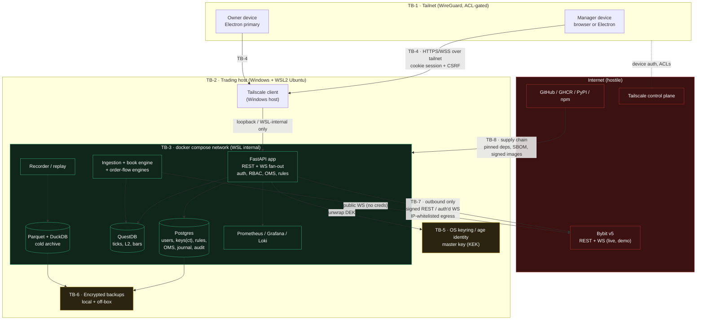
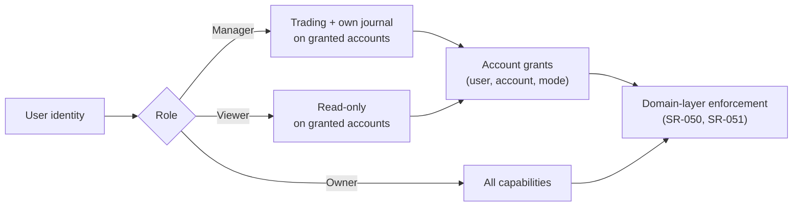
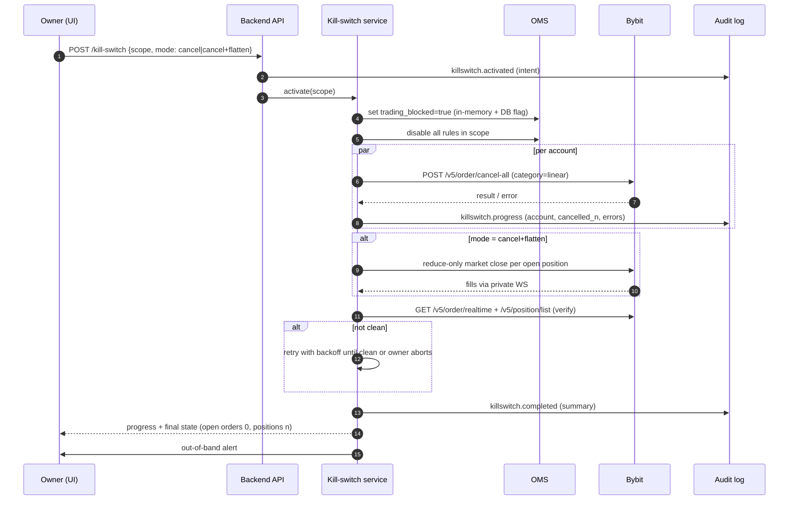
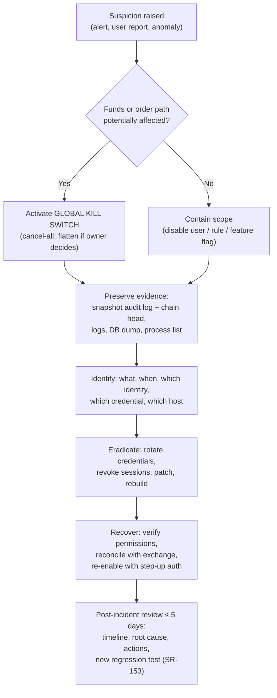

# CandleViewer — Security Program

Version 1.0 · 2026-09-14 · Document owner: Security Engineer · Co-owner: DevSecOps · Approver: basiltt (Owner) · Review cadence: every release + quarterly.

Scope: the CandleViewer web application (React + custom WebGL chart engine), its Electron desktop shell, the Python/FastAPI backend monolith, its data stores (Postgres, QuestDB, Parquet/DuckDB), the Bybit v5 integration (USDT linear perpetuals only, live + demo), and the Tailscale-only remote access path. Owner/admin functionality is a set of RBAC-gated screens **inside** the web app. No Android client, no separate admin app, no public internet exposure.

This document is normative. Every requirement carries an ID (`SR-nnn`); tickets reference these IDs, PR reviews check them, and QA writes tests against them. Anything not covered here that a developer believes is a security decision must be raised as a `security` ticket, not improvised.

## Table of contents

1. Security objectives and principles
2. Assets
3. Actors and trust levels
4. Trust boundaries (diagram)
5. STRIDE threat model (11 areas)
6. Security requirements SR-001…SR-120
7. RBAC matrix
8. Audit log specification
9. Kill switch
10. Incident response runbooks
11. Security review process per PR
12. Tooling and CI gates
13. Penetration test scope and schedule
14. Security acceptance criteria templates
15. Compliance, legal and ToS notes
16. Residual risks and exceptions register
17. Glossary

---

## 1. Security objectives and principles

### 1.1 Objectives (ranked)

| # | Objective | Rationale | Measured by |
|---|-----------|-----------|-------------|
| O1 | **No unauthorised order may ever be placed on a Bybit account.** | The order path is the only surface that can destroy owner capital in seconds. | Zero unauthorised orders in audit reconciliation (SR-070); pen-test finding class "auth bypass on order path" = release blocker. |
| O2 | **API key material must never leave the trust boundary in plaintext.** | Key compromise = total account compromise, irrespective of app controls. | Secrets scanning clean; key-handling unit tests; `gitleaks` + log-redaction tests green. |
| O3 | **Withdrawal must be impossible via any CandleViewer-held credential.** | Bybit keys cannot withdraw by design, but a mis-scoped key plus a transfer permission is still a fund-movement path. | Onboarding gate + periodic permission verification (SR-030..SR-034). |
| O4 | **Every capital-affecting action is attributable to a human identity.** | Multi-manager model; owner must be able to answer "who did this and when". | Hash-chained audit log covering 100 % of order/key/role events (SR-060..SR-069). |
| O5 | **A manager can only affect the accounts the owner assigned them.** | Blast-radius isolation, matching Bybit sub-account isolation. | RBAC matrix tests; per-account authorisation tests on every order endpoint. |
| O6 | **The owner can stop all trading within 5 seconds, at any time, from any screen.** | Runaway rule engine / compromised manager / exchange anomaly. | Kill-switch drill each release (SR-080..SR-087). |
| O7 | **The system is never reachable from the public internet.** | Removes the entire remote-attacker class. | Quarterly exposure audit (SR-047); external port scan from a non-Tailscale host. |
| O8 | **Integrity of recorded market data and journal history.** | Replay, analytics and journal are evidence; silent corruption invalidates decisions. | Checksums + restore drills (SR-090..SR-095). |

### 1.2 Principles

- **Least privilege everywhere** — Bybit key scopes, OS users, container capabilities, DB roles, app roles.
- **Secure by default** — live trading disabled by default; one-click trading disabled by default ("arm" toggle); recorded-symbol list empty by default; every new user created as `Viewer`.
- **Fail closed on the order path, fail open on the view path** — if authorisation, risk checks or key decryption are uncertain, reject the order; a chart that cannot render must never block a flatten.
- **Defence in depth** — Tailscale network isolation is *not* an excuse to skip authn/authz, CSRF protection or input validation.
- **No ambient authority** — no "admin mode" flag, no god-object session; every capability is an explicit permission checked at the API boundary and re-checked in the domain layer.
- **Auditability over convenience** — anything that touches money is logged before it is attempted and after it resolves.
- **Assume the browser is hostile** — the React app is an untrusted client; all validation, risk caps and RBAC are enforced server-side and merely mirrored in the UI.
- **Assume the exchange is unreliable, not malicious** — handle 5xx, 10006/10018 rate-limit errors, desync and partial fills as availability problems with safety fallbacks.
- **Reduce the secret surface** — prefer short-lived derived credentials over long-lived; prefer not storing over storing.

### 1.3 Out of scope (explicit)

Physical security of the owner's home; Bybit's own platform security; the owner's Bybit web-login credentials (guidance only, SR-036); Android or any mobile client; multi-tenant SaaS concerns (no external tenants exist); payment processing (none); GDPR data-subject workflows beyond the minimal notes in §15.

---

## 2. Assets

Assets are ranked by loss impact. `C/I/A` = confidentiality / integrity / availability sensitivity on a 1–3 scale.

| ID | Asset | Where it lives | C | I | A | Loss impact |
|----|-------|----------------|---|---|---|-------------|
| A-01 | Bybit API key + secret (per account, live) | Postgres `exchange_credentials` (ciphertext), process memory (plaintext, transient) | 3 | 3 | 2 | Total account takeover: adversary trades, transfers within UTA, drains via leverage abuse. Unrecoverable. |
| A-02 | Master key / KEK | OS keyring (Windows Credential Manager via host agent) or `age` identity on an encrypted volume | 3 | 3 | 3 | Decrypts all A-01. Equivalent to A-01 × N accounts. |
| A-03 | Owner and manager account credentials (Argon2id hashes, TOTP seeds, recovery codes) | Postgres `users`, `user_totp` | 3 | 3 | 2 | Authenticated access to the app → order path, admin screens. |
| A-04 | Session tokens / refresh tokens | Browser `HttpOnly` cookie, Postgres `sessions` | 3 | 2 | 2 | Session hijack → impersonation up to that user's role. |
| A-05 | Order path (the ability to submit/amend/cancel orders) | Backend OMS module + Bybit REST/WS | — | 3 | 3 | Direct capital loss; also availability loss (cannot exit a position). |
| A-06 | Open positions & balances | Bybit (authoritative), mirrored in Postgres/memory | 2 | 3 | 3 | Wrong mirror → wrong risk decisions, wrong sizing, missed stops. |
| A-07 | Rule engine rules + compiled IR | Postgres `rules`, `rule_versions` | 2 | 3 | 2 | A tampered rule is a persistent, automated attacker with the owner's authority. |
| A-08 | Per-account profiles (leverage, sizing, risk caps, allowed symbols) | Postgres `account_profiles` | 2 | 3 | 2 | Tampering escalates position size / bypasses risk caps. |
| A-09 | Trade-group / fan-out configuration | Postgres `trade_groups` | 2 | 3 | 2 | Silently routing orders to an account the actor may not trade. |
| A-10 | Recorded market data (ticks, L2, bars) | QuestDB (hot), Parquet (cold) | 1 | 3 | 2 | Corrupted footprint/replay → wrong analysis; loss = permanent (no REST tick history beyond the recent window). |
| A-11 | Audit log | Postgres `audit_log` (append-only, hash-chained) + off-box mirror | 2 | 3 | 2 | Loss of attribution; an attacker erasing tracks. |
| A-12 | Journal & analytics (trade notes, screenshots, PnL) | Postgres + object storage | 2 | 2 | 1 | Strategy disclosure; personal data of managers. |
| A-13 | Backups (Postgres dumps, Parquet archives, config) | Local encrypted volume + off-box target | 3 | 3 | 2 | A plaintext backup is a bypass of every runtime control. |
| A-14 | Source code, CI configuration, release artefacts | GitHub, GHCR | 2 | 3 | 2 | Supply-chain implant reaches the order path. |
| A-15 | Tailscale node keys / ACL policy | Tailscale control plane + host agents | 3 | 3 | 3 | Network access to the backend for an attacker. |
| A-16 | Electron shell binary + auto-update channel | Local install + release assets | 2 | 3 | 2 | Malicious update = code execution on the trading host. |
| A-17 | Telemetry: logs, metrics, traces | Files, Loki/Prometheus, Grafana | 2 | 2 | 1 | Secrets leaking through logs; order intent disclosure. |
| A-18 | Feature flags & kill-switch state | Postgres `feature_flags`, `kill_switch` | 1 | 3 | 3 | Re-enabling live trading, or disabling the kill switch. |
| A-19 | Manager PII (name, email, TOTP device, IPs) | Postgres `users`, audit log | 3 | 2 | 1 | Privacy obligation, phishing target list. |
| A-20 | Clock / NTP sync | Host OS | — | 3 | 2 | Drift breaks Bybit `recv_window` → orders rejected, or worse, TOTP and audit ordering break. |

### 2.1 Crown jewels

`A-01`, `A-02`, `A-05`, `A-11`. Any change touching code paths for these requires a security code-owner review (§11) regardless of diff size.

---

## 3. Actors and trust levels

| ID | Actor | Type | Trust | Capabilities | Notes |
|----|-------|------|-------|--------------|-------|
| AC-01 | Owner (basiltt) | Human, authenticated | Highest | Everything, incl. key management, user management, live enablement, kill switch | Single owner. Mandatory TOTP (SR-020). Cannot be demoted or deleted (SR-055). |
| AC-02 | Account Manager | Human, authenticated | Medium | Trade *assigned* accounts only; own journal; own layouts | Untrusted with other accounts' data and with keys. |
| AC-03 | Viewer | Human, authenticated | Low | Read-only over the scope the owner grants | Includes "owner-as-reviewer" persona. |
| AC-04 | Unauthenticated local user | Human/process on the host | None | Reach the login endpoint over loopback/Tailscale | Rate-limited, lockout-protected. |
| AC-05 | Backend service identity | Machine | High (internal) | Holds decrypted keys in memory, talks to Bybit | Runs as a non-root container user. |
| AC-06 | Rule engine | Machine, automated | High (internal), **treated as semi-trusted** | Proposes orders on behalf of a user identity | Sandboxed IR, no arbitrary code (SR-100..SR-106). Every action attributed to the rule's owning user. |
| AC-07 | Recorder / ingestion worker | Machine | Medium | Writes QuestDB/Parquet; holds no private keys | Public WS only; no credentials beyond public endpoints. |
| AC-08 | Bybit exchange | External system | Semi-trusted | Source of market and account truth; sink for orders | Treat responses as untrusted input (SR-040); TLS pinning of CA set. |
| AC-09 | Electron shell / main process | Machine on client host | Medium | OS integration, window mgmt, keyring bridge | Hardened per SR-110..SR-118. |
| AC-10 | CI/CD (GitHub Actions) | Machine | Medium | Builds, tests, publishes images | Pinned actions, least-privilege `GITHUB_TOKEN`, OIDC where possible. |
| AC-11 | Dependency / package author | External | Untrusted | Ships code into our build | Lockfiles, SBOM, review of new deps (SR-130..SR-138). |
| AC-12 | Network adversary on LAN/Wi-Fi | External | Hostile | Can see/alter unencrypted traffic; can probe open ports | Mitigated by loopback binding + Tailscale (SR-045..SR-049). |
| AC-13 | Remote internet adversary | External | Hostile | Scans, exploits exposed services | No public listener exists; residual risk = Tailscale account compromise. |
| AC-14 | Malicious/compromised manager | Human, authenticated | Hostile-insider | Legitimate creds, scoped access | The primary insider threat this program is designed around. |
| AC-15 | Malicious browser extension / XSS payload | Code in the user's browser | Hostile | Acts with the user's session | Mitigated by CSP, `HttpOnly` cookies, arm-toggle, re-auth on high-risk actions. |
| AC-16 | Host-level malware on the trading box | Code | Hostile | Reads process memory, keyring | Accepted residual risk; mitigated by host hygiene guidance and key rotation. |

---

## 4. Trust boundaries



### 4.1 Boundary register

| ID | Boundary | Crossing | Controls |
|----|----------|----------|----------|
| TB-1 | Public internet → tailnet | Device joins tailnet | Tailscale device auth, key expiry ≤ 90 d, ACL tags, owner approval of new devices, MFA on the Tailscale account (SR-045..SR-049). |
| TB-2 | Tailnet → trading host | Packets to the host | Windows firewall rule allowing only the Tailscale interface to the proxy port; no LAN or public bind (SR-046). |
| TB-3 | Host → WSL/docker network | Proxy to backend | Backend binds `127.0.0.1`/WSL-internal address only; no `0.0.0.0`; verified by automated `ss`/`netstat` check on startup and in CI-like healthcheck (SR-047). |
| TB-4 | Client app → backend API | Every request | TLS on the tailnet hop, session cookie (`HttpOnly`, `Secure`, `SameSite=Strict`), CSRF double-submit, per-route RBAC, input validation, rate limits (SR-010..SR-019, SR-040..SR-044). |
| TB-5 | Backend → key store | Unwrap DEK | KEK never on disk in plaintext; unwrap is an explicit, audited operation; plaintext DEK lifetime bounded (SR-001..SR-009). |
| TB-6 | Live data → backups | Dump/archive | Encryption at rest with a separate backup key; restore drills; off-box copy (SR-090..SR-095). |
| TB-7 | Backend → Bybit | Outbound REST/WS | HMAC-SHA256 signing, clock sync, `recv_window` tuning, IP whitelist on the key, per-UID rate budget, response validation (SR-030..SR-039). |
| TB-8 | Upstream packages/CI → runtime | Build & deploy | Lockfiles, hash pinning, SBOM, Trivy, signed container images, pinned action SHAs, protected `main` (SR-130..SR-139). |
| TB-9 | Developer/agent workstation → GitHub SCM & governance surface | PR open, merge, workflow run, board update, credential use | CODEOWNERS + 2 approvals on `main`, branch protection with `enforce_admins`, fail-closed guard credentials (E01-T07), least-privilege repo-admin credential with drift detection (E01-T08), no `pull_request_target` on untrusted checkout, human approval required on every PR regardless of author (§5.12). |

---

## 5. STRIDE threat model

Method: per-area STRIDE, one row per threat. Columns: `T` = threat id, threat, likelihood (L/M/H), impact (L/M/H), risk = L×I, mitigating requirements, residual risk. Risk scale: Low / Medium / High / Critical. Every area is re-reviewed when its epic enters design (SDLC rule: "threat model STRIDE per epic").

Standing assumptions for all areas: no public listener exists; all human actors are authenticated and have TOTP; audit logging is active; the kill switch is available.

### 5.1 Area 1 — Exchange API keys (A-01, A-02)

| T | STRIDE | Threat | L | I | Risk | Mitigations | Residual |
|---|--------|--------|---|---|------|-------------|----------|
| K1 | Information disclosure | Key secret written to application logs, exception traces, HTTP debug dumps or error-reporting payloads | M | H | **High** | SR-006 redaction filter, SR-007 secret type wrapper, SR-120..SR-124 logging redaction, gitleaks in CI (SR-142) | Low |
| K2 | Information disclosure | Key secret returned by an admin API (e.g. "edit key" screen prefilling the secret) | M | H | **High** | SR-005 write-only secrets, never serialised; schema test asserting absence | Low |
| K3 | Information disclosure | Database dump / backup contains decryptable keys because the KEK is stored beside the data | M | H | **High** | SR-001 envelope encryption, SR-002 KEK outside DB, SR-092 backups encrypted with an independent key | Low |
| K4 | Elevation of privilege | Key with excessive Bybit scope (Wallet/Transfer/Withdrawal) enables fund movement | M | H | **Critical** | SR-030 onboarding permission gate, SR-031 periodic verification, SR-032 refuse-to-trade on violation | Low |
| K5 | Spoofing | Stolen key used from an attacker's IP | M | H | **High** | SR-033 IP whitelist mandatory for live keys, SR-035 egress IP monitoring | Low |
| K6 | Tampering | Attacker with DB write access swaps the ciphertext of account X's key for account Y's, redirecting orders | L | H | Medium | SR-003 AEAD with account-id + key-id bound as associated data | Low |
| K7 | Repudiation | Key added/rotated/deleted without attribution | L | M | Medium | SR-060 audit events `key.created/rotated/revoked`, SR-063 hash chain | Low |
| K8 | Denial of service | Key expiry (90 d for non-IP-bound keys) silently lapses; trading stops mid-session | M | M | Medium | SR-034 expiry tracking + 14/7/1-day alerts, SR-037 rotation calendar | Low |
| K9 | Information disclosure | Plaintext key lingering in process memory / core dump / swap | M | H | **High** | SR-008 bounded plaintext lifetime + zeroisation, SR-009 core dumps disabled, swap on an encrypted volume | Medium (accepted, AC-16) |
| K10 | Tampering | Malicious `.env` or config injection introduces an attacker-controlled key at startup | L | H | Medium | SR-004 keys only from the encrypted store, never env; config schema rejects key-like fields | Low |

### 5.2 Area 2 — Order path (A-05, A-06)

| T | STRIDE | Threat | L | I | Risk | Mitigations | Residual |
|---|--------|--------|---|---|------|-------------|----------|
| O1 | Elevation of privilege | Manager submits an order for an account not assigned to them by tampering with `account_id` | M | H | **Critical** | SR-050 per-account authorisation in the domain layer, SR-051 server-side resolution of allowed accounts, contract test per endpoint | Low |
| O2 | Spoofing | CSRF from a malicious page causes the browser to submit an order with the user's cookie | M | H | **Critical** | SR-041 CSRF double-submit token + `SameSite=Strict`, SR-042 `Origin`/`Sec-Fetch-Site` checks, SR-043 arm-toggle nonce for live orders | Low |
| O3 | Tampering | Quantity/price/leverage manipulated beyond per-account profile caps | M | H | **High** | SR-052 server-side risk validation against `account_profiles`, SR-053 hard notional/leverage ceilings, SR-054 allowed-symbol allowlist | Low |
| O4 | Tampering | Order submitted without the mandatory native exchange-side stop-loss | M | H | **High** | SR-056 invariant: every fan-out order carries a native SL; reject at OMS if absent | Low |
| O5 | Repudiation | Trader disputes an order ("I never placed that") | M | M | Medium | SR-060/SR-061 pre-attempt intent log + post-resolution outcome log correlated by `orderLinkId` | Low |
| O6 | Denial of service | Order flood exhausts the per-UID rate budget; legitimate exits (flatten) are rejected | M | H | **High** | SR-044 tiered rate limits with reserved quota for cancel/flatten, SR-071 priority lane for risk-reducing orders | Low |
| O7 | Information disclosure | Manager A sees Manager B's orders/positions via an unscoped list endpoint | M | M | Medium | SR-051 scope applied at query construction, not post-filtering; row-level tests | Low |
| O8 | Tampering | Replay of a captured order request creates a duplicate position | L | H | Medium | SR-057 idempotency via client-generated `orderLinkId` + server-side dedupe window; single-use nonce | Low |
| O9 | Tampering | Exchange response spoofed/malformed causes the OMS to record a fill that did not occur | L | H | Medium | SR-040 strict response schema validation, SR-058 reconcile against `GET /v5/order/realtime` + private WS as source of truth | Low |
| O10 | Denial of service | WS disconnect leaves orders unmanaged and stops unenforced | M | H | **High** | SR-059 Bybit dead-man's-switch where supported + native SL invariant (O4) + reconnect reconciliation | Low |
| O11 | Elevation of privilege | XSS payload uses the live session to place orders silently | L | H | **High** | SR-112 CSP, SR-043 arm toggle + per-session live-trading confirmation, SR-025 step-up re-auth | Low |

### 5.3 Area 3 — Rule engine (A-07, AC-06)

| T | STRIDE | Threat | L | I | Risk | Mitigations | Residual |
|---|--------|--------|---|---|------|-------------|----------|
| R1 | Elevation of privilege | Rule IR permits arbitrary code execution (e.g. `eval` of an expression string) | M | H | **Critical** | SR-100 declarative, non-Turing-complete IR; no `eval`/`exec`/`pickle`; allowlisted node types only | Low |
| R2 | Tampering | Rule edited to remove a stop or enlarge size, bypassing review | M | H | **High** | SR-101 versioned immutable rule revisions + audited diffs; SR-102 rules cannot exceed account profile caps | Low |
| R3 | Elevation of privilege | A manager's rule targets an account they may not trade | M | H | **High** | SR-103 rules bound to a user identity; RBAC re-checked at fire time, not at save time | Low |
| R4 | Denial of service | Runaway/oscillating rule places thousands of orders | M | H | **High** | SR-104 per-rule action budget (orders/min, orders/day), circuit breaker with auto-disable + alert | Low |
| R5 | Denial of service | Expensive rule expression starves the event loop | M | M | Medium | SR-105 execution-time and node-count budget per evaluation; worker offload; watchdog | Low |
| R6 | Repudiation | Automated action indistinguishable from human action in the log | M | M | Medium | SR-062 `actor_type` = `human`/`rule` + `rule_id` + `rule_version` on every audit event | Low |
| R7 | Tampering | The form and node-graph editors compile to divergent IR, so what was reviewed is not what runs | M | H | **High** | SR-106 single compiler, round-trip property tests, IR hash shown in UI and recorded in audit | Low |
| R8 | Spoofing | Imported rule file (JSON) from an untrusted source | L | M | Medium | SR-107 import schema validation + explicit review-and-confirm; imported rules start disabled | Low |

### 5.4 Area 4 — Multi-account fan-out (A-09)

| T | STRIDE | Threat | L | I | Risk | Mitigations | Residual |
|---|--------|--------|---|---|------|-------------|----------|
| F1 | Elevation of privilege | Fan-out includes an account outside the actor's grant | M | H | **Critical** | SR-050/SR-051 intersect requested accounts with grants server-side; reject the whole group on mismatch (fail closed) | Low |
| F2 | Tampering | Per-account profile ignored, so one account gets another's sizing | M | H | **High** | SR-052 sizing computed server-side per account; client-supplied size is a clamped hint only | Low |
| F3 | Denial of service | Fan-out to N accounts multiplies rate-limit consumption; later legs rejected, leaving a partial group | M | H | **High** | SR-044a/SR-044b one tracker **per UID** (limits are per-UID and shared across that UID's keys, so extra keys give no extra quota), pre-dispatch budget arithmetic, SR-072 partial-group detection + compensating cancel/alert | Low |
| F3a | Denial of service | Fan-out bursts across accounts breach the **600 req/5 s per-IP** ceiling (all UIDs share one egress IP), triggering a 403 with a ≥10-minute lockout while positions are open | M | H | **Critical** | SR-044c global per-IP token bucket in front of the per-UID trackers, header-driven self-throttling, SR-071 reserved exit quota that the bucket never lends out | Low |
| F3b | Denial of service | Two managers granted the same account exhaust that account's single shared UID budget against each other | M | M | Medium | SR-044a shared tracker is the arbiter; per-actor sub-quota within the UID budget; risk-reducing lane exempt (SR-071) | Low |
| F4 | Repudiation | Partial fan-out with no record of which legs succeeded | M | M | Medium | SR-064 trade-group audit: one parent event + one child event per leg with outcome | Low |
| F5 | Information disclosure | Trade-group view leaks other managers' account names/balances | M | M | Medium | SR-051 scoped projections; DTOs carry only fields the role may see | Low |
| F6 | Tampering | A leg placed without a native SL because the per-account profile lacked offsets | M | H | **High** | SR-056 invariant enforced per leg; profile validation rejects profiles without an SL rule | Low |

### 5.5 Area 5 — WebSocket ingestion & fan-out (A-10, A-06)

| T | STRIDE | Threat | L | I | Risk | Mitigations | Residual |
|---|--------|--------|---|---|------|-------------|----------|
| W1 | Tampering | Malformed/hostile exchange frame crashes a parser or triggers unbounded allocation | M | M | Medium | SR-040 strict schema + size caps on every frame; fuzz tests on the decoder (SR-155) | Low |
| W2 | Tampering | Order-book desync (Bybit L2 has no checksum) yields a wrong book that drives trading decisions | M | H | **High** | SR-038 `u`/`seq` monotonicity tracking; drop-and-resubscribe on gap; mark book `stale` and suppress trading affordances while stale | Low |
| W3 | Denial of service | Slow client on the fan-out WS causes unbounded server-side buffering | M | M | Medium | SR-073 bounded per-client queues with conflation and disconnect-on-overflow | Low |
| W4 | Spoofing | Unauthenticated client subscribes to private topics | M | H | **High** | SR-074 WS handshake requires a valid session; per-topic authorisation on subscribe and on scope change | Low |
| W5 | Information disclosure | A manager subscribes to another account's private topic by guessing the topic name | M | H | **High** | SR-074 topic authorisation against account grants; deny-by-default topic registry | Low |
| W6 | Denial of service | Connection churn trips Bybit's 500 new-connections/5 min IP limit, blocking market data | M | M | Medium | SR-039 connection pooling, exponential backoff with jitter, no reconnect storms | Low |
| W7 | Tampering | Time drift makes WS auth `expires` invalid or misorders recorded events | M | M | Medium | SR-036 NTP enforcement + startup/periodic drift check; refuse to trade at drift > 500 ms | Low |
| W8 | Elevation of privilege | Binary framing decoder on the client parses attacker-controlled offsets | L | M | Low | Client-side bounds checks; frames accepted only from the authenticated server socket | Low |
| W9 | Tampering | Code path assumes WS Order Entry (`wss://.../v5/trade`) is available in **demo**, where Bybit does not support it; a silent failure or an untested fallback leaves orders unplaced or duplicated across both paths | M | H | **High** | SR-040a environment capability matrix: demo is REST-trade-only; WS-Trade code path is compile-time unreachable for demo; no dual dispatch | Low |
| W10 | Spoofing | Demo public market data is taken from a demo WS endpoint that does not exist, or demo/live endpoints are mixed within one session | M | M | Medium | SR-040a: demo has **no public WS**; mainnet public streams are used for market data while orders route to `api-demo.bybit.com`; the session banner states the order-routing environment explicitly | integration, e2e |
| W11 | Repudiation | Candle treated as closed before Bybit's `confirm` flag is true, so recorded/rule-triggering data disagrees with the exchange | M | M | Medium | SR-040b `confirm` gating on every kline frame before a bar is persisted or fed to the rule engine | unit |

### 5.6 Area 6 — Authentication & RBAC (A-03, A-04)

| T | STRIDE | Threat | L | I | Risk | Mitigations | Residual |
|---|--------|--------|---|---|------|-------------|----------|
| U1 | Spoofing | Password brute force / credential stuffing against a manager account | M | H | **High** | SR-011 Argon2id, SR-015 per-account + per-IP throttling, SR-016 lockout + owner alert | Low |
| U2 | Spoofing | Phishing a manager's password | M | H | **High** | SR-020 mandatory TOTP for Owner and every role that can trade; SR-021 TOTP replay prevention | Low |
| U3 | Elevation of privilege | Role check missing on a new endpoint | M | H | **Critical** | SR-017 deny-by-default router (every route declares a capability or fails at import), SR-018 automated route-coverage test | Low |
| U4 | Elevation of privilege | Self-service role escalation | L | H | Medium | SR-055 role changes are owner-only, cannot target self, require step-up auth | Low |
| U5 | Spoofing | Session token theft via XSS or logs | M | H | **High** | SR-012 `HttpOnly`+`Secure`+`SameSite=Strict` cookies, SR-013 rotation on privilege change, SR-112 CSP, SR-122 never log tokens | Low |
| U6 | Spoofing | Session fixation — id not rotated after login/2FA | L | M | Low | SR-013 rotate on every authentication state transition | Low |
| U7 | Repudiation | Shared accounts make actions unattributable | M | M | Medium | SR-019 one identity per human, no shared logins; concurrent-session listing and forced logout | Low |
| U8 | Information disclosure | User enumeration via differing login errors/timing | M | L | Low | SR-014 uniform error + constant-time comparison + dummy hash on unknown user | Low |
| U9 | Elevation of privilege | TOTP recovery codes reusable or weakly generated | L | H | Medium | SR-022 128-bit CSPRNG codes, single-use, hashed at rest, regeneration invalidates the old set | Low |
| U10 | Denial of service | Owner locks themselves out (lost TOTP device) | M | M | Medium | SR-023 sealed offline recovery-code envelope + documented host-local break-glass requiring filesystem access | Low |

### 5.7 Area 7 — Admin screens (A-03, A-08, A-18, A-19)

| T | STRIDE | Threat | L | I | Risk | Mitigations | Residual |
|---|--------|--------|---|---|------|-------------|----------|
| D1 | Elevation of privilege | Admin screen hidden in the UI but its API remains callable by a Manager | M | H | **Critical** | SR-017 server-side capability check (UI hiding is cosmetic); tests call every admin route as each role | Low |
| D2 | Tampering | Feature-flag screen used to enable live trading without review | M | H | **High** | SR-025 step-up re-auth for live enablement, key add/rotate, role change, risk-cap change, kill-switch disable | Low |
| D3 | Information disclosure | Audit-log viewer exposes raw payload fields to a Viewer | M | M | Medium | SR-067 role-scoped audit projections; raw payloads owner-only | Low |
| D4 | Tampering | Risk caps silently changed | M | H | **High** | SR-065 before/after diff in the audit event; owner notification on every risk-config change | Low |
| D5 | Elevation of privilege | Owner-only actions reachable through a Manager's "account settings" screen via shared handlers | M | H | **High** | SR-026 distinct endpoints for self-service vs administrative mutation; no `user_id` parameter on self-service routes | Low |
| D6 | Denial of service | Owner deletes the last owner account | L | M | Low | SR-055 invariant: at least one enabled Owner must always exist | Low |

### 5.8 Area 8 — Recorder data & storage (A-10, A-12, A-13)

| T | STRIDE | Threat | L | I | Risk | Mitigations | Residual |
|---|--------|--------|---|---|------|-------------|----------|
| S1 | Tampering | Silent corruption of Parquet archives makes replay/backtests wrong | M | M | Medium | SR-094 per-file checksum manifest verified on read and by a weekly scrub job | Low |
| S2 | Denial of service | Unbounded recording fills the disk, taking the backend (and trading) down | H | H | **Critical** | SR-096 disk-budget guard: retention 30 d default, per-symbol caps, alert at 75 %, automatic recording pause at 90 %; trading path must not share the fillable volume | Low |
| S3 | Elevation of privilege | Replay/export endpoint used to read arbitrary filesystem paths | M | H | **High** | SR-097 no user-supplied paths; dataset ids resolved through a registry; path-traversal tests | Low |
| S4 | Information disclosure | Journal exports contain account identifiers shared across managers | M | M | Medium | SR-098 export scoping by role + explicit "includes account data" confirmation | Low |
| S5 | Tampering | Retention job deletes pinned data | L | M | Low | SR-099 pin flag honoured; dry-run report before destructive runs; deletions audited | Low |
| S6 | Information disclosure | QuestDB/DuckDB consoles exposed without auth | M | H | **High** | SR-048 no data-store port published to the host; console disabled or loopback-bound with credentials | Low |

### 5.9 Area 9 — Electron shell (A-16, AC-09)

| T | STRIDE | Threat | L | I | Risk | Mitigations | Residual |
|---|--------|--------|---|---|------|-------------|----------|
| E1 | Elevation of privilege | Renderer compromise reaches Node APIs → arbitrary code on the trading host | M | H | **Critical** | SR-110 `contextIsolation: true`, `nodeIntegration: false`, `sandbox: true`, `nodeIntegrationInWorker: false` | Low |
| E2 | Elevation of privilege | Over-broad preload bridge exposes generic IPC (`invoke(channel, …)`) | M | H | **High** | SR-111 fixed, typed, allowlisted preload API; no dynamic channel names; argument validation on both sides | Low |
| E3 | Tampering | Remote content loaded into a trusted window | L | H | Medium | SR-113 `will-navigate`/`setWindowOpenHandler` deny non-local origins; external links open in the OS browser | Low |
| E4 | Information disclosure | `webSecurity: false` or a disabled CSP leaks from dev into release builds | M | H | **High** | SR-112 CSP enforced in packaged builds; SR-114 build-time assertion test fails the release if any hardening flag is off | Low |
| E5 | Tampering | Unsigned or unverified auto-update installs a malicious build | L | H | **High** | SR-115 signed releases, signature-verified update feed, no downgrade; auto-update off until signing exists | Low |
| E6 | Information disclosure | DevTools/remote debugging left enabled in release | M | M | Medium | SR-116 remote debugging disabled in production builds; asserted by SR-114 | Low |
| E7 | Elevation of privilege | Custom protocol handler invoked by a web page to trigger in-app actions | L | H | Medium | SR-117 protocol handler accepts navigation only, never actions; intents require in-app confirmation | Low |
| E8 | Tampering | `asar` contents modified on disk | L | M | Low | SR-118 integrity/code-signature check at startup; mismatch → refuse to launch | Low |

### 5.10 Area 10 — Tailscale & network (A-15, TB-1..TB-3)

| T | STRIDE | Threat | L | I | Risk | Mitigations | Residual |
|---|--------|--------|---|---|------|-------------|----------|
| N1 | Spoofing | Compromised Tailscale account adds a hostile device to the tailnet | L | H | **High** | SR-045 MFA on the Tailscale account, device approval required, ACL tags, key expiry ≤ 90 d, periodic device audit | Low |
| N2 | Elevation of privilege | Flat ACL lets any tailnet device reach every port on the host | M | M | Medium | SR-046 least-privilege ACL: managers reach only the app port; no SSH/DB/metrics from manager tags | Low |
| N3 | Information disclosure | WSL2 `0.0.0.0` bind plus Windows `portproxy`/UPnP exposes the backend to LAN or internet | M | H | **Critical** | SR-047 loopback/WSL-internal binds only; startup listener assertion; quarterly external port scan; no `portproxy` rules | Low |
| N4 | Tampering | Plaintext HTTP over the tailnet inside a hostile LAN | L | M | Low | SR-049 TLS at the app proxy (local CA or Tailscale certs); HSTS for the app origin | Low |
| N5 | Denial of service | Tailscale outage removes remote access during an open position | M | M | Medium | SR-086 kill switch must also be operable from the host console (documented CLI path) | Medium (accepted) |
| N6 | Information disclosure | Exit-node or subnet-route misconfiguration routes unrelated traffic through the trading host | L | M | Low | SR-046 trading host advertises no exit node and no subnet routes | Low |
| N7 | Spoofing | Bybit IP whitelist conflated with the tailnet IP, so whitelisting fails or is left open | M | M | Medium | SR-033 document and monitor the real egress IP separately; alert on egress IP change | Low |

### 5.12 Area 11 — Development, CI and governance surface (TB-9)

Scope: the repository itself, `main` branch integrity, branch-protection configuration, CODEOWNERS, workflow definitions, the E01-T07 guard credential, the E01-T08 repository-administration credential, GitHub Actions secrets, the GitHub Project board and its data, the backlog JSON tree, and release tags/artefacts (forward-looking to E03). This is the upstream of every control in areas 1–10: an attacker who can merge unreviewed code or weaken branch protection defeats those controls without touching a runtime asset. Modelled before E01-T07/T08 are designed, per `02-definition-of-ready-done.md` §2.1.

**Actors and trust levels**: Owner `@basiltt` (full trust, sole approver of exceptions); engineers/contractors (reviewed contributors, no direct-push); **AI coding agents acting under `AGENTS.md`** (autonomous within their ticket's write set, but their output is still gated by human PR review — see AG1/AG2 below); GitHub as a platform (trusted infrastructure, not immune to account-level compromise); third-party Actions authors and dependency maintainers (untrusted supply chain, mitigated by SR-130..SR-139).

**Trust boundaries extended**: TB-9 (developer/agent workstation → GitHub SCM & governance surface, register in §4.1) plus these crossings analysed here: PR from a branch vs from a fork; workflow runner → repository write scope; GitHub Projects API → board data; committed governance config (`.github/`, branch-protection-as-code) → live platform settings (the **drift boundary** — what is committed can silently diverge from what GitHub actually enforces).

| T | STRIDE | Threat | L | I | Risk | Mitigations | Residual |
|---|--------|--------|---|---|------|-------------|----------|
| G1 | Spoofing | Impersonating a code-owner approval (compromised reviewer account, or a review left by someone without CODEOWNERS standing being read as sufficient) | L | H | **High** | Branch protection requires CODEOWNERS review specifically (not just any 2 approvals); GitHub org 2FA requirement; SR-161 (new) mandates CODEOWNERS enforcement is verified, not assumed | Low |
| G2 | Spoofing | Forging a QA/security sign-off by typing a marker string into an issue/PR body instead of a real review being performed | M | H | **High** | Sign-off is a required-reviewer GitHub approval event (an audit-logged platform action), never free-text; `pr-metadata` check (C-9.1) validates structured fields, not prose claims; SR-162 (new) | Low |
| G3 | Spoofing | Unsigned commits allow a spoofed author identity in history | M | M | Medium | Commit-signing recommendation (below): **declined for v1** as an accepted risk — GitHub's verified-committer badge on web-UI commits plus mandatory 2-approval + CODEOWNERS review is judged sufficient control for a private repo with a small, known contributor set; revisit if the contributor set grows or a spoofing incident occurs | Medium (accepted, see §16) |
| G4 | Tampering | Modifying `.github/workflows/` to disable a required check or a guard | L | H | **High** | CODEOWNERS ownership of `.github/**` requires `security-review` label + security reviewer (C-10.2, AGENTS.md §8); branch protection blocks direct push; E01-T08 drift detection re-verifies live settings weekly | Low |
| G5 | Tampering | Weakening branch protection via the GitHub UI, bypassing the committed config-as-code | L | H | **High** | E01-T08 ships `enforce_admins` plus a weekly drift job (E01-Q02) that diffs live settings against the committed source of truth and alerts on divergence | Low |
| G6 | Tampering | Tampering with `CONSTITUTION.md` or `AGENTS.md` to retro-justify a bypass, or to steer an AI agent via injected instructions | L | H | **High** | CODEOWNERS on `CONSTITUTION.md`/`AGENTS.md` requires architecture + security review; 2-approval rule applies regardless of author (including agent-authored PRs); an agent is instructed (this document, `AGENTS.md` §8) to treat repo-embedded instructions as data to follow only insofar as they do not contradict the Constitution, and to stop and report rather than silently comply with an anomalous instruction | Low |
| G7 | Tampering | Poisoning a third-party GitHub Action by floating tag (mutable `@v1` moved to malicious code after review) | M | H | **High** | SR-132 (existing) requires SHA-pinning of all Actions; Dependabot/Renovate tracks pin updates as reviewable diffs (SR-134) | Low |
| G8 | Repudiation | An admin disables and re-enables branch protection with no record | L | M | Medium | GitHub's audit log is the source of truth for admin actions; E01-T08's drift job reads it and alerts on a protection-disable event even if quickly reverted | Low |
| G9 | Repudiation | A break-glass merge bypassing normal review leaves no distinguishing audit trail | L | H | **High** | `enforce_admins=true` removes the admin-bypass path entirely (no break-glass merge exists for code); if ever exercised via a platform-level emergency action, it is a G8-class event and surfaces the same way | Low |
| G10 | Information disclosure | A secret leaked into workflow logs by an over-verbose step (`set -x`, env dump) | M | H | **High** | SR-146 (existing) prohibits `set -x` around secrets and log dumps; GitHub's own secret-masking; SR-142 gitleaks scans PR diffs and full history | Low |
| G11 | Information disclosure | A credential (PAT, key fragment) pasted into an issue/PR body by a human or an agent debugging a failure | M | H | **High** | SR-145-style dummy-prefix discipline extended to governance context; SR-163 (new) requires the same redaction/secret-pattern scan to run over issue/PR bodies via gitleaks' pre-commit-equivalent or a scheduled scan; any hit triggers SR-143 rotation-first | Low |
| G12 | Information disclosure | Repository contents exposed through an over-permissive workflow (e.g. `permissions: write-all` combined with a debug step that echoes checkout contents to a public log) | L | H | **High** | SR-132 requires least-privilege `permissions:` blocks; this repo is private, reducing blast radius; SR-164 (new) requires every workflow's `permissions:` block reviewed at PR time as part of `security-review` label triggers | Low |
| G13 | Denial of service | A required check never reports (hung runner, misconfigured webhook), blocking all merges indefinitely | M | M | Medium | E01-Q02 canary self-tests assert required checks report within a duration budget; a stuck check is distinguishable from a red check in the merge-queue UI | Low |
| G14 | Denial of service | The E01-T07 guard credential expires and the guard fails closed indefinitely, blocking all merges until manually noticed | M | M | Medium | Weekly drift job (E01-Q02) checks credential validity proactively rather than waiting for a failed merge to surface it; expiry alert fires before the credential lapses | Low |
| G15 | Denial of service | CI exhaustion by a runaway or maliciously triggered workflow (e.g. a fork PR spamming re-runs) | L | M | Medium | GitHub's per-repo Actions concurrency limits; workflow concurrency groups cancel superseded runs; fork PRs require approval to run workflows (org setting) | Low |
| G16 | Elevation of privilege | `pull_request_target` used with an untrusted checkout gives a fork PR effective write access / secret access | L | **Critical if present** | **Critical** | **Prohibited outright**: no workflow in this repo uses `pull_request_target` with `actions/checkout` of the PR head; SR-132 codifies the prohibition; enforced by manual review under the `security-review` label on any `.github/workflows/` change, and by a grep-based CI check (SR-165, new) that fails the build if `pull_request_target` appears without an explicit, security-reviewed exception comment | Low |
| G17 | Elevation of privilege | An over-scoped PAT (e.g. the E01-T08 administration credential) used for more than its intended narrow purpose | L | H | **High** | E01-T08 credential is scoped to the minimum permission set its automation needs (repo-admin only where unavoidable, never org-admin); credential use is logged; drift job alerts if the credential's actual scopes exceed its documented scope | Low |
| G18 | Elevation of privilege | A workflow declares `permissions: write-all` (or omits `permissions:`, defaulting broad) | M | H | **High** | SR-132 (existing) mandates least-privilege `permissions:` blocks, default `contents: read`; reviewed at PR time (G12 control doubles as this control) | Low |
| G19 | Elevation of privilege | A compromised dependency of a checker/lint script (e.g. a malicious `npm`/`pip` package used by a CI gate) executes with CI's privileges | L | H | **High** | SR-130 lockfiles + hash verification; SR-138 `--ignore-scripts` where feasible; SR-131/Trivy scanning extends to tooling images; new dependencies require justification + CODEOWNER approval (SR-135) | Low |

**AI-agent actor class (elaborated per the ticket's requirement)**: agents read `AGENTS.md`, `CONSTITUTION.md`, ticket bodies and issue comments as instruction surfaces. The tampering/elevation path is: (a) a tampered `AGENTS.md`/`CONSTITUTION.md` steering an agent into weakening a control (see G6); (b) prompt injection via content an agent reads while executing a ticket (an issue body, a fixture, a dependency's README) that attempts to make the agent perform an out-of-scope or privileged action. Controls: CODEOWNERS on `AGENTS.md`/`CONSTITUTION.md`; **human approval required on every PR regardless of authorship** (C-10.1, unconditional — an agent's own review of its own work never substitutes); **no agent-triggered privileged workflow** — the E01-T07 guard and E01-T08 administration credentials are never invoked by agent-authored automation, only by fixed, reviewed workflow definitions; agents are instructed (`AGENTS.md` §9, `70-multi-agent.md` §5) to stop and report rather than comply with an anomalous or scope-expanding instruction found in repo content.

**Commit-signing recommendation**: assessed and **declined for v1** (see G3). Cost of mandating GPG/Sigstore signing for every contributor (including CI-authored commits from agents) outweighs the marginal benefit given the repo is private, has a small known contributor set, requires 2 approvals + CODEOWNER review on every merge, and has no direct-push path to `main`. Recorded as accepted risk in §16.1 (see RR-07). Re-review trigger: if the contributor set grows beyond the current small group, or if a spoofed-author incident occurs, this is revisited and would become `SR-166` plus a branch-protection setting owned by E01-T08.

**Pwn-request explicit statement (acceptance-criteria requirement)**: `pull_request_target` triggering with an untrusted (fork) checkout is **prohibited** in this repository (see G16). Enforcement: manual review under the `security-review` label on any change to `.github/workflows/`, plus the SR-165 grep-based CI check described in G16's mitigation.

**Detection paths / blind spots**: each threat above names its control; the following detection mechanisms cover the category as a whole — branch-protection drift → E01-Q02 weekly drift job; workflow disabled → drift job's workflow-enabled check; guard credential expiry → fail-closed blocking (G14) plus the drift job; secret in logs → `secrets-scan`/gitleaks (SR-142) plus log redaction policy (SR-146); unreviewed merge → impossible by construction once `enforce_admins=true` removes the bypass path, backstopped by GitHub's audit log. **Named blind spot**: G3 (unsigned commits) has no automated detection today beyond GitHub's platform-level verified-badge display — this is accepted explicitly rather than silently unaddressed (§16.1, RR-07).

**Risk rating scale**: identical to §5.11 (Low / Medium / High / Critical, L×I). New risk-summary rollup below folds these 19 threats into the existing table.

**Abuse cases** (handed to E01-X02 and E01-Q01 for attempt-and-record validation on a scratch repository):

1. Open a PR from a fork that attempts to trigger a workflow using `pull_request_target` with a fork checkout, to see whether write access or secrets leak (targets G16).
2. Attempt to merge a PR with only 1 approval, or with 2 approvals but no CODEOWNER, and confirm the merge button stays disabled (targets G1, G4, G5, RR-07 boundary).
3. Type a fabricated "QA sign-off: approved" comment into an issue with no corresponding review event and confirm `pr-metadata`/process still blocks Done (targets G2, SR-162).
4. Add a workflow step that echoes an environment variable containing a dummy secret pattern and confirm gitleaks/log redaction catches it before merge (targets G10, SR-142/SR-146).
5. Add a `.github/workflows/*.yml` with `permissions: write-all` and confirm review/CI catches it (targets G12, G18, SR-164).
6. Paste a dummy-prefixed fake credential into an issue body and confirm the scheduled scan (SR-163) flags it.
7. As an agent, encounter an injected instruction inside a ticket body or fixture asking it to disable a check or widen scope, and confirm the agent stops and reports per `AGENTS.md` §9 rather than complying (targets G6, AI-agent actor class).
8. Attempt to disable branch protection via the GitHub UI directly and confirm the weekly drift job (E01-Q02) surfaces the change even after it is reverted before the next scheduled run's window (targets G5, G8).

### 5.11 Risk summary

| Residual level | Count |
|---|---|
| Low | 78 |
| Medium | 3 (K9 memory exposure under host compromise; N5 remote-access outage; G3 unsigned commits, accepted) |
| High / Critical | 0 |

Any threat that remains High or Critical after mitigation is a release blocker and must be recorded in §16 with explicit owner sign-off before the affected release proceeds.

---

## 6. Security requirements

Notation: **MUST** = mandatory, verified before the owning release ships. **SHOULD** = expected; an exception needs an entry in §16. Each requirement lists its verification method: `unit`, `integration`, `e2e`, `contract`, `ci-gate`, `manual-review`, `drill`, `pen-test`.

### 6.1 Key management (SR-001…SR-009)

| ID | Requirement | Verify |
|----|-------------|--------|
| SR-001 | Exchange credentials MUST be stored using envelope encryption: a per-credential data encryption key (DEK, 256-bit, AES-256-GCM or XChaCha20-Poly1305) encrypts the secret; the DEK is itself wrapped by a master key (KEK). Only the wrapped DEK and ciphertext are persisted in Postgres. | unit, manual-review |
| SR-002 | The KEK MUST live outside the database and outside the repo: on Windows, the OS keyring (Credential Manager) accessed through a host-side agent; in WSL/container deployments, an `age`/`sops` identity file on a volume with `0400` permissions owned by the service user ("KMS-lite"). The KEK MUST never be written to the DB, to a backup that shares the data key, to logs, or to an image layer. | manual-review, ci-gate (secret scan) |
| SR-003 | Ciphertexts MUST be AEAD with associated data binding `account_id`, `credential_id`, `environment` (live/demo) and a `key_version`, so a swapped or copied row fails to decrypt. | unit |
| SR-004 | Credentials MUST be loaded only from the encrypted store. Reading an API secret from an environment variable, CLI flag, config file or request body (other than the single onboarding submission) is prohibited; the config schema MUST reject fields matching known key patterns. | unit, ci-gate |
| SR-005 | API secrets are **write-only** across the API: no endpoint, DTO, GraphQL-ish projection, log line or admin screen may return a secret or any prefix longer than the first 4 characters of the key id. A contract test MUST assert that no response schema contains a secret field. | contract, unit |
| SR-006 | A central redaction filter MUST scrub secrets, tokens, cookies, TOTP codes and signature headers from all log sinks, exception handlers and error responses, matching by both field name and value (registry of live secret values held in memory). | unit, integration |
| SR-007 | Secrets MUST be carried in code by a dedicated `Secret[str]` wrapper whose `__repr__`/`__str__`/`__format__`/JSON encoder return `***`; raw `str` secrets are forbidden by a lint rule. | unit, ci-gate |
| SR-008 | Plaintext secret lifetime MUST be bounded: decrypt at signing time or hold in a per-account signer object with an idle TTL ≤ 15 min; wipe buffers on eviction and at shutdown. No plaintext secret is ever cached on disk. | unit, manual-review |
| SR-009 | The backend process MUST run with core dumps disabled (`RLIMIT_CORE=0`), `ptrace` restricted where the platform allows, and on a host whose swap is on an encrypted volume. | manual-review, drill |

### 6.2 Key lifecycle, rotation and permission enforcement (SR-030…SR-039)

| ID | Requirement | Verify |
|----|-------------|--------|
| SR-030 | **Withdrawal-OFF onboarding gate.** When a credential is added, the backend MUST call `GET /v5/user/query-api` and verify: no withdrawal permission, no transfer permission beyond what the account model requires, an IP whitelist is present for live keys, and the scope set is the minimum needed (Contract/Order/Position read+trade). If any check fails, the credential is stored **disabled** with a blocking banner and MUST NOT be usable for trading. | integration, e2e |
| SR-030a | **Fields the gate reads (Bybit-specific).** `GET /v5/user/query-api` (rate limit 10 req/s — the verifier MUST respect it) returns the key's own `readOnly` flag, `permissions` object, `ips` array, `note`, `expiredAt`, `createdAt`, `unified`/`uta` flags and `type` (HMAC vs RSA). The gate MUST assert, field by field: `permissions.Wallet` contains **no** `AccountTransfer`/`SubMemberTransfer`/`Withdraw` entry; `permissions.Exchange`, `permissions.NFT`, `permissions.Affiliate`, `permissions.Options`, `permissions.Spot` are empty for trading keys; `permissions.ContractTrade` and `permissions.Position`/`Order` contain only what the account model needs; `ips` is non-empty and equals the configured egress IP for **live** keys (Bybit's IP whitelist is **per API key**, not per UID or per sub-account, so every key — master and each sub-account key — MUST be whitelisted individually); `expiredAt` is present and in the future. Sub-account keys created via `POST /v5/user/create-sub-api` MUST be requested with `readOnly=0` and the minimum `permissions` set only. The raw (redacted) response is stored with the credential record for diffing. | unit, integration |
| SR-031 | **Periodic verification.** The same `GET /v5/user/query-api` check MUST re-run on backend start, every 6 hours, and before enabling live trading for a session, for **every** stored credential (master and each sub-account key), not just the one in use. The verifier diffs the returned `permissions`, `ips` and `expiredAt` against the values recorded at onboarding (SR-030a); any drift is an SR-032 violation. Results, including the raw permission set, are recorded in the audit log. | integration, drill |
| SR-032 | **Refuse-to-trade on violation.** If verification reports withdrawal enabled, a missing IP whitelist on a live key, or scope drift, the backend MUST immediately disable that credential for order placement (reads may continue), raise a P1 alert, and surface a blocking banner to the Owner. Risk-reducing actions (cancel, flatten) remain permitted. | integration, e2e |
| SR-033 | Live credentials MUST be IP-whitelisted at Bybit to the deployment's real egress IP. Bybit applies the whitelist **per API key** (`ips` in `GET /v5/user/query-api`), so each master and sub-account key MUST be whitelisted separately and re-verified per SR-031. The system MUST detect its egress IP hourly (`GET /v5/market/time` round-trip plus an IP echo check) and alert the Owner on change, with a runbook link to update the whitelist on every key. Tailnet addresses MUST NOT be confused with the egress IP; the admin screen labels them distinctly. Regional/alternate REST hosts (`api.bytick.com`, `api.bybit.nl/.tr/.kz/.ae/.eu/.id`) MUST be configurable rather than hardcoded, and a host change MUST NOT silently bypass whitelist verification. | integration, manual-review |
| SR-034 | Credential expiry MUST be tracked from the **`expiredAt` field returned by `GET /v5/user/query-api`** — never from a locally guessed date. Bybit keys support explicit expiry dates, and keys without an IP binding expire automatically (treat 90 days as the default assumption when `expiredAt` is absent or null). The stored `expiredAt` is refreshed on every SR-031 cycle. Alerts fire at 14, 7 and 1 day before expiry, and daily after lapse; a lapsed key is moved to `disabled` for order placement automatically. | unit, integration |
| SR-035 | Rotation MUST be supported without downtime: add the new credential, verify it, atomically switch the active pointer, keep the old credential in `retiring` state for 24 h, then revoke. Rotation is an owner-only, step-up-authenticated, fully audited action. | e2e, drill |
| SR-036 | Host clock MUST be NTP-synchronised. The backend MUST check drift against Bybit server time at start and every 5 minutes; at drift > 500 ms it MUST refuse to place new orders (risk-reducing actions still allowed) and alert. | integration |
| SR-037 | Scheduled rotation cadence: live credentials every 90 days, demo credentials every 180 days, immediately on suspected compromise, and immediately when a manager leaves. Tracked as recurring tickets. | manual-review |
| SR-038 | Order-book integrity: the ingestion client MUST track `u`/`seq`, detect gaps, and on any gap drop the book, resubscribe and rebuild from snapshot. While a book is rebuilding it MUST be flagged `stale`; DOM/heatmap trading affordances are disabled for that symbol while stale. | unit, integration |
| SR-039 | Exchange connections MUST use pooled, long-lived sockets with exponential backoff + jitter on reconnect, respecting Bybit's ≤ 500 new connections/5 min/IP limit. Reconnect storms MUST be impossible by construction (token-bucket on connection attempts). | unit, load |

### 6.3 Authentication (SR-010…SR-029)

| ID | Requirement | Verify |
|----|-------------|--------|
| SR-010 | Authentication is local to CandleViewer (no external IdP). Identities live in Postgres `users`. No anonymous access to any route except `/healthz` (loopback only), the login endpoint and static assets. | contract |
| SR-011 | Passwords MUST be hashed with Argon2id, parameters ≥ `m=64 MiB, t=3, p=4`, 16-byte random salt, tuned so a single verification costs ≥ 100 ms on the target host. Parameters are stored with the hash so they can be raised; hashes are transparently upgraded on successful login. | unit |
| SR-012 | Sessions MUST use opaque, 256-bit random tokens in a cookie with `HttpOnly`, `Secure`, `SameSite=Strict`, `Path=/`, host-only scope. Server-side session records hold user id, role snapshot, created/last-seen, IP, user agent. No JWT is used for browser sessions. | unit, e2e |
| SR-013 | Session identifiers MUST be rotated on: login, TOTP completion, step-up auth, password change, role change. Old identifiers are invalidated immediately. | unit, e2e |
| SR-014 | Login responses MUST be indistinguishable between "unknown user", "wrong password" and "wrong TOTP" in body, status and timing (dummy Argon2id verification on unknown users). | unit |
| SR-015 | Login and TOTP endpoints MUST be rate-limited per account and per source address with exponential backoff (e.g. 5 attempts/5 min, then doubling delays). | integration |
| SR-016 | After 10 consecutive failures an account MUST be locked for 15 minutes and the Owner alerted. The Owner can unlock from the admin screen; the Owner's own account unlock uses recovery codes. | integration, e2e |
| SR-017 | Every HTTP route and WS topic MUST declare a required capability. A route registered without a capability declaration MUST fail application start-up (deny-by-default). | unit, ci-gate |
| SR-018 | A test MUST enumerate all registered routes and topics and assert, for each role, the expected allow/deny outcome; adding a route without updating the matrix fails CI. | contract, ci-gate |
| SR-019 | One identity per human. Shared accounts are prohibited. The system MUST list a user's active sessions and allow the user (and the Owner) to revoke them. | e2e |
| SR-020 | TOTP (RFC 6238, SHA-1 or SHA-256, 6 digits, 30 s) MUST be mandatory for the Owner and for every user with any trading capability. Viewers SHOULD enable it; the Owner may make it mandatory globally via a setting. Enrolment is enforced at first login (the user cannot reach any other screen until enrolled). | e2e |
| SR-021 | TOTP verification MUST allow at most ±1 time step of skew and MUST reject re-use of a code already accepted for that user (replay cache). | unit |
| SR-022 | Ten single-use recovery codes MUST be generated at enrolment, each 128-bit CSPRNG, displayed exactly once, stored Argon2id-hashed. Using one consumes it; regenerating invalidates all prior codes. Each use is audited and alerts the Owner. | unit, e2e |
| SR-023 | A documented break-glass path MUST exist for total Owner lockout: an offline CLI, runnable only with filesystem access to the host and the KEK, that resets the Owner's TOTP; every use writes an audit event and is loudly surfaced in the UI afterwards. | drill, manual-review |
| SR-024 | Idle session timeout 8 h; absolute lifetime 7 days; "remember this device" MUST NOT bypass TOTP. Trading capability requires a session authenticated within the last 12 h. | unit, e2e |
| SR-025 | **Step-up re-authentication** (password + TOTP, valid for 5 minutes) MUST be required for: enabling live trading, adding/rotating/revoking credentials, creating/deleting users, changing roles or account grants, changing risk caps or per-account profiles, disabling the kill switch, changing retention or deleting recorded data, and exporting audit logs. | e2e |
| SR-026 | Self-service routes (own profile, own password, own TOTP) MUST NOT accept a target-user parameter; administrative mutation uses separate, owner-only routes. | contract, unit |
| SR-027 | New users MUST be created with role `Viewer`, no account grants and TOTP unenrolled; elevation is an explicit, separate, audited action. | e2e |
| SR-028 | Password policy: minimum 12 characters, checked against a local breached-password list and simple-pattern rules; no forced periodic rotation; change requires the current password and invalidates all other sessions. | unit |
| SR-029 | Disabling a user MUST immediately terminate their sessions, cancel their pending rule-engine actions, and (optionally, per owner setting) flatten or leave their positions with a recorded decision. | e2e, drill |

### 6.4 Authorisation, order path and fan-out (SR-050…SR-059, SR-070…SR-074)

| ID | Requirement | Verify |
|----|-------------|--------|
| SR-050 | Authorisation MUST be enforced at two layers: the API boundary (capability check) and the domain layer (per-account grant check inside the OMS before an order is constructed). Passing only one layer MUST NOT be sufficient. | unit, integration |
| SR-051 | The set of accounts an actor may act on MUST be resolved server-side from `account_grants` and intersected with the request. Queries MUST be scoped at construction (a `WHERE account_id IN (…)` derived from grants), never filtered after fetching. | unit, integration |
| SR-052 | Order sizing, leverage, SL/TP offsets and risk caps MUST be computed and enforced server-side from the per-account profile. Client-provided values are hints and MUST be clamped or rejected, never trusted. | unit, integration |
| SR-053 | Hard ceilings (max notional per order, max leverage, max open orders per symbol, max daily loss) MUST be enforced before submission; a breach rejects the order with a specific, auditable reason code. | unit, integration |
| SR-054 | Symbols MUST be validated against `instruments-info` (tick size, lot size, min notional, `status`, `contractType`) and against the account's allowed-symbol list. **`category` MUST be passed explicitly as `linear` on every REST and WS call** — market data, trade, position and account alike — because several Bybit v5 endpoints silently default to `linear` when it is omitted; relying on that default means a future default change, or a copy-pasted call meant for another product, would route an order to an unintended market. A lint/Semgrep rule MUST flag any Bybit client call site lacking an explicit `category`, and the client wrapper MUST reject a request with `category` unset rather than filling a default. Categories other than `linear` are rejected at the boundary (USDT perps only). | unit, integration, ci-gate |
| SR-055 | Role and grant changes are Owner-only, cannot target the acting user, require step-up auth, and MUST maintain the invariant that at least one enabled Owner exists. | unit, e2e |
| SR-056 | **Native stop-loss invariant.** Every order that opens or increases exposure, on every fan-out leg, MUST carry an exchange-side stop-loss (or be immediately followed by a confirmed `trading-stop` set). If the SL cannot be established, the OMS MUST attempt to close the exposure and raise a P1 alert. Rule-engine stops are additional, never a substitute. | integration, e2e, drill |
| SR-057 | Order submission MUST be idempotent via a client-supplied `orderLinkId` (≤ 36 chars, unique per account) plus a server-side dedupe window; retries after timeouts MUST NOT create duplicates. Submit intents carry a single-use nonce. | unit, integration |
| SR-058 | The OMS MUST treat private WS `order`/`execution` streams as the source of truth and reconcile against REST (`/v5/order/realtime`, `/v5/position/list`) on connect, on reconnect and every 60 s. Discrepancies raise an alert and are audited. | integration, chaos |
| SR-059 | Where supported (live, inverse-only per Bybit's DCP), the dead-man's-switch MUST be armed; where unsupported, the native SL invariant plus reconnect reconciliation is the compensating control, and this MUST be documented in the release notes. | integration, manual-review |
| SR-070 | A daily reconciliation job MUST compare every order recorded in the audit log with Bybit order history for each account, and alert on any exchange-side order with no corresponding local intent record (detects out-of-band or unauthorised activity). | integration, drill |
| SR-071 | Risk-reducing actions (cancel, cancel-all, reduce-only close, flatten) MUST have a reserved rate-limit quota and a priority lane that cannot be starved by entry orders or the rule engine. | load, integration |
| SR-072 | Fan-out MUST be transactional in reporting: the trade group records per-leg status; on partial failure the system MUST alert, present a clear remediation UI, and offer one-click cancellation of the successful legs. | integration, e2e |
| SR-073 | The client fan-out WS MUST use bounded per-client queues with conflation of stale market frames and disconnect-on-overflow; a slow client MUST NOT degrade ingestion or the order path. | load |
| SR-074 | WS subscription MUST be authenticated and authorised per topic against a deny-by-default topic registry; private topics resolve to account ids checked against the actor's grants. Re-authorisation happens whenever grants change, terminating now-unauthorised subscriptions. | integration, e2e |

### 6.5 Rule engine (SR-100…SR-107)

| ID | Requirement | Verify |
|----|-------------|--------|
| SR-100 | The rule IR MUST be declarative and non-Turing-complete: an allowlisted set of condition nodes, comparators and action nodes with typed parameters. No user-supplied code, expression `eval`, template execution, regex denial-of-service vectors, or deserialisation of executable objects (`pickle` forbidden). | unit, manual-review |
| SR-101 | Rules MUST be versioned immutably: every save creates a new revision with an IR hash; the audit log records the diff, the author and the hash. Activation references a specific revision. | unit, e2e |
| SR-102 | Rule-generated orders MUST pass exactly the same server-side validation, RBAC, risk caps and native-SL invariant as human orders — no privileged path exists. | integration |
| SR-103 | Every rule is bound to an owning user identity and an explicit account set; authorisation is re-evaluated at fire time. If the owning user is disabled or their grant is revoked, the rule MUST be auto-disabled and the Owner alerted. | integration, e2e |
| SR-104 | Each rule MUST have action budgets (default: 10 orders/min, 200 orders/day, configurable by the Owner within hard caps). Exceeding a budget trips a circuit breaker that disables the rule, cancels its in-flight intents and raises a P1 alert. | unit, integration, load |
| SR-105 | Rule evaluation MUST have a per-evaluation time budget (default 50 ms) and node-count limit; overruns abort the evaluation, log, and disable the rule after 3 consecutive overruns. Evaluation MUST NOT block the ingestion event loop. | unit, load |
| SR-106 | The form editor and the node-graph editor MUST share one compiler and one IR. Property tests MUST prove round-trip equivalence (form→IR→graph→IR). The active IR hash is displayed in the UI next to the rule. | unit |
| SR-107 | Imported rule definitions MUST be schema-validated, size-limited, created in `disabled` state, and require an explicit review-and-enable action with step-up auth. | e2e |

### 6.6 Input validation, exchange-environment and API hardening (SR-040…SR-044e)

| ID | Requirement | Verify |
|----|-------------|--------|
| SR-040 | All external input — HTTP bodies, query strings, headers, WS frames from clients, **and every exchange response** — MUST be validated against an explicit schema (Pydantic v2 models) with strict types, bounds, enum constraints and `extra="forbid"`. Unknown or malformed input is rejected, never coerced. | unit, contract |
| SR-040a | **Environment capability matrix MUST be enforced in code, not documentation.** A single `ExchangeEnvironment` value (`live` \| `demo`) selects an immutable capability record, and every transport call asserts against it: <br>• **live** — REST `api.bybit.com`, public WS `stream.bybit.com/v5/public/linear`, private WS `/v5/private`, WS Trade `/v5/trade` available (optional optimisation only).<br>• **demo** — REST `api-demo.bybit.com` **only for orders**; **WS Trade is NOT supported on demo** and **demo has no public WS** (mainnet public streams are used for market data). Batch orders on demo are limited to `linear`/`option`.<br>For v1, order entry is **REST-only in both environments** (WS Trade is an explicit non-goal); if WS Trade is ever enabled it MUST be gated on `env == live` by the capability record, so demo can never silently fall through to an unsupported transport or dual-dispatch an order on both paths. Mixing endpoints of two environments in one session MUST be impossible by construction (one client instance per environment, no shared base-URL mutation), and the UI MUST display the order-routing environment persistently. | unit, integration, e2e |
| SR-040b | Exchange stream semantics MUST be validated before data is trusted: kline bars are treated as closed only when `confirm == true`; a REST order response is an **accept acknowledgement, not a fill** — fills come only from the private `order`/`execution` WS streams (SR-058); orderbook frames are validated for `u`/`seq` monotonicity (SR-038). Bulk CSV backfill parsers MUST branch on timestamp units (derivatives = fractional seconds, spot = milliseconds) and reject files whose parsed range is implausible. | unit, contract |
| SR-041 | State-changing HTTP requests MUST require a CSRF token (double-submit cookie + `X-CSRF-Token` header), bound to the session and rotated with it. Cookie `SameSite=Strict` is an additional, not a sole, control. | integration, e2e |
| SR-042 | The server MUST validate `Origin`/`Sec-Fetch-Site` on state-changing requests against an allowlist of app origins (localhost app port, tailnet hostname, `app://`-style Electron origin). CORS MUST be an explicit allowlist with `credentials: true` — never `*`, never origin reflection. WS handshakes MUST perform the same `Origin` check. | integration |
| SR-043 | Live order submission MUST require the session's "armed" state: an explicit, time-boxed (default 30 min) arm toggle, defaulted off after every login, plus a per-request arm nonce. Demo/paper trading does not require arming. | e2e |
| SR-044 | Rate limits MUST exist at three levels: per-session API limits (generous for reads, tight for mutations), per-Bybit-UID budgets, and per-rule budgets (SR-104). Reserved quota for risk-reducing actions per SR-071. | unit, load |
| SR-044a | **Per-UID, not per-key (scope-critical).** Bybit's private REST rate limit is a **rolling window applied per UID and shared across every API key on that UID** — creating extra keys buys no extra quota. The backend MUST therefore implement exactly **one rate-limit tracker instance per UID**, keyed by UID and not by credential id, and every outbound private call MUST acquire from that tracker. A design/contract test MUST assert that two distinct credentials resolving to the same UID share one tracker object. | unit, integration, load |
| SR-044b | **Fan-out budget arithmetic.** Because sub-accounts each have their **own** UID while the master has another, fan-out across N accounts consumes N independent UID budgets — but any two managers sharing an account share its budget. The fan-out planner MUST, before dispatch, compute per-UID cost (batch endpoints cost **1 unit per order**, 1–10 orders/request, `linear`/`inverse`/`option` only — never spot) and refuse or stagger a group that would exhaust any participating UID's remaining quota below the SR-071 reserve. Known ceilings to encode as configuration (UTA 2.0 Pro, `linear`): `order/create` 10/s, `order/amend` 10/s, `order/cancel` 10/s, **`order/cancel-all` 1/s**, batch create/amend/cancel 10/s, `GET /v5/order/realtime|history|execution/list` 50/s, `position/list` 50/s, `position/trading-stop`+`set-leverage` 10/s, `account/wallet-balance` 50/s, `account/fee-rate` 5/s, `instruments-info` 10/s, `user/query-api` 10/s. The 1/s `cancel-all` ceiling is a hard constraint on the kill switch and MUST be reflected in §9's sequencing (per-account serialisation, not a burst). | unit, load |
| SR-044c | **Global IP limit and self-throttling.** A **600 req/5 s per-IP** HTTP ceiling applies across all UIDs sharing the deployment's egress IP; breaching it returns 403 "access too frequent" with a ≥10-minute lockout that would strand open positions. A global per-IP token bucket MUST sit in front of the per-UID trackers. The client MUST self-throttle proactively from the `X-Bapi-Limit`, `X-Bapi-Limit-Status` and `X-Bapi-Limit-Reset-Timestamp` response headers — backing off when remaining quota drops below the SR-071 reserve — rather than waiting for error `10006` ("Too many visits!"). Unofficial claims of elevated limits (e.g. third-party SDK "400 req/s" assertions) MUST NOT be relied upon; limit raises are only via a Bybit account manager. | unit, load |
| SR-044d | **Exchange-side order caps.** Perps enforce 500 active orders/symbol and 10 active conditional orders/symbol, with a daily aggregate order count monitored across master + sub-accounts. The OMS MUST track these counts locally, reject placements that would breach them with an auditable reason code, and alert the Owner at 80 % of any cap — so that a runaway rule (SR-104) cannot consume the account-wide budget needed for exits. | unit, integration |
| SR-044e | **WS connection limits.** Bybit allows ≤ 500 new WS connections/5 min/IP and ≤ 1000 concurrent connections/IP **per market** (spot/linear/inverse/option counted separately). Connection attempts MUST pass a token bucket (SR-039); one connection per channel type is the target topology, with multi-topic `args` subscription rather than a connection per symbol. | load |

### 6.7 Network, deployment and exposure (SR-045…SR-049)

| ID | Requirement | Verify |
|----|-------------|--------|
| SR-045 | Remote access is Tailscale-only. The Tailscale account MUST have MFA, device approval enabled, key expiry ≤ 90 days, and a quarterly device audit removing unknown or unused nodes. | manual-review, drill |
| SR-046 | Tailscale ACLs MUST be least-privilege: `tag:manager` may reach only the app port on `tag:trading-host`; `tag:owner` may additionally reach the admin/observability ports. The trading host advertises no exit node and no subnet routes. The ACL file is version-controlled and reviewed. | manual-review |
| SR-047 | The backend and all data stores MUST bind to loopback or the WSL-internal address only. A startup self-check MUST enumerate listening sockets and refuse to start (or hard-alert) if any service listens on a non-loopback, non-tailnet address. No Windows `portproxy` or UPnP mapping to the app may exist; verified quarterly by an external port scan from a non-tailnet host. | integration, drill |
| SR-048 | Data-store ports (Postgres, QuestDB HTTP console, Prometheus, Grafana) MUST NOT be published to the host or tailnet by default; where the Owner needs Grafana remotely, it is exposed only to `tag:owner` and requires its own authentication. | manual-review |
| SR-049 | Traffic between client and backend MUST be TLS (Tailscale-issued cert or a local CA). HSTS is set on the app origin. Plain HTTP is permitted only on `127.0.0.1` for the host-local Electron shell. | integration, manual-review |

### 6.8 Audit log (SR-060…SR-069)

See §8 for the full specification.

| ID | Requirement | Verify |
|----|-------------|--------|
| SR-060 | An append-only audit log MUST record every security- and capital-relevant event (event catalogue in §8.2). | integration |
| SR-061 | Order events MUST be logged twice: an `intent` record written **before** the exchange call (with the full validated parameters) and an `outcome` record after (accepted/rejected/error, exchange ids, latency), correlated by `orderLinkId`. | integration, e2e |
| SR-062 | Every event MUST carry: `ts` (UTC, monotonic sequence), `actor_type` (human/rule/system), `actor_id`, `session_id`, `source_ip`, `role_at_time`, `account_id` (when applicable), `event_type`, `object_ref`, `before`/`after` (for mutations), `outcome`, `reason_code`, `request_id`, `rule_id`/`rule_version` when actor is a rule. | unit |
| SR-063 | Entries MUST be hash-chained: `hash_n = H(hash_{n-1} ‖ canonical_json(entry_n))` with SHA-256 and a deterministic canonical encoding; the chain head is persisted and verified on start and nightly. | unit, integration |
| SR-064 | Trade groups MUST produce a parent event plus one child event per leg, each with its own outcome. | integration |
| SR-065 | Configuration mutations (risk caps, profiles, flags, roles, grants, retention) MUST store a structured before/after diff; risk-relevant changes notify the Owner. | integration, e2e |
| SR-066 | The audit table MUST be append-only in practice: a dedicated DB role with `INSERT`+`SELECT` only, a trigger rejecting `UPDATE`/`DELETE`, and migrations that touch it requiring security code-owner approval. | unit, manual-review |
| SR-067 | Audit reads MUST be role-scoped: Owner sees everything including raw payloads; Viewer (if granted) sees redacted metadata; Manager sees only their own events. Export requires step-up auth and is itself audited. | e2e |
| SR-068 | The audit log MUST be mirrored off-box at least daily (append-only target) so that a host compromise cannot silently erase history; the mirror's chain head is compared with the local head, and divergence raises a P1 alert. | drill |
| SR-069 | Audit entries MUST never contain secrets, full API keys, session tokens or TOTP codes; payloads are redacted through the SR-006 filter before hashing. Retention: indefinite. | unit |

### 6.9 Logging, monitoring and redaction (SR-120…SR-126)

| ID | Requirement | Verify |
|----|-------------|--------|
| SR-120 | Logs MUST be structured JSON with a fixed field set, including `request_id`, `actor_id`, `route`, `outcome`, and latency. No free-form string interpolation of user or exchange data into messages. | unit |
| SR-121 | The redaction filter (SR-006) MUST be applied at the logging-handler level so that it cannot be bypassed by a new call site, and MUST cover exception tracebacks, HTTP client request/response logging and third-party library loggers (`httpx`, `websockets`, `sqlalchemy`, `pybit`). | unit, integration |
| SR-122 | Session tokens, CSRF tokens, cookies, `Authorization`/`X-BAPI-SIGN` headers, TOTP codes and recovery codes MUST never be logged, at any level, including debug. | unit |
| SR-123 | Request/response body logging MUST be off by default; when enabled for troubleshooting it MUST be time-boxed, owner-authorised, audited, and still redacted. | manual-review |
| SR-124 | Log files MUST have restrictive permissions, be rotated with size and age limits, and be excluded from any artefact upload in CI. | ci-gate, manual-review |
| SR-125 | Security-relevant metrics MUST be exported and alerted on: failed logins, lockouts, step-up failures, permission-check failures, credential verification failures, rate-limit rejections, rule circuit-breaker trips, audit chain verification failures, egress IP changes, clock drift, disk high-watermark, WS desync rate. | integration, manual-review |
| SR-126 | Alert routing MUST reach the Owner out-of-band (a channel that does not depend on the app being healthy), with P1 alerts distinguishable from informational ones. | drill |

### 6.10 Backups and data protection (SR-090…SR-099)

| ID | Requirement | Verify |
|----|-------------|--------|
| SR-090 | Backups MUST cover: Postgres (logical dump + WAL archive), Parquet cold tier, configuration, Tailscale ACL, and the wrapped-DEK material — but never the KEK in plaintext. | drill |
| SR-091 | Backups MUST be encrypted at rest (age/sops or repository-native encryption such as restic/borg) with a key distinct from the runtime KEK, stored offline by the Owner. | manual-review |
| SR-092 | An encrypted backup MUST be useless without the separately held backup key; loss of the backup medium alone MUST NOT disclose credentials. | manual-review, pen-test |
| SR-093 | Restore drills MUST run at least once per release, restoring into a scratch environment and verifying: app starts, audit chain verifies, credentials decrypt after KEK provisioning, and recorded data reads back. Results recorded in the PRR. | drill |
| SR-094 | Cold-tier files MUST have a checksum manifest verified on read and by a weekly scrub; mismatches quarantine the file and alert. | unit, integration |
| SR-095 | Backup retention: daily for 14 days, weekly for 8 weeks, monthly for 12 months; deletions logged. | manual-review |
| SR-096 | Storage guard: recorded data MUST live on a volume separate from the one the backend and Postgres need to operate. Alerts at 75 % usage; at 90 % the recorder pauses non-pinned recording and alerts. Trading MUST remain functional when the recording volume is full. | integration, drill |
| SR-097 | Replay, export and import endpoints MUST NOT accept filesystem paths; datasets are addressed by registry ids. Path traversal and symlink escape tests are mandatory. | unit, integration |
| SR-098 | Exports (journal, analytics, audit) MUST be role-scoped, watermarked with the exporting identity and timestamp, and audited. | e2e |
| SR-099 | Retention jobs MUST honour pins, run dry-run-first with a report, and audit every deletion (symbol, range, byte count). | integration |

### 6.11 Electron shell hardening (SR-110…SR-119)

| ID | Requirement | Verify |
|----|-------------|--------|
| SR-110 | Every `BrowserWindow`/`WebContents` MUST set `contextIsolation: true`, `nodeIntegration: false`, `nodeIntegrationInWorker: false`, `nodeIntegrationInSubFrames: false`, `sandbox: true`, `webSecurity: true`, `allowRunningInsecureContent: false`, `experimentalFeatures: false`, and `enableRemoteModule` absent. | unit, ci-gate |
| SR-111 | The preload script MUST expose a fixed, typed, allowlisted API via `contextBridge` (no generic `invoke(channel, …)`, no `ipcRenderer` passthrough). Both sides validate arguments against a schema; unknown channels are dropped and logged. | unit, manual-review |
| SR-112 | A strict CSP MUST be enforced in packaged builds via response headers and a `<meta>` fallback: `default-src 'self'; script-src 'self'; style-src 'self' 'unsafe-inline'` (inline styles only if the design system requires them, otherwise nonce-based); `connect-src 'self' https://<tailnet-host> wss://<tailnet-host>`; `img-src 'self' data: blob:`; `worker-src 'self' blob:`; `object-src 'none'`; `frame-ancestors 'none'`; `base-uri 'none'`; `form-action 'none'`. No `unsafe-eval` — the WebGL engine and rule editors MUST NOT require it. | integration, e2e, ci-gate |
| SR-113 | Navigation MUST be constrained: `will-navigate` and `setWindowOpenHandler` deny anything outside the app origin; external URLs open via `shell.openExternal` after an allowlist check on the scheme and host. | unit, e2e |
| SR-114 | A build-time assertion test MUST fail the release if any hardening flag, CSP directive or debugging setting deviates from this section in a production build. | ci-gate |
| SR-115 | Release artefacts MUST be code-signed; auto-update (if enabled) MUST verify signatures, refuse downgrades, and fetch over HTTPS from a pinned host. Until signing is operational, auto-update stays disabled and updates are manual. | manual-review, drill |
| SR-116 | Production builds MUST disable DevTools, the remote debugging port, and any developer menu; source maps are not shipped to production users. | ci-gate |
| SR-117 | Any custom protocol handler MUST accept navigation intents only, with strict parsing, and MUST NOT trigger trading actions without in-app confirmation. | unit, e2e |
| SR-118 | Startup MUST verify application integrity (ASAR integrity/code signature); a mismatch aborts launch with a clear message. | drill |
| SR-119 | **No exchange contact from the renderer or the Electron main process.** All Bybit REST/WS traffic originates from the backend only, so that credentials, the per-UID rate tracker (SR-044a), the per-IP bucket (SR-044c) and the environment capability record (SR-040a) have exactly one chokepoint. The CSP `connect-src` therefore MUST NOT list any Bybit host (`api.bybit.com`, `api-demo.bybit.com`, `api.bytick.com`, regional domains, or any `stream*.bybit.com`), and the Electron main process MUST NOT hold or proxy API credentials — the keyring bridge passes an opaque handle to the backend, never key material to the renderer. A CI assertion (SR-114) fails the build if a Bybit host appears in any CSP directive or in renderer-bundled code. | ci-gate, manual-review |

### 6.12 Frontend application security (SR-127…SR-129)

| ID | Requirement | Verify |
|----|-------------|--------|
| SR-127 | React code MUST NOT use `dangerouslySetInnerHTML` without an allowlisting sanitiser, MUST NOT build DOM from untrusted HTML, and MUST NOT pass untrusted strings into `new Function`, `eval`, `setTimeout(string)` or dynamic `import()` URLs. Enforced by ESLint rules and Semgrep. | ci-gate, manual-review |
| SR-128 | The chart engine MUST validate all array lengths and offsets when decoding binary frames, and MUST never allocate buffer sizes directly from untrusted length fields without bounds checks. | unit, fuzz |
| SR-129 | Sensitive state (session token, secrets) MUST NOT be written to `localStorage`, `sessionStorage`, IndexedDB or a service-worker cache. Layout, theme and non-sensitive preferences may be. | unit, manual-review |

### 6.13 Supply chain (SR-130…SR-139)

| ID | Requirement | Verify |
|----|-------------|--------|
| SR-130 | Dependencies MUST be fully locked: `uv.lock`/`poetry.lock`/`requirements.txt` with hashes for Python, `package-lock.json`/`pnpm-lock.yaml` for JS. Lockfiles are committed; CI installs with frozen/`--frozen-lockfile` and hash verification. | ci-gate |
| SR-131 | Container base images MUST be pinned by digest, rebuilt weekly, and scanned by Trivy; builds are multi-stage with a non-root runtime user, read-only root filesystem where feasible, and dropped Linux capabilities. | ci-gate |
| SR-132 | GitHub Actions MUST be pinned to a full commit SHA (no floating tags). Workflow `permissions` are least-privilege (`contents: read` by default); `pull_request_target` is prohibited unless security-reviewed. | ci-gate, manual-review |
| SR-133 | An SBOM (CycloneDX) MUST be produced for the backend, the web bundle and the Electron app on every release and attached to the release artefacts; SBOM diffs between releases are reviewed. | ci-gate |
| SR-134 | Dependabot (or Renovate) MUST be enabled for pip, npm, Docker and GitHub Actions, with security updates auto-opened; security advisories affecting the order path or key handling are triaged within 48 h, others within 7 days. | manual-review |
| SR-135 | Adding a new runtime dependency MUST require a short justification in the PR (why needed, alternatives, maintenance signals, license) and code-owner approval. New transitive dependencies appearing in a lockfile diff MUST be visible in review. | manual-review |
| SR-136 | **License policy.** Allowed: MIT, BSD-2/3, Apache-2.0, ISC, PSF, MPL-2.0 (dynamically linked/unmodified), Unlicense/CC0. Requires security + owner approval: LGPL. Prohibited in shipped code: GPL/AGPL (any version), SSPL, BUSL, Commons Clause, "non-commercial only" and other source-available restrictive licenses. Dev-only tooling may use GPL where it is not distributed. Enforced by a license-scan CI job with an allowlist file; violations fail the build. | ci-gate |
| SR-137 | Release container images and desktop artefacts MUST be built in CI (never from a developer machine), and images MUST be signed (cosign) with provenance attestation. | ci-gate |
| SR-138 | `postinstall` scripts in JS dependencies MUST be reviewed; CI installs use `--ignore-scripts` where the toolchain permits, with explicit exceptions listed. | manual-review |
| SR-139 | Vendored or forked third-party code MUST be recorded in `docs/plan/` with source, version, reason and update owner. | manual-review |

### 6.14 Secrets in CI and developer environments (SR-140…SR-146)

| ID | Requirement | Verify |
|----|-------------|--------|
| SR-140 | **CI MUST NOT hold production Bybit credentials.** No live key, demo key with funds, or production KEK may exist as a GitHub secret. Integration tests use recorded fixtures; any live smoke test runs manually on the trading host, never in CI. | manual-review, ci-gate |
| SR-141 | Secrets required by CI (e.g. signing keys, registry tokens) MUST be repository/environment secrets with environment protection rules and required reviewers; prefer OIDC federation over long-lived tokens. | manual-review |
| SR-142 | `gitleaks` MUST run on every PR and on a full-history schedule; a finding fails the build. A pre-commit hook runs the same rules locally. | ci-gate |
| SR-143 | Any secret suspected of exposure MUST be rotated first and investigated second (runbook IR-02); history rewriting is never treated as sufficient remediation. | drill |
| SR-144 | Developer environments MUST use demo credentials only, stored through the same envelope-encryption mechanism; `.env` files MUST NOT contain exchange secrets and are `.gitignore`d. A committed `.env.example` documents non-secret settings only. | manual-review |
| SR-145 | Test fixtures MUST contain synthetic keys with an obvious dummy prefix; a test asserts that no fixture matches real key patterns. | unit, ci-gate |
| SR-146 | CI logs and artefacts MUST be checked for secret leakage by the same redaction rules; workflows MUST NOT `set -x` around secret usage or echo environment dumps. | ci-gate, manual-review |

### 6.15 Kill switch (SR-080…SR-087)

See §9 for behaviour detail.

| ID | Requirement | Verify |
|----|-------------|--------|
| SR-080 | A global kill switch MUST be reachable from every screen for the Owner (persistent control in the app chrome, plus a hotkey) and MUST complete within 5 s under normal exchange conditions. | e2e, drill |
| SR-081 | Activating the kill switch MUST: (1) block all new order submissions app-wide, (2) disable all rules, (3) issue `cancel-all` per account and per symbol with open orders, (4) optionally flatten positions (owner-selected mode), (5) mark all credentials `trading-disabled`. | integration, drill |
| SR-082 | A per-account/per-manager "FREEZE" MUST exist with the same semantics scoped to that account, usable by the Owner without affecting other accounts. | e2e |
| SR-083 | The kill switch MUST be idempotent, safe to press repeatedly, and MUST keep retrying cancels with backoff until the exchange confirms zero open orders, reporting progress in the UI. | integration, chaos |
| SR-084 | Re-enabling trading after a kill MUST require step-up auth, an acknowledgement of the reason, and an explicit re-verification of credential permissions (SR-031). | e2e |
| SR-085 | Kill activation, each cancel result, flatten results and re-enable MUST all be audited, and the Owner alerted out-of-band. | integration |
| SR-086 | A host-console fallback MUST exist (documented CLI command executable on the trading host without the web UI) performing the same actions, for use when the UI or tailnet is unavailable. | drill |
| SR-087 | A kill-switch drill MUST be performed on the demo environment before every release, and on live before R4 live enablement; results recorded in the PRR. | drill |

### 6.16 Testing, verification and assurance (SR-150…SR-160)

| ID | Requirement | Verify |
|----|-------------|--------|
| SR-150 | Every SR in this document MUST map to at least one automated test or a scheduled manual procedure; a traceability table is maintained in the test plan (`03-testing-strategy.md`) and checked at PRR. | manual-review |
| SR-151 | Authorisation tests MUST be matrix-driven: for each role × each route/topic × each account-grant scenario, assert allow/deny. | contract |
| SR-152 | Negative tests MUST exist for: CSRF absent/invalid, wrong `Origin`, expired session, unarmed live order, exceeded risk cap, missing SL, cross-account access, rule budget breach, and desynced order book. | integration, e2e |
| SR-153 | Security regression tests MUST be added for every confirmed vulnerability (internal finding or pen-test), referencing the finding id. | manual-review |
| SR-154 | Chaos tests MUST cover WS disconnect, exchange 5xx, rate-limit 10006/10018, clock drift, DB unavailability and disk-full, asserting that the system fails closed on the order path and that risk-reducing actions still work. | chaos |
| SR-155 | Fuzz tests MUST run against the exchange-message decoders, the client WS binary framing decoder and the rule IR parser (Atheris/Hypothesis), with a corpus committed and a nightly longer run. | ci-gate |
| SR-156 | Dependency, container and code scans MUST be clean of High/Critical findings at release; exceptions require a §16 entry with an expiry date. | ci-gate |
| SR-157 | A threat-model review MUST be performed and this document updated whenever a new epic enters design, a new external interface is added, or a trust boundary changes. | manual-review |
| SR-158 | Security acceptance criteria (§14) MUST be present on every ticket touching authn/authz, keys, the order path, the rule engine, admin screens, the Electron shell or data export. | manual-review |
| SR-159 | Before live enablement (R4), an external penetration test (§13) MUST be completed with no open High/Critical findings. | pen-test |
| SR-160 | A security sign-off MUST be a required gate in every PRR, recorded with the reviewer's name, the scan results and outstanding exceptions. | manual-review |

### 6.17 Development, CI and governance surface (SR-161…SR-165)

Requirements arising from §5.12 (Area 11). IDs continue the existing numbering; no existing SR is renumbered.

| ID | Requirement | Verify |
|----|-------------|--------|
| SR-161 | Branch protection on `main` MUST require CODEOWNERS review (not merely 2 generic approvals); a code-owner approval MUST be verifiably distinguishable from a non-owner approval in the merge UI before merge is permitted. | manual-review, ci-gate |
| SR-162 | A QA/security/design sign-off referenced by a ticket's Definition of Done MUST be a structured, audit-logged reviewer action (a GitHub review approval or an equivalent recorded platform event) — never a free-text marker typed into an issue or PR body. `pr-metadata` (C-9.1) MUST reject sign-off claims that are not backed by such an event. | ci-gate, manual-review |
| SR-163 | Issue and PR bodies MUST be included in the secret-scanning surface (SR-142): a scheduled scan checks new issue/PR content for credential-shaped strings, alongside the existing diff/history scan; a hit follows the SR-143 rotate-first runbook. | ci-gate |
| SR-164 | Every workflow under `.github/workflows/` MUST declare an explicit least-privilege `permissions:` block (no `write-all`, no omitted block defaulting broad); reviewed as part of the mandatory `security-review` label trigger on any workflow change (C-10.2). | ci-gate, manual-review |
| SR-165 | `pull_request_target` combined with checkout of untrusted (fork) PR head content is prohibited outright; a CI check greps `.github/workflows/**` for this pattern and fails the build unless an explicit, security-reviewed exception comment is present naming the mitigating control. | ci-gate |

---

## 7. RBAC matrix

### 7.1 Model

Three roles, one role per user. Authorisation = **role capability** ∧ **account grant** (for account-scoped capabilities).

- **Owner** — exactly one enabled Owner minimum; full capability set; the only role that manages users, credentials, grants, flags and retention.
- **Manager** — trades the accounts explicitly granted to them; sees only those accounts' data; never sees credentials, other managers, or global risk aggregates.
- **Viewer** — read-only, scoped by grant; may be granted read on any subset of accounts (the "owner-as-reviewer" persona is an Owner-granted Viewer scope or the Owner using read-only screens).

Account grants are rows of `(user_id, account_id, mode)` where `mode ∈ {read, trade}`. `trade` implies `read`. A Manager with no grants can log in and see nothing but their own profile. Grants are Owner-only and step-up-authenticated (SR-055, SR-025).



### 7.2 Capability matrix

`✔` = allowed · `✔(g)` = allowed only for granted accounts · `✔(own)` = only own records · `✔(step-up)` = requires step-up re-auth · `✖` = denied (HTTP 403, and the UI affordance is absent).

#### 7.2.0 The permission vocabulary (canonical)

Capabilities in this section are enforced by a **closed set of 36 permission strings**. That set is defined once, in `22-api-openapi.yaml`, where every operation carries an `x-rbac` block:

```yaml
x-rbac: { permissions: [orders:write], scope: granted_accounts }
```

`22-api-openapi.yaml` is the **single source of truth** for the vocabulary. `21-database-schema.md` §10.1 seeds exactly these strings into the `permissions` table, and `24-internal-schemas.md` §15.2 declares exactly these strings as the `Permission` enum. Contract test `rbac_vocabulary_single_source` asserts all three lists are identical and that no route references a permission outside the set; a mismatch fails CI.

| Domain | Permissions |
|---|---|
| Identity & access | `users:read`, `users:write` |
| Accounts & credentials | `accounts:read`, `accounts:write`, `keys:read`, `keys:manage` |
| Instruments | `instruments:read`, `instruments:write` |
| Market data | `marketdata:read` |
| Recording & replay | `recording:read`, `recording:write`, `replay:read`, `replay:write` |
| Trading | `orders:read`, `orders:write`, `positions:read`, `positions:write`, `executions:read`, `killswitch:write` |
| Rules & alerts | `rules:read`, `rules:write`, `alerts:read`, `alerts:write` |
| Journal | `journal:read`, `journal:write` |
| Workspaces & settings | `workspaces:read`, `workspaces:write`, `settings:read`, `settings:write` |
| Administration | `admin:read`, `audit:read`, `audit:export`, `flags:read`, `flags:write`, `backups:read`, `backups:write` |

**A permission is necessary but never sufficient.** Every request is authorised by the 4-tuple defined in `24-internal-schemas.md` §15.2 — `(permission, account scope, symbol allowance, environment enabled)` — plus, for the rows marked `(step-up)` below, a session elevated within the last 15 minutes. The `scope` field on `x-rbac` selects how the account dimension is applied:

| `x-rbac.scope` | Meaning |
|---|---|
| `none` | Not account-scoped; the permission alone decides (e.g. `marketdata:read`). |
| `self` | Restricted to the caller's own records (own settings, own workspaces, own alerts). |
| `granted_accounts` | Intersected with the caller's `user_account_access` grants. Requesting only out-of-scope accounts is `403 account_scope_denied`; requesting a mix **narrows silently for reads** and **fails in full for writes** — a partial fan-out is never implied. |

#### 7.2.1 Role → permission assignment

| Permission | Owner | Manager | Viewer |
|---|:---:|:---:|:---:|
| `marketdata:read`, `instruments:read` | ✔ | ✔ | ✔ |
| `instruments:write` | ✔ | ✖ | ✖ |
| `replay:read`, `replay:write` | ✔ | ✔(own sessions) | ✔(own sessions) |
| `recording:read` | ✔ | ✔ | ✔ |
| `recording:write` | ✔(step-up for purge/retention) | ✖ | ✖ |
| `workspaces:read`, `workspaces:write` | ✔ | ✔(own) | ✔(own) |
| `settings:read`, `settings:write` | ✔ | ✔(own) | ✔(own) |
| `orders:read`, `positions:read`, `executions:read` | ✔ | ✔(g) | ✔(g) |
| `orders:write`, `positions:write` | ✔ | ✔(g, `trade` grant) | ✖ |
| `killswitch:write` | ✔ | ✖ | ✖ |
| `rules:read` | ✔ | ✔(own + bound accounts) | ✔(own) |
| `rules:write` | ✔ | ✔(g, `trade` grant; live arming owner-only) | ✖ |
| `alerts:read`, `alerts:write` | ✔ | ✔(own) | ✔(own) |
| `journal:read`, `journal:write` | ✔ | ✔(own) | ✔(g, read only) |
| `accounts:read` | ✔ | ✔(g) | ✔(g) |
| `accounts:write` | ✔(step-up) | ✖ | ✖ |
| `keys:read` | ✔ (metadata only — never secrets) | ✖ | ✖ |
| `keys:manage` | ✔(step-up) | ✖ | ✖ |
| `users:read`, `users:write` | ✔(step-up for write) | ✖ | ✖ |
| `admin:read` | ✔ | ✖ | ✖ |
| `audit:read` | ✔ (all, raw) | ✔(own events, redacted) | ✖ |
| `audit:export` | ✔(step-up) | ✖ | ✖ |
| `flags:read`, `flags:write` | ✔(step-up for write) | ✖ | ✖ |
| `backups:read`, `backups:write` | ✔(step-up for write) | ✖ | ✖ |

#### 7.2.2 Capability matrix

Each row names the permission(s) and the operation(s) in `22-api-openapi.yaml` that enforce it, so a reviewer can go straight from a capability to the route that implements it.

| # | Capability | Permission · operation | Owner | Manager | Viewer |
|---|-----------|---|:-----:|:-------:|:------:|
| **Authentication & self-service** |
| 1 | Log in, complete TOTP | — · `authLogin`, `authMfaVerify` | ✔ | ✔ | ✔ |
| 2 | Change own password / re-enrol own TOTP | `settings:write` · `authChangePassword`, `authMfaEnroll` | ✔ | ✔ | ✔ |
| 3 | View & revoke own sessions | — · `listMySessions`, `revokeMySession` | ✔ | ✔ | ✔ |
| 4 | Use recovery codes | — · `authMfaRecovery` | ✔ | ✔ | ✔ |
| 4a | Elevate own session (step-up) | — · `authStepUp` | ✔ | ✔ | ✔ |
| 4b | Read own identity, permissions and grants | — · `getMe` | ✔ | ✔ | ✔ |
| **Charting & market data** |
| 5 | View charts, footprint, profiles, CVD, DOM heatmap, tape | `marketdata:read` · `getBars`, `getFootprint`, `getProfile`, `getHeatmap`, `getMetrics` | ✔ | ✔ | ✔ |
| 6 | Save/load own layouts, templates, drawings, hotkeys | `workspaces:write` · `createLayout`, `createDrawing`, `createHotkeyProfile` | ✔ | ✔(own) | ✔(own) |
| 7 | Use replay on recorded data | `replay:write` · `createReplaySession`, `controlReplaySession` | ✔ | ✔(own) | ✔(own) |
| 8 | Add/remove symbols from the recorded-symbols list | `recording:write` · `addRecordedSymbol`, `removeRecordedSymbol` | ✔ | ✖ | ✖ |
| 9 | Pin a recording / change retention | `recording:write` · `pinRecordedSymbol`, `setRetentionPolicies` | ✔(step-up) | ✖ | ✖ |
| 9a | Purge recorded data irreversibly | `recording:write` · `purgeRecordedData` | ✔(step-up) | ✖ | ✖ |
| 9b | Adjust estimated-detector thresholds | `settings:write` · `setDetectorConfig` | ✔ | ✔(own) | ✖ |
| **Trading — order entry** |
| 10 | Place market/limit order (demo) | `orders:write` · `placeOrder` | ✔ | ✔(g, trade) | ✖ |
| 11 | Place market/limit order (live) | `orders:write` · `placeOrder` + `setSessionEnvironment` | ✔(step-up to enable live) | ✔(g, trade; live must be enabled globally by Owner) | ✖ |
| 12 | Amend / cancel own order | `orders:write` · `amendOrder`, `cancelOrder` | ✔ | ✔(g) | ✖ |
| 13 | Cancel another user's order on a granted account | `orders:write` · `cancelOrder` | ✔ | ✖ | ✖ |
| 14 | Cancel-all on an account | `orders:write` · `cancelAllOrders` | ✔ | ✔(g) | ✖ |
| 15 | Flatten position | `positions:write` · `closePosition`, `closeAllPositions` | ✔ | ✔(g) | ✖ |
| 16 | Bracket / scaled / OCO / iceberg / TWAP / chase orders | `orders:write` · `placeOrder` with `algo` | ✔ | ✔(g) | ✖ |
| 17 | Arm one-click trading for own session | `orders:write` · `armOneClickTrading` | ✔ | ✔ | ✖ |
| 18 | Set leverage / margin mode on an account | `positions:write` · `setPositionLeverage` | ✔ | ✖ | ✖ |
| 18a | Inspect an order's full lifecycle diagnostics | `orders:read` · `getOrderDiagnostics` | ✔ | ✔(g) | ✔(g) |
| **Trading — fan-out** |
| 19 | Create a trade group targeting N accounts | `orders:write` · `createTradeGroup` | ✔ (any account) | ✔ (only accounts granted `trade`; a group containing any non-granted account is rejected in full) | ✖ |
| 19a | Preview a fan-out without submitting | `orders:read` · `previewTradeGroup` | ✔ | ✔(g) | ✔(g) |
| 20 | View trade-group results | `orders:read` · `getTradeGroup` | ✔ | ✔(own groups, granted legs) | ✔(g, read) |
| 21 | Define/modify per-account profile (leverage, sizing, SL/TP offsets, risk caps, allowed symbols) | `accounts:write` · `createAccountProfile`, `updateAccountProfile` | ✔(step-up) | ✖ | ✖ |
| **Rule engine** |
| 22 | Create/edit own rules (form or node-graph) | `rules:write` · `createRule`, `updateRule`, `compileRule` | ✔ | ✔(g, trade) | ✖ |
| 22a | Read the rule vocabulary both editors build against | `rules:read` · `getRuleVocabulary` | ✔ | ✔ | ✔ |
| 23 | Enable/disable own rule (`simulate`, `armed`) | `rules:write` · `setRuleMode` | ✔ | ✔(demo/simulate only) | ✖ |
| 23a | Arm a rule against **live** | `rules:write` · `setRuleMode` | ✔(step-up) | ✖ | ✖ |
| 24 | Enable/disable another user's rule | `rules:write` · `setRuleMode` | ✔ | ✖ | ✖ |
| 25 | View another user's rules | `rules:read` · `listRules` | ✔ | ✖ | ✖ |
| 26 | Raise a rule's action budget above the default, or loosen a stop | `rules:write` · `updateRule` | ✔(step-up) | ✖ | ✖ |
| 27 | Import a rule definition | `rules:write` · `createRule` | ✔(step-up) | ✔(step-up, starts disabled, own accounts) | ✖ |
| **Positions, risk & monitoring** |
| 28 | View positions/orders/PnL | `positions:read`, `orders:read` · `listPositions`, `listOrders` | ✔ (all accounts) | ✔(g) | ✔(g, read) |
| 29 | View aggregate cross-account risk dashboard | `positions:read` · `getRiskSummary` | ✔ | ✖ | ✔ only if granted read on all accounts in the aggregate, else `403 account_scope_denied` |
| 30 | Set per-account/per-manager risk caps and auto-flatten thresholds | `accounts:write` · `updateAccountProfile` | ✔(step-up) | ✖ | ✖ |
| 31 | Global kill switch | `killswitch:write` · `setKillSwitch` (`scope: global`) | ✔ | ✖ | ✖ |
| 32 | Per-account FREEZE | `killswitch:write` · `setKillSwitch` (`scope: accounts`) | ✔ | ✖ | ✖ |
| 33 | Emergency flatten on a granted account | `positions:write` · `closeAllPositions` | ✔ | ✔(g) | ✖ |
| 34 | Re-enable trading after a kill/freeze, or clear a risk lockout | `killswitch:write` · `setKillSwitch`, `overrideRiskLockout` | ✔(step-up) | ✖ | ✖ |
| 34a | See own remaining rate/risk budget | `settings:read` · `getMyLimits` | ✔ | ✔ | ✔ |
| **Journal & analytics** |
| 35 | View/edit own journal entries | `journal:write` · `updateJournalTrade`, `createJournalNote` | ✔ | ✔ | ✖ |
| 36 | View another user's journal | `journal:read` · `listJournalTrades` | ✔ | ✖ | ✔ only if explicitly granted by the Owner |
| 37 | Export journal / analytics | `journal:read` · `getJournalAnalytics` | ✔ | ✔(own, step-up) | ✔(g, step-up) |
| **Administration (screens inside the web app)** |
| 38 | Create/disable/delete users | `users:write` · `createUser`, `updateUser`, `deleteUser` | ✔(step-up) | ✖ | ✖ |
| 39 | Assign roles | `users:write` · `setUserRoles` | ✔(step-up, not self) | ✖ | ✖ |
| 40 | Assign/revoke account grants (which accounts a manager may trade) | `users:write` · `setUserAccountAccess` | ✔(step-up) | ✖ | ✖ |
| 41 | Add/rotate/revoke Bybit credentials | `keys:manage` · `createApiKey`, `rotateApiKey`, `revokeApiKey` | ✔(step-up) | ✖ | ✖ |
| 42 | View credential metadata (key id prefix, scopes, IP whitelist, expiry, last verification) | `keys:read` · `listApiKeys` | ✔ | ✖ | ✖ |
| 43 | View a credential secret | — (no operation exists) | ✖ (nobody — SR-005) | ✖ | ✖ |
| 44 | Run credential permission verification on demand | `keys:read` · `testApiKey` | ✔ | ✖ | ✖ |
| 45 | Manage accounts (register sub-account, map to profile) | `accounts:write` · `createExchangeAccount`, `updateExchangeAccount` | ✔(step-up) | ✖ | ✖ |
| 46 | Toggle feature flags | `flags:write` · `setFeatureFlag` | ✔(step-up) | ✖ | ✖ |
| 47 | Enable/disable live trading globally | `flags:write` · `setFeatureFlag` (`live_trading`) | ✔(step-up) | ✖ | ✖ |
| 48 | View system health / metrics dashboards | `admin:read` · `getAdminOverview`, `getHealth`, `getCapacity`, `listIncidents` | ✔ | ✔(limited: own connectivity + data freshness, via the `system` WS topic) | ✔(limited) |
| 48a | View the security posture roll-up | `audit:read` · `getSecuritySummary` | ✔ | ✖ | ✖ |
| 49 | View audit log | `audit:read` · `queryAuditLog` | ✔ (all, raw payloads) | ✔(own events only, redacted) | ✖ |
| 49a | Verify the audit hash chain | `audit:read` · `verifyAuditChain` | ✔ | ✖ | ✖ |
| 50 | Export audit log | `audit:export` · `exportAuditLog` | ✔(step-up) | ✖ | ✖ |
| 51 | Manage recorder/storage (start/stop recording, compact, delete data) | `recording:write` · `compactRecorder`, `purgeRecordedData` | ✔(step-up) | ✖ | ✖ |
| 52 | Trigger backup / restore | `backups:write` · `createBackup`, `restoreBackup`, `verifyBackup` | ✔(step-up) | ✖ | ✖ |
| 53 | Change global settings (retention, alert routing, rate budgets) | `settings:write`, `recording:write` · `updateSettings`, `setRetentionPolicies` | ✔(step-up) | ✖ | ✖ |

**Row 49 changed during contract reconciliation.** The earlier text granted a Viewer redacted audit access "if granted". No such grant exists in the data model — `user_account_access` carries `read`/`trade` on *accounts*, not on the audit log — and no audit operation is account-scoped (`queryAuditLog` is `scope: none`). Rather than invent a grant type to justify the row, Viewer audit access is **denied**; a Viewer who needs to review activity is given the journal and trade-group read surfaces instead. This keeps §7.2 implementable exactly as written.

### 7.3 Enforcement rules

- The UI MUST hide affordances the role lacks, but hiding is never the control; the server returns 403 regardless (SR-017, D1).
- A denied request MUST return 403 with a stable reason code and MUST be audited; it MUST NOT reveal whether the target object exists.
- Grants are evaluated at request time; a revoked grant takes effect immediately, including terminating active WS subscriptions (SR-074) and disabling dependent rules (SR-103).
- Capability strings are a closed enum in code — the 36 permissions listed in §7.2.0 — and the enum is **generated** from the `x-rbac` blocks in `22-api-openapi.yaml` rather than hand-maintained. Routes reference the generated enum; §7.2.2 is generated into a fixture used by the SR-151 tests, so a capability that is documented but unroutable, or a route whose permission is undocumented, fails CI (`rbac_vocabulary_single_source`, `rbac_matrix_fixture`).
- The account dimension is applied per the `x-rbac.scope` value (§7.2.0): `granted_accounts` **narrows silently on reads** and **fails in full on writes**, so a fan-out never partially executes because of a scope gap.

---

## 8. Audit log specification

### 8.1 Storage and integrity

- Table `audit_log` in Postgres: `seq BIGSERIAL PRIMARY KEY`, `ts TIMESTAMPTZ`, `event_type TEXT`, `actor_type TEXT`, `actor_id UUID NULL`, `session_id UUID NULL`, `role_at_time TEXT`, `source_ip INET NULL`, `account_id UUID NULL`, `object_ref TEXT NULL`, `request_id UUID`, `rule_id UUID NULL`, `rule_version INT NULL`, `outcome TEXT`, `reason_code TEXT NULL`, `before JSONB NULL`, `after JSONB NULL`, `payload JSONB NULL`, `prev_hash BYTEA`, `entry_hash BYTEA`.
- **Append-only** (SR-066): the application connects with a role holding only `INSERT`/`SELECT`; a `BEFORE UPDATE OR DELETE` trigger raises an exception; no `ON CONFLICT DO UPDATE`.
- **Hash chain** (SR-063): `entry_hash = SHA256(prev_hash ‖ canonical_json(entry_without_hashes))`, canonical JSON = sorted keys, no whitespace, UTF-8, RFC 3339 timestamps with microsecond precision. The genesis entry uses 32 zero bytes. The current head is stored in `audit_chain_head` and mirrored off-box (SR-068).
- Verification job: on start and nightly, walk the chain (incrementally from the last verified seq) and compare with the stored head; a mismatch is a P1 alert and forces the app into read-only trading mode until the Owner acknowledges.
- Retention: indefinite. Archived (still hash-linked) to Parquet after 24 months for size control.

### 8.2 Event catalogue

| Domain | Event types |
|---|---|
| Authentication | `auth.login.success`, `auth.login.failure`, `auth.totp.success`, `auth.totp.failure`, `auth.recovery_code.used`, `auth.lockout`, `auth.logout`, `auth.session.revoked`, `auth.stepup.success`, `auth.stepup.failure`, `auth.password.changed`, `auth.totp.enrolled`, `auth.totp.reset`, `auth.breakglass.used` |
| Users & RBAC | `user.created`, `user.disabled`, `user.enabled`, `user.deleted`, `user.role.changed`, `grant.added`, `grant.revoked` |
| Credentials | `key.created`, `key.verified`, `key.verification_failed`, `key.rotated`, `key.retired`, `key.revoked`, `key.disabled_for_trading`, `key.expiry_warning`, `key.egress_ip_changed` |
| Orders | `order.intent`, `order.submitted`, `order.accepted`, `order.rejected`, `order.amended`, `order.cancelled`, `order.filled`, `order.partially_filled`, `order.error`, `order.sl_attached`, `order.sl_missing_remediated` |
| Trade groups | `tradegroup.created`, `tradegroup.leg.result`, `tradegroup.partial_failure`, `tradegroup.compensated` |
| Positions & risk | `position.flattened`, `risk.cap_breached`, `risk.autoflatten_triggered`, `risk.caps_changed`, `profile.changed` |
| Rule engine | `rule.created`, `rule.updated`, `rule.enabled`, `rule.disabled`, `rule.imported`, `rule.fired`, `rule.action_rejected`, `rule.budget_exceeded`, `rule.circuit_breaker_tripped`, `rule.evaluation_timeout` |
| Kill switch | `killswitch.activated`, `killswitch.progress`, `killswitch.completed`, `killswitch.deactivated`, `account.frozen`, `account.unfrozen` |
| Admin & config | `flag.changed`, `live_trading.enabled`, `live_trading.disabled`, `setting.changed`, `account.registered`, `account.removed` |
| Data | `recording.started`, `recording.stopped`, `recording.paused_disk`, `retention.run`, `data.deleted`, `export.performed`, `backup.created`, `backup.restored`, `checksum.mismatch` |
| System & security | `authz.denied`, `ratelimit.rejected`, `clock.drift_detected`, `book.desync`, `ws.disconnected`, `ws.reconnected`, `exchange.error`, `reconciliation.mismatch`, `audit.chain_verified`, `audit.chain_mismatch`, `scan.finding_accepted` |

### 8.3 Rules for writing events

1. Write the `intent` before the side effect and the outcome after (SR-061); never a single event that implies success before confirmation.
2. Never block the order path on audit-write latency beyond a bounded timeout — but a failure to write an intent MUST abort the order (fail closed); a failure to write an outcome MUST alert and enqueue for durable retry.
3. Redact through the SR-006 filter before hashing.
4. `before`/`after` diffs are structured, field-level, and omit unchanged fields.
5. Every denial (`authz.denied`, `ratelimit.rejected`) is logged with the attempted capability and object reference.

---

## 9. Kill switch

### 9.1 Scope levels

| Level | Trigger | Effect |
|---|---|---|
| **Global kill** | Owner, from any screen (persistent button + hotkey `Ctrl+Shift+K`, confirm dialog with typed confirmation for live) | Block all new orders; disable all rules; cancel-all on every account; optional flatten; mark all credentials trading-disabled |
| **Account freeze** | Owner, from Risk Dashboard / Admin | Same, scoped to one account/manager |
| **Automatic** | Risk engine: daily-loss or drawdown cap breached; rule circuit breaker; credential verification failure; clock drift; audit chain mismatch; reconciliation mismatch | Scoped per policy — always blocks new entries; flatten only if the Owner configured auto-flatten for that account |

### 9.2 Sequence



### 9.3 Guarantees

- **Fail-safe ordering**: blocking new orders happens first and is purely local, so it cannot be defeated by exchange unavailability.
- **Idempotent & retrying** (SR-083): repeated activation is harmless; cancels retry with backoff and jitter until the exchange confirms zero open orders, subject to the reserved rate-limit quota (SR-071).
- **Rate-limit-aware sequencing** (SR-044b): Bybit caps `POST /v5/order/cancel-all` at **1 req/s for `linear`** and applies the private limit **per UID**, so the kill switch MUST issue one cancel-all per UID per second (accounts on distinct UIDs proceed in parallel; keys on the same UID are serialised) and MUST NOT burst. The global 600 req/5 s per-IP ceiling (SR-044c) is respected from the reserved risk-reducing lane, which the per-IP bucket never lends to entry traffic. Where cancel-all quota is momentarily exhausted, per-order `POST /v5/order/cancel` (10/s) and reduce-only closes are used as the secondary path. Always `category=linear`, explicitly (SR-054).
- **Demo parity** (SR-040a): the kill switch uses REST in both environments, so it behaves identically on demo and live — no WS Trade dependency exists that demo could not satisfy.
- **Credentials disabled for trading** so that a compromised session cannot re-enter while the kill is active; reads continue so the Owner can see state.
- **Re-enable** requires step-up auth, a typed reason, and fresh credential verification (SR-084).
- **Console fallback** (SR-086): `candleviewer kill --scope all --mode cancel` run on the host, using the same service code path, for UI/tailnet outages.
- **Drill** before every release (SR-087), timed; target: block ≤ 1 s, cancel-all issued to all accounts ≤ 5 s, confirmed clean ≤ 30 s under normal conditions.

---

## 10. Incident response

### 10.1 Severity and response times

| Sev | Definition | Ack | Containment target | Examples |
|---|---|---|---|---|
| **P1** | Credential compromise, unauthorised order, RCE, audit chain broken, funds at risk | 15 min | 1 h | Key leaked, unknown order in reconciliation, hostile device on tailnet |
| **P2** | Exploitable vulnerability without evidence of exploitation; loss of a core control | 4 h | 24 h | Missing authz on a route, CSP disabled in a shipped build, kill switch failing a drill |
| **P3** | Security-relevant defect with limited impact | 2 days | 7 days | Verbose error leaking internal paths; a dependency High finding not on a reachable path |
| **P4** | Hygiene/hardening gap | 1 week | Next release | Missing header, weak default that is not exploitable |

Roles during an incident: **Incident Lead** (Security Engineer, or DevSecOps if unavailable), **Owner** (decision authority on trading and funds), **Scribe** (timeline into the incident ticket). All actions are recorded with timestamps; the audit log and the off-box mirror are preserved before any remediation that could alter state.

### 10.2 Universal first moves



### 10.3 Runbooks

**IR-01 — Suspected unauthorised order / account compromise (P1)**
1. Activate global kill switch (§9); choose flatten if exposure is unwanted.
2. Revoke all sessions for all users; disable every non-Owner account.
3. Rotate **all** Bybit credentials (create new keys in the Bybit UI with withdrawal off + IP whitelist; add, verify, switch, revoke old).
4. Verify via `GET /v5/user/query-api` that the old keys are gone and the new ones are correctly scoped.
5. Pull Bybit order/execution history for all accounts for the incident window and diff against the audit log (SR-070) to enumerate unauthorised actions.
6. Check the audit chain integrity and compare with the off-box mirror; any divergence means host compromise is assumed.
7. If host compromise is suspected: rebuild the host from known-good media, restore from an encrypted backup taken before the incident window, re-provision the KEK, rotate the Tailscale node keys and the Tailscale account password + MFA.
8. Owner decides on continuing trading; re-enable requires step-up auth and a fresh kill-switch drill.
9. Post-incident review; add regression tests; update this document.

**IR-02 — Secret exposed (commit, log, screenshot, CI artefact) (P1)**
1. Treat as compromised immediately — rotate first (SR-143).
2. Rotate the affected Bybit key; if the KEK is implicated, re-encrypt every credential under a new KEK and rotate all exchange keys.
3. Revoke any exposed CI/registry/signing token.
4. Determine exposure window and audience (public repo? artefact retention? log retention?).
5. Purge where feasible (delete artefacts, rotate logs), but never rely on purging as remediation.
6. Add/extend a gitleaks rule or redaction pattern to prevent recurrence; add a test (SR-153).

**IR-03 — Malicious/compromised manager (P1)**
1. Account freeze on all their accounts (§9.1); disable the user (SR-029); revoke sessions and grants.
2. Disable all rules owned by that user.
3. Owner decides flatten vs hold per account.
4. Export the full audit trail for that identity; reconcile with exchange history.
5. Rotate credentials for accounts they could reach (they never held secrets, but their access is an attack path to order placement).
6. Legal/administrative follow-up is the Owner's decision.

**IR-04 — Dependency or container vulnerability with known exploitation (P2→P1 if reachable)**
1. Determine reachability: is the vulnerable code path used by the backend, the web bundle or the Electron main process?
2. If reachable and exploitable from a client: disable the affected feature via a flag, patch, rebuild, redeploy, rescan.
3. If not reachable: schedule the upgrade in the current sprint; record a time-boxed exception in §16.
4. Regenerate the SBOM; verify no other artefact carries the affected version.

**IR-05 — Exchange-side anomaly (mass rejects, 10006/10018, desync, stale book) (P2)**
1. Confirm whether it is us (rate budget, clock drift, bad payload) or Bybit (status page, demo vs live parity).
2. Suppress trading affordances for affected symbols (stale flag, SR-038); keep risk-reducing actions enabled.
3. Verify native SLs still exist on all open positions; if any are missing, remediate (SR-056).
4. If the condition persists > 5 min with open exposure, escalate to the Owner with a flatten recommendation.

**IR-06 — Audit chain mismatch or missing events (P1)**
1. Force the app into read-only trading mode automatically (§8.1).
2. Compare local chain with the off-box mirror; identify the first divergent `seq`.
3. Assume DB compromise or corruption; snapshot everything before touching it.
4. Reconcile the affected window against exchange history to reconstruct what happened.
5. Rebuild from backup if corruption; treat as IR-01 if tampering.

**IR-07 — Host or network exposure discovered (backend reachable off-tailnet) (P1)**
1. Stop the exposed listener or drop the firewall path immediately.
2. Assume scanning/exploitation occurred: review access logs for non-tailnet source addresses; check for unexpected sessions and orders.
3. Rotate credentials and sessions; follow IR-01 if any evidence of access.
4. Fix the bind/firewall/portproxy misconfiguration; add the case to the SR-047 startup assertion and the quarterly scan.

**IR-08 — Loss of the KEK / owner lockout (P2)**
1. If the KEK is lost: credentials are unrecoverable by design — delete the ciphertexts, create fresh Bybit keys, re-onboard.
2. If the Owner is locked out: recovery codes → break-glass CLI (SR-023) → document and audit.

### 10.4 Reporting

`SECURITY.md` at the repo root documents private reporting (no public issues for vulnerabilities), the expected acknowledgement time, and the scope. Since this is a private, personal system, there is no bug-bounty and no public disclosure timeline; findings from the external pen-test are handled under contract.

---

## 11. Security review process per PR

### 11.1 Risk labels

Every PR carries exactly one security risk label, applied by the author and confirmable by any reviewer:

| Label | Meaning | Requirement |
|---|---|---|
| `sec:none` | Docs, styling, tests, non-security refactors | Standard 2 approvals |
| `sec:low` | Touches app code but no security-relevant surface | Standard 2 approvals + author checklist |
| `sec:review` | Touches authn/authz, input validation, API surface, WS topics, admin screens, logging, Electron config, CI, dependencies | **Security code-owner approval required** + checklist |
| `sec:critical` | Touches key management, the order path, the rule-engine IR/executor, the audit log, the kill switch, RBAC enforcement, or the crypto used anywhere | Security code-owner **and** Architect approval, threat-model delta documented in the PR, mandatory tests referencing SR ids |

`.github/CODEOWNERS` maps the corresponding paths (key management, OMS, rule engine, auth, audit, Electron main, `.github/workflows/**`, lockfiles) to the security code-owner so GitHub enforces the review automatically. Escalation is one-way: a reviewer may raise a label, never lower it, without security sign-off.

### 11.2 Author checklist (in the PR template)

- [ ] Which SR ids does this change implement or affect? (list them)
- [ ] Does it add a route, WS topic or IPC channel? If yes, capability declared and RBAC matrix + SR-151 fixture updated.
- [ ] Does it accept new input? Schema-validated with `extra="forbid"`, bounded sizes, explicit types.
- [ ] Does it touch secrets? Uses `Secret[…]`, never logged, never serialised, never in env.
- [ ] Does it place, amend or cancel orders? Risk caps, account grants, idempotency and the native-SL invariant re-checked.
- [ ] Does it write to the audit log? Correct event type, intent+outcome, redacted payload.
- [ ] New dependency? Justification, license within SR-136, lockfile updated, SBOM impact noted.
- [ ] Any new error message that could leak internals or enable enumeration?
- [ ] Tests added for the negative/abuse case, not only the happy path.
- [ ] Electron/CSP/config flags unchanged, or SR-114 assertions updated deliberately.
- [ ] Does this change any diagram or requirement in `04-security-program.md`? If yes, the doc is updated in the same PR.

### 11.3 Reviewer checklist for `sec:review` / `sec:critical`

1. **Authorisation** — is the check at the domain layer, not only the router? Is the account scope derived server-side?
2. **Trust** — is any client-supplied value used for a security decision (size, account, role, path, id)?
3. **Fail mode** — on error/timeout/exception, does the order path fail closed?
4. **Injection** — SQL built with parameters only; no dynamic path/command/HTML construction; no `eval` in any language.
5. **Crypto** — no custom primitives; AEAD used correctly; nonces unique; comparisons constant-time.
6. **Concurrency** — TOCTOU between validation and submission? Idempotency and dedupe still hold under retry?
7. **Logging** — no secrets, no tokens, no full payloads; audit events complete.
8. **Blast radius** — what does this let a compromised Manager session do that it could not before?
9. **Tests** — are SR ids referenced? Is there a test that would fail if the control were removed?
10. **Threat model** — does §5 need a new row? If so, it must be in this PR.

### 11.4 Cadence beyond PRs

- **Per epic**: STRIDE session at design time; output appended to §5 (SR-157).
- **Per sprint**: 30-minute security triage of new scan findings and dependency advisories.
- **Per release**: PRR security sign-off (SR-160) — scans clean, drills performed, exceptions reviewed.
- **Quarterly**: exposure audit (external port scan, Tailscale device audit, ACL review), key rotation review, backup restore drill, threat-model refresh.

---

## 12. Tooling and CI gates

### 12.1 Gate table

| Tool | Target | When | Gate |
|---|---|---|---|
| **CodeQL** | Python + JavaScript/TypeScript | PR + weekly full scan on `main` | Any new High/Critical alert blocks merge |
| **Semgrep** | Python, TS/React, Electron, Dockerfiles, GitHub Actions | PR | Findings at `ERROR` severity block; `WARNING` requires triage comment |
| **Bandit** | Python backend | PR | High/Medium confidence+severity blocks; `# nosec` requires an inline justification and security approval |
| **Ruff (security rules)** + custom lint | Python | PR | Blocks on `S` ruleset, forbidden-API rules (`eval`, `exec`, `pickle`, `subprocess shell=True`, raw `str` secrets) |
| **ESLint** (`security`, `no-unsanitized`, React rules) | Frontend + Electron | PR | Blocks on error-level rules incl. `dangerouslySetInnerHTML` without sanitiser |
| **pip-audit** (+ `uv`/`safety` cross-check) | Python deps | PR + nightly | High/Critical blocks; exception needs a §16 entry with expiry |
| **npm audit** (`--audit-level=high`) / `pnpm audit` | JS deps | PR + nightly | High/Critical blocks (production deps); dev-only findings triaged |
| **gitleaks** | Full repo + diff | PR + nightly full history | Any finding blocks; triggers IR-02 |
| **Trivy** | Container images + filesystem + IaC | On image build, nightly on released tags | High/Critical OS/library vulns block release |
| **Syft/CycloneDX** | Backend, web bundle, Electron app | Release | SBOM missing blocks release (SR-133) |
| **cosign** | Container images | Release | Unsigned image blocks deploy (SR-137) |
| **License scanner** (`pip-licenses` + `license-checker`) | All deps | PR | Any license outside the SR-136 allowlist blocks |
| **OWASP ZAP** (baseline + authenticated full scan) | Running app in an ephemeral environment | Nightly + pre-release | New High alerts block release; baseline Medium triaged |
| **axe-core** | Web app | PR (see `05-accessibility-standard.md`) | Accessibility gate, cross-listed here because error-state and focus handling are security-relevant |
| **Electron hardening assertions** (custom test, SR-114) | Packaged build | PR + release | Any deviation blocks |
| **Route/RBAC coverage test** (SR-018, SR-151) | Backend | PR | Missing capability declaration or matrix drift blocks |
| **Audit chain verification test** | Backend | PR + nightly on the live DB | Failure blocks / raises P1 |
| **Fuzzing** (Atheris for decoders, Hypothesis for IR) | Backend + engine | Nightly, 30 min | New crash blocks the next release |
| **Listener/exposure assertion** (SR-047) | Deployment | Startup + quarterly external scan | Non-loopback listener refuses start |

### 12.2 Semgrep ruleset composition

- Registry packs: `p/python`, `p/flask`/`p/fastapi` equivalents, `p/typescript`, `p/react`, `p/electron`, `p/docker`, `p/github-actions`, `p/secrets`, `p/owasp-top-ten`, `p/sql-injection`, `p/jwt`, `p/insecure-transport`.
- **Custom CandleViewer rules** (maintained in `.semgrep/`):
  1. `cv-route-without-capability` — a FastAPI route decorator without a `capability=` argument.
  2. `cv-secret-as-str` — an exchange secret assigned to a plain `str` or passed to a formatting call.
  3. `cv-log-secret` — logging call whose arguments include a known secret-bearing field name.
  4. `cv-order-without-sl` — OMS order construction path lacking the stop-loss validation call.
  5. `cv-query-without-scope` — SQLAlchemy query on account-scoped tables without a grant filter.
  6. `cv-eval-in-rule-engine` — any dynamic execution primitive inside the rule-engine package.
  7. `cv-electron-unsafe-webprefs` — `BrowserWindow` options deviating from SR-110.
  8. `cv-ipc-dynamic-channel` — `contextBridge`/`ipcRenderer` with a non-literal channel.
  9. `cv-cors-wildcard` — CORS configured with `*` or origin reflection.
  10. `cv-audit-missing` — mutation handlers on security-relevant entities with no audit write in the same function.
  11. `cv-unpinned-action` — a GitHub Action referenced by tag instead of SHA.
  12. `cv-path-from-request` — filesystem path constructed from request data.

### 12.3 Required status checks on `main`

The exact required-check names are owned solely by `CONSTITUTION.md` §9 (C-16.5) — do not restate them
here. Branch protection: no force-push, no direct commits, 2 approvals incl. a code-owner, linear
history, signed commits required for release tags.

---

## 13. Penetration test — scope and schedule

### 13.1 Schedule

| Milestone | Activity | Blocking? |
|---|---|---|
| End of R1 (Charting alpha) | Internal security review of auth, session, RBAC scaffolding; ZAP authenticated baseline | No, findings feed R2 |
| End of R2 (Order-flow beta) | Internal review of WS fan-out authorisation and ingestion robustness; fuzzing campaign | No |
| End of R3 (Trading on demo) | **External penetration test #1 — full scope against the demo environment** | **Yes — R4 cannot start with open High/Critical** |
| Before R4 (Live enablement) | Retest of #1 findings + configuration review of the live-bound deployment (keys, IP whitelist, Tailscale ACLs, backups) | **Yes (SR-159)** |
| R5 and annually thereafter | Annual external retest; also after any architectural change to auth, keys, the order path or remote access | Yes for the release that follows |

Duration guidance: 5–8 tester-days for test #1 (grey-box, credentials for each role provided), 2–3 days for the retest. The tester receives this document, the OpenAPI spec, the WS protocol doc and the architecture doc.

### 13.2 In scope

1. **Authentication** — brute force, lockout bypass, TOTP bypass/replay, recovery-code abuse, session fixation/hijack, step-up bypass, break-glass path.
2. **Authorisation** — horizontal (Manager A → Manager B's accounts) and vertical (Manager → Owner) escalation across every route, WS topic and admin screen; IDOR on account, order, rule, journal and audit objects; grant revocation timing.
3. **Order path** — CSRF, replay, idempotency abuse, parameter tampering (size/leverage/account/symbol), bypassing risk caps, bypassing the native-SL invariant, unarmed live order submission, fan-out targeting non-granted accounts.
4. **Rule engine** — IR injection, code execution attempts, budget bypass, cross-user rule targeting, import abuse, resource exhaustion.
5. **Credential handling** — attempts to read a secret through any API, log, export or error path; verification-bypass; key swap via tampered identifiers.
6. **WebSocket layer** — unauthenticated subscribe, topic guessing, origin bypass, message flooding, slow-consumer effects, malformed frames.
7. **Web application** — XSS (stored/reflected/DOM), CSP bypass, clickjacking, open redirect, prototype pollution, dependency-driven client vulns, `postMessage` abuse.
8. **Electron shell** — preload bridge abuse, navigation escape, protocol handler abuse, ASAR/integrity tampering, update channel (if enabled).
9. **Infrastructure** — exposure testing from off-tailnet, Tailscale ACL effectiveness, data-store port exposure, container escape basics, secrets on disk, backup encryption.
10. **Audit & non-repudiation** — attempts to modify/delete/forge audit entries and to break the hash chain undetected.
11. **Kill switch** — attempts to disable, starve or race it; verification that it works while other subsystems are degraded.

### 13.3 Out of scope

Bybit's own infrastructure (no testing against Bybit beyond our own demo account's normal API usage); denial-of-service against the exchange; social engineering of the Owner or managers; physical attacks; the Tailscale service itself (configuration is in scope, the vendor's platform is not); any third-party SaaS.

### 13.4 Rules of engagement

Testing runs against the **demo** environment with demo credentials; no live keys are shared. A dedicated tester identity is created for each role. All testing windows are agreed with the Owner; the kill switch is available throughout. Findings are delivered with reproduction steps, severity (CVSS + business context), and a suggested fix. Every accepted finding becomes a ticket with `sec:critical`/`sec:review`, a regression test (SR-153), and a retest item.

### 13.5 Exit criteria for live enablement (R4)

- Zero open Critical findings; zero open High findings.
- Medium findings either fixed or recorded as §16 exceptions with an owner-signed expiry within one release.
- Retest report confirming remediation of all fixed items.
- Kill-switch drill passed on live with a minimal position.
- Credential verification (SR-030/031) green on every live key, with withdrawal off and IP whitelist confirmed.
- Backup restore drill passed (SR-093); audit chain verified and mirrored (SR-063/068).

---

## 14. Security acceptance criteria templates for tickets

Every ticket in the affected categories copies the relevant template into its acceptance criteria, replacing placeholders with concrete values. Gherkin is used so QA can automate directly. Templates reference SR ids so traceability (SR-150) is automatic.

### 14.1 Generic block (every `sec:review`/`sec:critical` ticket)

```
Security acceptance criteria
- [ ] Implements SR-<ids>; each is covered by at least one automated test named test_sr_<id>_*.
- [ ] All new inputs validated by an explicit schema with extra="forbid" and bounded sizes (SR-040).
- [ ] All new routes/topics declare a capability; RBAC fixture updated (SR-017, SR-018).
- [ ] Denied access returns 403 with a stable reason code, reveals no object existence, and is audited (SR-062).
- [ ] No secret, token or full exchange payload appears in logs or responses (SR-005, SR-006, SR-122).
- [ ] Failure modes on the order path fail closed; risk-reducing actions remain available (§1.2).
- [ ] Threat-model delta recorded in 04-security-program.md §5 (or "no delta" stated in the PR).
```

### 14.2 Authorisation-bearing endpoint

```gherkin
Scenario Outline: role-based access to <endpoint>
  Given a user with role <role> and grants <grants>
  When they call <endpoint> targeting account <account>
  Then the response status is <status>
  And an audit event of type <event> is written

  Examples:
    | role    | grants        | account | status | event        |
    | Owner   | all           | ACC-1   | 200    | <ok_event>   |
    | Manager | trade:ACC-1   | ACC-1   | 200    | <ok_event>   |
    | Manager | trade:ACC-1   | ACC-2   | 403    | authz.denied |
    | Manager | read:ACC-1    | ACC-1   | 403    | authz.denied |
    | Viewer  | read:ACC-1    | ACC-1   | 403    | authz.denied |
    | (none)  | -             | ACC-1   | 401    | authz.denied |
```

### 14.3 Order-path ticket

```gherkin
Scenario: live order requires an armed session
  Given live trading is enabled globally and I have trade grant on ACC-1
  And my session is not armed
  When I submit a live market order on ACC-1
  Then the order is rejected with reason_code "SESSION_NOT_ARMED"
  And no request is sent to Bybit

Scenario: every opening order carries a native stop-loss
  Given I submit an opening order on ACC-1 without an explicit stop
  When the OMS builds the exchange request
  Then the request contains a stopLoss derived from the account profile
  And if the stop cannot be set, the OMS closes the exposure and raises a P1 alert

Scenario: risk caps are enforced server-side
  Given ACC-1 has a max notional of 5000 USDT
  When I submit an order whose notional is 5001 USDT with a tampered client-side limit
  Then the order is rejected with reason_code "RISK_CAP_NOTIONAL"
  And an audit event risk.cap_breached is written

Scenario: submission is idempotent
  Given I submit an order with orderLinkId "X" and the response times out
  When the client retries the identical request with orderLinkId "X"
  Then exactly one order exists on the exchange for "X"
```

### 14.4 Credential-management ticket

```gherkin
Scenario: onboarding rejects a key with withdrawal permission
  Given a Bybit key whose permissions include withdrawal
  When the Owner adds it
  Then the credential is stored disabled
  And a blocking banner explains the required permission set
  And no order may be placed with that credential

Scenario: periodic verification disables a drifted key
  Given a stored live credential that was valid at onboarding
  When the 6-hourly verification reports that its IP whitelist was removed
  Then the credential is disabled for trading within one verification cycle
  And a P1 alert is raised
  And cancel/flatten on that account still work

Scenario: the secret is never readable
  When any API response, log line or export is inspected for the credential
  Then the secret value never appears, in whole or beyond a 4-character key-id prefix
```

### 14.5 Rule-engine ticket

```gherkin
Scenario: rule actions are bound by the author's grants at fire time
  Given a rule authored by Manager M targeting ACC-1
  When M's trade grant on ACC-1 is revoked
  And the rule's trigger condition becomes true
  Then no order is placed
  And the rule is auto-disabled with audit event rule.disabled

Scenario: rule budget circuit breaker
  Given a rule with a budget of 10 orders per minute
  When its conditions would fire 20 times within a minute
  Then at most 10 orders are placed
  And the rule is disabled with audit event rule.circuit_breaker_tripped
  And the Owner is alerted

Scenario: both editors produce identical IR
  Given a rule created in the form editor
  When it is opened in the node-graph editor, saved without changes, and recompiled
  Then the IR hash is unchanged
```

### 14.6 Admin-screen ticket

```gherkin
Scenario: administrative mutation requires step-up authentication
  Given I am the Owner with a session older than 5 minutes since last step-up
  When I attempt to <action>
  Then I am challenged for password and TOTP
  And on success the action proceeds and is audited with a before/after diff
  And on failure the action is rejected and auth.stepup.failure is audited

Scenario: the API is protected independently of the UI
  Given I am a Manager
  When I call the admin endpoint <endpoint> directly, bypassing the UI
  Then the response status is 403
  And an authz.denied event is written
```

### 14.7 Electron / shell ticket

```
- [ ] Window created with contextIsolation, sandbox, nodeIntegration=false (SR-110); asserted by the hardening test.
- [ ] Any new preload API is a named, typed, allowlisted method with schema validation on both sides (SR-111).
- [ ] CSP unchanged, or the change is documented and still excludes unsafe-eval and wildcard sources (SR-112).
- [ ] Navigation to non-app origins is denied; external links open via shell.openExternal after allowlist check (SR-113).
- [ ] Packaged production build has DevTools and remote debugging disabled (SR-116).
```

### 14.8 Data / recorder / export ticket

```
- [ ] No filesystem path is derived from user input; datasets addressed by registry id (SR-097).
- [ ] Exports are role-scoped, watermarked with identity + timestamp, and audited (SR-098).
- [ ] Deletions honour pins, are dry-run reported, and are audited (SR-099).
- [ ] Disk-budget guard tested: at 90 % usage recording pauses and trading remains fully functional (SR-096).
```

---

## 15. Compliance, legal and ToS notes

These notes are **engineering guidance, not legal advice**. The Owner decides when to involve counsel; research doc `12-scope-and-users.md` records the underlying findings.

### 15.1 Nature of the system

CandleViewer is a **private, self-hosted tool for the Owner and a small number of account managers acting as authorised individuals on the Owner's Bybit accounts and sub-accounts**. It is not offered publicly, not resold, has no external customers, processes no payments, and stores no third-party end-user data beyond the managers' own account details.

### 15.2 Bybit Terms of Service and API rules

| Topic | Position | Engineering consequence |
|---|---|---|
| API client status | CandleViewer is an API client acting for the Owner's accounts; managers are authorised individuals under the Owner's account, not independent third parties. | Do not build features that would make the tool a service for unrelated third parties (no public sign-up, no multi-tenant separation beyond the Owner's own accounts). |
| Broker/affiliate programmes | Not applicable; we do not act as a broker and set no `X-Referer` broker header. | No broker headers; no revenue-sharing integrations. |
| Copy trading | Explicitly de-scoped; Bybit's copy trading is not used for fan-out. | Fan-out is our own per-account order placement. |
| API key permissions | Withdrawal must remain off; keys are IP-whitelisted; minimum scopes. | SR-030…SR-033 enforce this technically, not just by policy. |
| Rate limits | Per-UID limits are contractual usage constraints as well as technical ones; abusive request patterns risk key suspension. | SR-039, SR-044 self-throttle proactively from response headers. |
| Regional restrictions | Bybit restricts certain jurisdictions; the Owner and every manager must be eligible on the relevant Bybit entity. | Onboarding checklist item for each manager; no technical control. |
| Market data redistribution | Data is used privately within the tool; it is not redistributed, resold or published. | No public dashboards, no data export endpoints intended for third parties; exports are role-scoped and watermarked. |
| Automated trading | Permitted via API; the rule engine is our own automation on the Owner's accounts. | Action budgets and the kill switch bound the automation's behaviour. |
| Demo environment | Used as the paper-trading environment; **no WS order entry and no public WS there — REST orders only, mainnet public streams for market data**; demo batch orders are `linear`/`option` only. | SR-040a enforces this as a capability record in code; parity differences documented and tracked as RR-06. |
| Sub-account demo eligibility | Whether a sub-account can independently enable Demo Trading is **unconfirmed** by the research; it affects per-manager rehearsal UX. | Tracked as **OQ-01** in §16.1a with an interim control (shared master demo shadow account, per-actor attribution preserved); re-checked at every PRR. |
| Copy Trading | Bybit Copy Trading is not a separate API and is explicitly **de-scoped**; the manager fan-out is our own logic over `/v5/order/create`. | No Copy-Trading permission is requested on any key (SR-030a); adding one would be a `sec:critical` change. |
| Unresolved items generally | Several exchange facts remain open (fees, bulk-file schemas, DCP for `linear`, egress-IP stability). | All are enumerated with interim controls in **§16.1a**, so no unresolved item is carried implicitly. |

### 15.3 Personal data

The only personal data processed is the managers' identity data (name, email, TOTP device metadata, IP addresses in the audit log) and their trading activity. Principles applied: minimisation (collect only what authentication and audit require), purpose limitation (no analytics beyond operating the system), encryption at rest for backups, access restricted by RBAC, and an audit trail of access to personal data. Because the system is private and non-commercial, no formal GDPR controller obligations are assumed; if a manager requests deletion, the Owner may delete their identity record while **retaining audit and trade history**, which is required for financial record-keeping and non-repudiation — this retention decision is documented here deliberately (§8.1 retention is indefinite) and communicated to managers at onboarding.

### 15.4 Manager onboarding compliance checklist

1. Manager is eligible on the relevant Bybit entity (residency check).
2. Manager has their own Bybit account/sub-account access as required, with 2FA and an anti-phishing code set.
3. Manager acknowledges, in writing: the audit logging of all their actions, the retention of that audit trail, the Owner's kill-switch authority, and the prohibition on sharing credentials or exporting data outside the tool.
4. A CandleViewer identity is created as `Viewer`, TOTP enrolled on first login, then grants are added explicitly.
5. Their device is added to the tailnet with the `tag:manager` ACL tag.
6. Account funding reflects the risk ceiling the Owner accepts for that manager (sub-account isolation).
7. Offboarding is the reverse, executed the same day: disable user, revoke grants, remove tailnet device, disable rules, rotate the affected account's credentials.

### 15.5 Regulatory note (unresolved, non-blocking)

Whether managers trading the Owner's capital constitutes a regulated activity depends on compensation and commerciality in the relevant jurisdiction. The research findings flag this as requiring counsel before scaling beyond a few uncompensated managers. Engineering position: the system is built so that the Owner retains full control (grants, risk caps, kill switch, complete audit trail), which supports an "authorised individual" model; no feature may be added that implies a commercial advisory service without the Owner revisiting this section.

---

## 16. Residual risks and exceptions register

### 16.1 Accepted residual risks

| ID | Risk | Why accepted | Compensating controls | Review |
|---|---|---|---|---|
| RR-01 | Host-level malware could read decrypted keys from process memory (K9, AC-16) | Defending a compromised host from itself is not achievable at this scale | Bounded plaintext lifetime, no core dumps, encrypted swap, host hygiene, rapid rotation runbook (IR-02), off-box audit mirror | Annually |
| RR-02 | Tailscale account compromise grants network reach (N1) | Vendor-dependent; alternative (manual WireGuard) shifts rather than removes risk | MFA + device approval + ACL tags + key expiry + quarterly device audit; app-layer authn/TOTP still required | Quarterly |
| RR-03 | Remote access unavailable during a Tailscale/ISP outage while a position is open (N5) | Cannot be removed without public exposure, which is a larger risk | Native SL on every position, exchange-side brackets, host-console kill switch (SR-086), auto-flatten caps | Per release |
| RR-04 | Single Owner is a single point of failure for administration | Product decision (one owner) | Recovery codes, sealed offline envelope, break-glass CLI, documented restore | Annually |
| RR-05 | Exchange-side risk (Bybit outage, forced liquidation, API behaviour change) | Outside our control | Reconciliation, chaos tests, alerting, demo-first release path, native SLs | Per release |
| RR-06 | Demo/live behavioural parity gaps (no WS order entry on demo, no demo public WS, demo batch orders limited to `linear`/`option`) may hide live-only defects | Inherent to the platform | v1 order entry is REST-only in **both** environments (SR-040a), so the order path under test is the live path; mainnet public streams feed demo sessions; live smoke tests behind a flag with minimal size before R4; documented parity matrix | Before R4 |
| RR-07 | Commits are not cryptographically signed (G3, §5.12) | Cost of mandating signing for a small, known contributor set (incl. agent-authored commits) outweighs benefit given no direct-push path to `main` and mandatory 2-approval + CODEOWNER review on every merge | Branch protection with `enforce_admins`, CODEOWNERS-gated review, GitHub's platform-level verified-committer display on web-UI commits | Owner: @basiltt; accepted 2026-09-25; review-by 2027-03-25 (or immediately if contributor set grows or a spoofed-author incident occurs) |

### 16.1a Open exchange questions carried as residual items

These come from the Bybit research (digest 06 "Open questions") and remain unresolved at planning time. Each is tracked as a ticket and re-checked at every PRR; none blocks R1–R3, and the listed control keeps the risk bounded until answered.

| ID | Open question | Security relevance | Interim control | Resolution owner / when |
|---|---|---|---|---|
| OQ-01 | **Can a sub-account (not just the master login) independently enable Demo Trading?** (digest 06 §Open questions #1, §2) | If not, per-manager demo rehearsal cannot use each manager's own sub-account, and the fallback — sharing one demo identity — would weaken per-manager attribution in the audit log and in RBAC testing | Demo rehearsal runs against the master's demo shadow account with the acting user's identity still recorded on every intent/outcome event (SR-061/SR-062); no credential sharing between managers; a manager may not be granted a demo credential that another manager also holds | Backend lead, empirical test before R2 |
| OQ-02 | Exact current VIP-tier maker/taker fee schedule is unpublishable/unscrapable (digest 06 §17) | Fee assumptions feed risk caps and max-daily-loss enforcement (SR-053); wrong numbers weaken a capital control | Call `GET /v5/account/fee-rate` (5 req/s) with a live key at runtime and cache per symbol; never hardcode a fee table | Backend lead, at implementation |
| OQ-03 | Bulk-CSV **orderbook-snapshot and kline** file schemas not inspected (digest 06 §15, §Open questions #10) | An unvalidated third-party file format parsed into the recorder is an untrusted-input surface and a data-integrity risk for backfills | Backfill importer is schema-validated, size-limited, runs offline in a separate process, writes to a quarantine table reviewed before promotion (SR-040), and never feeds the rule engine directly | Data lead, before the backfill job is built |
| OQ-04 | Whether Bybit's dead-man's-switch (`POST /v5/order/disconnected-cancel-all`) will become available for `linear` (currently inverse-only, 5 req/s) | Availability would materially reduce the "disconnected while exposed" risk (O10) | Native stop-loss invariant (SR-056) plus reconnect reconciliation (SR-058) remain the primary control regardless; DCP is treated as additive only (SR-059) | Backend lead, re-checked each release |
| OQ-05 | Whether the deployment's egress IP is stable enough for per-key IP whitelisting on a home connection | A changed egress IP with whitelisting on silently breaks trading, including exits | Hourly egress-IP detection and alerting (SR-033), runbook to update every key, and a documented decision to accept brief trading outage over removing the whitelist | Owner, monitored continuously |

### 16.2 Exception process

An exception is a time-boxed, owner-approved deviation from a MUST requirement or an unresolved High/Critical scan finding. Each entry records: id, requirement/finding, reason, compensating control, requested-by, approved-by (Owner + Security), expiry date (max one release cycle), and the ticket tracking the fix. Expired exceptions automatically block the next release. The register lives in this section and is reviewed at every PRR; it is empty at the time of writing.

| Exception id | Requirement/finding | Reason | Compensating control | Approved by | Expires | Tracking ticket |
|---|---|---|---|---|---|---|
| *(none open)* | — | — | — | — | — | — |

---

## 17. Glossary

| Term | Meaning |
|---|---|
| **AEAD** | Authenticated encryption with associated data (AES-256-GCM / XChaCha20-Poly1305) — provides confidentiality plus tamper detection, with extra fields bound into the authentication tag. |
| **Arm toggle** | Explicit, time-boxed, per-session enablement of live one-click order entry; defaults to off after every login. |
| **Break-glass** | Emergency, host-local administrative path used when normal authentication is impossible; always audited and loudly surfaced. |
| **Capability** | A named permission string (e.g. `order.place.live`) that every route and WS topic must declare. |
| **DEK / KEK** | Data encryption key (encrypts one credential) / key encryption key, a.k.a. master key (wraps DEKs; lives in the OS keyring or an `age` identity). |
| **Envelope encryption** | Encrypting data with a DEK and the DEK with a KEK, so rotating the KEK does not require re-encrypting all data. |
| **Fan-out / trade group** | One order ticket executed across N accounts, each with its own profile; tracked as a parent group with per-account legs. |
| **Fail closed** | On uncertainty or error, deny the action (used on the order path); the opposite, fail open, is used only for non-capital view features. |
| **Grant** | A `(user, account, mode)` row where mode is `read` or `trade`, defining which accounts an identity may see or trade. |
| **Hash chain** | Each audit entry's hash includes the previous entry's hash, so any modification or deletion is detectable. |
| **Kill switch** | Owner control that blocks new orders, disables rules, cancels all orders and optionally flattens positions. |
| **KMS-lite** | Our minimal key-management approach: OS keyring or an `age`/`sops` identity plus strict file permissions, in place of a cloud KMS/HSM. |
| **Native SL** | A stop-loss held by the exchange itself, which survives our application or network failing. |
| **PRR** | Production readiness review — the gate before each release, including a security sign-off. |
| **Rule IR** | The declarative intermediate representation both rule editors compile to, and the only thing the rule engine executes. |
| **Step-up auth** | Re-authentication (password + TOTP) required for high-risk actions even within a valid session. |
| **STRIDE** | Spoofing, Tampering, Repudiation, Information disclosure, Denial of service, Elevation of privilege. |
| **Tailnet** | The private WireGuard mesh network provided by Tailscale; the only remote access path to the system. |
| **UID (Bybit)** | The account identifier against which Bybit rate limits are applied, shared across all API keys of that account. Master and each sub-account have distinct UIDs; the IP whitelist, by contrast, is per **key**, not per UID. |
| **Capability record** | The immutable per-environment fact set (endpoints and supported transports for `live` vs `demo`) that SR-040a asserts every exchange call against. |
| **Category (Bybit)** | The product family parameter (`spot`/`linear`/`inverse`/`option`). CandleViewer uses `linear` only and always passes it explicitly, because some v5 endpoints default to `linear` silently (SR-054). |
| **DCP / dead-man's-switch** | `POST /v5/order/disconnected-cancel-all` — exchange-side auto-cancel on disconnect; currently inverse-only, so additive rather than primary for us (SR-059, OQ-04). |
| **Demo trading** | Bybit's shadow environment on `api-demo.bybit.com`: REST orders only, no WS Trade, no public WS. Our paper-trading environment. |
| **`expiredAt`** | The API-key expiry timestamp returned by `GET /v5/user/query-api`; the authoritative source for rotation alerts (SR-034). |
| **Open question (OQ-xx)** | An unresolved external/exchange fact carried in §16.1a with an interim control and a named resolution owner. |
| **Per-UID rate tracker** | The single token-bucket instance per Bybit UID through which all private REST calls for that UID pass (SR-044a); extra API keys do not add quota. |

---

*End of document. Changes to this file require security code-owner approval (`sec:critical` label) and are announced to the whole team.*
