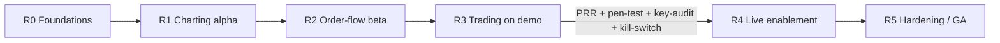
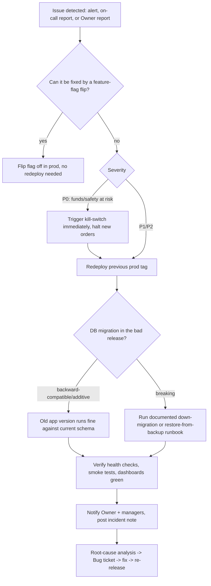

# 07 — Release Management & Production Readiness Review (PRR)

Status: locked. Companion to `01-sdlc-and-branching.md` (branching, environment promotion) and `02-definition-of-ready-done.md` (per-ticket DoD). Defines the release train, semver policy, changelog automation, release checklist, PRR checklist, the Live-enablement gate, rollback procedure, and post-release monitoring for CandleViewer.

---

## 1. Release train: R0–R5

Releases are cut as trains, not continuously — `main` deploys to **dev** continuously, but promotion to **staging (demo)** and **prod (live)** happens at named train boundaries so PRR and soak time are meaningful. Each train corresponds to a roadmap milestone in `30-release-roadmap.md`; trains are cumulative (each includes everything from the prior train plus new scope).

| Train | Name | Scope (representative, full detail in `30-release-roadmap.md`) | Target environment on completion | Live-enablement gate applies? |
|---|---|---|---|---|
| **R0** | Foundations | Repo/infra scaffolding, auth/RBAC skeleton, Postgres/QuestDB/Parquet wiring, CI/CD, observability baseline, Electron shell boots, WebGL engine spike decision made | dev, smoke on staging | No |
| **R1** | Charting alpha | Custom WebGL chart engine core (candles, volume, basic overlays), symbol/timeframe browsing, recorder for user-selected symbols, connectivity smoke-tests against testnet | staging (demo) | No |
| **R2** | Order-flow beta | Footprint, volume/delta profiles, Deep-Stats rows, big-trades, CVD, DOM liquidity heatmap, speed-of-tape, imbalance tracker, iceberg/stop-run *estimated* detectors, market regime | staging (demo) | No |
| **R3** | Trading on demo | Full execution loop against **Bybit demo**: order ticket, chart/DOM trading, brackets, scaled orders, emulated OCO/iceberg/TWAP/chase, rule engine (form + node-graph editors), paper-trading validation, multi-account trade-group fan-out (demo accounts) | staging (demo), soaked | No (no real funds yet) |
| **R4** | Live enablement | Same feature set as R3 validated against **Bybit live** with real funds; owner/admin screens fully hardened (users/roles, Bybit accounts & keys, per-account profiles, audit log, system health, feature flags) | prod (live) | **Yes — mandatory** |
| **R5** | Hardening / GA | Performance hardening, chaos/failover resilience, journal/analytics maturity, accessibility and security debt burn-down, general availability for the owner + all managers | prod (live) | Yes, re-verified (not a first-time gate, but checklist re-run) |

**R5 (and any post-R4 release) Live-enablement gate trigger rule:** the full four-item Live-enablement gate (§6: pen-test, key-permission audit, kill-switch test, plus the standard PRR) is re-run **in full, all four items, no subset** for R5 itself, because R5 is defined as touching resilience/chaos/failover and security-debt burn-down — areas that directly affect the fan-out safety invariant and key handling. For releases *after* R5 (R6+, not yet named), the full four-item gate is mandatory again only if the release "meaningfully changes OMS/fan-out/keys" (§6 heading); a release that touches neither is not required to re-run the Live-enablement gate at all (standard PRR §5 still applies), and the PRR sign-off note must state explicitly which of the two cases applied and why, so "ambiguous scope" is never silently assumed in either direction.

Trains are not fixed-length by calendar; a train completes when its scope's Epics are Done per `02-definition-of-ready-done.md` and its PRR passes. Expected cadence is roughly every 4–8 sprints depending on scope, tracked live in `30-release-roadmap.md` and `31-sprint-plan.md`.

---

## 2. Semantic versioning (semver)

Format: `MAJOR.MINOR.PATCH` (e.g., `1.4.2`), applied to the whole monorepo release artifact (backend + frontend + Electron shell versioned together, since they ship as one product to one owner/team — no independent per-package public API to consumers outside this org).

| Bump | Trigger |
|---|---|
| **MAJOR** | Breaking change to a persisted schema without a migration path, breaking change to the OpenAPI/WS contract that isn't backward compatible, or a release-train boundary that fundamentally changes trading semantics (e.g., R3→R4 live-enablement is treated as a MAJOR bump: `0.x.y` while pre-live, `1.0.0` at first Live-enablement release). |
| **MINOR** | New user-facing capability (new Story/Epic scope shipped), backward-compatible API/WS additions, new screen/feature behind a flag defaulting on. |
| **PATCH** | Bug fixes, backward-compatible internal changes, dependency bumps, hotfixes. |

Conventional commits (`01-sdlc-and-branching.md` §6.2) drive the bump automatically: any commit with `!` or a `BREAKING CHANGE:` footer since the last tag forces MAJOR; presence of `feat:` commits (no breaking) forces MINOR; otherwise PATCH. Pre-`1.0.0` (before R4 Live-enablement), the project stays in `0.x.y` per standard semver pre-1.0 convention (anything may still change); `1.0.0` is declared explicitly at the first Live-enablement release, not automatically.

---

## 3. Changelog automation

- Every PR must include a changelog fragment: either a Conventional-Commits-parseable title/body (preferred, fully automated) or an explicit `Changelog: <one-line user-facing summary>` footer for cases where the commit message alone doesn't read well as a changelog line (e.g., multi-commit PRs squash-merged).
- CI runs a changelog-generation job (e.g., `release-please`-style or `conventional-changelog`) on every merge to `main`, appending to an **Unreleased** section of `CHANGELOG.md` at repo root, grouped by `Features`, `Fixes`, `Performance`, `Security`, `Breaking Changes`.
- At release-train cut time, the Unreleased section is finalized under the new version heading with the release date, and a GitHub Release is drafted automatically from it (tag `vX.Y.Z`, body = changelog section).
- Security-relevant fixes are called out in a `Security` subsection but **without exploit details** — a general description only (e.g., "Hardened API-key decryption path against timing side-channel"), full detail retained internally in the Security engineer's incident/finding tracker, not published in the public/shared changelog.
- Changelog is reviewed by the ticket owner as part of PR review — an inaccurate or missing changelog line blocks merge queue enqueue (same as a failing required check) for any PR that isn't `chore:`/`ci:`/`docs:`-only.

---

## 4. Release checklist

Executed by the release owner (rotates among Architect/DevSecOps/a nominated lead) at every train cut, before promoting the release candidate from staging soak to a tagged release.

### 4.1 Pre-cut (on `main`, before branching `release/*`)
- [ ] All Epics/Stories targeted for this train are Done per `02-definition-of-ready-done.md` (board rollup shows 100% or explicit descope decisions recorded).
- [ ] No open `priority/p0-critical` or `priority/p1-high` bugs against in-scope areas.
- [ ] Full test pyramid green on `main` tip: unit, contract, integration (recorded Bybit fixtures), E2E (Playwright web + Electron), load/perf (k6/Locust + engine FPS benchmarks + ingestion soak), security scans (SAST/SCA/secrets/DAST/container), a11y (axe-core CI).
- [ ] **E2E order-flow subset (`@demo-rest-only` tagged specs) green against staging (demo)**: per `01-sdlc-and-branching.md` §9, demo has no WS order entry (REST only, per `24-owner-decisions.md`). Any order-placement/order-management E2E scenario in the pyramid above must run through the REST order-entry path against demo and assert no WS order-entry frames were sent; a release cannot proceed if the `@demo-rest-only` job is skipped, failing, or if any order-entry E2E spec is found still asserting over WS against demo.
- [ ] Coverage thresholds met (≥85% backend/engine, ≥80% frontend) — no regression from previous release.
- [ ] `CHANGELOG.md` Unreleased section reviewed for accuracy and completeness.

### 4.2 Cut & soak
- [ ] `release/<semver>` branch cut from `main`.
- [ ] Deployed to **staging (demo)**.
- [ ] Soak period ≥48h (longer for R4/R5 — see §6) with synthetic + real demo-account traffic, monitored dashboards (Grafana) checked daily for anomalies.
- [ ] Any bug found during soak is fixed via a PR merged to `main` **and** cherry-picked into `release/<semver>` (never edited only on the release branch); soak clock restarts only if a P0/P1 is found, not for every P2/P3 cherry-pick.
- [ ] Stakeholder/Owner demo at Sprint Review performed against this staging build; explicit acceptance recorded.

### 4.3 PRR gate
- [ ] Full PRR checklist (§5) executed and passed, sign-off recorded from Architect, DevSecOps, Security, QA lead.
- [ ] **[R4 and any release re-touching Live-enablement scope only]** Live-enablement gate (§6) passed.

### 4.4 Cut to prod
- [ ] Tag `vX.Y.Z` created from `release/<semver>` HEAD.
- [ ] GitHub Release published with generated changelog.
- [ ] Deploy to **prod (live)** using the same deployment automation validated on staging (no manual prod-only steps — if a manual step is unavoidable, it's documented in a runbook and rehearsed on staging first).
- [ ] Feature flags for any train-scoped functionality flipped to their intended prod default (often still off, ramped gradually — see §8 post-release monitoring).
- [ ] Rollback procedure (§7) reconfirmed ready (previous tag deployable, DB migrations reversible or forward-only-safe) before traffic is allowed to reach the new build unattended.
- [ ] Post-release monitoring window opened (§8).
- [ ] `main` merged/rebased to ensure no divergence from `release/<semver>` (any soak-time cherry-picks that only landed on the release branch are forward-ported).

---

## 5. PRR (Production Readiness Review) checklist

Run as a ceremony (`01-sdlc-and-branching.md` §3) before every release-train prod promotion. Attendees: Architect, DevSecOps, Security engineer, QA lead, on-call owner (rotates). Go/no-go decision recorded on the release ticket; a "no-go" sends the release back to staging soak with named follow-up actions and re-schedules the PRR.

### 5.1 Observability
- [ ] Structured logs emitted for all critical paths (order placement, fan-out, rule-engine evaluation, WS reconnects) with correlation IDs traceable from ticket order → exchange order → account.
- [ ] Prometheus metrics exported: request latency/error-rate per endpoint, WS message throughput/lag, ingestion tick rate, book-engine processing latency, OMS order round-trip latency, rule-engine evaluation latency, recorder disk usage/rate.
- [ ] Grafana dashboards exist and are reviewed live in the PRR meeting: system health overview, trading activity, ingestion/recorder health, security/audit activity.
- [ ] Alerting rules configured and tested (a synthetic alert is fired and confirmed to reach the on-call channel) for: WS disconnect sustained >N seconds, exchange 5xx rate spike, rate-limit code `10018` hit, OMS order rejected repeatedly, fan-out partial-failure (some accounts filled, some didn't), disk usage approaching recorder retention budget, auth failures spike (possible credential-stuffing/misconfig).

### 5.2 Runbooks
- [ ] Runbook exists for: WS disconnect/reconnect storm, exchange outage/5xx, rate-limit breach handling, OMS stuck-order reconciliation, fan-out partial-failure recovery, database failover (Postgres), QuestDB/Parquet recovery from corruption, feature-flag emergency kill, full-system rollback.
- [ ] Each runbook has been read through (not necessarily fully rehearsed for every one — see restore drill below for the subset that must be rehearsed) by the on-call rotation members.
- [ ] On-call rotation and escalation path defined and reachable (who is paged, how, backup contact).

### 5.3 Backups & restore drill

**Targets (pass/fail budget for the drill below):**

| System | RPO (max acceptable data loss) | RTO (max acceptable time to restore) |
|---|---|---|
| Postgres (accounts, RBAC, rule configs, orders/journal metadata) | ≤15 minutes (continuous WAL archiving between full backups) | ≤2 hours to a booting, queryable instance in a scratch environment |
| QuestDB hot-tier (recent OHLC/tick data) | ≤24 hours (accepted, since it is reconstructible from Parquet cold-tier + re-ingestion) | ≤4 hours to reconstruct the most-recently-traded symbol's hot-tier data via cold-tier replay |
| Parquet/DuckDB cold tier (historical bars/ticks) | 0 (immutable, append-only, redundantly stored — no acceptable loss of already-committed history) | ≤4 hours to restore access to at least one symbol's full history from the off-box redundant copy |

A drill run that exceeds either the RPO or RTO figure above for the system under test is a **fail**: it blocks PRR sign-off (§5) and must be logged as a P1 finding in `32-risk-register.md` with a remediation Task ticket, not merely noted and waved through.

- [ ] Postgres: automated backup schedule confirmed running (frequency, retention, off-host copy) and consistent with the ≤15-minute RPO target above (full backup cadence + WAL/continuous archiving interval reviewed).
- [ ] QuestDB hot-tier: backup/export strategy confirmed (or explicitly accepted as replaceable-from-Parquet-cold-tier + re-ingestion, documented as such), consistent with the ≤24h RPO / ≤4h RTO targets above.
- [ ] Parquet/DuckDB cold tier: storage location redundancy confirmed (e.g., replicated disk/off-box copy), retention policy (30-day default, pin-to-keep) enforced by an automated job, verified.
- [ ] **Restore drill executed** (not just "backups exist" — an actual restore-to-a-scratch-environment is performed) at least once per release train touching data-layer changes, and at minimum once before R4: Postgres restored from backup and app boots against it; QuestDB/Parquet cold-tier restore validated for at least one symbol's history. Drill result (time-to-restore, any gaps found) recorded in `32-risk-register.md`, and measured against the RPO/RTO targets table above — **result is explicitly marked pass or fail against those targets**, not just recorded as a raw number.

### 5.4 Capacity
- [ ] Load test results (k6/Locust) reviewed against expected concurrent load (owner + a few account managers — small user count, but high message-rate WS fan-out and multi-account order fan-out are the real load vectors) with headroom margin stated (target: comfortably handle 3–5x expected peak).
- [ ] Chart-engine FPS benchmark reviewed (footprint + heatmap rendering at target density) against the budget in `06-performance-and-load-standard.md`.
- [ ] Ingestion soak test result reviewed (sustained tick/L2 ingestion over a multi-hour run with no memory growth/backlog).
- [ ] Per-account Bybit rate-limit budget reviewed for the fan-out account count in scope for this release (rate limits are per-UID — confirm fan-out to N accounts stays under limits with margin).

### 5.5 Security sign-off
- [ ] SAST (CodeQL/Semgrep/Bandit), SCA (Dependabot/pip-audit/npm audit), secrets scanning, DAST (OWASP ZAP), and container scan (Trivy) all clean or have accepted-risk sign-off with expiry dates for re-check.
- [ ] STRIDE threat models for all Epics in this train's scope reviewed as a set (not just individually at Epic-close) for cross-Epic interaction risks.
- [ ] Audit log verified append-only and complete for the actions in scope (account/key changes, rule changes, RBAC changes).
- [ ] API keys confirmed envelope-encrypted at rest; withdrawal permission confirmed OFF on all configured exchange keys (spot-check at least one account's key config in the admin screen during the review).

### 5.6 Rollback rehearsal
- [ ] Rollback procedure (§7) executed at least once in staging as a rehearsal (not just documented) before this PRR is signed off for R4, and periodically (at least once every 2 trains) thereafter.
- [ ] Rehearsal confirms: previous tag redeploys cleanly, DB migration compatibility (either reversible or the new migration is additive/backward-compatible so the old app version still runs against it), feature flags can be flipped off without a redeploy.

---

## 6. Live-enablement gate (R4 only, and any subsequent release that meaningfully changes OMS/fan-out/keys)

This gate is **additional to**, not a replacement for, the standard PRR (§5). It exists specifically because R4 is the first release where real funds are at risk.

- [ ] **Pen-test**: an independent (external or at minimum a different engineer than the implementers) penetration test performed against the deployed staging build covering: auth/RBAC bypass attempts, API-key exfiltration paths, OMS/order-injection abuse, rate-limit/DoS behavior, admin-screen privilege escalation, Tailscale-network-boundary assumptions (confirm no unintended public exposure). Findings triaged; all Critical/High findings resolved before go-live; Medium/Low findings either resolved or explicitly risk-accepted by the Owner in writing.
- [ ] **Key-permission audit**: every configured Bybit API key (all accounts, main + sub-accounts) manually verified in the Bybit account settings (not just trusted from app config) to have: withdrawal permission OFF, IP whitelist set to the Tailscale-reachable address(es) only, trade+read scope only (no unnecessary broader scope).
- [ ] **Kill-switch test**: the emergency stop mechanism (a feature-flag-or-equivalent that immediately halts all new order placement / rule-engine execution / fan-out across all accounts) is exercised end-to-end in staging: triggered, confirmed no new orders can be placed while active, confirmed existing open positions/orders are unaffected (kill-switch stops new risk-taking, it does not itself force-close positions unless a separate documented "flatten all" runbook is also invoked), and confirmed it can be released cleanly afterward.
- [ ] Owner (basiltt) explicitly signs off in writing (a ticket comment is sufficient) authorizing Live enablement, having reviewed the pen-test summary and key-permission audit results.

Only after all four boxes are checked may the release proceed to the "Cut to prod" step (§4.4) with Live trading enabled. If any Critical pen-test finding cannot be resolved before the planned cut date, the release either slips or ships with Live-trading behind a flag still OFF (demo-only) until resolved — Live-enablement is never rushed to hit a calendar date.

---

## 7. Rollback procedure

Applies to any prod release, invoked when post-release monitoring (§8) detects a regression, or when a hotfix (`01-sdlc-and-branching.md` §8) requires reverting instead of forward-fixing.

Rules:
1. **Feature flags are the first line of rollback** — any release-train scoped functionality should be flippable off without a redeploy; this is why flags are mandatory for user-visible Story-level work (`01-sdlc-and-branching.md` §10.4).
2. **Kill-switch before rollback** for any P0 involving live order flow — stop new risk first, then roll back the deployment; do not let a slow redeploy leave the system placing orders on known-bad code any longer than necessary.
3. **Database migrations must default to backward-compatible/additive** so that rolling back the app tag never requires an emergency schema down-migration under pressure; a breaking migration is only permitted with an explicit, PRR-reviewed down-migration script tested in the rollback rehearsal (§5.6).
4. **Every rollback produces an incident note** (what broke, detection method, time-to-detect, time-to-mitigate, root cause once known) filed to `32-risk-register.md` and reviewed at the next retro.
5. **Communication**: Owner and any active account managers are notified immediately on any live-trading-impacting rollback, before the RCA is complete — status first, explanation follows.

---

## 8. Post-release monitoring

- **First 24h ("hypercare")**: on-call engineer (rotates, named on the release ticket) actively watches Grafana dashboards and alert channel continuously; no unrelated deploys to prod during this window.
- **First 7 days**: daily check of key metrics (order success rate, WS uptime/reconnect frequency, ingestion gaps, rule-engine evaluation error rate, recorder disk trend) against the pre-release baseline; any statistically meaningful regression opens a Bug ticket immediately, `priority/p0` or `p1` depending on user impact.
- **Feature-flag ramp**: newly shipped user-visible features default to off or owner-only in prod immediately post-release, then ramped to all managers over the following days once hypercare confirms stability — this is the default rollout pattern for any Story behind a flag, not just a contingency.
- **Ongoing**: metrics from §5.1 feed the standing Grafana dashboards reviewed at each Sprint Review and each subsequent PRR, so trend regressions across releases (not just within one release) are caught; `32-risk-register.md` is updated whenever monitoring surfaces a new systemic risk (e.g., a recorder disk-growth trend approaching budget).
- Post-release monitoring findings that indicate a design or architecture gap are fed back into Refinement as new Epics/Tasks/Bugs — this is the explicit loop-closing step connecting release operations back into the sprint-planning cycle described in `01-sdlc-and-branching.md`.
