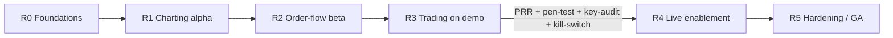
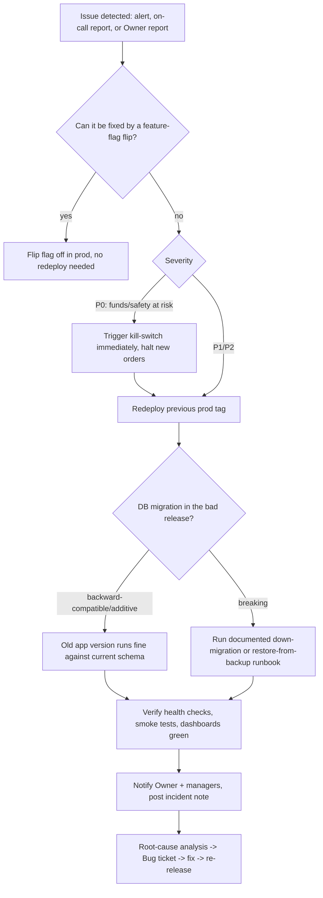

# 07 — Release Management & Production Readiness Review (PRR)

Status: locked. Companion to `01-sdlc-and-branching.md` (branching, environment promotion) and `02-definition-of-ready-done.md` (per-ticket DoD). Defines the release train, semver policy, changelog automation, release checklist, PRR checklist, the Live-enablement gate, rollback procedure, and post-release monitoring for CandleViewer.

---

## 1. Release train: R0–R5

Releases are cut as trains, not continuously — `main` deploys to **dev** continuously, but promotion to **staging (demo)** and **prod (live)** happens at named train boundaries so PRR and soak time are meaningful. Each train corresponds to a roadmap milestone in `30-release-roadmap.md`; trains are cumulative (each includes everything from the prior train plus new scope).

| Train  | Name            | Scope (representative, full detail in `30-release-roadmap.md`)                                                                                                                                                                                              | Target environment on completion | Live-enablement gate applies?                                  |
| ------ | --------------- | ----------------------------------------------------------------------------------------------------------------------------------------------------------------------------------------------------------------------------------------------------------- | -------------------------------- | -------------------------------------------------------------- |
| **R0** | Foundations     | Repo/infra scaffolding, auth/RBAC skeleton, Postgres/QuestDB/Parquet wiring, CI/CD, observability baseline, Electron shell boots, WebGL engine spike decision made                                                                                          | dev, smoke on staging            | No                                                             |
| **R1** | Charting alpha  | Custom WebGL chart engine core (candles, volume, basic overlays), symbol/timeframe browsing, recorder for user-selected symbols, connectivity smoke-tests against testnet                                                                                   | staging (demo)                   | No                                                             |
| **R2** | Order-flow beta | Footprint, volume/delta profiles, Deep-Stats rows, big-trades, CVD, DOM liquidity heatmap, speed-of-tape, imbalance tracker, iceberg/stop-run _estimated_ detectors, market regime                                                                          | staging (demo)                   | No                                                             |
| **R3** | Trading on demo | Full execution loop against **Bybit demo**: order ticket, chart/DOM trading, brackets, scaled orders, emulated OCO/iceberg/TWAP/chase, rule engine (form + node-graph editors), paper-trading validation, multi-account trade-group fan-out (demo accounts) | staging (demo), soaked           | No (no real funds yet)                                         |
| **R4** | Live enablement | Same feature set as R3 validated against **Bybit live** with real funds; owner/admin screens fully hardened (users/roles, Bybit accounts & keys, per-account profiles, audit log, system health, feature flags)                                             | prod (live)                      | **Yes — mandatory**                                            |
| **R5** | Hardening / GA  | Performance hardening, chaos/failover resilience, journal/analytics maturity, accessibility and security debt burn-down, general availability for the owner + all managers                                                                                  | prod (live)                      | Yes, re-verified (not a first-time gate, but checklist re-run) |

**R5 (and any post-R4 release) Live-enablement gate trigger rule:** the full four-item Live-enablement gate (§6: pen-test, key-permission audit, kill-switch test, plus the standard PRR) is re-run **in full, all four items, no subset** for R5 itself, because R5 is defined as touching resilience/chaos/failover and security-debt burn-down — areas that directly affect the fan-out safety invariant and key handling. For releases _after_ R5 (R6+, not yet named), the full four-item gate is mandatory again only if the release "meaningfully changes OMS/fan-out/keys" (§6 heading); a release that touches neither is not required to re-run the Live-enablement gate at all (standard PRR §5 still applies), and the PRR sign-off note must state explicitly which of the two cases applied and why, so "ambiguous scope" is never silently assumed in either direction.

Trains are not fixed-length by calendar; a train completes when its scope's Epics are Done per `02-definition-of-ready-done.md` and its PRR passes. Expected cadence is roughly every 4–8 sprints depending on scope, tracked live in `30-release-roadmap.md` and `31-sprint-plan.md`.



---

## 2. Semantic versioning (semver)

Format: `MAJOR.MINOR.PATCH` (e.g., `1.4.2`), applied to the whole monorepo release artifact (backend + frontend + Electron shell versioned together, since they ship as one product to one owner/team — no independent per-package public API to consumers outside this org).

| Bump      | Trigger                                                                                                                                                                                                                                                                                                                                         |
| --------- | ----------------------------------------------------------------------------------------------------------------------------------------------------------------------------------------------------------------------------------------------------------------------------------------------------------------------------------------------- |
| **MAJOR** | Breaking change to a persisted schema without a migration path, breaking change to the OpenAPI/WS contract that isn't backward compatible, or a release-train boundary that fundamentally changes trading semantics (e.g., R3→R4 live-enablement is treated as a MAJOR bump: `0.x.y` while pre-live, `1.0.0` at first Live-enablement release). |
| **MINOR** | New user-facing capability (new Story/Epic scope shipped), backward-compatible API/WS additions, new screen/feature behind a flag defaulting on.                                                                                                                                                                                                |
| **PATCH** | Bug fixes, backward-compatible internal changes, dependency bumps, hotfixes.                                                                                                                                                                                                                                                                    |

Conventional commits (`01-sdlc-and-branching.md` §6.2) drive the bump automatically: any commit with `!` or a `BREAKING CHANGE:` footer since the last tag forces MAJOR; presence of `feat:` commits (no breaking) forces MINOR; otherwise PATCH. Pre-`1.0.0` (before R4 Live-enablement), the project stays in `0.x.y` per standard semver pre-1.0 convention (anything may still change); `1.0.0` is declared explicitly at the first Live-enablement release, not automatically.

---

## 3. Changelog automation

- Every PR must include a changelog fragment: either a Conventional-Commits-parseable title/body (preferred, fully automated) or an explicit `Changelog: <one-line user-facing summary>` footer for cases where the commit message alone doesn't read well as a changelog line (e.g., multi-commit PRs squash-merged).
- CI runs a changelog-generation job (e.g., `release-please`-style or `conventional-changelog`) on every merge to `main`, appending to an **Unreleased** section of `CHANGELOG.md` at repo root, grouped by `Features`, `Fixes`, `Performance`, `Security`, `Breaking Changes`.
- At release-train cut time, the Unreleased section is finalized under the new version heading with the release date, and a GitHub Release is drafted automatically from it (tag `vX.Y.Z`, body = changelog section).
- Security-relevant fixes are called out in a `Security` subsection but **without exploit details** — a general description only (e.g., "Hardened API-key decryption path against timing side-channel"), full detail retained internally in the Security engineer's incident/finding tracker, not published in the public/shared changelog.
- Changelog is reviewed by the ticket owner as part of PR review — an inaccurate or missing changelog line blocks merge queue enqueue (same as a failing required check) for any PR that isn't `chore:`/`ci:`/`docs:`-only.

---

## 4. Release checklist

Executed by the release owner (rotates among Architect/DevSecOps/a nominated lead) at every train cut, before promoting the release candidate from staging soak to a tagged release.

### 4.1 Pre-cut (on `main`, before branching `release/*`)

- [ ] All Epics/Stories targeted for this train are Done per `02-definition-of-ready-done.md` (board rollup shows 100% or explicit descope decisions recorded).
- [ ] No open `priority/p0-critical` or `priority/p1-high` bugs against in-scope areas.
- [ ] Full test pyramid green on `main` tip: unit, contract, integration (recorded Bybit fixtures), E2E (Playwright web + Electron), load/perf (k6/Locust + engine FPS benchmarks + ingestion soak), security scans (SAST/SCA/secrets/DAST/container), a11y (axe-core CI).
- [ ] **E2E order-flow subset (`@demo-rest-only` tagged specs) green against staging (demo)**: per `01-sdlc-and-branching.md` §9, demo has no WS order entry (REST only, per `24-owner-decisions.md`). Any order-placement/order-management E2E scenario in the pyramid above must run through the REST order-entry path against demo and assert no WS order-entry frames were sent; a release cannot proceed if the `@demo-rest-only` job is skipped, failing, or if any order-entry E2E spec is found still asserting over WS against demo.
- [ ] Coverage thresholds met (≥85% backend/engine, ≥80% frontend) — no regression from previous release.
- [ ] `CHANGELOG.md` Unreleased section reviewed for accuracy and completeness.

### 4.2 Cut & soak

- [ ] `release/<semver>` branch cut from `main`.
- [ ] Deployed to **staging (demo)**.
- [ ] Soak period ≥48h (longer for R4/R5 — see §6) with synthetic + real demo-account traffic, monitored dashboards (Grafana) checked daily for anomalies.
- [ ] Any bug found during soak is fixed via a PR merged to `main` **and** cherry-picked into `release/<semver>` (never edited only on the release branch); soak clock restarts only if a P0/P1 is found, not for every P2/P3 cherry-pick.
- [ ] Stakeholder/Owner demo at Sprint Review performed against this staging build; explicit acceptance recorded.

### 4.3 PRR gate

- [ ] Full PRR checklist (§5) executed and passed, sign-off recorded from Architect, DevSecOps, Security, QA lead.
- [ ] **[R4 and any release re-touching Live-enablement scope only]** Live-enablement gate (§6) passed.

### 4.4 Cut to prod

- [ ] Tag `vX.Y.Z` created from `release/<semver>` HEAD.
- [ ] GitHub Release published with generated changelog.
- [ ] Deploy to **prod (live)** using the same deployment automation validated on staging (no manual prod-only steps — if a manual step is unavoidable, it's documented in a runbook and rehearsed on staging first).
- [ ] Feature flags for any train-scoped functionality flipped to their intended prod default (often still off, ramped gradually — see §8 post-release monitoring).
- [ ] Rollback procedure (§7) reconfirmed ready (previous tag deployable, DB migrations reversible or forward-only-safe) before traffic is allowed to reach the new build unattended.
- [ ] Post-release monitoring window opened (§8).
- [ ] `main` merged/rebased to ensure no divergence from `release/<semver>` (any soak-time cherry-picks that only landed on the release branch are forward-ported).

---

## 5. PRR (Production Readiness Review) checklist

Run as a ceremony (`01-sdlc-and-branching.md` §3) before every release-train prod promotion. Attendees: Architect, DevSecOps, Security engineer, QA lead, on-call owner (rotates). Go/no-go decision recorded on the release ticket; a "no-go" sends the release back to staging soak with named follow-up actions and re-schedules the PRR.

### 5.1 Observability

- [ ] Structured logs emitted for all critical paths (order placement, fan-out, rule-engine evaluation, WS reconnects) with correlation IDs traceable from ticket order → exchange order → account.
- [ ] Prometheus metrics exported: request latency/error-rate per endpoint, WS message throughput/lag, ingestion tick rate, book-engine processing latency, OMS order round-trip latency, rule-engine evaluation latency, recorder disk usage/rate.
- [ ] Grafana dashboards exist and are reviewed live in the PRR meeting: system health overview, trading activity, ingestion/recorder health, security/audit activity.
- [ ] Alerting rules configured and tested (a synthetic alert is fired and confirmed to reach the on-call channel) for: WS disconnect sustained >N seconds, exchange 5xx rate spike, rate-limit code `10018` hit, OMS order rejected repeatedly, fan-out partial-failure (some accounts filled, some didn't), disk usage approaching recorder retention budget, auth failures spike (possible credential-stuffing/misconfig).

### 5.2 Runbooks

- [ ] Runbook exists for: WS disconnect/reconnect storm, exchange outage/5xx, rate-limit breach handling, OMS stuck-order reconciliation, fan-out partial-failure recovery, database failover (Postgres), QuestDB/Parquet recovery from corruption, feature-flag emergency kill, full-system rollback.
- [ ] Each runbook has been read through (not necessarily fully rehearsed for every one — see restore drill below for the subset that must be rehearsed) by the on-call rotation members.
- [ ] On-call rotation and escalation path defined and reachable (who is paged, how, backup contact).

### 5.3 Backups & restore drill

**Targets (pass/fail budget for the drill below):**

| System                                                           | RPO (max acceptable data loss)                                                                   | RTO (max acceptable time to restore)                                                             |
| ---------------------------------------------------------------- | ------------------------------------------------------------------------------------------------ | ------------------------------------------------------------------------------------------------ |
| Postgres (accounts, RBAC, rule configs, orders/journal metadata) | ≤15 minutes (continuous WAL archiving between full backups)                                      | ≤2 hours to a booting, queryable instance in a scratch environment                               |
| QuestDB hot-tier (recent OHLC/tick data)                         | ≤24 hours (accepted, since it is reconstructible from Parquet cold-tier + re-ingestion)          | ≤4 hours to reconstruct the most-recently-traded symbol's hot-tier data via cold-tier replay     |
| Parquet/DuckDB cold tier (historical bars/ticks)                 | 0 (immutable, append-only, redundantly stored — no acceptable loss of already-committed history) | ≤4 hours to restore access to at least one symbol's full history from the off-box redundant copy |

A drill run that exceeds either the RPO or RTO figure above for the system under test is a **fail**: it blocks PRR sign-off (§5) and must be logged as a P1 finding in `32-risk-register.md` with a remediation Task ticket, not merely noted and waved through.

- [ ] Postgres: automated backup schedule confirmed running (frequency, retention, off-host copy) and consistent with the ≤15-minute RPO target above (full backup cadence + WAL/continuous archiving interval reviewed).
- [ ] QuestDB hot-tier: backup/export strategy confirmed (or explicitly accepted as replaceable-from-Parquet-cold-tier + re-ingestion, documented as such), consistent with the ≤24h RPO / ≤4h RTO targets above.
- [ ] Parquet/DuckDB cold tier: storage location redundancy confirmed (e.g., replicated disk/off-box copy), retention policy (30-day default, pin-to-keep) enforced by an automated job, verified.
- [ ] **Restore drill executed** (not just "backups exist" — an actual restore-to-a-scratch-environment is performed) at least once per release train touching data-layer changes, and at minimum once before R4: Postgres restored from backup and app boots against it; QuestDB/Parquet cold-tier restore validated for at least one symbol's history. Drill result (time-to-restore, any gaps found) recorded in `32-risk-register.md`, and measured against the RPO/RTO targets table above — **result is explicitly marked pass or fail against those targets**, not just recorded as a raw number.

### 5.4 Capacity

- [ ] Load test results (k6/Locust) reviewed against expected concurrent load (owner + a few account managers — small user count, but high message-rate WS fan-out and multi-account order fan-out are the real load vectors) with headroom margin stated (target: comfortably handle 3–5x expected peak).
- [ ] Chart-engine FPS benchmark reviewed (footprint + heatmap rendering at target density) against the budget in `06-performance-and-load-standard.md`.
- [ ] Ingestion soak test result reviewed (sustained tick/L2 ingestion over a multi-hour run with no memory growth/backlog).
- [ ] Per-account Bybit rate-limit budget reviewed for the fan-out account count in scope for this release (rate limits are per-UID — confirm fan-out to N accounts stays under limits with margin).

### 5.5 Security sign-off

- [ ] SAST (CodeQL/Semgrep/Bandit), SCA (Dependabot/pip-audit/npm audit), secrets scanning, DAST (OWASP ZAP), and container scan (Trivy) all clean or have accepted-risk sign-off with expiry dates for re-check.
- [ ] STRIDE threat models for all Epics in this train's scope reviewed as a set (not just individually at Epic-close) for cross-Epic interaction risks.
- [ ] Audit log verified append-only and complete for the actions in scope (account/key changes, rule changes, RBAC changes).
- [ ] API keys confirmed envelope-encrypted at rest; withdrawal permission confirmed OFF on all configured exchange keys (spot-check at least one account's key config in the admin screen during the review).

### 5.6 Rollback rehearsal

- [ ] Rollback procedure (§7) executed at least once in staging as a rehearsal (not just documented) before this PRR is signed off for R4, and periodically (at least once every 2 trains) thereafter.
- [ ] Rehearsal confirms: previous tag redeploys cleanly, DB migration compatibility (either reversible or the new migration is additive/backward-compatible so the old app version still runs against it), feature flags can be flipped off without a redeploy.

---

## 6. Live-enablement gate (R4 only, and any subsequent release that meaningfully changes OMS/fan-out/keys)

This gate is **additional to**, not a replacement for, the standard PRR (§5). It exists specifically because R4 is the first release where real funds are at risk.

- [ ] **Pen-test**: an independent (external or at minimum a different engineer than the implementers) penetration test performed against the deployed staging build covering: auth/RBAC bypass attempts, API-key exfiltration paths, OMS/order-injection abuse, rate-limit/DoS behavior, admin-screen privilege escalation, Tailscale-network-boundary assumptions (confirm no unintended public exposure). Findings triaged; all Critical/High findings resolved before go-live; Medium/Low findings either resolved or explicitly risk-accepted by the Owner in writing.
- [ ] **Key-permission audit**: every configured Bybit API key (all accounts, main + sub-accounts) manually verified in the Bybit account settings (not just trusted from app config) to have: withdrawal permission OFF, IP whitelist set to the Tailscale-reachable address(es) only, trade+read scope only (no unnecessary broader scope).
- [ ] **Kill-switch test**: the emergency stop mechanism (a feature-flag-or-equivalent that immediately halts all new order placement / rule-engine execution / fan-out across all accounts) is exercised end-to-end in staging: triggered, confirmed no new orders can be placed while active, confirmed existing open positions/orders are unaffected (kill-switch stops new risk-taking, it does not itself force-close positions unless a separate documented "flatten all" runbook is also invoked), and confirmed it can be released cleanly afterward.
- [ ] Owner (basiltt) explicitly signs off in writing (a ticket comment is sufficient) authorizing Live enablement, having reviewed the pen-test summary and key-permission audit results.

Only after all four boxes are checked may the release proceed to the "Cut to prod" step (§4.4) with Live trading enabled. If any Critical pen-test finding cannot be resolved before the planned cut date, the release either slips or ships with Live-trading behind a flag still OFF (demo-only) until resolved — Live-enablement is never rushed to hit a calendar date.

---

## 7. Rollback procedure

Applies to any prod release, invoked when post-release monitoring (§8) detects a regression, or when a hotfix (`01-sdlc-and-branching.md` §8) requires reverting instead of forward-fixing.



Rules:

1. **Feature flags are the first line of rollback** — any release-train scoped functionality should be flippable off without a redeploy; this is why flags are mandatory for user-visible Story-level work (`01-sdlc-and-branching.md` §10.4).
2. **Kill-switch before rollback** for any P0 involving live order flow — stop new risk first, then roll back the deployment; do not let a slow redeploy leave the system placing orders on known-bad code any longer than necessary.
3. **Database migrations must default to backward-compatible/additive** so that rolling back the app tag never requires an emergency schema down-migration under pressure; a breaking migration is only permitted with an explicit, PRR-reviewed down-migration script tested in the rollback rehearsal (§5.6).
4. **Every rollback produces an incident note** (what broke, detection method, time-to-detect, time-to-mitigate, root cause once known) filed to `32-risk-register.md` and reviewed at the next retro.
5. **Communication**: Owner and any active account managers are notified immediately on any live-trading-impacting rollback, before the RCA is complete — status first, explanation follows.

---

## 8. Post-release monitoring

- **First 24h ("hypercare")**: on-call engineer (rotates, named on the release ticket) actively watches Grafana dashboards and alert channel continuously; no unrelated deploys to prod during this window.
- **First 7 days**: daily check of key metrics (order success rate, WS uptime/reconnect frequency, ingestion gaps, rule-engine evaluation error rate, recorder disk trend) against the pre-release baseline; any statistically meaningful regression opens a Bug ticket immediately, `priority/p0` or `p1` depending on user impact.
- **Feature-flag ramp**: newly shipped user-visible features default to off or owner-only in prod immediately post-release, then ramped to all managers over the following days once hypercare confirms stability — this is the default rollout pattern for any Story behind a flag, not just a contingency.
- **Ongoing**: metrics from §5.1 feed the standing Grafana dashboards reviewed at each Sprint Review and each subsequent PRR, so trend regressions across releases (not just within one release) are caught; `32-risk-register.md` is updated whenever monitoring surfaces a new systemic risk (e.g., a recorder disk-growth trend approaching budget).
- Post-release monitoring findings that indicate a design or architecture gap are fed back into Refinement as new Epics/Tasks/Bugs — this is the explicit loop-closing step connecting release operations back into the sprint-planning cycle described in `01-sdlc-and-branching.md`.

## 9. Alert runbooks (E04-T05)

Every Prometheus alert in `infra/prometheus/alerts/` links to its section here (CI: `infra/alertmanager/check_alert_rules.py`). Two severities only: **Page** (act now, bypasses quiet hours) and **Ticket** (next working session). Payloads carry component, severity and this link only. Every section below carries the same seven elements (what fired, user impact, what is still safe, first three diagnostic commands with the healthy result, remediation, escalation, verify recovery). `Q` queries use the local Prometheus at `127.0.0.1:9090`. Runbooks never contain credentials: secrets live in the host keychain (SR-002); steps that touch keys or trading state name the required role and are audited.

> **Validation status (E04-T07).** Literal execution of three runbooks by a non-author against staging has **not** been performed: no staging stack exists in the agent-delivery environment. This is tracked as a follow-up on the ticket and requires an explicit owner exception or a human run before the DoD box is ticked. Findings from that run must be folded back into the affected sections.

<a id="alert-bybitclockdriftwarning"></a>

### BybitClockDriftWarning

| Element               | Detail                                                                                                                                                          |
| --------------------- | --------------------------------------------------------------------------------------------------------------------------------------------------------------- |
| 1. What fired         | Signed offset between this host and Bybit server time is between 500 ms and 2000 ms for 2 minutes (`exchange_clock_drift_ms`). Severity: Ticket.                |
| 2. User impact        | None yet. Order entry is still allowed; signed requests risk rejection (`10002`) if drift keeps growing.                                                        |
| 3. What is still safe | Trading, native stop-losses and market data. Native exchange stop-losses already resting on Bybit are unaffected; they execute without this system.             |
| 5. Remediation        | Follow `docs/plan/runbooks/clock-sync.md` (resync with `sudo chronyc makestep`; after host sleep run `wsl --shutdown` and relaunch). Never widen `recv_window`. |
| 6. Escalation         | Owner on-call if drift is still above 500 ms after 30 minutes.                                                                                                  |
| 7. Verify recovery    | `exchange_clock_drift_ms` back within +/-500 ms for 5 minutes; the alert resolves in Alertmanager.                                                              |

**4. First three diagnostic commands** (run from the repo root; expected healthy result: `value` within -500..500; `System clock synchronized: yes`; System time under 0.05 seconds.)

```bash
curl -s 'http://127.0.0.1:9090/api/v1/query' --data-urlencode 'query=exchange_clock_drift_ms'
timedatectl status | grep -E 'synchronized|NTP'
chronyc tracking | grep -E 'System time|Leap'
```

<a id="alert-bybitclockdriftcritical"></a>

### BybitClockDriftCritical

| Element               | Detail                                                                                                                                                              |
| --------------------- | ------------------------------------------------------------------------------------------------------------------------------------------------------------------- |
| 1. What fired         | Offset exceeds 2000 ms for 1 minute (`exchange_clock_drift_ms`). Severity: Page.                                                                                    |
| 2. User impact        | Order entry is refused by the clock guard (`ClockDriftError`); new orders, fan-out and rule actions cannot be placed.                                               |
| 3. What is still safe | Existing positions and their native exchange stop-losses are unaffected. Read-only screens still work.                                                              |
| 5. Remediation        | Resync the host clock per `docs/plan/runbooks/clock-sync.md`. Do not edit `recv_window_ms`. No role is needed for a host resync; any restart of the api is audited. |
| 6. Escalation         | Owner immediately; if not fixed in 15 minutes, manage open positions directly on the exchange.                                                                      |
| 7. Verify recovery    | Drift back under 1500 ms (the `ClockDriftBlockingTrading` clear point) and a test order on demo succeeds.                                                           |

**4. First three diagnostic commands** (run from the repo root; expected healthy result: `value` within -500..500; clock synchronized.)

```bash
curl -s 'http://127.0.0.1:9090/api/v1/query' --data-urlencode 'query=exchange_clock_drift_ms'
timedatectl status | grep -E 'synchronized|NTP'
chronyc tracking | grep -E 'System time|Leap'
```

<a id="alert-bybitclockoffsetstale"></a>

### BybitClockOffsetStale

| Element               | Detail                                                                                                                                                                            |
| --------------------- | --------------------------------------------------------------------------------------------------------------------------------------------------------------------------------- |
| 1. What fired         | Offset not re-measured for over 15 minutes (`clock_offset_age_seconds` > 900). Severity: Ticket.                                                                                  |
| 2. User impact        | The last known offset is still applied but ages out; drift may be undetected.                                                                                                     |
| 3. What is still safe | Trading continues; native stop-losses are unaffected.                                                                                                                             |
| 5. Remediation        | If the time endpoint is unreachable fix host egress/DNS; if reachable restart the api container: `docker compose -f infra/compose/docker-compose.yml --profile core restart api`. |
| 6. Escalation         | Owner if age stays above 900 s for an hour.                                                                                                                                       |
| 7. Verify recovery    | `clock_offset_age_seconds` drops below 60 after the next probe cycle.                                                                                                             |

**4. First three diagnostic commands** (run from the repo root; expected healthy result: age under 900; HTTP `200`.)

```bash
curl -s 'http://127.0.0.1:9090/api/v1/query' --data-urlencode 'query=clock_offset_age_seconds'
docker compose -f infra/compose/docker-compose.yml --profile core logs --since 15m api | grep -i clock
curl -s -o /dev/null -w '%{http_code}
' https://api.bybit.com/v5/market/time
```

<a id="alert-latencybudgetbreach"></a>

### LatencyBudgetBreach

| Element               | Detail                                                                                                                                                                                  |
| --------------------- | --------------------------------------------------------------------------------------------------------------------------------------------------------------------------------------- |
| 1. What fired         | p95 tick-to-paint above 250 ms for 60 s (`cv:e2e_tick_to_paint_seconds:p95_1m`). Ticket.                                                                                                |
| 2. User impact        | Charts feel laggy; no order is affected.                                                                                                                                                |
| 3. What is still safe | Order entry, stop-losses and recording. Native exchange stop-losses already resting on Bybit are unaffected; they execute without this system.                                          |
| 5. Remediation        | Open the Grafana System health and Market data dashboards and find the stage that grew. Close extra chart panes; if the api is CPU-bound restart it (`docker compose ... restart api`). |
| 6. Escalation         | Owner if it persists across two sessions; file a perf ticket.                                                                                                                           |
| 7. Verify recovery    | p95 under 0.25 for 15 minutes.                                                                                                                                                          |

**4. First three diagnostic commands** (run from the repo root; expected healthy result: p95 under 0.25; loop lag p99 under 0.1; api CPU under 80%.)

```bash
curl -s 'http://127.0.0.1:9090/api/v1/query' --data-urlencode 'query=cv:e2e_tick_to_paint_seconds:p95_1m'
curl -s 'http://127.0.0.1:9090/api/v1/query' --data-urlencode 'query=histogram_quantile(0.99,sum by (le)(rate(event_loop_lag_seconds_bucket[5m])))'
docker compose -f infra/compose/docker-compose.yml stats --no-stream
```

<a id="alert-ticktopaintslofastburn"></a>

### TickToPaintSloFastBurn

| Element               | Detail                                                                                                               |
| --------------------- | -------------------------------------------------------------------------------------------------------------------- |
| 1. What fired         | Error budget of the tick-to-paint SLO burning above 14.4x over 1 h and 6x over 6 h. Ticket.                          |
| 2. User impact        | Sustained slow charts; the budget exhausts within days.                                                              |
| 3. What is still safe | Trading path. Native exchange stop-losses already resting on Bybit are unaffected; they execute without this system. |
| 5. Remediation        | As for LatencyBudgetBreach; check deploy annotations in Grafana and roll back the suspect release per section 7.     |
| 6. Escalation         | Owner; freeze feature releases until burn is below 1.                                                                |
| 7. Verify recovery    | Both burn rates under 1 for 1 hour.                                                                                  |

**4. First three diagnostic commands** (run from the repo root; expected healthy result: Both burn rates below 1.)

```bash
curl -s 'http://127.0.0.1:9090/api/v1/query' --data-urlencode 'query=cv:slo_tick_to_paint:burn_rate_1h'
curl -s 'http://127.0.0.1:9090/api/v1/query' --data-urlencode 'query=cv:slo_tick_to_paint:burn_rate_6h'
curl -s 'http://127.0.0.1:9090/api/v1/query' --data-urlencode 'query=cv:e2e_tick_to_paint_seconds:p95_1m'
```

<a id="alert-watchdog"></a>

### Watchdog

| Element               | Detail                                                                                                                           |
| --------------------- | -------------------------------------------------------------------------------------------------------------------------------- |
| 1. What fired         | Always firing by design. It is not an incident.                                                                                  |
| 2. User impact        | If its notification STOPS arriving, the Prometheus -> Alertmanager -> webhook pipeline is dead and no other alert can reach you. |
| 3. What is still safe | Trading and native stop-losses are unaffected; you are blind, not broken.                                                        |
| 5. Remediation        | See [Observability stack is down](#observability-stack-is-down).                                                                 |
| 6. Escalation         | Owner if the dead-man heartbeat is missing for 10 minutes.                                                                       |
| 7. Verify recovery    | Heartbeat arrives at the dead-man receiver again.                                                                                |

**4. First three diagnostic commands** (run from the repo root; expected healthy result: Both services `healthy`; `OK`; one Watchdog series with value 1.)

```bash
docker compose -f infra/compose/docker-compose.yml --profile obs ps prometheus alertmanager
curl -s http://127.0.0.1:9093/-/healthy
curl -s 'http://127.0.0.1:9090/api/v1/query' --data-urlencode 'query=ALERTS{alertname="Watchdog"}'
```

<a id="alert-expectedmetricmissingnakedpositionalertstotal"></a>

### ExpectedMetricMissingNakedPositionAlertsTotal

| Element               | Detail                                                                                                             |
| --------------------- | ------------------------------------------------------------------------------------------------------------------ |
| 1. What fired         | `absent()` guard: a catalogued metric is not emitted (all `ExpectedMetricMissing*` rules). Ticket.                 |
| 2. User impact        | The alert that depends on that metric is blind.                                                                    |
| 3. What is still safe | Trading.                                                                                                           |
| 5. Remediation        | Expected until the owning epic ships (catalogue status `planned`). Otherwise fix the emitter or its scrape target. |
| 6. Escalation         | Owner of the emitting epic.                                                                                        |
| 7. Verify recovery    | Guard clears within 15 minutes.                                                                                    |

**4. First three diagnostic commands** (run from the repo root; expected healthy result: empty vector; count above 0.)

```bash
curl -s 'http://127.0.0.1:9090/api/v1/query' --data-urlencode 'query=absent(<metric from the alert name>)'
curl -s http://127.0.0.1:8000/metrics | grep -c '^<metric>'
grep -n '<metric>' services/api/candleviewer/observability/metrics_catalogue.py
```

<a id="alert-expectedmetricmissingomsunknownorders"></a>

### ExpectedMetricMissingOmsUnknownOrders

| Element               | Detail                                                                                                             |
| --------------------- | ------------------------------------------------------------------------------------------------------------------ |
| 1. What fired         | `absent()` guard: a catalogued metric is not emitted (all `ExpectedMetricMissing*` rules). Ticket.                 |
| 2. User impact        | The alert that depends on that metric is blind.                                                                    |
| 3. What is still safe | Trading.                                                                                                           |
| 5. Remediation        | Expected until the owning epic ships (catalogue status `planned`). Otherwise fix the emitter or its scrape target. |
| 6. Escalation         | Owner of the emitting epic.                                                                                        |
| 7. Verify recovery    | Guard clears within 15 minutes.                                                                                    |

**4. First three diagnostic commands** (run from the repo root; expected healthy result: empty vector; count above 0.)

```bash
curl -s 'http://127.0.0.1:9090/api/v1/query' --data-urlencode 'query=absent(<metric from the alert name>)'
curl -s http://127.0.0.1:8000/metrics | grep -c '^<metric>'
grep -n '<metric>' services/api/candleviewer/observability/metrics_catalogue.py
```

<a id="alert-expectedmetricmissingpgup"></a>

### ExpectedMetricMissingPgUp

| Element               | Detail                                                                                                             |
| --------------------- | ------------------------------------------------------------------------------------------------------------------ |
| 1. What fired         | `absent()` guard: a catalogued metric is not emitted (all `ExpectedMetricMissing*` rules). Ticket.                 |
| 2. User impact        | The alert that depends on that metric is blind.                                                                    |
| 3. What is still safe | Trading.                                                                                                           |
| 5. Remediation        | Expected until the owning epic ships (catalogue status `planned`). Otherwise fix the emitter or its scrape target. |
| 6. Escalation         | Owner of the emitting epic.                                                                                        |
| 7. Verify recovery    | Guard clears within 15 minutes.                                                                                    |

**4. First three diagnostic commands** (run from the repo root; expected healthy result: empty vector; count above 0.)

```bash
curl -s 'http://127.0.0.1:9090/api/v1/query' --data-urlencode 'query=absent(<metric from the alert name>)'
curl -s http://127.0.0.1:8000/metrics | grep -c '^<metric>'
grep -n '<metric>' services/api/candleviewer/observability/metrics_catalogue.py
```

<a id="alert-expectedmetricmissingbybitclockdriftms"></a>

### ExpectedMetricMissingBybitClockDriftMs

| Element               | Detail                                                                                                             |
| --------------------- | ------------------------------------------------------------------------------------------------------------------ |
| 1. What fired         | `absent()` guard: a catalogued metric is not emitted (all `ExpectedMetricMissing*` rules). Ticket.                 |
| 2. User impact        | The alert that depends on that metric is blind.                                                                    |
| 3. What is still safe | Trading.                                                                                                           |
| 5. Remediation        | Expected until the owning epic ships (catalogue status `planned`). Otherwise fix the emitter or its scrape target. |
| 6. Escalation         | Owner of the emitting epic.                                                                                        |
| 7. Verify recovery    | Guard clears within 15 minutes.                                                                                    |

**4. First three diagnostic commands** (run from the repo root; expected healthy result: empty vector; count above 0.)

```bash
curl -s 'http://127.0.0.1:9090/api/v1/query' --data-urlencode 'query=absent(<metric from the alert name>)'
curl -s http://127.0.0.1:8000/metrics | grep -c '^<metric>'
grep -n '<metric>' services/api/candleviewer/observability/metrics_catalogue.py
```

<a id="alert-expectedmetricmissingdiskusedratio"></a>

### ExpectedMetricMissingDiskUsedRatio

| Element               | Detail                                                                                                             |
| --------------------- | ------------------------------------------------------------------------------------------------------------------ |
| 1. What fired         | `absent()` guard: a catalogued metric is not emitted (all `ExpectedMetricMissing*` rules). Ticket.                 |
| 2. User impact        | The alert that depends on that metric is blind.                                                                    |
| 3. What is still safe | Trading.                                                                                                           |
| 5. Remediation        | Expected until the owning epic ships (catalogue status `planned`). Otherwise fix the emitter or its scrape target. |
| 6. Escalation         | Owner of the emitting epic.                                                                                        |
| 7. Verify recovery    | Guard clears within 15 minutes.                                                                                    |

**4. First three diagnostic commands** (run from the repo root; expected healthy result: empty vector; count above 0.)

```bash
curl -s 'http://127.0.0.1:9090/api/v1/query' --data-urlencode 'query=absent(<metric from the alert name>)'
curl -s http://127.0.0.1:8000/metrics | grep -c '^<metric>'
grep -n '<metric>' services/api/candleviewer/observability/metrics_catalogue.py
```

<a id="alert-expectedmetricmissingauditchainverificationfailurestotal"></a>

### ExpectedMetricMissingAuditChainVerificationFailuresTotal

| Element               | Detail                                                                                                             |
| --------------------- | ------------------------------------------------------------------------------------------------------------------ |
| 1. What fired         | `absent()` guard: a catalogued metric is not emitted (all `ExpectedMetricMissing*` rules). Ticket.                 |
| 2. User impact        | The alert that depends on that metric is blind.                                                                    |
| 3. What is still safe | Trading.                                                                                                           |
| 5. Remediation        | Expected until the owning epic ships (catalogue status `planned`). Otherwise fix the emitter or its scrape target. |
| 6. Escalation         | Owner of the emitting epic.                                                                                        |
| 7. Verify recovery    | Guard clears within 15 minutes.                                                                                    |

**4. First three diagnostic commands** (run from the repo root; expected healthy result: empty vector; count above 0.)

```bash
curl -s 'http://127.0.0.1:9090/api/v1/query' --data-urlencode 'query=absent(<metric from the alert name>)'
curl -s http://127.0.0.1:8000/metrics | grep -c '^<metric>'
grep -n '<metric>' services/api/candleviewer/observability/metrics_catalogue.py
```

<a id="alert-expectedmetricmissingwsconnectionstate"></a>

### ExpectedMetricMissingWsConnectionState

| Element               | Detail                                                                                                             |
| --------------------- | ------------------------------------------------------------------------------------------------------------------ |
| 1. What fired         | `absent()` guard: a catalogued metric is not emitted (all `ExpectedMetricMissing*` rules). Ticket.                 |
| 2. User impact        | The alert that depends on that metric is blind.                                                                    |
| 3. What is still safe | Trading.                                                                                                           |
| 5. Remediation        | Expected until the owning epic ships (catalogue status `planned`). Otherwise fix the emitter or its scrape target. |
| 6. Escalation         | Owner of the emitting epic.                                                                                        |
| 7. Verify recovery    | Guard clears within 15 minutes.                                                                                    |

**4. First three diagnostic commands** (run from the repo root; expected healthy result: empty vector; count above 0.)

```bash
curl -s 'http://127.0.0.1:9090/api/v1/query' --data-urlencode 'query=absent(<metric from the alert name>)'
curl -s http://127.0.0.1:8000/metrics | grep -c '^<metric>'
grep -n '<metric>' services/api/candleviewer/observability/metrics_catalogue.py
```

<a id="alert-expectedmetricmissingbookresynctotal"></a>

### ExpectedMetricMissingBookResyncTotal

| Element               | Detail                                                                                                             |
| --------------------- | ------------------------------------------------------------------------------------------------------------------ |
| 1. What fired         | `absent()` guard: a catalogued metric is not emitted (all `ExpectedMetricMissing*` rules). Ticket.                 |
| 2. User impact        | The alert that depends on that metric is blind.                                                                    |
| 3. What is still safe | Trading.                                                                                                           |
| 5. Remediation        | Expected until the owning epic ships (catalogue status `planned`). Otherwise fix the emitter or its scrape target. |
| 6. Escalation         | Owner of the emitting epic.                                                                                        |
| 7. Verify recovery    | Guard clears within 15 minutes.                                                                                    |

**4. First three diagnostic commands** (run from the repo root; expected healthy result: empty vector; count above 0.)

```bash
curl -s 'http://127.0.0.1:9090/api/v1/query' --data-urlencode 'query=absent(<metric from the alert name>)'
curl -s http://127.0.0.1:8000/metrics | grep -c '^<metric>'
grep -n '<metric>' services/api/candleviewer/observability/metrics_catalogue.py
```

<a id="alert-expectedmetricmissingeventlooplagsecondsbucket"></a>

### ExpectedMetricMissingEventLoopLagSecondsBucket

| Element               | Detail                                                                                                             |
| --------------------- | ------------------------------------------------------------------------------------------------------------------ |
| 1. What fired         | `absent()` guard: a catalogued metric is not emitted (all `ExpectedMetricMissing*` rules). Ticket.                 |
| 2. User impact        | The alert that depends on that metric is blind.                                                                    |
| 3. What is still safe | Trading.                                                                                                           |
| 5. Remediation        | Expected until the owning epic ships (catalogue status `planned`). Otherwise fix the emitter or its scrape target. |
| 6. Escalation         | Owner of the emitting epic.                                                                                        |
| 7. Verify recovery    | Guard clears within 15 minutes.                                                                                    |

**4. First three diagnostic commands** (run from the repo root; expected healthy result: empty vector; count above 0.)

```bash
curl -s 'http://127.0.0.1:9090/api/v1/query' --data-urlencode 'query=absent(<metric from the alert name>)'
curl -s http://127.0.0.1:8000/metrics | grep -c '^<metric>'
grep -n '<metric>' services/api/candleviewer/observability/metrics_catalogue.py
```

<a id="alert-expectedmetricmissingruleautodisarmtotal"></a>

### ExpectedMetricMissingRuleAutodisarmTotal

| Element               | Detail                                                                                                             |
| --------------------- | ------------------------------------------------------------------------------------------------------------------ |
| 1. What fired         | `absent()` guard: a catalogued metric is not emitted (all `ExpectedMetricMissing*` rules). Ticket.                 |
| 2. User impact        | The alert that depends on that metric is blind.                                                                    |
| 3. What is still safe | Trading.                                                                                                           |
| 5. Remediation        | Expected until the owning epic ships (catalogue status `planned`). Otherwise fix the emitter or its scrape target. |
| 6. Escalation         | Owner of the emitting epic.                                                                                        |
| 7. Verify recovery    | Guard clears within 15 minutes.                                                                                    |

**4. First three diagnostic commands** (run from the repo root; expected healthy result: empty vector; count above 0.)

```bash
curl -s 'http://127.0.0.1:9090/api/v1/query' --data-urlencode 'query=absent(<metric from the alert name>)'
curl -s http://127.0.0.1:8000/metrics | grep -c '^<metric>'
grep -n '<metric>' services/api/candleviewer/observability/metrics_catalogue.py
```

<a id="alert-expectedmetricmissingenvmismatchattemptstotal"></a>

### ExpectedMetricMissingEnvMismatchAttemptsTotal

| Element               | Detail                                                                                                             |
| --------------------- | ------------------------------------------------------------------------------------------------------------------ |
| 1. What fired         | `absent()` guard: a catalogued metric is not emitted (all `ExpectedMetricMissing*` rules). Ticket.                 |
| 2. User impact        | The alert that depends on that metric is blind.                                                                    |
| 3. What is still safe | Trading.                                                                                                           |
| 5. Remediation        | Expected until the owning epic ships (catalogue status `planned`). Otherwise fix the emitter or its scrape target. |
| 6. Escalation         | Owner of the emitting epic.                                                                                        |
| 7. Verify recovery    | Guard clears within 15 minutes.                                                                                    |

**4. First three diagnostic commands** (run from the repo root; expected healthy result: empty vector; count above 0.)

```bash
curl -s 'http://127.0.0.1:9090/api/v1/query' --data-urlencode 'query=absent(<metric from the alert name>)'
curl -s http://127.0.0.1:8000/metrics | grep -c '^<metric>'
grep -n '<metric>' services/api/candleviewer/observability/metrics_catalogue.py
```

<a id="alert-expectedmetricmissingcredentialexpirydays"></a>

### ExpectedMetricMissingCredentialExpiryDays

| Element               | Detail                                                                                                             |
| --------------------- | ------------------------------------------------------------------------------------------------------------------ |
| 1. What fired         | `absent()` guard: a catalogued metric is not emitted (all `ExpectedMetricMissing*` rules). Ticket.                 |
| 2. User impact        | The alert that depends on that metric is blind.                                                                    |
| 3. What is still safe | Trading.                                                                                                           |
| 5. Remediation        | Expected until the owning epic ships (catalogue status `planned`). Otherwise fix the emitter or its scrape target. |
| 6. Escalation         | Owner of the emitting epic.                                                                                        |
| 7. Verify recovery    | Guard clears within 15 minutes.                                                                                    |

**4. First three diagnostic commands** (run from the repo root; expected healthy result: empty vector; count above 0.)

```bash
curl -s 'http://127.0.0.1:9090/api/v1/query' --data-urlencode 'query=absent(<metric from the alert name>)'
curl -s http://127.0.0.1:8000/metrics | grep -c '^<metric>'
grep -n '<metric>' services/api/candleviewer/observability/metrics_catalogue.py
```

<a id="alert-expectedmetricmissingauthloginfailurestotal"></a>

### ExpectedMetricMissingAuthLoginFailuresTotal

| Element               | Detail                                                                                                             |
| --------------------- | ------------------------------------------------------------------------------------------------------------------ |
| 1. What fired         | `absent()` guard: a catalogued metric is not emitted (all `ExpectedMetricMissing*` rules). Ticket.                 |
| 2. User impact        | The alert that depends on that metric is blind.                                                                    |
| 3. What is still safe | Trading.                                                                                                           |
| 5. Remediation        | Expected until the owning epic ships (catalogue status `planned`). Otherwise fix the emitter or its scrape target. |
| 6. Escalation         | Owner of the emitting epic.                                                                                        |
| 7. Verify recovery    | Guard clears within 15 minutes.                                                                                    |

**4. First three diagnostic commands** (run from the repo root; expected healthy result: empty vector; count above 0.)

```bash
curl -s 'http://127.0.0.1:9090/api/v1/query' --data-urlencode 'query=absent(<metric from the alert name>)'
curl -s http://127.0.0.1:8000/metrics | grep -c '^<metric>'
grep -n '<metric>' services/api/candleviewer/observability/metrics_catalogue.py
```

<a id="alert-expectedmetricmissingauthlockoutstotal"></a>

### ExpectedMetricMissingAuthLockoutsTotal

| Element               | Detail                                                                                                             |
| --------------------- | ------------------------------------------------------------------------------------------------------------------ |
| 1. What fired         | `absent()` guard: a catalogued metric is not emitted (all `ExpectedMetricMissing*` rules). Ticket.                 |
| 2. User impact        | The alert that depends on that metric is blind.                                                                    |
| 3. What is still safe | Trading.                                                                                                           |
| 5. Remediation        | Expected until the owning epic ships (catalogue status `planned`). Otherwise fix the emitter or its scrape target. |
| 6. Escalation         | Owner of the emitting epic.                                                                                        |
| 7. Verify recovery    | Guard clears within 15 minutes.                                                                                    |

**4. First three diagnostic commands** (run from the repo root; expected healthy result: empty vector; count above 0.)

```bash
curl -s 'http://127.0.0.1:9090/api/v1/query' --data-urlencode 'query=absent(<metric from the alert name>)'
curl -s http://127.0.0.1:8000/metrics | grep -c '^<metric>'
grep -n '<metric>' services/api/candleviewer/observability/metrics_catalogue.py
```

<a id="alert-expectedmetricmissingauthzdeniedtotal"></a>

### ExpectedMetricMissingAuthzDeniedTotal

| Element               | Detail                                                                                                             |
| --------------------- | ------------------------------------------------------------------------------------------------------------------ |
| 1. What fired         | `absent()` guard: a catalogued metric is not emitted (all `ExpectedMetricMissing*` rules). Ticket.                 |
| 2. User impact        | The alert that depends on that metric is blind.                                                                    |
| 3. What is still safe | Trading.                                                                                                           |
| 5. Remediation        | Expected until the owning epic ships (catalogue status `planned`). Otherwise fix the emitter or its scrape target. |
| 6. Escalation         | Owner of the emitting epic.                                                                                        |
| 7. Verify recovery    | Guard clears within 15 minutes.                                                                                    |

**4. First three diagnostic commands** (run from the repo root; expected healthy result: empty vector; count above 0.)

```bash
curl -s 'http://127.0.0.1:9090/api/v1/query' --data-urlencode 'query=absent(<metric from the alert name>)'
curl -s http://127.0.0.1:8000/metrics | grep -c '^<metric>'
grep -n '<metric>' services/api/candleviewer/observability/metrics_catalogue.py
```

<a id="alert-expectedmetricmissingcredentialverificationfailurestotal"></a>

### ExpectedMetricMissingCredentialVerificationFailuresTotal

| Element               | Detail                                                                                                             |
| --------------------- | ------------------------------------------------------------------------------------------------------------------ |
| 1. What fired         | `absent()` guard: a catalogued metric is not emitted (all `ExpectedMetricMissing*` rules). Ticket.                 |
| 2. User impact        | The alert that depends on that metric is blind.                                                                    |
| 3. What is still safe | Trading.                                                                                                           |
| 5. Remediation        | Expected until the owning epic ships (catalogue status `planned`). Otherwise fix the emitter or its scrape target. |
| 6. Escalation         | Owner of the emitting epic.                                                                                        |
| 7. Verify recovery    | Guard clears within 15 minutes.                                                                                    |

**4. First three diagnostic commands** (run from the repo root; expected healthy result: empty vector; count above 0.)

```bash
curl -s 'http://127.0.0.1:9090/api/v1/query' --data-urlencode 'query=absent(<metric from the alert name>)'
curl -s http://127.0.0.1:8000/metrics | grep -c '^<metric>'
grep -n '<metric>' services/api/candleviewer/observability/metrics_catalogue.py
```

<a id="alert-expectedmetricmissingomsraterejecttotal"></a>

### ExpectedMetricMissingOmsRateRejectTotal

| Element               | Detail                                                                                                             |
| --------------------- | ------------------------------------------------------------------------------------------------------------------ |
| 1. What fired         | `absent()` guard: a catalogued metric is not emitted (all `ExpectedMetricMissing*` rules). Ticket.                 |
| 2. User impact        | The alert that depends on that metric is blind.                                                                    |
| 3. What is still safe | Trading.                                                                                                           |
| 5. Remediation        | Expected until the owning epic ships (catalogue status `planned`). Otherwise fix the emitter or its scrape target. |
| 6. Escalation         | Owner of the emitting epic.                                                                                        |
| 7. Verify recovery    | Guard clears within 15 minutes.                                                                                    |

**4. First three diagnostic commands** (run from the repo root; expected healthy result: empty vector; count above 0.)

```bash
curl -s 'http://127.0.0.1:9090/api/v1/query' --data-urlencode 'query=absent(<metric from the alert name>)'
curl -s http://127.0.0.1:8000/metrics | grep -c '^<metric>'
grep -n '<metric>' services/api/candleviewer/observability/metrics_catalogue.py
```

<a id="alert-expectedmetricmissingegressipchangestotal"></a>

### ExpectedMetricMissingEgressIpChangesTotal

| Element               | Detail                                                                                                             |
| --------------------- | ------------------------------------------------------------------------------------------------------------------ |
| 1. What fired         | `absent()` guard: a catalogued metric is not emitted (all `ExpectedMetricMissing*` rules). Ticket.                 |
| 2. User impact        | The alert that depends on that metric is blind.                                                                    |
| 3. What is still safe | Trading.                                                                                                           |
| 5. Remediation        | Expected until the owning epic ships (catalogue status `planned`). Otherwise fix the emitter or its scrape target. |
| 6. Escalation         | Owner of the emitting epic.                                                                                        |
| 7. Verify recovery    | Guard clears within 15 minutes.                                                                                    |

**4. First three diagnostic commands** (run from the repo root; expected healthy result: empty vector; count above 0.)

```bash
curl -s 'http://127.0.0.1:9090/api/v1/query' --data-urlencode 'query=absent(<metric from the alert name>)'
curl -s http://127.0.0.1:8000/metrics | grep -c '^<metric>'
grep -n '<metric>' services/api/candleviewer/observability/metrics_catalogue.py
```

<a id="alert-nakedpositiondetected"></a>

### NakedPositionDetected

| Element               | Detail                                                                                                                                                                                                     |
| --------------------- | ---------------------------------------------------------------------------------------------------------------------------------------------------------------------------------------------------------- |
| 1. What fired         | A position exists without a native exchange stop-loss (`naked_position_alerts_total` increased). Page.                                                                                                     |
| 2. User impact        | Real money is exposed without the protective stop required by C-2.6.                                                                                                                                       |
| 3. What is still safe | Other accounts that carry stops. The exchange does not protect this position.                                                                                                                              |
| 5. Remediation        | Attach a stop in the web app (position row, Set stop) or flatten on the exchange now; then find why attachment failed from the log traceId. Requires Owner or the assigned Manager; the action is audited. |
| 6. Escalation         | Owner immediately; never ticket-priority.                                                                                                                                                                  |
| 7. Verify recovery    | Position shows a native stop in the app and on Bybit; no new increase for 15 minutes.                                                                                                                      |

**4. First three diagnostic commands** (run from the repo root; expected healthy result: increase equal to 0.)

```bash
curl -s 'http://127.0.0.1:9090/api/v1/query' --data-urlencode 'query=increase(naked_position_alerts_total[5m])'
docker compose -f infra/compose/docker-compose.yml --profile core --profile obs logs --since 15m api | grep -i 'naked' | tail -20
docker compose -f infra/compose/docker-compose.yml --profile core --profile obs logs --since 15m api | grep -i 'trading-stop' | tail -20
```

<a id="alert-omsunknownorders"></a>

### OmsUnknownOrders

| Element               | Detail                                                                                                                                                                                                       |
| --------------------- | ------------------------------------------------------------------------------------------------------------------------------------------------------------------------------------------------------------ |
| 1. What fired         | Orders in unknown state for 60 s (`oms_unknown_orders` > 0). Page.                                                                                                                                           |
| 2. User impact        | The OMS cannot say whether an order is live; fan-out and risk numbers may be wrong.                                                                                                                          |
| 3. What is still safe | Native stop-losses on the exchange.                                                                                                                                                                          |
| 5. Remediation        | Trigger reconciliation from the admin Orders screen (Owner; audited) or restart the api, which reconciles against REST on startup. Compare with Bybit open orders; never resubmit under a new `orderLinkId`. |
| 6. Escalation         | Owner immediately if not zero in 5 minutes.                                                                                                                                                                  |
| 7. Verify recovery    | `oms_unknown_orders` is 0 for 5 minutes.                                                                                                                                                                     |

**4. First three diagnostic commands** (run from the repo root; expected healthy result: value 0.)

```bash
curl -s 'http://127.0.0.1:9090/api/v1/query' --data-urlencode 'query=oms_unknown_orders'
docker compose -f infra/compose/docker-compose.yml --profile core --profile obs logs --since 15m api | grep -i 'unknown' | tail -20
docker compose -f infra/compose/docker-compose.yml --profile core --profile obs logs --since 15m api | grep -i 'reconcil' | tail -20
```

<a id="alert-postgresdown"></a>

### PostgresDown

| Element               | Detail                                                                                                                                                                 |
| --------------------- | ---------------------------------------------------------------------------------------------------------------------------------------------------------------------- |
| 1. What fired         | `pg_up` == 0 for 1 minute. Page.                                                                                                                                       |
| 2. User impact        | Auth, audit and OMS state cannot be written; order entry fails closed.                                                                                                 |
| 3. What is still safe | Native exchange stop-losses; market-data recording to QuestDB.                                                                                                         |
| 5. Remediation        | `docker compose -f infra/compose/docker-compose.yml --profile core up -d postgres`. If the volume is damaged restore per section 5.3. Never delete `cv-postgres-data`. |
| 6. Escalation         | Owner immediately.                                                                                                                                                     |
| 7. Verify recovery    | `pg_up` returns 1 and the api `/healthz` returns 200.                                                                                                                  |

**4. First three diagnostic commands** (run from the repo root; expected healthy result: `healthy`; log shows `ready to accept connections`; `accepting connections`.)

```bash
docker compose -f infra/compose/docker-compose.yml --profile core ps postgres
docker compose -f infra/compose/docker-compose.yml --profile core logs --tail 30 postgres
docker compose -f infra/compose/docker-compose.yml --profile core exec postgres pg_isready
```

<a id="alert-clockdriftblockingtrading"></a>

### ClockDriftBlockingTrading

| Element               | Detail                                                                    |
| --------------------- | ------------------------------------------------------------------------- |
| 1. What fired         | Drift above 1500 ms for 1 minute (`bybit_clock_drift_ms`). Page.          |
| 2. User impact        | Order entry is blocked until time sync recovers.                          |
| 3. What is still safe | Existing positions and native stop-losses.                                |
| 5. Remediation        | Resync per `docs/plan/runbooks/clock-sync.md`. Never widen `recv_window`. |
| 6. Escalation         | Owner immediately.                                                        |
| 7. Verify recovery    | Drift under 500 ms; a demo test order is accepted.                        |

**4. First three diagnostic commands** (run from the repo root; expected healthy result: value within -500..500; synchronized yes.)

```bash
curl -s 'http://127.0.0.1:9090/api/v1/query' --data-urlencode 'query=bybit_clock_drift_ms'
timedatectl status | grep -E 'synchronized|NTP'
chronyc tracking | grep 'System time'
```

<a id="alert-diskcritical"></a>

### DiskCritical

| Element               | Detail                                                                                                                                                                                                 |
| --------------------- | ------------------------------------------------------------------------------------------------------------------------------------------------------------------------------------------------------ |
| 1. What fired         | Disk above 95% for 2 minutes (`disk_used_ratio`). Page.                                                                                                                                                |
| 2. User impact        | Recorder, QuestDB and Postgres writes will fail within minutes.                                                                                                                                        |
| 3. What is still safe | Trading and native stop-losses.                                                                                                                                                                        |
| 5. Remediation        | Free space: prune stopped containers and images (`docker system prune`, never `--volumes`); run the recorder retention roll-off; move cold Parquet to the archive disk. Never delete database volumes. |
| 6. Escalation         | Owner immediately.                                                                                                                                                                                     |
| 7. Verify recovery    | Ratio under 0.8 for 15 minutes.                                                                                                                                                                        |

**4. First three diagnostic commands** (run from the repo root; expected healthy result: ratio under 0.8.)

```bash
curl -s 'http://127.0.0.1:9090/api/v1/query' --data-urlencode 'query=disk_used_ratio'
df -h /
docker system df
```

<a id="alert-auditchainverificationfailed"></a>

### AuditChainVerificationFailed

| Element               | Detail                                                                                                                                                         |
| --------------------- | -------------------------------------------------------------------------------------------------------------------------------------------------------------- |
| 1. What fired         | The audit hash chain failed verification (`audit_chain_verification_failures_total` increased). Page.                                                          |
| 2. User impact        | Possible tampering or corruption of the audit log; audit evidence is untrustworthy.                                                                            |
| 3. What is still safe | Trading continues; stops are unaffected.                                                                                                                       |
| 5. Remediation        | Do not modify audit tables. Snapshot the database, identify the first broken link from the verifier log and escalate as a security incident per `SECURITY.md`. |
| 6. Escalation         | Owner and security reviewer immediately.                                                                                                                       |
| 7. Verify recovery    | Verifier passes on the next run and the cause is in the incident record.                                                                                       |

**4. First three diagnostic commands** (run from the repo root; expected healthy result: increase 0.)

```bash
curl -s 'http://127.0.0.1:9090/api/v1/query' --data-urlencode 'query=increase(audit_chain_verification_failures_total[10m])'
docker compose -f infra/compose/docker-compose.yml --profile core --profile obs logs --since 15m api | grep -i 'audit' | tail -20
docker compose -f infra/compose/docker-compose.yml --profile core ps postgres
```

<a id="alert-syntheticalert"></a>

### SyntheticAlert

| Element               | Detail                                                                                                               |
| --------------------- | -------------------------------------------------------------------------------------------------------------------- |
| 1. What fired         | The deliberate drill alert (`cv_synthetic_alert` == 1). Page.                                                        |
| 2. User impact        | None: it proves the page path works.                                                                                 |
| 3. What is still safe | Everything.                                                                                                          |
| 5. Remediation        | Confirm the page reached the on-call channel, then stop the drill (`python infra/alertmanager/alert_drill.py stop`). |
| 6. Escalation         | None.                                                                                                                |
| 7. Verify recovery    | The alert resolves in Alertmanager.                                                                                  |

**4. First three diagnostic commands** (run from the repo root; expected healthy result: 0 after stop.)

```bash
curl -s 'http://127.0.0.1:9090/api/v1/query' --data-urlencode 'query=cv_synthetic_alert'
curl -s http://127.0.0.1:9093/api/v2/alerts | head -c 400
python infra/alertmanager/alert_drill.py stop
```

<a id="alert-publicwsdown"></a>

### PublicWsDown

| Element               | Detail                                                                                                               |
| --------------------- | -------------------------------------------------------------------------------------------------------------------- |
| 1. What fired         | The public Bybit WebSocket reports state 0 for 1 minute. Ticket.                                                     |
| 2. User impact        | Live charts stop updating; book health degrades; recording gaps.                                                     |
| 3. What is still safe | Orders and native stop-losses (the private channel is separate).                                                     |
| 5. Remediation        | Usually self-heals via reconnect with backoff; if not, restart the api. Check the Bybit status page and host egress. |
| 6. Escalation         | Owner if down more than 30 minutes.                                                                                  |
| 7. Verify recovery    | State 1 and `topic_staleness_seconds` under 2 s for books.                                                           |

**4. First three diagnostic commands** (run from the repo root; expected healthy result: state 1 for public; HTTP 200.)

```bash
curl -s 'http://127.0.0.1:9090/api/v1/query' --data-urlencode 'query=ws_connection_state'
docker compose -f infra/compose/docker-compose.yml --profile core --profile obs logs --since 15m api | grep -i 'public' | tail -20
curl -s -o /dev/null -w '%{http_code}\n' https://api.bybit.com/v5/market/time
```

<a id="alert-bookresynchigh"></a>

### BookResyncHigh

| Element               | Detail                                                                                                        |
| --------------------- | ------------------------------------------------------------------------------------------------------------- |
| 1. What fired         | More than 5 order-book resyncs per minute for 5 minutes (`book_resync_total`). Ticket.                        |
| 2. User impact        | Book and heatmap flicker; footprint accuracy suspect.                                                         |
| 3. What is still safe | Orders and stops.                                                                                             |
| 5. Remediation        | Read the `reason` label: gaps point to network loss, checksum to a decoder bug (file a bug with the traceId). |
| 6. Escalation         | Owner if sustained for an hour.                                                                               |
| 7. Verify recovery    | Rate below 5 per minute for 15 minutes.                                                                       |

**4. First three diagnostic commands** (run from the repo root; expected healthy result: total under 5 per minute.)

```bash
curl -s 'http://127.0.0.1:9090/api/v1/query' --data-urlencode 'query=sum by (reason)(rate(book_resync_total[5m]))*60'
docker compose -f infra/compose/docker-compose.yml --profile core --profile obs logs --since 15m api | grep -i 'resync' | tail -20
curl -s 'http://127.0.0.1:9090/api/v1/query' --data-urlencode 'query=topic_staleness_seconds'
```

<a id="alert-eventlooplaghigh"></a>

### EventLoopLagHigh

| Element               | Detail                                                                                                        |
| --------------------- | ------------------------------------------------------------------------------------------------------------- |
| 1. What fired         | p99 event-loop lag above 100 ms for 5 minutes. Ticket.                                                        |
| 2. User impact        | Everything is slower; heartbeats may be missed.                                                               |
| 3. What is still safe | Native stop-losses.                                                                                           |
| 5. Remediation        | Find the blocking call from the slow-callback log; restart the api to recover; file a bug naming the blocker. |
| 6. Escalation         | Owner.                                                                                                        |
| 7. Verify recovery    | p99 under 0.1 for 15 minutes.                                                                                 |

**4. First three diagnostic commands** (run from the repo root; expected healthy result: p99 under 0.1; api CPU under 80%.)

```bash
curl -s 'http://127.0.0.1:9090/api/v1/query' --data-urlencode 'query=histogram_quantile(0.99,sum by (le)(rate(event_loop_lag_seconds_bucket[5m])))'
docker compose -f infra/compose/docker-compose.yml stats --no-stream api
docker compose -f infra/compose/docker-compose.yml --profile core --profile obs logs --since 15m api | grep -i 'slow' | tail -20
```

<a id="alert-diskhigh"></a>

### DiskHigh

| Element               | Detail                                                                |
| --------------------- | --------------------------------------------------------------------- |
| 1. What fired         | Disk between 80% and 95% for 5 minutes. Ticket.                       |
| 2. User impact        | Headroom shrinking; DiskCritical follows.                             |
| 3. What is still safe | Everything.                                                           |
| 5. Remediation        | Run recorder roll-off, archive cold data, prune images (not volumes). |
| 6. Escalation         | Owner within one working session.                                     |
| 7. Verify recovery    | Ratio below 0.8.                                                      |

**4. First three diagnostic commands** (run from the repo root; expected healthy result: ratio under 0.8.)

```bash
curl -s 'http://127.0.0.1:9090/api/v1/query' --data-urlencode 'query=disk_used_ratio'
df -h /
docker system df
```

<a id="alert-ruleautodisarm"></a>

### RuleAutodisarm

| Element               | Detail                                                                                           |
| --------------------- | ------------------------------------------------------------------------------------------------ |
| 1. What fired         | A rule disarmed itself (`rule_autodisarm_total` increased). Ticket.                              |
| 2. User impact        | That rule no longer acts; the strategy it implements is idle.                                    |
| 3. What is still safe | Orders already placed and their stops.                                                           |
| 5. Remediation        | Read the disarm reason, fix the cause, re-arm from the Rules screen (Owner or Manager; audited). |
| 6. Escalation         | Rule owner.                                                                                      |
| 7. Verify recovery    | Rule is armed and no new increase.                                                               |

**4. First three diagnostic commands** (run from the repo root; expected healthy result: increase 0.)

```bash
curl -s 'http://127.0.0.1:9090/api/v1/query' --data-urlencode 'query=increase(rule_autodisarm_total[15m])'
docker compose -f infra/compose/docker-compose.yml --profile core --profile obs logs --since 15m api | grep -i 'autodisarm' | tail -20
docker compose -f infra/compose/docker-compose.yml --profile core --profile obs logs --since 15m api | grep -i 'rule' | tail -20
```

<a id="alert-envmismatchattempt"></a>

### EnvMismatchAttempt

| Element               | Detail                                                                                                    |
| --------------------- | --------------------------------------------------------------------------------------------------------- |
| 1. What fired         | A demo/live environment mismatch was attempted (`env_mismatch_attempts_total` increased). Ticket.         |
| 2. User impact        | The isolation guard (C-2.11) blocked it; no order was sent.                                               |
| 3. What is still safe | All accounts; the guard worked.                                                                           |
| 5. Remediation        | Identify the actor from the audit record; correct the account/environment binding. Never relax the guard. |
| 6. Escalation         | Owner and security reviewer.                                                                              |
| 7. Verify recovery    | No new increase.                                                                                          |

**4. First three diagnostic commands** (run from the repo root; expected healthy result: increase 0.)

```bash
curl -s 'http://127.0.0.1:9090/api/v1/query' --data-urlencode 'query=increase(env_mismatch_attempts_total[15m])'
docker compose -f infra/compose/docker-compose.yml --profile core --profile obs logs --since 15m api | grep -i 'env_mismatch' | tail -20
docker compose -f infra/compose/docker-compose.yml --profile core --profile obs logs --since 15m api | grep -i 'audit' | tail -20
```

<a id="alert-credentialexpiryapproaching"></a>

### CredentialExpiryApproaching

| Element               | Detail                                                                                                                                                                             |
| --------------------- | ---------------------------------------------------------------------------------------------------------------------------------------------------------------------------------- |
| 1. What fired         | An exchange credential expires in under 14 days (`credential_expiry_days`). Ticket.                                                                                                |
| 2. User impact        | Trading on that account stops when it expires.                                                                                                                                     |
| 3. What is still safe | Existing stops.                                                                                                                                                                    |
| 5. Remediation        | Rotate the key in the admin Accounts screen (Owner; audited). Withdrawal permission must be off. Never paste a key in chat or tickets; secrets live in the host keychain (SR-002). |
| 6. Escalation         | Owner.                                                                                                                                                                             |
| 7. Verify recovery    | `credential_expiry_days` min above 14.                                                                                                                                             |

**4. First three diagnostic commands** (run from the repo root; expected healthy result: min above 14.)

```bash
curl -s 'http://127.0.0.1:9090/api/v1/query' --data-urlencode 'query=credential_expiry_days'
docker compose -f infra/compose/docker-compose.yml --profile core --profile obs logs --since 15m api | grep -i 'credential' | tail -20
docker compose -f infra/compose/docker-compose.yml --profile core --profile obs logs --since 15m api | grep -i 'expiry' | tail -20
```

<a id="alert-authloginfailurespike"></a>

### AuthLoginFailureSpike

| Element               | Detail                                                                                |
| --------------------- | ------------------------------------------------------------------------------------- |
| 1. What fired         | More than 10 failed logins in 10 minutes. Ticket.                                     |
| 2. User impact        | Possible brute force or a misconfigured client.                                       |
| 3. What is still safe | Trading.                                                                              |
| 5. Remediation        | Identify the source in logs; confirm lockouts engaged; reset only via the Owner flow. |
| 6. Escalation         | Owner and security reviewer if unexplained.                                           |
| 7. Verify recovery    | Failures return to baseline.                                                          |

**4. First three diagnostic commands** (run from the repo root; expected healthy result: a few at most.)

```bash
curl -s 'http://127.0.0.1:9090/api/v1/query' --data-urlencode 'query=sum by (method)(increase(auth_login_failures_total[10m]))'
docker compose -f infra/compose/docker-compose.yml --profile core --profile obs logs --since 15m api | grep -i 'login' | tail -20
docker compose -f infra/compose/docker-compose.yml --profile core --profile obs logs --since 15m api | grep -i 'lockout' | tail -20
```

<a id="alert-authlockouts"></a>

### AuthLockouts

| Element               | Detail                                                                                  |
| --------------------- | --------------------------------------------------------------------------------------- |
| 1. What fired         | An account lockout occurred (`auth_lockouts_total`). Ticket.                            |
| 2. User impact        | A user is locked out.                                                                   |
| 3. What is still safe | Trading by other users.                                                                 |
| 5. Remediation        | Confirm with the user; unlock via the admin Users screen (Owner, 2FA re-auth; audited). |
| 6. Escalation         | Owner.                                                                                  |
| 7. Verify recovery    | No new lockouts.                                                                        |

**4. First three diagnostic commands** (run from the repo root; expected healthy result: increase 0.)

```bash
curl -s 'http://127.0.0.1:9090/api/v1/query' --data-urlencode 'query=increase(auth_lockouts_total[10m])'
docker compose -f infra/compose/docker-compose.yml --profile core --profile obs logs --since 15m api | grep -i 'lockout' | tail -20
docker compose -f infra/compose/docker-compose.yml --profile core --profile obs logs --since 15m api | grep -i 'login' | tail -20
```

<a id="alert-authzdeniedspike"></a>

### AuthzDeniedSpike

| Element               | Detail                                                                                      |
| --------------------- | ------------------------------------------------------------------------------------------- |
| 1. What fired         | More than 20 authorization denials in 10 minutes. Ticket.                                   |
| 2. User impact        | Possible privilege probing or a UI bug.                                                     |
| 3. What is still safe | Trading; RBAC held server-side.                                                             |
| 5. Remediation        | Check which permission; confirm no IDOR attempt; fix the UI if it offers forbidden actions. |
| 6. Escalation         | Security reviewer if unexplained.                                                           |
| 7. Verify recovery    | Denials back to baseline.                                                                   |

**4. First three diagnostic commands** (run from the repo root; expected healthy result: low single digits.)

```bash
curl -s 'http://127.0.0.1:9090/api/v1/query' --data-urlencode 'query=sum by (permission)(increase(authz_denied_total[10m]))'
docker compose -f infra/compose/docker-compose.yml --profile core --profile obs logs --since 15m api | grep -i 'denied' | tail -20
docker compose -f infra/compose/docker-compose.yml --profile core --profile obs logs --since 15m api | grep -i 'forbidden' | tail -20
```

<a id="alert-credentialverificationfailures"></a>

### CredentialVerificationFailures

| Element               | Detail                                                                                                           |
| --------------------- | ---------------------------------------------------------------------------------------------------------------- |
| 1. What fired         | The hourly key check failed (`credential_verification_failures_total`). Ticket.                                  |
| 2. User impact        | A key may be revoked or have withdrawal permission on; that account is blocked.                                  |
| 3. What is still safe | Other accounts and existing stops.                                                                               |
| 5. Remediation        | Read the `reason` label. If withdrawal is on, turn it off at the exchange, then rotate the key (Owner; audited). |
| 6. Escalation         | Owner immediately if the reason is withdrawal.                                                                   |
| 7. Verify recovery    | The next hourly check passes.                                                                                    |

**4. First three diagnostic commands** (run from the repo root; expected healthy result: increase 0.)

```bash
curl -s 'http://127.0.0.1:9090/api/v1/query' --data-urlencode 'query=increase(credential_verification_failures_total[1h])'
docker compose -f infra/compose/docker-compose.yml --profile core --profile obs logs --since 15m api | grep -i 'verif' | tail -20
docker compose -f infra/compose/docker-compose.yml --profile core --profile obs logs --since 15m api | grep -i 'withdraw' | tail -20
```

<a id="alert-omsraterejects"></a>

### OmsRateRejects

| Element               | Detail                                                                  |
| --------------------- | ----------------------------------------------------------------------- |
| 1. What fired         | Exchange rate-limit rejects occurred (`oms_rate_reject_total`). Ticket. |
| 2. User impact        | Orders delayed or refused; the reserve protects stop and cancel paths.  |
| 3. What is still safe | Stop and cancel paths via the reserve.                                  |
| 5. Remediation        | Reduce fan-out burst or spread legs; back-off is automatic.             |
| 6. Escalation         | Owner if repeated.                                                      |
| 7. Verify recovery    | No rejects for 30 minutes.                                              |

**4. First three diagnostic commands** (run from the repo root; expected healthy result: increase 0; remaining well above 0.)

```bash
curl -s 'http://127.0.0.1:9090/api/v1/query' --data-urlencode 'query=increase(oms_rate_reject_total[10m])'
docker compose -f infra/compose/docker-compose.yml --profile core --profile obs logs --since 15m api | grep -i '10006\|10018' | tail -20
curl -s 'http://127.0.0.1:9090/api/v1/query' --data-urlencode 'query=bybit_rate_remaining'
```

<a id="alert-egressipchanged"></a>

### EgressIpChanged

| Element               | Detail                                                                                    |
| --------------------- | ----------------------------------------------------------------------------------------- |
| 1. What fired         | The host egress IP changed (`egress_ip_changes_total`). Ticket.                           |
| 2. User impact        | Exchange API keys with an IP allowlist will fail.                                         |
| 3. What is still safe | Existing stops.                                                                           |
| 5. Remediation        | Add the new IP to the Bybit key allowlist at the exchange (never widen to all addresses). |
| 6. Escalation         | Owner.                                                                                    |
| 7. Verify recovery    | Credential verification passes.                                                           |

**4. First three diagnostic commands** (run from the repo root; expected healthy result: increase 0.)

```bash
curl -s 'http://127.0.0.1:9090/api/v1/query' --data-urlencode 'query=increase(egress_ip_changes_total[1h])'
docker compose -f infra/compose/docker-compose.yml --profile core --profile obs logs --since 15m api | grep -i 'egress' | tail -20
curl -s https://api.ipify.org
```

<a id="alert-alertmanagernotificationsfailed"></a>

### AlertmanagerNotificationsFailed

| Element               | Detail                                                                                                                                                  |
| --------------------- | ------------------------------------------------------------------------------------------------------------------------------------------------------- |
| 1. What fired         | Alertmanager failed to deliver a notification. Ticket.                                                                                                  |
| 2. User impact        | Alerts may not reach you.                                                                                                                               |
| 3. What is still safe | Trading.                                                                                                                                                |
| 5. Remediation        | Check the webhook provider status and the webhook secret path (no URL is stored in the repo); then run `python infra/alertmanager/alert_drill.py fire`. |
| 6. Escalation         | Owner.                                                                                                                                                  |
| 7. Verify recovery    | The drill alert arrives.                                                                                                                                |

**4. First three diagnostic commands** (run from the repo root; expected healthy result: 0; `OK`.)

```bash
curl -s 'http://127.0.0.1:9090/api/v1/query' --data-urlencode 'query=increase(alertmanager_notifications_failed_total[10m])'
docker compose -f infra/compose/docker-compose.yml --profile obs logs --since 15m alertmanager | grep -i 'notify\|error' | tail
curl -s http://127.0.0.1:9093/-/healthy
```

<a id="alert-expectedmetricmissing"></a>

### ExpectedMetricMissing (all `ExpectedMetricMissing*` guards)

| Element               | Detail                                                                                                             |
| --------------------- | ------------------------------------------------------------------------------------------------------------------ |
| 1. What fired         | `absent()` guard: a catalogued metric is not emitted (all `ExpectedMetricMissing*` rules). Ticket.                 |
| 2. User impact        | The alert that depends on that metric is blind.                                                                    |
| 3. What is still safe | Trading.                                                                                                           |
| 5. Remediation        | Expected until the owning epic ships (catalogue status `planned`). Otherwise fix the emitter or its scrape target. |
| 6. Escalation         | Owner of the emitting epic.                                                                                        |
| 7. Verify recovery    | Guard clears within 15 minutes.                                                                                    |

**4. First three diagnostic commands** (run from the repo root; expected healthy result: empty vector; count above 0.)

```bash
curl -s 'http://127.0.0.1:9090/api/v1/query' --data-urlencode 'query=absent(<metric from the alert name>)'
curl -s http://127.0.0.1:8000/metrics | grep -c '^<metric>'
grep -n '<metric>' services/api/candleviewer/observability/metrics_catalogue.py
```

<a id="alert-supportbundlesecretdetected"></a>

### SupportBundleSecretDetected

| Element               | Detail                                                                                                                                                                                                      |
| --------------------- | ----------------------------------------------------------------------------------------------------------------------------------------------------------------------------------------------------------- |
| 1. What fired         | The support-bundle secret scan failed closed (`support_bundle_generations_total{result="secret_detected"}` increased). Ticket.                                                                              |
| 2. User impact        | No bundle was produced; a secret reached logs or diagnostics upstream (SR-124).                                                                                                                             |
| 3. What is still safe | Trading is unaffected. The bundle was not shared.                                                                                                                                                           |
| 5. Remediation        | Find the leaking logger from the log line (field name only, never the value); add a redaction rule plus a regression test. Treat the exposed credential as compromised and rotate it (Owner role; audited). |
| 6. Escalation         | Owner and security reviewer; follow `SECURITY.md`.                                                                                                                                                          |
| 7. Verify recovery    | A new bundle generation succeeds with result `ok`.                                                                                                                                                          |

**4. First three diagnostic commands** (run from the repo root; expected healthy result: No `secret_detected` lines.)

```bash
curl -s 'http://127.0.0.1:9090/api/v1/query' --data-urlencode 'query=increase(support_bundle_generations_total[1h])'
docker compose -f infra/compose/docker-compose.yml --profile core --profile obs logs --since 15m api | grep -i 'secret_detected' | tail -20
sed -n 1,40p services/api/candleviewer/observability/redaction.py
```

<a id="observability-stack-is-down"></a>

### Observability stack is down

What to trust when Prometheus, Grafana or Alertmanager is the thing that failed.

**Watchdog meaning.** The `Watchdog` alert fires permanently and is routed to the dead-man receiver. **No Watchdog notification means the alerting pipeline is dead, not that everything is well.** Silence from the pager is never evidence of health while the heartbeat is missing.

| Element               | Detail                                                                                                                                                                                                                                                                                    |
| --------------------- | ----------------------------------------------------------------------------------------------------------------------------------------------------------------------------------------------------------------------------------------------------------------------------------------- |
| 1. What fired         | Dead-man heartbeat stopped, or Prometheus / Alertmanager / Grafana is unhealthy.                                                                                                                                                                                                          |
| 2. User impact        | No alerts, no dashboards. Trading itself is unaffected.                                                                                                                                                                                                                                   |
| 3. What is still safe | Order entry, the OMS, risk caps and native exchange stop-losses run in the api and on Bybit and do not depend on the obs profile.                                                                                                                                                         |
| 5. Remediation        | Restart the obs profile: `docker compose -f infra/compose/docker-compose.yml --profile obs up -d`. Meanwhile trust, in order: the api `/healthz` and the in-app health screen, the Bybit web UI for positions and stops, then host tools (`df`, `docker ps`). Do not trust a quiet pager. |
| 6. Escalation         | Owner if not restored within 15 minutes; check positions manually every 15 minutes until then.                                                                                                                                                                                            |
| 7. Verify recovery    | Watchdog heartbeat arrives again; `python infra/alertmanager/alert_drill.py fire` pages and `stop` resolves.                                                                                                                                                                              |

**4. First three diagnostic commands**

```bash
docker compose -f infra/compose/docker-compose.yml --profile obs ps
curl -s http://127.0.0.1:9090/-/healthy; curl -s http://127.0.0.1:9093/-/healthy
curl -s http://127.0.0.1:3001/api/health
```

Healthy: all obs services `healthy`; `Prometheus Server is Healthy.`, `OK`; Grafana JSON with `"database": "ok"`.

### GA defect alerts (E49-T02)

Dashboard `GA readiness - defects` (`infra/grafana/dashboards/ga-defects.json`, generated by `infra/grafana/generate_dashboards.py`) plots open defects against the R5 exit targets (P0/P1 = 0, P2 <= 10 at the S26 boundary, 2027-03-25) with two projections: a linear fit and a 3-week trailing rate. Projections are not commitments; an undefined projection shows "no value" rather than a number. Metrics are pushed by `python -m tools.ga_defects.run defects|ledger` via the pushgateway; any panel older than 2 hours reads `STALE`. The weekly snapshot is appended to `docs/plan/backlog/artifacts/e49-triage-log.md` by the `snapshot` command. All three alerts below are handled in the weekly triage ritual (`docs/plan/backlog/artifacts/e49-triage-ritual.md`).

<a id="alert-gadefectforecastslipping"></a>

#### GADefectForecastSlipping

| Element                            | Detail                                                                                                                                                                                                                 |
| ---------------------------------- | ---------------------------------------------------------------------------------------------------------------------------------------------------------------------------------------------------------------------- |
| 1. What fired                      | Linear zero-crossing forecast later than 2027-03-25, or undefined while P0/P1 are open, for 3 days. Severity: Ticket.                                                                                                  |
| 2. User impact                     | None today; GA date at risk.                                                                                                                                                                                           |
| 3. What is still safe              | Trading and all safety invariants are unaffected.                                                                                                                                                                      |
| 4. First three diagnostic commands | Open the dashboard; `curl -s 'http://127.0.0.1:9090/api/v1/query?query=ga_defect_forecast_days_to_zero'` (healthy: value <= days to 2027-03-25); `curl -s 'http://127.0.0.1:9090/api/v1/query?query=ga_defects_open'`. |
| 5. Remediation                     | Re-plan a wave at the triage ritual: raise fix-now capacity or take owner-accepted P2 exceptions.                                                                                                                      |
| 6. Escalation                      | Owner.                                                                                                                                                                                                                 |
| 7. Verify recovery                 | Forecast days <= days to GA for a full evaluation; alert resolves.                                                                                                                                                     |

<a id="alert-gadefectarrivalexceedsclosure"></a>

#### GADefectArrivalExceedsClosure

| Element                            | Detail                                                                                                                                                                                    |
| ---------------------------------- | ----------------------------------------------------------------------------------------------------------------------------------------------------------------------------------------- |
| 1. What fired                      | `ga_defects_arrived_7d > ga_defects_closed_7d` for 1 hour. Severity: Ticket. The annotation lists the top three components.                                                               |
| 2. User impact                     | None directly; the open curve cannot converge.                                                                                                                                            |
| 3. What is still safe              | Trading and safety invariants.                                                                                                                                                            |
| 4. First three diagnostic commands | `curl -s 'http://127.0.0.1:9090/api/v1/query?query=ga_defects_arrived_7d'`; `...query=ga_defects_closed_7d`; `...query=topk(3,ga_defects_open_by_component)`. Healthy: arrived <= closed. |
| 5. Remediation                     | Check the By-component and By-root-cause views; schedule a themed wave.                                                                                                                   |
| 6. Escalation                      | QA lead, then Owner.                                                                                                                                                                      |
| 7. Verify recovery                 | Closed >= arrived on the 7-day window.                                                                                                                                                    |

<a id="alert-gadefectslabreached"></a>

#### GADefectSLABreached

| Element                            | Detail                                                                                                                                                                                                      |
| ---------------------------------- | ----------------------------------------------------------------------------------------------------------------------------------------------------------------------------------------------------------- |
| 1. What fired                      | At least one untriaged P0/P1 bug is past its business-time triage SLA (`sla-breached`). Severity: Ticket (a triage backlog, not a trading emergency; the owner is paged separately by P0 incident process). |
| 2. User impact                     | A severe defect is unowned.                                                                                                                                                                                 |
| 3. What is still safe              | Existing safeguards (kill switch, native SL) remain in force.                                                                                                                                               |
| 4. First three diagnostic commands | `gh issue list --label sla-breached --state open`; `curl -s 'http://127.0.0.1:9090/api/v1/query?query=ga_defects_sla_state'`; `gh issue view <n>`. Healthy: no rows.                                        |
| 5. Remediation                     | Triage the issue now: severity, owner, decision per the ritual taxonomy; apply `triaged`.                                                                                                                   |
| 6. Escalation                      | Owner immediately for P0.                                                                                                                                                                                   |
| 7. Verify recovery                 | `sla-breached` label cleared on all P0/P1; alert resolves within one push interval.                                                                                                                         |

<a id="dev-environment-rebuild"></a>

### Dev environment rebuild (PRR-lite gate item)

Rebuild a developer or staging stack from scratch without losing source of truth (`30-release-roadmap.md` section 4.4). Needs no credentials; secrets are re-supplied from the host keychain (SR-002), never from the repo.

| Element               | Detail                                                                                                                                                                                                                                                                                                                                                                                                                                                                                                                                           |
| --------------------- | ------------------------------------------------------------------------------------------------------------------------------------------------------------------------------------------------------------------------------------------------------------------------------------------------------------------------------------------------------------------------------------------------------------------------------------------------------------------------------------------------------------------------------------------------ |
| 1. What fired         | Not an alert: run when the stack is corrupt, drifted, or being handed to a new machine.                                                                                                                                                                                                                                                                                                                                                                                                                                                          |
| 2. User impact        | Local data in compose volumes is discarded if you choose the clean path.                                                                                                                                                                                                                                                                                                                                                                                                                                                                         |
| 3. What is still safe | The repo, Postgres backups (section 5.3), recorded Parquet on the archive disk, and every exchange-side position and stop.                                                                                                                                                                                                                                                                                                                                                                                                                       |
| 5. Remediation        | 1) `git pull --rebase origin main`. 2) `docker compose -f infra/compose/docker-compose.yml --profile core --profile obs down` (add `-v` ONLY for a deliberate wipe of dev data; never on a stack holding real trading history). 3) `docker compose -f infra/compose/docker-compose.yml --profile core --profile obs up -d --build`. 4) `bash infra/scripts/healthcheck.sh core obs`. 5) Apply migrations: `uv run --project services/api alembic upgrade head`. 6) Restore Postgres from the latest backup per section 5.3 if history is needed. |
| 6. Escalation         | Owner if healthcheck is not green after two attempts.                                                                                                                                                                                                                                                                                                                                                                                                                                                                                            |
| 7. Verify recovery    | `healthcheck.sh` exits 0; api `/healthz` returns 200; Grafana System health dashboard loads; `python infra/alertmanager/alert_drill.py fire` then `stop` shows page then resolve.                                                                                                                                                                                                                                                                                                                                                                |

**4. First three diagnostic commands**

```bash
docker compose -f infra/compose/docker-compose.yml --profile core --profile obs ps
bash infra/scripts/healthcheck.sh core obs; echo "exit=$?"
curl -s http://127.0.0.1:8000/healthz
```

Healthy: every service `healthy`; `exit=0`; HTTP 200 body from `/healthz`.
