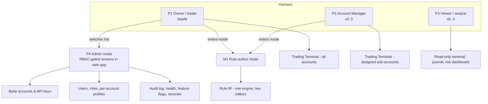

# 10 — Personas & Modes (CandleViewer)

Date: 2026-09-14 · Owner: basiltt · Status: **Baseline for design & backlog**
Scope reminder (locked, see `00-planning-brief.md` + `research/24-owner-decisions.md`): **web app only** — React + TypeScript + a custom WebGL chart engine, wrapped in an Electron desktop shell. Owner/admin functions are RBAC-gated screens **inside** the web app. **No Android client. No separate admin app. Bybit v5 USDT linear perpetuals only.**

These personas are the canonical actors referenced by `11-user-stories.md`, `13-user-flows.md`, `14-screens-catalogue.md` and every backlog ticket. When a story says "As an Account Manager…", it means exactly the persona defined in §3 here, with exactly the permissions in §7.

---

## 0. Persona map at a glance

| # | Persona / mode | App role (RBAC) | Count in v1 | Primary surface | Can place live orders? | Can see other users' accounts? |
|---|---|---|---|---|---|---|
| P1 | **Owner / discretionary order-flow trader** | `owner` | 1 (basiltt) | Trading Terminal | Yes (all accounts) | Yes (all) |
| P2 | **Account Manager** | `manager` | 0–5 (Bybit sub-account cap; 20 with Business KYC) | Trading Terminal (scoped) | Yes (assigned sub-accounts only, within profile limits) | No |
| P3 | **Viewer / analyst** | `viewer` | 0–3 | Read-only Terminal, Journal, Risk Dashboard | No | Only what is explicitly shared (read-only) |
| P4 | **Admin (owner hat)** | `owner` + admin screens | 1 (same human as P1) | Admin section | n/a (administers, does not trade in this mode) | Yes (all) |
| M1 | **Rule author** (mode, not a role) | any of `owner` / `manager` | 1–6 | Rule Builder (form + node editor) | Only by arming a rule, subject to the arming user's role | No (rules are scoped to the author's accounts) |

`owner`, `manager`, `viewer` are the only three roles in v1. **Admin is not a fourth role** — it is the owner wearing an administrative hat, gated behind an explicit "Admin" section, a re-authentication step and step-up TOTP for destructive actions. **Rule author is a *mode*** — a set of screens and tasks that either the Owner or a Manager enters; permissions never expand in rule-author mode, they only narrow (a Manager's rule can never act on an account the Manager cannot trade).

---

## 1. Cross-persona context (applies to all)

**Environment / deployment**
- Backend: Python FastAPI monolith in Docker Compose on WSL Ubuntu (dev) → small VPS (prod). Binds to `127.0.0.1`/WSL-internal only.
- Access path: **Tailscale only**. No public exposure, no port-forwarding. Every persona installs the Tailscale client and is granted via Tailscale ACL before an app account is of any use.
- Client: Electron desktop shell (primary) on Windows 11 / macOS / Linux; the same build also runs in Chromium/Edge as a plain web app for a quick read-only look. Tauri is measured in the engine spike; the app itself is shell-independent.
- Hardware assumption for the *trading* personas (P1, P2): a discrete GPU or modern integrated GPU capable of WebGL2, ≥16 GB RAM, and at least one 2560×1440 monitor; P1 runs 2–3 monitors. Viewer (P3) may be on a laptop at 1920×1080.
- Network: home/office broadband; occasional tethering. Latency to Bybit 20–120 ms. Persona expectations for WS→screen are ≤250 ms end-to-end and order click→ack ≤500 ms.

**Shared pains that the product exists to remove**
1. Bybit's own web UI has no footprint, no DOM heatmap, no delta/CVD pane, no order-flow detectors and no scripted risk automation.
2. TradingView has the charting UX but tier-gates depth/alerts/replay and cannot execute Bybit orders with per-account profiles.
3. DeepCharts-class order flow exists only for futures/equities, not Bybit perps.
4. Multi-account execution on Bybit means logging into N dashboards and repeating an order N times, by hand, under time pressure.
5. There is no local record of L2/tick history, so nothing can be replayed or post-mortemed after the fact.

**Shared accessibility baseline (WCAG 2.2 AA, `05-accessibility-standard.md`)**
- No information conveyed by colour alone — every buy/sell, bid/ask, imbalance and delta encoding also carries a shape, glyph, sign, pattern or text label. This is non-negotiable for footprint cells, DOM heatmap and bubbles.
- Full keyboard operability of every non-canvas control; the WebGL canvas exposes a parallel, focusable, screen-reader-readable data surface (a live region announcing crosshair OHLCV/footprint readout, and a tabular "data table" fallback view of the focused bar).
- Contrast ≥4.5:1 for text, ≥3:1 for UI components and chart strokes against their background, in **both** themes and in the colour-vision-deficiency palettes.
- Motion: all non-essential animation respects `prefers-reduced-motion`; heatmap decay/trails have a "static" mode.
- Target size ≥24×24 CSS px for every interactive control including DOM ladder cells, drag handles for order/TP/SL lines and drawing anchors.
- Focus never trapped; Escape always backs out of one modal/arming level; destructive actions never on hover-only affordances.

---

## 2. P1 — Owner / discretionary order-flow trader

> "I read the tape and the book. I need to *see* absorption forming and get a bracketed order into five accounts before the move finishes."

**Identity.** basiltt. Sole owner of the Bybit main account and every sub-account. Self-directed, full-time-ish discretionary intraday trader on BTCUSDT/ETHUSDT and a handful of high-volume alt perps. Also the product owner of CandleViewer and its most demanding user.

**Goals**
- G1 — See Bybit perp order flow at DeepCharts fidelity: footprint with imbalance/absorption, volume & delta profiles, Deep-Stats rows, DOM ladder with a liquidity heatmap trail, big-trade bubbles, CVD, speed of tape, regime.
- G2 — Execute in under a second from what he sees: hotkey / chart-click / DOM-click entry with an automatic bracket and a **native exchange-side stop-loss on every order**.
- G3 — Fan one decision out to a selected trade group of accounts, each sized and levered by its own per-account profile, and see the group as one logical trade.
- G4 — Never blow up: server-enforced daily loss lockout, dead-man's switch, kill-switch, hard risk caps that survive a UI crash.
- G5 — Learn: every fill auto-journaled with tags, MAE/MFE, a chart snapshot and a one-click jump into tick replay at that timestamp.
- G6 — Codify recurring discretionary habits (move to BE at 1R, trail by 1.5×ATR, flatten 60 s before funding) as rules that execute without him.

**Pains**
- Splits attention across Bybit UI + TradingView + a spreadsheet; loses the order-flow read while clicking.
- Repeating the same order in 3–5 dashboards; sizing mistakes under stress; forgotten stops.
- No history: cannot answer "what did the book look like 40 s before that sweep?".
- Alerts he can't trust because they fire on close-of-bar only.
- Fear that an automation bug places or cancels the wrong thing — wants dry-run, audit and a visible arm/lock state at all times.

**Skills / literacy.** Expert in order flow, market microstructure, Bybit mechanics (UTA, one-way vs hedge, funding, liquidation price, risk-limit tiers). Comfortable with JSON, hotkeys, dense numeric UIs; *not* interested in writing code to define a stop. Will happily learn a node-graph editor if it is faster than a form.

**Environment.** 2–3 monitors (one 3440×1440 ultrawide + one 2560×1440 portrait for DOM/tape), Electron app, hotkeys memorised, Windows 11 host with the backend in WSL. Trades EU/US overlap hours; leaves the app running 24/7 to keep the recorder ingesting.

**Accessibility needs.** Long sessions at high visual density → prefers dark theme at ~90 % density, needs configurable font scale for footprint numerals and the tape, and a low-eye-strain option (reduced saturation, thinner grid). Sensitive to flashing/rapid colour churn on the heatmap — needs a decay-smoothing and reduced-motion setting. Occasional wrist strain → every high-frequency action must be reachable by hotkey, not just mouse.

**Key scenarios**
1. **Session prep (07:50 UTC):** opens a saved workspace; checks funding countdown, OI change, overnight levels; adds two symbols to the recorded list; confirms recorder lag is green.
2. **Absorption long (intraday):** on the 1 500-contract volume-bar footprint, sees 4 stacked bid imbalances plus an absorption flag while the DOM heatmap shows a thickening bid shelf; presses `B` with size preset 2; the ticket fans out to the "Core3" trade group; brackets attach; a native SL rides on every leg.
3. **Managed exit:** at +1R the breakeven rule fires and moves all three legs' stops; he manually scales 50 % out at a naked POC; the trail rule takes the rest.
4. **Bad print / risk event:** a stop-run detector fires in the wrong direction, the 2 % daily-loss lockout trips, trading is disabled across all accounts and he is shown the lockout banner and the audit entry.
5. **Post-mortem (evening):** filters the journal to today's `absorption` tag, opens the losing trade, jumps to replay at entry-15 s, steps tick-by-tick, adds a note and re-tags.
6. **Oversight:** switches to Admin mode to rotate a manager's API key and review the append-only audit log.

---

## 3. P2 — Account Manager

> "I trade the sub-account I've been given. I want the same tools as the owner, no ability to touch anything else, and no surprises about my limits."

**Identity.** 0–5 trusted individuals (cap set by Bybit's 5 Standard-Sub-account limit for a non-Business-KYC main account; 20 with Business KYC). Each is mapped 1:1 to a Bybit sub-account for blast-radius isolation. Two archetypes:
- **P2a Discretionary/intraday manager** — same tooling appetite as P1, tick-speed dependent.
- **P2b Swing manager** — higher-timeframe, alert-driven, checks in a few times a day; leans on multi-TF layouts, journal and alerts more than on the DOM.

**Goals**
- G1 — Fast, reliable execution on their assigned sub-account(s) with brackets and hotkeys.
- G2 — Full order-flow toolset (footprint/DOM/heatmap/CVD) on the same market data as the owner.
- G3 — Absolute clarity about their limits: max position size, max daily loss, allowed symbols, max leverage, max concurrent positions — visible *before* they submit, not after a rejection.
- G4 — Their own journal, their own P&L, their own layouts, their own alerts and rules.
- G5 — Confidence that the environment (Demo vs Live) is unmistakable.

**Pains**
- Being silently blocked by a limit mid-trade with a cryptic error.
- Not knowing whether a stop is exchange-native or app-managed (and therefore whether it survives the app dying).
- Onboarding friction — Bybit blocks API-key creation for 48 h after a new sub-account is registered, and 2FA is required to create the key.
- Fear of accidentally trading Live while thinking they're in Demo.

**Skills / literacy.** Competent discretionary traders; understand leverage, margin mode and liquidation. Not administrators — they never see API secrets, never see other managers, never see the audit log of others. Varying tolerance for complexity: P2b wants a simpler default workspace.

**Environment.** Own laptop/desktop, remote, connected over Tailscale with a per-manager ACL. 1–2 monitors. Electron shell installed by the owner's documented setup steps; may occasionally use the browser build.

**Accessibility needs.** Mixed population — assume at least one manager has a colour-vision deficiency (deuteranopia is the most likely): the green=bid / red=ask convention must have a CVD-safe palette alternative plus non-colour encodings, and the Demo/Live distinction must never be colour-only (it carries a text badge and a persistent chrome label). Assume at least one prefers larger UI scale (125 %) and keyboard-first operation.

**Key scenarios**
1. **Onboarding:** owner creates the sub-account and the app user; manager receives a Tailscale invite, sets a password and enrols TOTP on first login; sees "API key pending — Bybit 48 h restriction, available after <date/time>"; can explore in Demo meanwhile.
2. **First live session:** explicit, confirm-typed Demo→Live switch; chrome turns to the Live accent with a text badge; the limits chip in the ticket shows "max 0.5 BTC · 2 % daily · 10x".
3. **Blocked order:** attempts 0.8 BTC; the ticket pre-validates and shows "exceeds per-account max position 0.5 BTC — reduce to max" with a one-click clamp; nothing is sent to Bybit.
4. **Daily loss lockout:** hits −2 % on their sub-account; the server flattens per policy, revokes order placement, shows the lockout with an expiry and the owner-override path.
5. **Owner freeze:** the owner presses FREEZE; within 2 s the manager's terminal switches to read-only with an explicit banner naming who froze it and when.
6. **Swing check-in (P2b):** opens a 4 h/1 h/15 m linked layout, reviews alerts fired overnight, adjusts a rule-managed trailing stop, writes a journal note.

---

## 4. P3 — Viewer / analyst

> "Let me look at everything and touch nothing."

**Identity.** A read-only account. Used by the owner when reviewing (owner-as-reviewer), by an analyst friend, by an accountant at period end, or by a prospective manager during evaluation.

**Goals**
- G1 — See live and historical charts, order flow, positions, P&L and risk across the accounts they are granted.
- G2 — Read the journal and analytics; export what they're allowed to export.
- G3 — Read the audit log (when granted) to verify what happened and who did it.
- G4 — Run replay and build read-only analyses without any possibility of touching the market.

**Pains**
- Read-only UIs that hide half the data or degrade into an unusable "report".
- Ambiguity about whether a control is disabled or simply broken.
- Accidentally interfering (they must not be able to, structurally — the server rejects, the UI doesn't merely hide).

**Skills / literacy.** Analytical; may be less fluent in microstructure than P1/P2. Needs tooltips, glossary and "(estimated)" labelling to interpret heuristic detectors honestly.

**Environment.** Laptop, single 1920×1080 screen, browser or Electron, over Tailscale. Lower GPU capability — the app must degrade gracefully (reduced heatmap depth tiers, lower target FPS) rather than fail.

**Accessibility needs.** The most likely persona to use a screen reader or high zoom for a periodic review. Everything they consume — journal tables, analytics, audit log, positions — must be fully navigable and announced, with the canvas views offering a tabular data fallback and text summaries (e.g. "Bar 14:32, POC 63 420, delta −812, 3 stacked ask imbalances").

**Key scenarios**
1. **Read-only terminal:** opens a shared layout; every order-entry affordance is present-but-disabled with an explanatory tooltip ("Read-only role"), and hotkeys for order actions are inert with a toast explaining why.
2. **Quarterly review:** filters the journal by date, exports CSV, reads the equity curve and per-tag breakdown.
3. **Audit verification:** searches the audit log for all key-management events in a period, confirms the append-only hash chain check is green.
4. **Replay study:** loads a recorded day, plays at 4×, steps to a sweep, and observes the (estimated) stop-run badge with its explanation panel.
5. **Attempted write (negative test):** crafts a direct API call to place an order; the server rejects with 403 and writes an audit entry.

---

## 5. P4 — Admin (owner hat)

> "Same human, different hat, different risk profile — so make me prove it's me."

**Identity.** P1 in administrative mode. Reached through an "Admin" section in the web app's left rail, visible only to role `owner`. Not a separate application and not a separate login.

**Goals**
- G1 — Manage app users, roles and their mapping to Bybit accounts.
- G2 — Manage Bybit accounts and API keys: add, rotate, revoke; envelope-encrypted storage; enforce Withdrawal=OFF and an IP whitelist; run the permission/IP self-check.
- G3 — Define per-account profiles (leverage, sizing rule, SL/TP offsets, risk caps, allowed symbols) and trade groups.
- G4 — Operate the recorder: recorded-symbols list, auto-record triggers, retention, pinning, disk budget.
- G5 — See system health (ingest lag, WS state, rate-limit budget, DB sizes, error rates) and act: restart a feed, throttle, flip a feature flag.
- G6 — Review the append-only audit log and verify its integrity.
- G7 — Enable Live trading (a gated, pen-test-dependent step) and, in an emergency, freeze everything.

**Pains**
- Secret handling: never wants a plaintext key on screen, in a log, in a backup or in a support bundle.
- Fear of a fat-fingered admin action (revoking the wrong key mid-position, deleting a profile in use).
- Operational blindness — not knowing that the recorder silently stopped three days ago.

**Skills / literacy.** Technically strong; reads logs, understands encryption envelopes, TOTP, IP whitelists, rate limits.

**Environment.** Same machine as P1; admin actions are expected to be done outside active trading hours where possible.

**Accessibility needs.** Admin tables are dense and destructive — needs clear focus order, unambiguous confirm dialogs with typed confirmation for destructive operations, and no colour-only status (a red dot always carries text).

**Key scenarios**
1. **Onboard a manager:** create user → assign role `manager` → bind to sub-account → create per-account profile → note the Bybit 48 h key restriction → later add the key (secret entered once, never re-displayed) → self-check passes (Withdrawal OFF, IP whitelisted, required scopes only).
2. **Rotate a key on schedule:** 90-day policy warning at T−14 d; rotation runs with an overlap window; old key revoked; audit entries written; open orders unaffected.
3. **Retention housekeeping:** disk budget shows 210 GB/30 d; pins one symbol-day used by a study; prunes the rest; sees a dry-run diff first.
4. **Health incident:** ingest lag alarm; opens health; sees `publicTrade` reconnect loop and rate-limit 10018 backoff; flips the "depth 500→200" feature flag to shed load.
5. **Live enablement:** the Live toggle is blocked until the PRR checklist and pen-test sign-off items are all green; enabling requires step-up TOTP and writes a high-severity audit record.
6. **Emergency:** presses the global kill-switch; all managers frozen, all pending orders cancelled, positions flattened per policy, one audit record per action.

**Two distinct admin modes — routine configuration vs. emergency intervention.** ADMIN is one of the two largest domains (14 stories, tied with CHART and ORD) precisely because these two modes have opposite design requirements, and the UI must never let one be mistaken for the other:

| | **Routine configuration** (P4-R) | **Emergency intervention** (P4-E) |
|---|---|---|
| Examples | Create a user, assign a role, add/rotate a key, edit a profile's risk caps, set retention and pinning, adjust a feature flag's default, review the audit log | Freeze one manager, global kill-switch, force-flatten an account, revoke a key mid-position, disable Live trading, force-disarm all rules |
| Typical timing | Outside trading hours, deliberate, reversible | Mid-session, seconds matter, consequences are immediate and partly irreversible |
| Where it lives | Admin section of the left rail, normal density, standard form pages | A persistent **Safety** control that is reachable from *every* screen (rail footer + global hotkey), visually separated from all configuration surfaces |
| Confirmation pattern | Typed confirmation for destructive items; step-up TOTP for key and Live-enablement actions | One clearly-labelled action plus a single confirm naming the exact blast radius ("Freeze M. Ivanov: 1 account, 2 open positions, 3 working orders"); **no typed confirmation**, because a 15-second typing ritual during a runaway is itself the hazard. Step-up is required to **undo** (unfreeze), never to stop harm. |
| Undo model | Edit again; history in the audit log | Explicitly *not* auto-reversible: unfreezing is a separate, step-up-authenticated, audited decision, and rules stay disarmed until re-armed by hand |
| Failure posture | Fail closed with a clear validation error | Fail *safe and loud*: partial failure still freezes everything it can, reports per-entity results, and never reports success unless the API boundary confirms enforcement |

**Additional key scenarios (emergency mode, P4-E)**

7. **Freeze one manager mid-session (targeted, not global).** The owner is watching a manager's positions on the Managers screen and sees size well beyond the agreed limit. From the manager's row he presses **Freeze**. The confirm names the blast radius — the manager's name, one sub-account, two open positions, three working orders — and states what will happen to each (orders cancelled per freeze policy, positions left open, sessions switched to read-only). Within 2 seconds the manager's browser shows a read-only banner explaining who froze them and when; their armed rules are disarmed; a server-side crafted request from their session is refused at the API boundary with 403. The owner then reviews the manager's fills in the journal at leisure. Crucially this flow required **no navigation into the Admin section at all** — it is initiated from the trading surface, because during an intervention the owner must not have to find a settings page. Distinguishing feature vs. routine config: this touches no persisted configuration; the manager's role, profile and key are all unchanged, and unfreezing restores exactly the prior state.
8. **Global kill-switch during a data or market incident.** A feed incident plus a violent move; the owner triggers the global kill-switch from the always-present Safety control. Every account is frozen, every emulated algorithm (OCO, iceberg, TWAP, chase, app-managed trails) is stopped, working orders are handled per each algorithm's cancellation policy, positions are flattened per the configured policy, and one audit record is written per affected entity. The owner sees a live result list with per-entity success/failure — any entity the backend could not reach is shown red with a manual action, and the screen never claims a clean stop it cannot prove. Recovery is deliberately slow: unfreeze requires step-up TOTP, rules remain disarmed, and Live trading stays off until the owner re-enables it.
9. **Revoking a key while a position is open (the overlap between the two modes).** This is the one action that looks routine but behaves like an emergency, and it is designed as such: the revoke dialog detects open positions and working orders on that key, refuses the plain "revoke" path, and offers only two explicit routes — *rotate with overlap* (recommended; new key activated and verified by self-check before the old one is revoked, so protective orders are never unmanaged) or *freeze-then-revoke* (acknowledge that positions will be left without app-side management until a new key is added). The dialog states in plain language which app-managed algorithms would be orphaned. This is why key management sits in the Admin section but borrows the emergency confirmation vocabulary.
10. **Quarterly kill-switch drill.** The owner runs a scheduled drill on the demo environment: triggers a global freeze, measures time-to-enforcement at the API boundary (target ≤2 s), verifies that each manager session went read-only, that every emulated algorithm halted with reason "halted by risk control", and that the audit log contains one record per entity with an intact hash chain. The drill result — timings, failures, follow-up actions — is filed as an audit entry of its own. A failed drill blocks the next release through the PRR checklist.

---

## 6. M1 — Rule author (mode)

> "I want to describe my stop the way I think about it — and see it prove itself on recorded data before it touches a live position."

**Who enters it.** P1 always; P2 when the owner grants the `rules:author` capability on their profile. Never P3.

**Goals**
- G1 — Express Event→Condition→Action rules without writing code: triggers (price, R-multiple, ATR, CVD divergence, tape-speed z-score, regime change, funding time, position age, spread), combinators (AND/OR/NOT, grouping), actions (move SL to BE, trail by ticks/ATR/structure, partial close %, scale-in ladder, time exit, flatten, halt/resume, notify, log, reduce leverage, arm chase, start iceberg slicing).
- G2 — Use **either** editor: a structured form/condition-list, or a node-graph canvas — and switch freely, because both compile to the **same rule IR** and round-trip losslessly.
- G3 — Dry-run: simulate-only mode plus an auto-backtest against recorder history on save.
- G4 — Scope a rule precisely: which accounts, which symbols, which positions, live-armed vs simulate, and what happens on disconnect.
- G5 — Trust the runtime: see every evaluation and firing in a rule log, with inputs at fire time.

**Pains**
- Node editors that become spaghetti; forms that can't express "A and (B or C)".
- Silent rule failures (a metric unavailable because the recorder has no history for that symbol).
- Ambiguity about precedence when two rules act on the same position.
- Not knowing whether a rule's stop is exchange-native or app-side.

**Skills.** Logical/spreadsheet-grade thinking. Not a programmer. Needs validation messages in domain language ("`atr(14)` needs at least 14 closed bars on 5m for BTCUSDT — currently 9").

**Accessibility needs.** The node-graph canvas is the hardest a11y surface in the product. Cross-references (`US-RULE-005`, `US-RULE-010`, theme **T9** in §10) exist for traceability, but the concrete obligations are stated here so designers and developers do not have to chase them:

*Keyboard model (complete, no pointer required).*

| Action | Keys | Expected result |
|---|---|---|
| Move focus between nodes | `Tab` / `Shift+Tab` in graph topological order; `Ctrl+Home` jumps to the first trigger node | Focused node gets a 2 px focus ring at ≥3:1 contrast against canvas and is scrolled into view |
| Move focus between ports of the focused node | `←` / `→` for inputs/outputs, `↑` / `↓` within a port list | Live region announces "input 2 of 3, numeric, connected to ATR(14) output" |
| Start / complete a connection | `Enter` on a source port, arrow to a target port, `Enter` again; `Esc` aborts | Announced on completion and on refusal, with the type-mismatch reason spoken |
| Disconnect | `Delete` on a focused edge | Announced; undoable with `Ctrl+Z` using the same stack as pointer edits |
| Add a node | `Ctrl+K` opens a searchable command palette | Node inserted connected to the focused port where types allow |
| Pan / zoom | `Ctrl+arrows` pan, `Ctrl+ +/−` zoom, `Ctrl+0` fit-to-graph | Never pointer-only; zoom never below the 200 % reflow requirement for labels |
| Reorder / auto-layout | `Ctrl+Shift+L` | Semantics unchanged, announced, undoable |

*Screen-reader model.* A graph is not pleasantly readable as a graph, so the canvas exposes **two** synchronised representations: (a) the canvas itself as an ARIA application region where every node and edge carries an accessible name (`"AND gate, 2 inputs, feeds Move stop to breakeven"`) and description; and (b) a **form view of the identical rule that is an equal-status alternative, not a degraded fallback** — same save button, same validation, same permissions, reachable by a single control that is in the tab order before the canvas. Screen-reader users are expected to author entirely in the form view and to use the canvas only for inspection; nothing in the product may require canvas use. Node-only constructs (fan-out of a shared sub-expression) render in the form view as a read-only, plain-language description ("shared condition group C used by 2 actions"), never as an empty box.

*Announcements and validation.* Validation is continuous and announced politely (`aria-live="polite"`); a blocked save is announced assertively and moves focus to a jump-to-node error list, each item of which is a link that focuses the offending node and speaks the reason in domain language. The plain-language rule summary is the accessible description of the whole rule and is always available as text that can be copied.

*Visual and motion.* The **a11y theme T9** applies here specifically: node categories (metric / comparison / logic / action / risk-control) must be distinguishable by **shape and text label as well as colour** — a colour-blind author must be able to tell a risk-control node from an action node with colour removed; edge validity is shown by line style plus an icon, not red/green alone; all node text meets ≥4.5:1 and all edges/borders ≥3:1 against the canvas in both light and dark themes; every node header, port hit-area and inline control is ≥24×24 px; auto-layout animation, edge routing animation and minimap transitions are disabled under `prefers-reduced-motion`, snapping instantly to the final state. The canvas must remain usable at 200 % browser zoom and at 400 % with the minimap hidden.

*Cognitive load.* Because the author is not a programmer, errors never mention IR, JSON paths or node ids in the primary message ("`atr(14)` needs at least 14 closed bars on 5m for BTCUSDT — currently 9"); technical detail lives in a details disclosure for support.

**Key scenarios**
1. Build "BE at 1R, then trail 1.5×ATR(14)" in the form editor; open it in the node editor; see the identical graph; tweak; return to the form with no loss.
2. Save → auto-backtest against 14 days of recorded BTCUSDT ticks → see fire count, average R impact and a list of firings with timestamps.
3. Arm simulate-only for a session; compare simulated actions with what was actually done manually.
4. Arm live on one account of a trade group only; verify the scope chip shows exactly one account.
5. A rule references an unavailable metric → save is blocked with an explicit, actionable error and a link to start recording that symbol.
6. Two rules target the same position → the conflict resolver shows precedence and requires an explicit ordering decision before arming.

---

## 7. Permission matrix (authoritative for `11-user-stories.md`)

Legend: ✔ allowed · ◑ allowed but scoped to own/assigned accounts · ✖ denied (server-side, 403 + audit) · ⓢ requires step-up TOTP re-auth.

| Capability | Owner (P1/P4) | Manager (P2) | Viewer (P3) |
|---|---|---|---|
| View market data, charts, order flow, replay | ✔ | ✔ | ✔ |
| View positions / orders / P&L | ✔ all accounts | ◑ assigned | ◑ granted, read-only |
| Place / amend / cancel orders | ✔ | ◑ within profile limits | ✖ |
| Flatten / cancel-all | ✔ any account | ◑ own | ✖ |
| Create & edit trade groups | ✔ | ✖ (may select from groups granted to them) | ✖ |
| Author rules | ✔ | ◑ if `rules:author` granted | ✖ |
| Arm rules **live** | ✔ | ◑ own accounts, ⓢ | ✖ |
| Switch Demo↔Live | ✔ ⓢ | ◑ own session, ⓢ, only if owner enabled Live for that account | ✖ |
| Manage users & roles | ✔ ⓢ | ✖ | ✖ |
| Manage Bybit accounts & API keys | ✔ ⓢ | ✖ | ✖ |
| Edit per-account profiles / risk caps | ✔ ⓢ | ✖ (read-only view of own) | ✖ |
| Kill-switch / freeze | ✔ | ✖ | ✖ |
| Recorder config & retention | ✔ | ✖ | ✖ |
| View audit log | ✔ | ◑ own actions only | ◑ if granted |
| System health & feature flags | ✔ | ✖ | ✖ |
| Export journal / analytics | ✔ | ◑ own | ◑ if granted |

---

## 8. Persona → screen affinity (input to `12-sitemap.md` / `14-screens-catalogue.md`)

| Screen area | P1 Owner | P2 Manager | P3 Viewer | P4 Admin | M1 Rule author |
|---|---|---|---|---|---|
| Login / 2FA / session | ●●● | ●●● | ●●● | ●●● | — |
| Trading Terminal (chart + footprint + DOM + tape + ticket) | ●●● | ●●● | ●● (read-only) | ○ | ● |
| Watchlist / symbol search | ●●● | ●● | ●● | ○ | ● |
| Layouts & workspaces | ●●● | ●●● | ●● | ○ | ○ |
| Positions & Orders | ●●● | ●●● | ●● | ● | ● |
| Risk Dashboard | ●●● | ●● (own) | ●● | ●●● | ● |
| Rule Builder (form + node) | ●● | ●● | ○ | ● | ●●● |
| Replay | ●● | ●● | ●●● | ○ | ●● |
| Journal & analytics | ●●● | ●●● | ●●● | ● | ● |
| Alerts centre | ●●● | ●●● | ● | ○ | ●● |
| Admin — users/roles | ○ | ✖ | ✖ | ●●● | ✖ |
| Admin — accounts/keys/profiles/groups | ○ | ✖ | ✖ | ●●● | ● (read scope) |
| Admin — recorder & retention | ○ | ✖ | ✖ | ●●● | ● (read) |
| Admin — audit log | ● | ◑ | ◑ | ●●● | ○ |
| Admin — health & feature flags | ● | ✖ | ✖ | ●●● | ○ |
| Settings / hotkeys / themes | ●●● | ●●● | ●● | ●● | ●● |

●●● primary daily surface · ●● regular · ● occasional · ○ rare · ✖ no access.

---

## 9. Anti-personas (explicitly not designed for)

| Anti-persona | Why excluded |
|---|---|
| Public/retail SaaS customer | CandleViewer is private and self-hosted; no signup, billing, tenancy or public exposure. Offering it publicly would also change Bybit's API-client/broker status. |
| Mobile-first trader | Android/iOS clients are **out of scope** (owner decision 2026-09-14). The API/WS protocol stays client-agnostic so a mobile client can be added later, but no mobile design or ticket is produced now. |
| Algorithmic HFT / latency arbitrageur | The rule engine is a discretionary-assist ECA engine, not a low-latency strategy runtime; targets are ≤250 ms perception, not microseconds. |
| Spot / inverse / options trader | v1 is Bybit USDT linear perpetuals only. |
| Third-party managed-money client | Managers are the owner's authorized individuals, not external clients; no fee handling, no client reporting, no regulated-advice workflows. |
| Data reseller / API consumer | No outbound market-data API or redistribution; would breach exchange terms. |

---

## 10. Persona-derived requirement themes (traceability hooks)

| Theme | Driven by | Shows up in stories |
|---|---|---|
| T1 Sub-250 ms perception loop | P1 G1, P2 G2 | `US-MKT-*`, `US-CHART-*`, `US-DOM-*`, `US-OBS-*` |
| T2 Sub-second, undo-safe execution | P1 G2, P2 G1 | `US-ORD-*`, `US-ALGO-*` |
| T3 Fan-out with per-account truth | P1 G3, P4 G3 | `US-PROF-*`, `US-POS-*` |
| T4 Server-enforced safety that survives a dead UI | P1 G4, P2 G3, P4 G7 | `US-RULE-012..014`, `US-ADMIN-*`, `US-ORD-013` |
| T5 Honest uncertainty ("estimated" badges, empty-history states) | P3, M1 pains | `US-FP-*`, `US-DET-*`, `US-REC-*`, `US-RPL-*` |
| T6 Two editors, one IR | M1 G2 | `US-RULE-001`, `US-RULE-004..006` |
| T7 Unmistakable Demo vs Live | P2 G5, P4 G7 | `US-PAPER-*` |
| T8 Secrets never visible, never logged | P4 G2 | `US-ACCT-*`, `US-ADMIN-*` |
| T9 Equal-status accessible alternatives for canvas UIs (keyboard model, synchronised non-canvas view, shape+label not colour alone, reduced-motion) | P3, M1 a11y (see §6 accessibility tables) | `US-CHART-014`, `US-RULE-004` (form view as equal-status alternative), `US-RULE-005` (canvas keyboard model), `US-RULE-006`, `US-SET-007` |
| T10 Everything auditable, append-only | P3 G3, P4 G6 | `US-ADMIN-008..010` |
| T11 Emergency mode is separate from configuration mode (always-reachable Safety control, blast-radius confirm, no typed confirmation to stop harm, step-up only to undo) | P4-E (§5 scenarios 7–10) | `US-RULE-014`, `US-ADMIN-004`, `US-ADMIN-011`, `US-ALGO-010`, `US-ACCT-*` (revoke-with-open-positions) |
