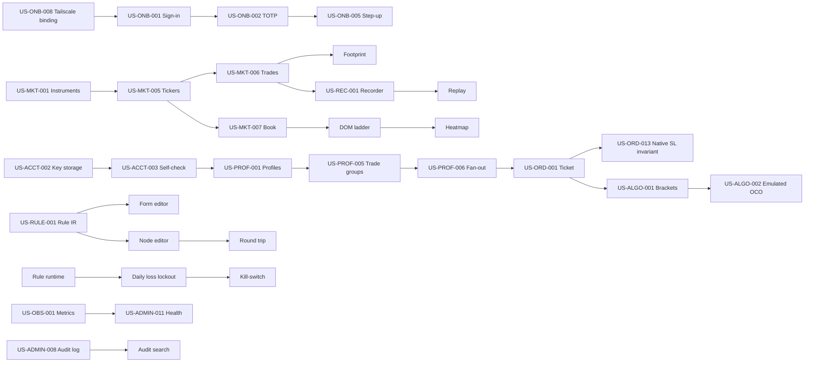

# 11 — User Stories (complete catalogue)

Date: 2026-09-14 · Owner: basiltt · Status: **Source of truth for the backlog**
Scope (locked): **web app only** — React + TypeScript + custom WebGL chart engine, Electron shell; owner/admin screens are RBAC-gated routes **inside** the web app; **no Android, no separate admin app**; **Bybit v5 USDT linear perpetuals only**.

---

## How to read this document

**ID scheme** — `US-<DOMAIN>-<nnn>`, numbering unique and stable per domain. Never renumber; retire with status `Withdrawn` instead.

**Canonical count** — this catalogue contains exactly **259** stories (see §29 traceability summary, which is the authoritative tally; the domain index above must always sum to the same number). Any document that cites a story count (`00-planning-brief.md`, `30-release-roadmap.md`, `31-sprint-plan.md`, sprint boards, coverage reports) must cite **259** and must be updated in the same change as this file. A CI check (`scripts/check-story-count.ts`, see `03-testing-strategy.md`) fails the build if the §29 total, the domain index total and the number of unique `US-…` heading IDs disagree. Note that a raw grep for `US-[A-Z]+-[0-9]{3}` over this file returns **260** unique tokens: the extra token is the literal placeholder `US-XXX-000` used in the block-format example below and is **not** a story. Count story *headings* (`^#### US-`), never inline references.

**ID reservation policy (protects against renumbering when stories split)** — story numbers are allocated sparsely so that the backlog can be refined without touching any existing ID:

| Range within a domain | Use |
|---|---|
| `001`–`099` | Stories written in this catalogue (currently the highest used is `014`, in CHART/ORD/RULE/ADMIN) |
| `100`–`199` | **Reserved for splits.** When `US-RULE-005` proves too large during backlog authoring it becomes `US-RULE-005` (parent, status `Split`) plus `US-RULE-101`, `US-RULE-102`, … The parent ID stays in the graph and keeps every inbound `Deps` reference valid. |
| `200`–`299` | **Reserved for post-v1 additions** discovered during delivery (spikes, defect-driven stories, regulatory or exchange-API changes). |
| `900`–`999` | Reserved for technical-enabler stories created by the tech lead (migrations, spikes, tooling) that have no direct persona value. |

Consequences: the 259 stories here are a **floor, not a ceiling**, and the 180–260 target range applies to this authored catalogue only. Growth during sprint refinement is expected and is handled by the `100`+ ranges — **no renumbering is ever required, and no ID is ever reused.** A split parent keeps its `Refs` and its Gherkin as the umbrella acceptance basis; each child must carry at least one scenario inherited from the parent plus at least one of its own.

**FM reference integrity** — every `FM#n` citation in this document has been machine-verified against the 374 numbered rows of `docs/research/20-feature-matrix.md`: 284 distinct rows are cited and **all 284 exist** in that matrix (0 dangling references). The remaining 90 uncited rows are the rows scoped `Won't` (see §30) plus rows subsumed by a cited sibling row. The same CI check re-verifies this on every change to either file, so a matrix renumbering cannot silently rot the references.

**Block format**

> `#### US-XXX-000 — Title · Priority`
> As a `<persona>`, I want `<capability>`, so that `<benefit>`.
> `AC` — Gherkin, **≥3 scenarios including at least one error/edge case**.
> `NFR` — perf / a11y / security notes that must hold for this story.
> `Deps` — other story IDs that must land first (`—` = none).
> `Refs` — feature-matrix row numbers from `docs/research/20-feature-matrix.md` (`FM#n`), research docs (`R<nn>`), views (`V<n>` from `research/23-views-and-screens.md`), owner decisions (`OD#n`), personas (`P1..P4`, `M1`).

**Priority** — `Must` / `Should` / `Could`, taken from the CandleViewer-scope column of `20-feature-matrix.md`. Anything the matrix marks `Won't` is not a story here (see §Out of scope at the end).

**INVEST** — every story is Independent (or declares its Deps), Negotiable in implementation, Valuable to a named persona, Estimable (none exceeds 8 points; larger capabilities are already split), Small, Testable (Gherkin is the black-box test basis).

**Global acceptance criteria (apply to every story; not repeated per block)**
1. Every server route enforces RBAC per `10-personas.md` §7 server-side; a denied request returns 403, changes nothing and writes an audit record.
2. Every state-changing action writes an append-only audit entry (actor, role, account, timestamp, payload with secrets redacted).
3. Every screen meets WCAG 2.2 AA: keyboard operable, visible focus, ≥4.5:1 text contrast, no colour-only meaning, ≥24×24 px targets, `prefers-reduced-motion` honoured.
4. Every WebGL view keeps ≥55 fps at the documented density budget and degrades (fewer depth tiers / lower cadence) rather than dropping frames or crashing.
5. Every error is shown as an actionable message in domain language, never a raw stack trace or raw exchange error code alone (the code is available in a details disclosure).
6. Any view whose fidelity is a heuristic (no L3/MBO on Bybit) renders a visible **"(estimated)"** badge with an explanation popover.
7. Any view whose depth depends on the local recorder renders an explicit empty/partial-history state naming the first available timestamp.
8. No trading-capable control is operable unless the current environment badge (Demo/Live) and the arm/lock state are both visible on screen.

**Domain index**

| Code | Domain | Stories |
|---|---|---|
| ONB | Onboarding & auth | 10 |
| ACCT | Accounts & API keys | 10 |
| PROF | Per-account profiles & trade groups | 8 |
| MKT | Market data & symbols | 9 |
| CHART | Charting core | 14 |
| DRAW | Drawing tools | 9 |
| IND | Indicators | 8 |
| FP | Footprint | 10 |
| VP | Profiles (volume / delta / TPO) | 9 |
| DS | Deep-Stats rows | 5 |
| DOM | DOM ladder & liquidity heatmap | 10 |
| BIG | Big trades & bubbles | 6 |
| CVD | CVD / delta panes | 6 |
| DERIV | OI / funding / liquidations | 8 |
| DET | Tape speed, imbalance, regime, detectors | 9 |
| LAY | Layouts & workspaces | 8 |
| ORD | Order ticket & chart/DOM trading | 14 |
| ALGO | Bracket / scaled / emulated orders | 10 |
| POS | Positions & orders management | 9 |
| RULE | Rule engine (form, node, runtime) | 14 |
| PAPER | Paper / demo vs live | 8 |
| REC | Recording & retention | 8 |
| RPL | Replay | 9 |
| ALRT | Alerts & notifications | 8 |
| JRN | Journal & analytics | 10 |
| ADMIN | Users, roles, audit, health, flags | 14 |
| SET | Settings, hotkeys, themes | 9 |
| OBS | Observability for the owner | 7 |
| **Total** | | **259** |

---

## 1. ONB — Onboarding & auth

#### US-ONB-001 — Password sign-in · Must
As a **user**, I want to sign in with an email/username and password over Tailscale, so that only invited people reach the terminal.
```gherkin
Scenario: Successful sign-in
  Given I am a registered, enabled user reaching the app over Tailscale
  When I submit my correct username and password
  Then I am advanced to the second factor step
Scenario: Wrong password
  Given I am a registered user
  When I submit an incorrect password
  Then I see "Username or password is incorrect" with no hint about which was wrong
  And the attempt is audited with source IP
Scenario: Disabled account
  Given my account has been disabled by the owner
  When I submit correct credentials
  Then I see "Account disabled — contact the owner" and no session is created
```
NFR: argon2id password hashing, per-account and per-IP rate limiting (5 failures → 15 min lockout), constant-time comparison, no user enumeration; form fully keyboard/screen-reader operable with labelled errors.
Deps: —
Refs: FM#349, R12 §2.5, V1, P1–P3

#### US-ONB-002 — TOTP second factor · Must
As a **user**, I want an app-level TOTP second factor independent of Bybit's, so that a stolen password is not enough.
```gherkin
Scenario: Valid code
  Given I have completed the password step and enrolled TOTP
  When I enter the current 6-digit code
  Then a session is created and I land on my default workspace
Scenario: Reused code
  Given I have just used code 123456 successfully
  When I attempt to sign in again with 123456 inside the same time step
  Then the code is rejected as already used
Scenario: Clock drift
  Given my authenticator is 25 seconds ahead
  When I enter the code it shows
  Then it is accepted within the ±1 time-step window
```
NFR: RFC 6238, 30 s step, ±1 step skew, replay-protected; codes never logged; input announces errors via `aria-live`.
Deps: US-ONB-001
Refs: FM#349, R12 §2.5

#### US-ONB-003 — TOTP enrolment & recovery codes · Must
As a **user**, I want to enrol TOTP on first login and receive single-use recovery codes, so that I cannot be permanently locked out.
```gherkin
Scenario: First-login enrolment
  Given I sign in for the first time with a valid invite
  When I scan the QR code and confirm one valid code
  Then TOTP is enabled and 10 single-use recovery codes are displayed once
Scenario: Recovery code use
  Given I have lost my authenticator
  When I sign in using an unused recovery code
  Then I am signed in, that code is consumed and I am forced to re-enrol TOTP
Scenario: Recovery codes exhausted
  Given all 10 recovery codes are consumed
  When I attempt recovery
  Then I am told to contact the owner, who can reset my TOTP from Admin
```
NFR: recovery codes hashed at rest, shown exactly once, copy + download; QR has an equivalent text secret for screen-reader users.
Deps: US-ONB-002
Refs: FM#349, P2, P4

#### US-ONB-004 — Session lifetime & idle lock · Must
As a **user**, I want sessions that expire and an idle lock, so that an unattended terminal cannot be used by someone else.
```gherkin
Scenario: Idle lock
  Given my idle timeout is 15 minutes
  When I do not interact for 15 minutes
  Then the UI locks to a re-auth overlay while live data keeps streaming underneath
Scenario: Unlock
  Given the screen is locked
  When I enter my password (TOTP not required within absolute session lifetime)
  Then I return to exactly the same workspace and scroll position
Scenario: Absolute expiry
  Given my session is older than 12 hours
  When it expires
  Then I am fully signed out and any armed one-click trading is disarmed
```
NFR: idle timeout configurable 5–60 min per user; lock must not tear down WS subscriptions (reconnect storms); order entry disabled while locked.
Deps: US-ONB-002
Refs: R12 §2.5, P1, P2

#### US-ONB-005 — Step-up re-authentication · Must
As the **owner**, I want sensitive actions to demand a fresh TOTP, so that a hijacked session cannot rotate keys or enable Live.
```gherkin
Scenario: Step-up required
  Given I am signed in and open Admin → API keys
  When I attempt to reveal-scope, rotate or revoke a key
  Then I must enter a fresh TOTP code before the action proceeds
Scenario: Step-up grace
  Given I completed step-up 3 minutes ago
  When I perform a second sensitive action within 5 minutes
  Then no new code is required and the grace window is shown in the dialog
Scenario: Step-up failure
  Given I enter an invalid code 3 times
  Then the action is abandoned, the session is downgraded to read-only for 5 minutes and the event is audited as high severity
```
NFR: 5-minute grace, per-action-class; grace never applies to Live enablement or kill-switch disable.
Deps: US-ONB-002
Refs: FM#349, OD#5, P4

#### US-ONB-006 — Invite-based user creation · Must
As the **owner**, I want to invite a manager or viewer by generating a one-time link, so that I never set someone else's password.
```gherkin
Scenario: Invite accepted
  Given I create an invite for role manager valid for 72 hours
  When the invitee opens the link and sets a password and enrols TOTP
  Then their account becomes active with role manager and zero account bindings
Scenario: Expired invite
  Given an invite is older than 72 hours
  When it is opened
  Then it is rejected and I can re-issue a new one from Admin
Scenario: Invite reuse
  Given an invite has already been redeemed
  When the same link is opened again
  Then it is rejected and the attempt is audited
```
NFR: invite tokens are 256-bit, single use, hashed at rest; role is fixed at invite time and cannot be self-elevated.
Deps: US-ONB-003, US-ADMIN-001
Refs: FM#350, R12 §2.3, P4

#### US-ONB-007 — Guided first-run for a new manager · Should
As a **manager**, I want a first-run checklist, so that I know what is blocked and why on day one.
```gherkin
Scenario: Checklist shown
  Given I sign in for the first time
  Then I see steps: Tailscale OK, TOTP enrolled, sub-account bound, API key status, profile limits, Demo session
Scenario: 48-hour Bybit restriction surfaced
  Given my Bybit sub-account was created less than 48 hours ago
  Then the API key step shows "Bybit blocks API key creation until <UTC timestamp>" with a countdown
  And Demo exploration is offered in the meantime
Scenario: Checklist complete
  Given all steps are green
  Then the checklist collapses into a dismissible summary and does not reappear
```
NFR: no step may be faked client-side — each reflects a server-verified condition.
Deps: US-ONB-006, US-ACCT-003
Refs: FM#350, R12 §1, P2

#### US-ONB-008 — Tailscale-only reachability enforcement · Must
As the **owner**, I want the backend to refuse connections that did not arrive over the private network, so that the app is never publicly exposed.
```gherkin
Scenario: Bound to loopback/WSL only
  Given the backend has started
  Then a startup self-check asserts no listener is bound to 0.0.0.0 and logs the bound interfaces
Scenario: Off-mesh request rejected
  Given a request arrives from a source outside the allowed Tailscale CIDR
  Then it is rejected with 403 before authentication and audited
Scenario: Misconfiguration refuses to trade
  Given the self-check detects a public binding
  Then the app starts in read-only mode with a blocking banner and order placement disabled
```
NFR: check runs at boot and hourly; result exposed as a Prometheus gauge and on the health screen.
Deps: —
Refs: FM#354, OD#6, R12 §2.5

#### US-ONB-009 — Sign-out everywhere · Should
As a **user**, I want to see and revoke my active sessions, so that I can cut off a device I no longer control.
```gherkin
Scenario: List sessions
  Given I open Settings → Sessions
  Then I see each session's device, shell (Electron/browser), first seen, last seen and source address
Scenario: Revoke one
  When I revoke a session
  Then that client is disconnected within 5 seconds and must re-authenticate
Scenario: Revoke all
  When I choose "Sign out everywhere"
  Then all sessions including the current one end and any armed rules owned by me continue running server-side
```
NFR: revocation is server-side (token denylist), not client-side only; rule runtime is deliberately independent of UI sessions.
Deps: US-ONB-004
Refs: R12 §2.6, P1, P2

#### US-ONB-010 — Owner-initiated TOTP reset · Should
As the **owner**, I want to reset a manager's second factor, so that a lost phone does not strand them.
```gherkin
Scenario: Reset issued
  Given a manager has lost their authenticator and has no recovery codes
  When I reset their TOTP with step-up auth
  Then their next sign-in forces re-enrolment and all their sessions are revoked
Scenario: Trading paused during reset
  Given the manager has open positions
  Then the reset does not cancel orders or flatten positions, and I am shown that state before confirming
Scenario: Audit
  Then a high-severity audit entry records who reset whose factor and when
```
NFR: reset never reveals a secret to the owner; requires step-up TOTP.
Deps: US-ONB-005, US-ADMIN-001
Refs: FM#349, P4

---

## 2. ACCT — Bybit accounts & API keys

#### US-ACCT-001 — Register a Bybit account in the app · Must
As the **owner**, I want to register the main account and each sub-account, so that the app knows what it can trade.
```gherkin
Scenario: Add sub-account
  Given I open Admin → Accounts and choose "Add account"
  When I enter a label, the Bybit UID, the account kind (main/sub) and the environment (live/demo)
  Then the account appears as "no key — inactive"
Scenario: Duplicate UID
  When I add a UID already registered for the same environment
  Then it is rejected with "This UID is already registered as <label>"
Scenario: Sub-account cap surfaced
  Given 5 sub-accounts are already registered on a non-Business-KYC main account
  Then adding a sixth shows the Bybit cap (5 regular / 20 Business KYC) and requires explicit acknowledgement
```
NFR: UID validated against `/v5/user/query-api` where possible; labels unique; no secret involved in this story.
Deps: US-ONB-005
Refs: FM#338, OD#5, R12 §1

#### US-ACCT-002 — Store an API key with envelope encryption · Must
As the **owner**, I want key material encrypted with a KEK held outside the database, so that a database leak alone cannot trade.
```gherkin
Scenario: Key stored
  Given I paste an API key and secret for an account
  When I save
  Then the secret is encrypted with a per-record DEK, the DEK wrapped by the KEK, and only the key-id prefix is stored in clear
Scenario: Secret never re-displayed
  When I reopen the key record
  Then the secret field shows a masked placeholder and there is no reveal control anywhere in the app or API
Scenario: KEK unavailable
  Given the KEK cannot be loaded at start-up
  Then the app starts in read-only mode, shows a blocking banner and refuses all trading routes
```
NFR: AES-256-GCM, KEK from OS keyring / sops / env with 0600 perms, never in repo/backups; secrets excluded from logs, traces, error payloads and support bundles by an allow-list serialiser.
Deps: US-ACCT-001
Refs: FM#355, R12 §2.2, OD#5

#### US-ACCT-003 — API key self-check · Must
As the **owner**, I want the app to verify a key's permissions and IP binding before trusting it, so that an over-privileged key is caught immediately.
```gherkin
Scenario: Compliant key
  Given a stored key with Withdrawal disabled, an IP whitelist containing the egress IP and only the required scopes
  When the self-check runs at start-up and on save
  Then the account shows "verified" with the scope list and the whitelist
Scenario: Withdrawal enabled
  Given the key has withdrawal permission
  Then the account is force-disabled for trading, a critical alert is raised and the reason is displayed verbatim
Scenario: Egress IP not whitelisted
  Given the current egress IP is not in the key's whitelist
  Then the account shows "IP mismatch", trading is blocked and the current egress IP is displayed for copy-paste into Bybit
```
NFR: self-check every boot and every 6 h; result cached with timestamp; failures page the owner via the alert channel.
Deps: US-ACCT-002
Refs: FM#344, FM#345, FM#347, R12 §2.1

#### US-ACCT-004 — Key rotation with overlap · Should
As the **owner**, I want to rotate a key without interrupting trading, so that rotation is not something I avoid.
```gherkin
Scenario: Overlapping rotation
  Given an account has an active key
  When I add a replacement key and mark it primary
  Then new requests use the new key while the old key stays valid for a 15-minute drain window
Scenario: Old key revoked
  When the drain window ends or I revoke early
  Then the old key is deleted from storage and a Bybit revoke call is attempted, with the result shown
Scenario: New key fails self-check
  Given the replacement key fails the permission/IP self-check
  Then promotion is refused, the old key remains primary and the failure reason is shown
```
NFR: rotation must not cancel open orders; step-up TOTP required; every step audited.
Deps: US-ACCT-003
Refs: FM#343, FM#346, R12 §2.2

#### US-ACCT-005 — Key rotation policy reminder · Should
As the **owner**, I want the app to remind me before keys age out, so that a 90-day expiry never surprises me.
```gherkin
Scenario: Warning window
  Given a key is 76 days old with a 90-day policy
  Then the Accounts screen shows an amber "rotate within 14 days" chip and an alert is raised
Scenario: Overdue
  Given a key exceeds the policy age
  Then the chip turns red, a daily alert fires, and trading continues (never auto-disabled for age alone)
Scenario: Policy configurable
  When I set the policy to 180 days
  Then all warnings recompute immediately
```
NFR: age computed from key creation date recorded at registration; no reliance on an unverified Bybit expiry field.
Deps: US-ACCT-004
Refs: FM#346, R12 §1

#### US-ACCT-006 — Revoke a key immediately · Must
As the **owner**, I want a one-action revoke, so that I can respond to a suspected compromise in seconds.
```gherkin
Scenario: Revoke
  Given I select an account's key and confirm revoke with step-up auth
  Then the key is deleted locally, a Bybit delete is attempted, the account becomes inactive and all its rules are disarmed
Scenario: Open positions present
  Given the account has open positions
  Then I am shown the position list and must choose "revoke and leave positions" or "flatten first, then revoke"
Scenario: Bybit delete fails
  Given the Bybit revoke call errors
  Then local deletion still happens, the failure is displayed with the exact error and I am instructed to revoke in the Bybit dashboard
```
NFR: local deletion is authoritative — never leave usable material because a remote call failed.
Deps: US-ACCT-002
Refs: FM#343, R12 §2.1

#### US-ACCT-007 — Environment binding per account · Must
As the **owner**, I want each account bound to exactly one environment, so that demo and live keys can never be crossed.
```gherkin
Scenario: Binding enforced
  Given an account is bound to demo
  Then only api-demo hosts and the demo private WS are used for it, and this is shown on the account row
Scenario: Cross-environment key rejected
  When I paste a live key into a demo-bound account and it authenticates against the wrong host
  Then the self-check fails with "key does not belong to this environment"
Scenario: No silent fallback
  Given the demo private WS is unreachable
  Then the app reports the outage; it never falls back to live endpoints
```
NFR: environment is part of every outbound request's client selection; unit + contract tests assert host selection per environment.
Deps: US-ACCT-003
Refs: FM#282, FM#356, R06 §2, V20

#### US-ACCT-008 — Account balance & margin snapshot · Must
As a **trader**, I want each account's equity, available margin and margin mode visible, so that I size trades against reality.
```gherkin
Scenario: Snapshot displayed
  Given an account is verified and connected
  Then equity, available balance, used margin, margin mode and position mode are shown with a freshness timestamp
Scenario: Reconciliation
  Given the private WS wallet stream has been silent for 60 seconds
  Then a REST wallet-balance reconciliation runs and the freshness timestamp updates
Scenario: Stale data
  Given reconciliation also fails
  Then the figures are greyed with a "stale since <time>" badge and risk-based sizing is disabled for that account
```
NFR: WS-first with periodic REST truth-check; never show a number without a freshness indicator.
Deps: US-ACCT-003
Refs: FM#243, R06 §5, V15

#### US-ACCT-009 — Leverage and margin mode control · Must
As a **trader**, I want to set per-symbol leverage and margin mode from the app, so that I do not need the Bybit dashboard.
```gherkin
Scenario: Set leverage
  Given I choose 10x for BTCUSDT on account A
  Then the change is applied via Bybit and reflected in the account snapshot
Scenario: Blocked by open position
  Given an open position prevents the change
  Then the exact exchange reason is surfaced and the previous value is restored in the UI
Scenario: Exceeds profile cap
  Given the account profile caps leverage at 10x
  When I request 20x
  Then the request is refused client- and server-side before any exchange call
```
NFR: risk-limit tiers from `/v5/market/risk-limit` shown alongside the choice; changes audited.
Deps: US-ACCT-008, US-PROF-001
Refs: FM#240, FM#241, FM#201, R06 §1

#### US-ACCT-010 — Account health & connection state · Must
As a **trader**, I want a per-account connection indicator, so that I know whether my orders can even be sent.
```gherkin
Scenario: Healthy
  Given the private WS is connected and authenticated
  Then the account row shows green with the last heartbeat age
Scenario: Degraded
  Given the private WS has dropped and REST polling has taken over
  Then the row shows amber "degraded — REST only" and rule actions requiring sub-second reaction are flagged
Scenario: Down
  Given neither WS nor REST succeeds for 30 seconds
  Then the row shows red, order entry is disabled for that account, and the dead-man's-switch policy is invoked
```
NFR: heartbeat ≤10 s; transition to red within 30 s; states announced to screen readers via a live region.
Deps: US-ACCT-007
Refs: FM#273, FM#368, R06 §7, V15

---

## 3. PROF — Per-account profiles & trade groups

#### US-PROF-001 — Define a per-account profile · Must
As the **owner**, I want each account to carry its own trading profile, so that one decision executes differently per account by design.
```gherkin
Scenario: Create profile
  Given I open an account's profile
  When I set leverage cap, sizing rule, default SL/TP offsets, max risk per trade, max daily loss, max concurrent positions and allowed symbols
  Then the profile is versioned, saved and shown on every ticket targeting that account
Scenario: Invalid combination
  When the sizing rule is "risk-based" but no default stop distance or ATR source is defined
  Then saving is blocked with a field-level explanation
Scenario: Profile in use
  Given open positions exist under the current profile version
  Then editing creates a new version; existing positions keep their originating version for journal attribution
```
NFR: profile is server-enforced on every order path, not just the UI; schema versioned and migration-safe.
Deps: US-ACCT-001
Refs: OD#5, FM#274, FM#340, V21, P4

#### US-PROF-002 — Sizing rules · Must
As a **trader**, I want percent-of-equity, fixed-notional, fixed-quantity and risk-based sizing, so that size follows a policy instead of a guess.
```gherkin
Scenario: Risk-based sizing
  Given equity is 10 000 USDT, risk is 0.5% and the stop distance is 120 USDT on BTCUSDT
  When I open the ticket
  Then quantity is computed, rounded down to the lot size and shown with the implied risk in USDT and in R
Scenario: Percent-of-equity
  Given the rule is 5% of equity at 10x
  Then notional and quantity are shown along with the resulting initial margin
Scenario: Below minimum lot
  Given the computed quantity is below the symbol's minimum order quantity
  Then the ticket blocks submission and explains the minimum, offering the minimum as a one-click choice
```
NFR: all rounding uses instrument tick/lot filters; computation is server-verified on submit so a tampered client cannot oversize.
Deps: US-PROF-001, US-MKT-004
Refs: FM#236, FM#41, R09 §1

#### US-PROF-003 — Allowed-symbol restriction · Must
As the **owner**, I want to restrict an account to a symbol list, so that a manager cannot trade instruments outside their mandate.
```gherkin
Scenario: Allowed
  Given DOGEUSDT is not on account B's allowed list
  When the manager opens the ticket for DOGEUSDT on account B
  Then order entry is disabled with "not permitted on this account"
Scenario: Server enforcement
  When a crafted request submits a DOGEUSDT order for account B
  Then the server rejects with 403 and audits the attempt
Scenario: Empty list means all
  Given the allowed list is empty
  Then all USDT linear perpetuals are permitted (documented in the field's help text)
```
NFR: symbol list validated against the instrument cache; wildcard patterns supported (`*USDT`).
Deps: US-PROF-001, US-MKT-001
Refs: OD#5, FM#274

#### US-PROF-004 — Risk caps enforced server-side · Must
As the **owner**, I want max position size, max daily loss and max concurrent positions enforced in the backend, so that limits survive a broken or hostile client.
```gherkin
Scenario: Position size cap
  Given account C caps position size at 0.5 BTC and holds 0.4 BTC
  When an order for 0.2 BTC is submitted
  Then it is rejected with "would exceed max position 0.5 BTC (current 0.4)"
Scenario: Concurrent positions cap
  Given the cap is 3 and 3 positions are open
  Then any order that would open a fourth symbol is rejected while reduce-only orders are still allowed
Scenario: Daily loss cap
  Given realised+unrealised loss reaches the daily cap
  Then the account is locked out per US-RULE-012 and all new entries are refused
```
NFR: evaluated inside the order path before any exchange call; evaluation adds ≤5 ms p95.
Deps: US-PROF-001, US-POS-001
Refs: FM#274, FM#262, R09 §4

#### US-PROF-005 — Create a trade group · Must
As the **owner**, I want to define a named group of accounts, so that one ticket can target several accounts at once.
```gherkin
Scenario: Create group
  Given I select accounts A, B and C and name the group "Core3"
  Then the group appears in the ticket's target selector with a member count
Scenario: Mixed environments blocked
  When I add a demo account and a live account to the same group
  Then saving is refused with "a trade group cannot mix Demo and Live"
Scenario: Inactive member
  Given account B's key fails its self-check
  Then the group shows "2 of 3 ready" and orders fan out only to ready members, with the skip reported
```
NFR: group membership is server-side truth; group edits audited.
Deps: US-PROF-001, US-ACCT-007
Refs: OD#5, FM#45, FM#338

#### US-PROF-006 — Fan-out an order to a trade group · Must
As the **owner**, I want one submit to create per-account orders under each account's profile, so that I trade N accounts in one action.
```gherkin
Scenario: Fan-out
  Given group Core3 is selected and I submit a market buy with a bracket
  Then three per-account orders are created, each sized and levered by its own profile, each with a native exchange-side stop-loss
  And they are linked under one trade-group id
Scenario: Partial failure
  Given account C's order is rejected by the exchange
  Then A and B remain live, C is shown as failed with the exchange reason, and I am offered "retry C" and "flatten group"
Scenario: Rate-limit budget
  Given fan-out would exceed an account's per-UID rate budget
  Then requests are queued per account with the delay shown, and no request is dropped silently
```
NFR: per-account token buckets from `X-Bapi-Limit-*` headers; fan-out submission p95 ≤400 ms for 5 accounts; every leg audited individually.
Deps: US-PROF-005, US-ORD-001, US-ALGO-001
Refs: OD#5 + cross-cutting §3, FM#45, FM#367, R06 §8

#### US-PROF-007 — Trade-group lifecycle view · Must
As the **owner**, I want the group to be visible as one logical trade, so that I manage it without mental arithmetic.
```gherkin
Scenario: Aggregate view
  Given a group trade is open across three accounts
  Then I see aggregate size, average entry, aggregate uPnL and per-account rows that expand
Scenario: Group action
  When I choose "close group 50%"
  Then each account closes 50% of its own position, rounded to its lot size, and partial failures are listed
Scenario: Divergence warning
  Given one account's position was modified outside the app
  Then the group shows a "divergent" badge naming the account and the difference
```
NFR: aggregation recomputed on every position event; divergence detected by REST reconciliation at least every 30 s.
Deps: US-PROF-006, US-POS-001
Refs: OD#5, V14

#### US-PROF-008 — Per-trade profile overrides · Should
As a **trader**, I want to override selected profile fields for a single trade, so that an exceptional setup does not require editing policy.
```gherkin
Scenario: Allowed override
  Given the profile permits overriding size within its risk cap
  When I raise size for this ticket only
  Then the override applies to this order and is recorded in the journal as an override
Scenario: Forbidden override
  When I try to raise leverage above the profile cap
  Then the control is disabled with "capped by profile"
Scenario: Override expiry
  Given the ticket is submitted or cancelled
  Then the override resets to the profile default for the next ticket
```
NFR: overrides never widen a hard risk cap; each override is audited and journal-tagged.
Deps: US-PROF-002, US-ORD-001
Refs: OD "still open" §per-account profile detail, FM#235

---

## 4. MKT — Market data & symbols

#### US-MKT-001 — Instrument catalogue · Must
As a **trader**, I want an up-to-date list of Bybit USDT linear perpetuals with their precision rules, so that the app never sends an invalid order.
```gherkin
Scenario: Catalogue loaded
  Given the backend starts
  Then instruments-info for category=linear is fetched and cached with tick size, lot size, min/max qty, leverage filter and funding interval
Scenario: Refresh
  Given the catalogue is older than 12 hours or a symbol is unknown
  Then it refreshes on demand and new listings appear without a restart
Scenario: Delisted symbol
  Given a symbol's status is no longer Trading
  Then it is hidden from search, existing charts show a "delisted" banner, and order entry for it is disabled
```
NFR: catalogue is the single source for precision validation everywhere; refresh must not stall the UI.
Deps: —
Refs: FM#370, FM#248, R06 §4, V18

#### US-MKT-002 — Symbol search · Must
As a **trader**, I want fast type-ahead symbol search, so that I change instrument without leaving the keyboard.
```gherkin
Scenario: Fuzzy match
  When I type "btc"
  Then BTCUSDT ranks first, with 24h change and volume shown per result
Scenario: Keyboard selection
  When I press Enter on the highlighted result
  Then the focused chart pane switches symbol and the search closes
Scenario: No match
  When I type "xyzzy"
  Then I see "No USDT perpetual matches 'xyzzy'" and a hint that v1 covers linear perps only
```
NFR: results in ≤50 ms from the local catalogue; full ARIA combobox semantics.
Deps: US-MKT-001
Refs: FM#318, V18

#### US-MKT-003 — Watchlist · Must
As a **trader**, I want saved watchlists with live columns, so that I screen candidates at a glance.
```gherkin
Scenario: Live columns
  Given BTCUSDT and ETHUSDT are on my watchlist
  Then last price, 24h %, 24h volume, funding, next funding countdown and OI change update live
Scenario: Reorder and group
  When I drag a symbol or create a second list
  Then order and membership persist per user across sessions
Scenario: Feed interrupted
  Given the tickers stream drops
  Then affected cells grey out with a "stale" marker rather than showing frozen values as if live
```
NFR: one batched tickers subscription for the whole list; ≤10 topics per subscribe frame; table is a proper ARIA grid.
Deps: US-MKT-001, US-MKT-005
Refs: FM#317, FM#319, FM#371, V18

#### US-MKT-004 — Precision & filter validation · Must
As a **trader**, I want prices and sizes validated against instrument filters, so that orders are never rejected for a formatting reason.
```gherkin
Scenario: Tick rounding
  When I type a price that is not a tick multiple
  Then it snaps to the nearest valid tick on blur and the adjustment is shown
Scenario: Lot rounding
  When a computed quantity is not a lot multiple
  Then it rounds down and displays the rounded value before submission
Scenario: Out of range
  When quantity exceeds the symbol's max order quantity
  Then submission is blocked with the limit stated
```
NFR: identical validation implemented once and shared by client and server (single rule source), with property-based tests.
Deps: US-MKT-001
Refs: FM#248, R06 §4

#### US-MKT-005 — Live ticker stream · Must
As a **trader**, I want live best bid/ask, mark, index and 24h stats, so that every view has a current reference price.
```gherkin
Scenario: Subscribed
  Given a symbol is visible in any view
  Then its tickers topic is subscribed once and fanned out to all consumers
Scenario: Unsubscribe on last consumer
  When the last view using a symbol closes
  Then the topic is unsubscribed after a 30-second grace period
Scenario: Reconnect
  Given the socket drops
  Then it reconnects with exponential backoff and re-subscribes, and consumers see a brief "reconnecting" state rather than stale values
```
NFR: single upstream WS per topic with internal fan-out; WS→screen p95 ≤250 ms.
Deps: US-MKT-001
Refs: FM#79 (infra #358), FM#371, R06 §6, R12 §6

#### US-MKT-006 — Trade (tape) stream ingestion · Must
As the **system**, I want every public trade ingested with taker side and timestamp, so that footprint, delta, CVD, bubbles and tape all derive from one path.
```gherkin
Scenario: Ingest
  Given publicTrade is subscribed for BTCUSDT
  Then each print is normalised to {ts, price, qty, side, tradeId} and published on the internal bus exactly once
Scenario: Gap detection
  Given a sequence gap or reconnect occurs
  Then the gap is recorded, a REST recent-trade backfill is attempted, and derived views mark the affected window as "gapped"
Scenario: Duplicate suppression
  Given the same tradeId arrives twice after a reconnect
  Then it is ingested once
```
NFR: ingest→bus ≤20 ms p95; idempotent by tradeId; sustained 5 000 prints/s across subscribed symbols without loss.
Deps: US-MKT-005
Refs: FM#358, FM#365, FM#368, R06 §6

#### US-MKT-007 — Order-book reconstruction · Must
As the **system**, I want a locally reconstructed L2 book from snapshot+delta, so that DOM, heatmap and detectors share one consistent book.
```gherkin
Scenario: Snapshot then deltas
  Given orderbook.200 is subscribed
  Then the snapshot seeds the book and each delta is applied in sequence order
Scenario: Sequence break
  Given the update sequence is not contiguous
  Then the book is invalidated, a fresh snapshot is requested and dependent views show "resyncing" for that interval
Scenario: Depth tier change
  When the depth tier is changed from 200 to 50 to shed load
  Then the change is applied atomically without emitting a corrupt intermediate book
```
NFR: book apply ≤2 ms p95; invariant checks (no crossed book, monotonic levels) in CI with recorded fixtures.
Deps: US-MKT-005
Refs: FM#359, FM#247, R06 §6, V4

#### US-MKT-008 — Historical OHLCV backfill · Must
As a **trader**, I want historical bars loaded on chart open, so that a chart is useful immediately, not after hours of recording.
```gherkin
Scenario: Backfill
  Given I open BTCUSDT 5m
  Then bars are paged from /v5/market/kline until the configured days-to-load is covered, and progress is shown
Scenario: Cache hit
  Given those bars are already stored
  Then they load from local storage in under 300 ms and only the tail is fetched from the exchange
Scenario: Rate limited
  Given the exchange returns a rate-limit error
  Then backfill backs off, keeps the partial result usable and shows "loading older bars…" without blocking interaction
```
NFR: ≤300 ms to first paint from cache for 5 000 bars; paging respects the 1 000-row limit; retry with jitter.
Deps: US-MKT-001
Refs: FM#31 (infra), FM#41, FM#44, R06 §4

#### US-MKT-009 — Clock sync and server-time offset · Must
As the **system**, I want a verified clock offset against exchange time, so that timestamps, bar boundaries and signatures are correct.
```gherkin
Scenario: Offset measured
  Given the backend starts
  Then the offset to Bybit server time is measured and re-measured every 5 minutes
Scenario: Drift alarm
  Given the offset exceeds 500 ms
  Then a warning alert is raised and shown on the health screen
Scenario: Signature failure fallback
  Given a request fails with a timestamp error
  Then the offset is re-measured immediately and the request retried once
```
NFR: NTP on the host plus app-level offset; offset exported as a metric.
Deps: —
Refs: FM#369, R06 §8

---

## 5. CHART — Charting core (custom WebGL engine)

#### US-CHART-001 — Candlestick rendering · Must
As a **trader**, I want candlesticks rendered by the WebGL engine, so that price is legible and smooth at any zoom.
```gherkin
Scenario: Render and update
  Given BTCUSDT 1m with 5 000 bars loaded
  Then candles draw in one pass and the forming bar updates on every trade without a full redraw
Scenario: Deep zoom out
  Given 100 000 bars are in the series
  When I zoom to fit
  Then rendering stays at or above 55 fps using level-of-detail aggregation, and the aggregation level is indicated
Scenario: No data
  Given the symbol has no bars in the requested range
  Then an explicit empty state names the first available timestamp instead of drawing an empty grid
```
NFR: ≥55 fps at 100k bars on the reference GPU; GPU memory ≤512 MB per chart pane; canvas exposes an accessible focused-bar readout.
Deps: US-MKT-008
Refs: FM#1, OD#1, R10

#### US-CHART-002 — Alternative chart types · Should
As a **trader**, I want OHLC bars, line, area, Heikin-Ashi and a volume column pane, so that I can read price the way the situation demands.
```gherkin
Scenario: Switch type
  When I switch from candles to Heikin-Ashi
  Then the transform is applied client-side with no refetch and drawings stay anchored to real time/price
Scenario: Volume pane
  When I enable the volume column pane
  Then it renders as a linked sub-pane sharing the time axis and crosshair
Scenario: Unsupported combination
  When I request Heikin-Ashi together with footprint cells
  Then I am told footprint requires a real-price bar type and offered to switch back
```
NFR: type switch ≤100 ms; each type has an accessible name in the type selector.
Deps: US-CHART-001
Refs: FM#2, FM#3, FM#4, FM#6, FM#11

#### US-CHART-003 — Order-flow bar modes · Must
As an **order-flow trader**, I want volume bars and tick/trade bars in addition to time bars, so that bars are built by activity rather than the clock.
```gherkin
Scenario: Volume bars
  Given I select "volume bars, 1 500 contracts"
  Then a new bar opens each time cumulative volume crosses the threshold, built from recorded and live prints
Scenario: Tick bars
  Given I select "tick bars, 500 trades"
  Then a new bar opens every 500 prints
Scenario: Insufficient tick history
  Given the recorder has only 3 days of prints for the symbol
  Then bars are built for the available window and an explicit partial-history marker shows where tick data begins
```
NFR: bar construction runs in the backend from one shared ingestion path (live and replay identical); rebuilds of 1M prints complete in ≤10 s.
Deps: US-MKT-006, US-REC-001
Refs: FM#20, FM#21, FM#365, R04

#### US-CHART-004 — Range, Renko, delta and P&F bars · Should/Could
As a **trader**, I want range bars (Should), delta bars (Should) and Renko/P&F (Could), so that I can filter noise in different ways.
```gherkin
Scenario: Range bars
  Given range = 20 ticks
  Then each bar closes when its high-low span reaches 20 ticks
Scenario: Delta bars
  Given the delta threshold is 2 000
  Then a new bar opens when cumulative signed delta crosses ±2 000
Scenario: Parameter change
  When I change the brick or range size
  Then the series rebuilds from stored prints with a progress indicator and drawings re-anchor by timestamp
```
NFR: rebuild is cancellable; parameters persisted per chart template.
Deps: US-CHART-003
Refs: FM#14, FM#15, FM#18, FM#19, FM#22

#### US-CHART-005 — Timeframe switching · Must
As a **trader**, I want to switch intervals from 1 s to 1 D including custom intervals, so that context and execution timeframes are one keystroke apart.
```gherkin
Scenario: Standard interval
  When I press the hotkey for 5m
  Then the chart switches, reuses cached bars and preserves the visible time window centre
Scenario: Sub-minute interval
  When I select 5 s
  Then bars are constructed from recorded prints, with a partial-history marker if recording is shallower than the view
Scenario: Custom interval
  When I enter 7m
  Then bars are aggregated from 1m data and the interval is added to my recent list
```
NFR: switch ≤200 ms from cache; no flash of empty chart.
Deps: US-CHART-001, US-CHART-003
Refs: FM#24, FM#32, FM#40

#### US-CHART-006 — Pan, zoom, autoscale · Must
As a **trader**, I want fluid pan/zoom with auto-fit and manual scale lock, so that navigation never fights me.
```gherkin
Scenario: Pan and zoom
  When I drag horizontally or scroll
  Then the view pans/zooms at ≥55 fps with inertia that respects reduced-motion settings
Scenario: Autoscale
  Given autoscale is on
  Then the price axis fits the visible range, including any visible drawings if "include drawings" is enabled
Scenario: Manual lock
  Given I drag the price axis
  Then autoscale disengages, a lock badge appears, and double-clicking the axis restores auto-fit
```
NFR: input-to-pixel latency ≤1 frame; keyboard equivalents for pan/zoom/reset (arrow keys, +/-, Home).
Deps: US-CHART-001
Refs: FM#36, FM#33, FM#34

#### US-CHART-007 — Log and percentage scales · Must/Should
As a **trader**, I want log (Must), linear (Must) and percentage (Should) price scales, so that I can compare moves proportionally.
```gherkin
Scenario: Log scale
  When I switch to log
  Then gridlines and every overlay, drawing and profile re-project correctly
Scenario: Percent scale
  Given percent scale with the left edge as reference
  Then values display as % change from the reference bar
Scenario: Invalid on log
  Given a series contains non-positive values
  Then log scale is disabled with an explanation rather than rendering incorrectly
```
NFR: projection is a single shared function used by every renderer, covered by unit tests.
Deps: US-CHART-006
Refs: FM#33, FM#34, FM#35

#### US-CHART-008 — Crosshair, OHLCV readout and countdown · Must
As a **trader**, I want a crosshair with a precise data readout and a bar-close countdown, so that I always know exactly what I am looking at.
```gherkin
Scenario: Readout
  When I move the crosshair over a bar
  Then O/H/L/C, volume, delta, time and the values of visible indicators are displayed
Scenario: Countdown
  Given a time-based interval
  Then the seconds to bar close are displayed and turn amber in the final 10 seconds
Scenario: Keyboard crosshair
  When I focus the chart and press arrow keys
  Then the crosshair steps bar by bar and the readout is announced in a live region
```
NFR: readout updates within one frame; live-region announcements throttled to ≤2/s to avoid screen-reader flooding.
Deps: US-CHART-001
Refs: FM#38, FM#325, a11y standard

#### US-CHART-009 — Session and day-boundary configuration · Must
As a **crypto trader**, I want to define the day boundary (UTC 00:00, funding time or custom), so that sessions, VWAP and profiles mean what I intend.
```gherkin
Scenario: UTC day
  Given the boundary is UTC 00:00
  Then session VWAP, session profile and TPO all reset at that instant and a boundary marker is drawn
Scenario: Funding anchor
  When I choose the funding-time anchor
  Then session resets occur at each funding settlement for that symbol, using its actual funding interval
Scenario: No RTH/ETH
  Then no extended-hours toggle exists anywhere, since crypto trades 24/7
```
NFR: boundary is one setting consumed by VWAP, profiles, TPO, Deep-Stats and journal grouping.
Deps: US-CHART-005
Refs: FM#39, FM#42, FM#31(Won't note), R08

#### US-CHART-010 — Days-to-load control · Must
As a **trader**, I want to control how much history each view loads, so that I trade off depth against memory and load time.
```gherkin
Scenario: Set lookback
  When I set 30 days on a 1m chart
  Then only that window is fetched and the estimated memory footprint is shown
Scenario: Exceeds budget
  When the request would exceed the configured client memory budget
  Then I am warned with the estimate and must confirm before it loads
Scenario: Per-view default
  Then each view type (chart, footprint, profile, replay) has its own default lookback in settings
```
NFR: memory estimate accurate within ±20 %; loading never blocks the UI thread.
Deps: US-MKT-008
Refs: FM#44, FM#41

#### US-CHART-011 — Compare / overlay symbol · Should
As a **trader**, I want to overlay a second symbol or a ratio, so that I can see relative strength.
```gherkin
Scenario: Overlay
  When I add ETHUSDT to a BTCUSDT chart in % mode
  Then both series render on a normalised scale with a legend and distinguishable line styles (not colour alone)
Scenario: Ratio
  When I choose ratio mode
  Then BTCUSDT/ETHUSDT is computed bar by bar with aligned timestamps
Scenario: Misaligned history
  Given one symbol lacks bars for part of the range
  Then the gap is drawn as a gap, never interpolated
```
NFR: overlays limited to 3 per pane with a clear message at the limit.
Deps: US-CHART-007
Refs: FM#29, FM#35

#### US-CHART-012 — Chart templates · Must
As a **trader**, I want to save and apply chart templates, so that a new pane is configured in one click.
```gherkin
Scenario: Save template
  Given a configured chart (type, indicators, footprint settings, styles)
  When I save it as "OF-5m"
  Then it appears in the template list for any pane
Scenario: Apply
  When I apply "OF-5m" to another pane
  Then all settings apply while symbol and interval remain that pane's own unless the template pins them
Scenario: Missing dependency
  Given a template references an indicator that has been removed
  Then it applies the rest and reports exactly what was skipped
```
NFR: templates versioned; forward-compatible loader ignores unknown keys with a warning.
Deps: US-CHART-002, US-IND-001
Refs: FM#313, FM#15 (digest 12)

#### US-CHART-013 — Order and position overlays on the chart · Must
As a **trader**, I want my orders, stops, targets, entries and executions drawn on the chart, so that I manage trades where I analyse them.
```gherkin
Scenario: Lines drawn
  Given I have a long position with SL and TP
  Then entry, SL, TP and each working order render as labelled lines with size, and fills render as execution markers
Scenario: Multi-account
  Given a trade group spans three accounts
  Then lines are grouped with a member count and can be expanded to per-account lines
Scenario: Off-screen order
  Given a working order is outside the visible price range
  Then an edge indicator shows its direction and distance
```
NFR: overlay updates within 100 ms of a private WS event; labels must remain legible at ≥90 % density and never obscure the last price.
Deps: US-CHART-001, US-POS-001
Refs: FM#246, FM#228, V13

#### US-CHART-014 — Accessible chart data alternative · Must
As a **screen-reader or low-vision user**, I want a tabular, readable alternative to the canvas, so that chart content is not lost to me.
```gherkin
Scenario: Data table view
  Given a chart pane is focused
  When I activate "show data table"
  Then a virtualised accessible table of the visible bars (time, OHLCV, delta, POC, flags) is shown and is fully keyboard navigable
Scenario: Summary announcement
  When I request a summary
  Then a concise text description of the visible range is announced (trend, range, notable flags)
Scenario: Sync
  When I move the crosshair
  Then the table's focused row follows, and vice versa
```
NFR: table virtualisation keeps ≥55 fps; announcements throttled; this view is treated as an equal-status alternative, not a degraded fallback.
Deps: US-CHART-008
Refs: `05-accessibility-standard.md`, P3, T9

---

## 6. DRAW — Drawing tools

#### US-DRAW-001 — Horizontal line and ray · Must
As a **trader**, I want persisted horizontal levels per symbol, so that my key levels are there every session.
```gherkin
Scenario: Draw and persist
  When I draw a horizontal line on BTCUSDT and reload the app
  Then the line is still there at the same price on every BTCUSDT chart
Scenario: Edit
  When I drag the line
  Then the price label updates live and the new value is saved on release
Scenario: Delete
  When I select it and press Delete
  Then it is removed from all panes showing that symbol and the action is undoable
```
NFR: persistence is server-side per user and symbol; drag handles ≥24 px; keyboard nudge with arrow keys (1 tick, 10 ticks with Shift).
Deps: US-CHART-001
Refs: FM#48, FM#49, digest 12 #4

#### US-DRAW-002 — Trendline, ray and extended line · Must/Should/Could
As a **trader**, I want trendlines (Must), rays (Should) and extended lines (Could), so that I can mark structure.
```gherkin
Scenario: Two-point draw
  When I click a start and end point
  Then the line is created, anchored to bar timestamps and prices, and stays correct through zoom and scale changes
Scenario: Magnet snap
  Given magnet mode is on
  Then anchors snap to the nearest OHLC value within the snap radius and the snap target is highlighted
Scenario: Keyboard creation
  When I use the keyboard drawing mode
  Then I can place both anchors by stepping the crosshair and confirming with Enter
```
NFR: anchors stored as (timestamp, price), never pixels; log/linear scale changes must not move them.
Deps: US-DRAW-001
Refs: FM#45, FM#46, FM#47, FM#72

#### US-DRAW-003 — Rectangle, channel and triangle · Must/Should/Could
As a **trader**, I want rectangles (Must), parallel channels (Should) and triangles (Could), so that I can mark zones.
```gherkin
Scenario: Rectangle zone
  When I draw a rectangle over a consolidation
  Then it renders with configurable fill opacity and border, and reports its price height and bar width in the tooltip
Scenario: Channel
  When I draw a parallel channel
  Then the third drag sets the width, and both edges stay parallel through scale changes
Scenario: Overlap legibility
  Given multiple overlapping zones
  Then fills blend without making price candles unreadable, and a "flatten opacity" toggle exists
```
NFR: fills must respect the minimum contrast of candles drawn over them.
Deps: US-DRAW-002
Refs: FM#61, FM#53, FM#64

#### US-DRAW-004 — Fibonacci retracement and extension · Must/Should
As a **trader**, I want Fibonacci retracement (Must) and extension (Should) with configurable levels, so that I can project targets.
```gherkin
Scenario: Draw retracement
  When I drag from swing low to swing high
  Then levels 0/0.236/0.382/0.5/0.618/0.786/1 render with price and percentage labels
Scenario: Customise levels
  When I add a 0.886 level and save as default
  Then new Fibonacci drawings use my level set
Scenario: Inverted drag
  When I drag high to low
  Then levels invert correctly and labels remain readable
```
NFR: level configuration stored in drawing templates.
Deps: US-DRAW-002
Refs: FM#57, FM#58

#### US-DRAW-005 — Anchored VWAP drawing · Must
As an **order-flow trader**, I want to click a bar to anchor a VWAP, so that I can measure value from any event.
```gherkin
Scenario: Anchor
  When I click a bar to anchor
  Then a VWAP is computed from that bar's prints forward and updates live
Scenario: Bands
  When I enable standard-deviation bands
  Then 1/2/3σ bands render and are individually toggleable
Scenario: No tick data
  Given the anchor precedes recorded tick history
  Then VWAP falls back to bar-approximated volume with a visible "approximate" badge
```
NFR: incremental computation — never recompute the whole series per tick; ≤2 ms update per anchored VWAP.
Deps: US-DRAW-002, US-MKT-006
Refs: FM#52, FM#181, FM#180

#### US-DRAW-006 — Text, note and price label annotations · Must
As a **trader**, I want to attach notes to the chart, so that my reasoning stays with the price action.
```gherkin
Scenario: Add note
  When I place a note and type text
  Then it anchors to a bar and price and persists per symbol
Scenario: Long text
  Given the text exceeds the box
  Then it truncates with an expand affordance and a full-text tooltip
Scenario: Screen reader
  Then each annotation is listed in the object tree with its text and anchor, and is reachable by keyboard
```
NFR: notes are included in journal snapshots; text sanitised before storage and rendering.
Deps: US-DRAW-001
Refs: FM#66, FM#67

#### US-DRAW-007 — Long/short position tool · Must
As a **trader**, I want a drag-based long/short tool showing risk, reward and size, so that I plan the trade before I place it.
```gherkin
Scenario: Drag entry, stop and target
  Then the tool shows R:R, risk in USDT, reward in USDT and the position size implied by the account profile
Scenario: Send to ticket
  When I choose "send to ticket"
  Then the order ticket opens pre-filled with entry, stop, target and the computed size
Scenario: Risk exceeds cap
  Given the implied risk exceeds the profile cap
  Then the tool highlights it in the error state and the "send to ticket" action is disabled with the reason
```
NFR: identical sizing maths as US-PROF-002 (shared implementation).
Deps: US-PROF-002, US-ORD-001
Refs: FM#69, FM#70

#### US-DRAW-008 — Object management: undo/redo, lock, hide, layers · Must/Should/Could
As a **trader**, I want to undo, lock, hide and manage drawing objects, so that my chart stays under control.
```gherkin
Scenario: Undo/redo
  When I press Ctrl+Z after deleting a drawing
  Then it is restored with all properties; Ctrl+Shift+Z redoes
Scenario: Lock and hide all
  When I lock all drawings
  Then they cannot be moved by dragging but remain visible and selectable for inspection
Scenario: Object tree
  Then an object list shows every drawing on the symbol with type, anchor time/price, visibility and lock state, navigable by keyboard
```
NFR: undo stack ≥50 operations per symbol, session-scoped; tree is virtualised for ≥500 objects.
Deps: US-DRAW-001
Refs: FM#78, FM#73, FM#77

#### US-DRAW-009 — Drawing templates and cross-chart sync · Should
As a **trader**, I want drawing styles saved as templates and levels synced across panes, so that multi-chart layouts stay consistent.
```gherkin
Scenario: Style template
  When I save a style as "key level" and apply it
  Then colour, width, style and label settings apply to new drawings of that type
Scenario: Cross-pane sync
  Given two panes show BTCUSDT at different intervals and level-sync is on
  Then a level drawn in one appears in the other instantly
Scenario: Sync off
  Given sync is off for a pane
  Then drawings made there remain local to that pane and are marked as such in the object tree
```
NFR: sync is per-layout and per-symbol; never syncs across different symbols.
Deps: US-DRAW-008, US-LAY-003
Refs: FM#74, FM#76, FM#75

---

## 7. IND — Indicators

#### US-IND-001 — Add, configure and remove indicators · Must
As a **trader**, I want to add indicators with editable parameters and styles, so that my chart reflects my method.
```gherkin
Scenario: Add
  When I add EMA(21) from the indicator picker
  Then it renders in the price pane with a legend entry showing the parameter and current value
Scenario: Reconfigure
  When I change the length to 34
  Then the series recomputes incrementally and the legend updates without a chart reload
Scenario: Remove
  When I remove it
  Then it disappears from the pane, the legend and the template diff, with undo available
```
NFR: computation is incremental per new bar; adding 10 indicators must not reduce frame rate below 55 fps.
Deps: US-CHART-001
Refs: FM#79, FM#110

#### US-IND-002 — Moving averages family · Must/Should
As a **trader**, I want SMA and EMA (Must) plus WMA/VWMA/SMMA/DEMA/TEMA and MA ribbon/cross (Should), so that I have the trend tools I actually use.
```gherkin
Scenario: SMA/EMA
  Then values match reference implementations to 1e-8 on the test fixtures
Scenario: Ribbon
  When I add an MA ribbon of 5 lengths
  Then it renders as one legend entry with an expandable list
Scenario: Insufficient history
  Given fewer bars than the period exist
  Then the indicator renders only from the first valid bar and states how many bars are still needed
```
NFR: shared indicator kernel used by chart, alerts, rule engine and backtest — one implementation, one result.
Deps: US-IND-001
Refs: FM#79–83

#### US-IND-003 — Oscillators · Must/Should
As a **trader**, I want RSI, MACD (Must) and Stochastic/CCI/Williams %R (Should) in sub-panes, so that I can gauge momentum.
```gherkin
Scenario: Sub-pane
  When I add RSI(14)
  Then a linked sub-pane is created with its own scale, guide levels at 30/70 and shared crosshair
Scenario: Divergence marking
  Given RSI divergence detection is enabled
  Then confirmed divergences are marked with a glyph plus a text label, never colour alone
Scenario: Pane management
  When I remove the last indicator in a sub-pane
  Then the sub-pane collapses and vertical space redistributes
```
NFR: sub-pane heights persisted per layout.
Deps: US-IND-001
Refs: FM#90, FM#92, FM#91, FM#93

#### US-IND-004 — Volatility and band indicators · Must/Should
As a **trader**, I want Bollinger Bands, ATR, ADX (Must) and Keltner/Donchian (Should), so that I can size and gauge regime.
```gherkin
Scenario: ATR used elsewhere
  Given ATR(14) is configured
  Then the same value is available to the sizing calculator, the rule engine and alerts
Scenario: Bands render
  When I add Bollinger(20,2)
  Then upper/middle/lower render with an optional shaded channel that keeps candle contrast
Scenario: Parameter validation
  When I enter a period of 0
  Then the field shows an inline error and the previous value is retained
```
NFR: ATR is exposed as a first-class metric to the rule DSL.
Deps: US-IND-001
Refs: FM#96, FM#97, FM#99, FM#98

#### US-IND-005 — Trend tools: Supertrend, Zig Zag, Ichimoku, PSAR · Must/Should
As a **trader**, I want Supertrend and Zig Zag (Must) plus Ichimoku and Parabolic SAR (Should), so that structure and trailing references are visible.
```gherkin
Scenario: Supertrend
  Then direction flips render with a marker and a text label, and the current direction is in the legend
Scenario: Zig Zag swings
  Then confirmed swing highs and lows are exposed as named metrics usable by structure-based trailing stops
Scenario: Repainting disclosure
  Given Zig Zag's last leg is unconfirmed
  Then it renders dashed with a "provisional" label and is excluded from rule evaluation
```
NFR: no rule may act on a provisional swing — enforced in the rule engine, covered by tests.
Deps: US-IND-001
Refs: FM#86, FM#88, FM#84, FM#85

#### US-IND-006 — Volume-based indicators · Must/Should
As a **trader**, I want the volume histogram and CVD in classic indicator form (Must) plus OBV/CMF/MFI (Should), so that participation is measurable.
```gherkin
Scenario: Volume histogram
  Then per-bar volume renders with up/down encoding by pattern and colour, and an average-volume line is optional
Scenario: Classic CVD
  Then CVD as an indicator matches the dedicated CVD pane exactly for the same reset anchor
Scenario: Missing tick data
  Given a range predates recorded prints
  Then CVD renders only where prints exist, with a partial-history marker
```
NFR: single delta computation shared with footprint, Deep-Stats and the CVD pane.
Deps: US-IND-001, US-MKT-006
Refs: FM#102, FM#105, FM#103

#### US-IND-007 — Session and anchored VWAP as indicators · Must/Should
As a **trader**, I want session VWAP with envelopes as an indicator (not only a drawing), so that it is part of my template.
```gherkin
Scenario: Session VWAP
  Given the day boundary is UTC 00:00
  Then VWAP resets at the boundary and the reset is marked on the chart
Scenario: Envelopes
  When I enable 1/2/3σ envelopes
  Then they render as toggleable bands with labelled values
Scenario: Anchor options
  When I set the anchor to funding time
  Then VWAP resets at each funding settlement for the symbol
```
NFR: uses the same incremental VWAP kernel as US-DRAW-005.
Deps: US-CHART-009, US-DRAW-005
Refs: FM#179, FM#180, FM#42

#### US-IND-008 — Indicator alert & rule exposure · Must
As a **rule author**, I want every enabled indicator's values exposed as named metrics, so that alerts and rules can reference exactly what I see.
```gherkin
Scenario: Metric available
  Given EMA(21) is on my 5m chart
  Then `ema(21, 5m)` is selectable in the alert and rule editors with its current value shown
Scenario: Ambiguity resolved
  Given two EMA(21) instances with different sources exist
  Then each is listed with a distinguishing label and its own metric key
Scenario: Removed indicator in use
  When I remove an indicator referenced by an armed rule
  Then removal is blocked with the list of referencing rules, and I can disarm or edit them from there
```
NFR: metric identity is stable across sessions (key, not display name); resolution failures surface at save time, never silently at runtime.
Deps: US-IND-002, US-RULE-002
Refs: FM#269, FM#300

---

## 8. FP — Footprint

#### US-FP-001 — Footprint volume cells · Must
As an **order-flow trader**, I want per-price traded volume inside each bar, so that I see where business was done.
```gherkin
Scenario: Render cells
  Given footprint is enabled on a 5m BTCUSDT chart
  Then each bar shows per-price-level volume, aggregated at the configured price-bucket size
Scenario: Bucket size
  When I change the bucket from 1 tick to 5 ticks
  Then cells re-aggregate without refetching and the bucket size is shown in the legend
Scenario: Density limit
  Given the zoom level would render more than the configured cell budget
  Then cells collapse to a compact profile representation with a "zoom in for numbers" hint rather than dropping frames
```
NFR: ≥55 fps with 60 visible bars × 40 price levels showing numerals; text rendered from a glyph atlas, not DOM.
Deps: US-CHART-003, US-MKT-006
Refs: FM#26, FM#111, FM#115, OD#1, V1

#### US-FP-002 — Bid/ask split cells · Must
As an **order-flow trader**, I want bid vs ask volume per price level, so that I can see aggression at each price.
```gherkin
Scenario: Split display
  Then each cell shows bid-side and ask-side volume side by side with a clear separator and per-side labels
Scenario: Taker-side attribution
  Then attribution uses the exchange-reported taker side, and the method is documented in the info popover
Scenario: Narrow cells
  Given the cell is too narrow for both numbers
  Then it degrades to a bar representation with the values in the tooltip
```
NFR: no colour-only encoding of side; contrast maintained against the cell background heat.
Deps: US-FP-001
Refs: FM#112, R08, V1

#### US-FP-003 — Delta and delta+total cell modes · Must/Should
As an **order-flow trader**, I want delta (Must) and delta+total (Should) cell modes, so that I can read net aggression compactly.
```gherkin
Scenario: Delta mode
  Then each cell shows signed delta with sign and a directional glyph in addition to colour
Scenario: Delta+total
  Then each cell shows delta over total volume in one cell, with a shared legend explaining the layout
Scenario: Mode switch
  When I switch modes
  Then the switch is instant from cached aggregates with no refetch
```
NFR: all four cell modes share one aggregate store.
Deps: US-FP-002
Refs: FM#113, FM#114

#### US-FP-004 — Profile and box display modes · Must
As an **order-flow trader**, I want footprint drawn as a histogram profile or as numeric boxes, so that I can choose density over detail.
```gherkin
Scenario: Profile mode
  Then each bar draws a horizontal histogram per price level scaled to the bar's maximum
Scenario: Box mode
  Then each level draws a bordered numeric cell with heat shading
Scenario: Mixed layouts
  Given two panes on the same symbol
  Then each may use a different display mode independently
```
NFR: mode is part of the chart template.
Deps: US-FP-001
Refs: FM#115, FM#116, V1

#### US-FP-005 — Footprint input types · Must/Should
As an **order-flow trader**, I want input by traded volume (Must), aggregated volume and number of trades (Should), so that size and frequency can be separated.
```gherkin
Scenario: Number-of-trades input
  Then cells show print counts instead of quantity, with the legend stating the unit
Scenario: Aggregated volume
  Then prints at the same price, side and millisecond are merged before display, per the configured aggregation window
Scenario: Order input unavailable
  Then the "Order (per-order arrival)" input is absent from the UI, with an info note that Bybit provides no L3/MBO feed
```
NFR: aggregation window configurable 0–100 ms; changing it re-aggregates from stored prints.
Deps: US-FP-001
Refs: FM#117, FM#118, FM#119, FM#120, cross-cutting caveat 1

#### US-FP-006 — Delta / imbalance colouring and noise filter · Must/Should
As an **order-flow trader**, I want cells coloured by delta or imbalance with a noise filter, so that meaningful cells stand out.
```gherkin
Scenario: Threshold colouring
  Given thresholds are set for strong/medium/weak delta
  Then cells are shaded accordingly and a legend maps shades to numeric ranges
Scenario: Noise filter
  Given a minimum cell volume of 5
  Then cells below it are drawn muted or blank per the setting, and the filter state is shown in the legend
Scenario: Accessibility
  Then a pattern/glyph alternative is available so imbalance is distinguishable without colour
```
NFR: CVD-safe palette variant included in the design tokens.
Deps: US-FP-003
Refs: FM#122, FM#121, a11y standard

#### US-FP-007 — Diagonal imbalance detection · Must
As an **order-flow trader**, I want diagonal bid/ask imbalances flagged at a configurable ratio, so that absorption and initiative are visible instantly.
```gherkin
Scenario: Default 300%
  Given ask volume at price P exceeds bid volume at P-1 tick by 300% or more
  Then the cell is flagged with a marker and counted in the imbalance tracker
Scenario: Threshold change
  When I set 200% for this symbol
  Then flags recompute immediately for the loaded range and the per-symbol threshold persists
Scenario: Thin cells excluded
  Given both cells fall below the minimum-volume filter
  Then no imbalance is flagged, preventing noise from trivial volumes
```
NFR: computed backend-side once per bar update and streamed as flags; default 300 % (V1/V9).
Deps: US-FP-002
Refs: FM#123, V1, V9

#### US-FP-008 — Stacked imbalance detection · Must
As an **order-flow trader**, I want N consecutive imbalances flagged as a stack, so that I can find likely support/resistance shelves.
```gherkin
Scenario: Default stack of 3
  Given 3 consecutive price levels are imbalanced in the same direction
  Then the stack is highlighted as a zone with its price range labelled
Scenario: Zone persistence
  Then the zone persists as a level on the chart until price trades fully through it, then is marked "broken"
Scenario: Configurable depth
  When I require 4 consecutive levels
  Then stacks recompute and shallower stacks disappear
```
NFR: stacks published as domain events consumable by alerts and rules.
Deps: US-FP-007
Refs: FM#124, V9

#### US-FP-009 — Bar POC and unfinished auction · Must/Should
As an **order-flow trader**, I want the intrabar point of control (Must) and unfinished-auction markers (Should), so that I can read bar structure.
```gherkin
Scenario: Bar POC
  Then the highest-volume price level in each bar is marked distinctly and exposed as a metric
Scenario: Unfinished auction
  Given a bar's extreme has volume on both bid and ask at the last level
  Then it is marked as unfinished with an explanatory tooltip
Scenario: Live bar
  Then both markers update as the forming bar evolves, without flicker
```
NFR: marker updates coalesced to ≤10 Hz.
Deps: US-FP-001
Refs: FM#126, FM#125

#### US-FP-010 — Footprint settings panel · Must
As an **order-flow trader**, I want one panel for all footprint settings, so that I can tune quickly mid-session.
```gherkin
Scenario: Live preview
  When I change a setting
  Then the chart updates immediately and the panel shows the effective value
Scenario: Per-symbol defaults
  When I save settings as the default for BTCUSDT
  Then new BTCUSDT footprint panes adopt them while other symbols keep theirs
Scenario: Reset
  When I choose reset
  Then settings return to product defaults (300% diagonal, stack 3, bucket 1 tick) with a confirmation
```
NFR: panel keyboard-navigable; values validated with inline errors.
Deps: US-FP-006, US-FP-008
Refs: V1 settings list, FM#111–126

---

## 9. VP — Profiles (volume / delta / TPO)

#### US-VP-001 — Session volume profile · Must
As a **trader**, I want a volume-by-price profile for the session, so that I can see value and acceptance.
```gherkin
Scenario: Session profile
  Given the UTC day boundary
  Then a histogram of volume by price is drawn for the current session, updating live
Scenario: Row size
  When I change the row size
  Then the profile re-buckets immediately and the row size is shown in the legend
Scenario: No tick history
  Given prints are unavailable before a timestamp
  Then the profile is built from bar-approximated volume for that portion with an "approximate" badge
```
NFR: incremental update per print; full rebuild of a 24 h session ≤1 s.
Deps: US-MKT-006, US-CHART-009
Refs: FM#27, FM#130, V3

#### US-VP-002 — Fixed-range, visible-range and anchored profiles · Must/Should
As a **trader**, I want profiles over a selected range, the visible range or from an anchor, so that I can measure any structure.
```gherkin
Scenario: Fixed range
  When I drag a range selection
  Then a profile is computed for exactly that window and stays pinned to those timestamps
Scenario: Visible range
  Given visible-range mode
  Then the profile recomputes as I pan and zoom, throttled so interaction stays at ≥55 fps
Scenario: Anchored
  When I anchor at a specific bar
  Then the profile accumulates forward from that bar and can be extended indefinitely
```
NFR: visible-range recompute throttled to ≤10 Hz with a debounce on pan end.
Deps: US-VP-001
Refs: FM#131, FM#132, FM#143

#### US-VP-003 — Composite / multi-period profiles · Should
As a **trader**, I want composites over multiple sessions, so that I can see longer-term value areas.
```gherkin
Scenario: Composite of N sessions
  When I select the last 5 sessions
  Then one merged profile is drawn with its own POC and value area
Scenario: Multiples
  When I choose "per session, side by side"
  Then each session gets its own profile drawn at its own time position
Scenario: Recorder limit
  Given the recorder covers fewer sessions than requested
  Then the composite is built from what exists and states the covered range explicitly
```
NFR: composite queries served from the cold tier (Parquet/DuckDB) within 2 s for 30 sessions.
Deps: US-VP-001, US-REC-004
Refs: FM#133, V3

#### US-VP-004 — POC and value area · Must
As a **trader**, I want the POC and a configurable value area, so that I can trade acceptance and rejection.
```gherkin
Scenario: Default 70%
  Then the value area containing 70% of volume around the POC is shaded, with VAH and VAL labelled
Scenario: Configurable
  When I set 68%
  Then VA recomputes immediately and the setting persists per profile type
Scenario: Ties
  Given two price levels tie for maximum volume
  Then the tie-break rule (closest to the range midpoint) is applied deterministically and documented in the tooltip
```
NFR: POC/VAH/VAL exposed as metrics to alerts and rules.
Deps: US-VP-001
Refs: FM#134, FM#135, V3

#### US-VP-005 — HVN / LVN detection · Should
As a **trader**, I want high- and low-volume nodes marked, so that I can anticipate acceleration and rejection zones.
```gherkin
Scenario: Detection
  Then peaks and valleys are marked using the configured prominence threshold, with labels
Scenario: Sensitivity
  When I increase the threshold
  Then fewer, more significant nodes are marked
Scenario: Exposure
  Then HVN/LVN price levels are available as metrics and can trigger alerts
```
NFR: detection is deterministic and unit-tested against fixture profiles.
Deps: US-VP-004
Refs: FM#136

#### US-VP-006 — Naked / virgin POC tracking · Should
As a **trader**, I want untested POCs from previous sessions carried forward, so that I can target them.
```gherkin
Scenario: Carry forward
  Then each prior session's POC is drawn as a level until price trades through it
Scenario: Flip on retest
  When price trades through a naked POC
  Then it is marked tested and visually demoted, retaining a history toggle
Scenario: Limit clutter
  Given more than N naked POCs exist
  Then only the nearest N to current price are drawn, configurable, with a count of hidden ones
```
NFR: state maintained server-side so it is consistent across panes and users.
Deps: US-VP-004
Refs: FM#137

#### US-VP-007 — Delta profile · Must
As an **order-flow trader**, I want the profile split by delta, so that I can see where buyers or sellers dominated by price.
```gherkin
Scenario: Delta profile
  Then each price row shows net delta with sign, direction glyph and colour
Scenario: Side-by-side
  When I enable the combined view
  Then volume and delta profiles render adjacently sharing one price axis
Scenario: Zero-delta rows
  Then rows with zero net delta render distinctly from rows with no trading at all
```
NFR: derived from the same aggregate store as footprint.
Deps: US-VP-001, US-FP-003
Refs: FM#138, V3

#### US-VP-008 — TPO / market profile · Should
As a **trader**, I want a letter-based TPO profile with a 24/7-appropriate period definition, so that I can read time-at-price.
```gherkin
Scenario: TPO built
  Given 30-minute TPO periods anchored to the configured day boundary
  Then letters accumulate per price per period and the profile shape is drawn
Scenario: Initial balance
  Then the first N periods are marked as the initial balance with its range labelled
Scenario: Single prints
  Then single-print rows are highlighted with a glyph and can be toggled off
```
NFR: period length and IB count configurable; UTC-anchored by default since crypto has no RTH.
Deps: US-CHART-009
Refs: FM#28, FM#140, FM#141, FM#142

#### US-VP-009 — Profile panel settings & presets · Must
As a **trader**, I want profile settings in one panel with presets, so that switching analysis style is fast.
```gherkin
Scenario: Preset applied
  When I apply the "session value" preset
  Then period type, row size, value area %, VWAP overlay and node marking all switch together
Scenario: Save preset
  When I save current settings as a preset
  Then it is available to all profile instances for any symbol
Scenario: Invalid row size
  When the row size is smaller than the instrument tick size
  Then it is clamped to one tick with an explanatory message
```
NFR: presets stored per user and included in workspace export.
Deps: US-VP-002, US-VP-004
Refs: V3 settings, FM#130–143

---

## 10. DS — Deep-Stats rows

#### US-DS-001 — Per-bar statistics strip · Must
As an **order-flow trader**, I want a numeric strip under the chart with per-bar totals, so that I read the bar without decoding cells.
```gherkin
Scenario: Rows rendered
  Given the stats strip is enabled
  Then Total Volume, Bid Volume, Ask Volume, Delta, Max Delta, Min Delta, Delta %, Cumulative Delta and Number of Trades align under each bar
Scenario: Live bar
  Then the forming bar's values update in real time and are visually distinguished as provisional
Scenario: Narrow bars
  Given bars are narrower than the minimum legible width
  Then rows collapse to a compact form and full values are available in the crosshair readout
```
NFR: alignment is pixel-exact with the bar grid at all zoom levels; strip adds ≤2 ms per frame.
Deps: US-FP-002
Refs: FM#145, FM#146, FM#147, V2

#### US-DS-002 — Row selection and ordering · Must
As a **trader**, I want to choose which rows appear and in what order, so that the strip fits my screen budget.
```gherkin
Scenario: Toggle rows
  When I disable Max/Min Delta
  Then those rows disappear and the strip height shrinks accordingly
Scenario: Reorder
  When I drag Cumulative Delta to the top
  Then the order persists in my chart template
Scenario: All rows off
  Then the strip hides entirely and a one-click restore affordance remains in the pane menu
```
NFR: drag reordering has a keyboard equivalent (move up/down).
Deps: US-DS-001
Refs: V2 settings

#### US-DS-003 — Threshold colouring for stats · Should
As a **trader**, I want values above thresholds highlighted, so that significant bars jump out.
```gherkin
Scenario: Strong delta
  Given the strong threshold is Delta% > 60
  Then qualifying cells are highlighted with both a shade and a marker glyph
Scenario: Per-symbol thresholds
  When I set different thresholds for ETHUSDT
  Then each symbol uses its own and the active set is named in the legend
Scenario: Disabled
  When thresholds are off
  Then all values render in the neutral style
```
NFR: no colour-only signalling.
Deps: US-DS-001
Refs: V2 settings

#### US-DS-004 — Rolling sparkline · Could
As a **trader**, I want a rolling N-bar sparkline per stats row, so that I see trend in the statistic itself.
```gherkin
Scenario: Sparkline shown
  Given N = 20
  Then each enabled row shows a compact sparkline of its last 20 bar values
Scenario: Window change
  When I change N to 50
  Then sparklines redraw from cached values with no refetch
Scenario: Performance guard
  Given more than 6 rows have sparklines enabled
  Then a warning is shown and rendering falls back to the 3 most recently enabled rows
```
NFR: sparklines drawn in the same WebGL pass as the strip.
Deps: US-DS-002
Refs: V2 settings

#### US-DS-005 — Stats export and accessibility table · Should
As a **viewer/analyst**, I want the stats strip as an accessible table I can export, so that I can analyse outside the chart.
```gherkin
Scenario: Accessible table
  When I open the table view of the strip
  Then all visible bars and rows are presented as a keyboard-navigable, screen-reader-readable grid
Scenario: Export CSV
  When I export the visible range
  Then a CSV is produced with one row per bar and one column per statistic, with an ISO-8601 UTC timestamp
Scenario: Large range
  Given the visible range exceeds 50 000 bars
  Then export is chunked with progress and can be cancelled
```
NFR: export respects the user's role; viewers may export only what they can see.
Deps: US-DS-001, US-CHART-014
Refs: a11y standard, P3

---

## 11. DOM — DOM ladder & liquidity heatmap

#### US-DOM-001 — Live DOM ladder · Must
As an **order-flow trader**, I want a price ladder with resting bid/ask sizes, so that I can see the book.
```gherkin
Scenario: Ladder renders
  Given orderbook.200 is subscribed for BTCUSDT
  Then price rows show bid size, ask size, last traded size and cumulative depth, updating live
Scenario: Price centring
  Given auto-centre is on
  Then the ladder recentres when price approaches the edge, without jitter on every tick
Scenario: Book resync
  Given a sequence gap invalidates the book
  Then the ladder greys with "resyncing" and resumes when the new snapshot applies
```
NFR: update cadence ≤100 ms; ≥55 fps with 200 visible rows; each row is a focusable element with an accessible name (price, bid size, ask size).
Deps: US-MKT-007
Refs: FM#163, FM#247, V4

#### US-DOM-002 — Liquidity heatmap · Must
As an **order-flow trader**, I want historical resting liquidity rendered as a heatmap behind the ladder and chart, so that I can see where liquidity sat and vanished.
```gherkin
Scenario: Heatmap trail
  Given the book has been recorded for the last 20 minutes
  Then a time-by-price heatmap renders with intensity proportional to resting size, green=bid and red=ask by default
Scenario: Colour convention configurable
  When I invert the convention in settings
  Then every heatmap surface updates consistently and the legend states the active convention
Scenario: No recorded book
  Given the recorder has no book history for this symbol
  Then the heatmap area shows an explicit empty state offering to start recording
```
NFR: 100 ms cadence, 60 minutes × 200 levels on screen at ≥55 fps; GPU texture-based, incremental column writes; reduced-motion mode disables fade animation.
Deps: US-MKT-007, US-REC-002
Refs: FM#165, FM#19(digest12), OD#10, V4

#### US-DOM-003 — Adaptive colour scale · Must
As an **order-flow trader**, I want the heatmap scale to adapt to current liquidity, so that it stays informative across regimes.
```gherkin
Scenario: Adaptive scale
  Given liquidity drops by an order of magnitude
  Then the colour scale rescales using the configured percentile window and the legend shows the new bounds
Scenario: Fixed scale
  When I lock the scale to absolute values
  Then it stops adapting and the lock is indicated
Scenario: Log scale
  When I choose logarithmic mapping
  Then small and large resting sizes remain distinguishable and the legend shows the log mapping
```
NFR: rescale is smooth (no flashing); CVD-safe palette available.
Deps: US-DOM-002
Refs: FM#166, V4

#### US-DOM-004 — Heatmap decay / trail duration · Should
As an **order-flow trader**, I want to control the trail duration, so that I can focus on recent or extended liquidity history.
```gherkin
Scenario: Trail length
  When I set the trail to 5 minutes
  Then only the last 5 minutes of book history render
Scenario: Decay off
  When I disable decay
  Then intensity reflects true size with no age-based fading, and a static mode is used for reduced motion
Scenario: Memory guard
  Given a long trail would exceed the client memory budget
  Then the request is clamped with an explanation of the maximum for the current depth tier
```
NFR: memory per symbol bounded and displayed in the performance panel.
Deps: US-DOM-002
Refs: FM#167, V4

#### US-DOM-005 — Depth tiers and load shedding · Must
As the **owner**, I want to choose depth tier 50/200/500 and have the app shed depth under load, so that responsiveness is preserved.
```gherkin
Scenario: Tier selection
  When I select depth 200
  Then the corresponding topic is subscribed and the tier is shown on the DOM header
Scenario: Automatic shedding
  Given frame time exceeds the budget for 5 consecutive seconds
  Then the tier is reduced one step, a non-blocking notice explains why, and it restores when load allows
Scenario: Manual override
  When I pin the tier
  Then automatic shedding will not change it and the pin is clearly indicated
```
NFR: shedding decisions logged and exposed as metrics; never silently degrade without telling the user.
Deps: US-DOM-001
Refs: V4 depth tiers, FM#371, OD spike 1

#### US-DOM-006 — Own orders and position on the ladder · Must
As a **trader**, I want my working orders, stops and average entry shown on the ladder, so that I manage in the book.
```gherkin
Scenario: Markers
  Given I have a working limit at 63 400
  Then that row shows my order size in a dedicated own-order column with an identifying glyph
Scenario: Multi-account
  Given a trade group has orders at several prices
  Then per-account markers aggregate per row with a count, expandable to per-account detail
Scenario: Stale order
  Given an order was filled or cancelled externally
  Then the marker clears within 1 second of the private WS event or the next reconciliation
```
NFR: own-order overlay never derived from optimistic UI state alone — always reconciled with exchange truth.
Deps: US-DOM-001, US-POS-001
Refs: V4, FM#243

#### US-DOM-007 — Click-to-trade from the DOM · Should
As a **trader**, I want to place, modify and cancel orders directly on the ladder, so that execution matches my read.
```gherkin
Scenario: Limit placement
  Given one-click trading is armed
  When I left-click a bid row
  Then a limit buy for the active size preset is submitted at that price with a native stop attached per profile
Scenario: Market and cancel
  When I Ctrl+click a row it submits a market order; when I press Escape all working orders on the symbol are cancelled after the confirm policy
Scenario: Disarmed
  Given one-click trading is locked
  Then clicking a row opens a pre-filled ticket requiring explicit confirmation instead of firing
```
NFR: click→submit ≤50 ms client-side; row targets ≥24 px; every click-trade action audited with the price row and modifier used.
Deps: US-DOM-006, US-ORD-005
Refs: FM#232, FM#164, V4, R09 §1

#### US-DOM-008 — Drag to modify from the DOM · Should
As a **trader**, I want to drag my order marker to another price, so that I reprice without retyping.
```gherkin
Scenario: Drag reprice
  When I drag my order marker to a new row and release
  Then an amend is submitted and the marker shows "pending" until acknowledged
Scenario: Amend rejected
  Given the exchange rejects the amend
  Then the marker returns to its original price and the exact reason is shown
Scenario: Drag onto invalid price
  When I drag a reduce-only stop to the wrong side of the market
  Then the drop is refused with an inline explanation and nothing is sent
```
NFR: optimistic UI must always reconcile with exchange truth within 1 s.
Deps: US-DOM-007
Refs: FM#229, V4

#### US-DOM-009 — Deep liquidity scan and book reload · Should
As an **order-flow trader**, I want cumulative book thickness and refill behaviour surfaced, so that I can judge real support.
```gherkin
Scenario: Cumulative thickness
  Then a panel shows cumulative bid/ask depth within configurable distance bands and their difference
Scenario: Reload detection
  Given a level is consumed and replenished within the configured window
  Then a reload event is flagged with an "(estimated)" badge and the replenished size
Scenario: No MBO caveat
  Then the info popover states that without L3 data replenishment is inferred from L2 changes only
```
NFR: detection runs backend-side and emits events for alerts and rules.
Deps: US-MKT-007
Refs: FM#169, FM#170, cross-cutting caveat 1

#### US-DOM-010 — Book history backfill on open · Should
As a **trader**, I want the heatmap to load recent recorded book history when I open a symbol, so that context is immediate.
```gherkin
Scenario: Backfill
  Given up to 24 hours of recorded book history exists
  Then opening the symbol loads it progressively, newest first, with a progress indicator
Scenario: Partial history
  Given only 3 hours exist
  Then 3 hours load and the boundary is marked with the first available timestamp
Scenario: Cancel
  When I switch symbol during backfill
  Then the load cancels promptly and releases its memory
```
NFR: backfill runs off the interaction path; first useful paint ≤1 s.
Deps: US-DOM-002, US-REC-002
Refs: FM#176, V4

---

## 12. BIG — Big trades & bubbles

#### US-BIG-001 — Time & sales tape · Must
As an **order-flow trader**, I want a raw print feed, so that I can read aggression in real time.
```gherkin
Scenario: Tape renders
  Then each print shows time (ms), price, size and taker side with a side glyph, newest first
Scenario: High rate
  Given 2 000 prints per second
  Then the tape coalesces per frame without dropping rows from the underlying store and shows the coalescing factor
Scenario: Pause and inspect
  When I pause the tape
  Then it freezes for inspection while buffering, and resuming shows how many prints were buffered
```
NFR: virtualised list, ≥55 fps at 2 000 prints/s; accessible as a live-region-throttled table.
Deps: US-MKT-006
Refs: FM#148, V5

#### US-BIG-002 — Big-trade threshold highlighting · Must
As an **order-flow trader**, I want large prints highlighted by notional threshold, so that size stands out.
```gherkin
Scenario: Manual threshold
  Given the threshold is 250 000 USDT notional
  Then qualifying prints are highlighted with a marker and a size label in the tape
Scenario: Percentile threshold
  When I choose the 99th percentile over a 1-hour window
  Then the effective absolute threshold is displayed and updates as the distribution moves
Scenario: Threshold too low
  Given the threshold would flag more than 20% of prints
  Then a warning suggests raising it, and highlighting is capped to preserve legibility
```
NFR: thresholds per symbol; evaluation backend-side so tape, bubbles and alerts agree.
Deps: US-BIG-001
Refs: FM#149, FM#150, V5

#### US-BIG-003 — Bubble plotting on the chart · Must
As an **order-flow trader**, I want big trades drawn as bubbles on the chart, so that size is visible in price context.
```gherkin
Scenario: Bubbles drawn
  Then each qualifying print draws at its price and time, with radius scaled by notional (linear or log) and side encoded by shape and colour
Scenario: Scale control
  When I switch to log scaling
  Then extreme prints stop dominating the view and the legend states the scale
Scenario: Dense cluster
  Given many qualifying prints coincide
  Then clustering per US-BIG-004 applies rather than drawing overlapping bubbles
```
NFR: ≥55 fps with 5 000 visible bubbles; instanced rendering.
Deps: US-BIG-002
Refs: FM#151, V5

#### US-BIG-004 — Print clustering · Must
As an **order-flow trader**, I want same-price, same-side prints within a window merged, so that one sweep reads as one event.
```gherkin
Scenario: Clustered
  Given the window is 250 ms and the price tolerance is 1 tick
  Then qualifying prints merge into one bubble whose size is the sum and whose tooltip lists the constituent count
Scenario: Window change
  When I set 1 second
  Then clustering recomputes from stored prints immediately
Scenario: Cluster crossing a bar boundary
  Then the cluster is attributed to the bar containing its first print, and this rule is documented in the tooltip
```
NFR: deterministic and unit-tested; clustering happens once, backend-side.
Deps: US-BIG-003
Refs: FM#152, V5

#### US-BIG-005 — Big-trade alerts · Should
As a **trader**, I want an alert on very large prints, so that I do not have to watch the tape constantly.
```gherkin
Scenario: Whale alert
  Given a second threshold of 1 000 000 USDT
  Then crossing prints raise an alert with symbol, side, price, size and time
Scenario: Sound and mute
  When I enable sound and later mute the symbol
  Then the alert still appears in the alert centre but plays no sound
Scenario: Flood control
  Given more than 10 qualifying prints occur in 10 seconds
  Then alerts are aggregated into a single summary alert with a count
```
NFR: alert emission ≤500 ms from print; flood control configurable.
Deps: US-BIG-002, US-ALRT-004
Refs: FM#153, V5

#### US-BIG-006 — Tape filters and columns · Should
As a **trader**, I want to filter and configure the tape, so that it shows only what I care about.
```gherkin
Scenario: Filter by size and side
  When I filter to sells above 50 000 USDT
  Then only matching prints display and the active filter is shown as a removable chip
Scenario: Column set
  When I enable a cumulative-delta column
  Then it appears and persists in my layout
Scenario: Filter yields nothing
  Then an explicit "no prints match this filter in the last N minutes" state appears with a clear-filter action
```
NFR: filtering is client-side over the buffered store; buffer size configurable with a memory estimate.
Deps: US-BIG-001
Refs: V5 settings

---

## 13. CVD — CVD & delta panes

#### US-CVD-001 — Per-bar delta pane · Must
As an **order-flow trader**, I want a per-bar delta histogram, so that I see net aggression bar by bar.
```gherkin
Scenario: Histogram
  Then each bar's delta renders as a signed histogram bar with sign labels and a zero line
Scenario: Live bar
  Then the forming bar's delta updates in real time and is styled as provisional
Scenario: Gapped data
  Given an ingestion gap covers part of the range
  Then affected bars are drawn hatched and excluded from derived metrics
```
NFR: shares the delta computation used by footprint and Deep-Stats.
Deps: US-MKT-006
Refs: FM#157, V6

#### US-CVD-002 — Cumulative delta with reset anchors · Must
As an **order-flow trader**, I want CVD with session, manual or never reset, so that cumulative aggression is meaningful.
```gherkin
Scenario: Session reset
  Given the session anchor at UTC 00:00
  Then CVD resets there and the reset is marked
Scenario: Manual anchor
  When I click a bar and choose "anchor CVD here"
  Then CVD recomputes from that bar forward
Scenario: Never reset
  Then CVD accumulates across the entire loaded range, and the start point is labelled with its timestamp
```
NFR: recomputation from stored prints for 1M prints ≤2 s.
Deps: US-CVD-001, US-CHART-009
Refs: FM#157, FM#158, V6

#### US-CVD-003 — CVD display modes · Must
As a **trader**, I want CVD as a line, histogram or candles, so that I can compare its structure with price.
```gherkin
Scenario: CVD candles
  Then open/high/low/close of CVD within each bar render as candles from intrabar cumulative delta
Scenario: Line and histogram
  Then switching modes is instant from cached values
Scenario: Smoothing
  When I enable an EMA smoothing of 9
  Then a smoothed overlay renders and the raw series remains visible
```
NFR: intrabar CVD OHLC requires tick data; without it the mode is disabled with an explanation.
Deps: US-CVD-002
Refs: FM#159, V6

#### US-CVD-004 — Single-bar divergence detection · Should
As an **order-flow trader**, I want bars where price and delta disagree flagged, so that I spot absorption.
```gherkin
Scenario: Flagged
  Given a bar closes up while delta is strongly negative beyond the threshold
  Then the bar is flagged with a glyph and a text label
Scenario: Threshold
  When I change the delta magnitude threshold
  Then flags recompute over the loaded range
Scenario: Provisional bar
  Then the forming bar is never flagged until it closes
```
NFR: flags emitted as events for alerts and rules.
Deps: US-CVD-001
Refs: FM#161, V6

#### US-CVD-005 — Multi-bar swing divergence detection · Must
As an **order-flow trader**, I want swing-based divergence between price and CVD, so that I see structural disagreement.
```gherkin
Scenario: Bearish divergence
  Given price makes a higher swing high while CVD makes a lower swing high
  Then the divergence is drawn as a connector between the two swing pairs with a label
Scenario: Confirmation rule
  Then a divergence is only drawn once both swings are confirmed by the swing detector, never on provisional swings
Scenario: Configurable lookback
  When I set the swing lookback
  Then detection recomputes and the active parameters are shown in the legend
```
NFR: uses the same confirmed-swing source as US-IND-005; no repainting after confirmation.
Deps: US-CVD-002, US-IND-005
Refs: FM#162, V6

#### US-CVD-006 — Composite / normalised CVD · Could
As a **trader**, I want normalised CVD across several symbols, so that I can see market-wide aggression.
```gherkin
Scenario: Composite
  Given BTCUSDT and ETHUSDT are selected
  Then each CVD is normalised (z-score over the lookback) and the composite is plotted with its components toggleable
Scenario: Missing symbol data
  Given one symbol lacks recorded prints for part of the range
  Then it is excluded for that portion and the exclusion is shown in the legend
Scenario: Limit
  Given more than 5 symbols are selected
  Then further selection is refused with an explanation of the performance limit
```
NFR: composite computed backend-side and streamed as one series.
Deps: US-CVD-002
Refs: FM#160

---

## 14. DERIV — OI, funding, liquidations & basis

#### US-DERIV-001 — Open interest pane · Must
As a **perp trader**, I want current and historical open interest, so that I can see positioning build and unwind.
```gherkin
Scenario: OI series
  Then OI renders in a linked sub-pane, backfilled from REST and updated from the tickers stream
Scenario: Interval alignment
  Given the chart is on 5m and REST OI is available at 5min granularity
  Then points align to bar boundaries, and finer chart intervals show a "native granularity 5 min" note
Scenario: Backfill failure
  Given the REST backfill fails
  Then live OI still streams and the missing history is shown as a gap with a retry action
```
NFR: REST paging respects limits; OI exposed as a rule/alert metric.
Deps: US-MKT-005
Refs: FM#186, R06 §4, V7

#### US-DERIV-002 — OI delta and price quadrant colouring · Should
As a **perp trader**, I want OI change per bar coloured by price direction, so that I can classify build-ups and squeezes.
```gherkin
Scenario: Quadrants
  Then each bar is classified as price-up/OI-up, price-up/OI-down, price-down/OI-up or price-down/OI-down, with a distinct pattern and a text legend
Scenario: Absolute vs delta toggle
  When I switch to delta-per-bar
  Then the pane shows the change rather than the level
Scenario: Missing OI for a bar
  Then the bar is drawn neutral-hatched and excluded from classification
```
NFR: classification exposed as a metric (`oi_quadrant`).
Deps: US-DERIV-001
Refs: FM#187, V7

#### US-DERIV-003 — Funding rate, history and countdown · Must
As a **perp trader**, I want the current funding rate, its history and a countdown to settlement, so that I manage carry and timing.
```gherkin
Scenario: Current and countdown
  Then the current rate and time to next settlement render in the symbol header and in the pane
Scenario: History
  Then historical funding renders as a stepped line or bars over the chart's time range, using the symbol's actual funding interval
Scenario: Interval variation
  Given a symbol funds every 4 hours rather than 8
  Then the interval is read from instrument metadata and used everywhere, including session anchors
```
NFR: countdown accurate to the second using the synced clock offset.
Deps: US-MKT-001, US-MKT-009
Refs: FM#188, FM#189, FM#190, V7

#### US-DERIV-004 — Predicted and annualised funding · Should
As a **perp trader**, I want predicted and annualised funding, so that I can judge the real cost of holding.
```gherkin
Scenario: Annualised toggle
  When I enable annualisation
  Then rates display annualised using the symbol's funding interval, with the formula in the tooltip
Scenario: Predicted rate
  Then the predicted next rate is shown distinctly from settled rates and labelled as predicted
Scenario: Unavailable
  Given no predicted rate is published
  Then the field shows "n/a" rather than a stale or fabricated value
```
NFR: never present predicted values styled as settled.
Deps: US-DERIV-003
Refs: FM#191, FM#192

#### US-DERIV-005 — Liquidation feed · Must
As a **perp trader**, I want real-time liquidations, so that I can see forced flow.
```gherkin
Scenario: Feed
  Given the liquidation topic is subscribed
  Then each event shows side, size, price and time in a dedicated feed and is available to alerts
Scenario: No REST history
  Then the pane states that no historical liquidation endpoint exists and history is limited to the recorder's runtime
Scenario: Burst
  Given hundreds of events per second during a cascade
  Then the feed coalesces per frame and shows the burst rate
```
NFR: ingestion path identical to other public streams; events persisted by the recorder.
Deps: US-MKT-005, US-REC-001
Refs: FM#193, V7

#### US-DERIV-006 — Liquidation bars · Must
As a **perp trader**, I want liquidations bucketed into bars split long/short, so that cascades are visible on the chart.
```gherkin
Scenario: Bars
  Then per-bar long and short liquidation notional render as a split histogram with labelled sides
Scenario: Threshold filter
  When I set a minimum notional
  Then smaller events are excluded and the filter is stated in the legend
Scenario: Empty history
  Given the recorder started 2 hours ago
  Then bars exist only for that window with an explicit boundary marker
```
NFR: bucketing aligns to the chart interval and the day boundary.
Deps: US-DERIV-005
Refs: FM#195, V7

#### US-DERIV-007 — Liquidation heat / cluster estimate · Should
As a **perp trader**, I want estimated liquidation zones, so that I can anticipate where forced flow may occur.
```gherkin
Scenario: Estimated zones
  Then estimated zones derived from OI, leverage tiers and price distance render as bands with a mandatory "(estimated)" badge
Scenario: Methodology disclosure
  When I open the info popover
  Then the estimation method, inputs and known limitations are described explicitly
Scenario: Disabled by default
  Then the feature is off by default and must be explicitly enabled, acknowledging it is an estimate
```
NFR: never presented as exchange-provided data; excluded from any automated rule action by default.
Deps: US-DERIV-006
Refs: FM#194, cross-cutting caveat 1

#### US-DERIV-008 — Basis, mark/index and long/short ratio · Should
As a **perp trader**, I want mark vs index basis and the global long/short ratio, so that I have derivatives context.
```gherkin
Scenario: Basis pane
  Then mark, index and their spread render, with an annualised basis toggle
Scenario: Long/short ratio
  Then the global account ratio renders at its native period with the period stated
Scenario: Source unavailable
  Given the ratio endpoint fails
  Then the pane shows a retry state with the last successful timestamp, not a blank chart
```
NFR: all derivative series respect the same time axis and crosshair sync as price.
Deps: US-MKT-005
Refs: FM#196, FM#198, FM#199, R06 §4

---

## 15. DET — Speed of tape, imbalance tracker, regime & detectors

#### US-DET-001 — Speed of tape · Must
As an **order-flow trader**, I want prints per second and volume per second, so that I can feel activity changing.
```gherkin
Scenario: Gauge and strip
  Given a 5-second window
  Then a gauge shows current prints/s and notional/s, and a strip chart shows recent history
Scenario: Window change
  When I switch to a 1-second window
  Then the metric recomputes immediately and the window length is labelled
Scenario: Idle market
  Given no prints for 10 seconds
  Then the gauge reads zero explicitly rather than holding the last value
```
NFR: update at 10 Hz; value exposed as a rule/alert metric with a z-score variant.
Deps: US-MKT-006
Refs: FM#154, V8

#### US-DET-002 — Tape acceleration and threshold alerts · Should
As an **order-flow trader**, I want acceleration versus a baseline, so that surges are quantified.
```gherkin
Scenario: Z-score
  Then current speed is expressed as a z-score against the configured baseline window
Scenario: Alert
  Given a threshold of z > 3
  Then crossing raises an alert once per cooldown period
Scenario: Baseline too short
  Given the baseline window has insufficient samples
  Then the z-score shows "warming up" with the remaining time rather than an unstable value
```
NFR: cooldown configurable, default 60 s.
Deps: US-DET-001, US-ALRT-004
Refs: FM#155, V8

#### US-DET-003 — Book speed · Should
As an **order-flow trader**, I want order-book update velocity, so that I can tell a calm book from a nervous one.
```gherkin
Scenario: Book speed
  Then updates per second and the churn rate of the top N levels render with a calm/normal/nervous classification
Scenario: Depth-tier dependence
  Given the depth tier changes
  Then the metric is renormalised and the change is annotated on the series
Scenario: Estimated badge
  Then the classification carries an "(estimated)" badge explaining it is derived from L2 updates only
```
NFR: metric exposed to rules and the regime classifier.
Deps: US-MKT-007
Refs: FM#156, V8

#### US-DET-004 — Imbalance tracker panel · Must
As an **order-flow trader**, I want a chart-wide panel listing current imbalance stacks, so that I do not have to hunt for them visually.
```gherkin
Scenario: Stack list
  Then each active stack is listed with price range, direction, depth, age and status (active/tested/broken)
Scenario: Navigate
  When I select a row
  Then the chart scrolls to and highlights the corresponding zone
Scenario: No stacks
  Then an explicit "no stacks at current thresholds" state shows, with a link to the thresholds
```
NFR: panel updates within 200 ms of a new stack; fully keyboard navigable.
Deps: US-FP-008
Refs: FM#178, V9

#### US-DET-005 — Absorption detector · Must
As an **order-flow trader**, I want absorption flagged where aggression fails to move price, so that I can spot passive defence.
```gherkin
Scenario: Absorption flagged
  Given aggressive volume at a price exceeds the threshold while price advance stays below the tolerance
  Then an absorption marker is drawn with its magnitude and an "(estimated)" badge
Scenario: Thresholds
  When I change the volume threshold or price tolerance
  Then detection recomputes over the loaded range
Scenario: Event exposure
  Then each detection emits an event consumable by alerts, rules and the journal
```
NFR: detection is deterministic given the same inputs, validated against recorded fixtures in CI.
Deps: US-FP-002, US-MKT-007
Refs: FM#171, V9

#### US-DET-006 — Iceberg / hidden-order detector · Should
As an **order-flow trader**, I want repeated replenishment at a price flagged, so that I can infer hidden size.
```gherkin
Scenario: Replenishment
  Given a level is consumed and refilled at least N times within the window
  Then an iceberg candidate is flagged with the refill count and an "(estimated)" badge
Scenario: False-positive control
  When I raise N
  Then fewer candidates are flagged and the active parameters are displayed
Scenario: Honest limitation
  Then the info popover states plainly that Bybit exposes no L3/MBO data and this is an L2-derived inference
```
NFR: never used as the sole trigger for an automated live action unless the user explicitly acknowledges the estimate.
Deps: US-MKT-007
Refs: FM#172, cross-cutting caveat 1

#### US-DET-007 — Stop-run / liquidity sweep detector · Must
As an **order-flow trader**, I want sweeps through prior extremes with fast reversion flagged, so that I recognise stop runs.
```gherkin
Scenario: Sweep detected
  Given price breaks a marked swing extreme, trades through resting liquidity above the threshold and reverts within the window
  Then a sweep marker is drawn at the extreme with direction and magnitude
Scenario: Parameters
  When I adjust the reversion window or the liquidity threshold
  Then detection recomputes and parameters are shown in the legend
Scenario: No reversion
  Given price breaks and does not revert
  Then no sweep is flagged, and a distinct "breakout" annotation may be shown if enabled
```
NFR: events feed the alert engine, the rule DSL and journal auto-tags.
Deps: US-DOM-002, US-IND-005
Refs: FM#173, V9

#### US-DET-008 — Market regime classifier · Must
As a **trader**, I want the market classified as trending, ranging, volatile or calm, so that I adapt tactics.
```gherkin
Scenario: Classification
  Then a badge shows the current regime with a confidence value and the sub-signals used (book thickness, realised volatility, tape speed)
Scenario: Sub-signal selection
  When I disable tape speed as an input
  Then the classifier recomputes using the remaining signals and states its composition
Scenario: Insufficient data
  Given the lookback cannot be filled
  Then the badge reads "insufficient data" rather than defaulting to a regime
```
NFR: classification exposed as `regime` to the rule DSL; transitions emit events; "(estimated)" badge mandatory.
Deps: US-DET-001, US-IND-004, US-MKT-007
Refs: FM#177, V10

#### US-DET-009 — Detector configuration and audit of estimates · Must
As a **trader**, I want one place to configure all detectors and see their assumptions, so that I trust what they say.
```gherkin
Scenario: Central panel
  Then every detector lists its parameters, current state, event count today and its data dependencies
Scenario: Per-symbol overrides
  When I set different thresholds for ETHUSDT
  Then they persist per symbol and the panel indicates which values are overridden
Scenario: Dependency missing
  Given a detector requires book history that is not recorded for the symbol
  Then it is shown disabled with the exact missing dependency and a one-click action to start recording
```
NFR: every detector documents its method in an info popover; none may render without an "(estimated)" badge where applicable.
Deps: US-DET-005, US-DET-006, US-DET-007, US-DET-008
Refs: cross-cutting caveats 1–2, V1/V4/V9/V10

---

## 16. LAY — Layouts & workspaces

#### US-LAY-001 — Multi-pane grid layouts · Must
As a **trader**, I want preset and custom grids, so that I can see several charts at once.
```gherkin
Scenario: Preset grid
  When I choose 2×2
  Then four panes are created, each independently bindable to a symbol and interval
Scenario: Custom split
  When I drag a pane divider
  Then panes resize with a live preview, and sizes persist in the layout
Scenario: Pane limit
  Given adding another pane would exceed the performance budget
  Then a warning states the measured frame cost and requires confirmation
```
NFR: ≥55 fps with four active order-flow panes on the reference machine; pane focus is keyboard-navigable (Ctrl+Tab).
Deps: US-CHART-001
Refs: FM#311, V11

#### US-LAY-002 — Saved workspaces · Must
As a **trader**, I want to save and restore complete workspaces, so that my setup survives restarts.
```gherkin
Scenario: Save
  When I save the workspace as "EU session"
  Then panes, symbols, intervals, indicators, footprint settings, DOM config, panels and hotkey profile are stored
Scenario: Restore
  When I open it in a new session
  Then everything restores including scroll position and pane sizes, with data loading progressively
Scenario: Missing symbol
  Given a saved symbol has been delisted
  Then the pane opens in an explicit error state naming the symbol, and the rest of the workspace still loads
```
NFR: restore to interactive in ≤3 s for a 4-pane workspace from warm cache.
Deps: US-LAY-001, US-CHART-012
Refs: FM#312, V11

#### US-LAY-003 — Cross-pane sync · Must
As a **trader**, I want to sync symbol, interval, crosshair, time range and drawings across panes, so that multi-timeframe reading is coherent.
```gherkin
Scenario: Crosshair sync
  Given crosshair sync is on for a group of panes
  Then moving the crosshair in one moves it at the same timestamp in the others
Scenario: Selective sync
  When I enable symbol sync but disable interval sync
  Then changing the symbol propagates while the interval stays per pane
Scenario: Sync groups
  Given panes are assigned to sync groups A and B
  Then sync applies only within a group, and each pane's group is labelled
```
NFR: sync propagation ≤1 frame; groups persisted in the workspace.
Deps: US-LAY-001
Refs: FM#314, V11

#### US-LAY-004 — Independent vs linked price scaling · Should
As a **trader**, I want per-pane control over scale linking, so that comparisons are meaningful.
```gherkin
Scenario: Linked scale
  Given two panes on the same symbol are scale-linked
  Then zooming the price axis in one applies to the other
Scenario: Independent
  When I unlink a pane
  Then its scale is its own and the unlinked state is shown on the axis
Scenario: Incompatible link
  Given panes show different symbols with very different price magnitudes
  Then linking is refused with an explanation and percentage-scale is suggested
```
NFR: state persisted per pane in the workspace.
Deps: US-LAY-003, US-CHART-007
Refs: FM#315

#### US-LAY-005 — Panel docking and visibility · Must
As a **trader**, I want to dock, float, resize and hide panels (DOM, tape, positions, stats, alerts), so that my screen fits my workflow.
```gherkin
Scenario: Dock and resize
  When I drag the DOM panel to the right edge
  Then it docks with a preview and its width persists
Scenario: Hide and restore
  When I hide the tape
  Then it disappears and remains restorable from the view menu and by hotkey
Scenario: Floating window
  When I float a panel in the Electron shell
  Then it opens as a separate always-on-top window and its position persists per workspace
```
NFR: docking has keyboard-accessible equivalents; floating windows are Electron-only and the control is hidden in the browser build with an explanation.
Deps: US-LAY-001
Refs: V11, digest 23 open question 5

#### US-LAY-006 — Layout hotkeys and quick switching · Must
As a **trader**, I want hotkeys for layout presets and pane focus, so that I reconfigure without the mouse.
```gherkin
Scenario: Preset hotkey
  When I press Ctrl+1
  Then layout preset 1 loads with its saved bindings
Scenario: Pane focus
  When I press Ctrl+Tab
  Then focus advances to the next pane with a visible focus indicator and screen-reader announcement
Scenario: Conflict
  Given a preset hotkey collides with a trading hotkey
  Then the conflict is flagged in settings and must be resolved before saving
```
NFR: all layout hotkeys are remappable in the global hotkey layer.
Deps: US-LAY-002, US-SET-002
Refs: FM#316, V11

#### US-LAY-007 — Workspace export and import · Should
As the **owner**, I want to export and import a workspace file, so that I can move a setup between machines or share it with a manager.
```gherkin
Scenario: Export
  When I export a workspace
  Then a versioned JSON file is produced containing no secrets and no account bindings
Scenario: Import
  When a manager imports it
  Then panes and settings apply, and any account-scoped element is dropped with a clear report
Scenario: Version mismatch
  Given the file is from a newer app version
  Then import is refused with the versions stated rather than applying partially
```
NFR: exported files are schema-validated on import; never embed keys, tokens or account ids.
Deps: US-LAY-002
Refs: FM#312, security program

#### US-LAY-008 — Responsive and reduced-capability layout · Should
As a **viewer on a laptop**, I want the layout to adapt to a small screen and weaker GPU, so that the app is usable everywhere.
```gherkin
Scenario: Narrow viewport
  Given the window is under 1280 px wide
  Then panels collapse into a tabbed arrangement with no loss of function
Scenario: Weak GPU detected
  Then the app suggests a reduced profile (lower heatmap depth, 200 ms cadence, fewer panes) and applies it on acceptance
Scenario: Manual override
  When I restore the full profile
  Then the choice is remembered per device, with the measured frame cost shown
```
NFR: capability detection based on measured frame time, not on user-agent strings.
Deps: US-LAY-001
Refs: FM#324, V11

---

## 17. ORD — Order ticket & chart/DOM trading

#### US-ORD-001 — Order ticket · Must
As a **trader**, I want a fast order ticket with type, side, size, price and target accounts, so that I can submit precisely.
```gherkin
Scenario: Limit order
  Given BTCUSDT, account A, one-click disarmed
  When I enter a limit buy of 0.1 at 63 000 and submit
  Then the order is validated, sent, and an acknowledgement with the exchange order id appears within 500 ms
Scenario: Validation failure
  When size violates the lot filter or the profile cap
  Then submission is blocked before any exchange call with a field-level message naming the constraint
Scenario: Exchange rejection
  Given the exchange rejects the order
  Then the ticket shows the exchange message and code, retains my inputs, and the attempt is journaled and audited
```
NFR: click→ack p95 ≤500 ms; ticket fully keyboard operable; submit requires explicit confirm unless one-click is armed.
Deps: US-MKT-004, US-PROF-002
Refs: FM#208, FM#209, V13

#### US-ORD-002 — Order types and flags · Must
As a **trader**, I want market, limit, stop, stop-limit and conditional orders with TIF, reduce-only, post-only and close-on-trigger, so that I can express any intent.
```gherkin
Scenario: Conditional order
  When I set a trigger price and trigger source (Last/Mark/Index) with a direction
  Then the conditional order is created and shown as untriggered with its trigger conditions
Scenario: Post-only rejection
  Given post-only is set and the price would cross the spread
  Then the exchange rejection is surfaced plainly with a "reprice" suggestion
Scenario: Reduce-only guard
  Given no open position exists
  Then reduce-only submission is blocked client- and server-side with an explanation
```
NFR: every flag combination validated against instrument and account state before sending.
Deps: US-ORD-001
Refs: FM#210–216, R06 §5

#### US-ORD-003 — Quantity presets and size ladder · Must
As a **trader**, I want configurable size presets on buttons and number keys, so that sizing is one keystroke.
```gherkin
Scenario: Preset applied
  Given presets 0.05/0.1/0.25/0.5 BTC
  When I press 2
  Then the ticket size becomes 0.1 and the active preset is highlighted
Scenario: Percent presets
  Given a preset defined as 5% of equity
  Then the resolved quantity is shown next to the preset before submission
Scenario: Preset invalid for symbol
  Given a preset resolves below the symbol minimum
  Then the preset is shown disabled with the minimum stated
```
NFR: presets are per symbol-class and per account profile; number-key mapping is remappable.
Deps: US-ORD-001, US-PROF-002
Refs: FM#235, R09 §1

#### US-ORD-004 — Risk-based sizing in the ticket · Must
As a **trader**, I want size derived from my risk and stop distance, so that every trade risks what I intend.
```gherkin
Scenario: Risk sizing
  Given risk 0.5% of equity and a stop 120 USDT away
  Then quantity is computed, displayed with implied risk in USDT and R, and rounded to the lot size
Scenario: Stop moved
  When I change the stop price
  Then quantity recomputes instantly and the change is highlighted
Scenario: No stop defined
  Given risk-based sizing is selected but no stop is set
  Then submission is blocked with "risk sizing requires a stop distance"
```
NFR: computation duplicated server-side on submit; mismatch beyond one lot rejects the order.
Deps: US-PROF-002, US-IND-004
Refs: FM#236, FM#41, R09 §1

#### US-ORD-005 — One-click arm/lock · Must
As a **trader**, I want an explicit arm/lock toggle for one-click trading, so that I never fire an order by accident.
```gherkin
Scenario: Disarmed by default
  Given a new session
  Then one-click is locked and every order requires confirmation
Scenario: Arming
  When I arm one-click
  Then a persistent, high-visibility indicator shows the armed state, the target account(s) and the active size
Scenario: Auto-disarm
  Given 30 minutes of inactivity, a session lock, an environment switch or a disconnect
  Then one-click auto-disarms and the reason is shown
```
NFR: armed state is client-side only for UX but the server still validates every order; state never persists across restarts.
Deps: US-ORD-001
Refs: FM#233, R09 §1, V13

#### US-ORD-006 — Trading hotkeys · Must
As a **trader**, I want hotkeys for buy/sell, size, flatten and cancel-all, so that execution keeps pace with my read.
```gherkin
Scenario: Buy market
  Given one-click is armed and B is mapped to buy market
  When I press B
  Then a market buy for the active size is submitted to the active target with a native stop attached per profile
Scenario: Flatten
  When I press the flatten key
  Then the confirm policy applies (immediate, hold-to-confirm or dialog) and on confirmation the position closes and working orders cancel
Scenario: Hotkey while unfocused
  Given focus is in a text field
  Then trading hotkeys do not fire and a subtle indicator shows they are suppressed
```
NFR: hotkey→submit ≤50 ms client-side; destructive keys default to hold-to-confirm; all remappable.
Deps: US-ORD-005, US-SET-002
Refs: FM#234, V13

#### US-ORD-007 — Order from chart · Must
As a **trader**, I want to click a chart price to create an order, so that I trade where I analyse.
```gherkin
Scenario: Limit from chart
  When I Shift+click a price above the market on the sell side
  Then a limit sell ticket is created at that price, pre-filled, requiring confirmation unless one-click is armed
Scenario: Stop from chart
  When I Ctrl+click below the market on a long
  Then a stop order at that price is created as reduce-only
Scenario: Invalid side/price
  Given the chosen price is on the wrong side for the chosen type
  Then the action is refused with an inline explanation and nothing is sent
```
NFR: price snapped to tick; modifier map documented in the hotkey settings.
Deps: US-ORD-001, US-CHART-013
Refs: FM#228, R09 §1

#### US-ORD-008 — Drag order, stop and target lines · Must
As a **trader**, I want to drag order and TP/SL lines on the chart, so that I manage trades visually.
```gherkin
Scenario: Drag to reprice
  When I drag a working order line and release
  Then an amend is submitted and the line shows a pending state until acknowledged
Scenario: Drag rejected
  Given the amend is rejected
  Then the line springs back and the exact reason is displayed
Scenario: Drag stop through price
  When I drag a stop to the wrong side of the current price
  Then the drop is refused with an explanation and the stop stays put
```
NFR: drag handles ≥24 px; keyboard alternative (select line, arrow keys, Enter to commit).
Deps: US-ORD-007
Refs: FM#229, V13

#### US-ORD-009 — Cancel order from chart and DOM · Should
As a **trader**, I want to cancel an order by right-clicking or pressing a key on its marker, so that cancellation is as fast as placement.
```gherkin
Scenario: Right-click cancel
  When I right-click an order line and choose cancel
  Then the cancel is submitted and the line clears on acknowledgement
Scenario: Cancel all on symbol
  When I press the cancel-all key with the chart focused
  Then all working orders on that symbol for the active target are cancelled after the confirm policy
Scenario: Already filled
  Given the order filled before the cancel arrived
  Then the resulting exchange error is translated to "already filled" and the position view updates
```
NFR: cancel round trip ≤500 ms p95; partial failures listed per order.
Deps: US-ORD-008
Refs: FM#230, FM#231

#### US-ORD-010 — Flatten and cancel-all · Must
As a **trader**, I want a single action that closes positions and cancels orders, so that I can exit instantly.
```gherkin
Scenario: Flatten symbol
  When I flatten BTCUSDT on account A
  Then working orders are cancelled and the position is closed with a reduce-only market order, reported as one operation
Scenario: Flatten group
  Given a trade group of three accounts
  Then each account flattens, results are reported per account, and failures are retried once automatically
Scenario: Flatten with nothing open
  Then the action reports "nothing to flatten" without any exchange call
```
NFR: flatten uses reduce-only to avoid accidental reversal; completes within 2 s for 5 accounts; always audited.
Deps: US-ORD-002, US-POS-001
Refs: FM#231, FM#42(digest12), V13

#### US-ORD-011 — Reverse position · Should
As a **trader**, I want to flip a position in one action, so that I can turn around quickly.
```gherkin
Scenario: Reverse
  Given long 0.2 BTC
  When I reverse
  Then a market order of 0.4 is sent (close plus open) and the resulting short is shown with a fresh stop attached
Scenario: Confirm policy
  Then reverse always requires explicit confirmation even when one-click is armed
Scenario: Insufficient margin
  Given margin is insufficient for the resulting position
  Then the action is refused before sending with the required versus available margin shown
```
NFR: never leave a position without a stop after a reverse — the stop attaches in the same operation.
Deps: US-ORD-010
Refs: FM#245

#### US-ORD-012 — Order templates · Should
As a **trader**, I want saved combinations of order, bracket and size, so that repeated setups are one click.
```gherkin
Scenario: Save template
  Given a configured ticket
  When I save it as "scalp long"
  Then it appears in the template list and can be bound to a hotkey
Scenario: Apply template
  When I apply it
  Then all fields populate and the target account or group is applied if the template pins one
Scenario: Template invalid for context
  Given the template pins an account I cannot trade
  Then it is shown disabled with the reason
```
NFR: templates are per user and never contain secrets.
Deps: US-ORD-003, US-ALGO-001
Refs: FM#237, R09 §1

#### US-ORD-013 — Mandatory native stop-loss on every order · Must
As the **owner**, I want every entry to carry an exchange-side stop, so that my risk survives the app dying.
```gherkin
Scenario: Automatic attach
  When any entry order is submitted
  Then a native exchange-side stop-loss is attached at placement using the profile's offset unless I explicitly set one
Scenario: Attach failure
  Given the exchange accepts the entry but rejects the stop
  Then a critical alert fires, a retry runs immediately, and if it fails again the position is flattened per policy
Scenario: Explicit opt-out
  Given the owner disables the invariant for a specific account
  Then a persistent warning banner shows on that account and every order is journaled as unprotected
```
NFR: this is the product's core safety invariant (owner decision cross-cutting §3); enforced server-side, covered by dedicated chaos tests.
Deps: US-ORD-001, US-ALGO-001
Refs: OD cross-cutting §3, FM#217, FM#218

#### US-ORD-014 — Pre-trade risk preview · Should
As a **trader**, I want a compact preview of what an order will do, so that I never submit blind.
```gherkin
Scenario: Preview
  Then the ticket shows resulting position size, average entry, initial margin, estimated liquidation price, risk in USDT and R, and fees
Scenario: Group preview
  Given a trade group target
  Then the preview aggregates across accounts and can be expanded per account
Scenario: Preview unavailable
  Given account balance data is stale
  Then the preview shows what it can, marks the stale inputs and disables risk-based sizing
```
NFR: preview recomputes within 100 ms of any input change.
Deps: US-ORD-004, US-ACCT-008
Refs: FM#236, V13

---

## 18. ALGO — Brackets, scaled and emulated orders

#### US-ALGO-001 — Bracket orders · Must
As a **trader**, I want entry, stop and target submitted as one bracket, so that every trade is fully defined at entry.
```gherkin
Scenario: Bracket created
  When I submit an entry with TP and SL
  Then the entry is placed with native TP/SL attached and shown as one bracket group on chart and in the orders panel
Scenario: Entry cancelled
  When the entry is cancelled before filling
  Then any dependent protective orders are cancelled too, leaving no orphans
Scenario: Partial fill
  Given the entry partially fills
  Then protective quantities track the filled quantity and the tracking is visible in the bracket detail
```
NFR: no orphaned protective orders may ever remain — verified by a reconciliation job every 30 s.
Deps: US-ORD-002, US-ORD-013
Refs: FM#223, FM#217, R09 §2

#### US-ALGO-002 — Emulated OCO · Must
As a **trader**, I want one-cancels-other behaviour, so that hitting a target cancels the stop and vice versa.
```gherkin
Scenario: Target hit
  Given an OCO pair
  When the target fills
  Then the stop is cancelled within 1 second of the fill event
Scenario: Both triggered
  Given both legs trigger nearly simultaneously
  Then the second is cancelled or reduced so the net position cannot exceed the intended exposure, and the incident is logged
Scenario: Disconnected
  Given the app is offline when the target fills
  Then on reconnect the OCO reconciler detects the fill and cancels the leftover leg, reporting the delay
Scenario: Cancel-rejected because already filled (error)
  Given the target fills and the cancel of the stop is rejected with "order not found / already filled"
  Then the reconciler treats the rejection as evidence of a double fill, computes the resulting net position from executions rather than from intent, and if the position flipped sign it places a reduce-only correcting order and raises a high-severity incident rather than leaving an unintended reverse position
Scenario: Crash between fill and cancel (edge)
  Given the backend process is killed after the fill event is persisted but before the cancel is sent
  When it restarts
  Then the OCO state machine replays from Postgres, sends the cancel with the original idempotency key, and completes within 5 seconds of process start — verified by a chaos test that kills the process at that exact seam
Scenario: Duplicate cancel suppressed (edge)
  Given the same fill event is delivered twice by the websocket
  Then the idempotency key makes the second cancel a no-op, exactly one audit record describes the OCO completion, and no additional rate-limit budget is consumed
Scenario: Position closed manually (edge)
  Given I flatten the position by hand while both OCO legs rest
  Then both legs are cancelled as orphans within one reconciliation cycle and the OCO group is closed with reason "position flat"
```
NFR: Bybit exposes no derivatives OCO via API — emulation is app-side and must be idempotent and crash-safe (state in Postgres, not memory); every outbound cancel/amend carries a deterministic idempotency key derived from (group id, leg id, intent sequence); the reconciler is authoritative over the UI.
Deps: US-ALGO-001
Refs: FM#222, R09 §2 (OCO not available via API)

#### US-ALGO-003 — Partial take-profit ladders · Should
As a **trader**, I want staged take-profits, so that I scale out systematically.
```gherkin
Scenario: Ladder
  Given 25% at 1R, 25% at 2R and 50% at 3R
  Then three reduce-only orders are placed with quantities rounded to lot size and any remainder assigned to the last leg
Scenario: Leg fills
  When the 1R leg fills
  Then the stop quantity adjusts to the remaining position automatically
Scenario: Rounding impossible
  Given the position is too small to split
  Then the ladder is refused with an explanation and a single-target alternative is offered
```
NFR: ladder state persisted server-side and reconciled after restart.
Deps: US-ALGO-002
Refs: FM#259, FM#219, R09 §2

#### US-ALGO-004 — Scaled entry orders · Should
As a **trader**, I want to split an entry across N price levels, so that I build a position across a zone.
```gherkin
Scenario: Ladder distribution
  Given 5 orders between 63 000 and 62 500 with linear distribution
  Then five limit orders are placed with sizes per the chosen distribution (equal/linear/geometric) and a group summary is shown
Scenario: Partial placement failure
  Given the third order is rejected
  Then the placed orders remain, the failure is reported, and I can retry only the failed leg
Scenario: Cancel scaled group
  When I cancel the group
  Then all unfilled legs cancel and any filled portion remains as a position with its protective orders intact
```
NFR: rate-limit aware placement with per-account budgeting; group tracked as one entity.
Deps: US-ALGO-001
Refs: FM#226, R09 §2

#### US-ALGO-005 — Emulated iceberg · Should
As a **trader**, I want a large order sliced into visible tranches, so that I do not show my full size.
```gherkin
Scenario: Slicing
  Given a total of 5 BTC with a visible slice of 0.25
  Then only 0.25 rests at a time and a replacement slice is placed after each fill until the total is complete
Scenario: Price moves away
  Given the configured reprice policy is "follow best bid"
  Then remaining slices reprice per the policy, with each reprice logged
Scenario: Cancelled mid-way
  When I cancel
  Then the working slice cancels, no further slices are placed, and the filled portion is reported as a normal position
Scenario: Slice rejected by the exchange (error)
  Given a replacement slice is rejected for minimum-notional, lot-size or insufficient-margin reasons
  Then slicing pauses rather than retrying in a loop, the exact exchange reason is surfaced, the already-filled quantity is reported, and I choose resume-with-smaller-slice, convert-remainder-to-a-single-order or abandon
Scenario: Final remainder below minimum lot (edge)
  Given the untraded remainder is smaller than the instrument's minimum order quantity
  Then the last slice absorbs the remainder instead of leaving an unfillable dust order, and if even the combined size is below the minimum the algorithm completes with an explicit "remainder unfillable" status
Scenario: Crash with a slice resting (edge)
  Given the backend restarts while one slice rests
  When it comes back
  Then the resting slice is adopted from the exchange by client order id rather than duplicated, the filled-so-far total is recomputed from executions, and slicing resumes within 5 seconds
Scenario: Kill-switch during slicing (edge)
  Given the owner triggers a freeze or the daily-loss lockout fires
  Then slicing stops immediately, the resting slice is cancelled, and the algorithm ends in state "halted by risk control" with the reason recorded
```
NFR: emulation state crash-safe; Bybit has no public iceberg order type (`orderType` is Market/Limit only), so this is entirely client-side and must be labelled "(app-managed)" everywhere it appears; every slice carries a client order id that encodes the algorithm id so orphan adoption is deterministic.
Deps: US-ALGO-004
Refs: FM#224, R09 §2, cross-cutting caveat 5

#### US-ALGO-006 — Emulated TWAP · Should
As a **trader**, I want an order executed in equal slices over a time window, so that I reduce impact.
```gherkin
Scenario: TWAP running
  Given 2 BTC over 30 minutes in 10 slices
  Then a slice is submitted every 3 minutes and progress shows completed, remaining and average fill price
Scenario: Pause and resume
  When I pause
  Then no further slices are sent until I resume, and remaining time is recalculated with the option to extend or compress
Scenario: Market disruption
  Given the spread exceeds the configured maximum
  Then slices are skipped with a logged reason and the schedule adapts, never silently overtrading later
Scenario: Clock drift / missed schedule window (error)
  Given the process was suspended (laptop sleep, GC pause, deploy) across two or more scheduled slice times
  When it resumes
  Then the scheduler never fires the missed slices back-to-back; it re-plans the remaining quantity over the remaining window, caps any single catch-up slice at the configured maximum participation, and logs "2 slices missed, re-planned"
Scenario: Window expires with quantity remaining (edge)
  Given the window ends before the total is filled because slices were skipped
  Then the configured end-of-window policy executes exactly once — complete-at-market, leave-as-limit or cancel-remainder — and the policy in force is shown on the panel before the window ends, not only after
Scenario: Backend restart mid-TWAP (edge)
  Given the scheduler process restarts
  Then the schedule, filled quantity and skip history are restored from Postgres, the next slice time is recomputed from wall-clock rather than from process start, and no slice is duplicated because each carries a deterministic per-slice client order id
Scenario: Owner freeze during TWAP (edge)
  Given the kill-switch or daily-loss lockout fires mid-window
  Then the scheduler halts, pending slices are cancelled, and the algorithm ends in "halted by risk control" — resumption requires explicit re-arming, never automatic continuation
```
NFR: TWAP is not a native Bybit order type; scheduler is server-side, survives client disconnects and browser closure, and is driven by persisted wall-clock schedule rows rather than in-memory timers.
Deps: US-ALGO-005
Refs: FM#225, R09 §2

#### US-ALGO-007 — Chase / pegged limit · Should
As a **trader**, I want an order that follows the best bid or ask, so that I get filled without crossing.
```gherkin
Scenario: Chasing
  Given a chase buy pegged to best bid with a 1-tick offset
  Then the order is amended to follow the best bid, respecting a minimum reprice interval
Scenario: Max chase distance
  Given the price has moved beyond the configured maximum distance from the start
  Then chasing stops, the order is cancelled or left resting per policy, and I am notified
Scenario: Reprice rate limited
  Given the amend rate budget is exhausted
  Then repricing throttles rather than failing, and the throttling is visible in the order detail
Scenario: Amend races a fill (error)
  Given an amend is in flight when the order fills
  Then the amend rejection ("order not modifiable / already filled") is classified as benign, the chase ends in state "filled", the fill is attributed once, and no replacement order is created — a replacement after a fill would double the position and is explicitly forbidden
Scenario: Amend rejected as unmodifiable, replacement needed (edge)
  Given the venue rejects an amend for a reason that is not a fill (e.g. post-only would cross)
  Then the algorithm cancels and re-places at most once per reprice interval, verifies the cancel acknowledgement before placing, and aborts the chase if a cancel is ever unacknowledged so it can never have two live orders at once
Scenario: Flapping best price (edge)
  Given the best bid oscillates faster than the minimum reprice interval
  Then repricing is debounced to the interval and only the latest target price is acted on, so a fast book cannot burn the account's rate budget
Scenario: Chase orphan after crash (edge)
  Given the backend restarts while a chase order rests
  Then the order is adopted by client order id, its current price is read back from the exchange rather than assumed, and chasing resumes only after the adopted state is confirmed
```
NFR: reprice interval ≥200 ms default; every amend counted against the account rate budget; the algorithm holds an invariant of **at most one live order per chase**, asserted before every placement and enforced by a database-level unique constraint on (algorithm id, live order).
Deps: US-ALGO-006
Refs: FM#227, R09 §2

#### US-ALGO-008 — Trailing stops (fixed and percentage) · Must
As a **trader**, I want fixed-distance and percentage trailing stops, so that I let winners run.
```gherkin
Scenario: Fixed distance
  Given a 150 USDT trail on a long
  Then the native Bybit trailing stop is used where possible and the current trigger is shown
Scenario: Percentage trail
  Given a 1.5% trail
  Then the distance is translated to a price distance and maintained client-side, with the translation shown
Scenario: App offline
  Given the trailing stop is app-managed and the backend restarts
  Then the trail state is restored from the database and resumes within 5 seconds, with the gap logged
```
NFR: Bybit's native trailing stop is distance-based only; percentage trails are emulated and must be crash-safe and clearly labelled as app-managed.
Deps: US-ALGO-001
Refs: FM#220, FM#221, R09 §3, cross-cutting caveat 5

#### US-ALGO-009 — DCA / scale-in safety ladders · Should
As a **trader**, I want a configurable scale-in ladder with a shared stop, so that I can average into a planned zone.
```gherkin
Scenario: Ladder configured
  Given 3 safety orders at −0.5%, −1.0% and −1.8% with a size multiplier of 1.5
  Then orders are placed and the projected average entry, total risk and the shared stop are displayed
Scenario: Risk cap breach
  Given the fully-filled ladder would exceed the account risk cap
  Then the ladder is refused with the projected risk versus the cap stated
Scenario: Concurrent-order cap
  Given only N safety orders may rest at once
  Then the rest are queued and placed as earlier ones fill, with the queue visible
```
NFR: projected risk computed for the fully-filled ladder, never for the first leg alone.
Deps: US-ALGO-004, US-PROF-004
Refs: FM#268, R09 §5

#### US-ALGO-010 — Algorithm control panel · Must
As a **trader**, I want one panel showing every running emulated algorithm, so that nothing runs invisibly.
```gherkin
Scenario: Panel
  Then every active OCO, iceberg, TWAP, chase, ladder and app-managed trail is listed with account, symbol, progress, next action time and a cancel control
Scenario: Cancel all algorithms
  When I cancel all
  Then every emulated algorithm stops, working orders are handled per each algorithm's cancellation policy, and results are reported per item
Scenario: Orphan detection
  Given an exchange order exists that belongs to no known algorithm
  Then it is listed as orphaned with an adopt or cancel action
```
NFR: panel reflects server state, not client memory; reconciliation runs at least every 30 s.
Deps: US-ALGO-002, US-ALGO-005, US-ALGO-006, US-ALGO-007
Refs: R09 §2, V13

---

## 19. POS — Positions & orders management

#### US-POS-001 — Consolidated positions panel · Must
As a **trader**, I want all positions across symbols and accounts in one panel, so that I see my whole book.
```gherkin
Scenario: Rows
  Then each position shows account, symbol, side, size, entry, mark, uPnL, rPnL today, leverage, margin mode and liquidation price
Scenario: Grouping
  When I group by trade group
  Then group rows aggregate size and PnL, expanding to per-account rows
Scenario: Liquidation proximity
  Given price is within the configured distance of the liquidation price
  Then the row is marked with an escalating warning that includes a text label, not colour alone
```
NFR: updates within 200 ms of a position event; REST reconciliation every 30 s; table is an ARIA grid.
Deps: US-ACCT-008
Refs: FM#243, V14

#### US-POS-002 — Working orders panel · Must
As a **trader**, I want all working orders listed with their state, so that I can manage them centrally.
```gherkin
Scenario: Rows
  Then each order shows account, symbol, side, type, quantity, filled quantity, price, trigger, TIF, flags, age and its parent algorithm or bracket
Scenario: Inline actions
  When I amend price or quantity inline
  Then the amend is submitted with optimistic state clearly marked pending until acknowledged
Scenario: Conditional orders
  Then untriggered conditional orders are shown in a distinct section with their trigger conditions spelled out
```
NFR: virtualised for ≥1 000 rows; sorting and filtering are keyboard accessible.
Deps: US-POS-001
Refs: FM#243, FM#246, V14

#### US-POS-003 — Partial close · Must
As a **trader**, I want to close part of a position by quantity or percentage, so that I scale out precisely.
```gherkin
Scenario: Percentage close
  When I choose 50%
  Then a reduce-only order for half the size, rounded to the lot size, is submitted
Scenario: Remainder protection
  After the partial close, protective order quantities adjust to the remaining size automatically
Scenario: Rounding leaves dust
  Given rounding would leave a sub-minimum remainder
  Then I am warned and offered to close the full position instead
```
NFR: always reduce-only; the adjustment of protective quantities is atomic with the close from the user's point of view.
Deps: US-POS-001, US-ALGO-001
Refs: FM#244, V14

#### US-POS-004 — Position detail view · Should
As a **trader**, I want a detail view per position, so that I can see everything about it in one place.
```gherkin
Scenario: Detail
  Then entry executions, fees paid, funding paid, MAE/MFE so far, attached protective orders, controlling rules and the journal entry are shown
Scenario: Jump to chart
  When I choose "show on chart"
  Then the chart navigates to the entry time with executions highlighted
Scenario: Externally modified
  Given the position was changed outside the app
  Then a reconciliation notice explains the difference and when it was detected
```
NFR: detail assembled from the journal and OMS state, not recomputed ad hoc.
Deps: US-POS-001, US-JRN-001
Refs: V14, FM#337

#### US-POS-005 — Execution marks on the chart · Must
As a **trader**, I want fills marked on the chart, so that I see where I actually traded.
```gherkin
Scenario: Marks
  Then each execution is marked at its price and time with side, quantity and account in the tooltip
Scenario: Density
  Given many executions in a short window
  Then marks cluster with a count badge, expanding on hover or keyboard focus
Scenario: Toggle
  When I disable execution marks
  Then they hide while remaining available in the position detail
```
NFR: marks come from the execution stream, never from optimistic order state.
Deps: US-CHART-013, US-POS-001
Refs: FM#246

#### US-POS-006 — Account and group filtering · Must
As the **owner**, I want to filter positions and orders by account, group or manager, so that I can focus.
```gherkin
Scenario: Filter
  When I filter to account B
  Then only its rows show and the active filter is a removable chip
Scenario: Manager scope
  Given I am a manager
  Then only my assigned accounts appear and no filter can reveal others, enforced server-side
Scenario: Empty result
  Then an explicit empty state explains the active filter and offers to clear it
```
NFR: server-side scoping — the API never returns out-of-scope rows to a manager.
Deps: US-POS-001
Refs: R12 §2.3, FM#339

#### US-POS-007 — Position mode and hedge support · Must/Should
As a **trader**, I want one-way mode (Must) and optionally hedge mode (Should), so that the app matches my account configuration.
```gherkin
Scenario: One-way
  Then positionIdx 0 is used and a single net position per symbol is displayed
Scenario: Hedge mode
  Given hedge mode is enabled for the account
  Then long and short positions are tracked separately with correct positionIdx on every order
Scenario: Mode change blocked
  Given open positions or orders prevent a mode change
  Then the exchange reason is surfaced and the current mode retained
```
NFR: position mode is part of the account snapshot and drives ticket behaviour; mismatches raise an alert.
Deps: US-ACCT-009
Refs: FM#238, FM#239, R06 §1

#### US-POS-008 — Reconciliation with the exchange · Must
As the **owner**, I want continuous reconciliation between local state and Bybit, so that the app never lies about my book.
```gherkin
Scenario: Periodic check
  Then positions and open orders are fetched via REST at least every 30 seconds and compared to local state
Scenario: Divergence found
  Given a difference is detected
  Then exchange truth wins, the local state is corrected, a warning is raised and the divergence is audited with both values
Scenario: Reconciliation failure
  Given REST reconciliation fails repeatedly for 2 minutes
  Then affected accounts are marked stale and order entry for them is disabled
```
NFR: reconciliation must not exceed the rate budget; results exported as metrics.
Deps: US-POS-001, US-ACCT-010
Refs: FM#368, R06 §7

#### US-POS-009 — Closed positions and daily PnL · Must
As a **trader**, I want today's closed positions and realised PnL, so that I know where I stand.
```gherkin
Scenario: Closed today
  Then a list shows each closed position with entry, exit, quantity, gross PnL, fees, funding and net PnL
Scenario: Day boundary
  Then "today" uses the configured day boundary consistently with the daily-loss limit
Scenario: Fees pending
  Given fee data has not yet arrived for a very recent close
  Then the row shows the PnL as provisional and updates when fees settle
```
NFR: realised PnL matches the exchange's own figures within rounding tolerance; discrepancies flagged.
Deps: US-POS-001, US-CHART-009
Refs: FM#326, FM#337, V14

---

## 20. RULE — Rule engine (form editor, node editor, runtime)

#### US-RULE-001 — Rule IR and single engine · Must
As a **rule author**, I want both editors to compile to one intermediate representation, so that rules behave identically however they were made.
```gherkin
Scenario: Round trip
  Given a rule created in the form editor
  When I open it in the node editor, make no changes and save
  Then the stored IR is byte-identical
Scenario: Node-only construct
  Given the node editor can express a structure the form cannot render
  Then the form view shows it read-only with an explanation instead of corrupting or silently dropping it
Scenario: Version migration
  Given a rule stored under an older IR version
  Then it is migrated on load, the migration is logged, and the rule remains disarmed until reviewed
Scenario: Canonical serialisation (error/edge)
  Given two semantically identical rules authored in different editors with different key insertion order, different float formatting (1.50 vs 1.5) and different node ids
  When each is canonicalised and hashed
  Then both produce the same IR hash, and the hash is what "byte-identical" is asserted against — cosmetic-only fields (node x/y coordinates, collapsed state, comment text) live in a separate `presentation` block that is excluded from the hash
Scenario: Presentation data survives the round trip (edge)
  Given a graph with hand-placed node positions and comment notes
  When I open it in the form editor, edit a threshold and save
  Then the `presentation` block is preserved untouched, so returning to the node editor shows my original layout rather than an auto-layout
Scenario: Schema violation on load (error)
  Given a stored IR document fails schema validation (hand-edited file, failed migration, truncated write)
  Then the rule loads in a quarantined read-only state, is force-disarmed, names the failing JSON path in the error, offers export-as-JSON for support, and is never partially executed
Scenario: Round-trip fuzz invariant
  Given a randomly generated valid IR document from the property-based generator
  When it is rendered to the node editor, serialised back, rendered to the form editor where representable, and serialised back again
  Then the canonical hash is unchanged after every hop, and any hop that cannot represent the document fails loudly rather than emitting a lossy document
```
NFR: IR is a versioned, schema-validated JSON document; canonicalisation is JCS-style (sorted keys, normalised numbers) and the canonical hash is stored with each version; property-based tests (≥10 000 generated documents per CI run) assert round-trip equality across form→IR→node→IR→form; migrations are pure functions with a golden-file test per version pair.
Deps: —
Refs: OD#11, FM#260, R09 §4, M1

#### US-RULE-002 — Metric vocabulary · Must
As a **rule author**, I want a documented catalogue of usable metrics, so that I know exactly what I can react to.
```gherkin
Scenario: Catalogue
  Then price, R-multiple, ATR, EMA/SMA, swing high/low, CVD and its divergences, delta, imbalance stacks, absorption, stop-run, iceberg flags, tape-speed z-score, book speed, regime, spread, funding rate and time-to-funding, OI change, position age, unrealised PnL, account equity and drawdown are all selectable with units and descriptions
Scenario: Unavailable metric
  Given a metric requires recorded data the symbol lacks
  Then it is shown disabled with the missing dependency and a one-click action to start recording
Scenario: Estimated metric
  Given a metric is heuristic
  Then it is badged "(estimated)" in the picker and in the rule summary
```
NFR: metric identity is stable across versions; each has a unit, a valid range and a defined behaviour when unavailable.
Deps: US-RULE-001
Refs: FM#269, R09 §4

#### US-RULE-003 — Action vocabulary · Must
As a **rule author**, I want a documented set of actions, so that a rule can actually do what I need.
```gherkin
Scenario: Catalogue
  Then move SL to breakeven, trail by ticks/ATR/structure/MA, partial close by % or quantity, place order, amend order, cancel order, scale-in, time exit, flatten, halt trading, resume trading, notify, log, reduce leverage, arm chase and start iceberg slicing are available
Scenario: Action scope
  Then each action declares which accounts and positions it may affect, and the scope is displayed in the rule summary
Scenario: Forbidden action
  Given a manager without live-arming permission
  Then order-placing actions are available only in simulate mode, with the restriction explained
```
NFR: every action is idempotent or explicitly marked non-idempotent with a guard; all actions audited with the triggering rule and evaluation snapshot.
Deps: US-RULE-002
Refs: FM#270, R09 §4

#### US-RULE-004 — Form / condition-list editor · Must
As a **rule author**, I want a structured form editor, so that I can build a rule without a canvas.
```gherkin
Scenario: Build a rule
  Given I add "when R-multiple >= 1" and action "move SL to breakeven + fees"
  Then the rule validates and a plain-language summary is shown
Scenario: Grouped logic
  When I create "A AND (B OR C)" using grouping controls
  Then the grouping is explicit in the UI and reflected exactly in the IR
Scenario: Invalid rule
  Given a condition references a metric with no data source
  Then saving is blocked with a specific, actionable error
```
NFR: fully keyboard operable; plain-language summary is the accessible description of the rule.
Deps: US-RULE-003
Refs: OD#11, FM#261, V16

#### US-RULE-005 — Node-graph editor · Must
As a **rule author**, I want a visual node editor, so that complex logic is easier to see.
```gherkin
Scenario: Build by graph
  Given I drag metric, comparison, logic and action nodes and connect them
  Then the graph validates continuously and errors are shown on the offending node
Scenario: Invalid connection
  When I connect a boolean output to a numeric input
  Then the connection is refused with an inline explanation of the type mismatch
Scenario: Layout aids
  When I choose auto-layout
  Then nodes are arranged without changing semantics, and the change is undoable
Scenario: Cycle in the graph (error)
  When I connect a node output back into one of its own upstream inputs
  Then the connection is refused, the offending cycle is highlighted as a path, and the IR is never allowed to contain a cycle
Scenario: Orphan and dangling nodes (edge)
  Given nodes that reach no action node, or required input ports left unconnected
  Then they are flagged as warnings on canvas and as blocking errors on save, listed by node name in a jump-to-node error list
Scenario: Keyboard-only construction (a11y edge)
  Given I never use a pointer
  When I add a node from the keyboard palette, tab to its output port, press Enter to start a connection, arrow to a target port and press Enter again
  Then the connection is made, a live region announces "connected CVD divergence output to AND input 1", and the same undo/redo stack applies as for pointer edits
Scenario: Graph-only construct is marked at creation time (edge)
  Given I build a shared sub-expression by fanning one node's output into two consumers, which the form editor cannot express
  Then the node is badged "node-only" immediately, the rule header shows "contains node-only constructs", and this is recorded in the IR so the form editor can render it read-only rather than discovering it at switch time
```
NFR: ≥55 fps with 100 nodes; pan/zoom keyboard accessible; every node has an accessible name and description.
Deps: US-RULE-004
Refs: OD#11, V16

#### US-RULE-006 — Editor round-trip switching · Must
As a **rule author**, I want to switch editors freely on the same rule, so that I use whichever suits the moment.
```gherkin
Scenario: Switch
  When I switch from form to node and back
  Then no semantic information is lost and the IR is unchanged
Scenario: Unsaved changes
  Given unsaved edits exist
  Then switching prompts to apply or discard them first
Scenario: Read-only fallback
  Given the rule uses a node-only construct
  Then the form view is read-only for that portion with a clear explanation and an edit-in-node action
Scenario: Hash proof on every switch (edge)
  Given a rule is open in one editor
  When I switch to the other without editing
  Then the canonical IR hash before and after the switch is compared automatically; if it differs the switch is aborted, the rule is left untouched, a "round-trip integrity failure" error is raised with both hashes and a downloadable diff, and a high-severity telemetry event is emitted
Scenario: Concurrent edit in two tabs (error)
  Given the same rule is open in the form editor in one tab and the node editor in another
  When the second tab saves over a version the first tab did not see
  Then the save is rejected with an optimistic-concurrency error naming the other editor and session, and I am offered reload-and-reapply — a silent last-writer-wins overwrite is never permitted
Scenario: Switch while armed (edge)
  Given the rule is currently armed live
  When I switch editors
  Then viewing is allowed but the first edit requires either disarming or explicitly choosing "edit as a new draft version", so the running version can never mutate under the runtime
Scenario: Unrepresentable-after-edit (error)
  Given a form-representable rule to which I add, in the node editor, a construct the form cannot render
  Then on return to the form editor the affected sub-tree renders read-only with a plain-language description of what it does, the rest stays editable, and saving from the form preserves the node-only sub-tree byte-for-byte
Scenario: Migration during a switch (edge)
  Given the rule was stored under an older IR version and is migrated on open
  When I switch editors
  Then the comparison is made against the post-migration hash, the migration is recorded once as its own version entry, and the rule stays disarmed until reviewed
```
NFR: this equivalence is a hard product requirement from the owner decision on dual editors (OD#11) and is release-blocking — the round-trip property test (US-RULE-001) plus an E2E switch test for every construct in the metric/action vocabulary must be green before any rule feature ships; the hash comparison runs in production, not only in tests.
Deps: US-RULE-005
Refs: OD#11, FM#260, R09 §4, M1

#### US-RULE-007 — Rule scoping · Must
As a **rule author**, I want to scope a rule to accounts, symbols and positions, so that it only acts where I intend.
```gherkin
Scenario: Scope selection
  Then I can scope to specific accounts or a trade group, specific symbols or all, and to new positions, existing positions or both
Scenario: Out-of-permission scope
  Given a manager selects an account they cannot trade
  Then it is not listed at all, and a crafted API request is rejected with 403
Scenario: Scope summary
  Then the rule header always shows a scope chip such as "2 accounts · BTCUSDT · new positions"
```
NFR: scope is enforced at runtime on every action, not only at save time.
Deps: US-RULE-004, US-PROF-005
Refs: R12 §2.3, V16

#### US-RULE-008 — Simulate-only mode · Must
As a **rule author**, I want to run a rule without it touching the market, so that I can trust it first.
```gherkin
Scenario: Simulate
  Given a rule armed in simulate-only
  Then every firing is recorded with the would-be action and its inputs, and no exchange call is made
Scenario: Visual distinction
  Then simulated actions render distinctly on the chart and in logs, and can never be mistaken for real ones
Scenario: Promotion
  When I promote a simulated rule to live
  Then step-up authentication is required and the promotion is audited
```
NFR: simulate mode shares the identical evaluation path as live — only the action sink differs.
Deps: US-RULE-007
Refs: FM#272, V16

#### US-RULE-009 — Auto-backtest on save · Should
As a **rule author**, I want a backtest against recorded history when I save, so that I get immediate feedback.
```gherkin
Scenario: Backtest runs
  When I save a rule
  Then it is evaluated over the configured lookback of recorded data and results show fire count, timestamps and estimated R impact
Scenario: Insufficient history
  Given the recorder covers less than the lookback
  Then the backtest runs over what exists and states the true covered range
Scenario: Long backtest
  Given the backtest would exceed 30 seconds
  Then it runs in the background with progress and a notification on completion
```
NFR: backtest uses the same engine and ingestion path as live and replay.
Deps: US-RULE-008, US-REC-004
Refs: FM#271, FM#293, V16

#### US-RULE-010 — Rule runtime and firing log · Must
As a **rule author**, I want a log of every evaluation-relevant event, so that I can explain what a rule did.
```gherkin
Scenario: Firing logged
  Given a rule fires
  Then the log records timestamp, rule id and version, the metric snapshot, the action taken, the resulting exchange order ids and the outcome
Scenario: Suppressed firing
  Given a rule would fire but a guard (cooldown, scope, risk cap, permission) suppressed it
  Then the suppression and its reason are logged too
Scenario: Filter and export
  When I filter the log by rule, account or outcome
  Then results are filterable, keyboard navigable and exportable
```
NFR: log retained indefinitely (it is part of the audit trail); a firing's snapshot is sufficient to reproduce the decision.
Deps: US-RULE-008
Refs: R09 §4, FM#348

#### US-RULE-011 — Rule conflict resolution and precedence · Must
As a **rule author**, I want explicit precedence when several rules target the same position, so that behaviour is predictable.
```gherkin
Scenario: Conflict detected
  Given two armed rules would both modify the same stop
  Then the conflict is detected at arming time and I must set an explicit priority order
Scenario: Runtime arbitration
  Given both fire in the same evaluation tick
  Then the higher-priority action is applied, the other is logged as superseded, and both are visible in the log
Scenario: Safety override
  Given a risk-control rule (daily loss, kill-switch, dead man's switch) conflicts with a discretionary rule
  Then the risk control always wins, regardless of configured priority
```
NFR: arbitration is deterministic and covered by unit tests for every action pair.
Deps: US-RULE-010
Refs: R09 §4, M1 pains

#### US-RULE-012 — Daily loss limit and lockout · Must
As the **owner**, I want automatic flatten and lockout at a daily loss threshold, so that a bad day cannot become a disaster.
```gherkin
Scenario: Threshold breached
  Given the account's daily loss limit is reached
  Then open positions are flattened per policy, working orders are cancelled, order placement is disabled and the user sees a lockout banner with its expiry
Scenario: Owner override
  Given the owner overrides the lockout
  Then step-up authentication is required, the override is audited as high severity, and a shortened override window is applied
Scenario: Boundary reset
  Then the counter resets at the configured day boundary, and the reset time is displayed
```
NFR: computed server-side from realised plus unrealised PnL; evaluated on every position/execution event and at least every 5 s.
Deps: US-PROF-004, US-POS-009
Refs: FM#262, FM#53(digest12), R09 §2

#### US-RULE-013 — Dead man's switch · Must
As the **owner**, I want protective behaviour when the backend loses connectivity, so that positions are not left unmanaged.
```gherkin
Scenario: Disconnect policy
  Given the exchange connection is lost for longer than the configured threshold while positions are open
  Then the configured policy (cancel working orders, flatten, or notify only) executes as soon as connectivity returns, and immediately if a REST path remains
Scenario: Notification
  Then the owner is alerted through all configured channels with the elapsed outage and the exposure at risk
Scenario: Policy per account
  Then each account may carry its own policy, shown on the account row
```
NFR: threshold configurable 10–120 s; the mechanism is tested by chaos tests that kill the WS and the exchange REST path.
Deps: US-ACCT-010, US-RULE-012
Refs: FM#273, R12 §6

#### US-RULE-014 — Owner kill-switch · Must
As the **owner**, I want to freeze a manager or everything instantly, so that I can stop harm immediately.
```gherkin
Scenario: Freeze a manager
  When I press FREEZE for manager M
  Then within 2 seconds their order placement is refused server-side, their armed rules are disarmed, their sessions switch to read-only with an explanatory banner, and working orders are handled per the freeze policy
Scenario: Global freeze
  When I trigger the global kill-switch
  Then every account is frozen, every emulated algorithm is stopped and one audit record is written per affected entity
Scenario: Unfreeze
  When I unfreeze
  Then step-up authentication is required, rules stay disarmed until explicitly re-armed, and the event is audited
```
NFR: freeze is enforced at the API boundary, not in the UI; effective within 2 s; regularly exercised in drills.
Deps: US-RULE-012, US-ADMIN-004
Refs: FM#275, FM#342, V15

---

## 21. PAPER — Paper trading, demo vs live

#### US-PAPER-001 — Bybit demo integration · Must
As a **trader**, I want to trade Bybit's demo environment with the same UI, so that practice is realistic.
```gherkin
Scenario: Demo order
  Given the session is in Demo with a demo-bound account
  When I submit an order
  Then it is sent to api-demo hosts and appears in positions exactly as a live order would
Scenario: Demo private stream
  Then order, execution, position and wallet updates arrive over the demo private WS and drive the UI identically to live
Scenario: Demo-only limitation
  Given an operation unsupported in demo is attempted
  Then it is refused with the limitation stated plainly rather than failing obscurely
```
NFR: identical code paths as live except host and key selection; contract tests run against both environments.
Deps: US-ACCT-007
Refs: FM#277, FM#278, R06 §2, V20

#### US-PAPER-002 — Explicit Demo↔Live switching · Must
As a **trader**, I want switching environments to be deliberate and unmistakable, so that I never trade live by accident.
```gherkin
Scenario: Switch to Live
  When I switch from Demo to Live
  Then I must type a confirmation phrase and pass step-up authentication, and one-click trading is disarmed on switch
Scenario: Visual distinction
  Given the session is Live
  Then a persistent accent and a text badge mark every trading-capable surface, and the badge is never colour-only
Scenario: Hotkey switching disabled
  Then no hotkey can change the environment; it requires a deliberate click
```
NFR: environment is part of every trading request; a mismatch between client intent and server session is rejected.
Deps: US-PAPER-001, US-ONB-005
Refs: FM#282, FM#356, V20

#### US-PAPER-003 — Demo/Live isolation gating · Must
As the **owner**, I want every trading-capable view gated by environment, so that the two can never mix.
```gherkin
Scenario: Gated surfaces
  Then the order ticket, DOM click-to-trade, chart trading, positions actions and rule arming all reflect the current environment and refuse cross-environment actions
Scenario: Mixed group prevented
  Then a trade group cannot contain both demo and live accounts, enforced at creation and at submit
Scenario: Server enforcement
  Given a crafted request targets a live account from a demo session
  Then it is rejected with 403 and audited as a high-severity event
```
NFR: enforced in one middleware layer with tests covering every trading route.
Deps: US-PAPER-002
Refs: digest 23 cross-cutting, FM#356

#### US-PAPER-004 — Local simulated fill engine · Should
As a **trader**, I want an offline simulator, so that I can practise and develop without any exchange dependency.
```gherkin
Scenario: Simulated fill
  Given simulator mode against live market data
  When I place a limit order
  Then it fills when the book and prints would have filled it, applying the configured latency and slippage model
Scenario: Model disclosure
  Then the fill model's assumptions (queue position, latency, fees) are documented in the panel and applied consistently
Scenario: Never live
  Then simulator mode cannot place any exchange order, and its positions are visually marked as simulated everywhere
```
NFR: simulator uses the same OMS state machine as real trading so behaviour is comparable.
Deps: US-PAPER-001, US-MKT-007
Refs: FM#280, FM#284, FM#276

#### US-PAPER-005 — Paper P&L identical to live · Must
As a **trader**, I want paper P&L computed and shown exactly like live, so that practice results are meaningful.
```gherkin
Scenario: Same computation
  Then fees, funding and realised/unrealised PnL use the same code path and the same fee schedule as live
Scenario: Separate reporting
  Then paper results are stored separately and never aggregate into live statistics, with a clear label on every view
Scenario: Journal parity
  Then paper trades are journaled with the same fields plus an environment tag
```
NFR: any divergence between paper and live PnL computation is a defect.
Deps: US-PAPER-001, US-JRN-001
Refs: FM#281, FM#56(digest12)

#### US-PAPER-006 — Reset paper balance · Should
As a **trader**, I want to reset my paper account, so that I can start a clean practice run.
```gherkin
Scenario: Reset
  When I reset with a chosen starting balance
  Then positions and orders are cleared, the balance is set, and the reset is recorded in the paper journal
Scenario: Open positions
  Given open paper positions exist
  Then I am warned and must confirm that they will be discarded
Scenario: Live protection
  Then the reset control is unavailable in Live and hidden entirely, not merely disabled
```
NFR: reset never touches live data; each reset starts a new paper session id used by analytics.
Deps: US-PAPER-005
Refs: FM#283

#### US-PAPER-007 — Demo eligibility per manager · Should
As the **owner**, I want to control who may use demo and live, so that new managers start safely.
```gherkin
Scenario: Demo only
  Given a manager is demo-only
  Then no live account is selectable and the Live switch is disabled with the reason shown
Scenario: Promotion to live
  When I grant live access
  Then the manager must acknowledge the change at next sign-in, and the grant is audited
Scenario: Revocation
  When I revoke live access while they hold live positions
  Then existing positions remain manageable in reduce-only mode while new entries are refused
```
NFR: eligibility is a server-side attribute of the user-account binding.
Deps: US-PAPER-003, US-ADMIN-002
Refs: FM#285, R12 §2.3

#### US-PAPER-008 — Environment parity report · Should
As the **owner**, I want a report of known demo-versus-live differences, so that expectations are calibrated.
```gherkin
Scenario: Parity report
  Then the app lists known differences (no WS order entry in demo, batch-order category limits, fee differences) with their source and the date last verified
Scenario: Runtime detection
  Given an operation fails only in demo
  Then the failure is recorded and surfaced as a candidate parity item for the report
Scenario: Stale verification
  Given an item has not been verified for 90 days
  Then it is flagged as needing re-verification
```
NFR: the report is generated from a maintained data file plus runtime observations, never hand-written prose only.
Deps: US-PAPER-001
Refs: R06 §2, digest 12 open question 6

---

## 22. REC — Recording & retention

#### US-REC-001 — Recorded-symbols list · Must
As the **owner**, I want to manage which symbols are recorded, so that I control disk usage deliberately.
```gherkin
Scenario: Empty by default
  Given a fresh installation
  Then the recorded list is empty and nothing is persisted beyond bars until I act
Scenario: Add a symbol
  When I add BTCUSDT
  Then trades, book deltas, liquidations and tickers begin persisting, and the start timestamp is recorded and displayed
Scenario: Remove a symbol
  When I remove it
  Then recording stops, existing data is retained per the retention policy, and the stop timestamp is recorded
```
NFR: start/stop is effective within 5 s; recorder state visible on the health screen.
Deps: US-MKT-006, US-MKT-007
Refs: OD#4, FM#358, V4/V12

#### US-REC-002 — Auto-record triggers · Must
As the **owner**, I want symbols auto-recorded when I open a chart or hold a position, so that I never lose the data I will want later.
```gherkin
Scenario: Chart open
  When I open a chart for an unrecorded symbol
  Then recording starts automatically and the symbol is marked as auto-recorded
Scenario: Position open
  When a position is opened on an unrecorded symbol
  Then recording starts immediately and persists while the position is open
Scenario: Trigger released
  Given the chart is closed and no position remains
  Then auto-recording stops after the configured grace period and the symbol falls under the auto retention policy
```
NFR: grace period configurable, default 30 min; auto-record never silently exceeds the configured disk budget.
Deps: US-REC-001
Refs: OD#4, FM#358

#### US-REC-003 — Retention policy and pinning · Must
As the **owner**, I want a retention policy with pinning, so that disk use is bounded but important data is kept.
```gherkin
Scenario: Default retention
  Given the default of 30 days for auto-recorded symbols
  Then data older than that is pruned on schedule and the next prune time is shown
Scenario: Pin
  When I pin a symbol or a specific date range
  Then pinned data is never pruned and is listed separately with its size
Scenario: Dry run
  When I run a prune preview
  Then it reports exactly what would be deleted, by symbol, range and size, before anything is removed
```
NFR: pruning runs off-peak, is resumable, and never deletes data currently being read by a replay or backtest.
Deps: US-REC-002
Refs: OD#4, FM#364, R12 §6

#### US-REC-004 — Hot and cold tier management · Must
As the **owner**, I want recent data in the hot tier and older data archived, so that queries stay fast and storage stays affordable.
```gherkin
Scenario: Tiering
  Then data older than the hot window is written to the cold tier (Parquet) and removed from the hot tier only after a verified write
Scenario: Transparent queries
  When a query spans both tiers
  Then it is served seamlessly, with the tiers used shown in the query detail
Scenario: Archive failure
  Given the archive write fails verification
  Then the hot data is retained, an alert is raised, and the job retries with backoff
```
NFR: verification compares row counts and checksums before any hot-tier deletion.
Deps: US-REC-003
Refs: OD#2, FM#361, FM#362

#### US-REC-005 — Disk budget and forecasting · Must
As the **owner**, I want to see current and projected disk usage, so that I am not surprised by a full disk.
```gherkin
Scenario: Usage display
  Then per-symbol and total usage, measured GB per day per symbol, and days of runway at the current rate are displayed
Scenario: Budget warning
  Given projected usage would exceed the configured budget within 7 days
  Then a warning alert fires with concrete suggested actions (reduce depth tier, shorten retention, unpin)
Scenario: Hard limit
  Given the hard disk limit is reached
  Then new recording is suspended, existing data is preserved, and a critical alert fires
```
NFR: figures measured, not estimated (per research: roughly 0.5–0.75 GB/day/symbol at 200 depth — verified against reality).
Deps: US-REC-004
Refs: OD cross-cutting §4, FM#372

#### US-REC-006 — Recording gaps and integrity · Must
As a **trader**, I want gaps in recorded data visible, so that I never mistake a gap for calm.
```gherkin
Scenario: Gap recorded
  Given the recorder was down for 12 minutes
  Then the gap is stored as an explicit interval and rendered as a hatched region in every dependent view
Scenario: Integrity check
  Then a daily job verifies sequence continuity per symbol and reports any anomalies
Scenario: Backfill where possible
  Given kline data can fill part of a gap
  Then bars are backfilled and marked as bar-derived, while tick-level views still show the gap
```
NFR: gap metadata is a first-class table consulted by charts, replay, profiles and backtests.
Deps: US-REC-001
Refs: FM#298, cross-cutting caveat 2

#### US-REC-007 — Historical bulk backfill · Should
As the **owner**, I want to import Bybit's public historical archives, so that I have depth before my recorder existed.
```gherkin
Scenario: Import
  When I import a date range of public trade archives for a symbol
  Then files are downloaded, validated, converted and written to the cold tier with progress and a summary
Scenario: Overlap
  Given imported data overlaps recorded data
  Then recorded data wins, the overlap is reported, and no duplicates are created
Scenario: Corrupt file
  Given a file fails checksum or parsing
  Then it is skipped, reported, and the rest of the import continues
```
NFR: import is resumable and rate-limited; imported ranges are labelled as archive-derived (no book data).
Deps: US-REC-004
Refs: FM#360

#### US-REC-008 — Recorder health and control · Must
As the **owner**, I want to see and control recorder health, so that I know my data is actually being captured.
```gherkin
Scenario: Health panel
  Then per-symbol ingest rate, lag, last write time, error count and current disk rate are shown
Scenario: Restart a feed
  When I restart recording for a symbol
  Then the subscription is torn down and re-established, the interruption is recorded as a gap, and the action is audited
Scenario: Silent failure alarm
  Given a symbol has produced no writes for 60 seconds while the market is active
  Then a critical alert fires naming the symbol
```
NFR: recorder metrics exported to Prometheus; "silently stopped" is the specific failure mode this story exists to prevent.
Deps: US-REC-001, US-OBS-001
Refs: R12 §6, OBS domain

---

## 23. RPL — Replay

#### US-RPL-001 — Bar-by-bar replay · Must
As a **trader**, I want to replay historical bars, so that I can rehearse reading price without risk.
```gherkin
Scenario: Start replay
  Given I pick a symbol and a start timestamp
  Then the chart rewinds to that point and future bars are hidden
Scenario: Step
  When I press the step key
  Then exactly one bar is revealed and every dependent view updates consistently
Scenario: Before available history
  Given the chosen start precedes available data
  Then the earliest available timestamp is offered instead, with the reason stated
```
NFR: replay uses the same ingestion and aggregation path as live (single code path requirement).
Deps: US-MKT-008, US-REC-006
Refs: FM#286, FM#365, V12

#### US-RPL-002 — Tick-by-tick replay · Should
As an **order-flow trader**, I want tick-level replay, so that I can study exactly how a move developed.
```gherkin
Scenario: Tick stepping
  When I step by tick
  Then one print is applied and footprint, delta, tape, CVD and stats all update accordingly
Scenario: No tick data
  Given the range has only bar data
  Then tick replay is disabled with an explanation and bar replay is offered
Scenario: Performance
  Given replay at 100× on a busy period
  Then playback keeps up or explicitly reports the achieved rate rather than silently dropping events
```
NFR: deterministic — replaying the same range twice produces identical derived state (verified in CI).
Deps: US-RPL-001, US-REC-001
Refs: FM#287, V12

#### US-RPL-003 — Order-book replay · Should
As an **order-flow trader**, I want the book and heatmap replayed, so that liquidity context is preserved.
```gherkin
Scenario: Book replay
  Then the DOM ladder and heatmap reconstruct from recorded snapshots and deltas at the replay timestamp
Scenario: Seek
  When I seek to an arbitrary time
  Then the book rebuilds from the nearest prior snapshot within 2 seconds
Scenario: Missing book data
  Given only trades were recorded for that period
  Then DOM and heatmap show an explicit "not recorded" state while price and footprint still replay
```
NFR: periodic snapshots written by the recorder to bound seek time.
Deps: US-RPL-002, US-REC-002
Refs: FM#288, V12

#### US-RPL-004 — Playback controls · Must
As a **trader**, I want play, pause, speed and scrubbing, so that I control the study session.
```gherkin
Scenario: Speed presets
  Then 0.5×, 1×, 2×, 4×, 10×, 50× and 100× are available plus a custom value
Scenario: Scrub
  When I drag the timeline
  Then playback seeks and all panes resynchronise to the same timestamp
Scenario: Keyboard
  Then space toggles play/pause, arrows step bars, Shift+arrows step ticks and R jumps to real time
```
NFR: controls have visible focus and accessible names; seek completes in ≤2 s for any point within the loaded range.
Deps: US-RPL-001
Refs: FM#289, V12

#### US-RPL-005 — Multi-pane synchronised replay · Should
As a **trader**, I want every pane replaying the same moment, so that multi-timeframe study is coherent.
```gherkin
Scenario: Synchronised panes
  Given three panes on different intervals
  Then all show the same replay timestamp, each at its own resolution
Scenario: Mixed symbols
  Given panes show different symbols
  Then all replay the same wall-clock time, and symbols lacking data for that time show an explicit state
Scenario: Opt-out
  When I mark a pane as live during replay
  Then it keeps showing real-time data with a clear "live" badge while the others replay
```
NFR: replay clock is a single shared source of truth for all panes.
Deps: US-RPL-004, US-LAY-003
Refs: FM#290, V12

#### US-RPL-006 — Simulated trading during replay · Must
As a **trader**, I want to place simulated orders inside replay, so that I can rehearse execution.
```gherkin
Scenario: Simulated order
  When I place an order during replay
  Then it is filled by the simulator using the replayed book and prints, honouring the configured latency model
Scenario: Isolation
  Then replay trades can never reach any exchange and are stored in a separate replay journal
Scenario: Session summary
  When I end a replay session
  Then a summary of simulated trades, PnL and mistakes tagged is offered for saving to the journal
```
NFR: shares the simulator of US-PAPER-004; replay results never mix with live or paper analytics.
Deps: US-RPL-004, US-PAPER-004
Refs: FM#291, V12

#### US-RPL-007 — Replay navigation aids · Should
As a **trader**, I want to jump to notable moments, so that I find study material quickly.
```gherkin
Scenario: Jump to earliest / random
  Then controls exist to jump to the earliest available data or a random recorded day
Scenario: Event jump
  When I choose "next stop-run" or "next big trade"
  Then playback seeks to the next matching recorded event
Scenario: No matches
  Then an explicit "no further matching events in the loaded range" message is shown
```
NFR: event indexes are built at record time, not scanned at seek time.
Deps: US-RPL-004, US-DET-007
Refs: FM#296, V12

#### US-RPL-008 — Bookmarks and loops · Could
As a **trader**, I want bookmarks and loop ranges, so that I can drill a specific sequence.
```gherkin
Scenario: Bookmark
  When I bookmark the current timestamp with a note
  Then it is saved per symbol and listed for quick navigation
Scenario: Loop
  Given a loop range is set
  Then playback repeats that range until I stop it
Scenario: Bookmark on pruned data
  Given the referenced data has been pruned
  Then the bookmark shows as unavailable with the reason, and offers to remove itself
```
NFR: bookmarks are user-scoped and exportable with the workspace.
Deps: US-RPL-007
Refs: FM#297

#### US-RPL-009 — Replay session state restore · Should
As a **trader**, I want my replay position remembered, so that I can resume a study session.
```gherkin
Scenario: Resume
  Given I closed the app mid-replay
  When I reopen the replay
  Then the symbol, timestamp, speed and pane configuration are restored
Scenario: Data changed
  Given the underlying data was pruned since
  Then I am told what changed and offered the nearest available start point
Scenario: Explicit reset
  When I choose "start fresh"
  Then saved replay state is cleared for that symbol
```
NFR: state stored server-side per user so it follows them across machines.
Deps: US-RPL-004
Refs: FM#292

---

## 24. ALRT — Alerts & notifications

#### US-ALRT-001 — Price alerts · Must
As a **trader**, I want alerts when price crosses a level, so that I do not have to watch constantly.
```gherkin
Scenario: Crossing alert
  Given an alert at 65 000 crossing up on BTCUSDT
  When the last price crosses it
  Then an in-app toast fires within 1 second and the alert is recorded in the alert centre
Scenario: One-shot vs recurring
  Given the alert is one-shot
  Then it disarms after firing; a recurring alert re-arms after its cooldown
Scenario: Never expires
  Then alerts do not expire on a timer and remain until I delete or disarm them
```
NFR: evaluated server-side so alerts fire with the client closed; end-to-end latency ≤1 s.
Deps: US-MKT-005
Refs: FM#299, FM#304, FM#309, V19

#### US-ALRT-002 — Indicator and metric alerts · Must
As a **trader**, I want alerts on indicator and derived-metric conditions, so that I catch analytical events.
```gherkin
Scenario: Indicator alert
  Given "RSI(14) on 15m crosses below 30"
  Then the alert fires on bar close by default, with an option to evaluate intrabar
Scenario: Metric unavailable
  Given the metric's data source becomes unavailable
  Then the alert is auto-disarmed with a notification stating why, rather than failing silently
Scenario: Bar-close semantics
  Then each alert clearly displays whether it evaluates intrabar or on close
```
NFR: alerts use the same metric catalogue and evaluation engine as the rule engine.
Deps: US-ALRT-001, US-RULE-002
Refs: FM#300, V19

#### US-ALRT-003 — Order-flow alerts · Must
As an **order-flow trader**, I want alerts on imbalance stacks, big trades, absorption, stop-runs and regime shifts, so that I am told when the flow changes.
```gherkin
Scenario: Stacked imbalance alert
  Given an alert on new stacked imbalances of depth ≥3 on BTCUSDT
  When a qualifying stack forms
  Then the alert fires with the price range and direction
Scenario: Estimated detector disclosure
  Given the alert is based on a heuristic detector
  Then the alert text carries the "(estimated)" qualifier
Scenario: Storm suppression
  Given more than 20 alerts would fire in a minute
  Then they aggregate into a summary alert and the suppression is shown in the alert centre
```
NFR: detector events and alerts share one event bus; no duplicate evaluation.
Deps: US-DET-004, US-DET-005, US-DET-007, US-DET-008
Refs: FM#302, V19

#### US-ALRT-004 — Alert centre · Must
As a **trader**, I want one place listing all alerts and their history, so that I manage them coherently.
```gherkin
Scenario: List
  Then every alert shows its condition, symbol, status (armed/fired/disarmed), last fire time and delivery channels
Scenario: Bulk actions
  When I select several alerts
  Then I can disarm, delete or mute them together, with the result reported
Scenario: History
  Then a firing history with timestamps and the values at fire time is available and exportable
```
NFR: virtualised list; keyboard operable; history retained for at least 90 days.
Deps: US-ALRT-001
Refs: V19, FM#308

#### US-ALRT-005 — Delivery channels · Must/Should
As a **trader**, I want in-app toasts (Must) plus desktop, email and push (Should), so that alerts reach me appropriately.
```gherkin
Scenario: In-app toast
  Then a toast appears with the alert detail and an action to open the relevant chart
Scenario: Desktop notification
  Given the Electron shell and desktop notifications enabled
  Then an OS notification is shown even when the window is not focused
Scenario: Channel failure
  Given email delivery fails
  Then the failure is recorded on the alert, retried per policy, and the in-app record still exists
```
NFR: no channel may be the single source of truth — the alert centre always records everything.
Deps: US-ALRT-004
Refs: FM#305, FM#306, V19

#### US-ALRT-006 — Snooze, mute and quiet hours · Should
As a **trader**, I want to snooze and mute alerts, so that I am not overwhelmed.
```gherkin
Scenario: Snooze
  When I snooze an alert for 30 minutes
  Then it does not fire until the snooze expires, and the remaining time is shown
Scenario: Symbol mute
  When I mute ETHUSDT
  Then its alerts are recorded but produce no sound or notification, and the mute is visible on the symbol
Scenario: Critical override
  Given a risk alert (daily loss, liquidation proximity, connection loss)
  Then it always delivers, regardless of mute or quiet hours
```
NFR: the critical-override list is explicit, documented and covered by tests.
Deps: US-ALRT-005
Refs: FM#308, V19

#### US-ALRT-007 — Alert-to-action automation · Could
As a **rule author**, I want an alert to trigger a rule action, so that a signal can act without me.
```gherkin
Scenario: Alert triggers action
  Given an alert is bound to a rule action and the rule is live-armed
  When the alert fires
  Then the action executes through the normal rule path with full logging and risk checks
Scenario: Safety gate
  Then binding an action to an alert requires step-up authentication and an explicit risk acknowledgement
Scenario: Simulate binding
  Given the binding is in simulate mode
  Then the intended action is logged without any exchange call
```
NFR: alert-driven actions are subject to identical risk caps, scoping and conflict resolution as any other rule action.
Deps: US-ALRT-003, US-RULE-008
Refs: FM#303, FM#52(digest12)

#### US-ALRT-008 — Webhook delivery · Could
As the **owner**, I want alerts posted to an outbound webhook, so that I can integrate with my own tools.
```gherkin
Scenario: Webhook fires
  Given a configured endpoint on the Tailscale network
  Then a signed JSON payload is posted with the alert detail
Scenario: Endpoint restriction
  Given a public internet endpoint is configured
  Then it is refused unless explicitly allow-listed by the owner with an acknowledged warning
Scenario: Retry and failure
  Given the endpoint returns 500
  Then delivery retries with backoff up to the limit, and persistent failure disables the webhook with a notification
```
NFR: payloads are HMAC-signed and never contain secrets, keys or account credentials.
Deps: US-ALRT-005
Refs: FM#310, security program

---

## 25. JRN — Journal & analytics

#### US-JRN-001 — Automatic trade journaling · Must
As a **trader**, I want every trade logged automatically, so that my record is complete without effort.
```gherkin
Scenario: Trade logged
  Given a position opens and later closes
  Then a journal entry records account, environment, symbol, side, entries, exits, quantities, fees, funding, PnL, R-multiple, duration and the controlling rules
Scenario: Partial fills and scale-outs
  Then all constituent executions are grouped into one trade with a weighted average entry and exit
Scenario: External modification
  Given part of the position was closed outside the app
  Then the external action is recorded as such in the trade timeline
```
NFR: entries derive from the execution stream, are idempotent, and survive restarts.
Deps: US-POS-009
Refs: FM#326, FM#62(digest12), V17

#### US-JRN-002 — Manual notes and tags · Must
As a **trader**, I want to add notes and tags to trades, so that I can review by theme.
```gherkin
Scenario: Add tag
  When I tag a trade "absorption"
  Then the tag is saved and becomes available as a filter and an analytics dimension
Scenario: Rich note
  When I write a multi-line note
  Then it is saved with edit history and rendered safely
Scenario: Bulk tagging
  When I select several trades
  Then I can apply or remove tags in bulk, with the count of affected trades reported
```
NFR: tags are per user; note content is sanitised; edit history retained.
Deps: US-JRN-001
Refs: FM#327, V17

#### US-JRN-003 — Automatic tagging · Should
As a **trader**, I want trades auto-tagged by their origin, so that attribution is reliable.
```gherkin
Scenario: Rule attribution
  Given a rule managed the exit
  Then the trade is auto-tagged with that rule's name and version
Scenario: Detector context
  Given a stop-run was detected within the configured window before entry
  Then a context tag is added, marked as auto and distinguishable from manual tags
Scenario: Auto tags editable
  Then I may remove an auto tag, and the removal is recorded rather than silently reverting
```
NFR: auto tags carry provenance and never overwrite manual tags.
Deps: US-JRN-002, US-RULE-010
Refs: FM#328, V17

#### US-JRN-004 — Snapshots attached to trades · Should
As a **trader**, I want chart, DOM and footprint snapshots attached to each trade, so that review does not depend on memory.
```gherkin
Scenario: Snapshot captured
  Given a trade opens
  Then a snapshot of the configured views at entry (and at exit) is captured and attached
Scenario: Storage budget
  Given snapshots would exceed the configured budget
  Then the oldest non-pinned snapshots are pruned first, and the policy is stated
Scenario: Capture failure
  Given capture fails
  Then the trade is still journaled and the missing snapshot is noted with the reason
```
NFR: capture is asynchronous and must never delay order submission.
Deps: US-JRN-001
Refs: FM#329, FM#64(digest12)

#### US-JRN-005 — MAE / MFE tracking · Should
As a **trader**, I want maximum adverse and favourable excursion per trade, so that I can judge my stops and targets.
```gherkin
Scenario: Computed
  Then MAE and MFE are computed from recorded prices over the trade's lifetime and expressed in price, USDT and R
Scenario: Missing tick data
  Given only bars exist for part of the trade
  Then values are computed from bar extremes and marked as bar-derived
Scenario: Aggregate view
  Then MAE/MFE distributions are available in analytics and filterable by tag
```
NFR: computed once at close and stored; not recomputed on every view.
Deps: US-JRN-001, US-REC-001
Refs: FM#330, V17

#### US-JRN-006 — Aggregate performance statistics · Must
As a **trader**, I want win rate, expectancy and R-distribution, so that I know whether my method works.
```gherkin
Scenario: Statistics
  Then trade count, win rate, average win, average loss, expectancy in R, profit factor and the R-distribution histogram are shown for the selected filter
Scenario: Environment separation
  Then live, paper and replay results are never mixed, and the active environment filter is always displayed
Scenario: Insufficient sample
  Given fewer than 20 trades match
  Then statistics are shown with an explicit low-sample caveat
```
NFR: all statistics are defined in a documented formula reference available from the UI.
Deps: US-JRN-001
Refs: FM#331, V17

#### US-JRN-007 — Equity curve and drawdown · Should
As a **trader**, I want an equity curve with drawdown, so that I see the shape of my results.
```gherkin
Scenario: Curve
  Then cumulative PnL over time renders with maximum drawdown marked and its depth and duration labelled
Scenario: Per account or group
  When I filter to one account
  Then the curve recomputes for that account only
Scenario: Deposits and withdrawals
  Given a balance transfer occurred
  Then it is marked on the curve and excluded from performance calculations
```
NFR: curve derived from journal entries, not from raw wallet balance snapshots.
Deps: US-JRN-006
Refs: FM#332, V17

#### US-JRN-008 — Breakdowns by time, symbol and tag · Should
As a **trader**, I want performance broken down by hour, day, symbol and tag, so that I can find where my edge is.
```gherkin
Scenario: Time breakdown
  Then performance by hour of day and day of week renders with trade counts alongside PnL
Scenario: Tag breakdown
  Then each tag shows trade count, win rate and expectancy, sortable by any column
Scenario: Small buckets
  Given a bucket has fewer than 5 trades
  Then it is visually marked as low-confidence
```
NFR: breakdown queries served from the analytics store within 2 s for 10 000 trades.
Deps: US-JRN-006
Refs: FM#333, FM#334, V17

#### US-JRN-009 — Replay-linked post-mortem · Should
As a **trader**, I want to jump from a journal entry into replay at that moment, so that review is concrete.
```gherkin
Scenario: Jump to replay
  When I choose "replay this trade"
  Then replay opens at entry minus the configured lead time with my executions marked
Scenario: Data pruned
  Given the recorded data has been pruned
  Then the action explains what is unavailable and offers bar-level replay if bars remain
Scenario: Annotate during review
  When I add notes during replay
  Then they attach to the same journal entry
```
NFR: linking is by timestamp and symbol, robust to data tier migration.
Deps: US-JRN-001, US-RPL-001
Refs: FM#336, V17

#### US-JRN-010 — Journal export · Could
As a **viewer or owner**, I want to export the journal, so that I can analyse or archive externally.
```gherkin
Scenario: CSV export
  When I export the filtered set
  Then a CSV with one row per trade and documented column semantics is produced
Scenario: Scope enforcement
  Given I am a manager
  Then the export contains only my own trades, enforced server-side
Scenario: Large export
  Given more than 50 000 rows match
  Then the export is generated asynchronously with a notification when ready
```
NFR: exports are audited; no secrets or API identifiers are ever included.
Deps: US-JRN-006
Refs: FM#335, FM#66(digest12)

---

## 26. ADMIN — Users, roles, audit, health, feature flags

> All stories in this domain are RBAC-gated screens **inside the web app** (left-rail "Admin" section). There is no separate admin application.

#### US-ADMIN-001 — User management · Must
As the **owner**, I want to create, edit, disable and delete app users, so that I control who can reach the terminal.
```gherkin
Scenario: Create and assign role
  When I create a user with role manager
  Then they appear in the user list as pending until they redeem their invite
Scenario: Disable
  When I disable a user
  Then their sessions are revoked within 5 seconds, their rules are disarmed, and their data is retained
Scenario: Delete with history
  When I delete a user
  Then their audit and journal history is retained under an anonymised reference, and the deletion itself is audited
```
NFR: step-up authentication required; user list is a keyboard-navigable table with clear status text.
Deps: US-ONB-005
Refs: FM#339, R12 §2.3, V21

#### US-ADMIN-002 — Role assignment and account binding · Must
As the **owner**, I want to bind users to accounts with a role, so that scope is explicit and enforceable.
```gherkin
Scenario: Bind
  When I bind manager M to sub-account S
  Then M can see and trade only S, subject to S's profile
Scenario: Multiple bindings
  When I bind M to a second sub-account
  Then both appear in M's scope selector and server-side scoping covers both
Scenario: Unbind with open positions
  Given M holds open positions on S
  Then unbinding requires an explicit choice: leave positions (owner takes over) or flatten first
```
NFR: bindings are the single source of truth for scoping on every API route.
Deps: US-ADMIN-001, US-ACCT-001
Refs: FM#338, FM#67(digest12), V21

#### US-ADMIN-003 — Risk-limit administration · Must
As the **owner**, I want to set per-manager risk limits, so that delegation is bounded.
```gherkin
Scenario: Set limits
  When I set max position size, max daily loss, max concurrent positions and max leverage for a manager's account
  Then the limits take effect immediately, are displayed to the manager and are enforced server-side
Scenario: Tighten during an open position
  Given the manager's current exposure exceeds a newly tightened limit
  Then no forced liquidation occurs; new entries are blocked and reduce-only actions remain available, with both the owner and manager informed
Scenario: Audit
  Then each limit change is audited with the old and new values
```
NFR: limit evaluation is on the order path with ≤5 ms p95 overhead.
Deps: US-PROF-004, US-ADMIN-002
Refs: FM#274, FM#340, V15

#### US-ADMIN-004 — Owner risk dashboard · Must
As the **owner**, I want an aggregate risk view across all accounts, so that I can supervise at a glance.
```gherkin
Scenario: Aggregate
  Then equity, exposure, uPnL, daily PnL, drawdown, margin usage and liquidation proximity are shown per account and in aggregate
Scenario: Per-manager freeze
  Then each manager row carries a FREEZE control with an unambiguous confirmation
Scenario: Threshold breach
  Given an account crosses a configured risk threshold
  Then the row escalates visually with a text label and an alert is raised
```
NFR: refresh within 1 s of an underlying event; every figure carries a freshness timestamp.
Deps: US-POS-001, US-RULE-014
Refs: FM#341, V15

#### US-ADMIN-005 — Trade-group administration · Must
As the **owner**, I want to manage trade groups centrally, so that fan-out targets are governed.
```gherkin
Scenario: Manage groups
  Then I can create, rename, reorder, enable and disable groups and set which users may use each group
Scenario: Disable a group
  Given a group is disabled
  Then it disappears from ticket targets while existing positions opened through it remain fully manageable
Scenario: Membership change during open trades
  Given a group's membership changes while a group trade is open
  Then the open trade keeps its original membership snapshot, and this is shown in the trade detail
```
NFR: group definitions are versioned so historical trades reference the version used.
Deps: US-PROF-005, US-ADMIN-002
Refs: OD#5, FM#45

#### US-ADMIN-006 — Recorder & retention administration · Must
As the **owner**, I want recorder and retention settings in the admin section, so that data policy is managed in one place.
```gherkin
Scenario: Configure
  Then recorded symbols, auto-record triggers, retention per class, pinning, disk budget and prune schedule are all editable here
Scenario: Dangerous change
  Given a change would delete data at the next prune
  Then a preview of the impact is shown and typed confirmation is required
Scenario: Audit
  Then every retention change is audited with old and new values
```
NFR: settings take effect without a restart; changes are validated against current disk usage.
Deps: US-REC-003, US-REC-005
Refs: OD#4, FM#364, V21

#### US-ADMIN-007 — Feature flags · Must
As the **owner**, I want runtime feature flags, so that I can shed load or disable a risky feature without a deployment.
```gherkin
Scenario: Toggle a flag
  When I disable the liquidation-heat estimate flag
  Then the feature disappears for all users within 10 seconds and the change is audited
Scenario: Safety flags
  Then flags controlling trading capability (live enablement, one-click, rule arming) require step-up authentication
Scenario: Flag state visibility
  Then the current state of every flag, who changed it and when, is listed
```
NFR: flags are server-side with a client push; no flag may weaken a security control.
Deps: US-ONB-005
Refs: planning brief (feature flags), OBS domain

#### US-ADMIN-008 — Append-only audit log · Must
As the **owner**, I want an immutable audit trail, so that every consequential action is accountable.
```gherkin
Scenario: Entry written
  Given any order, key change, role change, limit change, freeze, flag change or login event
  Then an audit entry is appended with actor, role, account, action, target, timestamp, source and redacted payload
Scenario: Immutability
  Given an attempt to update or delete an audit row
  Then it is refused by the database grant model and the attempt is itself recorded
Scenario: Integrity verification
  When I run the integrity check
  Then the hash chain over entries is verified and any break is reported with its position
```
NFR: append-only enforced at the database level (no UPDATE/DELETE grants); entries hash-chained; retained indefinitely.
Deps: —
Refs: FM#348, R12 §2.4, V21

#### US-ADMIN-009 — Audit log search and export · Must
As the **owner or viewer**, I want to search and export the audit log, so that investigation is practical.
```gherkin
Scenario: Search
  When I filter by actor, action type, account, severity and time range
  Then matching entries are listed with pagination and stable ordering
Scenario: Manager scope
  Given I am a manager
  Then I see only entries describing my own actions, enforced server-side
Scenario: Export
  When I export the filtered set
  Then a signed file is produced, the export itself is audited, and payload redaction is preserved
```
NFR: search over 10 million entries returns the first page in ≤2 s.
Deps: US-ADMIN-008
Refs: FM#74(digest12), R12 §2.4

#### US-ADMIN-010 — Security posture panel · Must
As the **owner**, I want a single security status view, so that I can see whether the installation is safe.
```gherkin
Scenario: Posture summary
  Then key self-check results, withdrawal-permission status, IP whitelist status, Tailscale-only binding check, KEK availability, 2FA coverage and key ages are shown with pass/fail and timestamps
Scenario: Failing control
  Given any control fails
  Then the panel escalates it with the exact remediation step and raises an alert
Scenario: Advisory items
  Then Bybit-side hardening advisories (withdrawal address whitelist, anti-phishing code, device review) are listed with an acknowledgement state and the date acknowledged
```
NFR: every check is machine-evaluated, not a manual checklist; results exported as metrics.
Deps: US-ACCT-003, US-ONB-008
Refs: FM#351, FM#352, FM#353, R12 §2.6

#### US-ADMIN-011 — System health screen · Must
As the **owner**, I want live system health, so that I can diagnose problems quickly.
```gherkin
Scenario: Health overview
  Then WS connection states, ingest rates and lag, rate-limit budget per account, queue depths, database sizes and latency, error rates and process uptime are shown
Scenario: Drill down
  When I select a subsystem
  Then recent errors, recent reconnects and relevant metrics over the last hour are shown
Scenario: Degraded state
  Given a subsystem is degraded
  Then it is escalated with a text label, the affected features are named, and a remediation hint is given
```
NFR: health data is served from the metrics pipeline, with the screen adding ≤1 % load.
Deps: US-OBS-001
Refs: R12 §6, planning brief observability

#### US-ADMIN-012 — Live-trading enablement gate · Must
As the **owner**, I want Live trading to be disabled until readiness criteria are met, so that we cannot go live prematurely.
```gherkin
Scenario: Gate closed
  Given the pen-test sign-off or any PRR checklist item is outstanding
  Then the Live enablement control is disabled and lists exactly which items are outstanding
Scenario: Gate opened
  Given all criteria are met
  When I enable Live with step-up authentication and typed confirmation
  Then Live becomes selectable, and the enablement is audited as high severity
Scenario: Emergency re-disable
  When I disable Live again
  Then no new live orders are accepted while existing positions remain manageable in reduce-only mode
```
NFR: criteria are machine-checked where possible and explicitly attested where not, with the attester and date recorded.
Deps: US-ADMIN-010, US-PAPER-002
Refs: planning brief R4 gate, `07-release-and-prr.md`

#### US-ADMIN-013 — Manager onboarding workflow · Should
As the **owner**, I want a guided onboarding flow, so that adding a manager is repeatable and error-free.
```gherkin
Scenario: Guided steps
  Then the flow walks through sub-account creation, the 48-hour key restriction, key creation with 2FA, permission scoping, IP whitelisting, profile creation, limits and the invite
Scenario: Blocked step
  Given the 48-hour restriction is active
  Then the key step is blocked with the exact unlock time and the rest of the flow continues
Scenario: Resume
  When I leave and return
  Then the flow resumes where I left off with completed steps marked
```
NFR: the flow never stores a secret outside the encrypted store, and never displays one after entry.
Deps: US-ADMIN-002, US-ACCT-002
Refs: FM#350, R12 §1, V21

#### US-ADMIN-014 — Sub-account capacity awareness · Should
As the **owner**, I want the Bybit sub-account cap surfaced, so that I plan manager capacity realistically.
```gherkin
Scenario: Capacity shown
  Then the Accounts screen shows sub-accounts used against the cap (5 regular, 20 with Business KYC) with the assumed tier stated
Scenario: At capacity
  Given the cap is reached
  Then adding another is blocked with an explanation of the Business KYC path and the isolation trade-off of sharing a sub-account
Scenario: Tier change
  When I record that Business KYC is in place
  Then the cap updates to 20 and the change is audited
```
NFR: the tier is an explicit recorded fact, never inferred.
Deps: US-ACCT-001
Refs: R12 §1, V21

---

## 27. SET — Settings, hotkeys, themes

#### US-SET-001 — Settings screen structure · Must
As a **user**, I want organised, searchable settings, so that I can find anything quickly.
```gherkin
Scenario: Search
  When I search "imbalance"
  Then matching settings across all sections are listed with their section path
Scenario: Scope clarity
  Then each setting shows whether it is per user, per workspace, per symbol or per account
Scenario: Reset
  When I reset a section to defaults
  Then a preview of the changes is shown before applying
```
NFR: settings screen fully keyboard operable; every control has a persistent label, not placeholder-only text.
Deps: —
Refs: V13/V21 settings, a11y standard

#### US-SET-002 — Global hotkey layer · Must
As a **trader**, I want one remappable hotkey scheme across every view, so that muscle memory always works.
```gherkin
Scenario: Remap
  When I assign Ctrl+Shift+F to flatten
  Then it works in every view where flattening is valid, and is inert elsewhere with an explanation on press
Scenario: Conflict detection
  Given a binding collides with another
  Then the conflict is shown with both actions and must be resolved before saving
Scenario: Reserved keys
  Given I try to bind a key reserved by the OS or the browser
  Then it is refused with the reason
```
NFR: one hotkey layer, not per-view schemes (explicit design requirement); profiles exportable.
Deps: US-SET-001
Refs: FM#316, digest 23 cross-cutting

#### US-SET-003 — Destructive-action confirm policy · Must
As a **trader**, I want to choose how destructive actions are confirmed, so that speed and safety are balanced my way.
```gherkin
Scenario: Policy choice
  Then each of flatten, cancel-all, reverse and freeze can be set to dialog, hold-to-confirm or immediate
Scenario: Immediate requires acknowledgement
  When I set any action to immediate
  Then I must acknowledge a warning, and the choice is audited
Scenario: Live stricter than demo
  Then the policy may be stricter in Live than in Demo, and Live never inherits a weaker Demo setting
```
NFR: hold-to-confirm duration configurable 300–2000 ms, with a visible progress indicator.
Deps: US-SET-002
Refs: FM#233, V13

#### US-SET-004 — Themes and density · Must
As a **trader**, I want light and dark themes with density options, so that long sessions are comfortable.
```gherkin
Scenario: Theme switch
  When I switch theme
  Then every surface including WebGL canvases updates immediately without reload, keeping contrast ratios compliant
Scenario: Density
  When I choose compact density
  Then paddings and font sizes scale per the design tokens while target sizes stay at least 24 px
Scenario: Live accent
  Then the Live environment accent remains distinguishable in every theme and is never the sole signal of environment
```
NFR: contrast verified automatically in CI for both themes and all palettes.
Deps: US-SET-001
Refs: FM#323, `16-design-system-brief.md`

#### US-SET-005 — Colour conventions and CVD-safe palettes · Must
As a **trader**, I want to configure buy/sell and bid/ask colours including colour-blind-safe palettes, so that the app is readable for me.
```gherkin
Scenario: Default convention
  Then green means bid/buy and red means ask/sell by default, stated in the legend of every affected view
Scenario: Invert or recolour
  When I change the convention or select a CVD-safe palette
  Then every chart, DOM, heatmap, footprint, bubble and profile surface updates consistently
Scenario: Non-colour encoding
  Then side and direction remain distinguishable without colour through glyphs, signs or patterns everywhere
```
NFR: palettes ship as tested design tokens; an automated check asserts no view depends on hue alone.
Deps: US-SET-004
Refs: OD#10, V4, a11y standard

#### US-SET-006 — Number, time and locale formatting · Should
As a **trader**, I want to control time zone and number formatting, so that data reads the way I think.
```gherkin
Scenario: Time zone
  When I choose UTC or local
  Then all timestamps across charts, tables, journal and audit render in that zone with the zone labelled
Scenario: Number format
  When I set thousands separators and decimal precision
  Then values display accordingly while stored precision is unaffected
Scenario: Ambiguity avoided
  Then any timestamp in an export is always ISO-8601 with an explicit offset, regardless of display settings
```
NFR: one formatting utility used everywhere; exports are locale-independent.
Deps: US-SET-001
Refs: FM#37

#### US-SET-007 — Accessibility preferences · Must
As a **user with accessibility needs**, I want explicit accessibility settings, so that the app adapts to me.
```gherkin
Scenario: Motion and animation
  When reduced motion is enabled (by preference or OS setting)
  Then heatmap fades, panel transitions and chart inertia are disabled or replaced with instant changes
Scenario: Text scale and focus
  When I increase UI text scale to 125% or enable high-visibility focus
  Then layouts reflow without clipping and focus indicators become more prominent
Scenario: Verbosity
  When I set screen-reader verbosity to low
  Then live-region announcements are limited to significant events rather than every tick
```
NFR: preferences persist per user and apply immediately across all views including WebGL surfaces.
Deps: US-SET-004
Refs: `05-accessibility-standard.md`, P3, M1

#### US-SET-008 — Performance profile settings · Should
As a **trader**, I want to tune the performance/fidelity trade-off, so that the app runs well on my hardware.
```gherkin
Scenario: Profile choice
  Then profiles (maximum fidelity, balanced, low power) set heatmap cadence, depth tier, bubble limits, sparkline usage and animation
Scenario: Measured feedback
  When I change a profile
  Then measured frame time and CPU/GPU load before and after are displayed
Scenario: Automatic suggestion
  Given sustained frame times exceed the budget
  Then a profile change is suggested, never applied without consent unless load shedding per US-DOM-005 applies
```
NFR: measurements come from real frame instrumentation, not estimates.
Deps: US-LAY-008, US-DOM-005
Refs: OD#1 spike, `06-performance-and-load-standard.md`

#### US-SET-009 — Electron shell preferences · Should
As a **desktop user**, I want shell-specific settings, so that the app behaves well as a desktop application.
```gherkin
Scenario: Startup and window state
  Then launch-on-login, restore-last-workspace, window bounds per monitor and hardware-acceleration flags are configurable
Scenario: Browser build
  Given the app runs in a plain browser
  Then shell-only settings are hidden with an explanation rather than shown disabled
Scenario: GPU flag change
  When I change a hardware-acceleration flag
  Then a restart is required and this is stated before the change is applied
```
NFR: shell settings never affect market data or trading behaviour.
Deps: US-SET-001
Refs: OD#7, R10

---

## 28. OBS — Observability for the owner

#### US-OBS-001 — Metrics pipeline · Must
As the **owner**, I want structured metrics for every subsystem, so that problems are measurable rather than anecdotal.
```gherkin
Scenario: Metrics exported
  Then ingest rate and lag, WS state, book resyncs, order latency percentiles, rule evaluation time, rate-limit budget, recorder write rate, database size and error counts are exported in Prometheus format
Scenario: Labelling
  Then metrics are labelled by symbol, account and environment without embedding any secret or personal data
Scenario: Scrape failure
  Given the metrics endpoint is unreachable
  Then a local fallback log entry is written so no gap is invisible
```
NFR: metrics endpoint bound to the private network only; cardinality bounded and documented.
Deps: —
Refs: planning brief observability, R12 §6

#### US-OBS-002 — Latency budget instrumentation · Must
As the **owner**, I want end-to-end latency measured against the budget, so that the sub-250 ms goal is verifiable.
```gherkin
Scenario: End-to-end measurement
  Then exchange timestamp to on-screen paint is measured per stage (ingest, internal fan-out, client render) and reported as percentiles
Scenario: Budget breach
  Given p95 exceeds 250 ms for 60 seconds
  Then an alert fires naming the stage that consumed the budget
Scenario: Client visibility
  Then a compact latency indicator is available in the UI showing the current end-to-end figure
```
NFR: measurement overhead ≤1 % CPU; clock offset accounted for per US-MKT-009.
Deps: US-OBS-001, US-MKT-009
Refs: R12 §6 targets, `06-performance-and-load-standard.md`

#### US-OBS-003 — Structured logging · Must
As the **owner**, I want structured, correlated logs, so that I can trace an action end to end.
```gherkin
Scenario: Correlation
  Given a user submits an order
  Then every log line for that action shares a correlation id spanning API, OMS, exchange adapter and WS notification
Scenario: Redaction
  Then secrets, keys and tokens are never present in any log at any level, enforced by a serialiser allow-list and verified by a CI test
Scenario: Log level control
  When I raise the log level for one subsystem at runtime
  Then only that subsystem becomes verbose and the change reverts automatically after a timeout
```
NFR: JSON logs with stable field names; retention and rotation configured.
Deps: US-OBS-001
Refs: planning brief SDLC, R12 §2.4

#### US-OBS-004 — Alerting on system conditions · Must
As the **owner**, I want to be alerted on system problems, so that I learn about them before they cost money.
```gherkin
Scenario: Critical conditions
  Then connection loss with open positions, key self-check failure, recorder stall, disk threshold, rate-limit exhaustion, reconciliation divergence and rule-engine errors all raise alerts
Scenario: Routing
  Then critical alerts deliver through every configured channel and bypass mute and quiet hours
Scenario: Alert fatigue control
  Then repeated identical alerts are grouped with an occurrence count rather than repeated verbatim
```
NFR: alert rules are defined as configuration and version-controlled, not hard-coded.
Deps: US-OBS-001, US-ALRT-006
Refs: R12 §6, planning brief

#### US-OBS-005 — Rate-limit budget visibility · Must
As the **owner**, I want to see rate-limit consumption per account, so that fan-out never silently starves.
```gherkin
Scenario: Budget display
  Then remaining budget per endpoint class per account is displayed, derived from the exchange's limit headers
Scenario: Throttling in progress
  Given requests are being throttled
  Then the affected accounts, the queue depth and the expected delay are shown
Scenario: Limit violation
  Given a rate-limit error is returned
  Then the exact error is logged with the request context, backoff engages and an alert is raised
```
NFR: token buckets per UID; a fan-out must never exhaust another account's budget.
Deps: US-OBS-001, US-PROF-006
Refs: FM#367, R06 §8, OD#5

#### US-OBS-006 — Chaos and failure drills · Must
As the **owner**, I want the system exercised against failures, so that safety behaviour is proven rather than assumed.
```gherkin
Scenario: WS disconnect drill
  Given the market WS is forcibly dropped in a test environment
  Then reconnection, resubscription, book resync and gap recording all behave as specified and are asserted automatically
Scenario: Exchange error drill
  Given the exchange returns 5xx and rate-limit errors
  Then backoff, user messaging and the dead man's switch behave as specified
Scenario: Drill reporting
  Then each drill produces a report of expected versus observed behaviour, retained as a release artefact
```
NFR: drills run in CI against recorded fixtures and on demand against the demo environment; failures block a release.
Deps: US-RULE-013, US-POS-008
Refs: planning brief SDLC chaos tests, `03-testing-strategy.md`

#### US-OBS-007 — Support bundle · Should
As the **owner**, I want to generate a diagnostic bundle, so that I can debug an incident after the fact.
```gherkin
Scenario: Bundle generated
  When I generate a support bundle for a time window
  Then logs, metrics snapshots, configuration with secrets removed, health results and recent errors are packaged
Scenario: Secret safety
  Then the bundle is scanned for secret patterns before being written, and generation fails loudly if any are found
Scenario: Size control
  Given the window is large
  Then the bundle is capped, the truncation is stated, and the most recent data is preserved
```
NFR: bundle generation is audited; bundles are stored only on the local machine, never uploaded automatically.
Deps: US-OBS-003
Refs: planning brief observability, security program

---

## 29. Traceability summary

| Domain | Stories | Must | Should | Could | Primary personas |
|---|---|---|---|---|---|
| ONB | 10 | 7 | 3 | 0 | P1, P2, P3, P4 |
| ACCT | 10 | 8 | 2 | 0 | P4 |
| PROF | 8 | 7 | 1 | 0 | P1, P4 |
| MKT | 9 | 9 | 0 | 0 | all |
| CHART | 14 | 11 | 3 | 0 | P1, P2, P3 |
| DRAW | 9 | 6 | 3 | 0 | P1, P2 |
| IND | 8 | 7 | 1 | 0 | P1, P2 |
| FP | 10 | 8 | 2 | 0 | P1, P2 |
| VP | 9 | 6 | 3 | 0 | P1, P2 |
| DS | 5 | 3 | 1 | 1 | P1, P2 |
| DOM | 10 | 6 | 4 | 0 | P1, P2 |
| BIG | 6 | 4 | 2 | 0 | P1, P2 |
| CVD | 6 | 4 | 1 | 1 | P1, P2 |
| DERIV | 8 | 4 | 4 | 0 | P1, P2 |
| DET | 9 | 6 | 3 | 0 | P1, P2 |
| LAY | 8 | 5 | 3 | 0 | P1, P2, P3 |
| ORD | 14 | 11 | 3 | 0 | P1, P2 |
| ALGO | 10 | 4 | 6 | 0 | P1, P2 |
| POS | 9 | 8 | 1 | 0 | P1, P2, P3 |
| RULE | 14 | 12 | 2 | 0 | M1, P1, P4 |
| PAPER | 8 | 5 | 3 | 0 | P1, P2, P4 |
| REC | 8 | 6 | 2 | 0 | P4 |
| RPL | 9 | 4 | 4 | 1 | P1, P2, P3 |
| ALRT | 8 | 4 | 2 | 2 | P1, P2 |
| JRN | 10 | 4 | 5 | 1 | P1, P2, P3 |
| ADMIN | 14 | 11 | 3 | 0 | P4 |
| SET | 9 | 6 | 3 | 0 | all |
| OBS | 7 | 6 | 1 | 0 | P1, P4 |
| **Total** | **259** | **182** | **71** | **6** | |

**This table is the authoritative count: 259 stories (182 Must / 71 Should / 6 Could).** It must agree with the domain index in §How to read this document and with `grep -c '^#### US-'` over this file. The `US-XXX-000` token in the block-format example is documentation, not a story, and is the sole reason a naive unique-ID grep returns 260. Any other plan document citing a story total cites 259.

### Reference-integrity verification (performed on this revision)

| Check | Method | Result |
|---|---|---|
| Story headings | `grep -c '^#### US-'` | 259 |
| Unique story IDs in headings | sorted unique of heading IDs | 259, no duplicates |
| Domain index total vs §29 total | manual + CI | agree (259) |
| `FM#n` citations resolve | every cited row number compared against the 374 numbered rows of `research/20-feature-matrix.md` | 284 distinct rows cited, **0 dangling** |
| `Deps` targets exist | every ID appearing in a `Deps` line compared against the heading ID set | all resolve; no cycles |
| Gherkin minimum | every story block has ≥3 `Scenario:` lines incl. ≥1 error/edge | pass |
| OD#11 round-trip coverage | US-RULE-001 / 004 / 005 / 006 reviewed line-by-line for canonicalisation, presentation-data, concurrency, armed-rule, migration and unrepresentable-construct edges | pass (hardened in this revision) |
| Emulated-algorithm crash/race coverage | US-ALGO-002 / 005 / 006 / 007 reviewed line-by-line for crash-seam, duplicate-event, amend-vs-fill race, missed-schedule and risk-halt edges | pass (hardened in this revision) |

CI re-runs every row of this table on each change to this file or to `20-feature-matrix.md`.

### Cross-cutting dependency anchors

These stories are depended on by many others and should be sequenced early in `31-sprint-plan.md`:



---

## 30. Explicitly out of scope (no stories written)

Derived from `20-feature-matrix.md` rows scoped **Won't**, from `24-owner-decisions.md`, and from the planning brief's scope lock. These are recorded so that nobody re-raises them as gaps.

| Area | Excluded items | Reason |
|---|---|---|
| Clients | Android app, iOS app, any separate admin application | Owner decision 2026-09-14; API/WS stays client-agnostic for a later mobile client |
| Markets | Spot, inverse, options, any non-Bybit venue in v1 | Owner decision #3 (USDT linear perpetuals only); exchange adapter abstraction exists for later |
| Options analytics | Greeks, IV surface, skew, GEX profile | Owner decision #9 — out for v1 |
| Chart types | Step line, HLC area, line break, Kagi, rotated rectangle, circle/ellipse, Gann tools, pattern tools (XABCD/Elliott), continuous/rollover charts | FM rows 9, 10, 16, 17, 23, 60, 62, 63, 68 marked Won't |
| Sessions | Extended/RTH session toggles | Crypto trades 24/7 (FM#31) |
| Order flow | True L3/MBO features: per-order footprint input, MBO heatmap highlight, big passive trade, cumulative stop/iceberg tracker, order-input volume profile | No Bybit L3 feed (cross-cutting caveat 1) |
| Indicators | The FM#95 "Won't" oscillator list, Cumulative Volume Index, Vortex/TSI family | Low value for this workflow |
| Trading | Native iceberg order type, WS order entry on demo, options order entry, spot margin | Not available via Bybit API or out of category scope (FM#279, #250; caveat 5) |
| Branding | Any DeepCharts trademarked name ("Deep Print", "DeepDOM", "DeepGamma", "AEM") in UI or code | IP risk — generic names only (R12 §4) |
| Data | Public redistribution of market data, any outbound data API | Exchange terms; private tool only |
| Charting libraries | TradingView Advanced Charts / Trading Platform | Proprietary licence; custom WebGL engine chosen (OD#1), Lightweight Charts is the fallback only |
