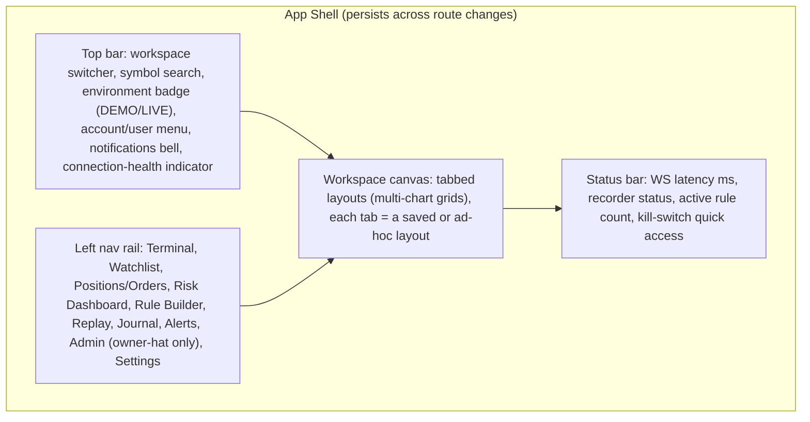
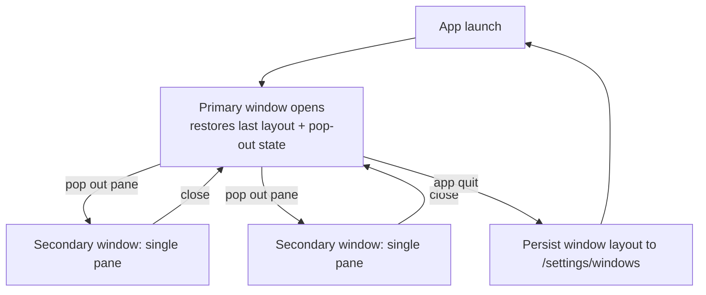

# 12 — Sitemap & Information Architecture (CandleViewer)

Date: 2026-09-14 · Owner: basiltt · Status: **Baseline for design & backlog**

Scope reminder (locked, see `00-planning-brief.md` + `research/24-owner-decisions.md`): web app only — React + TypeScript + custom WebGL chart engine, Electron desktop shell primary. Owner/admin functions are RBAC-gated screens **inside** this web app — there is **no separate admin app** and **no Android client**. Bybit v5 USDT linear perpetuals only. Personas and the permission matrix in `10-personas.md` §7 are authoritative for all RBAC annotations below.

This document is the single source of truth for: the full route tree, every modal/drawer, the navigation model (shell chrome, window management), deep-link parameter contracts, and the Electron multi-window model. `13-user-flows.md` and `14-screens-catalogue.md` reference route IDs defined here (`R-###`).

---

## 1. Navigation model

### 1.1 Shell chrome (applies to every authenticated route)

- **Single-window, multi-pane** model is the default (per Open Question resolved: see §7). The Electron shell renders one main window with an internal tabbed/gridded workspace; **secondary Electron windows** are opt-in "pop-out" panes (see §6) for multi-monitor traders (P1 runs 2–3 monitors).
- The left nav rail is a fixed, non-collapsible-below-icons rail (collapsible to icon-only via a pin toggle in Settings). It is keyboard-navigable (`Ctrl+1..9` jump to nav items per the global hotkey layer, see `17-ux-diagrams.md` §8).
- The environment badge (DEMO/LIVE) is **always visible**, in every window, every layout tab, and cannot be hidden by any layout/theme setting (safety invariant, T7 in `10-personas.md`).
- Admin is reached via an explicit "Admin" entry in the account/user menu (not the left rail) that requires step-up re-authentication (§4) — this reinforces that Admin is a hat, not a persistent nav destination.

### 1.2 Route-vs-panel distinction

CandleViewer is a single-page app (SPA) inside Electron. "Routes" below are React Router paths that change the main content region; many trading surfaces (chart, footprint, DOM, ticket) are **panels within a layout**, not separate routes — a layout is itself addressed by a route param (`/terminal/:layoutId`). Modals/drawers (§5) never change the URL path except where explicitly deep-linkable (e.g., `?panel=order-ticket&symbol=BTCUSDT`).

---

## 2. Full route tree

Legend for RBAC column: `O`=Owner, `M`=Manager, `V`=Viewer, `A`=Admin-hat (Owner only), `RA`=Rule-author mode (Owner or Manager with `rules:author`). `◑` = scoped to own/assigned accounts. `⓪` = read-only rendering, all mutating actions blocked server-side even if UI is reached.

| Route ID | Path | Screen | RBAC | Notes |
|---|---|---|---|---|
| **Auth & session** |
| R-001 | `/login` | Login | public (pre-auth) | Tailscale-gated network access is a precondition; app-level login is username+password. |
| R-002 | `/login/2fa` | TOTP challenge | public (pre-auth, mid-flow) | Shown after password accepted; enrollment variant on first login (see `13-user-flows.md` §1). |
| R-003 | `/login/first-run` | First-run setup wizard | O (bootstrap only) | Only reachable when zero users exist in the Postgres `users` table; self-disables after first Owner account is created. |
| R-004 | `/logout` | (action, no screen) | O, M, V | Clears session, redirects to R-001. |
| R-005 | `/locked` | Session locked (idle timeout) | O, M, V | Auto-shown after configurable idle timeout; requires password (not full re-login) to resume. |
| R-006 | `/login/2fa/enroll` | TOTP enrolment (first login / re-enrol) | public (pre-auth, mid-flow) + O, M, V (re-enrol) | Renders SCR-003. Reached (a) mid-login when the user has no TOTP method, (b) from R-201 Security settings for a voluntary re-enrol, (c) after an owner-initiated TOTP reset (US-ONB-010). Recovery codes are shown exactly once and require an acknowledgement checkbox. |
| R-007 | `/login/change-password` | Forced password change | public (pre-auth, mid-flow) | Renders SCR-004. Reached when the server marks the credential `must_change` (first login after invite, or after an owner-forced reset). No other route is reachable until the change completes. |
| R-008 | `/onboarding` | Invited-user onboarding (manager/viewer first run) | O, M, V (first session only) | Renders SCR-017 + SCR-019. Self-disables once the setup checklist is dismissed or completed; re-openable from R-119 Help & about. |
| **Trading Terminal** |
| R-100 | `/terminal` | Terminal — default/last layout | O, M(◑), V(⓪) | Redirects to `/terminal/:layoutId` for the user's last-used or default layout. |
| R-101 | `/terminal/:layoutId` | Terminal — specific saved layout | O, M(◑), V(⓪) | `layoutId` = UUID or `new`. Deep-link params: `?symbol=`, `?tf=`, `?paneFocus=`. |
| R-102 | `/terminal/:layoutId/pane/:paneId` | Deep link to a single pane (used when popping a pane into its own Electron window) | O, M(◑), V(⓪) | See §6.2. |
| **Watchlist / symbol search** |
| R-110 | `/watchlist` | Watchlist manager (full-page view of saved groups) | O, M, V | Symbol search itself is a top-bar overlay (R-omni, §5), not a route. |
| R-111 | `/watchlist/:groupId` | Specific saved watchlist group | O, M, V | |
| **Layouts & workspaces** |
| R-120 | `/layouts` | Layout manager (list/create/duplicate/delete/share) | O, M, V(read list) | "Share" = make a layout visible to Managers/Viewers as a read template; does not share live cursor state. |
| **Positions & Orders** |
| R-130 | `/positions` | Positions & Orders — aggregate view | O, M(◑), V(◑ read) | Deep-link params: `?groupBy=account\|symbol\|manager`, `?account=`, `?showClosed=`. |
| R-131 | `/positions/:accountId` | Single-account positions/orders | O, M(◑ own only), V(◑) | |
| R-132 | `/positions/order/:orderId` | Single order detail (drawer-as-route for deep-linking from notifications) | O, M(◑), V(◑) | Opens as R-130 + drawer overlay; direct navigation renders the drawer over a default background. |
| **Trade groups** |
| R-140 | `/trade-groups` | Trade group list | O | Managers see only groups explicitly granted to them (read/select, cannot create/edit — permission matrix `10-personas.md` §7). |
| R-141 | `/trade-groups/:groupId` | Trade group detail/editor | O; M (◑ view/select only) | |
| R-142 | `/trade-groups/new` | Trade group creation wizard | O | See `13-user-flows.md` §5. |
| **Risk Dashboard** |
| R-150 | `/risk` | Risk Dashboard — aggregate | O | Includes FREEZE controls per manager/account. |
| R-151 | `/risk/:accountId` | Per-account risk detail | O; M (◑ own account only, read + own lockout status) | |
| **Rule Builder** (mode `RA`) |
| R-160 | `/rules` | Rule list (form-editor entry point) | O, M(◑ if `rules:author`), V(⓪ none — route returns 403) | |
| R-161 | `/rules/:ruleId` | Rule detail — form editor | O, M(◑) | `?mode=form` |
| R-162 | `/rules/:ruleId/graph` | Rule detail — node-graph editor | O, M(◑) | Same rule, alternate editor bound to shared IR — see `13-user-flows.md` §11. |
| R-163 | `/rules/new` | New rule wizard (choose form or graph start) | O, M(◑ if granted) | |
| R-164 | `/rules/:ruleId/history` | Rule fire history / simulation log | O, M(◑), V(◑ if granted read) | |
| **Replay** |
| R-170 | `/replay` | Replay session picker (symbol/date/time range) | O, M, V | |
| R-171 | `/replay/:sessionId` | Active replay session | O, M, V | Deep-link params: `?symbol=`, `?from=`, `?to=`, `?speed=`. Renders inside a Terminal-like layout with a replay transport bar. |
| **Journal & analytics** |
| R-180 | `/journal` | Journal — trade list & filters | O, M, V(⓪ if granted) | |
| R-181 | `/journal/:tradeId` | Single trade record (entry/exit, MAE/MFE, tags, linked replay) | O, M(◑), V(◑ if granted) | Deep-link `?fromReplay=` returns to R-171 pre-seeded at the trade's timestamp; see `13-user-flows.md` §12 (Journal review). |
| R-182 | `/journal/analytics` | Analytics dashboards (win rate, R-distribution, equity curve) | O, M(◑), V(◑ if granted) | |
| **Alerts** |
| R-190 | `/alerts` | Alerts centre (list, create, mute/snooze) | O, M, V(◑ own alerts only) | |
| R-191 | `/alerts/:alertId` | Alert detail/editor | O, M, V(◑) | |
| **Settings** |
| R-200 | `/settings` | Settings hub (redirects to profile) | O, M, V | |
| R-201 | `/settings/profile` | User profile, password, TOTP re-enrollment | O, M, V | |
| R-202 | `/settings/hotkeys` | Hotkey map editor | O, M, V | |
| R-203 | `/settings/appearance` | Theme, density, colour convention override, a11y prefs | O, M, V | |
| R-204 | `/settings/notifications` | Notification channel prefs (in-app/push/email) | O, M, V | |
| R-205 | `/settings/windows` | Electron window/monitor layout preferences | O, M, V | |
| **Admin (owner-hat, `A`)** |
| R-300 | `/admin` | Admin home (summary tiles: users, accounts, health, audit) | A | Entering `/admin` triggers step-up re-auth if session step-up has expired (30 min TTL, see §4). |
| R-301 | `/admin/users` | Users & roles list | A | |
| R-302 | `/admin/users/:userId` | User detail/edit (role, granted accounts, `rules:author` flag) | A | |
| R-303 | `/admin/users/new` | Create manager/viewer wizard | A | See `13-user-flows.md` §4 (manager onboarding). |
| R-310 | `/admin/accounts` | Bybit accounts & sub-accounts list | A | |
| R-311 | `/admin/accounts/:accountId` | Bybit account detail (linked keys, sub-UID info) | A | |
| R-312 | `/admin/accounts/new` | Add Bybit account wizard | A | See `13-user-flows.md` §2. |
| R-320 | `/admin/keys` | API keys list (across all accounts) | A | Never renders secret material after initial reveal-once. |
| R-321 | `/admin/keys/:keyId` | Key detail (permissions, IP whitelist, expiry, rotation) | A | |
| R-322 | `/admin/keys/:keyId/rotate` | Key rotation wizard | A | See `13-user-flows.md` §18. |
| R-330 | `/admin/profiles` | Per-account profiles list | A | |
| R-331 | `/admin/profiles/:profileId` | Per-account profile editor (leverage, sizing rule, SL/TP offsets, risk caps, allowed symbols) | A | |
| R-340 | `/admin/recorder` | Recorder & retention config | A | Recorded-symbol list, auto-record toggle, retention days, pin management, disk budget display. |
| R-350 | `/admin/health` | System health (ingestion lag, WS status, queue depth, DB size) | A | |
| R-351 | `/admin/flags` | Feature flags | A | |
| R-352 | `/admin/trade-groups` | Trade-group administration (all groups, all owners, force-cancel) | A | Renders SCR-062 in its admin variant. Distinct from R-140 `/trade-groups`, which is the trading-side list scoped to the caller. |
| R-353 | `/admin/risk-policy` | Global risk policy (system-wide caps, lockout defaults, kill-switch policy) | A | Renders SCR-134. Sets the ceiling that every per-account profile (R-331) is clamped to; server re-validates on every order. |
| R-354 | `/admin/security` | Security centre (posture, key health, secrets policy, pen-test/live-enablement gate) | A | Renders SCR-137, SCR-128 and the live-trading enablement gate (US-ADMIN-012). |
| R-355 | `/admin/backups` | Backups & restore | A | Renders SCR-146. Restore requires step-up re-auth plus a typed confirmation. |
| R-356 | `/admin/maintenance` | Maintenance mode control | A | Renders SCR-148; the resulting user-facing takeover is R-903. |
| R-360 | `/admin/audit` | Audit log (append-only, filterable) | A; O(non-admin, own actions only, ⓪); M(◑ own actions only) | Route accessible outside admin-hat in reduced form for O/M per permission matrix; full unfiltered view is `A` only. |
| **Error / system routes** |
| R-900 | `/403` | Forbidden | any authenticated | Shown for RBAC-denied direct navigation attempts. |
| R-901 | `/404` | Not found | any | |
| R-902 | `/offline` | Backend unreachable | any | Full-screen takeover when the Electron app cannot reach the local backend at all (distinct from WS-only disconnect, which is a banner — see `13-user-flows.md` §16). |
| R-903 | `/maintenance` | Maintenance mode | any | Shown when Admin has put the system in maintenance (feature flag). |

---

## 3. Route tree diagram

```mermaid
graph TD
  ROOT["/"] --> LOGIN["/login"]
  LOGIN --> TOTP["/login/2fa"]
  LOGIN --> FIRSTRUN["/login/first-run"]
  ROOT --> APP["Authenticated shell"]
  APP --> TERM["/terminal/:layoutId"]
  TERM --> TERMPANE["/terminal/:layoutId/pane/:paneId"]
  APP --> WATCH["/watchlist/:groupId"]
  APP --> LAYOUTS["/layouts"]
  APP --> POS["/positions"]
  POS --> POSACC["/positions/:accountId"]
  POS --> POSORD["/positions/order/:orderId"]
  APP --> TG["/trade-groups"]
  TG --> TGID["/trade-groups/:groupId"]
  TG --> TGNEW["/trade-groups/new"]
  APP --> RISK["/risk"]
  RISK --> RISKACC["/risk/:accountId"]
  APP --> RULES["/rules"]
  RULES --> RULEFORM["/rules/:ruleId (form)"]
  RULES --> RULEGRAPH["/rules/:ruleId/graph"]
  RULES --> RULEHIST["/rules/:ruleId/history"]
  APP --> REPLAY["/replay"]
  REPLAY --> REPLAYSESH["/replay/:sessionId"]
  APP --> JOURNAL["/journal"]
  JOURNAL --> JTRADE["/journal/:tradeId"]
  JOURNAL --> JANALYTICS["/journal/analytics"]
  APP --> ALERTS["/alerts"]
  ALERTS --> ALERTID["/alerts/:alertId"]
  APP --> SETTINGS["/settings"]
  SETTINGS --> SPROFILE["/settings/profile"]
  SETTINGS --> SHOTKEY["/settings/hotkeys"]
  SETTINGS --> SAPPEAR["/settings/appearance"]
  SETTINGS --> SNOTIF["/settings/notifications"]
  SETTINGS --> SWIN["/settings/windows"]
  APP -->|"step-up re-auth"| ADMIN["/admin"]
  ADMIN --> AUSERS["/admin/users"]
  ADMIN --> AACCTS["/admin/accounts"]
  ADMIN --> AKEYS["/admin/keys"]
  ADMIN --> APROFILES["/admin/profiles"]
  ADMIN --> ARECORDER["/admin/recorder"]
  ADMIN --> AHEALTH["/admin/health"]
  ADMIN --> AFLAGS["/admin/flags"]
  ADMIN --> AAUDIT["/admin/audit"]
  ADMIN --> ATG["/admin/trade-groups"]
  ADMIN --> ARISK["/admin/risk-policy"]
  ADMIN --> ASEC["/admin/security"]
  ADMIN --> ABAK["/admin/backups"]
  ADMIN --> AMAINT["/admin/maintenance"]
  LOGIN --> ENROLL["/login/2fa/enroll"]
  LOGIN --> CHGPW["/login/change-password"]
  APP --> ONBOARD["/onboarding"]
```

---

## 4. RBAC gating mechanics

- **Every route is enforced twice**: React Router loader checks the client-cached role/permission claims (fast, UX-only) AND every mutating/read API call is independently authorized server-side (403 + audit entry on denial). The client check is convenience, never the security boundary.
- **Step-up re-authentication** (ⓢ in `10-personas.md`) is required to:
  1. Enter `/admin/**` for the first time in a session, or after a 30-minute step-up TTL expires.
  2. Perform any destructive/high-risk action even while already inside `/admin` if >15 minutes have elapsed since the last step-up (rotating keys, deleting a user, disabling withdrawal-lock override attempts — which are always rejected server-side regardless).
  3. Switch Demo→Live (R-100/R-101 context action, not a route change).
  - Step-up mechanism: re-enter TOTP code (not password) via a modal (§5, M-020).
- **Viewer routes** render fully (no hidden panels) but every interactive control that would mutate state is disabled with a tooltip explaining why ("Viewers cannot place orders — ask the Owner to grant a role change"), and any bypass attempt (e.g., scripted PATCH) is rejected server-side with 403 + audit log entry, per the "structural, not cosmetic" viewer guarantee in `10-personas.md` §4.
- **Manager scoping** (`◑`) is enforced by a server-side account-scope filter applied to every list/detail query — Managers never receive payloads for accounts they aren't assigned to (not merely UI-filtered).

---

## 5. Modal / drawer inventory

Modals block interaction with the underlying screen; drawers slide in from the right and allow the underlying screen to remain visible/scrollable. Both are enumerated because they are frequently deep-linkable (query param) or triggered from multiple routes.

| ID | Type | Name | Triggered from | Deep-linkable? | RBAC |
|---|---|---|---|---|---|
| M-001 | Drawer | Order ticket | Terminal (hotkey, click DOM, click chart), Positions | `?panel=order-ticket&symbol=&side=` | O, M(◑) |
| M-002 | Drawer | Position detail | Positions & Orders, Risk Dashboard | `?panel=position-detail&id=` | O, M(◑), V(◑ read) |
| M-003 | Modal | Bracket/scaled order builder | Order ticket "Advanced" toggle | no | O, M(◑) |
| M-004 | Modal | Emulated OCO/TWAP/iceberg configurator | Order ticket "Algo" toggle | no | O, M(◑) |
| M-005 | Modal | Confirm Demo→Live switch (typed confirm) | Environment badge menu | no | O(ⓢ), M(◑, ⓢ) |
| M-006 | Modal | Confirm flatten/cancel-all | Terminal, Positions, Risk Dashboard | no | O, M(◑ own) |
| M-007 | Modal | FREEZE confirmation | Risk Dashboard | no | O only |
| M-008 | Drawer | Rule quick-view (read-only summary card) | Terminal watchlist row, Positions row | `?panel=rule-quickview&id=` | O, M, V(⓪) |
| M-009 | Modal | Rule conflict resolver (precedence ordering) | Rule Builder, on arming a 2nd rule targeting same position | no | O, M(◑) |
| M-010 | Modal | Symbol search / omnibox | Global (hotkey `/` or `Ctrl+K`) | no (ephemeral) | O, M, V |
| M-011 | Drawer | Notifications centre | Top bar bell | `?panel=notifications` | O, M, V |
| M-012 | Modal | Layout save-as / duplicate | Layouts, Terminal "Save layout" | no | O, M, V(save personal copy only) |
| M-013 | Modal | Add Bybit account — step 1 (basic info) | Admin → Accounts | no (multi-step wizard is its own route: R-312) | A |
| M-014 | Modal | Key permission verification result | Add-account wizard, Key rotation wizard | no | A |
| M-015 | Drawer | Sub-account create | Admin → Accounts detail | no | A |
| M-016 | Modal | Trade group account picker | Trade group editor | no | O |
| M-017 | Modal | Per-account profile quick-edit | Trade group editor (inline) | no | O(ⓢ) |
| M-018 | Modal | Kill-switch (global panic) confirmation | Status bar, any Terminal route | no | O only |
| M-019 | Drawer | Journal trade quick-note | Journal list row | `?panel=journal-note&trade=` | O, M(◑), V(◑ if export granted) |
| M-020 | Modal | Step-up TOTP re-auth | Any admin-gated action | no | O |
| M-021 | Modal | WS disconnect / reconnect status | Global, auto-shown | no (system-triggered) | O, M, V |
| M-022 | Drawer | Alert quick-create | Chart right-click, Deep Stats row | `?panel=alert-quickcreate&symbol=` | O, M, V(◑ own) |
| M-023 | Modal | Recording toggle / retention explainer for a symbol | Watchlist row context menu, Chart header | no | O only (Managers see status read-only) |
| M-024 | Modal | Manager permission-change confirmation | Admin → Users detail | no | A(ⓢ) |
| M-025 | Modal | Export journal/analytics (format, range) | Journal, Analytics | no | O, M(◑ own), V(◑ if granted) |
| M-026 | Modal | First-run wizard step modals (org name, Owner TOTP enrollment, Tailscale check) | R-003 | no (part of route flow) | O (bootstrap) |
| M-027 | Modal | Daily loss lockout notice | Auto-shown on hitting threshold | no (system-triggered) | O, M(own) |
| M-028 | Modal | Emulated-OCO reconciliation notice | Auto-shown by algo monitor (SCR-070) when a double-fill race is detected on an emulated OCO leg pair | `?panel=oco-reconcile&groupId=` | O, M(◑) |

**Note on traceability:** every `M-###` referenced anywhere in `13-user-flows.md` or `17-ux-diagrams.md` must have a row above; conversely every row above must be reachable from at least one flow or screen. Confirmed cross-references as of this baseline: M-001 (§6, §7, §8), M-003 (§8), M-004 (§9), M-006 (§19.7 via flatten, §20), M-009 (§10, §11), M-011 (top bar, §17), M-016 (§5), M-018 (§20), M-022 (§17), M-027 (§19.7), M-028 (§9).

---

## 6. Electron window model

### 6.1 Primary window

- One primary Electron `BrowserWindow` hosts the full SPA (all routes in §2). This is the default and only window for most sessions.
- The primary window owns the single authenticated session; all pop-out windows (below) share the same session token via Electron's IPC/session partition (no re-login for pop-outs).

### 6.2 Pop-out windows (multi-monitor support for P1/P2)

- Any Terminal pane (single chart, DOM ladder, Risk Dashboard, a single symbol's footprint) can be "popped out" into its own `BrowserWindow` via a pane-header control ("Pop out to window").
- Pop-out windows render route R-102 (`/terminal/:layoutId/pane/:paneId`) or an equivalent standalone route for non-Terminal panels (`/risk?standalone=1`, etc.) — they are thin windows with no nav rail, just the panel + a minimal title bar showing the environment badge (safety invariant: the DEMO/LIVE badge is present in **every** window, including pop-outs).
- Pop-out window state (which panes are popped, their monitor/position/size) is persisted per-layout in `/settings/windows` (R-205) and restored on next launch.
- Closing a pop-out window merges its pane back into the primary window's layout (never silently discarded).
- Maximum pop-outs: no hard app limit; practically bounded by monitor count (owner runs 2–3 monitors).

### 6.3 Window lifecycle diagram

### 6.4 Non-window surfaces

- **System tray icon** (Electron): shows connection-health colour dot, right-click menu with Kill-switch, Freeze, Show/Hide window. No separate window.
- **OS-native notifications** (Electron `Notification` API): fired for alert deliveries and critical system events (WS disconnect >10s, daily loss lockout, rule fired) even when the app window is minimized — see notification taxonomy in `17-ux-diagrams.md` §7.

---

## 7. Deep-link parameter contracts (canonical)

| Param | Used on routes | Type | Example | Behavior |
|---|---|---|---|---|
| `symbol` | R-101, R-171, M-001, M-022, M-023 | string (Bybit symbol) | `BTCUSDT` | Sets the active symbol for the pane/panel; invalid symbol → toast + fallback to last symbol. |
| `tf` | R-101 | enum (1,3,5,15,30,60,120,240,360,720,D,W,M) | `15` | Chart timeframe; invalid → default 15. |
| `paneFocus` | R-101 | string (paneId) | `pane-3` | Scrolls/focuses a specific pane within a grid layout on load. |
| `panel` | many (drawer overlays) | enum (see §5 IDs) | `order-ticket` | Opens the named drawer/modal over the current route on load. |
| `account` | R-130, R-151, R-131 | UUID (internal account id, maps to Bybit sub-UID) | — | Filters/targets a specific account; server re-validates caller's scope regardless of param. |
| `groupBy` | R-130 | enum (symbol, account, manager) | `account` | View grouping; persisted per-user if changed interactively. |
| `showClosed` | R-130 | bool | `true` | Includes closed-today positions/orders. |
| `from`, `to` | R-171 | ISO 8601 datetime | `2026-09-01T00:00:00Z` | Replay session range; validated against recorder history availability, else empty-state shown. |
| `speed` | R-171 | float (0.5–100) | `4` | Replay playback speed; clamped to valid range. |
| `fromReplay` | R-181 | replay session id | — | Returning link back to R-171 pre-seeded at the trade's timestamp; originates from flow `13-user-flows.md` §15 (Replay session), step "Bookmark markers", and is consumed by flow §12 (Journal review). |
| `mode` | R-161/R-162 | enum (form, graph) | `graph` | Which rule editor renders first; switching is always possible without losing the rule (shared IR); originates from flow `13-user-flows.md` §10 (Rule creation). |
| `standalone` | non-Terminal pop-out routes | bool | `1` | Renders panel without nav chrome (pop-out window mode). |

All deep-link params are validated server-side where they gate data access (e.g., `account`, `symbol` scope); a malformed or unauthorized param never silently grants access — it 403s and logs, same as direct navigation.

---

## 8. Empty root / bootstrap state

- On a completely fresh install (no users in Postgres), navigating to `/` redirects to `/login/first-run` (R-003) regardless of any other param — this is the only route reachable pre-bootstrap besides `/login` (which itself redirects to first-run when zero users exist).
- Once the first Owner account exists, R-003 permanently 404s (cannot be re-entered) and `/` behaves normally (redirect to `/login` when unauthenticated, `/terminal` when authenticated).

---

## 9. Traceability

- Screens referenced here are detailed in `14-screens-catalogue.md` (purpose, states, data, interactions, hotkeys, a11y, wireframe per screen).
- RBAC assignments here are derived directly from `10-personas.md` §7 (permission matrix) and §8 (persona → screen affinity) — any discrepancy must be resolved in favor of `10-personas.md` and this file updated.
- Flows crossing multiple routes/modals are diagrammed in `13-user-flows.md`.
- State diagrams for entities referenced by routes here (order, position, rule, recording, connection) are in `17-ux-diagrams.md` §4.
