# 13 — User Flows (CandleViewer)

Date: 2026-09-14 · Owner: basiltt · Status: **Baseline for design & backlog**

Scope: web app only, React + custom WebGL engine, Electron shell. All flows below reference personas from `10-personas.md` (P1 Owner, P2 Manager, P3 Viewer, P4 Admin-hat, M1 Rule-author mode) and routes/modals from `12-sitemap.md` (`R-###`, `M-###`). Every flow states its **safety invariants** where relevant (native SL backstop, RBAC, step-up auth, Demo/Live isolation) per `24-owner-decisions.md`.

---

## 1. First-run setup & 2FA enrollment

**Actor:** P1 Owner (bootstrap). **Routes:** R-003 → R-002 → R-100.
**Screens:** SCR-016, SCR-003, SCR-002, SCR-001, SCR-020 (see `14-screens-catalogue.md`).

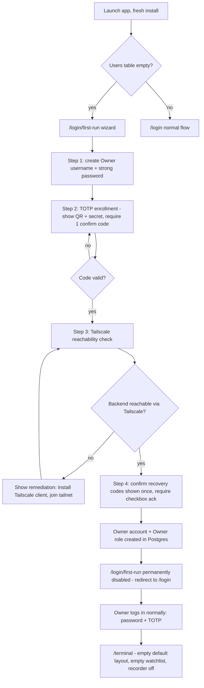

**Notes / edge cases**
- Recovery codes (10 single-use) are shown exactly once at step 4; if the Owner closes the wizard without acknowledging, the wizard resumes at step 4 on next launch (codes are not regenerated silently).
- No Bybit account is configured yet — the Terminal shows an empty state prompting "Add your first Bybit account" (links to flow §2).
- If the wizard is abandoned mid-way (app closed), it resumes at the last completed step; partial Owner records are not left in a usable-but-unenrolled state (TOTP enrollment is transactional with account creation).

---

## 2. Add Bybit account & API key (with permission verification)

**Actor:** P4 Admin-hat. **Routes:** R-310 → R-312 (wizard) → R-320/R-321.
**Screens:** SCR-125, SCR-126, SCR-128, SCR-149 (see `14-screens-catalogue.md`).

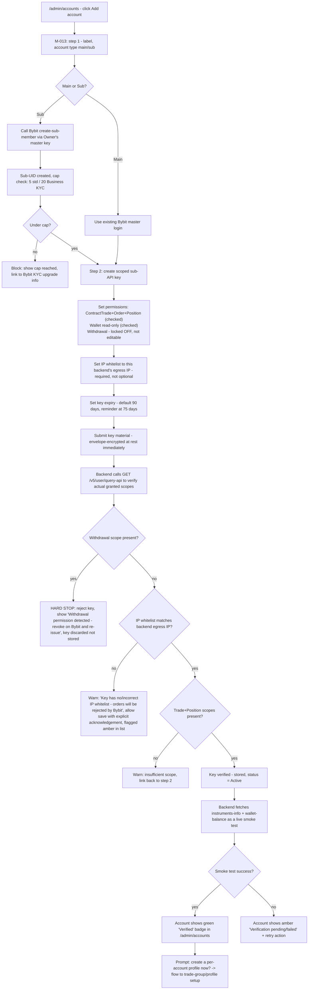

**Safety invariants**
- Withdrawal-capable keys are **never persisted**, even transiently — the verification call happens before the encrypted-store commit is finalized; on hard-stop the plaintext key material is discarded from memory immediately.
- Key material is shown in the UI **exactly once** (at entry) and never re-displayed; `/admin/keys/:keyId` shows metadata only (masked key id suffix, permissions, IP whitelist, expiry) never the secret.
- Every step in this flow writes an audit log entry (key added, verification result, warnings acknowledged).

---

## 3. Create sub-account profile

**Actor:** P4 Admin-hat / P1 Owner. **Routes:** R-330 → R-331.
**Screens:** SCR-130, SCR-131, SCR-132, SCR-133 (see `14-screens-catalogue.md`).

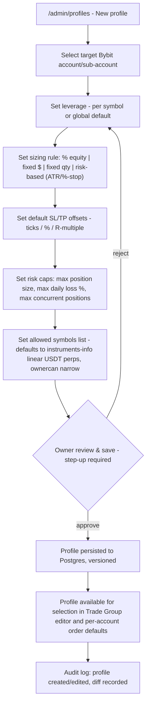

**Notes**
- Profiles are versioned (append new version rather than destructive overwrite) so historical trade-group fan-outs can be traced to the profile version active at execution time (journal traceability).
- Editing a profile that is currently in use by open positions shows a non-blocking warning: "N open positions use this profile — changes apply to new orders only."

---

## 4. Manager onboarding by owner

**Actor:** P4 Admin-hat, creating P2 Manager. **Routes:** R-303.
**Screens:** SCR-121, SCR-123, SCR-122, SCR-017 (see `14-screens-catalogue.md`).

```mermaid
sequenceDiagram
  participant O as Owner (Admin hat)
  participant App as CandleViewer backend
  participant Bybit as Bybit API
  participant M as New Manager

  O->>App: /admin/users/new - enter manager name, contact
  App->>O: Step: select Bybit sub-account (existing or create new, flow #2)
  O->>App: Assign role = manager, grant accounts (1..N sub-accounts)
  App->>O: Step: grant rules:author? (toggle, default off)
  App->>O: Step: risk-limit assignment (feeds Risk Dashboard)
  O->>App: Confirm (step-up TOTP)
  App->>App: Create manager user record, generate Tailscale invite reference
  App-->>O: Show invite instructions (Tailscale ACL entry to be added by owner outside app)
  O->>M: (out of app) Adds manager to Tailscale ACL, shares invite link
  M->>App: First login: set password
  App->>M: Force TOTP enrollment (cannot proceed without it)
  M->>App: Enrolls TOTP, confirms
  App->>M: Terminal loads, scoped to assigned accounts only
  Note over App: If API key for the assigned sub-account has Bybit's 48h new-key restriction, Terminal shows "API key pending - available after <date/time>"; Demo trading remains available meanwhile.
  App->>O: Audit log entry: manager created, accounts granted, timestamp
```

---

## 5. Create trade group & place fan-out order

**Actor:** P1 Owner. **Routes:** R-142 → R-141, then M-001/M-003.
**Screens:** SCR-062, SCR-061, SCR-060, SCR-076 (see `14-screens-catalogue.md`).

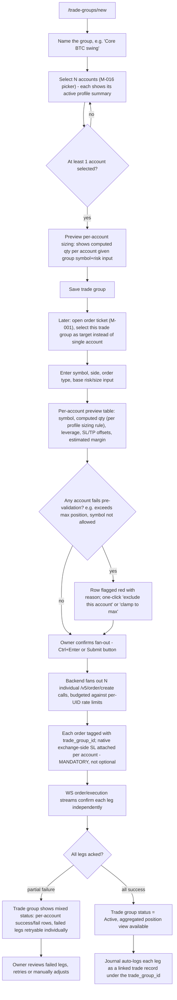

**Safety invariant:** every fanned-out order carries a native exchange-side SL regardless of any rule-engine stop configured later (owner decision, `24-owner-decisions.md` §3).

---

## 6. Chart trading — click-to-order, drag SL/TP

**Actor:** P1/P2. **Route:** R-101 (Terminal), triggers M-001.
**Screens:** SCR-030, SCR-040, SCR-060, SCR-064, SCR-076 (see `14-screens-catalogue.md`).

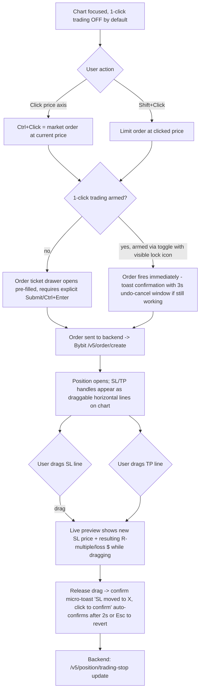

**Accessibility parity:** every drag-based SL/TP adjustment has an exact keyboard equivalent (arrow keys nudge by tick with focus on the handle, Enter confirms) documented in `17-ux-diagrams.md` §8 hotkey map — canvas interactions are never mouse-only (T9 in `10-personas.md`).

---

## 7. DOM ladder trading

**Actor:** P1/P2. **Route:** R-101 pane (Heatmap+DOM Ladder view).
**Screens:** SCR-050, SCR-051, SCR-060, SCR-076 (see `14-screens-catalogue.md`).

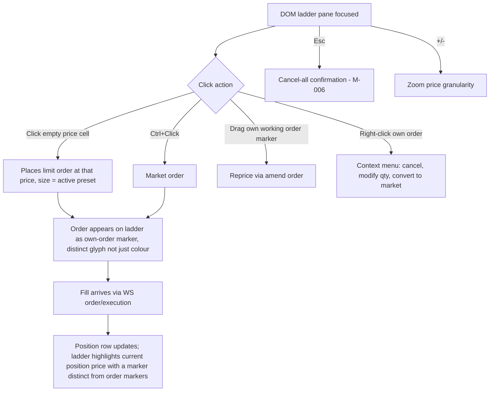

---

## 8. Bracket / scaled order

**Actor:** P1/P2, M-003. **Route:** order ticket "Advanced" toggle.
**Screens:** SCR-060, SCR-069, SCR-065, SCR-064 (see `14-screens-catalogue.md`).

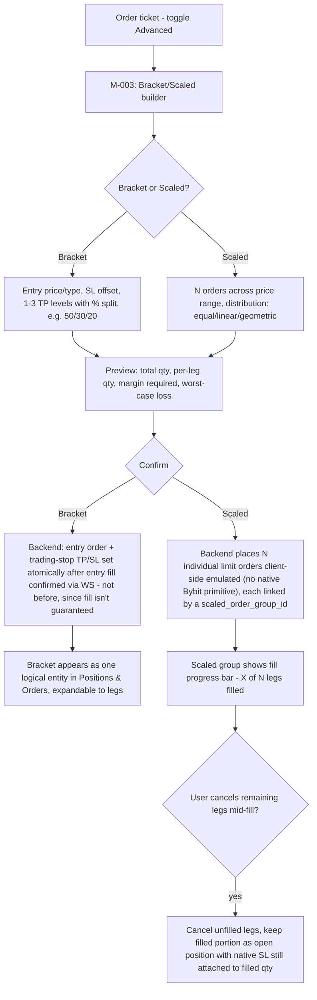

---

## 9. Emulated OCO / TWAP / iceberg lifecycle

**Actor:** P1/P2, M-004. **Route:** order ticket "Algo" toggle. This is the most safety-sensitive emulated-execution flow (per `09-execution-risk-tools.md` §2: none of these are native Bybit API primitives).
**Screens:** SCR-066, SCR-067, SCR-068, SCR-069, SCR-070 (see `14-screens-catalogue.md`).

```mermaid
sequenceDiagram
  participant U as User
  participant FE as Frontend
  participant BE as Backend OMS (algo executor)
  participant WS as Bybit private WS
  participant REST as Bybit REST

  U->>FE: Configure algo (OCO legs / TWAP slices / iceberg display+reserve qty)
  FE->>BE: POST algo config (algo_id, type, params)
  BE->>BE: Register algo state machine: PENDING
  alt OCO
    BE->>REST: Place order A (e.g. TP limit)
    BE->>REST: Place order B (e.g. SL stop)
    REST-->>BE: Both acked
    BE->>BE: state = ARMED (racing)
    WS-->>BE: order A filled
    BE->>REST: Cancel order B immediately
    BE->>BE: state = COMPLETED
    Note over BE: Race window risk: if both fill near-simultaneously (thin liquidity), backend reconciles via execution WS timestamps and treats first-confirmed fill as canonical, immediately cancels the other; a double-fill (both legs execute) is logged as a P1-severity incident and surfaced to the user via M-028 (Emulated-OCO reconciliation notice, `12-sitemap.md` §5), a modal deep-linkable at `?panel=oco-reconcile&groupId=` that shows both fills, net exposure, and a one-click "flatten to intended net position" action - this is a disclosed limitation of emulated OCO.
  else TWAP
    loop each slice, interval T
      BE->>REST: Place slice order (qty = total/N)
      REST-->>BE: Ack
      WS-->>BE: Fill or timeout
      BE->>FE: Update progress (slice i/N)
    end
    BE->>BE: state = COMPLETED when all slices done or user cancels remainder
  else Iceberg
    BE->>REST: Place visible-qty limit order
    WS-->>BE: Fill notification
    BE->>REST: Replace with next visible-qty chunk from reserve
    loop until reserve exhausted or cancelled
      WS-->>BE: Fill
      BE->>REST: Refresh next chunk
    end
  end
  BE->>FE: Live status: state machine diagram (PENDING/ARMED/PARTIAL/COMPLETED/CANCELLED/FAILED)
  U->>FE: Cancel algo at any time
  FE->>BE: Cancel request
  BE->>REST: Cancel all remaining child orders
  BE->>BE: state = CANCELLED
```

**Safety invariant:** the emulated algo runs server-side (backend OMS), **not** in the browser — if the Electron app is closed mid-TWAP/iceberg, the backend continues executing and the native SL (placed at position-open time, independent of the algo) still protects the position. A disconnected UI never leaves a position unprotected (T4 in `10-personas.md`).

---

## 10. Rule creation (form + node editor, shared IR)

**Actor:** M1 Rule author (P1 or P2 with `rules:author`). **Routes:** R-163 → R-161/R-162.
**Screens:** SCR-080, SCR-081, SCR-082, SCR-083, SCR-088, SCR-084, SCR-085 (see `14-screens-catalogue.md`).

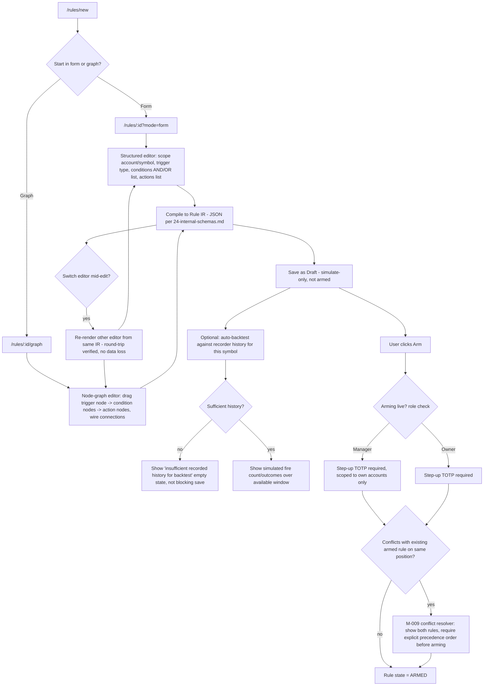

---

## 11. Rule firing & native SL backstop

**Actor:** system (rule engine), observed by P1/P2/P3. **Route:** R-164 (history), notifications.
**Screens:** SCR-087, SCR-086, SCR-014, SCR-063, SCR-073 (see `14-screens-catalogue.md`).

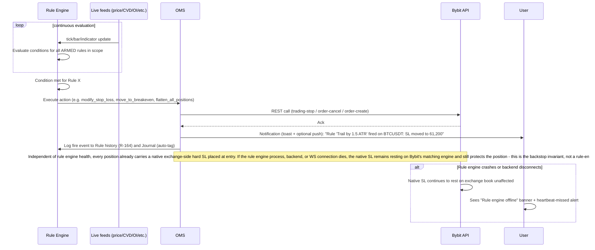

---

## 12. Journal review

**Actor:** P1 Owner (full), P2 Manager (own accounts), P3 Viewer (if granted). **Routes:** R-180 → R-181 → R-182; deep links to/from R-171 (Replay) via `?fromReplay=`/`?fromTrade=`.
**Screens:** SCR-093, SCR-094, SCR-095, SCR-096, SCR-097 (see `14-screens-catalogue.md`).

```mermaid
flowchart TD
  A["/journal - trade list"] --> B[Filter: account, symbol, date range, tag, R-multiple, win/loss]
  B --> C{Trades match filter?}
  C -->|no| D["Empty state: 'No trades recorded yet' or 'No trades match filter' - see 17-ux-diagrams.md §5"]
  C -->|yes| E[Row per closed trade: entry/exit price+time, realized PnL, R-multiple, tags]
  E --> F[Click a row -> "/journal/:tradeId" - R-181]
  F --> G[Trade detail: full timeline, MAE/MFE chart, linked orders/fills, SL/TP history, any rules that fired on this position]
  G --> H[User adds/edits tags and free-text note - M-019 Journal trade quick-note drawer, autosaves]
  G --> I{Want market context at the time of trade?}
  I -->|yes| J["Click 'Open in Replay' -> /replay/:sessionId?fromReplay=... pre-seeded at trade's entry timestamp - R-171"]
  J --> K[Replay loads with a marker at the trade's entry/exit; user scrubs surrounding context]
  K --> L["Click 'Back to trade' -> returns to /journal/:tradeId via fromReplay param"]
  G --> M{Export this trade or filtered set?}
  M -->|yes| N[M-025: Export journal/analytics - choose CSV/PDF, range - RBAC per persona ◑/granted]
  E --> O["Click 'Analytics' tab -> /journal/analytics - R-182"]
  O --> P[Dashboards: win rate, R-distribution, equity curve, tag breakdown, time-of-day heatmap]
  P --> Q{Sufficient closed-trade sample?}
  Q -->|no| R["Empty/insufficient-data state: 'Not enough closed trades for this view yet' - never a broken chart"]
  Q -->|yes| S[Rendered analytics, filterable by same dimensions as trade list]
```

**Notes**
- Journal entries are generated automatically on position close (no manual "create trade" step) from the OMS fill/position-close event stream; manual edits are limited to tags/notes, never to the recorded fill data itself (audit integrity).
- Viewer access to Journal/Analytics is granted per-account by the Owner (`10-personas.md` §7); ungranted accounts are simply absent from the Viewer's filter list, not shown-then-blocked.
- `M-019` (quick-note) and `M-025` (export) are the only modal/drawer surfaces in this flow; everything else is full-page routes.

---

## 13. Switch Demo ↔ Live with safeguards

**Actor:** P1/P2. **Route:** environment badge menu, M-005.
**Screens:** SCR-074, SCR-075, SCR-006 (see `14-screens-catalogue.md`).

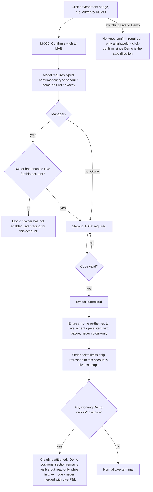

---

## 14. Recording a symbol & auto-record

**Actor:** P1 Owner (config), all personas (observe recording status). **Routes:** R-340 (Admin recorder config), watchlist context menu (M-023).
**Screens:** SCR-140, SCR-141, SCR-142, SCR-100, SCR-103, SCR-047 (see `14-screens-catalogue.md`).

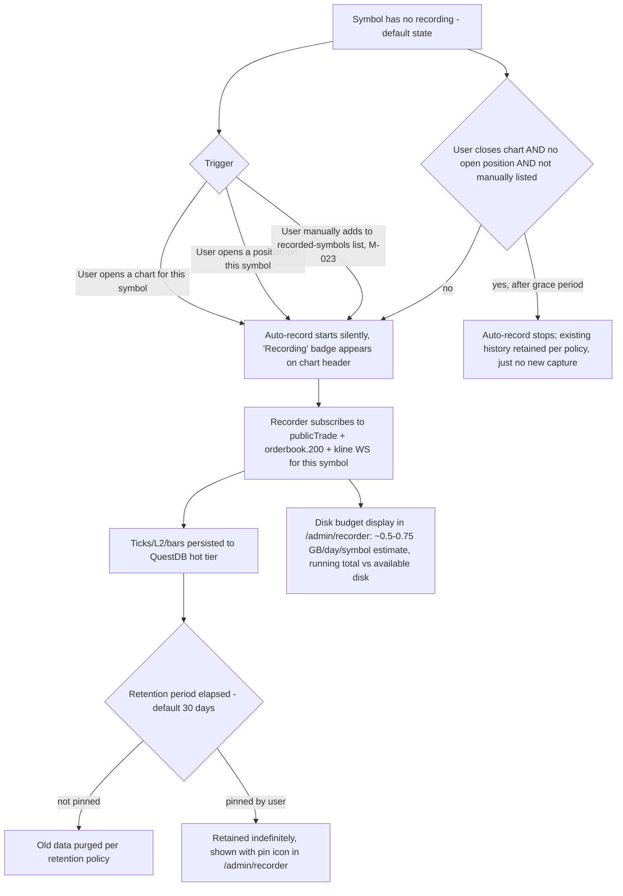

**Empty-history state:** any view depending on recorded history (Profile composite mode, Replay, footprint before recording started) explicitly shows "No recorded history before <start timestamp> for this symbol" rather than a blank/broken chart — see `17-ux-diagrams.md` §6 empty-state matrix.

---

## 15. Replay session

**Actor:** P1/P2/P3. **Routes:** R-170 → R-171.
**Screens:** SCR-098, SCR-097, SCR-099 (see `14-screens-catalogue.md`).

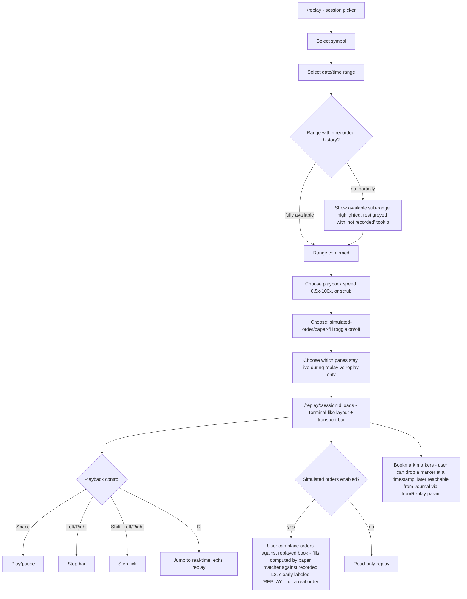

---

## 16. WS disconnect recovery UX

**Actor:** system-triggered, all personas. **Trigger:** any WS channel (public market data, private order/position, or backend↔frontend WS) drops.
**Screens:** SCR-152, SCR-153, SCR-158, SCR-159, SCR-030 (see `14-screens-catalogue.md`).

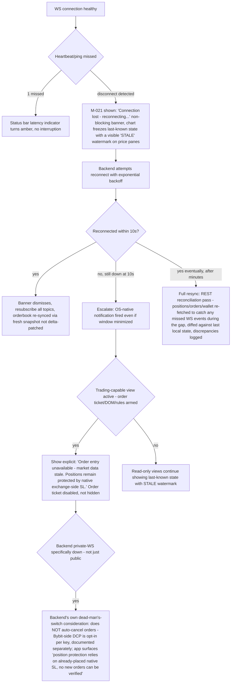

---

## 17. Alert creation & delivery

**Actor:** P1/P2/P3 (view/create), M-022. **Routes:** R-190/R-191.
**Screens:** SCR-090, SCR-091, SCR-092, SCR-014, SCR-115 (see `14-screens-catalogue.md`).

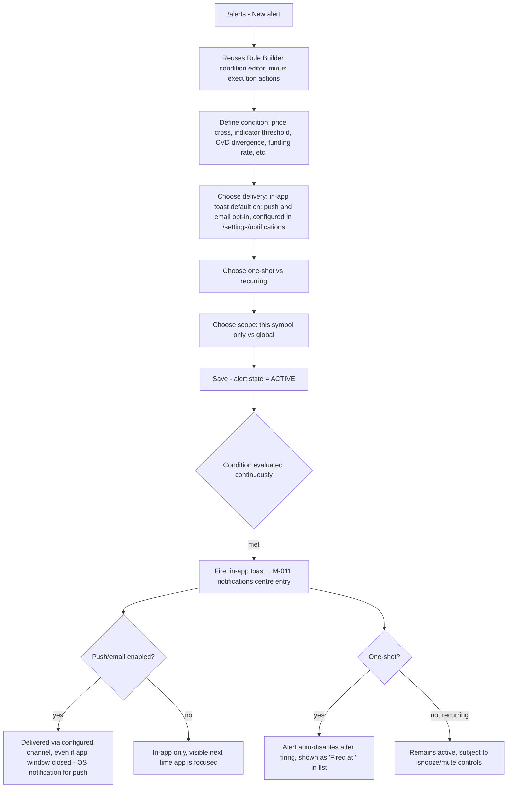

---

## 18. Key rotation

**Actor:** P4 Admin-hat. **Route:** R-322.
**Screens:** SCR-127, SCR-128, SCR-149 (see `14-screens-catalogue.md`).

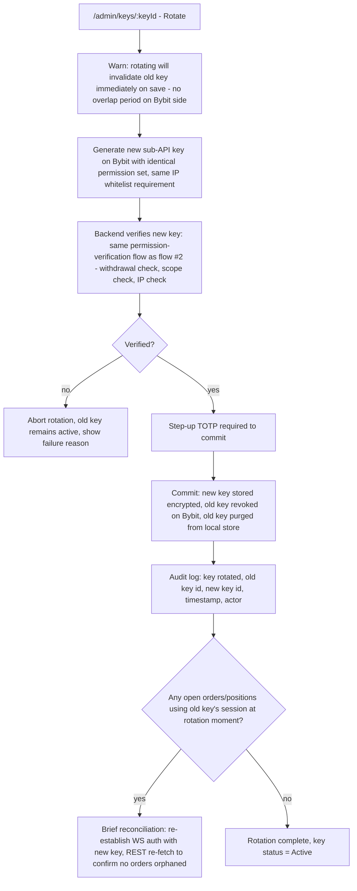

---

## 19. Error / edge flows (consolidated)

### 18.1 Order rejected by Bybit (e.g., rate limit 10018/10006, insufficient margin, invalid tick size)

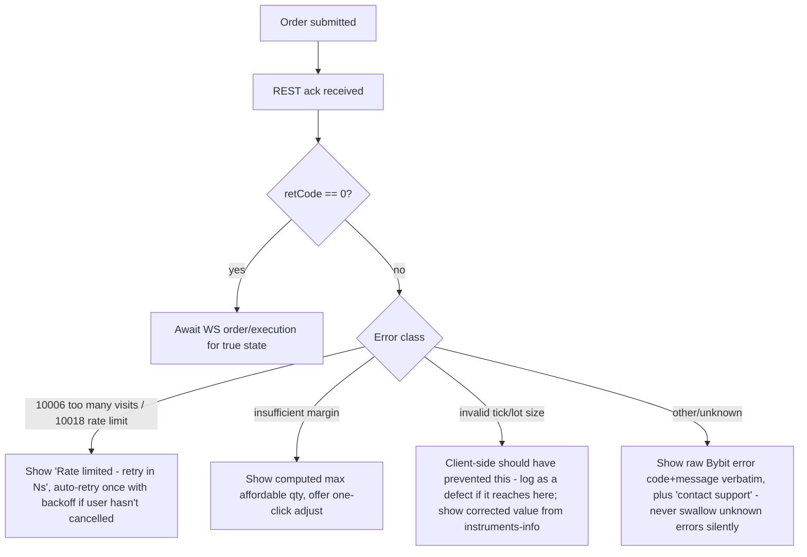

### 18.2 Trade group partial failure (see also flow §5)

- Already covered in flow §5 steps J/K/Q — failed legs are individually retryable, never silently dropped, and the trade group's aggregate view always distinguishes per-leg status.

### 18.3 Exchange 5xx / maintenance

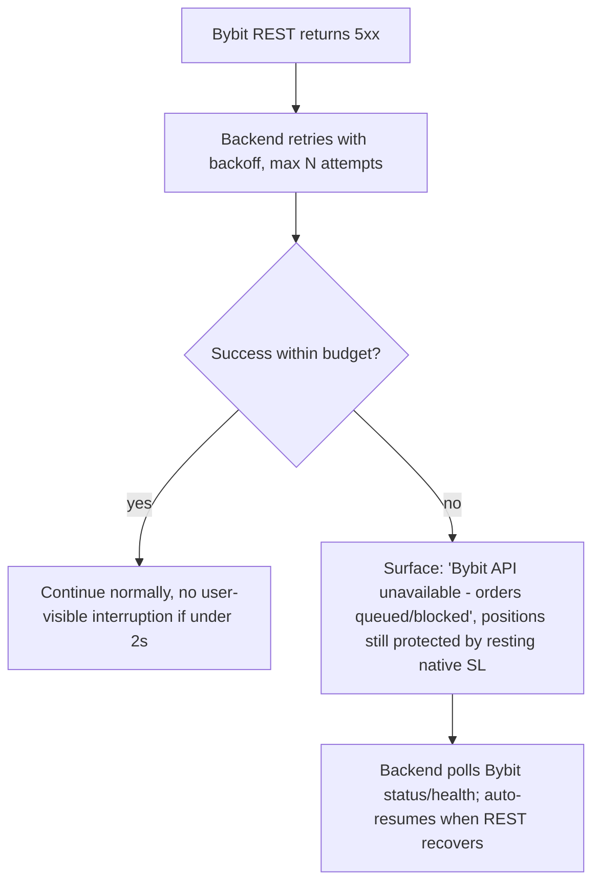

### 18.4 Rule engine conflict (two rules, same position)

- Covered in flow §10 step S/T (M-009 conflict resolver) — arming is blocked until explicit precedence is set.

### 18.5 Recorder disk pressure

```mermaid
flowchart TD
  A[Disk usage approaches configured threshold, e.g. 90%] --> B[Owner-only notification: 'Recorder disk usage at 90% - review retention']
  B --> C{Owner action}
  C -->|reduce retention| D[Applies to non-pinned symbols going forward]
  C -->|prune manually| E[Admin recorder screen: per-symbol size shown, manual delete non-pinned data]
  C -->|no action| F[At hard limit e.g. 98%, recorder auto-stops new capture for lowest-priority unpinned symbols, never deletes pinned data, logs the auto-stop]
```

### 18.6 Session idle timeout / lock

```mermaid
flowchart TD
  A[No input for configured idle period] --> B["/locked shown - R-005"]
  B --> C[Password required to resume - not full re-login, session/WS subscriptions preserved server-side]
  C --> D{Correct password?}
  D -->|yes| E[Resume exactly where left off]
  D -->|no, N attempts| F[Full logout forced, redirect to /login]
```

### 18.7 Manager exceeds risk cap mid-session (daily loss lockout)

```mermaid
flowchart TD
  A[Manager's realized+unrealized loss crosses configured daily cap] --> B[Server-side enforcement fires immediately - independent of any UI state]
  B --> C[Auto-flatten all positions for that account per policy]
  C --> D[Order placement revoked for remainder of lockout period]
  D --> E["M-027 shown to manager: lockout notice, expiry time, 'contact Owner for override' path"]
  E --> F{Owner overrides?}
  F -->|yes, step-up required| G[Lockout lifted early, audit logged with reason]
  F -->|no| H[Lockout expires naturally at next UTC day boundary or configured window]
```

---

## 20. Kill switch (global panic)

**Actor:** P1 Owner only. **Route:** status bar, any Terminal route, M-018.
**Screens:** SCR-072, SCR-071, SCR-073, SCR-010 (see `14-screens-catalogue.md`).

```mermaid
flowchart TD
  A[Owner clicks global Kill Switch] --> B[M-018: confirm - single click, no typed confirmation since this is a safety action not a risk-increasing one]
  B --> C[Backend immediately: cancel all working orders across ALL accounts, flatten ALL open positions across ALL accounts]
  C --> D[Halt new order placement for ALL accounts owner + all managers]
  D --> E[All managers' terminals switch to read-only within 2s with explicit banner: 'Kill switch activated by Owner at <time>']
  E --> F[Audit log: kill switch activated, resulting actions per account, timestamps]
  F --> G{Owner action to resume}
  G -->|Resume trading, step-up required| H[Halt lifted per-account, individually re-enabled by owner - not a single blanket 'undo']
```

**Distinction from per-manager FREEZE (Risk Dashboard, flow implicit in `10-personas.md` §3 scenario 5):** FREEZE targets one manager/account; Kill Switch is global, cancels+flattens (not just freezes), and is Owner-only with no Manager equivalent.

---

## 21. Traceability

- All routes/modals referenced (`R-###`, `M-###`) are defined in `12-sitemap.md`.
- State machines referenced (order, rule, algo, connection) are formalized as state diagrams in `17-ux-diagrams.md` §4.
- Screen-level detail (states, hotkeys, a11y) for every screen touched by these flows is in `14-screens-catalogue.md`.
- Rule IR structure referenced in flow §10/§11 is defined in `24-internal-schemas.md`.
