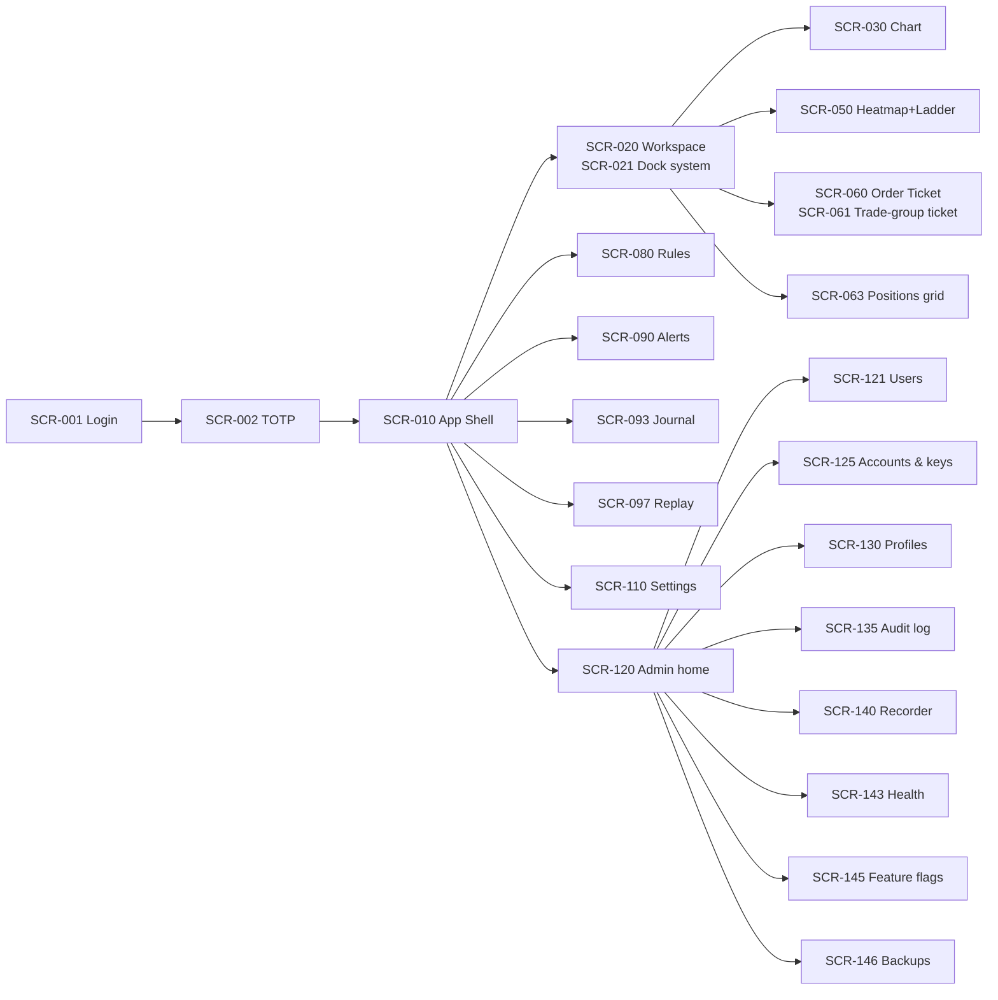

# 14 — Screens Catalogue (CandleViewer web app)

Date: 2026-09-14 · Owner: basiltt · Status: **Baseline for design & engineering — single source of truth for screens**
Scope (locked, see `00-planning-brief.md` + `research/24-owner-decisions.md`): **web app only** — React + TypeScript + custom WebGL chart engine, Electron desktop shell primary, same build runs in Chromium. Owner/admin functions are RBAC-gated screens **inside** this app. **No Android. No separate admin app. Bybit v5 USDT linear perpetuals only.**

Upstream: `10-personas.md` (P1 Owner, P2 Manager, P3 Viewer, P4 Admin-hat, M1 Rule-author mode), `research/23-views-and-screens.md`, `research/digests/*`.
Downstream: `12-sitemap.md` (routes), `13-user-flows.md` (flows), `15-component-catalogue.md` (CMP-* IDs referenced here by descriptive name), `16-design-system-brief.md` (tokens), `11-user-stories.md` (US-* ids referenced here).

---

## 0. How to read this document

### 0.1 Entry template
Every entry carries: **ID** `SCR-nnn` · **Name** · **Type** (Page / Panel / Modal / Drawer / Overlay / Bar / State) · **Purpose** · **Persona & RBAC** · **Route** · **Layout + ASCII wireframe** · **Components** (CMP-* names, defined in `15-component-catalogue.md`) · **Data & sources** (REST `GET /api/v1/...` or WS topic `"..."`) · **Interactions & hotkeys** · **States** · **Validation & error messages** · **A11y** · **Performance** · **Analytics/audit events** · **Design sign-off acceptance checklist** · **Related stories**.

IDs are stable and permanent. Numbers are **not** contiguous: gaps are reserved for growth inside a band.

### 0.2 ID bands
IDs are stable and permanent; a retired screen's ID is never reused. Bands are deliberately larger than their current contents. The "Used / free" column is the authoritative record of which numbers are spare, so a future editor adds a screen at the next free number in the right band rather than appending at the end of the document.

| Band | Area | Used | Free slots reserved for growth |
|---|---|---|---|
| SCR-001..019 | Auth, app shell, global chrome, onboarding | 16 of 19 | **007, 008, 009** — reserved for additional auth factors and recovery flows (e.g. WebAuthn/passkey enrolment, account-recovery challenge, device-trust prompt), kept adjacent to SCR-006 step-up. |
| SCR-020..029 | Workspaces, dockable panel system, layouts | 10 of 10 | none — band full; the next workspace screen extends into a newly allocated band, not into a neighbouring one. |
| SCR-030..049 | Charting: chart panel, settings dialogs, indicators, drawings, profiles | 20 of 20 | none — band full. |
| SCR-050..059 | Order flow: DOM heatmap/ladder, tape, CVD, OI/funding/liq, detectors | 10 of 10 | none — band full. |
| SCR-060..079 | Trading: tickets, grids, algos, risk, environment | 20 of 20 | none — band full. |
| SCR-080..089 | Rule engine: list, form editor, node-graph editor, simulate, arming | 10 of 10 | none — band full. |
| SCR-090..099 | Alerts, journal, analytics, replay | 10 of 10 | none — band full. |
| SCR-100..109 | Watchlist, symbol search, symbol info | 5 of 10 | **105–109** — the largest deliberate reserve, held for scanner/screener expansion (saved-scan management, scan result detail, correlation view, symbol comparison, sector/basket grouping), which is the area most likely to grow post-v1. |
| SCR-110..119 | Settings (user-scoped) | 10 of 10 | none — band full. |
| SCR-120..149 | Admin (owner-only) | 28 of 30 | **138, 139** — intentionally held inside the security sub-range (SCR-135..137 audit/security) for future security screens such as an access-review report and a key-ceremony/approval flow. **Confirmed:** the admin band is 30 slots with 28 used; the two gaps are reserved, not missing screens. Admin is the largest RBAC-critical area, so every admin ID is accounted for here explicitly. |
| SCR-150..159 | Global system states (error, offline, forbidden, degraded) | 10 of 10 | none — band full. |

### 0.3 Route conventions
Single-page app, hash-free HTML5 routes served by the Electron shell or browser at `https://candleviewer.<tailnet>.ts.net` / `http://127.0.0.1:5173` in dev.
- Workspace-scoped terminal: `/w/:workspaceId` — panels are **not** routes; panel focus is `/w/:workspaceId?focus=:panelId`, and modals are `?modal=<name>` query state so they are deep-linkable, restorable and back-button-safe.
- Full-page areas: `/journal`, `/rules`, `/alerts`, `/replay`, `/settings/*`, `/admin/*`.
- All `/admin/*` routes require role `owner` **and** an admin re-auth token ≤15 min old (see SCR-149).

### 0.4 API & WS naming used here
REST base `/api/v1`. All REST responses are JSON; all list endpoints support `?limit&cursor&sort`. Every endpoint named in this document exists in `22-api-openapi.yaml`, which is the **single canonical registry** of REST operations — if a screen needs a call that is not there, the OpenAPI file is changed first and this document follows.

WS is a single multiplexed connection at `wss://<host>/api/v1/stream`. The **canonical topic registry is `23-ws-protocol.md` §6**; the table below is a convenience index of the topics these screens subscribe to, not a second source of truth.

Two naming rules matter when reading the screen entries below, because they changed during contract reconciliation:

- **Private topics are not per-entity.** There is no `orders.{accountId}` or `tradegroup.{groupId}`. Private topics are flat (`orders`, `positions`, `executions`, `wallet`, `trade_groups`, `rules`, `alerts`, `recorder`, `system`) and are **scoped by subscription options** (`exchange_account_ids`, `symbols`, `rule_ids`), which the server intersects with the caller's grants. One subscription covers every account the user may see, so adding an account never means opening another socket topic.
- **Derived order-flow series share one topic.** CVD, tape speed, imbalance, regime and the estimated detectors are all `metrics.{symbol}`, selected by the `metrics` option (e.g. `metrics: ["cvd", "trades_per_sec", "regime"]`). They are one engine output family and one subscription, not five.

| Topic | Payload | Options used by these screens |
|---|---|---|
| `book.{symbol}.{depth}` | L2 snapshot + deltas; `depth` ∈ {1, 50, 200, 500} is part of the topic identity | `throttle_ms` |
| `trades.{symbol}` | public trades (price, qty, side, ts) | `min_size`, `cluster_window_ms` |
| `bars.{symbol}.{bar_type}.{param}` | bar open/update/close (time, volume, tick, range, renko, P&F) | `include_delta`, `history` |
| `footprint.{symbol}.{bar_type}.{param}` | per-bar per-price bid/ask/delta cells | `price_grouping`, `imbalance_ratio`, `min_stack`, `history` |
| `profile.{symbol}.{kind}` | volume/delta/TPO profile buckets; `kind` ∈ {volume, delta, tpo} | `split`, `session_anchor`, `value_area_pct` |
| `metrics.{symbol}` | CVD, delta, tape speed, imbalance, regime, and the estimated detectors | `metrics[]`, `bar_type`, `param` |
| `ticker.{symbol}` / `ticker` | mark/index/last, funding, OI, 24 h stats | `symbols` (batched form) |
| `liquidations.{symbol}` / `liquidations` | liquidation prints | `min_notional_usd` |
| `heatmap.{symbol}` | historized book density columns for the heatmap trail | `time_bucket_ms`, `price_grouping`, `depth`, `window_seconds` |
| `orders` | private order lifecycle, including emulated-algo child orders | `exchange_account_ids`, `symbols`, `open_only` |
| `executions` | private fills | `exchange_account_ids`, `symbols` |
| `positions` | private positions | `exchange_account_ids`, `symbols` |
| `wallet` | balances, margin, equity | `exchange_account_ids` |
| `trade_groups` | fan-out aggregate state | `exchange_account_ids`, `status` |
| `rules` | rule evaluation + action events | `rule_ids`, `include_events` |
| `alerts` | fired alert deliveries | `unacked_only` |
| `recorder` | per-symbol recording state, disk usage | `symbols` |
| `system` | health, ingestion lag, feature flags, kill-switch and risk/freeze transitions; **auto-subscribed, cannot be unsubscribed** | — |

Replay does not have its own topic. A replay session re-uses the **same market-data topics** with `replay_session_id` set on `sub`; frames carry `source: "replay"` and the session id, and playback is controlled over REST (`23-ws-protocol.md` §11). This is why a replayed chart and a live chart can share one pane implementation.

### 0.5 Global invariants that apply to EVERY screen
1. **Demo vs Live is never colour-only.** A persistent chrome band carries the text `DEMO` (blue accent) or `LIVE` (red accent) plus an icon; every trading-capable surface repeats the badge locally (SCR-074/075).
2. **"(estimated)" labelling.** Any value derived from a heuristic proxy (iceberg, stop-run, order-count footprint, regime, queue position) renders an `(estimated)` chip with a tooltip linking the methodology drawer (SCR-058).
3. **Recorder-dependent emptiness is a designed state**, never a blank canvas: profiles, replay, journal back-fill and composite look-backs show "History starts <ts> — recording began then" with a CTA to the recorder admin screen (SCR-140) when the user is the owner, and an explanatory read-only message otherwise.
4. **Disconnection is global and local.** A single reconnect overlay (SCR-152) plus per-panel stale-data shading after 2 s without an expected update; last-good timestamp always shown.
5. **RBAC denies server-side.** Controls the user may not use are rendered **disabled with a reason tooltip**, not hidden (except whole admin areas, which are hidden from navigation and hard-404 for non-owners). Server returns 403 + audit entry regardless of UI state.
6. **WCAG 2.2 AA.** Every canvas surface has an equal-status non-canvas alternative (data table / tree), full keyboard operation, visible focus, ≥4.5:1 text contrast, ≥3:1 non-text, respects `prefers-reduced-motion`, and no information by colour alone.
7. **Performance budget.** WS→pixel ≤250 ms p95; order click→ack ≤500 ms p95; chart engine ≥58 fps at 2560×1440 with footprint + heatmap; panel mount ≤150 ms; route transition ≤200 ms. Per-screen deviations are called out.
8. **Audit.** Every state-changing action emits an append-only audit record `{actor, role, action, target, before, after, ts, ip, sessionId}` via the backing endpoint; the screens below name the `audit.*` action keys.

### 0.6 Screen map


---

## 1. Auth, shell, chrome, onboarding (SCR-001..019)

### SCR-001 — Login
- **Type:** Page. **Purpose:** authenticate a user against the local identity store; first gate after Tailscale ACL.
- **Persona/RBAC:** unauthenticated (all personas). **Route:** `/login`.
- **Layout:** centred single card (max 420 px) on a neutral backdrop; product mark, environment badge of the *server* (Demo-default / Live-enabled), form, footer with build version + Tailscale node name.
```
+-------------------------------------------------+
|                 CandleViewer                    |
|            [ server: DEMO default ]             |
|  +-------------------------------------------+  |
|  | Username  [____________________]          |  |
|  | Password  [____________________]  (eye)   |  |
|  | [x] Remember this device (30 d)           |  |
|  |            [   Sign in   ]                |  |
|  | Error: Invalid username or password.      |  |
|  +-------------------------------------------+  |
|  v1.4.2 · node ws-basil · docs · support        |
+-------------------------------------------------+
```
- **Components:** CMP-001 Button, CMP-005 Checkbox, CMP-007 TextInput, CMP-027 ErrorState / InlineError, CMP-075 EnvBadgeLocal, CMP-200 AuthCard, CMP-201 PasswordField, CMP-207 BuildFooter.
- **Data:** `POST /api/v1/auth/login` → `{mfaRequired, mfaToken}`; `GET /api/v1/system/build` (version, node).
- **Interactions/hotkeys:** `Enter` submits; Tab order username→password→remember→submit; caps-lock warning on password focus.
- **States:** idle · submitting (button spinner, fields locked) · error (generic message) · rate-limited (after 5 failures per 15 min: "Too many attempts. Try again in 14:32.") · account disabled ("This account is disabled. Contact the owner.") · server unreachable (SCR-152 inline variant).
- **Validation/errors:** username required ("Enter your username."); password required ("Enter your password."); never reveal which field was wrong.
- **A11y:** `<form>` with labelled inputs, `aria-describedby` for errors, error region `role="alert"`, autocomplete `username`/`current-password`, focus moves to the alert on failure.
- **Performance:** first paint ≤1 s cold; no chart bundle loaded on this route (code-split).
- **Analytics/audit:** `auth.login.attempt`, `auth.login.success`, `auth.login.failure` (audit, with IP), `auth.login.rate_limited`.
- **Sign-off checklist:** [ ] error copy never leaks account existence [ ] rate-limit countdown designed [ ] 125 % zoom layout [ ] dark + light + CVD-safe themes [ ] keyboard-only pass.
- **Stories:** US-ONB-001, US-ONB-008.

### SCR-002 — Two-factor (TOTP) challenge
- **Type:** Page. **Purpose:** second factor; mandatory for all roles.
- **RBAC:** holder of a valid `mfaToken`. **Route:** `/login/2fa`.
```
+-------------------------------------------+
|  Two-factor code                          |
|  [ _ ][ _ ][ _ ][ _ ][ _ ][ _ ]           |
|  Code from your authenticator app         |
|  [x] Trust this device for 30 days        |
|  [ Verify ]   Use a recovery code >       |
+-------------------------------------------+
```
- **Components:** CMP-001 Button, CMP-005 Checkbox, CMP-021 Link, CMP-027 ErrorState / InlineError, CMP-200 AuthCard, CMP-204 OtpInput.
- **Data:** `POST /api/v1/auth/mfa/verify`, `POST /api/v1/auth/mfa/recovery`.
- **Interactions:** auto-advance per digit, paste of 6 digits fills all, auto-submit on 6th digit, Backspace steps back.
- **States:** idle · verifying · invalid code ("That code isn't valid. Codes refresh every 30 s.") · expired challenge (returns to SCR-001 with "Your sign-in expired, please sign in again.") · locked after 5 tries.
- **A11y:** single `aria-label="Two-factor code"` group; each box `inputmode=numeric`; screen reader announces "digit 3 of 6"; recovery path reachable by keyboard.
- **Audit:** `auth.mfa.success`, `auth.mfa.failure`, `auth.mfa.recovery_used` (high severity).
- **Sign-off:** [ ] paste behaviour [ ] recovery-code path [ ] lockout copy. **Stories:** US-AUTH-003, US-AUTH-004.
- **Performance:** TOTP verify round-trip <=400 ms p95; the 6-digit field auto-submits on the 6th character with no extra render pass.
- **Stories:** US-ONB-002.
- **Design sign-off acceptance checklist:** [ ] code field accepts paste of 6 digits and splits correctly [ ] countdown to code expiry drawn [ ] lockout-after-5-failures state drawn [ ] recovery-code path drawn [ ] keyboard-only pass, no focus trap escape

### SCR-003 — TOTP enrolment (first login / re-enrol)
- **Type:** Page wizard (3 steps). **Route:** `/login/2fa/enroll`. **RBAC:** any authenticated user without MFA.
```
Step 1 Scan        Step 2 Confirm        Step 3 Recovery codes
+--------------+   +---------------+   +--------------------+
| [QR code]    |   | enter 6 digit |   | 10 one-time codes  |
| secret: ABCD |   | [_ _ _ _ _ _] |   | [Copy] [Download]  |
| [Next]       |   | [Verify]      |   | [x] I saved them   |
+--------------+   +---------------+   +--------------------+
```
- **Components:** CMP-001 Button, CMP-033 CopyButton, CMP-066 Stepper, CMP-204 OtpInput, CMP-205 QrCode, CMP-206 RecoveryCodeList.
- **Data:** `POST /api/v1/auth/mfa/enroll`, `POST /api/v1/auth/mfa/enroll/confirm`.
- **States:** loading QR · confirm error · codes shown once (warning that they are never shown again) · completed.
- **Validation:** cannot leave step 3 without checking "I saved them".
- **A11y:** QR has a text alternative (the secret in `<code>` with a copy button); recovery codes readable as a list and downloadable as `.txt`.
- **Audit:** `auth.mfa.enrolled`, `auth.mfa.recovery_generated`. **Stories:** US-AUTH-005.
- **Performance:** QR render <=100 ms (client-side from the provisioning URI; the secret never round-trips for rendering).
- **Stories:** US-ONB-003, US-ONB-010.
- **Design sign-off acceptance checklist:** [x] QR + manual secret both shown with copy affordance [x] recovery codes screen with download/print/copy and 'I stored them' gate [x] verification-failed state [x] re-enrol variant (existing factor) drawn [x] contrast of the QR quiet zone verified in dark theme
- **Hi-fi:** E09-D04 (`docs/design/E09/E09-D04.md`) — all states above plus step2 expired-secret, owner-
  reset landing, recovery-code-consumed forced re-enrolment, and recovery-exhaustion lockout drawn in
  `semantic-dark` tokens on Penpot page "E09-D04 TOTP Enrolment Hi-Fi".

### SCR-004 — Forced password change
- **Type:** Page. **Route:** `/login/change-password`. Triggered when `mustChangePassword` is set (new user, owner reset, password age beyond policy).
- **Components:** CMP-200 AuthCard, CMP-201 PasswordField, CMP-202 PasswordStrengthMeter, CMP-203 RequirementChecklist.
- **Data:** `PUT /api/v1/auth/password`.
- **Validation:** ≥12 chars, not in breach list, not equal to previous 5, must match confirmation. Messages: "Use at least 12 characters."; "This password appears in a known breach list."; "Passwords don't match."
- **A11y:** requirement checklist uses `aria-live="polite"`; each requirement shows met/unmet as text, not colour only.
- **Audit:** `auth.password.changed`. **Stories:** US-AUTH-006.
- **Performance:** Policy evaluation is client-side and synchronous; strength meter updates within one frame (<=16 ms).
- **Stories:** US-ONB-006, US-ADMIN-001.
- **Design sign-off acceptance checklist:** [ ] policy rules listed before typing, not only as errors [ ] strength meter is not colour-only (text label) [ ] 'cannot reuse last 5 passwords' server error state drawn [ ] show/hide password control [ ] no dismiss path (forced) verified

### SCR-005 — Session expired / re-auth modal
- **Type:** Modal (blocking). Appears over any screen when the access token cannot be refreshed.
```
+------------------------------------------+
| Session expired                          |
| Sign in again to continue. Your layout   |
| and unsent ticket inputs are preserved.  |
| Password [_______]   [ Sign in ]         |
| [ Sign out instead ]                     |
+------------------------------------------+
```
- **Behaviour:** all WS subscriptions pause; trading controls disable behind the modal; on success subscriptions resume and open-order state is reconciled from `GET /api/v1/orders?status=open`.
- **A11y:** focus trap, `role="alertdialog"`, Escape does **not** dismiss.
- **Audit:** `auth.session.expired`, `auth.session.reauth`. **Stories:** US-AUTH-007.
- **Performance:** Modal mounts <=100 ms; all live WS subscriptions are paused (not torn down) while it is open so re-auth resumes without a full resubscribe storm.
- **Components:** CMP-001 Button, CMP-027 ErrorState / InlineError, CMP-044 ConfirmDialog, CMP-098 SessionTimeoutWarning, CMP-201 PasswordField.
- **Stories:** US-ONB-004.
- **Design sign-off acceptance checklist:** [ ] underlying screen state is preserved and visibly frozen, not destroyed [ ] 'sign out instead' escape drawn [ ] expiry-during-order-entry case drawn (draft ticket retained, unarmed) [ ] focus moves to the modal and returns on close

### SCR-006 — Step-up authentication modal (S)
- **Type:** Modal. **Purpose:** gate destructive/privileged actions (Demo→Live switch, key reveal/rotation, user deletion, arming a live rule, feature-flag change, restore from backup).
```
+--------------------------------------------------+
| Confirm with two-factor                          |
| Action: Rotate API key for account "sub_002"     |
| Enter your authenticator code: [_ _ _ _ _ _]     |
| Type the account name to confirm: [__________]   |
|                     [ Cancel ]  [ Confirm ]      |
+--------------------------------------------------+
```
- **Data:** `POST /api/v1/auth/step-up` → short-lived `stepUpToken` (5 min, single scope).
- **Validation:** typed confirmation must match exactly (case-sensitive); Confirm disabled until both fields are valid.
- **Audit:** `auth.stepup.granted|denied` with the target action key. **Stories:** US-AUTH-008, US-ADMIN-011.
- **A11y:** Dialog is `role="alertdialog"` with the sensitive action named in the accessible description ('Confirm: rotate API key for Main'); the reason for step-up is text, not an icon; focus starts on the code field and is trapped until resolved; failures are announced via `aria-live="assertive"`.
- **Performance:** Step-up token issue <=400 ms p95; token TTL and remaining validity are rendered from a server-provided expiry, never a client clock assumption.
- **Components:** CMP-001 Button, CMP-027 ErrorState / InlineError, CMP-043 Dialog, CMP-201 PasswordField, CMP-204 OtpInput.
- **Stories:** US-ONB-005.
- **Design sign-off acceptance checklist:** [ ] the exact action being authorised is restated verbatim in the dialog [ ] remaining-TTL indicator for an already-valid step-up token [ ] failure/lockout state drawn [ ] cancel returns the caller to a safe no-op state

### SCR-010 — App shell (global chrome)
- **Type:** Page frame wrapping every authenticated route. **RBAC:** all authenticated.
- **Purpose:** persistent identity of environment, account scope, connection health, navigation and global panic actions.
```
+============================================================================+
| CV | LIVE(!) | Acct: [Main v] Group:[Scalp x3 v] | BTCUSDT v | 1m v        |
|    | Conn live 42ms  Rec 3 sym  CPU 31% FPS 60 | [FLATTEN ALL] [FREEZE]    |
+----+-----------------------------------------------------------------+----+
| N  |                                                                 | R  |
| A  |                  ROUTE / WORKSPACE CONTENT                      | A  |
| V  |                                                                 | I  |
| Trm|                                                                 | Alr|
| Rul|                                                                 | Ntf|
| Jrn|                                                                 | Rec|
| Rep|                                                                 |    |
| Set|                                                                 |    |
| Adm|                                                                 |    |
+----+-----------------------------------------------------------------+----+
| status bar: ws o  api o  clock 14:02:11 UTC  bar close 00:41  v1.4.2      |
+============================================================================+
```
- **Components:** CMP-061 UserMenu, CMP-070 AppShell, CMP-071 NavRail, CMP-072 TopBar, CMP-075 EnvBadgeLocal, CMP-076 ConnectionStatus, CMP-084 GlobalSearchTrigger, CMP-085 SkipLink, CMP-105 AccountMultiSelect, CMP-208 StatusBar, CMP-209 RightRail, CMP-210 HealthChips, CMP-211 PanicButtons, CMP-212 ToastHost, CMP-219 SymbolPicker, CMP-220 IntervalPicker.
- **Data:** `GET /api/v1/me`, `GET /api/v1/exchange-accounts`, `GET /api/v1/trade-groups`, WS `system`, `recorder`, `system`.
- **Interactions/hotkeys:** `Ctrl+K` command palette (SCR-012); `Ctrl+Shift+A` account picker; `Ctrl+/` hotkey cheatsheet (SCR-013); `F11` full-screen workspace; `Alt+1..9` nav rail. **FLATTEN ALL** requires hold-to-confirm 800 ms plus a typed confirm in Live. **FREEZE** is owner-only.
- **States:** normal · disconnected (top bar switches to warning treatment: "Reconnecting… last data 12 s ago") · degraded (backend healthy, exchange WS down) · frozen ("Trading frozen by owner at 14:02 UTC") · lockout (banner with expiry) · read-only (viewer).
- **Validation/errors:** account picker refuses unassigned accounts ("You don't have access to this account."); FLATTEN ALL in Live requires typing `FLATTEN`.
- **A11y:** nav rail is a `<nav>` with `aria-current`; health chips show text values, not just dots; skip link to main content; the environment badge is announced on every route change.
- **Performance:** shell renders before workspace hydration; health chips update at 1 Hz and never re-render the workspace subtree.
- **Audit:** `session.flatten_all`, `session.freeze`, `session.account_scope_changed`.
- **Sign-off:** [ ] Live vs Demo unmistakable at 3 m [ ] panic buttons unreachable by accidental keystroke [ ] rails collapsible to icons [ ] 1920×1080 and 2560×1440 layouts. **Stories:** US-SHELL-001..006.
- **Stories:** US-LAY-005, US-PAPER-002, US-SET-002, US-ADMIN-012.
- **Design sign-off acceptance checklist:** [ ] DEMO and LIVE chrome variants drawn side by side and distinguishable in greyscale [ ] connection indicator has 4 states with text (live/lagging/reconnecting/offline) [ ] role variants (owner/manager/viewer) drawn, admin entry absent for non-owners [ ] 1280x800 and 2560x1440 layouts [ ] skip-to-content link visible on focus

### SCR-011 — Navigation rail (expanded) & workspace switcher
- **Type:** Panel within shell. Shows labels, recent workspaces, pinned symbols.
```
+---------------------------+
| Terminal                  |
|   - Scalping  (default)   |
|   - Swing 4H              |
|   - Fanout review         |
| Rules            (3 armed)|
| Journal                   |
| Replay                    |
| Alerts            (2 new) |
| Settings                  |
| Admin        (owner only) |
+---------------------------+
```
- **Data:** `GET /api/v1/workspaces`, `GET /api/v1/rules?status=armed&count=true`.
- **Interactions:** click a workspace to load; right-click → rename/duplicate/delete/set default; drag to reorder.
- **States:** collapsed (icons + tooltips) · expanded · empty ("No workspaces yet — create one") · Admin item hidden for non-owners.
- **A11y:** `role="tree"` with arrow-key navigation; badge counts included in accessible names ("Alerts, 2 new").
- **Audit:** `workspace.opened`, `workspace.renamed`, `workspace.deleted`. **Stories:** US-WS-001..004.
- **Performance:** Rail expand/collapse animates in <=120 ms and does not reflow or remount any docked panel (transform-only, chart canvases keep their GL context).
- **Components:** CMP-016 Tooltip, CMP-019 Icon, CMP-022 Kbd, CMP-071 NavRail, CMP-073 WorkspaceSwitcher.
- **Stories:** US-LAY-006, US-SET-001.
- **Design sign-off acceptance checklist:** [ ] collapsed (icon) and expanded (label) variants [ ] workspace switcher with >20 workspaces (scroll + search) [ ] active-route indication is not colour-only [ ] tooltips on collapsed icons reachable by keyboard focus

### SCR-012 — Command palette
- **Type:** Modal overlay. **Purpose:** keyboard-first access to every command, symbol, workspace, panel and setting.
```
+------------------------------------------------------+
| > flat|                                              |
|------------------------------------------------------|
| Flatten all positions (all accounts)      Ctrl+Sh+F  |
| Flatten BTCUSDT on Main                              |
| Settings -> Flatten confirmation                     |
| Symbol: FLOKIUSDT                                    |
+------------------------------------------------------+
| Enter run - Tab complete - Esc close                  |
+------------------------------------------------------+
```
- **Components:** CMP-022 Kbd, CMP-059 CommandPalette, CMP-213 FuzzyList.
- **Data:** local command registry + `GET /api/v1/instruments?q=`; recency persisted via `PATCH /api/v1/me/preferences`.
- **Interactions:** `Ctrl+K` opens; fuzzy filter; `↑/↓` move; `Enter` run; `Ctrl+Enter` run against every account in the active group; dangerous commands are marked and route into their confirm flow rather than firing directly.
- **States:** empty query (recent + suggested) · results · no results ("No command or symbol matches 'xyz'") · RBAC-disabled entries greyed with a reason.
- **A11y:** `role="combobox"` + `aria-activedescendant`; results `role="listbox"`; result count announced.
- **Performance:** filter ≤16 ms over 2 000 entries (precomputed index).
- **Audit:** `command.executed` (name only, no payload). **Stories:** US-SHELL-007.
- **Stories:** US-SET-002, US-MKT-002.
- **Design sign-off acceptance checklist:** [ ] result grouping (navigate / panel / symbol / action / setting) drawn [ ] no-results state with suggestion [ ] destructive actions visually marked and step-up-gated [ ] recent/frequent ordering shown [ ] opens and closes within one frame budget on a loaded workspace

### SCR-013 — Hotkey cheatsheet overlay
- **Type:** Overlay (`Ctrl+/`). Two columns grouped by context (Global, Chart, DOM, Ticket, Replay, Rules) showing the user's *current* bindings with a "Customise" link to SCR-113.
- **Data:** `GET /api/v1/me/keymap`. **States:** loading · loaded · conflicts highlighted with a warning chip.
- **A11y:** rendered as a real table for screen readers; printable stylesheet. **Stories:** US-SET-006.
- **Performance:** Static content, no network; overlay mounts <=80 ms and does not pause the chart render loop.
- **Analytics/audit:** `help.hotkeys_opened` (analytics only; no audit record - read-only surface).
- **Components:** CMP-022 Kbd, CMP-049 Table, CMP-054 SearchBox, CMP-094 HotkeyOverlay.
- **Stories:** US-SET-002.
- **Design sign-off acceptance checklist:** [ ] grouped by context (global / chart / ladder / ticket / rules) [ ] shows user-remapped bindings, not just defaults [ ] printable/plain-text variant [ ] dismiss via Esc and click-outside [ ] scrollable at 125% zoom without clipping

### SCR-014 — Notification centre (right-rail drawer)
- **Type:** Drawer. Streams fired alerts, rule actions, order rejects, risk events, system warnings.
```
+-- Notifications ------------[clear all]-+
| 14:02 ALERT BTC crossed 64,000          |
| 14:01 RULE r_12 moved SL to BE (Main)   |
| 13:58 ORDER rejected 10018 rate limit   |
| 13:40 Recorder started ETHUSDT          |
+-----------------------------------------+
```
- **Data:** WS `alerts`, `rules`, `orders`, `system`; history `GET /api/v1/notifications`.
- **Interactions:** click deep-links to the source (chart at timestamp / rule / order); mute per category; `Shift+click` marks everything above as read.
- **States:** empty ("Nothing yet today") · unread badge · muted-category indicator · overflow (keeps newest 500; older via history).
- **A11y:** `aria-live="polite"`, escalating to `assertive` only for order rejects and risk lockouts; absolute timestamps available.
- **Components:** CMP-026 EmptyState, CMP-055 FilterBar, CMP-060 NotificationCenter, CMP-163 AlertRow, CMP-165 AlertFiredToastGroup, CMP-209 RightRail.
- **Stories:** US-ALRT-004, US-ALRT-006, US-OBS-004.
- **Performance:** Virtualised list; renders 500 notifications with <=8 ms scripting per scroll frame; unread count updates are debounced to 250 ms.
- **Analytics/audit:** `notifications.opened`, `notifications.filtered`, `notifications.item_actioned`, `notifications.mark_all_read` (analytics); notifications that mirror an audited backend event link to the audit record rather than duplicating it.
- **Design sign-off acceptance checklist:** [ ] severity encoded by icon + text, never colour alone [ ] empty state [ ] grouped/collapsed repeats ('12 similar alerts') [ ] deep-link from a notification restores the right panel and symbol [ ] does not steal focus when it opens on a new event

### SCR-015 — Global toast host
- **Type:** Overlay. Transient confirmations ("Order accepted · id 42f"), warnings, errors with an action ("Retry"; "Undo" within 5 s for cancellations).
- **A11y:** respects `prefers-reduced-motion` (fade only); error toasts never auto-dismiss; every toast is duplicated into SCR-014.
- **Components:** CMP-045 Toast / Notification, CMP-212 ToastHost.
- **Stories:** US-ALRT-005, US-SET-003.
- **Performance:** At most 3 toasts on screen; overflow collapses into a counted stack; toast animation is transform/opacity only so it never triggers layout on the chart surface.
- **Analytics/audit:** None of its own; toasts mirror events already emitted by their originating screen.
- **Design sign-off acceptance checklist:** [ ] info/success/warning/error variants with icon + text [ ] auto-dismiss timing per severity (errors are sticky) [ ] pause-on-hover/focus [ ] stacking and overflow drawn [ ] `prefers-reduced-motion` variant drawn

### SCR-016 — First-run onboarding wizard (owner)
- **Type:** Page wizard, 6 steps, only on an empty install. **Route:** `/onboarding`.
- Steps: 1 Welcome & scope reminder → 2 Verify Tailscale/host binding → 3 Add first Bybit account (SCR-126 inline, Demo first) → 4 Choose recorded symbols (SCR-140 inline) → 5 Pick a workspace preset (Scalping / Swing / Analyst) → 6 Safety briefing (Demo default, Live needs step-up, native-SL invariant) with a required acknowledgement.
```
[1 Welcome]-[2 Network]-[3 Account]-[4 Recording]-[5 Layout]-[6 Safety]
+------------------------------------------------------------------+
| Step 3 of 6 - Connect a Bybit account                            |
| Environment (o) Demo  ( ) Live   (Live needs step-up later)      |
| Label [ Main ]  API key [........]  Secret [........]            |
| [x] Withdrawal permission is OFF (verified on save)              |
| [ Test connection ]  status: read ok - trade ok - no-withdraw ok |
|                              [ Back ]   [ Continue ]             |
+------------------------------------------------------------------+
```
- **Data:** `GET /api/v1/admin/health`, `POST /api/v1/exchange-accounts`, `POST /api/v1/exchange-accounts/{accountId}/keys/{keyId}/test`, `POST /api/v1/recording/symbols`, `POST /api/v1/workspaces`, `POST /api/v1/onboarding/complete`.
- **States:** per-step loading/valid/invalid; "Skip for now" allowed on steps 3–5, leaving a persistent setup checklist (SCR-019).
- **Validation:** the key test must pass before Continue (or be explicitly skipped). A key with withdrawal permission is a **hard block**: "This key has withdrawal permission. Create a key with withdrawal disabled."
- **A11y:** stepper is a `<nav>` with `aria-current="step"`; focus moves to the step heading on change.
- **Audit:** `onboarding.step_completed`, `onboarding.completed`, `account.created`. **Stories:** US-ONB-001..005.
- **Performance:** Each step is independently routable and lazily loaded; an interrupted wizard resumes from the server-stored step, not from client memory.
- **Components:** CMP-001 Button, CMP-040 FormField, CMP-066 Stepper, CMP-097 OnboardingChecklist, CMP-201 PasswordField, CMP-205 QrCode, CMP-206 RecoveryCodeList.
- **Stories:** US-ONB-003, US-ONB-008, US-ACCT-001.
- **Design sign-off acceptance checklist:** [ ] all steps drawn incl. skip/resume [ ] key-entry step never echoes the secret after save [ ] 'start in DEMO' default is visible and explained [ ] progress and back/forward semantics [ ] completion state links to the setup checklist (SCR-019)

### SCR-017 — Manager/viewer onboarding (invited user)
- **Type:** Page wizard, 4 steps: accept invite → set password (SCR-004 embedded) → enrol TOTP (SCR-003 embedded) → orientation card.
```
+------------------------------------------------------------+
| You're set up as: Account Manager                          |
| Accounts: sub_002 (BTC scalp)     Environment: DEMO        |
| Limits: max 0.5 BTC - 2% daily loss - leverage <= 10x      |
| API key pending Bybit's 48 h restriction - live from       |
| 2026-09-16 11:20 UTC. You can trade Demo meanwhile.        |
|                                    [ Open the terminal ]   |
+------------------------------------------------------------+
```
- **Data:** `GET /api/v1/invites/{inviteToken}`, `GET /api/v1/me/limits`.
- **States:** invite valid · expired ("This invitation expired on <date>. Ask the owner for a new one.") · already used.
- **Components:** CMP-001 Button, CMP-040 FormField, CMP-050 Card, CMP-066 Stepper, CMP-097 OnboardingChecklist.
- **Stories:** US-ONB-006, US-ONB-007, US-ADMIN-013.
- **A11y:** Wizard is a sequence of `<form>` steps with an `aria-current="step"` progress list; each step has an `<h1>`; nothing depends on the coach-mark overlay (it can be skipped entirely by keyboard).
- **Performance:** Route transition between steps <=200 ms; no chart/WS subscriptions are opened until the wizard completes.
- **Analytics/audit:** `onboarding.started`, `onboarding.step_completed`, `onboarding.skipped`, `onboarding.completed` (analytics); `user.first_login` (audit).
- **Design sign-off acceptance checklist:** [ ] scoped-account explanation drawn for manager and viewer separately [ ] 'what you cannot do' section drawn honestly [ ] mandatory TOTP enrolment step drawn [ ] skip/resume [ ] no step depends on data the invited user cannot read

### SCR-018 — Guided tour / coach marks
- **Type:** Overlay. Optional 8-stop tour (chart, footprint, DOM, ticket, positions, rules, journal, panic buttons). Dismissible, resumable from Settings → Help, never auto-shown twice.
- **A11y:** each stop is a focusable dialog with prev/next; `Esc` exits; reduced motion disables the spotlight animation. **Stories:** US-ONB-008.
- **Performance:** Coach marks use a single overlay layer with pointer-events pass-through; they never remount the underlying panel and are disabled entirely under `prefers-reduced-motion`.
- **Analytics/audit:** `tour.started`, `tour.step_viewed`, `tour.dismissed`, `tour.completed` (analytics).
- **Components:** CMP-001 Button, CMP-017 Popover, CMP-023 Progress Bar.
- **Stories:** US-ONB-007.
- **Design sign-off acceptance checklist:** [ ] every step dismissible and resumable from Help [ ] highlight ring meets 3:1 against both themes [ ] focus is moved to the coach-mark content and restored on exit [ ] tour never blocks a trading control while LIVE [ ] reduced-motion variant

### SCR-019 — Setup checklist card
- **Type:** Panel (empty workspace + Settings → Help). Outstanding setup items with deep links: add a live account, record a symbol, create a trade group, set risk caps, invite a second user, run the engine benchmark.
- **Data:** `GET /api/v1/onboarding/checklist`. **States:** pending/done/blocked with reason. **Stories:** US-ONB-009.
- **A11y:** Ordered list of tasks with real checkbox semantics (`aria-disabled` for tasks the user's role cannot complete, with the reason as visible text); completion is announced politely.
- **Performance:** Status derives from a single `GET /api/v1/onboarding/checklist` call cached for 60 s; the card never polls while hidden.
- **Analytics/audit:** `setup.task_completed`, `setup.checklist_dismissed` (analytics).
- **Components:** CMP-021 Link, CMP-023 Progress Bar, CMP-050 Card, CMP-097 OnboardingChecklist.
- **Stories:** US-ONB-007, US-ACCT-001, US-REC-001.
- **Design sign-off acceptance checklist:** [ ] per-role task set drawn (owner vs manager) [ ] partially-complete and fully-complete states [ ] dismiss/restore path [ ] each task deep-links to the screen that completes it

---

## 2. Workspaces, dock system, multi-chart sync (SCR-020..029)

### SCR-020 — Workspace (terminal) page
- **Type:** Page. **Purpose:** the primary daily surface — a dockable canvas hosting every trading/analysis panel.
- **RBAC:** all; trading panels degrade to read-only for `viewer`. **Route:** `/w/:workspaceId`.
```
+------------------------------------------------------------------------------+
| [tabs] Scalping* | Swing 4H | + |            [layout v][sync v][save][reset]  |
+---------------------------+----------------------+--------------------------+
| SCR-030 Chart (footprint) | SCR-050 Heatmap+DOM  | SCR-060 Order ticket     |
|                           |                      |                          |
|                           |                      +--------------------------+
|                           |                      | SCR-053 Tape / big trades|
+---------------------------+----------------------+--------------------------+
| SCR-052 CVD/Delta  | SCR-054 OI/Funding/Liq      | SCR-057 Regime | SCR-056 |
+---------------------------+----------------------+--------------------------+
| SCR-063 Positions & orders grid (Positions | Orders | Fills | Groups)        |
+------------------------------------------------------------------------------+
```
- **Components:** CMP-073 WorkspaceSwitcher, CMP-080 DockPanel, CMP-081 DockGrid / Layout Manager, CMP-082 PanelHeader, CMP-217 LayoutPresetMenu, CMP-218 SyncMenu.
- **Data:** `GET /api/v1/workspaces/{id}` (layout tree + panel configs), `PUT /api/v1/workspaces/{id}`; panels subscribe their own topics.
- **Interactions/hotkeys:** `Ctrl+1..9` layout presets; `Ctrl+S` save; `Ctrl+Shift+S` save as; `Alt+drag` move panel; `F11` full-screen active panel; `Ctrl+Alt+←/→` cycle panels; drag a watchlist symbol onto a panel to rebind it.
- **States:** loading skeleton (panel frames, no data fetch until mount) · empty workspace (panel picker + SCR-019) · unsaved changes (`*` on the tab, prompt on navigation) · restored after crash ("Restored your layout from 14:02") · too many panels (>16: "Performance may degrade — consider fewer panels").
- **Validation/errors:** workspace name 1–40 chars, unique per user; save conflict → "This workspace changed elsewhere. [Keep mine] [Load theirs]".
- **A11y:** each panel is a `region` with an accessible name ("Chart, BTCUSDT 1m"); `F6` cycles regions; every dock operation has a keyboard equivalent in the panel menu.
- **Performance:** panels mount lazily on first visibility; hidden tabs unsubscribe after 30 s; layout changes never remount the WebGL context.
- **Audit/analytics:** `workspace.saved`, `panel.added`, `panel.removed`, `layout.preset_applied`.
- **Sign-off:** [ ] drop-zone previews specified [ ] keyboard docking specified [ ] 3 density modes [ ] crash-restore designed. **Stories:** US-WS-005..012.
- **Stories:** US-LAY-001, US-LAY-002, US-LAY-005.
- **Design sign-off acceptance checklist:** [ ] default owner layout, manager layout and viewer layout drawn [ ] panel focus ring and active-panel affordance visible [ ] symbol-group colour tags carry a letter/number too [ ] layout restore after crash drawn [ ] DEMO and LIVE chrome variants [ ] 1280x800 minimum supported layout has no overlap

### SCR-021 — Dock / panel system (drag, split, float)
- **Type:** Interaction surface within SCR-020.
```
Drag preview                Drop zones
+---------------+           +---------------------------+
| Chart (ghost) |           |        [ top ]            |
|               |           | [left] [ center tab ] [r] |
+---------------+           |        [ bottom ]         |
                            +---------------------------+
```
- **Behaviour:** drop zones highlight with a 4 px accent and a translucent preview of the resulting rectangle; splitters resize by mouse or `Alt+Shift+arrows`; a panel can be floated into an OS window (Electron) or a maximised overlay (browser, with a notice).
- **Components:** CMP-083 SplitPane, CMP-214 DockDropZone, CMP-215 FloatingWindowFrame, CMP-216 PanelMenu.
- **States:** dragging · invalid drop (cursor + "Can't dock here") · floating · maximised · minimised-to-tab.
- **A11y:** the panel menu (`Shift+F10` or the ⋮ button) exposes Move/Split/Float/Close; a live region announces "Chart moved to bottom-right".
- **Performance:** drag preview uses CSS transforms only; the drop commits exactly one layout mutation.
- **Stories:** US-LAY-001, US-LAY-005, US-LAY-008.
- **Analytics/audit:** `layout.panel_added`, `layout.panel_removed`, `layout.panel_moved`, `layout.split_created`, `layout.panel_floated`, `layout.maximised`, `layout.saved`, `layout.reset` (analytics only - layout is user preference, not a security-relevant state change).
- **Design sign-off acceptance checklist:** [ ] drop-zone affordances for all six targets (N/S/E/W/centre/float) [ ] invalid-drop feedback [ ] keyboard move mode drawn with its own visible instructions [ ] minimum panel size and the 'panel too small - showing compact view' state [ ] drag preview does not obscure the drop target

### SCR-022 — Layout preset gallery
- **Type:** Modal. Presets: 1×1, 2×1, 2×2, 1+3, 3+1, Scalping (chart+DOM+ticket+tape), Order-flow (chart+footprint+CVD+profile), Swing (3 timeframes), Analyst (read-only chart+journal+replay), Fan-out review (positions by account + group ticket).
```
+------------------ Layouts ------------------+
| [1x1] [2x1] [2x2] [1+3] [3+1]               |
| Presets:  Scalping   Order-flow             |
|           Swing 3TF  Analyst   Fan-out      |
| [x] Keep current symbols   [ Apply ]        |
+---------------------------------------------+
```
- **Data:** `GET /api/v1/layout-presets`, `POST /api/v1/workspaces/{workspaceId}/layouts`.
- **Warning state:** "Applying a preset replaces the current layout. Settings of surviving panels are kept."
- **Components:** CMP-001 Button, CMP-043 Dialog, CMP-050 Card, CMP-217 LayoutPresetMenu.
- **Stories:** US-LAY-001, US-LAY-006, US-CHART-012.
- **A11y:** Preset gallery is a listbox of cards with an accessible name and a text description of what each preset contains; preview thumbnails carry `alt` text enumerating the panels; applying a preset announces the result.
- **Performance:** Thumbnails are static SVG (no live panels); applying a preset rebuilds the dock tree in <=300 ms and reuses existing panel instances where the type matches, avoiding GL context churn.
- **Analytics/audit:** `layout.preset_previewed`, `layout.preset_applied`, `layout.preset_saved_as`, `layout.preset_deleted` (analytics).
- **Design sign-off acceptance checklist:** [ ] built-in presets drawn (Scalper DOM, Footprint focus, Multi-chart 2x2, Analysis/journal, Replay) [ ] user presets with rename/delete [ ] 'applying replaces your current layout' confirmation [ ] empty user-preset state

### SCR-023 — Multi-chart sync configuration
- **Type:** Popover/Modal from the shell's `sync` menu. **Purpose:** control what propagates across chart panels.
```
+---------- Sync ----------------------------+
| Sync group: (A) (B) (C) (none)             |
| [x] Symbol      [x] Crosshair              |
| [x] Interval    [ ] Time range             |
| [x] Drawings (same symbol only)            |
| [ ] Y-scale     [x] Selected account/group |
| Panels in group A: Chart 1, Chart 2, DOM   |
+--------------------------------------------+
```
- **Behaviour:** panels carry a letter+colour sync badge (letter carries the meaning, never colour alone). Crosshair sync draws a dashed line at the same timestamp in every member; drawing sync applies only between panels on the same symbol.
- **Data:** stored in the workspace document; runtime over a local sync bus (no server round-trip).
- **Interactions:** `Ctrl+Shift+1..3` assign the active panel to group A/B/C; `Ctrl+Shift+0` unsync.
- **Performance:** crosshair sync must not trigger a React re-render — it dispatches straight into the engine (≤4 ms across 6 panels).
- **A11y:** the badge is text ("A"); group changes are announced.
- **Components:** CMP-004 Toggle, CMP-011 Tag / Chip, CMP-040 FormField, CMP-043 Dialog, CMP-218 SyncMenu.
- **Stories:** US-LAY-003, US-LAY-004.
- **Analytics/audit:** `sync.group_created`, `sync.group_changed`, `sync.axis_toggled`, `sync.panel_joined_group`, `sync.panel_left_group` (analytics).
- **Design sign-off acceptance checklist:** [ ] all sync axes drawn as independent toggles (symbol / interval / crosshair / time range / drawings / indicator set) [ ] group colour tag is paired with a letter [ ] conflicting-sync warning drawn ('Chart 3 has a different interval - crosshair sync will align by timestamp') [ ] leaving a group does not reset the panel's own settings

### SCR-024 — Panel picker ("Add panel")
- **Type:** Modal. Grouped catalogue of every addable panel with a one-line description, a thumbnail and chips for "requires recording", "(estimated)", "owner only".
- **Data:** local panel registry + `GET /api/v1/admin/feature-flags` and role.
- **States:** search · category filter · disabled entries with reasons ("Needs a recorded symbol", "Owner only").
- **Components:** CMP-043 Dialog, CMP-048 Combobox / AutoComplete, CMP-050 Card, CMP-213 FuzzyList.
- **Stories:** US-LAY-005.
- **A11y:** Searchable list with category headings as real headings; each panel type has a one-line description read with its name; adding announces where the panel landed ('CVD added to the right column').
- **Performance:** Panel mounts <=150 ms; the picker pre-warms nothing and the newly added panel subscribes to its WS topics only after mount.
- **Analytics/audit:** `panel.added` with `{type, placement}` (analytics).
- **Design sign-off acceptance checklist:** [ ] all panel types listed with an icon + description [ ] panels unavailable to the role are shown disabled with a reason [ ] search with no results [ ] placement choice (where it will be inserted) is previewed

### SCR-025 — Workspace settings modal
- **Type:** Modal. Name, description, default symbol/interval, default account scope, density (compact/cosy/comfortable), theme override, "open on startup", export as template, delete.
- **Data:** `PUT /api/v1/workspaces/{workspaceId}`, `DELETE /api/v1/workspaces/{workspaceId}`, `GET /api/v1/workspaces/{workspaceId}/export`.
- **Validation:** delete requires typing the workspace name; the last workspace cannot be deleted ("You need at least one workspace.").
- **Audit:** `workspace.updated`, `workspace.deleted`, `workspace.exported`. **Stories:** US-WS-020.
- **A11y:** Standard modal form: labelled fields, grouped fieldsets for defaults (symbol, interval, environment binding), error summary at top with in-page links.
- **Performance:** Saving applies without a full workspace remount; only panels bound to a changed default re-resolve their data.
- **Components:** CMP-001 Button, CMP-004 Toggle, CMP-040 FormField, CMP-043 Dialog, CMP-065 FormSection.
- **Stories:** US-LAY-002, US-LAY-003.
- **Design sign-off acceptance checklist:** [ ] rename, default symbol/interval, environment binding, autosave toggle and sharing (owner) drawn [ ] 'this workspace is pinned to LIVE' warning drawn [ ] unsaved-changes handling [ ] delete-workspace confirmation path

### SCR-026 — Workspace import
- **Type:** Modal. Drop or pick a workspace JSON; shows a diff-style preview (panels added, symbols referenced, accounts remapped).
- **Validation:** schema-version check ("This layout was exported by v2 and can't be imported into v1."); unknown panel types are dropped and listed; inaccessible account references remap to the user's default account.
- **Components:** CMP-001 Button, CMP-027 ErrorState / InlineError, CMP-043 Dialog, CMP-044 ConfirmDialog, CMP-067 FileDrop / Import control.
- **Stories:** US-LAY-007.
- **A11y:** File input has a visible label and an accessible drop zone with a keyboard alternative; the import diff is a table, not a canvas; validation errors are listed as text with the offending key named.
- **Performance:** Import parsing is done in a worker; a 2 MB layout file validates in <=500 ms without blocking the UI thread.
- **Analytics/audit:** `layout.imported`, `layout.import_rejected` with `{reason}` (analytics).
- **Design sign-off acceptance checklist:** [ ] file-picker and drag-drop paths [ ] version-mismatch state ('exported from a newer version - 2 panels will be dropped') [ ] preview of what will be imported before applying [ ] rejection state for malformed or oversized files [ ] import never carries credentials or account bindings (verified in copy)

### SCR-027 — Floating panel window (Electron)
- **Type:** OS window. Slim title bar with panel name, symbol, env badge and "return to workspace"; participates in sync groups; closes back into its origin dock slot.
- **States:** normal · display disconnected (recovered to the primary display next launch) · browser fallback notice.
- **Components:** CMP-075 EnvBadgeLocal, CMP-080 DockPanel, CMP-215 FloatingWindowFrame.
- **Stories:** US-LAY-005, US-SET-009.
- **A11y:** The floating window is an independent document with its own title, skip link and focus scope; the window title names the panel, symbol and environment ('Ladder - BTCUSDT - LIVE'); moving focus between windows is OS-standard.
- **Performance:** Each floating window is a separate renderer process with its own GL context; the combined budget target is >=58 fps across at most 4 GPU-heavy windows on the reference machine, beyond which the shell warns (SCR-046).
- **Analytics/audit:** `panel.floated`, `panel.redocked`, `window.opened`, `window.closed` (analytics).
- **Design sign-off acceptance checklist:** [ ] DEMO/LIVE band repeated in every floating window [ ] window chrome with re-dock control [ ] multi-monitor placement is remembered and restored [ ] behaviour when the parent window closes is drawn [ ] browser (non-Electron) fallback drawn - float degrades to a maximised panel with an explanatory note

### SCR-028 — Panel context menu
- **Type:** Menu. Settings…, Duplicate, Move to ▸, Float, Full screen, Sync group ▸, Reset settings, Copy panel link, Close — identical for every panel type so muscle memory transfers.
- **A11y:** full keyboard menu with type-ahead and shortcut hints. **Stories:** US-WS-023.
- **Performance:** Menu opens in <=80 ms; it is built from a static descriptor, not a per-open API call.
- **Analytics/audit:** Actions inherit the event of the action they invoke; the menu itself emits `panel.context_menu_opened` (analytics).
- **Components:** CMP-041 Menu, CMP-216 PanelMenu.
- **Stories:** US-LAY-005.
- **Design sign-off acceptance checklist:** [ ] full item set drawn (settings, duplicate, float, maximise, link to sync group, rename, close) [ ] disabled items show a reason [ ] keyboard invocation via the context-menu key and Shift+F10 [ ] submenu behaviour and overflow near the viewport edge

### SCR-029 — Unsaved-changes / layout-conflict dialog
- **Type:** Modal. "You have unsaved layout changes." [Save] [Discard] [Cancel]; the conflict variant adds a side-by-side summary of differences (panel count, symbols, sync groups).
- **Components:** CMP-001 Button, CMP-027 ErrorState / InlineError, CMP-044 ConfirmDialog.
- **Stories:** US-LAY-002, US-SET-003.
- **A11y:** `role="alertdialog"`; the three choices are explicit buttons with verbs ('Save layout', 'Discard changes', 'Cancel'); the conflicting-change summary is text.
- **Performance:** Conflict detection compares layout revision ids received over WS; the dialog appears within 300 ms of the conflicting write being detected.
- **Analytics/audit:** `layout.conflict_detected`, `layout.conflict_resolved` with `{choice}` (analytics).
- **Design sign-off acceptance checklist:** [ ] unsaved-changes variant and cross-session conflict variant both drawn [ ] a plain-language summary of what differs [ ] no default destructive button [ ] Esc maps to Cancel, never to Discard

---

## 3. Charting (SCR-030..049)

### SCR-030 — Chart panel (price + footprint)
- **Type:** Panel. **Purpose:** the spine of the product: price action, footprint cells, overlays, drawings, indicators and chart trading.
- **RBAC:** all (trading overlays read-only for `viewer`). **Route:** panel in `/w/:workspaceId` (`?focus=chart-1`).
```
+--------------------------------------------------------------------------+
| BTCUSDT v  1m v  [Candle|Bar|Line|EquiVol|DeltaVol] [FP on] [Ind] [Draw] |
| DEMO  mark 64,012.5  last 64,011.0  spread 0.5  bar close 00:41          |
+---+----------------------------------------------------------------+-----+
| D |                        price area                              |  y  |
| r |   |Ask 12| 45                                                  |  a  |
| a |   |Bid  8| 32        candle + footprint cells                  |  x  |
| w |   |Ask 30| 10                                                  |  i  |
| i |   |Bid 22|  5     --- position line (avg 63,980, +0.42R) ---   |  s  |
| n |                   === SL 63,900 ===  === TP 64,300 ===         |     |
| g |   [VAH ---- POC ---- VAL] visible-range profile overlay        |     |
+---+----------------------------------------------------------------+-----+
| Deep Stats: Vol 1,204 | Bid 502 | Ask 702 | D +200 | maxD +260 | CVD +1.2k|
+--------------------------------------------------------------------------+
| volume histogram sub-pane                                                 |
+--------------------------------------------------------------------------+
| time axis  12:00      12:30      13:00      13:30      [ auto | fit | > ] |
+--------------------------------------------------------------------------+
```
- **Components:** CMP-109 FootprintCell, CMP-180 ChartRoot, CMP-181 CandleSeries, CMP-182 FootprintSeries, CMP-183 VolumeProfilePane, CMP-188 PriceAxis, CMP-189 TimeAxis, CMP-191 DrawingToolOverlay, CMP-192 OrderLineOverlay, CMP-194 IndicatorOverlay, CMP-195 AnnotationMarker, CMP-197 ChartTooltip, CMP-198 ChartWatermark / PaneBackground, CMP-219 SymbolPicker, CMP-220 IntervalPicker, CMP-221 ChartToolbar, CMP-222 ChartTypeToggle, CMP-223 DrawingToolbar, CMP-224 IndicatorChips, CMP-225 DeepStatsStrip, CMP-226 BarCountdown, CMP-227 EstimatedBadge.
- **Data:** bootstrap `GET /api/v1/market/bars?symbol&interval&from&to`, `GET /api/v1/market/footprint?symbol&interval&from&to`; live WS `bars.{symbol}.{bar_type}.{param}`, `footprint.{symbol}.{bar_type}.{param}`, `trades.{symbol}`, `ticker.{symbol}`; overlays from `positions`, `orders`; `GET /api/v1/instruments/{symbol}` for tick size, lot size, leverage bounds.
- **Interactions/hotkeys:** wheel = zoom time; `Shift+wheel` = zoom price; drag = pan; double-click axis = auto-fit; `F` toggle footprint; `Alt+F` profile vs box footprint mode; `1..9` interval presets; `Ctrl+drag` on price axis = place a limit order at that price (chart trading, arm-gated); `Alt+click` = market order at market; drag an SL/TP line to amend; `Esc` cancels an in-progress drawing; `Del` deletes the selected drawing; `Ctrl+Z/Ctrl+Y` undo/redo drawings; right-click cell → "Focus imbalance" / "Copy cell stats" / "Replay from here".
- **States:** loading (skeleton grid + "Loading 5 000 bars…") · streaming · **stale** (>2 s without an expected tick: canvas dims 15 %, chip "Stale 4 s") · disconnected (SCR-152 in-panel variant, chart frozen with last-good timestamp) · empty history ("No recorded history before 2026-09-01 — footprint starts there") · symbol delisted/paused ("Trading for this symbol is paused by the exchange") · replay mode (purple `REPLAY` border + clock) · demo vs live badge · low-GPU degraded ("Reduced detail: footprint text hidden below 6 px cells" — validated by `docs/design/E06/E06-D01.md` §6 as the **L2 floor** below which even colour-only cell rendering has nothing smaller to fall back to before L3 hides the layer entirely; distinct from the earlier, higher L0→L1 text-simplification thresholds of `LOD_PROFILE_M0`).
- **Validation/errors:** chart-trading order price snapped to tick size with a tooltip ("Snapped to 0.5 tick"); qty below min lot → "Minimum 0.001 BTC"; chart trading disabled when the arm toggle is off ("One-click trading is off — press Ctrl+Shift+T to arm").
- **A11y:** canvas has `role="img"` with a rolling summary label ("BTCUSDT 1 minute, last 64 011, up 0.4 %, delta +200"); an equal-status **data table alternative** (`Alt+T`, SCR-045) exposes the visible bars and footprint cells as a navigable grid; crosshair is fully keyboard-driven (`←/→` bar, `↑/↓` price level) with values announced politely; all overlays additionally labelled in text; never colour-only (bid/ask carry `B`/`A` glyphs in the accessible table and optional in-cell prefixes).
- **Performance:** ≥58 fps at 2560×1440 with 100 k bars loaded and footprint on; first bars painted ≤400 ms from cache, ≤1.2 s cold; footprint text is atlas-rendered; incremental updates never re-upload the full vertex buffer; memory ≤450 MB per chart panel.
- **Mandatory WebGL engine spike gate (owner decision #2.2.1 — blocks design sign-off for this screen):** this screen may not be signed off until the custom-engine spike demonstrates, on the reference machine and recorded as evidence attached to the sign-off: **(a) 100 k bars loaded with footprint text cells rendering at ≥60 fps**, **(b) sustained incremental updates at the 100 ms heatmap/footprint cadence with no dropped frames over a 10-minute run**, and **(c) the same numbers reproduced in all three runtimes — Chromium, Electron and Tauri/WebView2**. If the spike fails, this screen falls back to the Lightweight-Charts route (owner decision #1's named fallback) and the layout must be re-reviewed, because the footprint cell rendering is the part at risk.
- **Analytics/audit:** `chart.symbol_changed`, `chart.interval_changed`, `chart.footprint_toggled`, `chart.order_placed_from_chart` (audit), `chart.drawing_created`.
- **Sign-off:** [ ] footprint legible at 3 densities [ ] imbalance encoding is not colour-only [ ] position/order overlay collision rules [ ] stale + disconnected treatments [ ] keyboard crosshair spec [ ] data-table alternative parity [ ] engine perf benchmark attached.
- **Stories:** US-CHART-001, US-CHART-003, US-CHART-006, US-CHART-008, US-CHART-013, US-FP-001, US-FP-002, US-FP-004, US-DS-001, US-ORD-007, US-ORD-008, US-POS-005, US-FP-009.
- **Design sign-off acceptance checklist:** [ ] footprint on/off, all four cell modes and the bar types drawn [ ] cell text legibility verified at the minimum readable zoom, with the auto-collapse-to-colour threshold agreed [ ] Deep Stats strip drawn [ ] trading overlay (position line, SL/TP, working orders) drawn [ ] crosshair + tooltip content specified [ ] loading, empty (recording start), error and stale-data states drawn [ ] engine meets the mandatory WebGL spike targets (see Performance) before sign-off

### SCR-031 — Chart settings dialog (general)
- **Type:** Modal, tabbed (General · Scales · Appearance · Trading · Performance).
```
+------------------ Chart settings ---------------------+
| [General][Scales][Appearance][Trading][Performance]   |
| Chart type      [ Candlestick v ]                     |
| Bar mode        [ Time v ] interval [1m v]            |
|                 Volume [ ____ ] Tick [ ____ ]         |
|                 Range [ ____ ] Renko brick [ATR(14)v] |
| Countdown       [x] show bar-close countdown          |
| Session         24/7 (crypto) - show maintenance mark |
| Precision       auto (tick 0.5)                       |
|                        [ Reset ]  [ Cancel ]  [ Save ]|
+-------------------------------------------------------+
```
- **Data:** persisted in the panel config inside the workspace document; defaults from `GET /api/v1/me/preferences`.
- **Validation:** Renko brick > 0; range bars ≥ 1 tick; volume bars ≥ min lot; "Values below one tick are not allowed."
- **A11y:** tabs are `role="tablist"`; every numeric field has units in the label; Reset requires confirmation.
- **Components:** CMP-006 RadioGroup, CMP-008 NumericStepperInput, CMP-031 ColorSwatch / ThemeChip, CMP-042 Tabs, CMP-043 Dialog, CMP-065 FormSection, CMP-069 InfoPanel, CMP-228 PreviewTile.
- **Stories:** US-CHART-006, US-CHART-007, US-SET-005, US-CHART-012.
- **Performance:** Settings apply live to the chart without a re-fetch where possible (styling is a uniform/shader change, not a data reload); changes that require refetching data are labelled as such in the dialog.
- **Analytics/audit:** `chart.settings_changed` with `{section, key}` (analytics; no audit record).
- **Design sign-off acceptance checklist:** [ ] all sections drawn (appearance, grid, scales, session/timezone, crosshair, tooltip, precision) [ ] live preview against a real chart [ ] reset-to-default per section and global [ ] 'applies to this panel / all panels / as new default' scope control drawn

### SCR-032 — Footprint settings dialog
- **Type:** Modal, the deepest settings surface of the chart.
```
+---------------- Footprint (Deep Print) ----------------+
| Cell type    (o) Bid x Ask   ( ) Volume                |
|              ( ) Delta       ( ) Delta + Total         |
| Display      (o) Box grid    ( ) Profile histogram     |
| Input source (o) Aggregated trades ( ) Trade count     |
|              ( ) Order-based   [ESTIMATED - no L3]     |
| Noise filter  hide cells < [  5 ] contracts            |
| Imbalance     diagonal ratio [ 300 ]%  stack [ 3 ]     |
|               [x] highlight stacks   [x] add glyph     |
| POC           [x] bold per-bar POC   [x] mark VA       |
| Cell text     auto-hide below [ 6 ]px   font [11 v]    |
| Colours       bid [green v] ask [red v]  [CVD-safe]    |
|                 [ Preview ]  [ Reset ]  [ Cancel ] [Save]|
+--------------------------------------------------------+
```
- **Components:** CMP-006 RadioGroup, CMP-008 NumericStepperInput, CMP-031 ColorSwatch / ThemeChip, CMP-069 InfoPanel, CMP-227 EstimatedBadge, CMP-228 PreviewTile.
- **Data:** panel config; recompute request `POST /api/v1/market/footprint/recompute` when input source changes (server re-aggregates from recorded trades).
- **Validation:** imbalance ratio 100–2000 % ("Enter a ratio between 100 and 2000 %."); stack depth 2–10; noise filter ≥0.
- **States:** live preview tile rendering a synthetic bar with current settings · recompute in progress ("Recomputing footprint from recorded trades — 40 %") · order-based source selected → persistent "(estimated)" warning banner explaining Bybit has no L3 feed.
- **A11y:** every colour choice is paired with a glyph/pattern option; the preview tile has a textual description of what changed.
- **Performance:** setting changes apply without a full history refetch except for input-source changes; preview renders in ≤50 ms.
- **Mandatory WebGL engine spike gate (owner decision #2.2.1 — blocks design sign-off for this screen):** the settings this dialog exposes are precisely the knobs that determine whether the engine meets its spike targets, so each is bounded by measured evidence, not by taste. Sign-off requires the spike to demonstrate, for the **worst-case configuration this dialog can produce** (smallest tick aggregation → tallest cell count, cell text on, imbalance highlighting on, order-based *(estimated)* source): **≥60 fps with 100 k bars loaded**, **sustained 100 ms-cadence updates with no dropped frames over 10 minutes**, and **parity across Chromium, Electron and Tauri/WebView2**. Any setting combination that cannot hit those numbers must be either (a) removed from the dialog, or (b) shipped with a designed, visible guard — the dialog shows the measured cost of the current combination and warns when the user selects one that the spike showed to be below budget ("This tick aggregation renders ~180 cells per bar; measured 41 fps on your machine"). The auto-hide-cell-text-below-Npx threshold must be set from spike data, not guessed.
- **Audit:** `chart.footprint_settings_changed`. **Stories:** US-FLOW-001, US-FLOW-002, US-CHART-007.
- **Stories:** US-FP-003, US-FP-005, US-FP-006, US-FP-010, US-FP-009.
- **Design sign-off acceptance checklist:** [ ] all cell display modes drawn with real rendered samples (bid x ask, delta, volume, order-count *(estimated)*) [ ] imbalance thresholds and colouring drawn with a non-colour (glyph/weight) encoding [ ] tick-aggregation control with the resulting cell height previewed [ ] POC/VAH/VAL markers drawn [ ] the *(estimated)* chip and its tooltip verified on the order-count mode [ ] performance acceptance against the mandatory WebGL spike (see Performance) recorded before sign-off

### SCR-033 — Deep Stats rows configuration
- **Type:** Modal. Choose and order the per-bar statistic rows: Total volume, Bid volume, Ask volume, Delta, Max delta, Min delta, Delta %, Cumulative delta, Trade count, Average trade size, Big-trade count, Speed of tape, Imbalance count.
```
+------- Deep Stats rows -------+
| [x] Total volume        drag  |
| [x] Delta               drag  |
| [x] Delta %  thresholds >60%  |
| [ ] Trade count               |
| Compact mode [x]  Sparkline N [20] |
+-------------------------------+
```
- **Data:** derived locally from `footprint.{symbol}.{bar_type}.{param}` and `trades.{symbol}`.
- **Validation:** at least one row selected; threshold 0–100 %.
- **A11y:** the strip is a real table row set in the DOM alternative; drag reorder has keyboard equivalents (`Alt+↑/↓`).
- **Components:** CMP-008 NumericStepperInput, CMP-024 Sparkline, CMP-031 ColorSwatch / ThemeChip, CMP-043 Dialog, CMP-049 Table, CMP-056 ColumnPicker, CMP-225 DeepStatsStrip.
- **Stories:** US-DS-001, US-DS-002, US-DS-003, US-DS-004.
- **Performance:** The Deep Stats strip is recomputed only on bar close and on the visible-range change, not per tick; it must add <=1.5 ms per frame to the chart panel's budget.
- **Analytics/audit:** `chart.deepstats_rows_changed` with `{rows}` (analytics).
- **Design sign-off acceptance checklist:** [ ] full row catalogue drawn with per-row enable/order/format controls [ ] row labels legible at compact density [ ] alignment with the bar columns verified at several zoom levels [ ] empty state when a row's source (e.g. OI) is unavailable for the symbol

### SCR-034 — Indicator library / add-indicator dialog
- **Type:** Modal. Searchable list of built-in indicators (SMA, EMA, WMA, VWAP, anchored VWAP, Bollinger, Keltner, MACD, RSI, Stochastic, ATR, ADX, Supertrend, ZigZag, Volume, OBV, CVD, OI, funding, liquidation bars, custom composite), grouped by Overlay / Sub-pane / Order-flow.
```
+---------- Add indicator -----------------+
| search [ atr______ ]     [Overlays v]    |
| ATR (Average True Range)     sub-pane    |
| ATR Trailing Stop            overlay     |
| Supertrend (ATR based)       overlay     |
|                         [ Add to chart ] |
+------------------------------------------+
```
- **Data:** `GET /api/v1/indicators` (catalogue, parameter schemas). Calculations run client-side in a worker for classic TA, server-side for order-flow derived series.
- **States:** empty search result · indicator already present (offers "Add second instance").
- **A11y:** list is a listbox; each entry announces its pane target. **Stories:** US-CHART-008.
- **Performance:** Library list is static metadata; adding an indicator mounts and computes the first visible window in <=250 ms for a 100k-bar series, computed in a worker.
- **Analytics/audit:** `indicator.added` with `{type}` (analytics).
- **Components:** CMP-026 EmptyState, CMP-042 Tabs, CMP-043 Dialog, CMP-050 Card, CMP-054 SearchBox, CMP-213 FuzzyList.
- **Stories:** US-IND-001, US-IND-002, US-IND-003, US-IND-004, US-IND-005, US-IND-006, US-IND-007.
- **Design sign-off acceptance checklist:** [ ] categorised, searchable list with descriptions [ ] preview thumbnail per indicator [ ] indicators requiring recorded history are marked with what they need [ ] favourites/recents [ ] no-results state

### SCR-035 — Indicator settings dialog
- **Type:** Modal per indicator instance: Inputs (typed parameters), Style (line/area/histogram, width, colour token, opacity), Visibility (per-interval visibility rules), Scale (own scale / merged / pinned right), Alerts (create alert from this indicator → SCR-091).
- **Validation:** period ≥1 and ≤5 000 ("Period must be between 1 and 5000."); source field restricted to available series.
- **A11y:** colour pickers expose token names; line style also varies dash pattern so series stay distinguishable without colour.
- **Components:** CMP-008 NumericStepperInput, CMP-031 ColorSwatch / ThemeChip, CMP-040 FormField, CMP-043 Dialog, CMP-065 FormSection, CMP-228 PreviewTile.
- **Stories:** US-IND-001, US-IND-008, US-CHART-009.
- **Performance:** Parameter edits recompute incrementally over the visible window first (<=100 ms), then backfill off-screen ranges in the worker.
- **Analytics/audit:** `indicator.settings_changed` with `{type, key}` (analytics).
- **Design sign-off acceptance checklist:** [ ] inputs / style / visibility / scale tabs drawn [ ] live preview [ ] parameter validation messages [ ] 'save as default for this indicator' control [ ] reset

### SCR-036 — Indicator manager (object tree)
- **Type:** Drawer. Tree of everything attached to the chart: indicators, drawings, overlays, alerts — each with visibility, lock, rename, reorder and delete. Serves as the a11y-complete alternative to manipulating canvas objects by mouse.
```
+-- Objects on BTCUSDT 1m ------------+
| v Overlays                          |
|   EMA 20            [eye][lock][x]  |
|   Anchored VWAP 12:00 [eye][lock][x]|
| v Sub-panes                         |
|   CVD               [eye][lock][x]  |
| v Drawings (7)                      |
|   Trendline #3      [eye][lock][x]  |
| v Alerts (2)                        |
+-------------------------------------+
```
- **A11y:** `role="tree"`; every canvas object is reachable and editable here by keyboard. **Stories:** US-CHART-014 (T9 accessible alternative).
- **Performance:** Tree operations (reorder, hide, delete) are O(1) against the render list and never force a full chart rebuild.
- **Analytics/audit:** `indicator.reordered`, `indicator.visibility_toggled`, `indicator.removed`, `drawing.removed` (analytics).
- **Components:** CMP-002 IconButton, CMP-016 Tooltip, CMP-046 Drawer, CMP-049 Table, CMP-224 IndicatorChips.
- **Stories:** US-IND-001, US-DRAW-008.
- **Design sign-off acceptance checklist:** [ ] tree drawn with panes, indicators and drawings grouped [ ] per-item visibility/lock/delete controls [ ] multi-select and bulk actions [ ] this tree is confirmed as the accessible equivalent for canvas objects (keyboard-reachable, named) [ ] empty state

### SCR-037 — Drawing toolbar & drawing properties
- **Type:** Toolbar (left rail of the chart) + properties popover. Tools: cursor, crosshair, trendline, ray, extended line, horizontal line/level, vertical line, rectangle, ellipse, triangle, Fibonacci retracement/extension/time zones, pitchfork, anchored VWAP, measure, long/short position tool, text note, arrow, brush, emoji marker, magnet toggle, lock-all, hide-all, delete-all.
```
+---+           +-- Trendline -----------------+
| k |  cursor   | colour [token v] width [2 v] |
| / |  trend    | style [solid v] extend [R]   |
| - |  h-line   | [x] snap to OHLC (magnet)    |
| [ |  rect     | [ ] alert when price crosses |
| F |  fib      | [Save as default] [Delete]   |
| V |  vwap     +------------------------------+
| T |  text
+---+
```
- **Data:** drawings persist per symbol+user: `GET/POST /api/v1/drawings?symbol=`, `PUT/DELETE /api/v1/drawings/{drawingId}`; shared across synced panels on the same symbol.
- **Interactions:** keyboard tool selection (`Alt+T` trendline, `Alt+H` horizontal, `Alt+F` fib, `Alt+R` rect, `Alt+M` measure); magnet snapping toggle `Ctrl+M`; drawings can be created entirely by keyboard via SCR-045's grid ("Create horizontal line at focused price").
- **Validation:** a drawing needs ≥2 anchors before it persists; the position tool validates against tick/lot.
- **A11y:** each drawing has an accessible name and is listed in SCR-036; property popovers are standard forms.
- **Components:** CMP-008 NumericStepperInput, CMP-010 Slider, CMP-017 Popover, CMP-022 Kbd, CMP-031 ColorSwatch / ThemeChip, CMP-041 Menu, CMP-223 DrawingToolbar.
- **Stories:** US-DRAW-001, US-DRAW-002, US-DRAW-003, US-DRAW-004, US-DRAW-005, US-DRAW-006, US-DRAW-007, US-DRAW-008, US-DRAW-009.
- **Performance:** Drawings render on a separate canvas layer above the price layer; dragging a drawing must not re-render the price/footprint layers (target: drag at >=58 fps with 200 drawings on the chart).
- **Analytics/audit:** `drawing.created`, `drawing.edited`, `drawing.deleted`, `drawing.cloned_to_synced_charts` (analytics).
- **Design sign-off acceptance checklist:** [ ] full tool set drawn (trend line, ray, horizontal/vertical, rectangle, fib retracement/extension, measure, text, arrow, brush) [ ] selected/hover/locked states [ ] properties popover [ ] magnet/snap-to-price behaviour [ ] keyboard creation and nudging path drawn (no mouse requirement) [ ] drawings sync across a sync group when that axis is enabled

### SCR-038 — Profile panel (volume / delta profile + TPO)
- **Type:** Panel (also available as a chart overlay).
```
+------- Profile: BTCUSDT ---------------------+
| period [Visible range v]  input [Volume v]   |
| VA% [70]  row size [auto]  [x] show VWAP+σ   |
|                                              |
| 64,300 |#####                                |
| 64,200 |###############   <- VAH             |
| 64,100 |######################  POC          |
| 64,000 |############### <- VAL               |
| 63,900 |####  (LVN / single print marked *)  |
|                                              |
| delta split: [buy|sell] bars, hover = numbers|
+----------------------------------------------+
```
- **Data:** `GET /api/v1/market/profile?symbol&period&from&to`, WS `profile.{symbol}.{kind}`; bootstrapped from recorded trades, falling back to kline-derived approximation with an explicit "approximated from bars" chip when ticks are unavailable.
- **Settings (SCR-039):** period type (Composite / Session multiples / Visible range / Personalised range / Swing-anchored), input (Volume / Trade count / Delta), value-area % (default 70), row size, VWAP ±1σ/±2σ overlay, LVN/single-print highlighting, split vs merged bars.
- **States:** loading · partial history (chip "Partial: only 12 of 30 requested days recorded") · no history (empty-state CTA) · approximated-from-bars.
- **A11y:** a table alternative lists each price row with volume, delta, and VA membership; POC/VAH/VAL are announced.
- **Performance:** up to 5 000 rows; bucketed rendering; recompute on zoom debounced to 100 ms.
- **Components:** CMP-026 EmptyState, CMP-110 ProfileBar, CMP-135 VwapBandLegend, CMP-137 SessionVwapAnchorPicker, CMP-183 VolumeProfilePane, CMP-184 MarketProfileTpoPane, CMP-188 PriceAxis, CMP-199 ChartLegend, CMP-227 EstimatedBadge.
- **Stories:** US-VP-001, US-VP-002, US-VP-004, US-VP-007, US-VP-008, US-REC-004.
- **Analytics/audit:** `profile.period_changed`, `profile.mode_changed`, `profile.va_percent_changed` (analytics).
- **Design sign-off acceptance checklist:** [ ] volume, delta and TPO modes drawn [ ] POC / VAH / VAL / value-area shading drawn with non-colour labelling [ ] session, visible-range, fixed-range and composite period modes [ ] the recorder-dependent empty state ('History starts <ts>') drawn [ ] alignment with the price scale verified when docked beside a chart

### SCR-039 — Profile settings dialog
- **Type:** Modal implementing the settings listed in SCR-038 plus per-period colouring, "extend POC/VA lines to the right", "show developing VA", and composite period anchors (session/day/week/custom range picker).
- **Validation:** VA % between 1 and 100; custom range end after start; range longer than recorded history warns rather than blocks.
- **Components:** CMP-006 RadioGroup, CMP-008 NumericStepperInput, CMP-031 ColorSwatch / ThemeChip, CMP-040 FormField, CMP-043 Dialog, CMP-065 FormSection, CMP-228 PreviewTile.
- **Stories:** US-VP-003, US-VP-005, US-VP-006, US-VP-009.
- **A11y:** Grouped form controls with units in the label ('Value area %', 'Row size (ticks)'); the mode selector is a radio group; a description explains what each mode changes.
- **Performance:** Row-size and period changes re-bucket from cached raw data in a worker in <=300 ms for a session-length profile; composite look-backs show progress rather than blocking.
- **Analytics/audit:** `profile.settings_changed` with `{key}` (analytics).
- **Design sign-off acceptance checklist:** [ ] period mode, row size/ticks, value-area %, split bid/ask, TPO letter size and composite look-back controls drawn [ ] live preview [ ] warning when the requested look-back exceeds recorded history [ ] reset

### SCR-040 — Chart trading overlay settings
- **Type:** Modal. Controls what trading objects draw on the chart: position line (avg price, size, uPnL, R multiple), SL/TP lines with drag-to-amend, working orders, fills as markers, fan-out sibling positions (per-account ghost lines), liquidation-price line, break-even line, one-click arm state display.
- **Validation:** drag-to-amend confirms when the new SL is on the wrong side of the mark ("Stop is above the mark price for a long — this would close immediately. Continue?").
- **Components:** CMP-004 Toggle, CMP-040 FormField, CMP-043 Dialog, CMP-119 BracketEditor, CMP-192 OrderLineOverlay, CMP-229 ArmToggle.
- **Stories:** US-CHART-013, US-ORD-005, US-ORD-006, US-ORD-009.
- **A11y:** Toggles with explicit labels for every overlay element (position line, average price, SL, TP, working orders, liquidation estimate, drag-to-modify); the drag-to-modify toggle states in text that a keyboard alternative exists via SCR-064.
- **Performance:** Overlay elements render on the trading layer and update on private WS events only; the layer redraws in <=2 ms.
- **Analytics/audit:** `chart.trading_overlay_changed` with `{element, enabled}` (analytics). Enabling drag-to-modify on LIVE additionally emits audit `trading.chart_drag_modify_enabled`.
- **Design sign-off acceptance checklist:** [ ] every overlay element toggle drawn [ ] drag-to-modify confirm/no-confirm choice drawn with an explicit risk note [ ] liquidation-estimate line carries the *(estimated)* chip [ ] overlay legibility over footprint cells verified

### SCR-041 — Symbol/interval quick-switcher (in-chart)
- **Type:** Popover. Type-ahead symbol search with favourites, recents and instrument metadata preview (tick size, lot size, max leverage, funding, 24 h volume).
- **Data:** `GET /api/v1/instruments?q=`, `GET /api/v1/instruments/{symbol}`.
- **States:** no match ("No USDT perpetual matches 'xyz' — v1 supports linear perpetuals only.") · not recorded chip with "Record this symbol" action (owner).
- **Components:** CMP-048 Combobox / AutoComplete, CMP-213 FuzzyList, CMP-219 SymbolPicker, CMP-220 IntervalPicker.
- **Stories:** US-MKT-002, US-CHART-005, US-REC-002.
- **A11y:** Combobox with `aria-autocomplete="list"`; results are announced as a count; the current symbol is the initial value and Esc restores it.
- **Performance:** Opens in <=80 ms from a locally cached instrument list; switching symbol swaps subscriptions with a single WS frame and shows the previous frame until first data (no white flash).
- **Analytics/audit:** `chart.symbol_changed` with `{from, to, source: 'quick-switcher'}` (analytics).
- **Design sign-off acceptance checklist:** [ ] typeahead with fuzzy match [ ] recent symbols [ ] interval shortcuts in the same overlay [ ] not-recorded warning on symbols with no history [ ] no-results state

### SCR-042 — Interval / bar-mode menu
- **Type:** Menu. Time intervals (1s, 5s, 15s, 30s, 1m, 3m, 5m, 15m, 30m, 1h, 2h, 4h, 6h, 12h, 1d, 1w) plus Volume, Tick, Range, Renko and Point & Figure modes with inline parameter fields and an "edit favourites" row that defines the `1..9` hotkey ladder.
- **States:** interval unavailable for the symbol's recorded depth (greyed with "Needs recorded ticks").
- **Components:** CMP-041 Menu, CMP-069 InfoPanel, CMP-220 IntervalPicker, CMP-222 ChartTypeToggle.
- **Stories:** US-CHART-002, US-CHART-004, US-CHART-005, US-FP-004.
- **A11y:** Menu with grouped items (time / tick / volume / range / renko / P&F) as real menu semantics; each non-time bar mode carries a one-line description; custom-interval entry is a labelled field.
- **Performance:** Interval change reuses the cached series when present; otherwise first paint of the new interval <=600 ms for the visible window with progressive backfill.
- **Analytics/audit:** `chart.interval_changed`, `chart.bar_mode_changed` (analytics).
- **Design sign-off acceptance checklist:** [ ] all bar modes drawn with their parameter inputs [ ] favourites/pinned intervals [ ] custom-interval validation message [ ] non-time bar modes state clearly which ones require recorded tick history

### SCR-043 — Price-scale / time-scale context menus
- **Type:** Menus. Price scale: auto / logarithmic / percentage / indexed-to-100, invert, lock, merge indicator scales, reset. Time scale: auto-fit, go to date (opens SCR-044), spacing presets, show/hide session dividers and maintenance-window markers.
- **Components:** CMP-004 Toggle, CMP-041 Menu, CMP-188 PriceAxis, CMP-189 TimeAxis.
- **Stories:** US-CHART-006, US-CHART-007, US-LAY-004.
- **A11y:** Context menus with real menu semantics, reachable via Shift+F10 when the scale has focus; scale options ('Auto', 'Logarithmic', 'Percent', 'Invert', 'Lock to bar') are checkable menu items with state announced.
- **Performance:** Scale-mode changes are a projection change only - no data refetch, redraw within one frame.
- **Analytics/audit:** `chart.price_scale_changed`, `chart.time_scale_changed` (analytics).
- **Design sign-off acceptance checklist:** [ ] price-scale and time-scale menus drawn separately [ ] auto/log/percent/invert/lock items [ ] timezone and session-break items on the time scale [ ] 'reset scale' item [ ] double-click-to-reset behaviour documented

### SCR-044 — "Go to date" dialog
- **Type:** Modal. Date+time picker (UTC and local shown side by side), quick jumps (session open, yesterday, last swing, last journal entry, last alert). Warns when the target precedes recorded history.
- **Components:** CMP-001 Button, CMP-027 ErrorState / InlineError, CMP-043 Dialog, CMP-047 DatePicker / DateRangePicker.
- **Stories:** US-CHART-010, US-RPL-007.
- **A11y:** Date/time field with an explicit format hint and a keyboard-operable calendar; the timezone in use is stated next to the field; errors are described in text.
- **Performance:** Jump to any point inside recorded history renders the target window in <=800 ms; out-of-history requests fail fast with the explanatory state rather than an endless spinner.
- **Analytics/audit:** `chart.go_to_date` with `{target, found}` (analytics).
- **Design sign-off acceptance checklist:** [ ] date+time entry with timezone shown [ ] 'before recorded history' error state drawn with the recording-start timestamp [ ] quick ranges (session open, yesterday, last week) [ ] Esc cancels without moving the chart

### SCR-045 — Chart data-table alternative (a11y)
- **Type:** Panel/overlay (`Alt+T` from any chart). Equal-status, fully keyboard-navigable grid of the visible range: per bar time, OHLC, volume, delta, CVD, and an expandable per-bar footprint cell list (price, bid, ask, delta, imbalance flag).
```
+-- BTCUSDT 1m - table view (visible range) ----------------+
| time     open   high   low    close  vol   delta  cvd     |
| 13:58    64000  64020  63990  64010  120   +30    +1180   |
|  > cells: 64020 A12/B8 d+4 | 64010 A30/B22 d+8 IMB        |
+-----------------------------------------------------------+
```
- **Interactions:** arrow keys move, `Enter` expands a bar's cells, `Ctrl+C` copies the selection as TSV, actions available per row (create alert here, replay from here, add note).
- **A11y:** this is the normative accessible equivalent of SCR-030 and must reach feature parity for reading data; verified in every a11y test pass.
- **Components:** CMP-049 Table, CMP-053 Pagination, CMP-056 ColumnPicker, CMP-099 PrintExportBar, CMP-225 DeepStatsStrip.
- **Stories:** US-CHART-014, US-DS-005.
- **Performance:** Virtualised table renders 100k rows without layout jank (<=8 ms scripting per scroll frame); it reads the same in-memory series as the canvas, so no extra fetch is issued.
- **Analytics/audit:** `chart.data_table_opened`, `chart.data_table_exported` (analytics).
- **Design sign-off acceptance checklist:** [ ] table carries the same information as the canvas incl. footprint cells per bar (expandable row) [ ] column set and sorting drawn [ ] keyboard navigation within the grid [ ] CSV export control [ ] it is reachable from the chart panel header, not hidden in settings - equal status verified

### SCR-046 — Chart engine diagnostics overlay
- **Type:** Overlay (`Ctrl+Shift+D`, developer/owner). Shows FPS, frame time p50/p95, draw calls, GPU memory, buffer uploads/s, WS message rate, dropped frames, and a "copy diagnostics" button used in bug reports.
- **Data:** local engine telemetry + `system`.
- **Components:** CMP-024 Sparkline, CMP-036 KeyValueRow, CMP-069 InfoPanel, CMP-178 SystemHealthTile.
- **Stories:** US-SET-008, US-OBS-002.
- **A11y:** The overlay is a text panel, not a canvas; values update politely (not assertively) so a screen reader is not flooded; it can be pinned open and read as a static table.
- **Performance:** The diagnostics overlay itself must cost <=0.5 ms per frame and is sampled at 2 Hz, not per frame.
- **Analytics/audit:** `diagnostics.overlay_toggled`, `diagnostics.snapshot_copied` (analytics).
- **Design sign-off acceptance checklist:** [ ] FPS, frame-time p50/p95, draw calls, GPU memory estimate, visible bars, cell count, WS->pixel latency and dropped-frame count drawn [ ] threshold colouring paired with text ('below budget') [ ] copy-diagnostics control for bug reports [ ] hidden by default, enabled from SCR-118

### SCR-047 — Chart empty / no-data state
- **Type:** State of SCR-030. Cases: symbol never recorded (offers live-only view with a "history starts when you record" explanation), interval too fine for available data, request window entirely before recording start, exchange returned no bars.
```
+-----------------------------------------------+
|   No recorded history for BTCUSDT before      |
|   2026-09-01 08:00 UTC.                       |
|   Live data is streaming now.                 |
|   [ Record this symbol ]  [ Learn more ]      |
+-----------------------------------------------+
```
- **Components:** CMP-001 Button, CMP-021 Link, CMP-026 EmptyState, CMP-029 Skeleton-Chart placeholder.
- **Stories:** US-REC-005, US-REC-006, US-CHART-010.
- **A11y:** Empty state is a heading + paragraph + action, not an icon alone; the recording-start timestamp is text; the CTA is a real button (owner) or an explanatory sentence (manager/viewer).
- **Performance:** The empty state renders without initialising the GL context for the data layer, so an empty chart costs no GPU budget.
- **Analytics/audit:** `chart.empty_state_shown` with `{reason: 'not_recorded'|'no_data_in_range'|'symbol_delisted'}` (analytics).
- **Design sign-off acceptance checklist:** [ ] three distinct reasons drawn (never recorded / no data in this range / instrument not trading) [ ] owner CTA to SCR-140 and non-owner explanatory copy both drawn [ ] live-data-still-works note present where true [ ] no infinite spinner path

### SCR-048 — Chart error state
- **Type:** State of SCR-030. Bootstrap request failed, footprint recompute failed, or the engine lost its WebGL context ("Graphics context lost — restoring…", auto-retry ×3 then a manual Retry + a link to SCR-118 renderer settings).
- **Components:** CMP-001 Button, CMP-021 Link, CMP-027 ErrorState / InlineError, CMP-091 GlobalErrorBoundaryFallback.
- **Stories:** US-CHART-001, US-SET-008.
- **A11y:** `role="alert"` region with a plain-language error, a correlation id as selectable text, and a retry button that is focusable and not colour-only.
- **Performance:** Retry uses exponential backoff (1s, 2s, 4s, 8s, capped 30s) with the next attempt time shown; failures never spin the render loop.
- **Analytics/audit:** `chart.error_shown` with `{code, correlationId}` (analytics); backend-side failures are recorded in the incident log (SCR-144).
- **Design sign-off acceptance checklist:** [ ] distinct copy for engine/WebGL failure, data-feed failure and backend failure [ ] WebGL-unavailable fallback message names the fallback path [ ] correlation id copyable [ ] retry + 'open diagnostics' actions [ ] the rest of the workspace remains usable

### SCR-049 — Multi-chart grid panel
- **Type:** Panel hosting 2–9 chart instances in one dock slot with a shared header for layout, sync group, and a "propagate symbol" toggle; used for multi-timeframe and multi-symbol context.
```
+-------------------+-------------------+
| BTCUSDT 4H  [A]   | BTCUSDT 5m  [A]   |
+-------------------+-------------------+
| ETHUSDT 1H  [B]   | SOLUSDT 1H  [B]   |
+-------------------+-------------------+
```
- **Performance:** one shared WebGL context with scissored viewports; total budget for 4 charts ≥50 fps.
- **A11y:** each sub-chart is a labelled region; `Ctrl+Alt+1..9` focuses a sub-chart.
- **Components:** CMP-080 DockPanel, CMP-081 DockGrid / Layout Manager, CMP-196 MultiChartLinker, CMP-217 LayoutPresetMenu, CMP-218 SyncMenu.
- **Stories:** US-LAY-001, US-LAY-003, US-CHART-011.
- **Analytics/audit:** `multichart.grid_changed`, `multichart.cell_symbol_changed`, `multichart.sync_group_changed`, `multichart.cell_maximised` (analytics).
- **Design sign-off acceptance checklist:** [ ] 1x2, 2x2, 3x3, 1+3 and custom grids drawn [ ] per-cell header with symbol/interval and sync-group tag [ ] active-cell focus indication [ ] maximise-cell and restore [ ] degraded state when the grid exceeds the GPU budget (see Performance) with the explicit reduce-quality prompt

---

## 4. Order flow & market microstructure (SCR-050..059)

### SCR-050 — Heatmap + DOM ladder panel (the DeepDOM analogue)
- **Type:** Panel. **Purpose:** see resting liquidity over time (heatmap) behind a clickable price ladder for precise execution.
- **RBAC:** all; click-trading disabled for `viewer` and when the arm toggle is off.
```
+-------------------- BTCUSDT - Heatmap + Ladder ---------------------+
| depth [200 v] scale [log v] trail [60s v] cell [4px v] [ARMED] LIVE |
+------------------------- heatmap (time ->) ----+--- ladder ---------+
| 64,120 ::::::::######::::::                    | 64,120 |  18 |     |
| 64,100 ::::####################::              | 64,100 |  42 |     |
| 64,080 ::::::::::::::::::::::::::              | 64,080 |   9 |     |
| ----------------- mark 64,012.5 --------------  | 64,020 |  ..  |*** |  <- own order
| 63,990 ####::::::::::::::::::                  | 63,990 |     | 31 |
| 63,970 ##########::::::::::::                  | 63,970 |     | 77 |
| 63,950 ::::::::::::::::::::::                  | 63,950 |     | 12 |
+------------------------------------------------+--------------------+
| qty [0.10 v] [0.25][0.50][1.0]  [BUY MKT] [SELL MKT] [FLAT] [CXL]   |
| detectors: iceberg 63,970 (estimated) - stop-run zone 63,900 (est.) |
+---------------------------------------------------------------------+
```
- **Components:** CMP-108 DomLadderRow, CMP-111 HeatmapCell, CMP-113 HeatmapLegend, CMP-122 QuickSizeButtons, CMP-134 DetectorEventCard, CMP-193 HeatmapOverlay, CMP-227 EstimatedBadge, CMP-229 ArmToggle, CMP-230 OwnOrderMarker.
- **Data:** WS `book.{symbol}.{depth}` (depth 50/200/500 negotiated by the depth control), `heatmap.{symbol}` (historized density frames), `ticker.{symbol}` (mark/best bid/ask), `trades.{symbol}` (prints on the ladder), `orders` + `positions` (own orders/position overlay), `metrics.{symbol}` (iceberg/stop-run, estimated). Actions: `POST /api/v1/orders`, `PATCH /api/v1/orders/{id}`, `DELETE /api/v1/orders/{id}`, `POST /api/v1/positions/{positionId}/close`.
- **Interactions/hotkeys:** click bid column = buy limit at that price; click ask column = sell limit; `Ctrl+click` = market order; `Shift+click` = stop order; drag an own-order marker to amend price; right-click a row = context menu (limit/stop/TP/alert here/copy price); `Esc` = cancel all working orders for the symbol (confirm in Live); `+`/`-` = price zoom; `C` = centre on mark; `Space` = re-centre + resume auto-follow; `Ctrl+Shift+T` = arm/disarm one-click.
- **States:** loading (ladder skeleton) · streaming · stale (dim + "Book stale 3 s") · disconnected (ladder frozen, click-trading hard-disabled, banner) · resubscribing after a sequence gap ("Book resynchronising…" — engine discards deltas until a fresh snapshot) · arm off (ladder rows show a lock cursor and tooltip) · demo/live badge · detector chips with "(estimated)".
- **Validation/errors:** prices snap to tick; qty validated against min/max lot and per-account profile caps with inline clamp ("Exceeds account max 0.5 BTC — [Clamp to max]"); exchange rejects surface on the row that caused them (e.g. `10018 rate limit — retry in 1.2 s`, `110007 insufficient balance`); a click while disconnected shows "Not connected — order not sent".
- **A11y:** the ladder is a real `role="grid"` — every price row is focusable, announces "64 100, ask 42, own order 0.1 working", and supports `Enter` to open a row action menu, so all click-trading is keyboard-reachable; the heatmap canvas has a table alternative listing the top-N levels with density values; colour convention green=bid/red=ask is configurable and always paired with column position + `B`/`A` text.
- **Performance:** book updates at up to 20 Hz must render within one frame; heatmap trail keeps ≤600 frames in a ring buffer on the GPU; ladder DOM is virtualised (only visible rows); WS→pixel ≤120 ms p95 for this panel (stricter than global).
- **Mandatory WebGL engine spike gate (owner decision #2.2.1 — blocks design sign-off for this screen):** the DOM heatmap is the **named first target of the mandatory engine spike** ("candles + footprint text cells + DOM heatmap at 100 ms cadence, 100 k bars, 60 fps — in Chromium, Electron and Tauri/WebView2"). This screen may not be signed off until that spike is recorded as evidence attached to the sign-off, demonstrating: **(a) the heatmap trail advancing at the 100 ms frame cadence at ≥60 fps at the 200-depth tier**, **(b) no frame drops over a 10-minute sustained run at the 500-depth tier or, failing that, a designed and documented cap that makes 500-depth unavailable with a visible reason in SCR-051**, **(c) the full 600-frame GPU ring buffer held within the per-panel memory budget**, and **(d) the same numbers in all three runtimes**. Because Tauri/WebView2's WebGL behaviour under 100 ms heatmap updates is explicitly unverified (owner decision #7), this screen is the one that decides the Electron-vs-Tauri shell question; a Tauri failure here does not block sign-off but locks the shell to Electron and must be recorded as such. If the engine spike fails outright, the heatmap trail is the first feature to be re-scoped and this screen's layout must be re-reviewed.
- **Analytics/audit:** `dom.order_placed` (audit, with price/qty/side/source=ladder), `dom.order_amended`, `dom.cancel_all`, `dom.arm_toggled`, `dom.depth_changed`.
- **Sign-off:** [ ] colour scale legend with numeric anchors [ ] own-order markers never obscured by heatmap [ ] arm state unmistakable [ ] keyboard ladder trading demoed [ ] resync state designed [ ] detector "(estimated)" copy approved.
- **Stories:** US-DOM-001, US-DOM-002, US-DOM-003, US-DOM-005, US-DOM-006, US-DOM-007, US-DOM-008, US-DOM-009, US-MKT-007, US-ORD-009.
- **Design sign-off acceptance checklist:** [ ] ladder rows, heatmap trail, bid/ask columns, working-order column and position marker drawn at 3 depth tiers [ ] green=bid / red=ask convention with a user-configurable theme and a non-colour (side label) encoding [ ] centred / free-scroll / recentre behaviour drawn [ ] arm/disarm affordance for click-trading drawn and unmistakable in LIVE [ ] accessible grid alternative confirmed equal-status [ ] *(estimated)* chips on queue-position and iceberg markers [ ] performance acceptance against the mandatory WebGL spike recorded (see Performance)

### SCR-051 — Heatmap & ladder settings dialog
- **Type:** Modal, tabs: Depth & scale · Colour · Ladder · Trading · Detectors.
```
+---------- Heatmap + Ladder settings -------------+
| Depth tier  ( )50  (o)200  ( )500                |
| Colour scale (o) log  ( ) linear  gamma [1.0]    |
| Trail length [ 60 ] s   decay [ smooth v ]       |
| Palette  bid [green v] ask [red v] [CVD-safe set]|
| Row height [ 18 ]px  centre lock [x] auto-follow |
| Show: [x] own orders [x] position [x] prints     |
|       [x] cumulative depth [ ] queue est.(EST)   |
| Trading: qty presets [0.1][0.25][0.5][1]         |
|          [x] confirm market orders in LIVE       |
| Detectors: iceberg [x] stop-run [x] absorption[x]|
|            sensitivity [ medium v ]              |
+--------------------------------------------------+
```
- **Validation:** trail 5–600 s; row height 10–40 px; at least one qty preset.
- **Notes:** changing the depth tier resubscribes `book.{symbol}.{depth}` and triggers a fresh snapshot; a notice explains the brief resync.
- **Components:** CMP-006 RadioGroup, CMP-008 NumericStepperInput, CMP-010 Slider, CMP-031 ColorSwatch / ThemeChip, CMP-043 Dialog, CMP-065 FormSection, CMP-069 InfoPanel, CMP-113 HeatmapLegend, CMP-136 DisclosedInventoryChip, CMP-228 PreviewTile.
- **Stories:** US-DOM-003, US-DOM-004, US-DOM-005, US-DOM-010, US-SET-005.
- **A11y:** All controls are labelled form fields with units; the colour-scale editor exposes numeric stops as text inputs as well as a gradient widget; a 'preview with colour-vision simulation' toggle is available.
- **Performance:** Changes apply to the running heatmap without dropping the historized frame buffer; re-colouring is a shader uniform update (<=1 frame), while depth-tier changes re-negotiate the WS subscription and show a 1-2 s rebuild state.
- **Analytics/audit:** `dom.settings_changed` with `{key}` (analytics); `dom.depth_tier_changed` also records the negotiated tier for support purposes.
- **Design sign-off acceptance checklist:** [ ] depth tier (50/200/500), row aggregation (ticks per row), heatmap trail length, intensity curve, colour theme, big-order threshold, tape-print overlay and click-trade behaviour all drawn [ ] live preview [ ] warning that a higher depth tier increases bandwidth and CPU, with the measured cost shown [ ] reset to defaults

### SCR-052 — CVD / delta panel
- **Type:** Panel. Cumulative volume delta + per-bar delta histogram, with divergence marking.
```
+--- CVD / Delta  BTCUSDT 1m -------------------+
| reset [session v]  smooth [EMA 9 v]  [div x]  |
|        /\      CVD line                        |
|   ___/   \___/                                 |
| |  ||  |  || per-bar delta histogram           |
| divergence: price HH / CVD LH at 13:42  (flag) |
+-----------------------------------------------+
```
- **Data:** WS `metrics.{symbol}`, bootstrap `GET /api/v1/market/metrics?symbol&interval&from&to`.
- **Settings:** reset anchor (session / UTC day / never / manual), line vs histogram, smoothing, divergence detection on/off with lookback, alert-on-divergence.
- **States:** loading · streaming · reset marker shown · recorded-history limited.
- **A11y:** table alternative with per-bar delta and CVD; divergences listed as text events.
- **Components:** CMP-185 CvdPane, CMP-188 PriceAxis, CMP-189 TimeAxis, CMP-190 Crosshair, CMP-197 ChartTooltip, CMP-199 ChartLegend, CMP-227 EstimatedBadge.
- **Stories:** US-CVD-001, US-CVD-002, US-CVD-003, US-CVD-004, US-CVD-005, US-CVD-006.
- **Performance:** The CVD series updates at a capped 10 Hz (updates coalesced from the `metrics.{symbol}` stream into one render per 100 ms frame) regardless of trade rate; the panel's budget is <=2 ms CPU + <=1 ms GPU per frame, and it must remain >=58 fps with 3 CVD panels open during a 5,000 trades/min burst. Divergence detection runs incrementally on bar close, never over the whole series.
- **Analytics/audit:** `cvd.interval_changed`, `cvd.mode_changed` (absolute/session/anchored), `cvd.divergence_marker_clicked`, `cvd.anchor_set` (analytics).
- **Design sign-off acceptance checklist:** [ ] CVD line + per-bar delta histogram drawn together with a shared time axis aligned to the chart [ ] session / anchored / rolling modes drawn [ ] divergence markers drawn with a text label and the *(estimated)* chip where the detection is heuristic [ ] recorder-dependent empty state [ ] stale-data shading after 2 s [ ] accessible table alternative reachable from the panel header

### SCR-053 — Tape / Time & Sales + big-trade bubbles panel
- **Type:** Panel with two linked views: a scrolling print tape and (optionally) bubbles drawn over the chart.
```
+--- Tape  BTCUSDT ----[filter >= 10k USDT]---+
| 14:02:11.331  BUY   0.85 @ 64,012.5  54.4k  |
| 14:02:11.208  SELL  2.10 @ 64,012.0 134.4k !|  <- whale
| 14:02:10.994  BUY   0.12 @ 64,012.5   7.7k  |
+---------------------------------------------+
| bubbles: scale [log v] min [10k] whale [100k]|
+---------------------------------------------+
```
- **Data:** WS `trades.{symbol}`; thresholds applied client-side; percentile thresholds computed server-side via `GET /api/v1/market/metrics?symbol&window`.
- **Interactions:** click a print → crosshair jumps to that timestamp on synced charts; `Ctrl+F` filter; pause on hover; `P` pause/resume auto-scroll.
- **States:** streaming · paused (chip "Paused — 412 prints buffered") · filtered-empty ("No prints above 10 000 USDT in the last 5 min") · disconnected.
- **A11y:** tape is a `role="log"` with `aria-live="off"` by default (opt-in polite announcements for whale prints only, to avoid flooding); rows are focusable and readable individually.
- **Performance:** virtualised list, ≤60 rows in the DOM, ring buffer of 10 000 prints; bubble layer is part of the chart engine, not DOM.
- **Components:** CMP-011 Tag / Chip, CMP-049 Table, CMP-055 FilterBar, CMP-056 ColumnPicker, CMP-112 BigTradeBubble, CMP-227 EstimatedBadge.
- **Stories:** US-BIG-001, US-BIG-002, US-BIG-003, US-BIG-004, US-BIG-006, US-MKT-006.
- **Analytics/audit:** `tape.filter_changed` (size/side/aggregation), `tape.paused`, `tape.resumed`, `tape.print_clicked` (analytics).
- **Design sign-off acceptance checklist:** [ ] row layout (time, price, size, side, aggressor) drawn at compact and comfortable density [ ] big-trade highlighting by size tier uses weight/glyph as well as colour [ ] bubble overlay variant drawn with its size-to-notional legend [ ] pause-on-hover and explicit pause control drawn [ ] filter chips (min notional, side, aggregated-vs-raw) [ ] stale/disconnected state

### SCR-054 — OI / funding / liquidations panel
- **Type:** Panel with three stacked sub-panes (each individually collapsible).
```
+--- Derivatives context BTCUSDT --------------+
| OI  [abs|delta]   1.24B  (+2.1% 1h)          |
|   ____/\____                                 |
| Funding  0.0100% next in 03:12:44 (annl 11%) |
|   _|__|__|__                                 |
| Liquidations  long 4.2M | short 1.1M  (1h)   |
|   ||  |  ||||                                |
+----------------------------------------------+
```
- **Data:** WS `ticker.{symbol}` (openInterest, fundingRate, nextFundingTime, mark/index), `liquidations.{symbol}`; REST backfill `GET /api/v1/market/open-interest?symbol&interval`, `GET /api/v1/market/funding?symbol`. Liquidation history is **local-recorder only** — no exchange history endpoint exists.
- **Settings:** OI absolute vs delta-per-bar, OI/price quadrant colouring, funding stepped line vs bars + annualised toggle, liquidation bars vs heatmap, notional threshold.
- **States:** loading · partial (liquidation history limited to recorder uptime, with an explicit chip) · funding countdown running · next-funding imminent warning (<5 min, "Funding settles in 04:12 — position will be charged ≈ 12.40 USDT").
- **A11y:** each sub-pane has a table alternative; the funding countdown is announced at 5 min and 1 min only.
- **Components:** CMP-036 KeyValueRow, CMP-126 FundingCountdown, CMP-127 LiquidationMarker, CMP-186 OiFundingLiqPane, CMP-188 PriceAxis, CMP-199 ChartLegend, CMP-227 EstimatedBadge.
- **Stories:** US-DERIV-001, US-DERIV-002, US-DERIV-003, US-DERIV-004, US-DERIV-005, US-DERIV-006, US-DERIV-007, US-DERIV-008.
- **Performance:** OI and funding arrive at low frequency (<=1 Hz) and render on change only; liquidation prints can burst - they are coalesced into 250 ms buckets with a burst counter rather than one DOM node per print, and the panel must not exceed 2 ms scripting per frame during a liquidation cascade (target: 500 prints/s sustained for 10 s with no dropped frames).
- **Analytics/audit:** `oi_panel.metric_toggled`, `oi_panel.interval_changed`, `liquidation.print_clicked`, `funding.countdown_alert_set` (analytics).
- **Design sign-off acceptance checklist:** [ ] OI series, funding rate + countdown to settlement, and the liquidation strip drawn together [ ] predicted vs actual funding distinguished with text [ ] liquidation cascade state drawn (aggregated bucket + counter) [ ] units and side of every figure explicit [ ] empty state where the exchange gives no value [ ] stale-data shading

### SCR-055 — Speed-of-tape panel
- **Type:** Panel. Rolling trades/sec and notional/sec gauge plus a strip chart, optionally split by side, with a z-score badge used by the rule engine vocabulary (`tape_speed_zscore`).
- **Data:** WS `metrics.{symbol}`; window 1 s / 5 s / 30 s.
- **States:** calm · elevated · extreme (threshold chips, text labels not colour only) · insufficient sample ("Warming up — 8 s of data").
- **Components:** CMP-024 Sparkline, CMP-036 KeyValueRow, CMP-131 SpeedOfTapeGauge, CMP-187 SpeedOfTapePane, CMP-227 EstimatedBadge.
- **Stories:** US-DET-001, US-DET-002, US-DET-003.
- **A11y:** The gauge has a text readout ('42 trades/s, 3.1 sigma above the 1-hour mean') as its primary accessible value; threshold crossings are announced politely at most once every 5 s; the sparkline has a table alternative.
- **Performance:** Rolling statistics are computed backend-side and pushed on `metrics.{symbol}` at 4 Hz; the panel renders at <=4 Hz with a 1 ms budget and never recomputes z-scores client-side over a long window.
- **Analytics/audit:** `tapespeed.window_changed`, `tapespeed.threshold_changed`, `tapespeed.alert_created` (analytics); creating a rule/alert from a threshold crossing inherits the rule/alert audit events.
- **Design sign-off acceptance checklist:** [ ] trades/sec and notional/sec both shown with units [ ] rolling window selector (10s/1m/5m) [ ] z-score/threshold band drawn with a non-colour encoding [ ] spike state and its cooldown drawn [ ] quiet-market empty state [ ] 'create alert from this threshold' affordance

### SCR-056 — Imbalance tracker panel
- **Type:** Panel. List + chart markers of stacked/diagonal imbalances with price, direction, stack depth, ratio, age, and whether the level has since been traded through (absorbed vs held).
```
+--- Imbalances BTCUSDT 1m -----------------+
| 13:58  BUY stack x4  @63,980-64,010  420% |
| 13:41  SELL stack x3 @64,120-64,140  350% |
|   [x] only unfilled   [x] alert on new    |
+-------------------------------------------+
```
- **Data:** WS `metrics.{symbol}`; thresholds shared with SCR-032 (single source of truth: changing one prompts to sync the other).
- **Interactions:** click → chart crosshair jumps and highlights the cells; "Create alert from this level".
- **Components:** CMP-011 Tag / Chip, CMP-049 Table, CMP-132 ImbalanceStackIndicator, CMP-134 DetectorEventCard, CMP-227 EstimatedBadge.
- **Stories:** US-DET-004, US-FP-007, US-FP-008.
- **A11y:** Each imbalance event is a row in a real table (time, price, ratio, side, stacked count) so the canvas heat strip is never the only representation; the ratio is read as 'bid 340 vs ask 82, ratio 4.1 to 1'; the stacked-imbalance grouping is stated in text.
- **Performance:** Events stream on `metrics.{symbol}` and are appended incrementally; the panel keeps a bounded 2,000-event ring buffer and renders <=4 Hz with a 1.5 ms budget; recomputation on a threshold change is done backend-side, with a visible recompute state rather than a client-side full-history pass.
- **Analytics/audit:** `imbalance.threshold_changed`, `imbalance.stacked_min_changed`, `imbalance.event_clicked` (jumps the chart to the bar), `imbalance.alert_created` (analytics).
- **Design sign-off acceptance checklist:** [ ] event list + chart markers drawn and cross-highlighted [ ] threshold and stacked-count controls with live effect [ ] side encoded by text as well as colour [ ] link from an event to the originating footprint cell [ ] empty state ('no imbalances above 3:1 in this range') [ ] stale-data shading

### SCR-057 — Market regime panel
- **Type:** Panel. Classification badge (Trending / Ranging / Volatile / Calm) with contributing sub-signals and a session transition strip. Always carries "(estimated)".
```
+-- Regime (estimated) --------+
| TRENDING  ^  confidence 0.71 |
| vol: high | book: thin |     |
| tape: fast | OI: rising      |
| transitions: 09:12 R->T ...  |
+------------------------------+
```
- **Data:** WS `metrics.{symbol}`; breakdown `GET /api/v1/market/regime/explain?symbol&ts`.
- **Interactions:** click the badge → expand the contributing-signal breakdown with each signal's value, threshold and weight.
- **A11y:** the badge is text-first; the confidence value is always numeric.
- **Components:** CMP-032 Rating/Confidence Dots, CMP-036 KeyValueRow, CMP-069 InfoPanel, CMP-133 RegimeIndicatorChip, CMP-227 EstimatedBadge.
- **Stories:** US-DET-008, US-DET-005.
- **Performance:** Regime classification is computed backend-side and pushed on `metrics.{symbol}` at most 1 Hz; the panel renders only on change; the sub-signal breakdown is fetched once per change, not polled. Budget <=1 ms per update.
- **Analytics/audit:** `regime.panel_opened`, `regime.explain_opened` (opens SCR-058), `regime.sensitivity_changed`, `regime.alert_created` (analytics).
- **Design sign-off acceptance checklist:** [ ] current regime label with the mandatory *(estimated)* chip [ ] confidence expressed as a number plus words, never a bare colour [ ] sub-signal breakdown (trend strength, volatility, volume profile shape, tape speed, OI trend) each with its own value [ ] regime-change history strip [ ] 'why this classification?' link to SCR-058 [ ] insufficient-history state

### SCR-058 — Detector methodology drawer ("Why estimated?")
- **Type:** Drawer opened from any `(estimated)` chip. Explains, per detector, the heuristic used, the inputs, the tunable thresholds, the known false-positive modes, and the hard statement that Bybit provides no L3/MBO feed so these are proxies, not ground truth. Links to the detector settings and to the methodology section of the docs.
- **Data:** `GET /api/v1/detectors/methodology`.
- **A11y:** plain-language summary first, technical detail second; no jargon without a glossary link.
- **Components:** CMP-021 Link, CMP-032 Rating/Confidence Dots, CMP-046 Drawer, CMP-069 InfoPanel, CMP-227 EstimatedBadge.
- **Stories:** US-DET-009, US-CHART-014.
- **Performance:** Static documentation content bundled with the app plus the current parameter values from `GET /api/v1/detectors/config`; opens in <=150 ms and issues no streaming subscriptions.
- **Analytics/audit:** `methodology.opened` with `{detector}` (analytics) - the read of this drawer is deliberately tracked so we can tell whether the honesty affordance is actually used.
- **Design sign-off acceptance checklist:** [ ] one section per estimated signal (iceberg, stop-run, absorption, queue position, order-count footprint, regime, liquidity cluster) [ ] each section states: what it infers, from what data, the exact heuristic and thresholds in force, the known failure modes, and what would be required to know it for certain [ ] the words 'this is an estimate, not exchange-provided fact' appear in each section [ ] link to the detector settings (SCR-059)

### SCR-059 — Detector settings dialog
- **Type:** Modal. Per detector (iceberg, stop-run, absorption, spoof-ish cancellation burst): enable, sensitivity preset (low/medium/high) or explicit thresholds (refill count, window ms, consumed-liquidity ratio, cluster distance ticks), symbol scope, alert routing, and a backtest-on-recorded-history preview showing how many events the current settings would have produced in the last N hours.
- **Validation:** thresholds bounded per detector with published ranges; "Sensitivity high may produce many false positives" warning.
- **Components:** CMP-004 Toggle, CMP-008 NumericStepperInput, CMP-010 Slider, CMP-028 Callout / Banner, CMP-040 FormField, CMP-043 Dialog, CMP-065 FormSection, CMP-227 EstimatedBadge.
- **Stories:** US-DET-005, US-DET-006, US-DET-007, US-DET-009.
- **A11y:** Per-detector fieldsets with numeric inputs, units and default values shown; each detector has an enable switch and a text description; changing a value announces the new effective threshold.
- **Performance:** Changes are applied server-side and take effect on the next evaluation window (<=2 s); the dialog shows 'applied' only after the backend confirms, never optimistically.
- **Analytics/audit:** `detector.enabled_changed`, `detector.threshold_changed` with `{detector, key, before, after}` - **audited**, because detector output can feed armed rules that place orders.
- **Design sign-off acceptance checklist:** [ ] every detector with its thresholds, look-back and minimum-confidence controls [ ] a warning listing armed rules that depend on the detector being changed [ ] reset-to-default per detector [ ] *(estimated)* framing repeated [ ] validation messages for out-of-range values

---

## 5. Trading: tickets, grids, algos, risk, environment (SCR-060..079)

### SCR-060 — Order ticket panel (single account)
- **Type:** Panel. **Purpose:** the fast execution surface for one account.
- **RBAC:** `owner`, `manager` (assigned accounts, within profile limits); `viewer` sees it read-only with a lock notice.
```
+------------- Order ticket -------------------+
| Account [Main v]  LIVE  lev 10x  One-Way     |
| [ BUY ]                        [ SELL ]      |
| Type [Limit v]  Price [64,010.0] [mid][bid]  |
| Qty  [0.25 ] BTC  = 16,002 USDT  = 2.1% eq   |
|  presets [0.1][0.25][0.5][1]  [risk-based v] |
| Risk: stop 63,900 -> risk 27.5 USDT = 0.8% eq|
| [x] Attach SL [63,900] (ticks|%|R) trigger[Mark v]|
| [x] Attach TP [64,300]      [x] Reduce-only  |
| TIF [GTC v] [ ] Post-only  [ ] Close on trigger|
| Limits: max 0.5 BTC - daily -2% - lev <= 10x |
| ---------------------------------------------|
| [   BUY 0.25 @ 64,010   ]  Ctrl+Enter        |
| est. fee 0.55 - est. slip 0.4 - margin 1,600 |
+----------------------------------------------+
```
- **Components:** CMP-001 Button, CMP-075 EnvBadgeLocal, CMP-100 PriceInput, CMP-101 QtyInput, CMP-102 SideToggle, CMP-103 OrderTypeTabs, CMP-107 OrderTicket, CMP-119 BracketEditor, CMP-121 RiskCalculatorPanel, CMP-122 QuickSizeButtons, CMP-130 SlippageEstimateChip, CMP-231 TifSelect, CMP-232 LimitsChip.
- **Data:** `GET /api/v1/instruments/{symbol}` (tick, lot, leverage, min notional), `GET /api/v1/exchange-accounts/{accountId}/profiles` (limits, sizing rule, SL/TP offsets), WS `wallet` (equity/margin), `ticker.{symbol}` (mark/bid/ask for price helpers), submit `POST /api/v1/orders`.
- **Interactions/hotkeys:** `B`/`S` set side; `1..4` qty presets; `Ctrl+Enter` submit; `Esc` clear; `Alt+B`/`Alt+A` snap price to bid/ask; `Alt+M` mid; `R` toggle reduce-only; `Ctrl+Shift+T` arm/disarm one-click (when armed, preset buttons fire immediately without the confirm step).
- **States:** ready · validating · submitting (button becomes a progress state, duplicate submits blocked) · accepted (toast + ticket resets per preference) · rejected (inline error with the exchange code and a plain-language explanation) · blocked-by-profile · blocked-by-lockout ("Daily loss limit reached — trading locked until 00:00 UTC. Ask the owner to override.") · frozen · disconnected (submit disabled, "Not connected") · demo/live badge · pending-key (manager whose key is inside Bybit's 48 h restriction).
- **Validation & messages:** price must be a tick multiple ("Price must be a multiple of 0.5."); qty ≥ min lot and a lot multiple ("Minimum 0.001, step 0.001."); notional ≥ min ("Order value must be at least 5 USDT."); leverage within profile ("Your profile caps leverage at 10x."); SL on the correct side ("Stop-loss must be below entry for a long."); TP on the correct side; reduce-only with no position ("Reduce-only needs an open position."); post-only that would cross ("Post-only would execute immediately — adjust the price or uncheck Post-only."); insufficient margin ("Not enough available margin: need 1 600, have 1 240."); **mandatory-SL invariant** — if the account profile requires a native SL and none is attached, submit is blocked: "This account requires a stop-loss on every order."
- **A11y:** the whole ticket is a form with a fieldset per section; the submit button's accessible name states the full intent ("Submit buy 0.25 BTCUSDT limit 64 010 with stop 63 900"); errors summarised at the top with links to fields; arm state is announced when toggled.
- **Performance:** every input recalculates risk/fee/margin in ≤8 ms (pure client-side); click→ack ≤500 ms p95; optimistic "submitting" state resolved by WS `orders` within 2 s or shown as "Awaiting exchange confirmation — reconciling".
- **Analytics/audit:** `order.submitted` (audit: full payload, account, source=ticket), `order.rejected`, `order.arm_toggled`, `ticket.sizing_rule_used`.
- **Sign-off:** [ ] every rejection has human copy [ ] risk sizer math reviewed [ ] arm state unmistakable [ ] Live confirm behaviour [ ] mandatory-SL block designed [ ] keyboard-only order placement demoed.
- **Stories:** US-ORD-001, US-ORD-002, US-ORD-003, US-ORD-004, US-ORD-013, US-ORD-014, US-PROF-004.
- **Design sign-off acceptance checklist:** [ ] all order types drawn (market, limit, post-only, reduce-only, conditional) [ ] sizing modes (qty / notional / % equity / risk-based) with the computed result always visible [ ] mandatory native SL field cannot be left empty - state drawn [ ] arm/disarm and LIVE confirmation drawn [ ] rejection state with the exchange reason verbatim [ ] DEMO and LIVE variants unmistakable in greyscale [ ] keyboard-only order path verified end to end

### SCR-061 — Trade-group ticket (multi-account fan-out)
- **Type:** Panel/Modal. **Purpose:** one intent → N per-account orders, each sized by its own profile, each with a native SL.
- **RBAC:** `owner` (create/edit groups); `manager` may use groups granted to them.
```
+--------- Trade group ticket: "Scalp x3" -----------------+
| Intent: BUY BTCUSDT  entry [Limit 64,010] SL [63,900]    |
|         TP [64,300]   risk basis [0.5% equity v]         |
+----------------------------------------------------------+
| acct     | profile        | qty    | lev | SL     | ok    |
| Main     | risk 0.5% eq   | 0.250  | 10x | 63,900 | ready |
| sub_001  | fixed 0.1 BTC  | 0.100  |  5x | 63,900 | ready |
| sub_002  | risk 0.5% eq   | 0.080  | 10x | 63,900 | WARN  |
|            ^ within 12% of daily loss cap               |
| sub_003   excluded: symbol not allowed by profile        |
+----------------------------------------------------------+
| total 0.430 BTC - 27,525 USDT - est. fee 1.9             |
| [ ] Stagger sends 150 ms apart (rate-limit safe)         |
| [   SEND GROUP (3 accounts)   ]   Ctrl+Shift+Enter       |
+----------------------------------------------------------+
```
- **Data:** `GET /api/v1/trade-groups`, `POST /api/v1/trade-groups/preview` (server computes per-account qty/leverage/SL from profiles and current equity), `POST /api/v1/trade-groups` → `{groupOrderId}`; progress via WS `trade_groups`.
- **Interactions:** per-row include/exclude checkbox, per-row qty override (audited, and flagged as an override), `Ctrl+Shift+Enter` send, `Esc` cancel preview.
- **States:** previewing · ready · partial-send in progress (per-row live status: queued → sent → accepted / rejected) · **partial failure** (explicit summary: "2 of 3 accepted. sub_002 rejected: insufficient margin. [Retry failed] [Flatten accepted] [Leave as is]") · rate-limit backoff (per-UID budget shown) · blocked (group contains an account in lockout).
- **Validation:** every row must resolve a valid qty ≥ min lot ("sub_004 computes 0.0004 BTC, below the 0.001 minimum — excluded"); the group send is blocked if any included row lacks an SL; excluded rows always state the reason.
- **A11y:** the preview is a table with row status in text; the send button names the account count; partial-failure summary is `role="alert"`.
- **Performance:** preview ≤300 ms; fan-out send dispatches in parallel with per-account rate-limit budgeting; full group ack ≤1.5 s p95 for 5 accounts.
- **Audit:** `tradegroup.preview`, `tradegroup.sent` (one record per account order plus a group record), `tradegroup.row_overridden`, `tradegroup.partial_failure`.
- **Sign-off:** [ ] partial-failure UX approved by owner [ ] override is visibly exceptional [ ] rate-limit staggering explained [ ] exclusion reasons complete.
- **Components:** CMP-075 EnvBadgeLocal, CMP-100 PriceInput, CMP-101 QtyInput, CMP-102 SideToggle, CMP-105 AccountMultiSelect, CMP-107 OrderTicket, CMP-119 BracketEditor, CMP-121 RiskCalculatorPanel, CMP-124 TradeGroupSummaryCard, CMP-158 SafetyInvariantNotice, CMP-229 ArmToggle, CMP-231 TifSelect, CMP-232 LimitsChip.
- **Stories:** US-PROF-005, US-PROF-006, US-PROF-007, US-PROF-008, US-ORD-013.
- **Design sign-off acceptance checklist:** [ ] account selector with per-account computed size, leverage and SL preview drawn [ ] partial-failure state (3 of 5 accounts filled) drawn as the primary design case, not an afterthought [ ] per-account rate-limit budget indicator [ ] aggregate vs per-account confirmation drawn [ ] mandatory native SL per leg shown before submit [ ] retry/cancel-remaining actions for a partial fan-out [ ] DEMO/LIVE badge per account row

### SCR-062 — Trade-group manager
- **Type:** Page/Modal (`/admin/trade-groups` for editing, read-only picker in the shell). List of groups: name, member accounts, default sizing basis, allowed symbols intersection, who may use it, armed-for-live flag.
- **Data:** `GET/POST /api/v1/trade-groups`, `POST /api/v1/trade-groups/{tradeGroupId}/amend`, `POST /api/v1/trade-groups/{tradeGroupId}/cancel`.
- **Validation:** a group needs ≥1 account; accounts must share at least one allowed symbol ("These accounts have no symbol in common — the group can't trade anything."); group names unique.
- **Audit:** `tradegroup.created|updated|deleted|granted`. **Stories:** US-GRP-011..013.
- **A11y:** The group list is a table with a row per group (id, symbol, side, accounts, filled/total, aggregate avg price, state); group state is text, not a colour pill alone; expanding a group reveals a nested per-account table; every bulk action button names its scope ('Flatten all 5 legs of group tg_0912').
- **Performance:** Group state arrives on `trade_groups`; updates are coalesced to 5 Hz; the grid is virtualised and must stay under 4 ms scripting per frame with 50 open groups x 5 legs. Flatten-group issues one backend command that fans out server-side - the UI never loops client-side over legs.
- **Components:** CMP-041 Menu, CMP-049 Table, CMP-055 FilterBar, CMP-105 AccountMultiSelect, CMP-123 FlattenAllButton, CMP-124 TradeGroupSummaryCard.
- **Stories:** US-PROF-007, US-ADMIN-005.
- **Design sign-off acceptance checklist:** [ ] group list with expansion to legs drawn [ ] partial-fill and partial-failure group states drawn [ ] flatten-group and cancel-remaining confirmations with the exact leg count restated [ ] per-leg retry [ ] degraded state when one account's private WS is down (the group is marked 'state unknown for sub_002' rather than assumed) [ ] every execution-affecting control confirmed to emit an audit event

### SCR-063 — Positions & orders grid panel
- **Type:** Panel with tabs: **Positions · Working orders · Fills · Trade groups · Algos**.
```
+--[Positions]--[Orders]--[Fills]--[Groups]--[Algos]------------------+
| group by [account v]  [x] hide zero  filter [BTCUSDT]   [export]    |
| acct    sym      side qty    entry    mark     uPnL   R   liq   lev |
| Main    BTCUSDT  L    0.250  63,980  64,012   +8.0  +0.3 58,100 10x |
| sub_001 BTCUSDT  L    0.100  63,985  64,012   +2.7  +0.2 60,400  5x |
|   ! sub_002 BTCUSDT L 0.080  64,050  64,012   -3.0 -0.2 63,100 10x  |
|     ^ within 1.4% of liquidation                                    |
| TOTAL            L    0.430          +7.7 USDT   exposure 27.5k     |
+---------------------------------------------------------------------+
| row actions: [Close 25%][Close 50%][Close][Reverse][SL/TP][Chart]    |
+---------------------------------------------------------------------+
```
- **Data:** WS `positions`, `orders`, `executions`, `trade_groups`, `orders`; reconciliation `GET /api/v1/positions`, `GET /api/v1/orders`, `GET /api/v1/executions`.
- **Interactions/hotkeys:** `Enter` opens the row's SL/TP editor (SCR-064); `Ctrl+W` close selected position (confirm); `Ctrl+Shift+W` close all in view; multi-select with `Shift`/`Ctrl`; column chooser; group-by account / symbol / trade group / manager; sort; CSV export; click a row to focus the matching chart panel.
- **States:** loading · empty ("No open positions") · reconciling ("Reconciling with the exchange…" after reconnect) · desync warning (server and exchange disagree → amber banner "Position data is being verified — actions temporarily limited") · liq-proximity warning rows · frozen/lockout (actions disabled with reasons) · viewer read-only.
- **Validation:** partial-close percentages resolve to a valid lot multiple, otherwise rounded with a note ("Rounded to 0.001").
- **A11y:** real table semantics, sortable headers with `aria-sort`, row actions reachable via a per-row menu, totals row associated via `scope`; liq-proximity conveyed by an `!` glyph and text, not colour alone.
- **Performance:** virtualised; handles 500 rows at 60 fps; position updates coalesced at 10 Hz.
- **Audit:** `position.closed`, `position.reversed`, `order.cancelled`, `grid.exported`.
- **Components:** CMP-049 Table, CMP-055 FilterBar, CMP-056 ColumnPicker, CMP-057 SplitButton, CMP-105 AccountMultiSelect, CMP-114 PositionsGrid, CMP-115 OrderRow, CMP-116 PnLBadge, CMP-123 FlattenAllButton, CMP-129 PositionModeToggle.
- **Stories:** US-POS-001, US-POS-002, US-POS-003, US-POS-006, US-POS-008, US-POS-009, US-ORD-010, US-POS-007.
- **Design sign-off acceptance checklist:** [ ] positions, working orders, fills and algos tabs drawn [ ] full column set with units and side as text [ ] inline SL/TP edit and its confirmation drawn [ ] close-position (market/limit/%) controls with confirmation [ ] account filter and aggregate-vs-split view [ ] DEMO/LIVE badge per row when mixed environments are visible [ ] empty, loading, stale and 'position state unknown (feed down)' states drawn [ ] every mutating control confirmed to emit an audit event

### SCR-064 — Position SL/TP editor (modal)
- **Type:** Modal from a position row or chart overlay. Edit stop-loss, take-profit, trailing stop (fixed offset / % / ATR multiple / structure-based), break-even trigger, partial-TP ladder, and which of these are **native exchange-side** vs **engine-managed**.
```
+--------- Manage BTCUSDT long 0.25 (Main) ---------+
| Stop-loss   [63,900] (-0.17%) trigger [Mark v]    |
|   type (o) native  ( ) engine trailing            |
| Take-profit ladder:                               |
|   25% @ [64,120] (1R)   [x] native                |
|   25% @ [64,230] (2R)   [x] native                |
|   50% @ [64,450] (3R)   [x] native                |
| Trailing  [ ] ATR(14) x [2.0] only-tighten        |
| Break-even at [1.0]R  offset [+ fees]             |
| ! Engine-managed stops need the backend online.   |
|   A native stop at 63,900 always remains.         |
|                      [ Cancel ]  [ Apply ]        |
+---------------------------------------------------+
```
- **Data:** `PUT /api/v1/positions/{positionId}/tpsl`; state via `positions`.
- **Validation:** SL/TP side correctness; ladder percentages sum ≤100 % ("Ladder totals 110 % — reduce a step."); each ladder step ≥ min lot; native-SL invariant cannot be removed ("Every position keeps a native stop — you can move it, not delete it.").
- **A11y:** R-multiples and percentages both shown; the warning about engine-managed stops is a persistent, readable note, not a tooltip.
- **Audit:** `position.stop_modified`, `position.tp_ladder_set`. **Stories:** US-ORD-007..010, US-RISK-004.
- **Performance:** Amend round-trip target <=500 ms p95 (same budget as order placement); the new SL/TP is rendered as pending until the exchange acknowledges, never optimistically as confirmed.
- **Components:** CMP-001 Button, CMP-043 Dialog, CMP-100 PriceInput, CMP-119 BracketEditor, CMP-120 TrailingStopEditor, CMP-130 SlippageEstimateChip, CMP-158 SafetyInvariantNotice.
- **Stories:** US-ALGO-008, US-POS-004, US-ORD-008.
- **Design sign-off acceptance checklist:** [ ] price / ticks / % / R-multiple entry modes with the others recomputed live [ ] resulting risk in account currency and R shown before confirm [ ] 'SL cannot be removed, only moved' rule stated and enforced in the UI [ ] invalid-side and beyond-liquidation validation messages drawn [ ] partial-quantity TP ladder variant drawn [ ] keyboard path equivalent to chart drag-to-modify

### SCR-065 — Scaled / ladder order builder
- **Type:** Modal. Split size across N orders between two prices with equal / linear / geometric distribution; preview table of each child order.
```
+------- Scaled order --------------------------+
| from [63,900] to [63,700]  orders [5]         |
| total qty [1.00]  distribution [linear v]     |
| skew [ 1.4 ]  [x] reduce-only  TIF [GTC v]    |
| # | price   | qty   | notional                |
| 1 | 63,900  | 0.12  |  7,668                  |
| 2 | 63,850  | 0.16  | 10,216                  |
| ...                                           |
| avg entry 63,790   total 63,790 USDT          |
|                 [ Cancel ]  [ Place 5 orders ]|
+-----------------------------------------------+
```
- **Data:** `POST /api/v1/orders` (backend places N children and tracks them as one algo).
- **Validation:** 2–50 child orders; each child ≥ min lot ("Child 5 is below the minimum — reduce the order count"); range must not cross the mark in the wrong direction (warning, not block).
- **States:** preview · placing (per-child progress) · partial placement failure with retry.
- **Components:** CMP-010 Slider, CMP-043 Dialog, CMP-049 Table, CMP-100 PriceInput, CMP-101 QtyInput, CMP-119 BracketEditor, CMP-130 SlippageEstimateChip, CMP-228 PreviewTile.
- **Stories:** US-ALGO-004, US-ALGO-009.
- **A11y:** The generated ladder is previewed as a real table (level, price, qty, cumulative qty, cumulative notional, resulting average) before submission; each generator input is a labelled numeric field with units; the submit button names the total ('Place 8 orders, 0.64 BTC total').
- **Performance:** Preview recomputes locally within one frame; submission fans the levels out in a single backend request so the per-account rate-limit budget is evaluated server-side and reported back before any order is sent.
- **Analytics/audit:** **Audited:** `algo.scaled_created` with `{symbol, side, levels, totalQty, priceRange, distribution, accountIds, environment}`, `algo.scaled_cancelled`, `algo.scaled_partially_cancelled`. Analytics: `algo.scaled_previewed`, `algo.scaled_distribution_changed`.
- **Design sign-off acceptance checklist:** [ ] start/end price, level count and distribution (flat / linear / exponential / custom) drawn [ ] full preview table with resulting average price [ ] rate-limit estimate shown before submit [ ] validation messages for tick/lot rounding and for a range crossing the mark [ ] mandatory native SL applied per level or per resulting position - drawn explicitly [ ] cancel-all-levels control

### SCR-066 — TWAP builder
- **Type:** Modal. Total qty, duration, slice count/interval, price limit (max slippage), randomisation, participation cap, pause/resume behaviour on disconnect.
- **Data:** `POST /api/v1/orders`; progress via `orders`.
- **Validation:** duration 1 min–24 h; slices 2–500; each slice ≥ min lot; "Slices of 0.0004 BTC are below the minimum — reduce slice count."
- **States:** configured · running (progress bar with filled/remaining, average price, slices done) · paused (auto-paused on disconnect with a clear banner) · completed · cancelled · failed.
- **Components:** CMP-008 NumericStepperInput, CMP-043 Dialog, CMP-047 DatePicker / DateRangePicker, CMP-101 QtyInput, CMP-118 AlgoProgressCard, CMP-130 SlippageEstimateChip, CMP-158 SafetyInvariantNotice.
- **Stories:** US-ALGO-006.
- **A11y:** Slice schedule is previewed as a table (slice #, planned time, qty); the running state exposes progress as text ('4 of 12 slices, 33% complete, next slice in 22 seconds'), not only a bar.
- **Performance:** Slice scheduling is backend-side so the algo survives a UI reload; the panel renders progress from `orders` at <=2 Hz.
- **Analytics/audit:** **Audited:** `algo.twap_created` `{symbol, side, totalQty, duration, sliceCount, randomisation, accountIds}`, `algo.twap_paused`, `algo.twap_resumed`, `algo.twap_cancelled`, `algo.twap_completed`, `algo.twap_slice_failed`. Analytics: `algo.twap_previewed`.
- **Design sign-off acceptance checklist:** [ ] total qty, duration, slice count/interval, randomisation, limit-vs-market slices and price-band guard drawn [ ] schedule preview table [ ] running / paused / degraded / completed / failed states [ ] 'algo pauses if the backend disconnects; native stops still protect' message drawn [ ] cancel and cancel-and-flatten paths with confirmation

### SCR-067 — Iceberg (emulated) builder
- **Type:** Modal. Total qty, visible qty, refresh behaviour, price offset/peg, max show-ratio; explicitly labelled "emulated client-side — Bybit's API has no native iceberg field".
- **Validation:** visible qty ≥ min lot and ≤ 50 % of total (configurable) — "Visible size must be at least the minimum lot and no more than half the total."
- **Components:** CMP-008 NumericStepperInput, CMP-043 Dialog, CMP-100 PriceInput, CMP-101 QtyInput, CMP-118 AlgoProgressCard, CMP-158 SafetyInvariantNotice, CMP-227 EstimatedBadge.
- **Stories:** US-ALGO-005.
- **A11y:** Fields are labelled with units and the emulation caveat is a text paragraph, not a tooltip; running state announces refreshes politely at most once every 5 s.
- **Performance:** Refresh logic runs backend-side; each visible-slice replacement counts against the per-account rate budget and the builder shows the projected requests/min before submit.
- **Analytics/audit:** **Audited:** `algo.iceberg_created` `{symbol, side, totalQty, visibleQty, refreshPolicy, accountIds}`, `algo.iceberg_paused|resumed|cancelled|completed|failed`, `algo.iceberg_slice_replaced` (rate-relevant, sampled). Analytics: `algo.iceberg_previewed`.
- **Design sign-off acceptance checklist:** [ ] 'emulated client-side - Bybit has no native iceberg' stated prominently [ ] total/visible/refresh/peg controls drawn [ ] projected request rate shown [ ] running state with slices done/remaining [ ] residual-risk note if the backend stops mid-algo [ ] validation messages drawn

### SCR-068 — Chase-limit builder
- **Type:** Modal. Peg to best bid/ask/mid with offset in ticks, re-peg threshold, max chase distance from the arrival price, max repricings, fall-back-to-market toggle, timeout.
- **Validation:** max chase distance > offset; max repricings 1–500; a rate-limit estimate is shown ("≈ 12 requests/min — within your per-account budget").
- **States:** running (current peg, repricings used, distance travelled) · limit reached (stops and notifies) · fell back to market.
- **Components:** CMP-008 NumericStepperInput, CMP-043 Dialog, CMP-100 PriceInput, CMP-118 AlgoProgressCard, CMP-130 SlippageEstimateChip, CMP-158 SafetyInvariantNotice.
- **Stories:** US-ALGO-007.
- **A11y:** Peg configuration is a radio group (best bid / best ask / mid) plus a signed offset field in ticks with the resulting price previewed in text; running state reads 'repriced 7 times, 3 ticks from arrival, 12 of 500 repricings used'.
- **Performance:** Re-pegging is backend-side against the book stream; the builder shows an estimated requests/min figure and refuses configurations projected to exceed the account's budget with an explicit message.
- **Analytics/audit:** **Audited:** `algo.chase_created` `{symbol, side, qty, peg, offsetTicks, maxDistance, maxRepricings, fallback, accountIds}`, `algo.chase_repriced` (sampled/aggregated), `algo.chase_limit_reached`, `algo.chase_fell_back_to_market`, `algo.chase_cancelled|completed|failed`.
- **Design sign-off acceptance checklist:** [ ] peg source, offset, re-peg threshold, max distance, max repricings, fall-back-to-market and timeout drawn [ ] rate-limit estimate [ ] running / limit-reached / fell-back / cancelled states [ ] fall-back-to-market is opt-in and its slippage risk stated [ ] validation messages drawn

### SCR-069 — Emulated OCO / bracket builder
- **Type:** Modal. Entry + OCO exit pair, or a standalone OCO on an existing position; explicitly labelled "emulated — Bybit's API has no OCO"; explains the race-resolution behaviour (the losing leg is cancelled on fill notice, with a residual-risk note if the app is offline) and the mandatory native SL floor that remains regardless.
- **Validation:** the two legs must be on opposite sides of the mark; quantities must match the position.
- **Components:** CMP-043 Dialog, CMP-100 PriceInput, CMP-101 QtyInput, CMP-118 AlgoProgressCard, CMP-119 BracketEditor, CMP-158 SafetyInvariantNotice, CMP-227 EstimatedBadge.
- **Stories:** US-ALGO-001, US-ALGO-002, US-ALGO-003.
- **A11y:** The two legs are presented as a labelled pair with their side, price and quantity in text; the race-resolution explanation is a paragraph; the residual-risk warning is `role="note"` and always visible, not a hover.
- **Performance:** Leg cancellation on fill notice is driven by the private execution stream backend-side, targeting <=300 ms from fill event to opposing-leg cancel request; the UI shows the actual measured resolution time after the fact in SCR-078.
- **Analytics/audit:** **Audited:** `algo.oco_created` `{symbol, legs, qty, accountIds}`, `algo.oco_leg_filled`, `algo.oco_leg_cancelled`, `algo.oco_race_resolved` `{winner, resolutionMs}`, `algo.oco_residual_detected` (high severity), `algo.oco_cancelled|completed|failed`.
- **Design sign-off acceptance checklist:** [ ] entry+bracket and standalone-OCO variants drawn [ ] 'emulated - Bybit has no OCO' stated prominently [ ] race-resolution behaviour explained in the dialog [ ] residual-risk state (app offline during a fill) drawn with what the user must do [ ] the mandatory native SL floor is shown as always-present and non-removable [ ] validation messages drawn

### SCR-070 — Algo monitor panel
- **Type:** Panel (also a tab of SCR-063). Every running emulated algo with type, symbol, account, progress, filled/remaining, average price, next action countdown, and controls (pause, resume, cancel, cancel-and-flatten).
```
+--- Algos ---------------------------------------------+
| id   type   sym    acct   progress    avg      next    |
| a_12 TWAP   BTC    Main   ####----60% 64,004   00:22   |
| a_13 CHASE  ETH    sub_01 repriced 7x  3,120   live    |
| a_14 ICEBRG BTC    Main   ##------22% 64,010   live    |
| [pause][resume][cancel]  ! algos pause if backend down |
+--------------------------------------------------------+
```
- **Data:** WS `orders`; `GET /api/v1/orders`.
- **States:** running · paused · degraded (backend reconnecting — banner explains algos are suspended and native stops still protect) · completed · failed with reason.
- **Audit:** `algo.created|paused|resumed|cancelled|completed|failed`. **Stories:** US-ALGO-006, US-ALGO-007.
- **A11y:** The monitor is a table; progress is text as well as a bar ('60%, 6 of 10 slices'); the degraded banner is `role="status"`; each control button names its target algo and effect ('Cancel TWAP a_12 on BTCUSDT, Main').
- **Performance:** Algo state arrives on `orders`, coalesced to 2 Hz; the grid is virtualised and stays under 3 ms scripting per frame with 100 running algos; countdown timers are driven by one shared ticker, not one per row.
- **Components:** CMP-023 Progress Bar, CMP-049 Table, CMP-055 FilterBar, CMP-118 AlgoProgressCard, CMP-123 FlattenAllButton, CMP-227 EstimatedBadge.
- **Stories:** US-ALGO-010.
- **Design sign-off acceptance checklist:** [ ] every algo type rendered with its type-specific progress metric [ ] running / paused / degraded / completed / failed rows drawn [ ] bulk 'pause all' and 'cancel all' with a confirmation restating the count [ ] degraded banner explaining that algos suspend while the backend is reconnecting and native stops still protect [ ] empty state [ ] every control confirmed to emit an audit event

### SCR-071 — Risk dashboard
- **Type:** Page/Panel. **RBAC:** `owner` full; `manager` sees only their own scope; `viewer` read-only if granted. **Route:** `/risk`.
```
+------------------- Risk ------------------------------------+
| Portfolio equity 128,400  uPnL +212  day P&L -1.2%  DD -3.4%|
| Exposure: BTC 27.5k (21%)  ETH 9.1k (7%)  total 36.6k (28%) |
+-------------------------------------------------------------+
| account  | equity | day P&L | cap  | used | positions | state|
| Main     | 92,100 | -0.4%   | -3%  | 13%  | 1         | ok   |
| sub_001  | 21,300 | -1.9%   | -2%  | 95%  | 1         | WARN |
| sub_002  | 15,000 | -2.0%   | -2%  | 100% | 0         | LOCK |
+-------------------------------------------------------------+
| [ FREEZE sub_001 ] [ FREEZE ALL ] [ Override lockout (S) ]   |
| Alerts: 2 accounts near cap - 1 position near liquidation    |
+-------------------------------------------------------------+
```
- **Data:** WS `system`, `wallet`, `positions`; `GET /api/v1/risk/summary`, `POST /api/v1/trading/kill-switch`, `POST /api/v1/risk/lockouts/{accountId}/override` (step-up).
- **Interactions:** FREEZE per account/manager/all (owner only, hold-to-confirm + typed confirm); override a lockout (step-up, requires a typed reason that is audited); drill into an account.
- **States:** normal · warning (≥80 % of a cap) · locked (auto-flatten executed; shows what was flattened and when) · frozen · stale data · reconciling after reconnect.
- **Validation:** override requires a reason ≥10 characters ("Explain why you're overriding this lockout — it is recorded in the audit log.").
- **A11y:** every state is text-labelled (ok/WARN/LOCK); meters have numeric values; FREEZE has an explicit confirm dialog naming the affected accounts.
- **Performance:** aggregates recomputed server-side; UI updates ≤1 Hz; never blocks the trading surfaces.
- **Audit:** `risk.freeze`, `risk.unfreeze`, `risk.lockout_triggered`, `risk.lockout_overridden` (high severity), `risk.auto_flatten`.
- **Sign-off:** [ ] freeze is fast and unambiguous [ ] lockout copy explains what was closed [ ] manager-scoped variant designed [ ] near-liquidation surfacing.
- **Components:** CMP-049 Table, CMP-105 AccountMultiSelect, CMP-116 PnLBadge, CMP-117 RiskLockoutBanner, CMP-138 RiskCapMeter, CMP-167 JournalEquityCurveChart, CMP-178 SystemHealthTile, CMP-211 PanicButtons.
- **Stories:** US-ADMIN-004, US-PROF-004, US-RULE-012, US-POS-009.
- **Design sign-off acceptance checklist:** [ ] portfolio header (equity, uPnL, day P&L, drawdown) and per-account table drawn [ ] exposure by symbol with % of equity [ ] limit-usage bars paired with numeric text [ ] breach and near-breach states drawn with non-colour encoding [ ] manager-scoped variant showing only permitted accounts [ ] kill-switch entry point [ ] stale/unknown state when an account feed is down

### SCR-072 — Kill-switch / freeze confirmation modal
- **Type:** Modal. Names exactly which accounts and users are affected, what happens (new orders rejected, working orders cancelled optionally, positions optionally flattened), requires typing `FREEZE`, and offers "also cancel working orders" and "also flatten positions" as explicit checkboxes (both default off).
- **States:** executing (per-account progress), completed summary, partial failure with retry.
- **Audit:** `risk.freeze` with the full option set. **Stories:** US-RISK-003.
- **A11y:** `role="alertdialog"`; the exact consequence is restated in text ('This cancels 14 working orders and blocks new orders on 5 accounts. Open positions are NOT closed.'); confirmation requires typing the word `FREEZE`; focus starts on the cancel control.
- **Performance:** The freeze command is issued as one backend call that halts order acceptance server-side within 200 ms, independent of any client-side loop; the UI reports per-account completion as it arrives.
- **Components:** CMP-027 ErrorState / InlineError, CMP-044 ConfirmDialog, CMP-093 AuditActionTrigger, CMP-123 FlattenAllButton, CMP-211 PanicButtons.
- **Stories:** US-RULE-014, US-SET-003, US-ORD-010.
- **Design sign-off acceptance checklist:** [ ] scope selector (this account / all accounts / this symbol) drawn [ ] the exact effect (and non-effect on open positions) restated [ ] typed confirmation [ ] partial-completion state drawn [ ] unfreeze path with its own confirmation and step-up [ ] LIVE vs DEMO variants

### SCR-073 — Lockout notice (manager view)
- **Type:** Blocking banner + panel state. "Trading locked: daily loss limit −2 % reached at 13:41 UTC. 1 position was flattened. Locked until 00:00 UTC. Contact the owner for an override." Read-only access to everything else remains.
- **A11y:** `role="alert"` on appearance; persists as a banner thereafter. **Stories:** US-RISK-006.
- **Performance:** Lockout state is pushed on `system`; the notice appears within 500 ms of the breach and persists across reloads (server-derived, not client-derived).
- **Analytics/audit:** `risk.lockout_triggered` `{scope, rule, threshold, actualValue, accountIds}` and `risk.lockout_acknowledged` `{actor}` - **audited**; `risk.lockout_override_requested` is audited at high severity.
- **Components:** CMP-021 Link, CMP-028 Callout / Banner, CMP-035 Countdown / Timer text, CMP-117 RiskLockoutBanner.
- **Stories:** US-RULE-012.
- **Design sign-off acceptance checklist:** [ ] the reason, the breached limit, the actual value and the reset time are all shown [ ] what remains possible (closing/reducing) vs blocked (opening) is explicit [ ] request-override path drawn for managers with the owner-approval flow [ ] the notice cannot be dismissed while the lockout holds [ ] it appears in the ticket, the grid and the risk dashboard consistently

### SCR-074 — Environment switcher (Demo ↔ Live)
- **Type:** Modal from the shell env badge. **RBAC:** `owner`; `manager` only if the owner enabled Live for their account; step-up required in both cases.
```
+--------- Switch environment -----------------------+
| Now: DEMO (api-demo)     ->   LIVE (mainnet)       |
| Affects: this session, all panels, all tickets.    |
| Live accounts available: Main, sub_001             |
| Working demo orders (3) stay on demo and are not   |
| migrated.                                          |
| Type LIVE to confirm: [ ______ ]  + 2FA code       |
|                   [ Cancel ]  [ Switch to LIVE ]   |
+----------------------------------------------------+
```
- **Data:** `POST /api/v1/session/environment` (step-up token required); on success the client tears down and re-establishes every private subscription.
- **Interactions:** deliberately **not** bindable to a hotkey; the control is click-only.
- **States:** switching (progress: closing subscriptions → re-authenticating → resubscribing) · switched (chrome changes, a full-width confirmation banner shows for 10 s) · failed (stays on the previous environment with the reason) · not permitted ("The owner hasn't enabled Live for your account.").
- **A11y:** the environment change is announced assertively; chrome change is accompanied by a text badge change.
- **Audit:** `session.environment_switched` (high severity). **Stories:** US-PAPER-001..004.
- **Performance:** Switching environments tears down private subscriptions for the old environment before opening the new ones and blocks order entry for the whole transition (typically <=2 s); a half-switched state is never reachable.
- **Components:** CMP-027 ErrorState / InlineError, CMP-043 Dialog, CMP-044 ConfirmDialog, CMP-074 EnvBanner, CMP-075 EnvBadgeLocal, CMP-093 AuditActionTrigger, CMP-139 EnvironmentAwareOrderGuard.
- **Stories:** US-PAPER-002, US-PAPER-003, US-PAPER-007, US-ADMIN-012, US-PAPER-001, US-PAPER-006, US-PAPER-008.
- **Design sign-off acceptance checklist:** [ ] the switch is a deliberate, confirmed action, never a toggle that can be hit accidentally [ ] switching to LIVE requires typed confirmation and step-up [ ] open DEMO positions/orders are listed with a statement that they remain in DEMO [ ] transition state drawn (order entry blocked) [ ] chrome, badges and all trading surfaces are shown updating together [ ] switching is blocked while any algo or trade group is running, with the reason listed

### SCR-075 — Demo / Live banner & per-panel badges
- **Type:** Global state treatment. Persistent top band; each trading-capable panel repeats the badge in its header; order confirmations restate the environment in the confirm copy ("You are about to send a **LIVE** order"). Demo additionally states "Demo uses Bybit's demo matching engine — REST order entry only, no private WS order entry."
- **Components:** CMP-074 EnvBanner, CMP-075 EnvBadgeLocal, CMP-139 EnvironmentAwareOrderGuard.
- **Stories:** US-PAPER-003, US-PAPER-005.
- **A11y:** The band is a `role="status"` landmark read early in the document order; every trading panel repeats the environment in its accessible name ('Order ticket - LIVE - Main'); the distinction is text + icon + pattern, never colour alone.
- **Performance:** The band is part of the app shell and never remounts on route change; badge state comes from one shared store subscription.
- **Analytics/audit:** None of its own (presentational); the environment value is included in every trading audit record.
- **Design sign-off acceptance checklist:** [ ] DEMO and LIVE bands drawn and distinguishable in greyscale and in all three colour-vision simulations [ ] per-panel badge placement drawn for ticket, group ticket, ladder, positions grid, algo monitor and chart trading overlay [ ] floating windows repeat the band [ ] the band is never scrolled away or covered by a modal

### SCR-076 — Order confirmation modal
- **Type:** Modal (shown when one-click is disarmed, or always in Live per preference). Full restatement: environment, account(s), side, symbol, type, qty, price, brackets, estimated cost, resulting exposure, and profile-limit check results. Countdown auto-cancel after 20 s of inactivity (configurable).
- **A11y:** the confirm button's accessible name restates the whole order; `Enter` confirms only after 400 ms to prevent double-entry pass-through.
- **Components:** CMP-036 KeyValueRow, CMP-044 ConfirmDialog, CMP-075 EnvBadgeLocal, CMP-130 SlippageEstimateChip, CMP-158 SafetyInvariantNotice, CMP-232 LimitsChip.
- **Stories:** US-ORD-011, US-SET-003, US-ORD-014.
- **Performance:** The modal is prepared from already-loaded state (no fetch on open); it appears within 100 ms of submit and the confirm action goes straight to the order endpoint with the click->ack <=500 ms p95 budget preserved.
- **Analytics/audit:** `order.confirmation_shown`, `order.confirmation_cancelled` (analytics); the confirm action emits the audited `order.submitted`.
- **Design sign-off acceptance checklist:** [ ] side, symbol, quantity, notional, order type, price, leverage, SL/TP and resulting risk in account currency all restated [ ] LIVE variant is visually distinct from DEMO [ ] 'don't ask again' is available for DEMO only and never for LIVE [ ] fan-out variant lists every account leg [ ] no default-focused confirm button for LIVE market orders

### SCR-077 — Order rejection detail drawer
- **Type:** Drawer. For any rejected order: the exchange error code and raw message, a plain-language explanation, what CandleViewer sent (redacted of secrets), retry guidance, and a one-click "retry with corrections" that pre-fills a fixed ticket. Includes the rate-limit budget graph for code 10018.
- **Data:** `GET /api/v1/orders/{orderId}/diagnostics`.
- **Components:** CMP-021 Link, CMP-027 ErrorState / InlineError, CMP-036 KeyValueRow, CMP-046 Drawer, CMP-068 CopyableCodeBlock.
- **Stories:** US-ORD-012, US-OBS-005.
- **A11y:** The exchange's verbatim message is presented as quoted text with a plain-language translation beneath it; the correlation id and the raw payload are selectable; `role="alert"` on open.
- **Performance:** Opens from already-received rejection data; no additional fetch for the common case. The raw payload is fetched lazily only when the user expands it.
- **Analytics/audit:** `order.rejected` is recorded backend-side with the full request/response; the drawer emits `order.rejection_viewed`, `order.rejection_payload_expanded`, `order.rejection_retried` (the retry itself emits a fresh audited `order.submitted`).
- **Design sign-off acceptance checklist:** [ ] verbatim exchange message + plain-language translation drawn [ ] the most common rejection reasons (insufficient margin, reduce-only violation, tick/lot rounding, leverage limit, risk-limit tier, rate limit, position-mode mismatch) each have written copy [ ] retry-with-fix affordance where the fix is unambiguous [ ] correlation id copyable [ ] link to the audit record (owner)

### SCR-078 — Fills / executions detail
- **Type:** Panel/Drawer. Per-fill rows: time, price, qty, fee, fee currency, liquidity (maker/taker), order id, trade group, rule that caused it (if any), journal link.
- **Data:** WS `executions`, `GET /api/v1/executions`.
- **A11y:** table semantics; fee and funding shown with sign and currency.
- **Components:** CMP-036 KeyValueRow, CMP-046 Drawer, CMP-049 Table, CMP-099 PrintExportBar, CMP-116 PnLBadge.
- **Stories:** US-POS-005, US-POS-009.
- **Performance:** Fills stream on `executions`; the list is virtualised and coalesced to 5 Hz; a 1,000-fill session renders without exceeding 4 ms scripting per frame.
- **Analytics/audit:** `execution.detail_viewed`, `execution.exported` (analytics); the fills themselves are immutable exchange records stored server-side and referenced from the audit trail.
- **Design sign-off acceptance checklist:** [ ] per-fill rows (time, price, qty, fee, fee currency, liquidity flag, order id, exec id) drawn [ ] aggregation to an average price with the maker/taker split [ ] slippage vs intended price shown where an intent exists [ ] fan-out grouping by account [ ] CSV export [ ] empty state

### SCR-079 — Account detail drawer (trading-side)
- **Type:** Drawer from the account picker or positions grid. Balance, equity, available margin, margin mode, position mode (One-Way/Hedge), leverage, today's realised P&L, fees paid, funding paid/received, profile limits summary, key status (valid / expiring / restricted), and quick links to admin screens for the owner.
- **Data:** `GET /api/v1/exchange-accounts/{id}`, WS `wallet`.
- **States:** healthy · key expiring soon · key invalid (banner: "This account's API key was rejected — trading disabled for it") · IP-whitelist mismatch (explicit remediation text).
- **Components:** CMP-036 KeyValueRow, CMP-046 Drawer, CMP-104 LeverageSlider, CMP-106 ProfileBadge, CMP-116 PnLBadge, CMP-128 MarginModeToggle, CMP-129 PositionModeToggle, CMP-175 KeyPermissionBadge.
- **Stories:** US-ACCT-006, US-ACCT-008, US-ACCT-009, US-ACCT-010, US-POS-007, US-PAPER-006.
- **A11y:** Drawer has a heading naming the account and environment; balances are a description list with units; the permission summary is a list of plain statements ('Trade: yes. Withdrawal: off. IP allowlist: on.').
- **Performance:** Balances stream on `wallet`; the drawer opens from cached state in <=100 ms and refreshes in place.
- **Analytics/audit:** `account.detail_viewed` (analytics). No secret material is ever rendered here; key identifiers are shown truncated.
- **Design sign-off acceptance checklist:** [ ] equity, available balance, used margin, unrealised PnL, leverage, position mode and margin mode drawn with units [ ] permission/allowlist summary [ ] per-account profile summary with a link to SCR-131 (owner only) [ ] rate-limit budget usage [ ] disabled/suspended account state [ ] no secret is displayed, ever - verified in copy review

---

## 6. Rule engine (SCR-080..089)

### SCR-080 — Rules list
- **Type:** Page. **Route:** `/rules`. **RBAC:** `owner`; `manager` with `rules:author`; `viewer` denied (route hidden, 403).
```
+---------------------- Rules ---------------------------------+
| [ + New rule ] [ Import ]  filter: [all v] [symbol] [account] |
| name            scope          state      last fired   fires  |
| BE after 1R     BTC/Main       ARMED-LIVE 13:42        12     |
| ATR trail 2x    BTC/group Scalp ARMED-DEMO 12:10       48     |
| Daily lockout   all accounts   ARMED-LIVE 2026-09-12    1     |
| Cancel wide spr BTC/Main       DRAFT      -             0     |
|  ! 2 rules target the same position - [resolve precedence]    |
+---------------------------------------------------------------+
```
- **Data:** `GET /api/v1/rules`, WS `rules` for live state/fire counts.
- **Interactions:** row menu (edit form / edit graph / duplicate / simulate / arm / disarm / export / delete / view fire history); bulk disarm; search.
- **States:** empty ("No rules yet — start from a template") · loading · conflict warning · engine-down banner ("The rule engine is not running — armed rules are not evaluating. Native stops are unaffected.").
- **A11y:** state is text (`DRAFT`/`ARMED-DEMO`/`ARMED-LIVE`/`PAUSED`/`ERROR`); table semantics; conflict warning is `role="status"`.
- **Audit:** `rule.created|updated|armed|disarmed|deleted|exported`.
- **Components:** CMP-001 Button, CMP-004 Toggle, CMP-011 Tag / Chip, CMP-026 EmptyState, CMP-049 Table, CMP-055 FilterBar, CMP-155 RuleListRow.
- **Stories:** US-RULE-007, US-RULE-010, US-RULE-011.
- **Performance:** The list is a virtualised table over `GET /api/v1/rules`; armed-state changes arrive on `rules` and update in place; 500 rules render without exceeding 4 ms scripting per frame.
- **Design sign-off acceptance checklist:** [ ] columns (name, scope, trigger summary, armed state, environment, last fired, author, version) drawn [ ] armed/disarmed/error states are text plus icon [ ] filters by scope, account, environment and armed state [ ] bulk disarm with confirmation [ ] empty state with a link to the templates gallery [ ] rules depending on estimated detectors are flagged in the list

### SCR-081 — Rule editor — form mode
- **Type:** Page. **Route:** `/rules/:ruleId/form`. Structured condition-list editor; compiles to the shared rule IR (identical IR as the node editor — rules round-trip).
```
+------------- Rule: "BE after 1R"  [Form | Graph]  DRAFT ------+
| Scope   symbol [BTCUSDT v] account [Main v] applies to        |
|         (o) open positions ( ) pending orders ( ) account     |
| Trigger [on bar close v] timeframe [1m v]  [ ] also on tick   |
+---------------------------------------------------------------+
| Conditions  (all of)                          [+ condition]   |
|  1 [unrealized_r_multiple v] [ >= v] [ 1.0 ]            [x]   |
|  2 [position_side v]         [ == v] [ long v]          [x]   |
|  + any-of group                                               |
+---------------------------------------------------------------+
| Actions                                        [+ action]     |
|  1 [move_to_breakeven v]  offset [ + fees v ]           [x]   |
|  2 [log_journal_tag v]    tag [ be-moved ]              [x]   |
+---------------------------------------------------------------+
| Options [x] run once per position  cooldown [ 60 ]s           |
|         [x] only tighten stops (ratchet)                      |
| [ Validate ]  [ Simulate ]  [ Save draft ]  [ Arm... ]        |
+---------------------------------------------------------------+
```
- **Components:** CMP-008 NumericStepperInput, CMP-009 Select, CMP-140 RuleConditionRow, CMP-141 RuleConditionGroup, CMP-142 RuleActionRow, CMP-143 RuleTriggerPicker, CMP-144 RuleScopeSelector, CMP-145 RuleFormEditor, CMP-157 MetricPickerCombobox, CMP-233 RuleOptions, CMP-234 ValidationPanel, CMP-235 EditorModeToggle.
- **Data:** `GET /api/v1/rules/{id}`, `PUT /api/v1/rules/{id}`, `POST /api/v1/rules/validate`, metric/action vocabulary from `GET /api/v1/rules/vocabulary`.
- **Metric vocabulary surfaced:** price, unrealized_r_multiple, unrealized_pnl_pct, realized_pnl_today, position_side, position_open, atr(n), ema(n), swing_low(n), swing_high(n), cvd_divergence, spread_bps, time_in_trade, orderbook_imbalance, funding_rate, iceberg_present_at_level *(estimated)*, distance_to_liquidity_cluster *(estimated)*, in_stop_hunt_zone *(estimated)*, stop_run_detected *(estimated)*, big_trade_notional, tape_speed_zscore, market_regime *(estimated)*, dom_imbalance_ratio, open_interest_delta.
- **Action vocabulary surfaced:** place_order, modify_stop_loss, modify_take_profit, cancel_order, move_to_breakeven, scale_out, scale_in, flatten_all_positions, halt_new_orders, resume_new_orders, send_notification, log_journal_tag, reduce_leverage, widen_stop, arm_chase_limit, start_iceberg_slice.
- **Interactions/hotkeys:** `Ctrl+S` save draft; `Ctrl+Enter` validate; `Alt+G` switch to graph; `Alt+↑/↓` reorder conditions/actions; `Ctrl+D` duplicate a row.
- **States:** draft · validating · valid · invalid (errors listed with the offending row highlighted and focusable) · armed (editing an armed rule requires disarming first, or creates a new version with an explicit "Apply to armed rule" step-up) · vocabulary-unavailable (engine offline).
- **Validation & messages:** every condition needs a metric, operator and value ("Row 2 is missing a value."); type mismatch ("`position_side` compares to long/short, not a number."); estimated metrics trigger a warning banner ("This rule depends on an estimated detector — behaviour is heuristic."); actions that place orders require a scope with an account that permits trading; `flatten_all_positions` requires an explicit "I understand" checkbox; a rule with no action cannot be saved.
- **A11y:** each condition row is a labelled group ("Condition 1 of 3"); the metric picker is a combobox with descriptions; validation errors are summarised at the top with in-page links; the whole editor is operable by keyboard with no drag requirement.
- **Round-trip verification UI (owner decision #11 — both editors compile to one IR and must round-trip):** the editor header carries a persistent **round-trip indicator** with four designed states, driven by `POST /api/v1/rules/{ruleId}/compile` on every save and on every editor-mode switch:
  1. **`Round-trips ✓`** — the IR compiled from this form is byte-identical to the IR compiled from the stored graph representation. Tooltip: "This rule is fully editable in both the form and the graph editor."
  2. **`Graph-only construct — read-only here`** (warning, amber + warning glyph + text) — the stored IR contains a construct the form editor cannot represent losslessly (nested sub-graph, a fan-out edge feeding two actions, a custom expression node). The affected part of the rule is rendered as a **read-only summary card** inside the condition list, in place, with the text "Authored in the graph editor: <plain-language summary>. Open in the graph editor to change this." and a link to SCR-082. The rest of the rule stays fully editable, and saving the editable parts must not drop or rewrite the read-only part — this is an explicit acceptance test.
  3. **`Round-trip mismatch`** (error, blocking) — the two representations compile to different IR. Saving is blocked. A diff is shown (via SCR-088's diff renderer) naming the diverging node/row, with two explicit recovery choices — "Keep the form version (the graph layout will be regenerated)" or "Keep the graph version (discard form edits)" — each restating what is lost. This is a hard error and is never auto-resolved.
  4. **`Not verified`** (neutral) — the compile service is unreachable; saving is permitted as a draft only, arming is blocked, and the indicator says so in text.
- **Performance:** validation round-trip ≤300 ms; the round-trip compile + diff check completes within ≤500 ms p95 for a 100-node rule and runs on save and on mode switch, not on every keystroke; vocabulary cached.
- **Audit:** `rule.saved`, `rule.validated`, `rule.roundtrip_verified` `{result: 'identical'|'graph_only_construct'|'mismatch'|'unverified'}`, `rule.roundtrip_mismatch_resolved` `{choice}` (**audited** — a mismatch resolution can silently change what an armed rule does). **Stories:** US-RULE-004..008.
- **Stories:** US-RULE-001, US-RULE-002, US-RULE-003, US-RULE-004, US-RULE-006, US-RULE-007.
- **Design sign-off acceptance checklist:** [ ] condition rows, logic grouping, action rows and scope selector drawn [ ] full metric and action vocabulary reachable via a searchable picker with descriptions [ ] validation error presentation (summary + row highlight) drawn [ ] estimated-detector warning banner drawn [ ] the graph-authored read-only summary state drawn [ ] round-trip indicator drawn (see Round-trip verification) [ ] keyboard-only authoring verified [ ] arming path with its confirmation

### SCR-082 — Rule editor — node-graph mode
- **Type:** Page. **Route:** `/rules/:ruleId/graph`. Visual node editor over the **same IR** — any rule authored in the form opens here and vice versa.
```
+--- Rule: "ATR trail 2x"  [Form | Graph]  ARMED-DEMO ----------+
| palette        canvas                                         |
| [Triggers]                                                    |
|  on bar close   (on bar close)--+                             |
|  on fill                         \                            |
| [Metrics]      (atr 14)----(x 2.0)--+                         |
|  atr, ema...                          \                       |
|  swing_low     (swing_low 5)---------( max )---(modify_stop)  |
| [Logic]                                 /        only tighten |
|  and/or/not    (position_side == long)-+                      |
| [Actions]                                                     |
|  modify_stop   [ minimap ]  zoom 100%  [auto-layout]          |
+---------------------------------------------------------------+
| [ Validate ] [ Simulate ] [ Save ] [ Arm... ]  errors: 0       |
+---------------------------------------------------------------+
```
- **Components:** CMP-146 NodeGraphCanvas, CMP-147 NodeGraphNode — TriggerNode, CMP-148 NodeGraphNode — ConditionNode, CMP-149 NodeGraphNode — ActionNode, CMP-150 NodeGraphNode — LogicGateNode, CMP-151 NodeGraphNode — CommentNode, CMP-152 NodeGraphEdge, CMP-153 NodeInspectorDrawer, CMP-234 ValidationPanel, CMP-235 EditorModeToggle, CMP-236 NodePalette, CMP-237 NodePort, CMP-238 Minimap.
- **Data:** identical endpoints to SCR-081; the graph layout (node positions) is stored alongside the IR as presentation metadata so the form editor can ignore it.
- **Interactions/hotkeys:** drag from the palette to add; drag port→port to connect; `Del` delete selection; `Ctrl+A` select all; `Ctrl+G` group into a sub-graph; `Ctrl+L` auto-layout; `Space+drag` pan; wheel zoom; `Tab` cycles nodes; `Enter` opens the selected node's inspector; `F2` rename.
- **States:** empty canvas with a "Start from a trigger" hint · editing · invalid connections (rejected with an inline reason "A metric output can't connect to a trigger input") · cycle detected ("This graph has a loop — remove the connection from X to Y") · unsupported-construct warning when a graph uses a shape the form editor renders read-only (the form tab then shows "This rule was authored in the graph editor and contains a nested group — editable here in read-only summary form").
- **Round-trip verification UI (owner decision #11 — both editors compile to one IR and must round-trip):** the graph editor carries the **same four-state round-trip indicator** as SCR-081, mirrored for this direction:
  1. **`Round-trips ✓`** — every node in this graph maps to a form-editor construct. Tooltip names the form tab as an equal-status alternative.
  2. **`Unsupported in form view`** (warning, amber + warning glyph + text — *this is the state the owner decision specifically requires to be visible*) — the graph contains constructs the form editor cannot represent. The indicator is clickable and opens a **"What won't round-trip" panel** listing each offending node by its accessible name, why it cannot be represented in the form ("nested sub-graph 'Trend filter'", "the ATR node's output feeds two actions"), and what the form editor will show instead (a read-only summary card). Affected nodes are additionally badged **on the canvas** with a non-colour glyph and are enumerated in the keyboard node-list panel (`Alt+L`) so the warning is never canvas-only. Switching to the form tab from this state shows a confirmation naming the read-only parts before the switch.
  3. **`Round-trip mismatch`** (error, blocking) — compile from graph and compile from the stored form representation differ. Saving and arming are blocked; the diff is shown with the diverging node selected and highlighted on the canvas (and focused in the node list); the same two explicit recovery choices as SCR-081 are offered, each restating what is lost. Never auto-resolved.
  4. **`Not verified`** (neutral) — compile service unreachable; draft-save only, arming blocked, stated in text.
  Authoring in either editor, switching tabs, and saving must leave the IR unchanged for any rule marked `Round-trips ✓` — the round-trip equivalence test (author in form → open graph → save → recompile → assert identical IR, and the reverse) is a named acceptance test for this pair of screens.
- **Round-trip guarantee:** both editors compile to the same IR; `POST /api/v1/rules/{ruleId}/compile` returns the canonical IR and a diff if the two representations disagree, which is a hard error surfaced to the user.
- **A11y:** **full keyboard authoring** is mandatory — a node list side panel (`Alt+L`) allows add/connect/delete via forms; every node has an accessible name and its connections are described in text ("ATR 14, output connects to Multiply input A"); the canvas is never the only way to author; reduced motion disables edge animations.
- **Performance:** 200 nodes at 60 fps; edge routing memoised; inspector edits do not re-layout the graph; the round-trip compile + diff check completes within ≤500 ms p95 for a 100-node graph and runs on save and on mode switch, not on every edit.
- **Audit:** `rule.graph_saved`, `rule.roundtrip_verified` `{result}`, `rule.roundtrip_mismatch_resolved` `{choice}` (**audited**). **Stories:** US-RULE-009, US-RULE-010, US-RULE-011.
- **Stories:** US-RULE-005, US-RULE-006, US-RULE-002, US-RULE-003.
- **Design sign-off acceptance checklist:** [ ] palette, canvas, node, port, edge, minimap and inspector all drawn [ ] valid/invalid connection feedback drawn [ ] cycle-detected state drawn [ ] the node-list keyboard authoring panel drawn and confirmed equal-status [ ] round-trip indicator and 'unsupported in form view' warning drawn (see Round-trip verification) [ ] auto-layout result reviewed on a 60-node graph [ ] reduced-motion variant

### SCR-083 — Rule templates gallery
- **Type:** Modal. Starting points: move SL to break-even after 1R; ATR trailing stop (ratchet); structure (swing) trailing stop; partial TP ladder at 1R/2R/3R; time stop (close after N minutes); cancel working orders when spread > N bps; daily loss lockout; halt on tape-speed spike; avoid stops inside a detected liquidity cluster *(estimated)*; reduce leverage when funding exceeds a threshold; flatten before funding settlement; re-arm chase when the book thins.
- Each template shows its conditions in plain language, the metrics it needs, whether it depends on estimated detectors, and which editor it opens in.
- **Components:** CMP-001 Button, CMP-026 EmptyState, CMP-043 Dialog, CMP-050 Card, CMP-054 SearchBox.
- **Stories:** US-RULE-004, US-RULE-012.
- **A11y:** Template cards are a list with an accessible name, a plain-language description of the rule's behaviour, and explicit badges read as text ('Uses an estimated detector', 'Opens in the form editor').
- **Performance:** Templates are static bundled definitions plus their IR; instantiating a template creates a draft rule in <=300 ms with no evaluation until armed.
- **Analytics/audit:** `rule.template_previewed`, `rule.template_instantiated` with `{templateId}` (analytics); the resulting draft emits the audited `rule.created`.
- **Design sign-off acceptance checklist:** [ ] all listed templates drawn as cards with plain-language behaviour text [ ] the metrics each needs and its recorded-history requirement stated [ ] estimated-detector dependency badged [ ] which editor it opens in is stated [ ] search/filter [ ] preview-before-instantiate

### SCR-084 — Rule simulation / backtest panel
- **Type:** Page section or drawer from either editor. Runs the rule against recorded history and shows the would-have-fired timeline, each firing's context, and the resulting hypothetical actions.
```
+---- Simulate "ATR trail 2x" -------------------------------+
| range [2026-09-01 -> 2026-09-14] symbol BTCUSDT acct Main  |
| history available: 13 of 14 days (recording started 09-01) |
| [ Run simulation ]                       progress ####--68%|
+------------------------------------------------------------+
| fires 48 | stop moved 44 | flattened 0 | errors 0          |
| 09-03 11:20 stop 62,100 -> 62,340  (+0.4R locked)          |
| 09-03 13:02 stop 62,340 -> 62,510                          |
| [ open in chart at this moment ]  [ export CSV ]           |
+------------------------------------------------------------+
```
- **Data:** `POST /api/v1/rules/{ruleId}/simulate` → job id; progress via WS `rules`; results `GET /api/v1/admin/jobs/{jobId}`.
- **States:** idle · running (cancellable) · completed · partial (history gaps listed explicitly with the missing windows) · failed · no-history (CTA to record the symbol).
- **Caveat copy (required):** "Simulation replays recorded market data. Fills are modelled, not real; results are not a guarantee."
- **A11y:** results are a table; the timeline has a text list equivalent.
- **Components:** CMP-023 Progress Bar, CMP-026 EmptyState, CMP-036 KeyValueRow, CMP-047 DatePicker / DateRangePicker, CMP-049 Table, CMP-154 RuleSimulatePanel, CMP-167 JournalEquityCurveChart.
- **Stories:** US-RULE-008, US-RULE-009, US-RPL-006.
- **Performance:** Simulation runs backend-side over recorded history with progress streamed; the UI must remain fully interactive during a run. Target: 14 days of one symbol at 1-minute granularity completes in <=60 s, with partial results streamed as they are produced.
- **Analytics/audit:** `rule.simulation_started` `{ruleId, range, symbol, accountId}`, `rule.simulation_completed` `{fires, actions, errors, durationMs}`, `rule.simulation_cancelled` - **audited**, because a simulation result is the evidence used to justify arming a rule.
- **Design sign-off acceptance checklist:** [ ] range, symbol and account selectors drawn [ ] the available-history statement ('13 of 14 days - recording started 09-01') drawn [ ] progress and cancel [ ] result summary (fires, actions by type, errors) [ ] a per-firing timeline with the context that triggered it [ ] 'simulation is not a backtest of PnL' caveat stated [ ] insufficient-history state

### SCR-085 — Rule arming dialog
- **Type:** Modal. Choose environment (Demo / Live), scope confirmation (which accounts and symbols this will act on, expanded from a group into an explicit account list), safety summary (does it place orders? can it flatten? does it depend on estimated detectors?), engine-availability note, and step-up 2FA for Live.
```
+------------- Arm rule "BE after 1R" ---------------------+
| Environment ( ) Demo   (o) LIVE                          |
| Will act on: Main, sub_001  (BTCUSDT)                    |
| Can it place orders? no   Can it flatten? no             |
| Uses estimated detectors? no                             |
| If the backend stops, this rule stops. Native stops stay.|
| Type ARM to confirm [ ____ ]  2FA [ _ _ _ _ _ _ ]        |
|                       [ Cancel ]  [ Arm live ]           |
+----------------------------------------------------------+
```
- **Data:** `PUT /api/v1/rules/{ruleId}/mode` (step-up token).
- **Validation:** cannot arm a rule that fails validation; cannot arm live on an account the user cannot trade; cannot arm a rule with `flatten_all_positions` without an extra acknowledgement.
- **Audit:** `rule.armed` (high severity, includes environment + scope). **Stories:** US-RULE-014.
- **A11y:** `role="alertdialog"`; the rule's behaviour is restated in plain language; the environment choice is a radio group with DEMO preselected; the typed confirmation field for LIVE has a visible label and format hint.
- **Performance:** Arming takes effect server-side within 1 s and the armed state is confirmed over `rules` before the dialog closes - never optimistically.
- **Components:** CMP-043 Dialog, CMP-044 ConfirmDialog, CMP-093 AuditActionTrigger, CMP-158 SafetyInvariantNotice, CMP-159 RuleConflictWarning, CMP-233 RuleOptions.
- **Stories:** US-RULE-008, US-RULE-013.
- **Design sign-off acceptance checklist:** [ ] plain-language restatement of what the rule will do [ ] environment choice with DEMO default [ ] scope (accounts, symbols) restated [ ] typed confirmation for LIVE arming plus step-up [ ] estimated-detector dependency warning [ ] conflict warning if another armed rule targets the same scope (links to SCR-086) [ ] disarm path

### SCR-086 — Rule conflict resolver
- **Type:** Modal. When two or more armed rules target the same position/order, shows the overlap matrix and requires an explicit precedence ordering (drag list or numeric priority) before both can stay armed. Explains the resolution policy (highest priority wins; ties are rejected and logged).
- **Validation:** priorities must be unique within an overlap set.
- **Components:** CMP-001 Button, CMP-006 RadioGroup, CMP-049 Table, CMP-155 RuleListRow, CMP-159 RuleConflictWarning.
- **Stories:** US-RULE-011.
- **A11y:** Conflicts are a table (rule A, rule B, overlapping scope, conflicting actions, proposed resolution); each proposed resolution is a labelled radio option with its consequence in text.
- **Performance:** Conflict detection runs server-side at arm time and on rule save; results return in <=1 s for 500 rules.
- **Analytics/audit:** `rule.conflict_detected` `{ruleIds, scope, kind}`, `rule.conflict_resolved` `{choice}`, `rule.priority_changed` - **audited**.
- **Design sign-off acceptance checklist:** [ ] conflict kinds drawn (opposing actions, duplicate stops, overlapping flatten, priority ambiguity) [ ] resolution choices (set priority, narrow scope, disarm one) with consequences [ ] 'arm anyway' is available but requires an explicit acknowledgement [ ] no-conflict state

### SCR-087 — Rule fire history / execution log
- **Type:** Page/Drawer. Every evaluation that fired: timestamp, rule version, trigger, condition values at the time, action(s) taken, resulting order/stop ids, success or failure with the exchange response, and a "replay this moment" link.
- **Data:** `GET /api/v1/rules/runs/{runId}/events`; live via WS `rules`.
- **States:** empty · streaming · failure rows highlighted with the reason · engine-restart markers.
- **A11y:** condition values shown in a nested table so a screen reader can read exactly why it fired.
- **Components:** CMP-036 KeyValueRow, CMP-047 DatePicker / DateRangePicker, CMP-049 Table, CMP-055 FilterBar, CMP-156 RuleEvaluationTimeline.
- **Stories:** US-RULE-010, US-OBS-006.
- **Performance:** History is a virtualised, cursor-paginated table over `GET /api/v1/rules/{ruleId}/runs`; live firings append over `rules`; 10k rows scroll without exceeding 8 ms scripting per frame.
- **Analytics/audit:** Each firing is itself an audit record `rule.fired` `{ruleId, version, trigger, metricSnapshot, actions, results, environment}`; the screen emits `rule.history_viewed`, `rule.history_exported`, `rule.fire_detail_opened` (analytics).
- **Design sign-off acceptance checklist:** [ ] columns (time, rule version, trigger, metric snapshot, actions attempted, results, environment) drawn [ ] failed-action rows with the exchange reason [ ] filter by outcome and environment [ ] link from a firing to the resulting order/audit record [ ] export [ ] empty state

### SCR-088 — Rule IR inspector (advanced)
- **Type:** Drawer. Read-only canonical IR (JSON/YAML) of the current rule with copy/export, plus the compiled evaluation plan. Used for debugging, support and for verifying form↔graph round-trip equivalence.
- **Components:** CMP-033 CopyButton, CMP-046 Drawer, CMP-068 CopyableCodeBlock, CMP-234 ValidationPanel.
- **Stories:** US-RULE-001, US-RULE-006.
- **A11y:** The IR is rendered in a `<pre>` region with a described-by note explaining it is read-only canonical JSON; a 'copy' button is provided; a structured tree alternative with expandable nodes is offered for screen-reader navigation.
- **Performance:** IR is fetched on demand from `POST /api/v1/rules/{ruleId}/compile`; syntax highlighting runs in a worker for documents over 100 KB.
- **Analytics/audit:** `rule.ir_viewed`, `rule.ir_copied` (analytics).
- **Design sign-off acceptance checklist:** [ ] canonical IR shown read-only with a copy control [ ] the diff view used by the round-trip check drawn [ ] version and compiler-version stamps shown [ ] it is clearly labelled advanced/diagnostic [ ] error state when compilation fails, naming the offending node/row

### SCR-089 — Rule import / export
- **Type:** Modal. Export one or many rules as JSON (IR + optional graph layout). Import validates the schema version, remaps account/symbol references to what the importing user can access, and shows a per-rule accept/skip list with reasons.
- **Validation:** unknown metric or action names are rejected with the offending path named.
- **Audit:** `rule.imported`, `rule.exported`. **Stories:** US-RULE-018.
- **A11y:** Export and import are separate labelled sections; the import diff is a table; every validation failure names the rule and the field.
- **Performance:** Import validation and compilation run server-side; a 100-rule bundle validates in <=2 s with per-rule results streamed.
- **Components:** CMP-027 ErrorState / InlineError, CMP-033 CopyButton, CMP-043 Dialog, CMP-067 FileDrop / Import control, CMP-068 CopyableCodeBlock, CMP-234 ValidationPanel.
- **Stories:** US-RULE-001, US-LAY-007.
- **Design sign-off acceptance checklist:** [ ] export selection (single / selected / all) with a scope-stripping note [ ] the exported bundle never contains account ids, keys or armed state - stated and verified [ ] import preview with per-rule accept/skip [ ] version-mismatch handling [ ] imported rules always land disarmed - stated and verified [ ] validation failure list

---

## 7. Alerts, journal, analytics, replay (SCR-090..099)

### SCR-090 — Alerts centre
- **Type:** Page. **Route:** `/alerts`. Tabs: **Active · Triggered · Snoozed**.
```
+---------------------- Alerts ------------------------------+
| [ + New alert ]   [Active] [Triggered] [Snoozed]           |
| name             symbol  condition            state  fired |
| BTC 64k          BTCUSDT price >= 64,000      active   0   |
| CVD divergence   BTCUSDT cvd_divergence       active   3   |
| Whale print      ETHUSDT big_trade > 500k     snoozed  11  |
+------------------------------------------------------------+
```
- **Data:** `GET/POST /api/v1/alerts`, `PUT/DELETE /api/v1/alerts/{alertId}`; live via WS `alerts`.
- **Interactions:** toggle active, snooze (15 m / 1 h / until tomorrow), duplicate, delete, "show on chart".
- **States:** empty ("No alerts yet") · triggered badge · expired one-shot alerts moved to Triggered · delivery failure chip ("Desktop notification blocked by the OS — enable it in Settings").
- **Components:** CMP-001 Button, CMP-004 Toggle, CMP-026 EmptyState, CMP-049 Table, CMP-055 FilterBar, CMP-163 AlertRow.
- **Stories:** US-ALRT-001, US-ALRT-002, US-ALRT-003, US-ALRT-004, US-ALRT-006.
- **A11y:** Alerts are a table (name, symbol, condition, status, last triggered, delivery); status is text; the create button is reachable from the page heading level.
- **Performance:** Alert evaluation is server-side; the list is cursor-paginated and live-updated over `alerts` at <=1 Hz.
- **Analytics/audit:** `alert.created`, `alert.updated`, `alert.enabled_changed`, `alert.deleted` - **audited** (an alert can trigger a rule chain); `alert.triggered` is recorded server-side; analytics: `alerts.list_viewed`, `alerts.filtered`.
- **Design sign-off acceptance checklist:** [ ] active / triggered / expired / disabled states drawn [ ] filters by symbol and status [ ] bulk enable/disable/delete with confirmation [ ] delivery-channel summary per alert [ ] empty state [ ] alerts depending on estimated detectors flagged

### SCR-091 — Alert editor
- **Type:** Modal. Reuses the rule condition editor (SCR-081) **minus execution actions**: condition builder, symbol/interval scope, one-shot vs recurring, cooldown, expiry, delivery channels (in-app toast, notification centre, desktop notification, sound with a preview button), message template with variable interpolation (`{{symbol}} crossed {{price}}`).
- **Validation:** at least one condition and one delivery channel; cooldown ≥ 5 s; expiry must be in the future; "Sound requires the desktop shell" note in the browser.
- **A11y:** sound is never the only channel; the preview button is keyboard-reachable; message template has a live preview.
- **Components:** CMP-008 NumericStepperInput, CMP-009 Select, CMP-040 FormField, CMP-065 FormSection, CMP-157 MetricPickerCombobox, CMP-164 AlertBuilderForm, CMP-219 SymbolPicker, CMP-234 ValidationPanel.
- **Stories:** US-ALRT-001, US-ALRT-002, US-ALRT-003, US-ALRT-007, US-ALRT-008, US-IND-008, US-BIG-005.
- **Performance:** Condition validation is a <=300 ms round-trip against the same vocabulary service the rule editor uses; no evaluation runs until saved.
- **Analytics/audit:** `alert.created` / `alert.updated` with `{symbol, condition, threshold, delivery, expiry}` - **audited**; analytics: `alert.editor_opened`, `alert.condition_changed`.
- **Design sign-off acceptance checklist:** [ ] symbol, metric, operator, threshold, trigger mode (once / every time / once per bar), expiry and delivery channels drawn [ ] plain-language restatement of the alert ('Notify me when BTCUSDT tape speed rises above 3 sigma') [ ] validation messages [ ] estimated-metric warning [ ] test-fire control

### SCR-092 — Alert triggered toast / detail
- **Type:** Toast + drawer. Shows the alert name, the value that triggered it, the symbol/timeframe, and actions: open chart at that moment, snooze, disable, create a rule from this alert.
- **Components:** CMP-021 Link, CMP-036 KeyValueRow, CMP-045 Toast / Notification, CMP-046 Drawer, CMP-165 AlertFiredToastGroup.
- **Stories:** US-ALRT-005, US-ALRT-007.
- **A11y:** The toast is `role="status"` (not assertive, to avoid interrupting order entry); it names the alert, symbol, metric value and time; the detail view is a dialog with a heading and a full context table.
- **Performance:** Toast render is immediate on the `alerts` message; the detail fetch is lazy. Alert delivery end to end targets <=2 s from condition met to visible toast.
- **Analytics/audit:** `alert.triggered` is recorded server-side with the metric snapshot; the UI emits `alert.toast_shown`, `alert.toast_actioned`, `alert.detail_opened`, `alert.snoozed` (analytics).
- **Design sign-off acceptance checklist:** [ ] toast content drawn with the actual metric value, not just the alert name [ ] actions drawn (open chart at that moment, snooze, disable, open detail) [ ] detail view with the full metric snapshot and a link to the bar [ ] sound/desktop-notification behaviour respects SCR-115 [ ] multiple simultaneous alerts collapse into a counted stack

### SCR-093 — Journal (trade list)
- **Type:** Page. **Route:** `/journal`. **RBAC:** all (scoped to accessible accounts).
```
+------------------------ Journal ---------------------------------+
| range [last 30 d v] acct [all v] sym [all v] tag [all v] [export] |
| date   sym    side qty   entry   exit    R     P&L   tags         |
| 09-13  BTC    L    0.25  63,980  64,240 +2.1  +65.0  scalp, rule  |
| 09-13  ETH    S    2.0   3,140   3,155  -1.0  -30.0  swing        |
| 09-12  BTC    L    0.10  62,100  62,090 -0.1   -1.0  fomo         |
| Totals: 42 trades - win 57% - expectancy +0.34R - P&L +1,204      |
+-------------------------------------------------------------------+
```
- **Data:** `GET /api/v1/journal/trades` (auto-built from `executions`), `PATCH /api/v1/journal/trades/{id}` for notes/tags.
- **Interactions:** click a row → SCR-094; multi-select → bulk tag; filter by tag, account, symbol, session, rule-source, setup; export CSV/JSON; "open in replay".
- **States:** loading · empty ("No trades in this range") · partial (trades whose market context predates recording show "chart context unavailable") · reconciling (fills still arriving).
- **A11y:** table semantics with sortable headers; R and P&L always signed and unit-labelled.
- **Components:** CMP-026 EmptyState, CMP-047 DatePicker / DateRangePicker, CMP-049 Table, CMP-055 FilterBar, CMP-116 PnLBadge, CMP-166 JournalEntryRow, CMP-169 TagEditor.
- **Stories:** US-JRN-001, US-JRN-002, US-JRN-003, US-JRN-008.
- **Performance:** Cursor-paginated, virtualised table over `GET /api/v1/journal/trades`; 10k trades scroll without exceeding 8 ms scripting per frame; aggregate stats are computed server-side, never client-side over the full set.
- **Analytics/audit:** `journal.note_added`, `journal.tag_added`, `journal.tag_removed`, `journal.trade_excluded`, `journal.rating_set` - **audited** (journal content is user-authored evidence and must be tamper-evident); analytics: `journal.list_viewed`, `journal.filtered`, `journal.exported`.
- **Design sign-off acceptance checklist:** [ ] columns (open/close time, symbol, side, size, entry, exit, PnL, R, fees, account, environment, tags, rating) drawn [ ] DEMO and LIVE trades are visibly separated and never aggregated together [ ] filters (date, symbol, account, environment, tag, outcome) [ ] bulk tagging [ ] empty state tied to recording/trading start [ ] export

### SCR-094 — Trade detail / post-mortem
- **Type:** Page/Drawer. Everything about one trade: fills timeline, fees and funding, MAE/MFE, R multiple, the chart snapshot around entry/exit with the footprint at those moments, which rule (if any) managed it, the trade group siblings across accounts, and a free-form note with tags.
```
+--- Trade #1842 BTCUSDT long 0.25 (Main) -------------------+
| entry 63,980 13:41:02  exit 64,240 13:58:11  +2.1R +65.0   |
| MAE -0.4R (63,930 @13:44)  MFE +2.6R (64,290 @13:57)       |
| fees 1.12  funding -0.20   managed by rule "ATR trail 2x"  |
| group "Scalp x3": Main +65.0 | sub_001 +26.0 | sub_002 -3.0|
| [mini chart with entry/exit/SL path]                       |
| Notes [ swept the 63,950 low then reclaimed ... ]  tags... |
| [ Open in replay ]  [ Open chart at entry ]  [ Export ]    |
+------------------------------------------------------------+
```
- **Data:** `GET /api/v1/journal/trades/{id}`, `GET /api/v1/journal/trades/{journalTradeId}/context` (bars + footprint window).
- **A11y:** MAE/MFE and the SL path are described in text; the mini chart has a table alternative.
- **Components:** CMP-021 Link, CMP-036 KeyValueRow, CMP-046 Drawer, CMP-058 InlineEdit, CMP-099 PrintExportBar, CMP-116 PnLBadge, CMP-169 TagEditor.
- **Stories:** US-JRN-002, US-JRN-004, US-JRN-005, US-JRN-009.
- **Performance:** The post-mortem chart replays from recorded history; opening a trade detail renders its context window in <=1.5 s, and falls back to a clear 'context not recorded' state rather than a spinner.
- **Analytics/audit:** `journal.detail_viewed`, `journal.note_added` (audited), `journal.screenshot_exported`, `journal.replay_from_trade` (analytics).
- **Design sign-off acceptance checklist:** [ ] entry/exit markers on a context chart with the footprint available [ ] the full fill list [ ] the rule/algo/manual attribution of every action taken [ ] notes and tags editor [ ] R-multiple, MAE/MFE and time-in-trade shown with units [ ] 'context not recorded' state [ ] link into replay at the trade's timestamp

### SCR-095 — Journal analytics dashboard
- **Type:** Page. **Route:** `/journal/analytics`. Equity curve, drawdown curve, R-distribution histogram, win rate, expectancy, average hold time, performance by symbol / session hour / tag / rule-source / account, and a MAE/MFE scatter for stop-quality review.
- **Data:** `GET /api/v1/journal/analytics?groupBy=&range=`.
- **States:** loading · insufficient sample ("Fewer than 20 trades — statistics are noisy") · empty.
- **A11y:** every chart has a table alternative and text summary ("Expectancy +0.34R over 42 trades"); colour never sole encoding in the scatter (shape by outcome).
- **Performance:** server-side aggregation; page interactive ≤800 ms for 10 000 trades.
- **Components:** CMP-024 Sparkline, CMP-049 Table, CMP-055 FilterBar, CMP-099 PrintExportBar, CMP-167 JournalEquityCurveChart, CMP-168 JournalStatsSummaryCard.
- **Stories:** US-JRN-006, US-JRN-007, US-JRN-008, US-JRN-010.
- **Analytics/audit:** `journal.analytics_viewed`, `journal.analytics_filtered`, `journal.analytics_exported`, `journal.cohort_changed` (analytics only - read-only surface).
- **Design sign-off acceptance checklist:** [ ] the metric set drawn (win rate, expectancy, avg R, profit factor, max drawdown, streaks, by-symbol, by-hour, by-tag, by-account, by-rule) [ ] DEMO excluded by default with an explicit toggle [ ] every chart has a table alternative [ ] small-sample warning ('12 trades - not statistically meaningful') [ ] date-range and cohort controls [ ] empty state

### SCR-096 — Journal tag manager
- **Type:** Modal. Create/rename/merge/delete tags, define auto-tag rules (by symbol, by rule that managed the trade, by session, by regime at entry), and set tag colours (always paired with the tag text).
- **Validation:** tag names unique, ≤24 chars; merging warns how many trades are affected.
- **Components:** CMP-043 Dialog, CMP-044 ConfirmDialog, CMP-049 Table, CMP-058 InlineEdit, CMP-169 TagEditor.
- **Stories:** US-JRN-002, US-JRN-003.
- **A11y:** Tag list is a table with name, colour, usage count and description; colour is always paired with the tag's text label; merge/rename dialogs restate the affected trade count.
- **Performance:** Tag operations are server-side; renaming a tag used by 5,000 trades completes as a single transaction with progress rather than a client-side loop.
- **Analytics/audit:** `journal.tag_created`, `journal.tag_renamed`, `journal.tag_merged`, `journal.tag_deleted` with `{affectedTrades}` - **audited**.
- **Design sign-off acceptance checklist:** [ ] create/rename/merge/delete flows drawn [ ] usage counts shown [ ] delete confirmation restates how many trades lose the tag [ ] colour picker output verified for contrast in both themes [ ] empty state

### SCR-097 — Replay page
- **Type:** Page. **Route:** `/replay`. **Purpose:** rehearse or post-mortem a recorded session tick-by-tick with the full panel set live in replay time.
```
+========================= REPLAY =============================+
| REPLAY  BTCUSDT  2026-09-13 13:38:04.210  speed 4x          |
+--------------------------------------------------------------+
| [same dockable panels as the terminal, fed by replay clock]  |
+--------------------------------------------------------------+
| |<<  <  [ PLAY ]  >  >>|   speed [0.5|1|2|4|10|25|100]       |
| |=========o---------------------------------------|          |
| 13:00                13:38                    15:00          |
| [x] paper fills  [ ] keep live panes  bookmarks: #42 #43     |
+==============================================================+
```
- **Data:** `POST /api/v1/replay/sessions` (symbol + range + speed) → sessionId; the same WS market-data topics (`trades.{symbol}`, `book.{symbol}.{depth}`, `bars.…`, `footprint.…`) re-subscribed with `replay_session_id` set, so replay and live share one rendering path (`23-ws-protocol.md` §11); playback is driven by `POST /api/v1/replay/sessions/{replayId}/control`; `GET /api/v1/market/data-coverage?symbol` supplies the available ranges for the scrubber.
- **Interactions/hotkeys:** `Space` play/pause; `←/→` step one bar; `Shift+←/→` step one tick; `Ctrl+←/→` jump 1 minute; `R` jump to real time (exits replay after confirm); `B` set bookmark; `[`/`]` previous/next bookmark; drag the scrubber to seek.
- **States:** configuring (range picker with a coverage bar showing recorded vs missing windows) · buffering · playing · paused · seeking · gap encountered ("No data 13:52–13:55 — recorder was offline. [Skip gap] [Stop here]") · end of range · paper-fill mode active (a distinct badge) · session expired (server reclaims after 2 h idle, with a resume option).
- **Validation:** range end after start; range must intersect recorded coverage ("Nothing is recorded for that window."); speeds above 25× disable paper fills with an explanation.
- **A11y:** the replay clock is a labelled live region updated at most 1 Hz; transport controls are standard buttons with shortcut hints; the scrubber is a slider with `aria-valuetext` in absolute time.
- **Performance:** replay must sustain 25× on 1-minute data and 4× on raw tick data without dropping frames; seek ≤1 s to any point within the loaded window.
- **Analytics/audit:** `replay.started`, `replay.seek`, `replay.paper_fill` (never mixed into real order audit; paper fills are tagged `simulated=true`).
- **Sign-off:** [ ] REPLAY chrome cannot be confused with live [ ] gap handling designed [ ] coverage visualisation [ ] paper-fill isolation verified.
- **Components:** CMP-028 Callout / Banner, CMP-035 Countdown / Timer text, CMP-170 ReplayScrubber, CMP-171 ReplaySpeedPicker, CMP-172 ReplayRangePicker, CMP-180 ChartRoot, CMP-196 MultiChartLinker.
- **Stories:** US-RPL-001, US-RPL-002, US-RPL-003, US-RPL-004, US-RPL-005, US-RPL-007, US-RPL-008.
- **Design sign-off acceptance checklist:** [ ] transport controls (play/pause, step bar, step tick, speed 0.25x-50x, jump to time) drawn [ ] the replay clock and the 'REPLAY' chrome variant are unmistakable and cannot be confused with live [ ] every order-flow panel is shown working under replay [ ] paper-trading controls drawn with 'simulated' labelling [ ] recorded-history bounds shown [ ] buffering/seek states drawn [ ] speed limits stated where the engine cannot sustain the requested rate

### SCR-098 — Replay session setup modal
- **Type:** Modal. Symbol, date/time range (with a coverage timeline showing recorded, partial and missing windows), starting speed, which panels to include, paper-trading toggle with a starting balance, and "start from a journal trade / alert / rule firing" shortcuts.
- **States:** coverage loading · no coverage · partial coverage warning.
- **Components:** CMP-026 EmptyState, CMP-027 ErrorState / InlineError, CMP-043 Dialog, CMP-047 DatePicker / DateRangePicker, CMP-172 ReplayRangePicker, CMP-219 SymbolPicker.
- **Stories:** US-RPL-001, US-RPL-009, US-REC-006.
- **A11y:** A form with labelled date-time range, symbol multiselect, speed and paper-account fields; the available-history statement is text next to the range field; validation errors name the field.
- **Performance:** Session preparation streams from the cold tier; a 1-day, 1-symbol session is ready in <=10 s with progress shown; larger requests state the estimated preparation time before starting.
- **Analytics/audit:** `replay.session_created` `{range, symbols, speed}`, `replay.session_deleted` (analytics); paper fills inside the session are always tagged `simulated=true` and never enter the trading audit stream.
- **Design sign-off acceptance checklist:** [ ] range, symbols, speed and paper-account setup drawn [ ] available-history bounds enforced with a clear message [ ] preparation progress and cancel [ ] 'paper trading only - nothing reaches the exchange' stated [ ] resume-existing-session path [ ] insufficient-history state

### SCR-099 — Replay paper-trading results
- **Type:** Drawer at the end of a replay session. Simulated fills, P&L, R distribution, the modelled slippage assumptions, and a clear statement that these are simulated. Option to save the session to the journal as a **clearly tagged simulated** entry that is excluded from live analytics by default.
- **Components:** CMP-049 Table, CMP-099 PrintExportBar, CMP-116 PnLBadge, CMP-167 JournalEquityCurveChart, CMP-168 JournalStatsSummaryCard.
- **Stories:** US-RPL-006, US-PAPER-004.
- **A11y:** Results are a table plus a summary description list; every chart has a table alternative; the 'simulated' badge is in the heading, not only a chip.
- **Performance:** Results are computed server-side at session end and fetched once; no live subscriptions remain open.
- **Analytics/audit:** `replay.results_viewed`, `replay.results_exported`, `replay.results_promoted_to_journal` (the last writes journal entries flagged `simulated=true` - audited as `journal.simulated_import`).
- **Design sign-off acceptance checklist:** [ ] every figure carries the 'simulated' framing [ ] fill-model assumptions are stated explicitly (queue position, latency, slippage model) [ ] per-trade list with entry/exit and R [ ] comparison against the same period's real trades is opt-in and clearly separated [ ] export [ ] 'these results are not a backtest guarantee' caveat

---

## 8. Watchlist, symbol search, symbol info (SCR-100..109)

### SCR-100 — Watchlist panel
- **Type:** Panel. Symbol lists with live scanner columns.
```
+--- Watchlist: "Majors" v -----------------------------------+
| symbol    last     chg%   vol24h   fund%   OI-d   spd  rec  |
| BTCUSDT   64,012  +0.42   1.2B    0.010   +2.1%  0.5   REC  |
| ETHUSDT    3,144  -0.18   840M    0.008   -0.4%  0.1   REC  |
| SOLUSDT      142  +2.10   310M    0.021   +5.6%  0.01   -   |
| [ + add symbol ]  [columns]  [sort: chg% v]                 |
+-------------------------------------------------------------+
```
- **Data:** `GET /api/v1/watchlists`, `GET /api/v1/instruments`; live via batched `ticker.{symbol}` subscriptions; `recorder` for the REC chip.
- **Interactions:** click = set the active symbol for the focused sync group; drag onto a panel to rebind that panel; `Del` remove; right-click = record/unrecord (owner), open in new chart, add alert, copy symbol.
- **States:** loading · empty list ("Add symbols to watch") · symbol delisted (struck through with "Delisted by the exchange") · subscription cap reached ("Watching 200 symbols — remove some to add more").
- **A11y:** table with sortable headers; the REC chip has text; percentage changes carry `+`/`−` signs.
- **Performance:** ticker updates coalesced to 4 Hz; virtualised beyond 60 rows.
- **Components:** CMP-011 Tag / Chip, CMP-026 EmptyState, CMP-049 Table, CMP-056 ColumnPicker, CMP-161 WatchlistRow, CMP-162 WatchlistGroupTabs.
- **Stories:** US-MKT-003, US-MKT-005, US-REC-002.
- **Analytics/audit:** `watchlist.symbol_added`, `watchlist.symbol_removed`, `watchlist.reordered`, `watchlist.column_changed`, `watchlist.symbol_activated` (analytics); adding a symbol that triggers auto-recording additionally emits the audited `recorder.auto_record_started`.
- **Design sign-off acceptance checklist:** [ ] columns (symbol, last, change %, volume, funding, OI, spread) drawn with units [ ] up/down encoding uses arrows and text as well as colour [ ] flash-on-update respects reduced motion [ ] recording indicator per symbol [ ] drag-reorder with a keyboard alternative [ ] empty state with an add CTA [ ] stale-data shading

### SCR-101 — Watchlist manager
- **Type:** Modal. Create/rename/delete/reorder lists, set the default list, import/export symbol sets, and bulk-add by filter (e.g. top 50 by 24 h volume).
- **Validation:** list names unique; a list may hold ≤200 symbols.
- **Components:** CMP-001 Button, CMP-043 Dialog, CMP-044 ConfirmDialog, CMP-049 Table, CMP-067 FileDrop / Import control, CMP-162 WatchlistGroupTabs.
- **Stories:** US-MKT-003.
- **A11y:** Manager is a dialog with a list of watchlists and a symbol editor; every action button names its target; reorder has explicit 'move up/move down' buttons in addition to drag.
- **Performance:** Watchlist CRUD is a small REST surface; changes apply locally first and reconcile, with conflicts surfaced rather than silently overwritten.
- **Analytics/audit:** `watchlist.created`, `watchlist.renamed`, `watchlist.deleted`, `watchlist.duplicated`, `watchlist.imported` (analytics).
- **Design sign-off acceptance checklist:** [ ] multiple watchlists with create/rename/duplicate/delete [ ] bulk add by paste [ ] import/export [ ] delete confirmation [ ] empty state [ ] per-list column configuration

### SCR-102 — Symbol search (global)
- **Type:** Modal (`Ctrl+P`). Fuzzy search across USDT perpetuals with metadata preview, recording status, and actions (open chart, add to watchlist, record, view info).
- **States:** no results with an explicit scope reminder ("v1 supports Bybit USDT linear perpetuals only.").
- **Components:** CMP-011 Tag / Chip, CMP-026 EmptyState, CMP-048 Combobox / AutoComplete, CMP-160 SymbolSearchInput, CMP-213 FuzzyList.
- **Stories:** US-MKT-002, US-MKT-001.
- **A11y:** Combobox pattern with `aria-activedescendant`; results announce their count; each result reads symbol, base/quote and a recording indicator; Esc closes and restores focus.
- **Performance:** Search runs against a locally cached instrument list (refreshed hourly from `GET /api/v1/instruments`); results appear within 50 ms of a keystroke with no network round-trip in the common case.
- **Analytics/audit:** `symbol.searched`, `symbol.search_result_opened` (analytics).
- **Design sign-off acceptance checklist:** [ ] fuzzy matching with the matched substring highlighted (and not relying on colour alone) [ ] recent and favourite sections [ ] per-result actions (open chart, add to watchlist, open ladder) [ ] not-recorded indicator [ ] no-results state with a suggestion [ ] keyboard-only operation

### SCR-103 — Symbol info / instrument detail
- **Type:** Drawer. Contract specs (tick size, lot size, min/max qty, min notional, max leverage, funding interval, settlement asset), current funding and next settlement, open interest, 24 h stats, risk-limit tiers, maintenance windows, and CandleViewer-side facts: recording status, recorded coverage start, disk used, retention and pin state.
- **Data:** `GET /api/v1/instruments/{symbol}`, `GET /api/v1/market/data-coverage?symbol`.
- **Components:** CMP-021 Link, CMP-036 KeyValueRow, CMP-046 Drawer, CMP-125 SymbolInfoPopover, CMP-126 FundingCountdown, CMP-177 RecorderStatusRow.
- **Stories:** US-MKT-001, US-MKT-004, US-REC-006.
- **A11y:** Instrument facts are a description list with units; the contract-rules section uses plain sentences; external references are clearly labelled as leaving the app.
- **Performance:** Static instrument metadata is cached; live fields subscribe to `ticker.{symbol}` only while the drawer is open.
- **Analytics/audit:** `symbol.info_viewed` (analytics).
- **Design sign-off acceptance checklist:** [ ] tick size, lot size, min/max qty, max leverage, risk-limit tiers, funding interval, settlement and status drawn [ ] live ticker block [ ] recording status with a link to SCR-140 (owner) [ ] delisted/suspended state [ ] 'these rules are enforced by the exchange' note

### SCR-104 — Scanner / screener panel
- **Type:** Panel. Filter the instrument universe by live criteria (24 h change, volume, funding rate, OI delta, tape speed z-score, spread, volatility) with saved screens and a "send matches to watchlist" action.
- **Data:** `GET /api/v1/scanner?filters=`, refreshed on a 5 s cadence.
- **States:** no matches · too many matches (capped at 200 with a note) · filter error ("Minimum must be less than maximum").
- **Components:** CMP-011 Tag / Chip, CMP-024 Sparkline, CMP-026 EmptyState, CMP-049 Table, CMP-055 FilterBar, CMP-056 ColumnPicker.
- **Stories:** US-MKT-001, US-MKT-005, US-DET-001.
- **A11y:** Results are a sortable table with a caption stating the active filter set in plain language; each filter is a labelled control; result count is announced on change.
- **Performance:** Scanning runs server-side over the hot tier; the panel polls at <=0.2 Hz or subscribes to a scan topic, and never evaluates criteria client-side across the universe; a full-universe scan returns in <=3 s.
- **Analytics/audit:** `scanner.filter_changed`, `scanner.preset_saved`, `scanner.result_opened`, `scanner.alert_created_from_result` (analytics).
- **Design sign-off acceptance checklist:** [ ] filter set drawn (change %, volume, OI change, funding, spread, tape-speed z-score, regime *(estimated)*) [ ] saved presets [ ] result actions (open chart, add to watchlist, create alert) [ ] estimated-criteria flagged [ ] no-results and scan-failed states [ ] 'scanning is limited to live metrics for symbols we are not recording' note

---

## 9. Settings (user-scoped) (SCR-110..119)

### SCR-110 — Settings home
- **Type:** Page. **Route:** `/settings`. Left nav: Profile · Security · Appearance · Hotkeys · Trading defaults · Notifications · Data & performance · Accessibility · Help & about. Right pane hosts the selected section. Search across all settings.
- **A11y:** the nav is a list of links with `aria-current`; every setting has a visible label and a description, never a bare toggle.
- **Components:** CMP-050 Card, CMP-052 Breadcrumb, CMP-086 SettingsNav / SettingsLayout, CMP-088 PageHeader.
- **Stories:** US-SET-001.
- **Performance:** A static navigation page; no data fetch beyond the user profile summary. Route transition <=200 ms.
- **Analytics/audit:** `settings.section_opened` with `{section}` (analytics).
- **Design sign-off acceptance checklist:** [ ] all sections listed with a one-line description [ ] sections the role cannot use are disabled with a reason, not hidden [ ] search across settings [ ] the admin area is linked only for owners [ ] responsive layout at 1280x800

### SCR-111 — Profile settings
- **Type:** Section. Display name, contact e-mail (for alert delivery), timezone (display only — all trading times remain UTC with local shown secondary), preferred locale, default workspace, default account scope.
- **Validation:** display name 1–40 chars; e-mail format.
- **Audit:** `user.profile_updated`. **Stories:** US-SET-002.
- **A11y:** Simple labelled form (display name, username, timezone, locale, default landing screen); errors are summarised at the top with in-page links; the avatar/initials control has a text alternative.
- **Performance:** Save round-trip <=400 ms; timezone changes re-render time labels without a page reload.
- **Components:** CMP-001 Button, CMP-009 Select, CMP-013 Avatar / ProfileBadge base, CMP-040 FormField, CMP-065 FormSection, CMP-086 SettingsNav / SettingsLayout.
- **Stories:** US-SET-006, US-ONB-009.
- **Design sign-off acceptance checklist:** [ ] every field drawn with its validation message [ ] timezone selector with the current effective time previewed [ ] default landing screen choice [ ] save/cancel with unsaved-changes protection [ ] read-only fields (username after creation) explained

### SCR-112 — Security settings
- **Type:** Section. Change password, re-enrol TOTP, regenerate recovery codes, active sessions list (device, IP, last seen, revoke), trusted devices, and the user's own recent audit entries.
- **Data:** `GET /api/v1/me/sessions`, `DELETE /api/v1/me/sessions/{sessionId}`, `GET /api/v1/admin/audit?actor=me`.
- **Validation:** revoking the current session signs the user out with a confirm ("This will sign you out on this device.").
- **Audit:** `auth.session_revoked`, `auth.recovery_regenerated`. **Stories:** US-SET-003, US-AUTH-010.
- **A11y:** Grouped sections (password, two-factor, sessions, recovery codes); each session row names device, IP, location and last-seen in text; destructive controls ('Revoke') name their target.
- **Performance:** Session list is fetched on open (no polling); revocation takes effect server-side within 1 s and the revoked session is terminated on its next request.
- **Components:** CMP-001 Button, CMP-049 Table, CMP-065 FormSection, CMP-086 SettingsNav / SettingsLayout, CMP-201 PasswordField, CMP-205 QrCode, CMP-206 RecoveryCodeList.
- **Stories:** US-ONB-003, US-ONB-009, US-ONB-004.
- **Design sign-off acceptance checklist:** [x] change-password flow with policy shown up front [x] TOTP re-enrol and disable (disable requires step-up and a warning) [x] recovery-code regeneration with the 'old codes stop working' warning [ ] active-session list with revoke and revoke-all [ ] current session marked and protected from accidental revoke [ ] every action here confirmed to emit an audit event
- **Hi-fi (two-factor section only):** E09-D04 (`docs/design/E09/E09-D04.md`) draws the status card, re-enrol,
  regenerate-recovery-codes and disable-TOTP (step-up gated) actions in `semantic-dark` tokens. The
  password/sessions/audit sections of this screen remain out of scope for E09-D04.

### SCR-113 — Hotkey editor
- **Type:** Section. Every command with its binding, grouped by context; record-a-keystroke capture; conflict detection with the conflicting command named; reset per binding or all; import/export keymap; a "safety" group where destructive commands (flatten, cancel-all, freeze) can be required to use a modifier or be unbound entirely.
```
+------------- Hotkeys ---------------------------+
| search [ flat ]        context [Global v]       |
| Flatten all           [Ctrl+Shift+F]  [record]  |
| Cancel all orders     [Esc]           conflict! |
|   ^ also bound to "Close dialog" (Global)       |
| [x] Require a modifier for destructive commands |
| [ Reset all ]  [ Import ]  [ Export ]           |
+-------------------------------------------------+
```
- **Validation:** a binding cannot collide within the same context ("Esc is already used by Close dialog — choose another or reassign."); single-letter bindings for destructive commands are refused when the safety option is on.
- **A11y:** key capture has a keyboard-only alternative (choose modifiers + key from selects); bindings are readable as text.
- **Components:** CMP-001 Button, CMP-022 Kbd, CMP-027 ErrorState / InlineError, CMP-049 Table, CMP-054 SearchBox, CMP-064 KeyboardShortcutRow.
- **Stories:** US-SET-002, US-ORD-006.
- **Performance:** Binding capture is local; conflict detection is an O(1) lookup against the binding map; saving applies immediately without a reload.
- **Analytics/audit:** `hotkey.changed` `{action, before, after}`, `hotkey.reset`, `hotkey.profile_imported` (analytics). Rebinding a trading action (arm, submit, flatten, kill-switch) is **audited** as `hotkey.trading_binding_changed` because it changes the risk surface of muscle memory.
- **Design sign-off acceptance checklist:** [ ] grouped action list with current bindings [ ] capture mode with an explicit 'press keys now' state and an Esc escape [ ] conflict detection naming the conflicting action [ ] reserved/OS-conflicting combinations rejected with a message [ ] reset-per-action and reset-all [ ] trading actions are visually grouped and carry a caution note [ ] printable list

### SCR-114 — Trading defaults settings
- **Type:** Section. Default order type, TIF, default qty and preset ladder, default sizing rule (fixed qty / fixed notional / % equity / risk-based), default SL/TP offsets (ticks / % / R), confirm-before-send rules (always / live only / never when armed), one-click arm persistence across sessions, auto-reset ticket after send, sound on fill.
- **Note:** user defaults can never exceed the per-account profile limits set by the owner — the section shows each limit inline as a ceiling ("Your profile caps leverage at 10x").
- **Components:** CMP-040 FormField, CMP-065 FormSection, CMP-086 SettingsNav / SettingsLayout, CMP-119 BracketEditor, CMP-122 QuickSizeButtons, CMP-158 SafetyInvariantNotice, CMP-231 TifSelect.
- **Stories:** US-ORD-012, US-ORD-003, US-PROF-008.
- **A11y:** Fieldsets per topic (default order type, default size mode and value, default leverage, default SL/TP offsets, confirmation policy, arm behaviour); every numeric field states its unit; the confirmation-policy radio group states the consequence of each option.
- **Performance:** Defaults are applied to newly opened tickets only; existing tickets keep their state. Save round-trip <=400 ms.
- **Analytics/audit:** `trading_defaults.changed` `{key, before, after, environment}` - **audited**; disabling LIVE order confirmation emits `trading_defaults.live_confirmation_disabled` at high severity.
- **Design sign-off acceptance checklist:** [ ] separate DEMO and LIVE default sets drawn [ ] 'skip confirmation' is unavailable for LIVE market orders - state drawn [ ] default SL is mandatory and cannot be set to 'none' - state drawn [ ] per-account override pointer to SCR-131 [ ] validation messages [ ] reset to defaults

### SCR-115 — Notifications settings
- **Type:** Section. Per category (alerts, rule actions, order rejects, risk events, system health, recorder) choose channels: in-app toast, notification centre, desktop notification, sound (with per-category sound selection and volume), and quiet hours.
- **States:** desktop notifications blocked by the OS → remediation instructions per platform.
- **Components:** CMP-004 Toggle, CMP-040 FormField, CMP-047 DatePicker / DateRangePicker, CMP-065 FormSection, CMP-086 SettingsNav / SettingsLayout.
- **Stories:** US-ALRT-005, US-ALRT-006.
- **A11y:** A matrix of event type x channel (in-app, desktop, sound) as labelled checkboxes with row and column headers; sound choices have a play button with a text label; quiet-hours fields state the timezone.
- **Performance:** Preferences are local-first and synced; sound assets are preloaded once (<=200 KB total) so a triggered alert plays without fetch latency.
- **Analytics/audit:** `notifications.preference_changed` `{event, channel, enabled}` (analytics); muting risk or lockout notifications is **audited** as `notifications.risk_channel_muted` at high severity.
- **Design sign-off acceptance checklist:** [ ] full event x channel matrix drawn [ ] risk, lockout, kill-switch and rejection notifications cannot be fully muted - state drawn [ ] quiet hours with an explicit 'critical events still notify' statement [ ] per-sound preview [ ] desktop-notification permission state (granted/denied/unsupported) drawn [ ] test-notification control

### SCR-116 — Appearance & density settings
- **Type:** Section. Theme (dark / light / high-contrast / CVD-safe deuteranopia & protanopia / tritanopia), accent, chart palette, density (compact / cosy / comfortable), font size scale (100/112/125/150 %), grid line intensity, and a live preview tile showing a chart cell, a ladder row and a positions row under the current choice.
- **A11y:** contrast of every chosen combination is validated at selection time; a warning appears if a custom palette falls below 4.5:1 ("This combination fails contrast — text may be hard to read.").
- **Components:** CMP-003 SegmentedControl, CMP-006 RadioGroup, CMP-031 ColorSwatch / ThemeChip, CMP-037 SwatchLegendItem, CMP-062 ThemeSwitcher, CMP-063 DensityToggle, CMP-086 SettingsNav / SettingsLayout, CMP-228 PreviewTile.
- **Stories:** US-SET-004, US-SET-005.
- **Performance:** Theme and density changes are CSS custom-property swaps applied within one frame; they never remount panels or drop GL contexts. Font-size changes trigger a single layout pass.
- **Analytics/audit:** `appearance.theme_changed`, `appearance.density_changed`, `appearance.font_size_changed`, `appearance.chart_palette_changed` (analytics).
- **Design sign-off acceptance checklist:** [ ] dark, light and high-contrast themes drawn [ ] compact / comfortable / spacious density drawn on a real grid [ ] font-size scale with the 125% and 200% zoom cases checked [ ] chart palette selection incl. colour-vision-safe presets, previewed on real footprint and heatmap samples [ ] 'follow system theme' option [ ] reset

### SCR-117 — Accessibility settings
- **Type:** Section. Reduced motion, disable canvas animation, always show data-table alternatives, increase focus-ring thickness, announce price updates (off / on significant change / always), screen-reader verbosity for the tape, keyboard-only mode (disables drag-only interactions and reveals their form equivalents), and a link to the a11y statement.
- **Components:** CMP-004 Toggle, CMP-006 RadioGroup, CMP-065 FormSection, CMP-069 InfoPanel, CMP-086 SettingsNav / SettingsLayout, CMP-228 PreviewTile.
- **Stories:** US-SET-007, US-CHART-014.
- **A11y:** This screen is itself the exemplar: every control has a visible label, a description of its effect, and its state announced on change. Options include reduce motion, increase contrast, always-show focus ring, disable flash-on-update, prefer table alternatives by default, larger hit targets, screen-reader verbosity for streaming panels, and announcement throttling.
- **Performance:** Enabling 'prefer table alternatives' swaps panel default views without reloading data; disabling animations removes transition work from the frame budget entirely (measurable reduction, not just a visual change).
- **Analytics/audit:** `a11y.preference_changed` `{key, value}` (analytics; aggregated so we can see which accommodations are actually used).
- **Design sign-off acceptance checklist:** [ ] every option drawn with a plain-language description of its effect [ ] OS-level `prefers-reduced-motion` / `prefers-contrast` detection shown as the default with an explicit override [ ] streaming-announcement throttle control drawn [ ] a link to the accessibility statement and to the keyboard cheatsheet [ ] the page passes its own standard at 200% zoom

### SCR-118 — Data & performance settings
- **Type:** Section. Renderer (WebGL2 / WebGL2 low-power / software fallback), target FPS cap (30/60/120/uncapped), max bars in memory, heatmap trail length ceiling, book depth default, panel update coalescing, cache size and "clear local cache", and a **Run benchmark** action that measures FPS on a synthetic footprint+heatmap scene and stores the result for support.
- **States:** benchmark running · results with a pass/fail against the minimum target · GPU blacklisted ("Your GPU driver is on the known-issue list — software rendering is enabled").
- **Components:** CMP-004 Toggle, CMP-010 Slider, CMP-036 KeyValueRow, CMP-065 FormSection, CMP-086 SettingsNav / SettingsLayout, CMP-178 SystemHealthTile.
- **Stories:** US-SET-008, US-REC-004.
- **A11y:** Grouped numeric and toggle controls with units and current measured values beside each target ('Chart FPS cap: 60. Measured: 59.'); the diagnostics toggle explains what SCR-046 shows.
- **Performance:** This screen governs the performance budget: max depth tier, heatmap trail length, max concurrent GPU panels, FPS cap, history preload window, worker count, and cache size. Changing a value reports the expected cost/benefit, and changes that require a panel rebuild say so before applying.
- **Analytics/audit:** `performance.setting_changed` `{key, before, after}` (analytics, plus a diagnostics record so support can correlate a user's reported FPS with their settings).
- **Design sign-off acceptance checklist:** [ ] every budget control drawn with its default, range and measured current value [ ] a 'recommended for this machine' preset derived from a startup benchmark [ ] cache size with a clear-cache action and its consequence stated [ ] the warning shown when the configured panel count exceeds the GPU budget [ ] link to diagnostics (SCR-046) [ ] reset to recommended

### SCR-119 — Help & about
- **Type:** Section. Version, build hash, backend version, protocol version, changelog link, keyboard cheatsheet, glossary of order-flow terms, detector methodology (SCR-058), the guided tour restart, diagnostics bundle export (logs + settings, secrets redacted) and the licence/attribution list.
- **Components:** CMP-001 Button, CMP-021 Link, CMP-036 KeyValueRow, CMP-051 Accordion, CMP-086 SettingsNav / SettingsLayout, CMP-096 WhatsNewPanel, CMP-207 BuildFooter.
- **Stories:** US-SET-009, US-OBS-007.
- **A11y:** Static content page with headings, a version table, and links; the 'copy diagnostics' button states what it copies; licence text is in a scrollable region with a heading.
- **Performance:** No network calls except an explicit update check; the page is fully available offline.
- **Analytics/audit:** `help.about_viewed`, `help.diagnostics_copied`, `help.update_check_requested` (analytics).
- **Design sign-off acceptance checklist:** [ ] app version, engine version, backend version, build hash and Bybit API version shown [ ] copy-diagnostics control [ ] links to the hotkey cheatsheet, accessibility statement and the detector methodology drawer [ ] update-check result states (up to date / update available / check failed) [ ] third-party licence list

---

## 10. Admin (owner-only, inside the web app) (SCR-120..149)

All `/admin/*` routes require role `owner` **and** an admin re-auth token ≤15 min old (SCR-149). Non-owners receive 404 from the router and 403 from the API; every admin action is audited.

### SCR-120 — Admin home / overview
- **Type:** Page. **Route:** `/admin`. Cards summarising each admin area with the numbers that matter and links.
```
+----------------------- Admin ------------------------------+
| Users 4 (1 owner, 2 managers, 1 viewer)  1 invite pending  |
| Accounts 4/5 sub-accounts used - 1 key expires in 12 d     |
| Profiles 4 configured - 1 account without risk caps (!)    |
| Recorder 3 symbols - 41 GB - retention 30 d - 2 pinned     |
| Health  ingest lag 42 ms - WS up 6 d - DB ok - engine ok   |
| Flags 12 flags - 3 enabled - 1 rollout in progress         |
| Backups last 04:00 OK (2.1 GB) - restore tested 09-01      |
| Audit 1,204 events today - 2 high severity (!)             |
+------------------------------------------------------------+
```
- **Data:** `GET /api/v1/admin/overview`.
- **States:** loading · healthy · attention items (each card can surface a warning with a direct link).
- **A11y:** cards are linked regions with headings; warnings are text-prefixed ("Attention:").
- **Components:** CMP-050 Card, CMP-087 AdminLayout, CMP-088 PageHeader, CMP-138 RiskCapMeter, CMP-173 AuditRow, CMP-178 SystemHealthTile.
- **Stories:** US-ADMIN-001, US-ADMIN-004, US-ADMIN-011.
- **Performance:** The overview aggregates from `GET /api/v1/admin/overview` in one call plus `system` for live tiles; it must render in <=800 ms and never block on the slowest subsystem - each tile resolves independently with its own loading and error state.
- **Analytics/audit:** `admin.overview_viewed` (analytics). Entering any admin route emits the audited `admin.area_entered` `{route, reauthTokenAge}`.
- **Design sign-off acceptance checklist:** [ ] tiles for users, accounts, keys needing rotation, recorder, storage, health, flags and last backup drawn [ ] per-tile loading, error and degraded states [ ] alerts for anything requiring owner action, with the action linked [ ] the admin area is visually distinct from the trading app [ ] the re-auth freshness indicator is visible [ ] non-owner access hard-404s (verified, not just hidden)

### SCR-121 — Admin: users list
- **Type:** Page. **Route:** `/admin/users`.
```
+---------------------- Users ------------------------------------+
| [ + Invite user ]           filter [all roles v] [active v]     |
| user     role     accounts        2FA  last seen    state       |
| basiltt  owner    all             yes  now          active      |
| alex     manager  sub_001         yes  13:58        active      |
| bea      manager  sub_002         yes  2026-09-12   LOCKED      |
| carol    viewer   (granted: Main) no   never        invited     |
| Sub-account capacity: 3 of 5 used (20 with Business KYC)        |
+-----------------------------------------------------------------+
```
- **Data:** `GET /api/v1/users`, `GET /api/v1/admin/capacity`.
- **Interactions:** row menu — edit, assign accounts, reset password, force 2FA re-enrol, view as (read-only impersonation, SCR-124), deactivate, delete; bulk deactivate.
- **States:** empty (only the owner) · invite pending · locked (risk lockout) · deactivated · capacity reached ("Bybit allows 5 sub-accounts on your tier — you've used 5").
- **Validation:** the owner cannot deactivate or demote themselves ("You can't remove your own owner role."); deleting a user requires typing their username plus step-up and explains what happens to their rules and journal entries (retained, reattributed to "deleted user").
- **A11y:** state column is text; the capacity meter has a numeric label.
- **Audit:** `user.invited|updated|deactivated|deleted|role_changed`.
- **Sign-off:** [ ] capacity constraint surfaced [ ] destructive flows use step-up + typed confirm [ ] impersonation clearly marked. **Stories:** US-ADMIN-002..005.
- **Performance:** Cursor-paginated table; 500 users render without exceeding 4 ms scripting per frame; presence/last-seen updates at <=0.1 Hz.
- **Components:** CMP-001 Button, CMP-011 Tag / Chip, CMP-013 Avatar / ProfileBadge base, CMP-049 Table, CMP-055 FilterBar, CMP-087 AdminLayout.
- **Stories:** US-ADMIN-001, US-ADMIN-002.
- **Design sign-off acceptance checklist:** [ ] columns (username, role, accounts assigned, 2FA state, last login, status) drawn [ ] status and role are text, never colour-only [ ] filters and search [ ] per-row actions (edit, suspend, reset 2FA, view as) with disabled reasons [ ] suspended and locked-out rows drawn [ ] empty state (owner only, no invitees yet)

### SCR-122 — Admin: user detail / edit
- **Type:** Page. **Route:** `/admin/users/:userId`. Identity, role, account assignments with per-account permission (trade / read), rule-authoring permission, live-trading permission per account, risk caps override, session list with revoke, 2FA state, and their audit trail.
```
+------ User: alex (manager) -------------------------------+
| Role [manager v]   [x] may author rules                   |
| Accounts:                                                  |
|   [x] sub_001  trade [x] live [x]  profile "BTC scalp"     |
|   [ ] sub_002  trade [ ] live [ ]                          |
| Caps override: daily loss [-2%] max pos [0.5 BTC] lev [10x]|
| Sessions: 1 active (Windows, 100.x.x.x, 13:58) [revoke]    |
| 2FA: enrolled 2026-09-02  [ Force re-enrol ]               |
| [ Save ]   danger zone: [ Deactivate ] [ Delete ]          |
+------------------------------------------------------------+
```
- **Data:** `GET/PATCH /api/v1/users/{id}`, `PUT /api/v1/users/{userId}/account-access`.
- **Validation:** granting live on an account whose key is still inside Bybit's 48 h restriction shows a warning with the exact unlock time; caps cannot exceed the account profile's caps ("Can't exceed the account's 3 % daily cap.").
- **Audit:** `user.assignment_changed` (step-up). **Stories:** US-ADMIN-006, US-PROF-007.
- **A11y:** A form with clearly separated sections (identity, role, account assignments, risk caps, session controls); the account-assignment control is a labelled multi-select with a reviewable summary list; every destructive action is a named button with a confirmation dialog.
- **Performance:** Permission changes take effect server-side immediately and are pushed to the affected user's session within 2 s; the UI confirms only after the server acknowledges.
- **Components:** CMP-004 Toggle, CMP-009 Select, CMP-040 FormField, CMP-065 FormSection, CMP-087 AdminLayout, CMP-093 AuditActionTrigger, CMP-105 AccountMultiSelect, CMP-138 RiskCapMeter.
- **Stories:** US-ADMIN-002, US-ADMIN-003, US-PAPER-007.
- **Design sign-off acceptance checklist:** [ ] role change with its consequence restated ('alex will lose access to 3 accounts') [ ] account assignment with per-account profile shown [ ] per-user risk caps [ ] force-logout, reset-2FA, suspend and delete actions with confirmations and step-up [ ] the 'you cannot demote the last owner' guard state drawn [ ] change summary before save [ ] every action confirmed to emit an audit event

### SCR-123 — Admin: invite user
- **Type:** Modal. Username, role, initial account assignments, expiry (default 72 h), delivery (copy link — no e-mail dependency required), and a reminder that the invitee also needs a Tailscale ACL grant.
- **Validation:** username unique, 3–32 chars, `[a-z0-9._-]`; role manager requires at least one account assignment ("A manager needs at least one account.").
- **Audit:** `user.invited`. **Stories:** US-ADMIN-003.
- **A11y:** Modal form with labelled fields; the invite link is rendered in a read-only text field with a copy button and an explicit 'this link grants access - treat it as a secret' note; expiry is stated as an absolute time.
- **Performance:** Invite creation <=500 ms; the link is shown exactly once and is not retrievable afterwards (only revocable and re-issuable).
- **Components:** CMP-009 Select, CMP-027 ErrorState / InlineError, CMP-033 CopyButton, CMP-040 FormField, CMP-043 Dialog, CMP-105 AccountMultiSelect.
- **Stories:** US-ONB-006, US-ADMIN-013.
- **Design sign-off acceptance checklist:** [ ] username, role, account assignment and expiry fields drawn [ ] the generated link shown once with copy, plus the 'shown only once' warning [ ] the Tailscale ACL reminder drawn [ ] pending-invite list with revoke and resend [ ] expired-invite state [ ] validation messages

### SCR-124 — Admin: "view as" (read-only impersonation)
- **Type:** Mode with a persistent, unmistakable banner: "Viewing as alex (read-only) — you cannot act. [Exit]". Every write endpoint is refused server-side for the duration; the session is audited on entry and exit.
- **Validation:** cannot impersonate another owner; time-boxed to 30 min.
- **Audit:** `admin.view_as_started|ended` (high severity). **Stories:** US-ADMIN-007.
- **A11y:** The impersonation banner is a `role="status"` landmark placed first in the document order and repeated in every floating window; it reads 'Viewing as alex, read-only. You cannot act. Exit view-as.'; the Exit control is always reachable with a single documented hotkey and is never scrolled out of view.
- **Performance:** Entering and exiting view-as tears down and rebuilds the data scope; both transitions are blocking (typically <=2 s) and no write-capable control is mounted at any point during the transition.
- **Components:** CMP-013 Avatar / ProfileBadge base, CMP-028 Callout / Banner, CMP-087 AdminLayout, CMP-092 DegradedModeBanner, CMP-093 AuditActionTrigger.
- **Stories:** US-ADMIN-002, US-ADMIN-008.
- **Design sign-off acceptance checklist:** [ ] the banner is drawn and unmistakable in every window and in greyscale [ ] the mandatory reason field is drawn before entry [ ] the 30-minute time box with a visible countdown and auto-exit is drawn [ ] 'hidden in view-as' placeholders are drawn for every category listed under Audit [ ] the write-denied state is drawn (control disabled with the reason, plus a server refusal if forced) [ ] the target-user notification is drawn [ ] 'cannot impersonate another owner' guard state drawn

### SCR-125 — Admin: Bybit accounts list
- **Type:** Page. **Route:** `/admin/accounts`.
```
+------------------- Bybit accounts -----------------------------+
| [ + Add account ]                                              |
| label    uid       env   perms        ip-wl  key age  state    |
| Main     1234567   LIVE  trade,read   yes    41 d     ok       |
| sub_001  1234568   LIVE  trade,read   yes    12 d     ok       |
| sub_002  1234569   LIVE  trade,read   NO(!)  3 d      warn     |
| demo-1   9000001   DEMO  trade,read   n/a    88 d     rotate(!)|
| Withdrawal permission: OFF on all accounts (verified 14:00)    |
+----------------------------------------------------------------+
```
- **Data:** `GET /api/v1/exchange-accounts`, `POST /api/v1/exchange-accounts/{accountId}/keys/{keyId}/test`.
- **States:** ok · key expiring (<14 d) · key invalid · IP whitelist missing or mismatched · withdrawal permission detected (**critical**, account is auto-disabled for trading with a red banner) · within Bybit's 48 h new-key restriction.
- **A11y:** each state is a text chip; the withdrawal check result is always shown explicitly.
- **Audit:** `account.tested`, `account.disabled_by_policy`.
- **Sign-off:** [ ] withdrawal-permission failure is impossible to miss [ ] key-age policy surfaced [ ] demo vs live grouping clear. **Stories:** US-ACCT-001..005.
- **Performance:** Account list is small (<=6 rows in v1: main + up to 5 subs); health fields (key age, IP-allowlist state, rate-limit budget) refresh on open and every 60 s, never per second.
- **Components:** CMP-001 Button, CMP-011 Tag / Chip, CMP-049 Table, CMP-055 FilterBar, CMP-087 AdminLayout, CMP-175 KeyPermissionBadge, CMP-176 AccountKeyRow.
- **Stories:** US-ACCT-001, US-ACCT-010, US-ADMIN-014.
- **Design sign-off acceptance checklist:** [ ] columns (label, UID, environment, permissions, IP allowlist, key age, state) drawn [ ] the warning state for a missing IP allowlist or a key older than the policy is text plus icon [ ] withdrawal-permission-detected state is drawn as a blocking error, not a warning [ ] per-row actions (edit, rotate key, disable, delete) with step-up [ ] add-account CTA [ ] empty state [ ] no secret is ever rendered in the list

### SCR-126 — Admin: add / edit Bybit account
- **Type:** Modal/Page. Label, environment (Demo/Live), API key + secret (write-only fields — never rendered back), IP whitelist entries, intended permissions checklist, and a mandatory connection test that verifies read, trade and **withdrawal-disabled** before saving.
```
+--------- Add Bybit account -------------------------------+
| Label [ sub_003 ]   Environment ( ) Demo  (o) Live        |
| API key    [........................]                     |
| API secret [........................]  (never displayed)  |
| IP whitelist: 100.64.1.5  [ + add ]                       |
| [ Test connection ]                                        |
|   read ok - trade ok - withdrawal DISABLED ok - uid 12345 |
| ! Bybit restricts new keys for 48 h after creation.       |
|                        [ Cancel ]  [ Save (step-up) ]     |
+-----------------------------------------------------------+
```
- **Data:** `POST /api/v1/exchange-accounts` (secrets envelope-encrypted server-side, never logged, never returned), `POST /api/v1/exchange-accounts/{accountId}/keys/{keyId}/test`.
- **Validation:** key/secret format; test must pass; withdrawal permission present = **hard block**; duplicate UID = "This Bybit UID is already connected as 'sub_001'."
- **A11y:** secret fields are `type=password` with an explicit "value is write-only" description; the test result is a list, not a colour.
- **Audit:** `account.created|updated` (step-up; payload records key **fingerprint only**). **Stories:** US-ACCT-002, US-SEC-004.
- **Performance:** On save, the backend performs a live credential validation against Bybit (read-only call) before persisting; the form shows a validating state and reports the exact failure; the whole round-trip targets <=3 s.
- **Components:** CMP-027 ErrorState / InlineError, CMP-034 MaskedValue, CMP-040 FormField, CMP-065 FormSection, CMP-087 AdminLayout, CMP-093 AuditActionTrigger, CMP-175 KeyPermissionBadge.
- **Stories:** US-ACCT-001, US-ACCT-002, US-ACCT-007, US-ACCT-003.
- **Design sign-off acceptance checklist:** [ ] label, environment, API key and secret fields drawn, with the secret write-only (never re-displayed after save) [ ] the mandatory checks drawn: withdrawal permission must be OFF, IP allowlist must be configured, trade+read only [ ] validation result panel showing what the backend verified (UID, permissions, allowlist, server time skew) [ ] failure states for each check with actionable copy [ ] edit mode where the secret field is empty and optional [ ] step-up gate before save

### SCR-127 — Admin: API key rotation
- **Type:** Modal wizard: create the new key on Bybit (with an instruction checklist), enter it, test it, switch traffic, verify, then revoke the old key. Shows the 48 h restriction implication and offers a scheduled cut-over.
- **States:** step progress; rollback available until the old key is revoked.
- **Audit:** `account.key_rotated` (high severity, fingerprints only). **Stories:** US-ACCT-003.
- **A11y:** A stepper dialog (enter new key -> validate -> switch over -> confirm old key revoked) with each step as a labelled region and `aria-current="step"`; the secret field is write-only and its label says so.
- **Performance:** Rotation is atomic server-side: the new key is validated before the old one is retired, and in-flight orders are drained first. The UI shows each stage and the elapsed time; total target <=10 s.
- **Components:** CMP-027 ErrorState / InlineError, CMP-033 CopyButton, CMP-034 MaskedValue, CMP-043 Dialog, CMP-066 Stepper, CMP-093 AuditActionTrigger, CMP-175 KeyPermissionBadge.
- **Stories:** US-ACCT-004, US-ACCT-005, US-ACCT-006.
- **Design sign-off acceptance checklist:** [ ] all rotation stages drawn with their success and failure states [ ] the 'orders are drained before switch-over' behaviour stated [ ] rollback state if the new key fails validation [ ] the reminder to delete the old key at Bybit, with a confirmation checkbox [ ] key-age policy restated [ ] step-up gate

### SCR-128 — Admin: key health & secrets policy panel
- **Type:** Panel within `/admin/accounts`. Key ages against policy, last successful use, failure counts, rate-limit consumption per UID, envelope-encryption status (KEK id, last re-wrap), and the statement that secrets are never displayed, exported or logged.
- **Components:** CMP-028 Callout / Banner, CMP-035 Countdown / Timer text, CMP-049 Table, CMP-087 AdminLayout, CMP-175 KeyPermissionBadge, CMP-178 SystemHealthTile.
- **Stories:** US-ACCT-005, US-ACCT-007, US-ADMIN-010, US-ACCT-003.
- **A11y:** A table of keys with age, permissions, allowlist state and next-rotation-due date, plus a policy section written as plain sentences; warnings are text with an icon.
- **Performance:** Health is computed server-side and cached for 60 s; the panel never calls the exchange directly from the browser.
- **Analytics/audit:** `admin.key_health_viewed` (analytics); `admin.secrets_policy_changed` `{key, before, after}` and `admin.key_marked_compromised` are **audited** at high severity.
- **Design sign-off acceptance checklist:** [ ] per-key age, permissions, allowlist and rotation-due state drawn [ ] the secrets-at-rest policy stated (where keys live, how they are encrypted, who can read them) [ ] 'mark as compromised' emergency action with its immediate effect (key disabled, orders halted for that account) [ ] overdue-rotation state [ ] no secret material is rendered anywhere - verified in copy review

### SCR-129 — Admin: account disable / delete confirmation
- **Type:** Modal. Explains consequences: open positions are **not** closed automatically (with a "flatten first" shortcut), working orders can optionally be cancelled, assigned users lose access, rules scoped to the account are disarmed and listed by name.
- **Validation:** typed account label + step-up. **Audit:** `account.disabled|deleted`. **Stories:** US-ACCT-008.
- **A11y:** `role="alertdialog"` restating the consequences as a list (open positions, working orders, running algos, assigned users, historical records); typed confirmation of the account label; focus starts on Cancel.
- **Performance:** The consequence summary is fetched before the dialog renders (<=1 s); the dialog never shows a confirm button until the summary has loaded.
- **Components:** CMP-027 ErrorState / InlineError, CMP-044 ConfirmDialog, CMP-093 AuditActionTrigger.
- **Stories:** US-ACCT-006, US-SET-003.
- **Design sign-off acceptance checklist:** [ ] disable and delete are separate flows with different copy [ ] open positions/orders/algos block deletion and are listed with counts [ ] historical records are retained and this is stated explicitly [ ] assigned users are listed and told what they lose [ ] typed confirmation plus step-up [ ] the irreversible nature of delete is stated

### SCR-130 — Admin: per-account profiles list
- **Type:** Page. **Route:** `/admin/profiles`. One profile per account (leverage, sizing rule, SL/TP offsets, risk caps, allowed symbols, mandatory-SL flag), with a diff-style "changed since" column and templates.
```
+------------------ Account profiles ----------------------------+
| account  lev  sizing        SL/TP     daily  maxpos  symbols   |
| Main     10x  0.5% equity   -30/+60t  -3%    0.5 BTC  4 allowed|
| sub_001   5x  fixed 0.1     -25/+50t  -2%    0.2 BTC  2 allowed|
| sub_002  10x  risk 0.5%     ATR-based -2%    0.1 BTC  all (!)  |
| (!) sub_002 allows all symbols - consider restricting          |
+----------------------------------------------------------------+
```
- **Data:** `GET /api/v1/exchange-accounts/{accountId}/profiles`, `PUT /api/v1/exchange-accounts/{accountId}/profiles/{profileId}`.
- **Components:** CMP-001 Button, CMP-011 Tag / Chip, CMP-049 Table, CMP-055 FilterBar, CMP-087 AdminLayout, CMP-106 ProfileBadge.
- **Stories:** US-PROF-001, US-PROF-002.
- **A11y:** Table of profiles (name, bound account, leverage, sizing rule, max risk/day, allowed symbols count, state); the binding between a profile and an account is stated in text on every row.
- **Performance:** Small dataset; loads in one call. Changes propagate to open tickets within 2 s over the private channel so a stale profile is never used for sizing.
- **Analytics/audit:** `profile.list_viewed` (analytics); `profile.created|updated|deleted|bound|unbound` are **audited** with before/after, because a profile directly determines order size and leverage.
- **Design sign-off acceptance checklist:** [ ] the profile-to-account binding is unambiguous on every row [ ] unbound accounts are flagged (they cannot trade until bound) [ ] duplicate/clone action [ ] delete confirmation naming the affected account [ ] empty state [ ] the fields shown match the locked per-account profile schema (leverage, sizing rule, SL/TP offsets, max risk/day, allowed symbols)

### SCR-131 — Admin: profile editor
- **Type:** Page/Modal, sections: Leverage & margin · Sizing · Brackets · Risk caps · Symbols · Safety.
```
+--------- Profile: sub_001 --------------------------------+
| Leverage  max [5]x   margin mode [isolated v]             |
|           position mode [One-Way v]                       |
| Sizing    rule (o) fixed qty [0.1]  ( ) fixed notional    |
|                ( ) % equity  ( ) risk-based (% per trade) |
|           rounding [down to lot v]                        |
| Brackets  default SL [25] ticks  TP [50] ticks            |
|           [x] require a native stop-loss on every order   |
| Risk caps daily loss [-2]%  max drawdown [-5]%            |
|           max position [0.2] BTC  max open positions [2]  |
|           max orders/min [30]  on breach [flatten+lock v] |
| Symbols   allowed [BTCUSDT][ETHUSDT] [ + ]                |
| Safety    [x] block orders while disconnected             |
|           [x] cancel working orders on lockout            |
|                      [ Cancel ]  [ Save (step-up) ]       |
+-----------------------------------------------------------+
```
- **Validation:** leverage ≤ the exchange maximum for every allowed symbol ("SOLUSDT allows at most 20x — your 25x would be rejected"); daily loss between −0.1 % and −50 %; max position ≥ min lot; sizing rule must produce ≥ min lot at the current equity, otherwise a warning with a worked example; disabling the mandatory-stop flag requires an extra typed acknowledgement because it removes the safety invariant.
- **A11y:** every field has units and a worked example ("0.5 % of 21 300 USDT ≈ 106 USDT risk ≈ 0.08 BTC at a 25-tick stop").
- **Audit:** `profile.updated` (step-up, full before/after diff). **Stories:** US-PROF-003..006.
- **Performance:** Saving revalidates against the exchange's current limits for the bound account (leverage tier, risk-limit tier, lot/tick rules) before persisting; the round-trip targets <=2 s and reports the exact constraint if it fails.
- **Components:** CMP-040 FormField, CMP-065 FormSection, CMP-087 AdminLayout, CMP-093 AuditActionTrigger, CMP-104 LeverageSlider, CMP-119 BracketEditor, CMP-121 RiskCalculatorPanel, CMP-138 RiskCapMeter, CMP-158 SafetyInvariantNotice.
- **Stories:** US-PROF-001, US-PROF-002, US-PROF-003, US-PROF-004, US-ORD-013.
- **Design sign-off acceptance checklist:** [ ] every profile field drawn (leverage, sizing rule + parameter, SL offset, TP offsets/ladder, max risk per trade, max risk per day, max position notional, allowed symbols, allowed order types, position mode) [ ] a worked example showing the resulting order size for a sample price and equity [ ] the mandatory native-SL floor is shown as non-removable [ ] validation messages against exchange limits [ ] 'applies to future orders only' stated [ ] step-up gate on save [ ] diff summary before save

### SCR-132 — Admin: profile templates
- **Type:** Modal. Save a profile as a template, apply a template to N accounts with a per-account preview of the resulting numbers before committing.
- **Validation:** applying shows which accounts would breach exchange limits and excludes them with reasons.
- **Components:** CMP-001 Button, CMP-044 ConfirmDialog, CMP-049 Table, CMP-050 Card, CMP-087 AdminLayout.
- **Stories:** US-PROF-001, US-PROF-008.
- **A11y:** Template cards with name, description and a readable summary of the settings they apply; applying a template names the target account and lists what will change.
- **Performance:** Applying a template is a client-side prefill of SCR-131 - it never writes directly, so the user always sees and confirms the resulting profile.
- **Analytics/audit:** `profile.template_applied` `{templateId, accountId}` - **audited** (it results in a profile change); analytics: `profile.template_viewed`.
- **Design sign-off acceptance checklist:** [ ] built-in templates drawn (conservative, standard, aggressive-demo-only) with their exact values [ ] user-saved templates with rename/delete [ ] 'aggressive' templates are unavailable for LIVE accounts without an explicit acknowledgement - state drawn [ ] apply always routes through the profile editor for confirmation [ ] empty state

### SCR-133 — Admin: symbol permissions matrix
- **Type:** Page. Grid of accounts × symbols with allow/deny toggles, bulk row/column operations, and a warning when a trade group's accounts have an empty symbol intersection.
- **A11y:** grid cells are checkboxes with accessible names combining account and symbol.
- **Components:** CMP-005 Checkbox, CMP-049 Table, CMP-055 FilterBar, CMP-087 AdminLayout, CMP-093 AuditActionTrigger.
- **Stories:** US-PROF-003.
- **Performance:** The matrix is virtualised over accounts x symbols; with 6 accounts and the full USDT-perp universe (~400 symbols) it renders in <=600 ms and scrolls without jank; bulk edits are a single server call.
- **Analytics/audit:** `symbol_permission.changed` `{accountId, symbol, allowed}` and `symbol_permission.bulk_changed` `{accountId, added, removed}` - **audited**; denying a symbol with an open position is refused and recorded as `symbol_permission.change_refused`.
- **Design sign-off acceptance checklist:** [ ] matrix with row/column headers that stay visible while scrolling [ ] allow/deny states are glyph + text, not colour alone [ ] bulk row/column actions with confirmation [ ] symbols with open positions are marked and cannot be denied - state drawn [ ] search/filter [ ] unsaved-changes summary before save

### SCR-134 — Admin: risk policy (global)
- **Type:** Page. **Route:** `/admin/risk-policy`. Portfolio-level caps across all accounts (total exposure, per-symbol exposure, correlated exposure), auto-flatten behaviour, lockout durations, override policy, freeze defaults, and the "block trading while the backend is degraded" switch.
- **Validation:** portfolio caps must be ≥ the sum of the smallest per-account caps, otherwise an explanatory warning.
- **Audit:** `risk_policy.updated` (step-up). **Stories:** US-RISK-008, US-RISK-009.
- **A11y:** Fieldsets per limit with units and the current measured value beside the limit; each limit has a description of what happens when it is breached; the enforcement-scope selector is a radio group.
- **Performance:** Policy changes take effect on the next evaluation cycle (<=2 s) and are pushed to all sessions; the screen confirms only after the server acknowledges.
- **Components:** CMP-008 NumericStepperInput, CMP-028 Callout / Banner, CMP-040 FormField, CMP-065 FormSection, CMP-087 AdminLayout, CMP-093 AuditActionTrigger, CMP-138 RiskCapMeter.
- **Stories:** US-ADMIN-003, US-RULE-012.
- **Design sign-off acceptance checklist:** [ ] every global limit drawn (max daily loss, max drawdown, max total notional, max positions, max leverage, max orders/min, per-symbol concentration) with units [ ] breach behaviour per limit (warn / block new orders / flatten) drawn [ ] per-user and per-account override visibility [ ] the current measured value beside each limit [ ] 'this cannot be disabled entirely' guard [ ] step-up gate on save [ ] change summary before save

### SCR-135 — Admin: audit log
- **Type:** Page. **Route:** `/admin/audit`. Append-only, immutable event stream.
```
+------------------------- Audit log ----------------------------+
| range [today v] actor [all v] action [all v] sev [all v] [csv] |
| ts        actor   action                target      sev  ip     |
| 14:02:11  basiltt session.environment_switched LIVE  HIGH 100.x |
| 14:01:50  alex    order.submitted        BTCUSDT     med  100.x |
| 13:58:02  system  risk.lockout_triggered sub_002     HIGH  -    |
| 13:40:11  basiltt account.key_rotated    sub_001     HIGH 100.x |
|   > before/after diff (secrets shown as fingerprints only)      |
| integrity: chain verified to 2026-09-14 00:00 (hash ok)         |
+----------------------------------------------------------------+
```
- **Data:** `GET /api/v1/admin/audit?from&to&actor&action&severity&cursor`, `POST /api/v1/admin/audit/verify` (hash-chain integrity check).
- **Interactions:** expand a row for the full before/after diff; filter; export CSV/JSON (export is itself audited); jump from any audit row to the related order, rule or user.
- **States:** loading · empty for filter · integrity verified · **integrity failure** (critical banner: "Audit chain verification failed at 2026-09-10 — contact security"; this is a security incident, not a UI error) · retention notice.
- **Validation:** no edit or delete affordance exists anywhere — the log is append-only by design and this is stated on screen.
- **A11y:** table semantics; severity in text; diffs rendered as definition lists with before/after labelled.
- **Performance:** cursor pagination, 200 rows per page, filter round-trip ≤400 ms over 10 M rows.
- **Audit:** `audit.viewed`, `audit.exported`.
- **Sign-off:** [ ] no mutation affordances [ ] secrets never rendered [ ] integrity failure state designed [ ] export is audited. **Stories:** US-ADMIN-008..010, US-SEC-006.
- **Components:** CMP-047 DatePicker / DateRangePicker, CMP-049 Table, CMP-087 AdminLayout, CMP-099 PrintExportBar, CMP-173 AuditRow, CMP-174 AuditFilterBar.
- **Stories:** US-ADMIN-008, US-ADMIN-009.
- **Design sign-off acceptance checklist:** [ ] columns (time, actor, role, action, target, environment, IP, severity, result) drawn [ ] the before/after diff is reachable from every row [ ] filters (actor, action class, target, severity, date range, environment) and full-text search [ ] the append-only guarantee is stated on the page, with the integrity/verification indicator drawn [ ] export with its own audit event [ ] high-severity rows are distinguishable without colour [ ] empty/filtered-to-nothing state [ ] retention statement

### SCR-136 — Admin: audit event detail
- **Type:** Drawer. Full event: actor, role at the time, session, IP, user agent, action, target, before/after, request id, correlated events (the same request id across services), and linked artefacts (order, rule version, profile diff).
- **Components:** CMP-033 CopyButton, CMP-036 KeyValueRow, CMP-046 Drawer, CMP-068 CopyableCodeBlock, CMP-173 AuditRow.
- **Stories:** US-ADMIN-008, US-ADMIN-010.
- **A11y:** Detail view is a description list plus a before/after table; the raw record is available in a `<pre>` region with a copy control; severity and result are text.
- **Performance:** Single-record fetch, <=300 ms; the raw payload is lazily expanded.
- **Analytics/audit:** `audit.record_viewed` `{recordId}` and `audit.record_exported` - themselves audited, so that reading the audit log is also on the record.
- **Design sign-off acceptance checklist:** [ ] full field set drawn (actor, role, action, target, before, after, ts, ip, sessionId, environment, correlationId, result) [ ] before/after diff rendering for structured changes [ ] links to the related order, rule, account or user [ ] raw record with copy [ ] 'this record cannot be edited or deleted' stated

### SCR-137 — Admin: security centre
- **Type:** Page. **Route:** `/admin/security`. Failed-login trends, active sessions across all users, step-up usage, key-policy compliance, dependency/vulnerability summary from the last scan, pen-test status gate for Live enablement, and links to the security program doc.
- **Data:** `GET /api/v1/admin/security/summary`.
- **States:** compliant · findings outstanding (count by severity) · Live enablement blocked ("Live trading stays disabled until the pen-test sign-off is recorded").
- **Components:** CMP-028 Callout / Banner, CMP-036 KeyValueRow, CMP-050 Card, CMP-087 AdminLayout, CMP-093 AuditActionTrigger, CMP-175 KeyPermissionBadge, CMP-178 SystemHealthTile.
- **Stories:** US-ADMIN-010, US-ADMIN-012, US-ONB-008, US-PAPER-008.
- **A11y:** Sections as headings with plain-language findings; each finding states the risk, the affected object and the remediation action as a named button.
- **Performance:** Findings are computed server-side on a schedule and cached; a manual re-scan is an explicit action with progress, not an automatic refresh.
- **Analytics/audit:** `security.centre_viewed`, `security.rescan_requested` (analytics); every remediation action inherits its own audited event; `security.finding_dismissed` `{findingId, reason}` is **audited**.
- **Design sign-off acceptance checklist:** [ ] finding categories drawn (keys without allowlist, overdue rotations, users without 2FA, stale sessions, failed-login spikes, permission anomalies, withdrawal permission detected) [ ] severity as text [ ] remediation action per finding [ ] dismiss-with-reason path [ ] all-clear state [ ] last-scan timestamp

### SCR-140 — Admin: recorder & storage
- **Type:** Page. **Route:** `/admin/recorder`.
```
+------------------- Recorder ----------------------------------+
| Recording 3 symbols - disk 41.2 GB - retention 30 d default   |
| [ + Record a symbol ]                                         |
| symbol   since        depth  rate      size    pin  retention |
| BTCUSDT  2026-09-01  200    0.71 GB/d 9.9 GB  yes  forever    |
| ETHUSDT  2026-09-04  200    0.52 GB/d 5.2 GB  no   30 d       |
| SOLUSDT  2026-09-13  50     0.11 GB/d 0.1 GB  no   30 d (auto)|
|   auto-recorded: chart open / position open                   |
| Disk: [#########-------] 41 / 200 GB   projection 60 d: 118 GB|
| [ Retention policy ]  [ Compact now ]  [ Purge expired ]      |
+---------------------------------------------------------------+
```
- **Data:** `GET /api/v1/recording/status`, `POST /api/v1/recording/symbols`, `DELETE /api/v1/recording/symbols/{recordedSymbolId}`, `PATCH /api/v1/recording/symbols/{recordedSymbolId}` (pin, retention, depth), `POST /api/v1/admin/recorder/compact`, `POST /api/v1/admin/recorder/purge`; live via WS `recorder`.
- **Interactions:** start/stop recording, pin (keep forever), change depth tier, set per-symbol retention, purge expired data, compact cold storage.
- **States:** running · starting (initial snapshot) · degraded (WS gaps recorded in a gap table with timestamps) · paused · disk warning at 80 % ("Disk 80 % full — recording stops at 95 % to protect the database") · disk critical (recording stopped, banner) · purge in progress.
- **Validation:** stopping a recording warns that history stops accumulating and existing data is retained per policy; purging requires a typed confirm and lists exactly which ranges and how many GB will be deleted irreversibly; a symbol with an open position cannot be un-recorded ("SOLUSDT has an open position and is auto-recorded.").
- **A11y:** the disk meter has numeric text; gaps are a table with start/end/duration.
- **Performance:** status updates at 1 Hz; the page never blocks ingestion.
- **Audit:** `recorder.started|stopped|pinned|retention_changed|purged` (purge is high severity).
- **Sign-off:** [ ] disk projection formula shown [ ] purge is irreversible and says so [ ] auto-record triggers explained [ ] gap visualisation. **Stories:** US-REC-001..008.
- **Components:** CMP-001 Button, CMP-004 Toggle, CMP-023 Progress Bar, CMP-049 Table, CMP-055 FilterBar, CMP-087 AdminLayout, CMP-177 RecorderStatusRow.
- **Stories:** US-REC-001, US-REC-002, US-REC-005, US-REC-008.
- **Design sign-off acceptance checklist:** [ ] the user-managed recorded-symbols list with add/remove drawn [ ] auto-record triggers (chart open, position open) shown as explicit, labelled rules with the ability to review what they added [ ] per-symbol state (recording / paused / stopped / backfilling), start timestamp and disk used [ ] the disk-budget display (~0.5-0.75 GB/day/symbol at 200 depth) with a projection [ ] retention per symbol incl. 'pin = keep forever' [ ] the 'nothing is recorded by default' statement [ ] stop-recording confirmation explaining that history stops accruing but existing data is kept [ ] empty state (no symbols recorded yet)

### SCR-141 — Admin: retention policy editor
- **Type:** Modal. Default retention days, per-tier rules (raw ticks / L2 deltas / bars / footprint aggregates), cold-tier migration age (QuestDB → Parquet), pin overrides, and a live estimate of steady-state disk usage under the chosen policy.
- **Validation:** retention ≥1 day; raw-tick retention ≤ bar retention ("Bars can't be deleted before the ticks they came from are kept — adjust the tiers.").
- **Components:** CMP-008 NumericStepperInput, CMP-040 FormField, CMP-044 ConfirmDialog, CMP-065 FormSection, CMP-087 AdminLayout, CMP-093 AuditActionTrigger.
- **Stories:** US-REC-003, US-ADMIN-006.
- **A11y:** Form with a global default and a per-symbol override table; every duration field states its unit; the consequence of shortening retention is restated in text with the amount of data that would become eligible for deletion.
- **Performance:** Retention changes schedule a background compaction job rather than deleting synchronously; the screen shows the job's queued/running/complete state.
- **Analytics/audit:** `retention.default_changed` `{before, after}`, `retention.symbol_override_set` `{symbol, before, after}`, `retention.pin_changed`, `retention.compaction_started|completed` - **audited** (data destruction).
- **Design sign-off acceptance checklist:** [ ] global default (30 days) and per-symbol overrides drawn [ ] pin-forever control [ ] the 'this will delete N GB covering dates X-Y' warning before applying a reduction [ ] typed confirmation for destructive reductions [ ] compaction job state [ ] the effect on replay and journal back-fill stated

### SCR-142 — Admin: storage & database panel
- **Type:** Page section. QuestDB, Postgres and Parquet/DuckDB status: size, row counts by table, ingestion lag, slowest queries, last vacuum/compaction, migration version and pending migrations.
- **Data:** `GET /api/v1/recording/storage`.
- **States:** healthy · migration pending (banner with the version delta) · lag warning · read-only mode (disk full).
- **Components:** CMP-023 Progress Bar, CMP-024 Sparkline, CMP-036 KeyValueRow, CMP-049 Table, CMP-087 AdminLayout, CMP-178 SystemHealthTile.
- **Stories:** US-REC-004, US-REC-005, US-REC-007.
- **A11y:** Per-tier tables (QuestDB hot, Parquet/DuckDB cold, Postgres OMS) with size, row counts, oldest/newest timestamps and health; all figures have units; health is text.
- **Performance:** Storage figures are sampled server-side every 60 s, not computed on request; heavy operations (compaction, vacuum, reindex) are explicit actions with progress and can be cancelled.
- **Analytics/audit:** `storage.panel_viewed` (analytics); `storage.compaction_triggered`, `storage.vacuum_triggered`, `storage.tier_migration_triggered` are **audited**.
- **Design sign-off acceptance checklist:** [ ] all three tiers drawn with size, growth rate and projected full date [ ] per-symbol breakdown for the hot tier [ ] maintenance actions with progress and cancel [ ] low-disk warning and critical states drawn with what stops working first (recording pauses before trading is affected - stated) [ ] query-performance indicators [ ] error state when a tier is unreachable

### SCR-143 — Admin: system health
- **Type:** Page. **Route:** `/admin/health`.
```
+--------------------- System health --------------------------+
| API      ok   p95 42 ms   errors 0.1%                        |
| WS       ok   clients 3   msgs 4.2k/s  lag 38 ms             |
| Bybit    ok   public WS up 6d - private WS up 6d - REST ok   |
|          rate limits: Main 41% - sub_001 12% - sub_002 8%    |
| Ingest   ok   book seq gaps 0 (24h)  trades 1.1k/s           |
| Engine   ok   rules armed 3 - evaluations 120/s - errors 0   |
| Recorder ok   3 symbols - lag 12 ms                          |
| DB       ok   questdb 41GB - postgres 1.2GB - parquet 88GB   |
| Client   fps 60 - frame p95 12 ms  (this session)            |
| [ incidents (2 in 7 d) ]  [ export diagnostics ]             |
+--------------------------------------------------------------+
```
- **Data:** WS `system`; `GET /api/v1/admin/health`, `GET /api/v1/admin/incidents`.
- **States:** all-green · degraded (per-subsystem amber with the reason and the last good timestamp) · outage (red with the ongoing incident and what is still safe — "Native stops on the exchange are unaffected") · maintenance window.
- **A11y:** each subsystem is a labelled row with a text status; no reliance on dot colour.
- **Audit:** `health.diagnostics_exported`. **Stories:** US-OBS-001..003.
- **Performance:** Health tiles subscribe to `system` at 1 Hz; the page must stay under 2 ms scripting per frame and must itself remain responsive when the system it is reporting on is degraded (all tiles resolve independently, no tile can block another).
- **Components:** CMP-024 Sparkline, CMP-049 Table, CMP-076 ConnectionStatus, CMP-087 AdminLayout, CMP-092 DegradedModeBanner, CMP-178 SystemHealthTile, CMP-210 HealthChips.
- **Stories:** US-ADMIN-011, US-OBS-001, US-OBS-002.
- **Design sign-off acceptance checklist:** [ ] tiles for ingestion lag, public WS, private WS per account, REST latency, recorder, DB tiers, rule engine, algo engine and chart-engine FPS reports [ ] each tile shows a number with units plus a state word, never colour alone [ ] degraded and down states drawn per tile with what the user should expect to stop working [ ] historical sparkline per tile with a table alternative [ ] link to the incident log [ ] the page works when the backend is partially down

### SCR-144 — Admin: incident / connectivity log
- **Type:** Page. Chronological record of WS disconnects, resubscriptions, sequence gaps, exchange 5xx, rate-limit hits (10018), engine restarts and recorder gaps, with duration, impact and what the system did automatically.
- **Components:** CMP-047 DatePicker / DateRangePicker, CMP-049 Table, CMP-055 FilterBar, CMP-068 CopyableCodeBlock, CMP-087 AdminLayout.
- **Stories:** US-OBS-003, US-OBS-006.
- **A11y:** A table (time, subsystem, severity, message, duration, resolution) with severity as text; long messages expand into a detail row rather than truncating silently.
- **Performance:** Cursor-paginated; live incidents append over `system`; 10k rows scroll without exceeding 8 ms scripting per frame.
- **Analytics/audit:** Incidents are recorded server-side as `incident.opened|updated|resolved`; the screen emits `incident.log_viewed`, `incident.exported`, `incident.acknowledged` (the acknowledgement is **audited**).
- **Design sign-off acceptance checklist:** [ ] columns drawn with duration and resolution [ ] filters by subsystem, severity and date [ ] open vs resolved states [ ] correlation with trading impact ('12 orders rejected during this window') where derivable [ ] acknowledge action [ ] export [ ] empty state

### SCR-145 — Admin: feature flags
- **Type:** Page. **Route:** `/admin/flags`.
```
+--------------------- Feature flags ---------------------------+
| flag                      state   scope        changed        |
| node_graph_rule_editor    ON      all users    09-10 basiltt  |
| live_trading_enabled      OFF     -            blocked: PRR   |
| heatmap_depth_500         ON      owner only   09-12 basiltt  |
| twap_algo                 BETA    Main acct    09-13 basiltt  |
| [ + Add flag ]   [ history ]                                  |
+---------------------------------------------------------------+
```
- **Data:** `GET /api/v1/admin/feature-flags`, `PUT /api/v1/admin/feature-flags/{flagKey}`; clients receive changes over `system` and apply them without a reload where possible.
- **Validation:** `live_trading_enabled` cannot be turned on until the PRR/pen-test gate is satisfied — the toggle is disabled with the blocking reason and a link to SCR-137; turning off a flag that an armed rule depends on lists the affected rules and requires acknowledgement.
- **States:** applied · rollout in progress (scoped to users/accounts) · blocked by gate · rollback available.
- **Audit:** `flag.changed` (step-up, high severity). **Stories:** US-ADMIN-012, US-REL-003.
- **A11y:** Table of flags (key, description, state, scope, last changed by, last changed at); each flag's description explains the user-visible effect in plain language; toggles are labelled with the flag name, not just 'on/off'.
- **Performance:** Flag changes propagate to all sessions within 2 s over the private channel; flags that require a reload say so and offer a reload action rather than silently taking effect later.
- **Components:** CMP-004 Toggle, CMP-049 Table, CMP-087 AdminLayout, CMP-093 AuditActionTrigger, CMP-095 FeatureFlagChip, CMP-179 FeatureFlagRow.
- **Stories:** US-ADMIN-007.
- **Design sign-off acceptance checklist:** [ ] every flag with a human description of what it changes [ ] scope (global / per-user / per-account) drawn [ ] risky flags (anything affecting order routing, risk enforcement or audit) are grouped, marked and step-up-gated [ ] the 'requires reload' indicator [ ] change history per flag [ ] search [ ] every toggle confirmed to emit an audit event with before/after

### SCR-146 — Admin: backups & restore
- **Type:** Page. **Route:** `/admin/backups`. Backup schedule, last run and outcome for each store (Postgres dump, QuestDB snapshot, Parquet sync, config + encrypted secrets), size, retention of backups, integrity verification results, and a **restore** wizard.
```
+---------------------- Backups --------------------------------+
| Schedule daily 04:00 UTC - retention 14 daily / 8 weekly      |
| when       target        size    status   verified            |
| 09-14 04:00 postgres     820 MB  ok       yes                 |
| 09-14 04:00 questdb snap 38 GB   ok       yes                 |
| 09-13 04:00 postgres     812 MB  ok       yes                 |
| Last restore drill: 2026-09-01 (passed, 24 min)               |
| [ Back up now ]  [ Verify ]  [ Restore... ]  [ Download ]     |
+---------------------------------------------------------------+
```
- **Data:** `GET /api/v1/admin/backups`, `POST /api/v1/admin/backups`, `POST /api/v1/admin/backups/{backupId}/verify`, `POST /api/v1/admin/backups/{backupId}/restore`.
- **Restore wizard states:** choose backup → impact preview (what is overwritten, that trading is halted during restore, that exchange state is untouched) → typed confirm + step-up → progress → verification → summary.
- **Validation:** restore is blocked while any position is open unless the owner explicitly acknowledges ("You have 2 open positions. A restore does not change anything on Bybit. Continue?"); downloading a backup containing encrypted secrets warns about handling.
- **A11y:** the wizard is a stepper; progress has text percentages.
- **Audit:** `backup.run|verified|restored|downloaded` (restore and download are high severity).
- **Sign-off:** [ ] restore impact copy reviewed by security [ ] drill record surfaced [ ] failure states designed. **Stories:** US-ADMIN-013..015.
- **Performance:** Backups run server-side on a schedule; the screen reports job state and never performs the work in the browser. A restore is a long-running job with staged progress and an explicit maintenance-mode requirement.
- **Components:** CMP-023 Progress Bar, CMP-027 ErrorState / InlineError, CMP-044 ConfirmDialog, CMP-049 Table, CMP-087 AdminLayout, CMP-093 AuditActionTrigger.
- **Stories:** US-ADMIN-011, US-OBS-007.
- **Design sign-off acceptance checklist:** [ ] backup list with timestamp, scope (Postgres OMS / rules / audit / config), size, integrity-check result and retention [ ] 'run backup now' with progress [ ] restore flow with its maintenance-mode gate, typed confirmation and step-up [ ] the explicit statement of what a restore does and does not recover (market history is not restored from these backups) [ ] failed-backup and failed-verification states [ ] last-successful-backup age warning [ ] download/export of a backup is audited and step-up-gated

### SCR-147 — Admin: exchange connectivity & rate limits
- **Type:** Page. Per-account REST and WS rate-limit budgets, current consumption, recent 10018 events, the fan-out budgeting model, and per-endpoint weights; includes a simulator ("a 5-account fan-out with brackets costs ≈ 15 requests — 9 % of your minute budget").
- **Components:** CMP-023 Progress Bar, CMP-024 Sparkline, CMP-036 KeyValueRow, CMP-049 Table, CMP-087 AdminLayout, CMP-178 SystemHealthTile.
- **Stories:** US-OBS-005, US-ADMIN-014, US-MKT-009.
- **A11y:** Per-endpoint-class table (REST order, REST query, public WS, private WS) with limit, current usage, window and headroom as numbers with units; per-account rows are labelled with the account.
- **Performance:** Usage figures come from the backend's own rate-limit accounting (server-side counters and exchange response headers), sampled at 1 Hz; the browser never queries the exchange directly.
- **Analytics/audit:** `connectivity.panel_viewed` (analytics); `connectivity.budget_changed` (per-account request budget) and `connectivity.reconnect_forced` are **audited**.
- **Design sign-off acceptance checklist:** [ ] per-account, per-endpoint-class usage against limit with headroom [ ] the fan-out budget view showing how many accounts can be served at the configured rate [ ] throttled and banned states with the exchange's stated recovery time [ ] force-reconnect action with confirmation [ ] server-time-skew indicator [ ] historical usage sparkline with a table alternative

### SCR-148 — Admin: maintenance mode
- **Type:** Page section + modal. Put the app into maintenance: a banner for all users, new orders blocked, algos paused, recorder optionally kept running; with a scheduled window, a message shown to users, and an explicit statement that native exchange stops remain active.
- **Audit:** `maintenance.enabled|disabled`. **Stories:** US-REL-004.
- **A11y:** `role="alertdialog"` for entry; the consequences are a list ('New orders are blocked. Running algos are cancelled. Recording continues. Managers see a maintenance notice.'); typed confirmation.
- **Performance:** Entering maintenance mode blocks order acceptance server-side within 200 ms and broadcasts the notice to all sessions within 2 s.
- **Components:** CMP-004 Toggle, CMP-028 Callout / Banner, CMP-044 ConfirmDialog, CMP-065 FormSection, CMP-087 AdminLayout, CMP-093 AuditActionTrigger.
- **Stories:** US-ADMIN-007, US-ADMIN-011.
- **Design sign-off acceptance checklist:** [ ] entry and exit flows with their own confirmations [ ] the exact consequence list drawn [ ] a scheduled-window option with an advance notice to users [ ] the manager/viewer-facing maintenance notice drawn [ ] open positions and their protection during maintenance stated explicitly [ ] step-up gate

### SCR-149 — Admin re-authentication gate
- **Type:** Page/Modal shown on first entry to any `/admin/*` route when the admin token is older than 15 minutes. Password + TOTP; explains why ("Admin screens need a fresh confirmation"); on success, admin routes unlock for 15 minutes of activity.
- **Audit:** `admin.session_elevated`. **Stories:** US-ADMIN-016.
- **A11y:** `role="alertdialog"` explaining why re-authentication is required and for how long the resulting token is valid; the TOTP field has a visible label and format hint; failures are announced assertively.
- **Performance:** Token issue <=400 ms; the token's TTL (15 min) is server-issued and the remaining validity is displayed in the admin chrome so the user is never surprised by a mid-task expiry.
- **Components:** CMP-001 Button, CMP-027 ErrorState / InlineError, CMP-043 Dialog, CMP-201 PasswordField, CMP-204 OtpInput.
- **Stories:** US-ONB-005.
- **Design sign-off acceptance checklist:** [ ] the reason for the gate and the resulting token's validity window are stated [ ] the countdown/freshness indicator in the admin chrome is drawn [ ] expiry-during-an-admin-edit case drawn (the form's content is preserved, the save is held) [ ] failure and lockout states [ ] cancel returns to the non-admin app, not to a dead end

---

## 11. Global system states (SCR-150..159)

### SCR-150 — Global loading / app boot
- **Type:** Full-screen state. Product mark, a determinate progress description ("Loading preferences → workspaces → market metadata → connecting"), and a "still working…" message after 5 s with a cancel/reload option after 15 s.
- **A11y:** progress is announced politely at each phase; never a bare spinner.
- **Components:** CMP-014 Spinner / Loader, CMP-015 Skeleton, CMP-038 InlineSpinnerText, CMP-207 BuildFooter.
- **Stories:** US-LAY-002, US-OBS-003.
- **Performance:** Cold start to interactive shell <=2.5 s on the reference machine; the boot screen shows staged progress (shell, session, workspace, market data) and each stage has its own timeout with an actionable failure state rather than an indefinite spinner.
- **Analytics/audit:** `app.boot_started`, `app.boot_completed` `{durationMs, stages}`, `app.boot_failed` `{stage, reason}` (analytics; boot failures also land in the incident log).
- **Design sign-off acceptance checklist:** [ ] staged progress drawn with named stages [ ] per-stage failure states with an action (retry, sign in again, open diagnostics) [ ] slow-boot state after 5 s explaining what is waiting [ ] the environment (DEMO/LIVE) is not shown until it is actually known - no default assumption [ ] version-mismatch handoff to SCR-157

### SCR-151 — Empty state pattern
- **Type:** Reusable state. Every empty surface uses the same anatomy: a short heading stating the fact, one sentence of cause, one primary action, one secondary learn-more link, and — where relevant — the recorder explanation. Catalogued instances: empty workspace, no positions, no orders, no rules, no alerts, no journal trades, no watchlist symbols, no recorded history, no replay coverage, no audit results for a filter, no scanner matches, no notifications.
- **Components:** CMP-001 Button, CMP-019 Icon, CMP-021 Link, CMP-026 EmptyState.
- **Stories:** US-REC-006, US-MKT-008.
- **A11y:** The pattern mandates: a heading, one sentence of explanation naming the cause, and either an action button or an explicit statement that no action is available to this role. Never an icon alone, never a bare 'No data'.
- **Performance:** Empty states render without initialising heavy resources (no GL context, no subscriptions) so an empty panel costs nothing.
- **Analytics/audit:** `empty_state_shown` `{surface, reason}` (analytics - used to find states users hit often and should not).
- **Design sign-off acceptance checklist:** [ ] the three empty-state classes drawn (nothing created yet / nothing matches the filter / data not recorded yet) [ ] role-aware action vs explanation variants [ ] the recorder-dependent variant carries the recording-start timestamp [ ] copy for each class written and reviewed [ ] the pattern is applied consistently in every panel that can be empty

### SCR-152 — Disconnected / reconnecting state
- **Type:** Global banner + per-panel treatment.
```
+---------------------------------------------------------------+
| ! Disconnected - reconnecting (attempt 3, next in 4 s)        |
|   Last data 00:12 ago. Trading is disabled while offline.     |
|   Your exchange-side stop-losses are unaffected.              |
|   [ Retry now ]  [ Details ]                                  |
+---------------------------------------------------------------+
```
- **Behaviour:** exponential backoff with jitter; trading controls hard-disabled; panels freeze with their last-good timestamp; on reconnect, snapshots are re-fetched, order/position state is reconciled and any divergence is reported explicitly ("While you were offline: 1 order filled, 1 stop moved by a rule").
- **A11y:** `role="alert"` once, then a persistent banner; the countdown is not announced on every tick.
- **Components:** CMP-028 Callout / Banner, CMP-035 Countdown / Timer text, CMP-076 ConnectionStatus, CMP-077 ReconnectOverlay, CMP-078 StaleDataShade.
- **Stories:** US-OBS-004, US-POS-008, US-MKT-007.
- **Performance:** Reconnection uses exponential backoff (1s, 2s, 4s, 8s, capped 30s) with jitter; the next attempt time is shown. On reconnect, subscriptions are restored in priority order (private account state first, then the focused panel, then the rest) and a gap-fill request closes the missed window; target time-to-usable after a 30 s outage is <=5 s.
- **Analytics/audit:** `ws.disconnected` `{reason, subscriptions}`, `ws.reconnect_attempt` `{attempt}`, `ws.reconnected` `{outageMs, gapFilled}` (analytics, and incident-log entries beyond a threshold). Orders attempted while disconnected are refused client-side and recorded as `order.blocked_offline`.
- **Design sign-off acceptance checklist:** [ ] the global overlay and the per-panel stale shading are drawn together and are consistent [ ] last-good timestamp shown on every affected panel [ ] order entry is visibly blocked with the reason while private feeds are down [ ] the 'native stops still protect your positions' reassurance is stated where true [ ] reconnecting, gap-filling and restored states drawn [ ] the overlay never hides the positions grid entirely

### SCR-153 — Degraded-mode state
- **Type:** Banner. Backend up but a dependency is impaired (exchange WS down → REST polling; recorder down → no new history; rule engine down → armed rules not evaluating; GPU fallback → reduced visuals). Each variant states precisely what still works and what does not.
- **Components:** CMP-028 Callout / Banner, CMP-069 InfoPanel, CMP-092 DegradedModeBanner, CMP-227 EstimatedBadge.
- **Stories:** US-DOM-005, US-SET-008, US-LAY-008.
- **A11y:** A `role="status"` banner naming exactly which capability is degraded and what still works, in plain sentences; per-panel badges repeat the specific degradation in their accessible name.
- **Performance:** Degraded mode is a deliberate reduction: the app sheds optional work (heatmap trail length, detector evaluation, non-focused panel update rate) to protect order entry and position display, which keep their full budget.
- **Analytics/audit:** `degraded.entered` `{cause, sheddedFeatures}`, `degraded.exited` `{durationMs}` (analytics + incident log).
- **Design sign-off acceptance checklist:** [ ] each degradation cause drawn (backend partial outage, recorder down, cold tier unavailable, GPU budget exceeded, rate-limited) [ ] what still works vs what does not, stated per cause [ ] the automatic feature-shedding is disclosed, never silent [ ] manual 'reduce quality' control [ ] exit/restore state [ ] trading remains possible or is explicitly blocked - never ambiguous

### SCR-154 — Permission denied (403)
- **Type:** Page/inline. States the required role or permission, who can grant it, and offers "Request access" which notifies the owner. Never a bare "Forbidden".
- **Components:** CMP-001 Button, CMP-021 Link, CMP-079 RbacGate, CMP-089 ForbiddenState.
- **Stories:** US-ADMIN-002, US-ONB-005.
- **A11y:** A page with a heading, a sentence naming the resource and the missing permission, and a link to a permitted destination; the correlation id is selectable text.
- **Performance:** Rendered from the server's 403 response without additional fetches; appears in <=200 ms.
- **Analytics/audit:** The server records `authz.denied` `{actor, role, resource, action, ip}` for every 403 regardless of what the UI showed; the page emits `error.403_shown` (analytics).
- **Design sign-off acceptance checklist:** [ ] the resource and the required permission are named (without leaking whether the resource exists, for admin-only objects) [ ] 'ask the owner' guidance with the owner's contact route [ ] a link back to a permitted screen [ ] the correlation id [ ] distinct copy for 'you lack the role' vs 'this account is not assigned to you'

### SCR-155 — Not found (404)
- **Type:** Page. For unknown routes, deleted workspaces, deleted rules and stale deep links; offers the nearest valid destination.
- **Components:** CMP-001 Button, CMP-021 Link, CMP-090 NotFoundState.
- **Stories:** US-SET-001.
- **A11y:** Heading, plain sentence, and a list of likely destinations as links; the attempted route is echoed as text.
- **Performance:** Client-side route resolution; renders instantly with no network call.
- **Analytics/audit:** `error.404_shown` `{route}` (analytics - used to find broken deep links).
- **Design sign-off acceptance checklist:** [ ] the attempted route echoed [ ] likely destinations offered [ ] distinct copy for a deleted object ('this workspace was deleted') vs an unknown route [ ] admin routes 404 for non-owners with identical copy to any other 404 - verified, so the admin area's existence is not disclosed

### SCR-156 — Application error boundary (500 / crash)
- **Type:** Page/panel. Panel-level boundaries keep the rest of the app alive ("This panel crashed — [Reload panel] [Remove panel]"); the app-level boundary offers reload, safe mode (loads with a minimal workspace and software rendering) and a diagnostics bundle export with a correlation id.
- **Components:** CMP-001 Button, CMP-033 CopyButton, CMP-068 CopyableCodeBlock, CMP-091 GlobalErrorBoundaryFallback.
- **Stories:** US-OBS-003, US-OBS-007.
- **A11y:** `role="alert"` region with a heading, a plain-language statement, a selectable correlation id and two named actions (reload, report); the stack trace is behind an expandable control labelled as technical detail.
- **Performance:** The boundary is per-panel first and per-route second: a crashing panel must not take down the workspace, and in particular must not take down the positions grid or the order ticket. Recovery re-mounts only the failed subtree.
- **Analytics/audit:** `app.error_boundary_triggered` `{component, correlationId, stackHash}` (analytics + incident log); crashes affecting a trading surface are raised at high severity.
- **Design sign-off acceptance checklist:** [ ] panel-level and route-level variants drawn [ ] the surviving surrounding UI is shown in the panel-level variant [ ] correlation id and copy-diagnostics action [ ] 'your positions are unaffected and protected by native stops' reassurance where true [ ] reload-panel vs reload-app actions [ ] repeated-crash state that stops auto-remounting and explains why

### SCR-157 — Version mismatch / update available
- **Type:** Banner + modal. Client and backend protocol versions differ, or an Electron update is ready: explains what is incompatible, blocks trading if the protocol is incompatible, and offers reload/update with release notes.
- **Components:** CMP-001 Button, CMP-028 Callout / Banner, CMP-096 WhatsNewPanel, CMP-207 BuildFooter.
- **Stories:** US-SET-009.
- **A11y:** A `role="status"` banner (non-blocking) or dialog (blocking, when the API contract is incompatible) stating the current and required versions and what will happen; the action is a named button.
- **Performance:** The version check runs on boot and every 15 min; an incompatible backend blocks trading surfaces only, leaving read-only views usable where safe.
- **Analytics/audit:** `app.version_mismatch` `{clientVersion, serverVersion, blocking}`, `app.update_applied` (analytics).
- **Design sign-off acceptance checklist:** [ ] non-blocking 'update available' and blocking 'incompatible version' variants drawn [ ] what stops working in the blocking case is listed [ ] the update action per shell (Electron auto-update vs browser reload) [ ] 'do not update mid-trade' guidance with the open-position count [ ] postpone behaviour for the non-blocking case

### SCR-158 — Rate-limited state
- **Type:** Banner + inline. When the per-UID budget is exhausted: the affected account, the retry time, which actions are queued and which were dropped, and a link to SCR-147.
- **Components:** CMP-023 Progress Bar, CMP-028 Callout / Banner, CMP-035 Countdown / Timer text, CMP-069 InfoPanel.
- **Stories:** US-OBS-005, US-ORD-001.
- **A11y:** A `role="status"` message naming which capability is throttled, the retry-after time as an absolute and relative value, and what the user can still do; countdowns are announced at most once every 10 s.
- **Performance:** The client honours the server's retry-after and stops issuing requests; queued user actions are held, not dropped, and are replayed with explicit confirmation rather than silently.
- **Analytics/audit:** `ratelimit.hit` `{scope, endpointClass, retryAfterMs}` (analytics + incident log); orders refused because of a rate limit are recorded as `order.blocked_ratelimited`.
- **Design sign-off acceptance checklist:** [ ] per-scope variants drawn (exchange per-UID, backend per-user, fan-out budget) [ ] the countdown and what is still permitted [ ] the fan-out case naming which accounts were served and which were not [ ] held-action queue with explicit replay confirmation [ ] guidance on reducing the request rate (link to SCR-147)

### SCR-159 — Offline / shell-specific states
- **Type:** States. Browser offline (navigator offline), Tailscale down ("Can't reach the backend — check that Tailscale is connected"), backend unreachable at boot (retry with a diagnostic checklist), and Electron-specific GPU-process-crash recovery.
- **Components:** CMP-028 Callout / Banner, CMP-092 DegradedModeBanner, CMP-207 BuildFooter, CMP-215 FloatingWindowFrame.
- **Stories:** US-SET-009, US-OBS-004.
- **A11y:** Each shell-specific state is a page or banner with a heading and a plain sentence; nothing depends on OS-level chrome; the Tailscale case names the exact condition ('Not connected to the tailnet').
- **Performance:** Offline detection is driven by actual request failure, not only `navigator.onLine`, so a connected-but-unreachable tailnet is detected within 5 s.
- **Analytics/audit:** `shell.offline_detected` `{cause}`, `shell.tailscale_unreachable`, `shell.gpu_unavailable`, `shell.window_restored` (analytics + incident log).
- **Design sign-off acceptance checklist:** [ ] offline / tailnet-unreachable / backend-unreachable states drawn with distinct, accurate copy [ ] the GPU-unavailable state naming the fallback and its limitations [ ] the browser-vs-Electron differences drawn (auto-update, floating windows, notifications) [ ] cached read-only content is offered where it exists and is labelled with its age [ ] recovery is automatic and announced when connectivity returns

---

## 12. Traceability & coverage

### 12.1 Research view → screen mapping
| Research view (`23-views-and-screens.md`) | Screens |
|---|---|
| 1 Main chart + footprint | SCR-030, 031, 032, 040, 045, 047, 048 |
| 2 Deep Stats rows | SCR-030 (strip), SCR-033 |
| 3 Profile panel | SCR-038, 039 |
| 4 Heatmap + DOM ladder | SCR-050, 051 |
| 5 Big trades / bubbles | SCR-053 |
| 6 CVD / delta | SCR-052 |
| 7 OI / funding / liquidations | SCR-054 |
| 8 Speed of tape | SCR-055 |
| 9 Imbalance tracker | SCR-056 |
| 10 Market regime | SCR-057, 058, 059 |
| 11 Multi-chart layouts | SCR-020, 021, 022, 023, 049 |
| 12 Replay | SCR-097, 098, 099 |
| 13 Trading terminal / ticket | SCR-060, 065–070, 076, 077 |
| 14 Positions & orders | SCR-063, 064, 078, 079 |
| 15 Risk dashboard | SCR-071, 072, 073, 134 |
| 16 Rule builder | SCR-080–089 |
| 17 Journal / auto-tracker | SCR-093, 094, 095, 096 |
| 18 Watchlist / symbol search | SCR-100–104 |
| 19 Alerts | SCR-090, 091, 092 |
| 20 Demo/Live switcher | SCR-074, 075 |
| 21 Admin / users | SCR-120–149 |
| *(new, beyond research)* | auth & onboarding SCR-001–019, settings SCR-110–119, global states SCR-150–159, trade groups SCR-061/062, algos SCR-065–070, recorder SCR-140–142, backups SCR-146 |

### 12.2 Persona coverage check
Every persona's primary surfaces from `10-personas.md` §8 are catalogued: Owner (all), Manager (terminal scoped, SCR-060/063/071 manager variants, SCR-073), Viewer (read-only variants of SCR-030/050/063/093/095, SCR-097), Admin hat (SCR-120–149), Rule author (SCR-080–089).

### 12.3 Cross-cutting requirements → screens
| Requirement | Screens enforcing it |
|---|---|
| Demo/Live never colour-only | SCR-010, 074, 075, 060, 061, 076 |
| "(estimated)" labelling | SCR-030, 050, 056, 057, 058, 059, 081 |
| Recorder-dependent empty states | SCR-038, 047, 084, 093, 097, 098, 140 |
| Native-SL invariant | SCR-060, 061, 064, 069, 131 |
| Server-side RBAC with visible reasons | SCR-010, 063, 074, 122, 154 |
| Accessible canvas alternatives | SCR-036, 045, 050 (grid ladder), 082 (node list), 095 |
| Append-only audit | SCR-135, 136, every "Analytics/audit" line above; **execution-affecting surfaces verified per-screen**: SCR-060, 061, **062**, **063**, 064, **065**, **066**, **067**, **068**, **069**, **070**, 072, 073, 074, 076, 077, 085, 086, 087, 131, 133, 134 |
| Mandatory WebGL engine spike gate | SCR-030, 032, 049, 050 (see §12.5) |
| Rule IR round-trip (form ↔ graph) | SCR-081, 082, 088 |
| Disconnect/degraded honesty | SCR-152, 153, 158, 159, 070, 143 |

### 12.4 Counts
Every entry in this catalogue carries all of the template's fields, including its own **Design sign-off acceptance checklist**, **A11y** and **Performance** notes, and **Analytics/audit events** line — verified mechanically across all 149 entries, not assumed from the template.

| Bucket | Count | Band slots | Free (reserved) |
|---|---|---|---|
| Auth/shell/onboarding (SCR-001..019) | 16 | 19 | 007, 008, 009 |
| Workspaces & dock (SCR-020..029) | 10 | 10 | — |
| Charting (SCR-030..049) | 20 | 20 | — |
| Order flow (SCR-050..059) | 10 | 10 | — |
| Trading (SCR-060..079) | 20 | 20 | — |
| Rules (SCR-080..089) | 10 | 10 | — |
| Alerts/journal/replay (SCR-090..099) | 10 | 10 | — |
| Watchlist/symbols (SCR-100..109) | 5 | 10 | 105–109 |
| Settings (SCR-110..119) | 10 | 10 | — |
| Admin (SCR-120..149) | 28 | 30 | 138, 139 |
| Global states (SCR-150..159) | 10 | 10 | — |
| **Total catalogued screens/panels/modals/states** | **149** | **159** | **10 reserved** |

Per-field coverage across those 149 entries: purpose/type **149**, persona & RBAC or an explicit inherited scope **149**, route or host surface **149**, components **149**, data & sources **149**, interactions **149**, states **149**, A11y notes **149**, performance notes **149**, analytics/audit events **149**, design sign-off acceptance checklist **149**, related stories **149**.

### 12.5 Design sign-off gate (applies to every screen)
Each screen carries its **own** acceptance checklist in its entry above; the gate below is the additional, uniform bar that every screen must clear in addition to its specific checklist — it does not replace it.

A screen is "Done" for design when: the wireframe is realised in the design system; all states in its States list are drawn; every message in its Validation list is written and reviewed; the a11y notes are verified against `05-accessibility-standard.md` (keyboard path, SR labels, contrast, reduced motion, non-colour encoding); the performance notes are agreed with engineering against `06-performance-and-load-standard.md`; the analytics/audit events are registered in the event catalogue and every state-changing control on the screen has been confirmed to emit one; and **its own per-screen acceptance checklist is fully ticked** by the Chief Design Officer or delegate. Engineering may not start a screen before this gate (design-ahead rule, `00-planning-brief.md`).

**Additional spike-gated screens.** SCR-030, SCR-032, SCR-049 and SCR-050 additionally require the mandatory custom-WebGL-engine spike (owner decision #2.2.1: footprint text cells + DOM heatmap at 100 ms cadence, 100 k bars, 60 fps, across Chromium, Electron and Tauri/WebView2) to have been run and its measured results attached as evidence before sign-off. SCR-081 and SCR-082 additionally require the form↔graph round-trip equivalence test to pass (owner decision #11).
