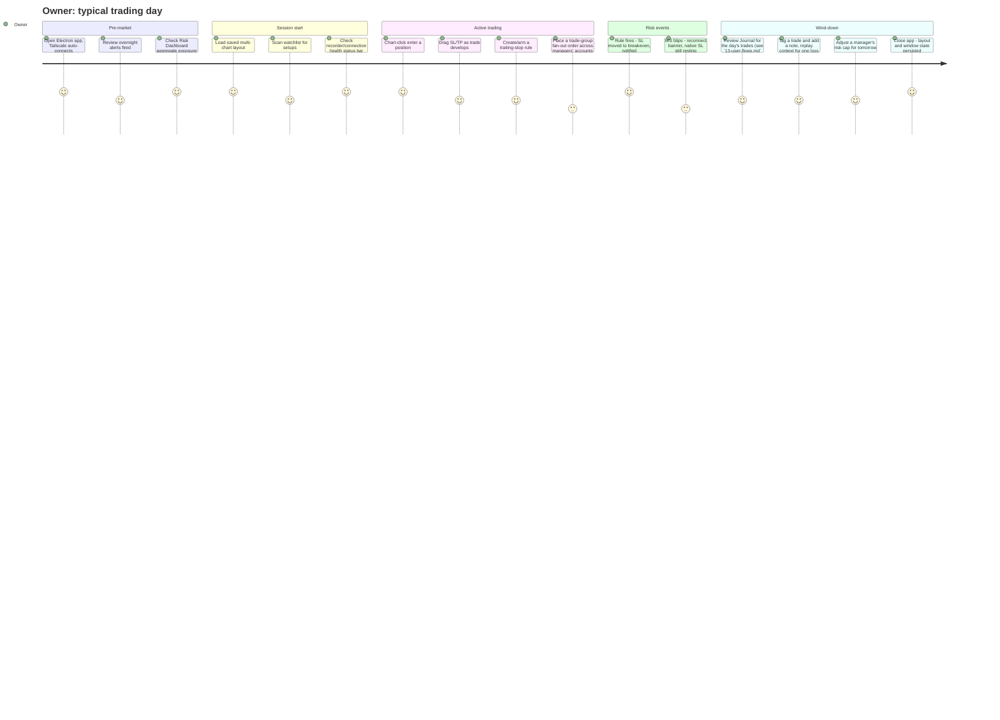
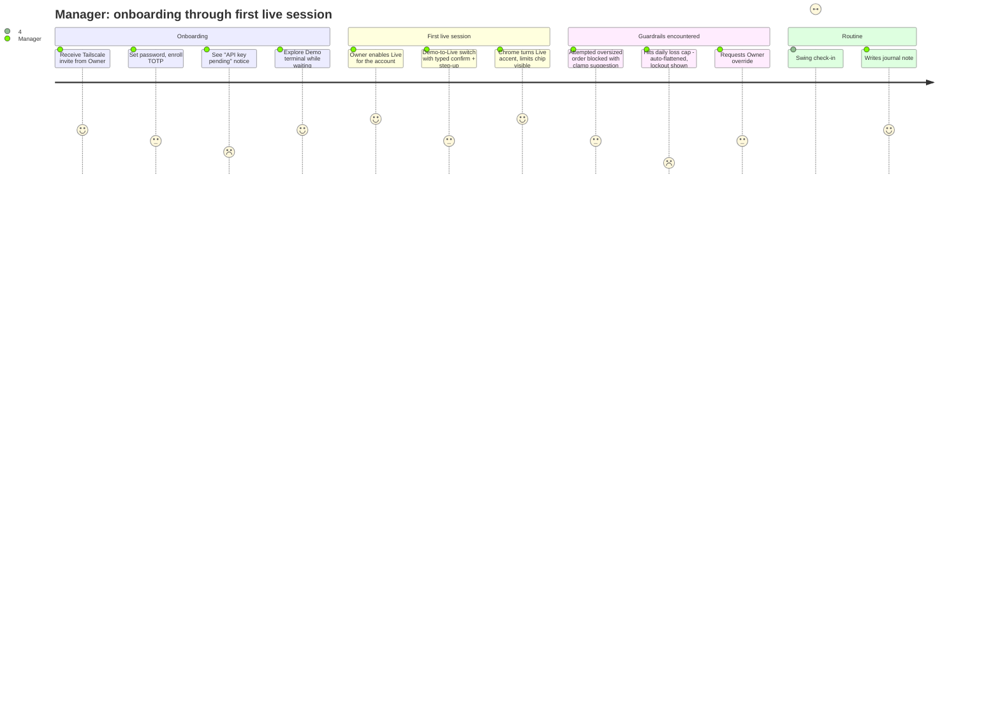
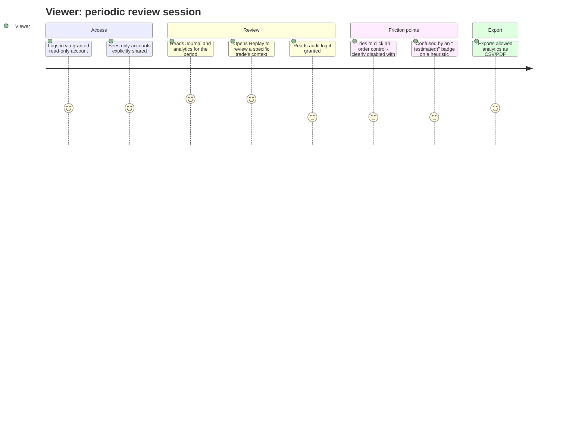
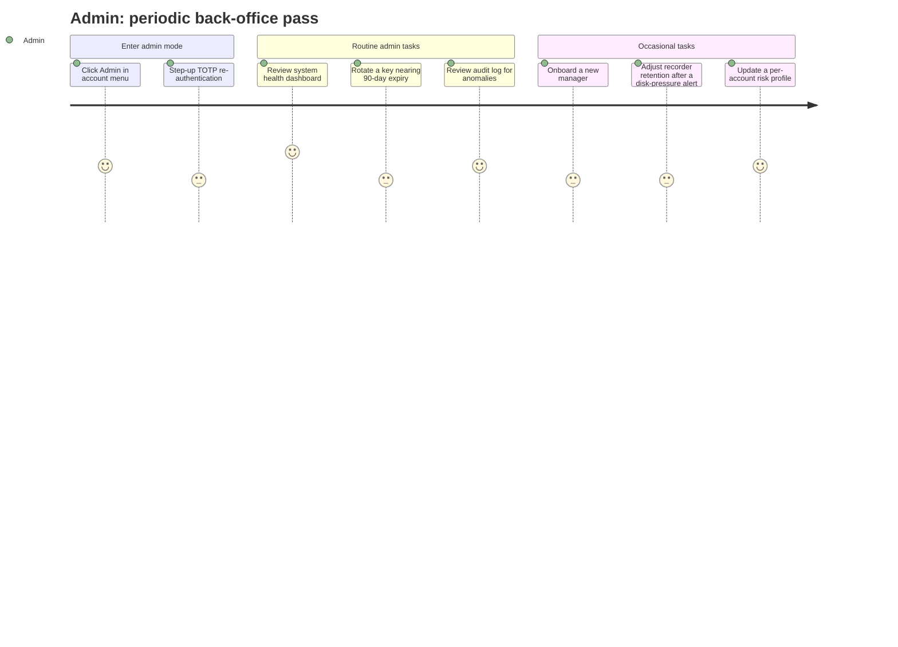
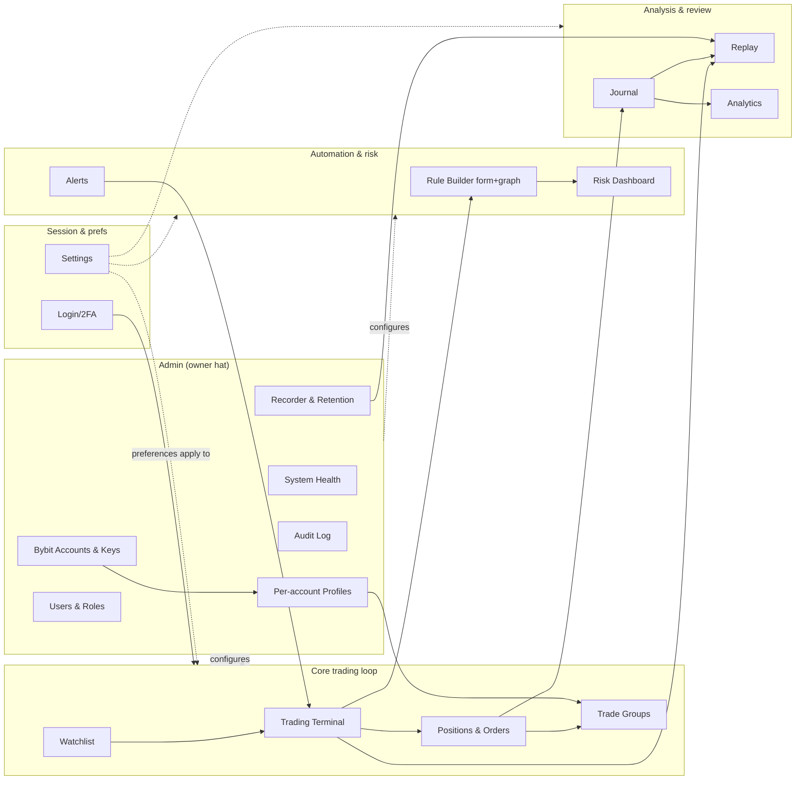
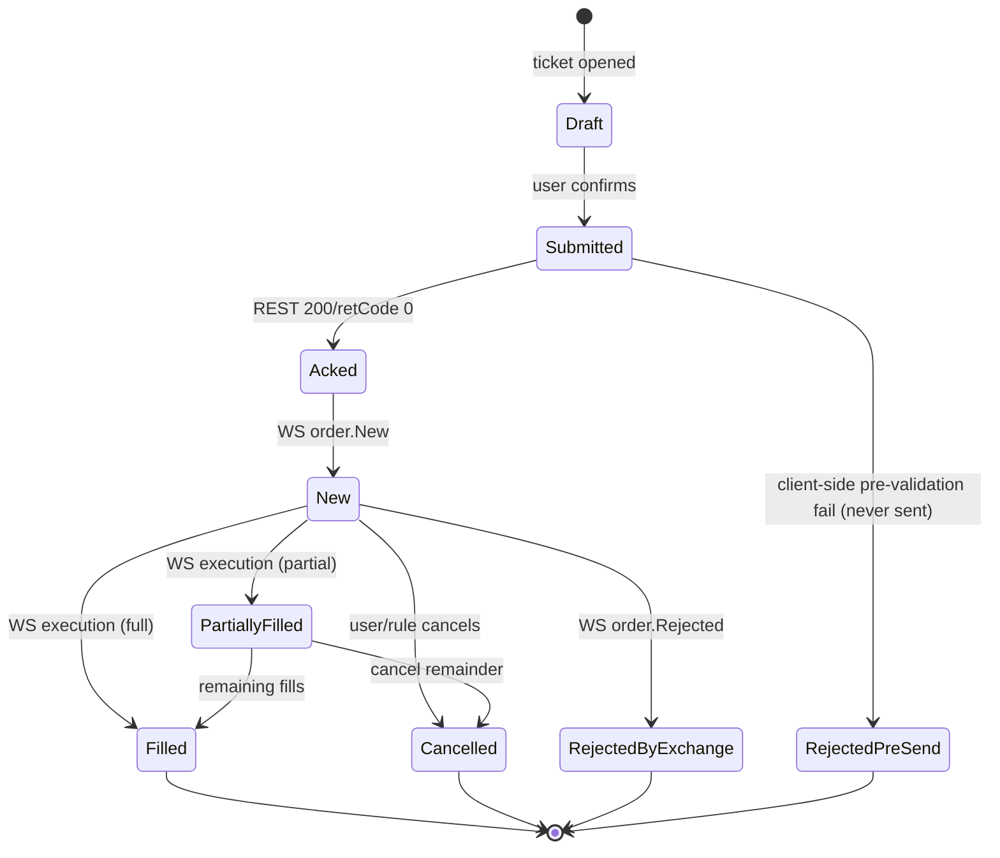
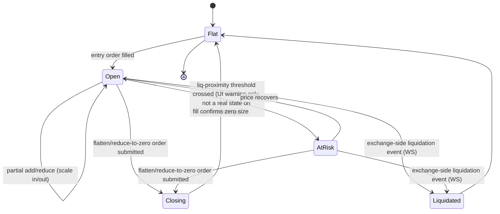
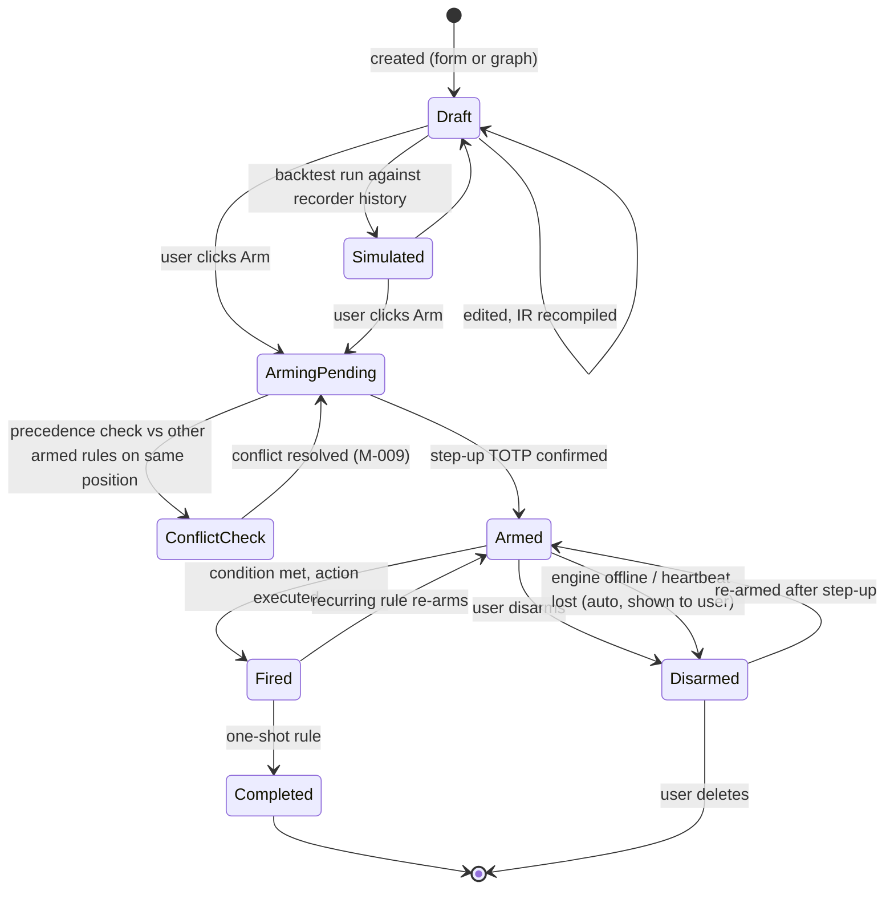
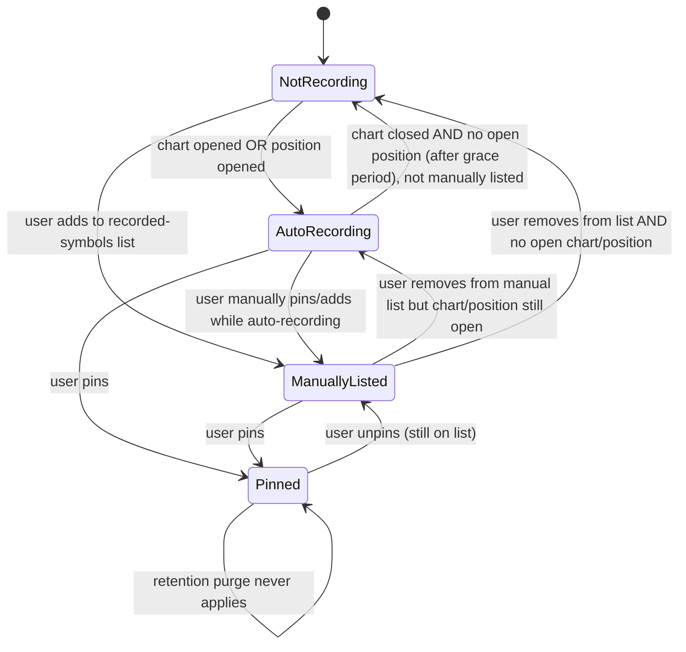
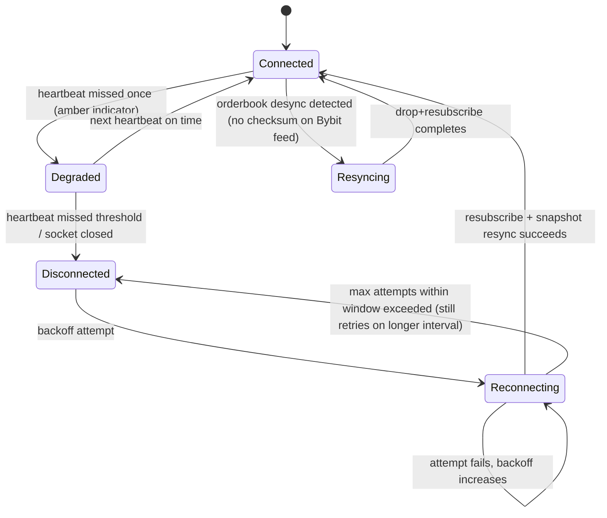

# 17 — UX Diagrams (CandleViewer)

Date: 2026-09-14 · Owner: basiltt · Status: **Baseline for design & backlog**

Complements `12-sitemap.md` (IA/routes) and `13-user-flows.md` (task flows). This document covers: customer journey maps per persona, a service blueprint, an information-architecture overview diagram, state diagrams for the core entities, an empty/loading/error state matrix, a notification taxonomy, and the hotkey map.

---

## 1. Customer journey maps per persona

### 1.1 P1 Owner — daily discretionary trading session



### 1.2 P2 Account Manager — assigned sub-account trading



### 1.3 P3 Viewer / analyst — read-only review



### 1.4 P4 Admin-hat (Owner) — administrative session



---

## 2. Service blueprint (frontstage / backstage / systems)

```mermaid
flowchart TB
  subgraph FS["Frontstage (what the user sees)"]
    F1[Chart + footprint + DOM + ticket]
    F2[Order confirmation toast]
    F3[Position/PnL updates]
    F4[Rule-fired notification]
    F5[Environment badge Demo/Live]
    F6[Connection-health indicator]
  end
  subgraph BS["Backstage (frontend/backend logic, invisible to user)"]
    B1[React state + WebGL render loop]
    B2[Frontend WS client - subscribe/reconnect/resubscribe]
    B3[Backend OMS - order routing, fan-out, algo emulation]
    B4[Rule engine - continuous evaluation loop]
    B5[Recorder - tick/L2/bar capture pipeline]
    B6[RBAC/audit middleware on every request]
  end
  subgraph SYS["Systems of record (external/internal)"]
    S1[Bybit REST/WS - market data, order entry, account]
    S2[QuestDB - hot tick/L2/bar storage]
    S3[Postgres - users, accounts, keys, profiles, rules, OMS state, audit]
    S4[Parquet/DuckDB - cold/replay/analytics]
    S5[Tailscale network layer]
  end

  F1 <-->|render/interact| B1
  B1 <-->|snapshot+delta| B2
  B2 <-->|subscribe topics| S1
  F2 -->|submit| B3
  B3 -->|REST order calls| S1
  B3 -->|persist OMS state| S3
  B3 -->|native SL attach mandatory| S1
  F4 <--|fire event| B4
  B4 -->|reads derived series| B5
  B4 -->|executes actions via| B3
  B5 -->|writes hot| S2
  B5 -->|archives cold| S4
  F3 <--|WS push| B2
  F5 <--|session/account context| B6
  F6 <--|heartbeat/ping status| B2
  B6 -->|every request authorized + audited| S3
  S5 -.->|transport for all client<->backend traffic| B2
  S5 -.-> B3
```

**Line of visibility:** everything above the frontstage boundary is what any persona directly perceives; the RBAC/audit middleware (B6) is deliberately invisible in normal operation but its **denials** surface as visible 403/disabled-control states — this is the "structural, not cosmetic" enforcement principle from `10-personas.md` §4.

---

## 3. Information architecture diagram (screen-cluster view)

This complements the route tree in `12-sitemap.md` §3 with a task-oriented clustering view (not a literal route hierarchy).



---

## 4. State diagrams

### 4.1 Order lifecycle



### 4.2 Position lifecycle



### 4.3 Rule lifecycle



### 4.4 Recording lifecycle (per symbol)



### 4.5 Connection state (WS)



---

## 5. Empty / loading / error state matrix

Coverage note: every screen in `14-screens-catalogue.md` (SCR-001..SCR-159) has an explicit empty/loading/error entry below. Screens that share an identical pattern (e.g. every settings sub-page, every admin list screen) are grouped into one row that names all covered SCR-IDs explicitly — this is a documented equivalence, not an omission. No SCR-ID is absent from every row.

| Screen/panel (SCR-IDs) | Empty state | Loading state | Error state |
|---|---|---|---|
| Login / 2FA / enrollment (SCR-001..006) | n/a (form always rendered) | Button spinner on submit, form disabled | "Incorrect username or password" / "Invalid code, try again" inline, never reveals which field was wrong; account-lock banner after N attempts |
| App shell chrome, nav rail, command palette, hotkey overlay, notification centre, toast host (SCR-010..015) | Notification centre: "No notifications" with muted illustration | Rail/topbar render synchronously (no async data); notification centre shows skeleton rows on first open | Global toast host itself never errors; a failed toast dispatch is logged, not surfaced (never a broken toast) |
| Onboarding wizard, guided tour, setup checklist (SCR-016..019) | Setup checklist: "All steps complete" collapses the card | Step transition spinner (e.g. Tailscale reachability check) | Per-step inline error (e.g. TOTP code invalid) — see flow §1 |
| Workspace/dock/layout screens (SCR-020..029) | "No layout yet — start from a preset or blank canvas" CTA to gallery (SCR-022) | Skeleton dock frame while restoring persisted layout | "Layout failed to restore — reverted to last-known-good" with a "recover" link to the conflict dialog (SCR-029) |
| Terminal — chart panel (SCR-030) | "No symbol selected — search or pick from watchlist" with search CTA | Skeleton candles + shimmer, WS "connecting…" label | "Failed to load kline data — retry" button; stale-data watermark if partial (see SCR-048) |
| Chart settings/indicator/drawing dialogs (SCR-031..037) | Indicator library: "No custom indicators saved" | Dialog-local spinner while indicator preset list loads | "Indicator failed to compute — check parameters" inline per-indicator, chart itself keeps rendering price |
| Footprint/Profile panes (SCR-038, SCR-039) | "No recorded history before <timestamp> for this symbol — start recording to build history" (never a blank/broken render) | Skeleton bars, "(estimated)" badge dimmed until data present | "Recorder not running for this symbol" with link to enable (R-340) |
| Chart utility screens: quick-switcher, interval menu, go-to-date, data-table a11y view, diagnostics overlay, empty/error states themselves (SCR-041..048) | "No date entered" (go-to-date) | n/a (menus are synchronous) | SCR-047/048 are themselves the canonical chart empty/error states referenced by every row above that says "see SCR-047/048" |
| Multi-chart grid (SCR-049) | "Add a chart to this grid cell" per empty cell | Per-cell independent skeleton (one slow symbol never blocks the grid) | Per-cell independent error, isolated to that cell |
| DOM Heatmap + Ladder panel and its settings (SCR-050, SCR-051) | "No book data — symbol not subscribed" | Depth-cell shimmer at low opacity | "Orderbook desync detected — resyncing…" transient overlay; "Book data stale >2s — do not trust displayed depth" hard warning if resync fails |
| CVD/delta, tape, OI/funding/liquidations, speed-of-tape, imbalance, regime, detector panels (SCR-052..059) | "No recorded trades yet for this session" | Skeleton sparkline/tape rows | "(estimated)" badge with methodology link (SCR-058) whenever a detector's confidence is heuristic, not exact; "Feed unavailable" if the underlying WS channel is down |
| Order ticket, trade-group ticket/manager (SCR-060..062) | Ticket always rendered (has defaults); trade-group manager: "No trade groups yet — create one" CTA | Submit-button spinner; margin/fee estimate shows shimmer while `fee-rate`/`instruments-info` load | "Insufficient margin for this size" inline computed suggestion; per-leg fan-out failure rows (flow §5) |
| Positions & orders grid, SL/TP editor (SCR-063, SCR-064) | "No open positions — place your first order" CTA to Terminal | Row skeletons | "Could not reconcile with exchange — showing last-known state as of <time>" |
| Scaled/TWAP/iceberg/chase/OCO builders, algo monitor (SCR-065..070) | Algo monitor: "No active algos" | Builder-local validation spinner (e.g. checking slice count against lot size) | Algo monitor surfaces PENDING/ARMED/PARTIAL/FAILED per the algo state machine (§4); OCO double-fill surfaces M-028 (flow §9) |
| Risk dashboard, kill-switch/freeze modal, lockout notice (SCR-071..073) | "No accounts to display — add a Bybit account" (Owner) / "No account assigned" (Manager) | Gauge/number skeletons | "Wallet reconciliation stale — last updated <time>" |
| Environment switcher, demo/live banner, order confirmation, rejection detail, fills, account detail (SCR-074..079) | Fills/executions: "No fills yet on this order" | Confirmation modal spinner while awaiting REST ack | Rejection detail shows raw Bybit error code+message verbatim (flow §19.1) |
| Rules list, form/graph editors, templates, simulation, arming, conflict resolver, history, IR inspector, import/export (SCR-080..089) | Rules list: "No rules yet — create your first rule" CTA, links to template gallery (SCR-083) | Simulation/backtest panel (SCR-084): progress bar while replaying recorder history | "Rule IR failed to compile — see validation errors" inline per-node/per-field, shown identically in both form (SCR-081) and graph (SCR-082) editors since both bind to the same IR |
| Alerts centre, editor, triggered toast (SCR-090..092) | "No alerts configured — create one" | Skeleton list | "Alert delivery failed (push/email) — retried N times" badge on the alert row |
| Journal list, trade detail, analytics, tag manager (SCR-093..096) | "No trades recorded yet"; analytics: "Not enough closed trades for this view yet" | Skeleton table / skeleton chart tiles | "Export failed — retry" toast (M-025) |
| Replay page, session setup modal, paper-trading results (SCR-097..099) | "Select a symbol and range to begin" | Progress bar while loading tick/L2 range from Parquet/DuckDB | "Requested range partially unavailable — showing available sub-range" (see flow §15) |
| Watchlist panel/manager, symbol search, symbol info, scanner (SCR-100..104) | "No symbols on this watchlist — add one" | Skeleton rows | "Symbol not found on Bybit USDT perps" inline in search |
| Settings hub and all sub-pages: profile, security, hotkeys, trading defaults, notifications, appearance, accessibility, data/performance, help (SCR-110..119) | n/a (forms show current values or built-in defaults) | Save-button spinner per section | "Failed to save — retry" inline per section; hotkey editor shows "Conflicts with <action> — choose a different key" |
| Admin home, users list/detail/invite, view-as (SCR-120..124) | Users list: "No managers/viewers yet — invite one" CTA | Skeleton cards/rows | Invite failure: "Could not send invite — check Tailscale reachability for the invited device" |
| Admin accounts list, add/edit account, key rotation, key health, disable/delete confirm (SCR-125..129) | "No Bybit accounts linked — add your first account" | Skeleton cards | Verification failure states per flow §2 (hard-stop, amber warnings); rotation failure shows old key remains active until new key verified |
| Admin per-account profiles, templates, symbol permissions, global risk policy (SCR-130..134) | "No profiles yet — create one from a template" | Skeleton rows | "Profile references a symbol not permitted for this account — resolve before saving" |
| Admin audit log, event detail, security centre (SCR-135..137) | "No audit events in range" | Skeleton rows | "Audit log query timed out — narrow the date range" |
| Admin recorder/storage, retention editor, storage/DB panel (SCR-140..142) | "No symbols recorded" | Disk-usage bar shimmer | "Disk usage critical — auto-stop imminent" (see flow §19.5) |
| Admin system health, incident log, feature flags, backups, connectivity/rate limits, maintenance mode, re-auth gate (SCR-143..149) | n/a (health always shows current state) | Metric-tile shimmer on first load | Per-subsystem red tile with last-error message, not a generic "unhealthy"; feature flags: "Flag change requires step-up" if session expired |
| Global system states: boot, empty-state pattern, disconnected/reconnecting, degraded, 403, 404, error boundary, version mismatch, rate-limited, offline (SCR-150..159) | SCR-151 is itself the canonical empty-state pattern referenced by every row above | Splash/logo on cold start (Electron), SCR-150 | Full-screen `/offline` (SCR-159, backend unreachable) vs banner-only WS disconnect (SCR-152, `13-user-flows.md` §16) — deliberately different severities; SCR-156 error boundary catches any otherwise-unhandled render crash and offers "reload"/"report" |

**Design rule:** every empty state includes a specific, actionable next step (never a bare "No data"); every error state names the failure (never a generic "Something went wrong") and states whether the underlying data/position is still protected (native SL) when relevant.

---

## 6. Notification taxonomy

| Category | Examples | Default channel | Severity | Can be muted? |
|---|---|---|---|---|
| **Order/execution** | Order filled, partially filled, rejected | In-app toast | Info/Warning | Yes (per-symbol) |
| **Position risk** | Liq-proximity warning, daily loss lockout, FREEZE applied | In-app toast + OS notification | Warning/Critical | No (safety-critical) |
| **Rule engine** | Rule fired, rule engine offline, conflict detected | In-app toast + Notifications centre entry | Info/Critical (offline = critical) | Partial (fired = yes, offline = no) |
| **Connection/system** | WS disconnected, reconnected, orderbook resync, backend unreachable | Banner (persistent while active) + OS notification if >10s | Warning/Critical | No |
| **Account/admin** | Key nearing expiry, key rotation completed, new manager onboarded, disk pressure | In-app + email (admin-configured) | Info/Warning | Yes (per-type, admin only) |
| **Alerts (user-defined)** | Price cross, indicator threshold, CVD divergence | In-app toast, opt-in push/email | Info | Yes |
| **Audit/security** | Failed login attempts, step-up re-auth required, withdrawal-scope key rejected | In-app (admin) + email | Warning/Critical | No |
| **Trade group** | Fan-out partial failure, leg retried | In-app toast + Trade Group screen badge | Warning | Yes (per-group) |
| **Emulated algo reconciliation** | OCO double-fill race detected (M-028) | In-app modal (auto-shown, blocking) + OS notification + Notifications centre entry | Critical | No |
| **Recording** | Recording started/stopped, retention purge occurred | In-app (admin), silent for others | Info | Yes (admin) |

**Delivery mechanics:**
- In-app toast: auto-dismiss after 5s (info) or persists until dismissed (warning/critical); always duplicated into the Notifications centre (M-011) so nothing is lost if missed.
- OS-native notification (Electron `Notification` API): used only for Warning/Critical categories marked "No" mute, and only fires when the window is unfocused or minimized (avoids double-alerting an actively-watching user).
- Push/email: configured per-channel in `/settings/notifications` (R-204); requires an external delivery mechanism (not a Bybit feature) — out of scope for exact provider selection here (see `11-backend-tech.digest.md`/architecture docs).
- Every notification that corresponds to a state-machine transition (§4) links directly to the relevant screen/drawer (e.g., a rule-fired toast deep-links to `/rules/:ruleId/history`).

---

## 7. Hotkey map

Single global hotkey layer spans all views (cross-cutting requirement from `23-views-and-screens.digest.md`), configurable per-user at `/settings/hotkeys` (R-202). Defaults below; conflicts within a user's custom map are validated and rejected at save time.

| Key(s) | Action | Scope |
|---|---|---|
| `Ctrl+1..9` | Jump to left-nav item / layout preset | Global |
| `Ctrl+K` or `/` | Open symbol search / omnibox (M-010) | Global |
| `Ctrl+Enter` | Submit order ticket | Order ticket focused |
| `Esc` | Cancel current ticket / close top-most drawer / cancel-all confirmation prompt | Context-dependent |
| `B` | Buy market (armed 1-click) or open ticket pre-filled Buy | Terminal/DOM focused |
| `S` | Sell market (armed 1-click) or open ticket pre-filled Sell | Terminal/DOM focused |
| `1..5` | Quantity presets | Order ticket / DOM focused |
| `Ctrl+Click` (chart/DOM) | Market order at clicked price | Chart/DOM |
| `Shift+Click` (chart) | Limit order at clicked price | Chart |
| `Arrow Up/Down` (on SL/TP handle) | Nudge price by one tick | Chart, handle focused |
| `Enter` (on SL/TP handle) | Confirm nudged price | Chart, handle focused |
| `+` / `-` | Zoom DOM ladder price granularity | DOM focused |
| `Space` | Play/pause replay | Replay active |
| `Left/Right` | Step one bar (replay) | Replay active |
| `Shift+Left/Right` | Step one tick (replay) | Replay active |
| `R` | Jump replay to real-time (exits replay) | Replay active |
| `Ctrl+Shift+F` | Global flatten-all (with confirm modal M-006) | Global |
| `Ctrl+Shift+K` | Kill switch (Owner only, with confirm modal M-018) | Global |
| `Ctrl+Shift+L` | Toggle Demo/Live switch flow (opens M-005, never switches without confirm) | Global |
| `Ctrl+/` | Open hotkey cheat-sheet overlay | Global |
| `Tab` / `Shift+Tab` | Standard focus order through all interactive controls, including chart/DOM/graph-editor canvases | Global (a11y requirement) |
| `Ctrl+Shift+A` | Open Alerts quick-create (M-022) | Global |
| `Ctrl+Shift+N` | Open Notifications centre (M-011) | Global |
| `Ctrl+Shift+O` | Pop out focused pane to its own Electron window (`12-sitemap.md` §6.2) / when already popped out, focuses it back into the primary window | Terminal pane focused |

**Accessibility note:** every mouse-only interaction described in `13-user-flows.md` (chart click-to-order, DOM click, SL/TP drag, node-graph wiring) has a documented keyboard equivalent above or in the corresponding screen's entry in `14-screens-catalogue.md`; this satisfies WCAG 2.2 AA operability (`05-accessibility-standard.md`) and the T9 requirement in `10-personas.md`.

---

## 8. Traceability

- Personas: `10-personas.md`.
- Routes/modals referenced: `12-sitemap.md`.
- Flows referenced: `13-user-flows.md`.
- Screen-level state/hotkey/a11y detail: `14-screens-catalogue.md`.
- Rule IR and OMS state machine formal schemas: `24-internal-schemas.md`.
