# 20 — Architecture (C4 L1–L3, deployment, failure modes, ADR index)

Status: **Baseline, approved for build planning.** Date 2026-09-14. Owner: basiltt. Architect-owned document.
Scope guard: **web app only** (React + custom WebGL chart engine + Electron shell), owner/admin screens live **inside** the web app behind RBAC, **no Android**, **no separate admin app**, **Bybit USDT linear perpetuals only** in v1.
Inputs: `docs/plan/00-planning-brief.md`, `docs/research/24-owner-decisions.md`, research digests 04, 05, 06, 08, 09, 10, 11, 12, 23 and `docs/research/22-architecture-options.md`.
Downstream: `21-database-schema.md`, `22-api-openapi.yaml`, `23-ws-protocol.md`, `24-internal-schemas.md`, `26-chart-engine-design.md`, `27-adrs/`.

---

## 0. Architectural principles (binding)

| #   | Principle                                                                                                                                                                         | Consequence                                                                                                                                                                                         |
| --- | --------------------------------------------------------------------------------------------------------------------------------------------------------------------------------- | --------------------------------------------------------------------------------------------------------------------------------------------------------------------------------------------------- |
| P1  | **Client-agnostic backend contract.** The REST + WS protocol never encodes "web" assumptions.                                                                                     | A mobile client can be added later without backend rework (planning-brief §Locked decisions). No Android artefacts are produced now.                                                                |
| P2  | **One ingestion code path for live and replay.** Replay injects recorded events into the _same_ normalizer → book → bars → order-flow chain.                                      | No dual logic drift; replay correctness is a property of the live pipeline.                                                                                                                         |
| P3  | **Exchange behind an adapter port.** All Bybit specifics live in `services/api/candleviewer/exchange/bybit/`.                                                                     | Second exchange = new adapter, no core changes (§9).                                                                                                                                                |
| P4  | **Every fan-out order carries a native exchange-side stop-loss.**                                                                                                                 | Emulated stops (rule engine, OCO, trailing) are an _enhancement layer_ over an exchange-resident floor; process death never leaves a naked position (owner decision, cross-cutting consequence #3). |
| P5  | **Snapshot + delta everywhere, resync on doubt.** Bybit→backend and backend→client both use snapshot-then-delta with sequence numbers; any gap = drop state and re-snapshot.      | No checksum dependency; deterministic recovery.                                                                                                                                                     |
| P6  | **Backpressure is coalescing, never unbounded buffering.** Slow consumers get conflated state or a forced re-snapshot, never a growing queue.                                     | Bounded memory under any client/network pathology.                                                                                                                                                  |
| P7  | **Modular monolith, bus-mediated.** Modules communicate only through the internal event bus or explicit service interfaces — never by reaching into each other's state.           | A later process split (Redis/NATS) is a moderate rework, not a rewrite.                                                                                                                             |
| P8  | **Server-side authority for RBAC, risk and scoping.** The frontend is never trusted for account scope, risk caps or environment.                                                  | Manager isolation and kill-switch cannot be bypassed by a modified client.                                                                                                                          |
| P9  | **Environments are structural, not cosmetic.** `demo` / `live` / `testnet` select different hosts, key sets, storage namespaces _and_ code paths (demo has no WS order entry).    | No accidental cross-environment execution.                                                                                                                                                          |
| P10 | **Estimated is labelled.** Bybit has no L3/MBO feed; iceberg, stop-run, order-count metrics are heuristics and are transported with an `estimated: true` flag consumed by the UI. | Honest UI, per digest 23.                                                                                                                                                                           |
| P11 | **Local-first, Tailscale-only.** Nothing binds to a public interface.                                                                                                             | No public attack surface; pen-test scope bounded.                                                                                                                                                   |
| P12 | **Recording is opt-in and bounded.** Recorded-symbol list is empty by default; auto-record on open chart/position; 30-day default retention with pin-to-keep.                     | Disk growth is predictable and user-visible.                                                                                                                                                        |

---

## 1. C4 Level 1 — System context

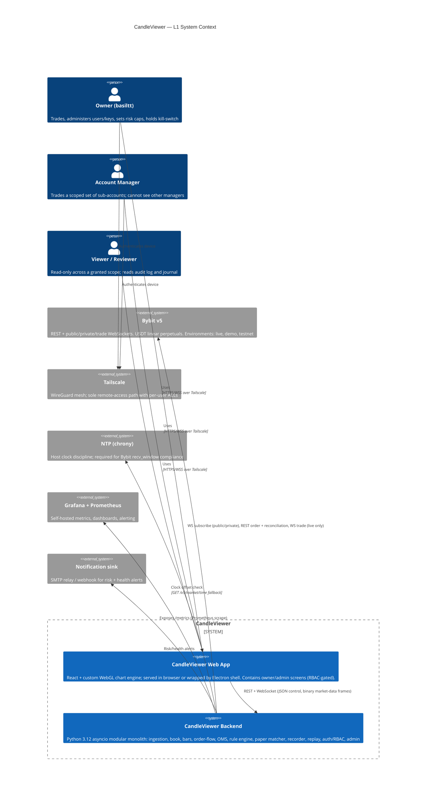

### 1.1 External dependencies and the contract we rely on

| External system              | What we depend on                                                                                                           | Failure impact                            | Mitigation (§11)                                                                            |
| ---------------------------- | --------------------------------------------------------------------------------------------------------------------------- | ----------------------------------------- | ------------------------------------------------------------------------------------------- |
| Bybit public WS              | `orderbook.{1,50,200,500}.{sym}`, `publicTrade.{sym}`, `tickers.{sym}`, `kline.{iv}.{sym}`, `allLiquidation.{sym}`          | All order-flow views degrade to stale     | Auto reconnect + resubscribe ≤10 topics/req, snapshot resync, staleness badge               |
| Bybit private WS             | `order`, `execution.fast`, `position`, `wallet` on `/v5/private` (live) and `stream-demo` (demo)                            | OMS state goes stale; fills unknown       | REST reconciliation loop, heartbeat watchdog, native SL is the safety floor                 |
| Bybit REST                   | order CRUD, `trading-stop`, `instruments-info`, `kline`, `position/list`, `order/realtime`, `execution/list`, `market/time` | No order entry, no reconciliation         | Per-UID token bucket off `X-Bapi-Limit-Status`, retry with jitter, idempotent `orderLinkId` |
| Bybit WS trade (`/v5/trade`) | Low-latency order entry — **live only**                                                                                     | Falls back to REST                        | OMS adapter selects transport per environment (P9)                                          |
| Tailscale                    | Sole ingress for managers                                                                                                   | No remote access (local still works)      | Owner can operate locally; documented break-glass in `04-security-program.md`               |
| NTP                          | `timestamp` inside `recv_window` (default 5000 ms)                                                                          | Bybit error 10002 on every signed request | chrony mandatory; `GET /v5/market/time` offset fallback; distinct 10002 alert               |

### 1.2 Known-limit ledger (drives sizing everywhere below)

- ≤10 topics per WS subscribe request; ≤~21,000 chars of serialized args per request.
- ≤500 new WS connections / 5 min / IP; ~1000 concurrent connections / IP per category.
- REST order endpoints ~10 req/s default non-VIP UTA; public REST ~600 req/5 s per IP (unconfirmed — treat as a ceiling, verify in Spike S7).
- WS ping interval ~20 s; `recv_window` default 5000 ms; error 10002 = clock drift.
- Orderbook cadence, linear: depth 1 @10 ms, 50 @20 ms, 200 @100 ms, 500 @100 ms.
- Demo: REST-only order entry, 7-day order retention, non-upgradable rate limits, separate keys.
- Sub-account cap 5 (20 with Business KYC) — bounds the number of live managers; surfaced in Admin UI.
- Storage: ~7 GB/day raw, ~1–1.5 GB/day compressed for 2 symbols @200 depth (estimate; recorder instrumentation replaces it in Sprint 02).

---

## 2. C4 Level 2 — Containers

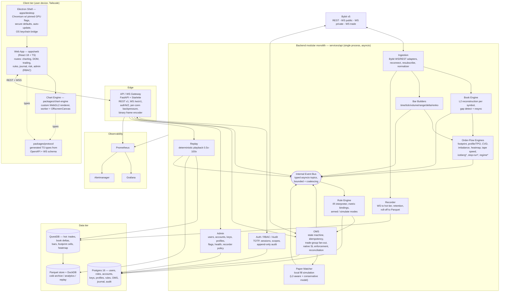

`*` = heuristic/estimated engines (principle P10).

### 2.1 Container register

| #   | Container                           | Tech                                                                                                                                              | Responsibility                                                                                                                                                                                | Interfaces in                                         | Interfaces out                            | Scaling / state                                            |
| --- | ----------------------------------- | ------------------------------------------------------------------------------------------------------------------------------------------------- | --------------------------------------------------------------------------------------------------------------------------------------------------------------------------------------------- | ----------------------------------------------------- | ----------------------------------------- | ---------------------------------------------------------- |
| C1  | Web App                             | React 18, TS 5.x, Vite, Zustand (UI state) + Jotai (per-symbol high-frequency atoms), TanStack Query (REST), Dockview (layouts), Radix + Tailwind | All user-facing screens incl. RBAC-gated admin                                                                                                                                                | User input                                            | REST `/api/v1`, WS `/ws/v1`               | Stateless; per-user workspace persisted server-side        |
| C2  | Chart Engine                        | TypeScript + WebGL2, Worker + OffscreenCanvas                                                                                                     | Candles, footprint, profiles, heatmap, overlays, drawings; hit-testing; gestures                                                                                                              | Typed data feeds from web app                         | Canvas pixels, interaction events         | Per chart instance; memory-budgeted (doc 26)               |
| C3  | Electron Shell                      | Electron (pinned Chromium), `contextIsolation: true`, `nodeIntegration: false`, strict CSP                                                        | Desktop packaging, GPU flags, window/workspace persistence, OS-keychain bridge for the KEK, auto-update                                                                                       | IPC from renderer (allow-list preload)                | Local FS, OS keychain, updater            | One process tree per user machine                          |
| C4  | API/WS Gateway                      | FastAPI + Starlette + uvicorn (uvloop), `websockets`                                                                                              | AuthN/Z, validation, subscription management, snapshot+delta fan-out, per-connection backpressure, binary encoding, rate limiting                                                             | HTTP/WS from C1                                       | Bus subscribe, module calls               | Single process v1; splittable per P7                       |
| C5  | Ingestion                           | asyncio, custom Bybit WS client (`websockets`) + `httpx` REST                                                                                     | Connect/auth/subscribe/resubscribe, heartbeat, normalize Bybit into internal events                                                                                                           | Bybit WS/REST                                         | Bus publish, recorder, book, bars         | One task-set per (env, symbol-group, channel)              |
| C6  | Book Engine                         | Pure Python + `numpy` sorted arrays                                                                                                               | L2 reconstruction, sequence-gap detection, resync, top-N snapshots, depth aggregation                                                                                                         | Normalized book events                                | `BookSnapshot` / `BookDelta` on bus       | In-memory per (env, symbol); rebuildable                   |
| C7  | Bar Builders                        | Pure Python                                                                                                                                       | Deterministic bar formation across 6 bar types; partial-bar emission                                                                                                                          | Trade + ticker events                                 | `BarOpen` / `BarUpdate` / `BarClose`      | In-memory ring + QuestDB persistence                       |
| C8  | Order-Flow Engines                  | Python + `numpy`                                                                                                                                  | Footprint cells, volume/delta profile + TPO, CVD, imbalance stacks, heatmap columns, big trades, tape speed, iceberg/stop-run/regime heuristics                                               | Bars + book + trades                                  | Derived events on bus; QuestDB writes     | Per (env, symbol, bar-spec)                                |
| C9  | OMS                                 | Python, Postgres-backed                                                                                                                           | Order lifecycle state machine, `orderLinkId` idempotency, trade-group fan-out, per-account profile application, native SL enforcement, emulated OCO/iceberg/TWAP/chase/scaled, reconciliation | REST/WS commands, private-stream events, rule actions | Bybit REST / WS trade, Postgres, bus      | Authoritative state in Postgres; in-memory cache           |
| C10 | Rule Engine                         | Python interpreter over rule IR                                                                                                                   | Evaluate compiled rules against metric bindings; emit actions; simulate mode; per-rule audit                                                                                                  | Bus events, metric registry                           | OMS commands, notifications, journal tags | Rules in Postgres; evaluation state in memory + checkpoint |
| C11 | Paper Matcher                       | Python                                                                                                                                            | Local fill simulation for `paper` accounts using live/recorded L2 plus a conservative model                                                                                                   | Orders from OMS (paper accounts), book/trade events   | Simulated executions to OMS               | Per paper account, in-memory + Postgres                    |
| C12 | Recorder                            | Python + QuestDB ILP                                                                                                                              | Persist raw + derived streams for recorded symbols; retention, pinning, roll-off to Parquet, disk-budget reporting                                                                            | Bus raw events                                        | QuestDB, Parquet                          | Per recorded symbol                                        |
| C13 | Replay                              | Python + DuckDB/QuestDB readers                                                                                                                   | Deterministic session playback 0.5x-100x, scrub, step, bookmark; feeds the live pipeline (P2)                                                                                                 | Stored ticks/book/liquidations                        | Bus (replay-scoped topics)                | One session per user                                       |
| C14 | Auth/RBAC/Audit                     | FastAPI dependencies + Postgres                                                                                                                   | Password + TOTP, sessions, role/scope resolution, append-only audit log                                                                                                                       | Gateway                                               | Postgres                                  | Stateless resolvers                                        |
| C15 | Admin                               | FastAPI routers + services                                                                                                                        | Users/roles, Bybit accounts + keys (envelope encrypted), per-account profiles, feature flags, recorder policy, system health                                                                  | Gateway (Owner role)                                  | Postgres, key vault, module control APIs  | —                                                          |
| C16 | QuestDB                             | QuestDB 8.x, ILP ingest + PGWire query                                                                                                            | Hot tier: ticks, book deltas, bars, footprint cells, heatmap columns                                                                                                                          | Recorder, engines                                     | Replay, analytics, Parquet roll-off       | Single node, volume-backed                                 |
| C17 | Postgres                            | Postgres 16                                                                                                                                       | Relational source of truth                                                                                                                                                                    | All modules                                           | —                                         | Single node, PITR backups                                  |
| C18 | Parquet + DuckDB                    | Local FS / object store + embedded DuckDB                                                                                                         | Cold archive, analytics, long replay                                                                                                                                                          | Roll-off job                                          | Replay, journal analytics                 | Date/symbol partitioned                                    |
| C19 | Prometheus / Grafana / Alertmanager | Prometheus 2.x, Grafana 11                                                                                                                        | Metrics, dashboards, alerts                                                                                                                                                                   | `/metrics` scrape                                     | Alert sinks                               | Compose services                                           |

### 2.2 Trust boundaries

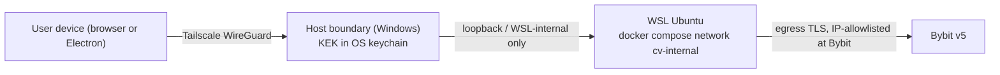

- **B1 device to host** — Tailscale identity + ACL, then app session cookie (`Secure`, `HttpOnly`, `SameSite=Strict`) plus TOTP at login.
- **B2 host to WSL** — services bind `127.0.0.1` / WSL-internal only; never `0.0.0.0` (WSL portproxy leak risk).
- **B3 WSL to Bybit** — outbound TLS only; API keys envelope-encrypted; KEK never resident in WSL; startup self-check refuses trading mode if any stored key has Withdrawal enabled or lacks an IP allowlist.
- **B4 renderer to Electron main** — context-isolated preload with an explicit IPC allow-list; no `nodeIntegration`; strict CSP; `window.open` denied.

---

## 3. C4 Level 3 — Components (backend modules)

> **Exchange-adapter boundary and trust semantics:** the decisions behind the `MarketDataPort`/
> `TradingPort` split, principle P3 and the order-book invalidate-and-resync rule are recorded in
> [`27-adrs/ADR-0023-exchange-adapter-boundary.md`](27-adrs/ADR-0023-exchange-adapter-boundary.md); the
> per-field trust semantics (measured/derived/estimated, confirmed/unconfirmed, fresh/stale/desynced,
> complete/gapped) a consumer must know before rendering market data are in
> [`25-market-data-trust-contract.md`](25-market-data-trust-contract.md).

> **Journal analytics tier (E41-K01):** `/journal/analytics` is computed from Postgres only; Parquet stays archive-only — [`27-adrs/ADR-0027-journal-analytics-query-tier.md`](27-adrs/ADR-0027-journal-analytics-query-tier.md).

> **Docs toolchain (E48-K01):** MkDocs Material + Redocly CLI + generated WS reference, proposed-with-deadline — [`27-adrs/ADR-0028-docs-toolchain.md`](27-adrs/ADR-0028-docs-toolchain.md).


Common conventions for every module below:

- **Module package**: `services/api/candleviewer/<module>/` with `__init__.py` exporting only the public interface, `service.py` (lifecycle), `models.py` (pydantic v2 domain types), `errors.py`, and internal implementation files.
- **Lifecycle contract**: every module implements `async def start(ctx: AppContext) -> None`, `async def stop(grace_s: float) -> None`, `def health() -> HealthReport`. The app supervisor (§6.2) starts modules in dependency order and stops them in reverse.
- **Bus contract**: publish through `Bus.publish(topic, event)`; subscribe through `Bus.subscribe(topic, queue_policy)`. Topics are strings of the form `{env}.{domain}.{symbol?}.{detail?}`.
- **Time**: all timestamps are integer microseconds since epoch, UTC, sourced from the exchange event time when available (`exch_ts`) plus a locally stamped `recv_ts`. Never use wall-clock for ordering.

### 3.1 Ingestion

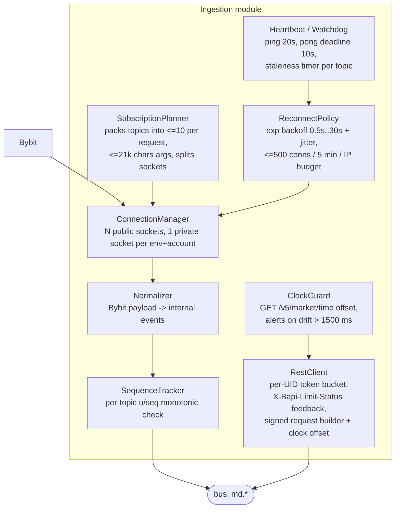

| Component             | Responsibility                                                                                                                                                 | Public interface                           | Notes                                                                           |
| --------------------- | -------------------------------------------------------------------------------------------------------------------------------------------------------------- | ------------------------------------------ | ------------------------------------------------------------------------------- |
| `ConnectionManager`   | Owns one asyncio task per socket; auth for private sockets; surfaces `ConnectionState`                                                                         | `async connect(env, kind)`, `state()`      | Public sockets are per `channel_type=linear`; private is one per (env, account) |
| `SubscriptionPlanner` | Computes minimal topic set from the union of client subscriptions + recorded symbols + open positions; packs into ≤10-topic batches                            | `plan(desired: set[Topic]) -> list[Batch]` | One upstream subscription per symbol/channel regardless of client count         |
| `Heartbeat/Watchdog`  | 20 s ping, 10 s pong deadline; per-topic staleness timers (book 2 s, trades 10 s, ticker 5 s)                                                                  | `on_pong()`, `staleness() -> dict`         | Staleness drives the UI "stale data" badge and Prometheus alerts                |
| `ReconnectPolicy`     | Exponential backoff 0.5 s → 30 s with full jitter; connection-rate budget guard                                                                                | `next_delay(attempt)`                      | Hard-caps new connections to stay under 500/5 min/IP                            |
| `Normalizer`          | Bybit → `TradeEvent`, `BookDeltaEvent`, `BookSnapshotEvent`, `TickerEvent`, `LiquidationEvent`, `OrderEvent`, `ExecutionEvent`, `PositionEvent`, `WalletEvent` | `normalize(raw) -> Iterable[DomainEvent]`  | The only place Bybit field names appear (P3)                                    |
| `SequenceTracker`     | Monotonic `u`/`seq` validation per topic; emits `SequenceGap`                                                                                                  | `check(topic, seq) -> Ok \| Gap`           | A gap triggers book resync, never silent patching                               |
| `RestClient`          | Signed REST with per-UID shared token bucket, retry/jitter, error classification (10002 clock, 10018 rate, 110xxx business)                                    | `async request(...)`                       | Rate budget is **per UID**, shared across all keys of that UID                  |
| `ClockGuard`          | Periodic server-time offset; blocks trading mode if drift > `recv_window/2`                                                                                    | `offset_ms()`, `assert_healthy()`          | Distinct alert `bybit_clock_drift_ms`                                           |

**Threading/asyncio model.** One event loop (uvloop). Each socket = one reader task + one bounded outbound-op queue. Normalization is synchronous CPU work executed inline (measured ≤15 µs/event for trades, ≤60 µs for a 200-level book delta); if the profiler shows the loop lag budget (§12) exceeded, book-delta application moves to a `ProcessPoolExecutor` shard keyed by symbol, and later to a Rust/PyO3 extension — the interface is already a pure function to make that swap mechanical.

**Backpressure.** Reader tasks never block: each publishes into a bounded `asyncio.Queue` (size 4096 per topic-class). If full: trades and executions are _never_ dropped (queue full = increment `ingest_queue_full_total` and await, applying real backpressure to the socket read loop, which is correct because Bybit will buffer briefly); book deltas may be dropped only by _invalidating the book and requesting a re-snapshot_ (never by skipping a delta).

### 3.2 Book Engine

| Component           | Responsibility                                                                                                                                                                                   | Interface                              |
| ------------------- | ------------------------------------------------------------------------------------------------------------------------------------------------------------------------------------------------ | -------------------------------------- |
| `BookState`         | Two price→size sorted arrays (bids desc, asks asc) per (env, symbol); O(log n) upsert/delete                                                                                                     | `apply(delta)`, `top(n)`, `snapshot()` |
| `Resyncer`          | On `SequenceGap`, marks book `DESYNCED`, unsubscribes/resubscribes the topic to force a fresh snapshot, buffers deltas until the snapshot lands, replays buffered deltas with seq > snapshot seq | `resync(symbol)`                       |
| `DepthAggregator`   | Produces level-aggregated views (raw, 1-tick, N-tick bucketed) for the ladder and heatmap                                                                                                        | `aggregate(bucket_ticks, depth)`       |
| `BookPublisher`     | Emits `BookSnapshot` at subscribe time and on resync; `BookDelta` thereafter; conflates to a max cadence of 100 ms for the heatmap topic and 50 ms for the ladder topic                          | `publish()`                            |
| `LiquidityTracker`  | Tracks per-price resting size over time (append-only ring per price bucket) feeding the heatmap and `distance_to_liquidity_cluster`                                                              | `series(price_bucket, window)`         |
| `IcebergHeuristic`* | Detects repeated refills at a price after aggressive consumption; emits `IcebergEstimate{confidence}`                                                                                            | `evaluate(price, window)`              |

States: `INIT → SNAPSHOT_PENDING → LIVE → DESYNCED → SNAPSHOT_PENDING`. `LIVE` is the only state from which derived engines consume. Book memory: 500 levels × 2 sides × 32 B ≈ 32 KB per symbol plus a 10-minute liquidity ring (≈ 12 MB per symbol at 100 ms cadence × 200 buckets) — bounded and evictable.

### 3.3 Bar Builders

| Component          | Responsibility                                                                                                             | Interface                |
| ------------------ | -------------------------------------------------------------------------------------------------------------------------- | ------------------------ |
| `BarSpec`          | Value object: `{kind: time                                                                                                 | tick                     | volume    | range | delta | renko, param, price_source, tick_size}` | frozen dataclass, hashable |
| `TimeBarBuilder`   | Aligned UTC buckets (1s…1D); emits `BarClose` exactly once at boundary even with no trades (empty-bar policy configurable) | `on_trade`, `on_clock`   |
| `TickBarBuilder`   | N trades per bar                                                                                                           |                          |
| `VolumeBarBuilder` | N base-units per bar; splits a trade across bars when it straddles the threshold (deterministic split, recorded)           |                          |
| `RangeBarBuilder`  | Fixed price range in ticks; opens the next bar at the breach price                                                         |                          |
| `DeltaBarBuilder`  | Bar closes when                                                                                                            | cumulative delta         | reaches N |       |
| `RenkoBuilder`     | Brick size in ticks/ATR; wick-less classic bricks                                                                          |                          |
| `BarStore`         | Ring buffer (default 200k bars/spec) + QuestDB write-behind; serves historical windows                                     | `window(spec, from, to)` |

Determinism rule: builders are pure functions of the ordered trade stream plus the `BarSpec`; replaying the same trades yields byte-identical bars. This is asserted by a property test in `packages/fixtures`.

### 3.4 Order-Flow Engines

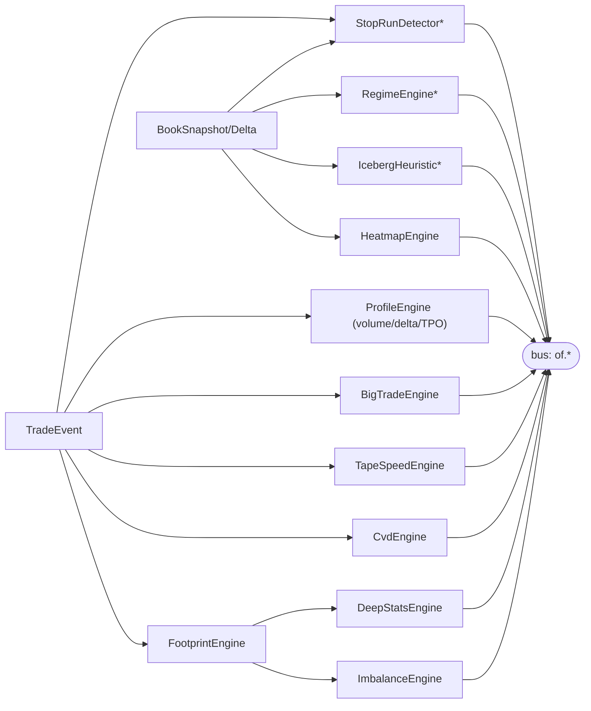

| Engine              | Algorithm summary                                                                                                                            | Key config                                                         | Output event                       |
| ------------------- | -------------------------------------------------------------------------------------------------------------------------------------------- | ------------------------------------------------------------------ | ---------------------------------- |
| `FootprintEngine`   | Per bar, bucket trades by tick-rounded price; accumulate `bidVol` (Sell aggressor), `askVol` (Buy aggressor), `delta`, `total`, `tradeCount` | tick size from `instruments-info`, bucket multiplier, noise filter | `FootprintUpdate{bar_id, cells[]}` |
| `ImbalanceEngine`   | Diagonal: `askVol(P)/bidVol(P-tick)`; stacked = ≥N consecutive same-direction                                                                | ratio default **300 %**, min stack **3**, min volume               | `ImbalanceUpdate{stacks[]}`        |
| `DeepStatsEngine`   | Per-bar totals: total/bid/ask volume, delta, max/min delta path, delta %, CVD, trade count                                                   | row selection, colour thresholds                                   | `DeepStatsRow`                     |
| `ProfileEngine`     | Volume/delta profile + TPO; POC; Value Area by single-step expansion to **70 %**; HVN/LVN peak detection; naked POC tracking                 | period type (composite/visible/session/anchored), row size, VA %   | `ProfileUpdate`                    |
| `CvdEngine`         | Signed running sum with resettable anchor (session/UTC day/manual/never); pivot-based multi-bar divergence over default 10 bars              | anchor, smoothing                                                  | `CvdUpdate`, `CvdDivergence`       |
| `HeatmapEngine`     | Rolling (time × price) matrix; one column per 100 ms; size normalised per column; emits only the newest column as a delta                    | depth tiers, colour scale lin/log, trail window, bucket ticks      | `HeatmapColumn`                    |
| `TapeSpeedEngine`   | Rolling counts + notional per second over 1 s/5 s/30 s windows; z-score vs 1 h baseline                                                      | windows, split-by-side                                             | `TapeSpeed`                        |
| `BigTradeEngine`    | Threshold by absolute notional or rolling percentile                                                                                         | threshold, percentile window                                       | `BigTrade`                         |
| `IcebergHeuristic`* | Refill count at a price after consumption ≥ K within window W                                                                                | K, W, min size                                                     | `IcebergEstimate{estimated:true}`  |
| `StopRunDetector`*  | Swing pivot + aggressive-burst sweep through a liquidity cluster, classified breakout vs sweep-reverse by follow-through                     | pivot lookback, burst z-score                                      | `StopRun{estimated:true}`          |
| `RegimeEngine`*     | Composite of book thickness clustering, realized vol (ATR), tape speed → {trending, ranging, volatile, calm}                                 | lookback, weights                                                  | `RegimeUpdate{estimated:true}`     |

All engines are **incremental** (no recompute from history on each tick) and **checkpointable** (state can be serialised so a restart resumes without replaying the whole session). Engines run in a dedicated per-symbol `asyncio` task consuming from a coalescing bus subscription; CPU-heavy paths use `numpy` vectorised ops on preallocated arrays.

> **No engine on this page is a statechart, and none may become one** (§4.4, MUSTNOT-01). The book **health** state — awaiting snapshot / live / desynced — _is_ a contract ([`28` §B14](28-statechart-catalogue.md#b14--book-health-fsm-data-path-excluded)), and it publishes a plain bool/enum on state entry that these engines read. The per-delta path never enters an interpreter: 48k ev/s of deltas against a ~9–20k process budget, with a 33 µs transition tax on 15–60 µs of real work. The contract names `apply_delta` and `buffer_delta` as actions so the sequencing rule has one owner; naming them there is not permission to execute them there.

### 3.5 OMS

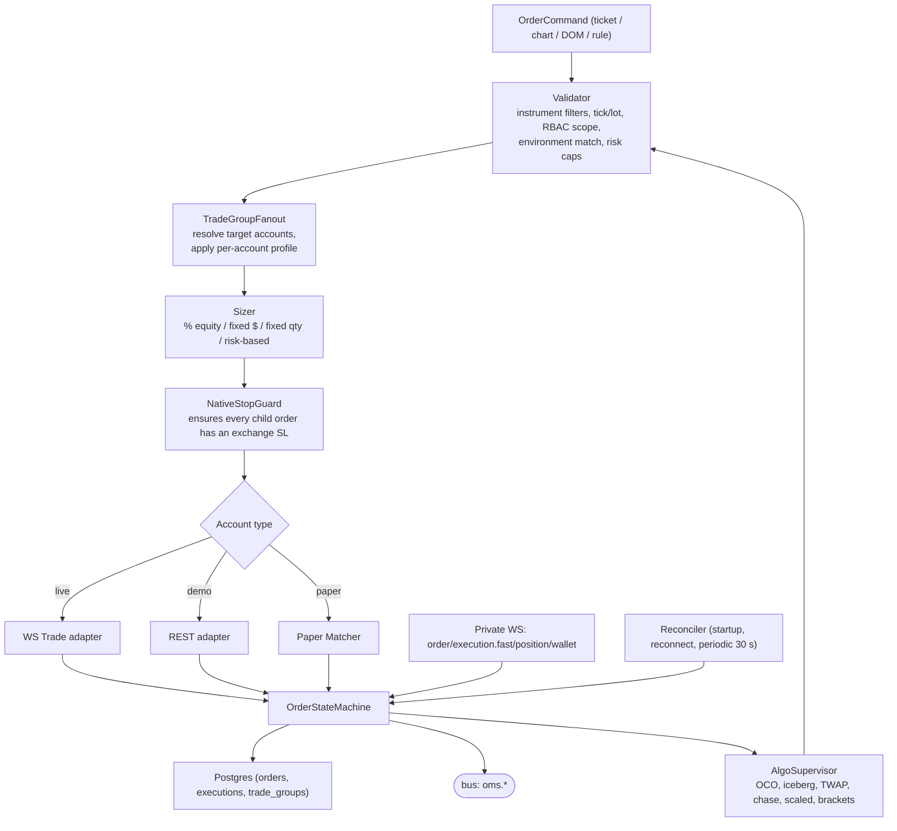

| Component           | Responsibility                                                                                                                                                                                                                                             | Interface                                |
| ------------------- | ---------------------------------------------------------------------------------------------------------------------------------------------------------------------------------------------------------------------------------------------------------- | ---------------------------------------- |
| `Validator`         | Instrument filters (tick size, lot size, min notional, leverage), RBAC scope check, environment match, per-account and per-manager risk caps, kill-switch state                                                                                            | `validate(cmd, ctx) -> ValidatedCommand` |
| `TradeGroupFanout`  | Expands one ticket into N child orders (one per selected account), creates a `trade_group` row, assigns a group-scoped `orderLinkId` prefix, budgets per-UID rate limits across the fan-out                                                                | `fanout(cmd) -> list[ChildOrder]`        |
| `Sizer`             | Applies per-account profile sizing rule; rounds to lot size; rejects if below min notional                                                                                                                                                                 | `size(account, cmd) -> Decimal`          |
| `NativeStopGuard`   | **Invariant P4**: refuses to submit any position-opening order that does not carry `stopLoss` (or an immediately-following `trading-stop` call); raises `NakedPositionAlert` and force-closes if an exchange-side SL is missing after `T_sl = 3 s`         | `ensure(child) -> child`                 |
| `OrderStateMachine` | Canonical lifecycle; idempotent transitions driven by `orderLinkId`; reconciles optimistic local state with exchange truth                                                                                                                                 | `apply(event)`                           |
| `AlgoSupervisor`    | Emulated algos as small state machines: OCO (race two orders, cancel loser on fill), iceberg (client-side slicing), TWAP (timed slices), chase (cancel/replace to best ± offset, capped), scaled ladder (equal/linear/geometric), brackets (entry → TP/SL) | `start(algo_spec)`, `cancel(algo_id)`    |
| `Reconciler`        | On startup/reconnect and every 30 s: `GET /v5/order/realtime` + `/v5/position/list`, diff by `orderLinkId`, backfill `GET /v5/execution/list` for the gap window, emit corrections                                                                         | `async reconcile(account)`               |
| `KillSwitch`        | Owner-level FREEZE per manager or global: blocks new orders, optionally cancels working orders and flattens                                                                                                                                                | `freeze(scope)`, `thaw(scope)`           |

**Order state machine.**

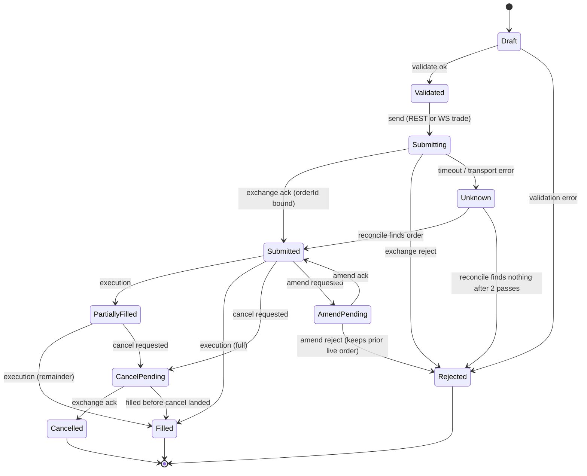

`Unknown` is the critical state: any transport failure after send lands here and is resolved **only** by reconciliation, never by blind resubmission. Idempotency is guaranteed by `orderLinkId = {group_id}-{account_short}-{seq}` (≤36 chars), generated before the first send attempt and reused on every retry.

### 3.6 Rule Engine

| Component          | Responsibility                                                                                                                                                                                                                                                                                                                                                                                                               | Interface                             |
| ------------------ | ---------------------------------------------------------------------------------------------------------------------------------------------------------------------------------------------------------------------------------------------------------------------------------------------------------------------------------------------------------------------------------------------------------------------------- | ------------------------------------- |
| `RuleCompiler`     | Compiles both editors' output (form editor JSON and node-graph JSON) into the single canonical **rule IR** (see `24-internal-schemas.md`); validates metric/action vocabulary, types and units; rejects cycles in the graph                                                                                                                                                                                                  | `compile(source) -> RuleIR`           |
| `RuleDecompiler`   | Renders IR back to either editor form so rules round-trip (owner decision #11)                                                                                                                                                                                                                                                                                                                                               | `to_form(ir)`, `to_graph(ir)`         |
| `MetricRegistry`   | Named, typed, unit-tagged metric bindings: `price`, `atr(n)`, `ema(n)`, `swing_high(n)`, `cvd_divergence`, `spread_bps`, `unrealized_r_multiple`, `realized_pnl_today`, `time_in_trade`, `orderbook_imbalance`, `funding_rate`, `open_interest_delta`, `tape_speed_zscore`, `market_regime`, `big_trade_notional`, `iceberg_present_at_level`_, `distance_to_liquidity_cluster`_, `in_stop_hunt_zone`_, `stop_run_detected`_ | `resolve(name, scope) -> MetricValue` |
| `Scheduler`        | Triggers: `on_price_update`, `on_bar_close`, `on_order_fill`, `on_timer`, `on_indicator`; debounced per rule                                                                                                                                                                                                                                                                                                                 | `arm(rule)`, `disarm(rule)`           |
| `Evaluator`        | Side-effect-free evaluation of the IR condition tree; produces an `ActionPlan` plus an evaluation trace                                                                                                                                                                                                                                                                                                                      | `evaluate(ir, ctx) -> ActionPlan`     |
| `ActionDispatcher` | Converts actions into OMS commands; enforces `once`, `only_tighten` (ratchet) and cooldown semantics; in `simulate` mode writes the plan to the journal without dispatching                                                                                                                                                                                                                                                  | `dispatch(plan, mode)`                |
| `RuleAudit`        | Every firing recorded: rule id/version, trigger, metric snapshot, plan, dispatch result                                                                                                                                                                                                                                                                                                                                      | append-only Postgres table            |

Action vocabulary: `place_order`, `modify_stop_loss`, `modify_take_profit`, `cancel_order`, `move_to_breakeven`, `scale_out`, `scale_in`, `flatten_all_positions`, `halt_new_orders`, `resume_new_orders`, `send_notification`, `log_journal_tag`, `reduce_leverage`, `widen_stop`, `arm_chase_limit`, `start_iceberg_slice`.

Safety: rule-driven stop management **never removes** the native exchange SL; it may only tighten it toward the position (unless the rule explicitly declares `allow_widen: true`, which requires Owner role and is audited).

### 3.7 Paper Matcher

| Component        | Responsibility                                                                                                                                                                                                                                                                                                                                 |
| ---------------- | ---------------------------------------------------------------------------------------------------------------------------------------------------------------------------------------------------------------------------------------------------------------------------------------------------------------------------------------------- |
| `FillModel`      | Two configurable models: (a) **L2-aware** — market orders walk the reconstructed book with configurable slippage and a latency penalty (default 80 ms); limit orders fill when trade prints cross the level _and_ estimated queue position is consumed; (b) **conservative bar model** — worst-case within-bar fills for low-resolution replay |
| `QueueEstimator` | Estimates queue position from resting size at the level when the order was placed, decremented by subsequent trades at/through that price                                                                                                                                                                                                      |
| `FeeModel`       | Maker/taker fee schedule per account (from `GET /v5/account/fee-rate`), funding accrual at 00/08/16 UTC                                                                                                                                                                                                                                        |
| `PaperLedger`    | Positions, wallet, realized/unrealized PnL kept in Postgres with identical schema to live accounts so every downstream view is account-type agnostic                                                                                                                                                                                           |

The matcher exposes the **same** interface the exchange adapter does (§9), so the OMS is unaware of whether an account is paper, demo or live beyond routing.

### 3.8 Recorder

| Component          | Responsibility                                                                                                                                                             |
| ------------------ | -------------------------------------------------------------------------------------------------------------------------------------------------------------------------- |
| `RecordingPolicy`  | Resolves the effective recorded set = explicit user list ∪ symbols with an open chart ∪ symbols with an open position; applies per-symbol overrides and pins               |
| `StreamWriter`     | Batched QuestDB ILP writes (flush every 200 ms or 10k rows), per-stream tables: trades, book deltas, book snapshots, tickers, liquidations, derived bars/footprint/heatmap |
| `RetentionManager` | Default 30-day retention; per-symbol override; `pinned = true` means never delete; runs nightly                                                                            |
| `RollOffJob`       | Nightly export of partitions older than `hot_days` (default 7) to Parquet, then drop from QuestDB after verified checksum                                                  |
| `DiskBudget`       | Reports per-symbol GB/day and projected 30-day footprint to the Admin UI; raises an alert at 80 % of the configured disk cap and stops auto-recording new symbols at 90 %  |

### 3.9 Replay

| Component        | Responsibility                                                                                                                                                          |
| ---------------- | ----------------------------------------------------------------------------------------------------------------------------------------------------------------------- |
| `SessionPlanner` | Resolves a (symbol, time-range) request to hot-tier and/or cold-tier readers; reports coverage gaps explicitly (recorder-dependent history, digest 23)                  |
| `EventSource`    | Merges trade/book/liquidation streams in `exch_ts` order with a stable tie-break on (stream rank, sequence)                                                             |
| `Clock`          | Virtual clock with speed 0.5×–100×, pause, step-bar, step-tick, scrub, loop and bookmarks                                                                               |
| `Injector`       | Publishes events on `replay.{session_id}.*` topics through the **same** normalizer/book/bars/order-flow chain (P2), isolated from live state by an env-scoped namespace |
| `PaperBridge`    | Optionally routes simulated orders during replay to the Paper Matcher, enabling rehearsal                                                                               |

Determinism: given the same stored data and the same `BarSpec`/engine config, replay produces identical derived series — asserted by a golden-file test in CI.

### 3.10 Auth / RBAC / Audit

| Component        | Responsibility                                                                                                                                                                                                                  |
| ---------------- | ------------------------------------------------------------------------------------------------------------------------------------------------------------------------------------------------------------------------------- |
| `PasswordAuth`   | Argon2id hashing, per-user pepper from the KEK-derived secret, lockout after 5 failures / 15 min                                                                                                                                |
| `TotpAuth`       | Mandatory TOTP (RFC 6238), 30 s step, ±1 window drift, one-time recovery codes                                                                                                                                                  |
| `SessionManager` | Server-side sessions in Postgres, absolute 12 h / idle 60 min, rotation on privilege change, revoke-all on password/TOTP change                                                                                                 |
| `ScopeResolver`  | Resolves user → role (Owner/Manager/Viewer) → allowed account ids → allowed key ids; every REST route and WS subscription passes through it                                                                                     |
| `AuditLog`       | Append-only (`INSERT`-only role, `REVOKE UPDATE, DELETE`), hash-chained (`prev_hash`, `row_hash`) so tampering is detectable; records auth events, key events, order actions, rule firings, admin changes, environment switches |

### 3.11 Admin

| Component       | Responsibility                                                                                                                                                                                                                  |
| --------------- | ------------------------------------------------------------------------------------------------------------------------------------------------------------------------------------------------------------------------------- |
| `UserAdmin`     | CRUD users, assign roles, reset TOTP, force logout                                                                                                                                                                              |
| `AccountAdmin`  | Register Bybit main/sub accounts per environment; surfaces the 5/20 sub-account cap; verifies `withdraw=false` and IP allowlist before an account may be marked `trading_enabled`                                               |
| `KeyVault`      | Envelope encryption: DEK per key record (AES-256-GCM), KEK held on the Windows host via OS keychain and injected at process start; rotation schedule (90 days) with dual-write window; plaintext never logged, never in backups |
| `ProfileAdmin`  | Per-account profiles: leverage, sizing rule, SL/TP offsets, max risk/day, max concurrent positions, allowed symbols                                                                                                             |
| `FlagAdmin`     | Feature flags (per environment, per role) with audit trail                                                                                                                                                                      |
| `HealthConsole` | Aggregated `health()` from every module, connection states, staleness, queue depths, disk budget, clock offset                                                                                                                  |
| `RecorderAdmin` | Recorded-symbol list, retention overrides, pins, disk budget, manual roll-off trigger                                                                                                                                           |

### 3.12 API / WS Gateway

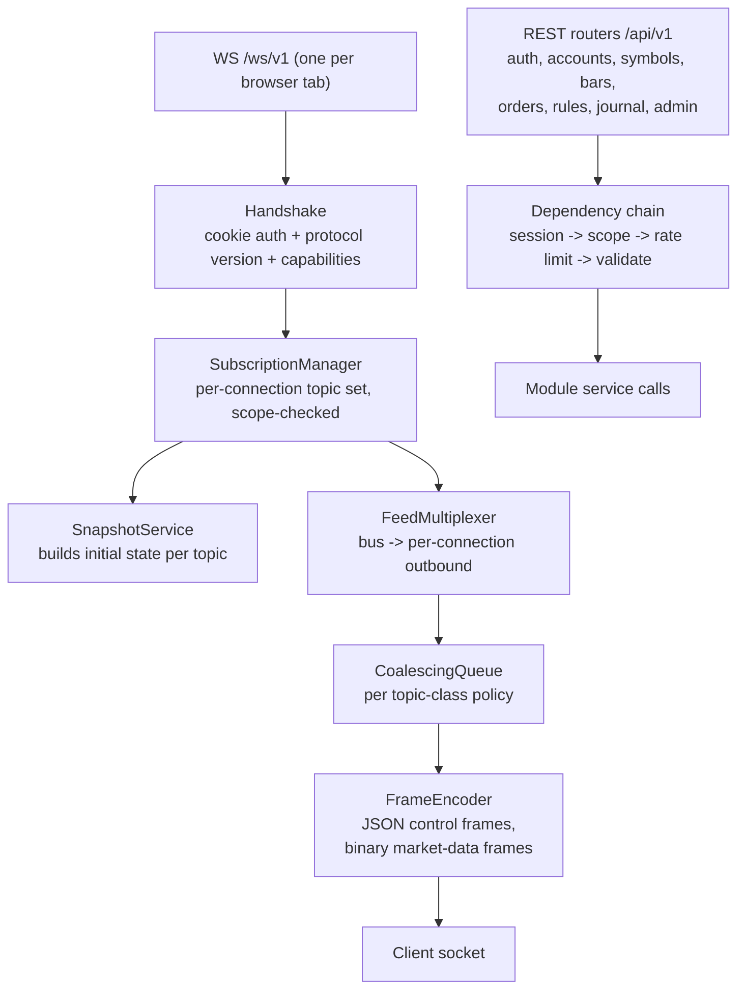

| Component             | Responsibility                                                                                                                                                                           | Detail                                                     |
| --------------------- | ---------------------------------------------------------------------------------------------------------------------------------------------------------------------------------------- | ---------------------------------------------------------- |
| `Handshake`           | Cookie session validation, protocol version negotiation, capability exchange (binary support, max cadence, compression)                                                                  | Rejects with a typed close code on version mismatch        |
| `SubscriptionManager` | Holds the per-connection topic set; every `subscribe` is scope-checked against `ScopeResolver`; aggregates connection demand into upstream demand for `SubscriptionPlanner`              | Max 64 topics per connection (configurable)                |
| `SnapshotService`     | Produces the initial full state (book top-N, last N bars, footprint window, profile state, heatmap window, open orders/positions) with the sequence number it is consistent with         | Snapshot and following deltas share one `seq` domain       |
| `FeedMultiplexer`     | Bridges bus topics to connection queues; one bus subscription per topic shared by all connections                                                                                        | Zero re-subscription upstream per client                   |
| `CoalescingQueue`     | Per topic-class policy (§4.2)                                                                                                                                                            | Bounded; overflow escalates to re-snapshot                 |
| `FrameEncoder`        | Control frames as JSON; market-data frames as a compact binary layout (little-endian, fixed headers, typed arrays) per `23-ws-protocol.md`; MessagePack for mid-tier structured payloads | Client capability decides; JSON-only fallback always works |
| `RateLimiter`         | Per-user and per-IP token buckets for REST; per-connection command budget for WS                                                                                                         | 429 with `Retry-After`                                     |

---

## 4. Threading / asyncio model and backpressure

### 4.1 Process and task topology

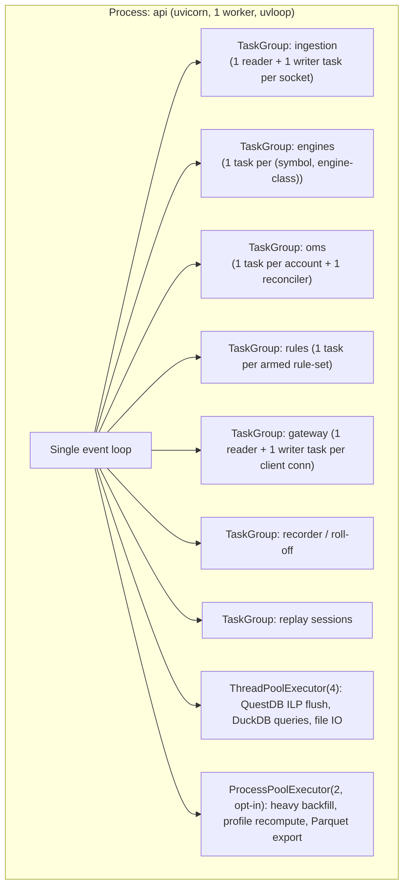

Rules:

1. **One event loop.** No implicit threads. Any blocking call (DuckDB, Parquet, Argon2, crypto) goes through `run_in_executor`.
2. **Structured concurrency.** Every module owns an `asyncio.TaskGroup`; module `stop()` cancels its group and awaits drain with a grace period (default 5 s, OMS 15 s).
3. **No shared mutable state across modules.** Cross-module data travels as immutable frozen dataclasses/pydantic models on the bus.
4. **CPU escape hatches, pre-designed** (in priority order when profiling demands): (a) `numpy` vectorisation, (b) symbol-sharded `ProcessPoolExecutor`, (c) Rust/PyO3 extension for book application + footprint binning. Free-threaded CPython is explicitly **not** relied upon.
5. **Loop-lag SLO**: p99 event-loop lag ≤ 50 ms, alert at 100 ms (`event_loop_lag_seconds`). Exceeding it for 5 min triggers the escape-hatch decision procedure in `06-performance-and-load-standard.md`.
6. **No market-data event ever reaches a statechart interpreter.** Statecharts receive **control and lifecycle events only**. Ingestion, book application, bar building, footprint aggregation, per-tick rule evaluation and the paper matcher run as ordinary Python on the hot path. The boundary objects that decimate market-rate input into bounded lifecycle events — `ChaseTargetTracker` (≤10 Hz), the rule trigger pre-filter (≥99 % rejection), the risk band evaluator (edge-triggered) — are plain code, never machines. See §4.4.

### 4.2 Backpressure policy matrix

| Stage                     | Queue                   | Bound                                                                 | Overflow policy                                                                                                                                                                    | Metric                                               |
| ------------------------- | ----------------------- | --------------------------------------------------------------------- | ---------------------------------------------------------------------------------------------------------------------------------------------------------------------------------- | ---------------------------------------------------- |
| Bybit socket → normalizer | per-socket read buffer  | 4096 msgs                                                             | Await (real backpressure); alert if sustained                                                                                                                                      | `ingest_queue_depth`                                 |
| Normalizer → book engine  | per-symbol              | 2048                                                                  | **Never drop a delta** — instead mark book `DESYNCED` and resync                                                                                                                   | `book_resync_total`                                  |
| Normalizer → bar builders | per-symbol              | 8192                                                                  | Await; trades are never dropped                                                                                                                                                    | `bar_queue_depth`                                    |
| Engines → bus             | per topic               | 1024                                                                  | Conflate: keep latest for state-like topics (heatmap column, book top-N, ticker); keep all for event-like topics (trades, executions)                                              | `bus_conflated_total`                                |
| Bus → gateway connection  | per (conn, topic-class) | book 4, heatmap 2, bars 64, footprint 32, trades 512, oms 1024        | Conflate for state-like; for event-like, if full → send `resync_required` control frame, drop the topic buffer and re-snapshot                                                     | `ws_conflated_total`, `ws_resync_total`              |
| Gateway → client socket   | TCP send buffer         | OS                                                                    | If `drain()` exceeds 2 s, mark connection `SLOW`; at 5 s close with code 1013 and let the client reconnect                                                                         | `ws_slow_conn_total`                                 |
| Recorder → QuestDB        | write batch             | 10k rows / 200 ms                                                     | Spill to a bounded on-disk WAL file; if that exceeds 1 GB, stop recording the lowest-priority symbol and alert                                                                     | `recorder_spill_bytes`                               |
| OMS → Bybit REST          | token bucket            | **per-UID (per account), split `critical`/`entry`/`poll` — see §4.3** | Pre-flight reservation; `atomic` groups reject the whole ticket with `RATE_BUDGET_EXCEEDED`, `best_effort` groups defer the starved account to a deadline. Never silently delayed. | `oms_rate_reject_total`, `oms_fanout_deferred_total` |

**Priority classes.** When the loop is saturated, work is shed in this order (lowest first): heatmap columns → profile recompute → footprint detail → bars → book top-N → trades → OMS/private stream. Order-related work is **never** shed.

### 4.3 Order-path backpressure: per-account rate-limit budgeting and partial fan-out

"Order-related work is never shed" is a statement about _our_ queues. It cannot be a statement about Bybit's, because rate limits on Bybit are enforced **per UID** — i.e. per account — and a trade group fans one ticket out to N accounts that each have an independent, independently-exhaustible budget (owner-decisions cross-cutting consequence #4). This section defines the concrete algorithm, because "reserved rate headroom" alone is not implementable.

**Budget model.** Each account has one `AccountRateBudget` owned by the OMS:

| Bucket     | Capacity                                      | Refill                   | Who may draw                                                                                  |
| ---------- | --------------------------------------------- | ------------------------ | --------------------------------------------------------------------------------------------- |
| `critical` | 40 % of the UID limit (default 4 req/s of 10) | continuous, token bucket | Native SL attachment, reduce-only closes, cancel-all / kill-switch, `set_trading_stop` repair |
| `entry`    | 40 % (4 req/s)                                | continuous               | New entries and fan-out children, amends                                                      |
| `poll`     | 20 % (2 req/s)                                | continuous               | Reconciliation polls, wallet/position/fee refresh, admin reads                                |

`critical` is the **reserved headroom**: `entry` and `poll` may never borrow from it, `critical` may borrow from either when they are idle. This is what makes P4 survivable — an account that has burned its whole entry budget can still attach or repair a stop. Capacity is derived from `capabilities.order_rate_per_uid_per_s` and is re-derived at runtime from Bybit's `X-Bapi-Limit-Status` response header (the observed remaining count wins over the configured default; a drop to 0 shrinks the configured capacity for 60 s — adaptive downshift).

**Fan-out admission control.** `TradeGroupFanout` does _not_ start placing and then discover exhaustion mid-loop. Before any child is submitted:

1. **Pre-flight reservation.** For each target account, atomically attempt `budget.reserve(entry, cost=1 + sl_cost)` where `sl_cost` is 0 when the SL rides on the entry (`supports_attached_sl_tp`) and 1 when a separate `set_trading_stop` is required. Reservations are held for `CV_FANOUT_RESERVATION_TTL_MS` (default 3000).
2. **All-or-nothing vs best-effort.** The trade group carries `fanout_policy` (per ticket, defaulted per trade group template, owner-settable):
   - `atomic` — if _any_ account cannot reserve within `CV_FANOUT_ADMIT_WAIT_MS` (default 750 ms), release all reservations and reject the whole ticket with `RATE_BUDGET_EXCEEDED`, naming the starved accounts. Nothing is sent. This is the default for grouped scaling where uneven fills are worse than no fill.
   - `best_effort` — accounts that reserved proceed immediately; starved accounts are placed in the group as children in state `Deferred` with a deadline (`CV_FANOUT_DEFER_DEADLINE_MS`, default 5000). The group state becomes `PartiallyAdmitted` and the UI shows a per-account badge.
3. **Deferred drain.** `Deferred` children sit in a per-account FIFO deadline queue. On each token refill the account's queue head is retried. On deadline expiry the child transitions `Deferred → Rejected(RATE_BUDGET_EXCEEDED)`, never to `Unknown` — nothing was ever sent, so there is no ambiguity. The group emits `oms.trade_group.updated` with `partial_fill_reason`.
4. **No silent stretching.** A child is never quietly delayed past its deadline; latency skew across accounts in one group is bounded by `CV_FANOUT_DEFER_DEADLINE_MS` and exported as `oms_fanout_skew_seconds` (histogram, p99 SLO ≤ 1.5 s).

**Ordering fairness.** Within an account, the queue is strict priority then FIFO: `critical` > `entry` > `poll`. Across accounts there is no shared queue at all — each account has its own bucket and its own drain task — so a slow or throttled account cannot head-of-line-block the others in the same group. This is the concrete reason fan-out uses one `asyncio.Task` per account rather than a sequential loop.

**Partial-failure semantics (the case the group must survive).** If accounts A and B fill and C is starved:

| Situation                                     | Behaviour                                                                                                                                                                                                                                                                                                                                          |
| --------------------------------------------- | -------------------------------------------------------------------------------------------------------------------------------------------------------------------------------------------------------------------------------------------------------------------------------------------------------------------------------------------------- |
| `atomic`, C starved pre-flight                | Nothing sent; ticket rejected; user sees which account starved and its refill ETA.                                                                                                                                                                                                                                                                 |
| `best_effort`, C starved pre-flight           | A and B live, C `Deferred`; group `PartiallyAdmitted`.                                                                                                                                                                                                                                                                                             |
| `best_effort`, C deadline expires             | C `Rejected`; group `PartiallyFilled`; **an alert fires only if the group is flagged `require_symmetry`**, in which case the risk policy in `05-…` applies: either A and B are reduced pro-rata to the achieved group size, or the group is left asymmetric with an explicit user acknowledgement. The chosen action is recorded in the audit log. |
| C reserved and sent, then Bybit returns 10018 | Retry inside the `critical` bucket with jitter (it is now a live-order concern), capped at 3 attempts; on exhaustion the child goes to `Unknown` and reconciliation decides — it may have landed.                                                                                                                                                  |
| C filled but its SL attach is starved         | Impossible by construction: `sl_cost` was reserved at pre-flight and the `critical` bucket may borrow. If it still fails, `NativeStopGuard` escalates to a reduce-only close of C (F7) using `critical` tokens.                                                                                                                                    |

**Kill-switch interaction.** The kill switch bypasses admission control entirely and drains from `critical` across all accounts in parallel; `entry` and `poll` drains are cancelled first so their in-flight tokens are not competing.

**Metrics.** `oms_rate_tokens_available{account,bucket}` (gauge), `oms_rate_wait_seconds{account,bucket}` (histogram), `oms_fanout_deferred_total{account}`, `oms_fanout_rejected_total{reason}`, `oms_fanout_skew_seconds`, `oms_rate_downshift_total{account}`. Alert: any account where `critical` tokens are below 1 for more than 10 s (page), or `oms_fanout_deferred_total` rate > 0 for 5 min (warn).

---

### 4.4 Statechart contracts and the hot-path exclusion

Every long-lived lifecycle in CandleViewer — the order, the trade group and its legs, the four emulated algos, the native-SL protection invariant, the rule instance, the alert, the recording and replay sessions, the exchange connection, the book **health** FSM, the auth session, the live gate, the kill switch, the reconciliation job and the risk lockout — is specified as an **XState-v5-compatible statechart JSON contract** in [`28-statechart-catalogue.md`](28-statechart-catalogue.md), governed by [`27-adrs/ADR-0016-statechart-runtime.md`](27-adrs/ADR-0016-statechart-runtime.md).

The contract names states, events, guards, actions and services; the library interprets the JSON directly. Execution is **exclusively** by `xstate-statemachine==0.9.1` via `cv.statechart.factory`
in `services/api/candleviewer/statechart/` — adopted completely by owner decision 2026-09-24 (ADR-0016
Accepted); there is no in-house shim, no `CV_STATECHART_RUNTIME` toggle and no dual-runtime path.
**Implementations must conform to their contract** — the same state, event, guard and action names and the
same transition table — asserted mechanically by `tests/xstate_contract` (a blocking CI gate).

#### The statechart runtime component (`cv.statechart`)

The runtime is the pinned library, **`xstate-statemachine==0.9.1`** (hash-locked, PEP 740 attested; ADR-0016 § Decision (final)). CandleViewer owns only a thin package around it. The full design is in [`29-statechart-adoption-plan.md`](29-statechart-adoption-plan.md) §1.

| Concern                | Where it lives                                                                                     | Rule                                                                                                                                                                                                                                                                                                                                                                                                                                                                                                                                                                                                                                                |
| ---------------------- | -------------------------------------------------------------------------------------------------- | --------------------------------------------------------------------------------------------------------------------------------------------------------------------------------------------------------------------------------------------------------------------------------------------------------------------------------------------------------------------------------------------------------------------------------------------------------------------------------------------------------------------------------------------------------------------------------------------------------------------------------------------------- |
| **Module boundary**    | `services/api/candleviewer/statechart/` exports `build()`, `restore()` and `Gateway`, nothing else | Only `factory.py` and `persistence.py` may import `xstate_statemachine` (lint `CV-LINT-IMPORT`). Domain modules (OMS, algos, recorder, auth…) supply a `MachineLogic` binding in `statechart/bindings/bNN_*.py` (guards, actions, services as coroutines) and never touch an interpreter directly. Production uses the async `Interpreter` only (MUSTNOT-06).                                                                                                                                                                                                                                                                                       |
| **Construction**       | `factory.py`                                                                                       | Applies the FINAL mandatory block (`28` §1.3c) unconditionally: `strict_config`, `strict=True` + `CV_EVENT_SCHEMAS`, `max_queue_size=CV_INBOX_BOUND[lane]`, `overflow_policy="refuse"`, `maxIterations` 500, root `onUnhandled: "defer"` with an audit arm, and an injected clock. Lanes are `order` (its own event loop, BENCH-1), `control` and `platform`.                                                                                                                                                                                                                                                                                       |
| **Plugin hooks**       | `statechart/plugins/`                                                                              | `CvErrorHooks` handles transition failure, invalid or dropped events, chain-budget trips, stranded invocations and `on_receipt_dropped`. That last hook is finaliser-safe (CV-C69). `CvMetricsPlugin` exports the `cv_machine_*` families (§12.1). `CvAuditPlugin` writes `machine_events` rows: write-ahead for the order family, write-behind otherwise. A fresh build attaches plugins with `.use()`. A restore passes them as `from_snapshot(plugins=...)`. `on_interpreter_start` is used for telemetry only (CV-C66′).                                                                                                                        |
| **Send path**          | `gateway.py`                                                                                       | `Gateway.send` runs on the owning loop. `send_threadsafe` is the only cross-thread path. Actions never call `send()` (CV-C25). `re_mint` is reachable only through the payload-only `cv_re_mint` (CV-C68). Events are checked against each machine's declared names (MUST-10).                                                                                                                                                                                                                                                                                                                                                                      |
| **Persistence recipe** | `persistence.py`                                                                                   | Snapshots are taken only at quiescence. The order is `drain_pending()`, then journal the drained events (replayed exactly once, de-duplicated by `send_id`), then `get_persisted_snapshot()`, then seal with HMAC + `machine_hash` + version ≥3, then write `machine_snapshots` and `stop()` (CV-C65′). A faulted context is never persisted (MUST-01). Restore is `from_snapshot(minimum_version=3, plugins=...)`. Before `start()` it checks `last_transition_ok` and runs `_cv_bring_up`; after `start()` it replays the journal. `chain_trips > 0` latches the entity as degraded until an operator acknowledges it. Schemas are in `24` §17.6. |
| **WS exposure**        | E17 topic `machines.{entity}.state`                                                                | The machine publishes its state and enum **on state entry** to the bus. The WS gateway fans that out as snapshot+delta with per-entity RBAC. No client request and no hot path ever queries an interpreter (MUSTNOT-03). The admin inspector (E42) renders the Stately JSON plus the `machine_events` timeline.                                                                                                                                                                                                                                                                                                                                     |
| **Gates**              | CI                                                                                                 | Blocking gates: `tests/xstate_contract/` (golden traces on the library, <60 s), `tools/lint_statecharts.py`, the `machine_hashes.lock` diff, and the attestation verify. A pin bump also needs `docs/research/xstate/gate/run_gate.py` and BENCH-6 to pass (ADR-0016 upgrade policy).                                                                                                                                                                                                                                                                                                                                                               |

#### The exclusion (binding, and measured)

**A statechart is never used on a hot path or as a synchronous enforcement point — in any form, including internal (actions-only) transitions.** This is an architectural rule with measured ratios behind it, not a stylistic preference, and the ratios are structural: they do not improve with faster hardware.

| Never a statechart                                                                             | Measured cost of doing it anyway                                                                                                                |
| ---------------------------------------------------------------------------------------------- | ----------------------------------------------------------------------------------------------------------------------------------------------- |
| Book-engine delta application, bar builders, footprint aggregation                             | 48k ev/s of deltas against a ~9–20k process budget, and a 33 µs transition tax on 15–60 µs of real work                                         |
| Per-tick rule **condition** evaluation                                                         | plain Python runs the entire unfiltered 200,000 eval/s workload in 30 ms — **~744×** a realistic statechart fleet; no pre-filter closes the gap |
| Paper-matcher fill model, queue-position estimator, fee/funding arithmetic                     | no states, and it needs virtual time no runtime provides                                                                                        |
| Per-account rate-limit governor / fan-out admission control (§4.3)                             | **~238,000×** slower (35.2 ms p50 vs 0.148 µs) and structurally unable to answer synchronously at all                                           |
| Any synchronous safety **enforcement** point — kill switch, live gate, risk caps, rate budgets | statecharts **record and orchestrate**; a synchronous flag or function **enforces**                                                             |

Two corollaries are enforced by the machine-definition linter and by CI:

- **No path faster than ~100 Hz queries an interpreter.** A machine publishes a plain `bool`/enum on state entry; hot paths read that. Even _gating_ by querying an interpreter measured **12×** a plain bool read.
- **The §4.3 governor is the canonical trap.** It has states (`open` / `starved` / `downshifted`), it has transitions, it looks textbook, and it must not be one. Anything on the order path that must **return an answer** rather than **record a fact** cannot be a statechart in any runtime that sends events fire-and-forget.

#### Failure and degradation

The degraded-mode matrix (§6.3) gains **“statechart fleet degraded”**: if `cv_machine_deferred_depth` is non-zero beyond 5 s, or `cv_machine_live_count` grows monotonically, or quarantines are occurring, the fleet is degraded — new order entry is blocked by the synchronous flag (not by a machine) and reconciliation is escalated. Metrics are listed in §12.1.

## 5. Monorepo layout

```text
CandleViewer/
├─ apps/
│  ├─ web/                        # React SPA (Vite). The only UI, incl. admin screens.
│  │  ├─ src/routes/              # charting, dom, trading, rules, journal, risk, settings, admin/*
│  │  ├─ src/features/            # feature-sliced: chart, footprint, dom-ladder, order-ticket,
│  │  │                           # trade-groups, rule-builder-form, rule-builder-graph, journal,
│  │  │                           # risk-dashboard, replay, admin-users, admin-accounts,
│  │  │                           # admin-keys, admin-recorder, admin-flags, admin-health, audit
│  │  ├─ src/lib/ws/              # WS client: reconnect, resubscribe, snapshot+delta, decode
│  │  ├─ src/lib/state/           # Zustand stores (UI) + Jotai atoms (high-frequency data)
│  │  ├─ src/lib/auth/            # session, TOTP, scope-aware route guards
│  │  ├─ e2e/                     # Playwright specs (web)
│  │  └─ vite.config.ts
│  └─ desktop/                    # Electron shell (no business logic)
│     ├─ src/main/                # window mgmt, GPU flags, updater, keychain bridge, deep links
│     ├─ src/preload/             # context-isolated IPC allow-list
│     ├─ e2e/                     # Playwright + Electron specs
│     └─ electron-builder.yml
├─ packages/
│  ├─ chart-engine/               # custom WebGL2 engine (see 26-chart-engine-design.md)
│  │  ├─ src/core/                # scene graph, render loop, viewport, transforms, LOD
│  │  ├─ src/gl/                  # context, programs, buffers, textures, atlas, capability probe
│  │  ├─ src/layers/              # candles, footprint, profile, heatmap, overlays, drawings, axes
│  │  ├─ src/text/                # SDF font generation + atlas + glyph batching
│  │  ├─ src/worker/              # OffscreenCanvas worker entry + transferable protocol
│  │  ├─ src/plugins/             # series/indicator/overlay plugin API
│  │  ├─ bench/                   # deterministic FPS/memory benchmarks (CI-gated)
│  │  └─ test/                    # unit + golden-image tests
│  ├─ ui/                         # design system: tokens, primitives, trading components
│  ├─ protocol/                   # GENERATED: TS types + decoders from OpenAPI + WS schema
│  │  ├─ src/generated/           # do not edit; produced by `pnpm gen:protocol`
│  │  └─ src/runtime/             # binary frame decoders, seq/resync helpers
│  ├─ fixtures/                   # recorded Bybit fixtures + golden outputs, shared by TS & Py
│  │  ├─ raw/                     # captured WS sessions (jsonl.gz), redacted
│  │  ├─ golden/                  # expected bars/footprint/profile/CVD outputs
│  │  └─ scripts/                 # capture, redact, verify
│  └─ config/                     # shared eslint/tsconfig/prettier/vitest presets
├─ services/
│  └─ api/                        # Python backend (single deployable)
│     ├─ candleviewer/
│     │  ├─ app.py                # composition root, supervisor, lifespan
│     │  ├─ settings.py           # pydantic-settings, env layering
│     │  ├─ bus/                  # topics, queue policies, conflation
│     │  ├─ exchange/             # ports + adapters
│     │  │  ├─ base.py            # ExchangeAdapter protocol (§9)
│     │  │  └─ bybit/             # rest.py, ws_public.py, ws_private.py, ws_trade.py,
│     │  │                        # normalize.py, errors.py, ratelimit.py, instruments.py
│     │  ├─ ingestion/            # connection mgr, planner, watchdog, sequence tracker
│     │  ├─ book/                 # state, resync, aggregation, liquidity tracker
│     │  ├─ bars/                 # builders per kind, store
│     │  ├─ orderflow/            # footprint, profile, cvd, imbalance, heatmap, tape,
│     │  │                        # bigtrade, iceberg, stoprun, regime, deepstats
│     │  ├─ oms/                  # validator, fanout, sizer, stop_guard, state_machine,
│     │  │                        # algos/, reconciler, killswitch
│     │  ├─ rules/                # ir.py, compiler.py, decompiler.py, metrics.py,
│     │  │                        # scheduler.py, evaluator.py, dispatcher.py
│     │  ├─ paper/                # fill_model, queue_estimator, fee_model, ledger
│     │  ├─ recorder/             # policy, writer, retention, rolloff, disk_budget
│     │  ├─ replay/               # planner, source, clock, injector
│     │  ├─ auth/                 # password, totp, sessions, scopes, audit
│     │  ├─ admin/                # users, accounts, keyvault, profiles, flags, health
│     │  ├─ api/                  # FastAPI routers (v1), schemas, dependencies
│     │  ├─ ws/                   # gateway: handshake, subscriptions, snapshots, encoder
│     │  ├─ storage/              # questdb.py, postgres.py (SQLAlchemy 2.0), parquet.py, duckdb.py
│     │  ├─ observability/        # logging, metrics, tracing, health
│     │  └─ migrations/           # alembic
│     ├─ tests/                   # unit/, contract/, integration/, load/
│     └─ pyproject.toml
├─ infra/
│  ├─ compose/                    # docker-compose.yml + .dev/.vps overrides, .env.example
│  ├─ images/                     # Dockerfiles (api, web, questdb tuning, grafana)
│  ├─ grafana/                    # provisioned dashboards + datasources (JSON)
│  ├─ prometheus/                 # prometheus.yml, alert rules
│  ├─ k6/                         # load scripts: ws-fanout, rest-orders, ingest-soak
│  └─ scripts/                    # bootstrap, backup, restore, rotate-keys, healthcheck
├─ docs/
│  ├─ plan/                       # this planning set (incl. 27-adrs/)
│  └─ research/                   # research phase + digests
└─ .github/                       # workflows, CODEOWNERS, templates
```

**Tooling.** pnpm workspaces + Turborepo for JS; `uv` + Hatch for Python; a single `Makefile`/`task` front-end (`make dev`, `make test`, `make gen`, `make up`). `packages/protocol` is generated from `docs/plan/22-api-openapi.yaml` and the WS schema — CI fails if the generated output is stale (`make gen && git diff --exit-code`).

**Ownership (`.github/CODEOWNERS` sketch).** `apps/web`, `packages/ui` → frontend leads; `packages/chart-engine` → chart-engine owner + architect; `services/api/candleviewer/oms|rules` → backend lead + security engineer; `infra/` → DevSecOps; `docs/plan/27-adrs` → architect.

---

## 6. Runtime composition and module lifecycle

### 6.1 Composition root

`services/api/candleviewer/app.py` builds an `AppContext` containing: settings, bus, storage clients (QuestDB, Postgres, DuckDB), key vault, metric registry, clock guard, and the module instances. No module constructs its own dependencies; everything is injected, which makes every module unit-testable with fakes.

### 6.2 Supervisor and start/stop order

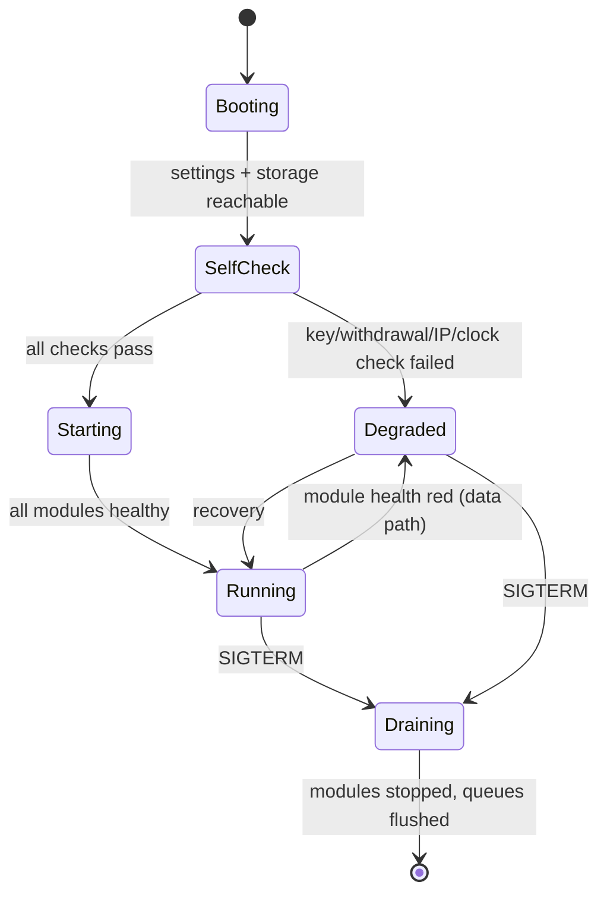

Start order: storage → auth → admin/key vault → bus → ingestion → book → bars → order-flow → recorder → OMS → paper → rules → replay → gateway. Stop order is the reverse, with OMS given a 15 s grace window to finish in-flight order operations and persist state.

**Startup self-check (blocking for trading mode).** (1) Postgres migrations at head; (2) QuestDB reachable and writable; (3) every `trading_enabled` key decrypts, reports `withdraw=false`, and has an IP allowlist; (4) clock offset within `recv_window/2`; (5) Bybit `instruments-info` fetched and cached; (6) account/position mode is UTA one-way or hedge as configured — a mismatch is a hard error, not a warning. Failure of 3, 4 or 6 puts the app in `Degraded` with market data live but **order entry disabled**.

### 6.3 Degraded-mode matrix

| Condition                                                                                                                                           | Market data | Order entry                                                     | Rules                                                                                      | UI signal                                                 |
| --------------------------------------------------------------------------------------------------------------------------------------------------- | ----------- | --------------------------------------------------------------- | ------------------------------------------------------------------------------------------ | --------------------------------------------------------- |
| Public WS down > 10 s                                                                                                                               | stale       | allowed (positions still need managing)                         | metrics using market data are marked stale; rules depending on stale metrics are suspended | red "DATA STALE" banner + per-pane badge                  |
| Private WS down > 10 s                                                                                                                              | live        | allowed but every submit forces a REST confirm read             | suspended (no reliable fill events)                                                        | amber "EXECUTION DEGRADED" banner                         |
| Clock drift > recv_window/2                                                                                                                         | live        | **blocked**                                                     | suspended                                                                                  | red modal: clock sync required                            |
| Rate budget exhausted                                                                                                                               | live        | queued, new submits rejected with a clear code                  | throttled                                                                                  | inline toast on the ticket                                |
| Disk > 90 %                                                                                                                                         | live        | allowed                                                         | normal                                                                                     | recorder auto-record paused; admin alert                  |
| Postgres down                                                                                                                                       | live        | **blocked** (no durable state)                                  | suspended                                                                                  | red modal                                                 |
| **Statechart fleet degraded** — `cv_machine_deferred_depth` non-zero > 5 s, `cv_machine_live_count` growing monotonically, or quarantines occurring | live        | **blocked by the synchronous flag** (never by a machine — §4.4) | suspended                                                                                  | red "LIFECYCLE DEGRADED" banner; reconciliation escalated |

---

## 7. Environments and configuration

### 7.1 Environment enum

`demo` | `live` | `testnet` are a **first-class structural** dimension (P9), not a flag. `testnet` is used for connectivity smoke-tests only (owner decision #8); `demo` is the paper/rehearsal environment.

| Aspect                 | `live`                                    | `demo`                                          | `testnet`                                         |
| ---------------------- | ----------------------------------------- | ----------------------------------------------- | ------------------------------------------------- |
| REST base              | `api.bybit.com`                           | `api-demo.bybit.com`                            | `api-testnet.bybit.com`                           |
| WS public              | `wss://stream.bybit.com/v5/public/linear` | same as live (demo has no separate public feed) | `wss://stream-testnet.bybit.com/v5/public/linear` |
| WS private             | `wss://stream.bybit.com/v5/private`       | `wss://stream-demo.bybit.com/v5/private`        | `wss://stream-testnet.bybit.com/v5/private`       |
| WS trade (order entry) | **supported**                             | **not supported → REST only**                   | not used                                          |
| Key set                | live keys                                 | demo keys                                       | testnet keys                                      |
| Storage namespace      | `live`                                    | `demo`                                          | `testnet`                                         |
| UI chrome              | red accent, "LIVE" badge                  | blue accent, "DEMO" badge                       | grey, "TESTNET" badge                             |
| Switch UX              | typed confirmation (`LIVE`), no hotkey    | single confirm                                  | single confirm                                    |

`testnet` and `demoTrading` are mutually exclusive at the Bybit level and must never be combined in one adapter instance. Queries are namespaced so a stray read cannot cross environments.

### 7.2 Configuration model

Layered, highest priority last: packaged defaults → `infra/compose/.env` → environment variables (`CV_*`) → Postgres-stored runtime settings (admin-editable) → per-user preferences. Secrets never appear in layers 1–2 in plaintext.

| Key                             | Type   | Default         | Scope   | Notes                                        |
| ------------------------------- | ------ | --------------- | ------- | -------------------------------------------- |
| `CV_ENV`                        | enum   | `demo`          | process | Bybit environment                            |
| `CV_BIND_HOST`                  | str    | `127.0.0.1`     | process | **must not** be `0.0.0.0`                    |
| `CV_BIND_PORT`                  | int    | `8080`          | process |                                              |
| `CV_PG_DSN`                     | secret | —               | process |                                              |
| `CV_QUESTDB_ILP`                | str    | `questdb:9009`  | process |                                              |
| `CV_QUESTDB_PG`                 | str    | `questdb:8812`  | process |                                              |
| `CV_PARQUET_ROOT`               | path   | `/data/parquet` | process |                                              |
| `CV_KEK_SOURCE`                 | enum   | `host-keychain` | process | `host-keychain` \| `file` (dev only)         |
| `CV_RECV_WINDOW_MS`             | int    | `5000`          | process | raising it is a stopgap, alerts when > 5000  |
| `CV_MAX_WS_TOPICS_PER_CONN`     | int    | `64`            | runtime | gateway limit                                |
| `CV_HEATMAP_CADENCE_MS`         | int    | `100`           | runtime |                                              |
| `CV_BOOK_DEPTH`                 | int    | `200`           | runtime | 1/50/200/500                                 |
| `CV_RECORDER_RETENTION_DAYS`    | int    | `30`            | runtime | per-symbol override allowed                  |
| `CV_RECORDER_HOT_DAYS`          | int    | `7`             | runtime | roll-off threshold                           |
| `CV_DISK_CAP_GB`                | int    | `500`           | runtime | pause auto-record at 90 %                    |
| `CV_ORDER_RATE_PER_UID`         | int    | `8`             | runtime | below Bybit's 10/s for headroom              |
| `CV_NATIVE_SL_DEADLINE_MS`      | int    | `3000`          | runtime | NakedPositionAlert threshold                 |
| `CV_KILLSWITCH_ON_DISCONNECT_S` | int    | `30`            | runtime | watchdog flatten policy (opt-in per account) |
| `CV_FEATURE_FLAGS`              | json   | `{}`            | runtime | admin-editable                               |

### 7.3 Environment parity for developers

`make up` starts the full compose stack against `demo` with a **synthetic feed generator** available (`CV_FEED=synthetic`) that replays `packages/fixtures/raw` at configurable rates — so engineers and CI can work without Bybit credentials. E2E tests always run against `synthetic` or `demo`, never `live`.

---

## 8. Deployment

### 8.1 Phase 1 — WSL Ubuntu, docker compose

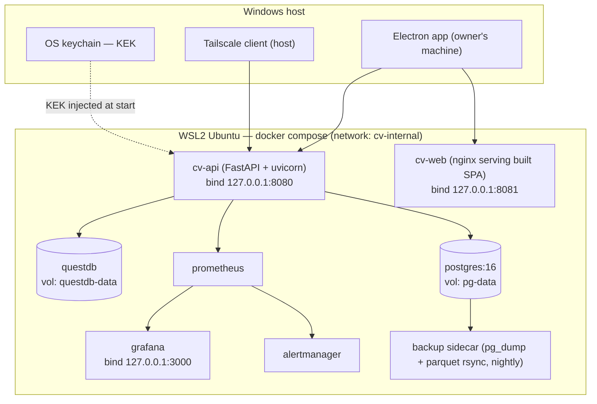

Compose services, images and volumes are defined in `infra/compose/docker-compose.yml`; `docker-compose.dev.yml` adds hot reload and the synthetic feed; `docker-compose.vps.yml` swaps bind addresses, enables TLS termination and stricter resource limits.

Resource baseline (2 symbols @200 depth): api 2 vCPU / 3 GB, QuestDB 2 vCPU / 4 GB + 200 GB volume, Postgres 1 vCPU / 1 GB + 20 GB, observability 1 vCPU / 1.5 GB. Target host: ≥6 cores, ≥16 GB RAM, NVMe.

WSL-specific hazards designed around from day one: clock drift after sleep/resume (chrony mandatory, ClockGuard alerts), no reliable headless keyring (KEK lives on the Windows side), `0.0.0.0` binding leak via portproxy (bind loopback only, verified by a `make audit-net` check in CI-on-host), and the machine sleeping while positions are open (watchdog + native SL floor make this survivable; the Admin health screen warns).

**E09-T04 implementation note (mesh-only reachability guard):** `candleviewer.net` (`BindingSelfCheck`,
`CidrAllowList`, `MeshOnlyMiddleware`, `ReadOnlyGate`, `MeshSelfCheckScheduler`) is wired into the
composition root in `services/api/candleviewer/app.py` (`create_app()` mounts `MeshOnlyMiddleware`
ahead of every route) and the ASGI lifespan in `services/api/candleviewer/main.py` (`_lifespan` runs
the boot self-check synchronously before serving, then starts the hourly re-check via
`MeshSelfCheckScheduler.start()`/`.stop()`). The OMS `Validator` (`services/api/candleviewer/oms/validator.py`)
consults the same `ReadOnlyGate` instance through a structurally-typed `ReadOnlyCheck` protocol — `oms`
never imports `candleviewer.net` directly, per its CONSTITUTION §3 allow-list. Allowed CIDRs are
configured via `Settings.mesh_cidrs_csv` (comma-separated, parsed into `Settings.mesh_cidrs`); a trusted
reverse proxy (if any) is configured via `Settings.mesh_trusted_proxy_header` /
`Settings.mesh_trusted_proxy_address` — unset by default, so `X-Forwarded-For` and similar headers are
always ignored and only the ASGI `scope["client"]` peer address is trusted. `make audit-net`
(`tools/ci/audit_net.py`) runs the identical `BindingSelfCheck` against the host's real listening
sockets — host-wide via `psutil.net_connections()` plus the Windows `netsh interface portproxy` table,
catching a `portproxy` leak that neither the process's own sockets nor a per-process `psutil` scope can
see — for CI-on-host.

**Operator runbook — a tripped mesh-only guard:** if the Admin health screen (or `net_binding_safe`
gauge) shows the read-only gate tripped with `net.public_binding_detected` or
`net.off_mesh_binding_detected`, the app is intentionally serving read-only (no order placement) until
the binding is fixed and the next hourly self-check (or a restart) clears it. Steps:

1. Run `make audit-net` on the host to reproduce the exact set of offending addresses (same
   `BindingSelfCheck` the running process used).
2. On WSL: check `netsh interface portproxy show all` on the **Windows** side (not inside WSL) for a
   stale rule forwarding a non-loopback Windows address into the WSL VM's IP; remove it with
   `netsh interface portproxy delete v4tov4 listenaddress=<addr> listenport=<port>`. Re-run
   `wsl --shutdown` + restart the compose stack if the WSL VM's IP changed.
3. Confirm `docker-compose.yml`/`docker-compose.vps.yml` bind declarations for `cv-api`/`cv-web` are
   still `127.0.0.1:<port>` (Phase 1) or the intended mesh-only interface (Phase 2), not `0.0.0.0`.
4. If the binding is legitimately new (e.g. a new mesh subnet), update `Settings.mesh_cidrs_csv` in the
   environment file rather than widening the check; do not disable the gate or the middleware.
5. Once the underlying bind is fixed, either wait for the next hourly `MeshSelfCheckScheduler` pass or
   restart the process to force an immediate boot self-check; the gate clears itself only on a fresh
   passing check (never on a caught exception or manual override — there is no manual clear).

### 8.2 Phase 2 — always-on VPS / home server

Identical compose topology. Migration = copy compose files + data volumes + restore Tailscale identity + re-point the Bybit IP allowlist to the new egress IP. Region selection must avoid geo-restricted origins (US / Mainland China IPs receive 403 from some Bybit REST hosts). Nothing about the application changes — this is the payoff of P7.

### 8.3 Build, artefacts and release

| Artefact                            | Built by                                     | Versioning         | Where                                                    |
| ----------------------------------- | -------------------------------------------- | ------------------ | -------------------------------------------------------- |
| `cv-api` image                      | GH Actions, multi-stage, distroless-ish base | semver + git sha   | GHCR (private)                                           |
| `cv-web` static bundle              | Vite build in CI                             | semver + git sha   | baked into `cv-web` image                                |
| Electron installers (win/mac/linux) | electron-builder in CI, signed               | semver             | GitHub release assets                                    |
| `packages/chart-engine`             | tsup build                                   | semver, internal   | workspace only                                           |
| DB migrations                       | Alembic                                      | monotonic revision | in `cv-api` image, applied on boot with an advisory lock |

Rollback: images are immutable and tagged; `docker compose up -d --no-deps cv-api:<prev>` restores the previous backend. Migrations must be **backward-compatible for one release** (expand/contract pattern) so a rollback never needs a down-migration. Details in `07-release-and-prr.md`.

---

## 9. Exchange adapter interface

The port every exchange must satisfy. Bybit is the only implementation in v1; the interface exists so a second exchange is additive (P3). Full typed schemas live in `24-internal-schemas.md`.

```python
# services/api/candleviewer/exchange/base.py
from typing import AsyncIterator, Protocol, Sequence
from decimal import Decimal

class MarketDataPort(Protocol):
    async def instruments(self) -> Sequence[Instrument]: ...
    async def subscribe_trades(self, symbols: Sequence[str]) -> AsyncIterator[TradeEvent]: ...
    async def subscribe_book(self, symbols: Sequence[str], depth: int) -> AsyncIterator[BookEvent]: ...
    async def subscribe_ticker(self, symbols: Sequence[str]) -> AsyncIterator[TickerEvent]: ...
    async def subscribe_liquidations(self, symbols: Sequence[str]) -> AsyncIterator[LiquidationEvent]: ...
    async def fetch_klines(self, symbol: str, interval: str, start: int, end: int) -> Sequence[Kline]: ...
    async def server_time_ms(self) -> int: ...

class TradingPort(Protocol):
    capabilities: "ExchangeCapabilities"
    async def place_order(self, req: PlaceOrderRequest) -> OrderAck: ...
    async def amend_order(self, req: AmendOrderRequest) -> OrderAck: ...
    async def cancel_order(self, req: CancelOrderRequest) -> OrderAck: ...
    async def set_trading_stop(self, req: TradingStopRequest) -> OrderAck: ...
    async def open_orders(self, account: AccountRef) -> Sequence[Order]: ...
    async def positions(self, account: AccountRef) -> Sequence[Position]: ...
    async def executions(self, account: AccountRef, start: int, end: int) -> Sequence[Execution]: ...
    async def wallet(self, account: AccountRef) -> Wallet: ...
    async def fee_rate(self, account: AccountRef, symbol: str) -> FeeRate: ...
    async def subscribe_private(self, account: AccountRef) -> AsyncIterator[PrivateEvent]: ...

class ExchangeCapabilities(Protocol):
    supports_ws_order_entry: bool        # Bybit: True on live, False on demo
    supports_native_oco: bool            # Bybit: False (UI-only, spot)
    supports_native_iceberg: bool        # Bybit: False via public API
    supports_native_twap: bool           # Bybit: False
    supports_native_trailing: bool       # Bybit: True — native, PRICE-DISTANCE ONLY (see trailing_stop_unit)
    trailing_stop_unit: str              # Bybit: "price_distance". Never "percent".
    trailing_stop_needs_activation_price: bool  # Bybit: True (activePrice arms the trail; omitted => arms immediately)
    supports_native_conditional: bool    # Bybit: True
    supports_attached_sl_tp: bool        # Bybit: True
    max_ws_topics_per_request: int       # Bybit: 10
    order_rate_per_uid_per_s: int        # Bybit: ~10 default UTA non-VIP
    book_depths: Sequence[int]           # Bybit linear: (1, 50, 200, 500)
    position_modes: Sequence[str]        # ("one-way", "hedge")
```

Rules for adapter authors:

1. All exchange-specific error codes are mapped to the internal taxonomy: `AuthError`, `ClockDriftError` (Bybit 10002), `RateLimitError` (10018), `InsufficientMarginError`, `InstrumentFilterError`, `DuplicateClientIdError`, `NotFoundError`, `TransportError`, `UnknownStateError`.
2. `place_order` **must** be idempotent on `client_order_id`; the adapter re-sends the same id on retry and treats a duplicate rejection as success-after-lookup.
3. Capabilities drive OMS behaviour. If `supports_native_oco` is false, `AlgoSupervisor` emulates it; if `supports_ws_order_entry` is false for the environment, the REST path is used. No `if exchange == "bybit"` outside the adapter package.
4. Adapters publish normalized events only; raw payloads are retained in the recorder for forensic replay (secrets redacted).
5. Every adapter ships a contract-test suite run against recorded fixtures plus an opt-in live smoke test (`pytest -m exchange_smoke`).
6. **Trailing-stop unit translation is mandatory and lives in the OMS, not the UI.** Bybit's `POST /v5/position/trading-stop` accepts `trailingStop` as an **absolute price distance** in quote currency — _not_ a percentage (research digest 06; `docs/research/06-bybit-api.md` §trading-stop). The product exposes percentage-based and ATR-multiple trailing UX, so `TrailingStopSpec` carries `{unit: "price" | "percent" | "atr_mult", value, activation_price?, reference: "entry" | "mark" | "last"}` and `OMS.TrailingTranslator` converts it:
   - `price` → passed through, rounded to the instrument `tickSize` (away from the position, i.e. never tightening below one tick).
   - `percent` → `distance = reference_price × pct / 100`, then tick-rounded. `reference_price` is resolved **once at arming time** from the field named in `reference` (default: `avgPrice` of the position), and the resolved absolute distance is persisted on the child order so a restart re-sends an identical value (idempotency).
   - `atr_mult` → `distance = atr(period, tf) × mult` sourced from the bar builders, resolved at arming time, same persistence rule.
   - Because Bybit re-evaluates the trail against its own high-water mark, a %-trail is **not** re-based when price moves: if the user wants a %-of-current-price trail, the rule engine (`AlgoSupervisor`) re-issues `set_trading_stop` on each new high-water bar close. That emulated behaviour is labelled `emulated_percent_trailing` in the UI and in `oms_emulated_algo_total{kind="trailing_percent"}`, so a user can always tell what the exchange itself is enforcing.
   - `capabilities.trailing_stop_unit != "percent"` is what triggers the translator. A future exchange that natively accepts percentages sets the field and the translator becomes a pass-through; no call site changes.
7. Capability flags describe the **exchange**, never the product. Any product feature that exceeds a capability must be implemented in `AlgoSupervisor` as an explicitly-labelled emulation with its own metric, so the naked-position guarantee (P4) is always evaluated against real exchange-resident state.

---

## 10. Sequence diagrams

### 10.1 Market-data path (subscribe → render)

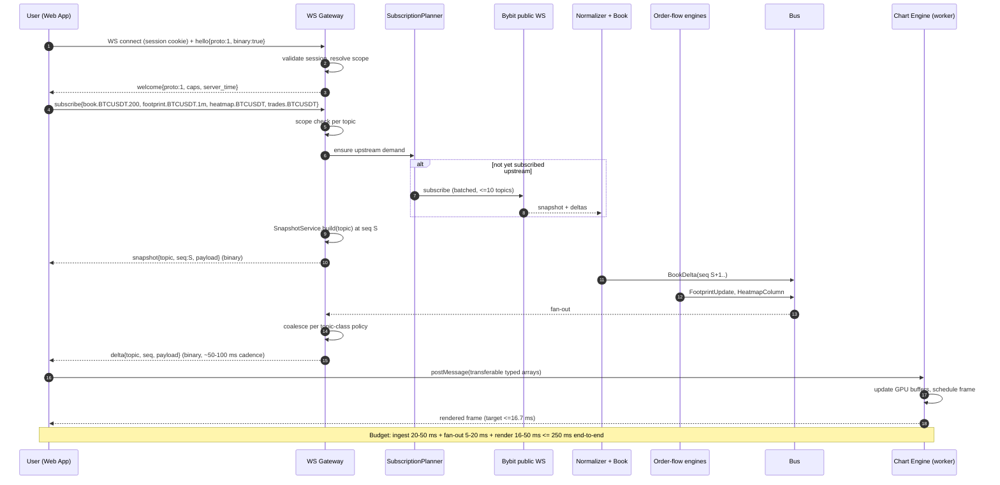

### 10.2 Order path — ticket → fan-out → native SL

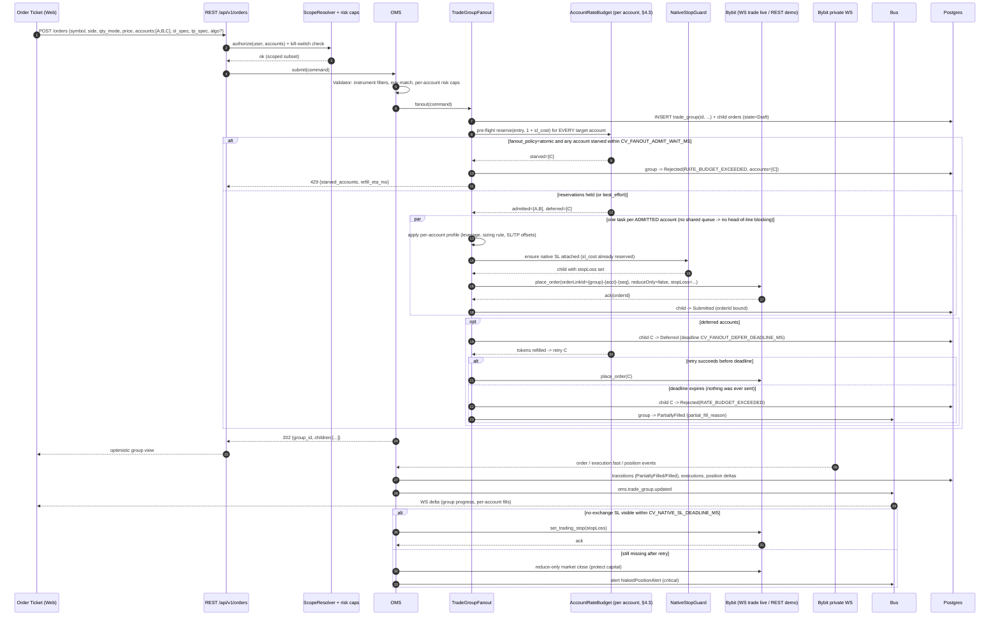

**Narrative — why admission control precedes placement.** Bybit rate limits are per-UID, so the accounts in one group hold _independent_ budgets that can be exhausted independently (e.g. account C also runs a grid rule that just burned its `entry` bucket). Discovering that mid-loop would leave a group half-placed with no defined semantics, so the fan-out reserves for all accounts first (§4.3) and then either refuses the whole ticket (`atomic`) or proceeds with an explicit `PartiallyAdmitted` group (`best_effort`). Placement itself runs one `asyncio.Task` per account — never a sequential loop — so a throttled account cannot head-of-line-block its siblings; observed cross-account skew is bounded by the defer deadline and tracked by `oms_fanout_skew_seconds`. The `critical` bucket is reserved so that the native-SL attach and the reduce-only escape hatch at the bottom of this diagram can always execute even on an account whose entry budget is at zero — which is what makes principle P4 hold under rate pressure rather than only under ideal conditions. Trailing stops in `sl_spec`/`tp_spec` are translated from percent/ATR units to Bybit's absolute price distance by `OMS.TrailingTranslator` before this diagram's `place_order`/`set_trading_stop` calls (§9 rule 6).

### 10.3 Rule firing (ATR trailing stop, armed)

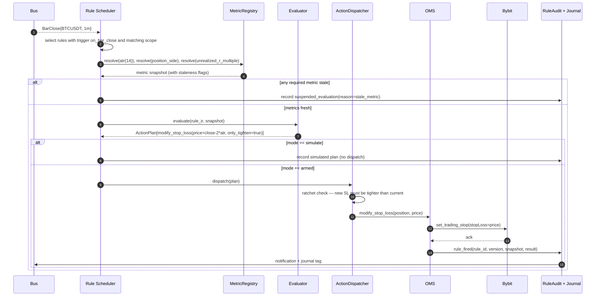

### 10.4 Reconnect and resync

```mermaid
sequenceDiagram
    autonumber
    participant WD as Watchdog
    participant CM as ConnectionManager
    participant BY as Bybit
    participant BK as Book Engine
    participant OMS as OMS Reconciler
    participant GW as WS Gateway
    participant U as Web App

    WD->>WD: pong deadline missed (10 s) OR book stale > 2 s
    WD->>CM: force_reconnect(socket)
    CM->>BY: close + reconnect (backoff 0.5 s..30 s + jitter, rate-budget aware)
    CM->>BY: re-auth (private) + resubscribe (batches of <=10 topics)
    BY-->>BK: fresh snapshot per book topic
    BK->>BK: state DESYNCED -> SNAPSHOT_PENDING -> LIVE; buffered deltas with seq > snapshot applied
    BK->>GW: BookSnapshot(new seq domain)
    GW-->>U: control frame resync_required{topic} then snapshot{topic, seq}
    U->>U: drop local state for topic, adopt snapshot, resume deltas
    par private path
        CM->>BY: private WS re-auth
        OMS->>BY: GET /v5/order/realtime + /v5/position/list
        OMS->>BY: GET /v5/execution/list (gap window = last_seen_ts .. now)
        OMS->>OMS: diff by orderLinkId; emit corrections; resolve Unknown orders
        OMS-->>U: oms snapshot delta (corrected state)
    end
    Note over WD,U: If the private path stays down > CV_KILLSWITCH_ON_DISCONNECT_S and the account opted in,<br/>the watchdog flattens. The native exchange SL remains the unconditional floor either way.
```

### 10.5 Replay session

```mermaid
sequenceDiagram
    autonumber
    participant U as Web App (Replay screen)
    participant API as REST /api/v1/replay
    participant SP as SessionPlanner
    participant SRC as EventSource (QuestDB + DuckDB/Parquet)
    participant CLK as Virtual Clock
    participant INJ as Injector
    participant PIPE as Normalizer/Book/Bars/Order-flow (replay namespace)
    participant GW as WS Gateway
    participant PM as Paper Matcher

    U->>API: POST /replay/sessions {symbol, from, to, speed, paper:true}
    API->>SP: plan(symbol, range)
    SP->>SRC: probe coverage (hot vs cold, gaps)
    SP-->>API: coverage report (explicit gap list)
    API-->>U: session_id + coverage (UI shows gaps honestly)
    U->>API: POST /replay/{id}/play {speed: 4}
    CLK->>INJ: tick(virtual_time)
    INJ->>SRC: next events <= virtual_time (merged by exch_ts, stable tie-break)
    INJ->>PIPE: publish on replay.{session}.* topics
    PIPE->>GW: derived snapshots/deltas, replay-scoped
    GW-->>U: same frame types as live (engine code is identical)
    opt simulated trading
        U->>API: POST /orders {account: paper-1, session: id}
        API->>PM: simulate against replayed book
        PM-->>U: simulated fills, ledger updates
    end
    U->>API: POST /replay/{id}/step {unit: bar|tick, n: 1}
    U->>API: DELETE /replay/{id}
    Note over U,GW: Live subscriptions are unaffected; a session may keep chosen panes live while others replay.
```

---

## 11. Failure modes and recovery

### 11.1 Register

| ID  | Failure                                   | Detection                                      | Immediate behaviour                                                                                                                                       | Recovery                                                                                                                 | Residual risk                                                                                           |
| --- | ----------------------------------------- | ---------------------------------------------- | --------------------------------------------------------------------------------------------------------------------------------------------------------- | ------------------------------------------------------------------------------------------------------------------------ | ------------------------------------------------------------------------------------------------------- |
| F1  | Public WS disconnect                      | pong deadline, topic staleness                 | Mark topics stale, UI banner, keep last state                                                                                                             | Reconnect with backoff, resubscribe, re-snapshot books                                                                   | Brief data gap in recording (logged as a coverage gap)                                                  |
| F2  | Book sequence gap                         | `SequenceTracker`                              | Book → DESYNCED, stop derived publication for that symbol                                                                                                 | Force resubscribe, fresh snapshot, replay buffered deltas                                                                | Footprint/heatmap have a short hole; marked in UI                                                       |
| F3  | Private WS disconnect                     | pong/staleness                                 | "EXECUTION DEGRADED", rules suspended, submits force a REST confirm                                                                                       | Re-auth + full reconciliation                                                                                            | Fills discovered late; native SL still protects                                                         |
| F4  | REST 10018 rate limit                     | header + error code                            | Token bucket backs off; non-critical calls shed; order submits rejected with a clear code rather than silently queued                                     | Budget recovery; per-UID tracker tightens                                                                                | A burst of fan-out orders may partially reject → group marked `PARTIAL`, UI offers retry of failed legs |
| F5  | Clock drift (10002)                       | ClockGuard + error code                        | Order entry blocked; explicit modal                                                                                                                       | chrony resync; offset fallback                                                                                           | None once resynced                                                                                      |
| F6  | Order ack lost (timeout)                  | no ack within 3 s                              | Order → `Unknown`; **no blind retry**                                                                                                                     | Reconciler resolves by `orderLinkId` in ≤2 passes                                                                        | Short window of uncertain state, surfaced in UI                                                         |
| F7  | Backend crash with open positions         | process supervisor / health gap                | Positions remain protected by native exchange SL (P4)                                                                                                     | On restart: self-check → reconcile → resume; rules re-armed only after reconciliation completes                          | Emulated algos (TWAP/iceberg/chase) pause; supervisor resumes or cancels per algo policy                |
| F8  | Postgres unavailable                      | health probe                                   | Order entry blocked; market data continues                                                                                                                | Retry with backoff; alert                                                                                                | Journal/audit writes buffered in a bounded on-disk WAL, replayed on recovery                            |
| F9  | QuestDB unavailable                       | write errors                                   | Recorder spills to on-disk WAL; live views unaffected                                                                                                     | Replay WAL on recovery                                                                                                   | If spill exceeds 1 GB, lowest-priority symbols stop recording                                           |
| F10 | Disk full                                 | budget monitor                                 | Auto-record paused at 90 %; hard stop at 95 % with alert                                                                                                  | Retention run / manual purge / roll-off                                                                                  | Coverage gap for unrecorded period                                                                      |
| F11 | Slow/stuck WS client                      | drain time > 2 s                               | Connection marked SLOW, heavier conflation; close 1013 at 5 s                                                                                             | Client reconnects and re-snapshots                                                                                       | Brief visual jump on reconnect                                                                          |
| F12 | Key compromise suspected                  | manual or anomaly alert                        | Owner FREEZE; keys revoked                                                                                                                                | Rotate keys (create/delete endpoints), re-verify withdrawal-off + IP allowlist                                           | Requires 48 h wait for API keys on brand-new accounts                                                   |
| F13 | Rule storm (rule fires repeatedly)        | dispatch-rate metric                           | Per-rule cooldown + max-actions-per-minute cap; auto-disarm with alert on breach                                                                          | Owner reviews audit trail and re-arms                                                                                    | Missed legitimate actions during the cap window                                                         |
| F14 | Fan-out partial failure                   | per-child ack                                  | Group state `PARTIAL`; successful legs already carry native SLs; UI shows per-account result and offers retry/rollback (reduce-only close of filled legs) | Manual or one-click remediation                                                                                          | Temporary asymmetric exposure across accounts                                                           |
| F15 | Electron GPU process crash                | renderer event                                 | Engine falls back to a reduced-quality path; chart reloads                                                                                                | Auto-restart renderer; if WebGL2 unavailable, engine enters `degraded-2d` mode (candles + ladder only, heatmap disabled) | Reduced visual fidelity until restart                                                                   |
| F16 | Instrument filter drift (tick/lot change) | daily `instruments-info` refresh + reject code | Reject with a precise message; refresh cache                                                                                                              | Cache refresh every 6 h and on reject                                                                                    | One rejected order                                                                                      |
| F17 | Demo/live confusion                       | environment guard                              | Every order carries the environment; a mismatch is rejected server-side before send                                                                       | —                                                                                                                        | None (structural, P9)                                                                                   |
| F18 | Replay/live state bleed                   | namespace assertion in tests and at runtime    | Replay topics are namespaced; a cross-namespace publish raises and is alerted                                                                             | —                                                                                                                        | None if assertion holds; covered by a dedicated test                                                    |

### 11.2 Recovery objectives

- **RTO** (backend restart to fully reconciled trading): ≤ 90 s.
- **RPO** (relational data): ≤ 5 min (continuous archiving + nightly base backup).
- **RPO** (market recording): best-effort; gaps are recorded explicitly in a `coverage` table and shown in the Replay UI rather than silently interpolated.
- **Backups**: nightly `pg_dump` + WAL archive; Parquet tree rsynced; monthly restore drill is a checklist item in `07-release-and-prr.md`.

---

## 12. Observability

### 12.1 Metrics (Prometheus, all with `env` label)

The machine-readable catalogue is `services/api/candleviewer/observability/metrics_catalogue.py` (E04-T03): every row below is declared there with type, unit, labels, alert and owning epic; entries whose module has not shipped are `planned`. The `env` label is injected by the registry, never by call sites. Label values never carry emails, user names, order ids, tokens or exchange error text. `topic_staleness_seconds` is computed at scrape time from the last-update timestamp. `oms_rate_reject_total` and `bybit_rate_remaining` also serve SR-125 rate-limit rejections; `bybit_clock_drift_ms` covers clock drift, `disk_used_ratio` the disk high-watermark and `ws_resync_total` the WS desync rate.

| Domain                     | Metric                                                                                                                     | Type                    | Purpose / alert                                                                                                                                                                    |
| -------------------------- | -------------------------------------------------------------------------------------------------------------------------- | ----------------------- | ---------------------------------------------------------------------------------------------------------------------------------------------------------------------------------- |
| Runtime                    | `event_loop_lag_seconds`                                                                                                   | histogram               | p99 ≤ 50 ms; alert > 100 ms for 5 min                                                                                                                                              |
| Ingestion                  | `ws_connection_state{socket}`                                                                                              | gauge                   | alert on `down` > 10 s                                                                                                                                                             |
| Statechart                 | `cv_machine_live_count{kind}`                                                                                              | gauge                   | live interpreters per family; **alert on monotonic growth** (the reaper is failing)                                                                                                |
| Statechart                 | `cv_machine_deferred_depth{kind}`                                                                                          | gauge                   | deferral-buffer depth; alert above 0 for > 5 s — a stranded buffer is otherwise invisible                                                                                          |
| Statechart                 | `cv_machine_unhandled_events_total{kind,event}`                                                                            | counter                 | events with no handler; a non-zero value for an undeclared event name is a typo'd send                                                                                             |
| Statechart                 | `cv_machine_quarantined_total{kind}`                                                                                       | counter                 | faulted transitions; **every quarantine pages P1**                                                                                                                                 |
| Statechart                 | `cv_machine_transition_seconds{kind}`                                                                                      | histogram               | transition latency; feeds the ≥ 8,000 ev/s aggregate budget                                                                                                                        |
| Statechart                 | `cv_machine_chain_trips_total{kind}`                                                                                       | counter                 | runaway-chain latches (`chain_trips > 0`, CV-C63); **pages P1**, entity latched degraded                                                                                           |
| Statechart                 | `cv_machine_dropped_receipts_total{kind}`                                                                                  | counter                 | receipts dropped (`dropped_receipts`/`on_receipt_dropped`, CV-C69); alert on any                                                                                                   |
| Statechart                 | `cv_machine_transitions_total{kind}`                                                                                       | counter                 | committed transitions per family (`CvMetricsPlugin`, E50-T60)                                                                                                                      |
| Statechart                 | `cv_machine_timer_handles{kind}`                                                                                           | gauge                   | live `after:` timer handles per family; alert on monotonic growth (leaked timers)                                                                                                  |
| Statechart                 | `cv_machine_send_refused_total{kind,reason}`                                                                               | counter                 | inbox `overflow_policy="refuse"` refusals; order lane pages                                                                                                                        |
| Statechart                 | `cv_statechart_library_info{version,sha256}`                                                                               | gauge                   | pinned `xstate-statemachine` build identity (always `0.9.1`); a mismatch with the lock fails readiness                                                                             |
| Rule engine                | `cv_rule_prefilter_rejection_ratio`                                                                                        | gauge                   | must hold ≥ 0.99; below that, rule dispatch is disabled and alerts (the budget is shared with the OMS)                                                                             |
| Ingestion                  | `ws_messages_total{topic}` / `ws_message_bytes_total`                                                                      | counter                 | throughput, cost sizing                                                                                                                                                            |
| Ingestion                  | `topic_staleness_seconds{topic}`                                                                                           | gauge                   | alert book > 2 s, trades > 10 s                                                                                                                                                    |
| Ingestion                  | `ingest_queue_depth{stage}`                                                                                                | gauge                   | saturation                                                                                                                                                                         |
| Book                       | `book_resync_total{symbol,reason}`                                                                                         | counter                 | alert > 5/min                                                                                                                                                                      |
| Engines                    | `engine_process_seconds{engine}`                                                                                           | histogram               | CPU budget per engine                                                                                                                                                              |
| Gateway                    | `ws_clients`, `ws_topics_per_client`                                                                                       | gauge                   | capacity                                                                                                                                                                           |
| Gateway                    | `ws_conflated_total`, `ws_resync_total`, `ws_slow_conn_total`                                                              | counter                 | client-health                                                                                                                                                                      |
| Gateway                    | `ws_fanout_latency_seconds`                                                                                                | histogram               | bus → socket, p99 ≤ 20 ms                                                                                                                                                          |
| OMS                        | `order_submit_seconds{transport,env}`                                                                                      | histogram               | click→ack p99 ≤ 500 ms                                                                                                                                                             |
| OMS                        | `orders_total{state,env}`                                                                                                  | counter                 | reject-rate alerting                                                                                                                                                               |
| OMS                        | `oms_unknown_orders`                                                                                                       | gauge                   | **alert > 0 for 60 s**                                                                                                                                                             |
| OMS                        | `naked_position_alerts_total`                                                                                              | counter                 | **page immediately**                                                                                                                                                               |
| OMS                        | `oms_rate_reject_total`, `bybit_rate_remaining{endpoint_group}`                                                            | counter/gauge           | budget health                                                                                                                                                                      |
| OMS                        | `bybit_clock_drift_ms`                                                                                                     | gauge                   | alert > 1500 ms                                                                                                                                                                    |
| Rules                      | `rule_evaluations_total`, `rule_fires_total{rule_id}`, `rule_autodisarm_total`                                             | counter                 | rule-storm detection                                                                                                                                                               |
| Recorder                   | `recorder_rows_total{stream}`, `recorder_spill_bytes`, `disk_used_ratio`                                                   | counter/gauge           | alert ratio > 0.8                                                                                                                                                                  |
| Storage                    | `questdb_write_seconds`, `pg_pool_in_use`, `pg_query_seconds`                                                              | histogram/gauge         | saturation                                                                                                                                                                         |
| Security (SR-125)          | `auth_login_failures_total{method}`, `auth_lockouts_total`, `auth_stepup_failures_total`, `authz_denied_total{permission}` | counter                 | brute-force / privilege probing (E09)                                                                                                                                              |
| Security (SR-125)          | `credential_verification_failures_total{reason}`                                                                           | counter                 | key revoked or withdrawal permission on (E27)                                                                                                                                      |
| Security (SR-125)          | `rule_circuit_breaker_trips_total`                                                                                         | counter                 | alert on any (E35)                                                                                                                                                                 |
| Security (SR-125)          | `audit_chain_verification_failures_total`, `egress_ip_changes_total`                                                       | counter                 | page / alert on any (E43)                                                                                                                                                          |
| Self                       | `metric_cardinality_breach_total{metric}`, `metrics_registry_series`                                                       | counter/gauge           | a metric hit its `max_series`; new label values refused (E04-T03)                                                                                                                  |
| Latency (E04-T06)          | `ingest_stage_seconds{stage}`                                                                                              | histogram               | per-stage attribution, `stage` ∈ exchange·parse·derive·fanout (exchange is offset-corrected, omitted when no clock offset); `LatencyBudgetBreach` annotation names the worst stage |
| Support bundle (E04-S02)   | `support_bundle_generations_total{result}`, `support_bundle_duration_seconds`, `support_bundle_bytes`                      | counter / histogram     | Ticket alert `SupportBundleSecretDetected` on `result="secret_detected"`; a scan hit means redaction failed upstream                                                               |
| Latency (E04-T06)          | `e2e_tick_to_paint_seconds`                                                                                                | histogram               | paired 1-in-`CV_TELEMETRY_SAMPLE_N` receipt→paint; p95 < 100 ms / p99 < 250 ms (budget #3); never assembled from stage percentiles                                                 |
| Frontend (pushed, E04-T06) | `fe_frame_time_ms{screen}`, `fe_dropped_frames_total{screen}`, `fe_ws_decode_ms{screen}`, `fe_gpu_memory_mb{screen}`       | histogram/counter/gauge | engine regressions in the field; `POST /telemetry/frontend`, pre-bucketed, 1 push/10 s/session, `screen` = sitemap route id (≤8 series; chart-bearing screens only)                |
| Frontend (pushed, E04-T06) | `telemetry_rejected_total{reason}`                                                                                         | counter                 | `reason` ∈ too_large·rate_limited·invalid·unauthenticated; payloads never logged                                                                                                   |

### 12.2 Logging

Structured JSON (`structlog`) to stdout, collected by the compose logging driver. Mandatory fields: `ts`, `level`, `logger`, `event`, `env`, `request_id`/`conn_id`, `user_id`, `account_id`, `symbol`, `order_link_id`, `trade_group_id`, `latency_ms`. Redaction filter strips API keys, signatures, cookies and TOTP codes at the formatter level (defence in depth: a unit test asserts a known secret never appears in output).

### 12.3 Tracing

OpenTelemetry spans for the two paths that matter: **order path** (`http.request → oms.validate → oms.fanout → exchange.place_order → private_ws.fill`) and **replay session start**. Market-data hot loops are _not_ traced per event (sampling would distort the loop); they are covered by metrics instead.

### 12.4 Dashboards (provisioned in `infra/grafana`)

Shipped (E04-S01): generated by `infra/grafana/generate_dashboards.py`, committed under `infra/grafana/dashboards/`, linted against the metric catalogue by `infra/grafana/lint_dashboards.py`; every dashboard has an `env` variable and deploy annotations from `build_info`; nightly export via `infra/grafana/snapshot_export.py`.

1. **System health** — loop lag, CPU/RAM, connection states, staleness, queue depths.
2. **Market data** — messages/s per topic, resync rate, engine timings, fan-out latency.
3. **Trading** — submit latency, order states, reject reasons, rate budget, unknown orders, naked-position alerts.
4. **Rules** — evaluations, fires, suspensions, auto-disarms per rule.
5. **Storage** — ingest rate, disk used vs cap, retention/roll-off runs, spill.
6. **Frontend** — frame times, dropped frames, decode times, per-screen p95.

### 12.5 Alert policy

Shipped (E04-T05/T07): rules live in `infra/prometheus/alerts/`, only two severities exist (`page`, `ticket`), and every rule's `runbook_url` resolves to an anchor in `07-release-and-prr.md` section 9 (CI: `infra/alertmanager/check_alert_rules.py`). Additional shipped rules: `Watchdog` (dead-man), `ExpectedMetricMissing*` absent-guards, `SyntheticAlert` (drill), `AlertmanagerNotificationsFailed`, clock, latency-SLO, auth, credential, rate-limit and egress rules. The metric table above is verified against `metrics_catalogue.py` by `test_architecture_doc_sync.py`. Module authors follow `docs/plan/observability-contract.md`.

Page (critical): `naked_position_alerts_total` > 0, `oms_unknown_orders` > 0 for 60 s, Postgres down, clock drift blocking trading, disk > 95 %.
Ticket (warning): public WS down > 60 s, resync rate high, loop lag > 100 ms, disk > 80 %, rule auto-disarm, demo/live mismatch attempts.

---

## 13. Cross-cutting concerns

### 13.1 Security architecture (summary; authoritative detail in `04-security-program.md`)

- **AuthN**: password (Argon2id) + mandatory TOTP; server-side sessions; no JWT in localStorage.
- **AuthZ**: `ScopeResolver` on every REST route and every WS subscribe; the mapping user → accounts → keys is the single authority (P8).
- **Secrets**: envelope encryption; KEK on the Windows host keychain, injected at process start; DEK per key row; rotation every 90 days; a startup assertion refuses trading if any key has withdrawal enabled or no IP allowlist.
- **Audit**: hash-chained append-only log; Owner and Viewer may read; nobody may mutate.
- **Network**: loopback/WSL-internal binds only; Tailscale ACLs per user; no public ingress.
- **Supply chain**: pinned dependencies (`uv.lock`, `pnpm-lock.yaml`), Dependabot, `pip-audit`/`npm audit`, Trivy on images, CodeQL/Semgrep/Bandit, secret scanning, SBOM per release.
- **Electron hardening**: `contextIsolation`, no `nodeIntegration`, strict CSP, allow-list preload, `webSecurity` on, navigation and `window.open` blocked, signed installers, auto-update over HTTPS with signature verification.
- **STRIDE per epic** as required by the planning brief; threat-model artefacts live beside the epic in the backlog.

### 13.2 Performance budgets (authoritative detail in `06-performance-and-load-standard.md`)

| Path                                | Budget                                                   |
| ----------------------------------- | -------------------------------------------------------- |
| Bybit event → backend derived event | p99 ≤ 50 ms                                              |
| Bus → client socket (fan-out)       | p99 ≤ 20 ms                                              |
| WS frame decode in worker           | p95 ≤ 4 ms                                               |
| Chart frame                         | ≤ 16.7 ms at 60 fps with 100k bars + footprint + heatmap |
| Total tick → pixel                  | ≤ 250 ms                                                 |
| Order click → exchange ack          | p99 ≤ 500 ms (live WS trade), ≤ 800 ms (demo REST)       |
| Fan-out of 5 accounts               | all legs submitted within 1.5 s                          |
| Cold app start to first chart frame | ≤ 3 s (Electron), ≤ 4 s (browser)                        |

### 13.3 Accessibility and internationalisation hooks

The chart engine exposes an accessible parallel representation (see `26-chart-engine-design.md` §12): every chart has a keyboard-navigable data cursor with live-region announcements, and all colour encodings have a non-colour redundant channel (pattern/label). Numbers and times are formatted through a single locale service (default `en-GB`, UTC display with an optional local-time toggle). No text is baked into textures except SDF glyphs, which are generated from the active font at runtime.

### 13.4 Data-flow classification

| Data                        | Classification               | Storage              | Retention                                   |
| --------------------------- | ---------------------------- | -------------------- | ------------------------------------------- |
| API keys                    | Secret                       | Postgres (encrypted) | Until rotated/revoked                       |
| Session tokens              | Secret                       | Postgres             | 12 h absolute                               |
| Orders/executions/positions | Confidential                 | Postgres             | Indefinite (journal)                        |
| Audit log                   | Confidential, tamper-evident | Postgres             | Indefinite                                  |
| Market data (public)        | Internal                     | QuestDB → Parquet    | 30 d hot default, pinned forever if flagged |
| Raw WS payloads             | Internal (redacted)          | Parquet              | 7 d (forensics)                             |
| Frontend telemetry          | Internal                     | Prometheus           | 15 d                                        |

---

## 14. Architectural risks and their controls

| Risk                                                   | Likelihood  | Impact       | Control                                                                                                                                                                                                                                                                                                                                                                                                                                                                   | Owner              |
| ------------------------------------------------------ | ----------- | ------------ | ------------------------------------------------------------------------------------------------------------------------------------------------------------------------------------------------------------------------------------------------------------------------------------------------------------------------------------------------------------------------------------------------------------------------------------------------------------------------- | ------------------ |
| Custom WebGL engine underdelivers vs schedule          | Medium      | High         | Engine spike first (S1) with a hard go/no-go; Lightweight Charts v5 remains the documented fallback chassis (ADR-0002); engine milestones are independently releasable (doc 26 §14)                                                                                                                                                                                                                                                                                       | Chart-engine owner |
| Footprint text density kills frame budget              | Medium      | High         | SDF atlas + instanced glyph batching + aggressive LOD; benchmark gate in CI                                                                                                                                                                                                                                                                                                                                                                                               | Chart-engine owner |
| QuestDB does not meet real query shapes                | Low         | Medium       | **Resolved** — Spike S2 (E07-K01) ran the real footprint/replay/CVD query shapes on both engines; corrected re-run (QA bug #1562) confirms QuestDB meets target on all six shapes A-F and is faster than TimescaleDB on every one (`ADR-0022-hot-tier-questdb-vs-timescaledb.md`); ADR-0003 stands unamended. Storage access remains behind a repository interface so TimescaleDB stays a swap, not a rewrite, pending `E07-S07`'s real-container confirmation (ADR-0003) | Backend lead       |
| Python event loop saturates at higher symbol counts    | Medium      | Medium       | Pre-designed escape hatches (§4.1 rule 4); loop-lag SLO with an alert that triggers the decision procedure                                                                                                                                                                                                                                                                                                                                                                | Architect          |
| Emulated algos misbehave while the process is down     | Medium      | **Critical** | P4 native SL floor, watchdog, reconciliation, opt-in disconnect-flatten                                                                                                                                                                                                                                                                                                                                                                                                   | Backend lead       |
| Bybit API changes break adapters                       | Medium-High | Medium       | Adapter isolation, contract tests on fixtures, demo smoke tests in CI, changelog watch task each sprint                                                                                                                                                                                                                                                                                                                                                                   | Backend lead       |
| Rate limits rejecting protective orders during fan-out | Low-Medium  | High         | Per-UID shared budget with a reserved headroom slice for protective/reduce-only orders (never consumed by entries)                                                                                                                                                                                                                                                                                                                                                        | Backend lead       |
| Electron vs Tauri decision drags                       | Low         | Medium       | ADR-0011 is `proposed` with a decision deadline tied to spike S1; Electron is the default so no work is blocked                                                                                                                                                                                                                                                                                                                                                           | Architect          |
| Manager isolation bug leaks another manager's data     | Low         | High         | Scope checks centralised in one resolver; contract tests assert 403 for every cross-scope route and topic; pen-test before Live enablement                                                                                                                                                                                                                                                                                                                                | Security engineer  |

---

## 15. Spikes that gate this architecture

| ID  | Spike                   | Question                                                                                                                                     | Exit criteria                                                           | Gates                                                                             |
| --- | ----------------------- | -------------------------------------------------------------------------------------------------------------------------------------------- | ----------------------------------------------------------------------- | --------------------------------------------------------------------------------- |
| S1  | Chart engine core       | Can a custom WebGL2 engine render 100k candles + footprint text cells + a 100 ms heatmap at 60 fps in Chromium, Electron and Tauri/WebView2? | Benchmark report meeting doc 26 §13 thresholds on the reference machine | ADR-0002, ADR-0011, R1                                                            |
| S2  | QuestDB vs TimescaleDB  | Do real footprint/replay query shapes meet latency targets?                                                                                  | Query suite p95 documented for both                                     | **Resolved** — E07-K01, `docs/plan/spikes/S2-hot-tier.md`; ADR-0003, ADR-0022, R2 |
| S3  | Bybit private WS client | Custom asyncio client vs pybit: reliability under load, demo/live parity                                                                     | 24 h soak with zero missed executions                                   | ADR-0004, R3                                                                      |
| S4  | Multi-account fan-out   | Latency and rate budget with 3–5 sub-accounts on demo                                                                                        | All legs < 1.5 s, no 10018 under the designed budget                    | ADR-0008, R3                                                                      |
| S5  | Binary WS encoding      | Does the binary frame layout beat JSON enough to justify it for heatmap/footprint?                                                           | ≥40 % bandwidth and ≥30 % decode-time reduction                         | ADR-0005, R2                                                                      |
| S6  | Recorder sizing         | Real GB/day for the recorded set                                                                                                             | 7-day measurement replaces the estimate                                 | ADR-0015, R1                                                                      |
| S7  | Rate-limit truth        | Actual `X-Bapi-Limit` behaviour per endpoint group on a real UID                                                                             | Documented per-group budgets                                            | ADR-0008, R3                                                                      |

---

## 16. ADR index

All ADRs live in `docs/plan/27-adrs/` in MADR format. Status values: `decided` (binding now), `proposed` (decision deadline stated inside).

> ⚠️ **Read this before using the table:** two ADRs are not fully binding — **ADR-0011 (Electron vs Tauri)**, marked `proposed`, pending spike S1 (§15), decision deadline **end of Sprint 03**. Every other ADR in this index is `decided` and binding today. If you are scanning this table for "what is settled", ADR-0011 is the only row you must not treat as settled; it is flagged with † below and cross-referenced in §15 (spike S1) and §14 (risk register).

| ADR                                                                   | Title                                                         | Status                                    | Summary                                                                                                                                                                                                                                                                   |
| --------------------------------------------------------------------- | ------------------------------------------------------------- | ----------------------------------------- | ------------------------------------------------------------------------------------------------------------------------------------------------------------------------------------------------------------------------------------------------------------------------- |
| [ADR-0001](27-adrs/ADR-0001-stack-selection.md)                       | Technology stack selection                                    | decided                                   | React + TS web app, Electron shell, Python 3.12 asyncio FastAPI modular monolith                                                                                                                                                                                          |
| [ADR-0002](27-adrs/ADR-0002-custom-webgl-chart-engine.md)             | Custom WebGL chart engine                                     | decided                                   | Build a bespoke WebGL2 engine; Lightweight Charts v5 is the documented fallback                                                                                                                                                                                           |
| [ADR-0003](27-adrs/ADR-0003-storage-tiers.md)                         | Three-tier storage                                            | decided                                   | QuestDB hot, Parquet/DuckDB cold, Postgres relational                                                                                                                                                                                                                     |
| [ADR-0004](27-adrs/ADR-0004-modular-monolith.md)                      | Modular monolith with an internal bus                         | decided                                   | One process, bus-mediated modules, pre-designed split path                                                                                                                                                                                                                |
| [ADR-0005](27-adrs/ADR-0005-ws-protocol-and-binary-encoding.md)       | WS protocol and binary encoding                               | decided                                   | Snapshot+delta with sequence numbers; JSON control frames, binary market-data frames                                                                                                                                                                                      |
| [ADR-0006](27-adrs/ADR-0006-oms-state-machine.md)                     | OMS state machine and idempotency                             | decided                                   | Explicit states incl. `Unknown`; `orderLinkId` idempotency; reconciliation-only resolution                                                                                                                                                                                |
| [ADR-0007](27-adrs/ADR-0007-rule-ir.md)                               | Single rule IR for both editors                               | decided                                   | Form editor and node graph compile to one IR; round-trip guaranteed                                                                                                                                                                                                       |
| [ADR-0008](27-adrs/ADR-0008-trade-group-fanout.md)                    | Trade-group fan-out model                                     | decided                                   | One ticket → N per-account children with profiles, group state, reserved rate headroom                                                                                                                                                                                    |
| [ADR-0009](27-adrs/ADR-0009-secrets-and-key-management.md)            | Secrets and API-key management                                | decided                                   | Envelope encryption, KEK on the Windows host, rotation, withdrawal-off assertion                                                                                                                                                                                          |
| [ADR-0010](27-adrs/ADR-0010-auth-and-rbac.md)                         | Authentication and RBAC                                       | decided                                   | Password + TOTP, server-side sessions, Owner/Manager/Viewer scopes, admin inside the web app                                                                                                                                                                              |
| [ADR-0011](27-adrs/ADR-0011-electron-vs-tauri.md)                     | Electron vs Tauri desktop shell **†**                         | **proposed (the only non-decided ADR)**   | Electron is the default; Tauri measured in spike S1; decision deadline end of Sprint 03                                                                                                                                                                                   |
| [ADR-0012](27-adrs/ADR-0012-testing-pyramid.md)                       | Testing pyramid and fixtures                                  | decided                                   | Unit/contract/integration/E2E/load/security layers with recorded fixtures and golden files                                                                                                                                                                                |
| [ADR-0013](27-adrs/ADR-0013-ci-pipeline.md)                           | CI/CD pipeline                                                | decided                                   | Required checks, parallel jobs, generated-code freshness gate, benchmark gate                                                                                                                                                                                             |
| [ADR-0014](27-adrs/ADR-0014-observability.md)                         | Observability stack                                           | decided                                   | Prometheus + Grafana + Alertmanager, structured logs, targeted tracing                                                                                                                                                                                                    |
| [ADR-0015](27-adrs/ADR-0015-recording-policy.md)                      | Recording and retention policy                                | decided                                   | Opt-in list + auto-record triggers, 30-day retention, pinning, roll-off, disk budget                                                                                                                                                                                      |
| [ADR-0016](27-adrs/ADR-0016-statechart-runtime.md)                    | Statechart contracts, executed by `xstate-statemachine` **‡** | **Accepted (2026-09-24)**                 | All long-lived lifecycles are XState-v5-compatible JSON contracts, executed **exclusively** by `xstate-statemachine==0.9.1` via `cv.statechart.factory` — no in-house shim, no dual-runtime. Hot paths are never statecharts                                              |
| [ADR-0017](27-adrs/ADR-0017-board-automation.md)                      | GitHub Projects v2 board automation: capability and limits    | decided                                   | Default `GITHUB_TOKEN` cannot write Projects v2 fields (verified); fine-grained PAT chosen; board DoD gates are detective (reopen+comment), preventive layer is PR-template + `pr-metadata` CI; bulk import needs a throttled importer                                    |
| [ADR-0018](27-adrs/ADR-0018-monorepo-tooling.md)                      | Monorepo tooling: pnpm+Turborepo (JS) and uv+Hatch (Python)   | decided                                   | pnpm workspaces + Turborepo for JS/TS; uv+Hatch over Poetry for Python packaging/locking                                                                                                                                                                                  |
| [ADR-0019](27-adrs/ADR-0019-visual-regression-tooling.md)             | Visual-regression tooling selection                           | decided                                   | Playwright `toHaveScreenshot` against committed PNG baselines, run in our own CI (no third-party screenshot upload); Chromatic rejected on Tailscale-only network-egress grounds; measured CI wall-clock/flake numbers deferred to E05-T04's first CI run                 |
| [ADR-0022](27-adrs/ADR-0022-hot-tier-questdb-vs-timescaledb.md)       | Hot tier: QuestDB confirmed for all six query shapes          | accepted-partial (owner approval pending) | Spike S2 (E07-K01) confirms QuestDB meets target on all six shapes A-F and beats TimescaleDB on every one; amends ADR-0003 (not superseded), reversal path not triggered; `E07-S07` (real-container PGWire/ILP re-run) is the only outstanding follow-up                  |
| [ADR-0024](27-adrs/ADR-0024-design-token-architecture-and-theming.md) | Design-token architecture and theming strategy                | decided                                   | Three-tier global→alias→component token model, Style Dictionary multi-target build (E05-T01), themes as alias re-pointing (dark canonical), density as alias-step selection not a second scale, WebGL theming via flat `theme-uniforms.json`, Electron main via flat JSON |

**‡** ADR-0016 is **Accepted**, in full: every lifecycle in `28-statechart-catalogue.md` is specified as statechart JSON, implementations conform to it, hot paths are never statecharts, and the library `xstate-statemachine==0.9.1` (tag `v0.9.1` = `45bb7f3`, sha256 `d832d4d9a17b7b8003f61fa0714a8e57eaff316bcd5dd699d81d410362687162`, PEP 740 attested) is the sole executor, adopted completely per the owner decision of 2026-09-24 (`docs/research/xstate/79-r14-final-readiness-verdict.md`, `docs/plan/29-statechart-adoption-plan.md`).

**†** ADR-0011 is `proposed`, not `decided`. Until spike S1 reports (end of Sprint 03), build against Electron, keep all shell-specific code behind `apps/desktop`'s `ShellPort` abstraction, and do **not** cite ADR-0011 as settled in design or security reviews. All 14 other ADRs are binding and may be cited as such.

---

## 17. Traceability

| Requirement source                                                                                      | Where it is satisfied here                                                                                                                                                  |
| ------------------------------------------------------------------------------------------------------- | --------------------------------------------------------------------------------------------------------------------------------------------------------------------------- |
| Owner decision 1 (custom WebGL engine)                                                                  | §2.1 C2, ADR-0002, `26-chart-engine-design.md`                                                                                                                              |
| Owner decision 2 (3-tier storage)                                                                       | §2.1 C16–C18, ADR-0003, §15 S2                                                                                                                                              |
| Owner decision 3 (USDT linear perps only)                                                               | §7.1, §9 capabilities, adapter scope                                                                                                                                        |
| Owner decision 4 (recording policy)                                                                     | §3.8, ADR-0015, §7.2 config keys                                                                                                                                            |
| Owner decision 5 (trade-group fan-out)                                                                  | §3.5, §10.2, ADR-0008                                                                                                                                                       |
| Owner decisions cross-cutting #4 (multi-account fan-out latency + per-account rate-limit budget)        | **§4.3** (bucket split, pre-flight reservation, `atomic`/`best_effort`, deferred drain, partial-failure matrix, metrics), §4.2 OMS row, §10.2 diagram + narrative, ADR-0008 |
| Research digest 06 (Bybit `trading-stop`: trailing is price-distance, needs a client translation layer) | **§9** `trailing_stop_unit` capability + adapter rule 6 (`OMS.TrailingTranslator`), §10.2 narrative, §18 glossary                                                           |
| Owner decision 6 (Tailscale only)                                                                       | §1, §2.2, §8.1, ADR-0010                                                                                                                                                    |
| Owner decision 7 (Electron primary)                                                                     | §2.1 C3, ADR-0011, §15 S1                                                                                                                                                   |
| Owner decision 8 (testnet smoke only)                                                                   | §7.1                                                                                                                                                                        |
| Owner decision 10 (heatmap colours)                                                                     | `26-chart-engine-design.md` §5.5 (green=bid, red=ask, themable)                                                                                                             |
| Owner decision 11 (both rule editors)                                                                   | §3.6, ADR-0007                                                                                                                                                              |
| Brief: no Android, no separate admin app                                                                | §0 scope guard, §2.1 C1 (admin routes inside the web app), P1                                                                                                               |
| Brief: native SL on every fan-out order                                                                 | P4, §3.5 `NativeStopGuard`, §10.2, §11.1 F7                                                                                                                                 |
| Brief: observability/alerting                                                                           | §12, ADR-0014                                                                                                                                                               |
| Brief: PRR/release gates                                                                                | §8.3, `07-release-and-prr.md`                                                                                                                                               |

---

## 18. Glossary

**Bar spec** — the tuple identifying a bar series (kind, parameter, price source, tick size). **Book delta** — an incremental L2 change. **Coarse ring** — the heatmap's second, lower-resolution GPU texture ring buffer (1–2 s columns instead of 100 ms) that backs zoomed-out views and long look-backs at constant memory cost; the fine ring covers the recent window, the coarse ring everything older (`26-chart-engine-design.md` §3.8). **Conflation** — replacing queued state updates with the newest one. **Coverage gap** — a period where the recorder was not running for a symbol. **Deferred child** — a fan-out child order admitted to the group but not yet sent because its account's `entry` rate bucket was exhausted (§4.3); it has never touched the exchange, so it can only become `Submitted` or `Rejected`, never `Unknown`. **Fan-out** — expanding one ticket into per-account child orders. **Footprint cell** — per-(bar, price) aggregation of bid/ask volume. **LOD ladder** — the ordered set of discrete detail levels the chart engine switches between as pixels-per-bar falls (full footprint text → abbreviated numbers → bid/ask bars → plain candle), each level with its own draw path and golden images; switching is hysteretic to avoid flicker (`26-chart-engine-design.md` §3.6). **Native SL** — a stop-loss resident on the exchange. **Rate bucket** — one of the three per-account token buckets (`critical`, `entry`, `poll`) that partition a Bybit UID's request budget. **Rule IR** — the canonical compiled representation of a rule. **Snapshot+delta** — a full state message followed by incremental updates sharing one sequence domain. **Trade group** — the record binding one ticket's child orders across accounts. **Trailing-stop unit** — the unit in which an exchange accepts a trailing stop; Bybit accepts **price distance only**, so percent/ATR trails are translated by the OMS at arming time (§9 rule 6). **Unknown order** — an order whose fate is undetermined until reconciliation.
