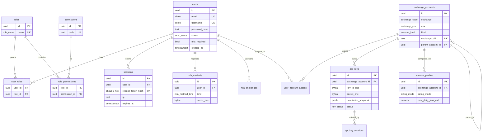
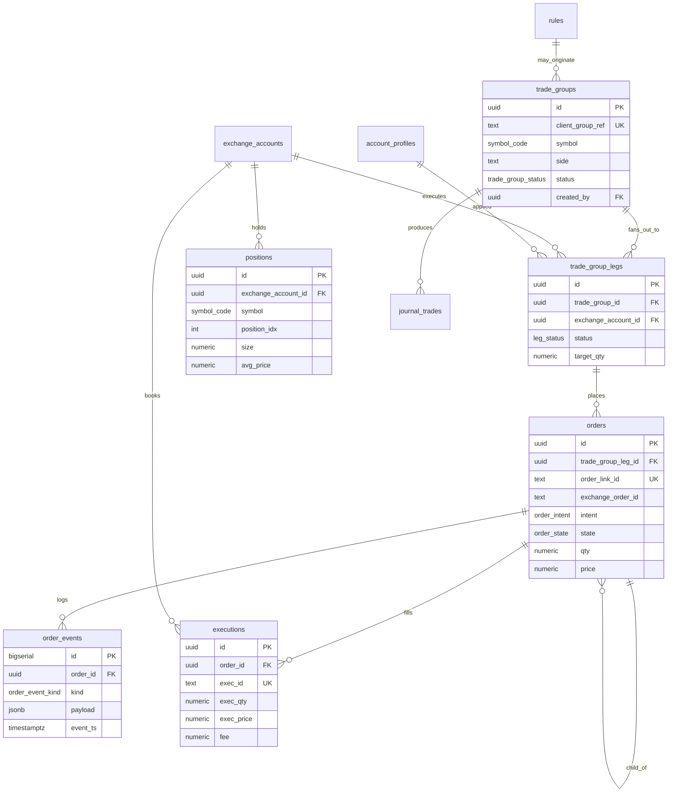
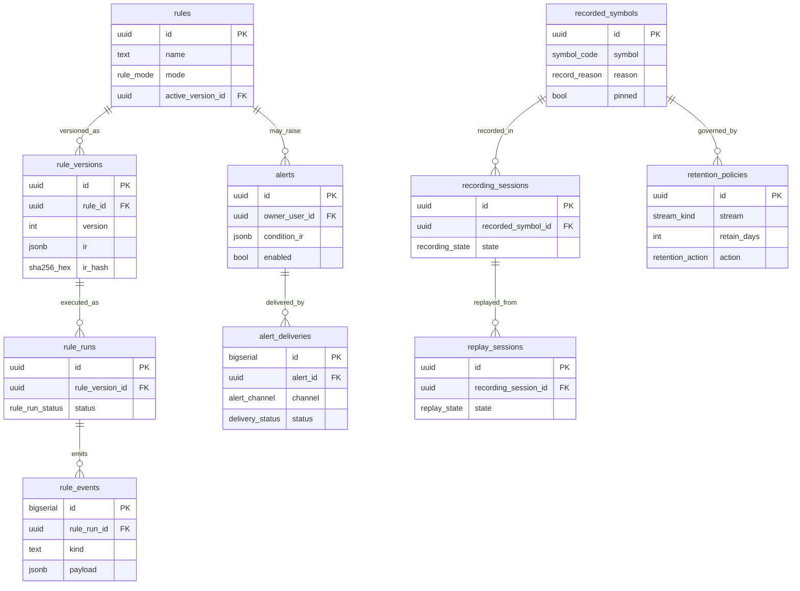
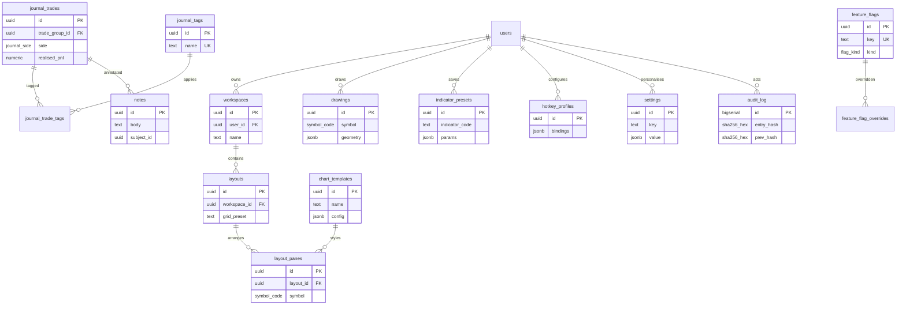
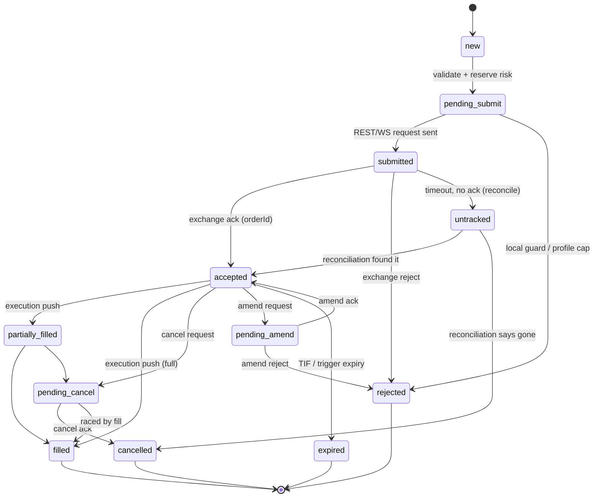
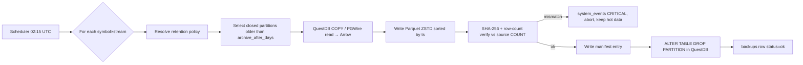
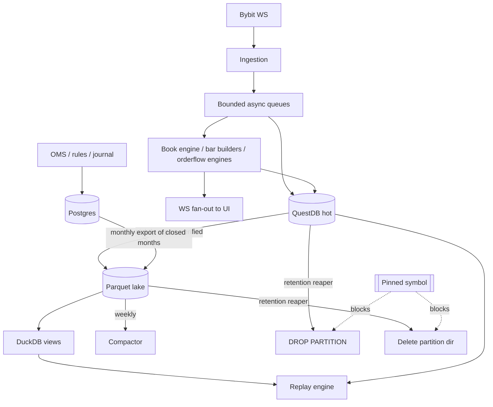
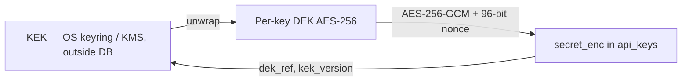

# 21 — Database Schema & Data Design (CandleViewer)

Status: **Locked for implementation** · Date: 2026-09-14 · Owner: Architect + Backend Lead · Scope: web app only (React + custom WebGL engine + Electron shell), Bybit USDT linear perpetuals only, no Android, no separate admin app.

This document is the single source of truth for CandleViewer persistence. It covers the three storage tiers decided in `docs/research/24-owner-decisions.md` §2:

| Tier            | Store                        | Role                                                                                                                                                  |
| --------------- | ---------------------------- | ----------------------------------------------------------------------------------------------------------------------------------------------------- |
| Relational      | **PostgreSQL 16**            | Users, RBAC, sessions/MFA, exchange accounts & API keys, profiles, OMS mirror, trade groups, rules, alerts, journal, workspaces, settings, audit, ops |
| Hot time-series | **QuestDB 8.x**              | Live tape, L2 deltas/snapshots, tickers, klines, liquidations, OI/funding, derived bars, footprint cells, profiles, engine metrics                    |
| Cold analytics  | **Parquet on disk + DuckDB** | Archive beyond hot retention, replay source, batch analytics, journal/backtest scans                                                                  |

Conventions used throughout:

- All timestamps are **UTC**. Postgres uses `timestamptz`; QuestDB uses `TIMESTAMP` (microsecond epoch, UTC by construction).
- Exchange event time is stored as `*_ts_ms` / QuestDB `ts` (Bybit `T`/`ts` field); local capture time is `recv_ts`. Both are always persisted — clock drift analysis and replay fidelity depend on it.
- Monetary/price/qty values in Postgres are `numeric(38,18)` (exact, no float drift). In QuestDB they are `DOUBLE` (space/perf) — QuestDB is analytics, Postgres is the ledger of record.
- Primary keys are `uuid` (v7, time-ordered, generated app-side by `uuid6.uuid7()`) except for high-volume append tables which use `bigserial`.
- Every mutable business table carries `created_at`, `updated_at`, and (where user-editable) `created_by`, `updated_by`.
- Soft delete via `deleted_at timestamptz NULL` on user-visible configuration entities; hard delete only via retention jobs and GDPR-style purge.
- Enum-like columns are **Postgres native `enum` types** where the value set is closed and owned by us; `text` + `CHECK` where Bybit owns the vocabulary (so an exchange adding a value does not require a migration lock).
- `IF NOT EXISTS` is never used in migrations — Alembic owns state (see §9).

---

## 0. Table of contents

1. Postgres — conventions, types, enums, extensions
2. Postgres — ERD (mermaid)
3. Postgres — full DDL by domain
   3.1 Identity, RBAC, sessions, MFA
   3.2 Exchange accounts, API keys, profiles
   3.3 Trading: trade groups, orders, events, executions, positions
   3.4 Rules engine
   3.5 Alerts & deliveries
   3.6 Recorder, retention, replay
   3.7 Journal & notes
   3.8 Workspaces, layouts, chart templates, drawings, presets, hotkeys
   3.9 Settings & feature flags
   3.10 Audit log (hash chain), system events, backups
4. QuestDB — table definitions, partitioning, dedup, retention
5. Parquet layout, compaction, DuckDB views
6. Data lifecycle hot → cold, pinning
7. Retention policy matrix
8. Backup & restore
9. Migrations (Alembic) & rules
10. Seed data
11. Sizing estimates
12. PII / secret classification per column
13. Access patterns → index rationale
14. Open-to-verify items and change control

---

## 1. Postgres — conventions, extensions, shared types

### 1.1 Cluster / database setup

```sql
-- Database: candleviewer  (owner role: cv_owner, app role: cv_app, readonly role: cv_ro)
CREATE DATABASE candleviewer
  ENCODING 'UTF8' LC_COLLATE 'C' LC_CTYPE 'C' TEMPLATE template0;

-- Extensions (installed once, migration 0001)
CREATE EXTENSION IF NOT EXISTS pgcrypto;    -- gen_random_bytes, digest() for audit hash chain
CREATE EXTENSION IF NOT EXISTS citext;      -- case-insensitive email/username
CREATE EXTENSION IF NOT EXISTS btree_gin;   -- composite GIN for jsonb + scalar
CREATE EXTENSION IF NOT EXISTS pg_stat_statements; -- perf work in 06-performance doc
```

Cluster settings that this schema assumes (documented in `infra/postgres/postgresql.conf`):

| Setting                               | Value                                  | Why                                        |
| ------------------------------------- | -------------------------------------- | ------------------------------------------ |
| `timezone`                            | `UTC`                                  | All `timestamptz` arithmetic deterministic |
| `default_transaction_isolation`       | `read committed`                       | OMS uses explicit row locks where needed   |
| `wal_level`                           | `replica`                              | PITR base backups (§8)                     |
| `archive_mode` / `archive_command`    | on / copy to `/var/backups/cv/wal`     | PITR                                       |
| `statement_timeout`                   | `30s` (app role), `0` (migration role) | Protects API from runaway scans            |
| `idle_in_transaction_session_timeout` | `60s`                                  | Prevents OMS lock leaks                    |
| `lock_timeout`                        | `5s` (app role)                        | Fail fast rather than queue behind DDL     |

Roles & grants:

```sql
CREATE ROLE cv_owner LOGIN PASSWORD :'owner_pw';        -- migrations only
CREATE ROLE cv_app   LOGIN PASSWORD :'app_pw';          -- runtime
CREATE ROLE cv_ro    LOGIN PASSWORD :'ro_pw';           -- analytics/read models
ALTER DEFAULT PRIVILEGES FOR ROLE cv_owner IN SCHEMA public
  GRANT SELECT, INSERT, UPDATE, DELETE ON TABLES TO cv_app;
ALTER DEFAULT PRIVILEGES FOR ROLE cv_owner IN SCHEMA public
  GRANT SELECT ON TABLES TO cv_ro;
-- Append-only enforcement for audit
REVOKE UPDATE, DELETE ON audit_log FROM cv_app, cv_ro;
```

### 1.2 Enum types

```sql
CREATE TYPE user_status         AS ENUM ('invited','active','disabled','locked');
CREATE TYPE role_name           AS ENUM ('owner','manager','viewer');
CREATE TYPE mfa_method_kind     AS ENUM ('totp','webauthn','recovery_code');
CREATE TYPE exchange_code       AS ENUM ('bybit');                -- adapter abstraction, v1 = bybit only
CREATE TYPE exchange_env        AS ENUM ('live','demo','testnet');
CREATE TYPE account_kind        AS ENUM ('main','sub');
CREATE TYPE key_status          AS ENUM ('pending','active','rotating','revoked','expired','invalid');
CREATE TYPE sizing_mode         AS ENUM ('fixed_qty','fixed_notional','pct_equity','risk_based');
CREATE TYPE offset_unit         AS ENUM ('ticks','percent','r_multiple','atr');
CREATE TYPE trade_group_status  AS ENUM ('draft','submitting','partially_open','open','closing','closed','failed','cancelled');
CREATE TYPE leg_status          AS ENUM ('pending','submitted','rejected','open','partially_filled','filled','cancelled','closed','error');
CREATE TYPE order_intent        AS ENUM ('entry','stop_loss','take_profit','scale_in','scale_out','flatten','reverse','algo_child');
CREATE TYPE order_state         AS ENUM ('new','pending_submit','submitted','accepted','partially_filled','filled','pending_cancel','cancelled','pending_amend','rejected','expired','untracked');
CREATE TYPE order_event_kind    AS ENUM ('local_create','submit_attempt','ack','reject','fill','partial_fill','amend_request','amend_ack','cancel_request','cancel_ack','expire','exchange_push','reconcile_diff','error');
CREATE TYPE algo_kind           AS ENUM ('none','oco','iceberg','twap','chase','scaled','bracket');
CREATE TYPE rule_scope          AS ENUM ('global','account','symbol','position','trade_group');
CREATE TYPE rule_mode           AS ENUM ('disabled','simulate','armed');
CREATE TYPE rule_run_status     AS ENUM ('running','ok','error','aborted','throttled');
CREATE TYPE alert_channel       AS ENUM ('in_app','email','webhook','push','desktop');
CREATE TYPE alert_trigger_mode AS ENUM ('once','every_time','once_per_bar');
CREATE TYPE delivery_status     AS ENUM ('queued','sent','failed','suppressed','acked');
CREATE TYPE recording_state     AS ENUM ('idle','starting','recording','degraded','stopping','stopped','error');
CREATE TYPE record_reason       AS ENUM ('manual','chart_open','position_open','rule_dependency','alert_dependency');
CREATE TYPE stream_kind         AS ENUM ('trades','orderbook_delta','orderbook_snapshot','tickers','klines','liquidations','open_interest','funding');
CREATE TYPE retention_action    AS ENUM ('drop','archive_parquet','downsample','pin');
CREATE TYPE replay_state        AS ENUM ('created','buffering','playing','paused','finished','error');
CREATE TYPE journal_side        AS ENUM ('long','short');
CREATE TYPE flag_kind           AS ENUM ('boolean','percentage','variant');
CREATE TYPE audit_outcome       AS ENUM ('success','failure','denied');
CREATE TYPE severity            AS ENUM ('debug','info','warning','error','critical');
CREATE TYPE backup_kind         AS ENUM ('pg_basebackup','pg_dump','questdb_snapshot','parquet_sync','config_bundle');
CREATE TYPE backup_status       AS ENUM ('running','ok','failed','verified','restored');
```

### 1.3 Shared domains

```sql
CREATE DOMAIN money_exact  AS numeric(38,18) CHECK (VALUE IS NULL OR VALUE = VALUE); -- NaN-free
CREATE DOMAIN qty_exact    AS numeric(38,18) CHECK (VALUE IS NULL OR VALUE >= 0);
CREATE DOMAIN symbol_code  AS text CHECK (VALUE ~ '^[A-Z0-9]{4,20}$');
CREATE DOMAIN sha256_hex   AS char(64) CHECK (VALUE ~ '^[0-9a-f]{64}$');
CREATE DOMAIN ip_cidr_list AS cidr[];
```

### 1.4 Shared trigger functions

```sql
CREATE FUNCTION set_updated_at() RETURNS trigger LANGUAGE plpgsql AS $$
BEGIN NEW.updated_at := now(); RETURN NEW; END $$;

-- Applied to every table with updated_at:
--   CREATE TRIGGER trg_<t>_touch BEFORE UPDATE ON <t>
--   FOR EACH ROW EXECUTE FUNCTION set_updated_at();

CREATE FUNCTION forbid_mutation() RETURNS trigger LANGUAGE plpgsql AS $$
BEGIN RAISE EXCEPTION 'table % is append-only', TG_TABLE_NAME; END $$;
-- Applied to audit_log, order_events, executions, alert_deliveries, rule_events.
```

---

## 2. Postgres — ERD

### 2.1 Identity, accounts, keys



#### `user_invites` (E09-S05, migration 0010)

One row per issued invitation. `token_hash` (sha256 hex of a 256-bit token, unique) is the only stored form of the token; `pending_password_hash` is a SECRET (Argon2id) parked after redemption step 1 and cleared on activation; `consumed_at`/`revoked_at` make the token single-use; `expires_at` = created + 72 h. `users.status` flips `invited` -> `active` only after the first TOTP code verifies.

### 2.2 Trading core



### 2.3 Rules, alerts, recorder, replay



### 2.4 Journal, workspace, governance



---

## 3. Postgres — full DDL by domain

Every table below lists column name, type, nullability, default and constraints. Column comments in `COMMENT ON` form are mandatory for any column classified PII or SECRET in §12 and are generated by the migration.

### 3.1 Identity, RBAC, sessions, MFA

#### 3.1.1 `users`

| Column                 | Type        | Null | Default                   | Constraints / notes                       |
| ---------------------- | ----------- | ---- | ------------------------- | ----------------------------------------- |
| `id`                   | uuid        | no   | —                         | PK, uuid v7                               |
| `email`                | citext      | no   | —                         | UNIQUE, email-format CHECK, **PII**       |
| `username`             | citext      | no   | —                         | UNIQUE, length 3–32                       |
| `display_name`         | text        | yes  | NULL                      | **PII**                                   |
| `password_hash`        | text        | no   | —                         | Argon2id encoded string, **SECRET**       |
| `password_algo_params` | jsonb       | no   | `{"m":65536,"t":3,"p":4}` | Detects parameter drift → rehash on login |
| `password_changed_at`  | timestamptz | no   | `now()`                   | Session invalidation cutoff               |
| `status`               | user_status | no   | `'invited'`               |                                           |
| `mfa_required`         | boolean     | no   | `true`                    | MFA mandatory for owner/manager           |
| `failed_login_count`   | integer     | no   | `0`                       | `>= 0`                                    |
| `locked_until`         | timestamptz | yes  | NULL                      | Lockout 5 failures / 15 min               |
| `last_login_at`        | timestamptz | yes  | NULL                      |                                           |
| `last_login_ip`        | inet        | yes  | NULL                      | **PII**                                   |
| `timezone`             | text        | no   | `'UTC'`                   | IANA name                                 |
| `locale`               | text        | no   | `'en-GB'`                 |                                           |
| `invited_by`           | uuid        | yes  | NULL                      | FK → users(id) ON DELETE SET NULL         |
| `created_at`           | timestamptz | no   | `now()`                   |                                           |
| `updated_at`           | timestamptz | no   | `now()`                   | trigger `set_updated_at`                  |
| `deleted_at`           | timestamptz | yes  | NULL                      | soft delete                               |

```sql
CREATE TABLE users (
  id                   uuid PRIMARY KEY,
  email                citext NOT NULL,
  username             citext NOT NULL,
  display_name         text,
  password_hash        text NOT NULL,
  password_algo_params jsonb NOT NULL DEFAULT '{"m":65536,"t":3,"p":4}'::jsonb,
  password_changed_at  timestamptz NOT NULL DEFAULT now(),
  status               user_status NOT NULL DEFAULT 'invited',
  mfa_required         boolean NOT NULL DEFAULT true,
  failed_login_count   integer NOT NULL DEFAULT 0,
  locked_until         timestamptz,
  last_login_at        timestamptz,
  last_login_ip        inet,
  timezone             text NOT NULL DEFAULT 'UTC',
  locale               text NOT NULL DEFAULT 'en-GB',
  invited_by           uuid REFERENCES users(id) ON DELETE SET NULL,
  created_at           timestamptz NOT NULL DEFAULT now(),
  updated_at           timestamptz NOT NULL DEFAULT now(),
  deleted_at           timestamptz,
  CONSTRAINT users_email_fmt   CHECK (position('@' in email) > 1),
  CONSTRAINT users_uname_len   CHECK (char_length(username) BETWEEN 3 AND 32),
  CONSTRAINT users_pwd_argon   CHECK (password_hash LIKE '$argon2id$%'),
  CONSTRAINT users_fail_nonneg CHECK (failed_login_count >= 0)
);
CREATE UNIQUE INDEX ux_users_email    ON users (email)    WHERE deleted_at IS NULL;
CREATE UNIQUE INDEX ux_users_username ON users (username) WHERE deleted_at IS NULL;
CREATE INDEX ix_users_status ON users (status) WHERE deleted_at IS NULL;
COMMENT ON COLUMN users.email IS 'PII: contact identifier; purge on account erase';
COMMENT ON COLUMN users.password_hash IS 'SECRET: Argon2id digest; never logged, never returned by API';
```

#### 3.1.2 `roles`, `permissions`, `role_permissions`, `user_roles`

```sql
CREATE TABLE roles (
  id          uuid PRIMARY KEY,
  name        role_name NOT NULL UNIQUE,
  description text NOT NULL DEFAULT '',
  is_system   boolean NOT NULL DEFAULT true,
  created_at  timestamptz NOT NULL DEFAULT now(),
  updated_at  timestamptz NOT NULL DEFAULT now()
);

CREATE TABLE permissions (
  id           uuid PRIMARY KEY,
  code         text NOT NULL UNIQUE,          -- e.g. 'orders.submit.live'
  domain       text NOT NULL,                 -- 'orders' | 'accounts' | 'admin' | ...
  description  text NOT NULL DEFAULT '',
  is_dangerous boolean NOT NULL DEFAULT false,-- requires fresh step-up MFA
  created_at   timestamptz NOT NULL DEFAULT now(),
  CONSTRAINT permissions_code_fmt CHECK (code ~ '^[a-z0-9_]+([.][a-z0-9_]+){1,3}$')
);

CREATE TABLE role_permissions (
  role_id       uuid NOT NULL REFERENCES roles(id) ON DELETE CASCADE,
  permission_id uuid NOT NULL REFERENCES permissions(id) ON DELETE CASCADE,
  granted_at    timestamptz NOT NULL DEFAULT now(),
  PRIMARY KEY (role_id, permission_id)
);
CREATE INDEX ix_role_permissions_perm ON role_permissions (permission_id);

CREATE TABLE user_roles (
  user_id    uuid NOT NULL REFERENCES users(id) ON DELETE CASCADE,
  role_id    uuid NOT NULL REFERENCES roles(id) ON DELETE RESTRICT,
  granted_by uuid REFERENCES users(id) ON DELETE SET NULL,
  granted_at timestamptz NOT NULL DEFAULT now(),
  expires_at timestamptz,
  PRIMARY KEY (user_id, role_id),
  CONSTRAINT user_roles_expiry CHECK (expires_at IS NULL OR expires_at > granted_at)
);
CREATE INDEX ix_user_roles_role ON user_roles (role_id);
```

**Invariant:** at least one active user must hold role `owner`. Enforced by deferred constraint trigger `trg_owner_floor` on `user_roles` and `users`, raising `SQLSTATE 23514` if a change would leave zero active owners.

#### 3.1.3 `user_account_access` — per-manager account scoping

```sql
CREATE TABLE user_account_access (
  user_id             uuid NOT NULL REFERENCES users(id) ON DELETE CASCADE,
  exchange_account_id uuid NOT NULL REFERENCES exchange_accounts(id) ON DELETE CASCADE,
  can_trade           boolean NOT NULL DEFAULT false,
  can_view            boolean NOT NULL DEFAULT true,
  frozen              boolean NOT NULL DEFAULT false,   -- Risk Dashboard FREEZE
  frozen_at           timestamptz,
  frozen_by           uuid REFERENCES users(id) ON DELETE SET NULL,
  frozen_reason       text,
  max_daily_loss_usd  numeric(38,18),                   -- per-manager override of profile cap
  granted_by          uuid REFERENCES users(id) ON DELETE SET NULL,
  created_at          timestamptz NOT NULL DEFAULT now(),
  updated_at          timestamptz NOT NULL DEFAULT now(),
  PRIMARY KEY (user_id, exchange_account_id),
  CONSTRAINT uaa_frozen_consistency CHECK (frozen = false OR frozen_at IS NOT NULL),
  CONSTRAINT uaa_trade_implies_view CHECK (can_trade = false OR can_view = true),
  CONSTRAINT uaa_loss_positive      CHECK (max_daily_loss_usd IS NULL OR max_daily_loss_usd > 0)
);
CREATE INDEX ix_uaa_account ON user_account_access (exchange_account_id) WHERE can_trade;
CREATE INDEX ix_uaa_frozen  ON user_account_access (exchange_account_id) WHERE frozen;
```

#### 3.1.4 `sessions` and `sessions_rotation`

| Column               | Type        | Null | Default | Notes                                                                          |
| -------------------- | ----------- | ---- | ------- | ------------------------------------------------------------------------------ |
| `id`                 | uuid        | no   | —       | PK; JWT `sid` claim                                                            |
| `user_id`            | uuid        | no   | —       | FK → users, CASCADE                                                            |
| `refresh_token_hash` | sha256_hex  | no   | —       | UNIQUE; **SECRET** (raw token never stored)                                    |
| `access_token_jti`   | uuid        | yes  | NULL    | Latest access token id for revocation                                          |
| `issued_at`          | timestamptz | no   | `now()` |                                                                                |
| `last_seen_at`       | timestamptz | no   | `now()` | Idle timeout 30 min                                                            |
| `expires_at`         | timestamptz | no   | —       | Absolute 12 h                                                                  |
| `revoked_at`         | timestamptz | yes  | NULL    |                                                                                |
| `revoked_reason`     | text        | yes  | NULL    | logout / rotated / password_change / admin_revoke / mfa_reset / rotation_reuse |
| `ip`                 | inet        | yes  | NULL    | **PII**                                                                        |
| `user_agent`         | text        | yes  | NULL    | **PII**                                                                        |
| `device_label`       | text        | yes  | NULL    | User-named device                                                              |
| `is_electron`        | boolean     | no   | `false` | Shell policy & telemetry                                                       |
| `mfa_satisfied_at`   | timestamptz | yes  | NULL    | Login MFA time (step-up windows: `step_up_elevations`)                         |
| `tailscale_node`     | text        | yes  | NULL    | Node identity from TS header, **PII-adjacent**                                 |
| `step_up_elevations` | jsonb       | no   | `'{}'`  | E09-S04: `{action_class: expiry}` step-up window per class (`0009`)            |
| `step_up_failures`   | smallint    | no   | `0`     | E09-S04: consecutive bad step-up codes, CHECK 0..3 (`0009`)                    |
| `readonly_until`     | timestamptz | yes  | NULL    | E09-S04: read-only downgrade expiry after 3 strikes (`0009`)                   |

```sql
CREATE TABLE sessions (
  id                 uuid PRIMARY KEY,
  user_id            uuid NOT NULL REFERENCES users(id) ON DELETE CASCADE,
  refresh_token_hash sha256_hex NOT NULL UNIQUE,
  access_token_jti   uuid,
  issued_at          timestamptz NOT NULL DEFAULT now(),
  last_seen_at       timestamptz NOT NULL DEFAULT now(),
  expires_at         timestamptz NOT NULL,
  revoked_at         timestamptz,
  revoked_reason     text,
  ip                 inet,
  user_agent         text,
  device_label       text,
  is_electron        boolean NOT NULL DEFAULT false,
  mfa_satisfied_at   timestamptz,
  tailscale_node     text,
  CONSTRAINT sessions_expiry CHECK (expires_at > issued_at)
);
CREATE INDEX ix_sessions_user_live ON sessions (user_id) WHERE revoked_at IS NULL;
CREATE INDEX ix_sessions_expiry    ON sessions (expires_at) WHERE revoked_at IS NULL;

CREATE TABLE sessions_rotation (
  prev_session_id uuid PRIMARY KEY REFERENCES sessions(id) ON DELETE CASCADE,
  next_session_id uuid NOT NULL UNIQUE REFERENCES sessions(id) ON DELETE CASCADE,
  rotated_at      timestamptz NOT NULL DEFAULT now()
);
```

Rotation semantics: every refresh issues a new `sessions` row, marks the old `revoked_reason='rotated'`, and links them. Presenting an already-rotated refresh token revokes the **entire family** (walk `sessions_rotation` transitively) and writes audit event `auth.refresh_reuse_detected` with severity `critical`.

#### 3.1.5 `mfa_methods`, `mfa_challenges`, `recovery_codes`

```sql
CREATE TABLE mfa_methods (
  id             uuid PRIMARY KEY,
  user_id        uuid NOT NULL REFERENCES users(id) ON DELETE CASCADE,
  kind           mfa_method_kind NOT NULL,
  label          text NOT NULL DEFAULT '',
  secret_enc     bytea,          -- SECRET: envelope-encrypted TOTP seed
  secret_key_ref text,           -- keyring reference of the DEK used
  credential_id  bytea,          -- WebAuthn credential id
  public_key     bytea,          -- WebAuthn COSE public key
  sign_count     bigint NOT NULL DEFAULT 0,
  aaguid         uuid,
  transports     text[],
  confirmed_at   timestamptz,
  last_used_at   timestamptz,
  last_accepted_time_step bigint,  -- TOTP replay guard (E09-S02, migration 0005)
  created_at     timestamptz NOT NULL DEFAULT now(),
  updated_at     timestamptz NOT NULL DEFAULT now(),
  revoked_at     timestamptz,
  CONSTRAINT mfa_totp_shape CHECK (kind <> 'totp' OR secret_enc IS NOT NULL),
  CONSTRAINT mfa_wa_shape   CHECK (kind <> 'webauthn' OR (credential_id IS NOT NULL AND public_key IS NOT NULL))
);
CREATE UNIQUE INDEX ux_mfa_webauthn_cred ON mfa_methods (credential_id) WHERE credential_id IS NOT NULL;
CREATE INDEX ix_mfa_user_active ON mfa_methods (user_id) WHERE revoked_at IS NULL;

CREATE TABLE mfa_challenges (
  id           uuid PRIMARY KEY,
  user_id      uuid NOT NULL REFERENCES users(id) ON DELETE CASCADE,
  session_id   uuid REFERENCES sessions(id) ON DELETE CASCADE,
  kind         mfa_method_kind NOT NULL,
  nonce        bytea NOT NULL,                 -- SECRET: UTF-8 hex SHA-256 of the bearer mfa_token (see note)
  purpose      text NOT NULL DEFAULT 'login',  -- login | step_up | enroll
  attempts     smallint NOT NULL DEFAULT 0,
  satisfied_at timestamptz,
  expires_at   timestamptz NOT NULL,
  created_at   timestamptz NOT NULL DEFAULT now(),
  CONSTRAINT mfa_ch_attempts CHECK (attempts BETWEEN 0 AND 10),
  CONSTRAINT mfa_ch_purpose  CHECK (purpose IN ('login','step_up','enroll'))
);
CREATE INDEX ix_mfa_ch_user_open ON mfa_challenges (user_id, expires_at) WHERE satisfied_at IS NULL;

CREATE TABLE recovery_codes (
  id         uuid PRIMARY KEY,
  user_id    uuid NOT NULL REFERENCES users(id) ON DELETE CASCADE,
  code_hash  sha256_hex NOT NULL,   -- SECRET
  used_at    timestamptz,
  created_at timestamptz NOT NULL DEFAULT now(),
  UNIQUE (user_id, code_hash)
);
CREATE INDEX ix_recovery_unused ON recovery_codes (user_id) WHERE used_at IS NULL;
```

> **`mfa_challenges.nonce` usage (QA #1658, `storage/repositories/mfa_sqlalchemy.py`).** The column
> holds `convert_to(sha256_hex(mfa_token), 'UTF8')`: the lower-case hex SHA-256 digest of the opaque
> bearer `mfa_token` returned by `POST /auth/login`, stored as its UTF-8 bytes. The raw token is
> never persisted; lookups hash the presented token and compare by equality. C-5.9 class **S**
> (a token-equivalent digest), 24 h TTL — see the classification table. No rename: `0001` is
> merged (C-5.4) and the semantics fit "anti-replay challenge".

Policy: 10 single-use recovery codes per enrollment; regeneration hard-deletes unused codes and writes `auth.recovery_codes_regenerated`. Expired `mfa_challenges` are deleted nightly (retention 24 h).

### 3.2 Exchange accounts, API keys, profiles

#### 3.2.1 `exchange_accounts`

One row per Bybit UID/environment pair. Main account and sub-accounts live in the same table; sub-accounts point at their parent. Demo trading is a distinct Bybit sub-account with its own keys, so it is a **separate row** with `env='demo'` (never a flag on the live row).

| Column                      | Type           | Null | Default            | Constraints / notes                                    |
| --------------------------- | -------------- | ---- | ------------------ | ------------------------------------------------------ |
| `id`                        | uuid           | no   | —                  | PK                                                     |
| `exchange`                  | exchange_code  | no   | `'bybit'`          | Adapter selector                                       |
| `env`                       | exchange_env   | no   | —                  | live / demo / testnet                                  |
| `kind`                      | account_kind   | no   | —                  | main / sub                                             |
| `exchange_uid`              | text           | no   | —                  | Bybit UID; UNIQUE with (exchange, env)                 |
| `parent_account_id`         | uuid           | yes  | NULL               | FK self; NULL iff `kind='main'`                        |
| `label`                     | text           | no   | —                  | Human name shown in UI, unique per env                 |
| `colour_token`              | text           | no   | `'accent.neutral'` | Design-system token for account chips                  |
| `is_enabled`                | boolean        | no   | `true`             | Disabled accounts never receive fan-out legs           |
| `trading_enabled`           | boolean        | no   | `false`            | Must be explicitly armed by owner                      |
| `position_mode`             | text           | no   | `'one_way'`        | `one_way` \| `hedge`; read from Bybit at startup       |
| `margin_mode`               | text           | no   | `'cross'`          | `cross` \| `isolated` \| `portfolio`                   |
| `account_type`              | text           | no   | `'UNIFIED'`        | Bybit UTA; CHECK in ('UNIFIED') for v1                 |
| `quote_ccy`                 | text           | no   | `'USDT'`           | v1 fixed                                               |
| `equity_cached_usd`         | numeric(38,18) | yes  | NULL               | Last wallet-balance snapshot (display only)            |
| `equity_cached_at`          | timestamptz    | yes  | NULL               |                                                        |
| `max_sub_accounts_hint`     | smallint       | no   | `5`                | Bybit cap (5, 20 w/ business KYC) surfaced in admin UI |
| `last_reconciled_at`        | timestamptz    | yes  | NULL               | OMS reconciliation watermark                           |
| `created_by` / `updated_by` | uuid           | yes  | NULL               | FK users                                               |
| `created_at` / `updated_at` | timestamptz    | no   | `now()`            |                                                        |
| `deleted_at`                | timestamptz    | yes  | NULL               | Soft delete; blocks new legs, keeps history            |

```sql
CREATE TABLE exchange_accounts (
  id                    uuid PRIMARY KEY,
  exchange              exchange_code NOT NULL DEFAULT 'bybit',
  env                   exchange_env NOT NULL,
  kind                  account_kind NOT NULL,
  exchange_uid          text NOT NULL,
  parent_account_id     uuid REFERENCES exchange_accounts(id) ON DELETE RESTRICT,
  label                 text NOT NULL,
  colour_token          text NOT NULL DEFAULT 'accent.neutral',
  is_enabled            boolean NOT NULL DEFAULT true,
  trading_enabled       boolean NOT NULL DEFAULT false,
  position_mode         text NOT NULL DEFAULT 'one_way',
  margin_mode           text NOT NULL DEFAULT 'cross',
  account_type          text NOT NULL DEFAULT 'UNIFIED',
  quote_ccy             text NOT NULL DEFAULT 'USDT',
  equity_cached_usd     numeric(38,18),
  equity_cached_at      timestamptz,
  max_sub_accounts_hint smallint NOT NULL DEFAULT 5,
  last_reconciled_at    timestamptz,
  created_by            uuid REFERENCES users(id) ON DELETE SET NULL,
  updated_by            uuid REFERENCES users(id) ON DELETE SET NULL,
  created_at            timestamptz NOT NULL DEFAULT now(),
  updated_at            timestamptz NOT NULL DEFAULT now(),
  deleted_at            timestamptz,
  CONSTRAINT ea_parent_shape   CHECK ((kind = 'main') = (parent_account_id IS NULL)),
  CONSTRAINT ea_no_self_parent CHECK (parent_account_id IS DISTINCT FROM id),
  CONSTRAINT ea_posmode        CHECK (position_mode IN ('one_way','hedge')),
  CONSTRAINT ea_marginmode     CHECK (margin_mode IN ('cross','isolated','portfolio')),
  CONSTRAINT ea_acct_type      CHECK (account_type = 'UNIFIED'),
  CONSTRAINT ea_quote          CHECK (quote_ccy = 'USDT'),
  CONSTRAINT ea_uid_fmt        CHECK (exchange_uid ~ '^[0-9]{1,20}$')
);
CREATE UNIQUE INDEX ux_ea_uid    ON exchange_accounts (exchange, env, exchange_uid) WHERE deleted_at IS NULL;
CREATE UNIQUE INDEX ux_ea_label  ON exchange_accounts (env, lower(label))           WHERE deleted_at IS NULL;
CREATE INDEX ix_ea_parent        ON exchange_accounts (parent_account_id);
CREATE INDEX ix_ea_tradeable     ON exchange_accounts (env) WHERE is_enabled AND trading_enabled AND deleted_at IS NULL;
```

Additional invariant, enforced by trigger `trg_ea_env_parent`: a sub-account's `env` must equal its parent's `env`. Cross-env parenting is a data-integrity bug that would let a demo key fan out into a live group.

#### 3.2.2 `api_keys`

Envelope encryption: a per-key **DEK** (AES-256-GCM) encrypts the credential; the DEK itself is wrapped by the **KEK** held outside the database (OS keyring / file with 0600 in the WSL deployment, KMS on VPS). Postgres stores only ciphertext + nonce + wrapped DEK reference. Withdrawal permission is **always OFF** — enforced by a CHECK against the permission snapshot.

| Column                      | Type        | Null | Default         | Constraints / notes                                         |
| --------------------------- | ----------- | ---- | --------------- | ----------------------------------------------------------- |
| `id`                        | uuid        | no   | —               | PK                                                          |
| `exchange_account_id`       | uuid        | no   | —               | FK → exchange_accounts, CASCADE                             |
| `label`                     | text        | no   | —               | Unique per account                                          |
| `key_id_enc`                | bytea       | no   | —               | **SECRET** ciphertext of the API key id                     |
| `key_id_last4`              | char(4)     | no   | —               | Display-only tail, safe to show                             |
| `secret_enc`                | bytea       | no   | —               | **SECRET** ciphertext of the API secret                     |
| `enc_nonce`                 | bytea       | no   | —               | 12-byte GCM nonce, unique per encryption                    |
| `enc_alg`                   | text        | no   | `'AES-256-GCM'` | CHECK in ('AES-256-GCM')                                    |
| `dek_ref`                   | text        | no   | —               | Keyring handle of the wrapped DEK                           |
| `kek_version`               | integer     | no   | `1`             | Bumped on KEK rotation; drives re-wrap job                  |
| `permission_snapshot`       | jsonb       | no   | —               | As reported by Bybit `/v5/user/query-api` at import/refresh |
| `permission_snapshot_at`    | timestamptz | no   | `now()`         | Freshness for admin UI ("checked 3 min ago")                |
| `can_trade`                 | boolean     | no   | `false`         | Derived from snapshot, denormalised for fast gate           |
| `can_withdraw`              | boolean     | no   | `false`         | **CHECK (can_withdraw = false)** — hard invariant           |
| `can_transfer`              | boolean     | no   | `false`         | Sub-account transfer capability                             |
| `read_only`                 | boolean     | no   | `false`         |                                                             |
| `ip_whitelist`              | cidr[]      | yes  | NULL            | As configured on Bybit (browser-only config since Feb 2026) |
| `ip_whitelist_verified_at`  | timestamptz | yes  | NULL            | Last time we compared to Bybit's reported list              |
| `status`                    | key_status  | no   | `'pending'`     |                                                             |
| `expires_at`                | timestamptz | yes  | NULL            | Bybit key expiry if set                                     |
| `last_used_at`              | timestamptz | yes  | NULL            | Updated at most 1/min (write amplification guard)           |
| `last_error_code`           | text        | yes  | NULL            | e.g. `10003`, `10018`, `10002`                              |
| `last_error_at`             | timestamptz | yes  | NULL            |                                                             |
| `rotation_due_at`           | timestamptz | yes  | NULL            | Policy: 90 days                                             |
| `created_by` / `updated_by` | uuid        | yes  | NULL            |                                                             |
| `created_at` / `updated_at` | timestamptz | no   | `now()`         |                                                             |
| `revoked_at`                | timestamptz | yes  | NULL            |                                                             |

```sql
CREATE TABLE api_keys (
  id                       uuid PRIMARY KEY,
  exchange_account_id      uuid NOT NULL REFERENCES exchange_accounts(id) ON DELETE CASCADE,
  label                    text NOT NULL,
  key_id_enc               bytea NOT NULL,
  key_id_last4             char(4) NOT NULL,
  secret_enc               bytea NOT NULL,
  enc_nonce                bytea NOT NULL,
  enc_alg                  text NOT NULL DEFAULT 'AES-256-GCM',
  dek_ref                  text NOT NULL,
  kek_version              integer NOT NULL DEFAULT 1,
  permission_snapshot      jsonb NOT NULL,
  permission_snapshot_at   timestamptz NOT NULL DEFAULT now(),
  can_trade                boolean NOT NULL DEFAULT false,
  can_withdraw             boolean NOT NULL DEFAULT false,
  can_transfer             boolean NOT NULL DEFAULT false,
  read_only                boolean NOT NULL DEFAULT false,
  ip_whitelist             cidr[],
  ip_whitelist_verified_at timestamptz,
  status                   key_status NOT NULL DEFAULT 'pending',
  expires_at               timestamptz,
  last_used_at             timestamptz,
  last_error_code          text,
  last_error_at            timestamptz,
  rotation_due_at          timestamptz,
  created_by               uuid REFERENCES users(id) ON DELETE SET NULL,
  updated_by               uuid REFERENCES users(id) ON DELETE SET NULL,
  created_at               timestamptz NOT NULL DEFAULT now(),
  updated_at               timestamptz NOT NULL DEFAULT now(),
  revoked_at               timestamptz,
  CONSTRAINT ak_no_withdraw   CHECK (can_withdraw = false),
  CONSTRAINT ak_alg           CHECK (enc_alg = 'AES-256-GCM'),
  CONSTRAINT ak_nonce_len     CHECK (octet_length(enc_nonce) = 12),
  CONSTRAINT ak_last4         CHECK (key_id_last4 ~ '^[A-Za-z0-9]{4}$'),
  CONSTRAINT ak_readonly_excl CHECK (NOT (read_only AND can_trade)),
  CONSTRAINT ak_kek_pos       CHECK (kek_version >= 1)
);
CREATE UNIQUE INDEX ux_api_keys_label  ON api_keys (exchange_account_id, lower(label)) WHERE revoked_at IS NULL;
CREATE UNIQUE INDEX ux_api_keys_active ON api_keys (exchange_account_id)
  WHERE status = 'active' AND revoked_at IS NULL;     -- exactly one active key per account
CREATE INDEX ix_api_keys_rotation ON api_keys (rotation_due_at) WHERE status = 'active';
CREATE INDEX ix_api_keys_kek      ON api_keys (kek_version)     WHERE revoked_at IS NULL;
COMMENT ON COLUMN api_keys.secret_enc IS 'SECRET: AES-256-GCM ciphertext; decryption only inside the credential broker module';
```

`permission_snapshot` shape (validated by `jsonb` CHECK on required keys):

```json
{
  "fetched_at": "2026-09-14T09:00:00Z",
  "uid": "123456",
  "note": "cv-main-live",
  "readOnly": 0,
  "permissions": {
    "ContractTrade": ["Order", "Position"],
    "Spot": [],
    "Wallet": ["AccountTransfer"],
    "Options": [],
    "Derivatives": ["DerivativesTrade"],
    "Exchange": [],
    "NFT": [],
    "Withdraw": []
  },
  "ips": ["100.64.0.7/32"],
  "type": 1,
  "expiredAt": null
}
```

```sql
ALTER TABLE api_keys ADD CONSTRAINT ak_snapshot_shape CHECK (
  permission_snapshot ? 'permissions'
  AND permission_snapshot ? 'uid'
  AND jsonb_typeof(permission_snapshot->'permissions') = 'object'
  AND COALESCE(jsonb_array_length(permission_snapshot->'permissions'->'Withdraw'), 0) = 0
);
```

#### 3.2.3 `api_key_rotations`

Rotation is a two-phase operation: new key imported as `pending` → validated (signed `GET /v5/account/wallet-balance`) → old key set `rotating`, new key `active` → old key revoked after the grace window with zero in-flight orders.

```sql
CREATE TABLE api_key_rotations (
  id             uuid PRIMARY KEY,
  old_api_key_id uuid NOT NULL REFERENCES api_keys(id) ON DELETE RESTRICT,
  new_api_key_id uuid NOT NULL REFERENCES api_keys(id) ON DELETE RESTRICT,
  started_by     uuid REFERENCES users(id) ON DELETE SET NULL,
  started_at     timestamptz NOT NULL DEFAULT now(),
  validated_at   timestamptz,
  cutover_at     timestamptz,
  completed_at   timestamptz,
  failed_at      timestamptz,
  failure_reason text,
  grace_seconds  integer NOT NULL DEFAULT 900,
  CONSTRAINT akr_distinct CHECK (old_api_key_id <> new_api_key_id),
  CONSTRAINT akr_grace    CHECK (grace_seconds BETWEEN 0 AND 86400),
  CONSTRAINT akr_outcome  CHECK (NOT (completed_at IS NOT NULL AND failed_at IS NOT NULL))
);
CREATE INDEX ix_akr_open ON api_key_rotations (started_at) WHERE completed_at IS NULL AND failed_at IS NULL;
```

#### 3.2.4 `account_profiles`

Per-account execution profile applied when a trade group fans out. Exactly one profile per account is `is_default`; alternates are selectable per ticket (e.g. "scalp" vs "swing").

| Column                      | Type           | Null | Default        | Constraints                                       |
| --------------------------- | -------------- | ---- | -------------- | ------------------------------------------------- |
| `id`                        | uuid           | no   | —              | PK                                                |
| `exchange_account_id`       | uuid           | no   | —              | FK CASCADE                                        |
| `name`                      | text           | no   | —              | Unique per account (case-insensitive)             |
| `is_default`                | boolean        | no   | `false`        | Partial-unique: one default per account           |
| `leverage`                  | numeric(10,2)  | no   | `1`            | `CHECK (leverage BETWEEN 1 AND 100)`              |
| `sizing_mode`               | sizing_mode    | no   | `'risk_based'` |                                                   |
| `size_fixed_qty`            | numeric(38,18) | yes  | NULL           | required iff `sizing_mode='fixed_qty'`            |
| `size_fixed_notional_usd`   | numeric(38,18) | yes  | NULL           | required iff `fixed_notional`                     |
| `size_pct_equity`           | numeric(9,6)   | yes  | NULL           | 0 < v ≤ 100, required iff `pct_equity`            |
| `risk_pct_equity`           | numeric(9,6)   | yes  | NULL           | 0 < v ≤ 100, required iff `risk_based`            |
| `sl_offset_value`           | numeric(38,18) | no   | `10`           | > 0                                               |
| `sl_offset_unit`            | offset_unit    | no   | `'ticks'`      |                                                   |
| `tp_offset_value`           | numeric(38,18) | yes  | NULL           | > 0 when set                                      |
| `tp_offset_unit`            | offset_unit    | yes  | NULL           | required iff tp value set                         |
| `tp_ladder`                 | jsonb          | yes  | NULL           | `[{"pct":25,"r":1},…]`, Σpct ≤ 100                |
| `require_native_sl`         | boolean        | no   | `true`         | **Safety invariant (finding #21) — CHECK = true** |
| `max_position_notional_usd` | numeric(38,18) | yes  | NULL           | > 0                                               |
| `max_daily_loss_usd`        | numeric(38,18) | yes  | NULL           | > 0; triggers lockout                             |
| `max_open_positions`        | smallint       | yes  | NULL           | 1..50                                             |
| `max_orders_per_minute`     | smallint       | no   | `30`           | Rate-limit budget per UID                         |
| `allowed_symbols`           | text[]         | yes  | NULL           | NULL = all listed linear USDT perps               |
| `blocked_symbols`           | text[]         | yes  | NULL           | Applied after allow-list                          |
| `reduce_only_default`       | boolean        | no   | `false`        |                                                   |
| `time_in_force_default`     | text           | no   | `'GTC'`        | GTC/IOC/FOK/PostOnly                              |
| `slippage_tolerance_bps`    | integer        | no   | `10`           | 0..1000, guards market orders                     |
| `created_by`/`updated_by`   | uuid           | yes  | NULL           |                                                   |
| `created_at`/`updated_at`   | timestamptz    | no   | `now()`        |                                                   |
| `deleted_at`                | timestamptz    | yes  | NULL           |                                                   |

```sql
CREATE TABLE account_profiles (
  id                        uuid PRIMARY KEY,
  exchange_account_id       uuid NOT NULL REFERENCES exchange_accounts(id) ON DELETE CASCADE,
  name                      text NOT NULL,
  is_default                boolean NOT NULL DEFAULT false,
  leverage                  numeric(10,2) NOT NULL DEFAULT 1,
  sizing_mode               sizing_mode NOT NULL DEFAULT 'risk_based',
  size_fixed_qty            numeric(38,18),
  size_fixed_notional_usd   numeric(38,18),
  size_pct_equity           numeric(9,6),
  risk_pct_equity           numeric(9,6),
  sl_offset_value           numeric(38,18) NOT NULL DEFAULT 10,
  sl_offset_unit            offset_unit NOT NULL DEFAULT 'ticks',
  tp_offset_value           numeric(38,18),
  tp_offset_unit            offset_unit,
  tp_ladder                 jsonb,
  require_native_sl         boolean NOT NULL DEFAULT true,
  max_position_notional_usd numeric(38,18),
  max_daily_loss_usd        numeric(38,18),
  max_open_positions        smallint,
  max_orders_per_minute     smallint NOT NULL DEFAULT 30,
  allowed_symbols           text[],
  blocked_symbols           text[],
  reduce_only_default       boolean NOT NULL DEFAULT false,
  time_in_force_default     text NOT NULL DEFAULT 'GTC',
  slippage_tolerance_bps    integer NOT NULL DEFAULT 10,
  created_by                uuid REFERENCES users(id) ON DELETE SET NULL,
  updated_by                uuid REFERENCES users(id) ON DELETE SET NULL,
  created_at                timestamptz NOT NULL DEFAULT now(),
  updated_at                timestamptz NOT NULL DEFAULT now(),
  deleted_at                timestamptz,
  CONSTRAINT ap_leverage     CHECK (leverage BETWEEN 1 AND 100),
  CONSTRAINT ap_native_sl    CHECK (require_native_sl = true),
  CONSTRAINT ap_tif          CHECK (time_in_force_default IN ('GTC','IOC','FOK','PostOnly')),
  CONSTRAINT ap_slip         CHECK (slippage_tolerance_bps BETWEEN 0 AND 1000),
  CONSTRAINT ap_opm          CHECK (max_orders_per_minute BETWEEN 1 AND 600),
  CONSTRAINT ap_sl_pos       CHECK (sl_offset_value > 0),
  CONSTRAINT ap_tp_pair      CHECK ((tp_offset_value IS NULL) = (tp_offset_unit IS NULL)),
  CONSTRAINT ap_tp_pos       CHECK (tp_offset_value IS NULL OR tp_offset_value > 0),
  CONSTRAINT ap_maxpos       CHECK (max_open_positions IS NULL OR max_open_positions BETWEEN 1 AND 50),
  CONSTRAINT ap_sizing_shape CHECK (
      (sizing_mode = 'fixed_qty'       AND size_fixed_qty > 0          AND size_fixed_notional_usd IS NULL AND size_pct_equity IS NULL AND risk_pct_equity IS NULL)
   OR (sizing_mode = 'fixed_notional'  AND size_fixed_notional_usd > 0 AND size_fixed_qty IS NULL          AND size_pct_equity IS NULL AND risk_pct_equity IS NULL)
   OR (sizing_mode = 'pct_equity'      AND size_pct_equity > 0 AND size_pct_equity <= 100 AND size_fixed_qty IS NULL AND size_fixed_notional_usd IS NULL AND risk_pct_equity IS NULL)
   OR (sizing_mode = 'risk_based'      AND risk_pct_equity > 0 AND risk_pct_equity <= 100 AND size_fixed_qty IS NULL AND size_fixed_notional_usd IS NULL AND size_pct_equity IS NULL)
  ),
  CONSTRAINT ap_ladder_shape CHECK (tp_ladder IS NULL OR jsonb_typeof(tp_ladder) = 'array')
);
CREATE UNIQUE INDEX ux_ap_name    ON account_profiles (exchange_account_id, lower(name)) WHERE deleted_at IS NULL;
CREATE UNIQUE INDEX ux_ap_default ON account_profiles (exchange_account_id) WHERE is_default AND deleted_at IS NULL;
```

The TP-ladder sum rule (`Σ pct ≤ 100`) is enforced by trigger `trg_ap_ladder_sum` because it needs aggregation over the array.

### 3.3 Trading: trade groups, legs, orders, events, executions, positions

#### 3.3.1 State machine (reference for `orders.state`)



#### 3.3.2 `trade_groups`

A single ticket that fans out to N accounts. `client_group_ref` is the idempotency key from the UI — a re-submitted ticket with the same ref never creates a second group.

| Column                    | Type               | Null | Default        | Constraints / notes                                                   |
| ------------------------- | ------------------ | ---- | -------------- | --------------------------------------------------------------------- |
| `id`                      | uuid               | no   | —              | PK                                                                    |
| `client_group_ref`        | text               | no   | —              | UNIQUE; UI-generated ULID, idempotency key                            |
| `env`                     | exchange_env       | no   | —              | All legs must match this env (trigger-enforced)                       |
| `symbol`                  | symbol_code        | no   | —              | e.g. `BTCUSDT`                                                        |
| `side`                    | text               | no   | —              | CHECK in ('Buy','Sell')                                               |
| `status`                  | trade_group_status | no   | `'draft'`      |                                                                       |
| `algo`                    | algo_kind          | no   | `'none'`       | bracket / scaled / twap / chase / iceberg / oco                       |
| `algo_params`             | jsonb              | yes  | NULL           | Validated per `algo` by app-layer schema (doc 24)                     |
| `intent_note`             | text               | yes  | NULL           | Free text captured at ticket time → journal                           |
| `origin`                  | text               | no   | `'manual'`     | manual / hotkey / dom_click / chart_click / rule / alert / replay_sim |
| `origin_rule_id`          | uuid               | yes  | NULL           | FK → rules ON DELETE SET NULL                                         |
| `origin_rule_run_id`      | uuid               | yes  | NULL           | FK → rule_runs ON DELETE SET NULL                                     |
| `requested_qty_mode`      | sizing_mode        | no   | `'risk_based'` | How the UI expressed the size                                         |
| `requested_qty_value`     | numeric(38,18)     | yes  | NULL           | Raw user input before per-account profile maths                       |
| `entry_type`              | text               | no   | `'Market'`     | Market / Limit / Conditional                                          |
| `entry_price`             | numeric(38,18)     | yes  | NULL           | Required for Limit                                                    |
| `trigger_price`           | numeric(38,18)     | yes  | NULL           | Required for Conditional                                              |
| `trigger_by`              | text               | yes  | NULL           | LastPrice / MarkPrice / IndexPrice                                    |
| `sl_price_hint`           | numeric(38,18)     | yes  | NULL           | Absolute SL as drawn on chart; profiles may override                  |
| `tp_price_hint`           | numeric(38,18)     | yes  | NULL           |                                                                       |
| `is_paper`                | boolean            | no   | `false`        | True when env='demo' or replay simulation                             |
| `submitted_at`            | timestamptz        | yes  | NULL           | First leg submit                                                      |
| `opened_at`               | timestamptz        | yes  | NULL           | First fill                                                            |
| `closed_at`               | timestamptz        | yes  | NULL           | All legs flat                                                         |
| `created_by`              | uuid               | no   | —              | FK users RESTRICT — attribution is permanent                          |
| `created_at`/`updated_at` | timestamptz        | no   | `now()`        |                                                                       |

```sql
CREATE TABLE trade_groups (
  id                  uuid PRIMARY KEY,
  client_group_ref    text NOT NULL UNIQUE,
  env                 exchange_env NOT NULL,
  symbol              symbol_code NOT NULL,
  side                text NOT NULL,
  status              trade_group_status NOT NULL DEFAULT 'draft',
  algo                algo_kind NOT NULL DEFAULT 'none',
  algo_params         jsonb,
  intent_note         text,
  origin              text NOT NULL DEFAULT 'manual',
  origin_rule_id      uuid REFERENCES rules(id) ON DELETE SET NULL,
  origin_rule_run_id  uuid REFERENCES rule_runs(id) ON DELETE SET NULL,
  requested_qty_mode  sizing_mode NOT NULL DEFAULT 'risk_based',
  requested_qty_value numeric(38,18),
  entry_type          text NOT NULL DEFAULT 'Market',
  entry_price         numeric(38,18),
  trigger_price       numeric(38,18),
  trigger_by          text,
  sl_price_hint       numeric(38,18),
  tp_price_hint       numeric(38,18),
  is_paper            boolean NOT NULL DEFAULT false,
  submitted_at        timestamptz,
  opened_at           timestamptz,
  closed_at           timestamptz,
  created_by          uuid NOT NULL REFERENCES users(id) ON DELETE RESTRICT,
  created_at          timestamptz NOT NULL DEFAULT now(),
  updated_at          timestamptz NOT NULL DEFAULT now(),
  CONSTRAINT tg_side      CHECK (side IN ('Buy','Sell')),
  CONSTRAINT tg_origin    CHECK (origin IN ('manual','hotkey','dom_click','chart_click','rule','alert','replay_sim')),
  CONSTRAINT tg_entrytype CHECK (entry_type IN ('Market','Limit','Conditional')),
  CONSTRAINT tg_limit_px  CHECK (entry_type <> 'Limit' OR entry_price > 0),
  CONSTRAINT tg_cond_px   CHECK (entry_type <> 'Conditional' OR (trigger_price > 0 AND trigger_by IS NOT NULL)),
  CONSTRAINT tg_trigby    CHECK (trigger_by IS NULL OR trigger_by IN ('LastPrice','MarkPrice','IndexPrice')),
  CONSTRAINT tg_paper_env CHECK (env <> 'demo' OR is_paper = true),
  CONSTRAINT tg_times     CHECK (closed_at IS NULL OR opened_at IS NULL OR closed_at >= opened_at)
);
CREATE INDEX ix_tg_open      ON trade_groups (symbol, created_at DESC) WHERE status IN ('submitting','partially_open','open','closing');
CREATE INDEX ix_tg_user_time ON trade_groups (created_by, created_at DESC);
CREATE INDEX ix_tg_rule      ON trade_groups (origin_rule_id) WHERE origin_rule_id IS NOT NULL;
CREATE INDEX ix_tg_env_time  ON trade_groups (env, created_at DESC);
```

#### 3.3.3 `trade_group_legs`

One leg per target account. The leg holds the **resolved** sizing after applying the account profile, plus the per-account risk decision trail.

```sql
CREATE TABLE trade_group_legs (
  id                    uuid PRIMARY KEY,
  trade_group_id        uuid NOT NULL REFERENCES trade_groups(id) ON DELETE CASCADE,
  exchange_account_id   uuid NOT NULL REFERENCES exchange_accounts(id) ON DELETE RESTRICT,
  account_profile_id    uuid REFERENCES account_profiles(id) ON DELETE SET NULL,
  profile_snapshot      jsonb NOT NULL,        -- frozen copy of the profile used
  status                leg_status NOT NULL DEFAULT 'pending',
  sequence_no           smallint NOT NULL,     -- fan-out order (rate-limit pacing)
  target_qty            numeric(38,18) NOT NULL,
  filled_qty            numeric(38,18) NOT NULL DEFAULT 0,
  avg_entry_price       numeric(38,18),
  avg_exit_price        numeric(38,18),
  resolved_leverage     numeric(10,2) NOT NULL,
  resolved_sl_price     numeric(38,18),
  resolved_tp_price     numeric(38,18),
  native_sl_confirmed   boolean NOT NULL DEFAULT false,
  native_sl_confirmed_at timestamptz,
  risk_usd              numeric(38,18),
  realised_pnl          numeric(38,18) NOT NULL DEFAULT 0,
  fees_paid             numeric(38,18) NOT NULL DEFAULT 0,
  rejection_code        text,
  rejection_message     text,
  submitted_at          timestamptz,
  closed_at             timestamptz,
  created_at            timestamptz NOT NULL DEFAULT now(),
  updated_at            timestamptz NOT NULL DEFAULT now(),
  CONSTRAINT tgl_qty_pos    CHECK (target_qty > 0),
  CONSTRAINT tgl_filled_rng CHECK (filled_qty >= 0 AND filled_qty <= target_qty),
  CONSTRAINT tgl_seq        CHECK (sequence_no BETWEEN 0 AND 100),
  CONSTRAINT tgl_lev        CHECK (resolved_leverage BETWEEN 1 AND 100),
  CONSTRAINT tgl_sl_conf    CHECK (native_sl_confirmed = false OR native_sl_confirmed_at IS NOT NULL),
  CONSTRAINT tgl_fees_nonneg CHECK (fees_paid >= 0),
  UNIQUE (trade_group_id, exchange_account_id)
);
CREATE INDEX ix_tgl_group   ON trade_group_legs (trade_group_id, sequence_no);
CREATE INDEX ix_tgl_account ON trade_group_legs (exchange_account_id, created_at DESC);
CREATE INDEX ix_tgl_open    ON trade_group_legs (exchange_account_id) WHERE status IN ('submitted','open','partially_filled','closing');
CREATE INDEX ix_tgl_no_sl   ON trade_group_legs (trade_group_id) WHERE status IN ('open','partially_filled') AND native_sl_confirmed = false;
```

`ix_tgl_no_sl` powers the **safety alarm**: any open leg without a confirmed exchange-side SL is surfaced on the Risk Dashboard within one second and raises `system_events` severity `critical`.

#### 3.3.4 `orders` — local mirror of exchange orders

Every order we ever intend to place gets a row **before** the network call, with a deterministic `order_link_id`. That makes submission idempotent and reconciliation total (anything at the exchange without a local row becomes `untracked` and is surfaced to the owner).

| Column                | Type           | Null | Default    | Constraints / notes                                               |
| --------------------- | -------------- | ---- | ---------- | ----------------------------------------------------------------- |
| `id`                  | uuid           | no   | —          | PK                                                                |
| `trade_group_leg_id`  | uuid           | yes  | NULL       | NULL for orders adopted during reconciliation                     |
| `exchange_account_id` | uuid           | no   | —          | FK RESTRICT; denormalised for account-scoped queries              |
| `parent_order_id`     | uuid           | yes  | NULL       | FK self — algo children (TWAP slices, scaled rungs, OCO siblings) |
| `oco_group_ref`       | text           | yes  | NULL       | Emulated OCO pairing key (Bybit has no API OCO)                   |
| `order_link_id`       | text           | no   | —          | **UNIQUE**; `cv-<env>-<leg8>-<intent>-<seq>` ≤ 36 chars           |
| `exchange_order_id`   | text           | yes  | NULL       | Bybit `orderId`; UNIQUE per account when present                  |
| `symbol`              | symbol_code    | no   | —          |                                                                   |
| `side`                | text           | no   | —          | Buy / Sell                                                        |
| `intent`              | order_intent   | no   | —          | entry / stop_loss / take_profit / …                               |
| `order_type`          | text           | no   | —          | Market / Limit                                                    |
| `qty`                 | numeric(38,18) | no   | —          | > 0, already rounded to lot size                                  |
| `price`               | numeric(38,18) | yes  | NULL       | Required for Limit                                                |
| `trigger_price`       | numeric(38,18) | yes  | NULL       | Conditional / SL / TP                                             |
| `trigger_by`          | text           | yes  | NULL       | LastPrice / MarkPrice / IndexPrice                                |
| `trigger_direction`   | smallint       | yes  | NULL       | 1 rise, 2 fall (Bybit)                                            |
| `time_in_force`       | text           | no   | `'GTC'`    | GTC/IOC/FOK/PostOnly                                              |
| `reduce_only`         | boolean        | no   | `false`    |                                                                   |
| `close_on_trigger`    | boolean        | no   | `false`    |                                                                   |
| `position_idx`        | smallint       | no   | `0`        | 0 one-way, 1 buy-hedge, 2 sell-hedge                              |
| `state`               | order_state    | no   | `'new'`    | See state machine                                                 |
| `cum_exec_qty`        | numeric(38,18) | no   | `0`        | ≤ qty                                                             |
| `cum_exec_value`      | numeric(38,18) | no   | `0`        | Σ price·qty                                                       |
| `avg_price`           | numeric(38,18) | yes  | NULL       | Derived on fill                                                   |
| `leaves_qty`          | numeric(38,18) | no   | generated  | `qty - cum_exec_qty` (STORED generated column)                    |
| `fee_paid`            | numeric(38,18) | no   | `0`        |                                                                   |
| `reject_code`         | text           | yes  | NULL       | Bybit `retCode`                                                   |
| `reject_message`      | text           | yes  | NULL       |                                                                   |
| `submit_attempts`     | smallint       | no   | `0`        | Retry counter, bounded                                            |
| `idempotency_state`   | text           | no   | `'unsent'` | unsent/in_flight/acked/failed — crash-safe submit                 |
| `created_ts`          | timestamptz    | no   | `now()`    | Local create                                                      |
| `submitted_ts`        | timestamptz    | yes  | NULL       |                                                                   |
| `exchange_created_ts` | timestamptz    | yes  | NULL       | Bybit `createdTime`                                               |
| `exchange_updated_ts` | timestamptz    | yes  | NULL       | Bybit `updatedTime` — used for staleness compare                  |
| `last_reconciled_at`  | timestamptz    | yes  | NULL       |                                                                   |
| `is_paper`            | boolean        | no   | `false`    | Paper-matcher orders never hit the network                        |

```sql
CREATE TABLE orders (
  id                   uuid PRIMARY KEY,
  trade_group_leg_id   uuid REFERENCES trade_group_legs(id) ON DELETE SET NULL,
  exchange_account_id  uuid NOT NULL REFERENCES exchange_accounts(id) ON DELETE RESTRICT,
  parent_order_id      uuid REFERENCES orders(id) ON DELETE SET NULL,
  oco_group_ref        text,
  order_link_id        text NOT NULL,
  exchange_order_id    text,
  symbol               symbol_code NOT NULL,
  side                 text NOT NULL,
  intent               order_intent NOT NULL,
  order_type           text NOT NULL,
  qty                  numeric(38,18) NOT NULL,
  price                numeric(38,18),
  trigger_price        numeric(38,18),
  trigger_by           text,
  trigger_direction    smallint,
  time_in_force        text NOT NULL DEFAULT 'GTC',
  reduce_only          boolean NOT NULL DEFAULT false,
  close_on_trigger     boolean NOT NULL DEFAULT false,
  position_idx         smallint NOT NULL DEFAULT 0,
  state                order_state NOT NULL DEFAULT 'new',
  cum_exec_qty         numeric(38,18) NOT NULL DEFAULT 0,
  cum_exec_value       numeric(38,18) NOT NULL DEFAULT 0,
  avg_price            numeric(38,18),
  leaves_qty           numeric(38,18) GENERATED ALWAYS AS (qty - cum_exec_qty) STORED,
  fee_paid             numeric(38,18) NOT NULL DEFAULT 0,
  reject_code          text,
  reject_message       text,
  submit_attempts      smallint NOT NULL DEFAULT 0,
  idempotency_state    text NOT NULL DEFAULT 'unsent',
  created_ts           timestamptz NOT NULL DEFAULT now(),
  submitted_ts         timestamptz,
  exchange_created_ts  timestamptz,
  exchange_updated_ts  timestamptz,
  last_reconciled_at   timestamptz,
  is_paper             boolean NOT NULL DEFAULT false,
  CONSTRAINT ord_side      CHECK (side IN ('Buy','Sell')),
  CONSTRAINT ord_type      CHECK (order_type IN ('Market','Limit')),
  CONSTRAINT ord_qty       CHECK (qty > 0),
  CONSTRAINT ord_limit_px  CHECK (order_type <> 'Limit' OR price > 0),
  CONSTRAINT ord_cum       CHECK (cum_exec_qty >= 0 AND cum_exec_qty <= qty),
  CONSTRAINT ord_tif       CHECK (time_in_force IN ('GTC','IOC','FOK','PostOnly')),
  CONSTRAINT ord_posidx    CHECK (position_idx IN (0,1,2)),
  CONSTRAINT ord_trigdir   CHECK (trigger_direction IS NULL OR trigger_direction IN (1,2)),
  CONSTRAINT ord_trigby    CHECK (trigger_by IS NULL OR trigger_by IN ('LastPrice','MarkPrice','IndexPrice')),
  CONSTRAINT ord_attempts  CHECK (submit_attempts BETWEEN 0 AND 10),
  CONSTRAINT ord_idem      CHECK (idempotency_state IN ('unsent','in_flight','acked','failed')),
  CONSTRAINT ord_link_fmt  CHECK (order_link_id ~ '^cv-[a-z0-9_-]{1,33}$'),
  CONSTRAINT ord_no_self   CHECK (parent_order_id IS DISTINCT FROM id)
);
CREATE UNIQUE INDEX ux_orders_link     ON orders (order_link_id);
CREATE UNIQUE INDEX ux_orders_exch_id  ON orders (exchange_account_id, exchange_order_id) WHERE exchange_order_id IS NOT NULL;
CREATE INDEX ix_orders_open      ON orders (exchange_account_id, symbol)
  WHERE state IN ('pending_submit','submitted','accepted','partially_filled','pending_cancel','pending_amend');
CREATE INDEX ix_orders_leg       ON orders (trade_group_leg_id);
CREATE INDEX ix_orders_parent    ON orders (parent_order_id) WHERE parent_order_id IS NOT NULL;
CREATE INDEX ix_orders_oco       ON orders (oco_group_ref) WHERE oco_group_ref IS NOT NULL;
CREATE INDEX ix_orders_recent    ON orders (exchange_account_id, created_ts DESC);
CREATE INDEX ix_orders_inflight  ON orders (created_ts) WHERE idempotency_state = 'in_flight';
CREATE INDEX ix_orders_untracked ON orders (exchange_account_id) WHERE state = 'untracked';
```

`order_link_id` construction (deterministic, ≤ 36 chars, Bybit-safe charset):
`cv-<env1><leg8>-<intent3>-<nn>` — e.g. `cv-l7f3a91c2-ent-00`, `cv-l7f3a91c2-stp-00`. Regenerating the same leg+intent+sequence yields the same id, so a retry after an ambiguous timeout is a no-op at the exchange.

#### 3.3.5 `order_events` — append-only audit of the order lifecycle

```sql
CREATE TABLE order_events (
  id            bigserial PRIMARY KEY,
  order_id      uuid NOT NULL REFERENCES orders(id) ON DELETE CASCADE,
  seq           integer NOT NULL,             -- per-order monotone sequence
  kind          order_event_kind NOT NULL,
  from_state    order_state,
  to_state      order_state,
  source        text NOT NULL,                -- local | rest | ws_private | reconcile | paper
  payload       jsonb NOT NULL DEFAULT '{}'::jsonb,   -- raw exchange message, redacted of credentials
  ret_code      text,
  ret_msg       text,
  latency_ms    integer,                      -- submit → ack, when measurable
  event_ts      timestamptz NOT NULL,         -- exchange time if known, else local
  recv_ts       timestamptz NOT NULL DEFAULT now(),
  CONSTRAINT oe_source  CHECK (source IN ('local','rest','ws_private','reconcile','paper')),
  CONSTRAINT oe_seq     CHECK (seq >= 0),
  CONSTRAINT oe_latency CHECK (latency_ms IS NULL OR latency_ms >= 0),
  UNIQUE (order_id, seq)
);
CREATE INDEX ix_oe_order_time ON order_events (order_id, event_ts);
CREATE INDEX ix_oe_time       ON order_events (event_ts DESC);
CREATE INDEX ix_oe_kind_time  ON order_events (kind, event_ts DESC);
CREATE TRIGGER trg_oe_append BEFORE UPDATE OR DELETE ON order_events
  FOR EACH ROW EXECUTE FUNCTION forbid_mutation();
```

Partitioned by month (`PARTITION BY RANGE (event_ts)`) once volume exceeds 20 M rows; partitions older than 24 months are detached and exported to Parquet (§5).

#### 3.3.6 `executions` — fills (append-only, exchange truth)

```sql
CREATE TABLE executions (
  id                  uuid PRIMARY KEY,
  order_id            uuid REFERENCES orders(id) ON DELETE SET NULL,
  exchange_account_id uuid NOT NULL REFERENCES exchange_accounts(id) ON DELETE RESTRICT,
  trade_group_leg_id  uuid REFERENCES trade_group_legs(id) ON DELETE SET NULL,
  exec_id             text NOT NULL,               -- Bybit execId
  order_link_id       text,
  symbol              symbol_code NOT NULL,
  side                text NOT NULL,
  exec_qty            numeric(38,18) NOT NULL,
  exec_price          numeric(38,18) NOT NULL,
  exec_value          numeric(38,18) NOT NULL,
  exec_type           text NOT NULL,               -- Trade | AdlTrade | Funding | BustTrade | Settle
  exec_fee            numeric(38,18) NOT NULL DEFAULT 0,
  fee_rate            numeric(18,10),
  fee_currency        text NOT NULL DEFAULT 'USDT',
  is_maker            boolean NOT NULL,
  closed_pnl          numeric(38,18),
  mark_price          numeric(38,18),
  underlying_price    numeric(38,18),
  block_trade_id      text,
  position_idx        smallint NOT NULL DEFAULT 0,
  is_paper            boolean NOT NULL DEFAULT false,
  exec_ts             timestamptz NOT NULL,        -- Bybit execTime
  recv_ts             timestamptz NOT NULL DEFAULT now(),
  CONSTRAINT ex_qty   CHECK (exec_qty > 0),
  CONSTRAINT ex_px    CHECK (exec_price > 0),
  CONSTRAINT ex_side  CHECK (side IN ('Buy','Sell')),
  CONSTRAINT ex_type  CHECK (exec_type IN ('Trade','AdlTrade','Funding','BustTrade','Settle','SessionSettlePnl')),
  CONSTRAINT ex_posidx CHECK (position_idx IN (0,1,2))
);
CREATE UNIQUE INDEX ux_exec_id     ON executions (exchange_account_id, exec_id);
CREATE INDEX ix_exec_order         ON executions (order_id, exec_ts);
CREATE INDEX ix_exec_acct_time     ON executions (exchange_account_id, exec_ts DESC);
CREATE INDEX ix_exec_symbol_time   ON executions (symbol, exec_ts DESC);
CREATE INDEX ix_exec_leg           ON executions (trade_group_leg_id) WHERE trade_group_leg_id IS NOT NULL;
CREATE TRIGGER trg_exec_append BEFORE UPDATE OR DELETE ON executions
  FOR EACH ROW EXECUTE FUNCTION forbid_mutation();
```

The unique `(exchange_account_id, exec_id)` is the **dedup key** — the private WS `execution` and `execution.fast` streams plus REST backfill all insert with `ON CONFLICT DO NOTHING`, which makes gap-backfill after a reconnect safe and repeatable.

#### 3.3.7 `positions` — latest snapshot + history

Two tables: a current-state table keyed by (account, symbol, position_idx), and an append-only snapshot history used by the risk dashboard and journal reconstruction.

```sql
CREATE TABLE positions (
  id                   uuid PRIMARY KEY,
  exchange_account_id  uuid NOT NULL REFERENCES exchange_accounts(id) ON DELETE CASCADE,
  symbol               symbol_code NOT NULL,
  position_idx         smallint NOT NULL DEFAULT 0,
  side                 text,                       -- Buy | Sell | None(flat)
  size                 numeric(38,18) NOT NULL DEFAULT 0,
  avg_price            numeric(38,18),
  position_value       numeric(38,18),
  leverage             numeric(10,2),
  mark_price           numeric(38,18),
  liq_price            numeric(38,18),
  bust_price           numeric(38,18),
  position_im          numeric(38,18),
  position_mm          numeric(38,18),
  unrealised_pnl       numeric(38,18),
  cur_realised_pnl     numeric(38,18),
  cum_realised_pnl     numeric(38,18),
  take_profit          numeric(38,18),
  stop_loss            numeric(38,18),
  trailing_stop        numeric(38,18),
  tpsl_mode            text,                       -- Full | Partial
  adl_rank_indicator   smallint,
  auto_add_margin      boolean NOT NULL DEFAULT false,
  is_paper             boolean NOT NULL DEFAULT false,
  exchange_updated_ts  timestamptz,
  recv_ts              timestamptz NOT NULL DEFAULT now(),
  updated_at           timestamptz NOT NULL DEFAULT now(),
  CONSTRAINT pos_size    CHECK (size >= 0),
  CONSTRAINT pos_side    CHECK (side IS NULL OR side IN ('Buy','Sell','None')),
  CONSTRAINT pos_posidx  CHECK (position_idx IN (0,1,2)),
  CONSTRAINT pos_tpslmode CHECK (tpsl_mode IS NULL OR tpsl_mode IN ('Full','Partial')),
  UNIQUE (exchange_account_id, symbol, position_idx)
);
CREATE INDEX ix_pos_open      ON positions (exchange_account_id) WHERE size > 0;
CREATE INDEX ix_pos_symbol    ON positions (symbol) WHERE size > 0;
CREATE INDEX ix_pos_no_sl     ON positions (exchange_account_id, symbol) WHERE size > 0 AND stop_loss IS NULL;

CREATE TABLE position_snapshots (
  id                  bigserial PRIMARY KEY,
  exchange_account_id uuid NOT NULL REFERENCES exchange_accounts(id) ON DELETE CASCADE,
  symbol              symbol_code NOT NULL,
  position_idx        smallint NOT NULL DEFAULT 0,
  size                numeric(38,18) NOT NULL,
  avg_price           numeric(38,18),
  mark_price          numeric(38,18),
  unrealised_pnl      numeric(38,18),
  cum_realised_pnl    numeric(38,18),
  liq_price           numeric(38,18),
  equity_usd          numeric(38,18),
  reason              text NOT NULL,       -- 'ws_push' | 'rest_reconcile' | 'minute_tick' | 'risk_eval'
  snap_ts             timestamptz NOT NULL DEFAULT now(),
  CONSTRAINT psnap_reason CHECK (reason IN ('ws_push','rest_reconcile','minute_tick','risk_eval'))
);
CREATE INDEX ix_psnap_acct_time ON position_snapshots (exchange_account_id, snap_ts DESC);
CREATE INDEX ix_psnap_sym_time  ON position_snapshots (symbol, snap_ts DESC);
```

`ix_pos_no_sl` backs the same safety invariant as `ix_tgl_no_sl` but at exchange-truth level: an open position with no exchange-side stop is a `critical` system event.

#### 3.3.8 `wallet_balances`

```sql
CREATE TABLE wallet_balances (
  id                  bigserial PRIMARY KEY,
  exchange_account_id uuid NOT NULL REFERENCES exchange_accounts(id) ON DELETE CASCADE,
  coin                text NOT NULL DEFAULT 'USDT',
  wallet_balance      numeric(38,18) NOT NULL,
  available_balance   numeric(38,18) NOT NULL,
  equity              numeric(38,18) NOT NULL,
  total_margin_balance numeric(38,18),
  total_initial_margin numeric(38,18),
  total_maint_margin  numeric(38,18),
  unrealised_pnl      numeric(38,18),
  cum_realised_pnl    numeric(38,18),
  account_im_rate     numeric(18,10),
  account_mm_rate     numeric(18,10),
  source              text NOT NULL,        -- 'ws_wallet' | 'rest_poll'
  snap_ts             timestamptz NOT NULL DEFAULT now(),
  CONSTRAINT wb_source CHECK (source IN ('ws_wallet','rest_poll'))
);
CREATE INDEX ix_wb_acct_time ON wallet_balances (exchange_account_id, snap_ts DESC);
```

Latest-balance reads use `SELECT DISTINCT ON (exchange_account_id) … ORDER BY exchange_account_id, snap_ts DESC`, served by `ix_wb_acct_time`.

#### 3.3.9 `instruments` — cached symbol metadata

Required for lot/tick rounding before any order is built. Refreshed from `/v5/market/instruments-info` at startup and every 12 h.

```sql
CREATE TABLE instruments (
  symbol             symbol_code PRIMARY KEY,
  exchange           exchange_code NOT NULL DEFAULT 'bybit',
  category           text NOT NULL DEFAULT 'linear',
  base_coin          text NOT NULL,
  quote_coin         text NOT NULL DEFAULT 'USDT',
  settle_coin        text NOT NULL DEFAULT 'USDT',
  status             text NOT NULL,          -- Trading | PreLaunch | Delivering | Closed
  tick_size          numeric(38,18) NOT NULL,
  qty_step           numeric(38,18) NOT NULL,
  min_order_qty      numeric(38,18) NOT NULL,
  max_order_qty      numeric(38,18) NOT NULL,
  min_notional_value numeric(38,18),
  max_leverage       numeric(10,2) NOT NULL,
  leverage_step      numeric(10,2) NOT NULL DEFAULT 0.01,
  price_scale        smallint NOT NULL DEFAULT 2,
  funding_interval_min integer NOT NULL DEFAULT 480,
  launch_ts          timestamptz,
  delivery_ts        timestamptz,
  raw                jsonb NOT NULL,
  refreshed_at       timestamptz NOT NULL DEFAULT now(),
  CONSTRAINT inst_cat     CHECK (category = 'linear'),
  CONSTRAINT inst_quote   CHECK (quote_coin = 'USDT'),
  CONSTRAINT inst_ticks   CHECK (tick_size > 0 AND qty_step > 0),
  CONSTRAINT inst_qty_rng CHECK (max_order_qty >= min_order_qty)
);
CREATE INDEX ix_instruments_status ON instruments (status);
```

### 3.4 Rules engine

Rules compile from either editor (form or node-graph) into one **rule IR** (documented in `24-internal-schemas.md`). The IR is immutable per version; editing creates a new `rule_versions` row. `rules.active_version_id` points at the version the engine executes.

#### 3.4.1 `rules`

```sql
CREATE TABLE rules (
  id                 uuid PRIMARY KEY,
  name               text NOT NULL,
  description        text NOT NULL DEFAULT '',
  owner_user_id      uuid NOT NULL REFERENCES users(id) ON DELETE RESTRICT,
  scope              rule_scope NOT NULL DEFAULT 'global',
  scope_account_id   uuid REFERENCES exchange_accounts(id) ON DELETE CASCADE,
  scope_symbol       symbol_code,
  mode               rule_mode NOT NULL DEFAULT 'disabled',
  active_version_id  uuid,                     -- FK added after rule_versions exists
  editor        text NOT NULL DEFAULT 'form',   -- form | graph (round-trippable)
  priority           smallint NOT NULL DEFAULT 100,  -- lower runs first
  eval_interval_ms   integer NOT NULL DEFAULT 250,
  cooldown_seconds   integer NOT NULL DEFAULT 0,
  max_fires_per_day  integer,
  max_fires_per_hour integer,
  requires_confirmation boolean NOT NULL DEFAULT false,
  armed_at           timestamptz,
  armed_by           uuid REFERENCES users(id) ON DELETE SET NULL,
  disabled_reason    text,
  last_fired_at      timestamptz,
  fire_count         bigint NOT NULL DEFAULT 0,
  error_count        bigint NOT NULL DEFAULT 0,
  created_by         uuid REFERENCES users(id) ON DELETE SET NULL,
  updated_by         uuid REFERENCES users(id) ON DELETE SET NULL,
  created_at         timestamptz NOT NULL DEFAULT now(),
  updated_at         timestamptz NOT NULL DEFAULT now(),
  deleted_at         timestamptz,
  CONSTRAINT rule_editor    CHECK (editor IN ('form','graph')),
  CONSTRAINT rule_interval  CHECK (eval_interval_ms BETWEEN 50 AND 3600000),
  CONSTRAINT rule_cooldown  CHECK (cooldown_seconds BETWEEN 0 AND 86400),
  CONSTRAINT rule_prio      CHECK (priority BETWEEN 0 AND 1000),
  CONSTRAINT rule_scope_acct CHECK (scope <> 'account' OR scope_account_id IS NOT NULL),
  CONSTRAINT rule_scope_sym  CHECK (scope <> 'symbol'  OR scope_symbol IS NOT NULL),
  CONSTRAINT rule_armed_shape CHECK (mode <> 'armed' OR (armed_at IS NOT NULL AND armed_by IS NOT NULL AND active_version_id IS NOT NULL)),
  CONSTRAINT rule_fires_pos  CHECK ((max_fires_per_day IS NULL OR max_fires_per_day > 0)
                                AND (max_fires_per_hour IS NULL OR max_fires_per_hour > 0))
);
CREATE UNIQUE INDEX ux_rules_name ON rules (owner_user_id, lower(name)) WHERE deleted_at IS NULL;
CREATE INDEX ix_rules_active   ON rules (mode, priority) WHERE mode <> 'disabled' AND deleted_at IS NULL;
CREATE INDEX ix_rules_symbol   ON rules (scope_symbol) WHERE scope_symbol IS NOT NULL;
CREATE INDEX ix_rules_account  ON rules (scope_account_id) WHERE scope_account_id IS NOT NULL;
```

Arming a rule to `armed` is a dangerous permission (`rules.arm.live`) requiring fresh step-up MFA; the transition writes an audit entry with the IR hash so "what exactly was armed" is provable.

#### 3.4.2 `rule_versions`

```sql
CREATE TABLE rule_versions (
  id             uuid PRIMARY KEY,
  rule_id        uuid NOT NULL REFERENCES rules(id) ON DELETE CASCADE,
  version        integer NOT NULL,
  ir             jsonb NOT NULL,        -- canonical rule IR (conditions + actions)
  ir_hash        sha256_hex NOT NULL,   -- sha256 of canonical-JSON(ir)
  graph_layout   jsonb,                 -- node positions for the graph editor (presentation only)
  form_model     jsonb,                 -- form-editor projection (presentation only)
  compiler_version text NOT NULL,       -- engine semver that validated this IR
  notes          text NOT NULL DEFAULT '',
  is_valid       boolean NOT NULL DEFAULT false,
  validation_errors jsonb,
  backtest_summary jsonb,               -- optional auto-backtest on save
  created_by     uuid REFERENCES users(id) ON DELETE SET NULL,
  created_at     timestamptz NOT NULL DEFAULT now(),
  UNIQUE (rule_id, version),
  UNIQUE (rule_id, ir_hash),
  CONSTRAINT rv_version_pos CHECK (version >= 1),
  CONSTRAINT rv_ir_obj      CHECK (jsonb_typeof(ir) = 'object' AND ir ? 'conditions' AND ir ? 'actions')
);
CREATE INDEX ix_rv_rule ON rule_versions (rule_id, version DESC);
ALTER TABLE rules ADD CONSTRAINT rules_active_version_fk
  FOREIGN KEY (active_version_id) REFERENCES rule_versions(id) ON DELETE RESTRICT;
```

`UNIQUE (rule_id, ir_hash)` means saving an unchanged rule does not create a new version — the editors round-trip through the same IR, so a form→graph→form round trip must be a no-op (contract-tested).

#### 3.4.3 `rule_runs` and `rule_events`

```sql
CREATE TABLE rule_runs (
  id               uuid PRIMARY KEY,
  rule_id          uuid NOT NULL REFERENCES rules(id) ON DELETE CASCADE,
  rule_version_id  uuid NOT NULL REFERENCES rule_versions(id) ON DELETE RESTRICT,
  status           rule_run_status NOT NULL DEFAULT 'running',
  mode             rule_mode NOT NULL,         -- mode at fire time (simulate vs armed)
  trigger_reason   text NOT NULL,              -- 'tick' | 'bar_close' | 'fill' | 'manual' | 'schedule'
  scope_account_id uuid REFERENCES exchange_accounts(id) ON DELETE SET NULL,
  scope_symbol     symbol_code,
  input_snapshot   jsonb NOT NULL,             -- values the conditions saw (replayable)
  matched          boolean NOT NULL DEFAULT false,
  actions_planned  jsonb,
  actions_executed jsonb,
  trade_group_id   uuid REFERENCES trade_groups(id) ON DELETE SET NULL,
  error_code       text,
  error_message    text,
  duration_ms      integer,
  started_at       timestamptz NOT NULL DEFAULT now(),
  finished_at      timestamptz,
  CONSTRAINT rr_trigger  CHECK (trigger_reason IN ('tick','bar_close','fill','manual','schedule','position_change','alert')),
  CONSTRAINT rr_duration CHECK (duration_ms IS NULL OR duration_ms >= 0)
);
CREATE INDEX ix_rr_rule_time ON rule_runs (rule_id, started_at DESC);
CREATE INDEX ix_rr_matched   ON rule_runs (rule_id, started_at DESC) WHERE matched;
CREATE INDEX ix_rr_errors    ON rule_runs (started_at DESC) WHERE status = 'error';
CREATE INDEX ix_rr_group     ON rule_runs (trade_group_id) WHERE trade_group_id IS NOT NULL;

CREATE TABLE rule_events (
  id           bigserial PRIMARY KEY,
  rule_run_id  uuid NOT NULL REFERENCES rule_runs(id) ON DELETE CASCADE,
  seq          integer NOT NULL,
  kind         text NOT NULL,    -- condition_eval | action_start | action_ok | action_fail | throttled | log
  node_ref     text,             -- IR node id, links back to the graph editor highlight
  payload      jsonb NOT NULL DEFAULT '{}'::jsonb,
  severity     severity NOT NULL DEFAULT 'info',
  event_ts     timestamptz NOT NULL DEFAULT now(),
  UNIQUE (rule_run_id, seq),
  CONSTRAINT re_kind CHECK (kind IN ('condition_eval','action_start','action_ok','action_fail','throttled','log'))
);
CREATE INDEX ix_re_run  ON rule_events (rule_run_id, seq);
CREATE INDEX ix_re_time ON rule_events (event_ts DESC);
CREATE TRIGGER trg_re_append BEFORE UPDATE OR DELETE ON rule_events
  FOR EACH ROW EXECUTE FUNCTION forbid_mutation();  -- implemented as rule_events_forbid_mutation(), see note
```

Retention: `rule_runs` + `rule_events` for **non-matched** runs are aggressively pruned (7 days, since a 250 ms evaluator produces ~345 k rows/day/rule); matched runs are kept 24 months and archived to Parquet. This is encoded in §7.

**Implementation note (E35-T02, revision `0013_rules`).** `scope_account_id`, `rule_runs.scope_account_id` and `rule_runs.trade_group_id` are created without their FKs until `exchange_accounts` (E27) and `trade_groups` (E34) exist; those tickets add the constraints. `trg_re_append` calls `rule_events_forbid_mutation()` (a sibling of `forbid_mutation()` in the DDL above): UPDATE is always refused, DELETE only as the FK cascade of an already-deleted parent run, so no role (owner or app) can directly delete an event. `trg_rr_evidence` (`rule_runs_guard_evidence()`) refuses deleting matched/error runs younger than 24 months. Error runs are deliberately never pruned by the 7-day job (evidence, low volume). The 24-month Parquet archive of matched runs is not due until 2028 and is tracked as a follow-up (recorded on #868).

To avoid writing 345 k rows/day of nothing, the engine only persists a `rule_runs` row when `matched = true`, when `status='error'`, or when the rule is in `simulate` mode with explicit "record all evaluations" enabled (per-rule flag `rules.settings.record_all` in `settings`). Non-persisted evaluations are counted in Prometheus only.

### 3.5 Alerts & deliveries

```sql
CREATE TABLE alerts (
  id             uuid PRIMARY KEY,
  owner_user_id  uuid NOT NULL REFERENCES users(id) ON DELETE CASCADE,
  name           text NOT NULL,
  symbol         symbol_code,
  scope_account_id uuid REFERENCES exchange_accounts(id) ON DELETE CASCADE,
  condition_ir   jsonb NOT NULL,          -- same IR grammar as rules, actions omitted
  condition_hash sha256_hex NOT NULL,
  enabled        boolean NOT NULL DEFAULT true,
  trigger_mode   alert_trigger_mode NOT NULL DEFAULT 'once',
  cooldown_seconds integer NOT NULL DEFAULT 60,
  snoozed_until  timestamptz,
  expires_at     timestamptz,
  severity       severity NOT NULL DEFAULT 'info',
  channels       alert_channel[] NOT NULL DEFAULT '{in_app}',
  webhook_url_enc bytea,                  -- SECRET when channel includes 'webhook'
  webhook_secret_enc bytea,               -- SECRET HMAC signing key
  message_template text NOT NULL DEFAULT '',
  last_fired_at  timestamptz,
  fire_count     bigint NOT NULL DEFAULT 0,
  created_at     timestamptz NOT NULL DEFAULT now(),
  updated_at     timestamptz NOT NULL DEFAULT now(),
  deleted_at     timestamptz,
  CONSTRAINT al_cooldown CHECK (cooldown_seconds BETWEEN 0 AND 86400),
  CONSTRAINT al_channels CHECK (array_length(channels,1) BETWEEN 1 AND 5),
  CONSTRAINT al_webhook  CHECK (NOT ('webhook' = ANY(channels)) OR webhook_url_enc IS NOT NULL)
);
CREATE UNIQUE INDEX ux_alerts_name ON alerts (owner_user_id, lower(name)) WHERE deleted_at IS NULL;
CREATE INDEX ix_alerts_live   ON alerts (symbol) WHERE enabled AND deleted_at IS NULL;
CREATE INDEX ix_alerts_snooze ON alerts (snoozed_until) WHERE snoozed_until IS NOT NULL;
CREATE INDEX ix_alerts_expiry ON alerts (expires_at) WHERE expires_at IS NOT NULL AND deleted_at IS NULL;

CREATE TABLE alert_deliveries (
  id           bigserial PRIMARY KEY,
  alert_id     uuid NOT NULL REFERENCES alerts(id) ON DELETE CASCADE,
  user_id      uuid REFERENCES users(id) ON DELETE SET NULL,
  channel      alert_channel NOT NULL,
  status       delivery_status NOT NULL DEFAULT 'queued',
  title        text NOT NULL,
  body         text NOT NULL DEFAULT '',
  context      jsonb NOT NULL DEFAULT '{}'::jsonb,   -- snapshot of the values that fired it
  attempt      smallint NOT NULL DEFAULT 0,
  http_status  smallint,
  error_message text,
  queued_at    timestamptz NOT NULL DEFAULT now(),
  sent_at      timestamptz,
  acked_at     timestamptz,
  acked_by     uuid REFERENCES users(id) ON DELETE SET NULL,
  CONSTRAINT ad_attempt CHECK (attempt BETWEEN 0 AND 10)
);
CREATE INDEX ix_ad_alert_time ON alert_deliveries (alert_id, queued_at DESC);
CREATE INDEX ix_ad_pending    ON alert_deliveries (queued_at) WHERE status = 'queued';
CREATE INDEX ix_ad_user_unack ON alert_deliveries (user_id, queued_at DESC) WHERE status = 'sent' AND acked_at IS NULL;
CREATE TRIGGER trg_ad_append BEFORE DELETE ON alert_deliveries
  FOR EACH ROW EXECUTE FUNCTION forbid_mutation();
```

`alert_deliveries` allows `UPDATE` (status transitions queued→sent→acked) but forbids `DELETE`; purging is done by the retention job running as `cv_owner`, which the trigger exempts via `session_user`.

### 3.6 Recorder, retention, replay

#### 3.6.1 `recorded_symbols`

> Shipped as Alembic `0011_recorder` (E16-T01; the ticket's `0007` number was taken). DDL below is verbatim, except `stream_kind` is created by this revision (no earlier owner) and defaults are seeded one row per `stream_kind` (`engine_metrics` is not a `stream_kind`). `cv_app`/`cv_ro` have DELETE/TRUNCATE revoked on `recording_sessions` and `recording_gaps`.

The user-managed recorded list, empty by default (owner decision #4). Auto-record rows are created by the recorder when a chart or position opens and are removed by the reaper when the last reason disappears **and** the symbol is not pinned.

```sql
CREATE TABLE recorded_symbols (
  id                uuid PRIMARY KEY,
  symbol            symbol_code NOT NULL REFERENCES instruments(symbol) ON DELETE RESTRICT,
  env               exchange_env NOT NULL DEFAULT 'live',  -- market data is mainnet even for demo trading
  reason            record_reason NOT NULL DEFAULT 'manual',
  reason_refs       jsonb NOT NULL DEFAULT '[]'::jsonb,    -- [{"kind":"chart","id":"…"},{"kind":"position","id":"…"}]
  streams           stream_kind[] NOT NULL DEFAULT '{trades,orderbook_delta,tickers,liquidations}',
  orderbook_depth   smallint NOT NULL DEFAULT 200,
  pinned            boolean NOT NULL DEFAULT false,
  retention_days    integer,                              -- NULL → use retention_policies default
  priority          smallint NOT NULL DEFAULT 100,
  added_by          uuid REFERENCES users(id) ON DELETE SET NULL,
  auto_added_at     timestamptz,
  first_recorded_at timestamptz,
  last_recorded_at  timestamptz,
  bytes_estimate    bigint NOT NULL DEFAULT 0,
  created_at        timestamptz NOT NULL DEFAULT now(),
  updated_at        timestamptz NOT NULL DEFAULT now(),
  removed_at        timestamptz,
  CONSTRAINT rs_depth     CHECK (orderbook_depth IN (1,50,200,500)),
  CONSTRAINT rs_retention CHECK (retention_days IS NULL OR retention_days BETWEEN 1 AND 3650),
  CONSTRAINT rs_streams   CHECK (array_length(streams,1) >= 1),
  CONSTRAINT rs_autoshape CHECK (reason = 'manual' OR auto_added_at IS NOT NULL)
);
CREATE UNIQUE INDEX ux_rs_symbol ON recorded_symbols (symbol, env) WHERE removed_at IS NULL;
CREATE INDEX ix_rs_pinned ON recorded_symbols (symbol) WHERE pinned AND removed_at IS NULL;
CREATE INDEX ix_rs_auto   ON recorded_symbols (reason) WHERE removed_at IS NULL AND reason <> 'manual';
```

#### 3.6.2 `recording_sessions`

One row per continuous capture run per symbol; a reconnect that loses data closes the current session with a gap record and opens a new one. This is what bounds replay availability ("history is only as deep as the recorder has run").

```sql
CREATE TABLE recording_sessions (
  id                  uuid PRIMARY KEY,
  recorded_symbol_id  uuid NOT NULL REFERENCES recorded_symbols(id) ON DELETE CASCADE,
  symbol              symbol_code NOT NULL,
  state               recording_state NOT NULL DEFAULT 'starting',
  streams             stream_kind[] NOT NULL,
  orderbook_depth     smallint NOT NULL,
  ws_endpoint         text NOT NULL,
  started_at          timestamptz NOT NULL DEFAULT now(),
  ended_at            timestamptz,
  first_event_ts      timestamptz,
  last_event_ts       timestamptz,
  messages_received   bigint NOT NULL DEFAULT 0,
  messages_dropped    bigint NOT NULL DEFAULT 0,
  bytes_written       bigint NOT NULL DEFAULT 0,
  reconnect_count     integer NOT NULL DEFAULT 0,
  snapshot_count      integer NOT NULL DEFAULT 0,
  degraded_seconds    integer NOT NULL DEFAULT 0,
  end_reason          text,
  error_message       text,
  CONSTRAINT recs_counts CHECK (messages_received >= 0 AND messages_dropped >= 0),
  CONSTRAINT recs_window CHECK (ended_at IS NULL OR ended_at >= started_at)
);
CREATE INDEX ix_recs_symbol_time ON recording_sessions (symbol, started_at DESC);
CREATE INDEX ix_recs_live        ON recording_sessions (symbol) WHERE state IN ('starting','recording','degraded');

CREATE TABLE recording_gaps (
  id                   bigserial PRIMARY KEY,
  recording_session_id uuid NOT NULL REFERENCES recording_sessions(id) ON DELETE CASCADE,
  symbol               symbol_code NOT NULL,
  stream               stream_kind NOT NULL,
  gap_start            timestamptz NOT NULL,
  gap_end              timestamptz NOT NULL,
  cause                text NOT NULL,   -- 'ws_disconnect' | 'backpressure_drop' | 'process_restart' | 'seq_jump'
  backfilled           boolean NOT NULL DEFAULT false,
  backfill_source      text,
  CONSTRAINT rg_window CHECK (gap_end > gap_start),
  CONSTRAINT rg_cause  CHECK (cause IN ('ws_disconnect','backpressure_drop','process_restart','seq_jump','exchange_outage'))
);
CREATE INDEX ix_rg_symbol_time ON recording_gaps (symbol, gap_start DESC);
```

Every replay and every profile/footprint query over a range that intersects a `recording_gaps` row must render the documented "partial history" state (see `14-screens-catalogue.md`).

#### 3.6.3 `retention_policies`

```sql
CREATE TABLE retention_policies (
  id             uuid PRIMARY KEY,
  scope          text NOT NULL,          -- 'default' | 'symbol'
  symbol         symbol_code,
  stream         stream_kind NOT NULL,
  retain_days    integer NOT NULL DEFAULT 30,
  action         retention_action NOT NULL DEFAULT 'archive_parquet',
  downsample_to  text,                   -- e.g. '1s' | '1m' when action='downsample'
  archive_path   text,                   -- parquet root override
  max_disk_gb    integer,                -- soft cap; reaper accelerates when exceeded
  enabled        boolean NOT NULL DEFAULT true,
  last_run_at    timestamptz,
  last_run_deleted_rows bigint NOT NULL DEFAULT 0,
  created_by     uuid REFERENCES users(id) ON DELETE SET NULL,
  created_at     timestamptz NOT NULL DEFAULT now(),
  updated_at     timestamptz NOT NULL DEFAULT now(),
  CONSTRAINT rp_scope     CHECK (scope IN ('default','symbol')),
  CONSTRAINT rp_symshape  CHECK ((scope = 'symbol') = (symbol IS NOT NULL)),
  CONSTRAINT rp_days      CHECK (retain_days BETWEEN 1 AND 3650),
  CONSTRAINT rp_downshape CHECK (action <> 'downsample' OR downsample_to IS NOT NULL),
  CONSTRAINT rp_disk      CHECK (max_disk_gb IS NULL OR max_disk_gb > 0)
);
CREATE UNIQUE INDEX ux_rp_default ON retention_policies (stream) WHERE scope = 'default';
CREATE UNIQUE INDEX ux_rp_symbol  ON retention_policies (symbol, stream) WHERE scope = 'symbol';
```

Resolution order for a (symbol, stream): pinned symbol → infinite retention; else symbol-scoped policy; else default policy; else hard default 30 days.

#### 3.6.4 `replay_sessions`

```sql
CREATE TABLE replay_sessions (
  id                   uuid PRIMARY KEY,
  user_id              uuid NOT NULL REFERENCES users(id) ON DELETE CASCADE,
  recording_session_id uuid REFERENCES recording_sessions(id) ON DELETE SET NULL,
  symbol               symbol_code NOT NULL,
  range_start          timestamptz NOT NULL,
  range_end            timestamptz NOT NULL,
  cursor_ts            timestamptz,
  speed                numeric(6,2) NOT NULL DEFAULT 1,
  state                replay_state NOT NULL DEFAULT 'created',
  source_tier          text NOT NULL DEFAULT 'auto',   -- auto | questdb | parquet
  paper_trading        boolean NOT NULL DEFAULT false,
  paper_account_id     uuid REFERENCES exchange_accounts(id) ON DELETE SET NULL,
  bookmarks            jsonb NOT NULL DEFAULT '[]'::jsonb,
  loop_enabled         boolean NOT NULL DEFAULT false,
  events_emitted       bigint NOT NULL DEFAULT 0,
  gap_warnings         integer NOT NULL DEFAULT 0,
  error_message        text,
  created_at           timestamptz NOT NULL DEFAULT now(),
  updated_at           timestamptz NOT NULL DEFAULT now(),
  finished_at          timestamptz,
  CONSTRAINT rps_range CHECK (range_end > range_start),
  CONSTRAINT rps_speed CHECK (speed BETWEEN 0.1 AND 100),
  CONSTRAINT rps_tier  CHECK (source_tier IN ('auto','questdb','parquet')),
  CONSTRAINT rps_cursor CHECK (cursor_ts IS NULL OR (cursor_ts >= range_start AND cursor_ts <= range_end)),
  CONSTRAINT rps_paper CHECK (paper_trading = false OR paper_account_id IS NOT NULL)
);
CREATE INDEX ix_rps_user_time ON replay_sessions (user_id, created_at DESC);
CREATE INDEX ix_rps_live      ON replay_sessions (state) WHERE state IN ('buffering','playing','paused');
```

### 3.7 Journal & notes

#### 3.7.1 `journal_trades`

One row per closed round-trip, materialised from executions. A trade group with N legs produces N journal rows (per-account P&L) plus one aggregate row with `is_aggregate = true` so the journal can be read either way.

```sql
CREATE TABLE journal_trades (
  id                   uuid PRIMARY KEY,
  trade_group_id       uuid REFERENCES trade_groups(id) ON DELETE SET NULL,
  trade_group_leg_id   uuid REFERENCES trade_group_legs(id) ON DELETE SET NULL,
  exchange_account_id  uuid REFERENCES exchange_accounts(id) ON DELETE SET NULL,
  is_aggregate         boolean NOT NULL DEFAULT false,
  symbol               symbol_code NOT NULL,
  side                 journal_side NOT NULL,
  env                  exchange_env NOT NULL,
  is_paper             boolean NOT NULL DEFAULT false,
  opened_at            timestamptz NOT NULL,
  closed_at            timestamptz,
  hold_seconds         integer,
  entry_qty            numeric(38,18) NOT NULL,
  exit_qty             numeric(38,18) NOT NULL DEFAULT 0,
  avg_entry_price      numeric(38,18) NOT NULL,
  avg_exit_price       numeric(38,18),
  max_favourable_price numeric(38,18),
  max_adverse_price    numeric(38,18),
  planned_sl_price     numeric(38,18),
  planned_tp_price     numeric(38,18),
  initial_risk_usd     numeric(38,18),
  realised_pnl         numeric(38,18) NOT NULL DEFAULT 0,
  fees_paid            numeric(38,18) NOT NULL DEFAULT 0,
  funding_paid         numeric(38,18) NOT NULL DEFAULT 0,
  net_pnl              numeric(38,18) GENERATED ALWAYS AS (realised_pnl - fees_paid - funding_paid) STORED,
  r_multiple           numeric(18,6),
  mae_r                numeric(18,6),
  mfe_r                numeric(18,6),
  outcome              text,             -- win | loss | breakeven | open
  origin               text NOT NULL DEFAULT 'manual',
  origin_rule_id       uuid REFERENCES rules(id) ON DELETE SET NULL,
  setup_name           text,
  rating               smallint,         -- user self-rating 1..5
  mistake_flags        text[],
  screenshot_path      text,
  replay_anchor_ts     timestamptz,      -- deep-link into Replay Mode
  created_at           timestamptz NOT NULL DEFAULT now(),
  updated_at           timestamptz NOT NULL DEFAULT now(),
  CONSTRAINT jt_qty      CHECK (entry_qty > 0 AND exit_qty >= 0),
  CONSTRAINT jt_window   CHECK (closed_at IS NULL OR closed_at >= opened_at),
  CONSTRAINT jt_rating   CHECK (rating IS NULL OR rating BETWEEN 1 AND 5),
  CONSTRAINT jt_outcome  CHECK (outcome IS NULL OR outcome IN ('win','loss','breakeven','open')),
  CONSTRAINT jt_agg_shape CHECK ((is_aggregate = true AND trade_group_leg_id IS NULL)
                              OR (is_aggregate = false))
);
CREATE UNIQUE INDEX ux_jt_leg ON journal_trades (trade_group_leg_id) WHERE trade_group_leg_id IS NOT NULL;
CREATE UNIQUE INDEX ux_jt_agg ON journal_trades (trade_group_id) WHERE is_aggregate;
CREATE INDEX ix_jt_time      ON journal_trades (opened_at DESC);
CREATE INDEX ix_jt_symbol    ON journal_trades (symbol, opened_at DESC);
CREATE INDEX ix_jt_account   ON journal_trades (exchange_account_id, opened_at DESC);
CREATE INDEX ix_jt_outcome   ON journal_trades (outcome, opened_at DESC);
CREATE INDEX ix_jt_setup     ON journal_trades (lower(setup_name)) WHERE setup_name IS NOT NULL;
```

#### 3.7.2 `journal_tags`, `journal_trade_tags`

```sql
CREATE TABLE journal_tags (
  id          uuid PRIMARY KEY,
  name        text NOT NULL,
  colour_token text NOT NULL DEFAULT 'tag.neutral',
  category    text NOT NULL DEFAULT 'general',   -- setup | mistake | emotion | session | general
  auto_rule   jsonb,                             -- optional auto-tagging predicate
  created_by  uuid REFERENCES users(id) ON DELETE SET NULL,
  created_at  timestamptz NOT NULL DEFAULT now(),
  deleted_at  timestamptz,
  CONSTRAINT jtag_cat CHECK (category IN ('setup','mistake','emotion','session','general'))
);
CREATE UNIQUE INDEX ux_jtag_name ON journal_tags (lower(name)) WHERE deleted_at IS NULL;

CREATE TABLE journal_trade_tags (
  journal_trade_id uuid NOT NULL REFERENCES journal_trades(id) ON DELETE CASCADE,
  journal_tag_id   uuid NOT NULL REFERENCES journal_tags(id) ON DELETE CASCADE,
  applied_by       uuid REFERENCES users(id) ON DELETE SET NULL,
  auto_applied     boolean NOT NULL DEFAULT false,
  applied_at       timestamptz NOT NULL DEFAULT now(),
  PRIMARY KEY (journal_trade_id, journal_tag_id)
);
CREATE INDEX ix_jtt_tag ON journal_trade_tags (journal_tag_id);
```

#### 3.7.3 `notes`

Polymorphic annotations, attachable to a journal trade, a symbol, a chart timestamp, a rule or a trade group. `subject_kind` + `subject_id` are validated by trigger `trg_notes_subject` (no FK possible across kinds).

```sql
CREATE TABLE notes (
  id           uuid PRIMARY KEY,
  author_id    uuid NOT NULL REFERENCES users(id) ON DELETE RESTRICT,
  subject_kind text NOT NULL,     -- journal_trade | symbol | chart_point | rule | trade_group | account | session
  subject_id   uuid,
  subject_symbol symbol_code,
  subject_ts   timestamptz,
  title        text NOT NULL DEFAULT '',
  body         text NOT NULL,
  body_format  text NOT NULL DEFAULT 'markdown',
  pinned       boolean NOT NULL DEFAULT false,
  visibility   text NOT NULL DEFAULT 'private',   -- private | team
  attachments  jsonb NOT NULL DEFAULT '[]'::jsonb,
  created_at   timestamptz NOT NULL DEFAULT now(),
  updated_at   timestamptz NOT NULL DEFAULT now(),
  deleted_at   timestamptz,
  CONSTRAINT notes_kind    CHECK (subject_kind IN ('journal_trade','symbol','chart_point','rule','trade_group','account','session')),
  CONSTRAINT notes_fmt     CHECK (body_format IN ('markdown','plain')),
  CONSTRAINT notes_vis     CHECK (visibility IN ('private','team')),
  CONSTRAINT notes_len     CHECK (char_length(body) BETWEEN 1 AND 20000),
  CONSTRAINT notes_target  CHECK (subject_id IS NOT NULL OR subject_symbol IS NOT NULL)
);
CREATE INDEX ix_notes_subject ON notes (subject_kind, subject_id) WHERE deleted_at IS NULL;
CREATE INDEX ix_notes_symbol  ON notes (subject_symbol, subject_ts) WHERE subject_symbol IS NOT NULL AND deleted_at IS NULL;
CREATE INDEX ix_notes_author  ON notes (author_id, created_at DESC);
CREATE INDEX ix_notes_fts     ON notes USING gin (to_tsvector('english', coalesce(title,'') || ' ' || body));
```

### 3.8 Workspaces, layouts, chart templates, drawings, presets, hotkeys

#### 3.8.1 `workspaces`, `layouts`, `layout_panes`

```sql
CREATE TABLE workspaces (
  id          uuid PRIMARY KEY,
  user_id     uuid NOT NULL REFERENCES users(id) ON DELETE CASCADE,
  name        text NOT NULL,
  is_default  boolean NOT NULL DEFAULT false,
  icon_token  text NOT NULL DEFAULT 'workspace.default',
  sort_order  smallint NOT NULL DEFAULT 0,
  created_at  timestamptz NOT NULL DEFAULT now(),
  updated_at  timestamptz NOT NULL DEFAULT now(),
  deleted_at  timestamptz
);
CREATE UNIQUE INDEX ux_ws_name    ON workspaces (user_id, lower(name)) WHERE deleted_at IS NULL;
CREATE UNIQUE INDEX ux_ws_default ON workspaces (user_id) WHERE is_default AND deleted_at IS NULL;

CREATE TABLE layouts (
  id            uuid PRIMARY KEY,
  workspace_id  uuid NOT NULL REFERENCES workspaces(id) ON DELETE CASCADE,
  name          text NOT NULL,
  grid_preset   text NOT NULL DEFAULT '1x1',     -- 1x1 | 2x1 | 2x2 | 1+3 | custom
  grid_spec     jsonb NOT NULL DEFAULT '{}'::jsonb,  -- custom CSS-grid description
  crosshair_sync boolean NOT NULL DEFAULT true,
  level_sync    boolean NOT NULL DEFAULT false,
  symbol_sync   boolean NOT NULL DEFAULT false,
  hotkey_slot   smallint,                        -- Ctrl+1..9 binding
  is_default    boolean NOT NULL DEFAULT false,
  created_at    timestamptz NOT NULL DEFAULT now(),
  updated_at    timestamptz NOT NULL DEFAULT now(),
  deleted_at    timestamptz,
  CONSTRAINT lay_preset CHECK (grid_preset IN ('1x1','2x1','1x2','2x2','1+3','3x3','custom')),
  CONSTRAINT lay_slot   CHECK (hotkey_slot IS NULL OR hotkey_slot BETWEEN 1 AND 9)
);
CREATE UNIQUE INDEX ux_lay_name ON layouts (workspace_id, lower(name)) WHERE deleted_at IS NULL;
CREATE UNIQUE INDEX ux_lay_slot ON layouts (workspace_id, hotkey_slot) WHERE hotkey_slot IS NOT NULL AND deleted_at IS NULL;

CREATE TABLE layout_panes (
  id                 uuid PRIMARY KEY,
  layout_id          uuid NOT NULL REFERENCES layouts(id) ON DELETE CASCADE,
  slot_index         smallint NOT NULL,
  pane_kind          text NOT NULL,       -- chart | dom | tape | profile | cvd | oi | deep_stats | regime | positions | journal
  symbol             symbol_code,
  interval_code      text,                -- '1m','5m','1h','tick:500','vol:1000','range:20','renko:10'
  chart_template_id  uuid REFERENCES chart_templates(id) ON DELETE SET NULL,
  indicator_preset_ids uuid[] NOT NULL DEFAULT '{}',
  pane_config        jsonb NOT NULL DEFAULT '{}'::jsonb,
  scale_mode         text NOT NULL DEFAULT 'auto',   -- auto | linked | manual | log
  created_at         timestamptz NOT NULL DEFAULT now(),
  updated_at         timestamptz NOT NULL DEFAULT now(),
  UNIQUE (layout_id, slot_index),
  CONSTRAINT lp_kind  CHECK (pane_kind IN ('chart','dom','tape','profile','cvd','oi','deep_stats','regime','positions','journal','watchlist','alerts')),
  CONSTRAINT lp_slot  CHECK (slot_index BETWEEN 0 AND 15),
  CONSTRAINT lp_scale CHECK (scale_mode IN ('auto','linked','manual','log'))
);
CREATE INDEX ix_lp_layout ON layout_panes (layout_id, slot_index);
CREATE INDEX ix_lp_symbol ON layout_panes (symbol) WHERE symbol IS NOT NULL;
```

`ix_lp_symbol` is what the recorder queries to decide which symbols are "chart open" for auto-recording.

#### 3.8.2 `chart_templates`

```sql
CREATE TABLE chart_templates (
  id           uuid PRIMARY KEY,
  owner_user_id uuid REFERENCES users(id) ON DELETE CASCADE,   -- NULL = built-in, shared
  name         text NOT NULL,
  is_builtin   boolean NOT NULL DEFAULT false,
  chart_type   text NOT NULL DEFAULT 'candle',  -- candle | bar | line | equi_volume | delta_volume
  bar_mode     text NOT NULL DEFAULT 'time',    -- time | volume | tick | range | renko | pnf
  bar_param    jsonb NOT NULL DEFAULT '{}'::jsonb,
  footprint    jsonb NOT NULL DEFAULT '{}'::jsonb,  -- cell type, display mode, imbalance threshold (default 300)
  heatmap      jsonb NOT NULL DEFAULT '{}'::jsonb,  -- colour scale, trail decay, bid=green/ask=red
  colours      jsonb NOT NULL DEFAULT '{}'::jsonb,
  grid         jsonb NOT NULL DEFAULT '{}'::jsonb,
  scales       jsonb NOT NULL DEFAULT '{}'::jsonb,
  overlays     jsonb NOT NULL DEFAULT '[]'::jsonb,
  version      integer NOT NULL DEFAULT 1,
  created_at   timestamptz NOT NULL DEFAULT now(),
  updated_at   timestamptz NOT NULL DEFAULT now(),
  deleted_at   timestamptz,
  CONSTRAINT ct_type CHECK (chart_type IN ('candle','bar','line','equi_volume','delta_volume')),
  CONSTRAINT ct_bar  CHECK (bar_mode IN ('time','volume','tick','range','renko','pnf')),
  CONSTRAINT ct_builtin_owner CHECK ((is_builtin = true AND owner_user_id IS NULL) OR (is_builtin = false AND owner_user_id IS NOT NULL))
);
CREATE UNIQUE INDEX ux_ct_name ON chart_templates (coalesce(owner_user_id,'00000000-0000-0000-0000-000000000000'::uuid), lower(name)) WHERE deleted_at IS NULL;
```

#### 3.8.3 `drawings`

Drawings are per-user, per-symbol and time-anchored so they survive interval changes. Geometry is stored as JSONB (point list in price/time space), not pixels.

```sql
CREATE TABLE drawings (
  id            uuid PRIMARY KEY,
  owner_user_id uuid NOT NULL REFERENCES users(id) ON DELETE CASCADE,
  symbol        symbol_code NOT NULL,
  tool          text NOT NULL,       -- trendline | hline | ray | rect | fib | pitchfork | text | measure | zone
  geometry      jsonb NOT NULL,      -- {"points":[{"t":"…Z","p":"64000.5"}…]}
  style         jsonb NOT NULL DEFAULT '{}'::jsonb,
  label         text,
  locked        boolean NOT NULL DEFAULT false,
  visible       boolean NOT NULL DEFAULT true,
  interval_scope text,               -- NULL = all intervals
  z_index       smallint NOT NULL DEFAULT 0,
  anchor_start  timestamptz,         -- denormalised from geometry for range queries
  anchor_end    timestamptz,
  alert_id      uuid REFERENCES alerts(id) ON DELETE SET NULL,  -- line-cross alerts
  created_at    timestamptz NOT NULL DEFAULT now(),
  updated_at    timestamptz NOT NULL DEFAULT now(),
  deleted_at    timestamptz,
  CONSTRAINT dr_tool CHECK (tool IN ('trendline','hline','vline','ray','rect','ellipse','fib','pitchfork','text','measure','zone','arrow')),
  CONSTRAINT dr_geom CHECK (jsonb_typeof(geometry) = 'object' AND geometry ? 'points')
);
CREATE INDEX ix_dr_user_symbol ON drawings (owner_user_id, symbol) WHERE deleted_at IS NULL;
CREATE INDEX ix_dr_range       ON drawings (symbol, anchor_start, anchor_end) WHERE deleted_at IS NULL;
```

#### 3.8.4 `indicator_presets`

```sql
CREATE TABLE indicator_presets (
  id             uuid PRIMARY KEY,
  owner_user_id  uuid REFERENCES users(id) ON DELETE CASCADE,   -- NULL = built-in
  indicator_code text NOT NULL,          -- 'ema' | 'vwap' | 'atr' | 'cvd' | 'delta' | 'profile' | 'footprint' | …
  name           text NOT NULL,
  params         jsonb NOT NULL DEFAULT '{}'::jsonb,
  style          jsonb NOT NULL DEFAULT '{}'::jsonb,
  pane_target    text NOT NULL DEFAULT 'overlay',  -- overlay | subpane
  is_builtin     boolean NOT NULL DEFAULT false,
  is_favourite   boolean NOT NULL DEFAULT false,
  created_at     timestamptz NOT NULL DEFAULT now(),
  updated_at     timestamptz NOT NULL DEFAULT now(),
  deleted_at     timestamptz,
  CONSTRAINT ip_target CHECK (pane_target IN ('overlay','subpane')),
  CONSTRAINT ip_code   CHECK (indicator_code ~ '^[a-z0-9_]{2,32}$')
);
CREATE UNIQUE INDEX ux_ip_name ON indicator_presets (coalesce(owner_user_id,'00000000-0000-0000-0000-000000000000'::uuid), indicator_code, lower(name)) WHERE deleted_at IS NULL;
CREATE INDEX ix_ip_fav ON indicator_presets (owner_user_id) WHERE is_favourite AND deleted_at IS NULL;
```

#### 3.8.5 `hotkey_profiles`

One global hotkey layer spanning all views (cross-cutting requirement from digest 23).

```sql
CREATE TABLE hotkey_profiles (
  id            uuid PRIMARY KEY,
  owner_user_id uuid NOT NULL REFERENCES users(id) ON DELETE CASCADE,
  name          text NOT NULL,
  is_active     boolean NOT NULL DEFAULT false,
  bindings      jsonb NOT NULL,   -- {"order.buy_market":["b"],"order.flatten_all":["ctrl+shift+f"],…}
  scheme_base   text NOT NULL DEFAULT 'candleviewer',  -- candleviewer | tradingview | sierra
  requires_arm  boolean NOT NULL DEFAULT true,         -- trading hotkeys need the arm toggle
  created_at    timestamptz NOT NULL DEFAULT now(),
  updated_at    timestamptz NOT NULL DEFAULT now(),
  deleted_at    timestamptz,
  CONSTRAINT hk_base     CHECK (scheme_base IN ('candleviewer','tradingview','sierra','custom')),
  CONSTRAINT hk_bindings CHECK (jsonb_typeof(bindings) = 'object')
);
CREATE UNIQUE INDEX ux_hk_name   ON hotkey_profiles (owner_user_id, lower(name)) WHERE deleted_at IS NULL;
CREATE UNIQUE INDEX ux_hk_active ON hotkey_profiles (owner_user_id) WHERE is_active AND deleted_at IS NULL;
```

Conflict detection (two actions on one chord) is a save-time application check with the offending chord returned as a 422; it is not expressible as a SQL constraint over JSONB without a trigger, and the trigger `trg_hk_conflicts` implements it by expanding `bindings` values and asserting uniqueness.

### 3.9 Settings & feature flags

```sql
CREATE TABLE settings (
  id          uuid PRIMARY KEY,
  scope       text NOT NULL,          -- 'system' | 'user'
  user_id     uuid REFERENCES users(id) ON DELETE CASCADE,
  key         text NOT NULL,          -- dotted path, e.g. 'ui.density' | 'recorder.default_depth'
  value       jsonb NOT NULL,
  value_type  text NOT NULL,          -- string | number | boolean | object | array
  is_secret   boolean NOT NULL DEFAULT false,
  updated_by  uuid REFERENCES users(id) ON DELETE SET NULL,
  created_at  timestamptz NOT NULL DEFAULT now(),
  updated_at  timestamptz NOT NULL DEFAULT now(),
  CONSTRAINT st_scope   CHECK (scope IN ('system','user')),
  CONSTRAINT st_shape   CHECK ((scope = 'user') = (user_id IS NOT NULL)),
  CONSTRAINT st_key_fmt CHECK (key ~ '^[a-z0-9_]+([.][a-z0-9_]+){0,4}$'),
  CONSTRAINT st_vtype   CHECK (value_type IN ('string','number','boolean','object','array'))
);
CREATE UNIQUE INDEX ux_settings_sys  ON settings (key) WHERE scope = 'system';
CREATE UNIQUE INDEX ux_settings_user ON settings (user_id, key) WHERE scope = 'user';

CREATE TABLE feature_flags (
  id            uuid PRIMARY KEY,
  key           text NOT NULL UNIQUE,
  kind          flag_kind NOT NULL DEFAULT 'boolean',
  description   text NOT NULL DEFAULT '',
  default_value jsonb NOT NULL DEFAULT 'false'::jsonb,
  rollout_pct   smallint,                  -- kind='percentage'
  variants      jsonb,                     -- kind='variant'
  is_killswitch boolean NOT NULL DEFAULT false,
  owner_team    text NOT NULL DEFAULT 'platform',
  expires_at    timestamptz,               -- flag debt hygiene: CI warns past this date
  created_at    timestamptz NOT NULL DEFAULT now(),
  updated_at    timestamptz NOT NULL DEFAULT now(),
  CONSTRAINT ff_key   CHECK (key ~ '^[a-z0-9_]+([.][a-z0-9_]+){0,3}$'),
  CONSTRAINT ff_pct   CHECK (rollout_pct IS NULL OR rollout_pct BETWEEN 0 AND 100),
  CONSTRAINT ff_shape CHECK ((kind <> 'percentage' OR rollout_pct IS NOT NULL)
                         AND (kind <> 'variant'    OR variants IS NOT NULL))
);

CREATE TABLE feature_flag_overrides (
  id              uuid PRIMARY KEY,
  feature_flag_id uuid NOT NULL REFERENCES feature_flags(id) ON DELETE CASCADE,
  user_id         uuid REFERENCES users(id) ON DELETE CASCADE,
  role_id         uuid REFERENCES roles(id) ON DELETE CASCADE,
  value           jsonb NOT NULL,
  reason          text NOT NULL DEFAULT '',
  set_by          uuid REFERENCES users(id) ON DELETE SET NULL,
  expires_at      timestamptz,
  created_at      timestamptz NOT NULL DEFAULT now(),
  CONSTRAINT ffo_target CHECK (num_nonnulls(user_id, role_id) = 1)
);
CREATE UNIQUE INDEX ux_ffo_user ON feature_flag_overrides (feature_flag_id, user_id) WHERE user_id IS NOT NULL;
CREATE UNIQUE INDEX ux_ffo_role ON feature_flag_overrides (feature_flag_id, role_id) WHERE role_id IS NOT NULL;
```

Resolution order: user override → role override → percentage rollout (hash of `user_id||flag_key`) → default value. Kill-switch flags (`is_killswitch`) bypass caching and are re-read every 5 s.

### 3.10 Audit log (hash chain), system events, backups

#### 3.10.1 `audit_log`

Append-only, tamper-evident. Each row's `entry_hash` = SHA-256 over the canonical serialisation of the row plus the previous row's hash, forming a chain. A daily job writes the head hash to `audit_checkpoints` and to an off-box file, so truncation of the tail is detectable.

| Column          | Type          | Null | Default     | Notes                                                                                        |
| --------------- | ------------- | ---- | ----------- | -------------------------------------------------------------------------------------------- |
| `id`            | bigserial     | no   | —           | PK, chain order                                                                              |
| `record_id`     | uuid          | no   | —           | UNIQUE; writer-assigned idempotency key (WAL replay is `ON CONFLICT (record_id) DO NOTHING`) |
| `prev_hash`     | sha256_hex    | no   | —           | Previous row's `entry_hash`; genesis = 64×`0`                                                |
| `entry_hash`    | sha256_hex    | no   | —           | UNIQUE; computed by trigger, never by the app                                                |
| `actor_user_id` | uuid          | yes  | NULL        | NULL for system actions                                                                      |
| `actor_label`   | text          | no   | —           | Denormalised username/system name — survives user deletion                                   |
| `actor_ip`      | inet          | yes  | NULL        | **PII**                                                                                      |
| `session_id`    | uuid          | yes  | NULL        |                                                                                              |
| `action`        | text          | no   | —           | Dotted verb, e.g. `api_key.rotate`, `orders.submit`, `rules.arm`                             |
| `object_kind`   | text          | yes  | NULL        | Table/domain name                                                                            |
| `object_id`     | text          | yes  | NULL        | Text so non-uuid keys work                                                                   |
| `object_label`  | text          | yes  | NULL        | Human name at the time                                                                       |
| `outcome`       | audit_outcome | no   | `'success'` |                                                                                              |
| `severity`      | severity      | no   | `'info'`    |                                                                                              |
| `reason`        | text          | yes  | NULL        | Denial reason / failure code                                                                 |
| `before_state`  | jsonb         | yes  | NULL        | Redacted diff source                                                                         |
| `after_state`   | jsonb         | yes  | NULL        |                                                                                              |
| `request_id`    | uuid          | yes  | NULL        | Correlates to structured logs & traces                                                       |
| `env`           | exchange_env  | yes  | NULL        | For trading actions                                                                          |
| `event_ts`      | timestamptz   | no   | `now()`     |                                                                                              |

```sql
CREATE TABLE audit_log (
  id            bigserial PRIMARY KEY,
  record_id     uuid NOT NULL UNIQUE,
  prev_hash     sha256_hex NOT NULL,
  entry_hash    sha256_hex NOT NULL UNIQUE,
  actor_user_id uuid REFERENCES users(id) ON DELETE SET NULL,
  actor_label   text NOT NULL,
  actor_ip      inet,
  session_id    uuid,
  action        text NOT NULL,
  object_kind   text,
  object_id     text,
  object_label  text,
  outcome       audit_outcome NOT NULL DEFAULT 'success',
  severity      severity NOT NULL DEFAULT 'info',
  reason        text,
  before_state  jsonb,
  after_state   jsonb,
  request_id    uuid,
  env           exchange_env,
  event_ts      timestamptz NOT NULL DEFAULT now(),
  CONSTRAINT au_action_fmt CHECK (action ~ '^[a-z0-9_]+([.][a-z0-9_]+){1,3}$')
);
CREATE INDEX ix_audit_time    ON audit_log (event_ts DESC);
CREATE INDEX ix_audit_actor   ON audit_log (actor_user_id, event_ts DESC);
CREATE INDEX ix_audit_action  ON audit_log (action, event_ts DESC);
CREATE INDEX ix_audit_object  ON audit_log (object_kind, object_id, event_ts DESC);
CREATE INDEX ix_audit_sev     ON audit_log (severity, event_ts DESC) WHERE severity IN ('error','critical');

-- Length-prefixed, prefix-free field encoding: NULL -> '-', else '<len>:<value>'.
CREATE FUNCTION audit_field(v text) RETURNS text LANGUAGE sql IMMUTABLE AS $$
  SELECT CASE WHEN v IS NULL THEN '-' ELSE length(v)::text || ':' || v END
$$;

CREATE FUNCTION audit_chain() RETURNS trigger LANGUAGE plpgsql AS $$
DECLARE last_hash sha256_hex;
BEGIN
  PERFORM pg_advisory_xact_lock(hashtext('audit_log'));  -- every insert path serialises
  SELECT entry_hash INTO last_hash FROM audit_log ORDER BY id DESC LIMIT 1;
  NEW.prev_hash := COALESCE(last_hash, repeat('0',64));
  NEW.entry_hash := encode(digest(
      audit_field(NEW.prev_hash)
      || audit_field(NEW.actor_user_id::text) || audit_field(NEW.actor_label)
      || audit_field(NEW.actor_ip::text) || audit_field(NEW.session_id::text)
      || audit_field(NEW.action) || audit_field(NEW.object_kind)
      || audit_field(NEW.object_id) || audit_field(NEW.outcome::text)
      || audit_field(NEW.severity::text) || audit_field(NEW.reason)
      || audit_field(NEW.before_state::text) || audit_field(NEW.after_state::text)
      || audit_field(NEW.request_id::text) || audit_field(NEW.env::text)
      || audit_field(to_char(NEW.event_ts AT TIME ZONE 'UTC','YYYY-MM-DD"T"HH24:MI:SS.USOF')),
    'sha256'), 'hex');
  RETURN NEW;
END $$;

CREATE FUNCTION audit_refuse_truncate() RETURNS trigger LANGUAGE plpgsql AS $$
BEGIN RAISE EXCEPTION 'table % is append-only: TRUNCATE refused (C-5.7)', TG_TABLE_NAME; END $$;

CREATE TRIGGER trg_audit_chain BEFORE INSERT ON audit_log
  FOR EACH ROW EXECUTE FUNCTION audit_chain();
CREATE TRIGGER trg_audit_append BEFORE UPDATE OR DELETE ON audit_log
  FOR EACH ROW EXECUTE FUNCTION forbid_mutation();
CREATE TRIGGER trg_audit_no_truncate BEFORE TRUNCATE ON audit_log
  FOR EACH STATEMENT EXECUTE FUNCTION audit_refuse_truncate();
-- REVOKE UPDATE, DELETE, TRUNCATE ON audit_log FROM cv_app, cv_ro;

CREATE TABLE audit_checkpoints (
  id           uuid PRIMARY KEY,
  head_id      bigint NOT NULL,
  head_hash    sha256_hex NOT NULL,
  row_count    bigint NOT NULL,
  signed_by    text NOT NULL DEFAULT 'cv-audit-key-v1',
  signature    bytea,                       -- Ed25519 over head_hash, key held outside DB
  created_at   timestamptz NOT NULL DEFAULT now(),
  UNIQUE (head_id)
);
CREATE TRIGGER trg_audit_ckpt_append BEFORE UPDATE OR DELETE ON audit_checkpoints
  FOR EACH ROW EXECUTE FUNCTION forbid_mutation();
CREATE TRIGGER trg_audit_ckpt_no_truncate BEFORE TRUNCATE ON audit_checkpoints
  FOR EACH STATEMENT EXECUTE FUNCTION audit_refuse_truncate();
-- REVOKE UPDATE, DELETE, TRUNCATE ON audit_checkpoints FROM cv_app, cv_ro;
```

`audit_checkpoints` is append-only exactly like `audit_log` (it is the anchor for tail-truncation detection).

The writer's local WAL (buffer during a Postgres outage) stores self-validating frames `<len>
<json>
<crc32-hex8>
`; a torn final frame is truncated before the next append, while a bad frame in the middle raises `AuditWalCorrupt` and the writer fails closed.

Inserts into `audit_log` are **serialised** by an advisory lock (`pg_advisory_xact_lock(hashtext('audit_log'))`) taken by the writer _and_ inside `audit_chain()` itself, so concurrent appends cannot fork the chain. The verifier job (`cv-audit-verify`) walks the chain nightly and raises a `critical` system event on any mismatch.

Actions that MUST be audited (non-exhaustive, enforced by a Semgrep rule on the service layer):
`auth.login`, `auth.login_failed`, `auth.logout`, `auth.session_created`, `auth.session_refreshed`, `auth.session_revoked`, `auth.idle_locked`, `auth.refresh_reuse_detected`, `auth.mfa_enroll`, `auth.mfa_reset`, `auth.password_change`, `users.create`, `users.disable`, `roles.grant`, `roles.revoke`, `accounts.create`, `accounts.enable_trading`, `api_key.import`, `api_key.rotate`, `api_key.revoke`, `api_key.reveal_attempt`, `profiles.update`, `orders.submit`, `orders.cancel`, `orders.amend`, `trade_group.submit`, `positions.flatten`, `risk.freeze_manager`, `risk.unfreeze_manager`, `rules.arm`, `rules.disarm`, `rules.version_create`, `alert.created`, `alert.updated`, `alert.enabled`, `alert.disabled`, `alert.deleted`, `alert.denied`, `alert.fired`, `alert.disarmed`, `recorder.start`, `recorder.stop`, `retention.change`, `retention.purge`, `flags.change`, `settings.change`, `backup.run`, `backup.restore`, `env.switch_live`.

#### 3.10.2 `system_events`

Operational/health events surfaced in the System Health screen; distinct from `audit_log` (which is about _who did what_).

```sql
CREATE TABLE system_events (
  id            bigserial PRIMARY KEY,
  component     text NOT NULL,     -- ingestion | book_engine | bars | oms | rules | recorder | replay | api | ws | db | exchange
  kind          text NOT NULL,     -- e.g. 'ws_disconnect' | 'rate_limit' | 'clock_drift' | 'backpressure' | 'gap_detected'
  severity      severity NOT NULL DEFAULT 'info',
  symbol        symbol_code,
  exchange_account_id uuid REFERENCES exchange_accounts(id) ON DELETE SET NULL,
  message       text NOT NULL,
  details       jsonb NOT NULL DEFAULT '{}'::jsonb,
  ret_code      text,              -- Bybit retCode when relevant (10002/10018/…)
  correlation_id uuid,
  resolved_at   timestamptz,
  resolved_by   uuid REFERENCES users(id) ON DELETE SET NULL,
  event_ts      timestamptz NOT NULL DEFAULT now(),
  CONSTRAINT se_component CHECK (component IN ('ingestion','book_engine','bars','orderflow','oms','rules','recorder','replay','api','ws','db','exchange','auth','backup'))
);
CREATE INDEX ix_se_time      ON system_events (event_ts DESC);
CREATE INDEX ix_se_sev_open  ON system_events (severity, event_ts DESC) WHERE resolved_at IS NULL;
CREATE INDEX ix_se_component ON system_events (component, event_ts DESC);
CREATE INDEX ix_se_symbol    ON system_events (symbol, event_ts DESC) WHERE symbol IS NOT NULL;
```

#### 3.10.3 `backups`

```sql
CREATE TABLE backups (
  id             uuid PRIMARY KEY,
  kind           backup_kind NOT NULL,
  status         backup_status NOT NULL DEFAULT 'running',
  target_path    text NOT NULL,
  size_bytes     bigint,
  checksum_sha256 sha256_hex,
  encrypted      boolean NOT NULL DEFAULT true,
  encryption_ref text,
  covers_from    timestamptz,
  covers_to      timestamptz,
  wal_start_lsn  text,
  wal_end_lsn    text,
  duration_ms    integer,
  verified_at    timestamptz,
  verify_method  text,             -- 'restore_smoke' | 'checksum' | 'pg_verifybackup'
  restored_at    timestamptz,
  error_message  text,
  triggered_by   text NOT NULL DEFAULT 'schedule',  -- schedule | manual | pre_migration | pre_release
  triggered_by_user uuid REFERENCES users(id) ON DELETE SET NULL,
  started_at     timestamptz NOT NULL DEFAULT now(),
  finished_at    timestamptz,
  CONSTRAINT bk_trigger CHECK (triggered_by IN ('schedule','manual','pre_migration','pre_release','pre_restore')),
  CONSTRAINT bk_verify  CHECK (verify_method IS NULL OR verify_method IN ('restore_smoke','checksum','pg_verifybackup','duckdb_scan'))
);
CREATE INDEX ix_backups_kind_time ON backups (kind, started_at DESC);
CREATE INDEX ix_backups_failed    ON backups (started_at DESC) WHERE status = 'failed';
```

#### 3.10.4 `outbox` — reliable side-effects

Rule actions, alert deliveries and webhook calls are written transactionally with their originating state change and dispatched by a poller, so a crash between "decide" and "send" cannot lose or duplicate a side effect.

```sql
CREATE TABLE outbox (
  id            bigserial PRIMARY KEY,
  topic         text NOT NULL,       -- 'alert.deliver' | 'order.submit' | 'webhook.post' | 'metrics.export'
  dedup_key     text NOT NULL,
  payload       jsonb NOT NULL,
  available_at  timestamptz NOT NULL DEFAULT now(),
  attempts      smallint NOT NULL DEFAULT 0,
  max_attempts  smallint NOT NULL DEFAULT 8,
  locked_by     text,
  locked_until  timestamptz,
  processed_at  timestamptz,
  dead_at       timestamptz,
  last_error    text,
  created_at    timestamptz NOT NULL DEFAULT now(),
  CONSTRAINT ob_attempts CHECK (attempts >= 0 AND attempts <= max_attempts + 1)
);
CREATE UNIQUE INDEX ux_outbox_dedup ON outbox (topic, dedup_key);
CREATE INDEX ix_outbox_ready ON outbox (available_at) WHERE processed_at IS NULL AND dead_at IS NULL;
```

Backoff schedule: `available_at = now() + least(2^attempts, 300) seconds`, dead-lettered after `max_attempts` with a `critical` system event.

---

## 4. QuestDB — hot time-series tier

QuestDB 8.x, accessed over ILP (InfluxDB Line Protocol, TCP 9009) for writes and PGWire (8812) for reads. All tables are WAL-enabled, `PARTITION BY DAY` unless stated, with a `DEDUP UPSERT KEYS` clause so re-ingesting the same event (after a reconnect/backfill) is idempotent.

Conventions:

- `ts TIMESTAMP` is always the **designated timestamp** and always the exchange event time (`T`/`ts` from Bybit).
- `recv_ts TIMESTAMP` is local receive time — never designated, used for latency analysis and gap forensics.
- `symbol SYMBOL CAPACITY 256 CACHE` — QuestDB `SYMBOL` type (dictionary-encoded), not a string.
- Numeric market data is `DOUBLE`; sequence numbers and ids are `LONG`/`STRING`.
- Retention is implemented with `ALTER TABLE … DROP PARTITION WHERE ts < dateadd('d', -N, now())` driven by `retention_policies` (§3.6.3), after the archive step has written Parquet (§5).

### 4.1 `trades` — raw tape

```sql
CREATE TABLE trades (
  ts          TIMESTAMP,          -- Bybit T (ms → µs)
  recv_ts     TIMESTAMP,
  symbol      SYMBOL CAPACITY 256 CACHE,
  side        SYMBOL CAPACITY 4 CACHE,     -- 'Buy' | 'Sell' (taker/aggressor, given directly by Bybit)
  price       DOUBLE,
  size        DOUBLE,
  notional    DOUBLE,             -- price*size, precomputed for threshold scans
  trade_id    STRING,             -- Bybit i
  tick_dir    SYMBOL CAPACITY 8 CACHE,     -- PlusTick | ZeroPlusTick | MinusTick | ZeroMinusTick (L)
  is_block    BOOLEAN,            -- BT
  seq         LONG                -- monotone per-symbol ingest counter (gap detection)
) TIMESTAMP(ts) PARTITION BY DAY WAL
  DEDUP UPSERT KEYS(ts, symbol, trade_id);
```

Typical queries: `SAMPLE BY` for bar building, `WHERE notional > x` for big-trade bubbles, `LATEST ON ts PARTITION BY symbol` for last price.

**E08-S04 write-behind:** `TradeStream` writes batches of ≤500 rows from a bounded (8 192) drop-oldest queue that never blocks the WS reader (`trade_writes_dropped_total{reason=outage|queue_full}`, `questdb_write_queue_depth{table="trades"}`); a failed batch is requeued at the head with exponential backoff + jitter (#1918, `BookStream` likewise), evicted rows are recorded as lost hot-tier ranges for backfill and `/readyz` reports `hot_tier_write_behind` degraded while retrying; the writer currently fills `ts, symbol, side ('buy'|'sell', lower-case taker side), price, size, notional, trade_id` — `recv_ts`, `tick_dir`, `is_block`, `seq` stay null until E16 extends `TradeRow`. Re-ingest after a gap backfill is idempotent via the `DEDUP UPSERT KEYS`.

### 4.2 `orderbook_deltas`

One row per price level per update (Bybit sends arrays; the ingester explodes them). `u` is Bybit's update id, `seq` its cross-sequence — both retained because gap detection relies on `u` monotonicity within a snapshot epoch.

```sql
CREATE TABLE orderbook_deltas (
  ts          TIMESTAMP,
  recv_ts     TIMESTAMP,
  symbol      SYMBOL CAPACITY 256 CACHE,
  depth       INT,                -- 1 | 50 | 200 | 500 (which topic produced it)
  side        SYMBOL CAPACITY 4 CACHE,   -- 'bid' | 'ask'
  price       DOUBLE,
  size        DOUBLE,             -- 0 = delete level
  action      SYMBOL CAPACITY 8 CACHE,   -- 'insert' | 'update' | 'delete'
  update_id   LONG,               -- Bybit u
  cross_seq   LONG,               -- Bybit seq
  epoch_id    LONG                -- increments on every snapshot rebuild
) TIMESTAMP(ts) PARTITION BY HOUR WAL
  DEDUP UPSERT KEYS(ts, symbol, depth, side, price, update_id);
```

`PARTITION BY HOUR` because this is by far the largest table (see §11) — hourly partitions make retention drops and Parquet exports cheap and keep partition scan sizes bounded.

### 4.3 `orderbook_snapshots`

Full book snapshots: on subscribe, on every exchange-sent snapshot, and additionally **forced every 60 s** by the recorder so replay can seek without replaying from session start.

```sql
CREATE TABLE orderbook_snapshots (
  ts          TIMESTAMP,
  recv_ts     TIMESTAMP,
  symbol      SYMBOL CAPACITY 256 CACHE,
  depth       INT,
  epoch_id    LONG,
  update_id   LONG,
  cross_seq   LONG,
  source      SYMBOL CAPACITY 8 CACHE,   -- 'exchange' | 'synthetic'
  bids        STRING,            -- JSON array [[price,size],…] truncated to `depth`
  asks        STRING,
  level_count INT,
  checksum    LONG               -- CRC32 of the serialized book, validates delta application
) TIMESTAMP(ts) PARTITION BY DAY WAL
  DEDUP UPSERT KEYS(ts, symbol, depth, epoch_id);
```

### 4.4 `tickers`

```sql
CREATE TABLE tickers (
  ts               TIMESTAMP,
  recv_ts          TIMESTAMP,
  symbol           SYMBOL CAPACITY 256 CACHE,
  last_price       DOUBLE,
  mark_price       DOUBLE,
  index_price      DOUBLE,
  bid1_price       DOUBLE,
  bid1_size        DOUBLE,
  ask1_price       DOUBLE,
  ask1_size        DOUBLE,
  volume_24h       DOUBLE,
  turnover_24h     DOUBLE,
  price_24h_pcnt   DOUBLE,
  high_24h         DOUBLE,
  low_24h          DOUBLE,
  open_interest    DOUBLE,
  open_interest_value DOUBLE,
  funding_rate     DOUBLE,
  next_funding_ts  TIMESTAMP,
  basis            DOUBLE          -- mark - index, precomputed
) TIMESTAMP(ts) PARTITION BY DAY WAL
  DEDUP UPSERT KEYS(ts, symbol);
```

Bybit throttles tickers to ~100 ms and sends **delta** ticker frames; the ingester merges deltas against the last full state before writing, so every row is a complete snapshot (essential for `ASOF JOIN` correctness).

> **R0 (E08-S03):** the write-behind persists `ts`, `symbol`, `last/mark/index`, best bid/ask (`bid1_*`, `ask1_*`), `funding_rate`, `open_interest` via `MarketDataRepository.write_tickers`. Queue is bounded (1024, drop-oldest, `ticker_writes_dropped_total`).

### 4.5 `klines` — exchange klines (cross-check only)

```sql
CREATE TABLE klines (
  ts         TIMESTAMP,           -- bar open time
  symbol     SYMBOL CAPACITY 256 CACHE,
  interval   SYMBOL CAPACITY 32 CACHE,   -- '1','3','5','15','30','60','240','D'
  open       DOUBLE,
  high       DOUBLE,
  low        DOUBLE,
  close      DOUBLE,
  volume     DOUBLE,
  turnover   DOUBLE,
  confirmed  BOOLEAN,
  source     SYMBOL CAPACITY 4 CACHE     -- 'ws' | 'rest'
) TIMESTAMP(ts) PARTITION BY MONTH WAL
  DEDUP UPSERT KEYS(ts, symbol, interval);
```

`confirmed=false` rows are the in-progress bar; the dedup key means the final `confirmed=true` row overwrites it.

### 4.6 `liquidations`

```sql
CREATE TABLE liquidations (
  ts        TIMESTAMP,
  recv_ts   TIMESTAMP,
  symbol    SYMBOL CAPACITY 256 CACHE,
  side      SYMBOL CAPACITY 4 CACHE,   -- side of the liquidated position's closing order
  price     DOUBLE,
  size      DOUBLE,
  notional  DOUBLE,
  stream    SYMBOL CAPACITY 8 CACHE    -- 'all' (allLiquidation, 1s aggregated) | 'legacy'
) TIMESTAMP(ts) PARTITION BY DAY WAL
  DEDUP UPSERT KEYS(ts, symbol, side, price, size);
```

No REST history exists for liquidations — depth is strictly bounded by recorder uptime; the UI must state this.

### 4.7 `open_interest` and `funding_rates`

```sql
CREATE TABLE open_interest (
  ts        TIMESTAMP,
  symbol    SYMBOL CAPACITY 256 CACHE,
  oi        DOUBLE,             -- contracts
  oi_value  DOUBLE,             -- USD notional
  interval  SYMBOL CAPACITY 8 CACHE,   -- '1s' (from tickers) | '5min' | '15min' | '1h' | '4h' | '1d' (REST backfill)
  source    SYMBOL CAPACITY 8 CACHE    -- 'ws_ticker' | 'rest'
) TIMESTAMP(ts) PARTITION BY MONTH WAL
  DEDUP UPSERT KEYS(ts, symbol, interval, source);

CREATE TABLE funding_rates (
  ts             TIMESTAMP,      -- funding settlement time
  symbol         SYMBOL CAPACITY 256 CACHE,
  funding_rate   DOUBLE,
  annualised_pct DOUBLE,         -- rate * periods_per_year * 100, precomputed
  interval_min   INT,            -- 480 for most USDT perps
  source         SYMBOL CAPACITY 8 CACHE
) TIMESTAMP(ts) PARTITION BY YEAR WAL
  DEDUP UPSERT KEYS(ts, symbol);
```

### 4.8 `bars_<type>` — locally built bars

The engine builds bars from `trades`, not from exchange klines, because footprint/delta require per-trade aggregation. One table per bar family; `bar_param` distinguishes e.g. 500-tick vs 1000-tick.

```sql
CREATE TABLE bars_time (
  ts              TIMESTAMP,      -- bar open
  close_ts        TIMESTAMP,
  symbol          SYMBOL CAPACITY 256 CACHE,
  bar_param       SYMBOL CAPACITY 64 CACHE,   -- '1m','5m','15m','1h','4h','1d'
  open            DOUBLE, high DOUBLE, low DOUBLE, close DOUBLE,
  volume          DOUBLE,
  buy_volume      DOUBLE,
  sell_volume     DOUBLE,
  delta           DOUBLE,
  cum_delta       DOUBLE,
  max_delta       DOUBLE,
  min_delta       DOUBLE,
  delta_pct       DOUBLE,
  trade_count     LONG,
  buy_trade_count LONG,
  sell_trade_count LONG,
  vwap            DOUBLE,
  poc_price       DOUBLE,         -- point of control within the bar
  value_area_high DOUBLE,
  value_area_low  DOUBLE,
  imbalance_count INT,            -- stacked diagonal imbalances in this bar
  is_closed       BOOLEAN,
  build_version   INT             -- bumped when the builder algorithm changes → triggers rebuild
) TIMESTAMP(ts) PARTITION BY MONTH WAL
  DEDUP UPSERT KEYS(ts, symbol, bar_param);
```

Identical column set (differing only in `bar_param` semantics) for:

| Table         | `bar_param` examples                | Close rule          |
| ------------- | ----------------------------------- | ------------------- |
| `bars_time`   | `1m`, `5m`, `1h`, `4h`, `1d`        | wall-clock boundary |
| `bars_tick`   | `tick:100`, `tick:500`, `tick:1000` | N trades            |
| `bars_volume` | `vol:100`, `vol:1000`               | N contracts traded  |
| `bars_range`  | `range:10`, `range:20` (ticks)      | high−low ≥ N ticks  |
| `bars_renko`  | `renko:10`                          | brick size in ticks |
| `bars_delta`  | `delta:500`                         |                     | cumulative delta | ≥ N |

`bars_renko` and `bars_range` additionally carry `open_source_ts` (the timestamp of the trade that opened the brick) because their bars are not time-aligned.

All six tables also carry two integrity columns added by `backend/db/questdb/0003_bars_integrity_columns.sql` (E12-T02, requested by the E12-X01 STRIDE model): `source SYMBOL CAPACITY 8 CACHE` (`tape` | `kline` | `parquet`; a kline row never overwrites a tape row) and `row_checksum LONG` (63-bit sha256 prefix over the value columns, verified on read). `bar_param` is rendered from the validated spec (`5m`, `tick:500`, …), never from client text.

### 4.9 `footprint_cells`

The per-bar, per-price-level aggregation behind the footprint chart. One row per (bar, price level).

```sql
CREATE TABLE footprint_cells (
  ts              TIMESTAMP,      -- bar open ts (matches bars_* ts)
  symbol          SYMBOL CAPACITY 256 CACHE,
  bar_family      SYMBOL CAPACITY 16 CACHE,   -- 'time' | 'tick' | 'volume' | 'range' | 'renko' | 'delta'
  bar_param       SYMBOL CAPACITY 64 CACHE,
  price           DOUBLE,
  bid_volume      DOUBLE,         -- traded at bid (sell aggressor)
  ask_volume      DOUBLE,         -- traded at ask (buy aggressor)
  total_volume    DOUBLE,
  delta           DOUBLE,
  trade_count     LONG,
  buy_trade_count LONG,
  sell_trade_count LONG,
  max_trade_size  DOUBLE,
  imbalance_flag  SYMBOL CAPACITY 8 CACHE,   -- 'none' | 'bid' | 'ask'
  imbalance_ratio DOUBLE,         -- diagonal ratio; default threshold 300%
  is_poc          BOOLEAN,
  is_va           BOOLEAN,
  build_version   INT
) TIMESTAMP(ts) PARTITION BY DAY WAL
  DEDUP UPSERT KEYS(ts, symbol, bar_family, bar_param, price);
```

### 4.10 `profiles` — volume/delta/TPO profiles

```sql
CREATE TABLE profiles (
  ts            TIMESTAMP,        -- profile period start
  end_ts        TIMESTAMP,
  symbol        SYMBOL CAPACITY 256 CACHE,
  profile_kind  SYMBOL CAPACITY 16 CACHE,   -- 'volume' | 'delta' | 'tpo'
  period_kind   SYMBOL CAPACITY 16 CACHE,   -- 'session' | 'composite' | 'visible' | 'swing' | 'custom'
  period_ref    STRING,           -- e.g. '2026-09-14' or a swing id
  price         DOUBLE,
  row_size      DOUBLE,           -- price bucket height
  volume        DOUBLE,
  bid_volume    DOUBLE,
  ask_volume    DOUBLE,
  delta         DOUBLE,
  tpo_count     INT,
  is_poc        BOOLEAN,
  is_vah        BOOLEAN,
  is_val        BOOLEAN,
  is_single_print BOOLEAN,
  value_area_pct DOUBLE,          -- 70 default
  build_version INT
) TIMESTAMP(ts) PARTITION BY MONTH WAL
  DEDUP UPSERT KEYS(ts, symbol, profile_kind, period_kind, period_ref, price);
```

### 4.11 `orderflow_metrics` — CVD, tape speed, regime, imbalance stacks

Low-cardinality derived series sampled at a fixed cadence (1 s) so the UI can scrub them cheaply.

```sql
CREATE TABLE orderflow_metrics (
  ts                TIMESTAMP,
  symbol            SYMBOL CAPACITY 256 CACHE,
  cvd               DOUBLE,
  cvd_session       DOUBLE,
  delta_1s          DOUBLE,
  trades_per_sec    DOUBLE,
  notional_per_sec  DOUBLE,
  buy_ratio         DOUBLE,
  book_imbalance    DOUBLE,       -- (bidQty-askQty)/(bidQty+askQty) top-N
  book_thickness    DOUBLE,
  spread_ticks      DOUBLE,
  realized_vol_1m   DOUBLE,
  atr_14            DOUBLE,
  regime            SYMBOL CAPACITY 16 CACHE,   -- 'trend_up'|'trend_down'|'range'|'volatile'|'calm'
  regime_confidence DOUBLE,
  stacked_imbalance_up   INT,
  stacked_imbalance_down INT,
  iceberg_score     DOUBLE,       -- ESTIMATED (heuristic, no L3 feed)
  stoprun_score     DOUBLE,       -- ESTIMATED
  absorption_score  DOUBLE        -- ESTIMATED
) TIMESTAMP(ts) PARTITION BY DAY WAL
  DEDUP UPSERT KEYS(ts, symbol);
```

Columns suffixed "score" are heuristic proxies and MUST be rendered with the "(estimated)" badge required by digest 23.

### 4.12 `heatmap_cells` — DOM liquidity history

Down-sampled resting-liquidity grid used to draw the heatmap trail without replaying every delta.

```sql
CREATE TABLE heatmap_cells (
  ts          TIMESTAMP,          -- 100 ms bucket
  symbol      SYMBOL CAPACITY 256 CACHE,
  price       DOUBLE,
  bid_size    DOUBLE,
  ask_size    DOUBLE,
  bid_age_ms  LONG,               -- how long this level has rested (iceberg/refresh heuristics)
  ask_age_ms  LONG,
  refill_count INT
) TIMESTAMP(ts) PARTITION BY HOUR WAL
  DEDUP UPSERT KEYS(ts, symbol, price);
```

### 4.13 `engine_metrics` — internal telemetry

```sql
CREATE TABLE engine_metrics (
  ts             TIMESTAMP,
  component      SYMBOL CAPACITY 32 CACHE,
  symbol         SYMBOL CAPACITY 256 CACHE,
  metric         SYMBOL CAPACITY 128 CACHE,   -- 'ingest_lag_ms','queue_depth','fps','ws_rtt_ms','drop_count'
  value          DOUBLE,
  labels         STRING
) TIMESTAMP(ts) PARTITION BY DAY WAL;
```

Prometheus remains the primary metrics path; `engine_metrics` exists so that performance data can be **joined to market data** (e.g. "did we drop frames during the 14:30 liquidation cascade?"), which Prometheus cannot do.

### 4.14 QuestDB operational notes

| Concern         | Setting / practice                                                                                                                                                                                                                                                                                                                                                                                                                                                                                                             |
| --------------- | ------------------------------------------------------------------------------------------------------------------------------------------------------------------------------------------------------------------------------------------------------------------------------------------------------------------------------------------------------------------------------------------------------------------------------------------------------------------------------------------------------------------------------ |
| Write path      | ILP over TCP, batched 5 000 rows or 100 ms, per-table buffers                                                                                                                                                                                                                                                                                                                                                                                                                                                                  |
| Writer contract | `IlpWriter` (E49-K01-F2): bounded queue, overflow = block-and-self-flush, never drop (C-2.18), `queue_full_total` counter; rows validated before enqueue (`IlpRowError`: `MissingDesignatedTimestamp`, `InvalidSymbol`, `UnknownIlpTable`); `is_ready`/`ready(timeout)`; failed or cancelled flush requeues; `stop(timeout)` drains then closes. Normative text: `ilp_writer.py` module docstring; guard: `test_ilp_writer_contract.py`                                                                                        |
| Resend / order  | At-least-once: a retry after a failed or cancelled flush (which also drops the connection and reconnects) may resend rows, safe only because **every** table carries `DEDUP UPSERT KEYS` (invariant, unit-tested against `ALL_SCHEMAS`). Ordering holds within one flush only (concurrent self-flushes may reorder across batches; `o3MaxLag` absorbs it). `reconcile()` may briefly show a negative gap after a resend. `stop()` drain is bounded (30 s default); on timeout the buffered rows are the caller's to spill/log. |
| WAL             | enabled on all tables (`WAL` keyword) for crash safety and concurrent writers                                                                                                                                                                                                                                                                                                                                                                                                                                                  |
| Dedup           | `DEDUP UPSERT KEYS` on every table — makes backfill/reconnect replays idempotent                                                                                                                                                                                                                                                                                                                                                                                                                                               |
| Out-of-order    | `o3MaxLag=300s`, `maxUncommittedRows=500000` — Bybit can deliver slightly out of order across reconnects                                                                                                                                                                                                                                                                                                                                                                                                                       |
| Symbol capacity | Set explicitly; a too-small capacity silently degrades to hash lookups                                                                                                                                                                                                                                                                                                                                                                                                                                                         |
| Retention       | `ALTER TABLE … DROP PARTITION` only after Parquet export confirms checksum                                                                                                                                                                                                                                                                                                                                                                                                                                                     |
| Backup          | `SNAPSHOT PREPARE` → filesystem snapshot/rsync → `SNAPSHOT COMPLETE` (§8)                                                                                                                                                                                                                                                                                                                                                                                                                                                      |
| Read access     | PGWire on 8812 with a read-only user; the API never issues DDL against QuestDB at runtime except the retention job                                                                                                                                                                                                                                                                                                                                                                                                             |
| Spike gate      | Owner decision #2 requires a QuestDB-vs-TimescaleDB prototype on real footprint/replay queries before hard commit; the table shapes above are deliberately portable (no QuestDB-only types beyond `SYMBOL`)                                                                                                                                                                                                                                                                                                                    |

---

## 5. Parquet cold tier & DuckDB views

### 5.1 Directory layout

Root: `/var/lib/candleviewer/cold/` (WSL: `/mnt/data/candleviewer/cold`). Hive-style partitioning so DuckDB/polars can prune by directory.

```
cold/
  trades/            symbol=BTCUSDT/ dt=2026-09-14/ part-0000.parquet
  orderbook_deltas/  symbol=BTCUSDT/ dt=2026-09-14/ hour=09/ part-0000.parquet
  orderbook_snapshots/ symbol=BTCUSDT/ dt=2026-09-14/ part-0000.parquet
  tickers/           symbol=BTCUSDT/ dt=2026-09-14/ part-0000.parquet
  klines/            symbol=BTCUSDT/ interval=1m/ ym=2026-09/ part-0000.parquet
  liquidations/      symbol=BTCUSDT/ dt=2026-09-14/ part-0000.parquet
  open_interest/     symbol=BTCUSDT/ ym=2026-09/ part-0000.parquet
  funding_rates/     symbol=BTCUSDT/ y=2026/ part-0000.parquet
  bars/              family=time/ symbol=BTCUSDT/ bar_param=1m/ ym=2026-09/ part-0000.parquet
  footprint_cells/   symbol=BTCUSDT/ bar_family=time/ bar_param=1m/ dt=2026-09-14/ part-0000.parquet
  profiles/          symbol=BTCUSDT/ profile_kind=volume/ ym=2026-09/ part-0000.parquet
  orderflow_metrics/ symbol=BTCUSDT/ dt=2026-09-14/ part-0000.parquet
  heatmap_cells/     symbol=BTCUSDT/ dt=2026-09-14/ hour=09/ part-0000.parquet
  oms/               executions/ ym=2026-09/ part-0000.parquet
                     order_events/ ym=2026-09/ part-0000.parquet
                     journal_trades/ ym=2026-09/ part-0000.parquet
                     audit_log/ ym=2026-09/ part-0000.parquet
  _manifests/        2026-09-14.json
```

`dt` is the UTC calendar date of `ts`. Partition values are strings, always zero-padded.

**Layout version 1 (E07-T04).** Manifests are one JSON document per partition at `_manifests/<stream>/<partition keys…>.json` (e.g. `_manifests/trades/symbol=BTCUSDT/dt=2026-09-14.json`) — `{"layout_version": 1, "entries": [{file, sha256, row_count, source_table, export_run_id, exported_at_us, range_start_us, range_end_us}]}` — rather than one file per `dt`, so a partition's manifest is rewritten atomically without touching any other partition. `_manifests/schema-registry.json` holds the registered column set per dataset. Files failing verification (SR-094) are moved to `_quarantine/<same relative path>` and dropped from the manifest. A future layout change bumps `layout_version` and ships a reader for v1 (C-2.15). Streams exported directly from QuestDB write `ts` as `TIMESTAMP(MICROS, UTC)` and keep the §4 columns plus provenance; no historical partition is rewritten in place except by the compactor's `.tmp` → rename → manifest → delete protocol (§5.4).

### 5.2 File format & schema rules

| Property       | Value                                                                                              | Rationale                                                                       |
| -------------- | -------------------------------------------------------------------------------------------------- | ------------------------------------------------------------------------------- |
| Format         | Parquet v2                                                                                         | Page-level statistics, delta encodings                                          |
| Compression    | **ZSTD level 6**                                                                                   | ~3–4× smaller than snappy on tick data; decompress still fast enough for replay |
| Row-group size | 128 MiB target (≈1 M rows for trades, ≈4 M for deltas)                                             | Balances predicate pushdown against memory                                      |
| Page size      | 1 MiB                                                                                              |                                                                                 |
| Sorting        | Rows sorted by `ts` then `price` within each file                                                  | Enables min/max pruning and cheap merge on read                                 |
| Dictionary     | Enabled on `symbol`, `side`, `action`, `tick_dir`                                                  | High-repetition low-cardinality                                                 |
| Timestamps     | `TIMESTAMP(isAdjustedToUTC=true, unit=MICROS)`                                                     | Matches QuestDB µs resolution exactly                                           |
| Decimals       | Market data stays `DOUBLE`; OMS exports use `DECIMAL(38,18)`                                       | Ledger-of-record fidelity for money                                             |
| Nulls          | Market-data columns are non-null by contract; OMS exports allow nulls                              |                                                                                 |
| Stats          | `write_statistics=true` on `ts`, `price`, `notional`, `symbol`                                     | Predicate pushdown for range and threshold scans                                |
| File naming    | `part-NNNN.parquet`, monotonically increasing per partition                                        | Compaction rewrites to `part-0000`                                              |
| Checksums      | SHA-256 of each file recorded in the manifest and in `backups.checksum_sha256` for the archive run | Corruption detection                                                            |

Canonical schemas mirror the QuestDB DDL in §4 column-for-column, with these additions on every file: `_export_run_id STRING`, `_exported_at TIMESTAMP`, `_source STRING` (`'questdb'`/`'postgres'`). The exporter fails closed if a column set drift is detected against the registered schema in `cold/_manifests/schema-registry.json`.

### 5.3 Export (hot → cold) job



Invariant: **no hot partition is ever dropped before its Parquet counterpart is written, checksummed and row-count-verified.** The drop and the manifest write are ordered so a crash between them leaves duplicate data (harmless, dedup on read), never missing data.

### 5.4 Compaction

Small files kill DuckDB scan performance. The compactor runs weekly (Sundays 03:00 UTC):

| Rule             | Threshold                                                                                                                                                                                    |
| ---------------- | -------------------------------------------------------------------------------------------------------------------------------------------------------------------------------------------- |
| Merge target     | One file per partition directory, ≤ 512 MiB; split beyond that                                                                                                                               |
| Trigger          | > 4 files in a partition, or any file < 16 MiB with siblings                                                                                                                                 |
| Method           | Read all files in the partition → sort by `ts` → write `part-0000.parquet.tmp` → fsync → atomic rename → delete originals                                                                    |
| Safety           | Row count and SHA-256 of the merged output recorded before deletion; manifest updated in the same step                                                                                       |
| Idle guard       | Skips any partition referenced by an active `replay_sessions` row                                                                                                                            |
| Cold-cold rollup | Partitions older than 180 days for `orderbook_deltas` and `heatmap_cells` are **downsampled** (deltas → 1 s book snapshots) rather than merged, per `retention_policies.action='downsample'` |

### 5.5 DuckDB views

A single DuckDB database file `cold/analytics.duckdb` holds views (not data) over the Parquet lake, plus attached Postgres for joins.

```sql
INSTALL httpfs; INSTALL postgres; LOAD postgres;
ATTACH 'dbname=candleviewer user=cv_ro host=127.0.0.1' AS pg (TYPE postgres, READ_ONLY);

CREATE OR REPLACE VIEW trades AS
  SELECT * FROM read_parquet('/var/lib/candleviewer/cold/trades/*/*/*.parquet', hive_partitioning = true);

CREATE OR REPLACE VIEW orderbook_deltas AS
  SELECT * FROM read_parquet('/var/lib/candleviewer/cold/orderbook_deltas/*/*/*/*.parquet', hive_partitioning = true);

CREATE OR REPLACE VIEW bars AS
  SELECT * FROM read_parquet('/var/lib/candleviewer/cold/bars/*/*/*/*/*.parquet', hive_partitioning = true);

CREATE OR REPLACE VIEW footprint_cells AS
  SELECT * FROM read_parquet('/var/lib/candleviewer/cold/footprint_cells/*/*/*/*/*.parquet', hive_partitioning = true);

CREATE OR REPLACE VIEW executions_cold AS
  SELECT * FROM read_parquet('/var/lib/candleviewer/cold/oms/executions/*/*.parquet', hive_partitioning = true);

-- Unified journal: cold Parquet + live Postgres
CREATE OR REPLACE VIEW journal_all AS
  SELECT * FROM read_parquet('/var/lib/candleviewer/cold/oms/journal_trades/*/*.parquet', hive_partitioning = true)
  UNION ALL BY NAME
  SELECT * FROM pg.public.journal_trades WHERE opened_at >= (current_date - INTERVAL 90 DAY);

-- Analytics helpers used by the Journal & Analytics screens
CREATE OR REPLACE VIEW v_daily_pnl AS
  SELECT date_trunc('day', opened_at) AS d, exchange_account_id, env,
         sum(net_pnl) AS net_pnl, count(*) AS trades,
         sum(CASE WHEN net_pnl > 0 THEN 1 ELSE 0 END)::DOUBLE / nullif(count(*),0) AS win_rate,
         avg(r_multiple) AS avg_r
  FROM journal_all GROUP BY 1,2,3;

CREATE OR REPLACE VIEW v_session_tape_stats AS
  SELECT symbol, date_trunc('hour', ts) AS h,
         count(*) AS prints, sum(notional) AS notional,
         sum(CASE WHEN side='Buy' THEN size ELSE -size END) AS delta
  FROM trades GROUP BY 1,2;
```

Query-routing rule used by the API (`source_tier='auto'`): if `range_start >= now() - hot_retention(stream)` → QuestDB; if fully older → DuckDB; if straddling → both, merged by `ts` with dedup on the natural key. The merge is implemented once in `backend/storage/router.py` and contract-tested with an overlap fixture.

---

## 6. Data lifecycle (hot → cold), retention & pinning



Lifecycle stages per stream:

1. **Live (0–2 h)** — in-memory ring buffers feed the UI; simultaneously written to QuestDB.
2. **Hot (0–N days, N from `retention_policies`)** — QuestDB serves charts, footprints, profiles, recent replay.
3. **Archive (N days → retention horizon)** — Parquet + DuckDB serve replay, analytics, journal history.
4. **Downsample (optional)** — `orderbook_deltas` and `heatmap_cells` collapse to 1 s snapshots past 180 days.
5. **Purge** — partition directory deleted; a `retention_purge` audit entry records symbol, stream, range and row count.

Pinning: `recorded_symbols.pinned = true` sets retention to infinite for **every** stream of that symbol at both tiers. The reaper's first predicate is `NOT EXISTS (SELECT 1 FROM recorded_symbols WHERE symbol = $1 AND pinned AND removed_at IS NULL)`. Un-pinning does not retroactively delete; the next reaper pass applies the normal policy, and the UI warns with the exact volume that will be dropped.

Disk pressure: when free space on the data volume falls below 15 %, the reaper switches to **accelerated mode** — it processes non-pinned symbols in ascending `recorded_symbols.priority`, halving effective retention until free space exceeds 25 %, and raises a `warning` system event per affected symbol. Below 5 % free, ingestion for non-pinned auto-recorded symbols is paused and a `critical` event is raised (recording never silently degrades).

---

## 7. Retention policy matrix

Defaults seeded into `retention_policies` (scope `default`). "Hot" = QuestDB, "Cold" = Parquet, "Total" = data no longer exists after this.

| Stream / table                        | Hot (QuestDB)      | Cold (Parquet)                         | Total horizon | Action at hot expiry         | Notes                                        |
| ------------------------------------- | ------------------ | -------------------------------------- | ------------- | ---------------------------- | -------------------------------------------- |
| `trades`                              | 30 d               | 24 mo                                  | 24 mo         | archive_parquet              | Owner default 30 d (decision #4)             |
| `orderbook_deltas`                    | 7 d                | 180 d raw, then 1 s snapshots to 24 mo | 24 mo         | archive_parquet → downsample | Largest stream by far                        |
| `orderbook_snapshots`                 | 30 d               | 24 mo                                  | 24 mo         | archive_parquet              | Needed for replay seek                       |
| `tickers`                             | 30 d               | 24 mo                                  | 24 mo         | archive_parquet              |                                              |
| `klines`                              | 90 d               | forever                                | ∞             | archive_parquet              | Tiny; keep for long-range charts             |
| `liquidations`                        | 90 d               | forever                                | ∞             | archive_parquet              | Irreplaceable (no REST history)              |
| `open_interest`                       | 90 d               | forever                                | ∞             | archive_parquet              | REST backfill exists but is coarse           |
| `funding_rates`                       | 365 d              | forever                                | ∞             | archive_parquet              | Tiny                                         |
| `bars_time`                           | 365 d              | forever                                | ∞             | archive_parquet              |                                              |
| `bars_tick/volume/range/renko/delta`  | 90 d               | 24 mo                                  | 24 mo         | archive_parquet              | Rebuildable from `trades` while trades exist |
| `footprint_cells`                     | 30 d               | 12 mo                                  | 12 mo         | archive_parquet              | Rebuildable from `trades`                    |
| `profiles`                            | 90 d               | 24 mo                                  | 24 mo         | archive_parquet              | Rebuildable                                  |
| `orderflow_metrics`                   | 90 d               | 24 mo                                  | 24 mo         | archive_parquet              |                                              |
| `heatmap_cells`                       | 7 d                | 90 d                                   | 90 d          | archive_parquet → downsample | Very large, low long-term value              |
| `engine_metrics`                      | 14 d               | —                                      | 14 d          | drop                         | Prometheus is the long-term store            |
| **Pinned symbol (any stream)**        | ∞                  | ∞                                      | ∞             | pin                          | Overrides everything above                   |
| `orders` (PG)                         | ∞                  | —                                      | ∞             | —                            | Ledger of record                             |
| `order_events` (PG)                   | 24 mo live         | 7 y                                    | 7 y           | archive_parquet              | Monthly partitions detached                  |
| `executions` (PG)                     | ∞                  | 7 y mirror                             | ∞             | archive_parquet              | Financial record                             |
| `positions` (PG, current)             | ∞                  | —                                      | ∞             | —                            | Single row per account/symbol                |
| `position_snapshots` (PG)             | 90 d               | 24 mo                                  | 24 mo         | archive_parquet              |                                              |
| `wallet_balances` (PG)                | 180 d              | 7 y                                    | 7 y           | archive_parquet              |                                              |
| `rule_runs` matched (PG)              | 24 mo              | 7 y                                    | 7 y           | archive_parquet              |                                              |
| `rule_runs` unmatched/simulate (PG)   | 7 d                | —                                      | 7 d           | drop                         | Volume control                               |
| `rule_events` (PG)                    | follows parent run | follows                                | follows       | cascade                      |                                              |
| `alert_deliveries` (PG)               | 180 d              | 24 mo                                  | 24 mo         | archive_parquet              |                                              |
| `journal_trades` (PG)                 | ∞                  | 7 y mirror                             | ∞             | archive_parquet              | User's own record                            |
| `notes`, `drawings`, layouts, presets | ∞                  | —                                      | ∞             | —                            | Soft-deleted rows purged after 90 d          |
| `sessions` (PG)                       | 30 d after expiry  | —                                      | 30 d          | drop                         |                                              |
| `mfa_challenges` (PG)                 | 24 h               | —                                      | 24 h          | drop                         |                                              |
| `audit_log` (PG)                      | ∞ live 24 mo       | 7 y                                    | 7 y (min)     | archive_parquet              | Chain head checkpointed before any detach    |
| `system_events` (PG)                  | 180 d              | 24 mo                                  | 24 mo         | archive_parquet              |                                              |
| `outbox` processed (PG)               | 7 d                | —                                      | 7 d           | drop                         | Dead-lettered rows kept 90 d                 |
| `backups` (PG)                        | ∞                  | —                                      | ∞             | —                            | Metadata only                                |

Changing any retention value is a dangerous action: it requires the `retention.change` permission, writes an audit entry with before/after, and the UI shows the computed volume delta before confirmation.

---

## 8. Backup & restore

### 8.1 What is backed up

| Asset                                                                        | Method                                                                     | Schedule                             | Retention of backups                 | RPO           | RTO                             |
| ---------------------------------------------------------------------------- | -------------------------------------------------------------------------- | ------------------------------------ | ------------------------------------ | ------------- | ------------------------------- |
| Postgres (full)                                                              | `pg_basebackup -X stream -c fast` + WAL archiving                          | Daily 01:00 UTC full; WAL continuous | 14 dailies, 8 weeklies, 12 monthlies | ≤ 5 min (WAL) | ≤ 30 min                        |
| Postgres (logical)                                                           | `pg_dump -Fc` per schema                                                   | Daily 01:30 UTC                      | 14 days                              | 24 h          | ≤ 15 min (single table restore) |
| QuestDB                                                                      | `SNAPSHOT PREPARE` → filesystem/ZFS snapshot → rsync → `SNAPSHOT COMPLETE` | Daily 02:00 UTC                      | 7 days                               | 24 h          | ≤ 60 min                        |
| Parquet lake                                                                 | rsync/restic to the backup volume, incremental, content-addressed          | Daily 03:30 UTC after compaction     | 30 days of restic snapshots          | 24 h          | hours (large)                   |
| Secrets (KEK, audit signing key)                                             | Manual, offline, encrypted, **never** in the repo or DB                    | On change                            | 3 generations                        | n/a           | manual                          |
| Config bundle (compose files, postgresql.conf, questdb.conf, launch scripts) | git + tarball into backups                                                 | On change + weekly                   | 12 weeks                             | n/a           | minutes                         |

All backup artefacts are encrypted at rest (restic repository password / age recipient), and every run writes a `backups` row (§3.10.3). A failed or missing daily backup raises a `critical` system event and blocks the next release per the PRR gate in `07-release-and-prr.md`.

### 8.2 Restore procedures

**Postgres PITR**

```bash
systemctl stop candleviewer-api
pg_ctl -D $PGDATA stop -m fast
mv $PGDATA $PGDATA.broken.$(date +%s)
tar -xf /var/backups/cv/pg/base-2026-09-13.tar.zst -C $PGDATA
cat > $PGDATA/recovery.signal <<'EOF'
EOF
cat >> $PGDATA/postgresql.auto.conf <<'EOF'
restore_command = 'cp /var/backups/cv/wal/%f %p'
recovery_target_time = '2026-09-14 08:45:00+00'
recovery_target_action = 'promote'
EOF
pg_ctl -D $PGDATA start
# verify:
psql -c "SELECT count(*) FROM orders;"  -c "SELECT max(event_ts) FROM audit_log;"
python -m candleviewer.tools.audit_verify --full   # hash chain must validate end-to-end
```

**QuestDB**

```bash
systemctl stop questdb
rm -rf /var/lib/questdb/db
rsync -a /var/backups/cv/questdb/2026-09-13/db/ /var/lib/questdb/db/
systemctl start questdb   # WAL replay + snapshot recovery happens automatically
```

**Parquet lake**

```bash
restic -r /var/backups/cv/restic restore latest --target /var/lib/candleviewer/cold
python -m candleviewer.tools.cold_verify --manifest-root /var/lib/candleviewer/cold/_manifests
```

### 8.3 Consistency between tiers

The three stores are backed up at different instants, so a restore can leave them skewed. Reconciliation after any restore is mandatory and automated (`python -m candleviewer.tools.post_restore`):

1. **Postgres is authoritative for OMS.** Re-run exchange reconciliation: `GET /v5/order/realtime`, `/v5/position/list`, `/v5/execution/list` for the gap window; adopt unknown exchange orders as `state='untracked'` for owner review.
2. **QuestDB may be behind Postgres.** Market data gaps become `recording_gaps` rows with `cause='process_restart'`; no attempt is made to fabricate ticks.
3. **Parquet may contain partitions QuestDB still has** (duplicate) — harmless; the router dedups on natural keys.
4. **Audit chain** is verified end to end; a break blocks startup in `live` env (demo may start with a loud banner).
5. A `system_events` row of severity `warning` is written summarising the skew window.

### 8.4 Restore drills

A restore drill into a scratch namespace runs **monthly** and is a PRR gate item: restore yesterday's Postgres base + WAL to a target time, restore QuestDB snapshot, run `post_restore`, assert (a) audit chain valid, (b) `orders`/`executions` counts match the source within the expected window, (c) a replay session over a known range produces byte-identical bars to the pre-restore run (golden fixture). Result recorded as a `backups` row with `status='verified'` and `verify_method='restore_smoke'`.

---

## 9. Migrations (Alembic) & rules

### 9.1 Tooling

- **Alembic 1.13+** over SQLAlchemy 2.0 Core metadata (`backend/db/models.py`), async engine, `asyncpg` driver.
- Single linear history on `main` (no branching heads). `alembic heads` must return exactly one revision — enforced in CI.
- Revision id format: `NNNN_<slug>` (`0001_initial`, `0002_add_trade_groups`) so file order matches apply order.
- Migrations run as `cv_owner`; the app role `cv_app` has no DDL privileges.
- QuestDB DDL lives in `backend/db/questdb/NNNN_*.sql`, applied by a small idempotent runner keyed on a `_cv_migrations` table inside QuestDB. DuckDB views are recreated from source on every start (they hold no state).

### 9.2 Layout

```
backend/db/
  models.py                # SQLAlchemy metadata (source of truth for autogenerate)
  alembic.ini
  migrations/
    env.py
    versions/
      0001_initial.py
      0002_rbac_seed.py
      ...
  questdb/
    0001_core_tables.sql
    0002_footprint_cells.sql
  seeds/
    roles_permissions.yaml
    retention_defaults.yaml
    chart_templates.yaml
    hotkeys.yaml
    feature_flags.yaml
```

### 9.3 Non-negotiable rules

1. **Every migration is reversible.** `downgrade()` must be implemented and exercised by CI (`upgrade head` → `downgrade -1` → `upgrade head` on a scratch DB). Genuinely irreversible steps (data destruction) must be split: a reversible schema migration plus a separately-approved data job.
2. **No long locks.** `ALTER TABLE … ADD COLUMN` must be nullable-with-no-default or use a volatile-free constant default (PG 11+ fast path). Adding a `NOT NULL` to an existing column is a three-step expand/migrate/contract across releases.
3. **Indexes are built `CONCURRENTLY`** on any table with > 1 M rows, in a migration marked `transactional = False`.
4. **Expand → migrate → contract** for every breaking change: release N adds the new shape and dual-writes, release N+1 backfills and switches reads, release N+2 drops the old shape. Never in one release.
5. **No data migrations inside schema migrations** beyond seed/lookup rows. Bulk backfills are idempotent, resumable batch jobs (`backend/jobs/backfill_*.py`) driven by a watermark table, runnable repeatedly.
6. **Autogenerate is a draft, not an answer.** Every generated revision is hand-reviewed; `compare_type=True` and `compare_server_default=True` are enabled; enum changes are always written by hand (`ALTER TYPE … ADD VALUE` cannot run inside a transaction block — such migrations set `transactional = False`).
7. **Enum removal is forbidden**; deprecate values in application code instead. Adding a value is append-only and must be at the end.
8. **Backup before migrate.** The deploy pipeline runs a `pre_migration` backup and records its id; a migration that fails aborts the deploy and the runbook points at that backup.
9. **Migrations are forward-only in production.** A bad migration is fixed by a new migration, not by editing history. Editing an already-applied revision file is a CI failure (revision hashes are pinned in `migrations/lockfile.json`).
10. **Every migration carries a test.** Either a model-level test that exercises the new constraint, or a data test asserting the backfill invariant.
11. **Timing budget.** A migration that cannot complete within 60 s on production-sized data must be restructured as a background job; CI runs migrations against a seeded volume fixture and fails past the budget.
12. **Naming convention** is enforced by SQLAlchemy metadata so autogenerate produces stable names:

```python
NAMING_CONVENTION = {
    "ix":  "ix_%(table_name)s_%(column_0_N_name)s",
    "uq":  "ux_%(table_name)s_%(column_0_N_name)s",
    "ck":  "ck_%(table_name)s_%(constraint_name)s",
    "fk":  "fk_%(table_name)s_%(column_0_name)s_%(referred_table_name)s",
    "pk":  "pk_%(table_name)s",
}
```

13. **Review**: a migration PR requires the data-owner code-owner approval in addition to the normal two approvals (`.github/CODEOWNERS` maps `backend/db/**`).

### 9.4 Revision plan for R0–R1

| Revision                      | Contents                                                                                                                                                                                                                                   |
| ----------------------------- | ------------------------------------------------------------------------------------------------------------------------------------------------------------------------------------------------------------------------------------------ |
| `0001_initial`                | extensions, domains, enums, trigger functions, `users`, `roles`, `permissions`, `role_permissions`, `user_roles`, `sessions`, `sessions_rotation`, `mfa_*`, `recovery_codes` — **landed in E07-T02** as `0001_identity_rbac_sessions_mfa`  |
| `0002_rbac_seed`              | seed roles, permissions, role_permissions, bootstrap owner — **landed in E07-T02**                                                                                                                                                         |
| `0003_audit_log`              | `audit_log` + hash-chain trigger, `audit_checkpoints` — **landed in E09-T02** (superseded the placeholder `0003_exchange_accounts` slot below; `exchange_accounts`/`user_account_access` remain future work under a later revision number) |
| `0004_instruments`            | `instruments`, `instrument_versions` (§3.3.9) — **landed in E08-S01**                                                                                                                                                                      |
| `0006_admin_write_permission` | fix-forward data seed: `admin:write` permission + `owner` grant (added to the spec by #1637; 0001 is immutable, C-5.4) — **landed in E09-T03**                                                                                             |
| `0007_sessions_idle_timeout`  | `sessions.idle_timeout_s` (per-session idle-lock timeout, B16) (fix #1634) — **landed in E09-S03**                                                                                                                                         |
| `0009_sessions_step_up_state` | `sessions.step_up_elevations`, `step_up_failures`, `readonly_until` (step-up state on the session row, B16) — **E09-S04**                                                                                                                  |
| `0005_api_keys`               | `api_keys`, `api_key_rotations`, withdrawal-off constraint                                                                                                                                                                                 |
| `0005_profiles`               | `account_profiles` + ladder trigger                                                                                                                                                                                                        |
| `0006_trading_core`           | `trade_groups`, `trade_group_legs`, `orders`, `order_events`, `executions`, `positions`, `position_snapshots`, `wallet_balances`                                                                                                           |
| `0007_recorder`               | `recorded_symbols`, `recording_sessions`, `recording_gaps`, `retention_policies`, `replay_sessions`                                                                                                                                        |
| `0008_rules`                  | `rules`, `rule_versions`, `rule_runs`, `rule_events`                                                                                                                                                                                       |
| `0009_alerts`                 | `alerts`, `alert_deliveries`, `outbox`                                                                                                                                                                                                     |
| `0010_journal`                | `journal_trades`, `journal_tags`, `journal_trade_tags`, `notes`                                                                                                                                                                            |
| `0011_workspace`              | `workspaces`, `layouts`, `layout_panes`, `chart_templates`, `drawings`, `indicator_presets`, `hotkey_profiles`                                                                                                                             |
| `0012_governance`             | `settings`, `feature_flags`, `feature_flag_overrides`, `audit_log` + chain trigger, `audit_checkpoints`, `system_events`, `backups`                                                                                                        |
| `0013_partitioning`           | convert `order_events` to monthly range partitions; attach initial partitions                                                                                                                                                              |

---

## 10. Seed data

Seeds are declarative YAML applied idempotently by `python -m candleviewer.db.seed` (upsert on natural key), run after migrations in every environment. Seeding is audited as actor `system:seed`.

### 10.1 Roles and permissions

The permission vocabulary is **not defined here**. It is defined once by the `x-rbac` blocks in `22-api-openapi.yaml` (36 strings, listed in `04-security-program.md` §7.2.0) and seeded verbatim into this table. The seed file is _generated_ by `tools/rbac/generate_seed.py` from the OpenAPI document, so the database can never drift from the routes; contract test `rbac_vocabulary_single_source` re-generates it in CI and fails on any diff.

```yaml
roles:
  - name: owner   ; description: "Full control incl. live trading, keys, users, retention"
  - name: manager ; description: "Trades assigned accounts; no key/user administration"
  - name: viewer  ; description: "Read-only across permitted accounts"

# GENERATED from 22-api-openapi.yaml x-rbac.permissions - do not hand-edit.
# `dangerous: true` marks a permission whose write path additionally requires a
# step-up-elevated session (04-security-program.md 7.2.2).
permissions:
  # identity & access
  - {code: "users:read",        domain: admin,      dangerous: false}
  - {code: "users:write",       domain: admin,      dangerous: true}
  # accounts & credentials
  - {code: "accounts:read",     domain: accounts,   dangerous: false}
  - {code: "accounts:write",    domain: accounts,   dangerous: true}
  - {code: "keys:read",         domain: accounts,   dangerous: false}   # metadata only, never secrets
  - {code: "keys:manage",       domain: accounts,   dangerous: true}
  # instruments
  - {code: "instruments:read",  domain: instruments, dangerous: false}
  - {code: "instruments:write", domain: instruments, dangerous: true}
  # market data
  - {code: "marketdata:read",   domain: marketdata, dangerous: false}
  # recording & replay
  - {code: "recording:read",    domain: recording,  dangerous: false}
  - {code: "recording:write",   domain: recording,  dangerous: true}
  - {code: "replay:read",       domain: replay,     dangerous: false}
  - {code: "replay:write",      domain: replay,     dangerous: false}
  # trading
  - {code: "orders:read",       domain: trading,    dangerous: false}
  - {code: "orders:write",      domain: trading,    dangerous: true}
  - {code: "positions:read",    domain: trading,    dangerous: false}
  - {code: "positions:write",   domain: trading,    dangerous: true}
  - {code: "executions:read",   domain: trading,    dangerous: false}
  - {code: "killswitch:write",  domain: trading,    dangerous: true}
  # rules & alerts
  - {code: "rules:read",        domain: rules,      dangerous: false}
  - {code: "rules:write",       domain: rules,      dangerous: true}
  - {code: "alerts:read",       domain: alerts,     dangerous: false}
  - {code: "alerts:write",      domain: alerts,     dangerous: false}
  # journal
  - {code: "journal:read",      domain: journal,    dangerous: false}
  - {code: "journal:write",     domain: journal,    dangerous: false}
  # workspaces & settings
  - {code: "workspaces:read",   domain: workspaces, dangerous: false}
  - {code: "workspaces:write",  domain: workspaces, dangerous: false}
  - {code: "settings:read",     domain: settings,   dangerous: false}
  - {code: "settings:write",    domain: settings,   dangerous: false}
  # administration
  - {code: "admin:read",        domain: admin,      dangerous: false}
  - {code: "audit:read",        domain: admin,      dangerous: false}
  - {code: "audit:export",      domain: admin,      dangerous: true}
  - {code: "flags:read",        domain: admin,      dangerous: false}
  - {code: "flags:write",       domain: admin,      dangerous: true}
  - {code: "backups:read",      domain: admin,      dangerous: false}
  - {code: "backups:write",     domain: admin,      dangerous: true}

role_permissions:
  owner: ["*"]
  manager:
    ["marketdata:read", "instruments:read",
     "recording:read", "replay:read", "replay:write",
     "orders:read", "orders:write", "positions:read", "positions:write", "executions:read",
     "rules:read", "rules:write", "alerts:read", "alerts:write",
     "journal:read", "journal:write",
     "accounts:read",
     "workspaces:read", "workspaces:write", "settings:read", "settings:write"]
  viewer:
    ["marketdata:read", "instruments:read",
     "recording:read", "replay:read", "replay:write",
     "orders:read", "positions:read", "executions:read",
     "rules:read", "alerts:read", "alerts:write",
     "journal:read",
     "accounts:read",
     "workspaces:read", "workspaces:write", "settings:read", "settings:write"]
```

Three things in this seed are deliberate and should not be "tidied":

- **`manager` excludes `keys:read` and `keys:manage` entirely.** A manager never sees credential metadata, not even a key prefix — that is what makes the "manager cannot enumerate the owner's infrastructure" property hold.
- **`viewer` holds `workspaces:write`, `settings:write`, `alerts:write` and `replay:write`.** These are `scope: self` permissions: they let a viewer arrange their own panes, set their own preferences, manage their own alerts and run their own replays. None of them can touch an account or emit an order, so granting them does not weaken the read-only guarantee.
- **`manager` holds `rules:write` but arming a rule against live is still owner-only.** The live/demo distinction is not a separate permission; it is the environment leg of the 4-tuple check plus the `live_trading` flag (`04-security-program.md` §7.2.2 row 23a). Splitting it into `rules:arm_live` was rejected because it would put the same decision in two places.

Row-level scoping (`✔(g)`, `✔(own)`) is **not** expressed in `role_permissions`; it is enforced at request time from `user_account_access` via the `x-rbac.scope` field, exactly as §7.2.0 describes.

### 10.2 Bootstrap owner

Created only when `users` is empty: username/email from `CV_BOOTSTRAP_OWNER_EMAIL`, a random 32-char password printed once to stdout and never stored, `status='invited'`, `mfa_required=true`. First login forces password change and MFA enrollment. If the env var is absent the seeder fails loudly rather than creating a default credential.

### 10.3 Retention defaults

One `retention_policies` row per `stream_kind` with `scope='default'` matching §7 (trades 30 d, orderbook_delta 7 d, snapshots 30 d, tickers 30 d, klines 90 d, liquidations 90 d, open_interest 90 d, funding 365 d), all with `action='archive_parquet'`.

### 10.4 Built-in chart templates (`owner_user_id = NULL`, `is_builtin = true`)

| Name                | Chart        | Bar mode | Footprint                                                   | Notes                       |
| ------------------- | ------------ | -------- | ----------------------------------------------------------- | --------------------------- |
| `Default Candles`   | candle       | time 1m  | off                                                         | Neutral starting point      |
| `Footprint Bid/Ask` | candle       | time 1m  | cell=bid_ask, display=box, imbalance 300 %                  | Digest-23 default threshold |
| `Footprint Delta`   | candle       | time 5m  | cell=delta, display=profile                                 |                             |
| `Delta Volume`      | delta_volume | time 1m  | off                                                         |                             |
| `Tick 500`          | candle       | tick:500 | cell=bid_ask                                                |                             |
| `Volume 1000`       | candle       | vol:1000 | cell=delta_total                                            |                             |
| `Range 20`          | candle       | range:20 | off                                                         |                             |
| `Heatmap + DOM`     | candle       | time 1m  | off, heatmap on (bid=green, ask=red, log scale, 60 s trail) | Owner decision #10          |

### 10.5 Built-in indicator presets

`ema(9)`, `ema(21)`, `ema(50)`, `ema(200)`, `vwap(session)`, `vwap(session, ±1σ, ±2σ)`, `atr(14)`, `cvd(session reset)`, `cvd(never reset)`, `delta(bar)`, `volume_profile(VA 70 %, session)`, `delta_profile(VA 70 %)`, `oi(absolute)`, `oi(delta per bar)`, `funding(annualised)`, `speed_of_tape(5 s)`, `imbalance_tracker(300 %, stack 3)`, `market_regime(default)`.

### 10.6 Default hotkey profile (`CandleViewer Default`, `requires_arm = true`)

| Action                          | Chord                 |
| ------------------------------- | --------------------- |
| `order.buy_market`              | `B`                   |
| `order.sell_market`             | `S`                   |
| `order.buy_bid`                 | `Shift+B`             |
| `order.sell_ask`                | `Shift+S`             |
| `order.submit`                  | `Ctrl+Enter`          |
| `order.cancel_all_symbol`       | `Esc`                 |
| `order.flatten_symbol`          | `Ctrl+Shift+F`        |
| `order.flatten_all`             | `Ctrl+Alt+Shift+F`    |
| `order.reverse`                 | `Ctrl+R`              |
| `size.preset_1..5`              | `1`–`5`               |
| `trading.arm_toggle`            | `Ctrl+Shift+A`        |
| `layout.preset_1..9`            | `Ctrl+1`–`Ctrl+9`     |
| `replay.play_pause`             | `Space`               |
| `replay.step_bar_fwd` / `back`  | `→` / `←`             |
| `replay.step_tick_fwd` / `back` | `Shift+→` / `Shift+←` |
| `replay.jump_realtime`          | `R`                   |
| `chart.crosshair_sync_toggle`   | `Ctrl+K`              |
| `symbol.search`                 | `Ctrl+P`              |

Env switching has **no** hotkey by design (digest 23: must be a deliberate click).

### 10.7 Feature flags

| Key                                                                      | Kind    | Default | Purpose                                       |
| ------------------------------------------------------------------------ | ------- | ------- | --------------------------------------------- |
| `trading.live_enabled`                                                   | boolean | `false` | Master gate; flipped only after pen-test (R4) |
| `trading.one_click`                                                      | boolean | `false` | Requires explicit arm                         |
| `engine.webgl_v2`                                                        | boolean | `false` | Custom engine rollout                         |
| `engine.fallback_lightweight_charts`                                     | boolean | `false` | Spike-failure fallback path                   |
| `rules.graph_editor`                                                     | boolean | `true`  | Node-graph editor                             |
| `rules.form_editor`                                                      | boolean | `true`  | Form editor                                   |
| `algo.twap` / `algo.chase` / `algo.iceberg` / `algo.scaled` / `algo.oco` | boolean | `false` | Emulated algos, enabled per release           |
| `recorder.auto_record`                                                   | boolean | `true`  | Chart/position auto-record                    |
| `storage.cold_tier`                                                      | boolean | `true`  | Parquet/DuckDB routing                        |
| `killswitch.ingestion`                                                   | boolean | `false` | `is_killswitch=true`                          |
| `killswitch.order_entry`                                                 | boolean | `false` | `is_killswitch=true`                          |

### 10.8 Demo/dev fixtures (never in production)

`seeds/dev/*` provides: 3 users (owner/manager/viewer), 1 main + 2 sub demo accounts with fake encrypted keys, 3 account profiles, 40 recorded journal trades, 2 rules (one simulate, one disabled), 5 alerts, 1 workspace with a 2×2 layout, and a 30-minute BTCUSDT tick fixture loaded into QuestDB for E2E/replay tests. Guarded by `CV_ENV=dev` and refused when `trading.live_enabled` is true.

---

## 11. Sizing estimates

### 11.1 Per-symbol per-day raw volume (BTCUSDT-class liquidity, 200-depth book)

| Stream                                         |     Msgs/day |          Rows/day | Bytes/row (QuestDB, on disk) |                  Raw/day |         ZSTD Parquet/day |
| ---------------------------------------------- | -----------: | ----------------: | ---------------------------: | -----------------------: | -----------------------: |
| `trades`                                       |       ~2.5 M |             2.5 M |                           64 |                   160 MB |                   ~28 MB |
| `orderbook_deltas` (200 @ 100 ms)              | 864 k frames | ~190 M level-rows |                           56 |                  10.6 GB |                  ~620 MB |
| `orderbook_snapshots` (exchange + 60 s forced) |       ~1.5 k |             1.5 k |                       ~12 KB |                    18 MB |                    ~4 MB |
| `tickers`                                      |        864 k |             864 k |                          144 |                   124 MB |                   ~14 MB |
| `klines` (6 intervals)                         |        ~10 k |              10 k |                           72 |                   0.7 MB |                   0.2 MB |
| `liquidations`                                 |         ~5 k |               5 k |                           56 |                   0.3 MB |                   0.1 MB |
| `open_interest`                                |         86 k |              86 k |                           48 |                     4 MB |                   0.8 MB |
| `funding_rates`                                |            3 |                 3 |                           48 |               negligible |               negligible |
| `bars_*` (all families)                        |            — |             ~20 k |                          176 |                   3.5 MB |                   0.7 MB |
| `footprint_cells`                              |            — |            ~1.2 M |                           96 |                   115 MB |                   ~20 MB |
| `profiles`                                     |            — |             ~30 k |                          104 |                     3 MB |                   0.6 MB |
| `orderflow_metrics` (1 s)                      |            — |            86 400 |                          208 |                    18 MB |                     3 MB |
| `heatmap_cells` (100 ms × 400 levels)          |            — |             ~35 M |                           64 |                   2.2 GB |                  ~180 MB |
| **Total hot**                                  |              |                   |                              | **≈ 13.2 GB/day/symbol** | **≈ 0.87 GB/day/symbol** |

This matches the research estimate of ~0.5–0.75 GB/day/symbol compressed at 200-depth (owner decision #4 note); our figure is slightly higher because we additionally persist `heatmap_cells` and forced snapshots.

> **Growth measurement status (E07-Q03, 2026-10-01):** the CI harness (`services/api/tests/integration/storage/test_storage_perf_harness.py`, artifact `storage-perf`) replays `packages/fixtures/raw/synthetic_sample.jsonl` for 10 min of fixture time through the real `IlpWriter` into QuestDB 8.1.1 and reads `table_partitions().diskSize`. The first run is **not usable as a growth figure**: deltas were exact multiples of 16 MiB (QuestDB's preallocated column append pages), i.e. allocation, not data (report flag `allocation_quantized`). The table above stays an **unmeasured estimate**; the earlier R0 seeded-proxy figure (1.36 GB/day) is withdrawn. Follow-up on #274: a dedicated container with a small `cairo.writer.data.append.page.size` plus a full 24 h replay of a recorded (not synthetic) capture.

Reducing `orderbook_depth` to 50 cuts the delta and heatmap rows by roughly 4×, bringing a symbol to ≈3.5 GB/day hot and ≈0.25 GB/day cold — this is the lever the recorder UI exposes when disk pressure rises.

### 11.2 Realistic deployment scenarios

| Scenario                      |  Symbols | Depth | Hot window               |         Hot disk | Cold/yr | Notes                               |
| ----------------------------- | -------: | ----: | ------------------------ | ---------------: | ------: | ----------------------------------- |
| Solo owner, 2 symbols         |        2 |   200 | trades 30 d / deltas 7 d |          ~220 GB | ~630 GB | Default posture                     |
| Owner + 2 managers, 5 symbols |        5 |   200 | as default               |          ~550 GB | ~1.6 TB | Needs a 2 TB data volume            |
| Wide watch, 20 symbols        |       20 |    50 | deltas 3 d               |          ~420 GB | ~1.8 TB | Depth 50 is mandatory at this width |
| Pinned research set           | 3 pinned |   200 | ∞                        | grows ~40 GB/day |       ∞ | UI must show the burn rate          |

Hot-disk formula used above: `Σ_symbols ( trades_GB·30 + deltas_GB·7 + heatmap_GB·7 + others_GB·30 )`.

### 11.3 Postgres sizing

| Table                                                               |           Rows/day (active use) |               Row size |       1-yr size | Notes                                                              |
| ------------------------------------------------------------------- | ------------------------------: | ---------------------: | --------------: | ------------------------------------------------------------------ |
| `orders`                                                            |                             200 |                 ~400 B |           29 MB | Includes algo children                                             |
| `order_events`                                                      |                           1 500 | ~900 B (jsonb payload) |          490 MB | Monthly partitions                                                 |
| `executions`                                                        |                             400 |                 ~350 B |           51 MB |                                                                    |
| `position_snapshots`                                                | 4 000 (minute ticks × accounts) |                  180 B |          263 MB | 90 d live → 65 MB                                                  |
| `wallet_balances`                                                   |                           1 500 |                  200 B |          110 MB |                                                                    |
| `rule_runs` (persisted only)                                        |                             500 |                 1.2 KB |          219 MB | Unmatched runs not persisted                                       |
| `rule_events`                                                       |                           2 000 |                  400 B |          292 MB |                                                                    |
| `alert_deliveries`                                                  |                             200 |                  500 B |           37 MB |                                                                    |
| `journal_trades`                                                    |                              60 |                  600 B |           13 MB |                                                                    |
| `audit_log`                                                         |                           1 200 |                   1 KB |          438 MB |                                                                    |
| `system_events`                                                     |                             500 |                  600 B |          110 MB |                                                                    |
| Config tables (users, layouts, drawings, presets, rules, templates) |                               — |                      — |        < 100 MB | Bounded by human editing rate                                      |
| **Total**                                                           |                                 |                        | **≈ 2.2 GB/yr** | Trivial next to the market-data tiers; index overhead ~40 % on top |

Postgres therefore fits comfortably in a 50 GB volume for many years; the operational risk is **never** size, it is lock contention during migrations and the OMS hot path — which is why §9 caps migration duration.

### 11.4 Throughput budget

| Path                | Target                                 | Notes                                                                        |
| ------------------- | -------------------------------------- | ---------------------------------------------------------------------------- |
| QuestDB ILP ingest  | ≥ 600 k rows/s sustained (single node) | 5 symbols at 200-depth peak ≈ 25 k rows/s — 20× headroom                     |
| Postgres OMS writes | ≤ 50 tx/s                              | Fan-out of 5 accounts × bracket of 3 orders = 15 rows + 15 events per ticket |
| Parquet export      | ≥ 200 MB/s write                       | Nightly window of 13 GB/symbol completes in minutes                          |
| DuckDB replay scan  | ≥ 1 GB/s from page cache               | One hour of 200-depth deltas ≈ 26 MB compressed                              |

---

## 12. PII / secret classification per column

Classification levels: **P0 public/internal** (no restriction), **P1 personal** (PII — access logged, purged on erase), **P2 sensitive personal** (PII + never in logs or exports), **S secret** (encrypted at rest, never returned by any API, never logged, redacted in audit diffs).

| Table                                                  | Column                                  | Class      | Storage protection                              | Handling rule                                                                                                                                   |
| ------------------------------------------------------ | --------------------------------------- | ---------- | ----------------------------------------------- | ----------------------------------------------------------------------------------------------------------------------------------------------- |
| `users`                                                | `email`                                 | P1         | plaintext                                       | Redacted to `u***@d***` in logs; purged on erase                                                                                                |
| `users`                                                | `display_name`                          | P1         | plaintext                                       | Same                                                                                                                                            |
| `users`                                                | `username`                              | P1         | plaintext                                       | Retained in `audit_log.actor_label` after erase (pseudonymised to `deleted-user-<id8>`)                                                         |
| `users`                                                | `password_hash`                         | S          | Argon2id                                        | Never selected outside the auth module; excluded from `SELECT *` via explicit column lists                                                      |
| `users`                                                | `last_login_ip`                         | P2         | plaintext                                       | Purged at 90 d by the reaper                                                                                                                    |
| `sessions`                                             | `refresh_token_hash`                    | S          | SHA-256 of token                                | Raw token exists only in the response body and the client                                                                                       |
| `sessions`                                             | `ip`, `user_agent`, `tailscale_node`    | P2         | plaintext                                       | Purged with the session row (30 d after expiry)                                                                                                 |
| `mfa_methods`                                          | `secret_enc`                            | S          | AES-256-GCM (envelope)                          | Decrypted only in the MFA verifier; never exported                                                                                              |
| `mfa_methods`                                          | `public_key`, `credential_id`           | P1         | plaintext                                       | Not secret, but identifying                                                                                                                     |
| `mfa_challenges`                                       | `nonce`                                 | S          | SHA-256 hex digest of `mfa_token` (UTF-8 bytes) | 24 h TTL; raw token never stored                                                                                                                |
| `recovery_codes`                                       | `code_hash`                             | S          | SHA-256                                         | Plaintext shown once at generation                                                                                                              |
| `api_keys`                                             | `key_id_enc`, `secret_enc`              | S          | AES-256-GCM, DEK wrapped by external KEK        | Only the credential broker may decrypt; every decryption writes `api_key.reveal_attempt`-class telemetry; **no API endpoint ever returns them** |
| `api_keys`                                             | `enc_nonce`, `dek_ref`                  | S          | —                                               | Useless alone but treated as secret                                                                                                             |
| `api_keys`                                             | `key_id_last4`                          | P0         | plaintext                                       | Safe display tail                                                                                                                               |
| `api_keys`                                             | `permission_snapshot`                   | P0         | jsonb                                           | Contains no secret; `ips` sub-field is P1                                                                                                       |
| `api_keys`                                             | `ip_whitelist`                          | P1         | cidr[]                                          | Network identifiers                                                                                                                             |
| `alerts`                                               | `webhook_url_enc`, `webhook_secret_enc` | S          | AES-256-GCM                                     | URLs can embed tokens — always encrypted                                                                                                        |
| `audit_log`                                            | `actor_ip`                              | P2         | plaintext                                       | Cannot be deleted (append-only); erase requests are satisfied by key destruction of the actor mapping, documented in `04-security-program.md`   |
| `audit_log`                                            | `before_state`, `after_state`           | P1/S mixed | jsonb                                           | Writer redacts any key matching `secret                                                                                                         | password | token | api_key | seed | nonce`to`"[redacted]"` before insert — enforced by a shared serializer and a unit test with a hostile fixture |
| `notes`                                                | `body`, `title`                         | P1         | plaintext                                       | User content; exported on data-export request                                                                                                   |
| `journal_trades`                                       | all P&L columns                         | P1         | plaintext                                       | Financial personal data                                                                                                                         |
| `exchange_accounts`                                    | `exchange_uid`, `label`                 | P1         | plaintext                                       | Account identifiers                                                                                                                             |
| `positions`, `orders`, `executions`, `wallet_balances` | monetary columns                        | P1         | plaintext                                       | Financial personal data; never sent to third parties                                                                                            |
| `system_events`                                        | `details`                               | P0         | jsonb                                           | Same redaction serializer as audit                                                                                                              |
| `backups`                                              | `encryption_ref`                        | S          | keyring handle                                  |                                                                                                                                                 |
| `settings`                                             | `value` where `is_secret`               | S          | AES-256-GCM                                     | `is_secret=true` rows are returned masked by the API                                                                                            |
| Everything else                                        | —                                       | P0         | —                                               |                                                                                                                                                 |

Enforcement:

- A CI check parses the migration DDL and asserts every column listed above carries a matching `COMMENT ON COLUMN` tag (`PII:` / `SECRET:`).
- A Semgrep rule forbids `SELECT *` on `users`, `api_keys`, `mfa_methods`, `sessions`, `alerts` in application code.
- The structured logger has a deny-list of field names; a unit test asserts that logging a model instance containing a secret field emits `[redacted]`.
- Parquet exports of OMS tables exclude every S-class column by explicit projection, and the exporter test asserts the written schema contains none of them.

### 12.1 Envelope encryption detail



- One DEK per `api_keys` row; DEK wrapped by the KEK and stored in the OS keyring under `dek_ref`.
- `kek_version` allows KEK rotation without touching ciphertext: a rotation job unwraps with KEK v_n, rewraps with v_(n+1), bumps `kek_version`. Ciphertext and nonce are untouched.
- AAD for the GCM operation is `api_keys.id || exchange_account_id`, so a ciphertext moved to another row fails authentication.
- The application process holds decrypted secrets only inside a short-lived credential object with `__slots__`, never in a dict that could be serialised, and never in a global cache beyond the signing call.

---

## 13. Access patterns → index rationale

Each row: the screen/job that issues the query, the query shape, the serving index, and the target latency (aligned with `06-performance-and-load-standard.md`).

### 13.1 Postgres

| #   | Caller                        | Query shape                                                                            | Index used                                                              | Target                                |
| --- | ----------------------------- | -------------------------------------------------------------------------------------- | ----------------------------------------------------------------------- | ------------------------------------- |
| 1   | Login                         | `WHERE email = $1 AND deleted_at IS NULL`                                              | `ux_users_email`                                                        | < 2 ms                                |
| 2   | Every authenticated request   | `WHERE id = $1 AND revoked_at IS NULL` on `sessions`                                   | PK + `ix_sessions_user_live`                                            | < 1 ms                                |
| 3   | Session reaper                | `WHERE expires_at < now() AND revoked_at IS NULL`                                      | `ix_sessions_expiry`                                                    | < 50 ms                               |
| 4   | RBAC resolution               | join `user_roles` → `role_permissions` → `permissions`                                 | PKs + `ix_role_permissions_perm`                                        | < 3 ms (cached 60 s)                  |
| 5   | Account switcher              | `WHERE env = $1 AND is_enabled AND trading_enabled`                                    | `ix_ea_tradeable`                                                       | < 2 ms                                |
| 6   | Order ticket pre-flight       | `account_profiles WHERE exchange_account_id = ANY($1) AND is_default`                  | `ux_ap_default`                                                         | < 2 ms                                |
| 7   | Fan-out submit                | insert legs + orders, then `WHERE order_link_id = $1` on retry                         | `ux_orders_link`                                                        | < 5 ms                                |
| 8   | Positions & Orders screen     | `orders WHERE exchange_account_id = ANY($1) AND state IN (open set)`                   | `ix_orders_open` (partial)                                              | < 10 ms for 5 accounts                |
| 9   | Open positions grid           | `positions WHERE exchange_account_id = ANY($1) AND size > 0`                           | `ix_pos_open` (partial)                                                 | < 5 ms                                |
| 10  | **Safety monitor (1 s loop)** | open legs with `native_sl_confirmed = false`                                           | `ix_tgl_no_sl` (partial)                                                | < 2 ms                                |
| 11  | **Safety monitor (1 s loop)** | open positions with `stop_loss IS NULL`                                                | `ix_pos_no_sl` (partial)                                                | < 2 ms                                |
| 12  | Reconciliation                | `orders WHERE exchange_account_id = $1 AND exchange_order_id = ANY($2)`                | `ux_orders_exch_id`                                                     | < 10 ms for 200 ids                   |
| 13  | Crash recovery                | `orders WHERE idempotency_state = 'in_flight'`                                         | `ix_orders_inflight` (partial)                                          | < 2 ms                                |
| 14  | Untracked review              | `orders WHERE state = 'untracked'`                                                     | `ix_orders_untracked` (partial)                                         | < 2 ms                                |
| 15  | Order detail drawer           | `order_events WHERE order_id = $1 ORDER BY event_ts`                                   | `ix_oe_order_time`                                                      | < 5 ms                                |
| 16  | Execution backfill            | insert `ON CONFLICT (exchange_account_id, exec_id) DO NOTHING`                         | `ux_exec_id`                                                            | < 3 ms/row                            |
| 17  | Journal list                  | `journal_trades ORDER BY opened_at DESC LIMIT 50` (+ symbol/account/outcome filters)   | `ix_jt_time`, `ix_jt_symbol`, `ix_jt_account`, `ix_jt_outcome`          | < 15 ms                               |
| 18  | Tag filter                    | `journal_trade_tags WHERE journal_tag_id = $1`                                         | `ix_jtt_tag`                                                            | < 5 ms                                |
| 19  | Note search                   | `to_tsvector` match                                                                    | `ix_notes_fts` (GIN)                                                    | < 30 ms                               |
| 20  | Rule scheduler (per tick)     | `rules WHERE mode <> 'disabled' ORDER BY priority`                                     | `ix_rules_active` (partial)                                             | < 1 ms (cached, invalidated on write) |
| 21  | Rule run history              | `rule_runs WHERE rule_id = $1 ORDER BY started_at DESC`                                | `ix_rr_rule_time`                                                       | < 10 ms                               |
| 22  | Alert evaluator               | `alerts WHERE enabled AND symbol = $1`                                                 | `ix_alerts_live` (partial)                                              | < 2 ms                                |
| 23  | Alert centre badge            | unacked deliveries per user                                                            | `ix_ad_user_unack` (partial)                                            | < 3 ms                                |
| 24  | Outbox dispatcher             | `WHERE processed_at IS NULL AND available_at <= now() ORDER BY available_at LIMIT 100` | `ix_outbox_ready` (partial)                                             | < 5 ms                                |
| 25  | Recorder decision loop        | `layout_panes WHERE symbol IS NOT NULL` ∪ `positions WHERE size > 0`                   | `ix_lp_symbol`, `ix_pos_open`                                           | < 5 ms                                |
| 26  | Recorder status screen        | `recording_sessions WHERE state IN (live set)`                                         | `ix_recs_live` (partial)                                                | < 3 ms                                |
| 27  | Gap overlay on charts         | `recording_gaps WHERE symbol = $1 AND gap_start < $3 AND gap_end > $2`                 | `ix_rg_symbol_time`                                                     | < 5 ms                                |
| 28  | Drawings load per chart       | `WHERE owner_user_id = $1 AND symbol = $2`                                             | `ix_dr_user_symbol` (partial)                                           | < 5 ms                                |
| 29  | Layout restore                | `layout_panes WHERE layout_id = $1 ORDER BY slot_index`                                | PK/unique `(layout_id, slot_index)`                                     | < 3 ms                                |
| 30  | Audit viewer                  | `ORDER BY event_ts DESC` + filters on actor/action/object                              | `ix_audit_time`, `ix_audit_actor`, `ix_audit_action`, `ix_audit_object` | < 20 ms                               |
| 31  | Audit verifier                | full scan by `id`                                                                      | PK                                                                      | minutes (nightly)                     |
| 32  | System health                 | `system_events WHERE resolved_at IS NULL AND severity IN ('error','critical')`         | `ix_se_sev_open` (partial)                                              | < 5 ms                                |
| 33  | Key rotation reminder         | `api_keys WHERE rotation_due_at < now() AND status='active'`                           | `ix_api_keys_rotation` (partial)                                        | < 2 ms                                |
| 34  | KEK rotation job              | `api_keys WHERE kek_version < $1`                                                      | `ix_api_keys_kek`                                                       | < 5 ms                                |
| 35  | Risk dashboard                | latest `wallet_balances` per account                                                   | `ix_wb_acct_time` + `DISTINCT ON`                                       | < 10 ms                               |

**Why partial indexes dominate:** the hot predicates in this system are almost all "the small live subset of a large historical table" (open orders, open positions, unacked alerts, unprocessed outbox, live recordings, in-flight submits). Partial indexes keep those indexes a few pages large and permanently cache-resident, which is what makes the 1 s safety loop and the per-tick rule scheduler affordable. Full indexes are reserved for time-ordered history browsing (`*_time` descending) where the planner needs a backwards scan.

**Deliberately absent indexes:** no index on `order_events.payload`, `rule_runs.input_snapshot`, `audit_log.before_state/after_state` (JSONB, write-heavy, only read by id or time); no index on `executions.exec_type`; no per-column index on soft-delete flags alone (always combined into partial predicates). Any new index must come with the query it serves and an `EXPLAIN (ANALYZE, BUFFERS)` before/after in the PR.

### 13.2 QuestDB

| #   | Caller               | Query shape                                                                                              | Serving structure                                 | Target                  |
| --- | -------------------- | -------------------------------------------------------------------------------------------------------- | ------------------------------------------------- | ----------------------- |
| 1   | Chart bootstrap      | `bars_time WHERE symbol=$1 AND bar_param=$2 AND ts BETWEEN … ORDER BY ts`                                | designated timestamp + monthly partition pruning  | < 100 ms for 100 k bars |
| 2   | Footprint render     | `footprint_cells WHERE symbol=$1 AND bar_family=$2 AND bar_param=$3 AND ts BETWEEN …`                    | daily partitions, `SYMBOL` filters                | < 150 ms for 500 bars   |
| 3   | Live bar building    | `trades WHERE symbol=$1 AND ts > $2 SAMPLE BY 1m`                                                        | designated ts                                     | streaming, < 50 ms      |
| 4   | Big-trade bubbles    | `trades WHERE symbol=$1 AND notional > $2 AND ts BETWEEN …`                                              | precomputed `notional` column + partition pruning | < 80 ms                 |
| 5   | Last price           | `SELECT * FROM tickers LATEST ON ts PARTITION BY symbol`                                                 | `LATEST ON`                                       | < 10 ms                 |
| 6   | DOM heatmap trail    | `heatmap_cells WHERE symbol=$1 AND ts > now()-60s`                                                       | hourly partitions                                 | < 50 ms                 |
| 7   | Replay seek          | nearest `orderbook_snapshots WHERE symbol=$1 AND ts <= $2 ORDER BY ts DESC LIMIT 1`, then deltas forward | daily/hourly partitions                           | < 200 ms seek           |
| 8   | CVD pane             | `orderflow_metrics WHERE symbol=$1 AND ts BETWEEN … SAMPLE BY $2`                                        | daily partitions                                  | < 60 ms                 |
| 9   | Profile panel        | `profiles WHERE symbol=$1 AND profile_kind=$2 AND period_ref=$3`                                         | monthly partitions                                | < 40 ms                 |
| 10  | OI/funding panes     | `open_interest`/`funding_rates` range scan                                                               | monthly/yearly partitions                         | < 30 ms                 |
| 11  | Trade↔book alignment | `ASOF JOIN` trades to tickers                                                                            | designated ts on both                             | < 200 ms/hour of data   |
| 12  | Retention reaper     | `DROP PARTITION WHERE ts < …`                                                                            | partition metadata only                           | < 1 s                   |

QuestDB has no secondary indexes in the Postgres sense; performance comes from (a) the designated timestamp giving ordered storage, (b) partition granularity matched to the query window and the retention unit, and (c) `SYMBOL` columns for equality filters. That is why `orderbook_deltas` and `heatmap_cells` are partitioned by **hour** (queried in minutes-to-hours windows, dropped hourly) while `bars_*` and `profiles` are partitioned by **month** (queried in months-long windows).

### 13.3 DuckDB / Parquet

| Caller                         | Query shape                         | Pruning mechanism                          | Target                |
| ------------------------------ | ----------------------------------- | ------------------------------------------ | --------------------- |
| Cold replay                    | `orderbook_deltas` by symbol + hour | Hive partition dirs + row-group `ts` stats | < 500 ms/hour of data |
| Journal analytics              | `v_daily_pnl` over 12 months        | Hive `ym=` partitions                      | < 1 s                 |
| Backtest over recorded history | `trades` by symbol + date range     | Hive `dt=` partitions, `ts` sort order     | < 2 s/month           |
| Big-print research             | `trades WHERE notional > x`         | Row-group min/max on `notional`            | < 1 s/month           |
| Audit export                   | `oms/audit_log` by month            | Hive `ym=`                                 | < 500 ms              |

Because files are sorted by `ts` and statistics are written for `ts`, `price` and `notional`, most analytical scans touch a small fraction of row groups; this is the reason the compactor exists (unsorted small files defeat both mechanisms).

---

## 14. Open-to-verify items and change control

These are known-unknowns carried forward from research. Each has an owner, a resolution gate and a defined fallback — none of them block the schema being implemented as written.

| #   | Item                                                                   | Why it is open                                                                                                                                                                                                                                                                                                                                                         | Gate                                                                                                                                                                                                                                                                                                                                                                                                                                                                                          | Fallback if it fails                                                                                                                                                                                                                                                                        |
| --- | ---------------------------------------------------------------------- | ---------------------------------------------------------------------------------------------------------------------------------------------------------------------------------------------------------------------------------------------------------------------------------------------------------------------------------------------------------------------- | --------------------------------------------------------------------------------------------------------------------------------------------------------------------------------------------------------------------------------------------------------------------------------------------------------------------------------------------------------------------------------------------------------------------------------------------------------------------------------------------- | ------------------------------------------------------------------------------------------------------------------------------------------------------------------------------------------------------------------------------------------------------------------------------------------- |
| 1   | QuestDB vs TimescaleDB for the hot tier                                | Vendor benchmarks disputed (research finding #19); owner decision #2 requires a prototype on real footprint/replay query shapes                                                                                                                                                                                                                                        | **Resolved** — Spike S2 / E07-K01 (`docs/plan/spikes/S2-hot-tier.md`, `ADR-0022-hot-tier-questdb-vs-timescaledb.md`): QuestDB confirmed on all six shapes A-F, p95 well inside target on every shape (e.g. replay scan p95≈27 ms vs <200 ms target), faster than TimescaleDB throughout; measured ingest rate is `E07-S07`'s scope (real-container re-run), measured on-disk size ≈153.32 GB for the full unscaled 7-day/2-symbol dataset (arithmetic rollup over documented §11.1 bytes/row) | Tables in §4 are intentionally portable — swap `SYMBOL`→`text`, designated timestamp→Timescale hypertable time column, `DEDUP UPSERT KEYS`→unique index + `ON CONFLICT`. No application query rewrite beyond the storage adapter. Not needed: reversal path not triggered by this evidence. |
| 2   | Bybit orderbook depth tiers/frequencies (200 vs 500, 100 ms vs 200 ms) | Digest 11 flags earlier figures as unconfirmed                                                                                                                                                                                                                                                                                                                         | Verified against primary docs during Sprint 02 ingestion work                                                                                                                                                                                                                                                                                                                                                                                                                                 | `recorded_symbols.orderbook_depth` CHECK list is the single place to change                                                                                                                                                                                                                 |
| 3   | Bybit REST public rate limit (~600 req/5 s)                            | Sourced from a mirror, not primary docs                                                                                                                                                                                                                                                                                                                                | Measured in Spike S-03                                                                                                                                                                                                                                                                                                                                                                                                                                                                        | Conservative local token bucket already assumed                                                                                                                                                                                                                                             |
| 4   | API-key IP allow-listing is browser-only (Feb 2026 change)             | Cannot be automated                                                                                                                                                                                                                                                                                                                                                    | Admin UI documents manual step; `ip_whitelist_verified_at` records the last comparison                                                                                                                                                                                                                                                                                                                                                                                                        | Manual verification workflow already modelled                                                                                                                                                                                                                                               |
| 5   | Iceberg/OCO/TWAP are not native REST primitives                        | Must be emulated client-side                                                                                                                                                                                                                                                                                                                                           | `algo_kind` + `parent_order_id` + `oco_group_ref` already model emulation                                                                                                                                                                                                                                                                                                                                                                                                                     | None needed                                                                                                                                                                                                                                                                                 |
| 6   | Node-graph library choice (React Flow vs Rete.js)                      | Owner decision #11 leaves it open                                                                                                                                                                                                                                                                                                                                      | Frontend spike before Sprint 06                                                                                                                                                                                                                                                                                                                                                                                                                                                               | `rule_versions.graph_layout` is presentation-only JSONB — library-agnostic by design                                                                                                                                                                                                        |
| 7   | Sub-account cap (5, or 20 with business KYC)                           | Account-dependent                                                                                                                                                                                                                                                                                                                                                      | Read at runtime; `max_sub_accounts_hint` surfaced in admin UI                                                                                                                                                                                                                                                                                                                                                                                                                                 | Value is data, not schema                                                                                                                                                                                                                                                                   |
| 8   | 7-day demo order retention on Bybit                                    | Demo history is short-lived                                                                                                                                                                                                                                                                                                                                            | Journal/executions are mirrored locally, so local history outlives the exchange's                                                                                                                                                                                                                                                                                                                                                                                                             | None needed                                                                                                                                                                                                                                                                                 |
| 9   | Free-threaded Python / Rust hot path                                   | May change how bar builders write                                                                                                                                                                                                                                                                                                                                      | Profiling gate in R2                                                                                                                                                                                                                                                                                                                                                                                                                                                                          | Write path is behind a storage adapter interface                                                                                                                                                                                                                                            |
| 10  | Cold-tier export throughput and compression (E07-T04)                  | Measured on a dev laptop (Windows, single thread, synthetic 2 M-row trades day, `ts`/`price`/`size`/`notional`/`side`/`trade_id`): 133 MB Arrow → 19.8 MB Parquet (**6.7×**, ≈0.02 GB/day/symbol at that volume), export **≈17 MB/s** end-to-end — ZSTD level 6 alone measured ≈25 MB/s single-threaded, so the §11.4 ≥200 MB/s target is **not** met on this hardware | Re-measure on the reference host during E16 with real recorded days and multi-partition parallelism                                                                                                                                                                                                                                                                                                                                                                                           | Lower ZSTD level for the export (level 3 measured ≈1.7× faster) with the compactor re-encoding at level 6, or export partitions in parallel worker threads                                                                                                                                  |

**Change control.** This document is the contract. Any change to a Postgres table, a QuestDB table, the Parquet schema or a retention default requires: (1) an ADR under `docs/plan/27-adrs/` when the change alters a locked decision; (2) an update to this file in the same PR as the migration; (3) data-owner code-owner approval; (4) a note in the release changelog when the change is user-visible (e.g. retention). Schema drift is detected in CI by comparing `alembic upgrade head` output against `models.py` (`alembic check`) and by diffing the live QuestDB `tables()` listing against `backend/db/questdb/*.sql`.

> **E07-Q03 R0 baseline:** harness + `baseline.json` committed under `tests/perf/storage/`; numbers are proxy-engine regression baselines (see README); real-engine results to be appended after the first compose-stack nightly run.
