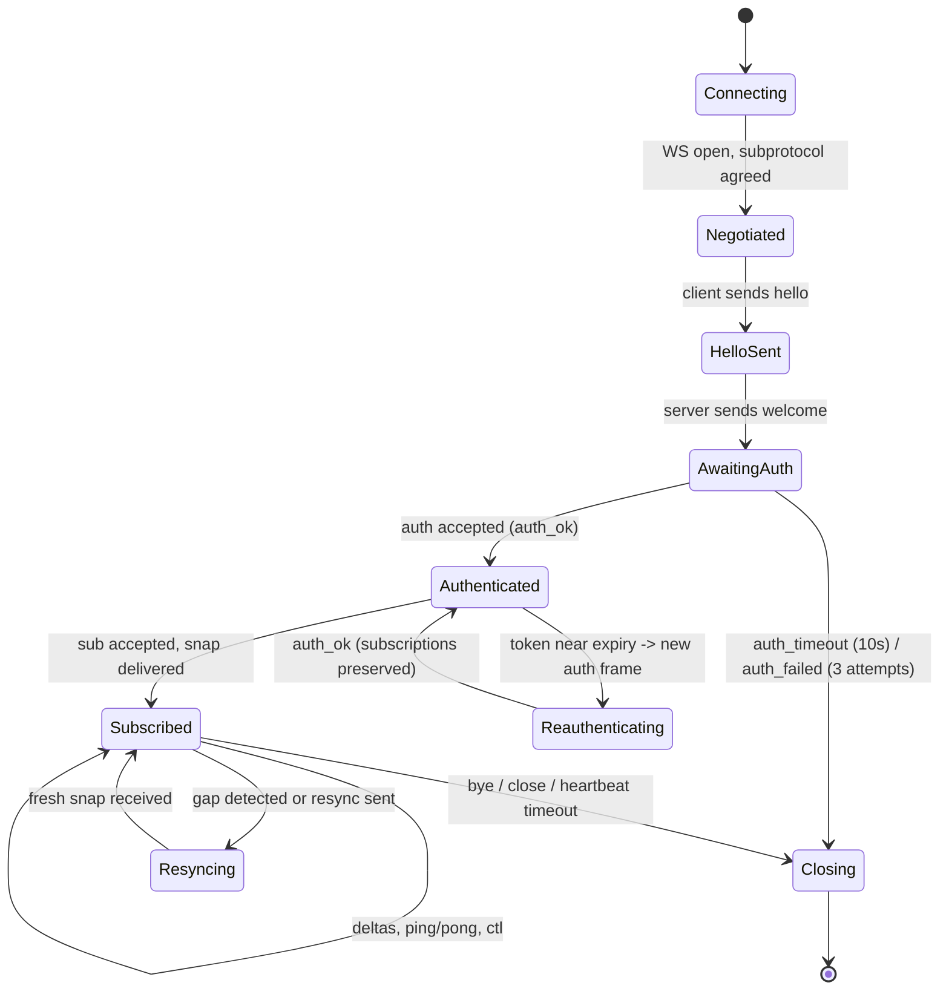
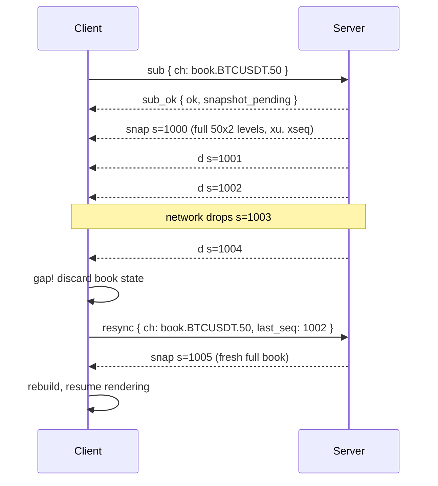
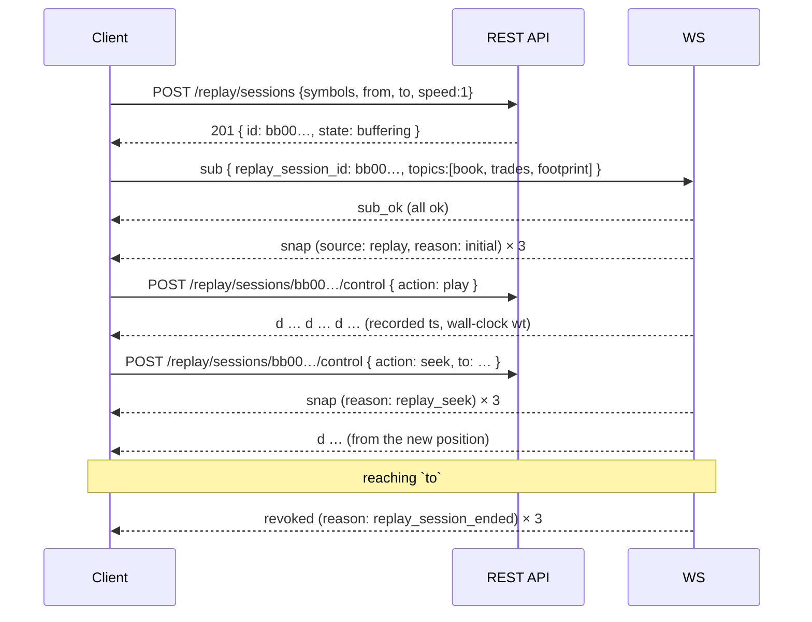

# 23 — Client WebSocket Protocol

Status: **Baseline, approved for build planning.** Date 2026-09-14. Owner: basiltt. Architect-owned document.
Scope guard: **web app only** (React + custom WebGL chart engine + Electron shell); owner/admin screens live **inside** the web app behind RBAC; **no Android**; **Bybit USDT linear perpetuals only** in v1. The protocol is nonetheless deliberately client-agnostic (arch P1) so a mobile client can be added later without server rework.
Upstream: `00-planning-brief.md`, `docs/research/24-owner-decisions.md`, `20-architecture.md`, `21-database-schema.md`, `22-api-openapi.yaml`.
Downstream: `24-internal-schemas.md`, `26-chart-engine-design.md`, `03-testing-strategy.md` (contract tests), `06-performance-and-load-standard.md`.

---

## 0. Table of contents

1. [Scope, goals and non-goals](#1-scope-goals-and-non-goals)
2. [Endpoint, versioning and negotiation](#2-endpoint-versioning-and-negotiation)
3. [Framing: envelope, encodings and the binary format](#3-framing-envelope-encodings-and-the-binary-format)
4. [Connection lifecycle and the authentication handshake](#4-connection-lifecycle-and-the-authentication-handshake)
5. [Subscribe / unsubscribe](#5-subscribe--unsubscribe)
6. [Topic catalogue](#6-topic-catalogue)
7. [Snapshot + delta semantics, sequencing and resync](#7-snapshot--delta-semantics-sequencing-and-resync)
8. [Throttling, coalescing and backpressure](#8-throttling-coalescing-and-backpressure)
9. [Heartbeats, timeouts, reconnection and RBAC revocation](#9-heartbeats-timeouts-reconnection-and-rbac-revocation)
10. [Error frames and the error-code catalogue](#10-error-frames-and-the-error-code-catalogue)
11. [Replay sessions over the same socket](#11-replay-sessions-over-the-same-socket)
12. [Worked example sessions](#12-worked-example-sessions)
13. [JSON Schemas — control frames](#13-json-schemas--control-frames)
14. [JSON Schemas — public data payloads](#14-json-schemas--public-data-payloads)
15. [JSON Schemas — private data payloads](#15-json-schemas--private-data-payloads)
16. [Conformance, limits and test matrix](#16-conformance-limits-and-test-matrix)
    - [16.5 Validation tooling and the CI contract gate](#165-validation-tooling-and-the-ci-contract-gate)
    - [16.6 Open items tracked into implementation](#166-open-items-tracked-into-implementation)

---

## 1. Scope, goals and non-goals

This document specifies the **client-facing** WebSocket protocol between the CandleViewer web app (browser or Electron shell) and the CandleViewer backend. It is _not_ the Bybit protocol; the backend's upstream Bybit connections are an internal concern described in `20-architecture.md` §5–§7.

### 1.1 Binding goals

| #   | Goal                                                                  | How the protocol meets it                                                                                                               |
| --- | --------------------------------------------------------------------- | --------------------------------------------------------------------------------------------------------------------------------------- |
| G1  | One socket carries everything the app needs after the REST bootstrap. | Multiplexed topics on a single connection; no per-widget sockets.                                                                       |
| G2  | The chart engine can upload frames to the GPU with minimal CPU work.  | Binary payload encoding with fixed-layout typed arrays for the hot topics (§3.4).                                                       |
| G3  | Correctness under loss is deterministic, not best-effort.             | Snapshot+delta with per-topic sequence numbers and an explicit resync protocol (§7), never a checksum (Bybit has none — digest 06 §19). |
| G4  | A slow or backgrounded client can never grow server memory.           | Coalescing queues with fixed depth and forced re-snapshot (§8), never unbounded buffering (arch P6).                                    |
| G5  | Authorisation is server-authoritative and revocable mid-connection.   | Per-subscribe permission checks plus live revocation frames (§9.5) (arch P8).                                                           |
| G6  | Live and replay are the same code path on both sides.                 | `replay_session_id` on subscribe routes the same topics from the replay clock (§11) (arch P2).                                          |
| G7  | Heuristic values are never presented as facts.                        | `estimated: true` on every heuristic payload (arch P10).                                                                                |

### 1.2 Non-goals

- **Order entry over WS.** Orders, amendments, cancels and kill-switch go over REST (`22-api-openapi.yaml`). Rationale: order entry needs idempotency keys, RFC 9457 error bodies, per-request RBAC and audit correlation, all of which REST already gives us; and the demo environment forbids WS order entry upstream anyway (digest 06 §11). The WS carries order _state_ (the `orders` topic), which is the source of truth for fills.
- **Bulk history.** Windows of bars, footprint, profiles and metrics come from REST. The WS only carries the live tail plus the initial snapshot needed to attach to it.
- **File transfer / exports.** Handled by REST jobs (`/admin/jobs/{jobId}`).
- **Cross-client presence or chat.** Out of scope for v1.

---

## 2. Endpoint, versioning and negotiation

### 2.1 Endpoint

```
wss://<host>/api/v1/ws
```

Same origin, same Tailscale-only exposure and same TLS termination as REST. Plain `ws://` is accepted only on loopback for local development.

### 2.2 Subprotocol negotiation

The client offers subprotocols in preference order via `Sec-WebSocket-Protocol`:

```
Sec-WebSocket-Protocol: cv.v1.msgpack, cv.v1.json
```

| Subprotocol     | Meaning                                                                                                                                |
| --------------- | -------------------------------------------------------------------------------------------------------------------------------------- |
| `cv.v1.msgpack` | Envelope encoded as MessagePack; binary payloads permitted (§3.4). **Preferred.**                                                      |
| `cv.v1.json`    | Envelope encoded as UTF-8 JSON text frames; binary payloads are base64-encoded inside the envelope. Debugging and third-party clients. |

The server echoes exactly one. A client offering no recognised subprotocol is closed with `1002` before the handshake completes.

**Decision — why MessagePack and not a bespoke binary envelope.** The envelope must stay human-inspectable in DevTools, must tolerate additive schema evolution, and must decode fast in the browser. MessagePack gives all three with a mature, small (~8 kB) decoder, and lets us carry raw `bin` fields with **zero-copy** access to their `ArrayBuffer` — so the _hot_ payloads (book deltas, bars, footprint cells, heatmap columns) get a hand-rolled fixed-layout binary format (§3.4) _inside_ a self-describing envelope. A fully bespoke envelope was rejected: it would save ~20 bytes per frame while costing every debugging session and every schema change. JSON-only was rejected: measured decode cost of a 200-level book delta is ~4× MessagePack and produces GC garbage on every frame, which the 100 ms heatmap cadence cannot afford.

### 2.3 Protocol version

`cv.v1` is the wire contract described here. Rules:

- **Additive changes** (new topic, new optional field, new error code) do **not** bump the version. Clients MUST ignore unknown fields and unknown topic names.
- **Breaking changes** (field removal, semantic change, envelope layout change) introduce `cv.v2`, served in parallel for at least one release.
- The server states the exact build in the `welcome` frame (`protocol`, `server_version`, `git_sha`). A client whose `min_server_version` expectation is unmet SHOULD warn but MAY continue.

### 2.4 Relationship to REST

| Need                                                       | Surface                                                 |
| ---------------------------------------------------------- | ------------------------------------------------------- |
| Authenticate, obtain access token                          | REST `/auth/login`, `/auth/mfa/verify`, `/auth/refresh` |
| Bootstrap history (bars, footprint, profiles, metrics)     | REST `/market/*`                                        |
| Attach to the live tail                                    | **WS** subscribe → snapshot → deltas                    |
| Place/amend/cancel orders, kill-switch                     | REST `/orders`, `/trade-groups`, `/trading/kill-switch` |
| Observe order/position/execution/wallet state              | **WS** private topics                                   |
| Configuration CRUD                                         | REST                                                    |
| Config change notifications (flags, settings, rules armed) | **WS** `system`, `rules`                                |

---

## 3. Framing: envelope, encodings and the binary format

### 3.1 The envelope

Every frame in both directions is a single map with this shape. Field order is irrelevant; short keys are used deliberately to keep per-frame overhead near 30 bytes.

```jsonc
{
  "t": "d", // type   — see table below
  "id": "c-0007", // correlation id (client→server requests and their replies)
  "ch": "trades.BTCUSDT", // channel/topic (data, snapshot, delta, topic-scoped errors)
  "s": 1048577, // sequence number, per (connection, topic)
  "ts": 1789132262104, // server send time, epoch milliseconds UTC
  "e": "b", // payload encoding: "j" = inline structured, "b" = binary blob
  "p": {}, // payload (map) or binary blob (bytes)
}
```

| `t`        | Name                 | Direction | Purpose                                                                      |
| ---------- | -------------------- | --------- | ---------------------------------------------------------------------------- |
| `hello`    | hello                | C→S       | First frame; declares client identity and capabilities.                      |
| `welcome`  | welcome              | S→C       | Server capabilities, limits, negotiated encoding, heartbeat policy.          |
| `auth`     | auth                 | C→S       | Presents the bearer access token.                                            |
| `auth_ok`  | auth accepted        | S→C       | Identity, permissions, account scope, environments.                          |
| `sub`      | subscribe            | C→S       | Subscribe to one or more topics.                                             |
| `sub_ok`   | subscribe result     | S→C       | Per-topic accept/reject.                                                     |
| `unsub`    | unsubscribe          | C→S       | Unsubscribe from topics.                                                     |
| `unsub_ok` | unsubscribe result   | S→C       | Confirmation.                                                                |
| `snap`     | snapshot             | S→C       | Full state for a topic; resets the sequence baseline.                        |
| `d`        | delta                | S→C       | Incremental update; requires an unbroken sequence.                           |
| `resync`   | resync request       | C→S       | Client asks for a fresh snapshot on a topic.                                 |
| `revoked`  | subscription revoked | S→C       | Server terminated a subscription (permission/scope/kill).                    |
| `ping`     | ping                 | both      | Liveness probe.                                                              |
| `pong`     | pong                 | both      | Liveness reply, echoes `id`.                                                 |
| `err`      | error                | S→C       | Request-scoped or topic-scoped error.                                        |
| `ctl`      | control              | C→S       | Runtime tuning of an existing subscription (throttle, depth, filters).       |
| `ctl_ok`   | control result       | S→C       | Confirmation of `ctl`.                                                       |
| `bye`      | goodbye              | S→C       | Server is closing the connection; carries the reason before the close frame. |

### 3.2 Encoding field `e`

| Value | Meaning                                                                                                                                                                                           |
| ----- | ------------------------------------------------------------------------------------------------------------------------------------------------------------------------------------------------- |
| `j`   | `p` is a structured map, encoded natively by the negotiated envelope codec (MessagePack map or JSON object).                                                                                      |
| `b`   | `p` is an opaque byte string in the fixed-layout binary format of §3.4. Under `cv.v1.json` it is a base64 string and `"e":"b64"` is used instead, so a JSON client can never mistake it for text. |

Control frames (`hello`, `welcome`, `auth`, `sub`, `err`, …) are **always** `e: "j"`. Only data frames may be binary, and only on the topics listed in §3.4.

### 3.3 Why sequence numbers live on the envelope

`s` is scoped to `(connection, topic)` and increments by exactly 1 per frame delivered on that topic, starting at the `s` of the `snap` that opened the stream. It is **not** the exchange's `u`/`seq` — those are carried inside book payloads as `xu`/`xseq` for diagnostics. Keeping our own counter means:

- gap detection is uniform across every topic, including derived ones Bybit has no sequence for (footprint, metrics, heatmap);
- coalescing (§8) is visible to the client — a coalesced delta still consumes exactly one sequence number, so "no gap" always means "no loss of _state_", even when it means loss of _intermediate frames_.

### 3.4 Binary payload format (`e: "b"`)

Used on the hot topics: `book.*`, `trades.*`, `bars.*`, `footprint.*`, `heatmap.*`. Everything else is structured.

All integers are **little-endian**. Prices and sizes are transported as **scaled 64-bit integers**, using the per-symbol `price_scale` and `qty_scale` announced in the topic's snapshot — this avoids both float rounding and decimal-string parsing in the render path.

**Common header (24 bytes)**

| Offset | Size | Type  | Field            | Notes                                                                           |
| ------ | ---- | ----- | ---------------- | ------------------------------------------------------------------------------- |
| 0      | 4    | `u32` | `magic`          | `0x43565742` (`"CVWB"`). Rejects accidental mis-routing.                        |
| 4      | 1    | `u8`  | `format_version` | `1`; `2` for body_kind 4 (bars, #2014).                                         |
| 5      | 1    | `u8`  | `body_kind`      | 1=book_snapshot, 2=book_delta, 3=trades, 4=bars, 5=footprint, 6=heatmap_column. |
| 6      | 1    | `u8`  | `flags`          | bit0 `estimated`, bit1 `coalesced`, bit2 `replay`, bit3 `partial`.              |
| 7      | 1    | `u8`  | `price_scale`    | Decimal exponent: real = int / 10^price_scale.                                  |
| 8      | 1    | `u8`  | `qty_scale`      | Same for sizes.                                                                 |
| 9      | 3    | —     | `reserved`       | Zero.                                                                           |
| 12     | 4    | `u32` | `record_count`   | Number of records in the body.                                                  |
| 16     | 8    | `u64` | `ts_base_ms`     | Epoch-ms base; per-record times are `u32` offsets from this.                    |

**body_kind 1/2 — book snapshot / delta.** `record_count` records of 17 bytes:

| Size | Type  | Field                                          |
| ---- | ----- | ---------------------------------------------- |
| 1    | `u8`  | `side` (0 = bid, 1 = ask)                      |
| 8    | `i64` | `price` (scaled)                               |
| 8    | `u64` | `size` (scaled; **0 means delete this level**) |

Snapshots carry every level within the subscribed depth, bid side descending then ask side ascending. Deltas carry only changed levels. After the records, a snapshot appends a 16-byte trailer: `u64 xu` (Bybit update id), `u64 xseq` (Bybit cross-sequence).

**body_kind 3 — trades.** `record_count` records of 22 bytes:

| Size | Type  | Field                                                                                     |
| ---- | ----- | ----------------------------------------------------------------------------------------- |
| 4    | `u32` | `ts_offset_ms` from `ts_base_ms`                                                          |
| 8    | `i64` | `price` (scaled)                                                                          |
| 8    | `u64` | `size` (scaled)                                                                           |
| 1    | `u8`  | `side` (0 = buy/taker-lift, 1 = sell/taker-hit) — Bybit gives the aggressor side directly |
| 1    | `u8`  | `flags` (bit0 block trade, bit1 liquidation-origin, bit2 cluster-aggregated)              |

**body_kind 4 — bars.** Requires header `format_version = 2` (#2014); a `format_version = 1` bars body (69-byte records without identity) is no longer sent. `record_count` records of 85 bytes, little-endian like every field here: `u64 generation`, `u64 index` (the §8.2 bar key), `u32 ts_offset_ms`, `i64 o,h,l,c`, `u64 v`, `u64 turnover`, `u32 trades`, `i64 delta`, `u8 flags` (bit0 `confirm`). The version is bumped rather than the fields appended because records have a fixed stride: a v1 decoder reading 69-byte records from an 85-byte body would misread every record after the first without noticing. Other body kinds stay at `format_version = 1`.

**body_kind 5 — footprint.** Per-bar group: `u32 ts_offset_ms`, `u32 cell_count`, then `cell_count` × 33 bytes: `i64 price`, `u64 bid_volume`, `u64 ask_volume`, `u32 trades`, `u8 flags` (bit0 buy-imbalance, bit1 sell-imbalance, bit2 in-stack, bit3 POC).

**body_kind 6 — heatmap column.** One time-bucket column: `u32 ts_offset_ms`, `i64 price_min`, `i64 price_step`, `u32 row_count`, then `row_count` × 16 bytes: `u64 bid_size`, `u64 ask_size`. The renderer uploads this straight into a texture row.

**Client obligations.** A client MUST validate `magic` and `format_version` (and MUST reject, as `frame_malformed`, a `(body_kind, format_version)` pair it does not know — e.g. a v1 decoder receiving v2 bars; the code is `frame_malformed` on the wire and decoders MAY surface the more specific diagnostic `unsupported_format_version` locally, which maps to `frame_malformed` in §10), and MUST treat a body whose length disagrees with `record_count` as a protocol error (`frame_malformed`, §10) and resync. For fixed-stride bodies (body_kind 4, bars) the rule is exact: body length MUST equal `24 + record_count × record_size`; both a short body and trailing bytes are `frame_malformed`. Forward compatibility is carried by `format_version`, not by trailing bytes. Variable-layout body kinds continue to ignore trailing bytes after the last declared record.

### 3.5 Compression

`permessage-deflate` is negotiated at the WebSocket layer and is **enabled for `cv.v1.json`, disabled for `cv.v1.msgpack`**. Reason: the binary payloads are already dense and near-incompressible; deflating them burns CPU on both ends for <5 % gain and adds latency jitter at the 10–20 ms book cadence. JSON frames compress ~6× and are not on the latency-critical path.

### 3.6 Frame size limits

| Limit                              | Value   | Enforcement                                                                                |
| ---------------------------------- | ------- | ------------------------------------------------------------------------------------------ |
| Max inbound frame (client→server)  | 256 KiB | Exceeding closes with `1009`.                                                              |
| Max outbound frame (server→client) | 4 MiB   | Server splits snapshots into `partial` chunks (header flag bit3) rather than exceeding it. |
| Max topics per `sub` frame         | 50      | Excess rejected per-topic with `too_many_topics`.                                          |
| Max subscriptions per connection   | 200     | New subscribes rejected with `subscription_limit`.                                         |
| Max connections per user           | 8       | Oldest idle connection is closed with `bye` when exceeded.                                 |

Snapshot chunking: a `snap` larger than 4 MiB is sent as N frames sharing one `id`, each with `partial` set, the last one clearing it. All chunks consume **one** sequence number in total, assigned to the final chunk; intermediate chunks carry `s: null`.

---

## 4. Connection lifecycle and the authentication handshake

### 4.1 State machine



**Key property:** re-authentication happens **in place**. When the access token is about to expire the client refreshes it over REST and sends a new `auth` frame on the _same_ socket; subscriptions, sequence numbers and book state are all preserved. There is no reconnect-on-token-refresh, which would otherwise force a full re-snapshot every 10 minutes.

### 4.2 `hello` → `welcome`

The client sends `hello` immediately on open. The server replies `welcome` with the limits the client must respect. A client that sends anything other than `hello` first is closed with `1002`.

```jsonc
// C→S
{
  "t": "hello",
  "id": "c-0001",
  "p": {
    "client": "candleviewer-web",
    "client_version": "1.0.0",
    "shell": "electron", // "electron" | "browser"
    "protocol": "cv.v1",
    "encodings": ["binary", "structured"],
    "capabilities": [
      "binary_book",
      "binary_bars",
      "binary_footprint",
      "binary_heatmap",
      "coalescing",
      "replay",
    ],
    "locale": "en-GB",
    "clock_ms": 1789132261980,
  },
}
```

```jsonc
// S→C
{
  "t": "welcome",
  "id": "c-0001",
  "ts": 1789132262002,
  "p": {
    "protocol": "cv.v1",
    "encoding": "msgpack",
    "server_version": "1.0.0",
    "git_sha": "a91f0c3",
    "connection_id": "ws_0193f2bc1d40",
    "server_time_ms": 1789132262002,
    "clock_skew_ms": 22,
    "auth_required": true,
    "auth_timeout_ms": 10000,
    "heartbeat": { "interval_ms": 15000, "timeout_ms": 45000 },
    "limits": {
      "max_subscriptions": 200,
      "max_topics_per_request": 50,
      "max_inbound_frame_bytes": 262144,
      "max_outbound_frame_bytes": 4194304,
      "min_throttle_ms": 50,
      "max_symbols_per_connection": 40,
    },
    "features": { "replay": true, "binary_payloads": true, "coalescing": true },
  },
}
```

`clock_skew_ms` = server time minus the client's `clock_ms`. The UI surfaces a warning above ±2 000 ms because a skewed client mis-renders "bar closes in N seconds" countdowns.

### 4.3 `auth` → `auth_ok`

```jsonc
// C→S
{
  "t": "auth",
  "id": "c-0002",
  "p": {
    "access_token": "<JWT — example placeholder>",
    "environments": ["live", "demo"],
  },
}
```

```jsonc
// S→C
{
  "t": "auth_ok",
  "id": "c-0002",
  "ts": 1789132262110,
  "p": {
    "user_id": "9f1c2b4e-0a1d-4f2b-9e3a-11c0ffee0001",
    "username": "basiltt",
    "roles": ["owner"],
    "permissions": [
      "marketdata:read",
      "orders:read",
      "orders:write",
      "positions:write",
      "audit:read",
    ],
    "account_scope": [
      "a1000000-0000-4000-8000-000000000001",
      "a1000000-0000-4000-8000-000000000002",
    ],
    "allowed_environments": ["live", "demo"],
    "session_id": "5e1a0c33-2b44-4f10-9a22-77aa11bb22cc",
    "token_expires_at_ms": 1789132862110,
    "kill_switch": { "engaged": false, "scope": "global" },
  },
}
```

Rules:

- The token is **never** sent in the URL query string (it would land in proxy logs and browser history). Header auth is impossible for browser WebSockets, so the first-frame `auth` pattern is used.
- Until `auth_ok`, the only accepted frames are `auth` and `ping`. Anything else → `err` with `not_authenticated` and the connection closes after 3 such frames.
- `auth_timeout_ms` (10 s) without a successful `auth` → `bye` with `auth_timeout`, close code `4401`.
- Three failed `auth` attempts → `bye` with `auth_failed`, close `4401`, and a `warning` audit entry.
- `token_expires_at_ms` tells the client when to re-`auth`. The client SHOULD refresh at `expires_at - 60 s`. If the token expires without re-auth, the server sends `bye` (`token_expired`, `4401`) and closes — subscriptions are not silently continued on an expired identity.

### 4.4 Close codes

| Code   | Name            | Meaning                                       | Client action                                |
| ------ | --------------- | --------------------------------------------- | -------------------------------------------- |
| `1000` | normal          | Clean shutdown by either side.                | Do not auto-reconnect if user-initiated.     |
| `1001` | going away      | Server restarting or client navigating away.  | Reconnect with backoff.                      |
| `1002` | protocol error  | Malformed handshake or frame sequence.        | Fix client; do not hot-loop reconnect.       |
| `1009` | too big         | Inbound frame exceeded the limit.             | Fix client.                                  |
| `1011` | internal error  | Unhandled server fault.                       | Reconnect with backoff.                      |
| `1013` | try again later | Server shedding load.                         | Reconnect after `Retry-After` hint in `bye`. |
| `4401` | unauthenticated | Auth timeout, auth failure, or token expiry.  | Refresh token over REST, reconnect.          |
| `4403` | forbidden       | Permissions revoked entirely (user disabled). | Return to login; do not retry.               |
| `4429` | rate limited    | Too many frames or reconnects.                | Back off per `bye.retry_after_ms`.           |
| `4400` | bad client      | Repeated protocol violations.                 | Surface a bug report; do not hot-loop.       |

`bye` is always sent _before_ the close frame so the client has a machine-readable reason:

```jsonc
{
  "t": "bye",
  "ts": 1789132999000,
  "p": {
    "code": 1013,
    "reason": "server_shedding_load",
    "message": "Ingest backlog exceeded threshold; shedding non-essential connections.",
    "retry_after_ms": 5000,
    "reconnect": true,
  },
}
```

---

## 5. Subscribe / unsubscribe

### 5.1 `sub`

```jsonc
{
  "t": "sub",
  "id": "c-0010",
  "p": {
    "topics": [
      { "ch": "book.BTCUSDT.50", "opts": { "throttle_ms": 50, "encoding": "binary" } },
      { "ch": "trades.BTCUSDT", "opts": { "min_size": "0.5", "encoding": "binary" } },
      { "ch": "bars.BTCUSDT.time.1", "opts": { "encoding": "binary", "include_delta": true } },
      {
        "ch": "footprint.BTCUSDT.time.5",
        "opts": { "encoding": "binary", "price_grouping": 1, "imbalance_ratio": 3, "min_stack": 3 },
      },
      {
        "ch": "metrics.BTCUSDT",
        "opts": { "metrics": ["cvd", "tape_acceleration", "adx"], "throttle_ms": 250 },
      },
      {
        "ch": "orders",
        "opts": { "exchange_account_ids": ["a1000000-0000-4000-8000-000000000001"] },
      },
    ],
    "snapshot": true,
    "replay_session_id": null,
  },
}
```

| Field               | Type      | Default | Meaning                                                                                                                                                          |
| ------------------- | --------- | ------- | ---------------------------------------------------------------------------------------------------------------------------------------------------------------- |
| `topics[].ch`       | string    | —       | Topic name (§6).                                                                                                                                                 |
| `topics[].opts`     | map       | `{}`    | Topic-specific options; unknown keys are rejected, never ignored, so typos surface immediately.                                                                  |
| `snapshot`          | bool      | `true`  | When false, the client attaches to deltas only — valid _only_ if it already holds consistent state for that topic from a REST bootstrap and supplies `from_seq`. |
| `replay_session_id` | uuid/null | `null`  | Routes market-data topics from a replay clock (§11).                                                                                                             |

**Universal options** accepted on every topic:

| Option        | Type                       | Default                | Notes                                                                                                                                              |
| ------------- | -------------------------- | ---------------------- | -------------------------------------------------------------------------------------------------------------------------------------------------- |
| `throttle_ms` | int                        | per-topic (§6)         | Minimum interval between frames; floored at `limits.min_throttle_ms` (50).                                                                         |
| `encoding`    | `"binary"`\|`"structured"` | binary where supported | Rejected with `encoding_unsupported` if the topic has no binary form or the subprotocol is JSON without `b64` capability.                          |
| `coalesce`    | bool                       | `true`                 | Disabling is honoured only while the client keeps up; the server re-enables it under pressure and says so in a `ctl_ok`-style notice on the topic. |

### 5.2 `sub_ok`

Every requested topic gets exactly one result. Partial success is normal — one bad topic never fails the batch.

```jsonc
{
  "t": "sub_ok",
  "id": "c-0010",
  "ts": 1789132262300,
  "p": {
    "results": [
      {
        "ch": "book.BTCUSDT.50",
        "ok": true,
        "sub_id": "s_01",
        "snapshot_pending": true,
        "effective": { "throttle_ms": 50, "encoding": "binary", "depth": 50 },
      },
      {
        "ch": "trades.BTCUSDT",
        "ok": true,
        "sub_id": "s_02",
        "snapshot_pending": true,
        "effective": { "throttle_ms": 100, "encoding": "binary", "min_size": "0.5" },
      },
      {
        "ch": "bars.BTCUSDT.time.1",
        "ok": true,
        "sub_id": "s_03",
        "snapshot_pending": true,
        "effective": { "throttle_ms": 250, "encoding": "binary" },
      },
      {
        "ch": "footprint.BTCUSDT.time.5",
        "ok": true,
        "sub_id": "s_04",
        "snapshot_pending": true,
        "effective": { "throttle_ms": 250, "encoding": "binary", "price_grouping": 1 },
      },
      {
        "ch": "metrics.BTCUSDT",
        "ok": true,
        "sub_id": "s_05",
        "snapshot_pending": true,
        "effective": { "throttle_ms": 250, "metrics": ["cvd", "tape_acceleration", "adx"] },
      },
      {
        "ch": "orders",
        "ok": false,
        "error": {
          "code": "account_scope_denied",
          "message": "Account a1000000-…-0001 is not in your scope.",
        },
      },
    ],
  },
}
```

`effective` echoes the options **after** clamping, so a client that asked for `throttle_ms: 5` sees it became 50 and can stop expecting 200 fps.

### 5.3 `unsub`

```jsonc
{ "t": "unsub", "id": "c-0020", "p": { "topics": ["book.BTCUSDT.50"] } }
{ "t": "unsub_ok", "id": "c-0020", "ts": 1789132999100, "p": { "results": [ { "ch": "book.BTCUSDT.50", "ok": true } ] } }
```

Unsubscribing from an unknown or already-removed topic is **not** an error (`ok: true`, `noop: true`) — this keeps teardown idempotent during pane close races.

### 5.4 `ctl` — retuning a live subscription

Changing throttle or depth without tearing down and re-snapshotting:

```jsonc
{ "t": "ctl", "id": "c-0030", "ch": "book.BTCUSDT.50", "p": { "throttle_ms": 200 } }
{ "t": "ctl_ok", "id": "c-0030", "ch": "book.BTCUSDT.50", "ts": 1789133000000, "p": { "effective": { "throttle_ms": 200 } } }
```

Changing `depth`, `price_grouping`, `bar_type`/`param`, or the `metrics` list **invalidates the current state**, so the server answers `ctl_ok` with `"resnapshot": true` and immediately sends a fresh `snap` that restarts the sequence. The client must discard its prior state on seeing that flag.

**Why `ctl` exists.** The UI changes throttle constantly: a pane that scrolls out of view drops to 1 000 ms, a maximised DOM goes to 20 ms, a backgrounded Electron window goes to 1 000 ms for everything. Doing that with unsub/sub would re-snapshot a 200-level book every time the user switches tabs.

---

## 6. Topic catalogue

Topic names are dot-separated, lower-case, with symbols in Bybit's native upper-case form: `{family}.{symbol}[.{param}...]`.

### 6.1 Public market-data topics

| Topic                                   | Options                                                                                                                                                             | Snapshot                                           | Default throttle                          | Binary     | Payload schema                                               |
| --------------------------------------- | ------------------------------------------------------------------------------------------------------------------------------------------------------------------- | -------------------------------------------------- | ----------------------------------------- | ---------- | ------------------------------------------------------------ |
| `book.{symbol}.{depth}`                 | `depth` ∈ {1, 50, 200, 500} (in the name), `throttle_ms`                                                                                                            | Full book to depth                                 | 50 ms (depth 1 → 20 ms; 200/500 → 100 ms) | ✔ kind 1/2 | [`BookSnapshot`](#141-booksnapshot--bookdelta) / `BookDelta` |
| `trades.{symbol}`                       | `min_size`, `cluster_window_ms`, `cluster_tolerance_ticks`                                                                                                          | Last 200 prints                                    | 100 ms                                    | ✔ kind 3   | [`TradesBatch`](#142-tradesbatch)                            |
| `bars.{symbol}.{bar_type}.{param}`      | `include_delta`, `history` (≤1 000)                                                                                                                                 | Last `history` bars                                | 250 ms                                    | ✔ kind 4   | [`BarsBatch`](#143-barsbatch)                                |
| `footprint.{symbol}.{bar_type}.{param}` | `price_grouping`, `imbalance_ratio`, `min_stack`, `min_imbalance_volume`, `history` (≤200)                                                                          | Last `history` bars of cells                       | 250 ms                                    | ✔ kind 5   | [`FootprintUpdate`](#144-footprintupdate)                    |
| `heatmap.{symbol}`                      | `time_bucket_ms` ∈ {100,250,500,1000,5000} (**client-derived, see §6.1.1**; server fallback `500`), `price_grouping`, `depth`, `window_seconds` (≤900, default 900) | Window of columns, capped at the 2 000 most recent | = `time_bucket_ms`                        | ✔ kind 6   | [`HeatmapColumn`](#145-heatmapcolumn)                        |
| `profile.{symbol}.{kind}`               | `kind` ∈ {volume, delta, tpo}, `split`, `session_anchor`, `price_grouping`, `value_area_pct`                                                                        | Current period profile                             | 1 000 ms                                  | ✖          | [`ProfileUpdate`](#146-profileupdate)                        |
| `metrics.{symbol}`                      | `metrics` (array of metric codes), `bar_type`, `param`, per-metric `params`                                                                                         | Current values                                     | 250 ms                                    | ✖          | [`MetricsUpdate`](#147-metricsupdate)                        |
| `ticker.{symbol}`                       | —                                                                                                                                                                   | Current ticker                                     | 250 ms                                    | ✖          | [`TickerUpdate`](#148-tickerupdate)                          |
| `ticker`                                | `symbols` (≤40)                                                                                                                                                     | All requested tickers                              | 500 ms                                    | ✖          | `TickerUpdate` (batched)                                     |
| `liquidations.{symbol}`                 | `min_notional_usd`, `cluster_window_ms`                                                                                                                             | Last 100                                           | 500 ms                                    | ✖          | [`LiquidationBatch`](#149-liquidationbatch)                  |
| `liquidations`                          | `symbols`, `min_notional_usd`                                                                                                                                       | Last 100 across symbols                            | 500 ms                                    | ✖          | `LiquidationBatch`                                           |

Notes that bite if ignored:

- **`book` depth is in the topic name, not the options**, because changing depth changes the identity of the state. `book.BTCUSDT.50` and `book.BTCUSDT.200` are two independent subscriptions with independent sequences.
- **`bars` `param` follows the REST convention** of `22-api-openapi.yaml` `/market/bars`: `time` → interval code (`1`,`5`,`60`,`D`…), `tick` → trades per bar, `volume` → base volume, `range` → ticks, `delta` → signed volume, `renko` → ticks or `atr:14`, `pnf` → `box:reversal`, `heikin_ashi` → underlying interval. Dots are illegal in `param`; `atr:14` and `10:3` use a colon for exactly this reason.
- **`footprint` and `bars` for the same `(symbol, bar_type, param)` are separate subscriptions** and each carries its own sequence. They are guaranteed _consistent_ (both derived from the same builder) but not _synchronised_ frame-for-frame; the client keys them by bar open time.
- **Unconfirmed bars.** The last bar in any `bars`/`footprint` frame may have `confirm: false`. A client MUST NOT treat it as closed — this is the flicker bug Bybit's own `confirm` flag exists to prevent.

#### 6.1.1 `heatmap.time_bucket_ms` — normative default (resolves open item W3)

`time_bucket_ms` has **no fixed default**. Shipping one constant was rejected: 1 000 ms wastes the DOM detail a 4 K pane can show, and 100 ms on a laptop pane produces columns narrower than one device pixel, which the renderer then has to aggregate away (`26-chart-engine-design.md` §3.8) — paying full bandwidth for pixels that are discarded.

The default is therefore **derived, and the derivation is part of the contract**: one heatmap column SHOULD occupy **≥ 2 device pixels** and **≤ 8 device pixels** of horizontal space.

```
ideal_ms   = (window_seconds * 1000) / (pane_css_width_px * devicePixelRatio / 3)
bucket_ms  = smallest allowed value ≥ ideal_ms, from {100, 250, 500, 1000, 5000}
```

The `/3` targets a 3-device-pixel column — the midpoint of the legibility band, leaving headroom for the zoom in both directions before a re-subscribe is needed.

**Resolution ladder** (evaluated top-down; the first rule that applies wins):

| #   | Rule                                                                                                                                                                                                                                       |
| --- | ------------------------------------------------------------------------------------------------------------------------------------------------------------------------------------------------------------------------------------------ |
| 1   | The user explicitly set `time_bucket_ms` on the pane → use it verbatim, never auto-change it. The pane shows an "auto" affordance to hand control back.                                                                                    |
| 2   | The client computes `bucket_ms` from the formula above and sends it on `sub`. **This is the normal path**; a compliant client always sends the option.                                                                                     |
| 3   | The option is absent from `sub` (non-visual client, headless test, CLI tool) → the server applies **`500`**. This is a transport fallback, not a UX default, and is chosen as the mid-rung that is never catastrophic in either direction. |

**Reference values** at the shipped default `window_seconds: 900`, chart pane occupying ~62 % of viewport width:

| Display                     | Pane CSS px | DPR | Device px | `ideal_ms` | Selected                        |
| --------------------------- | ----------- | --- | --------- | ---------- | ------------------------------- |
| 4 K, 100 % scale (3840)     | 2380        | 1   | 2380      | 1134       | **5000**† → clamped to **1000** |
| 4 K, 150 % scale (2560 CSS) | 1587        | 1.5 | 2380      | 1134       | **1000**                        |
| 2 560 × 1 440               | 1587        | 1   | 1587      | 1701       | **5000**† → clamped to **1000** |
| 1 920 × 1 080               | 1190        | 1   | 1190      | 2269       | **5000**† → clamped to **1000** |
| MacBook 14" (1512 CSS)      | 937         | 2   | 1874      | 1441       | **1000**                        |
| Half-width pane, 1 920      | 595         | 1   | 595       | 4538       | **5000**                        |

† **Ladder clamp.** Because the allowed set is coarse, jumping from 1 000 ms straight to 5 000 ms would sacrifice five-fold detail to save at most ~1.5 device pixels of column width. The client therefore clamps upward selection at **1000 ms** whenever `ideal_ms ≤ 2500`; only a genuinely small pane (`ideal_ms > 2500`) takes the 5 000 ms rung. This clamp is normative and is asserted by unit test `heatmap_bucket_selection`.

**Re-derivation.** On pane resize, DPR change (monitor move), or `window_seconds` change, the client re-derives. If the result differs from the active value it sends `ctl { time_bucket_ms }` **debounced by 400 ms**, and the server answers `ctl_ok` with `resnapshot: true` (§5.4) — bucket size changes the identity of the state, exactly like `depth`.

**Bandwidth consequence** (reference: BTCUSDT, `depth: 200`, `price_grouping: 1`, `window_seconds: 900`, binary kind 6, ~400 populated price rows/column @ 4 B):

| Bucket   | Columns/s | Steady-state bandwidth | Initial window snapshot                                                                                                                   |
| -------- | --------- | ---------------------- | ----------------------------------------------------------------------------------------------------------------------------------------- |
| 100 ms   | 10        | ~16 KiB/s              | 9 000 columns, ~14 MiB → **rejected for the initial snapshot; server caps the snapshot window to 2 000 columns and back-fills on scroll** |
| 250 ms   | 4         | ~6.4 KiB/s             | 3 600 columns, ~5.6 MiB → snapshot-capped                                                                                                 |
| 500 ms   | 2         | ~3.2 KiB/s             | 1 800 columns, ~2.8 MiB                                                                                                                   |
| 1 000 ms | 1         | ~1.6 KiB/s             | 900 columns, ~1.4 MiB                                                                                                                     |
| 5 000 ms | 0.2       | ~0.3 KiB/s             | 180 columns, ~0.3 MiB                                                                                                                     |

The 2 000-column snapshot cap applies at every bucket size: the server sends the most recent 2 000 columns in `snap` and serves anything older through REST `GET /market/heatmap` on scroll-back. This keeps the §16.3 "full re-snapshot < 700 KiB" budget reachable at 1 000 ms and bounds the worst case at the finer rungs.

**Design review.** This rule is a spec decision made by the protocol and chart-engine owners, not a guess: the design team owns only the _visual_ band (the 2–8 device-pixel legibility range and the 3 px target) and the "auto" affordance's appearance. Any change to those two numbers changes the formula's `/3` divisor and the clamp threshold, and therefore requires a change to this section plus a re-run of `heatmap_bucket_selection` — it cannot be adjusted silently in CSS or component code. Tracked as design ticket **DES-HEATMAP-01** (Sprint 03), scope limited to confirming the legibility band on the reference 4 K and 1 080 p displays.

### 6.2 Private topics

All private topics are **account-scoped**: the server intersects the requested `exchange_account_ids` with the caller's granted scope and silently narrows (reporting the effective list in `sub_ok.effective`). Requesting _only_ out-of-scope accounts is an error (`account_scope_denied`).

| Topic          | Options                                        | Snapshot                             | Default throttle       | Payload schema                              |
| -------------- | ---------------------------------------------- | ------------------------------------ | ---------------------- | ------------------------------------------- |
| `orders`       | `exchange_account_ids`, `symbols`, `open_only` | All open orders                      | 0 ms (never throttled) | [`OrderUpdate`](#151-orderupdate)           |
| `positions`    | `exchange_account_ids`, `symbols`              | All open positions                   | 100 ms                 | [`PositionUpdate`](#152-positionupdate)     |
| `executions`   | `exchange_account_ids`, `symbols`              | Last 100 fills                       | 0 ms (never throttled) | [`ExecutionUpdate`](#153-executionupdate)   |
| `wallet`       | `exchange_account_ids`                         | Current balances                     | 500 ms                 | [`WalletUpdate`](#154-walletupdate)         |
| `trade_groups` | `exchange_account_ids`, `status`               | Active groups                        | 100 ms                 | [`TradeGroupUpdate`](#155-tradegroupupdate) |
| `rules`        | `rule_ids`, `include_events`                   | Armed/simulating rules + state       | 250 ms                 | [`RuleUpdate`](#156-ruleupdate)             |
| `alerts`       | `unacked_only`                                 | Unacked deliveries                   | 250 ms                 | [`AlertUpdate`](#157-alertupdate)           |
| `recorder`     | `symbols`                                      | Current recorder status              | 1 000 ms               | [`RecorderUpdate`](#158-recorderupdate)     |
| `system`       | —                                              | Current health + flags + kill-switch | 1 000 ms               | [`SystemUpdate`](#159-systemupdate)         |

**`orders` and `executions` are never throttled or coalesced.** Losing an intermediate order state or dropping a fill would corrupt the OMS mirror the UI renders and the journal derives from. If a client cannot keep up with these two topics, the server closes the connection (`4429`) rather than silently degrading them — a slow client must not be able to see a wrong position.

**`system` is auto-subscribed.** Every authenticated connection is subscribed to `system` implicitly at `auth_ok`; it carries kill-switch transitions, feature-flag changes, degraded-data notices, exchange connectivity changes and planned-shutdown warnings. A client may not unsubscribe from it.

### 6.3 Topic → permission matrix

| Topic family                                                                                     | Required permission | Scope narrowing             |
| ------------------------------------------------------------------------------------------------ | ------------------- | --------------------------- |
| `book`, `trades`, `bars`, `footprint`, `heatmap`, `profile`, `metrics`, `ticker`, `liquidations` | `marketdata:read`   | none                        |
| `orders`, `trade_groups`                                                                         | `orders:read`       | granted accounts            |
| `positions`                                                                                      | `positions:read`    | granted accounts            |
| `executions`                                                                                     | `executions:read`   | granted accounts            |
| `wallet`                                                                                         | `accounts:read`     | granted accounts            |
| `rules`                                                                                          | `rules:read`        | granted accounts (bindings) |
| `alerts`                                                                                         | `alerts:read`       | own alerts only             |
| `recorder`                                                                                       | `recording:read`    | none                        |
| `system`                                                                                         | — (implicit)        | content filtered by role    |

Permissions are checked **at subscribe time and again on every change to the user's grants** (§9.5). A viewer subscribing to `orders` succeeds (read-only) but any attempt to act comes over REST, where `orders:write` is enforced.

---

## 7. Snapshot + delta semantics, sequencing and resync

### 7.1 The contract

For every topic, the server guarantees:

1. The first data frame after a successful `sub` (with `snapshot: true`) is a `snap`. It carries complete state and an initial sequence `s0`.
2. Every subsequent `d` on that topic carries `s = previous_s + 1`.
3. Applying every `d` in order to the `snap` state yields exactly the server's state.
4. A `snap` may appear at **any** time (server-initiated resync, §7.4). It resets the baseline; the client discards prior state for that topic.

The client guarantees:

1. It tracks `last_seq` per topic.
2. On receiving `d` with `s != last_seq + 1`, it **immediately discards local state for that topic** and issues `resync`. It does **not** attempt to patch around the gap.
3. It never renders state assembled across a gap.



### 7.2 Snapshot frame

```jsonc
{
  "t": "snap",
  "ch": "book.BTCUSDT.50",
  "s": 1000,
  "ts": 1789132262400,
  "e": "b",
  "p": "<binary: header body_kind=1 + 100 records + 16-byte trailer>",
}
```

Structured equivalent (`cv.v1.json`, or `encoding: "structured"`):

```jsonc
{
  "t": "snap",
  "ch": "book.BTCUSDT.50",
  "s": 1000,
  "ts": 1789132262400,
  "e": "j",
  "p": {
    "symbol": "BTCUSDT",
    "depth": 50,
    "price_scale": 1,
    "qty_scale": 3,
    "xu": 884120113,
    "xseq": 77120044901,
    "bids": [
      ["63120.40", "12.501"],
      ["63120.30", "4.220"],
    ],
    "asks": [
      ["63120.60", "9.870"],
      ["63120.70", "18.004"],
    ],
    "stale": false,
  },
}
```

Every `snap` payload additionally carries, for _any_ topic:

| Field                      | Meaning                                                                                                  |
| -------------------------- | -------------------------------------------------------------------------------------------------------- |
| `price_scale`, `qty_scale` | Scaling exponents for that symbol's binary frames. Valid until the next `snap`.                          |
| `stale`                    | True when the backend's own upstream feed is behind its freshness SLO. The UI shows the staleness badge. |
| `estimated`                | True on topics whose content is heuristic (some `metrics` series).                                       |
| `source`                   | `"live"` or `"replay"`.                                                                                  |

### 7.3 Delta frame

Book delta, structured form:

```jsonc
{
  "t": "d",
  "ch": "book.BTCUSDT.50",
  "s": 1001,
  "ts": 1789132262452,
  "e": "j",
  "p": {
    "xu": 884120114,
    "xseq": 77120044902,
    "bids": [
      ["63120.40", "11.900"],
      ["63120.20", "0"],
    ],
    "asks": [["63120.60", "0"]],
    "coalesced": false,
  },
}
```

Semantics, identical in binary and structured form:

- A level with size `"0"` is **removed**.
- A level not mentioned is **unchanged**.
- Levels outside the subscribed depth are never sent; if the top-of-book moves such that a previously-sent level falls outside depth, it is sent with size `0` so the client's window stays exactly `depth` levels per side.

### 7.4 Server-initiated resync

The server sends a fresh `snap` without being asked when:

| Trigger                                                    | Reason                                                                                     |
| ---------------------------------------------------------- | ------------------------------------------------------------------------------------------ |
| Upstream Bybit book desync (gap in `u`)                    | Bybit provides no checksum; the only correct recovery is drop-and-rebuild (digest 06 §19). |
| Upstream reconnect / resubscribe                           | Continuity across the upstream gap cannot be proven.                                       |
| Backpressure overflow on that topic (§8.4)                 | Cheaper and safer than replaying a deep queue.                                             |
| `ctl` that invalidates state (depth, grouping, metric set) | New state identity.                                                                        |
| Instrument metadata revision (tick size change)            | Scales in prior frames are no longer valid.                                                |
| Replay seek                                                | The replay clock jumped.                                                                   |

The `snap` carries `reason` so the client can distinguish a routine attach from an incident:

```jsonc
{
  "t": "snap",
  "ch": "book.BTCUSDT.200",
  "s": 4402,
  "ts": 1789133100000,
  "e": "b",
  "meta": { "reason": "upstream_desync", "previous_seq": 4401 },
  "p": "<binary>",
}
```

`reason` ∈ `initial` | `client_resync` | `upstream_desync` | `upstream_reconnect` | `backpressure` | `reconfigure` | `instrument_revision` | `replay_seek`.

`upstream_desync` and `backpressure` are counted as incidents in Prometheus (`cv_ws_resync_total{reason}`) with alert thresholds in `06-performance-and-load-standard.md`.

### 7.5 Client-initiated resync

```jsonc
{
  "t": "resync",
  "id": "c-0040",
  "ch": "book.BTCUSDT.50",
  "p": { "last_seq": 1002, "reason": "sequence_gap" },
}
```

The server replies with a `snap` on that topic (correlated by `ch`, not by `id`). Rate limit: **5 resyncs per topic per minute**; exceeding it returns `err` `resync_rate_limited` and the server closes the subscription with `revoked`, because a client resyncing in a tight loop is broken and is consuming snapshot-build cost that harms every other consumer.

### 7.6 Attaching without a snapshot

A client that already bootstrapped over REST may attach to deltas only:

```jsonc
{
  "t": "sub",
  "id": "c-0050",
  "p": {
    "snapshot": false,
    "topics": [
      { "ch": "bars.BTCUSDT.time.1", "opts": { "from_seq": null, "from_ts_ms": 1789132000000 } },
    ],
  },
}
```

The server accepts this **only** when it can prove continuity: it holds state covering `from_ts_ms` and no resync occurred since. Otherwise it answers `sub_ok` with `ok: true, snapshot_forced: true` and sends a `snap` anyway. The client must handle the forced snapshot; it may not assume its REST-derived state survived.

---

## 8. Throttling, coalescing and backpressure

### 8.1 The three mechanisms, and when each applies

| Mechanism      | What it does                                                               | Applied to                                                          | Loss of information?                                    |
| -------------- | -------------------------------------------------------------------------- | ------------------------------------------------------------------- | ------------------------------------------------------- |
| **Throttling** | Emits at most one frame per `throttle_ms` per topic.                       | All topics except `orders`, `executions`.                           | No — state is complete at each emission.                |
| **Coalescing** | Merges all pending updates for a topic into one frame.                     | Book, bars, footprint, heatmap, metrics, ticker, positions, wallet. | Intermediate _frames_ are lost; final _state_ is exact. |
| **Shedding**   | Drops the subscription and forces a re-snapshot, or closes the connection. | Last resort under sustained overflow.                               | Yes — recovered by re-snapshot.                         |

### 8.2 Coalescing rules per topic family

| Family                          | Coalescing rule                                                                                                 | Rationale                                                      |
| ------------------------------- | --------------------------------------------------------------------------------------------------------------- | -------------------------------------------------------------- |
| `book`                          | Per price level, last-write-wins; deletes win over earlier updates at the same level.                           | The book is a map; only the current value matters.             |
| `bars`                          | Per bar `(generation, index)`, last-write-wins; a confirmed bar never replaced by an unconfirmed one, except a confirmed update with `amended: true` (below). | The in-progress bar is overwritten many times per second.      |
| `footprint`                     | Per (bar, price) cell, values summed for the _same_ bar, replaced across bars.                                  | Cells are cumulative within a bar.                             |
| `heatmap`                       | Per time-bucket column, last-write-wins; whole columns dropped only if the bucket is complete and already sent. | Columns are the atomic render unit.                            |
| `metrics`                       | Per metric code, last point wins.                                                                               | Scalar time series.                                            |
| `ticker`, `wallet`, `positions` | Whole-object last-write-wins.                                                                                   | Snapshot-shaped.                                               |
| `trades`, `liquidations`        | **Append, never merge** — throttling batches them into arrays.                                                  | Every print matters for the tape and CVD.                      |
| `orders`, `executions`          | **Never coalesced, never throttled.**                                                                           | State-machine transitions and fills must be seen individually. |

**Bar key (#2014).** Within a channel (one `spec_hash`) every bar — of every `bar_type`, time bars included — is keyed by `(generation, index)` (24 §3.1), never by `t_ms`: non-time bars can share an open time, and `index` restarts when ADR-0033 starts a new generation/epoch. A channel streams one generation at a time; a generation swap arrives as a new snapshot (ADR-0033 client ingestion). Clients key their bar stores the same way.

**Amended bars (#2018, 24 §3.2).** A late trade can re-close an already-confirmed bar; the server then emits a `confirm: true` item with `amended: true` at the same `(generation, index)`. This is the one carve-out to "confirmed is final": a confirmed→confirmed replacement is permitted (and coalesced last-write-wins) only when the incoming item sets `amended`. A confirmed→unconfirmed replacement is never permitted. Clients replace the stored bar by key and re-render it.

A coalesced frame sets `coalesced: true` (structured) or header flag bit1 (binary), and carries `coalesced_count` — the number of source updates merged. The UI uses this to drive the "feed compressed" indicator on the tape-speed widget rather than silently under-reporting activity.

### 8.3 Adaptive throttling

The server tracks per-connection outbound queue depth and round-trip `ping`/`pong` latency, and classifies each connection every 2 seconds:

| Class         | Condition                            | Server behaviour                                                                 |
| ------------- | ------------------------------------ | -------------------------------------------------------------------------------- |
| `healthy`     | queue < 25 % of budget, RTT < 150 ms | Honour requested throttles.                                                      |
| `lagging`     | queue 25–60 %, or RTT 150–500 ms     | Multiply non-critical throttles by 2; force `coalesce: true`.                    |
| `saturated`   | queue 60–90 %, or RTT > 500 ms       | Multiply by 4; drop `heatmap` and `profile` to 1 000 ms; emit a `system` notice. |
| `overflowing` | queue > 90 %                         | §8.4.                                                                            |

Class changes are announced so the UI can be honest about degraded fidelity:

```jsonc
{
  "t": "d",
  "ch": "system",
  "s": 88,
  "ts": 1789133200000,
  "e": "j",
  "p": {
    "kind": "connection_quality",
    "class": "saturated",
    "queue_pct": 72,
    "rtt_ms": 640,
    "applied": {
      "throttle_multiplier": 4,
      "forced_coalesce": true,
      "degraded_topics": ["heatmap.BTCUSDT", "profile.BTCUSDT.volume"],
    },
  },
}
```

### 8.4 Backpressure and overflow (arch P6)

Each connection has a **bounded** outbound budget: 8 MiB or 2 000 frames, whichever binds first. There is no growth path — this is the property that makes a pathological client harmless.

On overflow the server acts in this order:

1. **Drop coalescable pending state** for the offending topics and mark them `resnapshot_required`.
2. Send `snap` with `reason: "backpressure"` for each such topic once the queue drains below 50 %.
3. If the queue is still over budget after the drop **and** the affected topics include `orders` or `executions` (which cannot be dropped), send `bye` with `slow_consumer` and close `4429`.
4. Record `cv_ws_overflow_total{action}` and, if step 3 fires, write a `warning` audit entry.

A client that is closed as a slow consumer should reconnect with backoff and _reduce its subscription set_ — the `bye` payload names the topics that were most expensive:

```jsonc
{
  "t": "bye",
  "ts": 1789133300000,
  "p": {
    "code": 4429,
    "reason": "slow_consumer",
    "message": "Outbound queue exceeded 8 MiB; client not draining.",
    "retry_after_ms": 3000,
    "reconnect": true,
    "hint": {
      "most_expensive_topics": [
        "heatmap.BTCUSDT",
        "book.BTCUSDT.500",
        "footprint.BTCUSDT.tick.1000",
      ],
    },
  },
}
```

### 8.5 Client-side obligations

- **Backgrounded windows.** When the Electron window or browser tab is hidden, the client MUST `ctl` all visual topics to ≥1 000 ms. It MUST NOT unsubscribe (that would force a full re-snapshot on return).
- **Off-screen panes.** A pane scrolled out of view goes to 1 000 ms; a collapsed pane unsubscribes from its visual topics entirely.
- **Render decoupling.** The renderer runs off `requestAnimationFrame`, never off frame arrival. Feed cadence (10–200 ms upstream) and render cadence (60 fps) are independent — this is explicitly called out because coupling them is the classic cause of jank under burst (digest 06 §19).
- **Inbound rate limit.** Clients may send at most 30 frames/second and 300 frames/minute (excluding `pong`). Exceeding yields `err` `client_rate_limited`, then close `4429`.

---

## 9. Heartbeats, timeouts, reconnection and RBAC revocation

### 9.1 Heartbeats

- The **client** sends `ping` every `welcome.heartbeat.interval_ms` (15 s default). The server replies `pong` echoing `id` and including its own clock.
- The **server** also sends unsolicited `ping` when it has sent nothing for 20 s; the client MUST reply `pong` within 10 s.
- Either side seeing no traffic at all for `heartbeat.timeout_ms` (45 s) closes the connection.

```jsonc
{ "t": "ping", "id": "c-hb-118", "ts": 1789133400000, "p": { "client_ms": 1789133400000 } }
{ "t": "pong", "id": "c-hb-118", "ts": 1789133400012, "p": { "server_ms": 1789133400012, "rtt_hint_ms": 12 } }
```

WebSocket-level ping/pong control frames are _also_ enabled at the transport layer for proxy keepalive, but application-level `ping` is what drives the RTT measurement used by adaptive throttling (§8.3) — transport pings are invisible to the application in browsers.

### 9.2 Reconnection

Client reconnect policy is mandated (it is a contract-test assertion, not a suggestion):

| Attempt | Delay  | Jitter  |
| ------- | ------ | ------- |
| 1       | 500 ms | ±250 ms |
| 2       | 1 s    | ±500 ms |
| 3       | 2 s    | ±1 s    |
| 4       | 5 s    | ±2 s    |
| 5       | 10 s   | ±5 s    |
| 6+      | 30 s   | ±10 s   |

- Full jitter is mandatory — a deterministic backoff turns a server restart into a synchronised thundering herd from every open pane.
- On close codes `1002`, `4400`, `4403` the client does **not** auto-reconnect; it surfaces an error, because retrying a protocol or authorisation fault is pure load.
- On `4401` the client refreshes its token over REST **first**, then reconnects.
- The client shows a connection-state chip (`live` / `reconnecting` / `degraded` / `offline`) at all times; charts render last-known state greyed with a staleness age.

### 9.3 Resubscription after reconnect

There is **no session resumption** in v1. A new connection starts from `hello` and re-subscribes from scratch; every topic re-snapshots. Rationale: resumption requires the server to buffer per-topic history against a possibly-never-returning client, which contradicts the bounded-memory principle (arch P6). The cost is bounded — a full re-snapshot of a realistic 4-pane workspace is ~600 KiB binary — and the correctness benefit is absolute.

The client SHOULD restore subscriptions in priority order so the screen becomes useful fastest: `system` (implicit) → private (`orders`, `positions`, `executions`, `wallet`) → the focused pane's topics → other panes' topics.

### 9.4 Planned shutdown

Before a deploy or restart the server broadcasts on `system`, then closes with `1001` after a 5-second grace period:

```jsonc
{
  "t": "d",
  "ch": "system",
  "s": 91,
  "ts": 1789133500000,
  "e": "j",
  "p": {
    "kind": "shutdown_notice",
    "reason": "deploy",
    "closing_in_ms": 5000,
    "message": "Backend restarting for release 1.0.1.",
    "expected_downtime_ms": 20000,
  },
}
```

The UI uses `expected_downtime_ms` to show a countdown instead of a bare "disconnected", and — critically — **disables the order ticket** for the duration, because a restart mid-submission is exactly when a double-send would happen.

### 9.5 Mid-connection authorisation changes

Authorisation is re-evaluated on every change to the user's roles, permissions or account grants, and on kill-switch transitions. Affected subscriptions are terminated with `revoked` — never silently emptied, which would look like a flat book or a closed position.

```jsonc
{
  "t": "revoked",
  "ch": "positions",
  "ts": 1789133600000,
  "p": {
    "reason": "account_scope_changed",
    "message": "Access to account a1000000-…-0002 was withdrawn.",
    "removed_accounts": ["a1000000-0000-4000-8000-000000000002"],
    "resubscribe_allowed": true,
  },
}
```

`reason` ∈ `permission_revoked` | `account_scope_changed` | `user_disabled` | `session_revoked` | `key_revoked` | `account_disabled` | `replay_session_ended` | `resync_rate_limited` | `topic_removed`.

If the user is disabled entirely, the server sends `bye` with `4403` and closes. If only a scope narrowed, other subscriptions continue untouched and `resubscribe_allowed: true` invites the client to re-subscribe with the reduced set.

---

## 10. Error frames and the error-code catalogue

### 10.1 Error frame shape

Errors mirror the REST problem model (`22-api-openapi.yaml` §C2) so the same client-side error-mapping table serves both surfaces.

```jsonc
{
  "t": "err",
  "id": "c-0010",
  "ch": "footprint.BTCUSDT.time.5",
  "ts": 1789133700000,
  "p": {
    "code": "invalid_options",
    "message": "min_stack must be between 2 and 10.",
    "retryable": false,
    "field": "min_stack",
    "request_id": "urn:cv:req:0193f2bd-4411-7c02-9911-aa22bb33cc44",
    "close": false,
  },
}
```

- `id` present → the error answers a specific client request.
- `ch` present → the error is scoped to one topic; other topics are unaffected.
- Neither present → connection-level error.
- `close: true` → a `bye` and close frame follow immediately.

### 10.2 Catalogue

**Single canonical registry.** This table is **not** an independently maintained list. It is a _rendering of a partition of the one product-wide error registry_ that lives in `22-api-openapi.yaml`:

- `x-error-codes` — codes that can appear in an HTTP `problem+json` body. Six of them are dual-surface (marked `surface: [rest, ws]`) and appear in this table with identical slug and identical meaning: `forbidden`, `account_scope_denied`, `no_data_recorded`, `degraded_data`, `exchange_unavailable`, `internal_error`.
- `x-error-codes-ws` — WS-only transport/stream codes with no REST analogue as a _status_, each carrying a `rest_analogue` field pointing at the nearest REST code so the client's single error-mapping table can collapse both surfaces.

`tools/errorcodes/generate.py` emits `error_codes.py` and `errorCodes.ts` from that YAML alone, and CI gate **`error_registry_single_source`** (`22-api-openapi.yaml` §`x-contract-validation.gates`) asserts that the _Code_ column below equals the union of the two registry blocks — exactly, no extras, no omissions. Adding a code here without adding it there fails the build, and vice versa; drift between the two documents is structurally impossible rather than merely discouraged.

The `REST` column shows the REST code a client may fold this into; “=” means the very same code exists on both surfaces.

| Code                       | Scope      | `retryable` | REST                   | Meaning / client action                                                              |
| -------------------------- | ---------- | ----------- | ---------------------- | ------------------------------------------------------------------------------------ |
| `protocol_violation`       | connection | no          | —                      | Frame out of order or malformed envelope. Fix the client; closes.                    |
| `frame_malformed`          | connection | no          | —                      | Binary body inconsistent with its header. Closes.                                    |
| `unsupported_protocol`     | connection | no          | —                      | No mutually supported subprotocol.                                                   |
| `not_authenticated`        | connection | no          | `unauthenticated`      | Frame sent before `auth_ok`.                                                         |
| `auth_failed`              | connection | no          | `unauthenticated`      | Token invalid or signature rejected. Re-login.                                       |
| `auth_timeout`             | connection | no          | —                      | No `auth` within 10 s.                                                               |
| `token_expired`            | connection | yes         | `unauthenticated`      | Refresh over REST and re-`auth` (in place or on a new socket).                       |
| `forbidden`                | topic      | no          | =                      | Missing permission for the topic family.                                             |
| `account_scope_denied`     | topic      | no          | =                      | None of the requested accounts are in scope.                                         |
| `unknown_topic`            | topic      | no          | `not_found`            | Topic name not in the catalogue.                                                     |
| `invalid_topic_format`     | topic      | no          | `validation_failed`    | Malformed topic string (bad depth, dotted `param`, unknown bar type).                |
| `unsupported_symbol`       | topic      | no          | `unsupported_category` | Not a Bybit USDT linear perpetual, or unknown instrument.                            |
| `invalid_options`          | topic      | no          | `validation_failed`    | Option out of range or unknown key. `field` names it.                                |
| `encoding_unsupported`     | topic      | no          | —                      | Binary requested on a structured-only topic.                                         |
| `subscription_limit`       | topic      | yes         | `rate_limited`         | 200 subscriptions reached. Unsubscribe something.                                    |
| `too_many_topics`          | request    | yes         | `rate_limited`         | More than 50 topics in one `sub`. Split the request.                                 |
| `duplicate_subscription`   | topic      | no          | `conflict`             | Already subscribed; use `ctl` to retune.                                             |
| `not_subscribed`           | topic      | no          | `not_found`            | `ctl`/`resync` on a topic with no subscription.                                      |
| `resync_rate_limited`      | topic      | yes         | `rate_limited`         | >5 resyncs/min on one topic; subscription revoked.                                   |
| `client_rate_limited`      | connection | yes         | `rate_limited`         | Inbound frame rate exceeded. Back off.                                               |
| `slow_consumer`            | connection | yes         | —                      | Outbound queue overflow; closes `4429`.                                              |
| `no_data_recorded`         | topic      | no          | =                      | Topic needs recorded history that does not exist. Start recording first.             |
| `degraded_data`            | topic      | yes         | =                      | Upstream stale beyond SLO; data will resume. Show the staleness badge.               |
| `exchange_unavailable`     | topic      | yes         | =                      | Upstream disconnected; subscription stays open and will re-snapshot.                 |
| `replay_session_not_found` | topic      | no          | `not_found`            | Unknown or destroyed `replay_session_id`.                                            |
| `replay_session_ended`     | topic      | no          | `gone`                 | Replay finished or was destroyed; subscription revoked.                              |
| `internal_error`           | any        | yes         | =                      | Server fault; `request_id` correlates to logs and the audit trail.                   |
| `user_disabled`            | connection | no          | `forbidden`            | The account was disabled mid-session. `bye` + close `4403` follow; do not reconnect. |

### 10.3 Mapping to UI treatment

| Class                   | Codes                                                        | UI                                                              |
| ----------------------- | ------------------------------------------------------------ | --------------------------------------------------------------- |
| Fatal, user must act    | `auth_failed`, `forbidden`, `user_disabled`                  | Modal, route to login or an explanatory screen.                 |
| Transient, self-healing | `degraded_data`, `exchange_unavailable`, `token_expired`     | Inline staleness badge + connection chip; no modal.             |
| Client bug              | `protocol_violation`, `frame_malformed`, `invalid_options`   | Console error + a "report a bug" toast; never a silent swallow. |
| Capacity                | `slow_consumer`, `subscription_limit`, `client_rate_limited` | Toast advising fewer panes; auto-reduce throttles.              |

---

## 11. Replay sessions over the same socket

Replay uses the **same topics, the same framing and the same code path** on both sides (arch P2). The only difference is the clock.

1. Create the session over REST: `POST /replay/sessions` → `{ id, state: "buffering", … }`.
2. Subscribe on the WS with `replay_session_id` set:

```jsonc
{
  "t": "sub",
  "id": "c-0060",
  "p": {
    "replay_session_id": "bb000000-0000-4000-8000-000000000001",
    "topics": [
      { "ch": "book.BTCUSDT.200", "opts": { "encoding": "binary" } },
      { "ch": "trades.BTCUSDT", "opts": { "encoding": "binary" } },
      { "ch": "footprint.BTCUSDT.time.5", "opts": { "encoding": "binary" } },
    ],
  },
}
```

3. Control playback over REST (`POST /replay/sessions/{id}/control`); the WS reflects the result.

Rules:

- Data frames from a replay session carry `source: "replay"` in `snap` metadata and header flag bit2 in binary frames. A client MUST render replay data in a visually distinct chrome so it can never be mistaken for live.
- `ts` on replay frames is the **original recorded time**, not wall-clock. The envelope adds `wt` (wall-clock send time) on replay frames so latency instrumentation still works.
- A `seek` produces `snap` frames with `reason: "replay_seek"` on every subscribed topic.
- `pause` stops frames; sequence numbers simply stop advancing. No keepalive frames are sent on paused topics, but the connection heartbeat continues.
- Reaching `to` puts the session in `finished` and emits one `revoked` per topic with `reason: "replay_session_ended"`.
- Live and replay subscriptions **may coexist** on one connection (a live DOM beside a replayed chart). They are distinct subscriptions; `book.BTCUSDT.200` live and `book.BTCUSDT.200` replay are disambiguated by `sub_id`, and replay frames carry `rs` (the replay session id) in the envelope.
- Private topics **cannot** be replayed. A `sub` with `replay_session_id` that names `orders`/`positions`/`executions`/`wallet` is rejected with `invalid_options`. Paper-trading state during replay comes from the paper matcher on the normal private topics, tagged `is_paper: true` (the `environment` field keeps its real value — `demo`, or `live` when replaying live-recorded data — because the environment and the paper/real distinction are orthogonal).



---

## 12. Worked example sessions

### 12.1 Cold start of a trading workspace (happy path)

```jsonc
// 1. open wss://…/api/v1/ws with Sec-WebSocket-Protocol: cv.v1.msgpack, cv.v1.json
// 2. handshake
C→S {"t":"hello","id":"c-1","p":{"client":"candleviewer-web","client_version":"1.0.0","shell":"electron","protocol":"cv.v1","capabilities":["binary_book","binary_bars","binary_footprint","binary_heatmap","coalescing","replay"],"clock_ms":1789132261980}}
S→C {"t":"welcome","id":"c-1","ts":1789132262002,"p":{"protocol":"cv.v1","encoding":"msgpack","server_version":"1.0.0","git_sha":"a91f0c3","connection_id":"ws_0193f2bc1d40","server_time_ms":1789132262002,"clock_skew_ms":22,"auth_required":true,"auth_timeout_ms":10000,"heartbeat":{"interval_ms":15000,"timeout_ms":45000},"limits":{"max_subscriptions":200,"max_topics_per_request":50,"max_inbound_frame_bytes":262144,"max_outbound_frame_bytes":4194304,"min_throttle_ms":50,"max_symbols_per_connection":40},"features":{"replay":true,"binary_payloads":true,"coalescing":true}}}

// 3. authenticate
C→S {"t":"auth","id":"c-2","p":{"access_token":"eyJhbGciOiJFZERTQSJ9…","environments":["live","demo"]}}
S→C {"t":"auth_ok","id":"c-2","ts":1789132262110,"p":{"user_id":"9f1c2b4e-0a1d-4f2b-9e3a-11c0ffee0001","username":"basiltt","roles":["owner"],"permissions":["marketdata:read","orders:read","orders:write","positions:write","executions:read","accounts:read","rules:read","alerts:read","recording:read","audit:read"],"account_scope":["a1000000-0000-4000-8000-000000000001","a1000000-0000-4000-8000-000000000002"],"allowed_environments":["live","demo"],"session_id":"5e1a0c33-2b44-4f10-9a22-77aa11bb22cc","token_expires_at_ms":1789132862110,"kill_switch":{"engaged":false,"scope":"global"}}}
S→C {"t":"snap","ch":"system","s":1,"ts":1789132262112,"e":"j","p":{"kind":"health","health":"healthy","kill_switch":{"engaged":false,"scope":"global"},"feature_flags":{"trading.live_enabled":false,"rules.graph_editor":true},"exchange":{"public_ws":"connected","private_ws":"connected","rest":"healthy"},"clock_offset_ms":4,"degraded_topics":[]}}

// 4. subscribe (private first, then the focused pane)
C→S {"t":"sub","id":"c-3","p":{"snapshot":true,"topics":[
      {"ch":"orders"},{"ch":"positions"},{"ch":"executions"},{"ch":"wallet"},
      {"ch":"book.BTCUSDT.50","opts":{"throttle_ms":50,"encoding":"binary"}},
      {"ch":"trades.BTCUSDT","opts":{"encoding":"binary"}},
      {"ch":"bars.BTCUSDT.time.1","opts":{"encoding":"binary","include_delta":true,"history":500}},
      {"ch":"footprint.BTCUSDT.time.5","opts":{"encoding":"binary","price_grouping":1,"imbalance_ratio":3,"min_stack":3,"history":60}},
      {"ch":"metrics.BTCUSDT","opts":{"metrics":["cvd","tape_acceleration","adx"]}},
      {"ch":"ticker.BTCUSDT"}]}}
S→C {"t":"sub_ok","id":"c-3","ts":1789132262290,"p":{"results":[
      {"ch":"orders","ok":true,"sub_id":"s_01","snapshot_pending":true,"effective":{"exchange_account_ids":["a1000000-0000-4000-8000-000000000001","a1000000-0000-4000-8000-000000000002"],"throttle_ms":0}},
      {"ch":"positions","ok":true,"sub_id":"s_02","snapshot_pending":true,"effective":{"throttle_ms":100}},
      {"ch":"executions","ok":true,"sub_id":"s_03","snapshot_pending":true,"effective":{"throttle_ms":0}},
      {"ch":"wallet","ok":true,"sub_id":"s_04","snapshot_pending":true,"effective":{"throttle_ms":500}},
      {"ch":"book.BTCUSDT.50","ok":true,"sub_id":"s_05","snapshot_pending":true,"effective":{"throttle_ms":50,"encoding":"binary","depth":50}},
      {"ch":"trades.BTCUSDT","ok":true,"sub_id":"s_06","snapshot_pending":true,"effective":{"throttle_ms":100,"encoding":"binary"}},
      {"ch":"bars.BTCUSDT.time.1","ok":true,"sub_id":"s_07","snapshot_pending":true,"effective":{"throttle_ms":250,"encoding":"binary"}},
      {"ch":"footprint.BTCUSDT.time.5","ok":true,"sub_id":"s_08","snapshot_pending":true,"effective":{"throttle_ms":250,"encoding":"binary"}},
      {"ch":"metrics.BTCUSDT","ok":true,"sub_id":"s_09","snapshot_pending":true,"effective":{"throttle_ms":250}},
      {"ch":"ticker.BTCUSDT","ok":true,"sub_id":"s_10","snapshot_pending":true,"effective":{"throttle_ms":250}}]}}

// 5. snapshots, then the live tail
S→C {"t":"snap","ch":"book.BTCUSDT.50","s":1000,"ts":1789132262400,"e":"b","p":"<CVWB kind=1, 100 records, trailer xu/xseq>"}
S→C {"t":"snap","ch":"orders","s":1,"ts":1789132262402,"e":"j","p":{"orders":[{"id":"0a000000-0000-4000-8000-000000000001","exchange_account_id":"a1000000-0000-4000-8000-000000000001","symbol":"BTCUSDT","side":"buy","order_type":"limit","intent":"entry","state":"partially_filled","qty":"0.500","filled_qty":"0.200","remaining_qty":"0.300","price":"63100.00","avg_fill_price":"63099.80","stop_loss":"62900.00","take_profit":"63600.00","environment":"live","updated_at_ms":1789132211000}]}}
S→C {"t":"d","ch":"book.BTCUSDT.50","s":1001,"ts":1789132262452,"e":"b","p":"<CVWB kind=2, 3 records>"}
S→C {"t":"d","ch":"trades.BTCUSDT","s":2,"ts":1789132262500,"e":"b","p":"<CVWB kind=3, 14 records>"}
S→C {"t":"d","ch":"metrics.BTCUSDT","s":2,"ts":1789132262650,"e":"j","p":{"symbol":"BTCUSDT","series":[{"metric":"cvd","estimated":false,"unit":"base_volume","t_ms":1789132262600,"v":"-453.122"},{"metric":"tape_acceleration","estimated":false,"unit":"ratio","t_ms":1789132262600,"v":"1.42"},{"metric":"adx","estimated":false,"unit":"index","t_ms":1789132262600,"v":"28.10"}]}}
```

### 12.2 A fill arriving while a trade group is filling

```jsonc
S→C {"t":"d","ch":"executions","s":12,"ts":1789132311402,"e":"j","p":{"executions":[{"id":"0e000000-0000-4000-8000-000000000001","exec_id":"b2f9c5a1-77d0-4c1a-9a02-cc1f2e3d4a5b","order_id":"0a000000-0000-4000-8000-000000000001","exchange_account_id":"a1000000-0000-4000-8000-000000000001","symbol":"BTCUSDT","side":"buy","exec_qty":"0.200","exec_price":"63099.80","exec_value":"12619.96","fee":"6.941","fee_coin":"USDT","is_maker":false,"exec_type":"Trade","exec_pnl":"0","ts_ms":1789132311402}]}}
S→C {"t":"d","ch":"orders","s":13,"ts":1789132311404,"e":"j","p":{"orders":[{"id":"0a000000-0000-4000-8000-000000000001","exchange_account_id":"a1000000-0000-4000-8000-000000000001","symbol":"BTCUSDT","state":"partially_filled","filled_qty":"0.200","remaining_qty":"0.300","avg_fill_price":"63099.80","updated_at_ms":1789132311404,"change":"fill"}]}}
S→C {"t":"d","ch":"positions","s":9,"ts":1789132311460,"e":"j","p":{"positions":[{"id":"0d000000-0000-4000-8000-000000000001","exchange_account_id":"a1000000-0000-4000-8000-000000000001","symbol":"BTCUSDT","side":"long","position_idx":0,"size":"0.200","avg_price":"63099.80","mark_price":"63118.90","unrealised_pnl":"3.82","liq_price":"57021.40","stop_loss":"62900.00","take_profit":"63600.00","native_stop_present":true,"trade_group_id":"0c000000-0000-4000-8000-000000000001","r_multiple":"0.10","updated_at_ms":1789132311460}]}}
S→C {"t":"d","ch":"trade_groups","s":4,"ts":1789132311462,"e":"j","p":{"trade_groups":[{"id":"0c000000-0000-4000-8000-000000000001","status":"partially_open","updated_at_ms":1789132311462,"totals":{"requested_legs":3,"submitted_legs":2,"rejected_legs":1,"filled_qty":"0.200","target_qty":"0.496"},"legs":[{"id":"0b000000-0000-4000-8000-000000000001","exchange_account_id":"a1000000-0000-4000-8000-000000000001","status":"partially_filled","filled_qty":"0.200"},{"id":"0b000000-0000-4000-8000-000000000002","exchange_account_id":"a1000000-0000-4000-8000-000000000001","status":"submitted","filled_qty":"0"},{"id":"0b000000-0000-4000-8000-000000000003","exchange_account_id":"a1000000-0000-4000-8000-000000000001","status":"rejected","error":{"code":"risk_limit_breached","message":"max_daily_loss_usd 1500 already realised (-1522.40)","retryable":false}}]}]}}
```

Note the ordering guarantee: **`executions` is emitted before the `orders` transition it caused, and before the `positions` update it produced.** Causal order is preserved across private topics on one connection, so a UI that updates position-from-fill never sees the effect before the cause.

### 12.3 Sequence gap and recovery

```jsonc
S→C {"t":"d","ch":"book.BTCUSDT.50","s":1002,"ts":1789132262504,"e":"b","p":"<…>"}
// s=1003 lost in transit
S→C {"t":"d","ch":"book.BTCUSDT.50","s":1004,"ts":1789132262608,"e":"b","p":"<…>"}
C→S {"t":"resync","id":"c-90","ch":"book.BTCUSDT.50","p":{"last_seq":1002,"reason":"sequence_gap"}}
S→C {"t":"snap","ch":"book.BTCUSDT.50","s":1005,"ts":1789132262700,"e":"b","meta":{"reason":"client_resync","previous_seq":1004},"p":"<CVWB kind=1, full book>"}
```

### 12.4 Upstream desync (Bybit `u` gap) — server-initiated

```jsonc
S→C {"t":"d","ch":"system","s":14,"ts":1789132900000,"e":"j","p":{"kind":"exchange_state","public_ws":"resyncing","message":"Orderbook update-id gap on BTCUSDT; rebuilding.","affected_symbols":["BTCUSDT"]}}
S→C {"t":"snap","ch":"book.BTCUSDT.50","s":2210,"ts":1789132900400,"e":"b","meta":{"reason":"upstream_desync","previous_seq":2209},"p":"<CVWB kind=1, full book>"}
S→C {"t":"d","ch":"system","s":15,"ts":1789132900420,"e":"j","p":{"kind":"exchange_state","public_ws":"connected","message":"Orderbook rebuilt.","affected_symbols":["BTCUSDT"]}}
```

### 12.5 Kill-switch engaged by another session

```jsonc
S→C {"t":"d","ch":"system","s":22,"ts":1789133000000,"e":"j","p":{
  "kind":"kill_switch",
  "kill_switch":{"engaged":true,"scope":"global","engaged_at_ms":1789133000000,"engaged_by":"9f1c2b4e-0a1d-4f2b-9e3a-11c0ffee0001","engaged_by_username":"basiltt","reason":"Exchange behaving abnormally — manual halt"},
  "actions":{"orders_cancelled":7,"positions_flattened":3,"rules_disarmed":4},
  "severity":"critical"}}
```

The UI must disable every order-entry affordance on this frame alone, without waiting for a REST poll.

### 12.6 Subscribing to a symbol with no recorded history

```jsonc
C→S {"t":"sub","id":"c-70","p":{"topics":[{"ch":"footprint.SOLUSDT.time.5","opts":{"encoding":"binary","history":60}}]}}
S→C {"t":"sub_ok","id":"c-70","ts":1789133100000,"p":{"results":[{"ch":"footprint.SOLUSDT.time.5","ok":true,"sub_id":"s_40","snapshot_pending":true,"warning":{"code":"no_data_recorded","message":"SOLUSDT recording started 00:04:12 ago; only 1 complete bar of history is available."}}]}}
S→C {"t":"snap","ch":"footprint.SOLUSDT.time.5","s":1,"ts":1789133100100,"e":"b","meta":{"reason":"initial","recording_started_at_ms":1789132848000,"history_bars":1},"p":"<CVWB kind=5, 1 bar>"}
```

Subscribing to a symbol that is **not recorded at all** triggers auto-record (owner decision #4 — "auto-record any symbol with an open chart") and returns the same warning with `history_bars: 0`. Live topics (`book`, `trades`, `ticker`) work immediately for any symbol regardless of recording state; only the derived, history-dependent topics are affected.

### 12.7 Slow consumer degradation, then recovery

```jsonc
S→C {"t":"d","ch":"system","s":30,"ts":1789133200000,"e":"j","p":{"kind":"connection_quality","class":"saturated","queue_pct":72,"rtt_ms":640,"applied":{"throttle_multiplier":4,"forced_coalesce":true,"degraded_topics":["heatmap.BTCUSDT"]}}}
S→C {"t":"snap","ch":"heatmap.BTCUSDT","s":812,"ts":1789133201000,"e":"b","meta":{"reason":"backpressure","previous_seq":811},"p":"<CVWB kind=6 columns>"}
// client reacts: collapses two panes, lowers throttles
C→S {"t":"ctl","id":"c-80","ch":"book.BTCUSDT.500","p":{"throttle_ms":500}}
S→C {"t":"ctl_ok","id":"c-80","ch":"book.BTCUSDT.500","ts":1789133202000,"p":{"effective":{"throttle_ms":500},"resnapshot":false}}
C→S {"t":"unsub","id":"c-81","p":{"topics":["heatmap.BTCUSDT","profile.BTCUSDT.volume"]}}
S→C {"t":"unsub_ok","id":"c-81","ts":1789133202100,"p":{"results":[{"ch":"heatmap.BTCUSDT","ok":true},{"ch":"profile.BTCUSDT.volume","ok":true}]}}
S→C {"t":"d","ch":"system","s":31,"ts":1789133210000,"e":"j","p":{"kind":"connection_quality","class":"healthy","queue_pct":8,"rtt_ms":31,"applied":{"throttle_multiplier":1,"forced_coalesce":false,"degraded_topics":[]}}}
```

---

## 13. JSON Schemas — control frames

All schemas are JSON Schema **2020-12**. They live in the repo as
`packages/ws-schemas/src/*.schema.json` and are the artefact the contract tests validate every
recorded frame against (`03-testing-strategy.md` §contract). `$id` values are stable URIs;
`cv://ws/v1/...` resolves to that package.

Shared definitions used throughout:

```json
{
  "$schema": "https://json-schema.org/draft/2020-12/schema",
  "$id": "cv://ws/v1/common.schema.json",
  "title": "CandleViewer WS — shared definitions",
  "$defs": {
    "decimal": {
      "type": "string",
      "pattern": "^-?[0-9]+(\\.[0-9]+)?$",
      "description": "Arbitrary-precision decimal as a string; never a JSON number."
    },
    "symbol": { "type": "string", "pattern": "^[A-Z0-9]{2,20}USDT$" },
    "uuid": { "type": "string", "format": "uuid" },
    "epochMs": { "type": "integer", "minimum": 0, "description": "Epoch milliseconds, UTC." },
    "seq": { "type": ["integer", "null"], "minimum": 0 },
    "topic": {
      "type": "string",
      "minLength": 1,
      "maxLength": 120,
      "pattern": "^[a-z_]+(\\.[A-Za-z0-9:_-]+)*$"
    },
    "environment": {
      "$comment": "Mirrors OpenAPI `Environment` / Postgres `exchange_env` exactly. `paper` is NOT a member: paper trading is the orthogonal boolean `is_paper`, because a paper fill still belongs to a real environment (demo, or live during a replay) and collapsing the two would lose that.",
      "enum": ["live", "demo", "testnet"]
    },
    "isPaper": {
      "type": "boolean",
      "default": false,
      "description": "True when the fill/order came from the paper matcher rather than the exchange. Mirrors the `is_paper` column."
    },
    "side": { "enum": ["buy", "sell"] },
    "barType": {
      "enum": ["time", "tick", "volume", "range", "delta", "renko", "pnf", "heikin_ashi"]
    },
    "depth": { "enum": [1, 50, 200, 500] },
    "errorCode": {
      "$comment": "GENERATED from 22-api-openapi.yaml x-error-codes-ws + x-error-codes[surface contains ws]. Do not hand-edit; CI gate error_registry_single_source regenerates and diffs.",
      "enum": [
        "protocol_violation",
        "frame_malformed",
        "unsupported_protocol",
        "not_authenticated",
        "auth_failed",
        "auth_timeout",
        "token_expired",
        "user_disabled",
        "forbidden",
        "account_scope_denied",
        "unknown_topic",
        "invalid_topic_format",
        "unsupported_symbol",
        "invalid_options",
        "encoding_unsupported",
        "subscription_limit",
        "too_many_topics",
        "duplicate_subscription",
        "not_subscribed",
        "resync_rate_limited",
        "client_rate_limited",
        "slow_consumer",
        "no_data_recorded",
        "degraded_data",
        "exchange_unavailable",
        "replay_session_not_found",
        "replay_session_ended",
        "internal_error"
      ]
    },
    "error": {
      "type": "object",
      "required": ["code", "message"],
      "properties": {
        "code": { "$ref": "#/$defs/errorCode" },
        "message": { "type": "string", "maxLength": 1000 },
        "retryable": { "type": "boolean", "default": false },
        "field": { "type": "string" },
        "request_id": { "type": "string" },
        "close": { "type": "boolean", "default": false }
      },
      "additionalProperties": false
    },
    "snapMeta": {
      "type": "object",
      "properties": {
        "reason": {
          "enum": [
            "initial",
            "client_resync",
            "upstream_desync",
            "upstream_reconnect",
            "backpressure",
            "reconfigure",
            "instrument_revision",
            "replay_seek"
          ]
        },
        "previous_seq": { "$ref": "#/$defs/seq" },
        "recording_started_at_ms": { "$ref": "#/$defs/epochMs" },
        "history_bars": { "type": "integer", "minimum": 0 },
        "source": { "enum": ["live", "replay"], "default": "live" }
      },
      "additionalProperties": false
    }
  }
}
```

### 13.1 Envelope

```json
{
  "$schema": "https://json-schema.org/draft/2020-12/schema",
  "$id": "cv://ws/v1/envelope.schema.json",
  "title": "CandleViewer WS envelope",
  "type": "object",
  "required": ["t"],
  "properties": {
    "t": {
      "enum": [
        "hello",
        "welcome",
        "auth",
        "auth_ok",
        "sub",
        "sub_ok",
        "unsub",
        "unsub_ok",
        "snap",
        "d",
        "resync",
        "revoked",
        "ping",
        "pong",
        "err",
        "ctl",
        "ctl_ok",
        "bye"
      ]
    },
    "id": {
      "type": "string",
      "maxLength": 64,
      "description": "Correlation id; echoed on replies."
    },
    "ch": { "$ref": "cv://ws/v1/common.schema.json#/$defs/topic" },
    "s": { "$ref": "cv://ws/v1/common.schema.json#/$defs/seq" },
    "ts": { "$ref": "cv://ws/v1/common.schema.json#/$defs/epochMs" },
    "wt": {
      "$ref": "cv://ws/v1/common.schema.json#/$defs/epochMs",
      "description": "Wall-clock send time; present only on replay frames where `ts` is the recorded time."
    },
    "rs": {
      "$ref": "cv://ws/v1/common.schema.json#/$defs/uuid",
      "description": "Replay session id; present only on replay frames."
    },
    "e": { "enum": ["j", "b", "b64"], "default": "j" },
    "meta": { "$ref": "cv://ws/v1/common.schema.json#/$defs/snapMeta" },
    "p": {}
  },
  "additionalProperties": false,
  "allOf": [
    {
      "if": { "properties": { "t": { "const": "d" } }, "required": ["t"] },
      "then": { "required": ["ch", "s", "ts", "p"] }
    },
    {
      "if": { "properties": { "t": { "const": "snap" } }, "required": ["t"] },
      "then": { "required": ["ch", "ts", "p"] }
    },
    {
      "if": { "properties": { "e": { "const": "b" } }, "required": ["e"] },
      "then": { "properties": { "p": { "type": "string", "contentEncoding": "binary" } } }
    }
  ]
}
```

### 13.2 `hello`

```json
{
  "$schema": "https://json-schema.org/draft/2020-12/schema",
  "$id": "cv://ws/v1/hello.schema.json",
  "type": "object",
  "required": ["client", "client_version", "protocol"],
  "properties": {
    "client": { "type": "string", "maxLength": 60 },
    "client_version": { "type": "string", "maxLength": 32 },
    "shell": { "enum": ["electron", "browser", "other"] },
    "protocol": { "const": "cv.v1" },
    "encodings": { "type": "array", "items": { "enum": ["binary", "structured"] } },
    "capabilities": {
      "type": "array",
      "items": {
        "enum": [
          "binary_book",
          "binary_bars",
          "binary_trades",
          "binary_footprint",
          "binary_heatmap",
          "coalescing",
          "replay",
          "partial_snapshots"
        ]
      }
    },
    "locale": { "type": "string", "maxLength": 16 },
    "clock_ms": { "$ref": "cv://ws/v1/common.schema.json#/$defs/epochMs" }
  },
  "additionalProperties": false
}
```

### 13.3 `welcome`

```json
{
  "$schema": "https://json-schema.org/draft/2020-12/schema",
  "$id": "cv://ws/v1/welcome.schema.json",
  "type": "object",
  "required": [
    "protocol",
    "encoding",
    "server_version",
    "connection_id",
    "server_time_ms",
    "auth_required",
    "heartbeat",
    "limits"
  ],
  "properties": {
    "protocol": { "const": "cv.v1" },
    "encoding": { "enum": ["msgpack", "json"] },
    "server_version": { "type": "string" },
    "git_sha": { "type": "string" },
    "connection_id": { "type": "string" },
    "server_time_ms": { "$ref": "cv://ws/v1/common.schema.json#/$defs/epochMs" },
    "clock_skew_ms": { "type": "integer" },
    "auth_required": { "type": "boolean" },
    "auth_timeout_ms": { "type": "integer", "minimum": 1000, "maximum": 60000 },
    "heartbeat": {
      "type": "object",
      "required": ["interval_ms", "timeout_ms"],
      "properties": {
        "interval_ms": { "type": "integer", "minimum": 1000, "maximum": 120000 },
        "timeout_ms": { "type": "integer", "minimum": 5000, "maximum": 300000 }
      },
      "additionalProperties": false
    },
    "limits": {
      "type": "object",
      "required": [
        "max_subscriptions",
        "max_topics_per_request",
        "max_inbound_frame_bytes",
        "max_outbound_frame_bytes",
        "min_throttle_ms"
      ],
      "properties": {
        "max_subscriptions": { "type": "integer" },
        "max_topics_per_request": { "type": "integer" },
        "max_inbound_frame_bytes": { "type": "integer" },
        "max_outbound_frame_bytes": { "type": "integer" },
        "min_throttle_ms": { "type": "integer" },
        "max_symbols_per_connection": { "type": "integer" }
      },
      "additionalProperties": false
    },
    "features": { "type": "object", "additionalProperties": { "type": "boolean" } }
  },
  "additionalProperties": false
}
```

### 13.4 `auth` and `auth_ok`

```json
{
  "$schema": "https://json-schema.org/draft/2020-12/schema",
  "$id": "cv://ws/v1/auth.schema.json",
  "type": "object",
  "required": ["access_token"],
  "properties": {
    "access_token": { "type": "string", "minLength": 20, "maxLength": 4096 },
    "environments": {
      "type": "array",
      "items": { "$ref": "cv://ws/v1/common.schema.json#/$defs/environment" },
      "description": "Environments this connection intends to observe; intersected with the token's grants."
    }
  },
  "additionalProperties": false
}
```

```json
{
  "$schema": "https://json-schema.org/draft/2020-12/schema",
  "$id": "cv://ws/v1/auth_ok.schema.json",
  "type": "object",
  "required": [
    "user_id",
    "roles",
    "permissions",
    "account_scope",
    "session_id",
    "token_expires_at_ms"
  ],
  "properties": {
    "user_id": { "$ref": "cv://ws/v1/common.schema.json#/$defs/uuid" },
    "username": { "type": "string" },
    "roles": { "type": "array", "items": { "enum": ["owner", "manager", "viewer"] } },
    "permissions": { "type": "array", "items": { "type": "string" } },
    "account_scope": {
      "type": "array",
      "items": { "$ref": "cv://ws/v1/common.schema.json#/$defs/uuid" }
    },
    "allowed_environments": {
      "type": "array",
      "items": { "$ref": "cv://ws/v1/common.schema.json#/$defs/environment" }
    },
    "session_id": { "$ref": "cv://ws/v1/common.schema.json#/$defs/uuid" },
    "token_expires_at_ms": { "$ref": "cv://ws/v1/common.schema.json#/$defs/epochMs" },
    "kill_switch": { "$ref": "cv://ws/v1/system.schema.json#/$defs/killSwitch" }
  },
  "additionalProperties": false
}
```

### 13.5 `sub`, `sub_ok`, `unsub`, `unsub_ok`

```json
{
  "$schema": "https://json-schema.org/draft/2020-12/schema",
  "$id": "cv://ws/v1/sub.schema.json",
  "type": "object",
  "required": ["topics"],
  "properties": {
    "topics": {
      "type": "array",
      "minItems": 1,
      "maxItems": 50,
      "items": {
        "type": "object",
        "required": ["ch"],
        "properties": {
          "ch": { "$ref": "cv://ws/v1/common.schema.json#/$defs/topic" },
          "opts": { "$ref": "#/$defs/options" }
        },
        "additionalProperties": false
      }
    },
    "snapshot": { "type": "boolean", "default": true },
    "replay_session_id": {
      "oneOf": [{ "$ref": "cv://ws/v1/common.schema.json#/$defs/uuid" }, { "type": "null" }]
    }
  },
  "additionalProperties": false,
  "$defs": {
    "options": {
      "type": "object",
      "description": "Union of universal and topic-specific options. Unknown keys are rejected with `invalid_options`.",
      "properties": {
        "throttle_ms": { "type": "integer", "minimum": 0, "maximum": 60000 },
        "encoding": { "enum": ["binary", "structured"] },
        "coalesce": { "type": "boolean", "default": true },
        "from_seq": { "$ref": "cv://ws/v1/common.schema.json#/$defs/seq" },
        "from_ts_ms": { "$ref": "cv://ws/v1/common.schema.json#/$defs/epochMs" },

        "min_size": { "$ref": "cv://ws/v1/common.schema.json#/$defs/decimal" },
        "cluster_window_ms": { "type": "integer", "minimum": 0, "maximum": 5000 },
        "cluster_tolerance_ticks": { "type": "integer", "minimum": 0, "maximum": 20 },

        "include_delta": { "type": "boolean" },
        "history": { "type": "integer", "minimum": 0, "maximum": 1000 },

        "price_grouping": { "type": "integer", "minimum": 1, "maximum": 1000 },
        "imbalance_ratio": { "type": "number", "minimum": 1.5, "maximum": 20 },
        "min_stack": { "type": "integer", "minimum": 2, "maximum": 10 },
        "min_imbalance_volume": { "$ref": "cv://ws/v1/common.schema.json#/$defs/decimal" },

        "time_bucket_ms": {
          "enum": [100, 250, 500, 1000, 5000],
          "default": 500,
          "description": "Client SHOULD derive this per §6.1.1 rather than sending a constant; 500 is the non-visual-client fallback."
        },
        "depth": { "$ref": "cv://ws/v1/common.schema.json#/$defs/depth" },
        "window_seconds": { "type": "integer", "minimum": 10, "maximum": 900 },

        "split": { "enum": ["composite", "session", "fixed"] },
        "session_anchor": { "enum": ["utc_day", "funding_8h", "custom"] },
        "value_area_pct": { "type": "number", "minimum": 50, "maximum": 95 },

        "metrics": {
          "type": "array",
          "minItems": 1,
          "maxItems": 12,
          "items": { "type": "string" }
        },
        "bar_type": { "$ref": "cv://ws/v1/common.schema.json#/$defs/barType" },
        "param": { "type": "string", "maxLength": 24 },
        "params": { "type": "object", "additionalProperties": true },

        "exchange_account_ids": {
          "type": "array",
          "maxItems": 25,
          "items": { "$ref": "cv://ws/v1/common.schema.json#/$defs/uuid" }
        },
        "symbols": {
          "type": "array",
          "maxItems": 40,
          "items": { "$ref": "cv://ws/v1/common.schema.json#/$defs/symbol" }
        },
        "open_only": { "type": "boolean" },
        "status": { "type": "array", "items": { "type": "string" } },
        "rule_ids": {
          "type": "array",
          "items": { "$ref": "cv://ws/v1/common.schema.json#/$defs/uuid" }
        },
        "include_events": { "type": "boolean" },
        "unacked_only": { "type": "boolean" },
        "min_notional_usd": { "$ref": "cv://ws/v1/common.schema.json#/$defs/decimal" }
      },
      "additionalProperties": false
    }
  }
}
```

```json
{
  "$schema": "https://json-schema.org/draft/2020-12/schema",
  "$id": "cv://ws/v1/sub_ok.schema.json",
  "type": "object",
  "required": ["results"],
  "properties": {
    "results": {
      "type": "array",
      "items": {
        "type": "object",
        "required": ["ch", "ok"],
        "properties": {
          "ch": { "$ref": "cv://ws/v1/common.schema.json#/$defs/topic" },
          "ok": { "type": "boolean" },
          "sub_id": { "type": "string" },
          "snapshot_pending": { "type": "boolean" },
          "snapshot_forced": { "type": "boolean" },
          "effective": { "type": "object", "additionalProperties": true },
          "warning": { "$ref": "cv://ws/v1/common.schema.json#/$defs/error" },
          "error": { "$ref": "cv://ws/v1/common.schema.json#/$defs/error" }
        },
        "additionalProperties": false
      }
    }
  },
  "additionalProperties": false
}
```

```json
{
  "$schema": "https://json-schema.org/draft/2020-12/schema",
  "$id": "cv://ws/v1/unsub.schema.json",
  "type": "object",
  "required": ["topics"],
  "properties": {
    "topics": {
      "type": "array",
      "minItems": 1,
      "maxItems": 50,
      "items": { "$ref": "cv://ws/v1/common.schema.json#/$defs/topic" }
    }
  },
  "additionalProperties": false
}
```

```json
{
  "$schema": "https://json-schema.org/draft/2020-12/schema",
  "$id": "cv://ws/v1/unsub_ok.schema.json",
  "type": "object",
  "required": ["results"],
  "properties": {
    "results": {
      "type": "array",
      "items": {
        "type": "object",
        "required": ["ch", "ok"],
        "properties": {
          "ch": { "$ref": "cv://ws/v1/common.schema.json#/$defs/topic" },
          "ok": { "type": "boolean" },
          "noop": { "type": "boolean" }
        },
        "additionalProperties": false
      }
    }
  },
  "additionalProperties": false
}
```

### 13.6 `ctl`, `ctl_ok`, `resync`, `revoked`, `ping`/`pong`, `bye`

```json
{
  "$schema": "https://json-schema.org/draft/2020-12/schema",
  "$id": "cv://ws/v1/ctl.schema.json",
  "type": "object",
  "minProperties": 1,
  "properties": {
    "throttle_ms": { "type": "integer", "minimum": 0, "maximum": 60000 },
    "coalesce": { "type": "boolean" },
    "depth": { "$ref": "cv://ws/v1/common.schema.json#/$defs/depth" },
    "price_grouping": { "type": "integer", "minimum": 1, "maximum": 1000 },
    "metrics": { "type": "array", "items": { "type": "string" } },
    "min_size": { "$ref": "cv://ws/v1/common.schema.json#/$defs/decimal" },
    "time_bucket_ms": {
      "enum": [100, 250, 500, 1000, 5000],
      "description": "Re-derived bucket (§6.1.1); triggers `resnapshot: true`."
    },
    "paused": {
      "type": "boolean",
      "description": "Client-side pause; the server stops emitting but keeps state."
    }
  },
  "additionalProperties": false
}
```

```json
{
  "$schema": "https://json-schema.org/draft/2020-12/schema",
  "$id": "cv://ws/v1/ctl_ok.schema.json",
  "type": "object",
  "required": ["effective"],
  "properties": {
    "effective": { "type": "object", "additionalProperties": true },
    "resnapshot": {
      "type": "boolean",
      "default": false,
      "description": "When true, a fresh `snap` follows and prior state must be discarded."
    }
  },
  "additionalProperties": false
}
```

```json
{
  "$schema": "https://json-schema.org/draft/2020-12/schema",
  "$id": "cv://ws/v1/resync.schema.json",
  "type": "object",
  "required": ["reason"],
  "properties": {
    "last_seq": { "$ref": "cv://ws/v1/common.schema.json#/$defs/seq" },
    "reason": {
      "enum": ["sequence_gap", "decode_error", "state_corrupt", "client_restart", "manual"]
    }
  },
  "additionalProperties": false
}
```

```json
{
  "$schema": "https://json-schema.org/draft/2020-12/schema",
  "$id": "cv://ws/v1/revoked.schema.json",
  "type": "object",
  "required": ["reason", "message"],
  "properties": {
    "reason": {
      "enum": [
        "permission_revoked",
        "account_scope_changed",
        "user_disabled",
        "session_revoked",
        "key_revoked",
        "account_disabled",
        "replay_session_ended",
        "resync_rate_limited",
        "topic_removed"
      ]
    },
    "message": { "type": "string" },
    "removed_accounts": {
      "type": "array",
      "items": { "$ref": "cv://ws/v1/common.schema.json#/$defs/uuid" }
    },
    "resubscribe_allowed": { "type": "boolean", "default": false }
  },
  "additionalProperties": false
}
```

```json
{
  "$schema": "https://json-schema.org/draft/2020-12/schema",
  "$id": "cv://ws/v1/heartbeat.schema.json",
  "title": "ping / pong payloads",
  "type": "object",
  "properties": {
    "client_ms": { "$ref": "cv://ws/v1/common.schema.json#/$defs/epochMs" },
    "server_ms": { "$ref": "cv://ws/v1/common.schema.json#/$defs/epochMs" },
    "rtt_hint_ms": { "type": "integer", "minimum": 0 }
  },
  "additionalProperties": false
}
```

```json
{
  "$schema": "https://json-schema.org/draft/2020-12/schema",
  "$id": "cv://ws/v1/bye.schema.json",
  "type": "object",
  "required": ["code", "reason", "message"],
  "properties": {
    "code": { "enum": [1000, 1001, 1002, 1009, 1011, 1013, 4400, 4401, 4403, 4429] },
    "reason": { "type": "string", "maxLength": 64 },
    "message": { "type": "string", "maxLength": 1000 },
    "retry_after_ms": { "type": "integer", "minimum": 0 },
    "reconnect": { "type": "boolean" },
    "hint": {
      "type": "object",
      "properties": {
        "most_expensive_topics": {
          "type": "array",
          "items": { "$ref": "cv://ws/v1/common.schema.json#/$defs/topic" }
        }
      },
      "additionalProperties": false
    }
  },
  "additionalProperties": false
}
```

---

## 14. JSON Schemas — public data payloads

These describe the **structured** form. The binary form of the same topic carries exactly the
same information in the layout of §3.4; the contract tests decode binary frames and validate the
result against these schemas, which is what keeps the two representations from drifting.

### 14.1 `BookSnapshot` / `BookDelta`

```json
{
  "$schema": "https://json-schema.org/draft/2020-12/schema",
  "$id": "cv://ws/v1/book.schema.json",
  "title": "book.{symbol}.{depth}",
  "type": "object",
  "required": ["symbol", "bids", "asks"],
  "properties": {
    "symbol": { "$ref": "cv://ws/v1/common.schema.json#/$defs/symbol" },
    "depth": { "$ref": "cv://ws/v1/common.schema.json#/$defs/depth" },
    "price_scale": { "type": "integer", "minimum": 0, "maximum": 18 },
    "qty_scale": { "type": "integer", "minimum": 0, "maximum": 18 },
    "xu": {
      "type": "integer",
      "description": "Bybit orderbook update id `u`, for diagnostics only."
    },
    "xseq": { "type": "integer", "description": "Bybit cross-topic sequence `seq`." },
    "bids": {
      "$ref": "#/$defs/levels",
      "description": "Descending by price. Size \"0\" deletes the level."
    },
    "asks": {
      "$ref": "#/$defs/levels",
      "description": "Ascending by price. Size \"0\" deletes the level."
    },
    "stale": { "type": "boolean", "default": false },
    "coalesced": { "type": "boolean", "default": false },
    "coalesced_count": { "type": "integer", "minimum": 1 }
  },
  "additionalProperties": false,
  "$defs": {
    "levels": {
      "type": "array",
      "items": {
        "type": "array",
        "minItems": 2,
        "maxItems": 2,
        "items": { "$ref": "cv://ws/v1/common.schema.json#/$defs/decimal" }
      }
    }
  }
}
```

### 14.2 `TradesBatch`

```json
{
  "$schema": "https://json-schema.org/draft/2020-12/schema",
  "$id": "cv://ws/v1/trades.schema.json",
  "title": "trades.{symbol}",
  "type": "object",
  "required": ["symbol", "trades"],
  "properties": {
    "symbol": { "$ref": "cv://ws/v1/common.schema.json#/$defs/symbol" },
    "trades": {
      "type": "array",
      "items": {
        "type": "object",
        "required": ["ts_ms", "price", "size", "side"],
        "properties": {
          "id": { "type": "string" },
          "ts_ms": { "$ref": "cv://ws/v1/common.schema.json#/$defs/epochMs" },
          "price": { "$ref": "cv://ws/v1/common.schema.json#/$defs/decimal" },
          "size": { "$ref": "cv://ws/v1/common.schema.json#/$defs/decimal" },
          "side": {
            "$ref": "cv://ws/v1/common.schema.json#/$defs/side",
            "description": "Taker/aggressor side, taken directly from Bybit `S`."
          },
          "is_block_trade": { "type": "boolean", "default": false },
          "is_liquidation": { "type": "boolean", "default": false },
          "cluster_size": { "type": "integer", "minimum": 1, "default": 1 },
          "tick_direction": { "enum": ["PlusTick", "ZeroPlusTick", "MinusTick", "ZeroMinusTick"] }
        },
        "additionalProperties": false
      }
    },
    "dropped": {
      "type": "integer",
      "minimum": 0,
      "description": "Prints filtered out by `min_size` since the previous frame; never silent."
    }
  },
  "additionalProperties": false
}
```

### 14.3 `BarsBatch`

```json
{
  "$schema": "https://json-schema.org/draft/2020-12/schema",
  "$id": "cv://ws/v1/bars.schema.json",
  "title": "bars.{symbol}.{bar_type}.{param}",
  "type": "object",
  "required": ["symbol", "bar_type", "param", "bars"],
  "properties": {
    "symbol": { "$ref": "cv://ws/v1/common.schema.json#/$defs/symbol" },
    "bar_type": { "$ref": "cv://ws/v1/common.schema.json#/$defs/barType" },
    "param": { "type": "string", "maxLength": 24 },
    "bars": {
      "type": "array",
      "items": {
        "type": "object",
        "required": ["generation", "index", "t_ms", "o", "h", "l", "c", "v", "confirm"],
        "properties": {
          "generation": {
            "type": "integer",
            "minimum": 0,
            "description": "ADR-0033 series generation (= epoch); 0 until ratified. Part of the coalescing key (§8.2)."
          },
          "index": {
            "type": "integer",
            "minimum": 0,
            "description": "Bar index, strictly increasing within a generation; with generation, the coalescing key (§8.2). t_ms may repeat for non-time bars."
          },
          "t_ms": {
            "$ref": "cv://ws/v1/common.schema.json#/$defs/epochMs",
            "description": "Bar open time."
          },
          "close_t_ms": {
            "$ref": "cv://ws/v1/common.schema.json#/$defs/epochMs",
            "description": "Present for non-time bars."
          },
          "o": { "$ref": "cv://ws/v1/common.schema.json#/$defs/decimal" },
          "h": { "$ref": "cv://ws/v1/common.schema.json#/$defs/decimal" },
          "l": { "$ref": "cv://ws/v1/common.schema.json#/$defs/decimal" },
          "c": { "$ref": "cv://ws/v1/common.schema.json#/$defs/decimal" },
          "v": { "$ref": "cv://ws/v1/common.schema.json#/$defs/decimal" },
          "turnover": { "$ref": "cv://ws/v1/common.schema.json#/$defs/decimal" },
          "trades": { "type": "integer", "minimum": 0 },
          "confirm": {
            "type": "boolean",
            "description": "False for the in-progress bar. A client MUST NOT treat it as closed."
          },
          "amended": {
            "type": "boolean",
            "default": false,
            "description": "Optional. True when a late trade re-closed an already-confirmed bar at this (generation, index); the client replaces the stored bar by key and re-renders (§8.2). Structured payloads only; binary records carry no amended bit."
          },
          "delta": { "$ref": "cv://ws/v1/common.schema.json#/$defs/decimal" },
          "cvd": { "$ref": "cv://ws/v1/common.schema.json#/$defs/decimal" },
          "min_delta": { "$ref": "cv://ws/v1/common.schema.json#/$defs/decimal" },
          "max_delta": { "$ref": "cv://ws/v1/common.schema.json#/$defs/decimal" }
        },
        "additionalProperties": false
      }
    },
    "coalesced": { "type": "boolean", "default": false },
    "coalesced_count": { "type": "integer", "minimum": 1 }
  },
  "additionalProperties": false
}
```

### 14.4 `FootprintUpdate`

```json
{
  "$schema": "https://json-schema.org/draft/2020-12/schema",
  "$id": "cv://ws/v1/footprint.schema.json",
  "title": "footprint.{symbol}.{bar_type}.{param}",
  "type": "object",
  "required": ["symbol", "bar_type", "param", "bars"],
  "properties": {
    "symbol": { "$ref": "cv://ws/v1/common.schema.json#/$defs/symbol" },
    "bar_type": { "$ref": "cv://ws/v1/common.schema.json#/$defs/barType" },
    "param": { "type": "string", "maxLength": 24 },
    "tick_size": { "$ref": "cv://ws/v1/common.schema.json#/$defs/decimal" },
    "price_grouping": { "type": "integer", "minimum": 1 },
    "bars": {
      "type": "array",
      "items": {
        "type": "object",
        "required": ["t_ms", "cells"],
        "properties": {
          "t_ms": { "$ref": "cv://ws/v1/common.schema.json#/$defs/epochMs" },
          "close_t_ms": { "$ref": "cv://ws/v1/common.schema.json#/$defs/epochMs" },
          "confirm": { "type": "boolean" },
          "poc_price": { "$ref": "cv://ws/v1/common.schema.json#/$defs/decimal" },
          "value_area_high": { "$ref": "cv://ws/v1/common.schema.json#/$defs/decimal" },
          "value_area_low": { "$ref": "cv://ws/v1/common.schema.json#/$defs/decimal" },
          "delta": { "$ref": "cv://ws/v1/common.schema.json#/$defs/decimal" },
          "unfinished_auction": {
            "type": "object",
            "properties": { "high": { "type": "boolean" }, "low": { "type": "boolean" } },
            "additionalProperties": false
          },
          "cells": {
            "type": "array",
            "items": {
              "type": "object",
              "required": ["price", "bid_volume", "ask_volume"],
              "properties": {
                "price": { "$ref": "cv://ws/v1/common.schema.json#/$defs/decimal" },
                "bid_volume": {
                  "$ref": "cv://ws/v1/common.schema.json#/$defs/decimal",
                  "description": "Volume traded into the bid (taker sells)."
                },
                "ask_volume": {
                  "$ref": "cv://ws/v1/common.schema.json#/$defs/decimal",
                  "description": "Volume traded into the ask (taker buys)."
                },
                "delta": { "$ref": "cv://ws/v1/common.schema.json#/$defs/decimal" },
                "total_volume": { "$ref": "cv://ws/v1/common.schema.json#/$defs/decimal" },
                "trades": { "type": "integer", "minimum": 0 },
                "is_poc": { "type": "boolean", "default": false }
              },
              "additionalProperties": false
            }
          },
          "imbalances": {
            "type": "array",
            "items": {
              "type": "object",
              "required": ["price", "direction", "ratio"],
              "properties": {
                "price": { "$ref": "cv://ws/v1/common.schema.json#/$defs/decimal" },
                "direction": { "$ref": "cv://ws/v1/common.schema.json#/$defs/side" },
                "ratio": { "$ref": "cv://ws/v1/common.schema.json#/$defs/decimal" },
                "stacked": { "type": "boolean", "default": false },
                "stack_size": { "type": "integer", "minimum": 1 },
                "estimated": { "type": "boolean", "default": false }
              },
              "additionalProperties": false
            }
          }
        },
        "additionalProperties": false
      }
    },
    "coalesced": { "type": "boolean", "default": false },
    "coalesced_count": { "type": "integer", "minimum": 1 }
  },
  "additionalProperties": false
}
```

### 14.5 `HeatmapColumn`

```json
{
  "$schema": "https://json-schema.org/draft/2020-12/schema",
  "$id": "cv://ws/v1/heatmap.schema.json",
  "title": "heatmap.{symbol}",
  "type": "object",
  "required": ["symbol", "time_bucket_ms", "columns"],
  "properties": {
    "symbol": { "$ref": "cv://ws/v1/common.schema.json#/$defs/symbol" },
    "time_bucket_ms": {
      "enum": [100, 250, 500, 1000, 5000],
      "description": "Effective bucket in force, echoing what the client derived per §6.1.1 (or 500 if the client sent none)."
    },
    "price_grouping": { "type": "integer", "minimum": 1 },
    "depth": { "$ref": "cv://ws/v1/common.schema.json#/$defs/depth" },
    "columns": {
      "type": "array",
      "items": {
        "type": "object",
        "required": ["t_ms", "price_min", "price_step", "bids", "asks"],
        "properties": {
          "t_ms": { "$ref": "cv://ws/v1/common.schema.json#/$defs/epochMs" },
          "price_min": { "$ref": "cv://ws/v1/common.schema.json#/$defs/decimal" },
          "price_step": { "$ref": "cv://ws/v1/common.schema.json#/$defs/decimal" },
          "bids": {
            "type": "array",
            "items": { "type": "number", "minimum": 0 },
            "description": "Resting bid size per price row, ascending from `price_min`."
          },
          "asks": { "type": "array", "items": { "type": "number", "minimum": 0 } },
          "complete": {
            "type": "boolean",
            "description": "False while the time bucket is still accumulating."
          }
        },
        "additionalProperties": false
      }
    },
    "max_value": { "type": "number" },
    "estimated": { "type": "boolean", "default": false }
  },
  "additionalProperties": false
}
```

### 14.6 `ProfileUpdate`

```json
{
  "$schema": "https://json-schema.org/draft/2020-12/schema",
  "$id": "cv://ws/v1/profile.schema.json",
  "title": "profile.{symbol}.{kind}",
  "type": "object",
  "required": ["symbol", "kind", "profiles"],
  "properties": {
    "symbol": { "$ref": "cv://ws/v1/common.schema.json#/$defs/symbol" },
    "kind": { "enum": ["volume", "delta", "tpo"] },
    "split": { "enum": ["composite", "session", "fixed"] },
    "profiles": {
      "type": "array",
      "items": {
        "type": "object",
        "required": ["period_start_ms", "rows"],
        "properties": {
          "period_start_ms": { "$ref": "cv://ws/v1/common.schema.json#/$defs/epochMs" },
          "period_end_ms": { "$ref": "cv://ws/v1/common.schema.json#/$defs/epochMs" },
          "total_volume": { "$ref": "cv://ws/v1/common.schema.json#/$defs/decimal" },
          "poc_price": { "$ref": "cv://ws/v1/common.schema.json#/$defs/decimal" },
          "value_area_high": { "$ref": "cv://ws/v1/common.schema.json#/$defs/decimal" },
          "value_area_low": { "$ref": "cv://ws/v1/common.schema.json#/$defs/decimal" },
          "naked_poc": { "type": "boolean" },
          "rows": {
            "type": "array",
            "items": {
              "type": "object",
              "required": ["price", "volume"],
              "properties": {
                "price": { "$ref": "cv://ws/v1/common.schema.json#/$defs/decimal" },
                "volume": { "$ref": "cv://ws/v1/common.schema.json#/$defs/decimal" },
                "buy_volume": { "$ref": "cv://ws/v1/common.schema.json#/$defs/decimal" },
                "sell_volume": { "$ref": "cv://ws/v1/common.schema.json#/$defs/decimal" },
                "delta": { "$ref": "cv://ws/v1/common.schema.json#/$defs/decimal" },
                "tpo_count": { "type": "integer", "minimum": 0 }
              },
              "additionalProperties": false
            }
          },
          "hvn": {
            "type": "array",
            "items": { "$ref": "cv://ws/v1/common.schema.json#/$defs/decimal" }
          },
          "lvn": {
            "type": "array",
            "items": { "$ref": "cv://ws/v1/common.schema.json#/$defs/decimal" }
          }
        },
        "additionalProperties": false
      }
    }
  },
  "additionalProperties": false
}
```

### 14.7 `MetricsUpdate`

```json
{
  "$schema": "https://json-schema.org/draft/2020-12/schema",
  "$id": "cv://ws/v1/metrics.schema.json",
  "title": "metrics.{symbol}",
  "type": "object",
  "required": ["symbol", "series"],
  "properties": {
    "symbol": { "$ref": "cv://ws/v1/common.schema.json#/$defs/symbol" },
    "bar_type": { "$ref": "cv://ws/v1/common.schema.json#/$defs/barType" },
    "param": { "type": "string" },
    "series": {
      "type": "array",
      "items": {
        "type": "object",
        "required": ["metric", "t_ms", "v"],
        "properties": {
          "metric": {
            "enum": [
              "cvd",
              "delta",
              "min_max_delta",
              "trades_per_sec",
              "volume_per_sec",
              "book_updates_per_sec",
              "tape_acceleration",
              "imbalance_ratio",
              "absorption",
              "exhaustion",
              "iceberg",
              "stop_run",
              "adx",
              "atr",
              "hurst",
              "regime",
              "vwap",
              "open_interest_delta",
              "funding_basis",
              "liquidation_intensity"
            ]
          },
          "t_ms": { "$ref": "cv://ws/v1/common.schema.json#/$defs/epochMs" },
          "v": {
            "oneOf": [
              { "$ref": "cv://ws/v1/common.schema.json#/$defs/decimal" },
              { "type": "null" }
            ]
          },
          "unit": {
            "enum": ["base_volume", "index", "ratio", "confidence", "usd", "price", "count"]
          },
          "estimated": {
            "type": "boolean",
            "default": false,
            "description": "True for heuristic metrics (iceberg, stop_run, absorption, exhaustion)."
          },
          "params": { "type": "object", "additionalProperties": true },
          "meta": {
            "type": "object",
            "additionalProperties": true,
            "description": "Event detail for event-like metrics, e.g. {price, side, reloads}."
          }
        },
        "additionalProperties": false
      }
    }
  },
  "additionalProperties": false
}
```

### 14.8 `TickerUpdate`

```json
{
  "$schema": "https://json-schema.org/draft/2020-12/schema",
  "$id": "cv://ws/v1/ticker.schema.json",
  "title": "ticker.{symbol} / ticker",
  "type": "object",
  "required": ["tickers"],
  "properties": {
    "tickers": {
      "type": "array",
      "items": {
        "type": "object",
        "required": ["symbol", "last_price", "ts_ms"],
        "properties": {
          "symbol": { "$ref": "cv://ws/v1/common.schema.json#/$defs/symbol" },
          "last_price": { "$ref": "cv://ws/v1/common.schema.json#/$defs/decimal" },
          "mark_price": { "$ref": "cv://ws/v1/common.schema.json#/$defs/decimal" },
          "index_price": { "$ref": "cv://ws/v1/common.schema.json#/$defs/decimal" },
          "bid1_price": { "$ref": "cv://ws/v1/common.schema.json#/$defs/decimal" },
          "bid1_size": { "$ref": "cv://ws/v1/common.schema.json#/$defs/decimal" },
          "ask1_price": { "$ref": "cv://ws/v1/common.schema.json#/$defs/decimal" },
          "ask1_size": { "$ref": "cv://ws/v1/common.schema.json#/$defs/decimal" },
          "price_change_pct_24h": { "$ref": "cv://ws/v1/common.schema.json#/$defs/decimal" },
          "high_24h": { "$ref": "cv://ws/v1/common.schema.json#/$defs/decimal" },
          "low_24h": { "$ref": "cv://ws/v1/common.schema.json#/$defs/decimal" },
          "volume_24h": { "$ref": "cv://ws/v1/common.schema.json#/$defs/decimal" },
          "turnover_24h": { "$ref": "cv://ws/v1/common.schema.json#/$defs/decimal" },
          "open_interest": { "$ref": "cv://ws/v1/common.schema.json#/$defs/decimal" },
          "open_interest_value": { "$ref": "cv://ws/v1/common.schema.json#/$defs/decimal" },
          "funding_rate": { "$ref": "cv://ws/v1/common.schema.json#/$defs/decimal" },
          "next_funding_time_ms": { "$ref": "cv://ws/v1/common.schema.json#/$defs/epochMs" },
          "ts_ms": { "$ref": "cv://ws/v1/common.schema.json#/$defs/epochMs" },
          "stale": { "type": "boolean", "default": false }
        },
        "additionalProperties": false
      }
    }
  },
  "additionalProperties": false
}
```

### 14.9 `LiquidationBatch`

```json
{
  "$schema": "https://json-schema.org/draft/2020-12/schema",
  "$id": "cv://ws/v1/liquidations.schema.json",
  "title": "liquidations.{symbol} / liquidations",
  "type": "object",
  "required": ["liquidations"],
  "properties": {
    "liquidations": {
      "type": "array",
      "items": {
        "type": "object",
        "required": ["symbol", "ts_ms", "side", "price", "size"],
        "properties": {
          "symbol": { "$ref": "cv://ws/v1/common.schema.json#/$defs/symbol" },
          "ts_ms": { "$ref": "cv://ws/v1/common.schema.json#/$defs/epochMs" },
          "side": { "$ref": "cv://ws/v1/common.schema.json#/$defs/side" },
          "price": { "$ref": "cv://ws/v1/common.schema.json#/$defs/decimal" },
          "size": { "$ref": "cv://ws/v1/common.schema.json#/$defs/decimal" },
          "notional_usd": { "$ref": "cv://ws/v1/common.schema.json#/$defs/decimal" },
          "cluster_size": { "type": "integer", "minimum": 1, "default": 1 }
        },
        "additionalProperties": false
      }
    },
    "note": {
      "type": "string",
      "description": "Bybit batches at most one allLiquidation push per symbol per 500 ms; counts are lower bounds."
    }
  },
  "additionalProperties": false
}
```

---

## 15. JSON Schemas — private data payloads

Every private payload carries `environment` so a UI showing live and demo side by side can never
confuse them (arch P9), and every entity carries `updated_at_ms` so late-arriving frames can be
discarded rather than applied out of order.

### 15.1 `OrderUpdate`

```json
{
  "$schema": "https://json-schema.org/draft/2020-12/schema",
  "$id": "cv://ws/v1/orders.schema.json",
  "title": "orders",
  "type": "object",
  "required": ["orders"],
  "properties": {
    "orders": {
      "type": "array",
      "items": {
        "type": "object",
        "required": ["id", "exchange_account_id", "symbol", "state", "updated_at_ms"],
        "properties": {
          "id": { "$ref": "cv://ws/v1/common.schema.json#/$defs/uuid" },
          "exchange_account_id": { "$ref": "cv://ws/v1/common.schema.json#/$defs/uuid" },
          "trade_group_id": {
            "oneOf": [{ "$ref": "cv://ws/v1/common.schema.json#/$defs/uuid" }, { "type": "null" }]
          },
          "trade_group_leg_id": {
            "oneOf": [{ "$ref": "cv://ws/v1/common.schema.json#/$defs/uuid" }, { "type": "null" }]
          },
          "parent_order_id": {
            "oneOf": [{ "$ref": "cv://ws/v1/common.schema.json#/$defs/uuid" }, { "type": "null" }]
          },
          "order_link_id": { "type": "string", "maxLength": 36 },
          "exchange_order_id": { "type": ["string", "null"] },
          "symbol": { "$ref": "cv://ws/v1/common.schema.json#/$defs/symbol" },
          "side": { "$ref": "cv://ws/v1/common.schema.json#/$defs/side" },
          "order_type": { "enum": ["market", "limit"] },
          "intent": {
            "enum": [
              "entry",
              "stop_loss",
              "take_profit",
              "scale_in",
              "scale_out",
              "flatten",
              "reverse",
              "algo_child"
            ]
          },
          "state": {
            "enum": [
              "new",
              "pending_submit",
              "submitted",
              "accepted",
              "partially_filled",
              "filled",
              "pending_cancel",
              "cancelled",
              "pending_amend",
              "rejected",
              "expired",
              "untracked"
            ]
          },
          "qty": { "$ref": "cv://ws/v1/common.schema.json#/$defs/decimal" },
          "filled_qty": { "$ref": "cv://ws/v1/common.schema.json#/$defs/decimal" },
          "remaining_qty": { "$ref": "cv://ws/v1/common.schema.json#/$defs/decimal" },
          "price": {
            "oneOf": [
              { "$ref": "cv://ws/v1/common.schema.json#/$defs/decimal" },
              { "type": "null" }
            ]
          },
          "avg_fill_price": {
            "oneOf": [
              { "$ref": "cv://ws/v1/common.schema.json#/$defs/decimal" },
              { "type": "null" }
            ]
          },
          "time_in_force": { "enum": ["GTC", "IOC", "FOK", "PostOnly"] },
          "reduce_only": { "type": "boolean" },
          "close_on_trigger": { "type": "boolean" },
          "position_idx": { "enum": [0, 1, 2] },
          "trigger_price": {
            "oneOf": [
              { "$ref": "cv://ws/v1/common.schema.json#/$defs/decimal" },
              { "type": "null" }
            ]
          },
          "trigger_by": { "enum": ["LastPrice", "MarkPrice", "IndexPrice", null] },
          "trigger_direction": { "enum": ["rise", "fall", null] },
          "take_profit": {
            "oneOf": [
              { "$ref": "cv://ws/v1/common.schema.json#/$defs/decimal" },
              { "type": "null" }
            ]
          },
          "stop_loss": {
            "oneOf": [
              { "$ref": "cv://ws/v1/common.schema.json#/$defs/decimal" },
              { "type": "null" }
            ]
          },
          "tpsl_mode": { "enum": ["Full", "Partial"] },
          "algo_kind": { "enum": ["none", "oco", "iceberg", "twap", "chase", "scaled", "bracket"] },
          "environment": { "$ref": "cv://ws/v1/common.schema.json#/$defs/environment" },
          "is_paper": { "$ref": "cv://ws/v1/common.schema.json#/$defs/isPaper" },
          "rejected_reason": { "type": ["string", "null"] },
          "change": {
            "enum": [
              "created",
              "submitted",
              "ack",
              "fill",
              "amend",
              "cancel",
              "reject",
              "expire",
              "reconcile"
            ],
            "description": "What caused this frame; drives UI animation and the order-timeline widget."
          },
          "updated_at_ms": { "$ref": "cv://ws/v1/common.schema.json#/$defs/epochMs" }
        },
        "additionalProperties": false
      }
    },
    "removed": {
      "type": "array",
      "items": { "$ref": "cv://ws/v1/common.schema.json#/$defs/uuid" },
      "description": "Order ids that left the open set (terminal state) and may be dropped from the live view."
    }
  },
  "additionalProperties": false
}
```

### 15.2 `PositionUpdate`

```json
{
  "$schema": "https://json-schema.org/draft/2020-12/schema",
  "$id": "cv://ws/v1/positions.schema.json",
  "title": "positions",
  "type": "object",
  "required": ["positions"],
  "properties": {
    "positions": {
      "type": "array",
      "items": {
        "type": "object",
        "required": ["id", "exchange_account_id", "symbol", "side", "size", "updated_at_ms"],
        "properties": {
          "id": { "$ref": "cv://ws/v1/common.schema.json#/$defs/uuid" },
          "exchange_account_id": { "$ref": "cv://ws/v1/common.schema.json#/$defs/uuid" },
          "symbol": { "$ref": "cv://ws/v1/common.schema.json#/$defs/symbol" },
          "side": { "enum": ["long", "short", "flat"] },
          "position_idx": { "enum": [0, 1, 2] },
          "size": { "$ref": "cv://ws/v1/common.schema.json#/$defs/decimal" },
          "avg_price": { "$ref": "cv://ws/v1/common.schema.json#/$defs/decimal" },
          "mark_price": { "$ref": "cv://ws/v1/common.schema.json#/$defs/decimal" },
          "position_value": { "$ref": "cv://ws/v1/common.schema.json#/$defs/decimal" },
          "leverage": { "$ref": "cv://ws/v1/common.schema.json#/$defs/decimal" },
          "margin_mode": { "enum": ["cross", "isolated", "portfolio"] },
          "unrealised_pnl": { "$ref": "cv://ws/v1/common.schema.json#/$defs/decimal" },
          "realised_pnl_session": { "$ref": "cv://ws/v1/common.schema.json#/$defs/decimal" },
          "liq_price": {
            "oneOf": [
              { "$ref": "cv://ws/v1/common.schema.json#/$defs/decimal" },
              { "type": "null" }
            ]
          },
          "bust_price": {
            "oneOf": [
              { "$ref": "cv://ws/v1/common.schema.json#/$defs/decimal" },
              { "type": "null" }
            ]
          },
          "take_profit": {
            "oneOf": [
              { "$ref": "cv://ws/v1/common.schema.json#/$defs/decimal" },
              { "type": "null" }
            ]
          },
          "stop_loss": {
            "oneOf": [
              { "$ref": "cv://ws/v1/common.schema.json#/$defs/decimal" },
              { "type": "null" }
            ]
          },
          "trailing_stop": {
            "$ref": "cv://ws/v1/common.schema.json#/$defs/decimal",
            "description": "Price distance, not a percentage (Bybit semantics)."
          },
          "tpsl_mode": { "enum": ["Full", "Partial"] },
          "native_stop_present": {
            "type": "boolean",
            "description": "False violates the safety invariant (arch P4); the OMS re-asserts the stop and raises a critical alert."
          },
          "trade_group_id": {
            "oneOf": [{ "$ref": "cv://ws/v1/common.schema.json#/$defs/uuid" }, { "type": "null" }]
          },
          "r_multiple": {
            "oneOf": [
              { "$ref": "cv://ws/v1/common.schema.json#/$defs/decimal" },
              { "type": "null" }
            ]
          },
          "environment": { "$ref": "cv://ws/v1/common.schema.json#/$defs/environment" },
          "is_paper": { "$ref": "cv://ws/v1/common.schema.json#/$defs/isPaper" },
          "updated_at_ms": { "$ref": "cv://ws/v1/common.schema.json#/$defs/epochMs" }
        },
        "additionalProperties": false
      }
    },
    "removed": {
      "type": "array",
      "items": { "$ref": "cv://ws/v1/common.schema.json#/$defs/uuid" },
      "description": "Positions that went flat."
    }
  },
  "additionalProperties": false
}
```

### 15.3 `ExecutionUpdate`

```json
{
  "$schema": "https://json-schema.org/draft/2020-12/schema",
  "$id": "cv://ws/v1/executions.schema.json",
  "title": "executions",
  "type": "object",
  "required": ["executions"],
  "properties": {
    "executions": {
      "type": "array",
      "items": {
        "type": "object",
        "required": [
          "id",
          "exec_id",
          "order_id",
          "exchange_account_id",
          "symbol",
          "side",
          "exec_qty",
          "exec_price",
          "ts_ms"
        ],
        "properties": {
          "id": { "$ref": "cv://ws/v1/common.schema.json#/$defs/uuid" },
          "exec_id": {
            "type": "string",
            "description": "Exchange fill id; unique, used for dedupe."
          },
          "order_id": { "$ref": "cv://ws/v1/common.schema.json#/$defs/uuid" },
          "exchange_account_id": { "$ref": "cv://ws/v1/common.schema.json#/$defs/uuid" },
          "trade_group_id": {
            "oneOf": [{ "$ref": "cv://ws/v1/common.schema.json#/$defs/uuid" }, { "type": "null" }]
          },
          "symbol": { "$ref": "cv://ws/v1/common.schema.json#/$defs/symbol" },
          "side": { "$ref": "cv://ws/v1/common.schema.json#/$defs/side" },
          "exec_qty": { "$ref": "cv://ws/v1/common.schema.json#/$defs/decimal" },
          "exec_price": { "$ref": "cv://ws/v1/common.schema.json#/$defs/decimal" },
          "exec_value": { "$ref": "cv://ws/v1/common.schema.json#/$defs/decimal" },
          "fee": { "$ref": "cv://ws/v1/common.schema.json#/$defs/decimal" },
          "fee_rate": { "$ref": "cv://ws/v1/common.schema.json#/$defs/decimal" },
          "fee_coin": { "type": "string" },
          "is_maker": { "type": "boolean" },
          "exec_type": { "enum": ["Trade", "AdlTrade", "Funding", "BustTrade", "Settle"] },
          "exec_pnl": { "$ref": "cv://ws/v1/common.schema.json#/$defs/decimal" },
          "environment": { "$ref": "cv://ws/v1/common.schema.json#/$defs/environment" },
          "is_paper": { "$ref": "cv://ws/v1/common.schema.json#/$defs/isPaper" },
          "ts_ms": { "$ref": "cv://ws/v1/common.schema.json#/$defs/epochMs" }
        },
        "additionalProperties": false
      }
    }
  },
  "additionalProperties": false
}
```

### 15.4 `WalletUpdate`

```json
{
  "$schema": "https://json-schema.org/draft/2020-12/schema",
  "$id": "cv://ws/v1/wallet.schema.json",
  "title": "wallet",
  "type": "object",
  "required": ["balances"],
  "properties": {
    "balances": {
      "type": "array",
      "items": {
        "type": "object",
        "required": ["exchange_account_id", "coin", "equity", "updated_at_ms"],
        "properties": {
          "exchange_account_id": { "$ref": "cv://ws/v1/common.schema.json#/$defs/uuid" },
          "coin": { "type": "string" },
          "equity": { "$ref": "cv://ws/v1/common.schema.json#/$defs/decimal" },
          "wallet_balance": { "$ref": "cv://ws/v1/common.schema.json#/$defs/decimal" },
          "available_balance": { "$ref": "cv://ws/v1/common.schema.json#/$defs/decimal" },
          "unrealised_pnl": { "$ref": "cv://ws/v1/common.schema.json#/$defs/decimal" },
          "realised_pnl_today": { "$ref": "cv://ws/v1/common.schema.json#/$defs/decimal" },
          "account_im_rate": { "$ref": "cv://ws/v1/common.schema.json#/$defs/decimal" },
          "account_mm_rate": { "$ref": "cv://ws/v1/common.schema.json#/$defs/decimal" },
          "risk_cap_usage": {
            "type": "object",
            "description": "Live usage against the account profile's risk caps; drives the risk gauge.",
            "properties": {
              "daily_loss_usd": { "$ref": "cv://ws/v1/common.schema.json#/$defs/decimal" },
              "daily_loss_limit_usd": { "$ref": "cv://ws/v1/common.schema.json#/$defs/decimal" },
              "open_positions": { "type": "integer" },
              "max_open_positions": { "type": "integer" },
              "locked_out_until_ms": {
                "oneOf": [
                  { "$ref": "cv://ws/v1/common.schema.json#/$defs/epochMs" },
                  { "type": "null" }
                ]
              }
            },
            "additionalProperties": false
          },
          "environment": { "$ref": "cv://ws/v1/common.schema.json#/$defs/environment" },
          "is_paper": { "$ref": "cv://ws/v1/common.schema.json#/$defs/isPaper" },
          "stale": { "type": "boolean", "default": false },
          "updated_at_ms": { "$ref": "cv://ws/v1/common.schema.json#/$defs/epochMs" }
        },
        "additionalProperties": false
      }
    }
  },
  "additionalProperties": false
}
```

### 15.5 `TradeGroupUpdate`

```json
{
  "$schema": "https://json-schema.org/draft/2020-12/schema",
  "$id": "cv://ws/v1/trade_groups.schema.json",
  "title": "trade_groups",
  "type": "object",
  "required": ["trade_groups"],
  "properties": {
    "trade_groups": {
      "type": "array",
      "items": {
        "type": "object",
        "required": ["id", "status", "updated_at_ms"],
        "properties": {
          "id": { "$ref": "cv://ws/v1/common.schema.json#/$defs/uuid" },
          "client_group_ref": { "type": "string" },
          "symbol": { "$ref": "cv://ws/v1/common.schema.json#/$defs/symbol" },
          "side": { "$ref": "cv://ws/v1/common.schema.json#/$defs/side" },
          "intent": { "type": "string" },
          "status": {
            "enum": [
              "draft",
              "submitting",
              "partially_open",
              "open",
              "closing",
              "closed",
              "failed",
              "cancelled"
            ]
          },
          "atomicity": { "enum": ["best_effort", "all_or_none"] },
          "algo_kind": { "enum": ["none", "oco", "iceberg", "twap", "chase", "scaled", "bracket"] },
          "rule_id": {
            "oneOf": [{ "$ref": "cv://ws/v1/common.schema.json#/$defs/uuid" }, { "type": "null" }]
          },
          "legs": {
            "type": "array",
            "items": {
              "type": "object",
              "required": ["id", "exchange_account_id", "status"],
              "properties": {
                "id": { "$ref": "cv://ws/v1/common.schema.json#/$defs/uuid" },
                "exchange_account_id": { "$ref": "cv://ws/v1/common.schema.json#/$defs/uuid" },
                "account_profile_id": {
                  "oneOf": [
                    { "$ref": "cv://ws/v1/common.schema.json#/$defs/uuid" },
                    { "type": "null" }
                  ]
                },
                "sequence_no": { "type": "integer" },
                "status": {
                  "enum": [
                    "pending",
                    "submitted",
                    "rejected",
                    "open",
                    "partially_filled",
                    "filled",
                    "cancelled",
                    "closed",
                    "error"
                  ]
                },
                "target_qty": { "$ref": "cv://ws/v1/common.schema.json#/$defs/decimal" },
                "filled_qty": { "$ref": "cv://ws/v1/common.schema.json#/$defs/decimal" },
                "avg_entry_price": {
                  "oneOf": [
                    { "$ref": "cv://ws/v1/common.schema.json#/$defs/decimal" },
                    { "type": "null" }
                  ]
                },
                "avg_exit_price": {
                  "oneOf": [
                    { "$ref": "cv://ws/v1/common.schema.json#/$defs/decimal" },
                    { "type": "null" }
                  ]
                },
                "native_sl_confirmed": { "type": "boolean" },
                "risk_usd": {
                  "oneOf": [
                    { "$ref": "cv://ws/v1/common.schema.json#/$defs/decimal" },
                    { "type": "null" }
                  ]
                },
                "realised_pnl": {
                  "oneOf": [
                    { "$ref": "cv://ws/v1/common.schema.json#/$defs/decimal" },
                    { "type": "null" }
                  ]
                },
                "fees_paid": { "$ref": "cv://ws/v1/common.schema.json#/$defs/decimal" },
                "error": {
                  "oneOf": [
                    { "type": "null" },
                    {
                      "type": "object",
                      "required": ["code", "message"],
                      "properties": {
                        "code": { "type": "string" },
                        "message": { "type": "string" },
                        "exchange_ret_code": { "type": ["integer", "null"] },
                        "retryable": { "type": "boolean" }
                      },
                      "additionalProperties": false
                    }
                  ]
                }
              },
              "additionalProperties": false
            }
          },
          "totals": {
            "type": "object",
            "properties": {
              "requested_legs": { "type": "integer" },
              "submitted_legs": { "type": "integer" },
              "rejected_legs": { "type": "integer" },
              "filled_qty": { "$ref": "cv://ws/v1/common.schema.json#/$defs/decimal" },
              "target_qty": { "$ref": "cv://ws/v1/common.schema.json#/$defs/decimal" },
              "realised_pnl": {
                "oneOf": [
                  { "$ref": "cv://ws/v1/common.schema.json#/$defs/decimal" },
                  { "type": "null" }
                ]
              }
            },
            "additionalProperties": false
          },
          "updated_at_ms": { "$ref": "cv://ws/v1/common.schema.json#/$defs/epochMs" }
        },
        "additionalProperties": false
      }
    }
  },
  "additionalProperties": false
}
```

### 15.6 `RuleUpdate`

```json
{
  "$schema": "https://json-schema.org/draft/2020-12/schema",
  "$id": "cv://ws/v1/rules.schema.json",
  "title": "rules",
  "type": "object",
  "properties": {
    "rules": {
      "type": "array",
      "items": {
        "type": "object",
        "required": ["id", "mode", "updated_at_ms"],
        "properties": {
          "id": { "$ref": "cv://ws/v1/common.schema.json#/$defs/uuid" },
          "name": { "type": "string" },
          "mode": { "enum": ["disabled", "simulate", "armed"] },
          "active_version_id": {
            "oneOf": [{ "$ref": "cv://ws/v1/common.schema.json#/$defs/uuid" }, { "type": "null" }]
          },
          "version": { "type": "integer" },
          "last_run_status": { "enum": ["running", "ok", "error", "aborted", "throttled", null] },
          "fire_count_24h": { "type": "integer" },
          "next_eligible_fire_at_ms": {
            "oneOf": [
              { "$ref": "cv://ws/v1/common.schema.json#/$defs/epochMs" },
              { "type": "null" }
            ],
            "description": "Set while a cooldown guard is active."
          },
          "updated_at_ms": { "$ref": "cv://ws/v1/common.schema.json#/$defs/epochMs" }
        },
        "additionalProperties": false
      }
    },
    "events": {
      "type": "array",
      "description": "Present only when subscribed with include_events: true.",
      "items": {
        "type": "object",
        "required": ["rule_id", "run_id", "kind", "ts_ms"],
        "properties": {
          "rule_id": { "$ref": "cv://ws/v1/common.schema.json#/$defs/uuid" },
          "run_id": { "$ref": "cv://ws/v1/common.schema.json#/$defs/uuid" },
          "kind": {
            "enum": [
              "evaluated",
              "suppressed",
              "action_sent",
              "action_result",
              "error",
              "started",
              "finished"
            ]
          },
          "ts_ms": { "$ref": "cv://ws/v1/common.schema.json#/$defs/epochMs" },
          "payload": { "type": "object", "additionalProperties": true }
        },
        "additionalProperties": false
      }
    }
  },
  "additionalProperties": false
}
```

### 15.7 `AlertUpdate`

```json
{
  "$schema": "https://json-schema.org/draft/2020-12/schema",
  "$id": "cv://ws/v1/alerts.schema.json",
  "title": "alerts",
  "type": "object",
  "required": ["deliveries"],
  "properties": {
    "deliveries": {
      "type": "array",
      "items": {
        "type": "object",
        "required": ["id", "alert_id", "channel", "status", "message", "fired_at_ms"],
        "properties": {
          "id": { "type": "integer" },
          "alert_id": { "$ref": "cv://ws/v1/common.schema.json#/$defs/uuid" },
          "channel": { "enum": ["in_app", "email", "webhook", "push", "desktop"] },
          "status": { "enum": ["queued", "sent", "failed", "suppressed", "acked"] },
          "severity": { "enum": ["debug", "info", "warning", "error", "critical"] },
          "title": { "type": "string" },
          "message": { "type": "string" },
          "symbol": {
            "oneOf": [{ "$ref": "cv://ws/v1/common.schema.json#/$defs/symbol" }, { "type": "null" }]
          },
          "fired_at_ms": { "$ref": "cv://ws/v1/common.schema.json#/$defs/epochMs" },
          "acked_at_ms": {
            "oneOf": [
              { "$ref": "cv://ws/v1/common.schema.json#/$defs/epochMs" },
              { "type": "null" }
            ]
          },
          "error": { "type": ["string", "null"] }
        },
        "additionalProperties": false
      }
    },
    "unacked_count": { "type": "integer", "minimum": 0 }
  },
  "additionalProperties": false
}
```

### 15.8 `RecorderUpdate`

```json
{
  "$schema": "https://json-schema.org/draft/2020-12/schema",
  "$id": "cv://ws/v1/recorder.schema.json",
  "title": "recorder",
  "type": "object",
  "required": ["overall", "symbols"],
  "properties": {
    "overall": { "enum": ["healthy", "degraded", "warning", "down"] },
    "connections": {
      "type": "array",
      "items": {
        "type": "object",
        "properties": {
          "endpoint": { "type": "string" },
          "state": { "enum": ["connecting", "connected", "degraded", "disconnected"] },
          "subscribed_topics": { "type": "integer" },
          "reconnects_last_hour": { "type": "integer" },
          "last_ping_ms": { "type": "integer" }
        },
        "additionalProperties": false
      }
    },
    "symbols": {
      "type": "array",
      "items": {
        "type": "object",
        "required": ["symbol", "state"],
        "properties": {
          "symbol": { "$ref": "cv://ws/v1/common.schema.json#/$defs/symbol" },
          "state": {
            "enum": ["idle", "starting", "recording", "degraded", "stopping", "stopped", "error"]
          },
          "reason": {
            "enum": ["manual", "chart_open", "position_open", "rule_dependency", "alert_dependency"]
          },
          "pinned": { "type": "boolean" },
          "lag_ms": { "type": "integer" },
          "rows_last_hour": { "type": "integer" },
          "dropped_messages": {
            "type": "integer",
            "description": "Non-zero is an incident, not a warning."
          },
          "resyncs_last_hour": { "type": "integer" },
          "disk_bytes": { "type": "integer" },
          "last_event_at_ms": { "$ref": "cv://ws/v1/common.schema.json#/$defs/epochMs" }
        },
        "additionalProperties": false
      }
    },
    "ingest_rate_msgs_per_sec": { "type": "integer" },
    "write_backlog_rows": { "type": "integer" },
    "storage": {
      "type": "object",
      "properties": {
        "disk_free_bytes": { "type": "integer" },
        "daily_growth_bytes": { "type": "integer" },
        "projected_full_at_ms": {
          "oneOf": [{ "$ref": "cv://ws/v1/common.schema.json#/$defs/epochMs" }, { "type": "null" }]
        }
      },
      "additionalProperties": false
    }
  },
  "additionalProperties": false
}
```

### 15.9 `SystemUpdate`

```json
{
  "$schema": "https://json-schema.org/draft/2020-12/schema",
  "$id": "cv://ws/v1/system.schema.json",
  "title": "system",
  "type": "object",
  "required": ["kind"],
  "properties": {
    "kind": {
      "enum": [
        "health",
        "kill_switch",
        "feature_flags",
        "exchange_state",
        "connection_quality",
        "shutdown_notice",
        "degraded_data",
        "clock_drift",
        "notice"
      ]
    },
    "severity": { "enum": ["debug", "info", "warning", "error", "critical"] },
    "message": { "type": "string" },

    "health": { "enum": ["healthy", "degraded", "warning", "down"] },
    "components": {
      "type": "array",
      "items": {
        "type": "object",
        "properties": {
          "name": { "type": "string" },
          "state": { "enum": ["healthy", "degraded", "warning", "down"] },
          "detail": { "type": "string" }
        },
        "additionalProperties": false
      }
    },

    "kill_switch": { "$ref": "#/$defs/killSwitch" },
    "actions": {
      "type": "object",
      "properties": {
        "orders_cancelled": { "type": "integer" },
        "positions_flattened": { "type": "integer" },
        "rules_disarmed": { "type": "integer" }
      },
      "additionalProperties": false
    },

    "feature_flags": { "type": "object", "additionalProperties": true },

    "exchange": {
      "type": "object",
      "properties": {
        "public_ws": { "enum": ["connected", "connecting", "resyncing", "disconnected"] },
        "private_ws": { "enum": ["connected", "connecting", "resyncing", "disconnected"] },
        "rest": { "enum": ["healthy", "degraded", "rate_limited", "down"] },
        "rate_budget_free_pct": { "type": "number", "minimum": 0, "maximum": 100 }
      },
      "additionalProperties": false
    },
    "public_ws": { "enum": ["connected", "connecting", "resyncing", "disconnected"] },
    "private_ws": { "enum": ["connected", "connecting", "resyncing", "disconnected"] },
    "affected_symbols": {
      "type": "array",
      "items": { "$ref": "cv://ws/v1/common.schema.json#/$defs/symbol" }
    },

    "class": { "enum": ["healthy", "lagging", "saturated", "overflowing"] },
    "queue_pct": { "type": "number", "minimum": 0, "maximum": 100 },
    "rtt_ms": { "type": "integer", "minimum": 0 },
    "applied": {
      "type": "object",
      "properties": {
        "throttle_multiplier": { "type": "number" },
        "forced_coalesce": { "type": "boolean" },
        "degraded_topics": {
          "type": "array",
          "items": { "$ref": "cv://ws/v1/common.schema.json#/$defs/topic" }
        }
      },
      "additionalProperties": false
    },

    "reason": { "type": "string" },
    "closing_in_ms": { "type": "integer" },
    "expected_downtime_ms": { "type": "integer" },
    "clock_offset_ms": { "type": "integer" },
    "degraded_topics": {
      "type": "array",
      "items": { "$ref": "cv://ws/v1/common.schema.json#/$defs/topic" }
    }
  },
  "additionalProperties": false,
  "$defs": {
    "killSwitch": {
      "type": "object",
      "required": ["engaged", "scope"],
      "properties": {
        "engaged": { "type": "boolean" },
        "scope": { "enum": ["global", "accounts"] },
        "exchange_account_ids": {
          "type": "array",
          "items": { "$ref": "cv://ws/v1/common.schema.json#/$defs/uuid" }
        },
        "engaged_at_ms": {
          "oneOf": [{ "$ref": "cv://ws/v1/common.schema.json#/$defs/epochMs" }, { "type": "null" }]
        },
        "engaged_by": {
          "oneOf": [{ "$ref": "cv://ws/v1/common.schema.json#/$defs/uuid" }, { "type": "null" }]
        },
        "engaged_by_username": { "type": ["string", "null"] },
        "reason": { "type": ["string", "null"] }
      },
      "additionalProperties": false
    }
  }
}
```

---

## 16. Conformance, limits and test matrix

### 16.1 Normative requirements (MUST)

**Server MUST:**

| #   | Requirement                                                                                          |
| --- | ---------------------------------------------------------------------------------------------------- |
| S1  | Emit exactly one `sub_ok` result per requested topic, in request order.                              |
| S2  | Emit a `snap` before any `d` on a newly-subscribed topic (unless `snapshot:false` was accepted).     |
| S3  | Increment `s` by exactly 1 per delivered frame per topic; never reuse or skip.                       |
| S4  | Never coalesce or throttle `orders` or `executions`.                                                 |
| S5  | Preserve causal order across private topics: `executions` → `orders` → `positions` → `trade_groups`. |
| S6  | Bound the outbound queue; never buffer unboundedly (arch P6).                                        |
| S7  | Re-evaluate authorisation on every grant change and emit `revoked` for affected topics.              |
| S8  | Tag heuristic payloads `estimated: true` (arch P10).                                                 |
| S9  | Tag replay frames `source: "replay"` / header flag bit2 and populate `wt`.                           |
| S10 | Emit only error codes from the §10.2 catalogue.                                                      |
| S11 | Send `bye` before every server-initiated close.                                                      |
| S12 | Reject unknown option keys rather than ignoring them.                                                |

**Client MUST:**

| #   | Requirement                                                                        |
| --- | ---------------------------------------------------------------------------------- |
| C1  | Send `hello` as the first frame and `auth` before any subscription.                |
| C2  | Track `s` per topic and resync on any gap without patching around it.              |
| C3  | Never treat `confirm: false` bars as closed.                                       |
| C4  | Honour `effective` options rather than assuming its requested values.              |
| C5  | Discard state on `snap` and on `ctl_ok` with `resnapshot: true`.                   |
| C6  | Reply `pong` within 10 s of a server `ping`.                                       |
| C7  | Use full-jitter backoff and not auto-reconnect on `1002`/`4400`/`4403`.            |
| C8  | Throttle to ≥1 000 ms when the window is hidden; unsubscribe collapsed panes.      |
| C9  | Decouple rendering from frame arrival (`requestAnimationFrame`).                   |
| C10 | Validate the binary `magic`/`format_version`; bars bodies must match length exactly (§3.4). |
| C11 | Render replay data in visually distinct chrome.                                    |
| C12 | Disable order-entry affordances on `kill_switch.engaged` and on `shutdown_notice`. |

### 16.2 Limits summary

| Limit                          | Value                                              |
| ------------------------------ | -------------------------------------------------- |
| Max subscriptions / connection | 200                                                |
| Max topics / `sub` frame       | 50                                                 |
| Max symbols / connection       | 40                                                 |
| Max connections / user         | 8                                                  |
| Max inbound frame              | 256 KiB                                            |
| Max outbound frame             | 4 MiB (snapshots chunked above this)               |
| Outbound queue budget          | 8 MiB or 2 000 frames                              |
| Min throttle                   | 50 ms (0 ms only for `orders`/`executions`)        |
| Client inbound rate            | 30 frames/s, 300 frames/min (excl. `pong`)         |
| Resync rate                    | 5 / topic / minute                                 |
| Heartbeat interval / timeout   | 15 s / 45 s                                        |
| Auth timeout                   | 10 s; 3 failed attempts                            |
| Replay `history` caps          | bars ≤1 000, footprint ≤200, heatmap window ≤900 s |

### 16.3 Performance budgets

Measured at the client, on the reference workspace (4 panes: 1 m chart, 5 m footprint, depth-50 DOM, tape) on BTCUSDT during a volatile session. Full method and thresholds in `06-performance-and-load-standard.md`.

**Measured status (E17-K01, 2026-10-06; laptop i7-8550U, headless Chromium, modelled workload, not a live capture).** Book-delta decode p99 0.004 ms (JSON) / 0.002 ms (binary); footprint 400-cell decode p99 0.35 ms (JSON) / 0.19 ms (binary); bandwidth 154 KiB/s raw JSON, 24 KiB/s with `permessage-deflate` (binary 50 raw). All three encodings are inside the targets; the full re-snapshot, tick-to-pixel, fps and resync rows remain unmeasured until E17-Q03. See ADR-0005 Amendment 1.

| Metric                                         | Target                | Hard fail          |
| ---------------------------------------------- | --------------------- | ------------------ |
| Frame decode (binary book delta, 50 levels)    | < 0.15 ms p99         | > 0.5 ms           |
| Frame decode (footprint bar, 400 cells)        | < 1.0 ms p99          | > 3 ms             |
| End-to-end tick→pixel latency (local)          | < 40 ms p95           | > 120 ms           |
| Server→client bandwidth, reference workspace   | < 350 KiB/s sustained | > 1 MiB/s          |
| Full re-snapshot of the reference workspace    | < 700 KiB, < 400 ms   | > 2 MiB or > 1.5 s |
| Renderer frame rate under continuous feed      | 60 fps                | < 45 fps p95       |
| Resyncs per hour per topic (`upstream_desync`) | < 1                   | > 5                |

### 16.4 Test matrix

| Layer            | Test                                                                                                                                                                                                  | Asserts                                                   |
| ---------------- | ----------------------------------------------------------------------------------------------------------------------------------------------------------------------------------------------------- | --------------------------------------------------------- |
| Contract         | Every recorded frame validates against its schema (§13–§15).                                                                                                                                          | Schema/impl parity; no undocumented fields.               |
| Contract         | Binary frame decoded → validated against the structured schema.                                                                                                                                       | Binary/structured equivalence.                            |
| Contract         | No emitted error code outside §10.2.                                                                                                                                                                  | Error catalogue closure.                                  |
| Contract         | `error_registry_single_source`: §10.2 code column == union of `x-error-codes-ws` and `x-error-codes[surface⊃ws]` in `22-api-openapi.yaml`; `$defs.errorCode` regenerated and byte-identical.          | One canonical error registry across REST + WS; no drift.  |
| Contract         | `ws_message_schemas`: every §13–§15 fenced schema passes JSON-Schema-2020-12 meta-validation; every `$ref` resolves inside the bundle; every §12 example frame validates against its declared schema. | Structural validity at a size manual review cannot cover. |
| Unit             | `heatmap_bucket_selection`: the §6.1.1 formula + ladder clamp returns the documented value for every row of the reference-display table, and the server applies `500` when the option is absent.      | W3 resolution is enforced, not aspirational.              |
| Unit             | Sequence generator never skips/reuses under concurrent topic writes.                                                                                                                                  | S3.                                                       |
| Unit             | Coalescer produces state identical to applying every source update.                                                                                                                                   | §8.2 correctness.                                         |
| Unit             | Book delta application (incl. size-0 deletes and depth-window eviction).                                                                                                                              | §7.3.                                                     |
| Integration      | Upstream `u` gap → `snap` with `reason: upstream_desync`.                                                                                                                                             | §7.4.                                                     |
| Integration      | Grant revocation mid-stream → `revoked` within 1 s, other topics intact.                                                                                                                              | S7, §9.5.                                                 |
| Integration      | Token expiry → in-place re-`auth` preserves subscriptions and sequences.                                                                                                                              | §4.1.                                                     |
| Integration      | Replay subscribe → seek → finish emits the documented frame series.                                                                                                                                   | §11.                                                      |
| Chaos            | Kill the upstream public WS; assert resync, no gap delivered to client.                                                                                                                               | G3.                                                       |
| Chaos            | Client stops reading for 60 s; assert bounded memory, degradation order, `4429`.                                                                                                                      | §8.4, G4, S6.                                             |
| Chaos            | 5 000 msg/s burst on one symbol; assert coalescing and no sequence break.                                                                                                                             | §8.                                                       |
| Chaos            | Server restart during subscription; assert `shutdown_notice` then clean `1001`.                                                                                                                       | §9.4.                                                     |
| Load (k6)        | 8 connections × 40 symbols × full workspace for 1 h.                                                                                                                                                  | §16.3 budgets, zero resyncs from backpressure.            |
| E2E (Playwright) | Hidden tab drops throttles; restored tab does not re-snapshot.                                                                                                                                        | C8, §5.4.                                                 |
| E2E (Playwright) | Kill-switch frame disables the order ticket without a REST round-trip.                                                                                                                                | C12.                                                      |
| Security         | Token in query string is rejected; expired token closes `4401`.                                                                                                                                       | §4.3.                                                     |
| Security         | Manager cannot subscribe to another manager's accounts, even by raw frame.                                                                                                                            | §6.3, arch P8.                                            |
| Security         | Fuzzed binary bodies never panic the server or the client decoder.                                                                                                                                    | C10, S12.                                                 |

### 16.5 Validation tooling and the CI contract gate

Both this document and `22-api-openapi.yaml` are too large for manual review to guarantee structural correctness — 8 000+ lines of OpenAPI and 30+ embedded JSON Schemas. Correctness is therefore machine-enforced. The authoritative gate definitions live in `22-api-openapi.yaml` under **`x-contract-validation`** (job `contracts`, workflow `.github/workflows/contracts.yml`, blocking); `03-testing-strategy.md` §5 references that block rather than restating it.

| Gate                           | Tool                                                                                                                                          | Covers                                                                                                                                                                             |
| ------------------------------ | --------------------------------------------------------------------------------------------------------------------------------------------- | ---------------------------------------------------------------------------------------------------------------------------------------------------------------------------------- |
| `openapi_structural`           | `redocly lint --extends recommended` (+ `no-unresolved-refs`, `no-unused-components`, `operation-4xx-response`, `spec-strict-refs` as errors) | OpenAPI 3.1 structure, dangling `$ref`s, orphan components.                                                                                                                        |
| `openapi_jsonschema`           | `openapi-spec-validator` (independent implementation)                                                                                         | JSON-Schema-2020-12 keyword misuse; notably the YAML 1.1 `on:`/`off:`/`yes:`/`no:` boolean-coercion trap that silently corrupts a `required` list.                                 |
| `ref_closure`                  | `tools/contracts/check_refs.py`                                                                                                               | Every `$ref` resolves; every component referenced at least once.                                                                                                                   |
| `rbac_coverage`                | `tools/contracts/check_rbac.py`                                                                                                               | Every operation has `x-rbac`; every permission code exists in `x-permissions`; every order/position mutation declares `x-idempotency: required`.                                   |
| `enum_parity_db`               | `tools/contracts/check_enum_parity.py`                                                                                                        | Each schema tagged `x-db-enum: <pg_type>` matches the introspected Postgres enum of `21-database-schema.md`, modulo an explicitly declared `x-db-enum-superset`. 31 enums covered. |
| `error_registry_single_source` | `tools/contracts/check_error_registry.py`                                                                                                     | §10.2 == the canonical registry; `rest_analogue` values resolve; generated enums are fresh.                                                                                        |
| `ws_message_schemas`           | `tools/contracts/validate_ws_schemas.py --draft 2020-12`                                                                                      | Every §13–§15 schema meta-validates; every §12 example validates.                                                                                                                  |
| `schemathesis_fuzz`            | `schemathesis run --checks all`                                                                                                               | Live-instance property fuzzing of all 166 operations.                                                                                                                              |
| `runtime_spec_parity`          | `tools/contracts/check_spec_drift.py`                                                                                                         | FastAPI's generated spec matches this hand-authored one (spec is the source of truth; code moves to match).                                                                        |

**Extraction step.** `tools/contracts/extract_ws_schemas.py` parses every fenced ```json block in §13–§15, keyed by its `$id`, and bundles them into `ws-schemas.json` — the single artefact consumed by the server (runtime response validation in dev/test), the TypeScript client codegen, and the `ws_message_schemas` gate. The Markdown is the source of truth; the bundle is always regenerated, never hand-edited.

**Local pre-commit.** `make contracts` runs `openapi_structural`, `openapi_jsonschema`, `ref_closure`, `rbac_coverage`, `error_registry_single_source` and `ws_message_schemas` offline in under 10 s (no database, no running API). `enum_parity_db`, `schemathesis_fuzz` and `runtime_spec_parity` need the docker-compose test environment and run in CI only.

**Status at authoring time.** All nine gates were executed against the current revision of both documents: `openapi_structural`, `openapi_jsonschema`, `ref_closure` (250 refs, 0 dangling; 196 schemas / 36 parameters / 12 responses / 6 headers, 0 orphans), `rbac_coverage` (166/166 operations), `enum_parity_db` (31/31 enums, 2 documented supersets), `error_registry_single_source` (28 WS codes reconciled) and `ws_message_schemas` (34 blocks) all pass. The remaining three are wired and will first execute against running code in Sprint 02.

### 16.6 Open items tracked into implementation

| #      | Item                                                                                                                                                                                                                                                                                                                                                                                                                              | Owner                              | Resolution point           |
| ------ | --------------------------------------------------------------------------------------------------------------------------------------------------------------------------------------------------------------------------------------------------------------------------------------------------------------------------------------------------------------------------------------------------------------------------------- | ---------------------------------- | -------------------------- |
| W1     | **Resolved 2026-10-06 (E17-K01).** Measured on the 4-pane reference workspace (laptop, modelled workload): JSON 153.6 KiB/s raw / 23.7 deflated; MessagePack-structured 113.6 / 3.7; binary 50.4 / 2.4. Workspace decode CPU JSON 0.76 ms/s, msgpack 1.58, binary 0.13. Gate verdict and the resulting data-plane decision: ADR-0005 Amendment 1; evidence `docs/plan/notes/e17-binary-vs-json.md`, `tests/perf/ws/results.json`. | Frontend + Architect               | Closed by E17-K01.         |
| W2     | **Resolved 2026-10-06 (E17-K01): keep depth 500** (enum unchanged). Wire cost at the 100 ms worst-case cadence: +2 KiB/s raw JSON over depth 200 (4.7 vs 2.7; 1.0 vs 0.5 deflated), 21 KB snapshot, decode p99 <= 0.013 ms JSON; real Bybit depth-500 cadence is 200 ms (ADR-0021). Stays opt-in per subscription. Ingestion/storage cost is ADR-0021's.                                                                          | Backend                            | Closed by E17-K01.         |
| ~~W3~~ | **CLOSED.** `heatmap.time_bucket_ms` is no longer a placeholder constant: §6.1.1 makes it a normative _derived_ value (device-pixel-per-column formula + ladder clamp + `500` server fallback), with bandwidth and snapshot-cap consequences specified. Design retains only the visual legibility band (2–8 device px), tracked as **DES-HEATMAP-01**, and cannot change it without editing §6.1.1.                               | Protocol + Chart Engine (resolved) | Resolved in this document. |
| W4     | Whether session resumption (§9.3) is worth adding in v2 once real reconnect frequency over Tailscale is known.                                                                                                                                                                                                                                                                                                                    | Architect                          | Post-R2 review.            |
| W5     | Exact per-topic coalescing thresholds under `saturated` class — currently fixed multipliers, may become adaptive per topic cost.                                                                                                                                                                                                                                                                                                  | Backend                            | Load test in Sprint 05.    |
