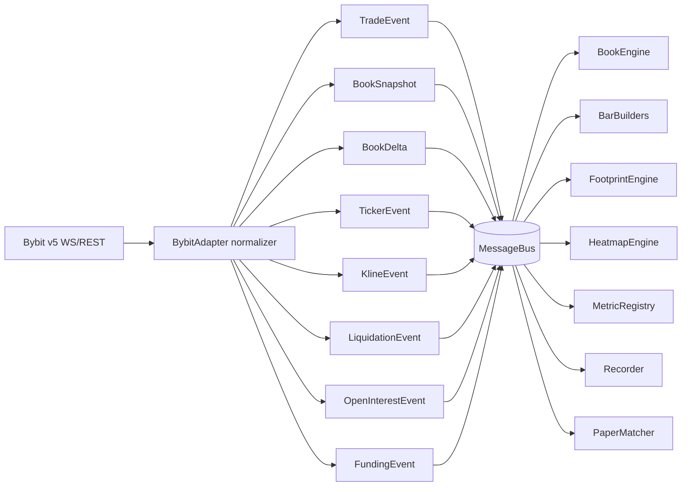
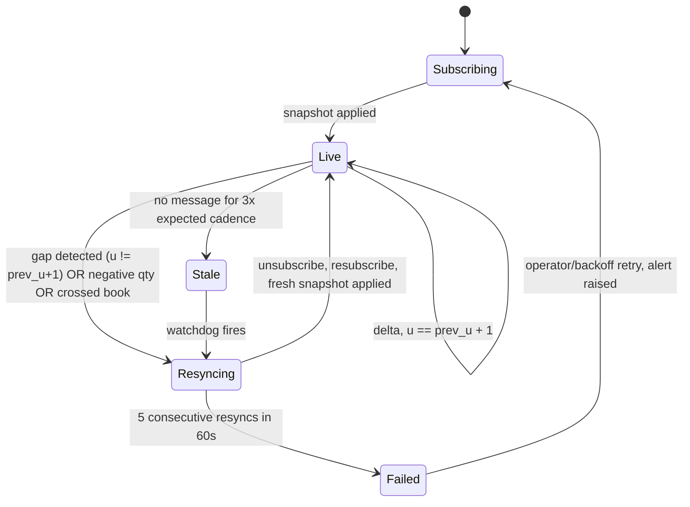
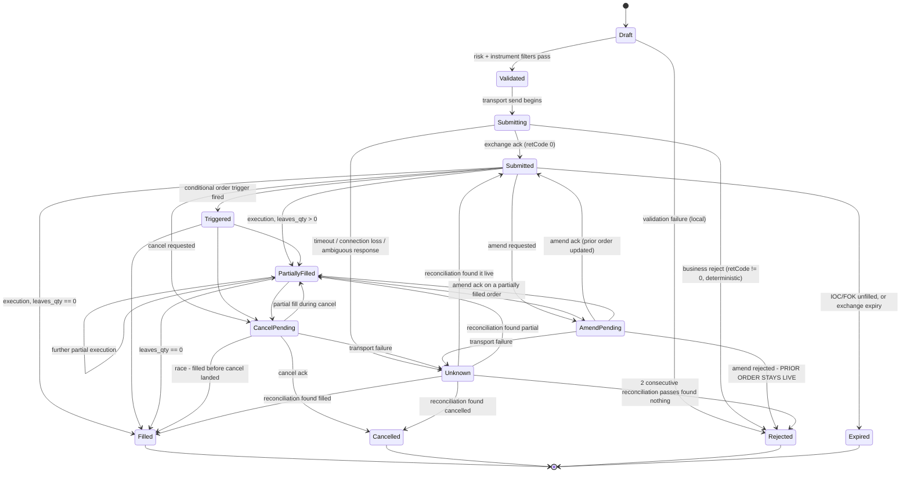
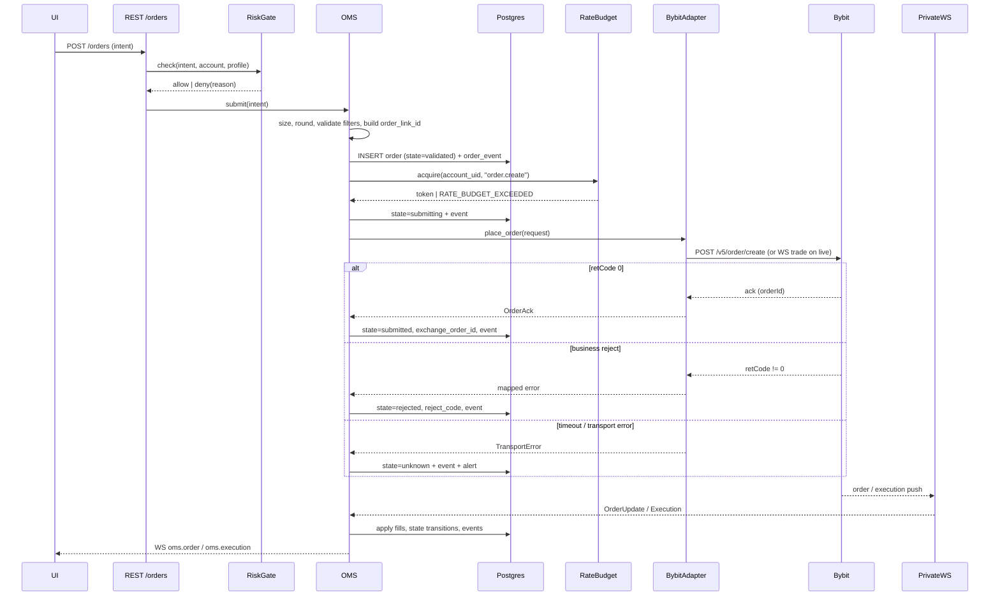
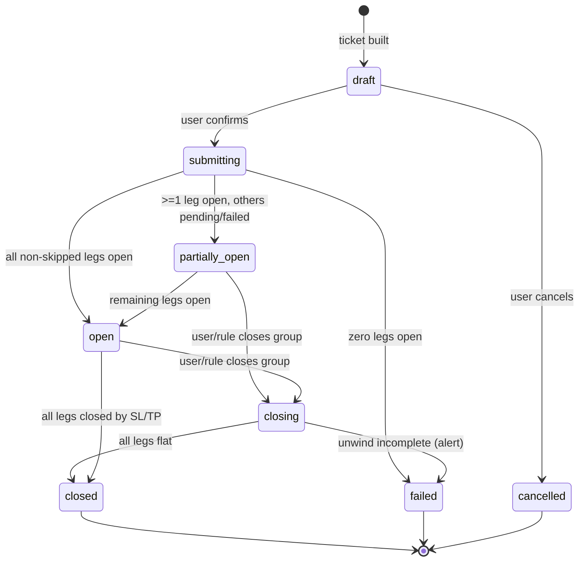
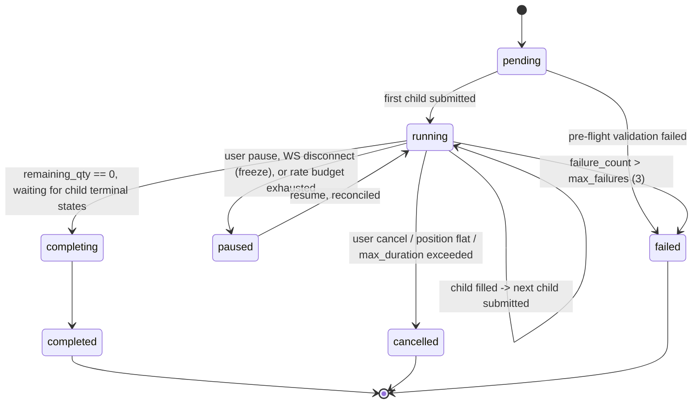
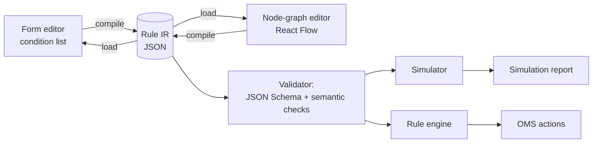
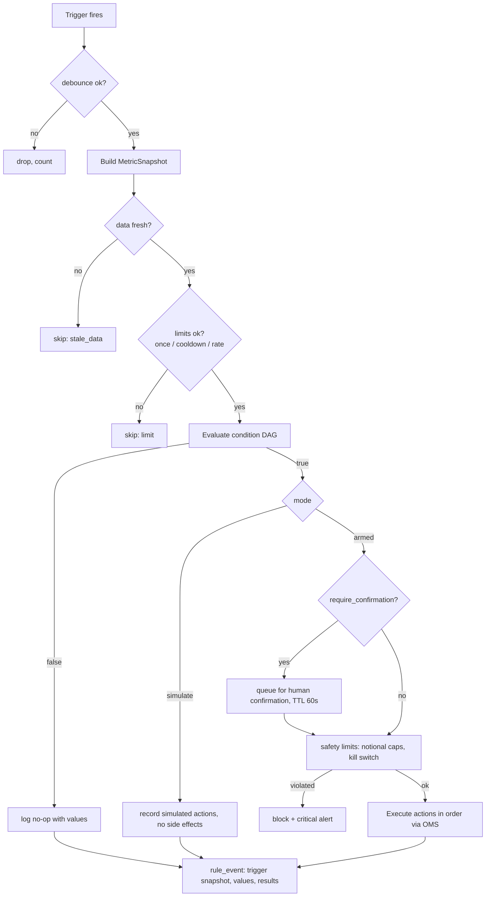
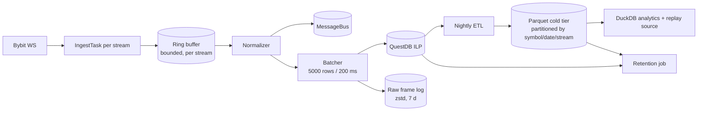

# 24 — Internal Domain Models & Contracts

Status: **binding**. Date: 2026-09-14. Owner: Architect + Backend lead. Scope: web app only (React + custom WebGL engine + Electron shell), Bybit USDT linear perpetuals only, owner/admin screens inside the web app, no Android, no separate admin app.

This document is the single source of truth for every **internal** type in CandleViewer: what flows on the message bus, what the engines compute, what the OMS stores, what the rule engine executes, and what the exchange adapter port looks like. It sits between the wire protocol (`23-ws-protocol.md`), the REST surface (`22-api-openapi.yaml`), persistence (`21-database-schema.md`) and the renderer (`26-chart-engine-design.md`).

| Doc                                        | Relationship                                                                                                                                                                                                                                                                                                                                                                                                                                                        |
| ------------------------------------------ | ------------------------------------------------------------------------------------------------------------------------------------------------------------------------------------------------------------------------------------------------------------------------------------------------------------------------------------------------------------------------------------------------------------------------------------------------------------------- |
| `20-architecture.md`                       | Module boundaries; §9 there sketches the adapter port that §14 here specifies in full                                                                                                                                                                                                                                                                                                                                                                               |
| `21-database-schema.md`                    | Persisted shape of everything modelled here; enum labels are shared verbatim                                                                                                                                                                                                                                                                                                                                                                                        |
| `22-api-openapi.yaml`                      | REST DTOs are serializations of these models (`model_dump(mode="json")`)                                                                                                                                                                                                                                                                                                                                                                                            |
| `23-ws-protocol.md`                        | Wire framing of the events in §2 and aggregates in §3–§6                                                                                                                                                                                                                                                                                                                                                                                                            |
| `26-chart-engine-design.md`                | Renderer-side typed arrays fed from §3–§6                                                                                                                                                                                                                                                                                                                                                                                                                           |
| `27-adrs/ADR-0006`                         | OMS state machine decision; §8 is its normative expansion                                                                                                                                                                                                                                                                                                                                                                                                           |
| `docs/research/06`, `08`, `09`, `11`, `23` | Source research. Each has a short digest at `docs/research/digests/<n>-<slug>.digest.md` and a full document at `docs/research/<n>-<slug>.md`. **Citation convention used throughout this document: a bare citation such as "research 08 §11.3" always refers to the section numbering of the FULL document** (`docs/research/08-crypto-data-metrics.md`), because digests renumber and compress. Where a digest is meant, it is written explicitly as "digest 08". |

## 0. Table of contents

1. [Conventions, primitives and shared types](#1-conventions-primitives-and-shared-types)
2. [Normalized market-data events](#2-normalized-market-data-events)
3. [Bar builders](#3-bar-builders)
4. [Footprint cell model and imbalance algorithms](#4-footprint-cell-model-and-imbalance-algorithms)
5. [Profile model](#5-profile-model)
6. [Heatmap grid model](#6-heatmap-grid-model)
7. [Metric definitions](#7-metric-definitions)
8. [OMS](#8-oms)
9. [Trade groups and fan-out](#9-trade-groups-and-fan-out)
10. [Emulated order algorithms](#10-emulated-order-algorithms)
11. [Rule engine](#11-rule-engine)
12. [Paper matcher](#12-paper-matcher)
13. [Recorder, retention and replay](#13-recorder-retention-and-replay)
14. [Exchange adapter interface](#14-exchange-adapter-interface)
15. [Auth, RBAC and audit](#15-auth-rbac-and-audit)
16. [Configuration and feature flags](#16-configuration-and-feature-flags)
17. [Schema governance, versioning and test obligations](#17-schema-governance-versioning-and-test-obligations)
18. [Traceability matrix](#18-traceability-matrix)
19. [Contract change log](#19-contract-change-log)

---

## 1. Conventions, primitives and shared types

### 1.1 Binding conventions

| #   | Rule                                                                                                                                                                                                                | Rationale                                                                                                                                                    |
| --- | ------------------------------------------------------------------------------------------------------------------------------------------------------------------------------------------------------------------- | ------------------------------------------------------------------------------------------------------------------------------------------------------------ |
| C1  | All models are **pydantic v2** `BaseModel` with `model_config = ConfigDict(frozen=True, extra="forbid", populate_by_name=True)` unless explicitly marked mutable.                                                   | Immutability makes bus fan-out safe without copying; `extra="forbid"` turns an unexpected Bybit field into a loud test failure rather than silent data loss. |
| C2  | **Money and quantity are `Decimal`** end-to-end on the OMS/accounting path. Never `float`.                                                                                                                          | Fee/PnL/qty arithmetic must be exact.                                                                                                                        |
| C3  | **Analytics may use `float`/`numpy`** inside engines (footprint, profile, heatmap, indicators), but any value crossing into OMS, journal or audit is converted at the boundary via `Decimal(str(x)).quantize(...)`. | Analytics needs vectorised speed; accounting needs exactness. The boundary is explicit and tested.                                                           |
| C4  | **Time is integer microseconds since Unix epoch (UTC)**, alias `TsUs = int`. Bybit millisecond fields are ×1000 at the adapter. `datetime` appears only in Postgres rows and human-facing strings.                  | Microseconds preserve trade order within a millisecond batch.                                                                                                |
| C5  | **Prices are carried as `Decimal` and, where a grid or the renderer needs it, as integer ticks** (`price_ticks = round((price - price_origin) / tick_size)`). The integer form is derived, never authoritative.     | Footprint/heatmap grids must key on an exact integer; floats produce phantom price levels.                                                                   |
| C6  | Every bus event carries `schema_version: int`, `event_id: UUID7`, `ts_event: TsUs` (exchange time), `ts_ingest: TsUs` (our receipt time).                                                                           | Version lets consumers reject unknown shapes; the two timestamps give feed latency for free.                                                                 |
| C7  | Enum _values_ are `snake_case` strings identical to the Postgres enum labels in `21-database-schema.md` §1.2. A rename is a migration plus a schema-version bump.                                                   | One vocabulary across DB, API, WS and code.                                                                                                                  |
| C8  | Symbols are the exchange-native uppercase string. Internal identity is `InstrumentKey = (exchange, category, symbol)`; v1 is always `("bybit", "linear", …)`.                                                       | Keeps a future second exchange additive.                                                                                                                     |
| C9  | Field naming is `snake_case`; the adapter owns the mapping from Bybit `camelCase`. No Bybit field name appears outside `candleviewer/exchange/bybit/`.                                                              | Single translation seam, lint-enforced (§17.4).                                                                                                              |
| C10 | Nothing is nullable "just in case". If a field is optional the doc states exactly when it is `None`.                                                                                                                | `Optional` without a stated reason is a bug generator.                                                                                                       |

### 1.2 Primitive aliases

```python
# services/api/candleviewer/domain/primitives.py
from __future__ import annotations
from decimal import Decimal
from typing import Annotated, Literal, NewType, TypeAlias
from uuid import UUID
from pydantic import StringConstraints

TsUs: TypeAlias = int                      # microseconds since epoch, UTC
TsMs: TypeAlias = int                      # milliseconds — adapter boundary only
Ticks: TypeAlias = int                     # integer price levels from price_origin
Px: TypeAlias = Decimal
Qty: TypeAlias = Decimal                   # base units (contracts)
Notional: TypeAlias = Decimal              # quote currency (USDT)
Bps: TypeAlias = Decimal

EventId = NewType("EventId", UUID)         # UUID7 — time-sortable
OrderId = NewType("OrderId", UUID)
GroupId = NewType("GroupId", UUID)
AccountId = NewType("AccountId", UUID)
UserId = NewType("UserId", UUID)
RuleId = NewType("RuleId", UUID)

Symbol = Annotated[str, StringConstraints(pattern=r"^[A-Z0-9]{4,20}$")]
OrderLinkId = Annotated[str, StringConstraints(pattern=r"^[A-Za-z0-9_-]{1,36}$")]
Exchange = Literal["bybit"]
Category = Literal["linear"]               # v1 scope lock
Environment = Literal["live", "demo", "testnet"]          # wire enum: == OpenAPI `Environment` == PG `exchange_env`
ExecutionMode = Literal["exchange", "paper", "replay"]    # internal only; never serialised as `environment`
Side = Literal["buy", "sell"]
```

**`Environment` and `ExecutionMode` are two axes, deliberately not one enum.** `Environment` says _which exchange account and credentials this belongs to_; `ExecutionMode` says _who filled it_. They are orthogonal: a paper fill during a replay of live-recorded data is `environment="live", execution_mode="replay"`, and collapsing that into a single `environment="replay"` would throw away the account the position is attributed to.

`Environment` is the value that crosses the wire. It is identical in all three places — this Python literal, the OpenAPI `Environment` schema, and the Postgres `exchange_env` type — and contract test `enum_parity_environment` asserts that. `ExecutionMode` never crosses the wire under that name; it is persisted as the `is_paper` boolean (`21-database-schema.md` §3.3) and published on the WS as `is_paper` (`23-ws-protocol.md` §13.1), with `replay` distinguished by the frame's own `source: "replay"` marker rather than by a field on the entity.

`paper` and `replay` modes never reach the adapter's network layer, but they run the same code path as `exchange`, so one implementation serves live, paper and replay (research 11 §3: NautilusTrader Backtest/Sandbox/Live parity).

### 1.3 Instrument and precision

Instrument metadata is version-tracked: tick size, lot size and leverage tiers change occasionally (research 08, "version-track instrument metadata"), and a change silently corrupts every historical footprint grid keyed on the old tick size.

```python
class Instrument(BaseModel):
    exchange: Exchange = "bybit"
    category: Category = "linear"
    symbol: Symbol
    base_coin: str                         # "BTC"
    quote_coin: str                        # "USDT"
    settle_coin: str                       # "USDT"
    status: Literal["pre_launch", "trading", "delivering", "closed"]
    contract_type: Literal["linear_perpetual"]
    launch_time: TsUs
    tick_size: Px                          # priceFilter.tickSize
    price_scale: int
    min_price: Px
    max_price: Px
    qty_step: Qty                          # lotSizeFilter.qtyStep
    min_order_qty: Qty
    max_order_qty: Qty                     # limit orders
    max_mkt_order_qty: Qty                 # market orders — different ceiling
    min_notional: Notional                 # lotSizeFilter.minNotionalValue
    max_leverage: Decimal
    min_leverage: Decimal
    leverage_step: Decimal
    funding_interval_min: int              # e.g. 480 = 8 h — NEVER assume 8 h
    upper_funding_rate: Decimal
    lower_funding_rate: Decimal
    copy_trading: bool                     # informational; feature de-scoped
    metadata_version: int                  # bumped when any field above changes
    fetched_at: TsUs
```

**Precision rules** (`InstrumentPolicy`, unit-tested):

1. `round_price(px, side, mode)` — `mode="conservative"` rounds a buy limit _down_ and a sell limit _up_ (never accidentally more aggressive); `"nearest"` for display; `"aggressive"` only for chase algos that explicitly intend to cross.
2. `round_qty(q)` — always **floor** to `qty_step`. Rounding up can exceed available margin or a risk cap.
3. `validate_order(px, qty)` raises `InstrumentFilterError` naming the specific violated filter (`min_order_qty`, `qty_step`, `min_notional`, `max_mkt_order_qty`, `price_scale`, `min_price`, `max_price`) — never a generic message, because the UI renders the filter name.
4. A `metadata_version` bump invalidates cached footprint/profile aggregates for that symbol and schedules a rebuild from raw trades (§13.6).

`E08-S02` implements the subset of the above scoped to `US-MKT-004`: `InstrumentPolicy.round_price(price, *, mode=PriceRoundMode.NEAREST)` (only `"nearest"`, `ROUND_HALF_EVEN`; the side-aware `conservative`/`aggressive` execution modes above are E29/OMS scope, not yet implemented), `round_qty(qty, *, mode=QtyRoundMode.DOWN)` (only `"down"`, matching rule 2 verbatim), and `validate(price, qty) -> list[FilterViolation]` — data, not an exception, so a caller (e.g. the order-ticket UI) can show every violated filter at once; `enforce(price, qty)` is the thin wrapper that raises `InstrumentFilterError` for OMS callers per rule 3. Violation codes (`services/api/candleviewer/exchange/policy.py::FilterViolationCode`, each with a `user_message` naming the exact limit): `PRICE_NOT_TICK_MULTIPLE`, `QTY_NOT_LOT_MULTIPLE`, `QTY_BELOW_MIN`, `QTY_ABOVE_MAX`, `NOTIONAL_BELOW_MIN`, `SYMBOL_NOT_TRADING`. The same rules are published to the web client as `@candleviewer/protocol`'s `policy` export (`packages/protocol/src/rules/policy.ts`, a hand-port proven identical to the Python source via the shared corpus at `packages/fixtures/golden/policy/corpus.json` — see that file's `$schema_note` and `tools/gen/export_instrument_policy_corpus.py`'s module docstring) plus a generated enum-value table (`packages/protocol/src/generated/policy/`, from `tools/gen/export_instrument_policy_rules.py`) so the two can never disagree on a violation code's spelling.

### 1.4 Base envelope

```python
class DomainEvent(BaseModel):
    model_config = ConfigDict(frozen=True, extra="forbid")
    schema_version: int = 1
    event_id: EventId
    ts_event: TsUs                # exchange-stamped
    ts_ingest: TsUs               # our receipt; difference = feed latency
    source: Literal["live", "replay", "paper", "backfill"]

class MarketEvent(DomainEvent):
    exchange: Exchange = "bybit"
    category: Category = "linear"
    symbol: Symbol
```

`ts_event` is **never** synthesized. Where a record lacks its own timestamp the adapter uses the containing push envelope's `ts` and sets `ts_estimated=True` on the subtype that declares that field.

### 1.5 Decimal quantization table

| Quantity                | Quantization           | Enforced in                                                 |
| ----------------------- | ---------------------- | ----------------------------------------------------------- |
| Price                   | `instrument.tick_size` | `InstrumentPolicy.round_price` (nearest, `ROUND_HALF_EVEN`) |
| Quantity                | `instrument.qty_step`  | `InstrumentPolicy.round_qty` (down, `ROUND_DOWN`)           |
| Notional / PnL / equity | 8 dp                   | `Money.q()`                                                 |
| Fees                    | 8 dp, `ROUND_HALF_UP`  | `FeeCalculator`                                             |
| Funding payments        | 8 dp, `ROUND_HALF_UP`  | `FundingCalculator`                                         |
| Percentages / ratios    | 6 dp                   | display layer                                               |
| R-multiples             | 4 dp                   | `MetricRegistry`                                            |

---

## 2. Normalized market-data events

Eight event families. All are produced _only_ by the exchange adapter (§14), all are immutable, all are recorded (§13), and all can be re-emitted byte-identically by the replay engine.



### 2.1 TradeEvent

The tape. Bybit gives the **aggressor side directly** (`S`), so no tick-rule reconstruction is needed (research 08 §2) — this is the single most important simplification in the whole order-flow stack.

```python
class TradeEvent(MarketEvent):
    trade_id: str                 # exchange trade id, unique per symbol
    price: Px
    qty: Qty                      # base units
    side: Side                    # AGGRESSOR side: "buy" = taker lifted the ask
    is_block_trade: bool
    price_ticks: Ticks            # derived, = round((price - price_origin)/tick_size)
    notional: Notional            # derived, price * qty
    seq: int                      # monotonic per (symbol, stream) ingest counter
```

**Bybit v5 mapping — `publicTrade.{symbol}`:**

| Internal         | Bybit | Transform                      | Notes                                                                                                               |
| ---------------- | ----- | ------------------------------ | ------------------------------------------------------------------------------------------------------------------- |
| `ts_event`       | `T`   | `int(T) * 1000`                | ms → µs                                                                                                             |
| `symbol`         | `s`   | identity                       |                                                                                                                     |
| `side`           | `S`   | `"Buy"→"buy"`, `"Sell"→"sell"` | taker/aggressor side                                                                                                |
| `qty`            | `v`   | `Decimal(v)`                   | base coin for linear                                                                                                |
| `price`          | `p`   | `Decimal(p)`                   |                                                                                                                     |
| `trade_id`       | `i`   | identity                       |                                                                                                                     |
| `is_block_trade` | `BT`  | `bool`                         | absent ⇒ `False`                                                                                                    |
| —                | `L`   | dropped                        | tick direction (`PlusTick`/`ZeroPlusTick`/…) — we derive direction from `S`; retained only in the raw recorder blob |
| `notional`       | —     | `price * qty`                  | linear only; inverse would need `qty/price` (out of scope)                                                          |
| `price_ticks`    | —     | computed                       |                                                                                                                     |
| `seq`            | —     | ingest counter                 | not from exchange                                                                                                   |

REST fallback `GET /v5/market/recent-trade` maps identically; **always pass `limit=1000`** (defaults are 60 for linear — research 08 §2). REST-sourced trades carry `source="backfill"`.

**Edge cases.** (a) One WS push may contain many records — each becomes a separate `TradeEvent` with the same `ts_ingest`, ascending `seq`. (b) Duplicate `trade_id` within a 5-minute window is dropped by the dedupe ring and counted in `md_duplicate_trades_total`. (c) Out-of-order `ts_event` (later push with earlier timestamp) is accepted and ordered by `(ts_event, seq)`; if the inversion exceeds 2 s the event is still accepted but `md_out_of_order_total` increments and a warning is logged with both timestamps.

**E08-S04 (as built).** The adapter parses frames into a venue-neutral `TradePrint` (`exchange/base/trade_print.py`; ids capped at 64 chars, non-finite/non-positive numbers and batches > 2 000 rejected); `ingestion/trade_stream.py` builds `TradeEvent`s and publishes on `{env}.md.{symbol}.trade`. Dedupe is a bounded per-symbol ring (50 000 ids ≈ 5 000 prints/s × 10 s) counted in `trade_duplicates_suppressed_total{symbol}` (the name used by the ticket and dashboards; supersedes `md_duplicate_trades_total`). On reconnect (`resubscribing`/`degraded`) or a dropped raw frame a gap opens at the last published print; the first live batch after it triggers one REST recent-trade backfill, merged with that batch by `(ts_event, trade_id)`. Backfilled prints older than the last published print are not republished, so no consumer sees time move backwards. A `GapEvent{symbol, start_us, end_us, recovered, reason}` with a text `label()` (`"No data 12:03:11-12:03:19"`) is published on `{env}.md.{symbol}.gap`; `recovered=false` when the backfill failed, was rate-limited or did not reach back to `start_us` (`trade_gaps_total{symbol,recovered}`).

### 2.2 BookSnapshot and BookDelta

Bybit sends a snapshot on subscribe and after any server-side reset, then deltas. There is **no checksum** — desync can only be handled by drop-and-resubscribe (research 06 §9, §19).

```python
class BookLevel(BaseModel):
    price: Px
    qty: Qty                      # 0 means delete (delta only)
    price_ticks: Ticks

class BookSnapshot(MarketEvent):
    depth: int                    # 1 | 50 | 200 | 500
    bids: tuple[BookLevel, ...]   # descending price
    asks: tuple[BookLevel, ...]   # ascending price
    update_id: int                # Bybit u
    cross_seq: int                # Bybit seq
    ts_match: TsUs                # Bybit cts — matching-engine time
    reason: Literal["subscribe", "resync", "server_reset", "replay_seek"]

class BookDelta(MarketEvent):
    depth: int
    bids: tuple[BookLevel, ...]   # qty==0 ⇒ delete level
    asks: tuple[BookLevel, ...]
    update_id: int
    prev_update_id: int           # last u we applied; gap ⇒ resync
    cross_seq: int
    ts_match: TsUs
```

**Bybit mapping — `orderbook.{depth}.{symbol}`:**

| Internal    | Bybit         | Transform                                                                                                  |
| ----------- | ------------- | ---------------------------------------------------------------------------------------------------------- |
| event type  | `type`        | `"snapshot"→BookSnapshot`, `"delta"→BookDelta`                                                             |
| `bids`      | `data.b`      | `[[p, q], …]` → `BookLevel`                                                                                |
| `asks`      | `data.a`      | same                                                                                                       |
| `update_id` | `data.u`      | monotonic per symbol; resets to 1 on a server-side reset, which is always accompanied by `type="snapshot"` |
| `cross_seq` | `data.seq`    | cross-topic ordering                                                                                       |
| `ts_match`  | `data.cts`    | ms → µs                                                                                                    |
| `ts_event`  | envelope `ts` | ms → µs                                                                                                    |
| `depth`     | topic suffix  | parsed from `orderbook.200.BTCUSDT`                                                                        |

**Depth/cadence (linear, research 06 §9 / 11 §2.1):** 1 @ 10 ms, 50 @ 20 ms, 200 @ 100 ms, 500 @ 200 ms. v1 subscribes **200** for the heatmap/DOM and **1** for best-bid/ask ticks. Depth `1` is snapshot-only and is re-sent every 3 s even when unchanged (keepalive) — the book engine must not treat an unchanged depth-1 resend as a book event, or the heatmap will show phantom columns.

**Desync protocol (`BookEngine`):**



Rules: the engine keeps `prev_update_id`; any gap discards the local book, emits `BookDesyncEvent` (recorded, alerted, surfaced in the UI as a "book resyncing" badge over the DOM/heatmap) and resubscribes. A **crossed book** (best bid ≥ best ask) after applying a delta is treated as desync, not clamped. Levels are held in two `SortedDict`s keyed by `price_ticks`.

### 2.3 TickerEvent

```python
class TickerEvent(MarketEvent):
    last_price: Px | None
    mark_price: Px | None
    index_price: Px | None
    bid1_price: Px | None
    bid1_qty: Qty | None
    ask1_price: Px | None
    ask1_qty: Qty | None
    open_interest: Qty | None          # base coin for linear
    open_interest_value: Notional | None
    turnover_24h: Notional | None
    volume_24h: Qty | None
    price_24h_pcnt: Decimal | None
    funding_rate: Decimal | None
    next_funding_time: TsUs | None
    is_delta: bool                     # Bybit tickers pushes deltas for linear
```

**Mapping — `tickers.{symbol}` (~100 ms, delta-encoded for linear):** `lastPrice→last_price`, `markPrice→mark_price`, `indexPrice→index_price`, `bid1Price/bid1Size→bid1_price/bid1_qty`, `ask1Price/ask1Size→ask1_price/ask1_qty`, `openInterest→open_interest`, `openInterestValue→open_interest_value`, `turnover24h`, `volume24h`, `price24hPcnt`, `fundingRate`, `nextFundingTime` (ms→µs).

**Critical edge case:** Bybit's linear ticker stream is a **delta** stream — absent fields mean _unchanged_, not _null_. The adapter keeps a per-symbol last-known ticker and emits a **fully-populated** `TickerEvent` with `is_delta=False` downstream, so no consumer ever implements merge logic. The raw delta is what the recorder stores.

**Shipped (E08-S03):** `exchange/bybit/ticker.py` parses frames into a neutral `TickerDelta`; `ingestion/ticker_stream.py` merges (required fields: all except `open_interest_value`, `next_funding_time`) and publishes on `{env}.md.{symbol}.ticker` with `CONFLATE_LATEST`-friendly semantics. Empty-string wire values mean absent; explicit `"0"` is a value. Until a complete state exists the topic is `warming` (health event) and nothing is published; reconnect emits `reconnecting` and rebuilds from the next push.

### 2.4 KlineEvent

Exchange klines are a **cross-check and a cold-start backfill**, not the primary bar source: CandleViewer builds its own bars from trades (§3) so that time/tick/volume/range/delta/renko all share one code path.

```python
class KlineEvent(MarketEvent):
    interval: Literal["1","3","5","15","30","60","120","240","360","720","D","W","M"]
    start: TsUs
    end: TsUs
    open: Px
    high: Px
    low: Px
    close: Px
    volume: Qty
    turnover: Notional
    confirmed: bool          # Bybit `confirm` — MUST gate "bar closed" logic
```

Mapping — `kline.{interval}.{symbol}` and `GET /v5/market/kline`: `start`,`end` ms→µs; `open/high/low/close` → `Decimal`; `volume`, `turnover`; `confirm→confirmed`. REST kline returns a **list-of-lists** `[startTime, open, high, low, close, volume, turnover]` in **descending** time order — the adapter reverses it and pairs `end = start + interval_ms*1000 - 1`.

**Edge case:** never mark a bar closed on `confirmed=False`; Bybit repeatedly repushes the forming bar and the chart will flicker and indicators will repaint (research 06 §19).

### 2.5 LiquidationEvent

```python
class LiquidationEvent(MarketEvent):
    price: Px
    qty: Qty
    side: Side                 # CLOSING order side: "sell" ⇒ a LONG was liquidated
    liquidated_side: Literal["long", "short"]   # derived, unambiguous
    notional: Notional
    batch_index: int           # position within the batched push
    ts_estimated: bool         # True when the record had no own timestamp
```

Mapping — `allLiquidation.{symbol}` (the legacy singular `liquidation` topic is retired and 404s): `T→ts_event` (ms→µs), `s→symbol`, `S→side`, `v→qty`, `p→price`. `liquidated_side = "long" if side == "sell" else "short"`. Because the field is confusingly named at the exchange, **no code outside the adapter may read `side` on this event** — consumers use `liquidated_side` (lint-enforced).

**Edge case:** the topic batches at most one push per symbol per 500 ms with a `data[]` array — the recorder must store every array element, not assume one record per push (research 08 §9).

### 2.6 OpenInterestEvent

```python
class OpenInterestEvent(MarketEvent):
    open_interest: Qty             # base coin (linear)
    open_interest_value: Notional  # USD
    interval: Literal["tick","5min","15min","30min","1h","4h","1d"]
    origin: Literal["ws_ticker", "rest_history"]
```

Live OI arrives on `tickers.{symbol}` (100 ms) → `interval="tick"`, `origin="ws_ticker"`. History comes from `GET /v5/market/open-interest` (`intervalTime` 5min…1d, `limit` 1–200 default 50, cursor-paginated) → `origin="rest_history"`. **Units matter:** for `linear`, `openInterest` is denominated in base coin and must be multiplied by price for USD; `openInterestValue` is already USD. Inverse is USD-denominated — out of scope but the field comment states it so a future adapter does not get it wrong.

### 2.7 FundingEvent

```python
class FundingEvent(MarketEvent):
    funding_rate: Decimal
    funding_interval_min: int       # from instrument metadata, not assumed
    next_funding_time: TsUs
    settled: bool                   # True = historical settlement, False = current accruing
    annualized_rate: Decimal        # derived
```

`annualized_rate = funding_rate * (365*24*60 / funding_interval_min)`. Worked example: interval 480 min ⇒ 1095 periods/yr ⇒ 0.01 % per period ≈ **10.95 %/yr**.

Sources: live accruing rate from `tickers.{symbol}` (`fundingRate`, `nextFundingTime`) with `settled=False`; history from `GET /v5/market/funding/history` (`limit` 1–200, default 200) with `settled=True`. Bybit publishes no distinct "predicted" rate — `fundingRate` _is_ the currently-accruing rate that will apply at `nextFundingTime` (research 08 §7, open Q #8). Intervals vary per symbol (8 h common; 1 h / 2 h / 4 h exist) — always read `instrument.funding_interval_min`.

### 2.8 Derived and control events

| Event                    | Purpose                                                     | Key fields                                                                                     |
| ------------------------ | ----------------------------------------------------------- | ---------------------------------------------------------------------------------------------- |
| `BestQuoteEvent`         | L1 top-of-book for the ticket, DOM header and spread metric | `bid, bid_qty, ask, ask_qty, spread_ticks, spread_bps, mid`                                    |
| `BookDesyncEvent`        | Book resync incident                                        | `symbol, depth, prev_update_id, got_update_id, resync_count`                                   |
| `FeedHealthEvent`        | Per-stream health, 1 Hz                                     | `stream_kind, connected, last_msg_age_ms, latency_p50_ms, latency_p99_ms, msgs_per_s, dropped` |
| `ClockSyncEvent`         | Offset vs `GET /v5/market/time`, 60 s                       | `offset_ms, rtt_ms, drift_rate_ppm, action` (`ok`/`warn`/`block_trading`)                      |
| `InstrumentUpdatedEvent` | Instrument metadata changed                                 | `symbol, metadata_version, changed_fields[]`                                                   |

`ClockSyncEvent.action == "block_trading"` when `abs(offset_ms) > 2000` (40 % of Bybit's 5000 ms default `recv_window`). Order entry is disabled system-wide until it clears; this is the pre-emptive form of Bybit error 10002 (research 11 §2.5 — WSL clocks drift badly after host sleep/resume).

### 2.9 Event catalogue summary

| Event                    | Bybit source                       | Cadence             | Recorded                           | Bus topic                              |
| ------------------------ | ---------------------------------- | ------------------- | ---------------------------------- | -------------------------------------- |
| `TradeEvent`             | `publicTrade.{s}` / `recent-trade` | per match           | yes (hot+cold)                     | `md.trade.{symbol}`                    |
| `BookSnapshot`           | `orderbook.{d}.{s}` type=snapshot  | on subscribe/resync | yes                                | `md.book.{symbol}`                     |
| `BookDelta`              | `orderbook.{d}.{s}` type=delta     | 20–200 ms           | yes (deltas, not re-snapshots)     | `md.book.{symbol}`                     |
| `TickerEvent`            | `tickers.{s}`                      | ~100 ms             | yes (downsampled 1 Hz cold)        | `md.ticker.{symbol}`                   |
| `KlineEvent`             | `kline.{i}.{s}` / REST             | 1–60 s              | yes                                | `md.kline.{symbol}.{interval}`         |
| `LiquidationEvent`       | `allLiquidation.{s}`               | ≤1 push/500 ms      | yes                                | `md.liq.{symbol}`                      |
| `OpenInterestEvent`      | ticker / REST OI                   | 100 ms / 5 min      | yes                                | `md.oi.{symbol}`                       |
| `FundingEvent`           | ticker / REST funding              | 100 ms / settlement | yes                                | `md.funding.{symbol}`                  |
| `BestQuoteEvent`         | derived                            | on change           | no (derivable)                     | `md.quote.{symbol}`                    |
| `BookDesyncEvent`        | derived                            | rare                | yes                                | `sys.md.desync`                        |
| `FeedHealthEvent`        | derived                            | 1 Hz                | metrics only                       | `sys.md.health`                        |
| `ClockSyncEvent`         | `GET /v5/market/time`              | 60 s                | metrics only                       | `sys.clock`                            |
| `BigTradeEvent`          | derived (§2.10)                    | per flagged print   | no (derivable from trades, C-2.15) | `{env}.md.{symbol}.bigtrade`           |
| `TradeClusterEvent`      | derived (§2.10)                    | on cluster close    | no (derivable from trades, C-2.15) | `{env}.md.{symbol}.cluster`            |
| `BigTradeThresholdEvent` | derived (§2.10)                    | ≤ 1 / 5 s           | yes (config echo; not derivable)   | `{env}.md.{symbol}.bigtrade-threshold` |
| `BigTradeAdvisoryEvent`  | derived (§2.10)                    | on over-flag entry  | yes                                | `{env}.md.{symbol}.bigtrade-advisory`  |

**Ingestion health reasons (#1919).** `IngestionService.health()` returns `degraded` (never `down`;
`stopped` before start) with `detail` = comma-joined `HealthReason` tokens, derived from published plain
signals only (C-2.20). Surfaced as `/readyz` check `ingestion` (`ok:false`, `detail`, still HTTP 200), the
`ingestion` health component and `exchange.public_ws` (real WS phase).

| Token                   | Condition                                             | Threshold                                                                  |
| ----------------------- | ----------------------------------------------------- | -------------------------------------------------------------------------- |
| `ws_not_open`           | public WS phase != `open`                             | > 5 s (`WS_GRACE_S`)                                                       |
| `book_out_of_live`      | a desired book not LIVE                               | > 30 s (`RESYNC_BACKOFF_CAP_S`: the longest a healthy backoff cycle waits) |
| `trade_gap_unrecovered` | any open trade gap                                    | until backfill closes it                                                   |
| `catalogue_stale`       | instrument cache older than its TTL (or never loaded) | cache `ttl_seconds`                                                        |
| `pump_breaker_open`     | frame-pump breaker tripped                            | 30 s (`PUMP_BREAKER_WINDOW_S`)                                             |

**As shipped (E08-T06 reconciliation, 2026-10-05).** Bus topics are `{env}.md.{symbol}.{detail}`
(`bus/models.py` `Topic.key`, e.g. `demo.md.BTCUSDT.trade`), not `md.{detail}.{symbol}` as tabled above;
the table's family→stream mapping is otherwise unchanged. Implemented today: `trade`, `book`
(snapshot + delta + `BookStatus`), `ticker`, `gap` (trade-tape `GapEvent`), feed health
(`{env}.health.feed`). Queue policy is chosen **per subscriber** at `Bus.subscribe` (not per topic):
trade consumers must subscribe NEVER_DROP (a full queue awaits and counts
`ingest_queue_full_total{class="trade"}`); state-like consumers use CONFLATE_LATEST or
INVALIDATE_ON_FULL (§4.2 of `20-architecture.md`). Metric mapping per family (all
declared in `ingestion/metrics.py`, exported with `env`, `exchange`): trades/tickers →
`ingest_events_total{stream,symbol}`, `ingest_lag_seconds{stream}`; trade gaps →
`trade_gaps_total{symbol,recovered}`; books → `ingest_book_live{symbol}`,
`ingest_book_resyncs_total{symbol,reason}`; feed health → `ws_topic_staleness_seconds{topic}`,
`ingest_ws_up{socket}`; clock → `exchange_clock_drift_ms`, `clock_offset_age_seconds`.

### 2.10 Big-trade events (E22-T01, contract-first)

Produced by M9 `orderflow/bigtrade.py` (`BigTradeEngine`) from `TradeEvent`s processed in `(ts_event, trade_id)` order. Deadlines are evaluated against print timestamps, never the wall clock, so live and replay take the same path. Duplicate `trade_id`s count once. Per-print evaluation is plain synchronous code that publishes enums. It is **not** a statechart (C-2.20). Decisions recorded as owner item Q on #1778 (★ defaults).

```python
class BigTradeEvent(MarketEvent):          # one per flagged print
    trade_id: str
    price: Px
    qty: Qty
    side: Side
    notional: Notional
    price_ticks: Ticks
    mode: Literal["absolute_size", "notional", "percentile"]
    threshold_abs: Decimal                 # effective threshold in the mode's unit (qty for absolute_size, USDT otherwise)
    capped: bool                           # True while the over-flagging cap is active
    estimated: bool                        # True in percentile mode (threshold is a P² estimate)
    seq: int                               # copied from the source TradeEvent

class TradeClusterEvent(MarketEvent):      # emitted when a cluster closes
    cluster_id: str                        # deterministic: f"{side}:{price_bucket}:{first_trade_id}"
    side: Side
    price_bucket: int                      # floor(price / (tick_size * max(1, tolerance_ticks)))
    anchor_price: Px                       # first print's price (display only; not a merge criterion)
    first_ts_event: TsUs
    last_ts_event: TsUs
    trade_id_count: int                    # exact member count (== cluster_size)
    first_trade_id: str
    last_trade_id: str
    trade_ids: tuple[str, ...]             # first CLUSTER_IDS_MAX (64) members in (ts_event, trade_id) order
    trade_ids_truncated: bool              # True when trade_id_count > CLUSTER_IDS_MAX
    cluster_size: int
    total_qty: Qty
    total_notional: Notional
    vwap: Px
    max_print_qty: Qty
    close_reason: Literal["deadline", "superseded", "evicted", "config_change", "flush"]
    estimated: Literal[True] = True        # SR-E22-12

class BigTradeThresholdEvent(MarketEvent): # on every change; ≤ 1 per 5 s (print time) while stable
    mode: Literal["absolute_size", "notional", "percentile"]
    value: Decimal                         # percentile => 0..100
    percentile_window_ms: int
    cluster_window_ms: int
    cluster_tolerance_ticks: int
    effective_threshold_abs: Decimal       # POST-cap value actually applied; displayed by the UI (US-BIG-002 scenario 2)
    cap_active: bool                       # over-flagging cap in force (recoverable from this stream)
    sample_count: int
    flagged_fraction: Decimal
    estimated: bool                        # True in percentile mode

class BigTradeAdvisoryEvent(MarketEvent):
    reason: Literal["threshold_too_low"]
    mode: Literal["absolute_size", "notional", "percentile"]
    threshold_abs: Decimal                 # the configured effective threshold that over-flagged (reference for suggested_value)
    flagged_fraction: Decimal              # > 0.20 over the trailing window
    suggested_value: Decimal               # in the configured mode's unit
    cap_active: bool
```

| Event                    | Bus topic (`{env}.md.{symbol}.{detail}`, §2.9 as shipped) | Cadence                                              |
| ------------------------ | --------------------------------------------------------- | ---------------------------------------------------- |
| `BigTradeEvent`          | `…bigtrade`                                               | per flagged print                                    |
| `TradeClusterEvent`      | `…cluster`                                                | on cluster close                                     |
| `BigTradeThresholdEvent` | `…bigtrade-threshold`                                     | on every change; ≤ 1 / 5 s (print time) while stable |
| `BigTradeAdvisoryEvent`  | `…bigtrade-advisory`                                      | on entering the over-flag state                      |

Topic details are flat single segments (`bus/models.py` `_SEGMENT_RE` = `[a-zA-Z0-9_-]+`, at most 4 segments). None of them collides with an existing `md` detail (`trade`, `book`, `ticker`, `gap`).

**Envelope.** All four events carry the §1.4 envelope (C6) with `schema_version = 1`. A shape change bumps it (§17). `ts_event` (`TsUs`) is defined per event as follows:

- `BigTradeEvent`: the triggering print's `ts_event`.
- `TradeClusterEvent`: the last member's `ts_event` (equal to `last_ts_event`).
- `BigTradeThresholdEvent` / `BigTradeAdvisoryEvent`: the `ts_event` of the print that triggered the emission. No wall or injected clock is involved, so the output never depends on batch timing.

**Print-time boundaries (replay determinism).** Every window, deadline and refresh boundary is measured in print time (`ts_event` of the processed prints). The threshold refresh fires when the latest print's `ts_event` crosses the next 5 s boundary (`floor(ts_event / 5_000_000)` increments). The trailing percentile and over-flag windows end at the latest print's `ts_event`. **Replay mode:** with `source="replay"` the same engine runs over the recorded trades and recorded config echoes. It **compares** its threshold/advisory output against the recorded `BigTradeThresholdEvent`/`BigTradeAdvisoryEvent` stream (a mismatch is a determinism defect, counted and logged) and does not republish them (C-2.15).

**Rules (binding).**

- **Cluster key.** A cluster is keyed on `(symbol, side, price_bucket)` only. A print merges into the open cluster for its key if `ts_event <= first_ts_event + cluster_window_ms * 1000` (ms → µs, C4). Otherwise that cluster closes (`deadline`) and a new one opens. There is no separate tolerance check against the anchor price. A cluster belongs to the bar containing its `first_ts_event` (US-BIG-004 scenario 3). `cluster_window_ms = 0` disables clustering. A config change recomputes the still-open clusters from the buffered prints under the new config. Open clusters were never published, so **no close is emitted for them before the recompute**: their prints are re-clustered, and clusters closing during or after the recompute carry their normal `close_reason`. `config_change` is emitted only when the new config turns clustering **off** (`cluster_window_ms = 0`), closing the open clusters with nothing to recompute. Invariant: across a reconfigure, every trade id appears in exactly one emitted cluster. Event shapes are unchanged (`schema_version` stays 1).
- **Over-flagging cap.** When more than 20 % of the prints in the trailing window are flagged, the engine emits `BigTradeAdvisoryEvent` and raises the effective threshold to the trailing p80. The p80 comes from a **second** P² estimator over the same trailing window, so state is still fixed-size (two estimators per symbol). It keeps emitting `BigTradeEvent` with `capped=True` and **never suppresses** them.
- **Percentile estimator.** P² behind a trimmed wrapper (SR-E22-14), using fixed-size state. It never stores the window's prints. The accuracy target is a **rank** error of ≤ 1 % against the exact quantile over the same window. The effective threshold refreshes at most every 5 s of print time (above). `BigTradeThresholdEvent` is also emitted immediately on any change of `effective_threshold_abs`, `cap_active` or config. The current, post-cap state is therefore always recoverable from the recorded threshold stream, while `BigTradeAdvisoryEvent` fires on cap entry only.
- **State caps (closes threat-model gap G3; SR-E22-05).** Per symbol: `CLUSTER_KEYS_MAX = 4096` open cluster keys and `PRINTS_BUFFER_MAX = 16384` buffered prints (a floor). The buffer holds **all** evaluated prints (not only flagged ones) inside the active cluster window, so a config change can recompute without a restart. Its effective bound is the asserted constant expression `PRINTS_BUFFER_EFFECTIVE_MAX = max(PRINTS_BUFFER_MAX, cluster_window_ms × 5)` in `orderflow/limits.py`, where 5 = the 5 000 prints/s budget #5 expressed per ms. That means a healthy feed never evicts inside the window: 25 000 at the 5 000 ms REST cap, 10 000 → 16 384 at the 2 000 ms WS cap. It stays bounded because `cluster_window_ms` is capped (SR-E22-04). The oldest entry is evicted (`close_reason="evicted"`) and `bigtrade_state_truncated_total{symbol}` is incremented, never silently. Every bound is imported from `orderflow/limits.py` (E22 threat model §7). No literal copies are allowed elsewhere.
- **Bounded membership.** `trade_ids` is capped at `CLUSTER_IDS_MAX = 64` (`orderflow/limits.py`, asserted), with `trade_ids_truncated` set when the cap applies. The exact count and the first/last ids are always present, so the event size is O(1) on the bus while still giving tape highlighting and determinism tests concrete members. The full membership stays reconstructible from the tape by `(symbol, side, price_bucket, first_ts_event..last_ts_event)`.
- **Input assert (SR-E22-13).** Engine inputs are `Decimal` > 0 and on tick. Anything else is rejected and counted.

---

## 3. Bar builders

One `BarBuilder` protocol, six implementations. Every builder consumes `TradeEvent` only (never klines), so live and replay produce byte-identical bars. Bars are the substrate for footprint (§4), profiles (§5), indicators and the rule engine's `on_bar_close` trigger.

### 3.1 Bar model

```python
class BarSpec(BaseModel):
    kind: Literal["time","tick","volume","range","delta","renko"]
    # exactly one of the following is set, matching `kind`:
    interval_ms: int | None = None       # time
    tick_count: int | None = None        # tick
    volume_threshold: Qty | None = None  # volume  (base units)
    range_ticks: int | None = None       # range, renko (brick size)
    delta_threshold: Qty | None = None   # delta
    # shared options
    price_source: Literal["last","mark"] = "last"
    session_anchor_utc_min: int = 0      # minutes past 00:00 UTC where the session starts
    align_to_epoch: bool = True          # time bars snap to epoch multiples
    renko_wick: bool = False             # renko: keep high/low wicks
    reversal_bricks: int = 2             # renko reversal cost, in bricks

    @model_validator(mode="after")
    def _exactly_one(self) -> "BarSpec": ...   # raises on mismatch

class Bar(BaseModel):
    spec_hash: str                # sha256 of BarSpec canonical JSON — cache key
    symbol: Symbol
    index: int                    # strictly increasing per (symbol, spec_hash) for real bars
    open_time: TsUs               # ts_event of the first trade in the bar
    close_time: TsUs              # ts_event of the last trade (or boundary for time bars)
    open: Px
    high: Px
    low: Px
    close: Px
    volume: Qty
    buy_volume: Qty               # aggressor buy
    sell_volume: Qty
    delta: Qty                    # buy_volume - sell_volume
    min_delta: Qty                # running intrabar delta minimum
    max_delta: Qty                # running intrabar delta maximum
    trade_count: int
    turnover: Notional
    vwap: Px
    closed: bool
    partial: bool                 # True when the bar began before recording started
    gap_before: bool              # True when a data gap precedes this bar
    synthetic: bool = False       # densify() filler (§3.3) — never persisted
```

Shipped in `services/api/candleviewer/bars/` (E12-T01): `spec_hash` = sha256 over canonical JSON
(every `BarSpec` field, defaults included explicitly; keys sorted; separators `,` and `:` with no whitespace;
`ensure_ascii`; Decimals rendered as a plain, non-rounded string: no exponent, no trailing fractional zeros, `-0` as `0`;
this supersedes any "fixed-precision" wording). Spec Decimals are bounded to at most 28 significant digits and
longer values are rejected at validation, so the hash never rounds. `SPEC_HASH_VERSION = 1`: any change to the
canonical form bumps it and moves every hash (persisted keys must be migrated); see ADR-0033 / PR #1968, which
proposes omitting unset fields and would need a coordinated bump. `densify()` index semantics: real bars' `index`
is strictly increasing and is never renumbered; synthetic fillers repeat the preceding real bar's `index`, are
view-only (never persisted or sent on the wire), and consumers key densified views by `open_time`, never by `index` alone;
outside densified views, a bar's persistence and wire identity for every bar kind is `(spec_hash/bar_param, generation, index)` (21 §4.8, 22 `/market/bars`, 23 §8.2; `generation` is ADR-0033's generation/epoch, `0` until ratified, and `index` restarts per generation) because `open_time` is not unique for tick/volume/range/renko/delta bars (#2014);
golden vectors in `packages/fixtures/golden/bars/`; TS mirror generated into
`packages/protocol/src/generated/bars/`.

`min_delta`/`max_delta` require tracking the running intrabar delta path, not just the endpoint (research 08 §2) — they are the input to exhaustion and absorption reads.

### 3.2 Builder protocol

```python
class BarBuilder(Protocol):
    spec: BarSpec
    def on_trade(self, t: TradeEvent) -> Sequence[BarUpdate]: ...
    def on_clock(self, now_us: TsUs) -> Sequence[BarUpdate]: ...   # time bars only
    def snapshot(self) -> BuilderState: ...
    def restore(self, state: BuilderState) -> None: ...

class BarUpdate(BaseModel):
    kind: Literal["open","update","close"]
    bar: Bar
```

`snapshot()`/`restore()` exist so a restart or a replay seek resumes mid-bar without replaying the whole day. `BuilderState` is a builder-owned blob persisted every 60 s per `(symbol, spec_hash)`. It is versioned orjson JSON (Decimals as strings) with `STATE_VERSION = 1`, checked on `restore()` and rejected with a typed error on mismatch. orjson is used rather than msgpack because msgpack is not a backend dependency and adding one needs a security review.

### 3.3 Per-kind specifications and edge cases

**Time bars.** Boundary `floor((ts_event - anchor) / interval_ms) * interval_ms + anchor`. Edge cases: (a) **empty intervals** emit no bar by default (`fill_gaps=false`); the renderer draws a visual gap and `gap_before=True` on the next bar. Consumers that need a continuous index (indicators) call `BarSeries.densify()` which synthesizes flat bars with `volume=0, open=high=low=close=prev.close, synthetic=True` — never persisted. (b) A bar closes on `on_clock` even if no trade arrives, so `on_bar_close` rules fire on schedule in a dead market. (c) A trade whose `ts_event` falls into an already-closed bar (late arrival) is applied to that historical bar and re-emits a `close` update with `amended=True`; the UI re-renders that bar. The 60 s window is measured against the builder's **watermark** (the highest trade `ts_event` or clock time seen so far), not wall clock, so replay stays deterministic. If the bar closed more than 60 s before the watermark the trade is dropped and counted in `bars_late_trade_dropped_total{reason=late_window}`. A late trade whose interval has no bar (an empty interval) is also dropped, counted as `reason=empty_interval`, because creating a bar there would break the strictly increasing index of bars already emitted. Until the `BarUpdate` interface change in #1985 lands, the `amended` flag is carried by `TimeBarUpdate(BarUpdate)`.

**Tick bars.** Close after exactly `tick_count` **trade events** (not aggregated prints). Edge case: one Bybit push containing 50 records still produces 50 tick increments; batch boundaries are irrelevant. Block trades count as one tick, and are flagged so a tick-bar series can optionally exclude them (`exclude_block_trades`, default false).

**Volume bars.** Accumulate `qty` until `>= volume_threshold`. A trade that would overshoot is **split**: the bar takes exactly the remaining quota, the remainder opens the next bar at the same price and timestamp, both parts carry `split_from_trade_id`. Splitting preserves the total-volume invariant, which matters because profiles are built off the same trades. Consecutive overshoot (a single huge print spanning N thresholds) produces N bars of identical OHLC — this is correct and is rendered as a stack of flat bars.

**Shipped tick/volume behaviour (E12-S02, `bars/activity_builders.py`).** `open_time`/`close_time` are the first/last trade's `ts_event` (event order `(ts_event, seq)`). Block trades count as one tick and their volume always counts (BI-1 holds); `exclude_block_trades` is not yet a `BarSpec` field (needs a spec-hash bump, tracked on the PR). A split trade adds 1 to `trade_count` of **every** bar holding a part of it, so for volume bars `trade_count` over-counts distinct trades (sum over bars > number of trades); its remainder keeps the trade's side, so `delta` is split by quantity. Closed activity bars are final: a late or out-of-order trade goes into the open bar (never re-splits closed bars) — pending ratification (#2013). `gap_before` is always `False` and `on_clock` is a no-op. The first bar of a fresh builder carries `partial=True` and its `open_time` is where the tape begins. `split_from_trade_id` rides on the emission (`ActivityBarUpdate`) until the `bars_volume` row and `/market/bars` payload gain the field (contract-first follow-up, #2012). **WARNING:** activity bars may share `open_time` (an N-threshold print yields N bars with one timestamp; two tick bars can open in the same ms); stores and the wire must key non-time bars by `index`, not `open_time` — pending #2014. `tick_count` ≥ 1 for a builder and 100..1 000 000 for a subscribable series (`MIN_SUBSCRIBABLE_TICK_COUNT`, SR-E12-03 / BR-29 in `docs/security/threat-models/E12-bars.md`, enforced by E12-T05/T06).

**Range bars.** Close when `high - low >= range_ticks * tick_size`. The closing trade's price becomes `close`; the next bar opens at that same price (no gap). Edge case: a single trade that jumps more than one range beyond the current bar closes the current bar at that price and opens **one** new bar (we do not synthesize intermediate phantom range bars, which would invent volume that never traded). `gap_before=True` marks the jump.

**Delta bars.** Close when `abs(delta) >= delta_threshold`. The running delta resets each bar. Edge case: delta oscillating around the threshold cannot "un-close" a bar — closure is evaluated after each trade and is final. A trade that pushes delta past the threshold is **not** split (unlike volume bars) because splitting an aggressor's fill across two delta bars misrepresents the aggression; the overshoot carries into the bar's final `delta`.

**Renko.** Brick size `range_ticks * tick_size`, computed from `price_source`. A new brick forms when price moves a full brick from the last brick's close; reversal requires `reversal_bricks` (default 2) bricks against the trend. Edge cases: (a) a single trade that moves N bricks emits N bricks with identical timestamps and `index` incrementing — volume is allocated to the **last** brick only, and every brick carries `volume_allocated=False` except that one, so profile consumers do not double-count. (b) With `renko_wick=True` the wick records the actual extreme trade price within the brick. (c) Renko bars have no fixed time width — the renderer spaces them by index, and any time-based indicator over a renko series is disabled in the UI with an explanatory tooltip.

### 3.4 Determinism and shared invariants

| Invariant | Statement                                                                                                              | Test                                        |
| --------- | ---------------------------------------------------------------------------------------------------------------------- | ------------------------------------------- |
| BI-1      | `sum(bar.volume for bar in bars) == sum(trade.qty for trade in trades)` for every builder (with volume-bar splitting). | Property test, 1 M synthetic trades         |
| BI-2      | `bar.delta == bar.buy_volume - bar.sell_volume` always.                                                                | Unit                                        |
| BI-3      | `min_delta <= delta <= max_delta` and both are attained on the intrabar path.                                          | Property                                    |
| BI-4      | Replaying the same trade sequence twice yields identical `Bar` objects including `spec_hash`.                          | Golden-file test against a recorded fixture |
| BI-5      | `restore(snapshot())` at any point yields the same final series as an uninterrupted run.                               | Property with random cut points             |
| BI-6      | `vwap == turnover / volume` to 8 dp, or `open` when `volume == 0`.                                                     | Unit                                        |

### 3.5 Multi-spec efficiency

A symbol typically has 3–8 active specs (1 m, 5 m, 1 h time bars plus a footprint tick/volume series). `BarBuilderSet` fans one `TradeEvent` to all builders for that symbol in a single pass; builders never subscribe to the bus individually. Cost is O(specs) per trade with no allocation in the common path (builders mutate an internal mutable draft and only materialize a frozen `Bar` on emit).

---

## 4. Footprint cell model and imbalance algorithms

Reference: `docs/research/08-crypto-data-metrics.md` §3. All of this is computed **locally** from `TradeEvent`; Bybit publishes nothing footprint-shaped.

### 4.1 Cell and bar-footprint model

```python
class FootprintCell(BaseModel):
    price_ticks: Ticks            # grid key — integer, never a float price
    price: Px                     # derived for display
    bid_volume: Qty               # aggressor SELL volume traded at this level
    ask_volume: Qty               # aggressor BUY volume traded at this level
    total_volume: Qty             # bid + ask
    delta: Qty                    # ask_volume - bid_volume
    trade_count: int
    buy_count: int
    sell_count: int
    max_trade_qty: Qty            # largest single print in the cell (big-trade shading)
    first_ts: TsUs
    last_ts: TsUs

class ImbalanceFlag(BaseModel):
    price_ticks: Ticks
    direction: Literal["buy","sell"]
    ratio: Decimal                # actual computed ratio
    stacked: bool                 # part of a run of >= min_stack
    stack_id: int | None          # groups a stacked run

class BarFootprint(BaseModel):
    symbol: Symbol
    spec_hash: str
    bar_index: int
    tick_size: Px
    price_origin: Px              # grid anchor; constant per symbol per metadata_version
    aggregation_ticks: int        # cell height in ticks (1 = native)
    cells: tuple[FootprintCell, ...]     # ascending price_ticks, sparse
    imbalances: tuple[ImbalanceFlag, ...]
    poc_ticks: Ticks              # highest-volume cell
    va_high_ticks: Ticks
    va_low_ticks: Ticks
    value_area_pct: Decimal       # 0.70 default
    unfinished_high: bool
    unfinished_low: bool
    total_volume: Qty
    delta: Qty
    min_delta: Qty
    max_delta: Qty
```

**Sparsity.** Cells exist only for traded levels. A bar spanning 400 ticks with 30 traded levels stores 30 cells. The renderer receives the prefix-sum layout of `26-chart-engine-design.md` §8 (`barIndexOffsets`, `cellPriceLevel`, `cellBidVol`, `cellAskVol`, `cellTradeCount`).

**Terminology (fixed, because platforms disagree).** `bid_volume` = volume that traded **at the bid**, i.e. aggressor `sell`. `ask_volume` = traded **at the ask**, aggressor `buy`. Since Bybit gives the aggressor side explicitly, assignment is direct: `if trade.side == "buy": ask_volume += qty else: bid_volume += qty`.

**Price aggregation.** `aggregation_ticks > 1` buckets levels: `bucket = floor_div(price_ticks, aggregation_ticks) * aggregation_ticks`. Aggregation is applied **after** native-tick accumulation, so changing the setting re-buckets from the stored native cells without re-reading trades. Default `aggregation_ticks` is chosen so a bar renders ≤ 60 rows at the current zoom: `max(1, ceil(bar_range_ticks / 60))`, recomputed per viewport and cached per (bar range bucket).

### 4.2 Diagonal imbalance

Compare aggressive buying at a price against aggressive selling one tick **below** — the classic diagonal, because a buyer at P and a seller at P−1 tick are competing for the same fill.

```
buy_imbalance(P)  = ask_volume(P)     / bid_volume(P - tick)
sell_imbalance(P) = bid_volume(P)     / ask_volume(P + tick)
```

Flag `buy` at P when `buy_imbalance(P) >= ratio`; flag `sell` at P when `sell_imbalance(P) >= ratio`.

| Parameter               | Default          | Range                                        | Note                                                                                                |
| ----------------------- | ---------------- | -------------------------------------------- | --------------------------------------------------------------------------------------------------- |
| `ratio`                 | `3.0` (300 %)    | 1.5–10.0                                     | Industry range 3×–5×; some platforms default 500 %                                                  |
| `min_volume`            | `0`              | ≥0                                           | Cells below this are skipped entirely (noise filter)                                                |
| `diagonal_offset_ticks` | `1`              | 1–5                                          | Must scale with `aggregation_ticks`: effective offset = `diagonal_offset_ticks * aggregation_ticks` |
| `zero_policy`           | `"treat_as_min"` | `"treat_as_min"` \| `"skip"` \| `"infinite"` | See below                                                                                           |

**Zero-denominator rule (the classic footprint bug).** When the comparison cell has zero volume the ratio is undefined. Defaults: `treat_as_min` substitutes `min_volume_floor = max(min_volume, smallest_qty_step)` in the denominator, so a genuinely one-sided level _does_ flag but with a bounded ratio; `skip` never flags; `infinite` always flags. The default is `treat_as_min` with `min_volume` defaulting to `qty_step` when the user leaves it at 0 — this stops a single 1-contract print from manufacturing a 300 % imbalance. **Edge levels**: the lowest cell has no `P - tick` neighbour inside the bar and the highest has no `P + tick`; missing neighbours outside the bar's traded range are treated as zero volume and therefore obey `zero_policy`.

### 4.3 Stacked imbalance

```python
def stacked(flags: list[ImbalanceFlag], min_stack: int = 3) -> list[ImbalanceFlag]:
    # group consecutive price_ticks (step == aggregation_ticks) with the SAME direction
    # runs of length >= min_stack get stacked=True and a shared stack_id
```

| Parameter          | Default | Note                                                                  |
| ------------------ | ------- | --------------------------------------------------------------------- |
| `min_stack`        | `3`     | Consecutive same-direction diagonal imbalances                        |
| `allow_gaps`       | `false` | When true, one untraded level may interrupt a run without breaking it |
| `min_stack_volume` | `0`     | Total volume across the run must reach this to qualify                |

Gaps: with `allow_gaps=false` (default) an untraded intermediate level breaks the run. With `allow_gaps=true` a single missing level is bridged but the bridged level is not itself flagged. Two adjacent runs of opposite direction never merge.

Stacked imbalances are the primary rule-engine signal `stacked_imbalance_zone` (§7) and are rendered as a bracket beside the cells.

### 4.4 Unfinished auction

A bar closes at its extreme with meaningful two-sided volume still at that extreme tick — no auction-ending single-print — which reads as unfinished business and often gets revisited.

```
unfinished_high = (bar.high_ticks == max_cell_ticks)
                  and cell(high).bid_volume >= min_side_volume
                  and cell(high).ask_volume >= min_side_volume
unfinished_low  = (bar.low_ticks == min_cell_ticks)
                  and cell(low).bid_volume >= min_side_volume
                  and cell(low).ask_volume >= min_side_volume
```

| Parameter         | Default                                    | Note                                                                     |
| ----------------- | ------------------------------------------ | ------------------------------------------------------------------------ |
| `min_side_volume` | `qty_step` (i.e. "non-zero on both sides") | Raise to require significance                                            |
| `min_extreme_pct` | `0.0`                                      | Optional: extreme cell volume as a fraction of the bar's max cell volume |

Edge cases: a bar with exactly one traded level is **never** unfinished at both ends (we return `False` for both — it carries no auction information). A bar whose extreme cell is one-sided (only buyers at the high) is a _finished_ auction — that is the textbook opposite signal and is exposed separately as `finished_auction_high/low`.

### 4.5 Per-bar POC and value area

Per-bar POC/VA is a mini volume profile scoped to one bar's cells, using the same algorithm as §5 so that per-bar and session profiles never disagree.

1. `poc_ticks` = cell with maximum `total_volume`. **Tie-break order** (deterministic, tested): (a) the cell closest to the bar's VWAP; (b) if still tied, closest to the bar `close`; (c) if still tied, the lower `price_ticks`.
2. Value area: target `= total_volume * value_area_pct` (default 0.70). Start with the POC's volume, then repeatedly compare the cell immediately above the current VA high with the cell immediately below the current VA low and absorb the larger; ties absorb **both**; when one side is exhausted, continue on the other. Stop when the accumulated volume ≥ target.
3. `va_high_ticks`/`va_low_ticks` are the outermost absorbed levels.

Note (research 08 §4, open Q #9): the textbook TPO algorithm expands **two rows at a time**; our single-step expansion is an accepted approximation. The `value_area_algorithm` setting offers `single_step` (default) and `two_row_tpo` for users who need parity with a reference platform; both are implemented and unit-tested against the same fixture.

### 4.6 Engine behaviour

```python
class FootprintEngine:
    def on_trade(self, t: TradeEvent) -> None: ...
    def on_bar_update(self, u: BarUpdate) -> FootprintUpdate | None: ...
    def recompute_flags(self, bar_index: int, cfg: FootprintConfig) -> BarFootprint: ...
```

- Cells accumulate **at native tick resolution** and are stored that way; aggregation, imbalance ratio, stack size and VA percentage are **display-time** parameters. Changing any of them calls `recompute_flags` over cached cells — no re-read of trades, so the UI control is instant.
- The forming bar's footprint is emitted at most every 100 ms (coalesced) to bound WS bandwidth; the closing update is always sent immediately.
- Memory: a `BarFootprint` is evicted from RAM beyond the 2 000 most recent bars per (symbol, spec) and re-materialized from QuestDB/Parquet on scroll-back.

### 4.7 Footprint configuration

```python
class FootprintConfig(BaseModel):
    aggregation_ticks: int = 1              # 0 = auto (viewport-driven)
    imbalance_ratio: Decimal = Decimal("3.0")
    imbalance_min_volume: Qty | None = None # None ⇒ qty_step
    diagonal_offset_ticks: int = 1
    zero_policy: Literal["treat_as_min","skip","infinite"] = "treat_as_min"
    min_stack: int = 3
    allow_stack_gaps: bool = False
    min_stack_volume: Qty = Decimal(0)
    value_area_pct: Decimal = Decimal("0.70")
    value_area_algorithm: Literal["single_step","two_row_tpo"] = "single_step"
    unfinished_min_side_volume: Qty | None = None
    unfinished_min_extreme_pct: Decimal = Decimal("0")
    cell_display: Literal["volume","bid_ask","delta","delta_total"] = "bid_ask"
    noise_filter_volume: Qty = Decimal(0)
```

These field names are identical to `FootprintOptions` in `26-chart-engine-design.md` §8 where they overlap; the backend is authoritative and the engine mirrors.

---

## 5. Profile model

Volume profile, TPO and VWAP share one period abstraction so a user can switch representation without re-selecting the range.

### 5.1 Period and level model

```python
class ProfilePeriod(BaseModel):
    kind: Literal["session","fixed_range","visible_range","composite","bar","rolling"]
    start: TsUs
    end: TsUs                     # exclusive; == now for a live session
    anchor_utc_min: int = 0       # session start, minutes past 00:00 UTC
    composite_of: tuple[str, ...] = ()   # period ids merged into this composite
    rolling_bars: int | None = None

class ProfileLevel(BaseModel):
    price_ticks: Ticks
    volume: Qty
    buy_volume: Qty
    sell_volume: Qty
    delta: Qty
    trade_count: int
    tpo_count: int                # number of TPO periods that touched this level

class VolumeProfile(BaseModel):
    symbol: Symbol
    period: ProfilePeriod
    tick_size: Px
    price_origin: Px
    aggregation_ticks: int
    levels: tuple[ProfileLevel, ...]      # ascending, sparse
    poc_ticks: Ticks
    va_high_ticks: Ticks
    va_low_ticks: Ticks
    value_area_pct: Decimal
    total_volume: Qty
    total_delta: Qty
    hvn_ticks: tuple[Ticks, ...]
    lvn_ticks: tuple[Ticks, ...]
    naked_poc_ticks: tuple[Ticks, ...]    # prior-period POCs not yet retraded
    developing_poc: tuple[tuple[TsUs, Ticks], ...]   # POC path over time
    profile_type: Literal["volume","delta","tpo"]
    complete: bool                # False while the session is still developing
```

### 5.2 Algorithms

**POC** — max-volume level; same tie-break chain as §4.5 (closest to period VWAP → closest to last price → lower ticks).

**Value area** — identical expansion algorithm to §4.5 at period scope, `value_area_pct` default 0.70 (68 % and 80 % are offered presets).

**HVN/LVN** — peak/trough detection on the volume-by-price histogram after a centred moving-average smoothing of `smoothing_levels` (default 3) levels. A level is an **HVN** if it is a local maximum of the smoothed series and its raw volume ≥ `hvn_min_pct` (default 0.5) of the POC volume; an **LVN** if it is a local minimum and its raw volume ≤ `lvn_max_pct` (default 0.25) of the POC volume. Adjacent peaks within `merge_ticks` (default `3 * aggregation_ticks`) merge into the higher one.

**Naked / virgin POC** — a prior period's POC that no later bar's `[low, high]` range has covered. Maintained incrementally: on every bar close, any naked POC inside the bar's range flips to `tested` with `tested_at`. Naked POCs are retained for `naked_poc_lookback_periods` (default 20) and rendered as horizontal rays.

**Composite** — sum `levels` element-wise across the sub-periods **before** computing POC/VA. Composites never average; they accumulate.

**Developing POC/VA** — recomputed every `developing_interval_ms` (default 60 000) and appended to `developing_poc`, giving the "developing value area" ribbon.

**TPO** — `tpo_period_min` (default 30) buckets; each bucket that touches a level increments `tpo_count` by 1 regardless of volume. Letters are assigned `A, B, …, Z, a, …, z, AA, …` by bucket index. TPO POC/VA use `tpo_count` in place of `volume`. TPO and volume profiles can disagree (one huge print vs. many periods at a level) — this is a feature, and the UI can overlay both.

**VWAP family** (research 08 §5) — all computed from trades, not bar typical prices:

| Variant       | Definition                                                              | Parameters                                                          |
| ------------- | ----------------------------------------------------------------------- | ------------------------------------------------------------------- |
| Session VWAP  | `Σ(p·v)/Σv` from session anchor                                         | `anchor_utc_min` (default 0; presets 00/08/16 UTC to match funding) |
| Anchored VWAP | same, from a user-picked bar/time                                       | `anchor_ts`                                                         |
| Rolling VWAP  | fixed trailing window, never resets                                     | `window_bars` or `window_ms`                                        |
| SD bands      | volume-weighted variance `σ² = Σ(v·(p−vwap)²)/Σv`, bands at `vwap ± kσ` | `k ∈ {1,2,3}`, up to 3 band pairs                                   |

Edge cases: VWAP with `Σv == 0` returns `None` (no line drawn, not zero). Anchored VWAP anchored to the future is rejected with a validation error. Rolling VWAP over `window_ms` uses a deque with O(1) amortized eviction; the running sums are `Decimal`-free (`float`) internally and quantized on emit, since a VWAP line is analytics, not accounting (C3).

### 5.3 Storage and incremental update

Profiles are maintained incrementally in RAM per active period and flushed to QuestDB every 5 s as `(symbol, period_id, price_ticks, volume, buy_volume, sell_volume, trade_count, tpo_count)`. On restart a live session profile is rebuilt from QuestDB in one query, then topped up from trades since the last flush. A `metadata_version` bump (tick size change) invalidates all stored periods for the symbol and triggers a rebuild job.

---

## 6. Heatmap grid model

The DOM liquidity heatmap is a 2-D grid (time × price) of **resting** book size — the visual history of what depth-200 looked like over the last hours. Colour convention is locked by owner decision #10: **green = bid, red = ask**, user-configurable, with a colour-blind-safe blue/orange alternative.

### 6.1 Model

```python
class HeatmapColumn(BaseModel):
    ts: TsUs                       # column time (bucket start)
    price_origin_ticks: Ticks      # row 0 price level
    price_step_ticks: int          # row height
    rows: int                      # len(bid_sizes) == len(ask_sizes) == rows
    bid_sizes: tuple[float, ...]   # analytics float (C3)
    ask_sizes: tuple[float, ...]
    best_bid_ticks: Ticks
    best_ask_ticks: Ticks
    estimated: bool                # True when built from a partial/resyncing book
    samples: int                   # book states aggregated into this column

class HeatmapGridSpec(BaseModel):
    column_ms: int = 100           # matches depth-200 cadence
    price_step_ticks: int = 1      # 0 = auto from viewport
    rows: int = 512                # renderer cap (26-chart-engine-design §8)
    aggregation: Literal["last","mean","max","time_weighted"] = "time_weighted"
    depth: int = 200
    trail_ms: int = 14_400_000     # 4 h retained for scroll-back
    scale: Literal["linear","log"] = "log"
    clip_percentile: float = 0.99  # colour normalization ceiling
```

### 6.2 Construction algorithm

1. The `BookEngine` holds the live L2 book. Every `column_ms` the `HeatmapEngine` samples it.
2. `time_weighted` aggregation (default) integrates each level's size over the column's duration: `size_twa(level) = Σ(size_i * dt_i) / column_ms`. This is the honest representation — a level that existed for 5 ms of a 100 ms column should not paint as bright as one that rested the whole column. `last` samples the final state (cheapest), `mean` averages samples, `max` shows peak resting size (useful for spotting flashed liquidity).
3. Rows are windowed around the mid: `price_origin_ticks = mid_ticks - (rows//2) * price_step_ticks`. When `price_step_ticks > 1`, sizes within a bucket are **summed**.
4. Levels outside the window are dropped from the column but their total is kept in `off_window_bid_qty` / `off_window_ask_qty` (rendered as edge gutters so the user knows depth exists beyond view).
5. Colour normalization uses the `clip_percentile` of non-zero sizes over the visible columns, recomputed on viewport change, so one 10 000-contract wall does not black out everything else. `log` scale is the default because resting depth is heavy-tailed.

### 6.3 Edge cases

| Case                                        | Behaviour                                                                                                                                                  |
| ------------------------------------------- | ---------------------------------------------------------------------------------------------------------------------------------------------------------- |
| Book resyncing                              | Columns produced during `Resyncing` are marked `estimated=True`, rendered at 40 % opacity with a hatch, and excluded from any rule-engine liquidity metric |
| Price gap larger than the window            | Window re-centres on the new mid; the intervening columns are emitted as empty (`samples=0`) rather than stretched                                         |
| `price_step_ticks` change                   | Re-bucketing is done from stored native-step columns when the stored step divides the new one; otherwise the range is rebuilt from recorded book deltas    |
| Very wide instrument range at deep zoom-out | `rows` cap forces `price_step_ticks` up via auto mode; the UI shows the effective step in the legend                                                       |
| Missing column (engine stall)               | Emitted with `samples=0`; the renderer draws a vertical grey stripe. `heatmap_missing_columns_total` alerts above 1 %/min                                  |

### 6.4 Liquidation heatmap (realized)

Same grid geometry, different source: cumulative liquidated notional per `(price bucket, time bucket)` from `LiquidationEvent`, with optional exponential decay `w = exp(-Δt / half_life_ms)` (default half-life 30 min) so recent liquidations dominate. Split into `long_liq_notional` / `short_liq_notional` per cell. This is **realized** liquidation history; predicted/estimated liquidation levels (Coinglass-style) are explicitly a later research/design phase (research 08 open Q #6) and are **not** in v1.

---

## 7. Metric definitions

The `MetricRegistry` is a single named registry. Every metric is addressable by name from the rule engine (§11), the alert system, the journal and the UI. This is what makes the rule vocabulary and the indicator list the same list.

### 7.1 Metric descriptor

```python
class MetricDescriptor(BaseModel):
    name: str                       # "atr", "cvd", "stacked_imbalance_zone"
    title: str                      # human label
    unit: Literal["price","qty","notional","ratio","pct","bps","count","ms","zscore","enum","bool"]
    value_type: Literal["number","bool","enum","series"]
    enum_values: tuple[str, ...] = ()
    scope: Literal["symbol","position","account","global"]
    inputs: tuple[Literal["trades","book","bars","positions","orders","wallet","liquidations","oi","funding"], ...]
    params: dict[str, MetricParam]  # name -> type/default/range
    warmup_bars: int                # bars needed before the value is valid
    cadence: Literal["on_trade","on_book","on_bar_close","on_timer","on_fill"]
    nullable_when: str              # prose: exactly when the value is None
    deterministic: bool             # replay-reproducible
    confidence: Literal["exact","estimated"]   # heuristics are ALWAYS "estimated"
```

`confidence="estimated"` is mandatory for every heuristic (iceberg, stop-run, absorption, exhaustion, regime). The UI must render estimated metrics with the "estimate" affordance defined in `15-component-catalogue.md`; presenting a heuristic as a certainty is a defect (research 08/09 recommendation).

### 7.2 Metric catalogue

**Order flow**

| Name                                | Definition                                                            | Params (defaults)                                                 | Confidence |
| ----------------------------------- | --------------------------------------------------------------------- | ----------------------------------------------------------------- | ---------- |
| `delta`                             | Bar `buy_volume - sell_volume`                                        | —                                                                 | exact      |
| `cvd`                               | Running Σ signed volume from anchor                                   | `anchor` (`session`\|`utc_day`\|`since_load`\|`custom_ts`)        | exact      |
| `cvd_slope`                         | Least-squares slope of CVD over N bars                                | `n=10`                                                            | exact      |
| `min_delta`/`max_delta`             | Intrabar delta extremes                                               | —                                                                 | exact      |
| `delta_divergence`                  | Price makes new N-bar extreme, CVD does not                           | `n=10`, `pivot_lookback=3`                                        | estimated  |
| `cvd_divergence`                    | Pivot-based swing comparison price vs CVD                             | `n=10`                                                            | estimated  |
| `buy_sell_ratio`                    | `buy_volume / max(sell_volume, qty_step)`                             | —                                                                 | exact      |
| `stacked_imbalance_zone`            | Price is within a stacked-imbalance run from the last `n` bars        | `n=20`, footprint config                                          | exact      |
| `unfinished_auction_above`/`_below` | Nearest unfinished extreme within `n` bars                            | `n=50`                                                            | exact      |
| `absorption`                        | Large volume at a level with price failing to move `>= k` ticks       | `min_volume_z=2.0`, `k=2`                                         | estimated  |
| `exhaustion`                        | Bar extreme cell one-sided with volume < `pct` of bar max cell        | `pct=0.25`                                                        | estimated  |
| `big_trade_notional`                | Largest print notional in window                                      | `window_ms=1000`                                                  | exact      |
| `big_trade_zscore`                  | Z-score of print size vs rolling mean                                 | `window=500 trades`, `z_threshold=3.0`                            | exact      |
| `tape_speed`                        | Trades/second                                                         | `window_ms=1000`                                                  | exact      |
| `tape_speed_zscore`                 | Fast window vs baseline                                               | `fast_ms=1000`, `base_ms=300000`, alert `>3.0`                    | exact      |
| `trade_cluster`                     | Prints within `window_ms` at same price/side treated as one aggressor | `window_ms=50`                                                    | estimated  |
| `iceberg_present_at_level`          | Repeated resting-size refills at a level                              | `min_reload_count=3`, `size_tolerance_pct=0.2`, `window_ms=60000` | estimated  |
| `iceberg_executed_volume`           | Volume traded through a detected iceberg level                        | same                                                              | estimated  |
| `stop_run_detected`                 | Aggressive sweep consuming a liquidity cluster then reversing         | `cluster_min_z=2.0`, `follow_through_bars=2`                      | estimated  |
| `in_stop_hunt_zone`                 | Price within `k` ticks of a detected stop cluster                     | `k=5`                                                             | estimated  |
| `distance_to_liquidity_cluster`     | Ticks to nearest heatmap cluster ≥ z                                  | `z=2.0`                                                           | estimated  |

**Book / microstructure**

| Name                         | Definition                                        | Params | Confidence         |
| ---------------------------- | ------------------------------------------------- | ------ | ------------------ |
| `spread_ticks`, `spread_bps` | `ask1 - bid1`                                     | —      | exact              |
| `mid`                        | `(bid1 + ask1)/2`                                 | —      | exact              |
| `microprice`                 | `(bid1*ask_qty + ask1*bid_qty)/(bid_qty+ask_qty)` | —      | exact              |
| `dom_imbalance_ratio`        | `Σbid_qty(n) / Σask_qty(n)` over top n levels     | `n=10` | exact              |
| `book_pressure`              | `(Σbid−Σask)/(Σbid+Σask)`, range −1..1            | `n=20` | exact              |
| `queue_position_estimate`    | Same-side resting size ahead of our order         | —      | estimated          |
| `slippage_estimate`          | Cost of walking the book for a given qty          | `qty`  | exact (given book) |
| `book_staleness_ms`          | Age of last applied book update                   | —      | exact              |

**Price / volatility / regime**

| Name                     | Definition                                                    | Params                                       | Confidence |
| ------------------------ | ------------------------------------------------------------- | -------------------------------------------- | ---------- |
| `price`                  | Last trade price                                              | `source=last\|mark\|index`                   | exact      |
| `atr`                    | Wilder ATR                                                    | `n=14`                                       | exact      |
| `ema`, `sma`, `rsi`      | Standard                                                      | `n`                                          | exact      |
| `swing_high`/`swing_low` | Pivot with `n` bars either side                               | `n=5`                                        | exact      |
| `realized_vol`           | Close-close log-return stdev × √periods                       | `n=20`                                       | exact      |
| `parkinson_vol`          | `σ²=(1/(4N ln2))Σ[ln(H/L)]²`                                  | `n=20`                                       | exact      |
| `garman_klass_vol`       | `σ²=(1/N)Σ[0.5(ln(H/L))²−(2ln2−1)(ln(C/O))²]`                 | `n=20`                                       | exact      |
| `adx`                    | Wilder ADX                                                    | `n=14`; trending >25, ranging <20            | exact      |
| `hurst`                  | R/S analysis slope                                            | `window=512`; >0.55 trend, <0.45 mean-revert | estimated  |
| `market_regime`          | enum `trending\|ranging\|volatile\|mixed` from ADX+Hurst+ATR% | thresholds above                             | estimated  |

Regime rule: `adx>25 and hurst>0.55 → trending`; `adx<20 and hurst<0.5 → ranging`; `atr_pct_of_price > volatile_threshold (default 0.02) → volatile` (evaluated first, it overrides); otherwise `mixed`.

**Derivatives**

| Name                                                       | Definition                                                      | Params                   |
| ---------------------------------------------------------- | --------------------------------------------------------------- | ------------------------ |
| `open_interest`, `open_interest_value`                     | Latest OI                                                       | —                        |
| `open_interest_delta`                                      | `OI(close) − OI(open)` per bar                                  | —                        |
| `oi_price_quadrant`                                        | enum `long_buildup\|short_covering\|short_buildup\|long_unwind` | —                        |
| `funding_rate`, `funding_annualized`, `time_to_funding_ms` | §2.7                                                            | —                        |
| `basis`, `premium_pct`                                     | `last − index`, `basis/index*100`                               | `source=last\|mark`      |
| `liquidation_notional`                                     | Per-bar liquidated notional                                     | `side=long\|short\|both` |

OI-price quadrant table (research 08 §6): price↑ OI↑ = long build-up; price↑ OI↓ = short covering; price↓ OI↑ = short build-up; price↓ OI↓ = long liquidation/unwind.

**Deep Stats rows (per-bar statistics strip)**

These are the metrics backing the Deep-Stats row strip under the main chart (research 23 §2; DeepCharts "Deep Stats" / On-Candle Stats). Every row the strip can display is a first-class `MetricDescriptor` with `scope="symbol"`, `cadence="on_trade"` (live bar) recomputed authoritatively `on_bar_close`, `inputs=("trades",)`, `warmup_bars=0`, `deterministic=True`, `confidence="exact"` unless noted. They are derived entirely locally from `publicTrade.{symbol}` aggregated per bar — no REST dependency.

| Row label (UI)   | Metric name                                    | Definition                                                             | Unit     | Params           | Confidence |
| ---------------- | ---------------------------------------------- | ---------------------------------------------------------------------- | -------- | ---------------- | ---------- |
| Total Volume     | `bar_volume`                                   | `buy_volume + sell_volume` of the bar                                  | qty      | —                | exact      |
| Total Notional   | `bar_notional`                                 | `Σ(px × qty)` of the bar                                               | notional | —                | exact      |
| Bid Volume       | `bar_sell_volume`                              | Volume executed on the bid (aggressive sellers)                        | qty      | —                | exact      |
| Ask Volume       | `bar_buy_volume`                               | Volume executed on the ask (aggressive buyers)                         | qty      | —                | exact      |
| Delta            | `delta`                                        | `buy_volume − sell_volume`                                             | qty      | —                | exact      |
| Max Delta        | `max_delta`                                    | Highest value the intrabar running delta reached                       | qty      | —                | exact      |
| Min Delta        | `min_delta`                                    | Lowest value the intrabar running delta reached                        | qty      | —                | exact      |
| Delta %          | `delta_pct`                                    | `delta / max(bar_volume, qty_step) × 100`, range −100..100             | pct      | —                | exact      |
| Delta Divergence | `bar_delta_divergence`                         | Bar closes up with negative delta (or down with positive delta)        | bool     | —                | exact      |
| Cumulative Delta | `cvd`                                          | Running Σ signed volume from anchor (see Order flow table)             | qty      | `anchor`         | exact      |
| CumΔ Change      | `cvd_bar_change`                               | `cvd(close) − cvd(open)` for the bar (== `delta`, kept for row parity) | qty      | —                | exact      |
| # Trades         | `bar_trade_count`                              | Number of prints in the bar                                            | count    | —                | exact      |
| Avg Trade Size   | `bar_avg_trade_size`                           | `bar_volume / max(bar_trade_count, 1)`                                 | qty      | —                | exact      |
| Buy/Sell Trades  | `bar_buy_trade_count` / `bar_sell_trade_count` | Print counts by aggressor                                              | count    | —                | exact      |
| Speed            | `tape_speed`                                   | Trades/second over the bar's duration (see Order flow table)           | count    | `window_ms`      | exact      |
| Volume Imbalance | `bar_volume_imbalance_ratio`                   | `bar_buy_volume / max(bar_sell_volume, qty_step)`                      | ratio    | —                | exact      |
| Bar POC          | `bar_poc_price`                                | Price of the bar's highest-volume footprint cell (§4.5)                | price    | footprint config | exact      |
| Bar VA           | `bar_vah_price` / `bar_val_price`              | Intrabar value-area bounds (§4.5)                                      | price    | `va_pct=0.70`    | exact      |
| OI Δ             | `open_interest_delta`                          | Per-bar OI change (see Derivatives table)                              | qty      | —                | exact      |
| Range            | `bar_range_ticks`                              | `(high − low)` in ticks                                                | count    | —                | exact      |

Row-strip presentation rules (colour thresholds, row ordering, sparkline toggles) are UI config, specified in `15-component-catalogue.md`; the metric values themselves are exactly the descriptors above so a rule, an alert and a Deep-Stats row always read the same number.

**Imbalance tracker**

The imbalance tracker (brief feature) is a stateful, symbol-scoped panel listing live and historical footprint imbalance zones and their subsequent behaviour. Its metrics:

| Name                              | Definition                                                                           | Params                            | Confidence |
| --------------------------------- | ------------------------------------------------------------------------------------ | --------------------------------- | ---------- |
| `imbalance_zone_count`            | Number of active (unmitigated) stacked-imbalance zones in the lookback               | `n=50` bars                       | exact      |
| `nearest_imbalance_zone_distance` | Signed ticks from price to the nearest active zone edge                              | `n=50`, `side=above\|below\|both` | exact      |
| `imbalance_zone_side`             | enum `buy\|sell\|none` of the nearest active zone                                    | —                                 | exact      |
| `imbalance_zone_strength`         | Zone run length × mean cell ratio, z-scored over the lookback                        | `n=50`                            | exact      |
| `imbalance_zone_mitigated`        | True once price has traded fully through the zone                                    | —                                 | exact      |
| `imbalance_zone_retest_count`     | Times price re-entered the zone without full mitigation                              | —                                 | exact      |
| `imbalance_hold_rate`             | Fraction of the last `k` zones that held (price rejected) — the tracker's scoreboard | `k=20`                            | estimated  |
| `diagonal_imbalance_at_price`     | Whether the current price's cell is diagonally imbalanced in the live bar (§4.2)     | ratio threshold (default 3.0)     | exact      |

Zones are produced by the footprint engine (§4.3) and carry `(bar_id, price_lo_ticks, price_hi_ticks, side, run_len, created_at, mitigated_at)`. Zone lifetime is bounded by the footprint lookback window; expired zones leave the tracker and the metric set.

**Profile / structure** (values published by §5; all `scope="symbol"`, `cadence="on_bar_close"`, `inputs=("trades",)`)

| Name                                            | Definition                                             | Params                                                         | Confidence |
| ----------------------------------------------- | ------------------------------------------------------ | -------------------------------------------------------------- | ---------- |
| `profile_poc`                                   | POC price of the named profile period                  | `period_id` (`session`\|`day`\|`composite`\|`visible`\|custom) | exact      |
| `profile_vah` / `profile_val`                   | Value-area high/low of that period                     | `period_id`, `va_pct=0.70`                                     | exact      |
| `profile_in_value_area`                         | Price is between VAL and VAH                           | `period_id`                                                    | exact      |
| `profile_hvn_distance` / `profile_lvn_distance` | Signed ticks to nearest HVN / LVN                      | `period_id`, `side`                                            | exact      |
| `profile_single_print_present`                  | A single-print (one-TPO) range exists within `n` ticks | `n=20`                                                         | exact      |
| `naked_poc_distance`                            | Ticks to nearest untested prior-period POC             | `lookback_periods=20`                                          | exact      |
| `vwap`                                          | Session/anchored/rolling VWAP value                    | `variant`, `anchor_ts`/`window`                                | exact      |
| `vwap_band_sigma`                               | Signed distance from VWAP in σ units                   | same + `k`                                                     | exact      |
| `developing_va_width`                           | `VAH − VAL` of the developing period, in ticks         | `period_id`                                                    | exact      |

**Heatmap / liquidity** (read the `HeatmapColumn` series of §6)

| Name                               | Definition                                                                   | Params                       | Confidence                                              |
| ---------------------------------- | ---------------------------------------------------------------------------- | ---------------------------- | ------------------------------------------------------- |
| `heatmap_cluster_z`                | Z-score of a cell's resting size vs the visible-window non-zero distribution | `window_columns=600`, `side` | exact (estimated if any source column `estimated=True`) |
| `distance_to_liquidity_cluster`    | Ticks to nearest cell with `heatmap_cluster_z ≥ z`                           | `z=2.0`, `side`              | estimated                                               |
| `liquidity_cluster_notional`       | Notional resting at that cluster                                             | `z=2.0`                      | estimated                                               |
| `liquidity_cluster_persistence_ms` | How long the cluster has survived across columns                             | `z=2.0`                      | estimated                                               |
| `liquidity_pulled`                 | Cluster disappeared without a matching traded volume (spoof-ish behaviour)   | `z=2.0`, `tolerance_pct=0.1` | **estimated**                                           |
| `liquidation_cluster_distance`     | Ticks to nearest realized-liquidation cluster (§6.4)                         | `half_life_ms=1_800_000`     | estimated                                               |

**Replay / session control** (`scope="global"`, only defined inside a replay session; `None` live)

| Name                  | Definition                                                  | Confidence |
| --------------------- | ----------------------------------------------------------- | ---------- |
| `replay_position_ms`  | Current virtual clock offset from the session start         | exact      |
| `replay_speed`        | Active playback multiplier                                  | exact      |
| `replay_integrity_ok` | All required streams for the window passed §13.3 gap checks | exact      |

**Position / account / risk**

| Name                                                                   | Definition                                                                                     |
| ---------------------------------------------------------------------- | ---------------------------------------------------------------------------------------------- |
| `position_open`, `position_side`, `position_qty`, `position_notional`  | Current position                                                                               |
| `avg_entry_price`, `liq_price`, `unrealised_pnl`, `unrealised_pnl_pct` | From position state                                                                            |
| `unrealised_r_multiple`                                                | `(mark − entry) / abs(entry − stop)`, signed by side; `None` when no stop                      |
| `realised_pnl_today`                                                   | Sum of realized PnL since 00:00 UTC (account scope)                                            |
| `time_in_trade_ms`                                                     | `now − position_opened_at`                                                                     |
| `open_positions_count`, `open_orders_count`                            | Counts                                                                                         |
| `account_equity`, `available_margin`, `margin_ratio`, `leverage`       | Wallet/position                                                                                |
| `daily_loss_pct`                                                       | `realised_pnl_today / equity_at_day_start`                                                     |
| `adl_risk_proxy`                                                       | `unrealised_pnl_pct × effective_leverage` (Bybit's documented ADL ranking basis) — `estimated` |

#### 7.2.1 Brief-feature → metric coverage check (binding)

Every order-flow feature named in the planning brief must resolve to at least one descriptor above. This table is CI-checked: a test asserts each `metric_name` listed here exists in `MetricRegistry` with the stated confidence.

| Brief feature                   | Backing metrics                                                                                                                                             | Confidence        |
| ------------------------------- | ----------------------------------------------------------------------------------------------------------------------------------------------------------- | ----------------- |
| Footprint                       | `stacked_imbalance_zone`, `unfinished_auction_above/_below`, `bar_poc_price`, `bar_vah_price`, `bar_val_price`, `diagonal_imbalance_at_price`               | exact             |
| Volume/delta profiles           | `profile_poc`, `profile_vah`, `profile_val`, `profile_hvn_distance`, `profile_lvn_distance`, `profile_single_print_present`, `vwap`, `vwap_band_sigma` (§5) | exact             |
| Deep-Stats rows                 | Full Deep Stats table above (21 rows)                                                                                                                       | exact             |
| Big trades                      | `big_trade_notional`, `big_trade_zscore`, `trade_cluster`                                                                                                   | exact / estimated |
| CVD                             | `cvd`, `cvd_slope`, `cvd_bar_change`, `cvd_divergence`, `delta_divergence`                                                                                  | exact / estimated |
| DOM liquidity heatmap           | `distance_to_liquidity_cluster`, `dom_imbalance_ratio`, `book_pressure`, `heatmap_cluster_z`, `liquidation_notional`                                        | exact             |
| Speed of tape                   | `tape_speed`, `tape_speed_zscore`                                                                                                                           | exact             |
| Imbalance tracker               | Imbalance tracker table above (8 metrics)                                                                                                                   | exact / estimated |
| Iceberg detector (_estimated_)  | `iceberg_present_at_level`, `iceberg_executed_volume`                                                                                                       | **estimated**     |
| Stop-run detector (_estimated_) | `stop_run_detected`, `in_stop_hunt_zone`                                                                                                                    | **estimated**     |
| Market regime                   | `market_regime`, `adx`, `hurst`, `atr`, `realized_vol`, `parkinson_vol`, `garman_klass_vol`                                                                 | estimated / exact |
| Tick replay                     | `replay_position_ms`, `replay_speed`, `replay_integrity_ok` (§13.7 control metrics)                                                                         | exact             |
| Absorption / exhaustion         | `absorption`, `exhaustion`                                                                                                                                  | **estimated**     |
| Derivatives context             | `open_interest`, `open_interest_delta`, `oi_price_quadrant`, `funding_rate`, `funding_annualized`, `basis`, `premium_pct`                                   | exact / estimated |
| Risk & journal                  | `unrealised_r_multiple`, `daily_loss_pct`, `realised_pnl_today`, `margin_ratio`, `adl_risk_proxy`                                                           | exact / estimated |

Heatmap-derived descriptors referenced above and specified in §6: `heatmap_cluster_z` = z-score of a heatmap cell's resting size against the visible-window distribution; `distance_to_liquidity_cluster` = ticks to the nearest cell with `heatmap_cluster_z ≥ z`. Both read the `HeatmapColumn` series and are `estimated` whenever any contributing column has `estimated=True`.

### 7.3 Evaluation guarantees

- Every metric declares `warmup_bars`; before warmup it returns `None`, and a rule condition referencing a `None` metric evaluates to **false** and records `skipped_reason="warmup"` (never throws, never silently treats `None` as 0).
- Metrics are computed once per cadence per (symbol, params) and memoized; ten rules referencing `atr(14)` cost one computation.
- `deterministic=True` metrics must produce identical values in replay; a nightly job replays a recorded day and diffs every deterministic metric against the live-recorded values (tolerance 0 for exact, 1e-9 for float).

---

## 8. OMS

Normative expansion of `27-adrs/ADR-0006`. The OMS is the only module allowed to talk to `TradingPort`.

### 8.1 Order model

```python
class OrderIntent(BaseModel):
    """What the user/rule asked for — pre-sizing, pre-validation, account-agnostic."""
    intent_id: UUID
    symbol: Symbol
    side: Side
    order_type: Literal["market","limit"]
    qty_mode: Literal["explicit","profile"]     # profile ⇒ sized per account (§9.3)
    qty: Qty | None                              # required when qty_mode == "explicit"
    price: Px | None                             # required for limit
    time_in_force: Literal["gtc","ioc","fok","post_only"] = "gtc"
    reduce_only: bool = False
    close_on_trigger: bool = False
    trigger_price: Px | None = None
    trigger_by: Literal["last","mark","index"] = "last"
    trigger_direction: Literal["rise","fall"] | None = None
    take_profit: Px | None = None
    stop_loss: Px | None = None
    tp_trigger_by: Literal["last","mark","index"] = "last"
    sl_trigger_by: Literal["last","mark","index"] = "mark"
    tpsl_mode: Literal["full","partial"] = "full"
    algo: "AlgoSpec | None" = None               # §10
    origin: Literal["ticket","chart","dom","hotkey","rule","algo_child","api"]
    origin_ref: str | None                        # rule_id, parent order id, hotkey name
    purpose: Literal["entry","stop_loss","take_profit","scale_in","scale_out",
                     "flatten","reverse","algo_child"] = "entry"

class Order(BaseModel):
    model_config = ConfigDict(frozen=False)       # OMS aggregate root — mutable
    order_id: OrderId
    order_link_id: OrderLinkId                    # idempotency key, §8.3
    exchange_order_id: str | None                 # known only after ack
    account_id: AccountId
    trade_group_id: GroupId | None
    trade_group_leg_id: UUID | None
    parent_order_id: OrderId | None               # algo children, bracket legs
    environment: Environment
    symbol: Symbol
    side: Side
    order_type: Literal["market","limit"]
    qty: Qty
    price: Px | None
    time_in_force: Literal["gtc","ioc","fok","post_only"]
    reduce_only: bool
    close_on_trigger: bool
    position_idx: Literal[0, 1, 2]                # 0 one-way, 1 hedge-long, 2 hedge-short
    trigger_price: Px | None
    trigger_by: Literal["last","mark","index"] | None
    trigger_direction: Literal["rise","fall"] | None
    take_profit: Px | None
    stop_loss: Px | None
    tpsl_mode: Literal["full","partial"]
    state: "OrderState"
    filled_qty: Qty = Decimal(0)
    leaves_qty: Qty
    avg_fill_price: Px | None
    cum_fee: Notional = Decimal(0)
    fee_currency: str = "USDT"
    reject_code: str | None                       # internal taxonomy code
    reject_message: str | None                    # exchange text, verbatim
    created_at: TsUs
    submitted_at: TsUs | None
    acked_at: TsUs | None
    terminal_at: TsUs | None
    last_exchange_update: TsUs | None
    amend_seq: int = 0
    submit_attempts: int = 0
    purpose: Literal[...]                          # as OrderIntent.purpose
    origin: Literal[...]
    origin_ref: str | None
    algo_id: UUID | None
```

```python
class Execution(BaseModel):        # immutable fill record
    exec_id: str                   # exchange execId — dedupe key
    order_id: OrderId
    order_link_id: OrderLinkId
    account_id: AccountId
    symbol: Symbol
    side: Side
    price: Px
    qty: Qty
    fee: Notional
    fee_rate: Decimal
    fee_currency: str
    is_maker: bool
    exec_type: Literal["trade","funding","adl_trade","bust_trade","settle"]
    closed_pnl: Notional | None    # present on reducing fills
    ts_exec: TsUs
    ts_ingest: TsUs
    seq: int

class Position(BaseModel):
    account_id: AccountId
    symbol: Symbol
    position_idx: Literal[0, 1, 2]
    side: Side | None              # None when flat
    qty: Qty
    avg_entry_price: Px | None
    mark_price: Px | None
    liq_price: Px | None
    bust_price: Px | None
    leverage: Decimal
    position_value: Notional
    unrealised_pnl: Notional
    cum_realised_pnl: Notional
    take_profit: Px | None
    stop_loss: Px | None
    trailing_stop_distance: Px | None    # Bybit trailing is a PRICE DISTANCE, not %
    trailing_active_price: Px | None
    tpsl_mode: Literal["full","partial"]
    adl_rank: int | None                 # 1..5
    opened_at: TsUs | None
    updated_at: TsUs
```

### 8.2 Order state machine

> **Statechart contract:** [`28-statechart-catalogue.md` §B1](28-statechart-catalogue.md#b1--order) — the two-region `lifecycle` × `protection` chart, plus `quarantined` as the landing state for a faulted action. The contract is normative for the _behaviour_; this section remains the owner of the state enum, field types and persistence schema (`CONSTITUTION.md` §16.5). Governed by [`27-adrs/ADR-0016-statechart-runtime.md`](27-adrs/ADR-0016-statechart-runtime.md).



**Binding transition rules.**

| #   | Rule                                                                                                                                                                                                                        |
| --- | --------------------------------------------------------------------------------------------------------------------------------------------------------------------------------------------------------------------------- |
| S1  | `Unknown` is entered on **any** post-send transport failure. There is **no blind resubmission** from `Unknown` — resolution comes only from reconciliation (§8.5).                                                          |
| S2  | An amend rejection leaves the prior order live and unchanged. The UI is told explicitly, because a user who believes a stop moved when it did not is in danger.                                                             |
| S3  | A fill arriving for an order in `CancelPending` wins: cancel lost the race, state becomes `PartiallyFilled`/`Filled`.                                                                                                       |
| S4  | Executions are deduped by `exec_id`; a repeated `exec_id` never double-counts `filled_qty`.                                                                                                                                 |
| S5  | Out-of-order private-WS pushes are ordered by `(ts_exec, seq)`; a push describing a state older than `last_exchange_update` is ignored except for fills, which are always applied (they are additive and dedupe-protected). |
| S6  | Terminal states are immutable. A post-terminal exchange push raises `ReconcileAnomaly`, is audited and alerted, and does not mutate the order.                                                                              |
| S7  | Postgres is authoritative. If Postgres is unavailable, order entry is blocked — we never accept an order we cannot durably record.                                                                                          |
| S8  | Every transition writes an append-only `order_events` row before the in-memory state changes (write-ahead), so a crash mid-transition is recoverable.                                                                       |
| S9  | `untracked` is a distinct state for orders discovered on the exchange that we never created (manual Bybit-app order, or pre-existing). They are displayed, adoptable by the user, but never auto-managed by rules.          |

### 8.3 Idempotency — `orderLinkId` scheme

Bybit deduplicates `orderLinkId` within its retention window, which makes it a genuine idempotency primitive. Limit: **≤36 chars**, alphanumeric plus `-` and `_`.

```
order_link_id = "{prefix}{env}-{group36}-{acct4}-{seq2}{suffix}"
```

| Segment   | Width | Content                                                                                         |
| --------- | ----- | ----------------------------------------------------------------------------------------------- |
| `prefix`  | 2     | `cv` — namespace, so a manual Bybit-app order is never confused with ours                       |
| `env`     | 1     | `l` live, `d` demo, `t` testnet, `p` paper                                                      |
| `group36` | 22    | base62 of the trade-group UUID (122 bits → 21 chars, padded to 22)                              |
| `acct4`   | 4     | base62 of `crc32(account_id)` — stable per account                                              |
| `seq2`    | 2     | base62 leg/child sequence, 0–3843                                                               |
| `suffix`  | 2     | purpose tag: `en` entry, `sl` stop, `tp` take-profit, `sc` scale, `fl` flatten, `ac` algo child |

Total `2+1+1+22+1+4+1+2+2 = 36` including three `-` separators. Example: `cvl-3KtQ8fZ1nR0aB7cD2eF9g-1a2B-0Ten`.

Rules:

1. Generated **once, before the first send**, persisted in Postgres, and reused **unchanged** on every retry of that logical order.
2. It is the correlation key everywhere: logs, metrics exemplars, audit, journal, reconciliation, UI deep links.
3. A duplicate-id rejection from the exchange (retCode 10001 with a duplicate message, or 110072) is **not** an error: the OMS immediately queries `GET /v5/order/realtime` + `/v5/order/history` for that id and adopts the true state. This is the "success-after-lookup" rule from `20-architecture.md` §9.
4. Amends never change the id. Cancel-and-replace algos (chase, §10.4) allocate a **new** id with an incremented `seq2` and record `replaces_order_id`.
5. A collision check runs at generation: if the id already exists locally in a non-terminal state, `seq2` increments. Practically impossible given the UUID content, but a silent collision would be catastrophic, so it is checked.
6. **Demo retains orders only 7 days** — the reconciler treats an id older than 6 days as unresolvable-by-history on demo and closes it as `Rejected` with `reject_code=DEMO_RETENTION_EXPIRED`.

### 8.4 Submission pipeline



The synchronous REST response is an **accept acknowledgement, not a fill confirmation** — the private WS `order`/`execution` streams are the source of truth (research 06 §5, §19).

### 8.5 Reconciliation algorithm

> **Statechart contract:** [`28-statechart-catalogue.md` §B19](28-statechart-catalogue.md#b19--reconciliation-job) — the fetch → diff → remediate → report pipeline, plus `stale_lockout`. The contract is normative for the _behaviour_; this section remains the owner of the algorithm, the Bybit endpoints used and the divergence taxonomy (`CONSTITUTION.md` §16.5). Governed by [`27-adrs/ADR-0016-statechart-runtime.md`](27-adrs/ADR-0016-statechart-runtime.md).

Runs: **on startup**, **on every private-WS reconnect**, **every 30 s**, and **on demand** from the admin screen.

```python
async def reconcile(account: AccountRef, gap_from: TsUs) -> ReconcileReport:
    # 1. Authoritative snapshots
    remote_open = await port.open_orders(account)           # GET /v5/order/realtime
    remote_pos  = await port.positions(account)             # GET /v5/position/list
    remote_exec = await port.executions(account, gap_from, now())  # GET /v5/execution/list

    # 2. Apply every execution first (additive, deduped by exec_id).
    for e in sorted(remote_exec, key=lambda x: (x.ts_exec, x.seq)):
        oms.apply_execution(e)            # may resolve Unknown orders on its own

    # 3. Index both sides by order_link_id
    local = {o.order_link_id: o for o in oms.non_terminal_orders(account)}
    remote = {o.order_link_id: o for o in remote_open}

    report = ReconcileReport(account_id=account.id)
    # 3a. Present both sides -> adopt exchange state
    for lid in local.keys() & remote.keys():
        if diff := oms.apply_remote(local[lid], remote[lid]):
            report.corrected.append(diff)

    # 3b. Local non-terminal, absent remotely
    for lid in local.keys() - remote.keys():
        o = local[lid]
        hist = await port.order_history(account, order_link_id=lid)
        if hist:
            oms.apply_remote(o, hist)                  # filled/cancelled/rejected while we were away
            report.resolved_from_history.append(lid)
        elif o.state is OrderState.UNKNOWN:
            o.unknown_passes += 1
            if o.unknown_passes >= 2:
                oms.transition(o, OrderState.REJECTED, reject_code="UNRESOLVED_AFTER_RECONCILE")
                report.abandoned.append(lid)
        else:
            oms.transition(o, OrderState.UNKNOWN, reason="missing_remote")
            report.newly_unknown.append(lid)

    # 3c. Remote orders we never created
    for lid in remote.keys() - local.keys():
        oms.adopt_untracked(remote[lid])               # state=untracked, never rule-managed
        report.untracked.append(lid)

    # 4. Positions: exchange is truth
    for p in remote_pos:
        if drift := oms.apply_position(p):
            report.position_drift.append(drift)

    # 5. Safety invariant re-check (ADR-0008)
    for p in remote_pos:
        if p.qty > 0 and p.stop_loss is None:
            await oms.attach_protective_sl(p, reason="reconcile_missing_sl")
            report.sl_repaired.append(p.symbol)

    report.gap_window = (gap_from, now())
    audit.emit("oms.reconcile", report)
    return report
```

Guarantees and operational rules:

- **Executions are applied before order diffing**, so a fill that arrived while we were disconnected resolves the order without a history lookup in most cases.
- `gap_from = min(last_private_ws_message_ts, last_successful_reconcile_ts) - 5s` (a 5 s safety overlap; dedupe makes overlap free).
- **`oms_unknown_orders > 0` for 60 s pages the operator.** An unknown order is an incident, not a background condition.
- Reconciliation is idempotent; running it twice back to back produces an empty second report.
- Position drift beyond `qty_step` is alerted at `critical` — it means our fill accounting disagrees with the exchange.
- Every report is persisted and shown on the admin "System health → OMS" screen.

### 8.6 Error mapping — Bybit retCodes → internal taxonomy

```python
class OmsErrorCode(StrEnum):
    AUTH_ERROR = "AUTH_ERROR"
    PERMISSION_DENIED = "PERMISSION_DENIED"
    IP_NOT_ALLOWED = "IP_NOT_ALLOWED"
    CLOCK_DRIFT = "CLOCK_DRIFT"
    RATE_LIMITED = "RATE_LIMITED"
    RATE_BUDGET_EXCEEDED = "RATE_BUDGET_EXCEEDED"     # local budget, never sent
    INSUFFICIENT_MARGIN = "INSUFFICIENT_MARGIN"
    INSTRUMENT_FILTER = "INSTRUMENT_FILTER"
    REDUCE_ONLY_VIOLATION = "REDUCE_ONLY_VIOLATION"
    POSITION_MODE_MISMATCH = "POSITION_MODE_MISMATCH"
    LEVERAGE_ERROR = "LEVERAGE_ERROR"
    RISK_LIMIT_EXCEEDED = "RISK_LIMIT_EXCEEDED"
    ORDER_NOT_FOUND = "ORDER_NOT_FOUND"
    DUPLICATE_CLIENT_ID = "DUPLICATE_CLIENT_ID"
    ORDER_CAP_EXCEEDED = "ORDER_CAP_EXCEEDED"
    MARKET_CLOSED = "MARKET_CLOSED"
    PRICE_OUT_OF_BOUNDS = "PRICE_OUT_OF_BOUNDS"
    TRANSPORT_ERROR = "TRANSPORT_ERROR"
    SERVICE_UNAVAILABLE = "SERVICE_UNAVAILABLE"
    UNKNOWN_STATE = "UNKNOWN_STATE"
    EXCHANGE_UNKNOWN = "EXCHANGE_UNKNOWN"
```

| Bybit retCode      | Meaning                                  | Internal                                                                                        | Retryable         | OMS behaviour                                                                                                                                                                                                                                                                |
| ------------------ | ---------------------------------------- | ----------------------------------------------------------------------------------------------- | ----------------- | ---------------------------------------------------------------------------------------------------------------------------------------------------------------------------------------------------------------------------------------------------------------------------- |
| `0`                | OK                                       | —                                                                                               | —                 | Proceed                                                                                                                                                                                                                                                                      |
| `10001`            | Parameter error                          | `INSTRUMENT_FILTER` (or `DUPLICATE_CLIENT_ID` when the message names a duplicate `orderLinkId`) | no                | Reject; the duplicate variant triggers success-after-lookup (§8.3 rule 3)                                                                                                                                                                                                    |
| `10002`            | Request timestamp outside `recv_window`  | `CLOCK_DRIFT`                                                                                   | no                | **Block all order entry system-wide**, raise distinct alert, force a clock resync before resuming                                                                                                                                                                            |
| `10003`            | Invalid API key                          | `AUTH_ERROR`                                                                                    | no                | Mark key `invalid`, disable the account, alert owner                                                                                                                                                                                                                         |
| `10004`            | Sign error                               | `AUTH_ERROR`                                                                                    | no                | Same                                                                                                                                                                                                                                                                         |
| `10005`            | Permission denied for key scope          | `PERMISSION_DENIED`                                                                             | no                | Disable trading on that account, alert                                                                                                                                                                                                                                       |
| `10006`            | Too many visits (per-UID)                | `RATE_LIMITED`                                                                                  | yes, with backoff | Feed the token bucket; requeue only if the order is still useful (§8.7)                                                                                                                                                                                                      |
| `10010`            | Unmatched IP                             | `IP_NOT_ALLOWED`                                                                                | no                | Disable account, alert — IP allowlist is browser-only config since Feb 2026, so this needs a human                                                                                                                                                                           |
| `10016`            | Internal server error                    | `SERVICE_UNAVAILABLE`                                                                           | yes               | Retry with backoff; after 3 attempts → `Unknown`                                                                                                                                                                                                                             |
| `10018`            | Exceeded IP rate limit                   | `RATE_LIMITED`                                                                                  | yes               | Global IP-level backoff ≥10 min per Bybit guidance; all accounts throttled. Design (#1908): hold ≥600 s, capped at 900 s (header untrusted); gates all REST paths incl. stop/cancel/SL; kill switch unaffected (C-2.21, sync check); gauge `bybit_ip_hold_remaining_seconds` |
| `10019`            | Service restarting                       | `SERVICE_UNAVAILABLE`                                                                           | yes               | Reconnect on a fresh connection (WS trade)                                                                                                                                                                                                                                   |
| `10403`            | WS-trade IP rate >3000 req/s             | `RATE_LIMITED`                                                                                  | yes               | Drop to REST transport, alert                                                                                                                                                                                                                                                |
| `10404`            | Unknown op/category (WS trade)           | `INSTRUMENT_FILTER`                                                                             | no                | Bug — reject and alert at `error`                                                                                                                                                                                                                                            |
| `10429`            | System frequency protection              | `RATE_LIMITED`                                                                                  | yes               | Backoff                                                                                                                                                                                                                                                                      |
| `20006`            | Duplicate reqId (WS trade)               | `DUPLICATE_CLIENT_ID`                                                                           | no                | Success-after-lookup                                                                                                                                                                                                                                                         |
| `110001`           | Order does not exist                     | `ORDER_NOT_FOUND`                                                                               | no                | On cancel: treat as already-terminal, reconcile; on amend: reject                                                                                                                                                                                                            |
| `110003`           | Order price exceeds limits               | `PRICE_OUT_OF_BOUNDS`                                                                           | no                | Reject with the filter name                                                                                                                                                                                                                                                  |
| `110004`           | Insufficient wallet balance              | `INSUFFICIENT_MARGIN`                                                                           | no                | Reject; leg-failure policy applies (§9.5)                                                                                                                                                                                                                                    |
| `110007`           | Insufficient available balance           | `INSUFFICIENT_MARGIN`                                                                           | no                | Same                                                                                                                                                                                                                                                                         |
| `110012`/`110014`  | Insufficient margin / add-margin failure | `INSUFFICIENT_MARGIN`                                                                           | no                | Same                                                                                                                                                                                                                                                                         |
| `110017`           | Reduce-only would increase position      | `REDUCE_ONLY_VIOLATION`                                                                         | no                | Reject; re-derive the true position and refresh                                                                                                                                                                                                                              |
| `110020`           | Exceeds max open orders per symbol       | `ORDER_CAP_EXCEEDED`                                                                            | no                | Reject; scaled/iceberg algos cap children at 450 to stay under Bybit's 500                                                                                                                                                                                                   |
| `110025`           | Position mode not modified / mismatch    | `POSITION_MODE_MISMATCH`                                                                        | no                | **Hard error** — never auto-switch mode; alert and block the account until resolved                                                                                                                                                                                          |
| `110043`           | Leverage not modified                    | `LEVERAGE_ERROR`                                                                                | no                | Informational; treat as success if the current leverage already equals the target                                                                                                                                                                                            |
| `110044`           | Exceeds risk-limit tier                  | `RISK_LIMIT_EXCEEDED`                                                                           | no                | Reject; surface the tier and required margin                                                                                                                                                                                                                                 |
| `110072`           | `orderLinkId` duplicate                  | `DUPLICATE_CLIENT_ID`                                                                           | no                | Success-after-lookup                                                                                                                                                                                                                                                         |
| `110079`           | Order processing / not yet final         | `UNKNOWN_STATE`                                                                                 | yes               | Poll then reconcile                                                                                                                                                                                                                                                          |
| `170xxx`           | Spot-specific                            | `EXCHANGE_UNKNOWN`                                                                              | no                | Should be unreachable (linear-only); alert as a bug                                                                                                                                                                                                                          |
| any other non-zero | —                                        | `EXCHANGE_UNKNOWN`                                                                              | no                | Reject, store `retCode` + `retMsg` verbatim, alert at `warning`, and open a ticket-worthy log entry                                                                                                                                                                          |

Transport-level: HTTP 403 → `IP_NOT_ALLOWED` (or geo-block); HTTP 429 → `RATE_LIMITED`; HTTP 5xx → `SERVICE_UNAVAILABLE`; `asyncio.TimeoutError`/connection reset after send → `TRANSPORT_ERROR` → order to `Unknown`.

**Verbatim rule:** every business rejection carries the exchange's own `retMsg` to the UI unchanged, alongside our internal code. Traders need the exchange's words; developers need the stable code.

### 8.7 Rate budgeting

Bybit's REST rate limit is **per-UID, shared across API keys**, so the budget lives per UID and not per key (research 06 §13).

```python
class RateBudget(BaseModel):
    uid: str                       # Bybit UID, shared by all keys on the account
    endpoint_class: Literal["order.create","order.amend","order.cancel",
                            "order.cancel_all","batch","position.read",
                            "account.read","market.read"]
    capacity: int                  # tokens
    refill_per_s: float
    reserved_for_protective: int = 2   # tokens never spendable by non-protective orders
    reserve_fraction: float = 0.10     # >=10% of capacity held for protective/unwind traffic
```

**Request priority classes.** Every outbound request carries `priority ∈ {critical, normal, background}`:

| Priority     | Used by                                                                                             | Bucket behaviour                                                                                                       |
| ------------ | --------------------------------------------------------------------------------------------------- | ---------------------------------------------------------------------------------------------------------------------- |
| `critical`   | stop-loss attach, flatten, `all_or_none` unwind steps (§9.5.1), panic button, any reduce-only close | May draw from the reserve slice; preempts queued `normal` work for that UID; throttled only by the hard exchange limit |
| `normal`     | user entries, amends, TP ladder, group fan-out                                                      | Soft-throttled at 80 % of capacity to preserve headroom                                                                |
| `background` | history backfill, reconciliation sweeps, OI/funding polls                                           | Yields to everything; paused entirely while any unwind plan is `running`                                               |

Queued items age with a **2 s priority boost** so no request starves behind a busier class; within a class, ties break by descending order notional.

- Defaults: `order.create` 10/s, `order.amend` 10/s, `order.cancel` 10/s, `order.cancel_all` 1/s (linear), reads 50/s, global IP 600 req/5 s.
- The bucket is **corrected from response headers** `X-Bapi-Limit`, `X-Bapi-Limit-Status`, `X-Bapi-Limit-Reset-Timestamp` on every call — self-throttling proactively rather than discovering 10006.
- `reserved_for_protective` guarantees that a stop-loss placement or a flatten can always get a token even when an algo is saturating the budget. Protective orders (`purpose in {stop_loss, flatten}`) draw from the reserve.
- When the budget is exhausted, submission fails fast with `RATE_BUDGET_EXCEEDED` rather than queueing past usefulness — except protective orders, which **queue** with a 5 s deadline and then escalate to `cancel_all` + market flatten.
- Fan-out across N accounts multiplies read/write cost; §9.4 defines the budget check that runs before a group is accepted.

### 8.8 Safety invariant — native stop-loss

> **Statechart contract:** [`28-statechart-catalogue.md` §B8](28-statechart-catalogue.md#b8--position-protection--native-sl-invariant) — the two-region `sl` × `watchdog` chart, in which `protected` is reachable **only** from an exchange read. The contract is normative for the _behaviour_; this section remains the owner of the invariant text, the deadline value and the Bybit request mapping (`CONSTITUTION.md` §16.5). Governed by [`27-adrs/ADR-0016-statechart-runtime.md`](27-adrs/ADR-0016-statechart-runtime.md).

Binding (owner decision; ADR-0008): **every position opened by CandleViewer carries a native exchange-side stop-loss**, regardless of any rule-engine or emulated stop on top. Emulated stops die with the backend; native stops live in Bybit's matching engine.

1. Entry orders are submitted **with `stopLoss` attached** wherever the exchange accepts it (Bybit `POST /v5/order/create` supports attached TP/SL) — one round trip, no window of exposure.
2. If an entry must be placed without an attached SL (e.g. an algo child that would over-attach), the OMS places the position-level SL via `POST /v5/position/trading-stop` **immediately** on the first fill, within a 2 s deadline.
3. A watchdog scans every open position every 5 s; a position without a native SL for >10 s raises a `critical` alert and the OMS auto-attaches a fallback SL at `profile.fallback_sl_offset` (default 2 % or 3×ATR(14), whichever is tighter).
4. Reconciliation re-checks the invariant (§8.5 step 5).
5. Smarter stops (ATR trail, structure trail, breakeven) are layered **on top** and may only ever **tighten** the native stop, never loosen or remove it, unless the user explicitly overrides with a confirmation dialog that is audited.

### 8.9 Bybit request mapping

`PlaceOrderRequest` → `POST /v5/order/create`:

| Internal                          | Bybit                         | Notes                                                     |
| --------------------------------- | ----------------------------- | --------------------------------------------------------- |
| `category`                        | `category`                    | always `"linear"`                                         |
| `symbol`                          | `symbol`                      |                                                           |
| `side`                            | `side`                        | `"buy"→"Buy"`                                             |
| `order_type`                      | `orderType`                   | `"market"→"Market"`, `"limit"→"Limit"`                    |
| `qty`                             | `qty`                         | string, floored to `qty_step`                             |
| `price`                           | `price`                       | string, omitted for market                                |
| `time_in_force`                   | `timeInForce`                 | `gtc→GTC`, `ioc→IOC`, `fok→FOK`, `post_only→PostOnly`     |
| `order_link_id`                   | `orderLinkId`                 | ≤36 chars                                                 |
| `reduce_only`                     | `reduceOnly`                  |                                                           |
| `close_on_trigger`                | `closeOnTrigger`              |                                                           |
| `position_idx`                    | `positionIdx`                 | 0 one-way, 1 hedge-long, 2 hedge-short                    |
| `trigger_price`                   | `triggerPrice`                | conditional                                               |
| `trigger_by`                      | `triggerBy`                   | `last→LastPrice`, `mark→MarkPrice`, `index→IndexPrice`    |
| `trigger_direction`               | `triggerDirection`            | `rise→1`, `fall→2`                                        |
| `take_profit` / `stop_loss`       | `takeProfit` / `stopLoss`     | attached bracket                                          |
| `tp_trigger_by` / `sl_trigger_by` | `tpTriggerBy` / `slTriggerBy` | SL defaults to `MarkPrice` (avoids wick-driven stop-outs) |
| `tpsl_mode`                       | `tpslMode`                    | `full→Full`, `partial→Partial`                            |

`TradingStopRequest` → `POST /v5/position/trading-stop`: `take_profit→takeProfit`, `stop_loss→stopLoss` (`"0"` cancels), `trailing_distance→trailingStop` (**price distance, not percent** — a %-trailing UX must be translated client-side), `active_price→activePrice`, `tp_size`/`sl_size` (Partial mode, must match position size rules), `tp_limit_price`/`sl_limit_price`, `tp_order_type`/`sl_order_type`, `positionIdx`.

**Caveat (documented in code):** one-sided TP/SL modification via `trading-stop` breaks Bybit's OCO pairing. Our UX therefore always writes **both** TP and SL in a single `trading-stop` call, sending the unchanged side's current value explicitly.

---

## 9. Trade groups and fan-out

One ticket → N accounts, each sized and protected by its own profile. The group is the unit the UI, the journal and the rule engine reason about.

### 9.1 Model

```python
class TradeGroup(BaseModel):
    group_id: GroupId
    created_by: UserId
    environment: Environment
    symbol: Symbol
    side: Side
    intent: OrderIntent
    account_ids: tuple[AccountId, ...]
    status: Literal["draft","submitting","partially_open","open","closing",
                    "closed","failed","cancelled"]
    leg_failure_policy: Literal["best_effort","all_or_none","abort_on_first"]
    created_at: TsUs
    submitted_at: TsUs | None
    closed_at: TsUs | None
    rule_id: RuleId | None                 # set when a rule originated the group
    tags: tuple[str, ...]
    aggregate: "TradeGroupAggregate"

class TradeGroupLeg(BaseModel):
    leg_id: UUID
    group_id: GroupId
    account_id: AccountId
    profile_id: UUID
    profile_snapshot: "AccountProfile"     # frozen copy — profiles change over time
    sized_qty: Qty
    entry_price_target: Px | None
    stop_loss: Px
    take_profits: tuple["TakeProfitLeg", ...]
    leverage: Decimal
    position_idx: Literal[0,1,2]
    status: Literal["pending","submitted","rejected","open","partially_filled",
                    "filled","cancelled","closed","error"]
    order_ids: tuple[OrderId, ...]
    filled_qty: Qty
    avg_entry_price: Px | None
    realised_pnl: Notional
    fees: Notional
    funding: Notional
    error_code: OmsErrorCode | None
    error_message: str | None
    skipped_reason: str | None             # e.g. "symbol_not_allowed", "daily_loss_cap"

class TakeProfitLeg(BaseModel):
    price: Px
    qty_pct: Decimal          # fraction of leg size, must sum to <= 1
    reduce_only: bool = True

class TradeGroupAggregate(BaseModel):
    requested_qty: Qty
    filled_qty: Qty
    weighted_avg_entry: Px | None
    total_notional: Notional
    unrealised_pnl: Notional
    realised_pnl: Notional
    total_fees: Notional
    total_funding: Notional
    legs_ok: int
    legs_failed: int
    legs_skipped: int
```

### 9.2 Per-account profile

```python
class AccountProfile(BaseModel):
    profile_id: UUID
    account_id: AccountId
    name: str
    enabled: bool
    # sizing
    sizing_mode: Literal["fixed_qty","fixed_notional","pct_equity","risk_based"]
    fixed_qty: Qty | None
    fixed_notional: Notional | None
    pct_equity: Decimal | None            # 0..1
    risk_pct_equity: Decimal | None       # 0..1, risk_based
    risk_fixed_amount: Notional | None    # risk_based alternative
    # leverage & mode
    leverage: Decimal
    margin_mode: Literal["cross","isolated"]
    position_mode: Literal["one_way","hedge"]
    # protective offsets
    sl_offset_value: Decimal
    sl_offset_unit: Literal["ticks","percent","r_multiple","atr"]
    sl_atr_period: int = 14
    sl_atr_multiple: Decimal = Decimal("2.0")
    fallback_sl_offset_pct: Decimal = Decimal("0.02")
    tp_legs: tuple[TakeProfitLeg, ...] = ()
    tp_offset_unit: Literal["ticks","percent","r_multiple","atr"] = "r_multiple"
    # risk caps (server-enforced, regardless of what the manager asks for)
    max_position_notional: Notional | None
    max_position_pct_equity: Decimal | None
    max_daily_loss: Notional | None
    max_daily_loss_pct: Decimal | None
    max_open_positions: int | None
    max_concurrent_orders: int | None
    max_leverage_cap: Decimal | None
    allowed_symbols: tuple[Symbol, ...] = ()     # empty = all
    denied_symbols: tuple[Symbol, ...] = ()
    trading_enabled: bool = True
    # rounding
    qty_rounding: Literal["floor"] = "floor"
    min_leg_notional: Notional                    # below this the leg is skipped, not rejected
    version: int
    updated_at: TsUs
```

Risk caps are **server-side and non-negotiable** — a manager cannot exceed them from the UI, an API call, or a rule (research 09 §10 recommendation). Every profile change is audited with a before/after diff.

### 9.3 Sizing algorithm

```python
def size_leg(intent: OrderIntent, profile: AccountProfile,
             wallet: Wallet, inst: Instrument, metrics: MetricSnapshot) -> LegSizing:
    # 1. Gate
    if not profile.enabled or not profile.trading_enabled:
        return LegSizing.skip("profile_disabled")
    if profile.allowed_symbols and intent.symbol not in profile.allowed_symbols:
        return LegSizing.skip("symbol_not_allowed")
    if intent.symbol in profile.denied_symbols:
        return LegSizing.skip("symbol_denied")

    # 2. Reference price
    ref = intent.price or metrics.mid or metrics.last_price
    if ref is None:
        return LegSizing.fail("no_reference_price")

    # 3. Stop distance (needed for risk_based and always for the native SL)
    stop = resolve_stop(intent, profile, ref, metrics)      # §9.3.1
    stop_dist = abs(ref - stop)
    if stop_dist <= 0:
        return LegSizing.fail("invalid_stop_distance")

    # 4. Raw quantity
    match profile.sizing_mode:
        case "fixed_qty":       qty = profile.fixed_qty
        case "fixed_notional":  qty = profile.fixed_notional / ref
        case "pct_equity":      qty = (wallet.equity * profile.pct_equity * profile.leverage) / ref
        case "risk_based":
            risk_amt = (profile.risk_fixed_amount
                        if profile.risk_fixed_amount is not None
                        else wallet.equity * profile.risk_pct_equity)
            qty = risk_amt / stop_dist                      # fees added in step 5

    # 5. Fee-aware risk correction (risk_based only): the real loss at the stop
    #    includes entry + exit taker fees, so shrink qty to keep true risk <= budget.
    if profile.sizing_mode == "risk_based":
        fee_per_unit = ref * (fee.taker * 2)
        qty = risk_amt / (stop_dist + fee_per_unit)

    # 6. Clamp to caps (each clamp is recorded, so the UI can explain the number)
    qty = clamp_to_caps(qty, profile, wallet, ref, inst)

    # 7. Exchange rounding — ALWAYS floor
    qty = inst.round_qty(qty)

    # 8. Viability
    if qty < inst.min_order_qty or qty * ref < max(inst.min_notional, profile.min_leg_notional):
        return LegSizing.skip("below_min_notional")
    if qty * ref > wallet.available_margin * profile.leverage * Decimal("0.98"):
        return LegSizing.fail("insufficient_margin")

    return LegSizing.ok(qty=qty, stop=stop, tps=resolve_tps(...), clamps=clamps)
```

**9.3.1 Stop resolution.** `ticks` → `ref ± value*tick_size`; `percent` → `ref * (1 ∓ value)`; `atr` → `ref ∓ atr(period)*multiple`; `r_multiple` is invalid for the stop itself (it _defines_ R) and raises a validation error at profile save time. Sign follows side (long: stop below). The resolved stop is rounded conservatively (further from entry, never closer) so the actual risk never exceeds the budget. If ATR is unavailable (warmup), the resolver falls back to `fallback_sl_offset_pct` and flags `stop_fallback=True` on the leg.

**9.3.2 Clamp order** (deterministic, each recorded): `max_leverage_cap` → `max_position_pct_equity` → `max_position_notional` → remaining headroom under `max_daily_loss` → `inst.max_order_qty`/`max_mkt_order_qty` → available margin × 0.98. Applying clamps in a fixed order makes the resulting size explainable: the UI shows "reduced from 1.2 to 0.8 by max_position_notional".

**9.3.3 Take-profit resolution.** `tp_legs` percentages must sum to ≤ 1; any remainder is left to be managed by stop/rules. `r_multiple` TPs are computed from the resolved stop distance. Each TP leg becomes a `reduce_only` limit order after the entry fills, sized `floor(filled_qty * qty_pct)` with the **last** leg absorbing the rounding remainder so the TP ladder always totals exactly the filled quantity.

### 9.4 Fan-out algorithm

```mermaid
sequenceDiagram
  participant UI as Ticket (N accounts selected)
  participant TG as TradeGroupService
  participant RG as RiskGate
  participant RB as RateBudget
  participant OMS
  participant EX as Bybit (per UID)

  UI->>TG: create(intent, account_ids, policy)
  TG->>TG: load profiles + wallets + instrument
  loop per account
    TG->>TG: size_leg -> ok | skip | fail
    TG->>RG: check caps (daily loss, open positions, symbol)
  end
  TG->>UI: preview (per-leg qty, stop, TP, clamps, skips)  [dry-run]
  UI->>TG: confirm
  TG->>RB: budget check across all UIDs
  alt budget insufficient
    RB-->>TG: deny
    TG-->>UI: RATE_BUDGET_EXCEEDED (nothing submitted)
  end
  TG->>TG: status=submitting, persist group + legs
  par per account (bounded concurrency = 5)
    TG->>OMS: submit entry WITH attached SL
    OMS->>EX: POST /v5/order/create
    EX-->>OMS: ack | reject | timeout
  end
  TG->>TG: evaluate leg_failure_policy
  TG-->>UI: group result + per-leg status
  Note over TG,OMS: on each first fill, attach TP ladder; verify native SL present
```

Rules:

1. **Dry-run preview is mandatory** in the UI before a multi-account submit. The preview is the same code path as execution (`dry_run=True`), so what is previewed is what is sent.
2. **Sizing happens per account against that account's own wallet snapshot** (≤2 s old, else refreshed).
3. **Concurrency is bounded at 5 in-flight submissions** and ordered by descending leg notional, so the largest, most consequential leg goes first and a partial failure leaves the smallest legs unfilled.
4. **Rate budget is checked across all UIDs before the first send.** Limits are per-UID, so N accounts genuinely have N budgets — but the shared IP limit (600 req/5 s) is global and is also checked.
5. **Every leg's entry carries an attached native SL** (§8.8). A leg that cannot attach one is aborted rather than opened naked.
6. Legs are submitted independently; one leg's failure never blocks another's send unless the policy says so (§9.5).
7. The group's `status` is derived: any leg open → `partially_open`; all legs open/filled → `open`; all terminal with ≥1 ok → `closed`; zero ok → `failed`.

### 9.5 Leg failure policy

> **Statechart contract:** [`28-statechart-catalogue.md` §B3](28-statechart-catalogue.md#b3--tradegroupleg) — the leg chart including the nested `unwinding` compound state (`cancel_children` → `close_position` → `verify_flat` → `verify_sl`). The contract is normative for the _behaviour_; this section remains the owner of the policy definitions, the leg model and the sizing inputs (`CONSTITUTION.md` §16.5). Governed by [`27-adrs/ADR-0016-statechart-runtime.md`](27-adrs/ADR-0016-statechart-runtime.md).

| Policy           | Behaviour                                                                                                                                | Default for                   |
| ---------------- | ---------------------------------------------------------------------------------------------------------------------------------------- | ----------------------------- |
| `best_effort`    | Failed legs are recorded and reported; successful legs stay open.                                                                        | Default for manual tickets    |
| `all_or_none`    | If any leg fails to reach `open`, all successfully opened legs are **unwound** by reduce-only market orders and the group ends `failed`. | Opt-in; correlated strategies |
| `abort_on_first` | Stop submitting further legs after the first failure; already-open legs stay open (no unwind).                                           | Rule-originated groups        |

#### 9.5.1 `all_or_none` compensating-unwind algorithm (normative)

The unwind is a **compensating transaction across N independent accounts**, each with its own UID rate-limit budget, its own WS session and its own network latency. It is therefore specified as an explicit, restartable, idempotent state machine rather than "cancel and close". This is the highest-risk code path in the OMS: a half-done unwind means naked or mismatched exposure.

```python
class UnwindPlan(BaseModel):
    unwind_id: UUID
    group_id: UUID
    reason: Literal["all_or_none_failure","user_abort","risk_halt"]
    created_at: TsUs
    deadline_at: TsUs                 # created_at + unwind_deadline_ms (default 30_000)
    steps: tuple["UnwindStep", ...]   # ordered; see sequencing rules
    status: Literal["running","completed","incomplete","aborted"]

class UnwindStep(BaseModel):
    step_id: UUID
    leg_id: UUID
    account_id: AccountId
    uid: str                          # rate-limit key
    phase: Literal["cancel_children","close_position","verify_flat","verify_sl"]
    order_link_id: OrderLinkId | None # deterministic: <group>-<leg>-uw<seq>
    attempt: int = 0
    max_attempts: int = 3
    status: Literal["pending","in_flight","done","failed","skipped"]
    last_error_code: str | None
    finished_at: TsUs | None
```

**Trigger condition.** The unwind starts only when the group's submission wave has _quiesced_: every leg is in a terminal submission state (`open`, `rejected`, `failed`, `skipped`) **or** `submit_timeout_ms` (default 10 000 ms) has elapsed for that leg. We never begin unwinding while a leg's `place_order` is still in flight with an unknown outcome — that is the classic double-exposure bug. A leg whose outcome is still unknown at quiesce time is force-resolved first by an `order_link_id` lookup (`GET /v5/order/realtime` then `/v5/order/history`, §8.5); only after it resolves to open-or-not does it enter the plan.

**Sequencing across accounts.**

1. Steps are grouped **per account**, and within an account they are strictly ordered `cancel_children → close_position → verify_flat → verify_sl`. Ordering within an account is mandatory: cancelling the TP ladder before the reduce-only close prevents a TP fill racing the close and flipping the position to the opposite side.
2. Across accounts, groups run **concurrently** — a slow or rate-limited account must never delay unwinding a fast one. Concurrency is bounded at `min(5, n_accounts)` account-workers.
3. Accounts are started in **descending open notional** order, so the largest exposure gets the first slot and the earliest scheduler wakeup under contention.
4. **Rate-limit budgets are per-UID and independent** (§8.7): each account-worker draws only from its own UID bucket, plus the shared per-IP bucket (600 req/5 s). Unwind requests are issued at `priority="critical"`, which (a) preempts queued non-critical work for that UID, (b) is exempt from the soft per-UID throttle down to the hard exchange limit, and (c) may consume the **reserve slice** (10 % of every UID bucket, reserved exclusively for reduce-only/close/cancel traffic — see §8.7). Because the reserve exists, an account that exhausted its budget placing entries can still always unwind.
5. If the shared **IP** bucket is the binding constraint, workers are served in the same descending-notional order via a priority queue; no worker starves because critical items age with a 2 s priority boost.
6. There is **no global barrier** between phases. Account A may reach `verify_flat` while account B is still cancelling. Correctness does not depend on cross-account ordering, only on per-account ordering.

**Per-account procedure.**

```
cancel_children: cancel-all for (uid, symbol) filtered to this leg's children
                 (TP ladder, algo children, working entries remnant).
                 Prefer POST /v5/order/cancel-all with symbol filter; fall back to
                 per-order cancels if any non-group order exists for that symbol
                 (never cancel orders we do not own — check order_link_id prefix).
                 Treat retCode 110001 "order does not exist" as SUCCESS (already gone).
close_position:  read authoritative filled_qty (position qty from /v5/position/list,
                 NOT our local fill accumulator), then submit reduce-only MARKET
                 close for exactly that qty with a deterministic order_link_id.
                 reduce_only=True guarantees we can never overshoot into a reversal.
verify_flat:     poll /v5/position/list for that (uid, symbol) with backoff
                 (200 ms, 400 ms, 800 ms, ... capped 2 s) until size == 0 or deadline.
verify_sl:       only reached on failure paths — assert a native SL still protects
                 any residual size (§8.8); re-attach if missing.
```

**Idempotency and restart.** Every `UnwindStep` carries a deterministic `order_link_id` (`<group8>-<leg4>-uw<seq>`), so a retry or a process restart re-sends the identical id; Bybit rejects the duplicate and the step resolves by lookup rather than double-closing. The plan is persisted before the first request and after every step transition, so a crash mid-unwind resumes from the exact step list. On startup, `UnwindResumer` picks up any plan with `status="running"` before the OMS accepts new orders.

**Per-step failure handling.**

| Failure                                                  | Handling                                                                                                                                                                                         |
| -------------------------------------------------------- | ------------------------------------------------------------------------------------------------------------------------------------------------------------------------------------------------ |
| Transport error / timeout on cancel                      | Retry up to 3× with jittered backoff; then proceed to `close_position` anyway (reduce-only close is safe even with a live TP, and the TP itself is reduce-only so worst case is an earlier flat) |
| Transport error / timeout on close                       | Retry up to 3× using the **same** `order_link_id`; between retries, look up by id to see whether the first attempt landed                                                                        |
| `INSUFFICIENT_MARGIN` on close                           | Impossible for reduce-only in UTA; if returned, escalate immediately to `unwind_incomplete` + `critical` alert                                                                                   |
| Position already flat                                    | `verify_flat` short-circuits, step `skipped`, not an error                                                                                                                                       |
| Position **larger** than expected (external/manual fill) | Close the **actual** exchange qty, not the expected qty; record `qty_drift` on the step and audit `order.adopted_untracked`                                                                      |
| Reduce-only rejected because side flipped                | Re-read position, recompute side, retry once; if still inconsistent, mark incomplete                                                                                                             |
| Account API key revoked / auth failure mid-unwind        | Step fails permanently; `critical` alert naming the account; residual position retains its native SL                                                                                             |
| Deadline (`unwind_deadline_ms`) exceeded                 | Remaining steps stop being _initiated_; in-flight steps are allowed to finish; plan → `incomplete`                                                                                               |

**Terminal outcomes.** The plan is `completed` only when every account reached `verify_flat` with size 0. Otherwise the group ends `failed` with `unwind_incomplete=True`, a `critical` alert fires naming **each** account that is not flat and its residual qty, the group view shows a persistent red banner with a one-click "Retry unwind" (re-runs the persisted plan, skipping `done` steps), and — the invariant that overrides everything — **every residual position keeps its native SL.** We never leave a position unprotected in order to satisfy a policy, and we never loop retries unboundedly against a failing exchange.

**Partial-success interaction.** Legs that were `partially_filled` are unwound at their exchange-reported position size (not `sized_qty`, not the local `filled_qty` accumulator) — this is the same authoritative read as above and is what makes the algorithm correct when a fill arrives _during_ the unwind. A fill that lands after `close_position` was sent is caught by `verify_flat`, which re-issues one additional reduce-only close (max 2 close attempts per leg) before giving up.

**Observability.** Metrics: `unwind_plans_total{reason,outcome}`, `unwind_step_duration_ms{phase}`, `unwind_incomplete_total` (alerts at ≥1), `unwind_qty_drift_total`. Audit: one `trade_group.unwound` event for the plan plus one `position.closed` per leg, correlated by `unwind_id`.

**Partial success handling.** A leg that is `partially_filled` when the group is evaluated is treated as **success** (it is an open, protected position) and continues to be managed. Its `sized_qty` vs `filled_qty` gap is shown in the group view. For `all_or_none`, a partially filled leg is unwound at its `filled_qty`.

**Skips vs failures** are distinct and never conflated: a skip (`symbol_not_allowed`, `below_min_notional`, `profile_disabled`) is an expected, non-alarming outcome shown in grey; a failure (`INSUFFICIENT_MARGIN`, `TRANSPORT_ERROR`) is red, audited and counted toward the policy.

### 9.6 Group lifecycle

> **Statechart contract:** [`28-statechart-catalogue.md` §B2](28-statechart-catalogue.md#b2--tradegroup) — the supervisor chart in which group status is a pure function of the leg counters in context. The contract is normative for the _behaviour_; this section remains the owner of the group model, the policy enum and the persistence schema (`CONSTITUTION.md` §16.5). Governed by [`27-adrs/ADR-0016-statechart-runtime.md`](27-adrs/ADR-0016-statechart-runtime.md).



Group-level actions fan out the same way as entries: **Close group** submits reduce-only market closes per leg; **Move stop** issues a `trading-stop` per leg with each leg's own price (offsets are per-profile, so the prices differ); **Cancel working orders** issues per-account cancels. Each fan-out action is itself audited as one action with N results.

---

## 10. Emulated order algorithms

Bybit natively supports market/limit/post-only, conditional orders, attached TP/SL and server-side trailing stops. It does **not** expose OCO, iceberg (`displayQty`), TWAP or scaled orders through the public v5 API (research 09 §6). Those are emulated by the `AlgoSupervisor`, driven by `ExchangeCapabilities` (§14) rather than `if exchange == "bybit"`.

### 10.1 Common model

```python
class AlgoSpec(BaseModel):
    algo_id: UUID
    kind: Literal["oco","iceberg","twap","chase","scaled","bracket"]
    account_id: AccountId
    trade_group_leg_id: UUID | None
    symbol: Symbol
    side: Side
    total_qty: Qty
    params: "OcoParams | IcebergParams | TwapParams | ChaseParams | ScaledParams | BracketParams"
    max_children: int = 450            # stays under Bybit's 500 active orders/symbol
    max_duration_ms: int = 86_400_000
    on_disconnect: Literal["cancel_children","freeze","cancel_all_and_alert"] = "freeze"
    cancel_on_position_flat: bool = True
    created_by: UserId
    rule_id: RuleId | None

class AlgoState(BaseModel):
    algo_id: UUID
    status: Literal["pending","running","paused","completing","completed",
                    "cancelled","failed"]
    filled_qty: Qty
    remaining_qty: Qty
    child_order_ids: tuple[OrderId, ...]
    active_child_ids: tuple[OrderId, ...]
    slices_done: int
    slices_total: int | None
    avg_fill_price: Px | None
    started_at: TsUs
    next_action_at: TsUs | None
    last_error: str | None
    failure_count: int
```



**Universal rules.** (1) Every algo persists its state transactionally with each child submission, so a restart resumes exactly where it stopped. (2) `on_disconnect="freeze"` (default) stops issuing new children but leaves existing ones working — the native SL still protects the position. (3) Algos never place unprotected exposure: an entry algo's first fill triggers the native SL attach (§8.8). (4) Children inherit the parent's `order_link_id` group segment with an incrementing `seq2` and the `ac` suffix. (5) Algo children are never themselves managed by rules (`origin="algo_child"` is excluded from rule scopes) to prevent feedback loops.

### 10.2 OCO (one-cancels-other)

> **Statechart contract:** [`28-statechart-catalogue.md` §B4](28-statechart-catalogue.md#b4--emulatedalgo---oco) — the racing chart with `overshoot` as a named state for the genuine double-fill case. The contract is normative for the _behaviour_; this section remains the owner of the parameter model and the Bybit request mapping (`CONSTITUTION.md` §16.5). Governed by [`27-adrs/ADR-0016-statechart-runtime.md`](27-adrs/ADR-0016-statechart-runtime.md).

Bybit's OCO is UI-only and explicitly unavailable via API. We emulate by racing two orders and cancelling the loser.

```python
class OcoParams(BaseModel):
    leg_a: OrderIntent               # e.g. take-profit limit
    leg_b: OrderIntent               # e.g. stop-market
    mode: Literal["cancel_other","reduce_other"] = "reduce_other"
    reduce_only: bool = True
```

Algorithm:

1. Submit both legs. Both must be `reduce_only` when the OCO protects a position (the default), which makes a double-fill self-limiting at the exchange: the second fill would increase the position and is rejected with 110017.
2. On any fill on leg A of qty `q`: if `mode="cancel_other"` and A is fully filled, cancel B; if `mode="reduce_other"` (default), **amend** B down by `q`. Amending rather than cancel/replace keeps B's queue position and avoids a naked window.
3. If the amend is rejected because B is already filled/gone, reconcile and settle.
4. **Double-fill race** (both fill before either cancel lands): detected as `position_qty` overshooting; the supervisor immediately submits a reduce-only market order for the excess, raises a `warning` alert, and journals the event. `reduce_only` makes this rare; the handler exists because "rare" is not "never".
5. If B's cancel/amend fails 3 times, the algo goes `failed`, a `critical` alert fires, and the native SL remains — the failure mode is "an extra working order", not "an unprotected position".

**Preferred alternative, stated explicitly:** for the plain "TP + SL on a position" case, use Bybit's **native attached TP/SL** (`trading-stop` with both sides in one call) rather than emulated OCO. Emulated OCO is for cases native brackets cannot express — e.g. two entry orders at different prices where only one should fill.

### 10.3 Iceberg

> **Statechart contract:** [`28-statechart-catalogue.md` §B5](28-statechart-catalogue.md#b5--emulatedalgo---iceberg) — the slicing chart; slice counting routes through distinct states, and every deadline is an absolute `*_us` timestamp in context. The contract is normative for the _behaviour_; this section remains the owner of the parameter model (`CONSTITUTION.md` §16.5). Governed by [`27-adrs/ADR-0016-statechart-runtime.md`](27-adrs/ADR-0016-statechart-runtime.md).

```python
class IcebergParams(BaseModel):
    display_qty: Qty                       # visible slice
    total_qty: Qty
    price_mode: Literal["fixed","peg_best","peg_offset"] = "fixed"
    price: Px | None                       # fixed
    peg_offset_ticks: int = 0              # peg modes
    reprice_threshold_ticks: int = 1       # re-peg only when drift >= this
    randomize_pct: Decimal = Decimal("0.2")   # slice size jitter, 0..0.5
    min_slice_qty: Qty | None              # default = instrument.min_order_qty
    refill_delay_ms: int = 250             # anti-pattern jitter base
    refill_jitter_ms: int = 250
    post_only: bool = True
    max_slices: int = 450
```

Algorithm: submit one visible child of `display_qty` (jittered by `±randomize_pct`, floored to `qty_step`, at least `min_slice_qty`). On full fill, wait `refill_delay_ms + U(0, refill_jitter_ms)` and submit the next slice. On partial fill, leave the child working; only refill after it terminates. Track `remaining_qty`; the final slice is exactly the remainder, and if that remainder is below `min_order_qty` it is **merged into the previous slice** (so the algo never strands an unsendable dust quantity).

Edge cases: (a) `post_only=True` slices rejected for crossing are retried once at the new best; two consecutive post-only rejections pause the algo for 1 s. (b) In `peg_best` mode the price is re-evaluated per slice, not continuously — continuous repricing is what `chase` is for. (c) Randomization is on by default because a perfectly regular refill is trivially detectable by other participants' iceberg detectors — the same heuristic we implement in §7.

### 10.4 TWAP

> **Statechart contract:** [`28-statechart-catalogue.md` §B6](28-statechart-catalogue.md#b6--emulatedalgo---twap) — the slice-schedule chart; `slice_deadlines_us` is precomputed in context and armed by the external `MonotonicScheduler`. The contract is normative for the _behaviour_; this section remains the owner of the parameter model (`CONSTITUTION.md` §16.5). Governed by [`27-adrs/ADR-0016-statechart-runtime.md`](27-adrs/ADR-0016-statechart-runtime.md).

```python
class TwapParams(BaseModel):
    duration_ms: int
    slices: int                              # >= 2
    order_type: Literal["market","limit"] = "limit"
    limit_offset_ticks: int = 0              # from same-side best
    randomize_time_pct: Decimal = Decimal("0.25")
    randomize_qty_pct: Decimal = Decimal("0.20")
    catch_up: Literal["none","next_slice","proportional"] = "next_slice"
    max_participation_pct: Decimal | None = None   # cap vs traded volume in the interval
    price_limit: Px | None                   # never buy above / sell below
    abort_on_price_limit: bool = False       # else pause until price returns
```

Algorithm: nominal slice `q = total_qty / slices`, nominal interval `T = duration_ms / slices`. Slice `i` fires at `start + i*T ± U(0, randomize_time_pct*T)` with qty `q ± randomize_qty_pct` (floored). `max_participation_pct` shrinks a slice so the algo never exceeds that share of the volume actually traded since the previous slice — the primary defence against pushing an illiquid book. Unfilled limit slices are handled by `catch_up`: `none` abandons the shortfall; `next_slice` adds it to the next slice; `proportional` redistributes it across all remaining slices. The final slice always carries the exact remainder; if `order_type="limit"` and the final slice is still unfilled at `duration_ms`, `final_market_sweep` (default `true`) converts it to a market order — subject to `price_limit`.

Edge cases: a slice whose qty rounds below `min_order_qty` is skipped and its quantity rolls forward. Exceeding `max_duration_ms` cancels the algo with `remaining_qty` unfilled and raises a `warning`. Price-limit breaches pause (default) rather than abort, because a temporary spike should not abandon an execution.

### 10.5 Chase (pegged limit)

> **Statechart contract:** [`28-statechart-catalogue.md` §B7](28-statechart-catalogue.md#b7--emulatedalgo---chase) — the reprice chart; the interval is a monotonic guard over `last_reprice_us`, never a timer, and the input is bounded to ≤10 Hz. The contract is normative for the _behaviour_; this section remains the owner of the parameter model (`CONSTITUTION.md` §16.5). Governed by [`27-adrs/ADR-0016-statechart-runtime.md`](27-adrs/ADR-0016-statechart-runtime.md).

```python
class ChaseParams(BaseModel):
    mode: Literal["maker","taker","offset"] = "maker"
    offset_ticks: int = 0
    max_chase_ticks: int                      # hard distance cap from the arm price
    reprice_interval_ms: int = 200            # min time between repricings
    reprice_threshold_ticks: int = 1          # only reprice when drift >= this
    max_repricings: int = 200
    timeout_ms: int = 60_000
    on_timeout: Literal["market","cancel","leave"] = "cancel"
    post_only: bool = True
```

Algorithm: place a limit at the target price (`maker` = same-side best ± `offset_ticks`; `taker` = opposite-side best, i.e. crossing; `offset` = best ± fixed offset). On each book update, if the target has drifted ≥ `reprice_threshold_ticks` **and** ≥ `reprice_interval_ms` has elapsed since the last reprice, **amend** the order to the new price. Amend is strongly preferred over cancel/replace: it is one request instead of two (rate budget) and avoids a window with no order in the book.

Hard bounds: never chase beyond `max_chase_ticks` from the arm price (this is the anti-runaway guard — a chase that follows a trending market forever is how accounts get filled at terrible prices); stop after `max_repricings`; stop at `timeout_ms` and apply `on_timeout`. Every reprice consumes an `order.amend` token; when the budget is exhausted the algo pauses rather than queueing stale repricings.

Edge cases: a fill during an in-flight amend is authoritative and the amend's rejection (110001 order not found) is expected and non-alarming. In `maker` mode, if our own order is the sole best quote, the target is computed **excluding our own size**, otherwise the algo chases itself one tick at a time into a self-inflicted spread walk — this is the single most common chase bug and has a dedicated regression test.

### 10.6 Scaled (laddered) orders

```python
class ScaledParams(BaseModel):
    levels: int                                   # 2..50
    price_start: Px
    price_end: Px
    distribution: Literal["equal","linear","geometric","custom"] = "equal"
    skew: Decimal = Decimal("1.0")                # linear/geometric shape factor
    custom_weights: tuple[Decimal, ...] = ()      # custom; normalized to 1
    order_type: Literal["limit"] = "limit"
    post_only: bool = True
    submit_mode: Literal["all_at_once","batched"] = "batched"
    batch_size: int = 10                          # Bybit batch cap is 10/request
```

Prices are `levels` evenly spaced points from `price_start` to `price_end` inclusive, each rounded conservatively; duplicate prices after rounding are **merged** (their quantities summed) so the ladder never contains two orders at the same price. Weights: `equal` → `1/n`; `linear` → weight `i` scaled by `skew` (skew>1 weights the far end, <1 the near end); `geometric` → `skew^i`; `custom` → normalized `custom_weights` (length must equal `levels`). Quantities are `total_qty * weight`, floored, with the **remainder added to the level nearest `price_start`** (the level most likely to fill). Levels below `min_order_qty` are dropped and their quantity redistributed proportionally to the survivors.

Submission uses Bybit's batch endpoint (1–10 orders/request, `linear` supported, **partial success is possible**). Partial batch success is handled per-order from the batch response's per-item `retCode`: successes become working children, failures are recorded with their own error codes, and the algo continues — a ladder is inherently a best-effort structure. Cancelling the algo cancels all working children via `cancel-batch`.

### 10.7 Bracket

```python
class BracketParams(BaseModel):
    entry: OrderIntent
    stop_loss: Px
    take_profits: tuple[TakeProfitLeg, ...]
    move_to_breakeven_at_r: Decimal | None = None
    breakeven_offset_ticks: int = 2               # cover fees
    trail: "TrailSpec | None" = None
```

Prefer native: the entry is submitted with attached `stopLoss` (and `takeProfit` when there is exactly one TP leg and `tpsl_mode="full"`). Multi-leg TP ladders are emulated as reduce-only limit children placed on first fill, sized per §9.3.3. Breakeven and trailing are handled by the rule engine's built-in system rules (§11.8) and may only tighten (§8.8 rule 5).

```python
class TrailSpec(BaseModel):
    kind: Literal["fixed_ticks","percent","atr","structure","ma"]
    value: Decimal                     # ticks / percent / atr multiple / ma period
    atr_period: int = 14
    swing_lookback: int = 5            # structure
    activation_r: Decimal | None = None    # arm only after this R is reached
    only_tighten: bool = True          # ratchet — binding, cannot be set False
    update_on: Literal["bar_close","tick"] = "bar_close"
```

`fixed_ticks` and `percent` map to Bybit's **native** trailing stop (`trading-stop.trailingStop`), remembering that Bybit's field is a **price distance, not a percentage** — the adapter converts `percent` to a distance at arm time and the rule engine re-issues it as the price moves. `atr`, `structure` and `ma` trails have no native equivalent and are computed per bar and pushed as `trading-stop` updates, always tightening only.

### 10.8 Capability-driven selection

| Requirement                           | Native path (live)              | Emulated path       | Selector                                 |
| ------------------------------------- | ------------------------------- | ------------------- | ---------------------------------------- |
| Stop-loss / take-profit on a position | `trading-stop`                  | —                   | always native                            |
| Fixed/percent trailing                | `trading-stop.trailingStop`     | —                   | `supports_native_trailing`               |
| Conditional entry                     | `order/create` + `triggerPrice` | —                   | `supports_native_conditional`            |
| OCO                                   | —                               | §10.2               | `supports_native_oco == False`           |
| Iceberg                               | —                               | §10.3               | `supports_native_iceberg == False`       |
| TWAP                                  | —                               | §10.4               | `supports_native_twap == False`          |
| Chase                                 | —                               | §10.5               | `supports_native_chase == False`         |
| Scaled                                | batch create                    | §10.6               | always emulated; batch used as transport |
| ATR/structure/MA trail                | —                               | §10.7 + rule engine | always emulated                          |

---

## 11. Rule engine

Owner decision #11: **both** a form/condition-list editor and a visual node-graph editor ship in v1, and **both compile to the same rule IR executed by one engine**, so a rule round-trips between editors without loss.

### 11.1 IR design principles

| #   | Principle                                                                                                                                                                                                                                                                                                                                                  |
| --- | ---------------------------------------------------------------------------------------------------------------------------------------------------------------------------------------------------------------------------------------------------------------------------------------------------------------------------------------------------------- |
| R1  | The IR is **data, not code**. No `eval`, no expression strings that get parsed at runtime, no user Python. This is a security boundary as much as a design choice.                                                                                                                                                                                         |
| R2  | The IR is a **DAG of typed nodes** with a stable `id` per node. The form editor emits a restricted linear subset (a flat AND/OR tree); the node editor emits the general DAG. Any form-authored rule is a valid graph; a graph is downgradeable to form view only when it fits the subset, and the UI says so explicitly rather than silently mangling it. |
| R3  | Evaluation is **pure**: conditions read a `MetricSnapshot` and produce booleans with no side effects. Only `actions` have effects, and only through the OMS.                                                                                                                                                                                               |
| R4  | Every evaluation is **logged** — including no-ops — with the values of every metric that was read. Without this, a rule that fires wrongly is un-debuggable.                                                                                                                                                                                               |
| R5  | Rules are **versioned and immutable once armed**. Editing an armed rule creates a new version; the old version's history stays intact.                                                                                                                                                                                                                     |
| R6  | Every action is **idempotent or guarded** (`once`, dedupe key, cooldown), so a reconnect replay cannot double-fire.                                                                                                                                                                                                                                        |

### 11.2 Rule IR — pydantic model

```python
class Rule(BaseModel):
    rule_id: RuleId
    version: int
    name: str
    description: str
    enabled: bool
    mode: Literal["disabled","simulate","armed"]
    scope: "RuleScope"
    trigger: "Trigger"
    conditions: "ConditionNode"                  # root of the boolean DAG
    actions: tuple["Action", ...]
    limits: "RuleLimits"
    editor: Literal["form","graph"]              # authoring surface of record
    graph_layout: dict | None                    # node positions; ignored by the engine
    created_by: UserId
    created_at: TsUs
    updated_at: TsUs
    ir_version: int = 1

class RuleScope(BaseModel):
    level: Literal["global","account","symbol","position","trade_group"]
    account_ids: tuple[AccountId, ...] = ()      # empty = all permitted accounts
    symbols: tuple[Symbol, ...] = ()             # empty = all
    applies_to: Literal["open_positions","pending_orders","account","any"] = "any"
    environments: tuple[Environment, ...] = ("demo",)   # SAFE DEFAULT: demo only
    exclude_algo_children: bool = True

class Trigger(BaseModel):
    type: Literal["on_price_update","on_bar_close","on_order_fill","on_position_open",
                  "on_position_close","on_position_update","on_timer","on_metric_change","on_signal",
                  "on_schedule","pre_trade_check","on_book_update","on_liquidation"]
    timeframe: str | None = None        # on_bar_close: "1m","5m","1h", or a spec_hash
    interval_ms: int | None = None      # on_timer
    cron: str | None = None             # on_schedule, 5-field UTC cron
    metric: str | None = None           # on_metric_change
    debounce_ms: int = 0
```

**Condition nodes** (discriminated union on `op`):

```python
class MetricRef(BaseModel):
    metric: str                       # MetricRegistry name
    params: dict[str, Any] = {}       # e.g. {"n": 14}
    symbol: Symbol | None = None      # None = scope symbol
    account_id: AccountId | None = None
    timeframe: str | None = None

Operand = MetricRef | Literal_ | ArithmeticNode     # Literal_ wraps a constant

class Comparison(BaseModel):
    node_id: str
    op: Literal["gt","gte","lt","lte","eq","neq","between","outside",
                "crosses_above","crosses_below","changed","is_true","is_false",
                "in_set","not_in_set"]
    left: Operand
    right: Operand | None = None
    right2: Operand | None = None      # between/outside upper bound
    set_values: tuple[str, ...] = ()   # in_set/not_in_set
    tolerance: Decimal | None = None   # eq on floats

class ArithmeticNode(BaseModel):
    node_id: str
    op: Literal["add","sub","mul","div","abs","min","max","neg","pct_of"]
    operands: tuple[Operand, ...]

class BooleanNode(BaseModel):
    node_id: str
    op: Literal["all_of","any_of","none_of","n_of"]
    children: tuple["ConditionNode", ...]
    n: int | None = None               # n_of

class TemporalNode(BaseModel):
    node_id: str
    op: Literal["sustained_for","occurred_within","count_within","stable_for"]
    child: "ConditionNode"
    window_ms: int
    min_count: int = 1

ConditionNode = Comparison | BooleanNode | TemporalNode
```

**Actions:**

```python
class Action(BaseModel):
    node_id: str
    type: Literal[
        "place_order","modify_stop_loss","modify_take_profit","cancel_order",
        "cancel_all_orders","move_to_breakeven","scale_out","scale_in",
        "flatten_position","flatten_all_positions","reverse_position",
        "halt_new_orders","resume_new_orders","reduce_leverage","widen_stop",
        "tighten_stop","arm_chase_limit","start_iceberg_slice","start_twap",
        "send_notification","log_journal_tag","set_variable","emit_signal",
        "pause_rule","enable_rule"]
    params: dict[str, Any]             # validated against a per-type JSON Schema
    on_error: Literal["abort_remaining","continue","retry_once"] = "abort_remaining"
    targets: Literal["scope_accounts","originating_account","all_accounts"] = "scope_accounts"
    dry_run_only: bool = False

class RuleLimits(BaseModel):
    once: bool = False                       # fire at most once per scope instance
    once_per: Literal["position","day","group","rule_lifetime"] | None = None
    cooldown_ms: int = 1000
    max_fires_per_hour: int = 60
    max_fires_per_day: int = 500
    max_actions_per_fire: int = 10
    max_notional_per_fire: Notional | None = None
    max_daily_notional: Notional | None = None
    require_confirmation: bool = False       # armed rules may require a human click
    evaluation_timeout_ms: int = 250
    kill_switch_on_error_count: int = 5
```

> **Implementation note (E35-T01).** Shipped as `candleviewer.rules.ir` (`services/api/candleviewer/rules/ir/`). Deviations from the listing above: `description`, `editor`, `limits` default when omitted; `created_by/created_at/updated_at` are optional metadata and, with `graph_layout`/`editor`, are excluded from `ir_hash`; `Literal_` accepts `bool|int|Decimal|str`; the committed schema is `rule-ir.json` beside the models, drift-guarded by `scripts/generate_rule_ir_schema.py --check`.

### 11.3 JSON Schema (shared by both editors)

Both editors validate against this before save; the backend re-validates on `POST /rules`. Abbreviated to the structural core — the full document is generated from the pydantic models at build time and published at `/api/v1/schemas/rule-ir.json` (see §17.3).

```json
{
  "$schema": "https://json-schema.org/draft/2020-12/schema",
  "$id": "https://candleviewer.local/schemas/rule-ir-v1.json",
  "title": "CandleViewer Rule IR",
  "type": "object",
  "required": [
    "rule_id",
    "version",
    "name",
    "enabled",
    "mode",
    "scope",
    "trigger",
    "conditions",
    "actions",
    "limits",
    "ir_version"
  ],
  "additionalProperties": false,
  "properties": {
    "rule_id": { "type": "string", "format": "uuid" },
    "version": { "type": "integer", "minimum": 1 },
    "ir_version": { "const": 1 },
    "name": { "type": "string", "minLength": 1, "maxLength": 120 },
    "description": { "type": "string", "maxLength": 2000 },
    "enabled": { "type": "boolean" },
    "mode": { "enum": ["disabled", "simulate", "armed"] },
    "editor": { "enum": ["form", "graph"] },
    "graph_layout": { "type": ["object", "null"] },
    "scope": {
      "type": "object",
      "required": ["level"],
      "additionalProperties": false,
      "properties": {
        "level": { "enum": ["global", "account", "symbol", "position", "trade_group"] },
        "account_ids": { "type": "array", "items": { "type": "string", "format": "uuid" } },
        "symbols": {
          "type": "array",
          "items": { "type": "string", "pattern": "^[A-Z0-9]{4,20}$" }
        },
        "applies_to": {
          "enum": ["open_positions", "pending_orders", "account", "any"],
          "default": "any"
        },
        "environments": {
          "type": "array",
          "items": { "enum": ["live", "demo", "testnet"] },
          "default": ["demo"]
        },
        "exclude_algo_children": { "type": "boolean", "default": true }
      }
    },
    "trigger": {
      "type": "object",
      "required": ["type"],
      "additionalProperties": false,
      "properties": {
        "type": {
          "enum": [
            "on_price_update",
            "on_bar_close",
            "on_order_fill",
            "on_position_open",
            "on_position_close",
            "on_position_update",
            "on_timer",
            "on_metric_change",
            "on_signal",
            "on_schedule",
            "pre_trade_check",
            "on_book_update",
            "on_liquidation"
          ]
        },
        "timeframe": { "type": ["string", "null"] },
        "interval_ms": { "type": ["integer", "null"], "minimum": 100 },
        "cron": { "type": ["string", "null"] },
        "metric": { "type": ["string", "null"] },
        "debounce_ms": { "type": "integer", "minimum": 0, "default": 0 }
      },
      "allOf": [
        {
          "if": { "properties": { "type": { "const": "on_timer" } } },
          "then": { "required": ["interval_ms"] }
        },
        {
          "if": { "properties": { "type": { "const": "on_bar_close" } } },
          "then": { "required": ["timeframe"] }
        },
        {
          "if": { "properties": { "type": { "const": "on_schedule" } } },
          "then": { "required": ["cron"] }
        },
        {
          "if": { "properties": { "type": { "const": "on_metric_change" } } },
          "then": { "required": ["metric"] }
        }
      ]
    },
    "conditions": { "$ref": "#/$defs/conditionNode" },
    "actions": {
      "type": "array",
      "minItems": 1,
      "maxItems": 10,
      "items": { "$ref": "#/$defs/action" }
    },
    "limits": { "$ref": "#/$defs/limits" }
  },
  "$defs": {
    "operand": {
      "oneOf": [
        { "$ref": "#/$defs/metricRef" },
        {
          "type": "object",
          "required": ["const"],
          "additionalProperties": false,
          "properties": { "const": { "type": ["number", "string", "boolean"] } }
        },
        { "$ref": "#/$defs/arithmetic" }
      ]
    },
    "metricRef": {
      "type": "object",
      "required": ["metric"],
      "additionalProperties": false,
      "properties": {
        "metric": { "type": "string", "pattern": "^[a-z][a-z0-9_]{1,48}$" },
        "params": { "type": "object" },
        "symbol": { "type": ["string", "null"] },
        "account_id": { "type": ["string", "null"] },
        "timeframe": { "type": ["string", "null"] }
      }
    },
    "arithmetic": {
      "type": "object",
      "required": ["node_id", "op", "operands"],
      "additionalProperties": false,
      "properties": {
        "node_id": { "type": "string" },
        "op": { "enum": ["add", "sub", "mul", "div", "abs", "min", "max", "neg", "pct_of"] },
        "operands": {
          "type": "array",
          "minItems": 1,
          "maxItems": 8,
          "items": { "$ref": "#/$defs/operand" }
        }
      }
    },
    "conditionNode": {
      "oneOf": [
        { "$ref": "#/$defs/comparison" },
        { "$ref": "#/$defs/boolean" },
        { "$ref": "#/$defs/temporal" }
      ]
    },
    "comparison": {
      "type": "object",
      "required": ["node_id", "op", "left"],
      "additionalProperties": false,
      "properties": {
        "node_id": { "type": "string" },
        "op": {
          "enum": [
            "gt",
            "gte",
            "lt",
            "lte",
            "eq",
            "neq",
            "between",
            "outside",
            "crosses_above",
            "crosses_below",
            "changed",
            "is_true",
            "is_false",
            "in_set",
            "not_in_set"
          ]
        },
        "left": { "$ref": "#/$defs/operand" },
        "right": { "$ref": "#/$defs/operand" },
        "right2": { "$ref": "#/$defs/operand" },
        "set_values": { "type": "array", "items": { "type": "string" } },
        "tolerance": { "type": ["number", "null"] }
      }
    },
    "boolean": {
      "type": "object",
      "required": ["node_id", "op", "children"],
      "additionalProperties": false,
      "properties": {
        "node_id": { "type": "string" },
        "op": { "enum": ["all_of", "any_of", "none_of", "n_of"] },
        "children": {
          "type": "array",
          "minItems": 1,
          "maxItems": 32,
          "items": { "$ref": "#/$defs/conditionNode" }
        },
        "n": { "type": ["integer", "null"], "minimum": 1 }
      }
    },
    "temporal": {
      "type": "object",
      "required": ["node_id", "op", "child", "window_ms"],
      "additionalProperties": false,
      "properties": {
        "node_id": { "type": "string" },
        "op": { "enum": ["sustained_for", "occurred_within", "count_within", "stable_for"] },
        "child": { "$ref": "#/$defs/conditionNode" },
        "window_ms": { "type": "integer", "minimum": 100, "maximum": 86400000 },
        "min_count": { "type": "integer", "minimum": 1, "default": 1 }
      }
    },
    "action": {
      "type": "object",
      "required": ["node_id", "type", "params"],
      "additionalProperties": false,
      "properties": {
        "node_id": { "type": "string" },
        "type": {
          "enum": [
            "place_order",
            "modify_stop_loss",
            "modify_take_profit",
            "cancel_order",
            "cancel_all_orders",
            "move_to_breakeven",
            "scale_out",
            "scale_in",
            "flatten_position",
            "flatten_all_positions",
            "reverse_position",
            "halt_new_orders",
            "resume_new_orders",
            "reduce_leverage",
            "widen_stop",
            "tighten_stop",
            "arm_chase_limit",
            "start_iceberg_slice",
            "start_twap",
            "send_notification",
            "log_journal_tag",
            "set_variable",
            "emit_signal",
            "pause_rule",
            "enable_rule"
          ]
        },
        "params": { "type": "object" },
        "on_error": {
          "enum": ["abort_remaining", "continue", "retry_once"],
          "default": "abort_remaining"
        },
        "targets": {
          "enum": ["scope_accounts", "originating_account", "all_accounts"],
          "default": "scope_accounts"
        },
        "dry_run_only": { "type": "boolean", "default": false }
      }
    },
    "limits": {
      "type": "object",
      "additionalProperties": false,
      "properties": {
        "once": { "type": "boolean", "default": false },
        "once_per": { "enum": ["position", "day", "group", "rule_lifetime", null] },
        "cooldown_ms": { "type": "integer", "minimum": 0, "default": 1000 },
        "max_fires_per_hour": { "type": "integer", "minimum": 1, "default": 60 },
        "max_fires_per_day": { "type": "integer", "minimum": 1, "default": 500 },
        "max_actions_per_fire": { "type": "integer", "minimum": 1, "maximum": 10, "default": 10 },
        "max_notional_per_fire": { "type": ["number", "null"] },
        "max_daily_notional": { "type": ["number", "null"] },
        "require_confirmation": { "type": "boolean", "default": false },
        "evaluation_timeout_ms": {
          "type": "integer",
          "minimum": 10,
          "maximum": 5000,
          "default": 250
        },
        "kill_switch_on_error_count": { "type": "integer", "minimum": 1, "default": 5 }
      }
    }
  }
}
```

### 11.4 Form editor ↔ node editor round-trip



**Form subset** (`form_compatible == true`): trigger + a **two-level** boolean tree (`all_of` of `any_of` of comparisons) + a flat action list + limits. Arithmetic operands are allowed only as a metric with parameters (no nested arithmetic), and temporal nodes only as `sustained_for` directly wrapping a comparison.

**Round-trip guarantees.** (1) `load(compile(form_rule))` is byte-identical after canonicalization. (2) A graph rule outside the subset opens the form editor in read-only mode with a banner "this rule uses graph-only features (nested arithmetic, n_of, multi-level nesting) — edit it in the node editor". (3) `graph_layout` (node x/y) is persisted but excluded from the canonical hash, so re-arranging boxes does not create a new rule version. (4) The canonical form is JSON with sorted keys, `node_id`s renumbered in DFS order, and `graph_layout` dropped; its sha256 is the rule's content hash used for dedupe and audit.

### 11.5 Evaluation semantics

> **Statechart contract:** [`28-statechart-catalogue.md` §B9](28-statechart-catalogue.md#b9--rule-instance-lifecycle-only) — the rule **lifecycle** only. Per-tick condition evaluation is a compiled Python predicate and **must never be a statechart** (MUSTNOT-01). The contract is normative for the _behaviour_; this section remains the owner of the IR, the evaluation rules E1–E13 and the vocabulary (`CONSTITUTION.md` §16.5). Governed by [`27-adrs/ADR-0016-statechart-runtime.md`](27-adrs/ADR-0016-statechart-runtime.md).

| #   | Rule                                                                                                                                                                                                                                                                                 |
| --- | ------------------------------------------------------------------------------------------------------------------------------------------------------------------------------------------------------------------------------------------------------------------------------------ |
| E1  | **Trigger-driven, never polled.** The engine subscribes to the bus; `on_timer`/`on_schedule` use a monotonic scheduler. A rule only evaluates when its trigger fires.                                                                                                                |
| E2  | **One `MetricSnapshot` per evaluation.** All metrics are read once into an immutable snapshot at evaluation start, so no condition can see a different market state than its sibling.                                                                                                |
| E3  | **`None` is false.** A condition referencing an unavailable metric (warmup, no position, feed stale) evaluates to false and records `skipped_reason`. It never throws and never coerces to 0.                                                                                        |
| E4  | **Short-circuit with full logging.** `all_of` short-circuits for speed, but the evaluation log records which children were _not_ evaluated, so the trace is never misleading.                                                                                                        |
| E5  | **Deterministic order.** Children evaluate in array order; actions execute in array order. Same snapshot ⇒ same outcome, always (required for simulation parity).                                                                                                                    |
| E6  | **Per-scope instances.** A symbol-scoped rule over 3 symbols is 3 independent instances with independent `once`/cooldown state.                                                                                                                                                      |
| E7  | **Stale-data guard.** If any metric in the snapshot is older than `max_data_age_ms` (default 5 000, or 3× the stream cadence, whichever is larger), the evaluation is **skipped** with `skipped_reason="stale_data"` and counted. Rules must never act on a frozen feed.             |
| E8  | **Timeout.** An evaluation exceeding `evaluation_timeout_ms` is aborted, counted as an error, and contributes to `kill_switch_on_error_count`.                                                                                                                                       |
| E9  | **Actions are transactional per fire.** With `on_error="abort_remaining"` (default), a failed action stops the remaining actions in that fire; everything already done is recorded, nothing is rolled back (you cannot un-place a filled order), and the partial outcome is alerted. |
| E10 | **Reconnect replay safety.** After a disconnect, the engine does not replay missed triggers. It re-evaluates current state once, and `once`/dedupe keys prevent duplicates. Missed-trigger counts are exposed as a metric.                                                           |
| E11 | **No rule may act on another rule's algo children** (`exclude_algo_children`, default true).                                                                                                                                                                                         |
| E12 | **Live requires explicit opt-in.** `scope.environments` defaults to `["demo"]`; adding `"live"` requires the `rules.arm_live` permission, a confirmation dialog, and produces a high-severity audit entry.                                                                           |

Evaluation pipeline per trigger:



### 11.6 Vocabulary

**Triggers** — `on_price_update` (per trade, debounce recommended), `on_bar_close` (per timeframe), `on_order_fill`, `on_position_open`, `on_position_close`, `on_timer` (fixed interval), `on_schedule` (UTC cron), `on_metric_change` (a named metric's value changed), `on_signal` (another rule's `emit_signal`), `pre_trade_check` (synchronous veto before any order submission), `on_book_update` (throttled to 10 Hz), `on_liquidation`.

**Conditions** — every metric in §7.2, compared with the operators in §11.2. `crosses_above`/`crosses_below` require the previous snapshot and are false on the first evaluation after warmup or restart (no phantom crosses).

**Actions** — the action list in §11.2. Parameter schemas per action type:

| Action                                                   | Required params                                                                                                           | Notes                                                                         |
| -------------------------------------------------------- | ------------------------------------------------------------------------------------------------------------------------- | ----------------------------------------------------------------------------- |
| `place_order`                                            | `side`, `order_type`, `qty_mode`, `qty`\|`profile`, optional `price`, `stop_loss`, `take_profits`, `algo`                 | Goes through the full trade-group path, including sizing and native SL        |
| `modify_stop_loss`                                       | `mode` (`absolute`\|`offset_from_entry`\|`offset_from_price`\|`atr`\|`structure`), `value`, `only_tighten` (default true) | `only_tighten=false` requires `rules.loosen_stop` permission                  |
| `modify_take_profit`                                     | same shape                                                                                                                |                                                                               |
| `move_to_breakeven`                                      | `offset_ticks` (default 2)                                                                                                | Never loosens                                                                 |
| `scale_out`                                              | `qty_pct`\|`qty`, `order_type`                                                                                            | reduce-only enforced                                                          |
| `scale_in`                                               | `qty_pct`\|`qty`, subject to profile caps                                                                                 |                                                                               |
| `flatten_position` / `flatten_all_positions`             | optional `symbols`                                                                                                        | reduce-only market                                                            |
| `cancel_order` / `cancel_all_orders`                     | optional `purpose` filter                                                                                                 |                                                                               |
| `halt_new_orders`                                        | `scope`, `until` (`next_utc_day`\|`duration_ms`\|`manual`)                                                                | Circuit breaker                                                               |
| `reduce_leverage`                                        | `target` or `by`                                                                                                          |                                                                               |
| `arm_chase_limit` / `start_iceberg_slice` / `start_twap` | the matching `*Params`                                                                                                    | §10                                                                           |
| `send_notification`                                      | `channel`, `severity`, `template`, `vars`                                                                                 |                                                                               |
| `log_journal_tag`                                        | `tag`, optional `note`                                                                                                    | Closes the rule↔outcome loop                                                  |
| `set_variable`                                           | `name`, `value`, `ttl_ms`                                                                                                 | Rule-scoped variable store                                                    |
| `emit_signal`                                            | `signal_name`, `payload`                                                                                                  | Chains rules                                                                  |
| `pause_rule` / `enable_rule`                             | `rule_id`                                                                                                                 | Cannot target itself except `pause_rule` (self-disable is allowed and useful) |

### 11.7 Safety limits and kill switches

> **Statechart contract:** [`28-statechart-catalogue.md` §B18](28-statechart-catalogue.md#b18--killswitch) — the kill switch, and [§B20](28-statechart-catalogue.md#b20--risklockout) the risk lockout. Both **record and orchestrate only**: enforcement is a synchronous flag consulted by the `Validator` (MUSTNOT-05). The contract is normative for the _behaviour_; this section remains the owner of the limit definitions, scopes and the `until` semantics (`CONSTITUTION.md` §16.5). Governed by [`27-adrs/ADR-0016-statechart-runtime.md`](27-adrs/ADR-0016-statechart-runtime.md).

| Layer               | Control                                                                                                                                                                                                                                                                           |
| ------------------- | --------------------------------------------------------------------------------------------------------------------------------------------------------------------------------------------------------------------------------------------------------------------------------- |
| Per rule            | `once`/`once_per`, `cooldown_ms`, `max_fires_per_hour`/`per_day`, `max_actions_per_fire`, `max_notional_per_fire`, `max_daily_notional`, `evaluation_timeout_ms`                                                                                                                  |
| Per rule health     | `kill_switch_on_error_count` consecutive errors → rule auto-disabled, `critical` alert, requires human re-arm                                                                                                                                                                     |
| Per account         | Profile risk caps (§9.2) are enforced by the OMS **after** the rule engine, so no rule can exceed them                                                                                                                                                                            |
| Global              | `rules_global_enabled` feature flag; a single **Panic** control in the UI disables every armed rule and (optionally) flattens everything                                                                                                                                          |
| Live gate           | `scope.environments` must explicitly include `"live"`; guarded by permission + confirmation + audit                                                                                                                                                                               |
| New-rule gate       | A newly created or edited rule **cannot be armed directly**. It must run in `simulate` for `min_simulation_fires` (default 5) or `min_simulation_hours` (default 24), whichever comes first, before `armed` is selectable. Overridable only by the owner, with an audited reason. |
| Feedback-loop guard | Actions do not re-enter the same rule's trigger within `cooldown_ms`; a rule whose own action would re-trigger it is rejected at save time by static analysis                                                                                                                     |
| Disconnect guard    | While the private WS is disconnected or reconciliation is running, armed rules are **paused** (emulated stops cannot be trusted on stale state); the native SL keeps protecting positions, and the UI shows "rules paused — feed degraded"                                        |

### 11.8 Built-in system rules

Shipped, non-deletable, individually toggleable. They exist so the dangerous basics are correct out of the box rather than hand-built by every user.

| Id                         | Purpose                                                                                        | Default                   |
| -------------------------- | ---------------------------------------------------------------------------------------------- | ------------------------- |
| `sys.native_sl_watchdog`   | Position without a native SL >10 s → attach fallback + critical alert                          | always on, cannot disable |
| `sys.daily_loss_lockout`   | `realised_pnl_today <= -max_daily_loss` → `halt_new_orders` until next UTC day + notify        | on, per-profile threshold |
| `sys.max_positions_guard`  | `open_positions_count >= max_open_positions` → veto new entries (`pre_trade_check`)            | on                        |
| `sys.clock_drift_block`    | `ClockSyncEvent.action == block_trading` → halt order entry                                    | on, cannot disable        |
| `sys.stale_feed_block`     | Book/trade feed stale >5 s → `pre_trade_check` veto                                            | on                        |
| `sys.breakeven_at_1r`      | `unrealised_r_multiple >= 1` → `move_to_breakeven(2 ticks)`, `once_per=position`               | off by default            |
| `sys.time_stop`            | `time_in_trade_ms > max` and `unrealised_r < 0.2` → flatten + tag                              | off                       |
| `sys.funding_flip_flatten` | Funding flips against the position beyond a bps threshold after a minimum hold → flatten + tag | off                       |

### 11.9 Simulation mode

`mode="simulate"` runs the full pipeline and records what _would_ have happened, executing nothing. This is the mandatory on-ramp to `armed` (§11.7).

```python
class SimulatedAction(BaseModel):
    action_type: str
    params: dict
    would_target_accounts: tuple[AccountId, ...]
    estimated_qty: Qty | None
    estimated_notional: Notional | None
    estimated_price: Px | None           # from the book at snapshot time
    estimated_fee: Notional | None
    blocked_by: str | None               # cap/permission that would have blocked it
    blocked_detail: str | None

class RuleEvent(BaseModel):
    event_id: EventId
    rule_id: RuleId
    rule_version: int
    scope_instance: str                  # e.g. "BTCUSDT@acct-3f2a"
    mode: Literal["simulate","armed"]
    trigger_type: str
    ts: TsUs
    fired: bool
    skipped_reason: str | None           # warmup|stale_data|cooldown|once|rate_limit|...
    condition_trace: tuple["NodeTrace", ...]
    metric_values: dict[str, Any]        # every metric read, with params
    actions_planned: tuple[SimulatedAction, ...]
    actions_executed: tuple["ActionResult", ...]
    duration_us: int
    error: str | None

class NodeTrace(BaseModel):
    node_id: str
    op: str
    result: bool | None                  # None = not evaluated (short-circuit)
    left_value: Any = None
    right_value: Any = None
```

Simulation also runs against **replay** (§13.7): point a rule at a recorded window and get the same `RuleEvent` stream you would have got live, because the metrics are deterministic and the engine reads the same bus. Simulation reports summarize fire count, hypothetical PnL (using the paper matcher's fill model, §12), max concurrent exposure, and every `blocked_by` that would have stopped an action.

---

## 12. Paper matcher

Paper trading runs against **Bybit demo** (a real matching engine with its own UID, REST-only order entry, 7-day order retention) for realistic execution, **plus** a local `PaperMatcher` used for replay-based simulation, rule backtesting and instant what-if fills where demo cannot help (replay of a past day). Both present the identical `Order`/`Execution`/`Position` models, so every consumer above the OMS is environment-blind.

| Path          | Environment       | Matching            | Use                                                                       |
| ------------- | ----------------- | ------------------- | ------------------------------------------------------------------------- |
| Bybit demo    | `demo`            | Bybit's real engine | Default paper trading; order entry **must** be REST (no WS trade on demo) |
| Local matcher | `paper`, `replay` | `PaperMatcher`      | Replay simulation, rule simulation reports, offline development           |

### 12.1 Fill model

The model follows NautilusTrader's `FillModel`, the strongest publicly documented blueprint (research 09 §9), extended with our L2 book.

```python
class FillModelConfig(BaseModel):
    mode: Literal["book_walk","probabilistic","conservative"] = "book_walk"
    use_queue_position: bool = True
    prob_fill_on_touch: float = 0.35      # limit at the touched level, not crossed
    prob_slippage: float = 0.0            # extra 1-tick adverse slip (L1-only mode)
    latency_submit_ms: int = 60           # our->exchange
    latency_cancel_ms: int = 60
    latency_market_data_ms: int = 30      # exchange->us
    partial_fill_enabled: bool = True
    max_book_levels: int = 200
    reject_if_book_exhausted: bool = True
    maker_fee_bps: Decimal | None = None  # None ⇒ live GET /v5/account/fee-rate
    taker_fee_bps: Decimal | None = None
    apply_funding: bool = True
    slippage_floor_ticks: int = 0
```

**Market orders — book walk.** Walk the opposite side of the live/replayed L2 book from best, consuming `min(level_qty, remaining)` at each level, producing one `Execution` per level consumed (`is_maker=False`). The average price is the volume-weighted result, which is what makes slippage real instead of a single-price fiction. If the book is exhausted before the quantity is filled: with `reject_if_book_exhausted=True` (default) the remainder is rejected with `INSUFFICIENT_LIQUIDITY`; otherwise it fills at the last level plus `slippage_floor_ticks`.

**Limit orders — crossing.** A limit that crosses on arrival fills immediately as a taker against the book, capped at the limit price; any remainder rests. `post_only` that would cross is **rejected**, exactly as the exchange does.

**Limit orders — resting, with queue position.** On acceptance, snapshot the same-side displayed size at that price as `queue_ahead`. Then:

1. Each same-side **trade print** at that price decrements `queue_ahead` by the printed quantity.
2. Only once `queue_ahead == 0` does our order become fill-eligible, and only the volume **beyond** the cleared queue fills us in that tick.
3. If price moves **away** from the level, the queue estimate is cleared (the book re-forms); if price moves **toward** and through, we are filled.
4. If price returns to the level, `queue_ahead` is re-capped at the newly displayed size (never worse than reality, never optimistically zero).
5. A book **cancellation** ahead of us cannot be attributed to a specific queue slot; we use the conservative assumption that cancels reduce the queue only pro-rata: `queue_ahead *= (new_level_size / old_level_size)` when the level shrinks without a trade print. This is the single most important honesty knob in the whole simulator.

With `use_queue_position=False`, a resting limit fills with probability `prob_fill_on_touch` when the level trades, and always when the level is traded **through**.

**Partial fills** mirror real prints: each consuming print produces its own `Execution`, so the simulated execution stream has the same shape (and the same `exec_id` cardinality) as a live one.

**Latency.** Orders become live at `submit_ts + latency_submit_ms`; cancels take effect at `cancel_ts + latency_cancel_ms` (so a cancel can lose the race, exactly as in production); market data used for decisions is delayed by `latency_market_data_ms`. Without modelled latency, simulated results are systematically optimistic.

### 12.2 Fees

Fees are never guessed. `GET /v5/account/fee-rate` is called per account per symbol at startup and cached with a 24 h TTL (the public fee schedule is unscrapable — research 06 §17).

```
fee = notional * (maker_rate if is_maker else taker_rate)
```

- `is_maker` is true only for a resting limit that was filled by an incoming aggressor. A crossing limit is a taker.
- Fees are debited in USDT (linear/UTA), quantized to 8 dp `ROUND_HALF_UP`, accumulated on `Order.cum_fee` and the journal.
- Negative maker rates (rebates) are supported and add to equity.
- If the fee-rate call fails, the matcher uses the last cached value; if there is none it uses conservative defaults (maker 2 bps / taker 5.5 bps) and marks every resulting `Execution` with `fee_estimated=True` so the journal can flag it.

### 12.3 Funding

Perpetual funding is a real P&L component and a simulator that ignores it lies about carry-heavy strategies.

At each `next_funding_time` for a symbol with an open simulated position:

```
funding_payment = position_notional_at_settlement * funding_rate      # signed
# long pays when rate > 0; short receives. Sign convention:
#   payment = -side_sign * position_value * funding_rate
#   side_sign = +1 for long, -1 for short
```

The payment is recorded as an `Execution` with `exec_type="funding"`, `qty=0`, and the amount in `closed_pnl`, so funding flows through exactly the same accounting path as trades. The rate used is the real `FundingEvent` for that timestamp (live-recorded or from `GET /v5/market/funding/history`), and the interval comes from `instrument.funding_interval_min` — never assumed to be 8 h.

### 12.4 Margin, liquidation and ADL

> **Statechart contract:** [`28-statechart-catalogue.md` §B15](28-statechart-catalogue.md#b15--paper-account-liquidation-fsm) — the paper-account liquidation FSM, edge-triggered on band change. The fill model, queue estimator and fee/funding arithmetic are **not** statecharts (MUSTNOT-01). The contract is normative for the _behaviour_; this section remains the owner of the margin formulae, the tier model and the ADL rules (`CONSTITUTION.md` §16.5). Governed by [`27-adrs/ADR-0016-statechart-runtime.md`](27-adrs/ADR-0016-statechart-runtime.md).

The simulator models cross/isolated margin using Bybit's tiered risk-limit data (`GET /v5/market/risk-limit`, fetched and version-tracked, never hardcoded):

- `initial_margin = position_value / leverage`; `maintenance_margin = Σ over spanned tiers` (margin owed is cumulative across tiers).
- `liq_price` for a long ≈ `entry * (1 − 1/leverage + mmr)`; for a short ≈ `entry * (1 + 1/leverage − mmr)`, refined per tier.
- When mark price crosses `liq_price`, the position is liquidated: closed at the liquidation price with the insurance-fund haircut modelled as an extra `liq_fee_bps` (default 60 bps), and a `LiquidationEvent`-shaped journal entry is written. The simulator **does not** pretend a stop would have saved a position that gapped through it.
- ADL is **not** simulated as an event (it depends on other participants), but `adl_risk_proxy` (§7.2) is computed so the same warning surfaces as in live.

### 12.5 Divergence checking

The paper matcher's honesty is verified, not assumed: a nightly job replays a recorded day through the matcher while comparing against the **demo account's real fills** for the same period where they overlap. Reported metrics: mean and p95 slippage difference, fill-rate difference for resting limits, fee difference. A p95 slippage divergence >1 tick or a fill-rate divergence >10 pp opens a defect ticket against the fill model. Results are shown on the admin "Paper fidelity" panel.

---

## 13. Recorder, retention and replay

Bybit offers no historical tick, L2 or footprint data beyond a tiny recent-trades window. **Everything we will ever want to analyse must be recorded from the moment we start** (research 08 §1, 06 §15). The recorder is therefore foundational, not a feature.

### 13.1 Recording policy model

> **Statechart contract:** [`28-statechart-catalogue.md` §B11](28-statechart-catalogue.md#b11--recordingsession) — the recording chart, which adds `lingering` and expresses “an open position cannot stop recording” as a guard. The contract is normative for the _behaviour_; this section remains the owner of the policy model, the retention rules and the disk-budget thresholds (`CONSTITUTION.md` §16.5). Governed by [`27-adrs/ADR-0016-statechart-runtime.md`](27-adrs/ADR-0016-statechart-runtime.md).

Per owner decision #4: the recorded-symbols list is **user-managed and empty by default**, plus automatic recording of any symbol with an open chart or open position.

```python
class RecordingPolicy(BaseModel):
    symbol: Symbol
    enabled: bool
    reasons: tuple[Literal["manual","chart_open","position_open",
                           "rule_dependency","alert_dependency"], ...]
    streams: tuple[Literal["trades","orderbook_delta","orderbook_snapshot","tickers",
                           "klines","liquidations","open_interest","funding"], ...]
    book_depth: int = 200
    snapshot_interval_s: int = 300           # periodic full snapshot for seekable replay
    retention_days: int = 30                 # owner default
    pinned: bool = False                     # pinned ⇒ never deleted
    cold_after_days: int = 2                 # QuestDB -> Parquet
    downsample_after_days: int | None = None
    priority: int = 100                      # eviction order under disk pressure
    created_by: UserId
    created_at: TsUs

class RecordingState(BaseModel):
    symbol: Symbol
    state: Literal["idle","starting","recording","degraded","stopping","stopped","error"]
    streams_healthy: dict[str, bool]
    msgs_per_s: float
    bytes_per_s: float
    last_msg_ts: dict[str, TsUs]
    gap_count_24h: int
    error: str | None
    started_at: TsUs | None
```

**Auto-record lifecycle.** Opening a chart adds `chart_open` to `reasons` and starts recording within 2 s. Closing the last chart for that symbol removes the reason; if `reasons` becomes empty, recording continues for a `linger_minutes` grace period (default 15) before stopping, so a quick chart close/reopen does not punch a hole in the data. A symbol with an open position **cannot** stop recording while the position is open, regardless of chart state.

### 13.2 What is recorded

| Stream               | Storage                                    | Format                      | Notes                                                                                            |
| -------------------- | ------------------------------------------ | --------------------------- | ------------------------------------------------------------------------------------------------ |
| `trades`             | QuestDB hot → Parquet cold                 | columnar, one row per trade | Full fidelity, never downsampled                                                                 |
| `orderbook_delta`    | QuestDB hot → Parquet cold                 | one row per level change    | **Store deltas, not re-snapshots** — the single biggest storage decision                         |
| `orderbook_snapshot` | QuestDB + Parquet                          | full book                   | On subscribe, on resync, and every `snapshot_interval_s` — these are the seek anchors for replay |
| `tickers`            | QuestDB (full) → Parquet (1 Hz downsample) |                             | 100 ms live is far more than any analysis needs after a few days                                 |
| `klines`             | QuestDB                                    |                             | Cross-check only; our bars are built from trades                                                 |
| `liquidations`       | QuestDB + Parquet                          | one row per array element   | Never one row per push                                                                           |
| `open_interest`      | QuestDB                                    |                             | Tick from ticker + REST history backfill                                                         |
| `funding`            | Postgres + QuestDB                         |                             | Low volume, high value                                                                           |
| raw frames           | Parquet, zstd, 7-day retention             | gzip'd JSON lines           | Forensic only, secrets redacted, used to debug adapter mapping bugs                              |

Planning-level sizing: ~0.5–0.75 GB/day/symbol compressed at 200-depth. **These numbers are estimates, not measurements** (research 08 open Q #5) — the recorder is instrumented from day one with `recorder_bytes_written_total{symbol,stream}` and the admin storage panel replaces the estimate with the real figure within the first week.

### 13.3 Gap detection and integrity

```python
class DataGap(BaseModel):
    symbol: Symbol
    stream: str
    gap_start: TsUs
    gap_end: TsUs
    reason: Literal["ws_disconnect","resync","process_restart","backpressure_drop",
                    "rate_limit","unknown"]
    backfilled: bool
    backfill_source: Literal["rest_recent_trade","rest_kline","bulk_csv","none"] | None
    records_recovered: int
```

Detection: per-stream watchdog on `last_msg_ts` (threshold = 5× expected cadence, floor 5 s); book `update_id` gaps; process-restart bracketing (`shutdown_ts` → `startup_ts`). Every gap is persisted, exposed in the API, **rendered on the chart as a hatched region**, and marks every derived bar with `gap_before=True`. Backfill: trades from `GET /v5/market/recent-trade` (≤1000 records — only helps for gaps of seconds), klines from `GET /v5/market/kline` (OHLCV only, no order flow), and the public bulk CSV archive at `public.bybit.com/trading/{SYMBOL}/` for whole-day gaps. **Order-book gaps cannot be backfilled at all** — the UI must say so plainly rather than showing an interpolated lie. Note the CSV timestamp-unit trap: derivatives files use fractional seconds, spot files use integer ms; the importer branches on it and the fixture suite covers both.

### 13.4 Retention

```python
class RetentionRule(BaseModel):
    scope: Literal["global","symbol","stream"]
    symbol: Symbol | None
    stream: str | None
    hot_days: int = 2
    warm_days: int = 30                 # owner default retention
    action_after_warm: Literal["drop","archive_parquet","downsample","pin"] = "drop"
    downsample_spec: str | None = None  # e.g. "trades->1s_ohlcv_delta"
    pinned: bool = False
    min_free_disk_pct: float = 15.0     # emergency threshold
```

Daily retention job (03:00 UTC): move hot→cold past `hot_days`; apply `action_after_warm` past `warm_days`; never touch pinned data; never delete a period referenced by an unexported journal trade, a saved replay session or an open investigation. Under disk pressure (<`min_free_disk_pct` free) an emergency pass evicts by ascending `priority` then oldest-first, always skipping pinned data, and raises a `critical` alert **before** deleting anything. Every deletion writes an audit entry with symbol, stream, range and freed bytes. The admin storage screen shows current usage, projected days-to-full at the measured rate, and per-symbol cost.

### 13.5 Recorder architecture



Backpressure policy is explicit per stream, because dropping the wrong thing silently corrupts history: **trades and book deltas are never dropped** — if the ring buffer fills, the ingest task blocks and a `critical` alert fires (the alternative is a permanent hole). Tickers and klines **may** be dropped under pressure (they are downsampled anyway) and the drop is counted and recorded as a gap. Every drop decision is a metric, never a silent `except`.

### 13.6 Rebuild jobs

Derived data (bars, footprints, profiles) is a **cache over the trade tape**. Any of it can be rebuilt deterministically. Rebuild is triggered by: an `instrument.metadata_version` bump (tick size changed), a gap backfill landing new trades in an already-processed window, a footprint/profile algorithm change (tracked by `algo_version` stamped on every stored aggregate), or an operator request. Rebuilds are chunked by day, run at low priority, are resumable, and write to a shadow table that is swapped atomically so the UI never reads a half-rebuilt series.

### 13.7 Replay engine

> **Statechart contract:** [`28-statechart-catalogue.md` §B12](28-statechart-catalogue.md#b12--replaysession) — the transport-control chart. The replayed **data** path never enters a statechart (MUSTNOT-01); parity is measured over delivered event sets. The contract is normative for the _behaviour_; this section remains the owner of the engine model, the determinism clauses and the coverage semantics (`CONSTITUTION.md` §16.5). Governed by [`27-adrs/ADR-0016-statechart-runtime.md`](27-adrs/ADR-0016-statechart-runtime.md).

The replay engine re-emits recorded events onto the **same bus** with the **same types**, so every downstream module (book engine, bar builders, footprint, heatmap, metrics, rule engine, paper matcher, the WS protocol, the chart) runs unmodified. This is the tardis-machine pattern (research 11 §3) and it is the reason replay fidelity is structural rather than aspirational.

```python
class ReplaySession(BaseModel):
    session_id: UUID
    user_id: UserId
    symbols: tuple[Symbol, ...]
    streams: tuple[str, ...]
    range_start: TsUs
    range_end: TsUs
    cursor: TsUs
    speed: float                   # 0 = step mode; 0.1 .. 100; -1 = as-fast-as-possible
    state: Literal["created","buffering","playing","paused","finished","error"]
    loop: bool = False
    paper_account_id: AccountId | None    # enables trading against the replay
    created_at: TsUs
    bookmarks: tuple["ReplayBookmark", ...]

class ReplayBookmark(BaseModel):
    ts: TsUs
    label: str
    note: str | None
```

**Seek algorithm.** (1) Find the latest `orderbook_snapshot` at or before the target (these exist every `snapshot_interval_s`, plus at every subscribe/resync). (2) Load it and rebuild the book. (3) Re-apply book deltas from the snapshot to the target. (4) Rebuild bar/footprint/profile state either from a persisted `BuilderState` checkpoint (written every 60 s) or by replaying trades from the enclosing session anchor. (5) Prime metric warmup by replaying `max(warmup_bars)` bars of history _before_ the target so indicators are valid at t=0 rather than `None`. Seek is bounded at ≤2 s for any point in a recorded day, which is a performance gate in `06-performance-and-load-standard.md`.

**Playback.** A monotonic scheduler emits events preserving inter-event deltas scaled by `speed`. `speed=0` is step mode: `step_event`, `step_ms(n)`, `step_bar`. At `speed=-1` events are emitted as fast as consumers accept (used for rule backtests). Backpressure from a slow consumer slows the clock rather than dropping events — replay must never lose data.

**Determinism guarantees.** (1) Events replay in `(ts_event, seq)` order, identical to the recorded order. (2) All engines are pure functions of the event stream plus their config, so `spec_hash` + event range determines the output exactly. (3) A golden-file test replays a recorded hour and diffs every bar, footprint cell, profile level and deterministic metric against the values recorded live; any difference fails CI. (4) `source="replay"` is set on every event, so the OMS can refuse to route replay events to a live account — structurally, not by convention.

**Trading in replay** routes to the local `PaperMatcher` (§12) with `environment="replay"`. It is the mechanism behind trade post-mortems ("step back through the trade against the recorded DOM") and rule backtests.

---

## 14. Exchange adapter interface

The port every exchange must satisfy. Bybit is the only implementation in v1; the interface exists so that a second exchange is additive rather than invasive. This section is the full specification of the sketch in `20-architecture.md` §9.

> **Decisions and evidence:** why this boundary is shaped this way (port split, P3 enforcement, the
> depth-tier default, the invalidate-and-resync rule, environment separation, arithmetic conventions) is
> recorded in [`27-adrs/ADR-0023-exchange-adapter-boundary.md`](27-adrs/ADR-0023-exchange-adapter-boundary.md).
> How much a consumer may trust a value that crosses this boundary is recorded in
> [`25-market-data-trust-contract.md`](25-market-data-trust-contract.md) — read that before writing any
> code that renders or acts on market data from this interface.

### 14.1 Protocols

```python
# services/api/candleviewer/exchange/base.py
from typing import AsyncIterator, Protocol, Sequence, runtime_checkable

@runtime_checkable
class MarketDataPort(Protocol):
    async def instruments(self) -> Sequence[Instrument]: ...
    async def instrument(self, symbol: Symbol) -> Instrument: ...
    async def subscribe_trades(self, symbols: Sequence[Symbol]) -> AsyncIterator[TradeEvent]: ...
    async def subscribe_book(self, symbols: Sequence[Symbol], depth: int
                             ) -> AsyncIterator[BookSnapshot | BookDelta]: ...
    async def subscribe_ticker(self, symbols: Sequence[Symbol]) -> AsyncIterator[TickerEvent]: ...
    async def subscribe_klines(self, symbols: Sequence[Symbol], interval: str
                               ) -> AsyncIterator[KlineEvent]: ...
    async def subscribe_liquidations(self, symbols: Sequence[Symbol]
                                     ) -> AsyncIterator[LiquidationEvent]: ...
    async def fetch_klines(self, symbol: Symbol, interval: str,
                           start: TsUs, end: TsUs, limit: int = 1000) -> Sequence[KlineEvent]: ...
    async def fetch_recent_trades(self, symbol: Symbol, limit: int = 1000
                                  ) -> Sequence[TradeEvent]: ...
    async def fetch_orderbook(self, symbol: Symbol, depth: int = 200) -> BookSnapshot: ...
    async def fetch_open_interest(self, symbol: Symbol, interval: str,
                                  start: TsUs, end: TsUs) -> Sequence[OpenInterestEvent]: ...
    async def fetch_funding_history(self, symbol: Symbol, start: TsUs, end: TsUs
                                    ) -> Sequence[FundingEvent]: ...
    async def fetch_risk_limits(self, symbol: Symbol) -> Sequence[RiskLimitTier]: ...
    async def server_time_us(self) -> TsUs: ...

@runtime_checkable
class TradingPort(Protocol):
    capabilities: "ExchangeCapabilities"
    async def place_order(self, req: PlaceOrderRequest) -> OrderAck: ...
    async def place_batch(self, reqs: Sequence[PlaceOrderRequest]) -> Sequence[OrderAck]: ...
    async def amend_order(self, req: AmendOrderRequest) -> OrderAck: ...
    async def cancel_order(self, req: CancelOrderRequest) -> OrderAck: ...
    async def cancel_all(self, account: AccountRef, symbol: Symbol | None) -> Sequence[OrderAck]: ...
    async def set_trading_stop(self, req: TradingStopRequest) -> OrderAck: ...
    async def set_leverage(self, account: AccountRef, symbol: Symbol, leverage: Decimal) -> None: ...
    async def open_orders(self, account: AccountRef, symbol: Symbol | None = None
                          ) -> Sequence[Order]: ...
    async def order_history(self, account: AccountRef, *, order_link_id: OrderLinkId | None = None,
                            start: TsUs | None = None, end: TsUs | None = None
                            ) -> Sequence[Order]: ...
    async def positions(self, account: AccountRef) -> Sequence[Position]: ...
    async def executions(self, account: AccountRef, start: TsUs, end: TsUs) -> Sequence[Execution]: ...
    async def closed_pnl(self, account: AccountRef, start: TsUs, end: TsUs
                         ) -> Sequence[ClosedPnl]: ...
    async def wallet(self, account: AccountRef) -> Wallet: ...
    async def fee_rate(self, account: AccountRef, symbol: Symbol) -> FeeRate: ...
    async def account_info(self, account: AccountRef) -> AccountInfo: ...
    async def subscribe_private(self, account: AccountRef) -> AsyncIterator[PrivateEvent]: ...

class ExchangeCapabilities(BaseModel):
    exchange: Exchange
    environment: Environment
    supports_ws_order_entry: bool          # Bybit: True live/testnet, False demo
    supports_native_oco: bool              # Bybit: False
    supports_native_iceberg: bool          # Bybit: False (no displayQty on public API)
    supports_native_twap: bool             # Bybit: False
    supports_native_chase: bool            # Bybit: False via public API
    supports_native_trailing: bool         # Bybit: True (price distance)
    supports_native_conditional: bool      # Bybit: True
    supports_attached_sl_tp: bool          # Bybit: True
    supports_batch_orders: bool            # Bybit: True for linear (1-10)
    supports_reduce_only: bool             # True
    supports_post_only: bool               # True
    supports_hedge_mode: bool              # True
    supports_dead_mans_switch: bool        # Bybit: inverse only -> False for linear
    max_batch_size: int                    # 10
    max_ws_topics_per_request: int         # 10
    max_orders_per_symbol: int             # 500
    max_conditional_orders_per_symbol: int # 10
    order_link_id_max_len: int             # 36
    order_rate_per_uid_per_s: dict[str, int]
    ip_rate_per_5s: int                    # 600
    book_depths: tuple[int, ...]           # (1, 50, 200, 500)
    book_cadence_ms: dict[int, int]        # {1:10, 50:20, 200:100, 500:200}
    position_modes: tuple[str, ...]        # ("one_way","hedge")
    trigger_sources: tuple[str, ...]       # ("last","mark","index")
    order_retention_days: int | None       # demo: 7; live: None (long)
    has_public_ws: bool                    # demo: uses mainnet public
```

### 14.2 Adapter rules (binding)

> **Statechart contract:** [`28-statechart-catalogue.md` §B13](28-statechart-catalogue.md#b13--exchangeconnection-ws-reconnect--resync) — the WS connection lifecycle (connect → authenticate → subscribe → live → backoff), including `budget_blocked` for the connection-rate limit; and [§B14](28-statechart-catalogue.md#b14--book-health-fsm-data-path-excluded) the book **health** FSM. **The per-delta data path is never a statechart** (MUSTNOT-01): health publishes a plain bool/enum that hot paths read. The contract is normative for the _behaviour_; this section remains the owner of the adapter protocol and the Bybit specifics (`CONSTITUTION.md` §16.5). Governed by [`27-adrs/ADR-0016-statechart-runtime.md`](27-adrs/ADR-0016-statechart-runtime.md).

1. All exchange error codes map to the internal taxonomy (§8.6). No `retCode` integer escapes the adapter package.
2. `place_order` **must** be idempotent on `order_link_id`: the adapter re-sends the same id on retry and treats a duplicate rejection as success-after-lookup.
3. **Capabilities drive behaviour, not conditionals.** No `if exchange == "bybit"` and no `if env == "demo"` outside the adapter package — lint-enforced (§17.4).
4. Adapters publish **normalized events only**. Raw payloads go to the recorder's raw log for forensics, with secrets redacted.
5. Every adapter ships a contract-test suite run against recorded fixtures, plus an opt-in live smoke test (`pytest -m exchange_smoke`).
6. Adapters own reconnect, resubscribe and heartbeat; consumers see only a continuous event stream plus `FeedHealthEvent`.
7. Adapters never persist and never touch Postgres. They are pure I/O plus mapping.
8. All adapter methods are cancellable (`asyncio.CancelledError` propagates cleanly, connections close).
9. **Adapter metrics (E08-T06).** Adapter series are declared in the ingestion registry
   (`ingestion/metrics.py`, `owner="exchange.bybit"` / `"exchange.base"`) and instantiated in the
   adapter (which may not import `ingestion`); a registry test fails on any drift. As shipped:
   `bybit_rest_requests_total{endpoint,result}`, `bybit_rest_latency_seconds{endpoint}`,
   `bybit_rate_limit_remaining{scope,endpoint_class}` (`scope` ∈ `public|account` — **never a UID**,
   which is an account identifier), `bybit_rate_limited_total{code}`, `exchange_errors_total{class}`.
   Clock thresholds in §14.3 are unchanged: warn > 500 ms, block > 2000 ms (`recv_window/2`).
10. **Ingest-boundary validation (#1889 / #1890 / #1892).** Parsers check market plausibility
    _before_ building a domain event; checks are O(1) per field (no regex per frame, C-2.20).
    Shared primitives live in `exchange/base/frame_guard.py`; a failure raises
    `FrameRejectedError(reason, symbol)` (a `ValueError`), and **no event from that frame is
    emitted**:
    - **Depth limit.** The ingestion frame pump scans `[`/`{` nesting once per frame before any
      `json.loads`; a frame nested deeper than 32 is rejected (`depth_limit`). The parsers map a
      residual `RecursionError` to the same reason. The scan is string-aware (brackets inside JSON
      string literals are ignored, escapes honoured, single O(n) pass, no regex).
    - **Resync backoff.** A rejected book frame resyncs the book, but snapshot requests are
      rate-limited per symbol (250 ms doubling to 30 s, jittered; reset after 5 s stable LIVE).
      A symbol in cooldown stays stale and counts `ingest_book_resyncs_total{reason="backoff"}`.
    - **Numbers.** Prices are finite, `> 0` and `<= 1e12`; quantities are finite, `> 0` (book
      level `"0"` = delete, so `>= 0` there) and `<= 1e12`; ticker aggregates `>= 0`.
    - **Tick grid.** A book price that is not an exact multiple of `tick_size` (Decimal
      `divmod`, remainder `!= 0`) is rejected as `off_tick`. It is **never** quantised.
    - **Ticker.** `bid1Price <= ask1Price` when both are present (`crossed` otherwise).
    - **Time.** An event time is `<= envelope ts + 5 s` and `<=` year 2100. Ingestion also
      enforces `[launchTime − 24 h, now + 5 s]` on the injected wall clock (`EventWindow`).
      Past timestamps are bounded **only** by `launchTime − 24 h` (replay/backfill must be
      accepted); the recorded corpus is replayed through this window in the zero-rejection test.
    - **Kline.** `KlineEvent` enforces `0 < low <= open, close <= high`, `volume, turnover >= 0`
      and `start <= end` as a model invariant.

    Consumers count every rejection in `ingest_rejected_total{stream, reason}` (`reason` is the
    closed `REJECT_REASONS` set) and log one rate-limited line with no payload. A rejected book
    frame invalidates that book (resync, reason `rejected_frame`, C-2.5). A rejected trade frame
    opens a tape gap for backfill. A rejected ticker frame is dropped, and the merged state keeps
    its last plausible values. The pump isolates every per-frame exception (`stream="pump"`). After
    32 consecutive failing frames it resyncs (`pump_breaker`); it never stops.

### 14.3 Bybit implementation notes

**Endpoints.** Base URLs are **configuration, never hardcoded** — Bybit operates regional hosts (`api.bybit.nl/.tr/.kz/.ae/.eu/.id`, `api.bytick.com`) and blocks US/Mainland-China IPs with 403.

| Concern        | Detail                                                                                                                                                                                                                          |
| -------------- | ------------------------------------------------------------------------------------------------------------------------------------------------------------------------------------------------------------------------------- |
| Auth (REST)    | Headers `X-BAPI-API-KEY`, `X-BAPI-TIMESTAMP` (ms), `X-BAPI-RECV-WINDOW` (default 5000, we use 5000 and fix clocks rather than widening), `X-BAPI-SIGN` = HMAC-SHA256 hex over `timestamp + api_key + recv_window + (queryString | jsonBody)` |
| Auth (WS)      | `{"op":"auth","args":[key, expires_ms, HMAC("GET/realtime"+expires)]}`                                                                                                                                                          |
| Clock          | `GET /v5/market/time` every 60 s; offset >2 s blocks trading (§2.8). NTP/chrony on the host is the primary fix; WSL drifts after host sleep                                                                                     |
| Subscriptions  | ≤10 topics per `subscribe` request, ≤~21 000 chars of args — the adapter chunks automatically                                                                                                                                   |
| Connections    | ≤500 new connections/5 min/IP, ≤1000 concurrent/IP per category; exponential backoff with jitter, never reconnect churn                                                                                                         |
| Heartbeat      | `{"op":"ping"}` every 20 s from a **dedicated task**, never inline in the message loop (GC or backpressure must not starve the ping)                                                                                            |
| Private topics | Use the categorised form (`order.linear`, `position.linear`, `execution.linear`, `wallet`); all-in-one and categorised forms cannot be mixed in one subscribe                                                                   |
| Fills          | Prefer `execution.fast` for latency, reconcile against `execution` for completeness; one message may bundle multiple fills                                                                                                      |
| Book           | No checksum → drop-and-resubscribe on any `u` gap (§2.2)                                                                                                                                                                        |
| Kline          | Gate "closed" on `confirm`                                                                                                                                                                                                      |
| Liquidations   | `allLiquidation.{symbol}` only; legacy `liquidation` 404s                                                                                                                                                                       |
| Batch          | 1–10 orders/request, linear supported, **partial success** — handle per-item `retCode`                                                                                                                                          |
| TP/SL          | Always write both sides in one `trading-stop` call (one-sided writes break OCO pairing)                                                                                                                                         |
| Trailing       | `trailingStop` is a **price distance**; `%`-trailing UX is translated client-side                                                                                                                                               |
| Position mode  | Read `positionIdx` requirements at startup; a mismatch is a **hard startup error**, never an auto-switch                                                                                                                        |
| UTA            | Target UTA exclusively; single unified wallet; read margin mode at startup and cache                                                                                                                                            |
| SDK            | `pybit` (official) pinned to an exact version; its WS-trade module is separate from the unified client. Raw payloads are validated against our models in contract tests before we trust the SDK's shapes                        |

**Environment differences.**

| Aspect                       | live                                | demo                                                                                                     | testnet                       |
| ---------------------------- | ----------------------------------- | -------------------------------------------------------------------------------------------------------- | ----------------------------- |
| REST base                    | `api.bybit.com`                     | `api-demo.bybit.com`                                                                                     | `api-testnet.bybit.com`       |
| Public WS                    | `stream.bybit.com/v5/public/linear` | **mainnet public** (no demo public feed)                                                                 | `stream-testnet…`             |
| Private WS                   | `stream.bybit.com/v5/private`       | `stream-demo.bybit.com/v5/private`                                                                       | `stream-testnet…/private`     |
| WS order entry               | supported                           | **NOT supported — REST only**                                                                            | supported                     |
| Batch orders                 | yes                                 | linear/option only                                                                                       | yes                           |
| Order retention              | long                                | **7 days**                                                                                               | long                          |
| Rate limits                  | tier-dependent, raisable            | fixed, non-upgradable                                                                                    | low                           |
| Faucet                       | —                                   | `POST /v5/account/demo-apply-money`                                                                      | testnet faucet                |
| Purpose in CandleViewer      | real trading (post pen-test, R4)    | **paper trading**                                                                                        | connectivity smoke tests only |
| Sub-account demo eligibility | n/a                                 | **unverified** — empirical test required before per-manager demo UX is finalised (research 06 open Q #1) | n/a                           |

`ExchangeCapabilities` is constructed per `(exchange, environment)` at startup, so "demo has no WS order entry" is a data fact the OMS reads, not a branch someone might forget.

**Environment-specific reconciliation differences (normative).** The reconciliation algorithm of §8.5 is one algorithm, but three of its inputs are environment-dependent. These differences are expressed as `ExchangeCapabilities` fields consumed by the reconciler — never as `if env == ...`.

```python
class ReconCapabilities(BaseModel):
    order_history_retention_days: int | None   # None = effectively unbounded
    private_ws_supported: bool                 # a private order/execution stream exists
    private_ws_stability: Literal["production","degraded","best_effort"]
    ws_order_entry: bool
    execution_fast_topic: bool
    batch_orders: bool
    full_sweep_interval_s: int
    unknown_order_grace_s: int                 # how long an unresolved order stays "unknown"
```

| Aspect                         | live          | demo                | testnet                                                                                                                                          |
| ------------------------------ | ------------- | ------------------- | ------------------------------------------------------------------------------------------------------------------------------------------------ |
| `order_history_retention_days` | `None` (long) | **7**               | `None` (long)                                                                                                                                    |
| `private_ws_supported`         | yes           | yes (`stream-demo`) | yes (`stream-testnet`)                                                                                                                           |
| `private_ws_stability`         | `production`  | `production`        | **`best_effort`** — testnet is a shared sandbox with frequent maintenance windows, silent disconnects and occasional multi-minute stream outages |
| `ws_order_entry`               | yes           | **no**              | yes                                                                                                                                              |
| `execution_fast_topic`         | yes           | yes                 | yes, but may lag                                                                                                                                 |
| `full_sweep_interval_s`        | 300           | 300                 | **60**                                                                                                                                           |
| `unknown_order_grace_s`        | 30            | 30                  | **120**                                                                                                                                          |

**How each environment changes the algorithm.**

- **live** — the baseline of §8.5: WS `order`/`execution` is the primary truth, the 5-minute REST sweep is the backstop, and any order older than the retention window is irrelevant because retention is effectively unbounded.
- **demo** — identical to live in mechanism, with two adjustments: (a) because order history is pruned after **7 days**, the "resolve an unknown order by id" step (§8.5 step 3) must treat a `/v5/order/history` miss on an order whose `created_at` is older than 7 days as **`expired_from_history`**, not as `unknown`; such orders are closed out against our own persisted record and flagged `authoritative_source="local"` in the journal rather than raising a divergence alert. (b) Because `ws_order_entry=False`, every submission is REST, so the reconciler never has to match a WS-ack-without-REST-response case.
- **testnet** — testnet exists in CandleViewer **only for connectivity smoke tests** (see the table above and the brief); it never carries user positions, never runs rules, and is never selectable as a trading environment in the UI (enforced by `environment_allowlist` in §16.1). Its reconciliation differences are therefore about _tolerating a flaky sandbox without generating false alarms_, not about protecting capital:
  1. **Private WS is `best_effort`.** The reconciler does not treat a private-WS gap on testnet as a divergence. `FeedHealthEvent(degraded)` on a testnet private stream logs at `info` and raises **no** `critical` alert; the same event on live/demo pages the owner.
  2. **REST is the primary truth on testnet**, inverting the live precedence. The full sweep runs every **60 s** (not 300 s) precisely because the stream cannot be trusted, and the sweep result — not the WS-derived state — wins any conflict. On live and demo, a REST/WS conflict is resolved in favour of the newer `updated_at` and audited as `oms.reconcile`; on testnet the REST snapshot simply overwrites.
  3. **`unknown_order_grace_s` is 120 s** (vs 30 s) so a testnet outage does not immediately mark orders `unknown` and trigger the unknown-order workflow.
  4. **No auto-remediation.** The remediation actions of §8.5 step 5 (auto-attach fallback SL, auto-cancel orphaned children, adopt untracked positions) are **disabled** on testnet: `capabilities.auto_remediate=False`. A smoke-test environment must report drift, not silently act on it, otherwise a sandbox glitch produces order traffic that pollutes the smoke-test signal. Divergences are recorded to the smoke-test report and fail the CI job; they do not page anyone.
  5. **The native-SL watchdog (§8.8) still runs** on testnet and still reports, but with `auto_attach=False` for the same reason — its purpose there is to prove the invariant is detectable, which is exactly what the smoke test asserts.
  6. **Unwind plans (§9.5.1) are never created on testnet** because trade groups are not enabled there (`trade_groups` feature flag is environment-scoped, §16.2). A testnet smoke test that needs to exercise the unwind path does so against recorded fixtures in the contract-test suite, not against the live sandbox.

**Testnet smoke-test scope (closed list).** Auth handshake (REST + WS), clock offset read, public subscribe/first-message, private subscribe/first-message, one `place_order` → `cancel_order` round trip on the smallest permissible qty, one `set_trading_stop` round trip, error-mapping assertion for one deliberately invalid request (expect `INVALID_PARAM`), and a reconciliation sweep that must return a self-consistent snapshot. Anything beyond this list belongs in demo, not testnet.

### 14.4 Request/response DTOs

```python
class AccountRef(BaseModel):
    account_id: AccountId
    uid: str                       # Bybit UID — the rate-limit key
    environment: Environment
    key_ref: str                   # opaque handle into the key vault; NEVER the key itself

class PlaceOrderRequest(BaseModel):
    account: AccountRef
    symbol: Symbol
    side: Side
    order_type: Literal["market","limit"]
    qty: Qty
    price: Px | None = None
    time_in_force: Literal["gtc","ioc","fok","post_only"] = "gtc"
    order_link_id: OrderLinkId
    reduce_only: bool = False
    close_on_trigger: bool = False
    position_idx: Literal[0,1,2] = 0
    trigger_price: Px | None = None
    trigger_by: Literal["last","mark","index"] | None = None
    trigger_direction: Literal["rise","fall"] | None = None
    take_profit: Px | None = None
    stop_loss: Px | None = None
    tp_trigger_by: Literal["last","mark","index"] = "last"
    sl_trigger_by: Literal["last","mark","index"] = "mark"
    tpsl_mode: Literal["full","partial"] = "full"

class OrderAck(BaseModel):
    ok: bool
    order_link_id: OrderLinkId
    exchange_order_id: str | None
    error_code: OmsErrorCode | None
    exchange_ret_code: int | None
    exchange_ret_msg: str | None
    retryable: bool = False
    latency_ms: int
    transport: Literal["rest","ws"]

class PrivateEvent(BaseModel):
    kind: Literal["order","execution","position","wallet"]
    account_id: AccountId
    payload: Order | Execution | Position | Wallet
    ts_event: TsUs
    ts_ingest: TsUs
    seq: int

class Wallet(BaseModel):
    account_id: AccountId
    coin: str = "USDT"
    equity: Notional
    wallet_balance: Notional
    available_to_withdraw: Notional
    available_margin: Notional
    used_margin: Notional
    unrealised_pnl: Notional
    cum_realised_pnl: Notional
    account_im_rate: Decimal
    account_mm_rate: Decimal
    updated_at: TsUs

class FeeRate(BaseModel):
    symbol: Symbol
    maker: Decimal
    taker: Decimal
    fetched_at: TsUs
    estimated: bool = False

class RiskLimitTier(BaseModel):
    tier_id: int
    risk_limit_value: Notional
    maintenance_margin_rate: Decimal
    initial_margin_rate: Decimal
    max_leverage: Decimal
```

---

## 15. Auth, RBAC and audit

Access is Tailscale-only; there is no public exposure. RBAC is the second layer, and per-account Bybit key scoping (trade+read, **withdrawal always off**, IP whitelist) is the third. No single layer is trusted alone.

### 15.1 Identity model

> **Statechart contract:** [`28-statechart-catalogue.md` §B16](28-statechart-catalogue.md#b16--authsession--step-up) — the two-region `auth` × `elevation` chart, in which `elevated_until` is derived from the elevation region rather than stored independently. The contract is normative for the _behaviour_; this section remains the owner of the identity model, the session fields and the RBAC matrix (`CONSTITUTION.md` §16.5). Governed by [`27-adrs/ADR-0016-statechart-runtime.md`](27-adrs/ADR-0016-statechart-runtime.md).

```python
class User(BaseModel):
    user_id: UserId
    email: str
    display_name: str
    status: Literal["invited","active","disabled","locked"]
    roles: tuple[Literal["owner","manager","viewer"], ...]
    mfa_enrolled: bool
    mfa_methods: tuple[Literal["totp","webauthn","recovery_code"], ...]
    allowed_account_ids: tuple[AccountId, ...]     # empty = all (owner only)
    allowed_symbols: tuple[Symbol, ...]            # empty = all
    failed_login_count: int
    locked_until: TsUs | None
    last_login_at: TsUs | None
    password_changed_at: TsUs
    created_at: TsUs

class Session(BaseModel):
    session_id: UUID
    user_id: UserId
    issued_at: TsUs
    expires_at: TsUs                 # 12 h absolute
    idle_expires_at: TsUs            # 30 min idle
    refresh_expires_at: TsUs         # 7 d
    ip: str
    user_agent_hash: str
    device_label: str | None
    mfa_satisfied: bool
    elevated_until: TsUs | None      # step-up window for dangerous actions
    revoked_at: TsUs | None
```

MFA is **mandatory** for `owner` and `manager`. A `viewer` may enrol optionally. Sessions are revocable individually or in bulk from the admin screen; revocation is immediate (checked per request, not just at issue).

### 15.2 Roles and permissions

The `Permission` enum below is **generated** from the `x-rbac.permissions` blocks in `22-api-openapi.yaml`, which is the single canonical registry of the vocabulary (`04-security-program.md` §7.2.0, seeded by `21-database-schema.md` §10.1). Do not hand-edit it; add the permission to the route in the OpenAPI document and re-run `tools/rbac/generate.py`. Contract test `rbac_vocabulary_single_source` fails if this list, the OpenAPI blocks and the database seed diverge.

```python
class Permission(StrEnum):
    """GENERATED from 22-api-openapi.yaml x-rbac.permissions - do not hand-edit."""
    # identity & access
    USERS_READ = "users:read"
    USERS_WRITE = "users:write"
    # accounts & credentials
    ACCOUNTS_READ = "accounts:read"
    ACCOUNTS_WRITE = "accounts:write"
    KEYS_READ = "keys:read"
    KEYS_MANAGE = "keys:manage"
    # instruments
    INSTRUMENTS_READ = "instruments:read"
    INSTRUMENTS_WRITE = "instruments:write"
    # market data
    MARKETDATA_READ = "marketdata:read"
    # recording & replay
    RECORDING_READ = "recording:read"
    RECORDING_WRITE = "recording:write"
    REPLAY_READ = "replay:read"
    REPLAY_WRITE = "replay:write"
    # trading
    ORDERS_READ = "orders:read"
    ORDERS_WRITE = "orders:write"
    POSITIONS_READ = "positions:read"
    POSITIONS_WRITE = "positions:write"
    EXECUTIONS_READ = "executions:read"
    KILLSWITCH_WRITE = "killswitch:write"
    # rules & alerts
    RULES_READ = "rules:read"
    RULES_WRITE = "rules:write"
    ALERTS_READ = "alerts:read"
    ALERTS_WRITE = "alerts:write"
    # journal
    JOURNAL_READ = "journal:read"
    JOURNAL_WRITE = "journal:write"
    # workspaces & settings
    WORKSPACES_READ = "workspaces:read"
    WORKSPACES_WRITE = "workspaces:write"
    SETTINGS_READ = "settings:read"
    SETTINGS_WRITE = "settings:write"
    # administration
    ADMIN_READ = "admin:read"
    AUDIT_READ = "audit:read"
    AUDIT_EXPORT = "audit:export"
    FLAGS_READ = "flags:read"
    FLAGS_WRITE = "flags:write"
    BACKUPS_READ = "backups:read"
    BACKUPS_WRITE = "backups:write"


class Scope(StrEnum):
    """The account dimension of the check; mirrors x-rbac.scope in the OpenAPI file."""
    NONE = "none"                          # permission alone decides
    SELF = "self"                          # caller's own records only
    GRANTED_ACCOUNTS = "granted_accounts"  # intersected with user_account_access
```

| Permission group                                                                                        | owner                           | manager                                                                | viewer                                |
| ------------------------------------------------------------------------------------------------------- | ------------------------------- | ---------------------------------------------------------------------- | ------------------------------------- |
| `marketdata:read`, `instruments:read`                                                                   | ✔                               | ✔                                                                      | ✔                                     |
| `replay:read`, `replay:write`, `recording:read`                                                         | ✔                               | ✔                                                                      | ✔ (own sessions)                      |
| `recording:write`                                                                                       | ✔ (step-up for purge/retention) | ✘                                                                      | ✘                                     |
| `orders:read`, `positions:read`, `executions:read`                                                      | ✔                               | ✔ (granted accounts)                                                   | ✔ (granted accounts)                  |
| `orders:write`, `positions:write`                                                                       | ✔                               | ✔ (granted accounts with the `trade` mode, and only `allowed_symbols`) | ✘                                     |
| `killswitch:write`                                                                                      | ✔ (step-up)                     | ✘                                                                      | ✘                                     |
| `rules:read`                                                                                            | ✔ (all rules)                   | ✔ (own + bound accounts)                                               | ✔ (own)                               |
| `rules:write`                                                                                           | ✔                               | ✔ (simulate/demo arming only)                                          | ✘                                     |
| `alerts:read`, `alerts:write`, `workspaces:*`, `settings:*`                                             | ✔                               | ✔ (own)                                                                | ✔ (own)                               |
| `journal:read`, `journal:write`                                                                         | ✔                               | ✔ (own)                                                                | `journal:read` only, if granted       |
| `accounts:read`                                                                                         | ✔                               | ✔ (granted accounts)                                                   | ✔ (granted accounts, masked balances) |
| `accounts:write`, `keys:read`, `keys:manage`, `users:*`, `flags:write`, `backups:write`, `audit:export` | ✔ (step-up)                     | ✘                                                                      | ✘                                     |
| `admin:read`                                                                                            | ✔                               | ✘                                                                      | ✘                                     |
| `audit:read`                                                                                            | ✔ (all, raw payloads)           | ✔ (own actions only, redacted)                                         | ✘                                     |

**Arming a rule against live is not a separate permission.** It is `rules:write` plus the environment leg of the check plus the `live_trading` flag, restricted to `owner` with an elevated session. The same applies to placing a live order: one `orders:write` permission, gated by environment — never two permissions for one decision.

**Authorization is a 4-tuple check** on every trading request: `(permission, account_id ∈ granted accounts, symbol ∈ allowed_symbols, environment enabled)`. All four must pass, and for the capabilities marked `(step-up)` in `04-security-program.md` §7.2.2 the session must additionally be elevated. The check lives in one `authorize()` function; endpoints never hand-roll it.

**Step-up authentication** (re-enter MFA via `POST /auth/step-up`, grants a per-action-class 5-minute grace (`live_enablement`/`killswitch`: none, fresh code each time)) is required for: enabling live trading, adding/rotating an API key, editing a risk cap or per-account profile, arming a live rule, assigning roles or account grants, purging recorded data, exporting the audit log, restoring a backup, clearing a risk lockout, and panic-flatten-all.

### 15.3 API key handling

```python
class ExchangeApiKey(BaseModel):
    key_id: UUID
    account_id: AccountId
    environment: Environment
    label: str
    api_key_masked: str            # "AbCd…WxYz" — first 4 + last 4 only
    secret_ciphertext: bytes       # envelope-encrypted; NEVER leaves the vault module
    dek_id: UUID                   # data encryption key id
    permissions_observed: tuple[str, ...]   # from GET /v5/user/query-api
    withdraw_enabled: bool         # MUST be False; True = hard block + critical alert
    ip_whitelist: tuple[str, ...]
    expires_at: TsUs | None
    status: Literal["pending","active","rotating","revoked","expired","invalid"]
    last_verified_at: TsUs
    created_by: UserId
    created_at: TsUs
```

Rules: secrets are envelope-encrypted (DEK per key, KEK from the host keyring/env, never in the database); the plaintext secret exists only inside the signing function's stack frame and is never logged, never returned by any API, and is redacted by a structured-logging filter with a test that asserts redaction. On registration the adapter calls `GET /v5/user/query-api` and **refuses** any key with withdrawal permission or missing IP whitelist (warning only for the latter, since IP allowlist config became browser-only in Feb 2026 and cannot be automated). Keys are re-verified every 24 h and on every auth failure; expiry within 7 days raises a warning.

### 15.4 Audit event schema

Append-only. Enforced by a `forbid_mutation()` trigger in Postgres (§`21-database-schema.md` 1.4) as well as by application code.

```python
class AuditEvent(BaseModel):
    audit_id: UUID                       # UUID7
    ts: TsUs
    actor_type: Literal["user","system","rule","algo","scheduler"]
    actor_id: str                        # user_id | rule_id | "system:<module>"
    actor_display: str
    session_id: UUID | None
    ip: str | None
    user_agent_hash: str | None
    action: str                          # dotted verb, closed vocabulary (§15.5)
    resource_type: str                   # "order","rule","user","api_key","flag",...
    resource_id: str | None
    account_id: AccountId | None
    symbol: Symbol | None
    environment: Environment | None
    outcome: Literal["success","failure","denied"]
    severity: Literal["debug","info","warning","error","critical"]
    reason: str | None                   # denial reason / error code
    before: dict | None                  # redacted prior state
    after: dict | None                   # redacted new state
    diff_keys: tuple[str, ...]           # which fields changed
    correlation_id: str                  # request id / order_link_id / group_id
    trace_id: str | None                 # OpenTelemetry
    elevated: bool                       # was step-up auth in force
    schema_version: int = 1
    prev_hash: sha256_hex                # hash chain
    hash: sha256_hex                     # sha256(canonical(this) || prev_hash)
```

**Tamper evidence:** each row's `hash` covers its own canonical JSON plus the previous row's hash. A nightly verifier walks the chain and alerts at `critical` on any break. The daily head hash is exported to the backup bundle, so tampering that rewrites the whole chain is still detectable against an offline copy.

**Redaction:** `before`/`after` pass through a redactor that removes secrets (`secret`, `api_key`, `password`, `token`, `dek`) and truncates large blobs to a hash. Redaction is unit-tested with a fixture containing every secret-ish key name used in the codebase.

### 15.5 Audited action vocabulary (closed set)

`auth.login`, `auth.logout`, `auth.login_failed`, `auth.mfa_enrolled`, `auth.mfa_failed`, `auth.step_up`, `auth.step_up_failed`, `auth.session_revoked`, `auth.password_changed`, `user.created`, `user.updated`, `user.disabled`, `user.role_assigned`, `account.created`, `account.updated`, `account.disabled`, `apikey.added`, `apikey.rotated`, `apikey.revoked`, `apikey.verify_failed`, `profile.created`, `profile.updated`, `risk_cap.changed`, `order.submitted`, `order.amended`, `order.cancelled`, `order.rejected`, `order.unknown`, `order.adopted_untracked`, `trade_group.created`, `trade_group.previewed`, `trade_group.closed`, `trade_group.unwound`, `trade_group.unwind_incomplete`, `trade_group.unwind_retried`, `algo.started`, `algo.paused`, `algo.resumed`, `algo.cancelled`, `position.closed`, `position.flattened`, `sl.attached`, `sl.modified`, `sl.loosened`, `tp.modified`, `rule.created`, `rule.updated`, `rule.armed`, `rule.disarmed`, `rule.fired`, `rule.blocked`, `rule.kill_switched`, `rule.simulation_started`, `recording.started`, `recording.stopped`, `recording.policy_changed`, `retention.deleted`, `retention.previewed`, `rebuild.started`, `replay.session_created`, `flag.changed`, `flag.override_set`, `config.changed`, `audit.exported`, `backup.created`, `backup.restored`, `backup.verified`, `panic.flatten_all`, `oms.reconcile`, `system.startup`, `system.shutdown`, `system.degraded`.

Adding an action requires a code change plus a test; the set is closed so that dashboards and alerts can be exhaustive.

**Retention:** audit rows are kept **forever** (they are small), exported nightly to the cold tier, and included in every backup. They are never subject to the data-retention job.

---

## 16. Configuration and feature flags

### 16.1 Configuration schema

Configuration is typed, validated at startup, and **fails fast**: an invalid config aborts boot rather than degrading silently. Sources, in ascending precedence: built-in defaults → `config/{env}.toml` → environment variables (`CV__SECTION__KEY`) → secrets from the vault → runtime overrides in Postgres (only for keys marked `runtime_editable`).

```python
class AppConfig(BaseSettings):
    model_config = SettingsConfigDict(env_prefix="CV__", env_nested_delimiter="__",
                                      frozen=True, extra="forbid")
    env: Literal["dev","test","staging","prod"]
    instance_name: str
    timezone: Literal["UTC"] = "UTC"
    server: "ServerConfig"
    database: "DatabaseConfig"
    questdb: "QuestDbConfig"
    parquet: "ParquetConfig"
    exchange: "ExchangeConfig"
    recorder: "RecorderConfig"
    engines: "EngineConfig"
    oms: "OmsConfig"
    rules: "RuleEngineConfig"
    paper: "PaperConfig"
    auth: "AuthConfig"
    observability: "ObservabilityConfig"
    flags: "FlagConfig"

class ServerConfig(BaseModel):
    bind_host: str = "127.0.0.1"          # Tailscale/WSL-internal only, never 0.0.0.0
    bind_port: int = 8080
    ws_max_connections: int = 50
    ws_send_queue_size: int = 1000
    ws_slow_consumer_policy: Literal["drop_deltas","disconnect"] = "drop_deltas"
    request_timeout_s: int = 30
    cors_origins: tuple[str, ...] = ()
    trusted_proxies: tuple[str, ...] = ()

class DatabaseConfig(BaseModel):
    dsn: SecretStr
    pool_min: int = 2
    pool_max: int = 20
    statement_timeout_ms: int = 15000
    migrate_on_start: bool = False        # prod: False, migrations are a deploy step

class QuestDbConfig(BaseModel):
    ilp_host: str; ilp_port: int = 9009
    pg_dsn: SecretStr
    batch_rows: int = 5000
    flush_interval_ms: int = 200
    max_pending_batches: int = 10

class ParquetConfig(BaseModel):
    root_path: str
    compression: Literal["zstd","snappy"] = "zstd"
    row_group_size: int = 1_000_000
    partition_by: tuple[str, ...] = ("symbol","date","stream")

class ExchangeConfig(BaseModel):
    exchange: Exchange = "bybit"
    environment: Environment = "demo"
    rest_base_url: str                    # configurable: regional hosts exist
    ws_public_url: str
    ws_private_url: str
    ws_trade_url: str | None
    recv_window_ms: int = 5000
    clock_check_interval_s: int = 60
    clock_block_threshold_ms: int = 2000
    ws_ping_interval_s: int = 20
    ws_reconnect_base_ms: int = 500
    ws_reconnect_max_ms: int = 30000
    max_topics_per_subscribe: int = 10
    http_timeout_s: float = 10.0
    http_max_retries: int = 3

class RecorderConfig(BaseModel):
    enabled: bool = True
    default_retention_days: int = 30
    default_book_depth: int = 200
    snapshot_interval_s: int = 300
    linger_minutes: int = 15
    raw_frame_retention_days: int = 7
    ring_buffer_size: int = 100_000
    critical_streams: tuple[str, ...] = ("trades","orderbook_delta")  # never dropped
    min_free_disk_pct: float = 15.0

class EngineConfig(BaseModel):
    default_bar_specs: tuple[str, ...] = ("time:60000","time:300000","time:3600000")
    footprint: FootprintConfig = FootprintConfig()
    heatmap: HeatmapGridSpec = HeatmapGridSpec()
    profile_developing_interval_ms: int = 60000
    max_bars_in_memory: int = 2000
    metric_cache_ttl_ms: int = 100

class OmsConfig(BaseModel):
    reconcile_interval_s: int = 30
    unknown_alert_after_s: int = 60
    protective_reserve_tokens: int = 2
    native_sl_deadline_ms: int = 2000
    native_sl_watchdog_interval_s: int = 5
    max_algo_children: int = 450
    block_on_postgres_unavailable: bool = True   # cannot be disabled in prod

class RuleEngineConfig(BaseModel):
    enabled: bool = True
    max_armed_rules: int = 200
    max_data_age_ms: int = 5000
    default_evaluation_timeout_ms: int = 250
    min_simulation_fires: int = 5
    min_simulation_hours: int = 24
    pause_on_feed_degraded: bool = True

class PaperConfig(BaseModel):
    fill_model: FillModelConfig = FillModelConfig()
    starting_equity: Notional = Decimal("100000")
    divergence_check_enabled: bool = True

class AuthConfig(BaseModel):
    session_absolute_hours: int = 12
    session_idle_minutes: int = 30
    refresh_days: int = 7
    elevated_minutes: int = 15
    require_mfa_roles: tuple[str, ...] = ("owner","manager")
    max_failed_logins: int = 5
    lockout_minutes: int = 15
    password_min_length: int = 14
    argon2_time_cost: int = 3
    argon2_memory_kib: int = 65536

class ObservabilityConfig(BaseModel):
    log_level: Literal["debug","info","warning","error"] = "info"
    log_format: Literal["json","console"] = "json"
    metrics_enabled: bool = True
    metrics_port: int = 9100
    tracing_enabled: bool = True
    otlp_endpoint: str | None = None
    slow_query_ms: int = 500
```

**Validation and safety.** Cross-field validators enforce: `bind_host` must not be `0.0.0.0` when `env == "prod"` (Tailscale-only); `exchange.environment == "live"` requires the `live_trading` flag **and** a recorded pen-test completion date (per the release plan's R4 gate); `recv_window_ms ≤ 10000`; `oms.block_on_postgres_unavailable` cannot be `False` in prod. Secrets are `SecretStr` and `repr()`-safe; a test asserts that `str(config)` contains no secret value. The effective config (redacted) is dumped to the log at startup and shown on the admin config screen with each value's source (default/file/env/db).

### 16.2 Feature flag schema

```python
class FeatureFlag(BaseModel):
    key: str                              # "^[a-z][a-z0-9_.]{2,63}$"
    kind: Literal["boolean","percentage","variant"]
    description: str
    default_value: bool | int | str
    enabled: bool
    percentage: int | None = None         # kind=percentage, 0..100
    variants: tuple[str, ...] = ()        # kind=variant
    owner: str                            # team/person accountable
    created_at: TsUs
    expires_at: TsUs | None               # temporary flags MUST have one
    kill_switch: bool = False             # true ⇒ flipping off is an emergency action
    requires_permission: Permission = Permission.FLAG_MANAGE
    audit_on_change: bool = True

class FeatureFlagOverride(BaseModel):
    flag_key: str
    scope: Literal["user","role","account","symbol","environment","session"]
    scope_value: str
    value: bool | int | str
    reason: str
    created_by: UserId
    created_at: TsUs
    expires_at: TsUs | None
```

Resolution order (first match wins): session override → user override → role override → account override → symbol override → environment override → percentage rollout (hashed on a stable key) → `default_value`. Evaluation is pure and synchronous from an in-memory cache refreshed on change notification, with a 60 s fallback poll.

**Registered v1 flags**

| Key                                                               | Kind    | Default                      | Kill switch | Purpose                                                               |
| ----------------------------------------------------------------- | ------- | ---------------------------- | ----------- | --------------------------------------------------------------------- |
| `live_trading`                                                    | boolean | `false`                      | ✔           | Master gate for any live order. Off until the R4 pen-test gate passes |
| `trading.enabled`                                                 | boolean | `true`                       | ✔           | Global halt of all order entry (demo included)                        |
| `trading.trade_groups`                                            | boolean | `true`                       | ✘           | Multi-account fan-out                                                 |
| `trading.algos.oco` / `.iceberg` / `.twap` / `.chase` / `.scaled` | boolean | `false`                      | ✘           | Per-algo rollout                                                      |
| `rules.enabled`                                                   | boolean | `true`                       | ✔           | Rule engine master switch                                             |
| `rules.arm_live`                                                  | boolean | `false`                      | ✔           | Allows a rule to include `live` in scope                              |
| `rules.node_editor`                                               | boolean | `true`                       | ✘           | Node-graph editor surface                                             |
| `chart.webgl_engine`                                              | boolean | `true`                       | ✘           | Custom engine; off ⇒ Lightweight-Charts fallback path                 |
| `chart.footprint` / `.heatmap` / `.profile` / `.tpo`              | boolean | `true`/`true`/`true`/`false` | ✘           | Order-flow layers                                                     |
| `metrics.iceberg_detector` / `.stop_run_detector` / `.absorption` | boolean | `false`                      | ✘           | Heuristics behind flags until thresholds are tuned                    |
| `recorder.enabled`                                                | boolean | `true`                       | ✔           | Emergency stop for ingestion writes                                   |
| `recorder.auto_record_on_chart_open`                              | boolean | `true`                       | ✘           | Owner decision #4 behaviour                                           |
| `replay.enabled`                                                  | boolean | `true`                       | ✘           |                                                                       |
| `paper.local_matcher`                                             | boolean | `true`                       | ✘           | Local matcher vs demo-only                                            |
| `admin.feature_flags_ui`                                          | boolean | `true`                       | ✘           |                                                                       |
| `ws.binary_framing`                                               | boolean | `true`                       | ✘           | Binary vs JSON wire encoding                                          |
| `ui.density`                                                      | variant | `comfortable`                | ✘           | `comfortable`\|`compact`\|`dense`                                     |
| `ui.colorblind_palette`                                           | boolean | `false`                      | ✘           | Blue/orange liquidity palette                                         |

Every flag change is audited with before/after and reason. Temporary flags without `expires_at` fail a CI lint. A flag past `expires_at` raises a weekly reminder to delete the flag and its dead branch.

### 16.3 Admin-screen → config/flag knob map (exhaustive, binding)

The owner/admin screens live **inside the web app** (no separate admin application). This table is the complete inventory: every knob each admin screen exposes, the model field or flag behind it, whether it is editable at runtime, and the permission and audit action it requires. A screen may expose nothing that is not listed here; adding a knob means adding a row plus a test.

| Admin screen                | Knob (UI label)                                                                              | Backing field / flag                                                                        | Runtime editable | Permission                                     | Audit action                                                                         |
| --------------------------- | -------------------------------------------------------------------------------------------- | ------------------------------------------------------------------------------------------- | ---------------- | ---------------------------------------------- | ------------------------------------------------------------------------------------ |
| **Users & roles**           | Create/disable user                                                                          | `User` rows                                                                                 | ✔                | `USER_MANAGE`                                  | `user.created`, `user.disabled`                                                      |
|                             | Assign role                                                                                  | `User.roles`                                                                                | ✔                | `USER_MANAGE`                                  | `user.role_assigned`                                                                 |
|                             | Require MFA for role                                                                         | `AuthConfig.require_mfa_roles`                                                              | ✔                | `USER_MANAGE`                                  | `config.changed`                                                                     |
|                             | Session absolute / idle lifetime                                                             | `AuthConfig.session_absolute_hours`, `.session_idle_minutes`                                | ✔                | `SYSTEM_CONFIG_EDIT`                           | `config.changed`                                                                     |
|                             | Refresh-token lifetime                                                                       | `AuthConfig.refresh_days`                                                                   | ✔                | `SYSTEM_CONFIG_EDIT`                           | `config.changed`                                                                     |
|                             | Step-up (elevated) window                                                                    | `AuthConfig.elevated_minutes`                                                               | ✔                | `SYSTEM_CONFIG_EDIT`                           | `config.changed`                                                                     |
|                             | Lockout policy                                                                               | `AuthConfig.max_failed_logins`, `.lockout_minutes`                                          | ✔                | `SYSTEM_CONFIG_EDIT`                           | `config.changed`                                                                     |
|                             | Password policy                                                                              | `AuthConfig.password_min_length`                                                            | ✔                | `SYSTEM_CONFIG_EDIT`                           | `config.changed`                                                                     |
|                             | Argon2 cost parameters                                                                       | `AuthConfig.argon2_time_cost`, `.argon2_memory_kib`                                         | ✘ (boot)         | `SYSTEM_CONFIG_EDIT`                           | `config.changed`                                                                     |
|                             | Revoke session                                                                               | — (action)                                                                                  | ✔                | `USER_MANAGE`                                  | `auth.session_revoked`                                                               |
| **Accounts & API keys**     | Add/disable account                                                                          | `Account` rows                                                                              | ✔                | `ACCOUNT_MANAGE`                               | `account.created`, `account.disabled`                                                |
|                             | Environment for account                                                                      | `Account.environment` + `environment_allowlist`                                             | ✔                | `ACCOUNT_MANAGE`                               | `account.updated`                                                                    |
|                             | Add/rotate/revoke API key                                                                    | key vault handle (`AccountRef.key_ref`)                                                     | ✔                | `APIKEY_MANAGE` + elevated                     | `apikey.added`, `apikey.rotated`, `apikey.revoked`                                   |
|                             | Key permission verification                                                                  | — (action; asserts read/trade scopes, no withdrawal scope)                                  | ✔                | `APIKEY_MANAGE`                                | `apikey.verify_failed` on failure                                                    |
|                             | IP allowlist reminder                                                                        | display only (Bybit-side setting)                                                           | n/a              | `ACCOUNT_MANAGE`                               | —                                                                                    |
|                             | Per-account profile (sizing, leverage, offsets)                                              | `AccountProfile` (§9.2)                                                                     | ✔                | `PROFILE_EDIT`                                 | `profile.updated`                                                                    |
| **Risk caps**               | Daily loss cap, max open positions, max notional, symbol allowlist, per-symbol cap           | `RiskCaps` (§9.2)                                                                           | ✔                | `RISK_CAP_EDIT` + elevated                     | `risk_cap.changed`                                                                   |
|                             | Fallback SL offset                                                                           | `AccountProfile.fallback_sl_offset`                                                         | ✔                | `RISK_CAP_EDIT`                                | `profile.updated`                                                                    |
|                             | Panic / flatten-all                                                                          | — (action)                                                                                  | ✔                | `PANIC_FLATTEN` + elevated                     | `panic.flatten_all`                                                                  |
| **Exchange & connectivity** | REST/WS base URLs (regional host)                                                            | `ExchangeConfig.rest_base_url`, `.ws_public_url`, `.ws_private_url`, `.ws_trade_url`        | ✘ (boot)         | `SYSTEM_CONFIG_EDIT`                           | `config.changed`                                                                     |
|                             | `recv_window_ms`                                                                             | `ExchangeConfig.recv_window_ms`                                                             | ✔                | `SYSTEM_CONFIG_EDIT`                           | `config.changed`                                                                     |
|                             | Clock-check interval / block threshold                                                       | `.clock_check_interval_s`, `.clock_block_threshold_ms`                                      | ✔                | `SYSTEM_CONFIG_EDIT`                           | `config.changed`                                                                     |
|                             | WS ping interval, reconnect backoff bounds                                                   | `.ws_ping_interval_s`, `.ws_reconnect_base_ms`, `.ws_reconnect_max_ms`                      | ✔                | `SYSTEM_CONFIG_EDIT`                           | `config.changed`                                                                     |
|                             | HTTP timeout / retries                                                                       | `.http_timeout_s`, `.http_max_retries`                                                      | ✔                | `SYSTEM_CONFIG_EDIT`                           | `config.changed`                                                                     |
|                             | Capability matrix (read-only view)                                                           | `ExchangeCapabilities` (§14.3)                                                              | ✘                | `SYSTEM_HEALTH_VIEW`                           | —                                                                                    |
| **OMS & rate limits**       | Reconcile interval, unknown-alert delay                                                      | `OmsConfig.reconcile_interval_s`, `.unknown_alert_after_s`                                  | ✔                | `SYSTEM_CONFIG_EDIT`                           | `config.changed`                                                                     |
|                             | Protective reserve tokens / reserve fraction                                                 | `RateBudget.reserved_for_protective`, `.reserve_fraction`                                   | ✔                | `RISK_CAP_EDIT`                                | `config.changed`                                                                     |
|                             | Native-SL deadline & watchdog interval                                                       | `OmsConfig.native_sl_deadline_ms`, `.native_sl_watchdog_interval_s`                         | ✔                | `RISK_CAP_EDIT`                                | `config.changed`                                                                     |
|                             | Max algo children                                                                            | `OmsConfig.max_algo_children`                                                               | ✔                | `SYSTEM_CONFIG_EDIT`                           | `config.changed`                                                                     |
|                             | Unwind deadline                                                                              | `unwind_deadline_ms` (§9.5.1)                                                               | ✔                | `RISK_CAP_EDIT`                                | `config.changed`                                                                     |
|                             | Force reconcile now                                                                          | — (action)                                                                                  | ✔                | `SYSTEM_CONFIG_EDIT`                           | `oms.reconcile`                                                                      |
| **Recording & storage**     | Recorder on/off                                                                              | `recorder.enabled` flag                                                                     | ✔                | `RECORDING_MANAGE`                             | `recording.started`, `recording.stopped`                                             |
|                             | Auto-record on chart open                                                                    | `recorder.auto_record_on_chart_open` flag                                                   | ✔                | `RECORDING_MANAGE`                             | `flag.changed`                                                                       |
|                             | Per-symbol recording policy (streams, depth, retention)                                      | `RecordingPolicy` (§13.1)                                                                   | ✔                | `RECORDING_MANAGE`                             | `recording.started`                                                                  |
|                             | Default retention days                                                                       | `RecorderConfig.default_retention_days`                                                     | ✔                | `RECORDING_MANAGE`                             | `config.changed`                                                                     |
|                             | Raw-frame retention                                                                          | `.raw_frame_retention_days`                                                                 | ✔                | `RECORDING_MANAGE`                             | `config.changed`                                                                     |
|                             | Book depth default                                                                           | `.default_book_depth`                                                                       | ✔                | `RECORDING_MANAGE`                             | `config.changed`                                                                     |
|                             | Snapshot interval, linger window                                                             | `.snapshot_interval_s`, `.linger_minutes`                                                   | ✔                | `RECORDING_MANAGE`                             | `config.changed`                                                                     |
|                             | Ring-buffer size, critical streams                                                           | `.ring_buffer_size`, `.critical_streams`                                                    | ✘ (boot)         | `SYSTEM_CONFIG_EDIT`                           | `config.changed`                                                                     |
|                             | Min free disk %                                                                              | `.min_free_disk_pct`                                                                        | ✔                | `RECORDING_MANAGE`                             | `config.changed`                                                                     |
|                             | Run retention job now / preview deletions                                                    | — (action; dry-run first)                                                                   | ✔                | `RECORDING_MANAGE` + elevated                  | `retention.deleted`                                                                  |
|                             | Parquet root, compression, row-group size, partitioning                                      | `ParquetConfig.*`                                                                           | ✘ (boot)         | `SYSTEM_CONFIG_EDIT`                           | `config.changed`                                                                     |
|                             | QuestDB batching                                                                             | `QuestDbConfig.batch_rows`, `.flush_interval_ms`, `.max_pending_batches`                    | ✔                | `SYSTEM_CONFIG_EDIT`                           | `config.changed`                                                                     |
|                             | Trigger rebuild job                                                                          | — (action, §13.6)                                                                           | ✔                | `RECORDING_MANAGE`                             | `config.changed`                                                                     |
| **Engines & indicators**    | Default bar specs                                                                            | `EngineConfig.default_bar_specs`                                                            | ✔                | `SYSTEM_CONFIG_EDIT`                           | `config.changed`                                                                     |
|                             | Footprint config (imbalance ratio, stack length, aggregation, unfinished-auction rules)      | `FootprintConfig` (§4.7)                                                                    | ✔                | `SYSTEM_CONFIG_EDIT`                           | `config.changed`                                                                     |
|                             | Heatmap grid spec (column ms, step, rows, aggregation, depth, trail, scale, clip percentile) | `HeatmapGridSpec` (§6.1)                                                                    | ✔                | `SYSTEM_CONFIG_EDIT`                           | `config.changed`                                                                     |
|                             | Profile developing interval, VA %                                                            | `EngineConfig.profile_developing_interval_ms`, `ProfileSpec.value_area_pct`                 | ✔                | `SYSTEM_CONFIG_EDIT`                           | `config.changed`                                                                     |
|                             | Max bars in memory, metric cache TTL                                                         | `.max_bars_in_memory`, `.metric_cache_ttl_ms`                                               | ✔                | `SYSTEM_CONFIG_EDIT`                           | `config.changed`                                                                     |
|                             | Heuristic detector thresholds (iceberg, stop-run, absorption, regime)                        | `MetricDescriptor.params` overrides (§7.1)                                                  | ✔                | `SYSTEM_CONFIG_EDIT`                           | `config.changed`                                                                     |
| **Rule engine admin**       | Engine on/off, arm-live gate, node editor                                                    | `rules.enabled`, `rules.arm_live`, `rules.node_editor` flags                                | ✔                | `RULES_EDIT` + elevated for `arm_live`         | `flag.changed`                                                                       |
|                             | Max armed rules, max data age, evaluation timeout                                            | `RuleEngineConfig.max_armed_rules`, `.max_data_age_ms`, `.default_evaluation_timeout_ms`    | ✔                | `RULES_EDIT`                                   | `config.changed`                                                                     |
|                             | Simulation gate (min fires, min hours)                                                       | `.min_simulation_fires`, `.min_simulation_hours`                                            | ✔                | `RULES_EDIT`                                   | `config.changed`                                                                     |
|                             | Pause on degraded feed                                                                       | `.pause_on_feed_degraded`                                                                   | ✔                | `RULES_EDIT`                                   | `config.changed`                                                                     |
|                             | Kill switch (disarm all rules)                                                               | — (action, §11.7)                                                                           | ✔                | `RULES_EDIT`                                   | `rule.kill_switched`                                                                 |
| **Paper trading**           | Starting equity                                                                              | `PaperConfig.starting_equity`                                                               | ✔                | `SYSTEM_CONFIG_EDIT`                           | `config.changed`                                                                     |
|                             | Fill model parameters                                                                        | `FillModelConfig` (§12.1)                                                                   | ✔                | `SYSTEM_CONFIG_EDIT`                           | `config.changed`                                                                     |
|                             | Divergence check on/off                                                                      | `.divergence_check_enabled`                                                                 | ✔                | `SYSTEM_CONFIG_EDIT`                           | `config.changed`                                                                     |
|                             | Local matcher vs demo-only                                                                   | `paper.local_matcher` flag                                                                  | ✔                | `SYSTEM_CONFIG_EDIT`                           | `flag.changed`                                                                       |
|                             | Demo faucet top-up                                                                           | — (action, `/v5/account/demo-apply-money`)                                                  | ✔                | `ACCOUNT_MANAGE`                               | `account.updated`                                                                    |
| **Feature flags**           | Flag list, enable/disable, percentage, variant, overrides, expiry, owner                     | `FeatureFlag`, `FeatureFlagOverride`                                                        | ✔                | `FLAG_MANAGE`; kill-switch flags need elevated | `flag.changed`                                                                       |
| **Server & observability**  | Bind host/port                                                                               | `ServerConfig.bind_host`, `.bind_port`                                                      | ✘ (boot)         | `SYSTEM_CONFIG_EDIT`                           | `config.changed`                                                                     |
|                             | WS max connections, send-queue size, slow-consumer policy                                    | `.ws_max_connections`, `.ws_send_queue_size`, `.ws_slow_consumer_policy`                    | ✔                | `SYSTEM_CONFIG_EDIT`                           | `config.changed`                                                                     |
|                             | Request timeout, CORS origins, trusted proxies                                               | `.request_timeout_s`, `.cors_origins`, `.trusted_proxies`                                   | ✘ (boot)         | `SYSTEM_CONFIG_EDIT`                           | `config.changed`                                                                     |
|                             | Log level / format                                                                           | `ObservabilityConfig.log_level`, `.log_format`                                              | ✔                | `SYSTEM_CONFIG_EDIT`                           | `config.changed`                                                                     |
|                             | Metrics & tracing toggles, OTLP endpoint, slow-query threshold                               | `.metrics_enabled`, `.metrics_port`, `.tracing_enabled`, `.otlp_endpoint`, `.slow_query_ms` | ✔ (except ports) | `SYSTEM_CONFIG_EDIT`                           | `config.changed`                                                                     |
|                             | DB pool sizes, statement timeout, `migrate_on_start`                                         | `DatabaseConfig.*`                                                                          | ✘ (boot)         | `SYSTEM_CONFIG_EDIT`                           | `config.changed`                                                                     |
| **Backup & restore**        | Create backup, list backups, restore, verify audit hash chain                                | — (actions)                                                                                 | ✔                | `BACKUP_MANAGE` + elevated for restore         | `backup.created`, `backup.restored`                                                  |
| **System health**           | Feed health, clock offset, reconcile status, degraded-mode banner, shutdown/restart          | read-only + `system.*` actions                                                              | ✔                | `SYSTEM_HEALTH_VIEW`                           | `system.degraded`, `system.shutdown`, `system.startup`                               |
| **Audit log viewer**        | Filter/search/export audit events                                                            | read-only                                                                                   | ✘                | `AUDIT_VIEW`                                   | — (viewing is not audited; exporting is, as `config.changed`-class `audit.exported`) |

**Runtime-editable rule.** A field is runtime editable only if its model declares `json_schema_extra={"runtime_editable": True}`; the admin UI is generated from that metadata, so a field that is not marked cannot be edited at runtime even if someone adds a form control. Boot-only fields are shown read-only with an explanatory "requires restart" badge. A CI test asserts the set of `runtime_editable` fields exactly equals the ✔ rows above.

**Environment allowlist.** `environment_allowlist: tuple[Environment, ...] = ("demo",)` in `ExchangeConfig` gates which environments an account may use. `live` enters the list only when `live_trading` is on and the pen-test gate is recorded; `testnet` is allowed only for accounts flagged `smoke_test_only=True`, which cannot hold rules, trade groups or journal entries (§14.3).

---

## 17. Schema governance, versioning and test obligations

### 17.1 Versioning

| Artefact                      | Version field                                                       | Compatibility rule                                                                                                                                                                                   |
| ----------------------------- | ------------------------------------------------------------------- | ---------------------------------------------------------------------------------------------------------------------------------------------------------------------------------------------------- |
| Bus events                    | `schema_version`                                                    | Additive fields bump minor and require a default; removals/renames bump `schema_version` and need a migration note                                                                                   |
| Rule IR                       | `ir_version`                                                        | An IR upgrade ships a migration function `upgrade_v{n}_to_v{n+1}` plus a golden-file test per historical rule shape                                                                                  |
| WS protocol                   | `protocol_version` (in `23-ws-protocol.md`)                         | Client and server negotiate at handshake; mismatch ⇒ explicit error, never best-effort                                                                                                               |
| REST API                      | URL `/api/v1`                                                       | Breaking changes ⇒ `/api/v2`; `v1` is supported for one release after `v2` ships                                                                                                                     |
| Persisted aggregates          | `algo_version` on footprint/profile rows                            | A bump triggers a rebuild job (§13.6)                                                                                                                                                                |
| Statechart charts / snapshots | `machine_hash`, `cv_schema_version`, `lib_snapshot_ver ≥ 3` (§17.6) | Chart change ⇒ version bump + registered upcaster + golden-snapshot test (MUST-12); runtime pinned `xstate-statemachine==0.9.1` exactly, bumped only after `run_gate.py` + contract suite (ADR-0016) |
| Instrument metadata           | `metadata_version`                                                  | A bump invalidates dependent caches                                                                                                                                                                  |

### 17.2 Source of truth and code generation

Pydantic models in `services/api/candleviewer/domain/` are the single source. Generated at build time, checked into the repo, and verified unchanged by CI:

1. `docs/plan/generated/json-schema/*.json` — JSON Schema for every public model, including the rule IR.
2. `packages/types/src/generated/*.ts` — TypeScript interfaces for the web app (both editors, the chart engine and the API client consume these).
3. `docs/plan/22-api-openapi.yaml` component schemas — regenerated from the same models.

A CI job regenerates all three and fails on any diff, so drift between this document, the code and the frontend is impossible rather than merely discouraged.

### 17.3 Published schema endpoints

`GET /api/v1/schemas/rule-ir.json`, `/schemas/domain-events.json`, `/schemas/account-profile.json`, `/schemas/feature-flags.json` — served from the generated artefacts so the node editor and any external tooling validate against exactly what the backend enforces.

### 17.4 Lint rules (CI-enforced)

| Rule | Check                                                                                                                |
| ---- | -------------------------------------------------------------------------------------------------------------------- |
| L1   | No Bybit field name (`orderLinkId`, `retCode`, `positionIdx`, `triggerBy`, …) outside `candleviewer/exchange/bybit/` |
| L2   | No `if exchange ==` / `if environment ==` outside the adapter package — use `ExchangeCapabilities`                   |
| L3   | No `float` annotation on any model field in `domain/oms.py`, `domain/accounting.py`, `domain/trade_group.py`         |
| L4   | Every `BaseModel` in `domain/` sets `extra="forbid"`                                                                 |
| L5   | No `eval`/`exec`/`compile` anywhere in the rule-engine package                                                       |
| L6   | `LiquidationEvent.side` is read only inside the adapter; consumers use `liquidated_side`                             |
| L7   | Every `Optional` field in `domain/` has a docstring or comment stating when it is `None`                             |
| L8   | Every registered feature flag has an `owner`; temporary flags have `expires_at`                                      |

### 17.5 Test obligations

| Area                  | Obligation                                                                                                                                                                                                                                                                                                                       |
| --------------------- | -------------------------------------------------------------------------------------------------------------------------------------------------------------------------------------------------------------------------------------------------------------------------------------------------------------------------------- |
| Mapping               | Contract tests for every Bybit payload → internal event, using recorded fixtures including malformed, partial and delta-ticker cases                                                                                                                                                                                             |
| Bar builders          | Property tests for BI-1…BI-6 (§3.4) over ≥1 M synthetic trades plus a recorded-day golden file                                                                                                                                                                                                                                   |
| Footprint             | Unit tests for zero-denominator, edge levels, stacked gaps, unfinished auction, POC ties; golden file for a recorded hour                                                                                                                                                                                                        |
| Profile               | VA algorithm tested in both `single_step` and `two_row_tpo` modes against a shared fixture                                                                                                                                                                                                                                       |
| OMS                   | Exhaustive state-transition matrix; chaos tests (kill mid-submit, drop private WS 60 s, inject 10002/10018, duplicate acks, out-of-order fills, reconnect storm) proving no duplicate position and no unmanaged order                                                                                                            |
| Idempotency           | Property test: any retry schedule of the same logical order yields exactly one exchange order                                                                                                                                                                                                                                    |
| Trade groups          | Sizing property tests per mode; all three leg-failure policies including unwind failure; partial-fill-as-success                                                                                                                                                                                                                 |
| Unwind (§9.5.1)       | Restart-mid-unwind resume test; per-account ordering assertion (cancel before close); concurrent unwind across 5 accounts with injected asymmetric latency and one rate-limited UID; fill-arrives-during-unwind; qty-drift adoption; deadline-exceeded → `incomplete` + SL still attached                                        |
| Metric coverage       | CI test asserting every metric named in §7.2.1 exists in `MetricRegistry` with the declared confidence, and every Deep-Stats row label maps to a registered descriptor                                                                                                                                                           |
| Environment behaviour | Reconciliation tests per environment from the `ReconCapabilities` matrix (§14.3), including demo 7-day history expiry and testnet `auto_remediate=False`                                                                                                                                                                         |
| Admin config          | Test asserting the set of `runtime_editable` fields equals the ✔ rows of §16.3, and that every admin knob has a permission and an audit action in the closed vocabulary (§15.5)                                                                                                                                                  |
| Algos                 | Deterministic simulation tests per algo including the chase self-chasing regression and OCO double-fill race                                                                                                                                                                                                                     |
| Rule engine           | IR round-trip (form↔graph) fuzz; evaluation determinism; every safety limit has a test that proves it blocks; kill-switch test                                                                                                                                                                                                   |
| Paper matcher         | Queue-position unit tests; nightly divergence check vs demo fills (§12.5)                                                                                                                                                                                                                                                        |
| Recorder/replay       | Golden-file replay equality for bars, footprint, profile and deterministic metrics; seek-time performance gate ≤2 s                                                                                                                                                                                                              |
| Security              | Redaction test over every secret-ish key name; audit hash-chain tamper test; RBAC matrix test covering every permission × role                                                                                                                                                                                                   |
| Statecharts           | `tests/xstate_contract/` (blocking, <60 s): every B1–B20 chart built through `cv.statechart.factory` on the pinned library; golden state/action traces; drain→journal→snapshot→restore→replay-once round-trip (CV-C65′); `chain_trips`/`dropped_receipts` supervision; the four 2026-09-24 chart corrections (B8, B11, B16, B18) |
| Coverage              | ≥85 % line coverage on `domain/`, `oms/`, `rules/`, `engines/`, `exchange/`                                                                                                                                                                                                                                                      |

### 17.6 Statechart runtime persistence and exposure (`xstate-statemachine==0.9.1`)

_Added 2026-09-24, when ADR-0016 was Accepted._ Every catalogue lifecycle (B1–B20, `28-statechart-catalogue.md`) runs on the pinned library through `cv.statechart.factory`. There is no shim. This section owns the persisted and published shapes the runtime produces. Behaviour is owned by `28`, and the component design by `20` §4.4 and `29` §1.

**Tables** (migration `E29-T12`):

```sql
CREATE TABLE machine_snapshots (
  machine_kind      text        NOT NULL,   -- catalogue id: order, trade_group, leg, ..., risk_lockout
  entity_id         uuid        NOT NULL,
  env               text        NOT NULL,
  cv_schema_version int         NOT NULL,   -- OUR envelope version
  lib_snapshot_ver  int         NOT NULL CHECK (lib_snapshot_ver >= 3),  -- CV-C52 minimum_version=3
  machine_hash      text        NOT NULL,   -- sha256(canonical_json(chart)); must equal machine_hashes.lock
  snapshot          jsonb       NOT NULL,   -- interpreter.get_persisted_snapshot() (root only; carries chain_trips)
  hmac_key_id       text        NOT NULL,
  hmac_tag          bytea       NOT NULL,   -- HMAC-SHA256 over chart bytes + snapshot (CV-C53)
  state_ids         text[]      NOT NULL,   -- denormalised for query/index
  chain_trips       int         NOT NULL DEFAULT 0,  -- >0 = latched degraded until operator ack (CV-C63)
  updated_at        timestamptz NOT NULL,
  PRIMARY KEY (machine_kind, entity_id, env)
);

CREATE TABLE machine_drain_journal (       -- CV-C65': drained events, replayed exactly once after restore
  machine_kind  text NOT NULL, entity_id uuid NOT NULL, env text NOT NULL,
  send_id       text NOT NULL,              -- stable id (R11-W-1); de-dup key for re-submits (R14-02)
  lane          text NOT NULL CHECK (lane IN ('priority','inbox')),
  ordinal       int  NOT NULL,              -- position in drain_pending() output, priority first
  event_type    text NOT NULL,
  payload       jsonb NOT NULL,
  receipt_error text,                       -- Receipt.error class name if set (e.g. InterpreterStoppedError)
  replayed_at   timestamptz,
  PRIMARY KEY (machine_kind, entity_id, env, send_id)
);

CREATE TABLE machine_events (              -- append-only; CvAuditPlugin; order_events (§8) specialises it
  seq bigserial PRIMARY KEY,
  machine_kind text NOT NULL, entity_id uuid NOT NULL, env text NOT NULL,
  event_type   text NOT NULL, payload jsonb NOT NULL,
  from_states  text[] NOT NULL, to_states text[] NOT NULL,
  actions_run  text[] NOT NULL,             -- from the actual execution list (MUST-02)
  fault        jsonb,                        -- non-null on a failed transition (CvErrorHooks)
  occurred_at  timestamptz NOT NULL
);
```

**Drain journal semantics** (E50-T10, `statechart/persistence.py`): `send_id` = first 32 hex of sha256 over canonical JSON `[machine_kind, entity_id, env, ordinal, persisted_event]`, so a retried append after a crash between journal and snapshot is a no-op on the PK. `lane` is `priority` for the first `len(priority_queue)` drained events. `receipt_error` is `InterpreterStoppedError` when a `send(wait=True)` waiter was failed by the drain; each such row is also audited (R14-02). `replay_once` re-enqueues rows in `ordinal` order via the restore hook (lane + engine provenance preserved) and stamps `replayed_at`; stamped rows are never replayed again. (The ticket text calls this table `statechart_drain_journal`; the name here, `machine_drain_journal`, is authoritative.)

A context carrying `_fault` is never written to `machine_snapshots`. Instead a quarantine row goes to `machine_events` with `fault` set, and P1 pages (MUST-01). The order family writes `machine_events` **write-ahead**. The other families write it write-behind.

**WS projection, topic `machines.{entity}.state`** (owned here; framed per `23-ws-protocol.md`). It is published by the machine **on state entry** and is never produced by querying an interpreter (MUSTNOT-03):

| Field            | Type        | Notes                                                          |
| ---------------- | ----------- | -------------------------------------------------------------- |
| `machine_kind`   | string enum | catalogue `id`                                                 |
| `entity_id`      | uuid        | RBAC-scoped per entity                                         |
| `state_ids`      | string[]    | active leaf configuration                                      |
| `tags`           | string[]    | e.g. `protected`, `naked`, `trading_blocked`, `critical`       |
| `published_enum` | string      | the plain enum the owning section exposes (e.g. `OrderStatus`) |
| `degraded`       | bool        | `chain_trips > 0` latch                                        |
| `machine_hash`   | string      | lets clients and the admin inspector match the Stately JSON    |
| `seq`            | int         | monotonic per entity; snapshot + delta semantics               |

**Versioning.** `machine_hash` is fixed per chart. Changing a chart without a version bump and a registered upcaster with a golden-snapshot test fails CI (MUST-12). A no-op upcaster is forbidden (MUSTNOT-09). The library version is pinned exactly: a snapshot whose `lib_snapshot_ver` is below 3 is refused at restore.

---

## 18. Traceability matrix

| Section             | Owner decision / research source                                                                                | Downstream consumers                                 |
| ------------------- | --------------------------------------------------------------------------------------------------------------- | ---------------------------------------------------- |
| §1 conventions      | research 11 §2.5 (clock, precision)                                                                             | all                                                  |
| §2 market events    | research 06 §4/§9, 08 §2–§9, 11 §2.1                                                                            | 21 §3 (QuestDB), 23 (WS topics), 26 (renderer)       |
| §3 bar builders     | research 08 §2, 11 §3 (Nautilus aggregation)                                                                    | 26 §3.3, rule engine `on_bar_close`                  |
| §4 footprint        | research 08 §3, 05 (DeepCharts)                                                                                 | 26 §4, 14-screens (footprint chart), rule metrics    |
| §5 profiles         | research 08 §4–§5                                                                                               | 26 §4, 14-screens (profile panels)                   |
| §6 heatmap          | research 05, 08 §11.3, owner decision #10 (green=bid)                                                           | 26 §3.8, DOM screens                                 |
| §7 metrics          | research 08 §2–§17 (all), 09 §6b/§7, 23 §2 (Deep-Stats rows), 23 §9 (imbalance tracker), 23 §10 (market regime) | rule engine, alerts, journal, indicators UI          |
| §8 OMS              | ADR-0006, research 06 §5/§11/§13/§19                                                                            | 21 (orders/executions), 22 (REST), 23 (oms topics)   |
| §9 trade groups     | owner decision #5, research 09 §10                                                                              | 14-screens (ticket, group view), 21 (trade_groups)   |
| §10 algos           | research 09 §2/§6                                                                                               | ticket UI, rule actions                              |
| §11 rule engine     | owner decision #11, research 09 §4/§7                                                                           | both editors, 22 `/rules`, journal tags              |
| §12 paper matcher   | research 09 §9 (NautilusTrader FillModel), 06 §2 (demo)                                                         | replay, rule simulation, journal                     |
| §13 recorder/replay | owner decision #4, research 08 §1, 06 §15, 11 §3                                                                | 21 (retention), admin storage screen, replay UI      |
| §14 adapter         | 20-architecture §9, research 06 all, 11 §2                                                                      | OMS, ingestion, paper/live parity                    |
| §15 auth/RBAC/audit | research 09 §10, brief (RBAC, append-only audit)                                                                | 21 (users/audit), admin screens, 04-security-program |
| §16 config/flags    | brief (release gates), 20-architecture §7, 23 §20–§21 (env switcher, admin screens)                             | deployment, admin screens, 07-release-and-prr        |
| §17 governance      | brief (SDLC, testing strategy)                                                                                  | CI, 03-testing-strategy                              |

### Explicitly out of scope for v1 (stated so no one designs against it)

Spot, inverse and options categories; Bybit Copy Trading; grid/DCA/martingale bot wrappers; options Greeks and GEX; **estimated/predicted** liquidation-level modelling (realized liquidation heatmap only); a second exchange adapter; Android or any mobile client; a separate admin application; WS order entry on demo (unsupported by Bybit); and any public network exposure.

---

## 19. Contract change log

Records the cross-document reconciliation pass of **2026-09-14**. Its purpose was to make the entity names, endpoints, topics, enums and RBAC vocabulary identical across `14-screens-catalogue.md`, `20-architecture.md`, `21-database-schema.md`, `22-api-openapi.yaml`, `23-ws-protocol.md`, `24-internal-schemas.md`, `26-chart-engine-design.md` and `04-security-program.md`, so that a developer reading any one of them builds something that links against the others.

Every change below is a **contract change**: it alters a name, a shape or an enum that code will be generated from. Nothing here is cosmetic.

### 19.1 Canonicity rules established

The pass had to resolve the same concept being defined in several places. The following ownership rules are now binding; when two documents disagree, the owner wins and the other is regenerated.

| Concern                                                     | Canonical source                      | Consumers                                                  |
| ----------------------------------------------------------- | ------------------------------------- | ---------------------------------------------------------- |
| REST operations, paths, request/response shapes             | `22-api-openapi.yaml`                 | 14 (screens), backend routers, generated TS/Python clients |
| RBAC permission vocabulary (36 strings) and scope semantics | `22-api-openapi.yaml` `x-rbac`        | 04 §7.2, 21 §10.1 seed, 24 §15.2 enum                      |
| WS topics, options, framing, sequencing                     | `23-ws-protocol.md` §6                | 14 §0.4, chart engine, frontend stores                     |
| Relational storage, column names, PG enums                  | `21-database-schema.md`               | 22 schemas (via `x-db-enum`), 24 models                    |
| Domain models, rule IR, OMS state machine, metric registry  | `24-internal-schemas.md`              | 22 (projection), rule editors, engine                      |
| Error-code slugs                                            | `22-api-openapi.yaml` `x-error-codes` | 23 §10.2 (partition of the same registry)                  |

### 19.2 REST endpoint coverage (14 ↔ 22)

`14-screens-catalogue.md` referenced **102 method+path combinations that did not exist** in the OpenAPI document. Coverage is now **100 %** (verified mechanically: every `VERB /api/v1/...` in doc 14 resolves to an operation in doc 22).

**Operations added to `22-api-openapi.yaml`** because the screens genuinely needed them and no equivalent existed:

| Area                    | Added operations                                                                                                                                  |
| ----------------------- | ------------------------------------------------------------------------------------------------------------------------------------------------- |
| Session identity        | `getMe`, `getMyPreferences`, `updateMyPreferences`, `listMySessions`, `revokeMySession`, `getMyLimits`, `getMyKeymap`                             |
| Auth                    | `authStepUp`, `authMfaRecovery`                                                                                                                   |
| Onboarding              | `getOnboardingChecklist`, `completeOnboarding`, `getInvite`, `setSessionEnvironment`                                                              |
| Notifications           | `listNotifications`                                                                                                                               |
| Market selection        | `listWatchlists`, `createWatchlist`, `updateWatchlist`, `deleteWatchlist`, `runScanner`, `listIndicators`, `listLayoutPresets`, `exportWorkspace` |
| Trading transparency    | `getOrderDiagnostics`, `previewTradeGroup`, `getRiskSummary`, `overrideRiskLockout`                                                               |
| Order-flow transparency | `getDetectorConfig`, `setDetectorConfig`, `getDetectorMethodology`, `explainRegime`, `recomputeFootprint`                                         |
| Rules                   | `getRuleVocabulary`, `compileRule`                                                                                                                |
| Journal                 | `getJournalTradeContext`                                                                                                                          |
| Admin                   | `getBuildInfo`, `getAdminOverview`, `getCapacity`, `listIncidents`, `getSecuritySummary`, `compactRecorder`, `purgeRecordedData`, `restoreBackup` |

**New component schemas** backing these: `Me`, `EffectiveLimits`, `OnboardingChecklist`, `Notification`, `Watchlist`, `WatchlistInput`, `ScannerRow`, `IndicatorDescriptor`, `LayoutPreset`, `WorkspaceBundle`, `OrderDiagnostics`, `TradeGroupPreview`, `RiskSummary`, `DetectorConfig`, `DetectorMethodology`, `RegimeExplanation`, `RuleVocabulary`, `JournalTradeContext`, `BuildInfo`, `AdminOverview`, `CapacityReport`, `Incident`, `SecuritySummary`.

**71 references in `14-screens-catalogue.md` were rewritten** to the canonical spelling. These were aliases, not gaps — the screens had invented a parallel URL vocabulary. Representative corrections:

| Doc 14 used                                                                                      | Canonical                                                                                                                                |
| ------------------------------------------------------------------------------------------------ | ---------------------------------------------------------------------------------------------------------------------------------------- |
| `/bars`, `/footprint`, `/profile`, `/cvd`, `/open-interest`, `/funding-history`, `/trades/stats` | `/market/bars`, `/market/footprint`, `/market/profile`, `/market/metrics`, `/market/open-interest`, `/market/funding`, `/market/metrics` |
| `/symbols`                                                                                       | `/instruments`                                                                                                                           |
| `/fills`                                                                                         | `/executions`                                                                                                                            |
| `/accounts`, `/admin/accounts`                                                                   | `/exchange-accounts`                                                                                                                     |
| `/admin/users`, `/admin/users/{id}/assignments`                                                  | `/users`, `/users/{userId}/account-access`                                                                                               |
| `/admin/flags`, `/features`                                                                      | `/admin/feature-flags`                                                                                                                   |
| `/audit`, `/system/health`                                                                       | `/admin/audit`, `/admin/health`                                                                                                          |
| `/admin/recorder*`, `/recorder/symbols`                                                          | `/recording/*`, `/admin/recorder/*`                                                                                                      |
| `/algos`, `/algos/twap`, `/algos/scaled`                                                         | `/orders` with an `algo` block                                                                                                           |
| `/risk/freeze`                                                                                   | `/trading/kill-switch`                                                                                                                   |
| `/positions/{symbol}:flatten`, `/positions/{id}/trading-stop`, `/positions/{id}/tp-ladder`       | `/positions/{positionId}/close`, `/positions/{positionId}/tpsl`                                                                          |
| `/rules/{id}/fires`, `/rules/{id}/events`, `/rules/{id}/arm`                                     | `/rules/{ruleId}/runs`, `/rules/runs/{runId}/events`, `/rules/{ruleId}/mode`                                                             |
| colon-suffix verb forms (`:purge`, `:restore`, `:run`, `:apply-preset`)                          | path segments (`/purge`, `/restore`, …)                                                                                                  |

Nine verb corrections were also applied where doc 14 named the wrong method (e.g. `POST /auth/password` → `PUT`, `GET /admin/audit/verify` → `POST`, `PATCH /workspaces/{id}` → `PUT`, `POST /rules/{ruleId}/mode` → `PUT`).

### 19.3 WebSocket topics (14 ↔ 23)

Doc 14 used a per-entity topic vocabulary that the protocol does not implement. **86 topic references were rewritten** and §0.4 of doc 14 was replaced with an index that defers to `23-ws-protocol.md` §6.

| Doc 14 used                                                                                                              | Canonical                                                                   | Why                                                                                                                                                                                                                            |
| ------------------------------------------------------------------------------------------------------------------------ | --------------------------------------------------------------------------- | ------------------------------------------------------------------------------------------------------------------------------------------------------------------------------------------------------------------------------ |
| `orders.{accountId}`, `executions.{accountId}`, `positions.{accountId}`, `wallet.{accountId}`                            | `orders`, `executions`, `positions`, `wallet`                               | Private topics are flat and scoped by the `exchange_account_ids` **option**, which the server intersects with the caller's grants. Per-account topics would multiply subscriptions and leak the account list into topic names. |
| `tradegroup.{groupId}`                                                                                                   | `trade_groups`                                                              | Same; also fixes the `tradegroup` / `trade_group` spelling split.                                                                                                                                                              |
| `rules.{ruleId}`, `alerts.{userId}`                                                                                      | `rules`, `alerts`                                                           | Scoped by `rule_ids` / ownership.                                                                                                                                                                                              |
| `cvd.{symbol}.{interval}`, `tapespeed.{symbol}`, `imbalance.{symbol}.{interval}`, `regime.{symbol}`, `detector.{symbol}` | `metrics.{symbol}`                                                          | One engine output family, one subscription, selected by the `metrics[]` option. Five topics for five columns of the same table was the original error.                                                                         |
| `system.health`, `risk.{scope}`                                                                                          | `system`                                                                    | One auto-subscribed control topic carrying health, flags, kill-switch and risk/freeze transitions.                                                                                                                             |
| `recorder.status`                                                                                                        | `recorder`                                                                  | Registry spelling.                                                                                                                                                                                                             |
| `book.{symbol}`                                                                                                          | `book.{symbol}.{depth}`                                                     | Depth is part of state identity, not an option.                                                                                                                                                                                |
| `bars.{symbol}.{interval}`, `footprint.{symbol}.{interval}`                                                              | `bars.{symbol}.{bar_type}.{param}`, `footprint.{symbol}.{bar_type}.{param}` | `interval` cannot express tick/volume/range/renko/P&F bars.                                                                                                                                                                    |
| `profile.{symbol}.{periodId}`                                                                                            | `profile.{symbol}.{kind}`                                                   | `kind` ∈ {volume, delta, tpo}.                                                                                                                                                                                                 |
| `replay.{sessionId}`                                                                                                     | _(removed)_                                                                 | Replay re-uses the **same** market-data topics with `replay_session_id` on `sub` (§11). A separate topic family would have forced a second rendering path.                                                                     |

### 19.4 Entity and field alignment

**`trade_group_legs` (21) ↔ `TradeGroupLeg` (22) ↔ `TradeGroupUpdate` (23).** The API and WS leg shapes were missing most of the persisted columns and renamed others. All three now carry the same field set:

- Added to `TradeGroupLeg` and the WS leg payload: `trade_group_id`, `sequence_no`, `target_qty`, `avg_exit_price`, `native_sl_confirmed`, `native_sl_confirmed_at`, `risk_usd`, `fees_paid`, `submitted_at`, `closed_at`, `created_at`, `updated_at`.
- Renamed `profile_id` → **`account_profile_id`** (matches the FK column).
- Renamed leg `avg_fill_price` → **`avg_entry_price`** in the API and WS (matches the column). Note `Order.avg_fill_price` is _unchanged_ — an order has one fill price, a leg has entry and exit; these are different fields and the similar names were previously hiding that.
- `LegError` documented as the serialised form of `rejection_code` / `rejection_message`.
- `ResolvedLegParams` documented against the `resolved_leverage` / `resolved_sl_price` / `resolved_tp_price` columns and the `profile_snapshot` JSONB.

`native_sl_confirmed` reaching the wire matters: the native-stop safety invariant (arch P4) was previously unobservable by a client, so no UI could have surfaced a filled leg without a stop.

**PnL spelling.** Doc 24 used US spelling for field identifiers (`realized_pnl`, `unrealized_pnl`, `cum_realized_pnl`, `realized_pnl_today`, `unrealized_r_multiple`) while 21, 22 and 23 used British. Unified on **British** (`realised_*`, `unrealised_*`) — 18 identifiers in doc 24, 4 in doc 21, 2 in doc 22. The statistical term `realized_vol` is deliberately unchanged; it is a volatility estimator, not a PnL field.

**`rules.editor_kind` → `rules.editor`** in doc 21, matching `Rule.editor` / `RuleInput.editor`.

**`alerts.one_shot` (boolean) → `alerts.trigger_mode`** with a new PG enum `alert_trigger_mode AS ENUM ('once','every_time','once_per_bar')`, matching `AlertInput.trigger_mode`. The boolean could not express `once_per_bar`, which the alerts screen offers. Also added the missing `alerts.expires_at` column (present in `AlertInput`) and an index for its sweep.

### 19.5 Rule IR unification (the largest change)

Docs 22 and 24 described **two structurally different IRs** for the same feature. Both editors and the engine must produce and consume one shape, so the OpenAPI projection was rewritten to match the authoritative pydantic model in §11.2.

| Was (22)                                                             | Now                                                                                           | Reason                                                                                                                                                                                                                                                                                                                      |
| -------------------------------------------------------------------- | --------------------------------------------------------------------------------------------- | --------------------------------------------------------------------------------------------------------------------------------------------------------------------------------------------------------------------------------------------------------------------------------------------------------------------------- |
| `when` / `then` / `else`                                             | `conditions` / `actions`                                                                      | §11.2 key names.                                                                                                                                                                                                                                                                                                            |
| `guards`                                                             | `limits`                                                                                      | §11.2 name; also avoids implying these are the only safety controls.                                                                                                                                                                                                                                                        |
| `RuleExpr` (`const` / `var` / `fn,args` / `expr`)                    | `RuleOperand` (`RuleMetricRef` / `const` / `RuleArithmeticNode`)                              | The dotted-string `var: "position.r_multiple"` form was untypable and unvalidatable; `RuleMetricRef` binds to the metric registry (§7.2) with explicit `params`, `symbol`, `account_id`, `timeframe`.                                                                                                                       |
| Condition tree of `all` / `any` / `none` / `fn,args`                 | `RuleComparisonNode` / `RuleBooleanNode` / `RuleTemporalNode`, each with a **`node_id`**      | Without stable `node_id`s the node-graph editor cannot attach coordinates, so form↔graph round-tripping was impossible — the core requirement of owner decision #11. Also adds `n_of` and the temporal operators (`sustained_for`, `occurred_within`, `count_within`, `stable_for`), which doc 22 could not express at all. |
| 14 action names (`set_stop_loss`, `close_position`, `emit_alert`, …) | The 25 action names of §11.2 (`modify_stop_loss`, `flatten_position`, `send_notification`, …) | One vocabulary. `widen_stop` is now explicitly called out as the only risk-increasing action and is gated separately.                                                                                                                                                                                                       |
| Trigger `on: trade                                                   | bar_close                                                                                     | …`+`throttle_ms`                                                                                                                                                                                                                                                                                                            | `type: on_price_update | on_bar_close | …`+`debounce_ms`, with conditional `required` | §11.2 names, plus the `if`/`then` requirements that make `on_timer` without `interval_ms` invalid at schema level. |
| `RuleIr` carried no identity                                         | Documented as the **executable core only**                                                    | `id`, `name`, `mode`, `scope`, `editor`, `version` live on `Rule` / `RuleInput` and in the `rules` table. Keeping them out of the IR is what lets an IR be hashed and compared — two rules with the same logic now produce the same `ir_hash`.                                                                              |

`AlertConditionIr` was updated in step (`conditions`, no `actions`). All four rule and alert examples in doc 22 were rewritten to the new shape and **validate against their schemas**.

`on_position_update` was added to the trigger enum in both docs — the canonical break-even rule needs it and neither document had it.

### 19.6 Environment vs. execution mode

Doc 24 defined `Environment` with five values (`live`, `demo`, `testnet`, `paper`, `replay`); docs 21, 22 and 23 used the three-value form (plus, in doc 23, a stray `paper`). These are **two orthogonal axes** and are now modelled as such:

- **`Environment = live | demo | testnet`** — which account and credentials the record belongs to. Identical in the pydantic literal, the OpenAPI `Environment` schema and the PG `exchange_env` type; this is the value that crosses the wire.
- **`ExecutionMode = exchange | paper | replay`** — who produced the fill. Internal only; persisted as the existing `is_paper` boolean and published on the WS as `is_paper`. Replay is additionally marked by the frame's `source: "replay"`.

Collapsing them lost information: a paper fill during replay of live-recorded data is `environment="live", is_paper=true`, and `environment="replay"` would have discarded the account attribution. Consequently `is_paper` was added to `Order`, `Position`, `Execution`, `TradeGroup` and `WalletBalance` in doc 22 and to the four private WS payloads that carry `environment`; the rule-scope `environments` enum in §11.3 was narrowed to the wire enum.

### 19.7 RBAC vocabulary (04 ↔ 21 ↔ 22 ↔ 24)

Four documents described four **mutually disjoint** permission vocabularies:

| Document                       | Was                                    | Example                                 |
| ------------------------------ | -------------------------------------- | --------------------------------------- |
| `22-api-openapi.yaml`          | 36 `domain:action` strings on `x-rbac` | `orders:write`                          |
| `21-database-schema.md` §10.1  | 38 dotted codes                        | `orders.submit.live`                    |
| `24-internal-schemas.md` §15.2 | 28 enum members                        | `ORDER_PLACE_LIVE = "order.place_live"` |
| `04-security-program.md` §7.3  | invented examples                      | `order.place.live`                      |

No two matched, and the security matrix could not be implemented as written. **`22-api-openapi.yaml` is now canonical** (it is the only one mechanically bound to routes), and the other three were regenerated from it. All four now contain exactly the same 36 strings — verified mechanically.

- **04 §7.2** rewritten: adds §7.2.0 (the vocabulary, the `scope` semantics, the "permission is necessary but never sufficient" 4-tuple rule), §7.2.1 (role → permission assignment), and a §7.2.2 capability matrix where **every row names the permission and the `operationId` that enforces it**. §7.3 now describes the enum as _generated_ from `x-rbac`, not hand-maintained.
- **21 §10.1** reseeded with the 36 strings and marked generated; three non-obvious assignments are explained (manager has no `keys:*` at all; viewer holds the four `scope: self` write permissions; live arming is not a separate permission).
- **24 §15.2** enum regenerated, plus a `Scope` enum mirroring `x-rbac.scope`.

**One capability was removed rather than reconciled.** Row 49 previously granted a Viewer "redacted metadata, granted accounts, if granted" access to the audit log. No such grant exists: `user_account_access` scopes _accounts_, not the audit log, and no audit operation is account-scoped. Rather than invent a grant type to justify the row, Viewer audit access is now **denied**, and the row says so. This is a deliberate narrowing of documented access, made so that §7.2 is implementable exactly as written.

### 19.8 Enum parity

- 31 OpenAPI schemas carrying `x-db-enum` were checked against the `CREATE TYPE` statements in doc 21: **all 31 agree**, once the two documented supersets (`SizingMode` plus `pct_position` and `profile`; `OffsetUnit` plus `price` — both annotated `x-db-enum-superset`, both ticket-level-only values that are never persisted) are accounted for.
- `alert_trigger_mode` added (§19.4).
- `on_position_update` added to the rule trigger enum in 22 and 24.
- `Environment` narrowed to three values in 23 and 24 (§19.6).

### 19.9 Verification performed

Mechanical checks, all passing at the close of the pass:

| Check                                                | Result                              |
| ---------------------------------------------------- | ----------------------------------- |
| `22-api-openapi.yaml` parses as YAML                 | ✔ (155 paths, 224 schemas)          |
| Every internal `$ref` resolves                       | ✔ 0 broken                          |
| No duplicate `operationId`                           | ✔                                   |
| Every `VERB /api/v1/…` in doc 14 exists in doc 22    | ✔ 0 missing (was 102)               |
| Every WS topic in doc 14 exists in doc 23 §6         | ✔ 0 non-canonical (was 20 families) |
| Permission sets in 04 / 21 / 22 / 24 are identical   | ✔ 36 = 36 = 36 = 36                 |
| `x-db-enum` schemas match PG `CREATE TYPE`           | ✔ 31/31                             |
| Every `examples:` block validates against its schema | ✔ 102/102                           |

### 19.10 Follow-up obligations for implementation

These are contract-test obligations created by this pass; they belong in the CI gate described in §17.4 and should be ticketed alongside the first backend sprint.

| Test id                         | Asserts                                                                                                                                                    |
| ------------------------------- | ---------------------------------------------------------------------------------------------------------------------------------------------------------- |
| `rbac_vocabulary_single_source` | The 36 permissions in `x-rbac`, the 21 §10.1 seed and the 24 §15.2 enum are identical, and no route uses an unlisted permission.                           |
| `rbac_matrix_fixture`           | 04 §7.2.2 generates a fixture in which every row's `operationId` exists and carries the stated permission.                                                 |
| `rule_ir_schema_parity`         | The 22 `RuleIr` projection equals the JSON Schema generated from the 24 §11.2 pydantic models.                                                             |
| `rule_ir_round_trip`            | Compiling a rule's form model and its graph model yields the same `ir_hash` (`POST /rules/{ruleId}/compile`).                                              |
| `enum_parity_environment`       | `Environment` is identical in 22, 24 and PG `exchange_env`, and `paper` appears in none of them.                                                           |
| `enum_parity_<type>`            | Each `x-db-enum` schema equals its PG type, minus any declared `x-db-enum-superset`.                                                                       |
| `screens_endpoint_coverage`     | Every `VERB /api/v1/…` in doc 14 resolves to an operation in doc 22.                                                                                       |
| `screens_topic_coverage`        | Every WS topic named in doc 14 exists in the doc 23 §6 registry.                                                                                           |
| `openapi_examples_valid`        | Every `examples:` value validates against its schema.                                                                                                      |
| `native_sl_observable`          | `TradeGroupLeg.native_sl_confirmed` is present on both the REST and WS leg shapes, and is `true` for every filled leg in the fan-out integration fixtures. |

### 19.11 2026-09-24 — statechart runtime = `xstate-statemachine==0.9.1` (ADR-0016 Accepted)

- New §17.6 adds the `machine_snapshots` columns `lib_snapshot_ver`, `hmac_key_id`, `hmac_tag` and `chain_trips`, the new `machine_drain_journal` table (CV-C65′), `machine_events` (write-ahead for orders), and the `machine.state` WS projection. **Follow-up:** register the topic `machines.{entity}.state` in `23-ws-protocol.md` §6 (ticket E17-T08).
- §17.1 gains a versioning row for charts and snapshots. §17.5 gains the `tests/xstate_contract/` obligation.
- All references to an in-house interpreter shim, a dual-runtime conformance harness or `CV_STATECHART_RUNTIME` are withdrawn across 20, 24, 28 and ADR-0016.
