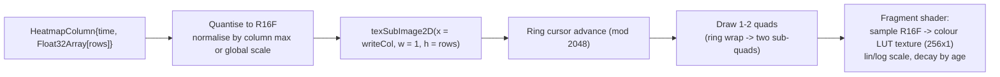

# 26 — Chart Engine Design (custom WebGL2 engine)

Status: **Baseline, approved for build planning.** Date 2026-09-14. Owner: chart-engine lead + architect.
Package: `packages/chart-engine` (framework-agnostic TypeScript; React bindings are a thin layer in `apps/web`).
Scope guard: web app only (browser + Electron shell). No Android. Bybit USDT linear perpetuals data shapes.
Inputs: owner decision #1 (fully custom WebGL engine), digests 01, 04, 05, 10, 23, `docs/research/22-architecture-options.md` §5, `docs/plan/20-architecture.md`.
Related: `14-screens-catalogue.md`, `15-component-catalogue.md`, `16-design-system-brief.md`, `23-ws-protocol.md`, `06-performance-and-load-standard.md`, `05-accessibility-standard.md`, ADR-0002.

---

## 1. Why a custom engine, and what it must beat

The owner chose the fully custom path over a Lightweight-Charts chassis because every high-value surface in CandleViewer — footprint cells with per-cell text, volume/delta profiles, a 100 ms DOM liquidity heatmap over hours, big-trade bubbles, draggable order/position lines, and a drawing-tool kit — requires pixel-level control that no candidate library provides natively. The engine must reach parity with a mature charting chassis on the boring things (pan/zoom momentum, axis decimation, multi-pane sync, crosshair, DPI correctness) *before* any order-flow feature pays off; this document makes that parity work explicit and schedules it first (§14).

**Non-goals.** Not a general charting library for third parties. No SVG output. No server-side rendering. No WebGPU in v1 (a WebGPU backend is an explicit future seam, §3.4). No indicator scripting language (indicators are TypeScript plugins).

**Hard requirements.**

| # | Requirement | Target |
|---|---|---|
| R1 | Candles | 100k bars loaded, 60 fps pan/zoom |
| R2 | Footprint | 2,500 visible cells with 2 numbers each at 60 fps; graceful LOD below cell-text legibility |
| R3 | Heatmap | 1 column per 100 ms, 4 h trail (144k columns × 200 price rows) with constant per-update cost |
| R4 | Profiles | Volume/delta profile + TPO recomputed on viewport change in ≤ 8 ms |
| R5 | Overlays | 200 drawings + 50 order/position lines with hit-testing in ≤ 1 ms |
| R6 | Interaction | Input-to-photon ≤ 2 frames for pan/zoom/crosshair |
| R7 | Memory | ≤ 600 MB GPU + JS heap per chart instance at full load |
| R8 | Multi-chart | 4 synchronised chart instances on one page within budget on the reference machine |
| R9 | Degradation | Runs in a `degraded-2d` mode (candles + axes + lines only) if WebGL2 is unavailable |
| R10 | Accessibility | Keyboard data cursor + live-region announcements + non-colour redundant encodings |

**Reference machine** (all benchmark numbers in this document are against it): Windows 11, Ryzen 7 / 8 cores, 32 GB RAM, RTX 3060, 2560×1440 at 125 % scaling, Chromium (Electron pinned build).

---

## 2. Architecture overview

```mermaid
flowchart TB
    subgraph MAIN["Main thread (React)"]
        RB["React bindings<br/>&lt;Chart /&gt;, &lt;Pane /&gt;, &lt;Series /&gt;"]
        CTRL["ChartController (facade)<br/>public API, option diffing"]
        INPUT["InputRouter<br/>pointer/wheel/keyboard/touch"]
        A11Y["AccessibilityLayer<br/>data cursor, live region, DOM mirror"]
        DOMOVL["DOM overlay<br/>tooltips, context menus, inputs"]
    end
    subgraph WORKER["Render worker (OffscreenCanvas)"]
        PROTO["FeedDecoder<br/>binary frames -> typed arrays"]
        MODEL["DataModel<br/>columnar stores + indices"]
        SCENE["SceneGraph<br/>Chart -> Pane -> Layer -> Series"]
        LAYOUT["LayoutEngine<br/>pane rects, axis gutters"]
        VIEW["ViewportController<br/>transform, momentum, LOD level"]
        CULL["Culler + Decimator"]
        BATCH["BatchBuilder<br/>per-layer draw batches"]
        GL["GLBackend<br/>programs, VAOs, buffers, textures, atlas"]
        HIT["HitIndex<br/>spatial index for picking"]
    end
    WS["WS client (shared worker)"] -->|transferable ArrayBuffers| PROTO
    RB --> CTRL --> INPUT
    CTRL -->|postMessage: commands| SCENE
    INPUT -->|pointer events (coalesced)| VIEW
    PROTO --> MODEL --> CULL --> BATCH --> GL
    SCENE --> LAYOUT --> VIEW --> CULL
    MODEL --> HIT
    HIT -->|pick results| CTRL
    GL -->|frame stats| CTRL
    CTRL --> A11Y
    CTRL --> DOMOVL
```

**Split of responsibilities.** The main thread owns React, DOM overlays, accessibility and input capture only. Everything with a per-frame cost — decoding, model updates, culling, batching, GL calls — runs in the render worker against an `OffscreenCanvas`. Input events are captured on the main thread, coalesced (`getCoalescedEvents` for pointers) and forwarded as compact structured messages; the worker applies them to the viewport so that pan/zoom never waits on React.

**Fallback when `OffscreenCanvas` is unavailable** (older WebView): the same worker code runs on the main thread behind an identical facade (`RunMode.inline`); only throughput changes, not behaviour. This is a supported, tested mode, not an accident.

---

## 3. Core subsystems

### 3.1 Scene graph

A deliberately shallow, fixed-depth tree — not a general-purpose scene graph — because depth costs traversal time per frame.

```text
Chart
├─ TimeAxis (shared)
├─ Pane[0..n]                  (price pane, CVD pane, OI pane, volume pane…)
│  ├─ PriceAxis (left|right, linear|log|percent)
│  ├─ Layer: background        (grid, sessions, regime shading)
│  ├─ Layer: heatmap           (texture quad, below price)
│  ├─ Layer: series[]          (candles, footprint, profile, bubbles, indicators)
│  ├─ Layer: overlays          (VWAP, bands, order/position lines, alerts)
│  ├─ Layer: drawings          (user drawings, in-progress drawing)
│  └─ Layer: foreground        (crosshair, price/time labels, tooltips anchor)
└─ Legend / pane chrome (DOM, main thread)
```

Node contract: every node has `id`, `visible`, `zIndex`, `dirty` flags (`DATA | LAYOUT | STYLE | TRANSFORM`) and implements `update(frameCtx)` and `collect(batchBuilder)`. Nodes never issue GL calls directly — they append to batches, which lets the backend sort by program/texture and minimise state changes.

**Dirty-flag propagation.** A data update marks only the affected series `DATA`-dirty; a viewport change marks all series `TRANSFORM`-dirty but not `DATA`-dirty (so GPU buffers are reused and only uniforms change — the single most important optimisation for pan/zoom). A theme change marks `STYLE`. Layout changes (pane resize) mark `LAYOUT`.

### 3.2 Render loop

```mermaid
sequenceDiagram
    participant RAF as requestAnimationFrame (worker)
    participant SCH as FrameScheduler
    participant VP as ViewportController
    participant M as DataModel
    participant C as Culler/Decimator
    participant B as BatchBuilder
    participant GL as GLBackend

    RAF->>SCH: frame(t)
    SCH->>SCH: budget = 16.7 ms; classify work by priority
    SCH->>VP: integrate momentum / animations (dt-based, not frame-count)
    VP->>C: visible range (time, price) + LOD level
    SCH->>M: apply pending data mutations (bounded: max 4 ms/frame, rest deferred)
    C->>C: cull off-screen, decimate per LOD
    C->>B: visible primitives
    B->>B: build/patch batches (reuse buffers, sub-range uploads only)
    B->>GL: ordered draw list (sorted by program, then texture)
    GL->>GL: clear, draw opaque, draw blended, draw text, draw UI
    GL-->>SCH: timings (CPU ms, draw calls, triangles, buffer bytes uploaded)
    SCH->>SCH: if over budget 3 frames running, drop one LOD level and log
```

Rules:
1. **One rAF per chart instance**, driven inside the worker. Multiple charts on a page share one worker and one rAF, rendering into their own canvases in sequence — this prevents N charts from each demanding a full frame budget.
2. **Time-based animation.** Momentum, fades and transitions integrate real `dt`; a dropped frame never changes the visual outcome.
3. **Bounded work per frame.** Data mutations are applied from a queue with a 4 ms budget; whatever does not fit waits for the next frame (the feed is already conflated upstream, so this cannot accumulate unboundedly).
4. **No allocation in the hot path.** All per-frame structures are pooled; the engine asserts zero GC-triggering allocations in the frame path in a dedicated test (allocation counter via `performance.measureUserAgentSpecificMemory` sampling in benchmarks).
5. **Render on demand.** With no data and no interaction, the loop parks (no rAF scheduled) — important for battery and for 4-chart layouts.

### 3.3 Data model

Columnar, typed-array based, append-optimised, with stable indices.

```text
BarStore (per series)
  time:     Float64Array   (µs since epoch)
  open/high/low/close: Float32Array (scaled; see precision note)
  volume:   Float32Array
  delta:    Float32Array
  head/tail ring indices, capacity grown by doubling
FootprintStore (per bar-spec)
  barIndex: Uint32Array        // parallel arrays, sorted by (barIndex, priceLevel)
  priceLevel: Int32Array       // integer ticks from a per-symbol origin
  bidVol/askVol: Float32Array
  tradeCount: Uint16Array
  offsets:  Uint32Array        // barIndex -> first cell index (prefix sums)
HeatmapRing
  texture: R16F or RG16F, width = COLUMNS (2048), height = PRICE_ROWS (512)
  writeCol: number             // ring cursor; oldest column overwritten
  colTime:  Float64Array(2048) // time per column for transform mapping
  priceOrigin, priceStep       // row 0 price and tick step
ProfileStore
  priceLevel: Int32Array, volume/delta: Float32Array, derived POC/VA cached per period
DrawingStore
  plain objects (hundreds at most), spatially indexed
```

**Precision.** Prices arrive as integer ticks (`int32`, relative to a per-symbol origin) — never as float dollars — so no precision is lost at any zoom. Conversion to float happens only in the vertex shader after a double-precision offset is applied on the CPU (`priceOrigin` uniform), avoiding the classic large-float jitter. Time is `Float64Array` on the CPU; the shader receives `time - viewportTimeOrigin` as a float32, which keeps sub-millisecond precision over any realistic viewport.

**Mutation API.** `appendBars(from)`, `patchLastBar(bar)`, `prependHistory(bars)` (for infinite scroll-back), `upsertFootprintCells(barIndex, cells)`, `pushHeatmapColumn(time, Float32Array)`, `replaceProfile(period, data)`. Every mutation returns the affected index range so `BatchBuilder` can do a partial `bufferSubData` instead of a full re-upload.

### 3.4 GL backend

WebGL2 (required for instancing, VAOs, `texSubImage2D` with PBO-like patterns, `R16F`, integer attributes). Capability probe at startup records: max texture size, max texture units, `EXT_color_buffer_float`, `OES_texture_float_linear`, max vertex attributes; the result selects a `RenderProfile` (`full` | `reduced` | `degraded-2d`).

| Concern | Decision |
|---|---|
| Context loss | `webglcontextlost` handled: stop the loop, mark all GPU resources invalid, rebuild from `DataModel` on restore; user sees a 1-frame flash, no data loss |
| Programs | Compiled lazily, cached by key; all uniforms resolved once into typed setters |
| Buffers | One VAO per series; ring buffers with sub-range uploads; orphaning avoided by explicit ring management |
| Instancing | Candles, footprint quads, bubbles and glyphs all use instanced draws (one quad, per-instance attributes) |
| Blending | Single pass, premultiplied alpha; opaque batches first, sorted front-to-back not required (2D, depth test off) |
| MSAA | Off; crisp 2D shapes are produced by pixel-snapping in the shader instead |
| DPI | Backing store at `devicePixelRatio` (capped at 2 for the heatmap layer to bound texture cost); all geometry snaps to device pixels for hairlines |
| Future WebGPU | `GLBackend` sits behind a `RenderBackend` interface (`createBuffer`, `createTexture`, `draw(batch)`); a WebGPU backend can be added without touching layers |

### 3.5 Viewport and transform math

State: `{ timeStart, timeEnd }` (µs, float64) and per-pane `{ priceLow, priceHigh }` plus a scale mode.

Screen mapping (per pane, per frame, computed on the CPU into uniforms):

```text
sx = (t - timeOrigin) * kx + bx          kx = plotWidth  / (timeEnd - timeStart)
sy = (p - priceOrigin) * ky + by         ky = -plotHeight / (priceHigh - priceLow)   [linear]
log mode:   sy = (log(p) - log(priceLow)) / (log(priceHigh) - log(priceLow)) * -plotHeight + plotBottom
percent:    sy computed against an anchor bar's close
```

- **Bar-space vs time-space.** Panning and bar spacing operate in *bar index space* (like every trading chart: `barSpacing` px/bar, `rightOffset` in bars) while overlays needing true time (heatmap columns, session shading) map through `time`. `BarStore` keeps a monotone index→time map, and the engine exposes both `indexToScreen` and `timeToScreen`.
- **Zoom** is anchored at the cursor (or the pinch centroid): the world coordinate under the anchor is invariant. `barSpacing` is clamped to `[0.05, 200]` px.
- **Momentum**: velocity-based with exponential decay (`v *= exp(-dt/τ)`, τ = 120 ms), terminated below 0.02 px/ms, cancelled on any new pointer-down.
- **Auto-scale** (price): computed from the visible range's min/max with a configurable margin, optionally including overlays; recomputed only when the visible bar range changes, and throttled to once per frame.
- **Pane synchronisation**: panes in one chart share `timeStart/timeEnd` by construction; charts in a layout may share a `SyncGroup` for time range, crosshair position and/or price level, propagated once per frame after input integration (never re-entrantly).

### 3.6 LOD and decimation

| Layer | Levels | Rule |
|---|---|---|
| Candles | L0 full OHLC bodies+wicks; L1 bodies only; L2 min/max column strip (one column per pixel) | `barSpacing ≥ 3 px` → L0; `≥ 1.5 px` → L1; else L2 with min/max aggregation per pixel column |
| Footprint | L0 cell + two numbers; L1 cell + one number (delta); L2 coloured cell only; L3 hidden (candles only) | L0 needs ≥ 12 px cell text height (two-number density); L1 needs ≥ 10 px (one-number, delta only); below 10 px cell height (or L2's own 6 px floor) drops further. Thresholds and asymmetric ±15 % hysteresis are the frozen `LOD_PROFILE_M0` set from `docs/design/E06/E06-D01.md` §2 (corrects the earlier provisional 11 px figure, which conflated the L0 and L1 needs) |
| Heatmap | Texture mip selection; column aggregation when > 1 column per pixel (max of columns, preserving liquidity spikes) | Always constant cost via texture sampling |
| Profile | Row merging when rows < 2 px tall | Merge by summing adjacent levels |
| Bubbles | Size-threshold raising as density grows; cluster into a single bubble with a count badge | Keep ≤ 500 visible instances |
| Drawings | Never decimated (bounded count) | — |

Decimation for candles at L2 uses a **min/max preserving** reduction (per pixel column emit min-low, max-high, first-open, last-close) so spikes never disappear — a correctness requirement, not a cosmetic one.

Hysteresis: LOD thresholds have a ±15 % dead band so slow zooming does not flicker between levels.

### 3.7 Text rendering (SDF atlas)

Footprint cells are the densest text surface in the product, so text is a first-class subsystem.

- **Glyph set**: digits, `.`, `,`, `-`, `+`, `%`, `×`, `K`, `M`, `B`, `A`–`Z`, `a`–`z` for labels — generated at runtime from the design-system font using an offscreen 2D canvas, converted to a single-channel **signed distance field** (8-bit) via a two-pass EDT (Felzenszwalb), packed into a 1024×1024 atlas by a shelf packer.
- **Generation cost** is ~40 ms once per font/size-class at startup, cached in `IndexedDB` keyed by `(fontFamily, weight, hash(glyphSet))` so subsequent launches are instant.
- **Rendering**: one instanced draw call per batch of glyphs. Per-instance attributes: `vec2 posPx`, `vec2 sizePx`, `vec4 uvRect`, `vec4 colour`. The fragment shader computes `alpha = smoothstep(0.5 - w, 0.5 + w, sdf)` with `w = fwidth(sdf)`, giving crisp text at any scale, plus an outline (`alpha_outline` at a second threshold) that is **mandatory, not opportunistic**, for footprint cell text at L0/L1: `docs/design/E06/E06-D01.md` §5 measured text-on-saturated-cell contrast at ~1.5–2.3:1 in both dark and high-contrast themes (below the 4.5:1 AA bar), so every glyph in `bidask`/`delta` cell modes always renders with the outline pass.
- **Number formatting** is pre-computed per cell on data update, not per frame: values are formatted to a small string, and a per-cell glyph run (offsets into the atlas) is cached alongside the cell. Changing the format (e.g. compact `1.2K`) invalidates only the run cache.
- **Batching**: all cell text in a pane is a single draw call; axis labels and legends are a second; drawing labels a third. Target ≤ 6 text draw calls per pane per frame.
- **Fallback**: in `degraded-2d` mode, text is drawn with Canvas 2D `fillText` and footprint is limited to L2/L3.

Measured budget: 5,000 glyphs (2,500 cells × 2 numbers ≈ 12,500 glyphs at 5 chars average → one draw call, ~0.9 ms CPU batching, ~0.4 ms GPU on the reference machine). The CI benchmark asserts ≤ 2.0 ms total for this case.

### 3.8 Heatmap texture streaming



- Cost per update is **one 1×rows texture upload** (512 × 2 bytes = 1 KB) regardless of trail length — constant, which is the entire reason for the texture approach.
- The ring is drawn as one or two textured quads (two when the cursor wraps), with the time axis mapped through `colTime`, so scrolling costs nothing extra.
- **Longer trails than the ring**: older columns roll into a second, coarser texture (1 column per second instead of per 100 ms) giving 4 h+ of history at a tenth of the memory; the shader picks the source by column age. Memory: 2048 × 512 × 2 B ≈ 2 MB (fine ring) + 14,400 × 512 × 2 B ≈ 14 MB (coarse ring) per symbol.
- **Colour** is applied by a 256×1 LUT texture, so theme changes (green = bid, red = ask, configurable per owner decision #10) are a one-texture update, not a re-upload of the data.
- **Price alignment**: rows are integer tick buckets from `priceOrigin`. If the market moves outside the row window, the engine shifts `priceOrigin` and re-uploads only the newly exposed rows (a vertical scroll of the ring), never the whole texture.

### 3.9 Hit-testing

Two complementary indices, both maintained incrementally in the worker:

1. **Structural index** — because the chart is a regular grid, bar index and price level are computed analytically from screen coordinates in O(1) (`screenToIndex`, `screenToPrice`). This covers crosshair, footprint-cell hover, ladder rows and profile rows.
2. **Object index** — a uniform grid (64 px buckets) over drawings, order lines, position lines, alert lines and bubbles, storing object ids per bucket. Picking queries the bucket under the cursor plus a 1-bucket ring, then tests candidates precisely (distance-to-segment for lines, rect containment for boxes, radius for bubbles), sorted by `zIndex` then proximity.

Picking budget ≤ 1 ms for 200 drawings + 50 lines. Results are posted to the main thread only when the picked object changes (edge-triggered), keeping message traffic low. Grab handles use an enlarged 10 px tolerance; touch input uses 16 px.

### 3.10 Drawings

- **Tools in v1**: trendline, ray, extended line, horizontal line/ray, vertical line, rectangle, ellipse, Fibonacci retracement, Fibonacci extension, measurement tool (price/%/bars/time), text note, arrow, price range, position tool (entry/SL/TP with R:R readout), and a brush/freehand for annotations.
- **Model**: `{ id, tool, points: [{barIndex|time, price}], style, locked, visibility, magnetMode, paneId, createdBy, createdAt }`. Anchors store **both** `time` and `barIndex`; time is authoritative across bar-spec changes.
- **Interaction**: two-phase (place → adjust), with a magnet mode snapping to OHLC values or ticks, shift-constrained angles, and multi-select with group move. Undo/redo is a command stack of 100 entries, shared with the drawing toolbar.
- **Persistence**: per (user, symbol, bar-spec-agnostic) in Postgres through `/api/v1/drawings`; optimistic local writes with server reconciliation; drawings are part of a saved workspace.
- **Rendering**: lines as instanced quads with a geometry shader-free thick-line expansion done in the vertex shader (per-instance `p0`, `p1`, `width`, dash pattern index); dashes via a distance-along-line varying and a pattern LUT.

### 3.11 Interaction and gestures

| Input | Action |
|---|---|
| Drag on plot | Pan time (and price if the price scale is unlocked) with momentum |
| Wheel | Zoom time at cursor; `Shift+wheel` horizontal pan; `Ctrl+wheel` zoom price |
| Drag on time axis | Compress/expand bar spacing |
| Drag on price axis | Compress/expand price scale; double-click resets to auto |
| Double-click plot | Reset to auto-scale + latest bar |
| Pinch (touch/trackpad) | Zoom at centroid; two-finger drag pans |
| Crosshair | Follows pointer, snaps to bar centre, broadcasts to the sync group |
| Hover footprint cell | Cell tooltip (bid/ask/delta/trades) via the DOM overlay |
| Drag an order line | Live price preview with tick snapping; drop opens a confirm (or fires directly in armed one-click mode) |
| `Esc` | Cancel the in-progress drawing / clear selection |
| Keyboard | `←/→` move the data cursor by a bar, `Shift+←/→` by 10, `Home/End` jump, `+/-` zoom, `Space` pan-drag modifier, `Alt+←/→` step tick in replay |

All input is captured on the main thread with `setPointerCapture`, coalesced, and forwarded at most once per frame. Wheel events are accumulated and applied once per frame (trackpads emit far more than 60 events/s).

### 3.12 Plugin API (series, indicators, overlays)

Third-party-shaped but first-party-used: every built-in series is written against the same API, which guarantees the API is sufficient.

- **Series plugin** — owns data and rendering for a data kind (candles, footprint, profile, bubbles, heatmap).
- **Indicator plugin** — pure computation over a `BarStore` producing one or more output series; runs in the worker; declares inputs, parameters, outputs, pane placement and default styling. Computation is incremental (`update(lastBar)`) with a `recompute(range)` fallback.
- **Overlay plugin** — draws above series and may be interactive (order lines, alert lines, session bands).
- **Lifecycle**: `attach(ctx)` → `onData(...)` / `onViewport(...)` → `collect(batch)` → `hitTest(pt)` → `detach()`. Plugins may only use the rendering primitives the context exposes (rects, lines, quads, glyph runs, textures) — never raw GL — so a WebGPU backend keeps them working.
- **Built-in indicators v1**: SMA, EMA, WMA, VWAP (session + anchored) with σ bands, Bollinger, ATR, RSI, MACD, Stochastic, OBV, volume, CVD, OI, funding, liquidations, market regime band. Each ≤ 150 lines against the plugin API.

---

## 4. Rendering specifics per layer

| Layer | Geometry | Program | Draw calls | Notes |
|---|---|---|---|---|
| Grid / sessions | 2 instanced line sets | `line` | 2 | Snapped to device pixels |
| Heatmap | 1–2 quads | `heatmap` (R16F + LUT) | 2 | Constant cost (§3.8) |
| Candles | 1 instanced quad for bodies + 1 for wicks | `candle` | 2 | Per-instance: x, openY, closeY, highY, lowY, colourIdx |
| Footprint cells | 1 instanced quad (cell fill) | `cell` | 1 | Colour from delta/imbalance via LUT |
| Footprint text | instanced glyphs | `sdf-text` | 1 | §3.7 |
| Imbalance markers | instanced quads | `cell` | shared | Drawn as cell outline variants |
| Profile | instanced quads (rows) + POC/VA lines | `bar` + `line` | 2 | Right- or left-docked, shares the price scale |
| Bubbles | instanced circles (SDF disc) | `disc` | 1 | Radius by notional, alpha by age |
| Indicator lines | instanced thick-line segments | `line` | 1 per series | Dash support |
| Order/position lines | instanced lines + DOM labels | `line` | 1 | Labels are DOM for crisp text and a11y |
| Drawings | instanced lines/quads + glyphs | `line`, `quad`, `sdf-text` | 3 | |
| Crosshair + labels | 2 lines + DOM labels | `line` | 1 | |

Target steady-state: **≤ 18 draw calls per pane**, ≤ 40 for a 3-pane chart.

---

## 5. Visual and theming rules

1. **Colour comes from tokens** in `packages/ui` (`16-design-system-brief.md`); the engine holds no hard-coded colours. Themes are uploaded as small LUT textures + a uniform block, so a theme switch is < 1 ms with no re-upload of data.
2. **Heatmap convention**: green = bid/buy liquidity, red = ask/sell liquidity (owner decision #10), fully user-configurable, with a colour-blind-safe alternative palette (blue/orange) shipped as a first-class option.
3. **Footprint colouring**: cells encode delta by colour *and* imbalance by an outline pattern, so colour is never the sole carrier of meaning (accessibility requirement R10).
4. **Estimated data** (iceberg, stop-run, regime, order-count style metrics) is rendered with a distinct hatch pattern and always accompanied by an "(estimated)" label, per principle P10 in `20-architecture.md`.
5. **Density modes** (`comfortable` | `compact` | `dense`) change cell padding, font size class and LOD thresholds together, as one coherent switch.

---

## 6. Worker and OffscreenCanvas protocol

Main → worker messages (all structured-cloneable, buffers transferred):

| Message | Payload | Frequency |
|---|---|---|
| `init` | `{ canvas: OffscreenCanvas, dpr, theme, chartConfig }` | once |
| `resize` | `{ width, height, dpr }` | on resize (debounced 1 frame) |
| `input` | `{ kind: pointer|wheel|key|touch, coalesced: [...] }` | ≤ 1/frame |
| `data` | `{ store, op: append|patch|prepend|replace, buffer }` (transferred) | up to 20/s per store |
| `command` | `{ setViewport | setSeriesOptions | addDrawing | setTheme | setLod | pickAt | export }` | on demand |
| `sync` | `{ groupId, timeRange, crosshair }` | ≤ 1/frame |

Worker → main:

| Message | Payload |
|---|---|
| `ready` | capability report + selected `RenderProfile` |
| `frame` | `{ frameTimeMs, drawCalls, triangles, uploadedBytes, lod }` (sampled 1/s, full in bench mode) |
| `pick` | `{ objectId, kind, bar, price, cell? }` (edge-triggered) |
| `viewport` | `{ timeStart, timeEnd, priceLow, priceHigh, barSpacing }` (on change, ≤ 1/frame) |
| `a11y` | `{ cursorSummary }` — the text the live region should announce |
| `error` | `{ code, message, recoverable }` |

The WS client runs in a **shared worker** so that multiple chart instances (and the DOM ladder) decode each frame once; decoded typed arrays are transferred to the render worker without a copy.

---

## 7. Memory budgets

| Item | Formula | 100k-bar / 4 h-heatmap case |
|---|---|---|
| BarStore | 100k × (8 + 4×4 + 4 + 4) B | 3.2 MB |
| GPU candle buffers | 100k × 28 B | 2.8 MB |
| FootprintStore | 20k bars × 40 cells × 18 B | 14.4 MB |
| Footprint glyph runs | 20k × 40 × 12 B | 9.6 MB |
| Heatmap fine ring | 2048 × 512 × 2 B | 2.1 MB |
| Heatmap coarse ring | 14400 × 512 × 2 B | 14.7 MB |
| SDF atlas | 1024 × 1024 × 1 B | 1.0 MB |
| Profile / indicators / drawings | — | ≤ 8 MB |
| Framebuffers @2× DPI, 2560×1440 | — | ≈ 60 MB |
| **Total per chart instance** | | **≈ 116 MB** (budget 600 MB, R7) |

Eviction policy: footprint cells and heatmap columns outside a 3× viewport window are dropped from GPU buffers (kept in CPU stores until a memory-pressure threshold, then re-fetched from the backend on demand). A `MemoryGovernor` samples usage every 5 s and steps down retained history when over 70 % of the budget, logging each step.

---

## 8. TypeScript API sketch

```ts
// packages/chart-engine/src/index.ts

export interface ChartOptions {
  container: HTMLElement;
  runMode?: 'worker' | 'inline';          // default 'worker' when OffscreenCanvas exists
  theme: ThemeTokens;
  locale?: string;                         // default 'en-GB'
  timeZone?: 'UTC' | string;               // default 'UTC'
  density?: 'comfortable' | 'compact' | 'dense';
  syncGroup?: string;
  maxBars?: number;                        // default 200_000
  memoryBudgetMb?: number;                 // default 600
}

export interface Chart {
  readonly panes: readonly Pane[];
  addPane(opts: PaneOptions): Pane;
  removePane(id: PaneId): void;
  readonly timeScale: TimeScale;
  setTheme(theme: ThemeTokens): void;
  setDensity(d: Density): void;
  subscribe<E extends keyof ChartEvents>(e: E, cb: (p: ChartEvents[E]) => void): Unsubscribe;
  takeScreenshot(opts?: { scale?: number }): Promise<Blob>;
  getStats(): FrameStats;
  dispose(): void;
}

export interface Pane {
  readonly id: PaneId;
  readonly priceScale: PriceScale;
  addSeries<T extends SeriesType>(type: T, opts: SeriesOptionsMap[T]): SeriesHandle<T>;
  addOverlay(plugin: OverlayPlugin, opts?: unknown): OverlayHandle;
  addIndicator(plugin: IndicatorPlugin, params: Record<string, number | string>): IndicatorHandle;
  setHeightRatio(r: number): void;
  remove(): void;
}

export type SeriesType =
  | 'candles' | 'bars' | 'line' | 'area' | 'baseline'
  | 'footprint' | 'profile' | 'heatmap' | 'bubbles' | 'histogram';

export interface SeriesOptionsMap {
  candles: CandleOptions;
  footprint: FootprintOptions;
  profile: ProfileOptions;
  heatmap: HeatmapOptions;
  bubbles: BubbleOptions;
  bars: CandleOptions; line: LineOptions; area: LineOptions;
  baseline: LineOptions; histogram: HistogramOptions;
}

export interface SeriesHandle<T extends SeriesType> {
  setData(data: SeriesDataMap[T]): void;           // full replace (transfers buffers)
  append(data: SeriesDeltaMap[T]): void;           // incremental
  prependHistory(data: SeriesDataMap[T]): void;    // scroll-back paging
  setOptions(opts: Partial<SeriesOptionsMap[T]>): void;
  setVisible(v: boolean): void;
  remove(): void;
}

// ---- Data shapes (all typed arrays, transferable) -------------------------

export interface CandleData {
  time: Float64Array;            // µs epoch
  open: Int32Array;              // price in ticks
  high: Int32Array; low: Int32Array; close: Int32Array;
  volume: Float32Array;
  priceOrigin: number; tickSize: number;
}

export interface FootprintData {
  barIndexOffsets: Uint32Array;  // length = bars + 1, prefix sums into cells
  cellPriceLevel: Int32Array;    // ticks from priceOrigin
  cellBidVol: Float32Array;
  cellAskVol: Float32Array;
  cellTradeCount: Uint16Array;
  priceOrigin: number; tickSize: number;
}

export interface HeatmapColumnData {
  time: number;                  // µs epoch
  priceOrigin: number; priceStep: number; rows: number;
  sizes: Float32Array;           // length = rows
  estimated?: boolean;
}

export interface FootprintOptions {
  cellType: 'volume' | 'bid-ask' | 'delta' | 'delta-total';
  displayMode: 'profile' | 'box';
  imbalanceRatio: number;        // default 3.0 (= 300 %)
  imbalanceStack: number;        // default 3
  noiseFilter: number;           // min volume per cell to render text
  textLod: 'auto' | 'always' | 'never';
  colorScale: 'delta' | 'volume' | 'imbalance';
}

export interface HeatmapOptions {
  colorScale: 'linear' | 'log';
  trailMs: number;               // default 4 h
  bidColorToken: string;         // default token 'liquidity.bid' (green)
  askColorToken: string;         // default token 'liquidity.ask' (red)
  maxRows: number;               // default 512
  cadenceMs: number;             // default 100
}

// ---- Interaction & trading overlays --------------------------------------

export interface OrderLine {
  id: string;
  price: number;                 // ticks
  kind: 'entry' | 'stop' | 'take-profit' | 'position' | 'alert' | 'liquidation';
  side: 'buy' | 'sell';
  label: string;
  draggable: boolean;
  accountId?: string;            // fan-out: multiple lines may share a price
}

export interface ChartEvents {
  crosshair: { time: number; price: number; barIndex: number; cell?: FootprintCellRef };
  click: { time: number; price: number; button: number; modifiers: Modifiers };
  orderLineDragged: { id: string; price: number; commit: boolean };
  drawingChanged: { drawing: Drawing; phase: 'create' | 'update' | 'delete' };
  viewportChanged: { timeStart: number; timeEnd: number; barSpacing: number };
  visibleRangeNeedsData: { fromTime: number; toTime: number };  // triggers paging
  frameStats: FrameStats;
  error: { code: string; message: string; recoverable: boolean };
}

export interface FrameStats {
  fps: number; frameTimeMsP50: number; frameTimeMsP95: number;
  drawCalls: number; triangles: number; uploadedBytesPerSec: number;
  lodCandles: 0 | 1 | 2; lodFootprint: 0 | 1 | 2 | 3;
  gpuMemoryMbEstimate: number; renderProfile: 'full' | 'reduced' | 'degraded-2d';
}

// ---- Plugin API ----------------------------------------------------------

export interface RenderContext {
  readonly viewport: Viewport;
  readonly theme: ThemeTokens;
  rect(x: number, y: number, w: number, h: number, colorToken: string): void;
  line(x0: number, y0: number, x1: number, y1: number, style: LineStyle): void;
  glyphRun(x: number, y: number, text: string, style: TextStyle): void;
  quadBatch(instances: Float32Array, stride: number, program: 'cell' | 'disc' | 'bar'): void;
  texture(id: TextureId, rect: Rect, uv: Rect, lut: LutId): void;
}

export interface SeriesPlugin<D, O> {
  readonly type: string;
  attach(ctx: PluginContext): void;
  onData(data: D, op: 'set' | 'append' | 'prepend'): void;
  onOptions(opts: Partial<O>): void;
  collect(ctx: RenderContext): void;
  hitTest(pt: Point): PickResult | null;
  priceRange(visibleBars: Range): { low: number; high: number } | null;
  detach(): void;
}

export interface IndicatorPlugin {
  readonly id: string;
  readonly params: ParamSpec[];
  readonly outputs: OutputSpec[];
  compute(bars: BarView, params: Params, out: OutputBuffers): void;      // full
  update(bars: BarView, params: Params, out: OutputBuffers, from: number): void;  // incremental
}
```

React binding (in `apps/web`, deliberately thin):

```tsx
<Chart options={chartOptions} onCrosshair={setCrosshair} syncGroup="main">
  <Pane heightRatio={0.6}>
    <HeatmapSeries data={heatmap} options={heatmapOpts} />
    <CandleSeries data={bars} />
    <FootprintSeries data={footprint} options={fpOpts} />
    <OrderLines lines={orderLines} onDrag={handleOrderDrag} />
    <Drawings storageKey={`${symbol}:main`} />
  </Pane>
  <Pane heightRatio={0.2}><CvdSeries data={cvd} /></Pane>
  <Pane heightRatio={0.2}><OpenInterestSeries data={oi} /></Pane>
</Chart>
```

---

## 9. Data flow from the wire to the GPU

```mermaid
sequenceDiagram
    participant GW as Backend WS gateway
    participant SW as Shared worker (WS client)
    participant RW as Render worker
    participant M as DataModel
    participant GL as GLBackend

    GW-->>SW: binary frame {topic, seq, kind, payload}
    SW->>SW: validate seq (gap -> request resync via control frame)
    SW->>SW: decode into typed arrays (zero-copy views over the frame buffer)
    SW-->>RW: postMessage({store, op, buffers}, [transfer])
    RW->>M: apply mutation, get affected index range
    M->>GL: bufferSubData(range) / texSubImage2D(column)
    RW->>RW: mark series DATA-dirty; schedule frame if parked
    Note over SW,GL: No JSON.parse and no array copy on the hot path.<br/>Decode budget p95 <= 4 ms per frame batch.
```

Snapshot handling: a `snapshot` frame replaces the store wholesale (`setData`) and resets the sequence domain; the engine keeps rendering the previous frame until the replacement completes, so there is no blank flash.

Paging (scroll-back): when the viewport approaches the loaded history edge, the engine emits `visibleRangeNeedsData`; the app requests a page over REST, and `prependHistory` splices it in, preserving the on-screen position by adjusting `barSpacing` anchors rather than the viewport indices.

---

## 10. Replay integration

Replay uses exactly the same series and the same frame types — only the topic namespace differs (`replay.{session}.*`). The engine adds three replay-specific behaviours:

1. **Virtual-now marker**: a vertical line at the replay clock, with the area to its right dimmed so future data is visibly unavailable.
2. **Step semantics**: `Alt+←/→` step by tick and `←/→` by bar are handled by the app (which asks the backend to step) rather than by the engine, so a step is a real data event, not a visual trick — this keeps replay honest.
3. **Coverage gaps**: ranges with no recorded data are rendered as a hatched band with a label, never interpolated (digest 23's recorder-dependency requirement).

---

## 11. Error handling and degradation

| Condition | Engine behaviour |
|---|---|
| WebGL2 unavailable | `RenderProfile = degraded-2d`: Canvas 2D candles, axes, lines, crosshair, drawings; footprint limited to coloured cells without text; heatmap disabled with an explanatory placeholder |
| Context lost | Loop stops, resources invalidated, rebuilt from `DataModel` on restore; a `error{recoverable:true}` event lets the UI show a one-line toast |
| Shader compile failure | Falls back to a simpler program for that layer; logs the info-log with the program key; never takes down the chart |
| Out-of-memory on texture allocation | Heatmap drops the coarse ring first, then halves rows; `MemoryGovernor` logs and emits a stats event |
| Data sequence gap | Engine keeps the last consistent state and requests a snapshot; UI shows a per-pane stale badge |
| Frame budget exceeded for 3 consecutive frames | Step down one LOD level; if already at the lowest, reduce DPI of the heatmap layer; log the step |
| Worker crash | The controller detects the `error`/`close` event, respawns the worker, replays store state from the last snapshot |

---

## 12. Accessibility

Per `05-accessibility-standard.md` (WCAG 2.2 AA), a canvas cannot be the whole story, so the engine ships an accessible parallel model:

- **Focusable chart**: the canvas is wrapped in a `role="application"` element with `aria-label` describing the symbol, bar spec and visible range, and full keyboard reachability.
- **Data cursor**: arrow keys move a logical cursor across bars; each move updates an `aria-live="polite"` region with a concise summary ("14:32, close 64,210, delta −128, imbalance stacked sell ×3"), throttled to 1 announcement per 250 ms with the last state always announced.
- **DOM mirror**: a visually hidden `<table>` exposes the visible window (capped at 200 rows) of bar data so screen readers and automated tests can read actual values.
- **Non-colour encodings**: delta uses colour + a directional glyph; imbalance uses colour + an outline; estimated data uses a hatch pattern; heatmap intensity is also reflected in the tooltip and the cursor announcement.
- **Motion**: `prefers-reduced-motion` disables momentum, fades and transitions (instant snapping instead).
- **Contrast**: all engine-rendered text is generated from design tokens that pass 4.5:1 against their cell backgrounds; the theme validator in `packages/ui` fails CI if a token pair regresses.
- **Zoom/reflow**: the chart honours browser zoom to 200 % by scaling density classes rather than clipping content.

---

## 13. Benchmarks and performance gates

Benchmarks live in `packages/chart-engine/bench`, run headless (Playwright + Chromium with a stable GPU flag set) on a dedicated CI runner, and are **required checks** on PRs touching the package. Each scenario replays a deterministic fixture from `packages/fixtures` for 20 s and reports p50/p95 frame time, draw calls, uploaded bytes and peak memory.

| ID | Scenario | Gate (p95 frame time) | Secondary gates |
|---|---|---|---|
| B1 | 100k candles, continuous pan at 1000 px/s | ≤ 12 ms | draw calls ≤ 8 |
| B2 | 100k candles, wheel zoom sweep 0.1→50 px/bar | ≤ 14 ms | no LOD flicker (LOD changes ≤ 6 over the sweep) |
| B3 | Footprint, 2,500 visible cells with text | ≤ 16 ms | text batching ≤ 2.0 ms, ≤ 2 text draw calls |
| B4 | Heatmap, 100 ms columns, 4 h trail, panning | ≤ 10 ms | upload ≤ 12 KB/s, texture memory ≤ 20 MB |
| B5 | Combined: candles + footprint + heatmap + 3 indicators + 50 order lines | ≤ 16.7 ms | total draw calls ≤ 40 |
| B6 | 4 synchronised charts (B5 content, half density) | ≤ 16.7 ms aggregate | shared worker CPU ≤ 70 % of one core |
| B7 | Live update storm: 20 data messages/s × 6 stores | ≤ 16.7 ms | decode p95 ≤ 4 ms, zero dropped messages |
| B8 | Drawing interaction: 200 drawings, drag one | ≤ 12 ms | pick ≤ 1 ms |
| B9 | Cold init to first frame with 100k bars | ≤ 900 ms | SDF atlas from cache ≤ 5 ms |
| B10 | Memory soak: 30 min live feed | peak ≤ 600 MB | no monotonic growth beyond 5 %/30 min |

A regression greater than 10 % against the stored baseline fails the check; baselines are updated only with an explicit reviewer-approved commit that states the cause.

---

## 14. Test strategy

| Layer | What | Tooling | Gate |
|---|---|---|---|
| Unit | Transform math (screen↔world round-trips, log/percent modes), LOD threshold selection with hysteresis, decimation min/max preservation, ring-buffer wrap, prefix-sum indexing, number formatting, colour LUT generation, viewport clamping, momentum integration | Vitest | ≥ 85 % line coverage on the package (planning-brief requirement) |
| Property | For any random bar series and viewport: every visible extreme (high/low) survives decimation; `screenToIndex(indexToScreen(i)) === i`; drawing anchors are stable across bar-spec changes | fast-check | Must hold over 10k cases |
| Golden image | Per layer and per theme: candles, footprint at each LOD, heatmap, profile, drawings, crosshair, degraded-2d | Playwright screenshots against SwiftShader for determinism, ≤ 0.1 % pixel diff | Required check |
| Contract | Engine consumes only the types in `packages/protocol`; a compile-time test asserts the data shapes match the generated WS schema types | tsd / `tsc --noEmit` | Required check |
| Integration | Engine + WS client against a recorded fixture session: snapshot, deltas, sequence gap → resync, paging, replay namespace | Vitest + fake WS server | Required check |
| Interaction | Pan/zoom/crosshair/drag order line/create drawing/undo/redo, touch gestures, keyboard cursor | Playwright | Required check |
| Accessibility | axe-core on the chart wrapper; screen-reader announcement assertions on the live region; reduced-motion behaviour; contrast-token validation | axe-core + Playwright | Required check |
| Performance | §13 benchmarks | Playwright + custom harness | Required check |
| Fuzz / robustness | Malformed frames, out-of-order sequences, NaN/Infinity prices, zero-size canvas, DPR changes mid-flight, context loss injection (`WEBGL_lose_context`) | Vitest + Playwright | Required check |
| Cross-shell | B5 and B3 run in browser Chromium, Electron, and (while ADR-0011 is open) Tauri/WebView2 | Playwright + Electron driver | Reported per release |

Determinism aids: a `TestClock` replaces rAF timing, a `SeededRandom` drives any jitter, and the GL backend can record a draw-call trace that tests assert against (cheaper and more stable than pixels for structural assertions).

---

## 15. Milestone plan

Each milestone is independently demoable and maps to backlog epics; estimates are engineer-weeks for the two-person engine squad (one senior graphics-capable engineer + one frontend engineer), and are the basis for the chart-engine lines in `31-sprint-plan.md`.

| M | Milestone | Contents | Exit criteria | Est. |
|---|---|---|---|---|
| **M0** | Spike S1 — feasibility | Throwaway prototype: 100k candles + 2.5k footprint text cells + 100 ms heatmap in Chromium, Electron, Tauri/WebView2 | Written report with measured p95 frame times; go/no-go on the custom engine; ADR-0002 and ADR-0011 updated | 3 |
| **M1** | Chassis parity | GL backend, capability probe, scene graph, render loop, viewport/transform math, pan/zoom/momentum, time + price axes with decimation, crosshair, DPI correctness, multi-pane layout + sync, theme tokens, `degraded-2d` fallback | B1, B2 green; golden images for candles/axes/crosshair; unit + property suites green | 6 |
| **M2** | Data plane | Columnar stores, worker + OffscreenCanvas protocol, shared-worker WS decode, snapshot/delta application, paging (`visibleRangeNeedsData`), memory governor | B7, B9 green; integration tests against fixtures green | 4 |
| **M3** | Footprint + text | SDF atlas pipeline, glyph batching, footprint series with all cell types and display modes, LOD ladder, imbalance markers, Deep Stats strip | B3 green; golden images per LOD; cell tooltip via pick | 5 |
| **M4** | Heatmap | Texture ring, coarse ring, LUT colouring, price-origin shifting, decay, alignment with the price scale, colour-convention settings | B4 green; 4 h soak with constant memory | 4 |
| **M5** | Profiles + indicators | Volume/delta profile, TPO, POC/VA/HVN/LVN, naked POC, indicator plugin API + the v1 indicator set, CVD/OI/funding/liquidation panes | B5 green; indicator incremental-update parity tests vs backend values | 4 |
| **M6** | Trading overlays | Order/position/alert/liquidation lines, dragging with tick snapping and confirm flow, fan-out multi-account line stacking, bubbles, big-trade markers | B5 still green with 50 lines; interaction tests green | 3 |
| **M7** | Drawings | Drawing tool kit (§3.10), magnet mode, multi-select, undo/redo, persistence, per-workspace scoping | B8 green; golden images per tool; persistence round-trip test | 4 |
| **M8** | Replay + accessibility + polish | Virtual-now marker, coverage-gap rendering, step semantics, accessible data cursor and DOM mirror, reduced motion, screenshot export, final perf pass | B6, B10 green; axe-core clean; a11y manual pass signed off | 4 |

**Sequencing constraints.** M1 must precede everything (it is the "parity work" the research warned costs 4–8 weeks). M3 and M4 are the two highest-risk items and are deliberately separated so a slip in one does not block the other. M6 depends on backend OMS endpoints being available in demo.

### 15.1 Calendar mapping (sprint numbers and dates)

Estimates above are **engineer-weeks**. The engine squad is 2 engineers, so a sprint supplies **4 engineer-week-equivalents** of engine capacity (1-week AI-driven sprints; capacity is expressed in the original human units) (≈ 24 of the ~90 team story points per sprint are reserved for chart-engine work; the rest of the 5-person frontend group works on shell, screens and the design system). Sprint 01 starts **Friday 2026-09-25**; sprints are 1 week, Friday→Thursday (owner decision 2026-09-24). This table is the derivation that `31-sprint-plan.md` consumes — if the two ever disagree, `31-sprint-plan.md` wins for ticket-level scheduling and this table must be corrected to match.

| Sprint | Dates (Fri → Thu) | Engine capacity (eng-wk) | Milestone work in this sprint | Cumulative eng-wk | Release |
|---|---|---|---|---|---|
| S01 | 2026-09-25 → 2026-10-01 | 4 | M0 spike (3) + M1 start (1) | 4 | R0 Foundations |
| S02 | 2026-10-02 → 2026-10-08 | 4 | M1 (4 of 6) | 8 | R0 |
| S03 | 2026-10-09 → 2026-10-15 | 4 | M1 finish (1) + M2 start (3) — **ADR-0011 decision deadline lands at the end of this sprint** | 12 | R0 → R1 |
| S04 | 2026-10-16 → 2026-10-22 | 4 | M2 finish (1) + M3 start (3) | 16 | R1 Charting alpha |
| S05 | 2026-10-23 → 2026-10-29 | 4 | M3 finish (2) + M4 start (2) | 20 | R1 ships end of S05 (M1+M2+M3 complete) |
| S06 | 2026-10-30 → 2026-11-05 | 4 | M4 finish (2) + M5 start (2) | 24 | R2 Order-flow beta |
| S07 | 2026-11-13 → 2026-11-19 *(holiday gap after S06)* | 4 | M5 finish (2) + M6 start (2) | 28 | R2 ships end of S07 (M4 + M5 complete) |
| S08 | 2026-11-20 → 2026-11-26 | 4 | M6 finish (1) + M7 (3 of 4) | 32 | R3 Trading on demo |
| S09 | 2026-11-27 → 2026-12-03 | 4 | M7 finish (1) + M8 (3 of 4) | 36 | R3 |
| S10 | 2026-12-04 → 2026-12-10 | 4 | M8 finish (1) + buffer (3) | 40 | **R3 closes — engine feature-complete** |

**How the 33 eng-weeks become 10 sprints.** 33 eng-weeks ÷ 4 eng-weeks/sprint = 8.25 sprints of pure delivery. Two sprints of slack are deliberately added: one holiday gap (no sprint spans the 2026-11-06 → 2026-11-12 shutdown) and 3 eng-weeks of buffer in S10 for the final perf pass, bug burn-down and PRR evidence. Hence the engine is **feature-complete at the end of Sprint 10 (2026-12-10), which is the end of R3** — this is the concrete basis for the "lands at end of R3" claim, verifiable here without needing `31-sprint-plan.md`.

**Release checkpoints this implies.** R1 (Charting alpha) needs M1–M3 → available end of S05. R2 (Order-flow beta) needs M4–M5 → available end of S07. R3 (Trading on demo) needs M6 → available mid-S08, with M7/M8 completing the engine inside R3. R4 (Live enablement) and R5 (GA) require no new engine milestones, only the hardening carried in S10's buffer.

**Design-ahead compliance.** The brief requires design to run ≥ 2 sprints ahead and no frontend screen work to start before its design ticket is Done. Concretely: M1's chassis designs (axes, crosshair, pane chrome, theme tokens) must be signed off by the end of **S-01/pre-sprint design runway before 2026-09-25**; M3 footprint cell designs by end of **S02**; M4 heatmap colour/legend designs by end of **S03**; M6 trading-overlay designs by end of **S05**; M7 drawing-tool designs by end of **S06**; M8 a11y/replay designs by end of **S07**. Any design slip pushes the corresponding milestone right by a whole sprint and consumes the S10 buffer first.

**Slip policy.** The S10 buffer absorbs up to 3 eng-weeks of overall slip. Beyond that, the cut order is: M7 drawings (reduce to the 6 most-used tools) → M8 screenshot export and polish → M5 TPO/naked-POC. M1–M4 and M6 are not cuttable — they are the product.

Total ≈ 33 engineer-weeks of delivery inside 10 sprints (40 eng-weeks of capacity incl. buffer), landing the engine complete at the end of R3 with M1–M3 delivered for R1 and M4–M5 for R2 (see `30-release-roadmap.md`, `31-sprint-plan.md`).

**Fallback trigger.** If M0 fails its exit criteria, or M1 overruns by more than 50 %, the documented fallback (ADR-0002) is adopted: Lightweight Charts v5 as the chassis with the already-built footprint/heatmap layers ported onto its primitive APIs. M2–M4 are written against the engine's own data-model and plugin interfaces specifically so this port is a re-host, not a rewrite.

---

## 16. Open items tracked to closure

| # | Item | Owner | Resolution path | Due |
|---|---|---|---|---|
| O1 | Electron vs Tauri (WebView2 WebGL behaviour under 100 ms heatmap updates) | Architect | Measured in M0; ADR-0011 finalised | End Sprint 03 |
| O2 | Exact SDF atlas size/glyph set for the chosen design-system font | Chart-engine lead + design system | Glyph set frozen by `docs/design/E06/E06-D01.md` §3 (digits, separators, unit suffixes, letters, `▲`/`▼` directional glyphs); atlas size/packing measured in M3 | M3 |
| O3 | Heatmap coarse-ring resolution (1 s vs 2 s columns) | Chart-engine lead | Chosen from the M4 soak against the 4 h requirement | M4 |
| O4 | Whether indicator computation belongs in the engine worker or the backend for heavy indicators | Architect + backend lead | Benchmark both in M5; default is the worker for chart-local indicators, backend for anything needing history beyond the loaded window. **Constrained by a hard dependency: indicator values are also rule-engine inputs** (`24-internal-schemas.md`, indicator/feature definitions; `20-architecture.md` §3.6 Rule Engine). The rule engine runs server-side and must never depend on a browser to evaluate a condition, so **any indicator referenced by a rule IR is computed authoritatively in the backend**, and the worker's copy is a display-only mirror that must reproduce it bit-for-bit under the parity test in §14. O4 therefore only decides where *chart-only* indicators run; it cannot move rule-feeding indicators into the worker. Resolution of O4 must be recorded as an amendment to ADR-0007 (rule IR) if it changes which indicators are rule-eligible. | M5 |
| O5 | Colour-blind-safe default palette selection | Design system + accessibility | Validated in the M8 a11y pass | M8 |
