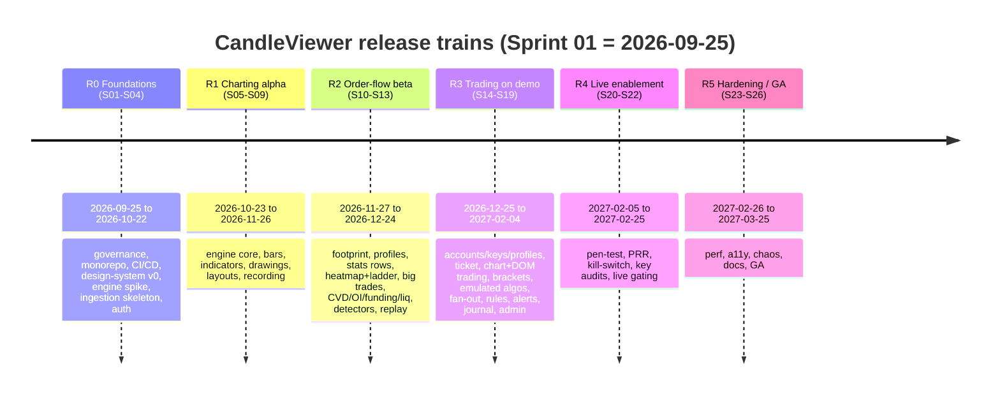

# 30 — Release Roadmap (R0 → R5)

Date: 2026-09-14 · Owner: basiltt · Status: **locked source of truth for delivery sequencing**
Companions: `07-release-and-prr.md` (train mechanics, PRR, Live-enablement gate), `31-sprint-plan.md` (per-sprint tickets), `32-risk-register.md`, `33-raci.md`, `11-user-stories.md` (story IDs), `CONSTITUTION.md` §3 (backend modules M1–M24).

Scope (locked, repeated because it constrains every line below): **web app only** — React + TypeScript + **custom WebGL chart engine**, **Electron** desktop shell (Tauri measured, not shipped, unless the spike inverts the decision); owner/admin functions are **RBAC-gated routes inside the web app**; **no Android**, **no separate admin app**; **Bybit v5 USDT linear perpetuals only**.

---

## 1. Planning constants

> **Calendar (owner decision 2026-09-24): AI-driven delivery.** Development is executed by Claude Code agents working in parallel, so sprints are **1 week (7 calendar days, Fri → Thu)** with **Sprint 01 = Fri 2026-09-25** and GA cut **Thu 2027-03-25**. Story points per sprint are unchanged (90 eng; S07 = 45); only the calendar is compressed. The gating resource is the owner's review/QA/design sign-off bandwidth, not coding time. Single source of truth for dates: `docs/plan/backlog/_tools/calendar_cv.py`. "Mon/Fri" column headings kept from the original 2-week template read as sprint start/end.

| Constant | Value | Source |
|---|---|---|
| Sprint length | **1 week**, Fri → Thu (7 calendar days; AI-driven cadence) | `calendar_cv.py`, owner decision 2026-09-24 |
| Sprint 01 start | **2026-09-25** (Fri), ends **2026-10-01** (Thu) | owner |
| Engineering capacity | **90 pts/sprint** (BE 40 · FE 40 · QA 6 · DevSecOps 2 · Security 2 · Architect 0) | `01-sdlc-and-branching.md` §11.3 |
| Estimation scale | Fibonacci 1-2-3-5-8; >8 must split | `01-sdlc-and-branching.md` §11.1 |
| Design-ahead rule | Design for a screen is **Done ≥2 sprints** before the frontend story enters a sprint | `00-planning-brief.md`, board DoR |
| Total plan horizon | **Sprint 01 – Sprint 26** (2026-09-25 → 2027-03-25), GA cut 2027-03-25 | this doc §3 |
| Planned engineering budget | 26 × 90 = **2 340 pts**; allocated **1 911 pts to epics (82%)**, plus **230 pts of named reserves** (90 pen-test remediation, 140 defect/polish) = 2 141 committed (91%), **199 pts (9%) held as train-level buffer** | this doc §3.1 |

### 1.1 Sprint calendar (S01–S26)

| Sprint | Start (Fri) | End (Thu) | Release train | Sprint | Start | End | Train |
|---|---|---|---|---|---|---|---|
| S01 | 2026-09-25 | 2026-10-01 | R0 | S14 | 2026-12-25 | 2026-12-31 | R3 |
| S02 | 2026-10-02 | 2026-10-08 | R0 | S15 | 2027-01-01 | 2027-01-07 | R3 |
| S03 | 2026-10-09 | 2026-10-15 | R0 | S16 | 2027-01-08 | 2027-01-14 | R3 |
| S04 | 2026-10-16 | 2026-10-22 | R0 | S17 | 2027-01-15 | 2027-01-21 | R3 |
| S05 | 2026-10-23 | 2026-10-29 | R1 | S18 | 2027-01-22 | 2027-01-28 | R3 |
| S06 | 2026-10-30 | 2026-11-05 | R1 | S19 | 2027-01-29 | 2027-02-04 | R3 |
| S07 | 2026-11-06 | 2026-11-12 | R1 (reduced, 45 pts) | S20 | 2027-02-05 | 2027-02-11 | R4 |
| S08 | 2026-11-13 | 2026-11-19 | R1 | S21 | 2027-02-12 | 2027-02-18 | R4 |
| S09 | 2026-11-20 | 2026-11-26 | R1 | S22 | 2027-02-19 | 2027-02-25 | R4 |
| S10 | 2026-11-27 | 2026-12-03 | R2 | S23 | 2027-02-26 | 2027-03-04 | R5 |
| S11 | 2026-12-04 | 2026-12-10 | R2 | S24 | 2027-03-05 | 2027-03-11 | R5 |
| S12 | 2026-12-11 | 2026-12-17 | R2 | S25 | 2027-03-12 | 2027-03-18 | R5 |
| S13 | 2026-12-18 | 2026-12-24 | R2 | S26 | 2027-03-19 | 2027-03-25 | R5 (GA cut) |

> **S07 capacity exception**: the sprint spanning 2026-11-06 → 2026-11-12 is planned at **45 pts** (half capacity) — retained from the original plan as an owner-availability buffer (originally the year-end holiday sprint). The 45-pt shortfall is absorbed by the train buffer, not by descoping R1 exit criteria.

### 1.2 Design-ahead track calendar

Design sprints are numbered `D-Snn` and run on the same 1-week cadence but **offset two sprints earlier** than the engineering sprint that consumes them. The design track therefore starts **before** engineering Sprint 01 is meaningful for UI: design sprints D-S01 and D-S02 run in parallel with engineering S01–S02 producing artifacts consumed in S03–S04, and the design org front-loads R1/R2 screens.

| Design sprint | Dates | Produces (Done, CDO-signed) | Consumed by eng sprint |
|---|---|---|---|
| D-S01 | 2026-09-25 → 2026-10-01 | Design-system v0 tokens, grid, density, theming, motion spec (`16-design-system-brief.md`); auth/onboarding screens | S03 |
| D-S02 | 2026-10-02 → 2026-10-08 | Shell/navigation, workspace chrome, symbol picker, admin IA | S04 |
| D-S03 | 2026-10-09 → 2026-10-15 | Chart surface, time/price axes, crosshair, chart toolbar, indicator UI | S05 |
| D-S04 | 2026-10-16 → 2026-10-22 | Drawing-tool UX, layouts/workspaces, recorder UI | S06 |
| D-S05 | 2026-10-23 → 2026-10-29 | Footprint cell design, profiles, Deep-Stats rows | S07 |
| D-S06 | 2026-10-30 → 2026-11-05 | DOM ladder + heatmap, big-trade bubbles, tape | S08 |
| D-S07 | 2026-11-06 → 2026-11-12 (reduced) | CVD/derivatives panes, detector badges + "(estimated)" pattern | S09 |
| D-S08 | 2026-11-13 → 2026-11-19 | Replay UI, alerts UI | S10 |
| D-S09 | 2026-11-20 → 2026-11-26 | Accounts, API-key flows, per-account profiles, trade-group picker | S11 |
| D-S10 | 2026-11-27 → 2026-12-03 | Order ticket, chart trading, DOM trading, arm/lock + env badge | S12 |
| D-S11 | 2026-12-04 → 2026-12-10 | Bracket/scaled/emulated-algo UI, positions & orders manager | S13 |
| D-S12 | 2026-12-11 → 2026-12-17 | Rule engine **form editor** | S14 |
| D-S13 | 2026-12-18 → 2026-12-24 | Rule engine **node-graph editor**, simulation UX | S15 |
| D-S14 | 2026-12-25 → 2026-12-31 | Journal & analytics, paper-vs-live comparison | S16 |
| D-S15 | 2027-01-01 → 2027-01-07 | Admin screens: users/roles, audit log, health, feature flags, kill-switch | S17 |
| D-S16 | 2027-01-08 → 2027-01-14 | Live-mode visual language, danger states, confirmation patterns | S18 |
| D-S17 | 2027-01-15 → 2027-01-21 | A11y remediation designs, high-contrast + colour-blind themes | S19/S20 |
| D-S18 | 2027-01-22 → 2027-01-28 | Design-QA sweep specs, empty/error/loading state audit, GA polish | S21–S24 |

After D-S18 the design org shifts to **design-QA and defect support** (no new screens), reserving capacity for R5 polish.

---

## 2. Roadmap at a glance

| Train | Sprints | Dates | Version at cut | Deploys to | Gate |
|---|---|---|---|---|---|
| **R0 Foundations** | S01–S04 | 2026-09-25 → 2026-10-22 | `0.1.0` | dev + staging smoke | PRR-lite |
| **R1 Charting alpha** | S05–S09 | 2026-10-23 → 2026-11-26 | `0.2.0` | staging (demo) | PRR |
| **R2 Order-flow beta** | S10–S13 | 2026-11-27 → 2026-12-24 | `0.3.0` | staging (demo) | PRR |
| **R3 Trading on demo** | S14–S19 | 2026-12-25 → 2027-02-04 | `0.4.0` | staging (demo), 7-day soak | PRR + demo-trading soak gate |
| **R4 Live enablement** | S20–S22 | 2027-02-05 → 2027-02-25 | `1.0.0` | prod (live) | PRR + **Live-enablement gate** (`07` §6) |
| **R5 Hardening / GA** | S23–S26 | 2027-02-26 → 2027-03-25 | `1.1.0` (GA) | prod (live) | PRR re-run + GA checklist |

---

## 3. Epic register

Epic IDs are stable and referenced by `31-sprint-plan.md`, `32-risk-register.md`, the backlog JSON, and branch names (`feat/<epic-slug>-<short>`).

| Epic | Title | Train | Primary area | Backend modules | Story domains | Pts |
|---|---|---|---|---|---|---|
| **E01** | Governance & repo constitution | R0 | area/docs | — | — | 21 |
| **E02** | Monorepo scaffold & toolchain | R0 | area/backend-platform, area/frontend-platform | M1 | — | 42 |
| **E03** | CI/CD pipeline & environments | R0 | area/infra-devops | — | — | 42 |
| **E04** | Observability baseline | R0 | area/infra-devops | M24 | OBS | 26 |
| **E05** | Design system v0 (tokens, primitives, Storybook) | R0 | area/design-system | — | SET | 38 |
| **E06** | Chart-engine spike & ADR (WebGL, Electron vs Tauri) | R0 | area/chart-engine | — | CHART | 21 |
| **E07** | Storage spike & data-tier wiring (QuestDB/Parquet/Postgres) | R0 | area/backend-platform | M10 | — | 26 |
| **E08** | Bybit adapter & ingestion skeleton | R0 | area/ingestion | M3, M4, M5, M6 | MKT | 42 |
| **E09** | Auth, sessions, 2FA & RBAC | R0 | area/auth-rbac | M18, M19 | ONB | 34 |
| **E10** | App shell, routing & Electron wrapper | R0 | area/electron-shell | — | SET | 34 |
| **E11** | Chart engine core (scene, axes, interaction, LOD) | R1 | area/chart-engine | — | CHART | 89 |
| **E12** | Bar builders & series rendering (time/tick/volume/range/renko) | R1 | area/chart-engine, area/ingestion | M7, M8 | CHART, MKT | 63 |
| **E13** | Indicators framework & v1 indicator set | R1 | area/charting-ui | M9 | IND | 47 |
| **E14** | Drawing tools | R1 | area/charting-ui | — | DRAW | 47 |
| **E15** | Layouts & workspaces | R1 | area/charting-ui | M10 | LAY | 34 |
| **E16** | Recorder, retention & disk budget | R1 | area/recorder-replay | M10, M11 | REC | 47 |
| **E17** | Market-data WS protocol & binary framing | R1 | area/backend-platform | M23 | MKT | 34 |
| **E18** | Footprint | R2 | area/order-flow | M9 | FP | 55 |
| **E19** | Volume / delta / TPO profiles | R2 | area/order-flow | M9 | VP | 34 |
| **E20** | Deep-Stats rows | R2 | area/order-flow | M9 | DS | 26 |
| **E21** | DOM ladder & liquidity heatmap | R2 | area/order-flow, area/chart-engine | M7, M9 | DOM | 55 |
| **E22** | Big trades & bubbles | R2 | area/order-flow | M9 | BIG | 21 |
| **E23** | CVD & delta panes | R2 | area/order-flow | M9 | CVD | 26 |
| **E24** | Derivatives metrics (OI, funding, liquidations, basis) | R2 | area/order-flow | M4, M9 | DERIV | 34 |
| **E25** | Detectors: tape speed, imbalance, regime, iceberg/stop-run *(estimated)* | R2 | area/order-flow | M9 | DET | 34 |
| **E26** | Replay engine & scrubbing | R2 | area/recorder-replay | M12 | RPL | 42 |
| **E27** | Accounts, sub-accounts & API-key vault | R3 | area/accounts-admin | M2, M13 | ACCT | 34 |
| **E28** | Per-account profiles & trade groups | R3 | area/accounts-admin | M13 | PROF | 26 |
| **E29** | OMS core & order state machine | R3 | area/oms-execution | M14 | ORD, POS | 42 |
| **E30** | Order ticket UI | R3 | area/oms-execution | M23 | ORD | 34 |
| **E31** | Chart & DOM trading interactions | R3 | area/oms-execution, area/charting-ui | M14 | ORD | 26 |
| **E32** | Brackets, scaled orders & native SL invariant | R3 | area/oms-execution | M14, M17 | ALGO | 34 |
| **E33** | Emulated algos (OCO, iceberg, TWAP, chase) | R3 | area/oms-execution | M14 | ALGO | 34 |
| **E34** | Trade-group fan-out & rate-limit governor | R3 | area/oms-execution | M4, M13, M14 | PROF, ORD | 34 |
| **E35** | Rule engine IR, compiler & runtime | R3 | area/rule-engine | M15 | RULE | 42 |
| **E36** | Rule form editor | R3 | area/rule-engine | — | RULE | 21 |
| **E37** | Rule node-graph editor | R3 | area/rule-engine | — | RULE | 26 |
| **E38** | Paper trading & demo/live parity | R3 | area/paper-trading | M16 | PAPER | 26 |
| **E39** | Risk caps, lockouts & kill-switch | R3 | area/oms-execution | M17 | POS, ADMIN | 26 |
| **E40** | Alerts & notifications | R3 | area/rule-engine | M22 | ALRT | 21 |
| **E41** | Journal & analytics | R3 | area/journal-analytics | M20 | JRN | 26 |
| **E42** | Admin screens (users, roles, audit, health, flags) | R3 | area/accounts-admin | M19, M21 | ADMIN | 34 |
| **E43** | Security hardening & pen-test remediation | R4 | area/auth-rbac | M2, M18, M19 | ADMIN | 55 |
| **E44** | Live-enablement gating & environment separation | R4 | area/oms-execution | M1, M14, M17 | PAPER, ADMIN | 42 |
| **E45** | Reconciliation, chaos & failover resilience | R4 | area/backend-platform | M4, M14 | OBS | 47 |
| **E46** | Performance hardening & budget enforcement | R5 | area/chart-engine, area/backend-platform | all | CHART, OBS | 55 |
| **E47** | Accessibility conformance (WCAG 2.2 AA) | R5 | area/design-system | — | SET | 42 |
| **E48** | Documentation, runbooks & GA readiness | R5 | area/docs | — | — | 34 |
| **E49** | Defect burn-down & design-QA sweep | R5 | cross | all | all | 55 |
| **E50** | xstate-statemachine adoption: factory, persistence, plugins, contract suite, catalogue | R0–R3 (build R0; residual R1; 2 secondary gates + upstream contributions parked R3) | area/backend-platform | M14 + shared (M4, M11, M12, M15, M17, M18) | ORD, OBS | 85 |
| | | | | | **Total** | **1 911** |

#### 3.0.1 Post-adoption re-scope (2026-09-24, ADR-0016 Accepted)

Owner decision: `xstate-statemachine==0.9.1` adopted completely — every catalogue lifecycle B1–B20 is built directly on the library via `cv.statechart.factory`. 59 E50 tickets (shim, dual-runtime harness, shim-retirement ladder, upstream-tracking chores) are retired at 0 pts. The register points above are roadmap allocations; the backlog points below are the decomposed, post-re-scope sums.

| Epic | Register pts | Backlog pts (post-adoption) | Re-scoped tickets |
|---|---|---|---|
| **E08** | 42 | 136 | `E08-S05`, `E08-T04` |
| **E09** | 34 | 121 | `E09-S03`, `E09-S04` |
| **E16** | 47 | 94 | `E16-T02`, `E16-T04` |
| **E26** | 42 | 99 | `E26-T01` |
| **E29** | 42 | 92 | `E29-T03`, `E29-T05`, `E29-T04`, `E29-T06`, `E29-T08` |
| **E32** | 34 | 94 | `E32-S01`, `E32-T01`, `E32-T02` |
| **E33** | 34 | 78 | `E33-S01`, `E33-T01`, `E33-T02`, `E33-S02`, `E33-S03`, `E33-S04` |
| **E34** | 34 | 87 | `E34-T01`, `E34-S02`, `E34-S03` |
| **E35** | 42 | 93 | `E35-S02`, `E35-S06`, `E35-S01` |
| **E38** | 26 | 65 | `E38-S03` |
| **E39** | 26 | 57 | `E39-S02`, `E39-S03` |
| **E40** | 21 | 21 | `E40-T03` |
| **E44** | 42 | 73 | `E44-T04` |
| **E45** | 47 | 71 | `E45-T01`, `E45-T02` |
| **E50** | 85 | 85 | `E50-T11`, `E50-T57`, `E50-T01`, `E50-T02`, `E50-T10`, `E50-T49`, `E50-S01`, `E50-S02`, `E50-T04`, `E50-T15`, `E50-T31`, `E50-T14`, `E50-Q01`, `E50-T16`, `E50-T43`, `E50-T56`, `E50-T05`, `E50-C01`, `E50-C02`, `E50-T06` |

E50 split after re-plan: **61 pts R0 (S02–S04)**, 13 pts R1 (S05–S09: `E50-T14`, `E50-T16`, `E50-T43`, `E50-T56`, `E50-C17`, `E50-Q01`), 11 pts R3 (`E50-T05` S17; `E50-T06`, `E50-C01`, `E50-C02` S19). Total 85.

> **E50 is built in R0 (S02–S04), before any consumer.** Driven by MUST-09 in `docs/research/xstate/11-adversarial-review.md` §3: the lint set, the factory + mandatory config block and the BLOCKING `tests/xstate_contract` suite ship **before the first statechart** (E08/E16 in R1, E29 in R3). With ADR-0016 **Accepted** (owner decision 2026-09-24: adopt `xstate-statemachine==0.9.1` completely — no in-house shim, no dual-runtime harness, no phased retirement), the pin + attestation, registry, `machine_hash`, factory, persistence, plugins, gateway, all twenty contracts, the contract gate and the nightly `run_gate.py` land in R0. R1 keeps only the invariant/chaos suite, the round-14 our-side fixes (B16 C-04, B18 C-07b, B11, B8), the CV-C68 re-mint wrapper and verification chores. Governing decision: [`27-adrs/ADR-0016-statechart-runtime.md`](27-adrs/ADR-0016-statechart-runtime.md).

### 3.1 Budget vs capacity per train

| Train | Sprints | Raw capacity | Holiday adj. | Available | Epic pts allocated | Buffer |
|---|---|---|---|---|---|---|
| R0 | 4 (S01–S04) | 360 | — | 360 | 322 (E01–E10) + **61 (E50 build)** = **383** alloc.; backlog eng **355** | **+5 (1%)** vs backlog |
| R1 | 5 (S05–S09) | 450 | −45 (S07) | 405 | 361 + **13 (E50 residual)** = **374** alloc.; backlog eng **407** | **−2** vs backlog (pre-accepted, S07 holiday) |
| R2 | 4 (S10–S13) | 360 | — | 360 | 327 | 33 (9%) |
| R3 | 6 (S14–S19) | 540 | — | 540 | 486 | 54 (10%) |
| R4 | 3 (S20–S22) | 270 | — | 270 | 144 + 90 pen-test remediation reserve | 36 (13%) |
| R5 | 4 (S23–S26) | 360 | — | 360 | 186 + 140 defect/polish reserve | 34 (9%) |

> **Update 2026-09-24 (post-adoption re-plan, supersedes the 2026-09-15 note):** with 59 shim/dual-runtime/tracking tickets retired, R1 backlog eng drops 439 → 407 (−32) and S05/S06 are back at capacity; only S07 +2 (holiday, baseline charting chain) remains. The R5 defect/polish reserve is **restored to 140 pts**. Details: `backlog/_reconciliation-report.md` §17.
>
> **Update 2026-10-09 (owner decision, #1778 item Y):** E35-S03 (rule actions through the OMS) moves S14 → S15
> because it genuinely depends on E32-T01 (native-SL choke point, C-2.6) in S15; E35-S06/S07 follow it. S15 therefore
> carries **+8 eng pts**, funded from the R5 defect/polish reserve (140 → 132 pts). Recorded as an accepted overage in
> `backlog/_tools/validate.py` so the gate still catches *new* overages.
>
> *Superseded —* **Update 2026-09-15 (E50 added):** R1 and R2 each run marginally over train capacity (+7 / +4 eng pts) because E50's statechart-readiness gates must precede R3's first statechart. Both are funded from the R5 defect/polish reserve, which therefore **drops from 140 to 129 pts**. Details and the re-plan trigger: `backlog/_reconciliation-report.md` §13.

Reserves are *named line items*, not optimism: R4 carries a **90-pt pen-test remediation reserve** (unknown findings are certain, their content is not) and R5 carries a **140-pt defect/polish reserve**. If a reserve is unused it converts to R5 scope, never to an earlier date claim.

#### 3.1.1 The honest consequence of adding E50 to R0/R1

Adding E50 consumes the R0 and R1 buffers essentially in full, and R0 is **4 pts over capacity**. That is stated here rather than smoothed away, because the smoothing options are all worse:

- **R0 buffer: 38 → −4 pts.** R0 no longer has a train-level buffer at all. The 11 % cushion that absorbed S07-style surprises is gone, and any slip in E02/E03/E06/E07 now pushes directly into R1 rather than into slack.
- **R1 buffer: 44 → 1 pt.** R1 already carries a −45 pt holiday adjustment for S07. It now has effectively no additional cushion.
- **Plan-wide**: 1 911 pts allocated to epics against 2 340 planned (82 %), plus 230 pts of named reserves = 2 141 committed (91 %), leaving **199 pts (9 %) of train-level buffer** across the horizon, down from 284 (12 %).

Three things make this acceptable rather than reckless, and all three are conditional:

1. **E50 is not on the critical path** (§11.2) and **nothing is blocked on it finishing**. Its consumers need only their own family's contract, which lands in S03–S04. If E50's R1 half slips a sprint, no R1 exit criterion moves.
2. **Its R1 half is the descopable half.** E50-C01/C02 (upstream contributions, 5 pts) and E50-T05/T06 (10 pts) can move to R2 without affecting any delivery. See §12 row 9.
3. **Part of E50 is work the consuming epics would otherwise do worse and later.** E29, E33, E34 and E45 would each hand-roll a lifecycle, its tests and its restore semantics; E50 does that once. The *net* new cost is smaller than 85 pts — but it is not zero, and it is not being claimed as zero.

**If either buffer is needed for something else, E50's R1 half is cut before any feature scope is.** The R0 over-commitment is resolved at S02 planning by moving E50-K01 (3 pts) into S03 if R0 is tracking behind; the ticket's only downstream constraint is that it precedes E50-T01.

---

## 4. R0 — Foundations

**Sprints S01–S04 · 2026-09-25 → 2026-10-22 · version `0.1.0` · environments: dev continuous, staging smoke only**

### 4.1 Goals

1. Make the repository governable: constitution, branching, DoR/DoD, CODEOWNERS, templates and board automation are live from the first commit, so no ticket is ever worked outside the SDLC.
2. Make the pipeline real: a commit to `main` builds, tests, scans, and deploys to dev with no manual step.
3. Retire the two decisions that can invalidate the whole plan: **can a custom WebGL engine hit the frame budget** (E06) and **is QuestDB the right hot tier** (E07). Both close with an ADR before R1 planning.
4. Get real Bybit USDT-perp data flowing end-to-end (WS → book → bars → storage → a throwaway debug view) so R1 builds on measured behaviour, not on documentation.
5. Ship design-system v0 and the app shell so every R1 screen is assembled from tokens and primitives rather than bespoke CSS.
6. Ship auth/RBAC before anything worth protecting exists — RBAC retro-fitting is the single most expensive mistake available to this project.

### 4.2 Scope (epics)

| Epic | Content | Pts | Sprints |
|---|---|---|---|
| **E01 Governance & repo constitution** | `CONSTITUTION.md` ratified; `CONTRIBUTING.md`, `SECURITY.md`, `AGENTS.md`, `CODE_OF_CONDUCT.md`; `.github/CODEOWNERS` covering every path; PR + issue templates; GitHub Project schema (Status, Kind, Phase, Sprint, Component, Priority, Perspective, Risk, Estimate, Start, Due, Rollup); board automation (label↔Kind sync, QA-sign-off bot, security-close guard, a11y run-link guard); branch protection with required checks and 2 approvals incl. code-owner | 21 | S01 |
| **E02 Monorepo scaffold & toolchain** | pnpm workspace + uv/poetry Python workspace; packages `chart-engine`, `protocol`, `ui`, `app-web`, `app-electron`; services `api`; `import-linter` contracts encoding `CONSTITUTION.md` §3 module edges; ESLint/Prettier/Biome, ruff, mypy strict, pytest, vitest; commitlint + husky; `.editorconfig`; Docker Compose for WSL Ubuntu (api, postgres, questdb, grafana, prometheus, minio-for-parquet) | 42 | S01–S02 |
| **E03 CI/CD pipeline & environments** | GitHub Actions: lint, typecheck, unit, contract, integration, build, container build, Trivy, CodeQL, Semgrep, Bandit, pip-audit, npm audit, gitleaks, axe-core, k6 smoke; merge queue; dev auto-deploy; staging deploy job (manual approval); artifact signing; migration job with single-head check; release-please changelog job | 42 | S01–S03 |
| **E04 Observability baseline** | structlog JSON logging with redaction filters (never log keys, signatures, bearer tokens); correlation-ID propagation HTTP→WS→OMS; Prometheus exporters for FastAPI, ingestion, book engine, storage writers; Grafana dashboards (system health, ingestion health); Alertmanager routing to the owner's channel; `/healthz`, `/readyz`, build-info endpoint | 26 | S02–S03 |
| **E05 Design system v0** | Colour/typography/spacing/elevation/motion/density tokens (`16-design-system-brief.md`); dark-first with light and high-contrast themes; atoms and molecules from `15-component-catalogue.md` needed by R0/R1; Storybook with a11y addon in CI; visual-regression baseline (Chromatic-style or Playwright screenshots); focus-ring and reduced-motion primitives | 38 | S01–S04 (design-led) |
| **E06 Chart-engine spike & ADR** | Throwaway WebGL2 prototype rendering: 100k-bar virtual model with visible-window draw, footprint text cells at realistic density, 200-depth rolling-texture heatmap at 100 ms. Measured in Chromium, **Electron**, and **Tauri/WebView2** on reference hardware. Outputs: p50/p95/p99 frame time per stage, GPU memory, text-rendering strategy decision (SDF atlas vs Canvas-2D glyph cache), and **ADR-0006 engine build-vs-Lightweight-Charts-fallback** + **ADR-0007 Electron vs Tauri** | 21 | S01–S02 |
| **E07 Storage spike & data-tier wiring** | QuestDB vs TimescaleDB benchmarked on the *real* query shapes (footprint cell aggregation over a session, replay scan of one symbol-day of L2 deltas, CVD time-series roll-up); Parquet cold-tier layout + DuckDB query path; Postgres schema bootstrap + Alembic; retention job skeleton; **ADR-0008 hot-tier selection** | 26 | S02–S03 |
| **E08 Bybit adapter & ingestion skeleton** | `ExchangeAdapter` interface (M3) + Bybit v5 implementation (M4): REST client with signing, instruments-info cache, error taxonomy incl. `10018` rate-limit; public WS for `publicTrade`, `orderbook.200`, `tickers` on `category=linear`; subscription manager with ≤10 args/request budgeting; sequence-gap detection and resubscribe-on-gap; L2 book reconstruction (M7); in-process bus with bounded queues and backpressure (M5); testnet connectivity smoke-test suite | 42 | S02–S04 |
| **E09 Auth, sessions, 2FA & RBAC** | Argon2id password hashing; session cookies (HttpOnly, SameSite=Strict, Secure) with rotation; TOTP 2FA enrolment and recovery codes; RBAC policy decision point with Owner/Manager/Viewer roles; server-side enforcement on every route with deny-by-default; append-only audit writer (M19) with hash-chaining; login screens + account-locked/rate-limited states | 34 | S03–S04 |
| **E10 App shell, routing & Electron wrapper** | React Router route tree per `12-sitemap.md`; auth-guarded and RBAC-guarded routes; Electron main/preload with `contextIsolation: true`, `nodeIntegration: false`, strict CSP, GPU flags tuned per E06; auto-update channel stub; env badge (Demo/Live) in the global chrome; global keyboard-shortcut registry; error boundary + crash reporting to local log | 34 | S03–S04 |
| **E50 xstate-statemachine adoption** (build) | Pin `xstate-statemachine==0.9.1` (hash lock + PEP 740 attestation, `E50-T57`); lint set (`E50-T11`); machine-JSON registry (`E50-T01`); `machine_hash` + envelope ≥3 (`E50-T02`); `cv.statechart.factory` + mandatory config block (`E50-T59`); persistence + HMAC restore (`E50-T10`, `E50-T49`); CvErrorHooks/Metrics/Audit plugins (`E50-T60`); gateway (`E50-T15`); B1–B20 committed from the corrected v0.9.1 contracts (`E50-S01`, `E50-S02`); BLOCKING `tests/xstate_contract` (`E50-T31`); nightly `run_gate.py` (`E50-T04`). **ADR-0016 Accepted** | 61 | S02–S04 |

### 4.3 Exit criteria (all must be true to declare R0 complete)

1. `main` is protected; no path in the repo is un-owned by `CODEOWNERS`; a PR without 2 approvals incl. a code-owner is demonstrably unmergeable.
2. A green pipeline from commit to dev deployment takes **≤15 min** and includes lint, typecheck, unit, contract, container build, Trivy, CodeQL/Semgrep/Bandit, gitleaks, pip-audit/npm audit.
3. **ADR-0006** (engine path) and **ADR-0007** (Electron vs Tauri) and **ADR-0008** (hot tier) are merged, each with measured numbers attached, not opinions.
4. The E06 prototype demonstrates **≥60 fps p50 and ≥55 fps p95** on the combined scene (100k-bar model + footprint cells + 200-depth heatmap at 100 ms) on reference hardware in **Electron**; if it does not, the Lightweight-Charts fallback in ADR-0006 is formally adopted and R1 scope is re-cut before S05 planning.
5. Backend ingests **≥3 USDT-perp symbols** continuously for **≥24 h** with zero detected sequence gaps unrecovered, zero unbounded queue growth, and memory flat within ±5%.
6. Ticks, L2 deltas and 1-minute bars for those symbols are readable from QuestDB and archivable to Parquet; a DuckDB query returns one symbol-day.
7. Auth works end-to-end: login + TOTP, session rotation, logout-everywhere, RBAC denial returns 403, changes nothing, and writes an audit row. A tampered audit row is detectable via the hash chain.
8. Design-system v0 is published in Storybook with tokens, ≥25 components, zero axe-core violations, and light/dark/high-contrast themes.
9. Electron shell boots the web app, passes a Playwright-Electron smoke test, and starts with the hardened security switches enabled (verified by an automated assertion, not by inspection).
10. Grafana shows ingestion rate, WS state, queue depth and API latency; a synthetic alert fires and is received.

### 4.4 Quality gates

| Gate | Threshold | Owner |
|---|---|---|
| Unit coverage | ≥85% backend & engine packages, ≥80% frontend (enforced, build fails below) | QA lead |
| Contract tests | OpenAPI + WS schema generated and diff-checked in CI; breaking diff fails the build | Backend lead |
| SAST/SCA/secrets | Zero Critical/High unresolved; Medium requires a dated accepted-risk entry | Security eng |
| Container scan | Trivy: zero Critical/High in shipped images | DevSecOps |
| A11y | axe-core zero violations on Storybook and on the auth + shell routes; manual keyboard pass on login | A11y specialist |
| Perf | E06 benchmark harness committed and runnable in CI (numbers recorded, not yet gating) | Chart-engine lead |
| Threat model | STRIDE models complete for E03 (supply chain), E08 (exchange boundary), E09 (auth/RBAC) | Security eng |
| Design | Design-system v0 signed off by CDO; D-S01/D-S02 outputs Done | CDO |
| PRR | PRR-lite: observability, runbook for "dev environment rebuild", backup job configured for Postgres | Architect |

### 4.5 R0 key dates

| Date | Milestone |
|---|---|
| 2026-09-25 | S01 starts; governance epics land day 1–3 so all later work is compliant |
| 2026-10-01 | Engine spike first numbers reviewed at Sprint Review |
| 2026-10-08 | **ADR-0006 / ADR-0007 merged** (engine + shell decision) — hard checkpoint before R1 design lock |
| 2026-10-15 | **ADR-0008 merged** (hot tier); 24 h ingestion soak starts |
| 2026-10-22 | **R0 complete**, tag `v0.1.0`, PRR-lite passed |

---

## 5. R1 — Charting alpha

**Sprints S05–S09 · 2026-10-23 → 2026-11-26 · version `0.2.0` · environment: staging (demo)**

### 5.1 Goals

1. Deliver the custom WebGL chart engine core as a **framework-free package** (`packages/chart-engine`: no React, no app state, no `fetch`, no Bybit knowledge — `CONSTITUTION.md` C-2.16) that meets budget #1 (≤16.6 ms p95 frame) and budget #14 (100 ms heatmap cadence) from `06-performance-and-load-standard.md`.
2. Make a trader able to *read* the market: symbols, timeframes, all five bar types, indicators, drawings, multi-chart layouts, saved workspaces.
3. Turn on recording so order-flow history exists by the time R2 needs it — **R2's data depth is a direct function of how early R1's recorder ships**, which is why E16 is scheduled in S06 rather than at the end of the train.
4. Freeze the WS protocol (topics, snapshot+delta, binary framing) so R2/R3 add topics without renegotiating transport.

### 5.2 Scope (epics)

| Epic | Content | Pts | Sprints |
|---|---|---|---|
| **E11 Chart engine core** | Scene graph and render-pass scheduler; WebGL2 context management with context-loss recovery; time scale (virtual 100k-bar model, visible-window draw, LOD tiers) and price scale (linear/log/percent/inverted); pan/zoom/kinetic scroll; crosshair with magnet modes; hit-testing; multi-pane stacking with synced time axis; DPI handling; SDF text atlas; off-thread data-window computation; **DOM-mirror a11y layer** (windowed, keyboard data cursor, live-region announcements); benchmark harness with seeded synthetic dataset | 89 | S05–S07 |
| **E12 Bar builders & series rendering** | Backend bar builders (M8) for time / tick / volume / range / renko with deterministic boundaries and gap handling; candlestick, bar, line, area, Heikin-Ashi, baseline series; historical backfill via `/v5/market/kline` with pagination; live bar-close semantics and "bar closed vs forming" state; series LOD/decimation; symbol + timeframe switching without a full engine teardown | 63 | S05–S07 |
| **E13 Indicators framework & v1 set** | Indicator runtime (declarative spec → incremental computation, backend M9 for heavy series, frontend for cheap ones); overlay vs separate-pane placement; parameter editing with live re-compute; v1 set: MA/EMA/WMA/VWAP (+session/anchored), Bollinger, ATR, RSI, MACD, Stochastic, volume + volume MA, OBV; indicator templates; per-indicator styling from design tokens | 47 | S07–S08 |
| **E14 Drawing tools** | Trend line, ray, extended line, horizontal/vertical line, rectangle, ellipse, parallel channel, pitchfork, Fibonacci retracement/extension/time-zone, long/short position tool, text/note, measure tool; magnet-to-OHLC; multi-select, drag, resize, clone, lock, delete; per-drawing styling; persistence per symbol and per layout; keyboard-operable creation and nudge for a11y | 47 | S07–S08 |
| **E15 Layouts & workspaces** | Grid layouts (1, 2, 3, 4, 6 charts) with drag-to-resize; symbol/timeframe/crosshair sync groups by colour; named workspace save/load/duplicate/delete; per-workspace theme and density; last-session restore; workspace export/import JSON; server-persisted per user | 34 | S08–S09 |
| **E16 Recorder, retention & disk budget** | Recorded-symbol list UI (empty by default) + auto-record triggers (chart open, position open) with an explicit "auto-recorded" badge; retention default 30 days with per-symbol override and **pin = keep forever**; retention/compaction job Parquet-ward; disk-budget display (~0.5–0.75 GB/day/symbol at 200 depth) with projection and a low-disk alert; explicit "history starts at &lt;ts&gt;" state surfaced to every dependent view | 47 | S06–S07 |
| **E17 Market-data WS protocol & binary framing** | Topic namespace and subscription/unsubscribe protocol; snapshot+delta contract with sequence numbers and gap-driven resync; binary framing for high-rate topics (book deltas, trades, heatmap columns) with a JSON fallback; per-connection backpressure and coalescing; auth handshake on the WS; protocol conformance tests generated from `23-ws-protocol.md` | 34 | S05–S06 |
| **E50 xstate-statemachine adoption** (residual) | OC-01..10 verify (`E50-T14`), mandatory-config verify (`E50-T16`), round-14 our-side fixes B16 C-04 / B18 C-07b / B11 / B8 (`E50-T43`), CV-C68 payload-only `cv_re_mint` wrapper (`E50-T56`), invariant + chaos suite (`E50-Q01`), upstream liaison R14-01 (`E50-C17`). No shim, no dual runtime | 13 | S05–S09 |

### 5.3 Exit criteria

1. **Frame budget met and enforced in CI**: benchmark harness reports p95 ≤16.6 ms with 100k bars + all R1 overlays on reference hardware in Electron; regressions >10% fail the build.
2. 30 fps floor holds under the worst-case scenario (6-chart layout, all indicators, all drawings) using the documented degradation ladder — no frame drops below 30 fps, and trading-critical overlays are never the thing that gets shed.
3. WS tick → screen p95 <100 ms measured end-to-end for last-trade and best-bid/ask (budget #3 pre-verified a train early).
4. All five bar types produce identical results to a reference implementation on a recorded fixture day, byte-for-byte on OHLCV.
5. Chart state (symbol, timeframe, indicators, drawings, layout) survives reload, app restart, and Electron relaunch with zero loss.
6. Recorder runs for **≥7 continuous days** on ≥3 symbols; the retention job demonstrably deletes past-retention data and demonstrably does not touch pinned data; disk projection is within ±15% of actual.
   - _Storage assumption note (E16-K01, provisional):_ the ~0.5–0.75 GB/day/symbol figure in E16 looks ~1.6× low at depth 200 (≈1.22 GB/day cold, plausible 0.6–2.4); retention/disk-cap defaults (hot 7 d, retention 30 d, cap 600 GB for 2 symbols) are provisional until the live run. See `docs/plan/notes/e16-storage-measurement.md`; owner item O on #1778 (accept 1.6× provisional overshoot or revise retention/depth defaults).
7. WS protocol is frozen: `23-ws-protocol.md` matches the implementation, contract tests pass, and a deliberate breaking change fails CI.
8. Context-loss recovery: forcing `WEBGL_lose_context` restores a fully correct scene within 2 s with no data loss.
9. A11y: every chart is operable without a mouse — keyboard data cursor reads OHLCV per bar, drawings can be created and adjusted by keyboard, and a screen-reader pass is signed off by the a11y specialist.
10. Coverage floors held; zero P0/P1 bugs open against R1 scope; PRR passed; deployed to staging and demoed to the Owner.

### 5.4 Quality gates

| Gate | Threshold |
|---|---|
| Perf | Budgets #1, #2, #14 **hard gates**; budget #3 measured and met; engine FPS benchmark wired into CI as a required check |
| Unit | ≥85% on `chart-engine` and backend bar/indicator modules; engine geometry/LOD/scale math covered by property-based tests |
| Integration | Bar builders and indicators verified against recorded Bybit fixtures (a fixed, version-controlled symbol-day) |
| E2E | Playwright web **and** Electron: load chart, switch symbol/timeframe, add indicator, draw and persist a drawing, save and restore a workspace |
| A11y | axe-core zero violations on all R1 routes; manual NVDA + VoiceOver pass on chart and drawing flows |
| Security | STRIDE for E17 (WS auth, topic authorization, resource exhaustion) and E16 (disk-exhaustion DoS, path traversal in archive paths) |
| Design | D-S03–D-S07 artifacts Done ≥2 sprints before their consuming sprint; design-QA pass on chart surface and drawing UI |
| Load | k6: 5 concurrent WS clients × 10 symbols sustained 1 h, backend fan-out add-on ≤20 ms p95 |

### 5.5 R1 key dates

| Date | Milestone |
|---|---|
| 2026-10-23 | S05 starts; engine core + WS protocol begin |
| 2026-11-05 | Engine core feature-complete; **recorder switched on for the owner's symbol list** — start of real order-flow history accumulation |
| 2026-11-19 | Indicators + drawings complete; 7-day recorder soak begins |
| 2026-11-26 | **R1 complete**, tag `v0.2.0`, PRR passed, staging demo |

---

## 6. R2 — Order-flow beta

**Sprints S10–S13 · 2026-11-27 → 2026-12-24 · version `0.3.0` · environment: staging (demo)**

### 6.1 Goals

1. Deliver DeepCharts-grade order-flow visibility on top of the R1 engine: footprint, profiles, Deep-Stats rows, DOM ladder + liquidity heatmap, big trades, CVD, derivatives context, and the heuristic detectors.
2. Be **scrupulously honest about fidelity**: Bybit publishes no L3/MBO data, so iceberg and stop-run detection are inferences. Every such view renders an **"(estimated)" badge with an explanation popover** (global AC #6 in `11-user-stories.md`). This is a hard exit criterion, not a nicety — it is the difference between a tool and a liability.
3. Ship deterministic replay so any order-flow claim can be re-examined tick-by-tick, and so R3's trading logic can be tested against reproducible market conditions.
4. Hold the frame budget while the scene roughly triples in complexity.

### 6.2 Scope (epics)

| Epic | Content | Pts | Sprints |
|---|---|---|---|
| **E18 Footprint** | Backend cell aggregation (M9): bid×ask volume per price per bar, delta, cumulative delta, and imbalance detection with configurable ratio and diagonal/horizontal modes; display modes (bid×ask, delta, volume, profile-in-bar); tick-size aggregation with automatic grouping; value-area and POC per bar; text LOD (hide glyphs below a per-cell pixel-width threshold); **imbalance encoded by colour *and* outline pattern** so colour is never the only carrier; cell hover/keyboard inspection | 55 | S10–S11 |
| **E19 Volume / delta / TPO profiles** | Session, visible-range, fixed-range and composite profiles; volume, delta and TPO/market-profile modes; POC, VAH, VAL with configurable value-area %; developing vs final value area; split (bid/ask) profile rendering; naked-POC tracking; profile anchoring to drawings and to sessions | 34 | S10–S11 |
| **E20 Deep-Stats rows** | Configurable per-bar statistic rows under the chart: delta, cumulative delta, volume, buy/sell volume, trade count, average trade size, max/min delta, delta %, imbalance count, tape speed; row add/remove/reorder; per-row conditional highlighting; CSV export of the visible range | 26 | S11 |
| **E21 DOM ladder & liquidity heatmap** | Price ladder with bid/ask depth, aggregated size bars, last-trade tape column, position/orders column; rolling-texture liquidity heatmap (`texSubImage2D` newest-column upload) at 200 depth, 100 ms cadence, with a configurable history window; **green = bid, red = ask, user-configurable**; depth aggregation by tick grouping; heatmap↔chart time-axis alignment; liquidity-removal ("pulled orders") shading | 55 | S10–S12 |
| **E22 Big trades & bubbles** | Threshold configuration (absolute, notional, or percentile-of-session); bubble overlay sized by volume and coloured by aggressor side; big-trade list panel with click-to-locate; per-symbol threshold memory; sweep/block grouping within a configurable time window | 21 | S12 |
| **E23 CVD & delta panes** | CVD computed from aggressor side with explicit session/rolling/anchored reset semantics; per-bar delta pane; CVD divergence markers; multi-symbol CVD comparison; **correct CVD reconstruction after WS reconnect** (recompute from recorded trades, never guess) | 26 | S12 |
| **E24 Derivatives metrics** | Open-interest series with delta-OI; funding rate current + history + countdown using the `fundingInterval` actually read from instruments-info (not assumed 8 h); liquidation feed and liquidation-cluster overlay; basis vs index/mark; OI-vs-price quadrant classification (long build-up / short build-up / long liquidation / short covering) | 34 | S12–S13 |
| **E25 Detectors** | Speed-of-tape (trades/sec, volume/sec, with baseline z-score); imbalance tracker with stacked-imbalance runs; market-regime classifier (trend / balance / volatile) from range, volume and delta features; **iceberg detector (estimated)** — repeated refills at a price level beyond visible depth; **stop-run detector (estimated)** — sweep beyond a swing level followed by rapid reversion; every detector exposes its inputs and thresholds in an inspector so the user can see *why* it fired | 34 | S12–S13 |
| **E26 Replay engine & scrubbing** | Deterministic replay clock (M12) driven from recorded ticks/L2 with monotonic ordering guarantees; play/pause/step-bar/step-tick; speeds 0.25×–20×; scrub-to-timestamp with state reconstruction from the nearest snapshot; a replay-vs-live mode indicator that is impossible to miss; replay of all order-flow views through the same pipeline as live (one code path, not a parallel implementation); bookmark timestamps | 42 | S11–S13 |

### 6.3 Exit criteria

1. All order-flow views render from a **single shared pipeline** used identically by live and replay — verified by a test that replays a recorded day and asserts view state equals the state captured live.
2. Frame budget holds with the *full* order-flow scene: footprint + profile + heatmap + bubbles + 3 stat rows + CVD pane, p95 ≤16.6 ms; worst case never below 30 fps.
3. Heatmap sustains 200-depth at 100 ms cadence with ≤1 coalesced frame per 10 s under nominal load (budget #14).
4. **Every estimated view carries the "(estimated)" badge and a popover explaining the heuristic and its failure modes.** A missing badge is a P1 bug, not cosmetic.
5. **Every view whose depth depends on the recorder shows an explicit partial-history state naming the first available timestamp** — no silently truncated profiles.
6. Footprint, profile, CVD and Deep-Stats values match an independent offline recomputation (DuckDB over the Parquet tier) for a full recorded symbol-day, within floating-point tolerance.
7. Detector outputs are reproducible: replaying the same recorded window twice yields identical detector events.
8. Replay is deterministic across runs and machines; scrubbing to an arbitrary timestamp reconstructs correct book, footprint and CVD state within 1 s for a 200-depth symbol.
9. WS tick → screen p95 <100 ms still holds for the heaviest topic set (budget #3, hard gate at R2).
10. Coverage floors held; zero P0/P1 open; a11y pass on every new view incl. keyboard-navigable footprint cells and DOM ladder; PRR passed; Owner accepts at Sprint Review.

### 6.4 Quality gates

| Gate | Threshold |
|---|---|
| Perf | Budgets #1, #2, #3, #14 all hard gates; heatmap and footprint each have a dedicated benchmark in CI |
| Correctness | Golden-fixture tests: one recorded symbol-day with expected footprint/profile/CVD/Deep-Stats outputs version-controlled; any drift fails CI |
| Determinism | Replay double-run equality test; detector event-stream equality test |
| Integration | Recorded Bybit fixtures covering: normal session, high-volatility burst, WS disconnect + resync, sequence gap, thin-book symbol |
| A11y | Footprint cells and DOM rows reachable and announced via the DOM-mirror; heatmap has a non-colour alternative (numeric depth inspection); colour-blind-safe palettes verified for the green/red conventions |
| Security | STRIDE for E26 (replay resource exhaustion, path handling for archived data) and E21 (unbounded subscription depth as a DoS vector) |
| Honesty | QA checklist item per estimated view: badge present, popover accurate, thresholds visible in the inspector |
| Load | Ingestion soak: 10 symbols, full cadence, 24 h, zero message loss, flat memory |
| Design | D-S05–D-S08 Done; design-QA sweep on footprint/heatmap density and legibility at all supported densities |

### 6.5 R2 key dates

| Date | Milestone |
|---|---|
| 2026-11-27 | S10 starts; footprint + heatmap begin (highest-risk rendering work first) |
| 2026-12-10 | Footprint, profiles, heatmap feature-complete; frame-budget re-benchmark checkpoint |
| 2026-12-17 | Detectors + derivatives complete; replay determinism suite green |
| 2026-12-24 | **R2 complete**, tag `v0.3.0`, PRR passed |

---

## 7. R3 — Trading on demo

**Sprints S14–S19 · 2026-12-25 → 2027-02-04 · version `0.4.0` · environment: staging (demo), 7-day soak**

This is the largest and most dangerous train. Everything in it executes against **Bybit demo** only; there is no code path that can reach live until R4 flips the gate, and that gate is enforced in the backend configuration layer (M1), not in the UI.

### 7.1 Goals

1. Close the execution loop on demo: accounts and keys → per-account profiles → order ticket → chart/DOM trading → brackets and scaled orders → emulated algos → multi-account fan-out as trade groups.
2. Make risk structurally hard to get wrong: **every fanned-out order carries a native exchange-side SL** (owner decision, safety invariant), withdrawal permission is always OFF, keys are envelope-encrypted, and a kill-switch exists from the day the OMS does.
3. Ship the rule engine with **both** editors (form and node-graph) compiling to **one IR** executed by **one runtime**, with lossless round-tripping between editors.
4. Ship alerts, journal/analytics and the RBAC-gated admin screens — all inside the web app, no separate admin application.
5. Prove demo/live parity gaps explicitly (demo has **no WS order entry** — REST only; demo batch orders are `linear`/`option` only) so R4 is a gating exercise rather than a re-architecture.

### 7.2 Scope (epics)

| Epic | Content | Pts | Sprints |
|---|---|---|---|
| **E27 Accounts, sub-accounts & API-key vault** | Main + sub-account registration (cap 5, 20 with Business KYC); envelope encryption of API keys (M2) with a KEK held outside the application DB and per-key DEKs; key metadata (label, scope, created, last-used, IP whitelist); **automated key self-check** that calls `GET /v5/user/query-api` and refuses to persist a key with withdrawal permission enabled or without an IP whitelist; key rotation and revocation flows; account connectivity health per account; keys are never readable back through any API, only re-entered | 34 | S14–S15 |
| **E28 Per-account profiles & trade groups** | Profile schema: leverage, sizing rule (% equity / fixed $ / fixed qty / risk-based), SL/TP offsets, max risk per day, max position size, allowed symbols, position mode (one-way/hedge) and margin mode; profile CRUD with validation against instruments-info precision filters; trade-group definition (named set of accounts) with per-account enable/disable; per-trade override semantics documented and enforced; profile simulation preview ("this ticket would place X on A, Y on B") | 26 | S15–S16 |
| **E29 OMS core & order state machine** | Canonical order state machine (`24-internal-schemas.md`) with idempotency keys via `orderLinkId`; submit/amend/cancel/cancel-all; **WS execution/order stream as the source of truth**, REST ack treated as acceptance only; reconciliation loop against `GET /v5/order/realtime` and `/v5/position/list` on reconnect and on a timer; stuck-order detection; position aggregation across accounts; orders and positions blotters | 42 | S14–S16 |
| **E30 Order ticket UI** | Market / limit / conditional entry; qty by contracts, notional, % equity, or risk-based from the SL distance; price stepping honouring `priceFilter`/`lotSizeFilter`; post-only, reduce-only, IOC/FOK/GTC; TP/SL attachment with tpslMode Full/Partial; account/trade-group selector with the fan-out preview; **arm/lock control plus an always-visible environment badge — no trading control is operable unless both are visible**; hotkeys; confirmation policy configurable per environment (demo may skip, live may not) | 34 | S16–S17 |
| **E31 Chart & DOM trading** | Draggable order lines and position lines on the chart with drag-to-amend and snap-to-tick; drag SL/TP from the position tool; click-to-trade on the DOM ladder (bid/ask columns, mid, join/improve); one-click flatten and reverse with configurable confirmation; order/position overlays that never degrade under the frame-budget shedding ladder; undo window for accidental drags | 26 | S17–S18 |
| **E32 Brackets, scaled orders & native SL invariant** | Bracket (entry + TP + SL) as a first-class object with partial-fill-aware child sizing; scaled entries/exits (ladder by count, step, and distribution curve); break-even automation; **invariant enforcement: the OMS refuses to acknowledge any position-opening order that does not carry a native exchange-side SL** (M17 check, unit-tested and chaos-tested); trailing-stop translation from the user's % UX to Bybit's price-distance API | 34 | S16–S17 |
| **E33 Emulated algos** | Client-side/backend-emulated **OCO**, **iceberg** (display-size slicing with randomisation), **TWAP** (duration, slice count, jitter), **chase** (follow best bid/ask with a max-chase limit and a give-up condition); all emulated algos are crash-safe (state persisted in Postgres, resumed on restart) and are cancelled-on-disconnect-aware via Bybit's DCP where appropriate; a clear "emulated, not exchange-native" badge on every one | 34 | S17–S18 |
| **E34 Trade-group fan-out & rate-limit governor** | Parallel per-account submission with per-UID rate-limit budgeting (limits are per-UID, so N accounts = N budgets); token-bucket governor with `10018` back-off and jitter; **partial-failure semantics**: a fan-out where some accounts fill and some fail raises a P0-visible reconciliation state with a one-click "unwind successful legs" action; trade-group tracking (group ID on every child order); per-account and aggregated PnL views | 34 | S18–S19 |
| **E35 Rule engine IR, compiler & runtime** | Rule IR schema (typed expression tree: market/position/account/time/detector inputs → conditions → actions); compiler front-ends from both editors to the same IR; evaluator (M15) with deterministic evaluation order, per-rule sandboxing, and a hard execution-time budget; actions: place/amend/cancel order, move SL/TP, close position, notify, arm/disarm another rule; dry-run/simulation mode over replay data; rule versioning with audit of every change | 42 | S14–S16 |
| **E36 Rule form editor** | Condition-list UI with typed operand pickers, grouping (AND/OR/NOT), templates for common patterns (move-SL-to-BE at R:R, trail by ATR, time-based flatten, daily-loss lockout); inline validation against the IR schema; live preview of the compiled IR; keyboard-complete authoring | 21 | S16–S17 |
| **E37 Rule node-graph editor** | Canvas-based node editor (React Flow) with an input/condition/action node library mirroring the IR one-to-one; **lossless round-trip** form↔graph↔IR; auto-layout; node search; validation with error surfacing on the offending node; a11y strategy: every graph operation also available via a keyboard-driven command palette and a linear tree view (the canvas is not the only path) | 26 | S17–S18 |
| **E38 Paper trading & demo/live parity** | Local matching engine (M16) for simulated fills against recorded/live book with configurable slippage and latency models; demo routing via `api-demo.bybit.com` with the REST-only constraint encoded in the adapter; an explicit parity matrix screen naming every behaviour that differs between paper, demo and live; paper-vs-demo result comparison in the journal | 26 | S18–S19 |
| **E39 Risk caps, lockouts & kill-switch** | Per-account and global max daily loss, max drawdown, max open risk, max orders/minute; automatic lockout on breach with an explicit manual reset requiring 2FA re-auth; **kill-switch** halting all new order placement, all rule-engine actions and all fan-out across all accounts, flippable from the admin screen and from a global hotkey, with the semantics "stops new risk, does not force-close" plus a separate documented flatten-all runbook | 26 | S15–S16 |
| **E40 Alerts & notifications** | Alert conditions sharing the rule IR (M22); price, indicator, order-flow, detector, OI/funding, position and system alerts; delivery to in-app toast + notification centre, OS notification via Electron, and an optional webhook; snooze, repeat and expiry; alert history with the firing evaluation attached | 21 | S18–S19 |
| **E41 Journal & analytics** | Auto-captured trades from OMS executions with chart snapshots at entry/exit; manual notes, tags and rating; performance analytics (win rate, expectancy, R-multiple distribution, MAE/MFE, session/symbol/tag breakdowns, equity curve); per-account and per-trade-group views; CSV/Parquet export; `GET /v5/position/closed-pnl` reconciliation against local records | 26 | S18–S19 |
| **E42 Admin screens** | Users and roles CRUD with RBAC matrix editing; Bybit account and key management surfaces; per-account profile administration; audit-log browser with filtering, export and hash-chain verification; system health (ingestion, WS state, queue depth, disk, exchange errors, rate-limit budget); feature-flag console incl. the kill-switch; recorder/storage administration; session management (force-logout) | 34 | S16–S17 |

### 7.3 Exit criteria

1. A full trading loop executes on demo: place → partial fill → amend → bracket child adjustment → close, with UI state matching `GET /v5/order/history` and `/v5/position/closed-pnl` exactly for a 7-day soak.
2. **Safety invariant proven**: an automated test suite attempts, by every available path (ticket, chart drag, DOM click, rule action, fan-out, emulated algo), to open a position without a native exchange-side SL — all attempts are rejected, logged, and audited. Zero escapes.
3. **Fan-out correctness**: a single ticket targeting 5 demo accounts produces 5 correctly-sized orders per each account's own profile, each with its native SL, inside the per-UID rate-limit budget, with backend-added overhead ≤50 ms + ≤10 ms/account (budget #4).
4. **Partial-failure handling proven**: a fault-injection test failing 2 of 5 legs produces a visible reconciliation state, a correct unwind action, an audit trail, and an alert — never a silent half-executed trade group.
5. Rule round-trip: a corpus of ≥30 rules authored in the form editor opens in the node editor and returns to the form editor with an identical IR (byte-equal serialisation) and vice versa.
6. Rule runtime is deterministic over replay: the same recorded window produces the same action sequence across runs.
7. Kill-switch works end-to-end: activated, no new order can be placed by any path including the rule engine; existing positions untouched; released cleanly; every transition audited.
8. Risk caps trigger lockouts correctly under simulated loss sequences; reset requires 2FA.
9. Key vault: no API path returns a secret; DB compromise alone is insufficient to decrypt keys (KEK separation demonstrated); every key in the system verified withdrawal-OFF + IP-whitelisted by the automated self-check.
10. RBAC: an automated matrix test exercises **every** route × every role and asserts 403 + no state change + audit row for every disallowed combination.
11. Order submit → ack p95 <300 ms on demo (budget #4, hard gate).
12. Admin screens complete, RBAC-gated, and audited; audit hash-chain verification passes on a tampered-row test.
13. Coverage floors held; zero P0/P1 open; a11y pass incl. the node editor's keyboard alternative; 7-day staging soak clean; PRR passed; Owner accepts.

### 7.4 Quality gates

| Gate | Threshold |
|---|---|
| Security | STRIDE for E27, E29, E34, E35, E39, E42 — all Critical/High closed; a targeted abuse-case review of key handling and privilege escalation before the train closes |
| Safety | Native-SL invariant suite, kill-switch suite and risk-cap suite are **required checks**; a failure blocks merge, not just release |
| Contract | OpenAPI + WS schema frozen for OMS topics; contract tests on every order/position event shape |
| Integration | Recorded + live-demo fixtures: partial fills, rejections, `10018` rate-limit, WS disconnect mid-bracket, exchange 5xx, clock skew |
| E2E | Playwright web + Electron covering ticket, chart trading, DOM trading, bracket, fan-out, rule creation in both editors, alert firing, journal capture |
| Load | k6: sustained order flow at the per-UID limit across 5 accounts for 1 h with zero lost acknowledgements and correct governor back-off |
| Chaos | WS kill mid-order, backend restart mid-TWAP, Postgres failover mid-fan-out — all resume to a correct, reconciled state |
| A11y | Order ticket, DOM ladder and both rule editors fully keyboard-operable; danger/confirm patterns announced; the node canvas has a verified non-canvas alternative |
| Design | D-S09–D-S15 Done ≥2 sprints ahead; design-QA on ticket, confirmation and danger states |
| Coverage | ≥85% backend (OMS, rules, risk modules held to ≥90% by local policy), ≥80% frontend |

### 7.5 R3 key dates

| Date | Milestone |
|---|---|
| 2026-12-25 | S14 starts; OMS core + rule IR + accounts begin |
| 2027-01-07 | Key vault + profiles + risk caps + kill-switch complete — **safety scaffolding lands before the first order ticket ships** |
| 2027-01-21 | Order ticket, chart/DOM trading, brackets complete; first end-to-end demo trade at Sprint Review |
| 2027-01-28 | Fan-out, emulated algos, both rule editors complete |
| 2027-02-04 | **R3 complete**, tag `v0.4.0`, 7-day soak clean, PRR passed |

---

## 8. R4 — Live enablement

**Sprints S20–S22 · 2027-02-05 → 2027-02-25 · version `1.0.0` · environment: prod (live) · gate: Live-enablement (`07-release-and-prr.md` §6)**

R4 adds **almost no new features**. Its product is *assurance*. The scope is deliberately small so the pen-test remediation reserve has somewhere to go.

### 8.1 Goals

1. Pass an independent penetration test with zero unresolved Critical/High findings.
2. Prove the live/demo boundary is structural: environment selection is a backend configuration concern with separate credentials, separate storage namespaces, and a UI that makes the current environment unmissable.
3. Prove resilience: reconnect, reconcile, fail over and roll back, under fault injection, without inventing or losing an order.
4. Complete the four Live-enablement gate items — pen-test, key-permission audit, kill-switch test, written Owner sign-off — and declare `1.0.0`.

### 8.2 Scope (epics)

| Epic | Content | Pts | Sprints |
|---|---|---|---|
| **E43 Security hardening & pen-test remediation** | Pre-test hardening pass: CSP tightening, Electron fuse audit, session fixation and CSRF review, rate-limit and lockout review on auth, dependency freeze + full SCA sweep, secrets-scanning of the entire history, SBOM generation and signing, DAST (ZAP) full-scan against staging; **independent pen-test executed by an engineer not on the implementing team (external preferred)** covering auth/RBAC bypass, key exfiltration, OMS/order injection, rate-limit DoS, admin privilege escalation and the Tailscale boundary assumption; findings triage; remediation; re-test of every Critical/High | 55 | S20–S22 |
| **E44 Live-enablement gating & environment separation** | Environment as a first-class typed setting (`live`/`demo`/`testnet`, M1) with separate key sets, separate Postgres schemas/QuestDB namespaces for OMS state, and no shared mutable state; a live-trading feature flag defaulting OFF with a two-person-style enablement flow (Owner action + audited confirmation); pervasive live-mode visual language (colour, badge, confirm-on-every-order default); a startup self-check that refuses to boot with live credentials if any configured key fails the withdrawal-OFF / IP-whitelist assertion; production key-permission audit tooling that prints the actual Bybit-reported key scopes for the audit record | 42 | S20–S21 |
| **E45 Reconciliation, chaos & failover resilience** | Full reconciliation service (orders, positions, balances, trade groups) run on startup, on reconnect and on a timer, with a discrepancy report and a manual resolution UI; Bybit dead-man's-switch (`/v5/order/disconnected-cancel-all`) integration with an explicit opt-in policy; chaos suite: WS disconnect storms, exchange 5xx and 403, rate-limit `10018` floods, Postgres failover, QuestDB unavailability, disk-full, clock skew, Electron renderer crash mid-order; rollback rehearsal automation; restore drill automation for Postgres and the Parquet tier | 47 | S21–S22 |
| **Reserve** | Pen-test remediation reserve, held unallocated until findings are triaged | 90 | S21–S22 |

### 8.3 Exit criteria

1. **Pen-test complete**; all Critical and High findings resolved and re-tested; Medium/Low either fixed or risk-accepted **in writing by the Owner with an expiry date** recorded in `32-risk-register.md`.
2. **Key-permission audit complete**: every configured key on every account manually verified in Bybit's own settings (not merely trusted from app config) to have withdrawal OFF, IP whitelist limited to the Tailscale-reachable addresses, and trade+read scope only. The audit record includes the Bybit-reported scopes, not just the app's belief about them.
3. **Kill-switch test passed in staging and re-passed in prod-shape**: activation blocks all new orders from all paths, open positions are unaffected, release is clean, all transitions audited.
4. Environment separation proven: a test asserts that no demo credential, cache entry, OMS row or storage partition can be read or written by a live-configured process and vice versa.
5. Chaos suite green: every injected fault ends in a reconciled, correct state with no orphaned orders, no duplicate submissions (idempotency holds), and no position the system is unaware of.
6. Rollback rehearsal executed on staging: previous tag redeploys cleanly, migrations are backward-compatible, feature flags flip without redeploy.
7. Restore drill executed: Postgres restored to a scratch environment and the app boots against it; one symbol's cold-tier history restored and queryable. Time-to-restore recorded.
8. Observability complete for live: correlation from ticket → fan-out → per-account exchange order ID is traceable in logs; alerts exist and have been test-fired for fan-out partial failure, rate-limit hits, sustained WS disconnect, auth-failure spikes and disk pressure.
9. On-call rotation, escalation path and all runbooks from `07-release-and-prr.md` §5.2 exist and have been read through by the rotation.
10. **Owner signs off in writing** authorising live enablement, having reviewed the pen-test summary and the key audit.
11. First live trade executed at minimum size, reconciled, journaled, and confirmed correct end-to-end before the flag is opened beyond the Owner.

### 8.4 Quality gates

| Gate | Threshold |
|---|---|
| Pen-test | Zero unresolved Critical/High; independent tester; report archived |
| Live gate | All four items in `07-release-and-prr.md` §6 checked |
| Chaos | 100% of the chaos scenario catalogue passes; any new failure mode found becomes a risk-register entry |
| Ramp | Live trading ramps: Owner only → Owner + 1 manager → all managers, each step ≥3 trading days with clean metrics; the kill-switch is exercised once per ramp step |
| Rollback | Rehearsed, timed, and documented within the release ticket |
| Coverage | No regression from R3; security-relevant modules (M2, M14, M17, M18, M19) held ≥90% |
| PRR | Full PRR + Live-enablement gate; sign-offs from Architect, DevSecOps, Security, QA lead, Owner |

### 8.5 R4 key dates

| Date | Milestone |
|---|---|
| 2027-02-05 | S20 starts; hardening pass + environment separation begin |
| 2027-02-11 | Code freeze for pen-test; **pen-test window opens 2027-02-12** |
| 2027-02-18 | Pen-test report delivered; remediation begins against the reserve |
| 2027-02-21 | Key-permission audit + kill-switch test executed; chaos suite green |
| 2027-02-25 | **R4 complete**, tag `v1.0.0`, Live enabled for the Owner, ramp begins |

---

## 9. R5 — Hardening / GA

**Sprints S23–S26 · 2027-02-26 → 2027-03-25 · version `1.1.0` (GA) · environment: prod (live)**

### 9.1 Goals

1. Convert "meets budget on reference hardware" into "meets budget under the Owner's real, messy, multi-day usage".
2. Reach and evidence **WCAG 2.2 AA** conformance across every screen, including the chart surfaces and the node editor.
3. Burn down accumulated defects, accepted risks and design-QA findings to a defensible level.
4. Leave behind documentation and runbooks good enough that the system is operable by someone who did not build it.

### 9.2 Scope (epics)

| Epic | Content | Pts | Sprints |
|---|---|---|---|
| **E46 Performance hardening** | Profile-guided optimisation against the §4.3 stage breakdown in `06-performance-and-load-standard.md`; footprint text-rendering optimisation (the flagged largest CPU cost); heatmap upload-path tuning; backend hot-path profiling (book application, bar building, fan-out serialisation); memory-leak hunt via multi-hour soaks; QuestDB query tuning for replay scans; startup-time and workspace-restore-time budgets; all budgets promoted to CI-enforced required checks with regression alarms | 55 | S23–S25 |
| **E47 Accessibility conformance** | Full WCAG 2.2 AA audit of every screen in `14-screens-catalogue.md`; remediation of every finding; high-contrast and colour-blind-safe themes verified against all order-flow encodings; screen-reader scripts for the chart data cursor, footprint inspection, DOM ladder and both rule editors; reduced-motion coverage; focus-order and focus-visibility audit; a published accessibility conformance report (VPAT-shaped) | 42 | S23–S25 |
| **E48 Documentation, runbooks & GA readiness** | Owner/manager user guide per persona; operations runbook set completed and *rehearsed* (not merely written); architecture and ADR index reconciled with the built system; API/WS reference published from the contract; disaster-recovery playbook with measured RTO/RPO; onboarding guide for a future engineer; GA checklist execution | 34 | S25–S26 |
| **E49 Defect burn-down & design-QA sweep** | Triage and close-out of the accumulated bug backlog; design-QA pass over every screen against tokens, spacing and states; empty/loading/error state audit; copy review; hotkey conflict audit; accepted-risk re-review with expiry enforcement | 55 | S23–S26 |
| **Reserve** | Defect/polish reserve | 140 | S23–S26 |

### 9.3 Exit criteria

1. All performance budgets in `06-performance-and-load-standard.md` are met **and CI-enforced**, including the soft budgets promoted where evidence supports it; a 72-hour continuous-use soak shows flat memory and no frame-budget regression.
2. WCAG 2.2 AA conformance evidenced per screen: axe-core clean, manual screen-reader pass signed off, conformance report published. Any non-conformance is a documented, Owner-accepted exception with a remediation ticket.
3. Zero open P0/P1 bugs; open P2 count ≤10 with owners and target sprints; open P3 triaged.
4. Every accepted risk in `32-risk-register.md` has a current owner, an expiry date, and a review record; expired acceptances are re-decided, not silently extended.
5. All runbooks rehearsed at least once; DR playbook executed with measured RTO/RPO recorded.
6. Documentation complete: user guide, ops runbooks, API/WS reference, ADR index, onboarding guide.
7. Live usage across all managers for ≥2 consecutive weeks with no P0 incident and no unresolved reconciliation discrepancy.
8. Final PRR re-run passes; GA declared; `v1.1.0` tagged.

### 9.4 Quality gates

| Gate | Threshold |
|---|---|
| Perf | Every budget CI-enforced; 72 h soak clean; regression >5% on any hard budget fails the build |
| A11y | Conformance report published; zero unresolved Level A/AA failures without written acceptance |
| Security | Full scan sweep clean; SBOM current; no dependency with a known unpatched Critical/High; accepted-risk register current |
| Chaos | Full chaos catalogue re-run green on the GA candidate |
| Docs | Every runbook rehearsed and dated; docs reviewed by someone who did not write them |
| PRR | Full PRR + GA checklist; sign-offs recorded |

### 9.5 R5 key dates

| Date | Milestone |
|---|---|
| 2027-02-26 | S23 starts; perf + a11y audits begin in parallel |
| 2027-03-11 | Perf budgets CI-enforced; a11y remediation complete |
| 2027-03-18 | Documentation and runbook rehearsals complete; 72 h soak starts |
| 2027-03-25 | **GA**, tag `v1.1.0`, final PRR passed |

---
## 10. Gantt — engineering, design-ahead, security and QA tracks

Dates are sprint-aligned. The **design track runs ≥2 sprints ahead** of the engineering work it feeds; the **security track** and **QA track** run continuously with named gate events, not as end-of-train afterthoughts.

### 10.1 Master Gantt

#### 10.1.0 How to read the bar durations (day→sprint mapping)

Agents work every day, so **every `d` in this Gantt is a calendar day** (no `excludes weekends`). The mapping to the sprint calendar in §1.1 is exact and mechanical:

| Gantt duration | Calendar days | Calendar span | Sprints covered |
|---|---|---|---|
| `4d` | 4 | ~half a week | half a sprint |
| `7d` | 7 | 1 week | **exactly 1 sprint** |
| `14d` | 14 | 2 weeks | exactly 2 sprints |
| `21d` | 21 | 3 weeks | exactly 3 sprints |
| `28d` | 28 | 4 weeks | exactly 4 sprints |
| `42d` / `56d` / `84d` / `126d` / `182d` | — | 6 / 8 / 12 / 18 / 26 weeks | 6 / 8 / 12 / 18 / 26 sprints |

Every bar's start date is a **Friday**, and all sprint-aligned bars start on a Friday that is the **first day of a sprint** in §1.1 (i.e. 2026-09-25 + a multiple of 7 calendar days). Consequently a bar starting at sprint *n* with duration *7k* days ends on the Thursday closing sprint *n + k − 1*, with no bar straddling a train boundary except where the text below says so explicitly.

To remove the need to re-derive this, **every bar label carries its sprint range in square brackets** — `E11 Engine core [S05-S07]` means the bar occupies sprints S05, S06 and S07 inclusive, which per §1.1 is 2026-10-23 → 2026-11-12. Where a bar deliberately starts mid-sprint (the only cases are three security/QA events keyed to fixed external bookings), the label says `1st half`/`2nd half`:

| Bar | Dates | Label | Why it is not sprint-aligned |
|---|---|---|---|
| `s09` Pen-test remediation | 2027-02-16 → 2027-02-25 (10 d) | `[S21 2nd half-S22]` | Starts the day after the pen-test report lands (s08 ends 2027-02-18 for reporting; remediation of interim findings begins as they are reported). Funded by the named 90-pt R4 reserve, so it needs no sprint boundary of its own. |
| `s10` Key-permission audit | 2027-02-19 → 2027-02-21 (3 d) | `[S22 1st half]` | A short audit deliberately placed in the first half of S22 so findings still have the rest of S22 to be fixed before the R4 gate on 2027-02-25. |
| `q09` R3 7-day soak | 2027-01-30 → 2027-02-03 (5 d) | `[S19]` | The soak must end *before* the R3 gate on 2027-02-04, so it is back-scheduled from the gate rather than from a sprint start. It sits entirely inside S19 (2027-01-29 → 2027-02-04). |
| `q11` GA regression + 72h soak | 2027-03-16 → 2027-03-25 (10 d) | `[S25 2nd half-S26]` | Back-scheduled from the GA cut on 2027-03-25 so the 72-hour soak finishes on the gate date; starting it a full sprint earlier would soak a build that S25 is still changing. |

Two further reading notes:

- **Capacity is not modelled by the chart.** The S07 reduction (§1.1, 45 pts instead of 90) is a *capacity* statement, not a *duration* statement. Bars crossing S07 (`e11`, `e12`, `e16`, `d07`) keep their calendar length and absorb the reduced capacity through the train buffer, exactly as §1.1 states.
- **Milestone dates equal train exit dates.** `m0`–`m5` are placed on the final Thursday of the last sprint of each train (S04, S09, S13, S19, S22, S26 → 2026-10-22, 2026-11-26, 2026-12-24, 2027-02-04, 2027-02-25, 2027-03-25), matching §1.1 and the per-train "key dates" tables in §4.5–§9.5.

#### 10.1.1 Line-by-line sprint reconciliation

Verified for all 48 epic bars, 19 design bars, 11 security bars and 11 QA bars: each bar's start date is the Friday opening the sprint named in its label, and `start + duration` (working days) lands on the Friday that ends the last sprint named in its label. The four exceptions are the `wk1`/`wk2` bars tabulated above (`s09`, `s10`, `q09`, `q11`). Long-running continuous bars — `s02` SAST/SCA `[S01-S26]` at 260 wd, `s06` DAST `[S08-S25]` at 180 wd, `q07` load & soak `[S09-S20]` at 120 wd, `d19` design-QA support `[S19-S26]` at 80 wd, `q08` chaos `[S18-S23]` at 60 wd, `q04` E2E `[S05-S10]` at 60 wd, `s05` OMS threat-model refresh `[S14-S19]` at 60 wd — are cadence bars, not single work items; their length is `10 × (number of sprints spanned)` by construction, which is why each is an exact multiple of 10. Train-boundary spot checks, which are where a mismatch would hurt most:

| Boundary | Last bar of the outgoing train | Ends | Train milestone | First bar of the incoming train | Starts | Verdict |
|---|---|---|---|---|---|---|
| R0 → R1 | `e08` Bybit adapter `[S02-S04]` | 2026-10-22 (Fri, end S04) | m0 2026-10-22 | `e11`/`e12`/`e17` `[S05-…]` | 2026-10-23 (Mon, start S05) | aligned, no straddle |
| R1 → R2 | `e13`/`e14` `[S08-S09]`, `e15` `[S09]` | 2026-11-26 (Fri, end S09) | m1 2026-11-26 | `e18`/`e19`/`e21` `[S10-…]` | 2026-11-27 (Mon, start S10) | aligned |
| R2 → R3 | `e24`/`e25` `[S12-S13]`, `e26` `[S11-S13]` | 2026-12-24 (Fri, end S13) | m2 2026-12-24 | `e27`/`e29`/`e35` `[S14-…]` | 2026-12-25 (Mon, start S14) | aligned |
| R3 → R4 | `e34`/`e38`/`e40`/`e41` `[S18-S19]` | 2027-02-04 (Fri, end S19) | m3 2027-02-04 | `e43`/`e44` `[S20-…]` | 2027-02-05 (Mon, start S20) | aligned; `q09` soak closes 2027-02-03, one day before the gate |
| R4 → R5 | `e43` `[S20-S22]`, `e45` `[S21-S22]` | 2027-02-25 (Fri, end S22) | m4 2027-02-25 | `e46`/`e47`/`e49` `[S23-…]` | 2027-02-26 (Mon, start S23) | aligned; `s10` key audit closes 2027-02-21, a week before the gate |
| R5 → GA | `e49` `[S23-S26]`, `e48` `[S25-S26]` | 2027-03-25 (Fri, end S26) | m5 2027-03-25 | — | — | aligned; `q11` GA regression `[S25wk2-S26]` closes 2027-03-25 |

Design-ahead invariant re-verified on the chart itself: for every design bar `D-Sk` at sprint *n*, the engineering bar that consumes it starts no earlier than sprint *n+2* (§1.2 column 4). Worked examples — `d03` Chart surface `[S03]` feeds `e11` `[S05-S07]` (+2); `d10` Ticket & chart/DOM trading `[S10]` feeds `e30`/`e31` starting S16/S17 (+6, ahead of requirement); the tightest case is `d17` A11y & contrast themes `[S17]` feeding `e47` `[S23-S25]` (+6). No design bar in the chart is less than two sprints ahead of its consumer.

```mermaid
gantt
    title CandleViewer delivery — R0 to GA (Sprint 01 = 2026-09-25)
    dateFormat YYYY-MM-DD
    axisFormat %b-%y

    section Trains
    R0 Foundations              :milestone, m0, 2026-10-22, 1d
    R1 Charting alpha           :milestone, m1, 2026-11-26, 1d
    R2 Order-flow beta          :milestone, m2, 2026-12-24, 1d
    R3 Trading on demo          :milestone, m3, 2027-02-04, 1d
    R4 Live enablement 1.0.0    :milestone, m4, 2027-02-25, 1d
    R5 GA 1.1.0                 :milestone, m5, 2027-03-25, 1d

    section R0 engineering
    E01 Governance [S01]                                :e01, 2026-09-25, 7d
    E02 Monorepo scaffold [S01-S02]                     :e02, 2026-09-25, 14d
    E03 CI/CD & environments [S01-S03]                  :e03, 2026-09-25, 21d
    E04 Observability baseline [S02-S03]                :e04, 2026-10-02, 14d
    E06 Engine spike + ADR [S01-S02]                    :crit, e06, 2026-09-25, 14d
    E07 Storage spike + wiring [S02-S03]                :crit, e07, 2026-10-02, 14d
    E08 Bybit adapter/ingestion [S02-S04]               :e08, 2026-10-02, 21d
    E09 Auth & RBAC [S03-S04]                           :e09, 2026-10-09, 14d
    E10 Shell & Electron [S03-S04]                      :e10, 2026-10-09, 14d

    section R1 engineering
    E17 WS protocol [S05-S06]                           :e17, 2026-10-23, 14d
    E11 Engine core [S05-S07]                           :crit, e11, 2026-10-23, 21d
    E12 Bars & series [S05-S07]                         :e12, 2026-10-23, 21d
    E16 Recorder & retention [S06-S07]                  :e16, 2026-10-30, 14d
    E13 Indicators [S08-S09]                            :e13, 2026-11-13, 14d
    E14 Drawing tools [S08-S09]                         :e14, 2026-11-13, 14d
    E15 Layouts & workspaces [S09]                      :e15, 2026-11-20, 7d

    section R2 engineering
    E18 Footprint [S10-S11]                             :crit, e18, 2026-11-27, 14d
    E19 Profiles [S10-S11]                              :e19, 2026-11-27, 14d
    E21 DOM ladder & heatmap [S10-S12]                  :crit, e21, 2026-11-27, 21d
    E20 Deep-Stats rows [S11]                           :e20, 2026-12-04, 7d
    E26 Replay engine [S11-S13]                         :e26, 2026-12-04, 21d
    E22 Big trades [S12]                                :e22, 2026-12-11, 7d
    E23 CVD & delta panes [S12]                         :e23, 2026-12-11, 7d
    E24 Derivatives metrics [S12-S13]                   :e24, 2026-12-11, 14d
    E25 Detectors [S12-S13]                             :e25, 2026-12-11, 14d

    section R3 engineering
    E29 OMS core [S14-S16]                              :crit, e29, 2026-12-25, 21d
    E35 Rule IR & runtime [S14-S16]                     :e35, 2026-12-25, 21d
    E27 Accounts & key vault [S14-S15]                  :crit, e27, 2026-12-25, 14d
    E39 Risk caps & kill-switch [S15-S16]               :crit, e39, 2027-01-01, 14d
    E28 Profiles & trade groups [S15-S16]               :e28, 2027-01-01, 14d
    E32 Brackets & native SL [S16-S17]                  :crit, e32, 2027-01-08, 14d
    E30 Order ticket UI [S16-S17]                       :e30, 2027-01-08, 14d
    E42 Admin screens [S16-S17]                         :e42, 2027-01-08, 14d
    E31 Chart & DOM trading [S17-S18]                   :e31, 2027-01-15, 14d
    E33 Emulated algos [S17-S18]                        :e33, 2027-01-15, 14d
    E36 Rule form editor [S16-S17]                      :e36, 2027-01-08, 14d
    E37 Rule node editor [S17-S18]                      :e37, 2027-01-15, 14d
    E34 Fan-out & rate governor [S18-S19]               :crit, e34, 2027-01-22, 14d
    E38 Paper & demo parity [S18-S19]                   :e38, 2027-01-22, 14d
    E40 Alerts [S18-S19]                                :e40, 2027-01-22, 14d
    E41 Journal & analytics [S18-S19]                   :e41, 2027-01-22, 14d

    section R4 engineering
    E43 Hardening & remediation [S20-S22]               :crit, e43, 2027-02-05, 21d
    E44 Live gating & env split [S20-S21]               :crit, e44, 2027-02-05, 14d
    E45 Reconciliation & chaos [S21-S22]                :e45, 2027-02-12, 14d

    section R5 engineering
    E46 Performance hardening [S23-S25]                 :e46, 2027-02-26, 21d
    E47 A11y conformance [S23-S25]                      :e47, 2027-02-26, 21d
    E49 Defect & design-QA [S23-S26]                    :e49, 2027-02-26, 28d
    E48 Docs & runbooks [S25-S26]                       :e48, 2027-03-12, 14d

    section Design-ahead track
    D-S01 DS v0 + auth screens [S01]                    :d01, 2026-09-25, 7d
    D-S02 Shell, nav, admin IA [S02]                    :d02, 2026-10-02, 7d
    D-S03 Chart surface & axes [S03]                    :d03, 2026-10-09, 7d
    D-S04 Drawings, layouts, recorder [S04]             :d04, 2026-10-16, 7d
    D-S05 Footprint, profiles, stats [S05]              :d05, 2026-10-23, 7d
    D-S06 DOM, heatmap, bubbles [S06]                   :d06, 2026-10-30, 7d
    D-S07 CVD, derivs, detector UX [S07]                :d07, 2026-11-06, 7d
    D-S08 Replay & alerts UI [S08]                      :d08, 2026-11-13, 7d
    D-S09 Accounts, keys, profiles [S09]                :d09, 2026-11-20, 7d
    D-S10 Ticket, chart/DOM trading [S10]               :d10, 2026-11-27, 7d
    D-S11 Algos, positions manager [S11]                :d11, 2026-12-04, 7d
    D-S12 Rule form editor [S12]                        :d12, 2026-12-11, 7d
    D-S13 Rule node editor [S13]                        :d13, 2026-12-18, 7d
    D-S14 Journal & analytics [S14]                     :d14, 2026-12-25, 7d
    D-S15 Admin screens [S15]                           :d15, 2027-01-01, 7d
    D-S16 Live-mode visual language [S16]               :d16, 2027-01-08, 7d
    D-S17 A11y & contrast themes [S17]                  :d17, 2027-01-15, 7d
    D-S18 Design-QA & GA polish [S18]                   :d18, 2027-01-22, 7d
    Design-QA support (no new screens) [S19-S26]        :d19, 2027-01-29, 56d

    section Security track
    STRIDE R0 epics [S01-S04]                           :s01, 2026-09-25, 28d
    SAST/SCA/secrets continuous [S01-S26]               :s02, 2026-09-25, 182d
    STRIDE R1 epics [S05-S09]                           :s03, 2026-10-23, 35d
    STRIDE R2 epics [S10-S13]                           :s04, 2026-11-27, 28d
    Threat-model refresh (OMS) [S14-S19]                :s05, 2026-12-25, 42d
    DAST full scans (quarterly) [S08-S25]               :s06, 2026-11-13, 126d
    Pre-pen-test hardening [S20]                        :crit, s07, 2027-02-05, 7d
    Independent pen-test [S21]                          :crit, s08, 2027-02-12, 7d
    Pen-test remediation [S21wk2-S22]                   :crit, s09, 2027-02-16, 10d
    Key-permission audit [S22wk1]                       :crit, s10, 2027-02-19, 4d
    Final security sweep [S25-S26]                      :s11, 2027-03-12, 14d

    section QA track
    Test framework build-out [S01-S04]                  :q01, 2026-09-25, 28d
    Contract test harness [S02-S03]                     :q02, 2026-10-02, 14d
    Golden-fixture corpus [S06-S09]                     :q03, 2026-10-30, 28d
    E2E suite (web + Electron) [S05-S10]                :q04, 2026-10-23, 42d
    Order-flow correctness suite [S10-S13]              :q05, 2026-11-27, 28d
    Safety-invariant suite [S15-S18]                    :crit, q06, 2027-01-01, 28d
    Load & soak campaigns [S09-S20]                     :q07, 2026-11-20, 84d
    Chaos catalogue [S18-S23]                           :q08, 2027-01-22, 42d
    R3 7-day soak [S19]                              :crit, q09, 2027-01-30, 5d
    Live ramp verification [S23-S24]                    :crit, q10, 2027-02-26, 14d
    GA regression + 72h soak [S25wk2-S26]               :q11, 2027-03-16, 10d
```

### 10.2 Track responsibilities

| Track | Runs | Cadence of evidence | Owner |
|---|---|---|---|
| Engineering | S01–S26 | Sprint Review demo on staging | Backend / Frontend / Chart-engine leads |
| Design-ahead | D-S01–D-S18, then design-QA | Weekly Design Review; CDO sign-off moves a design ticket to Done | CDO |
| Security | continuous; gates at each train | STRIDE per epic at kickoff, scan triage biweekly, pen-test at R4 | Security engineer |
| QA | continuous; gates at each train | Test plan per feature before code, sign-off before Done, soak per train | QA lead |
| Observability/Infra | continuous | Dashboards reviewed live at every PRR | DevSecOps |

---

## 11. Dependency graph

### 11.1 Epic dependency graph

```mermaid
flowchart TD
    subgraph R0["R0 Foundations"]
        E01[E01 Governance]
        E02[E02 Monorepo]
        E03[E03 CI/CD]
        E04[E04 Observability]
        E05[E05 Design system v0]
        E06[E06 Engine spike+ADR]
        E07[E07 Storage spike]
        E08[E08 Bybit adapter/ingestion]
        E09[E09 Auth & RBAC]
        E10[E10 Shell & Electron]
        E50[E50 xstate-statemachine adoption: factory + contract suite]
    end
    subgraph R1["R1 Charting alpha"]
        E17[E17 WS protocol]
        E11[E11 Engine core]
        E12[E12 Bars & series]
        E13[E13 Indicators]
        E14[E14 Drawings]
        E15[E15 Layouts]
        E16[E16 Recorder]
    end
    subgraph R2["R2 Order-flow beta"]
        E18[E18 Footprint]
        E19[E19 Profiles]
        E20[E20 Deep-Stats]
        E21[E21 DOM+heatmap]
        E22[E22 Big trades]
        E23[E23 CVD]
        E24[E24 Derivatives]
        E25[E25 Detectors]
        E26[E26 Replay]
    end
    subgraph R3["R3 Trading on demo"]
        E27[E27 Accounts & keys]
        E28[E28 Profiles & groups]
        E29[E29 OMS core]
        E30[E30 Order ticket]
        E31[E31 Chart/DOM trading]
        E32[E32 Brackets & native SL]
        E33[E33 Emulated algos]
        E34[E34 Fan-out]
        E35[E35 Rule IR & runtime]
        E36[E36 Rule form editor]
        E37[E37 Rule node editor]
        E38[E38 Paper & parity]
        E39[E39 Risk & kill-switch]
        E40[E40 Alerts]
        E41[E41 Journal]
        E42[E42 Admin]
    end
    subgraph R4["R4 Live enablement"]
        E43[E43 Hardening & pen-test]
        E44[E44 Live gating]
        E45[E45 Reconciliation & chaos]
    end
    subgraph R5["R5 Hardening / GA"]
        E46[E46 Performance]
        E47[E47 Accessibility]
        E48[E48 Docs & runbooks]
        E49[E49 Defect burn-down]
    end

    E01 --> E02 --> E03
    E03 --> E04
    E02 --> E05
    E02 --> E06
    E02 --> E07
    E02 --> E08
    E03 --> E09
    E05 --> E10
    E09 --> E10

    E06 --> E11
    E10 --> E11
    E08 --> E17
    E17 --> E11
    E07 --> E12
    E08 --> E12
    E11 --> E12
    E12 --> E13
    E11 --> E14
    E11 --> E15
    E13 --> E15
    E07 --> E16
    E08 --> E16

    E12 --> E18
    E16 --> E18
    E18 --> E19
    E18 --> E20
    E11 --> E21
    E17 --> E21
    E08 --> E22
    E18 --> E23
    E08 --> E24
    E21 --> E25
    E23 --> E25
    E16 --> E26
    E18 --> E26
    E21 --> E26

    E09 --> E27
    E27 --> E28
    E08 --> E29
    E27 --> E29
    E29 --> E30
    E30 --> E31
    E21 --> E31
    E29 --> E32
    E39 --> E32
    E32 --> E33
    E28 --> E34
    E32 --> E34
    E25 --> E35
    E29 --> E35
    E35 --> E36
    E35 --> E37
    E36 --> E37
    E29 --> E38
    E26 --> E38
    E27 --> E39
    E35 --> E40
    E29 --> E41
    E09 --> E42
    E27 --> E42
    E39 --> E42

    E34 --> E43
    E42 --> E43
    E38 --> E44
    E39 --> E44
    E43 --> E44
    E29 --> E45
    E34 --> E45
    E44 --> E46
    E45 --> E46
    E47 --> E49
    E46 --> E48
    E44 --> E47
    E43 --> E49
    E02 --> E50
    E03 --> E50
    E50 ==> E16
    E50 ==> E26
    E50 ==> E29
    E50 ==> E32
    E50 ==> E33
    E50 ==> E34
    E50 ==> E35
    E50 ==> E38
    E50 ==> E39
    E50 ==> E40
```

**E50 dependencies (hard, drawn as `==>` above; post-adoption 2026-09-24).**

With ADR-0016 **Accepted**, every consumer builds its lifecycle directly on `xstate-statemachine==0.9.1` through `cv.statechart.factory`, so the consumer tickets carry real `blocked_by` edges to the E50 build tickets — all of which land in R0 (S02–S04), before any consumer starts. These are no longer soft: there is no shim or hand-rolled fallback to implement against.

| Edge | Machines | E50 tickets the consumer is blocked by |
|---|---|---|
| E50 ==> **E16** (recorder) | B11 | `E50-T59` factory, `E50-T49` restore, `E50-S01` |
| E50 ==> **E26** (replay) | B12 | `E50-T59`, `E50-S01` |
| E50 ==> **E29** (OMS/order) | B1 | `E50-T59`, `E50-T49`, `E50-T60` plugins, `E50-S01` |
| E50 ==> **E32** (brackets) | B8 | `E50-T59`, `E50-T49`, `E50-T60`, `E50-S01`, `E50-S02` |
| E50 ==> **E33** (algos) | B4–B7 | `E50-T59`, `E50-T49`, `E50-T60`, `E50-S01`, `E50-S02` |
| E50 ==> **E34** (fan-out) | B2, B3 | `E50-T59`, `E50-S01` |
| E50 ==> **E35** (rule lifecycle) | B9 (per-tick evaluator stays plain code: BENCH-2) | `E50-T59`, `E50-S01` |
| E50 ==> **E38** (paper) | B15 | `E50-T59`, `E50-S02` |
| E50 ==> **E39** (risk/kill-switch) | B18, B20 | `E50-T59`, `E50-T49`, `E50-S02` |
| E50 ==> **E40** (alerts) | B10 | `E50-T59`, `E50-T49`, `E50-S02` |
| Also (ticket-level, not drawn): E08 (B13, B14), E09 (B16), E17, E23, E42, E44 (B17), E45 (B19) | — | factory / plugins / contracts per family |

Because all blocking E50 tickets finish in S04, these edges never delay a consumer; the residual E50 R1/R3 tickets (invariant/chaos, round-14 fixes, secondary gates, upstream contributions) block no consumer.

The reverse edges are the real ones: **E02 → E50** (monorepo and `tools/` conventions) and **E03 → E50** (CI job registration and the scheduled-workflow pattern).

### 11.2 Critical path

> **Epic-name legend for §11 and §12.** Both sections reference epics by ID. The authoritative register with titles, trains, areas, backend modules and points is **§3 Epic register**. For reading convenience, the IDs used in the critical path and descoping ladder below are: **E02** Monorepo scaffold · **E06** Chart-engine spike & ADR · **E09** Auth, sessions, 2FA & RBAC · **E11** Chart engine core · **E12** Bar builders & series rendering · **E14** Drawing tools · **E16** Recorder, retention & disk budget · **E18** Footprint · **E19** Volume/delta/TPO profiles · **E23** CVD & delta panes · **E26** Replay engine & scrubbing · **E27** Accounts, sub-accounts & API-key vault · **E29** OMS core & order state machine · **E32** Brackets, scaled orders & native SL invariant · **E33** Emulated algos · **E34** Trade-group fan-out & rate-limit governor · **E37** Rule node-graph editor · **E39** Risk caps, lockouts & kill-switch · **E40** Alerts & notifications · **E41** Journal & analytics · **E42** Admin screens · **E43** Security hardening & pen-test remediation · **E44** Live-enablement gating & environment separation · **E45** Reconciliation, chaos & failover resilience · **E46** Performance hardening.

The longest dependency chain through the plan, and therefore the sequence that must not slip:

`E02 → E06 → E11 → E12 → E18 → E26 → E38 → E44 → E46 → GA`

with a second, safety-critical chain that converges at R4:

`E09 → E27 → E29 → E32 → E34 → E43 → E44`

| Chain element | Why it is critical | Slip consequence | Mitigation |
|---|---|---|---|
| E06 engine spike | Decides whether the whole frontend approach is viable | Every R1+ frontend estimate is invalid | Fallback to Lightweight Charts pre-decided in ADR-0006; spike timeboxed to 2 sprints with a go/no-go at 2026-10-08 |
| E11 engine core | Every visual feature renders through it | R1 and R2 both slip | Staffed with the chart-engine lead + 2 FE from S05; benchmark harness in CI from day 1 so regressions surface same-day |
| E18 footprint | The heaviest render path; sets the ceiling for the rest of R2 | R2 scope must be cut | Scheduled first in R2, with the text-LOD strategy already proven in E06 |
| E26 replay | Prerequisite for deterministic testing of R3 trading logic | R3 loses its best test harness and QA cost rises sharply | Started S11, one train early relative to its consumer |
| E27/E29 accounts + OMS | Everything trading depends on them | All of R3 | Started S14 day 1; key vault and risk caps land before any order-placing UI |
| E43/E44 pen-test + gating | Gate to live money | `1.0.0` slips | Code freeze 2027-02-11, pen-test booked in advance, 90-pt remediation reserve pre-allocated |

### 11.3 Cross-train dependency rules

1. **No frontend story enters a sprint** unless its design ticket has been Done for ≥2 sprints (DoR, enforced on the board).
2. **No order-placing UI ships before** the key vault (E27), risk caps and kill-switch (E39), and the native-SL invariant (E32) are Done — this ordering is a safety requirement, not a preference.
3. **No live code path exists before R4.** The environment gate (E44) is the only mechanism that can enable live, and it defaults OFF.
4. **No view depending on recorded history ships before** E16 has been recording for ≥2 sprints on the symbols that view will demo.
5. **Both rule editors must merge together or not at all** — a release containing only one editor would create rules the other cannot represent, violating the single-IR decision.

---

## 12. Descoping ladder

> Epic IDs below are expanded in the legend at the head of §11.2, and defined authoritatively in §3 Epic register. Each row also names the epic in the cut description so the table is readable without a lookup.

If a train is at risk, scope is cut in this pre-agreed order. Exit criteria are never weakened; scope is removed and re-planned into a later train.

| Order | Candidate to cut | Moves to | Never cut |
|---|---|---|---|
| 1 | TPO/market-profile mode and composite profiles — **E19 Volume/delta/TPO profiles** | R5 | Native-SL invariant — **E32 Brackets, scaled orders & native SL invariant** |
| 2 | Renko and range bars — **E12 Bar builders & series rendering** | R2 | Kill-switch and risk caps — **E39 Risk caps, lockouts & kill-switch** |
| 3 | Pitchfork and Fibonacci time-zone tools — **E14 Drawing tools** | R2 | RBAC enforcement — **E09 Auth, sessions, 2FA & RBAC** |
| 4 | Multi-symbol CVD comparison — **E23 CVD & delta panes** | R5 | Key-vault encryption + withdrawal-OFF check — **E27 Accounts, sub-accounts & API-key vault** |
| 5 | Chase algo — **E33 Emulated algos** | R5 | Audit-log completeness — **E42 Admin screens** |
| 6 | Webhook alert delivery — **E40 Alerts & notifications** | R5 | Pen-test and Live gate — **E43 Security hardening & pen-test remediation / E44 Live-enablement gating** |
| 7 | Advanced analytics: MAE/MFE, tag breakdowns — **E41 Journal & analytics** | R5 | A11y Level A conformance — **E47 Accessibility conformance** |
| 8 | Node-editor auto-layout and node search — **E37 Rule node-graph editor** | R5 | Reconciliation correctness — **E45 Reconciliation, chaos & failover resilience** |
| 9 | Upstream contributions and the secondary gates — **E50** (E50-C01, E50-C02, E50-T05, E50-T06; 11 pts) — **already moved to S17/S19 (2026-09-24 re-plan)** | R3 | The statechart **contracts** themselves and the conformance harness — **E50** (E50-T01, E50-S01, E50-S02, E50-T59 factory, E50-T31 contract gate) |

Anything below the line marked "Never cut" requires an explicit written Owner decision recorded as an ADR plus a risk-register entry, and it blocks the Live-enablement gate by default.

---

## 13. Change control for this roadmap

- Dates in §1.1 are fixed for the whole horizon; sprints do not move. Scope moves between sprints, dates do not.
- A train's **exit criteria are immutable** once the train starts. Changing them requires an Owner decision recorded as an ADR and a risk-register entry.
- Epic scope changes are recorded as amendments in `31-sprint-plan.md` and reflected here at the train boundary, never mid-train.
- Every slip >1 sprint on a critical-path item (§11.2) triggers an immediate re-plan session with the Architect, the affected lead, QA lead and the Owner, and a risk-register review.
- This document is reviewed at every PRR and updated at every train boundary with actuals (planned vs achieved points, actual exit-criteria evidence links).

