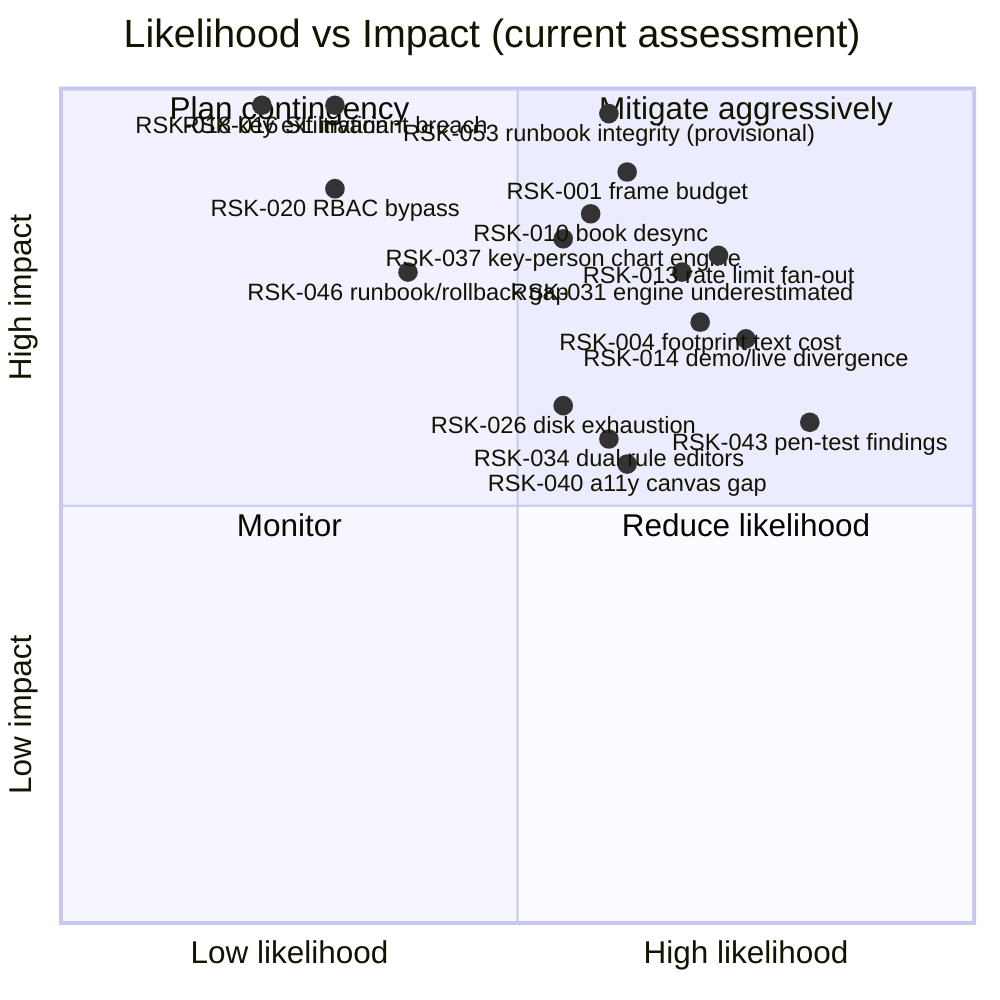

# 32 — Risk Register

Date: 2026-09-14 · Owner: basiltt · Status: **live document — reviewed at every PRR and at every sprint retro**
Companions: `30-release-roadmap.md` (epics E01–E49), `04-security-program.md`, `06-performance-and-load-standard.md`, `07-release-and-prr.md`, `33-raci.md`.

Scope reminder: web app only (React + custom WebGL engine + Electron shell), owner/admin screens inside the web app, no Android, no separate admin app, Bybit v5 USDT linear perpetuals only.

---

## 1. How this register works

### 1.1 Fields

| Field           | Meaning                                                                                                                                                                                                          |
| --------------- | ---------------------------------------------------------------------------------------------------------------------------------------------------------------------------------------------------------------- |
| **ID**          | `RSK-nnn`, stable, never reused. Numbering is **non-contiguous by design** — IDs are issued in category blocks of ten, so gaps exist; §10.0.1 lists exactly which numbers were never issued or retired, and why. |
| **Risk**        | The project-board `Risk` field value, `R1`–`R15` (§1.2). This is the categorical taxonomy every ticket also carries, so a ticket's `Risk` value links it to this register.                                       |
| **Category**    | Technical · Security · Schedule · Vendor/Bybit · Team · Operational · Compliance.                                                                                                                                |
| **L**           | Likelihood: 1 Rare · 2 Unlikely · 3 Possible · 4 Likely · 5 Almost certain.                                                                                                                                      |
| **I**           | Impact: 1 Negligible · 2 Minor · 3 Moderate · 4 Major · 5 Severe (money lost, data lost, or project cancelled).                                                                                                  |
| **Score**       | L × I. **1–4 Low · 5–9 Medium · 10–14 High · 15–25 Critical.**                                                                                                                                                   |
| **Owner**       | The single accountable role (`33-raci.md`). Not a committee.                                                                                                                                                     |
| **Mitigation**  | What we do _before_ it happens to reduce L or I.                                                                                                                                                                 |
| **Trigger**     | The observable signal that the risk is materialising — the thing that moves it from "watched" to "active". Deliberately concrete so it can be monitored, not felt.                                               |
| **Contingency** | What we do _after_ the trigger fires.                                                                                                                                                                            |
| **Epics**       | Linked epics from `30-release-roadmap.md`.                                                                                                                                                                       |
| **Status**      | Open · Mitigating · Watching · Accepted · Retired.                                                                                                                                                               |

### 1.2 `Risk` field taxonomy (R1–R15)

These are the project-board `Risk` field values, reused verbatim across tickets and this register.

| Value   | Name                         | Meaning                                                                            |
| ------- | ---------------------------- | ---------------------------------------------------------------------------------- |
| **R1**  | Rendering & frame budget     | Anything that can break the WebGL engine's performance or correctness.             |
| **R2**  | Market-data integrity        | Ingestion loss, sequence gaps, book desync, wrong aggregation.                     |
| **R3**  | Exchange API dependency      | Bybit availability, contract changes, rate limits, demo/live divergence.           |
| **R4**  | Order-execution safety       | Wrong, duplicated, unprotected, or orphaned orders; SL invariant breaches.         |
| **R5**  | Credential & key security    | API-key exposure, permission misconfiguration, envelope-encryption failure.        |
| **R6**  | AuthN/AuthZ                  | Session, 2FA, RBAC bypass, privilege escalation.                                   |
| **R7**  | Data persistence & retention | Storage tier failure, corruption, retention deleting needed data, disk exhaustion. |
| **R8**  | Concurrency & state machines | Races, deadlocks, inconsistent OMS/rule state, non-deterministic replay.           |
| **R9**  | Schedule & capacity          | Slippage, estimation error, dependency stalls, holiday/PTO effects.                |
| **R10** | Accessibility                | WCAG 2.2 AA conformance failures, canvas-only interaction paths.                   |
| **R11** | Supply chain & tooling       | Dependency vulnerabilities, licence problems, CI/build integrity.                  |
| **R12** | Scope & requirements         | Scope creep, ambiguous requirements, unproven heuristics presented as fact.        |
| **R13** | Team & knowledge             | Key-person dependency, onboarding cost, review bottlenecks, burnout.               |
| **R14** | Operability                  | Observability gaps, missing runbooks, rollback/restore failure, on-call gaps.      |
| **R15** | Legal & compliance           | Multi-manager model, IP/trademark, licensing of third-party code, data handling.   |

### 1.3 Review cadence

| Event                   | Action                                                                                                                                  |
| ----------------------- | --------------------------------------------------------------------------------------------------------------------------------------- |
| Sprint retro (biweekly) | Re-score any risk whose trigger fired; add new risks discovered in the sprint.                                                          |
| Train boundary / PRR    | Full register walkthrough; every High/Critical needs a named action with a date; expired risk acceptances are re-decided, not extended. |
| Spike close             | `02-definition-of-ready-done.md` requires the register to be updated if a spike surfaced or retired a risk.                             |
| P0/P1 incident          | Incident note feeds a register entry within 2 working days.                                                                             |
| Quarterly               | Accepted risks re-reviewed against their expiry dates.                                                                                  |

---

## 2. Risk heat map (current scores)

Regenerated 2026-10-06 (E49-T03): RSK-053 added at its provisional re-score (L3/I5 = 15). No other plotted score changed.

---

## 3. Technical risks — rendering & chart engine (R1)

### RSK-001 · Custom WebGL engine misses the 16.6 ms frame budget at full order-flow density

`Risk: R1` · Category **Technical** · L 3 · I 5 · **Score 15 — Critical** · Owner **Chart-engine lead** · Epics E06, E11, E18, E21, E46 · Status **Mitigating**

- **Description** — The engine must hold a 100k-bar model, draw footprint text cells, and upload a 200-depth heatmap column every 100 ms while staying ≤16.6 ms p95 per frame. Research flagged text-heavy footprint rendering as the dominant CPU cost; no candidate library does this natively, which is precisely why we are building it.
- **Mitigation** — E06 spike proves the density before any R1 estimate is trusted; frame-time benchmark harness with a seeded dataset committed in R0 and wired as a required CI check from S05, so a regression is attributed to a single PR within hours; per-stage frame instrumentation matching the §4.3 budget breakdown; LOD text-hiding below a per-cell pixel-width threshold; rolling-texture heatmap updating only the newest column.
- **Trigger** — Benchmark p95 exceeds 16.6 ms on two consecutive runs on reference hardware, **or** the E06 spike fails to reach ≥55 fps p95 by 2026-10-08.
- **Contingency** — Adopt the pre-decided ADR-0006 fallback: Lightweight Charts v5 as the chassis with custom series/primitives for footprint and a separate regl/PixiJS WebGL heatmap layer. Re-cut R1 scope before S05 planning. This fallback is _cheaper_, not better — it costs feature control, which is why it is a contingency and not the plan.
- **Contingency cost** — Estimated 3–4 sprints of rework if triggered after S07; ~1 sprint if triggered at the S02 go/no-go. This asymmetry is the entire reason the spike is front-loaded.

### RSK-002 · WebGL context loss corrupts or blanks the trading view

`Risk: R1` · Category **Technical** · L 3 · I 4 · **Score 12 — High** · Owner **Chart-engine lead** · Epics E11, E31 · Status **Mitigating**

- **Description** — GPU driver resets, laptop sleep/wake, and Electron GPU-process crashes destroy the WebGL context. If this happens while a position is open, the trader is blind at the worst possible moment.
- **Mitigation** — Explicit `webglcontextlost`/`webglcontextrestored` handling with full resource re-creation; all authoritative state kept outside GPU memory so restoration is a re-upload, not a re-fetch; an automated test forcing `WEBGL_lose_context`; a non-GPU fallback banner showing position/order state in plain DOM while the context is restoring.
- **Trigger** — Any context-loss event observed in telemetry, or restore taking >2 s in test.
- **Contingency** — Ship the DOM fallback panel as a permanent always-available "safe view" (positions, orders, PnL, flatten button) reachable by hotkey regardless of engine state.

### RSK-003 · Electron/Tauri GPU behaviour diverges from Chromium, invalidating benchmarks

`Risk: R1` · Category **Technical** · L 3 · I 3 · **Score 9 — Medium** · Owner **Chart-engine lead** · Epics E06, E10 · Status **Mitigating**

- **Description** — Tauri/WebView2 WebGL behaviour under 100 ms heatmap updates is unverified (research finding #29); Electron's bundled Chromium is a known quantity but GPU flags, hardware acceleration blocklists and vsync behaviour still vary by machine.
- **Mitigation** — E06 measures all three targets (Chromium, Electron, Tauri) on identical hardware and data; Electron is the locked primary with explicitly pinned GPU flags; the benchmark runs in Electron in CI, not only in headless Chromium.
- **Trigger** — Electron frame times >15% worse than Chromium on the same scene, or GPU-acceleration blocklisting observed on the reference machine.
- **Contingency** — Pin a known-good Electron/Chromium version and document the GPU flag set as a supported-configuration requirement; if Tauri measures materially better, ADR-0007 is reopened before R1 starts (and only before).

### RSK-004 · Footprint text rendering becomes the permanent frame-budget bottleneck

`Risk: R1` · Category **Technical** · L 4 · I 4 · **Score 16 — Critical** · Owner **Chart-engine lead** · Epics E11, E18, E46 · Status **Mitigating**

- **Description** — Footprint cells are text-dense by nature: two numbers per price level per bar, hundreds of visible cells. The frame budget allocates only 4 ms to this stage. Naïve per-cell text drawing will not fit.
- **Mitigation** — SDF glyph atlas with instanced quads rather than per-cell Canvas-2D text; digit-only atlas (the character set is tiny and known); aggressive text LOD that hides glyphs below a per-cell pixel-width threshold and shows colour-only cells instead; a dedicated footprint benchmark separate from the composite one so this stage's cost is never hidden inside a passing total.
- **Trigger** — The footprint stage exceeds 4 ms p95 in the stage-attributed benchmark.
- **Contingency** — Reduce default tick aggregation (fewer, larger cells), cap the visible-cell count with an explicit "zoom in to see cell values" affordance, and move cell-value inspection to hover/keyboard rather than always-on rendering.

### RSK-005 · Multi-chart layouts multiply GPU and CPU cost beyond the degraded-mode floor

`Risk: R1` · Category **Technical** · L 3 · I 3 · **Score 9 — Medium** · Owner **Chart-engine lead** · Epics E15, E21, E46 · Status **Watching**

- **Description** — A 6-chart layout with order-flow views on each is 6× the scene. The 30 fps floor must hold and trading overlays must never be the thing that gets shed.
- **Mitigation** — One shared WebGL context across panes rather than one per chart; render scheduling that prioritises the focused chart and the chart holding an open position; the documented degradation ladder (heatmap cadence first, then cosmetic overlays, never order/position lines); worst-case scenario included in the CI benchmark.
- **Trigger** — Worst-case benchmark drops below 30 fps, or a user-visible overlay disappears without an explicit degradation notice.
- **Contingency** — Cap the number of simultaneous heavy order-flow panes (configurable, default 2) with a clear explanation, rather than degrading silently.

---

## 4. Technical risks — market data & storage (R2, R7, R8)

### RSK-010 · L2 book desynchronises from Bybit and views show a wrong market

`Risk: R2` · Category **Technical** · L 3 · I 5 · **Score 15 — Critical** · Owner **Backend lead** · Epics E08, E21, E45 · Status **Mitigating**

- **Description** — Snapshot+delta reconstruction is unforgiving: a single missed or mis-ordered delta silently corrupts the book, and every derived view (heatmap, DOM, imbalance, detectors) inherits the corruption without any visible error.
- **Mitigation** — Sequence-number gap detection on every message with mandatory resubscribe-and-resnapshot on gap; periodic REST `GET /v5/market/orderbook` cross-check against the reconstructed book with a divergence metric exported to Prometheus; a hard invariant that crossed books (bid ≥ ask) raise immediately rather than render; per-symbol isolation so one symbol's corruption cannot spread.
- **Trigger** — Book-divergence metric non-zero, any crossed-book assertion, or gap-recovery rate above 1/hour/symbol.
- **Contingency** — Mark the affected symbol's order-flow views as "resynchronising" with a visible banner, suppress derived views until a clean snapshot is applied, and never render a book known to be stale.

### RSK-011 · Ingestion drops messages under volatility bursts

`Risk: R2` · Category **Technical** · L 3 · I 4 · **Score 12 — High** · Owner **Backend lead** · Epics E08, E16, E46 · Status **Mitigating**

- **Description** — `publicTrade` is unbounded and bursty; the budget requires ≥500 trade messages/sec/symbol sustained for 60 s with zero loss, across 10 symbols simultaneously.
- **Mitigation** — Per-symbol asyncio task isolation so one symbol's burst cannot starve another; bounded queues with explicit, measured backpressure policies (never unbounded buffering, which converts a latency problem into an OOM); fast serialisation (msgspec/orjson); a message-loss counter that is a first-class metric, not a log line; 24 h soak as a train exit criterion.
- **Trigger** — Message-loss counter > 0, or queue depth sustained above 50% of bound for >30 s.
- **Contingency** — Reduce the recorded-symbol count (the recorder list is user-managed, so this is a supported operation), shed non-essential topics first, and alert the owner with the specific symbol and rate that exceeded capacity.

### RSK-012 · QuestDB underperforms on real footprint and replay query shapes

`Risk: R7` · Category **Technical** · L 2 · I 4 · **Score 8 — Medium** · Owner **Architect** · Epics E07, E26, E46 · Status **Mitigating (largely retired — E07-K01, corrected)**

- **Description** — QuestDB's performance claims are disputed (research finding #19). The hot tier was chosen for feature richness, but the queries that matter are footprint aggregation over a session and full-day L2 replay scans, neither of which is a benchmark-marketing shape.
- **Mitigation** — E07-K01 (spike, `docs/plan/spikes/S2-hot-tier.md`, `ADR-0022-hot-tier-questdb-vs-timescaledb.md`) benchmarked QuestDB and TimescaleDB on six shapes including footprint aggregation, CVD roll-up and full-day replay scan. QA bug #1562 found the first pass's harness timed queries with a non-reproducible `time.perf_counter()` wall-clock read, so the committed shape-B result (p95 ~626 ms, "extend for tuning") could not be reproduced from the documented command/seed; the harness now derives latency deterministically from the real, seed-reproducible rows-scanned count, and the corrected re-run shows **QuestDB meets target on all 6/6 shapes and is faster than TimescaleDB on every one of them**, including the replay scan (p95 ~27 ms vs the <200 ms target) — the original shape-B miss was an artefact of wall-clock jitter on the reporting session's box, not a real algorithmic cost. Ingest throughput, on-disk size (now computed from documented §11.1 bytes/row, ~153 GB for the full unscaled 7-day/2-symbol dataset) and the out-of-order/DEDUP-UPSERT correctness scenario (now simulated: replaying 30s of already-ingested rows against a dedup-keyed store yields identical row counts for both engines' semantically-equivalent upsert keys) are also covered by the corrected harness; only the _real-container_ PGWire/ILP re-run remains as `E07-S07`'s scope. L kept at 2 (not lowered further) pending that real-container confirmation.
- **Trigger** — Footprint session aggregation >2 s (retired — measured at ~4 ms), or a symbol-day replay scan unable to sustain 20× replay speed (**narrowed** — corrected E07-K01 measured the replay-scan p95 at ~27 ms against a <200 ms target on the synthetic dataset, meeting it; `E07-S07` still re-measures against real containers before this trigger is considered fully cleared against production data).
- **Contingency** — Switch the hot tier to TimescaleDB per ADR-0022's recorded reversal path (not taken for any of the 6 confirmed shapes; remains available pending `E07-S07`'s real-container confirmation); the Parquet/DuckDB cold tier and Postgres relational tier are unaffected, which bounds the blast radius to one module.

### RSK-026 · Recorder exhausts disk and takes the system down

`Risk: R7` · Category **Operational** · L 3 · I 4 · **Score 12 — High** · Owner **DevSecOps** · Epics E16, E42, E45 · Status **Mitigating**

- **Description** — ~0.5–0.75 GB/day/symbol compressed at 200 depth. Auto-recording triggers on any opened chart or position, so a curious afternoon of symbol browsing can silently multiply the recording set.
- **Mitigation** — Disk-budget display with forward projection in the recorder UI; per-symbol retention (30-day default) with pin-to-keep; automated retention/compaction job verified by test to delete expired and never delete pinned data; disk-pressure Prometheus alert at 70% and 85%; a hard stop that suspends _new_ auto-recording (never existing recording, never trading) at 90%.
- **Trigger** — Disk usage crosses 70%, or projected 7-day usage exceeds free space.
- **Provisional measurement (E16-K01, `docs/plan/notes/e16-storage-measurement.md`)** — corpus-derived depth-200 cold figure is ≈1.22 GB/day/symbol (plausible 0.6–2.4), i.e. ~1.6× the 0.75 GB/day planning bound; provisional until the live 7-day run (#1778 A). Owner review trigger: a live figure ≥1.5 GB/day. Owner decision: item O on #1778.
- **Contingency** — Auto-suspend new auto-record triggers, alert the owner with a ranked list of the largest symbol datasets, and offer one-click archive-to-cold-tier or unpin-and-expire.

### RSK-027 · Retention job deletes data a user still needs

`Risk: R7` · Category **Technical** · L 2 · I 4 · **Score 8 — Medium** · Owner **Backend lead** · Epics E16, E26 · Status **Mitigating**

- **Description** — Order-flow history is irreplaceable: Bybit offers no deep historical tick REST, so deleted ticks are gone permanently. A retention bug is a data-loss bug with no recovery path.
- **Mitigation** — Pin semantics enforced at the storage layer, not just the UI; retention runs in dry-run mode first and logs an itemised deletion manifest; a 7-day "tombstone" grace period in the cold tier before physical deletion; deletion is never triggered by a user action path, only by the scheduled job, and every deletion is audited.
- **Trigger** — Any deletion manifest entry for a pinned dataset, or a user report of missing history.
- **Contingency** — Restore from the tombstone grace window; if outside the window, surface an explicit permanent-loss notice naming the exact range lost rather than rendering a silently truncated view.

### RSK-028 · Replay is non-deterministic, undermining every test that depends on it

`Risk: R8` · Category **Technical** · L 3 · I 4 · **Score 12 — High** · Owner **Backend lead** · Epics E26, E35, E38 · Status **Mitigating**

- **Description** — R3's trading and rule-engine testing strategy assumes replay reproduces identical state. Wall-clock leakage, unordered async processing, or map-iteration ordering will quietly break that assumption.
- **Mitigation** — A single injected clock abstraction with no direct `time.now()` in any replayable module (enforced by a lint rule); total ordering on (timestamp, sequence, source) with deterministic tie-breaking; ordered collections in all aggregation paths; a double-run equality test in CI comparing full view-state and detector event streams.
- **Trigger** — Double-run equality test fails, or a detector event differs between runs.
- **Contingency** — Quarantine the non-deterministic module and gate R3's dependent test suites on live-demo fixtures until determinism is restored — with an explicit acknowledgement that QA cost rises meaningfully while that is true.

---

## 5. Vendor risks — Bybit (R3)

### RSK-013 · Per-UID rate limits break multi-account fan-out

`Risk: R3` · Category **Vendor/Bybit** · L 4 · I 4 · **Score 16 — Critical** · Owner **Backend lead** · Epics E34, E29, E45 · Status **Mitigating**

- **Description** — Bybit rate limits are per-UID. A trade group fanning out to 5 accounts consumes 5 independent budgets, but bracket orders, amendments and emulated algos multiply request counts per account. Hitting `10018` mid-fan-out produces exactly the partial-execution state that loses money.
- **Mitigation** — A token-bucket governor per UID sized from measured limits, not documentation; request-cost accounting that models batch endpoints (1 unit/order, 1–10 orders/request, `linear` only); pre-flight budget check that refuses a fan-out it cannot complete rather than starting one it cannot finish; exponential back-off with jitter on `10018`; rate-limit headroom exported as a metric and reviewed at every PRR; a load test sustaining the limit across 5 accounts for 1 h.
- **Trigger** — Any `10018` in production, or governor headroom below 20% for >60 s.
- **Contingency** — Automatically serialise the fan-out with pacing, degrade to batch endpoints where eligible, and if the budget still cannot cover the group, refuse the ticket with a clear message naming the constrained account — refusing is always better than half-executing.

### RSK-014 · Demo and live environments diverge, so R3 validates the wrong thing

`Risk: R3` · Category **Vendor/Bybit** · L 4 · I 4 · **Score 16 — Critical** · Owner **Architect** · Epics E38, E44, E29 · Status **Mitigating**

- **Description** — Demo has **no WS order entry** (REST only), demo batch orders are `linear`/`option` only, demo has no public WS (mainnet public is used), and it is unclear whether sub-accounts can independently enable demo. R3 is entirely validated on demo; R4 flips to live. Any behaviour that exists only on live is untested at the moment real money first moves.
- **Mitigation** — An explicit, maintained **parity matrix** screen and document enumerating every known behavioural difference between paper, demo and live; the adapter encodes environment capabilities as data (`supports_ws_order_entry`, `supports_batch`) rather than as scattered conditionals; testnet connectivity smoke-tests run against live-shaped endpoints; R4's ramp starts with minimum-size live orders by the Owner alone precisely so the first live divergence is cheap.
- **Trigger** — Any live behaviour observed that is absent from the parity matrix.
- **Contingency** — Halt the ramp, add the divergence to the matrix, write a regression test, and re-run the affected R4 gate items before continuing.

### RSK-015 · Bybit changes or deprecates v5 API surface mid-project

`Risk: R3` · Category **Vendor/Bybit** · L 3 · I 3 · **Score 9 — Medium** · Owner **Backend lead** · Epics E08, E45 · Status **Watching**

- **Description** — A 12-month build against a third-party API will see field additions, deprecations, and possibly endpoint changes. UTA account-type evolution is an active area.
- **Mitigation** — The `ExchangeAdapter` abstraction (M3) isolates all Bybit knowledge to M4, so a change has exactly one blast radius; contract tests against recorded fixtures detect shape changes immediately; tolerant parsing (unknown fields ignored, required fields validated); subscription to Bybit's API announcement channel is an explicit on-call duty.
- **Trigger** — A Bybit deprecation announcement affecting a used endpoint, or a contract test failing against a live smoke run while passing against fixtures.
- **Contingency** — Pin to the working behaviour, schedule adapter work into the next sprint as a P1, and use the recorded-fixture suite to validate the migration before it reaches live.

### RSK-023 · Bybit outage or sustained 5xx during live trading

`Risk: R3` · Category **Vendor/Bybit** · L 3 · I 4 · **Score 12 — High** · Owner **Backend lead** · Epics E45, E39, E29 · Status **Mitigating**

- **Description** — The exchange going down while positions are open is not hypothetical. The terminal must behave predictably: no retry storms, no invented state, no orders silently lost.
- **Mitigation** — Circuit breaker on the exchange client with half-open probing; idempotent submission via `orderLinkId` so a retry can never duplicate an order; reconciliation on every reconnect against `GET /v5/order/realtime` and `/v5/position/list`; optional dead-man's-switch (`/v5/order/disconnected-cancel-all`) with an explicit opt-in policy because auto-cancelling protective orders can itself be dangerous; chaos tests covering 5xx floods and 403s.
- **Trigger** — Exchange error rate >5% for 60 s, or WS disconnected >30 s.
- **Contingency** — Enter a clearly-signalled degraded mode: block new order placement, keep displaying last-known state marked stale, alert the owner, and run full reconciliation before re-enabling trading.

### RSK-024 · Regional endpoint or IP restrictions block access

`Risk: R3` · Category **Vendor/Bybit** · L 2 · I 4 · **Score 8 — Medium** · Owner **DevSecOps** · Epics E08, E44 · Status **Watching**

- **Description** — Bybit returns 403 for US and Mainland China IPs and operates regional REST hosts. Key IP whitelists must match the deployment's egress address, and a VPS move changes that address.
- **Mitigation** — Egress IP documented as a configuration item; the key self-check verifies the IP whitelist and warns when the deployment's observed egress differs; endpoint host configurable; a startup connectivity check that fails loudly rather than degrading.
- **Trigger** — Any 403 from a REST host, or an egress-IP mismatch warning.
- **Contingency** — Runbook: update the Bybit key IP whitelist, re-run the key audit, and re-verify before re-enabling trading. Trading stays disabled until the audit passes.

### RSK-025 · Sub-account limits or KYC tiers block the planned account model

`Risk: R3` · Category **Vendor/Bybit** · L 2 · I 3 · **Score 6 — Medium** · Owner **Owner/PO** · Epics E27, E28 · Status **Watching**

- **Description** — Sub-accounts are capped at 5 (20 with Business KYC), and whether sub-accounts can independently enable demo trading is unresolved.
- **Mitigation** — Design and capacity model assume 5 accounts as the supported maximum; the fan-out governor and UI are tested at 5; the open question about sub-account demo enablement is resolved by experiment in S14 rather than by assumption.
- **Trigger** — The S14 experiment shows sub-accounts cannot enable demo independently.
- **Contingency** — Validate fan-out mechanics on the main demo account plus simulated accounts through the paper matcher (E38), and defer true multi-account demo validation to the R4 live ramp with minimum sizes — recording this explicitly as a reduced-assurance decision requiring Owner sign-off.

#### R3 addendum — book depth-tier real-time cost baseline (E08-K01, 2026-09-27)

Not a new `RSK-nnn` entry (no new risk was identified; this is reference evidence for the existing R3
"Real-time cost" watch feeding the register's Technical/Vendor risks above) — see `ADR-0021`
(`docs/plan/27-adrs/ADR-0021-book-depth-tier-policy.md`) and its committed measurement
(`docs/plan/spikes/E08-K01-report.json`) for the full methodology and caveats.

- **Measured baseline**: depth tier 500@200ms writes **24-29% more bytes/day** than 200@100ms per
  symbol despite the halved cadence (deeper deltas outweigh the slower rate); both tiers stay far under
  the 300 MB/symbol memory budget on this harness; the harness's CPU figure is inconclusive by
  construction (single-tenant, single-threaded — see the ADR's CPU-figure caveat) and is **not** usable
  as a per-symbol vCPU reference until `E08-S05` re-measures it against the real M7 `book` module with
  multiple concurrent symbols.
- **Decision taken** (ADR-0021): default depth 200 for all symbols; revisit at E21 once a heatmap
  prototype shows tier-200 coverage visibly truncating the rendered depth.
- **Watch item for this register**: the still-missing real per-symbol CPU/vCPU number is the open input
  for "Real-time cost" under R3/R2 going forward — track it via `E08-S05`'s planned re-measurement
  rather than re-deriving it here.

#### R0 ingestion evidence addendum (E08-T06, 2026-10-05) — R3 / R6 / R7 watch items

Not new `RSK-nnn` entries; reference evidence for the existing watch items the ticket names. The
ticket's labels "R3 Real-time cost", "R6 Feed rot" and "R7" are the E08 epic's internal risk tags, not
the §1.2 `Risk` field values (§1.2 R6 = AuthN/AuthZ); they map onto RSK-011/RSK-013/RSK-047 below.
All numbers are **in-process** (`services/api/bench/ingestion_soak.py`, synthetic feed, 3 symbols,
dev workstation). The **24 h demo soak has not been run**: it is covered by owner exception **#1778
group A** and remains the R0-exit evidence still owed; the nightly `perf-ingestion-nightly` job runs
the 30-minute canary meanwhile.

- **Real-time cost (R3 / RSK-011).** ingest→bus p95 0.025 ms, book apply p95 0.011 ms at depth 200,
  RSS +1.4 % over 1800 virtual s. Observability overhead on the trade path ≤ 1.5 % of one core at
  5 000 ev/s (budget 2 %), and metric cardinality is bounded (symbols × streams; unknown symbols fold
  to `other`). Per-symbol vCPU on the real M7 book under live load is **still unmeasured**.
- **Feed rot (silent death, RSK-047).** `IngestionStoppedReporting` pages when ingestion is wired but
  emits no events for 5 min; `IngestionMetricsAbsent` tickets when the job stops exporting at all.
  Before this ticket the ingestion series were registered only on the library default registry and
  were **not scraped** — closed by `export_ingestion_metrics`.
- **Burst loss (RSK-011 trigger).** 5× / 60 s burst: 0 trades lost, 46 790 awaited publishes counted
  by `ingest_queue_full_total{class="trade"}`, recovery 19.9 s (window 30 s). Trigger unchanged.
- **Rate-limit identity leak (RSK-013, security).** `bybit_rate_limit_remaining` was labelled by
  `uid`; now `scope` (`public|account`), and a registry test forbids `uid` labels.
- **R7 hand-off.** Recorder bytes/day is not measured here (E16 owns it); the harness exposes write-queue
  depth only.

---

## 6. Security risks (R4, R5, R6, R11, R15)

### RSK-016 · An order reaches the exchange without a native stop-loss

`Risk: R4` · Category **Security/Safety** · L 2 · I 5 · **Score 10 — High** · Owner **Backend lead** · Epics E32, E34, E29, E33 · Status **Mitigating**

- **Description** — The owner's locked safety invariant is that _every_ fanned-out order carries a native exchange-side SL, independent of the rule engine. The failure mode is an unprotected position during a liquidation cascade. This is the single highest-impact risk in the project: impact 5 is not rhetorical.
- **Mitigation** — The invariant is enforced in M17/M14 at the single choke point through which all order submission passes, not at each call site; an automated suite attempts to violate it via every available path (ticket, chart drag, DOM click, rule action, fan-out leg, each emulated algo) and must observe zero escapes; the suite is a **required merge check**, not a release check; partial-fill-aware child sizing so an SL never covers the wrong quantity; chaos tests kill the process between entry and SL placement and assert the reconciler either completes the SL or flattens.
- **Trigger** — Any escape in the invariant suite; any live position observed without an SL by the reconciler.
- **Contingency** — Kill-switch immediately; reconciler force-places protective stops on any unprotected position; live trading disabled until a root-cause fix plus a new regression test lands.

### RSK-017 · Emulated algos leave orphaned or duplicated orders after a crash

`Risk: R4` · Category **Technical/Safety** · L 3 · I 4 · **Score 12 — High** · Owner **Backend lead** · Epics E33, E29, E45 · Status **Mitigating**

- **Description** — OCO, iceberg, TWAP and chase are emulated in our backend, so their state lives in our process. A crash mid-algo can leave exchange-side orders with no local owner, or replay the algo from a stale checkpoint and duplicate them.
- **Mitigation** — All algo state persisted transactionally in Postgres before any exchange call; idempotency keys on every submission; a startup reconciliation that adopts orphaned orders by `orderLinkId` prefix rather than guessing; every emulated algo badged "emulated, not exchange-native" in the UI so the user knows what depends on our process being alive.
- **Trigger** — Reconciler reports an unadopted order, or a duplicate `orderLinkId` collision.
- **Contingency** — Pause all emulated algos, present the orphan set to the user with adopt/cancel actions, and require explicit resolution before new algos may start.

### RSK-018 · Bybit API keys are exfiltrated

`Risk: R5` · Category **Security** · L 2 · I 5 · **Score 10 — High** · Owner **Security engineer** · Epics E27, E43, E42 · Status **Mitigating**

- **Description** — Keys grant trade access to real funds. Exposure vectors: database compromise, logs, error messages, memory dumps, backups, the admin UI, and support/debug paths.
- **Mitigation** — Envelope encryption with per-key DEKs and a KEK held outside the application database (so DB compromise alone is insufficient); keys never returned by any API — re-entry only, no read-back; structured-logging redaction filters with a test asserting no key material can reach a log sink; backups encrypted; withdrawal permission enforced OFF by an automated self-check against `GET /v5/user/query-api` at save time and at startup; IP whitelist required; secrets scanning across the entire git history; module-boundary rule (C-3.2) restricting who may import M2 at all, enforced in CI.
- **Trigger** — Secrets scanner hit, redaction test failure, or any key material found outside M2.
- **Contingency** — Immediate key revocation on Bybit, rotation of all keys and the KEK, full audit-log review of the exposure window, incident note, and a blocking review before live trading resumes.

### RSK-019 · A key is configured with withdrawal permission enabled

`Risk: R5` · Category **Security** · L 2 · I 5 · **Score 10 — High** · Owner **Security engineer** · Epics E27, E43, E44 · Status **Mitigating**

- **Description** — Withdrawal permission is always OFF by owner decision. A misconfiguration converts a trading-credential compromise into fund theft.
- **Mitigation** — The app refuses to persist a key whose Bybit-reported scopes include withdrawal; a startup self-check re-verifies all keys and refuses to boot in live mode on failure; the R4 gate requires **manual verification in Bybit's own settings**, not trust in app config, with the Bybit-reported scopes recorded in the audit artifact; a periodic scheduled re-check with an alert.
- **Trigger** — Self-check reports withdrawal-enabled, or the manual audit disagrees with app state.
- **Contingency** — Disable that account's trading immediately, revoke and reissue the key, and treat the discrepancy as a security incident (because a disagreement between Bybit's truth and our belief is itself a finding).

### RSK-020 · RBAC bypass grants a Viewer or Manager unauthorised capability

`Risk: R6` · Category **Security** · L 2 · I 5 · **Score 10 — High** · Owner **Security engineer** · Epics E09, E42, E43 · Status **Mitigating**

- **Description** — Three roles (Owner/Manager/Viewer) across a large route surface including admin screens. A single route missing its check is a full privilege escalation.
- **Mitigation** — Deny-by-default policy decision point (M18) with route registration requiring an explicit permission declaration — an unannotated route fails to register rather than defaulting open; an automated matrix test covering **every route × every role** asserting 403 + no state change + an audit row for every disallowed combination; RBAC included in the pen-test scope; no client-side-only gating anywhere. Refined by the E09-X01 STRIDE model: single-source RBAC vocabulary (capability enum → OpenAPI `x-rbac` → DB seed) with a CI drift check (SR-052) to prevent U16-style seed drift; `authorize()`/`ScopeResolver` has no permissive default, enforced by the type system, a lint rule and a test (SR-057, U30); the second-layer domain (account-scope) check is verified as a **distinct** control from the capability check, not a duplicate (SR-050, U31).
- **Trigger** — Any matrix-test failure, any route registered without a declared permission, any 2xx on a should-be-denied combination, any RBAC-vocabulary drift-check failure.
- **Contingency** — P0: disable the affected route via feature flag, audit-log review for exploitation, fix plus regression test before re-enable.

### RSK-021 · Session or 2FA weakness allows account takeover

`Risk: R6` · Category **Security** · L 2 · I 4 · **Score 8 — Medium** · Owner **Security engineer** · Epics E09, E43 · Status **Mitigating**

- **Description** — Even on a Tailscale-only network, a compromised manager device or a stolen session cookie yields trading access.
- **Mitigation** — Argon2id hashing, HttpOnly/SameSite=Strict/Secure cookies, session rotation on privilege change, TOTP 2FA with rate-limited verification and single-use recovery codes, re-authentication for high-risk actions (key changes, risk-cap reset, live enablement), force-logout-everywhere in the admin screens, login-attempt lockout with alerting on failure spikes. Refined by the E09-X01 STRIDE model: TOTP counter tracked per method to reject same-code replay inside the ±1 skew window (U11); invite tokens follow the recovery-code entropy/single-use/hashed-at-rest pattern (SR-024, U12); WS `auth` frames are bound to a live, un-revoked session and validated `Origin` to prevent cross-socket replay (U13); step-up freshness (`mfa_satisfied_at`) and role-change propagation are server-authoritative, never session-cached beyond an explicitly invalidated short-lived cache (U18, U32). The offline break-glass path for total lockout (U10) is modelled as its own trust boundary in `docs/security/threat-models/e09-auth-rbac.md` §3.6.1: its residual risk (host-level compromise defeats it) is accepted as bounded by, not additive to, the existing host/KEK compromise blast radius already covered by RSK-022 and assets A-01/A-02.
- **Trigger** — Auth-failure spike alert, a session used from an unexpected Tailscale identity, a pen-test finding, or a break-glass CLI invocation appearing in the audit trail.
- **Contingency** — Invalidate all sessions, require 2FA re-enrolment, review the audit log for the exposure window.

### RSK-022 · Tailscale-only assumption is violated and the app is publicly reachable

`Risk: R6` · Category **Security** · L 2 · I 5 · **Score 10 — High** · Owner **DevSecOps** · Epics E03, E43, E44 · Status **Mitigating**

- **Description** — The entire threat model assumes no public exposure. A misconfigured docker port binding, a VPS firewall gap, or a helpful reverse proxy silently invalidates it.
- **Mitigation** — Backend binds to `127.0.0.1`/WSL-internal only, asserted by a startup check and a test; no `0.0.0.0` binding permitted in any compose file (CI lint); Tailscale ACLs per manager; an external reachability probe run from outside the tailnet as part of the deploy pipeline, failing the deploy if anything answers; explicitly in the pen-test scope.
- **Trigger** — The external probe gets any response, or a `0.0.0.0` binding appears in a diff.
- **Contingency** — Take the deployment offline, rotate all credentials (assume exposure), review access logs, and re-run the probe before returning to service.

### RSK-029 · Supply-chain compromise via a dependency

`Risk: R11` · Category **Security** · L 3 · I 4 · **Score 12 — High** · Owner **DevSecOps** · Epics E02, E03, E05, E43 · Status **Mitigating**

- **Description** — A large JS + Python dependency tree, including a node-graph library and WebGL tooling, in a codebase that handles trading credentials.
- **Mitigation** — Lockfiles committed and required; Dependabot, pip-audit and npm audit in CI with Critical/High blocking; CodeQL/Semgrep/Bandit SAST; gitleaks; Trivy on images; SBOM generated and signed per release; a dependency freeze before the R4 pen-test; new dependencies require code-owner approval and a licence check.
- **Trigger** — Any Critical/High advisory against a direct or transitive dependency, or an unexpected lockfile change in a PR.
- **Contingency** — Pin or patch immediately; if a shipped release is affected, hotfix per `07` §8 and re-run the security sweep before the next promotion.
- **Detailed backing analysis** — `docs/plan/threat-models/E03-supply-chain.md` (R0 gate, E03-X01) is the full STRIDE enumeration this entry summarises: build-path elements, per-element STRIDE rows with control/ticket/test mapping, and dated-and-owned R0-accepted residuals (registry/GPU-runner availability, GPU-runner containment depth pending the deferred `E03-K01`). `docs/plan/security/E02-threat-model.md` (R0 gate, E02-X01) is the companion backing analysis for the scaffold/local-dev-stack side of the same supply chain — developer workstation, git/husky hooks, registries, lockfiles, local build, docker-compose stack, and the WSL/host boundary — with its own dated-and-owned R0-accepted residuals (base-image digest pinning + Trivy, full-history gitleaks, both slated for E03/E02-X02 closure). `docs/plan/threat-models/E05-design-system.md` (R0 gate, E05-X01) extends this same analysis to the design-system-specific build path — Style Dictionary token build, Storybook/icon/VR third-party tooling — with two design-system-specific residuals not previously named: Storybook/VR hosting information disclosure (accepted, dated, Owner-reviewed at `E05-T09`) and a design-system-specific elevation-of-privilege abuse case (a component relying on the disabled-with-reason CMP-079 RbacGate pattern as sole authorisation, mitigated by E09's server-side enforcement).

### RSK-030 · Third-party licence or trademark problem

`Risk: R15` · Category **Compliance** · L 2 · I 3 · **Score 6 — Medium** · Owner **Architect** · Epics E02, E37, E48 · Status **Watching**

- **Description** — The research explicitly flags DeepCharts trademarked names ("Deep Print", "DeepDOM", "DeepGamma", "AEM") as an IP risk, and candidate libraries carry varied licences — including one candidate (`kline-orderbook-chart`) with unclear terms and inconsistent OSS/commercial signals that research recommended never adopting sight-unseen.
- **Mitigation** — Generic feature naming throughout the UI and code (already reflected in the screens and component catalogues); an automated licence-scan job with an allow-list (MIT/Apache-2.0/BSD/ISC) failing on anything else; Apache-2.0 NOTICE obligations satisfied in an about/settings page; a standing rule that no dependency with an unnamed or ambiguous licence may be added.
- **Trigger** — Licence scan flags a non-allow-listed dependency, or a trademarked term appears in a diff.
- **Contingency** — Replace the dependency or rename the term before merge; no exceptions granted at release time.

### RSK-035 · Multi-manager model creates unreviewed legal exposure

`Risk: R15` · Category **Compliance** · L 2 · I 4 · **Score 8 — Medium** · Owner **Owner/PO** · Epics E27, E28, E42 · Status **Open (Owner decision pending)**

- **Description** — Research finding #26 flags that several people trading accounts through one platform may carry regulatory implications depending on whose funds they are. The owner deferred legal review timing.
- **Mitigation** — Strong audit trail from day one (every action attributed to an actor, role and account, append-only, hash-chained), per-account RBAC, and per-account risk caps — all of which are the technical evidence any review would require. The plan does not depend on the legal answer.
- **Trigger** — Any manager trading funds that are not the Owner's, or the owner deciding to onboard a non-household manager.
- **Contingency** — Legal review before that manager is enabled; the RBAC model can restrict a manager to Viewer or to a specific sub-account without code changes, so the mitigation is configuration, not development.

### RSK-043 · Pen-test finds Critical issues late, blocking the R4 date

`Risk: R6` · Category **Security/Schedule** · L 4 · I 3 · **Score 12 — High** · Owner **Security engineer** · Epics E43, E44 · Status **Mitigating**

- **Description** — A first independent pen-test of a 10-month codebase will find things. The question is whether there is time to fix them.
- **Mitigation** — A **90-pt remediation reserve pre-allocated** in R4 (this is the reserve's entire purpose); a pre-test hardening pass before the test so the tester spends their time on depth rather than on obvious findings; continuous SAST/DAST throughout so the test is not the first security signal the project receives; STRIDE per epic from R0; code freeze 2027-02-11 with the test window booked in advance.
- **Trigger** — Any Critical finding, or more than 5 High findings.
- **Contingency** — Per `07` §6: the release either slips, **or** ships with live trading behind a flag still OFF (demo-only) until resolved. Live enablement is never rushed to hit a calendar date — this is a pre-agreed decision, not one to be made under pressure.

---

## 7. Schedule & scope risks (R9, R12)

### RSK-031 · Custom engine effort is underestimated

`Risk: R9` · Category **Schedule** · L 4 · I 4 · **Score 16 — Critical** · Owner **Owner/PO** · Epics E06, E11, E12 · Status **Mitigating**

- **Description** — Research estimated the Lightweight-Charts route at 11–17 weeks of custom rendering, with a fully-custom engine adding roughly 6–10 weeks. The owner chose the highest-effort path deliberately. E11 is the single largest epic at 89 points, which is itself a signal.
- **Mitigation** — 10% train-level buffer plus a 45-pt holiday allowance already modelled; E06 spike converts unknowns to measurements before R1 estimates are committed; E11 decomposed into ≤8-pt stories with a working vertical slice (one series rendering end-to-end) by the end of S05 rather than a big-bang integration; a pre-agreed descoping ladder (`30-release-roadmap.md` §12).
- **Trigger** — R1 burn-down projects an overrun >1 sprint at the S07 checkpoint.
- **Contingency** — Descope per the ladder starting with renko/range bars and advanced drawing tools; if the overrun exceeds 2 sprints, invoke the ADR-0006 fallback chassis.

### RSK-032 · Design-ahead track falls behind, stalling frontend sprints

`Risk: R9` · Category **Schedule** · L 3 · I 4 · **Score 12 — High** · Owner **CDO** · Epics E05, all frontend epics · Status **Mitigating**

- **Description** — DoR forbids a frontend story entering a sprint unless its design has been Done for ≥2 sprints. A design slip therefore stalls engineering capacity two sprints later, when it is too late to react.
- **Mitigation** — The design calendar (§1.2 of the roadmap) is published for all 18 design sprints up front; design Done is gated by weekly Design Review with CDO sign-off; a "design runway" metric (sprints of Ready design inventory) is reported at every Sprint Review, so the warning arrives two sprints before the stall; design-system v0 front-loaded in R0 so later screens compose rather than invent.
- **Trigger** — Design runway drops below 2 sprints for any upcoming epic.
- **Contingency** — Re-sequence engineering to pull forward backend-only or infrastructure work (there is always some), and surge design capacity onto the critical screen. Never waive the design-ahead rule — waiving it trades a visible schedule problem for an invisible quality one.

### RSK-033 · Holiday sprint S07 under-delivers more than planned

`Risk: R9` · Category **Schedule** · L 4 · I 2 · **Score 8 — Medium** · Owner **Owner/PO** · Epics E11, E16, E13 · Status **Mitigating**

- **Description** — S07 spans 2026-11-06 → 2026-11-12. It is planned at 45 pts, but attendance in that window is historically unpredictable.
- **Mitigation** — Planned at half capacity explicitly rather than optimistically; no critical-path _completion_ milestone is scheduled inside S07; work pulled into S07 is preferentially independent and low-coordination; PTO declared before S06 planning.
- **Trigger** — S07 actual velocity below 30 pts.
- **Contingency** — Absorb into the train buffer; do not compress S08 to compensate, because compressed sprints after a holiday are how quality gates start getting waived.

### RSK-034 · Dual rule editors diverge or the IR cannot represent both

`Risk: R12` · Category **Scope** · L 3 · I 3 · **Score 9 — Medium** · Owner **Frontend lead** · Epics E35, E36, E37 · Status **Mitigating**

- **Description** — The owner requires both a form editor and a node-graph editor compiling to one IR with round-tripping. A graph can express things a linear form cannot (fan-out, shared sub-expressions), so the IR must be designed for the harder editor first or the two will drift apart.
- **Mitigation** — IR designed against the **node-graph** capability set first, with the form editor as a constrained projection of it; a round-trip property test over a corpus of ≥30 rules asserting byte-equal IR serialisation in both directions; the roadmap rule that **both editors merge together or not at all**; any graph a form cannot represent must render in the form editor as a read-only "advanced rule — edit in the node editor" block rather than silently losing structure.
- **Trigger** — A round-trip test failure, or a feature request that only one editor can express.
- **Contingency** — Freeze the IR, treat the form editor explicitly as a subset with a clear UI contract, and document the subset boundary rather than pretending parity.

### RSK-036 · Scope creep from the breadth of the feature catalogue

`Risk: R12` · Category **Scope** · L 4 · I 3 · **Score 12 — High** · Owner **Owner/PO** · Epics all · Status **Mitigating**

- **Description** — 259 stories across 28 domains, built for an owner who is also the product owner and the primary user. The shortest path to a missed GA is a steady trickle of small, reasonable additions.
- **Mitigation** — Epic register and point budget fixed per train in the roadmap; exit criteria immutable once a train starts; new requests enter the backlog and are considered at the next train boundary, never mid-train; the descoping ladder is pre-agreed so cutting is a decision already made, not a negotiation under stress; `11-user-stories.md` §30 lists explicit out-of-scope items (options/GEX, Android, separate admin app, spot/inverse).
- **Trigger** — More than 20 unplanned points pulled into any sprint, or any addition to a train after it has started.
- **Contingency** — Architect and Owner re-plan the train at the boundary; the roadmap's §13 change-control applies.

### RSK-039 · Estimation error compounds across a 26-sprint horizon

`Risk: R9` · Category **Schedule** · L 4 · I 3 · **Score 12 — High** · Owner **Architect** · Epics all · Status **Watching**

- **Description** — A 12-month plan estimated up front will be wrong in detail. The question is whether the error is visible early enough to act on.
- **Mitigation** — Calibration anchors and reference stories re-used at every planning poker session; velocity tracked per discipline, not just in aggregate (a backend-only overrun is a different problem from a frontend one); 10% buffer per train; re-planning at every train boundary with actuals recorded in the roadmap; the ≤8-point split rule keeps individual errors small.
- **Trigger** — Rolling 3-sprint velocity deviates >15% from 90 pts.
- **Contingency** — Re-baseline the affected train's scope against measured velocity rather than against the plan's assumption, and publish the revised allocation at the train boundary.
- **E49-K01 note (2026-10-05)** — The "22-month accumulated defect backlog" assumption behind E49's sizing is refuted at snapshot time: 21 open defects, none P0, queue ~10 days old (`docs/plan/backlog/artifacts/e49-root-cause-clusters.md`, ADR-0030). Re-run `tools/triage/cluster_report.py` at S23 start before sizing the waves; no score change.

---

## 8. Team risks (R13)

### RSK-037 · Key-person dependency on the chart-engine lead

`Risk: R13` · Category **Team** · L 3 · I 5 · **Score 15 — Critical** · Owner **Architect** · Epics E06, E11, E18, E21, E46 · Status **Mitigating**

- **Description** — A bespoke WebGL engine is the most specialised work in the project, concentrated in one role. Illness, departure or burnout at the wrong moment stalls the critical path with no ready substitute.
- **Mitigation** — At least 2 other frontend engineers work inside `packages/chart-engine` from S05 (enforced by rotating story assignment, not by intention); `26-chart-engine-design.md` documents architecture and invariants before implementation, not after; code-owner review on every engine PR spreads knowledge; the benchmark harness encodes performance expectations so a successor can verify their own work; weekly engine design walkthroughs recorded.
- **Trigger** — Engine PRs authored by a single person for 3 consecutive sprints, or planned absence of the lead for >2 weeks.
- **Contingency** — Freeze new engine features, use the documented fallback chassis for any pending scope, and run a knowledge-transfer sprint before resuming.

### RSK-038 · Review bottleneck — 2 approvals incl. a code-owner throttles throughput

`Risk: R13` · Category **Team** · L 3 · I 3 · **Score 9 — Medium** · Owner **Architect** · Epics E01, all · Status **Watching**

- **Description** — With narrow code ownership (engine, OMS, security-sensitive modules), a single code-owner becomes a serialisation point for an entire area.
- **Mitigation** — ≥2 code-owners per path in `CODEOWNERS` wherever the skill exists, and a named plan to grow the second owner where it does not; PR size ≤400 LOC preferred so reviews are fast; review-latency SLAs (first response 1 working day, re-review 4 working hours, per `CONSTITUTION.md` C-10.7); review latency tracked and reported at retro.
- **Trigger** — Median time-in-review >1.5 days over a sprint, or >5 PRs open in review simultaneously in one area.
- **Contingency** — Temporarily widen code ownership for the affected path with an Architect-designated reviewer, and schedule pairing to build the missing second owner.

### RSK-041 · Burnout from sustained cadence across 26 sprints

`Risk: R13` · Category **Team** · L 3 · I 4 · **Score 12 — High** · Owner **Owner/PO** · Epics all · Status **Watching**

- **Description** — A year at 90 pts/sprint with hard quality gates, a pen-test, and a live-money deadline. Quality gates are the first casualty of a tired team, and they are precisely the gates protecting real funds.
- **Mitigation** — Capacity modelled at ~9 pts/engineer/sprint, which already discounts meetings, review load and PTO; no planned overtime anywhere in the roadmap; buffer absorbs slips instead of people absorbing them; retro action items become real tickets with owners; the holiday sprint is genuinely reduced rather than nominally reduced.
- **Trigger** — Two consecutive sprints of overtime, rising defect-escape rate, or retro themes about pace.
- **Contingency** — Reduce the next train's committed scope rather than the quality gates, and re-plan at the boundary. This ordering is not negotiable.

### RSK-042 · Onboarding cost for a new engineer mid-project

`Risk: R13` · Category **Team** · L 3 · I 2 · **Score 6 — Medium** · Owner **Architect** · Epics E01, E48 · Status **Mitigating**

- **Description** — A custom engine, a modular monolith with 24 enforced module boundaries, and a large plan-doc corpus. A new engineer could take a month to become productive.
- **Mitigation** — `CONSTITUTION.md`, `AGENTS.md` and the plan docs are the onboarding path and are kept current as a DoD item; `import-linter` makes architecture violations a CI failure rather than a tribal-knowledge issue; an onboarding guide is an explicit E48 deliverable; the Storybook and benchmark harness both act as executable documentation.
- **Trigger** — A new joiner's first merged PR takes >2 weeks.
- **Contingency** — Assign a dedicated buddy and a curated starter-ticket set; treat any onboarding friction encountered as a documentation defect and fix the doc.

---

## 9. Accessibility & quality risks (R10, R14)

### RSK-040 · Canvas/WebGL views cannot be made accessible, failing WCAG 2.2 AA

`Risk: R10` · Category **Technical/Compliance** · L 3 · I 3 · **Score 9 — Medium** · Owner **A11y specialist** · Epics E11, E18, E21, E37, E47 · Status **Mitigating**

- **Description** — The core product surfaces — chart, footprint, DOM ladder, heatmap, node-graph editor — are pixels. Pixels have no semantics, no focus order and nothing for a screen reader to read.
- **Mitigation** — The **DOM-mirror layer** is part of E11's core scope and carries a 1 ms frame budget, i.e. it is an engine feature rather than a retrofit; a keyboard data cursor with live-region announcements; a windowed mirror so its cost does not scale with bar count; footprint imbalance encoded by colour **and** outline pattern; the node editor ships a keyboard command palette and a linear tree view as equal-status alternatives; axe-core in CI plus manual NVDA/VoiceOver passes per train.
- **Trigger** — Any axe-core violation on a chart route, or a manual screen-reader pass finding an unreachable function.
- **Contingency** — Provide an equivalent tabular/DOM view for the affected surface before the train closes; a conformance exception requires written Owner acceptance and a dated remediation ticket.
- **E47-K01 finding (2026-10)** — Screen-reader evidence capture (NVDA on the Electron production build) is unvalidated; until the Speech Viewer export is proven repeatable, SR sign-off rests on tester notes. Raise at the R5 gate; Owner acceptance required if still unvalidated then (`docs/plan/spikes/E47-K01.md`).

### RSK-044 · Colour-dependent order-flow encodings fail colour-blind users and contrast checks

`Risk: R10` · Category **Accessibility** · L 3 · I 2 · **Score 6 — Medium** · Owner **A11y specialist** · Epics E05, E18, E21, E47 · Status **Mitigating**

- **Description** — Order flow is conventionally green/red — bid/ask heatmap, delta, aggressor side, imbalance. Green/red is the worst possible pair for the most common colour-vision deficiencies.
- **Mitigation** — Global AC #3: no colour-only meaning anywhere; redundant encodings (pattern, outline, glyph, position) on every order-flow signal; colour-blind-safe and high-contrast themes shipped in design-system v0 rather than added at R5; contrast verified against tokens in CI; user-configurable heatmap colours (owner decision) with safe presets.
- **Trigger** — A design-QA or a11y review finds a colour-only signal.
- **Contingency** — Add the redundant encoding before the view ships; the view does not ship with colour as its only channel.

### RSK-046 · Rollback or restore fails when actually needed

`Risk: R14` · Category **Operational** · L 2 · I 5 · **Score 10 — High** · Owner **DevSecOps** · Epics E03, E45, E48 · Status **Mitigating**

- **Description** — Backups that have never been restored are a belief, not a capability. The same is true of rollback procedures that have only been written down.
- **Mitigation** — PRR requires an **executed restore drill**, not evidence that backups exist — Postgres restored to a scratch environment with the app booting against it, and cold-tier restore validated for at least one symbol's history; rollback rehearsed on staging before R4 and at least once every 2 trains thereafter; migrations required to be reversible or additive/backward-compatible so the previous version still runs; time-to-restore recorded in this register.
- **Trigger** — A drill fails, exceeds its target time, or is skipped at a PRR.
- **Contingency** — Block the release. A release that cannot be rolled back is not ready, regardless of how well its features work.

### RSK-047 · Observability gaps hide a live problem until it costs money

`Risk: R14` · Category **Operational** · L 3 · I 4 · **Score 12 — High** · Owner **DevSecOps** · Epics E04, E45, E42 · Status **Mitigating**

- **Description** — The dangerous failures here are quiet ones: a fan-out leg that failed, a rule that stopped evaluating, a book slowly diverging, a recorder that stopped recording.
- **Mitigation** — Observability baseline in R0, before features exist to hide behind; correlation IDs traceable ticket → fan-out → exchange order → account; alerts specifically for the quiet failures (fan-out partial failure, sustained WS disconnect, `10018`, repeated OMS rejections, auth-failure spikes, disk pressure, recorder stall); synthetic alert-firing tested at every PRR so the alerting path itself is verified, not assumed.
- **Residual after E04 (2026-10-02)** — Alert reliability (the register's alert-reliability risk, tracked under RSK-047): every alert has a seven-element runbook and a CI link gate; a dead-man `Watchdog`, `absent()` guards and a `make`-free drill (`alert_drill.py`) cover the pipeline itself. Remaining: runbooks are not yet executed by a non-author against staging, thresholds are untuned until real traffic, and alerts for modules not yet shipped are guards only. Score stays 12 until the first PRR drill passes.
- **Trigger** — Any incident detected by a human before it was detected by an alert.
- **Contingency** — That incident's post-mortem must add the missing alert before the next release; "we'd have noticed eventually" is not an acceptable close-out.

### RSK-048 · Flaky E2E tests erode the value of the quality gates

`Risk: R14` · Category **Quality** · L 4 · I 2 · **Score 8 — Medium** · Owner **QA lead** · Epics E03, all · Status **Watching**

- **Description** — Real-time WebGL trading UIs across web and Electron are a rich source of timing-dependent tests. Flaky gates get ignored, and ignored gates stop protecting anything.
- **Mitigation** — Deterministic fixtures and the injected clock (shared with the replay determinism work); explicit waits on application state rather than on timeouts; a flake-rate dashboard with a quarantine process — a flaky test is quarantined and ticketed within 1 sprint, never re-run until green; visual-regression baselines managed deliberately rather than auto-accepted.
- **Trigger** — Flake rate >2% on any suite, or a re-run culture appearing in PR comments.
- **Contingency** — Quarantine, fix or delete. A test nobody trusts is worse than no test, because it costs time and provides false assurance.

### RSK-049 · Estimated detectors are read as fact and drive real trades

`Risk: R12` · Category **Scope/Quality** · L 3 · I 4 · **Score 12 — High** · Owner **Owner/PO** · Epics E25, E18, E21 · Status **Mitigating**

- **Description** — Bybit publishes no L3/MBO data. Iceberg and stop-run detection are inferences from aggregate data, and CVD aggressor-side attribution is itself an approximation. Presented without qualification, a heuristic becomes a false signal someone risks money on.
- **Mitigation** — Global AC #6: every heuristic view carries an **"(estimated)" badge** with an explanation popover covering the method _and its failure modes_; every detector exposes its inputs and thresholds in an inspector so the user can see why it fired; a QA checklist item per estimated view; a missing badge is classified P1, not cosmetic.
- **Trigger** — Any estimated view found without its badge, or a detector whose thresholds are not user-inspectable.
- **Contingency** — Disable the view via feature flag until the disclosure is correct. An undisclosed heuristic is worse than no heuristic.

### RSK-050 · Journal and exchange PnL disagree, undermining trust in the analytics

`Risk: R8` · Category **Technical** · L 3 · I 3 · **Score 9 — Medium** · Owner **Backend lead** · Epics E41, E29, E45 · Status **Watching**

- **Description** — Fees, funding payments, partial fills, and UTA cash-flow semantics make locally-computed PnL easy to get subtly wrong. A journal that disagrees with the exchange is a journal nobody uses.
- **Mitigation** — Reconcile against `GET /v5/position/closed-pnl` and `GET /v5/account/transaction-log` rather than computing PnL independently; read actual fee rates from `GET /v5/account/fee-rate` rather than hard-coding a schedule; funding payments captured as first-class journal events; a reconciliation report surfacing any discrepancy above a tolerance instead of hiding it.
- **Trigger** — Any per-trade discrepancy above tolerance, or an unexplained equity-curve divergence.
- **Contingency** — Display the exchange figure as authoritative with the local figure shown alongside and the delta explained; fix the computation as a P1.

### RSK-051 · Repository/CI governance surface compromised, defeating downstream controls without touching a runtime asset

`Risk: R11` · Category **Security** · L 2 · I 4 · **Score 8 — Medium** · Owner **Security engineer** · Epics E01, E03 · Status **Mitigating**

- **Description** — Introduced by the E01-X01 STRIDE model (`04-security-program.md` §5.12, Area 11). The repository, CI and board-administration surface is the upstream of every runtime security control: an attacker who merges unreviewed code, tampers with a workflow, or weakens branch protection defeats areas 1–10 without touching a runtime asset. Includes AI coding agents as an actor class (agents obeying tampered `AGENTS.md` content or acting on injected instructions).
- **Mitigation** — CODEOWNERS + 2-approval + `enforce_admins` branch protection removes the direct-push and admin-bypass paths; E01-T07 fail-closed guard credential; E01-T08 least-privilege repo-admin credential with weekly drift detection (E01-Q02); `pull_request_target` with untrusted checkout prohibited outright (SR-165); human approval required on every PR regardless of authorship, including agent-authored PRs.
- **Trigger** — Drift job reports a branch-protection or workflow-permission divergence from committed config; a secrets-scan hit in issue/PR content; an agent reports an anomalous/injected instruction per `AGENTS.md` §9 instead of complying.
- **Contingency** — Treat as a security incident per `SECURITY.md`; restore protection settings from committed source of truth; rotate any credential whose scope is found to have drifted; add a regression test/canary for the specific drift observed.

> **ADR-0017 note (E01-K01 spike, 2026-09-25):** board DoD gates (QA/security/a11y sign-off) were found to
> be enforceable only as **detective** controls (reopen + comment after an out-of-band close), not
> preventive ones — see ADR-0017. Scored L2×I2=4 during drafting, below this register's own Low-band
> inclusion threshold (§10.1.2), so per that rule it is **not** carried as a numbered `RSK-nnn` entry;
> it is recorded here as a standing engineering practice instead: the PR-template + `pr-metadata` CI job
> is the preventive gate, the board reopen-guard is a secondary detective net, and the weekly
> `governance-drift` job closes the remaining silent-failure gap (see ADR-0017 §Observability).

### RSK-052 · Audit full-text search exceeds the 2 s budget if query dispatch picks the wrong form

`Risk: R7` · Category **Technical** · L 3 · I 3 · **Score 9 — Medium** · Owner **Backend lead** · Epics E42 · Status **Open**

- **Description** — Introduced by the E42-K01 spike (`docs/plan/spikes/E42-K01.md`, ADR-0025). CI measurement at 10 M rows (run 37011721464): no single query form meets 2 s for both selective tokens (need CTE+GIN, 31 ms; otherwise 30-36 s) and common tokens (need the keyset walk, 1.6 ms; the CTE form takes 3.4 s).
- **Mitigation** — GIN index (#1710) plus selectivity-aware dispatch on the planner row estimate (#1711), with a statement timeout as a backstop.
- **Trigger** — Any audit search p95 > 2 s in the perf run, or audit_log > 10 M rows without partitioning.
- **Contingency** — Force a time window for full text; monthly range partitioning on `event_ts` if audit_log grows well past 10 M rows.

### RSK-053 · Runbook integrity is review-time only; colluding or compromised approvers bypass the two-key rule

`Risk: R15` · Category **Security** · L 3 · I 5 · **Score 15 — Critical (provisional, was L2/10)** · Owner **Security engineer** · Epics E48 · Status **Accepted** (expires 2027-03-25)

- **Description** — Introduced by the E48-X01 STRIDE model (`docs/plan/security/threat-models/e48-docs-ga.md`). A tampered runbook is only caught by CODEOWNERS review; with a single human owner the second approver is an agent review.
- **Mitigation** — Two approvals plus CODEOWNERS on `docs/runbooks/**`, verified commits, alert on merge with fewer than two approvals (E48-T03); runbook lint for privileged-shortcut patterns.
- **Trigger** — Alert on a `docs/runbooks/**` merge with fewer than two approvals; any runbook step that disables a safety invariant.
- **Contingency** — Revert the change, treat as a security incident per `SECURITY.md`, re-review every runbook changed in the window.
- **Review** — 2026-10-06, E49-T03 (provisional, Security engineer + Architect, pre-Sprint-25 pass; the formal Sprint-25 re-review repeats it). Re-scored L2→L3: the "second approver" is in practice an agent review with a single human owner, and live multi-manager trading (E44) raises the value of a tampered runbook. Score reaches 15, so it is **escalated to the Owner as a GA decision (`escalate: owner`, #1778) rather than silently re-accepted**; the Accepted status and 2027-03-25 expiry are unchanged until the Owner decides. Re-activation trigger: any `docs/runbooks/**` merge with fewer than two approvals, or the first non-owner human approver being onboarded. Evidence: `docs/plan/backlog/artifacts/e49-accepted-risk-inventory.md` §1.

### RSK-054 · Allow-list redaction drops diagnostically useful fields, slowing support

`Risk: R15` · Category **Operational** · L 3 · I 2 · **Score 6 — Medium** · Owner **Owner/PO** · Epics E48 · Status **Accepted** (expires 2027-06-30)

- **Description** — Introduced by E48-X01. Deny-by-default redaction in the support bundle (E48-S01) is chosen over a blacklist; the cost is occasional missing context.
- **Mitigation** — Extend the allow-list by reviewed PR when a field is repeatedly needed.
- **Trigger** — Two support cases blocked by a missing field in a quarter.
- **Contingency** — Add the field to the allow-list with a security review; never relax to a blacklist.
- **Review** — 2026-10-06, E49-T03 (provisional, Owner/PO). Re-accept unchanged (L3/I2 = 6): no support case has yet been blocked by a missing field because E48-S01 is unbuilt. Expiry 2027-06-30 is owner-approved and is not changed here. Re-activation trigger: as the Trigger above (two blocked support cases in a quarter).

### RSK-055 · Manager-role insider sees aggregate non-secret diagnostics for assigned accounts

`Risk: R15` · Category **Security** · L 3 · I 3 · **Score 9 — Medium** · Owner **Security engineer** · Epics E48 · Status **Accepted** (expires 2027-03-25)

- **Description** — Introduced by E48-X01. The support bundle and docs site are available to more roles than admin screens; scoped diagnostics are an accepted disclosure.
- **Mitigation** — Server-side RBAC and account scoping, audit event per bundle (E48-S01).
- **Trigger** — A bundle containing data outside the actor's account scope.
- **Contingency** — Disable bundle generation for the Manager role until fixed; review audit trail.
- **Review** — 2026-10-06, E49-T03 (provisional, Security engineer). Re-accept unchanged (L3/I3 = 9) for the expiry shown. Re-score at E44 live enablement: the first Manager trading real funds moves L and the exposure; that event is the re-activation trigger, and the Owner is asked in #1778 to confirm it is a GA-gate re-review, not a quarterly one.

### RSK-056 · Unattended rule execution drifts from authoring-time permissions or degrades the shared order path

`Risk: R4` · Category **Security** · L 3 · I 4 · **Score 12 — High** · Owner **Security engineer** · Epics E35 · Status **Open**

- **Description** — Introduced by E35-X01 (`docs/security/threat-models/e35-rule-engine.md`). A rule acts with no human present: a grant revoked after authoring (RE-E1), a slow `pre_trade_check` rule (RE-D5) and pathological IR (RE-D1) can respectively act without authority, degrade all order submission, or exhaust the evaluator.
- **Mitigation** — Runtime scope enforcement on every action (E35-S04), ejection of slow rules from the pre-trade path (E35-FR-13), IR bounds and window-memory budget (E35-FR-10); abuse cases AC-01..AC-16 executed by E35-X02/Q05/Q07.
- **Trigger** — Any rule action executed after grant revocation; submit p99 above budget with rules armed; evaluator CPU above cap.
- **Contingency** — Global Panic / `rules_global_enabled=false`; disarm affected rules; Owner review of the audit trail.

### RSK-057 · Authenticated client exhausts big-trade market-data capacity (availability)

`Risk: R2` · Category **Security** · L 3 · I 3 · **Score 9 — Medium** · Owner **Security engineer** · Epics E22 · Status **Open**

- **Description** — Introduced by E22-X01 (`docs/security/threat-models/E22-big-trades.md`). The surface is public data, so the exposure is availability: unbounded `/market/trades` windows, `min_size=0`, extreme clustering parameters, many `trades.*` subscriptions and bubble-burst render storms can degrade every view. Even with the bounds in place, a legitimate user at the per-user cap on hot symbols still costs real CPU.
- **Mitigation** — Validation constants in one module (SR-E22-01..11), bounded engine and client state, bounded per-client queues (C-2.18), shared per-user subscription budget with E21/E26, bubble cap and 3 Hz flash ceiling; abuse cases AC1-AC19 executed by E22-X02/Q03.
- **Trigger** — Non-zero `bigtrade_state_truncated_total` outside load tests; sustained `ws_subscribe_rejected_total`; API read p95 above 150 ms with E22 enabled.
- **Contingency** — Lower the per-user caps via config; disable `trades.*` option diversity; Owner review.

---

## 10. Register summary

| Score band           | Count  | IDs                                                                                                                                                                                                           |
| -------------------- | ------ | ------------------------------------------------------------------------------------------------------------------------------------------------------------------------------------------------------------- |
| **Critical (15–25)** | 8      | RSK-053, RSK-001, RSK-004, RSK-010, RSK-013, RSK-014, RSK-031, RSK-037                                                                                                                                        |
| **High (10–14)**     | 21     | RSK-056, RSK-002, RSK-011, RSK-016, RSK-017, RSK-018, RSK-019, RSK-020, RSK-022, RSK-023, RSK-026, RSK-028, RSK-029, RSK-032, RSK-036, RSK-039, RSK-041, RSK-043, RSK-046, RSK-047, RSK-049                   |
| **Medium (5–9)**     | 23     | RSK-003, RSK-005, RSK-012, RSK-015, RSK-021, RSK-024, RSK-025, RSK-027, RSK-030, RSK-033, RSK-034, RSK-035, RSK-038, RSK-040, RSK-042, RSK-044, RSK-048, RSK-050, RSK-051, RSK-052, RSK-054, RSK-055, RSK-057 |
| **Total entries**    | **52** | RSK-001 … RSK-057 (non-contiguous numbering, grouped by category block; numbers are never reused)                                                                                                             |

Band arithmetic (corrected by E49-T03; the earlier text said 47 and predated RSK-051…057): 8 Critical + 21 High + 23 Medium = **52**, equal to the 52 `### RSK-nnn` entries in §3–§9 (RSK-053 moved High→Critical on its provisional re-score). There are no Low-band entries: anything that scored ≤4 during drafting was not carried into the register as a tracked risk (see §10.1.2). RSK-012 moved High->Medium in an earlier PR (E07-K01 spike evidence, partial retirement); its narrative was corrected in this PR after QA bug #1562 found the spike's original shape-B result was not reproducible (see §4 entry) — the band/score is unchanged, only the evidence text.

#### 10.0.1 ID allocation — which numbers exist and which never will

IDs are assigned in **category blocks of ten** so a reader can infer a risk's family from its number, which necessarily leaves gaps. The gaps are deliberate, and numbers are never reused or back-filled.

| Number range | Block meaning                                     | Allocated                  | Unused — and why                                                                                                                                                                                                                                                                              |
| ------------ | ------------------------------------------------- | -------------------------- | --------------------------------------------------------------------------------------------------------------------------------------------------------------------------------------------------------------------------------------------------------------------------------------------- |
| 001–009      | Rendering & chart engine (R1)                     | 001–005                    | **006, 007, 008, 009 were never issued.** The block was sized at nine to leave headroom for rendering risks discovered during the E06 spike and E11 build; only five were identified at drafting time. New rendering risks take 006 next.                                                     |
| 010–012      | Market data & storage (R2/R7)                     | 010, 011, 012              | none                                                                                                                                                                                                                                                                                          |
| 013–015      | Bybit vendor core (R3)                            | 013, 014, 015              | none                                                                                                                                                                                                                                                                                          |
| 016–022      | Execution safety, credentials, authN/Z (R4/R5/R6) | 016–022                    | none                                                                                                                                                                                                                                                                                          |
| 023–025      | Bybit vendor availability/access (R3)             | 023, 024, 025              | none                                                                                                                                                                                                                                                                                          |
| 026–030      | Persistence, supply chain, legal (R7/R11/R15)     | 026–030                    | none                                                                                                                                                                                                                                                                                          |
| 031–039      | Schedule, scope, team (R9/R12/R13)                | 031–039                    | none                                                                                                                                                                                                                                                                                          |
| 040–044      | Accessibility & quality (R10/R14)                 | 040, 041*, 042*, 043*, 044 | none unused; note 041/042 are team risks and 043 is a security risk that were issued from this range before the block boundaries were finalised — they keep their numbers because IDs are immutable.                                                                                          |
| 045          | —                                                 | none                       | **045 was never issued.** It was drafted as "Storybook visual-regression flakiness", then merged into RSK-048 (flaky E2E tests) during the first review pass rather than being tracked twice. It is retired permanently.                                                                      |
| 046–050      | Operability & analytics trust (R14/R8/R12)        | 046–050                    | none                                                                                                                                                                                                                                                                                          |
| 051          | Governance/CI security (R11), added by E01-X01    | 051                        | none — single-entry block added when the E01-X01 STRIDE model identified a category (repository/CI governance) not covered by the original ten blocks; sized at one because a single risk captures the surface at register granularity, with detail living in `04-security-program.md` §5.12. |

**E49-T03 (2026-10-06):** no ID was retired in the re-review — no risk's mitigation is fully shipped (the storage-writer and unwired-component clusters in `e49-root-cause-clusters.md` are defect clusters, not register entries; RSK-012 stays _largely retired_ until E07-S07). Nothing was reused or back-filled.

**Retired / never-issued numbers in one line:** `RSK-006`, `RSK-007`, `RSK-008`, `RSK-009` were reserved-but-never-issued rendering slots; `RSK-045` was drafted and merged into `RSK-048`. No other number below 050 is missing. A reader scanning for them will find nothing, and that is correct.

### 10.1 Risks by category

Each of the 47 entries appears in **exactly one** category row below — the categories are a partition, not overlapping tags. IDs are listed in ascending order so a reader can verify membership by scanning.

| Category                                                                            | Count  | IDs (ascending)                                                                    |
| ----------------------------------------------------------------------------------- | ------ | ---------------------------------------------------------------------------------- |
| Technical (rendering, market data, storage, concurrency, quality-of-rendering a11y) | 16     | RSK-001, 002, 003, 004, 005, 010, 011, 012, 017, 026, 027, 028, 040, 044, 050, 052 |
| Security                                                                            | 10     | RSK-016, 018, 019, 020, 021, 022, 029, 030, 043, 051                               |
| Vendor/Bybit                                                                        | 6      | RSK-013, 014, 015, 023, 024, 025                                                   |
| Schedule                                                                            | 5      | RSK-031, 032, 033, 036, 039                                                        |
| Team                                                                                | 4      | RSK-037, 038, 041, 042                                                             |
| Operational                                                                         | 3      | RSK-046, 047, 048                                                                  |
| Scope & compliance                                                                  | 3      | RSK-034, 035, 049                                                                  |
| **Total**                                                                           | **47** | —                                                                                  |

#### 10.1.1 Numeric reconciliation (auditor's check)

This subsection exists so an auditor does not have to re-derive the arithmetic. Three independent partitions of the same 47 entries are published in this document; all three were checked to sum to 47 with **no ID appearing twice within a partition and no ID missing from any partition**:

| Partition                  | Rows                     | Sum                                    | Duplicates within the partition | Entries not covered |
| -------------------------- | ------------------------ | -------------------------------------- | ------------------------------- | ------------------- |
| Score band (§10)           | 3 (Critical/High/Medium) | 7 + 21 + 19 = **47**                   | none                            | none                |
| Category (§10.1)           | 7                        | 16 + 10 + 6 + 5 + 4 + 3 + 3 = **47**   | none                            | none                |
| `Risk` field value (§10.2) | 15 (R1–R15)              | 5+2+6+2+2+4+3+2+4+2+2+3+4+3+2 = **47** | none                            | none                |

Two specific double-count traps, explicitly cleared:

1. **RSK-001…005 (rendering)** are counted **once**, inside the Technical category row (which totals 15: five rendering + ten non-rendering). They are _not_ additionally counted anywhere else in §10.1. Their appearance in §10.3 ("Risks gating each release train") is a **gating reference, not a count** — §10.3 is deliberately non-exhaustive and deliberately repeats IDs across trains (e.g. RSK-013/014 gate both R3 and R4), so §10.3 must never be summed. A note to that effect is repeated at the head of §10.3.
2. **RSK-026 and RSK-044** sit in the Technical category (disk exhaustion is a storage-technical risk; colour-encoding failure is scored as a rendering/technical defect class) while simultaneously carrying `Risk` field values R7 and R10 respectively in §10.2. Category and `Risk` field are **two different axes**; an entry has exactly one of each. Reading a `Risk` value as a category, or vice versa, is the only way to produce an off-by-one here.

The invariant to preserve on every edit: **count of `### RSK-nnn` headings in §3–§9 == 47 == sum of §10 bands == sum of §10.1 categories == sum of §10.2 `Risk` values.** Any PR that adds or retires a risk must update all four places in the same commit; the risk-register review at each train boundary (§1.3) re-checks this equality out loud.

#### 10.1.2 Why there is no Low band

Candidate risks that scored ≤4 (L×I) during drafting were resolved one of three ways rather than being listed: folded into a higher-scoring parent risk (as with the retired RSK-045), converted into a standing engineering practice recorded in `01-sdlc-and-branching.md` or `03-testing-strategy.md`, or judged out of scope (everything Android, multi-exchange, or separate-admin-app shaped — see the scope reminder at the top of this document). If a live risk is ever re-scored down into the Low band it stays in the register with status `Watching`, reviewed quarterly per §11; it is not deleted, because deletion would break the immutability of IDs.

### 10.2 Risks by `Risk` field value

This is the second of the three partitions reconciled in §10.1.1. Each of the 47 entries carries **exactly one** `Risk` field value, and the counts below sum to 47. Note that `Risk` value ≠ Category: e.g. RSK-026 is Category _Technical_ but `Risk` value _R7_.

| Value                           | Count  | IDs                              |
| ------------------------------- | ------ | -------------------------------- |
| R1 Rendering & frame budget     | 5      | RSK-001, 002, 003, 004, 005      |
| R2 Market-data integrity        | 2      | RSK-010, 011                     |
| R3 Exchange API dependency      | 6      | RSK-013, 014, 015, 023, 024, 025 |
| R4 Order-execution safety       | 2      | RSK-016, 017                     |
| R5 Credential & key security    | 2      | RSK-018, 019                     |
| R6 AuthN/AuthZ                  | 4      | RSK-020, 021, 022, 043           |
| R7 Data persistence & retention | 4      | RSK-012, 026, 027, 052           |
| R8 Concurrency & state machines | 2      | RSK-028, 050                     |
| R9 Schedule & capacity          | 4      | RSK-031, 032, 033, 039           |
| R10 Accessibility               | 2      | RSK-040, 044                     |
| R11 Supply chain & tooling      | 2      | RSK-029, 051                     |
| R12 Scope & requirements        | 3      | RSK-034, 036, 049                |
| R13 Team & knowledge            | 4      | RSK-037, 038, 041, 042           |
| R14 Operability                 | 3      | RSK-046, 047, 048                |
| R15 Legal & compliance          | 2      | RSK-030, 035                     |
| **Total**                       | **47** | —                                |

### 10.3 Risks gating each release train

> **Do not sum this table.** Unlike §10.1 and §10.2 it is **not a partition**: IDs deliberately repeat across trains (a risk can gate several gates — e.g. RSK-013/014 gate both R3 and R4), and risks that need no gate reference appear in no row. It is a gate checklist, not a census. The census lives in §10, §10.1 and §10.2.

| Train | Must be closed or actively mitigated before the gate passes                                          |
| ----- | ---------------------------------------------------------------------------------------------------- |
| R0    | RSK-001 (spike result), RSK-012 (hot-tier decision), RSK-003, RSK-029                                |
| R1    | RSK-001, RSK-002, RSK-004, RSK-011, RSK-026, RSK-040                                                 |
| R2    | RSK-004, RSK-005, RSK-010, RSK-027, RSK-028, RSK-044, RSK-049                                        |
| R3    | RSK-013, RSK-014, RSK-016, RSK-017, RSK-018, RSK-019, RSK-020, RSK-034, RSK-050, RSK-056             |
| R4    | RSK-013, RSK-014, RSK-016, RSK-019, RSK-020, RSK-022, RSK-023, RSK-043, RSK-046, RSK-047             |
| R5    | RSK-040, RSK-044, RSK-046, RSK-047, RSK-048, plus every accepted risk re-reviewed against its expiry |

Distinct IDs referenced at least once as a gating item: 30 of 46. The remaining 16 are tracked and reviewed per §1.3 but do not by themselves hold a train gate closed; they are RSK-015, 021, 024, 025, 030, 031, 032, 033, 035, 036, 037, 038, 039, 041, 042, 051 — predominantly schedule, team and vendor-contingency risks whose consequence is a date or a contingency plan, not a gate, and gates are never waived for dates (`33-raci.md` §10, `07-release-and-prr.md`).

---

## 11. Escalation

| Score             | Escalation                                                                                                                                                                        |
| ----------------- | --------------------------------------------------------------------------------------------------------------------------------------------------------------------------------- |
| Low (1–4)         | Tracked here; reviewed quarterly.                                                                                                                                                 |
| Medium (5–9)      | Owned by the named role; reviewed at every train boundary.                                                                                                                        |
| High (10–14)      | Reviewed at every retro; a named mitigation action with a date must exist at all times.                                                                                           |
| Critical (15–25)  | Standing agenda item at every Sprint Review; the Owner is briefed; an active mitigation must be in the current sprint.                                                            |
| Any trigger fired | Raised at the next standup, scored within 1 working day, and — if the risk touches order execution, keys or RBAC — escalated to the Owner and the Security engineer the same day. |
