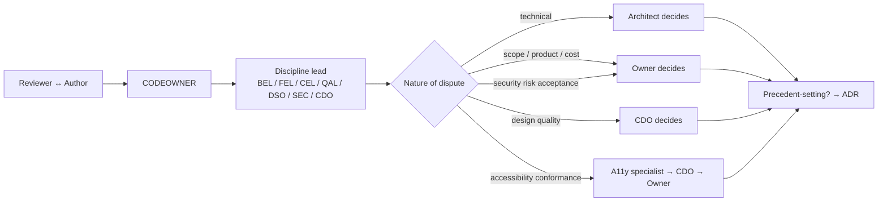

# 33 — RACI

Date: 2026-09-14 · Owner: basiltt · Status: **locked — authoritative for accountability on every deliverable and ceremony**
Companions: `01-sdlc-and-branching.md` (ceremonies, board, branching), `02-definition-of-ready-done.md`, `04-security-program.md`, `05-accessibility-standard.md`, `07-release-and-prr.md`, `30-release-roadmap.md`, `32-risk-register.md`, `CONSTITUTION.md` §8 (ownership) and §10 (review).

Scope reminder: web app only (React + custom WebGL engine + Electron shell), owner/admin screens inside the web app, no Android, no separate admin app, Bybit v5 USDT linear perpetuals only.

---

## 1. Notation and rules

| Letter | Meaning |
|---|---|
| **R** | Responsible — does the work. Multiple R's allowed. |
| **A** | Accountable — the one throat to choke; approves completion. **Exactly one A per row, always.** |
| **C** | Consulted — two-way input before the work is complete; their objection must be resolved or explicitly overruled by the A. |
| **I** | Informed — one-way notification after the fact. |
| *(blank)* | Not involved. |

**Rules**

1. Exactly one **A** per row. If two roles want to be A, the Architect assigns it; if the dispute is about scope or product, the Owner assigns it (`CONSTITUTION.md` C-10.9).
2. **A ≠ sole R is preferred** for anything safety-relevant: whoever writes the order-execution code should not be the only person approving it.
3. A **C** that is ignored is an escalation, not a matter of taste. Unresolved C objections block Done.
4. RACI is per *deliverable type*, not per ticket. A ticket inherits the row for its Kind and area.
5. Where a role is absent (PTO, vacancy), the A is delegated **in writing on the ticket** to a named person before work proceeds. Silent delegation is not permitted.

---

## 2. Roles

| Code | Role | Headcount | Core accountability |
|---|---|---|---|
| **OWN** | Owner / Product Owner (basiltt) | 1 | Product scope, priorities, acceptance, risk acceptance, live-enablement authorisation. Also the primary user. |
| **ARC** | Architect | 1 | System design, ADRs, module boundaries, cross-team tie-breaks, release-train integrity. Not sprint-capacity-committed. |
| **BEL** | Backend lead | 1 (+4 BE engineers) | Backend modules M1–M24, data pipeline, OMS, rule engine, API/WS contracts. |
| **FEL** | Frontend lead | 1 (+4 FE engineers incl. CEL) | React app, state, screens, Electron shell, frontend platform. |
| **CEL** | Chart-engine lead | 1 (within the FE group) | `packages/chart-engine`: rendering, frame budget, engine API, DOM-mirror layer. |
| **QAL** | QA lead | 1 (+1 SDET) | Test strategy, test plans, automation frameworks, QA sign-off, soak and chaos campaigns. |
| **DSO** | DevSecOps | 1 | CI/CD, environments, containers, observability, feature flags, backups, deploys, on-call tooling. |
| **SEC** | Security engineer | 1 | Threat models, scan triage, key handling, RBAC assurance, pen-test coordination, security sign-off. |
| **CDO** | Chief Design Officer | 1 | Design quality bar, design sign-off, design-ahead runway, design org direction. |
| **UXR** | UX research | 1 | Research plans, interviews, usability tests, personas, findings that change designs. |
| **PDS** | Product design | n | Screen and flow design, states, prototypes, handoff specs. |
| **DST** | Design-system team | n | Tokens, theming, motion, density, component library, Storybook, visual regression. |
| **A11Y** | Accessibility specialist | 1 | WCAG 2.2 AA conformance, screen-reader passes, a11y remediation designs, conformance report. |

---

## 3. RACI — governance & planning deliverables

| Deliverable | OWN | ARC | BEL | FEL | CEL | QAL | DSO | SEC | CDO | UXR | PDS | DST | A11Y |
|---|---|---|---|---|---|---|---|---|---|---|---|---|---|
| `CONSTITUTION.md` | **A** | R | C | C | C | C | C | C | C | I | I | I | C |
| `AGENTS.md` | I | **A** | R | R | C | C | C | C | I | | | | |
| `CONTRIBUTING.md`, `CODE_OF_CONDUCT.md` | **A** | R | C | C | | C | C | C | C | I | I | I | I |
| `SECURITY.md` & disclosure policy | **A** | C | C | | | | C | R | I | | | | |
| `.github/CODEOWNERS` | I | **A** | R | R | R | C | R | C | C | | | R | |
| PR & issue templates, board automation | I | **A** | C | C | | R | R | C | C | | | | C |
| `01-sdlc-and-branching.md` | C | **A** | C | C | C | R | R | C | C | | | | |
| `02-definition-of-ready-done.md` | C | **A** | C | C | C | R | C | C | C | | C | | C |
| `03-testing-strategy.md` | I | C | C | C | C | **A**/R | C | C | | | | | C |
| `04-security-program.md` | C | C | C | C | | C | R | **A**/R | | | | | |
| `05-accessibility-standard.md` | I | C | | C | C | C | | | C | C | C | R | **A**/R |
| `06-performance-and-load-standard.md` | I | **A** | R | C | R | R | C | | | | | | C |
| `07-release-and-prr.md` | C | **A** | C | C | | R | R | R | I | | | | |
| `30-release-roadmap.md` (this train plan) | **A** | R | C | C | C | C | C | C | C | I | I | I | I |
| `31-sprint-plan.md` | C | **A** | R | R | C | C | C | C | C | I | I | I | I |
| `32-risk-register.md` | C | **A** | R | R | R | R | R | R | C | I | I | I | C |
| `33-raci.md` (this doc) | **A** | R | C | C | C | C | C | C | C | I | C | I | C |
| Backlog JSON (`docs/plan/backlog/*.json`) | C | **A** | R | R | R | R | C | C | C | I | C | C | C |

---

## 4. RACI — product & UX deliverables

| Deliverable | OWN | ARC | BEL | FEL | CEL | QAL | DSO | SEC | CDO | UXR | PDS | DST | A11Y |
|---|---|---|---|---|---|---|---|---|---|---|---|---|---|
| `10-personas.md` | C | I | | I | | I | | | **A** | R | C | I | C |
| `11-user-stories.md` (INVEST + Gherkin AC) | **A** | C | C | C | C | R | | C | C | C | R | | C |
| `12-sitemap.md` | C | C | | C | | I | | C | **A** | C | R | C | C |
| `13-user-flows.md` | C | C | C | C | | C | | C | **A** | R | R | | C |
| `14-screens-catalogue.md` | C | I | C | C | C | C | | C | **A** | C | R | C | R |
| `15-component-catalogue.md` | I | C | | C | C | C | | | **A** | I | C | R | C |
| `16-design-system-brief.md` (tokens, theming, motion, density) | I | C | | C | C | | | | **A** | I | C | R | R |
| `17-ux-diagrams.md` | I | C | C | C | | I | | | **A** | R | R | | C |
| UX research plan & findings | C | I | | C | | C | | | **A** | R | C | I | C |
| Usability test sessions | C | | | I | | C | | | **A** | R | C | I | C |
| Screen design ticket (per screen) | C | I | C | C | C | C | | C | **A** | C | R | C | C |
| **Safety-critical screen design ticket** (order ticket, chart/DOM trading, bracket & native-SL UI, arm/lock + env badge, kill-switch UI, risk-cap & lockout dialogs, API-key entry/permission screens, live-mode confirmation patterns) | C | C | C | C | C | C | | **C** | **A** | **C** | R | C | C |
| **Usability test of a safety-critical flow** (R3/R4 — kill-switch activation under stress, mis-click resistance on the ticket, demo↔live mode discrimination) | C | I | C | C | | C | | **C** | **A** | **R** | C | I | C |
| **Error-prevention & confirmation copy for destructive/irreversible actions** (place/modify/cancel, flatten-all, kill-switch, key deletion) | C | C | C | C | | C | | **C** | **A** | **R** | R | C | C |
| Design-system component (new/changed) | I | I | | C | C | C | | | **A** | | C | R | C |
| Motion & density spec | I | | | C | C | | | | **A** | I | C | R | R |
| High-contrast / colour-blind themes | C | | | C | C | C | | | C | | C | R | **A** |
| Design→engineering handoff spec (`handoff`) | I | | C | R | C | C | | | **A** | | R | C | C |
| Design-QA pass (`design-qa`, built vs designed) | I | | | R | R | C | | | **A** | | R | C | C |
| Accessibility conformance report (VPAT-shaped) | I | C | | C | C | C | | C | C | | C | C | **A**/R |

> **Safety-critical design rule.** The three bolded rows above exist because *usability is a safety property* in this product. A kill-switch that is hard to find, a live/demo badge that is easy to misread, or an order ticket that invites a mis-click are execution-safety defects, not cosmetic ones. Therefore, on any design touching order placement, brackets/native SL, risk caps and lockouts, the kill-switch, API-key handling, or live-mode entry:
>
> 1. **UXR is Consulted, not merely Informed** — a real usability signal (moderated test, think-aloud, or at minimum a structured heuristic walkthrough against the error-prevention heuristics) must exist before the design ticket can be Done. An unresolved UXR objection blocks Done exactly like any other C (§1 rule 3).
> 2. **PDS remains Responsible and is Consulted on the engineering implementation** (§6 rows for OMS/M14 and risk/M17), so the built behaviour cannot quietly diverge from the designed safety affordances; divergence is caught in the design-QA pass (§4) and in the R3 design-QA sweep epic.
> 3. **SEC is Consulted on the design, not only on the code** — confirmation patterns, masking of key material, and mode discrimination are security-relevant UI decisions.
> 4. The A stays with **CDO** (design quality bar) and the *behavioural* accountability stays with the roles in §6/§7; this rule adds consultation obligations, it does not move accountability.
>
> Where a safety-critical flow cannot get a moderated usability session in time, the fallback is a recorded heuristic walkthrough by UXR + A11Y + QAL against the same checklist, attached to the ticket. "No research was available" is never an acceptable reason to mark such a design Done.

---

## 5. RACI — architecture & data deliverables

| Deliverable | OWN | ARC | BEL | FEL | CEL | QAL | DSO | SEC | CDO | UXR | PDS | DST | A11Y |
|---|---|---|---|---|---|---|---|---|---|---|---|---|---|
| `20-architecture.md` (C4 L1–L3) | C | **A**/R | R | R | C | C | C | C | I | | | | |
| `21-database-schema.md` (Postgres DDL, QuestDB, Parquet, ERD, retention) | I | **A** | R | | | C | C | C | | | | | |
| `22-api-openapi.yaml` (REST contract) | I | **A** | R | C | | R | | C | | | | | |
| `23-ws-protocol.md` (topics, snapshot+delta, binary framing) | I | **A** | R | C | R | R | | C | | | | | |
| `24-internal-schemas.md` (domain events, rule IR, OMS state machine, trade groups, profiles, adapter interface) | C | **A** | R | C | | C | | C | | | | | |
| `26-chart-engine-design.md` | I | C | | C | **A**/R | C | | | C | | C | C | R |
| ADRs (`27-adrs/ADR-nnnn`) | C | **A** | R | R | R | C | R | R | C | | | C | C |
| Module-boundary changes (`CONSTITUTION.md` §3) | I | **A** | R | R | C | | C | C | | | | | |
| Database migration (Alembic) | I | C | **A**/R | | | C | C | C | | | | | |
| Exchange adapter interface change | I | **A** | R | C | | C | | C | | | | | |
| Data-retention policy change | **A** | C | R | C | | C | R | C | | | | | |

---

## 6. RACI — engineering work by area

| Deliverable / work type | OWN | ARC | BEL | FEL | CEL | QAL | DSO | SEC | CDO | UXR | PDS | DST | A11Y |
|---|---|---|---|---|---|---|---|---|---|---|---|---|---|
| Backend Story/Task (ingestion, book, bars, storage) | I | C | **A**/R | | | R | C | C | | | | | |
| Order-flow computation engines (M9) | I | C | **A**/R | C | C | R | | | | | | | |
| OMS / execution (M14) | C | C | **A**/R | C | | R | | R | C | C | C | | C |
| Risk, caps & kill-switch (M17) | **A** | C | R | C | | R | C | R | C | C | C | | C |
| Rule engine IR, compiler, runtime (M15) | C | C | **A**/R | C | | R | | C | | | | | |
| Auth, RBAC, audit (M18, M19) | C | C | R | C | | R | C | **A** | | | | | |
| Secrets & key vault (M2) | C | C | R | | | C | C | **A** | | | | | |
| Admin API & screens (M21) | C | C | R | R | | R | C | **A** | C | | C | | C |
| Chart-engine package | I | C | | C | **A**/R | R | | | C | | C | C | R |
| Charting UI / order-flow UI | I | | C | **A**/R | R | R | | | C | | C | C | C |
| Rule editors (form + node graph) | C | C | C | **A**/R | | R | | C | C | C | C | C | R |
| Electron shell & packaging | I | C | | **A**/R | C | R | R | R | | | | | |
| Frontend platform (state, routing, protocol pkg) | I | C | C | **A**/R | C | C | | C | | | | | |
| Design-system code (tokens → components) | I | | | C | C | C | | | C | | C | **A**/R | R |
| CI/CD pipeline & required checks | I | C | C | C | | R | **A**/R | C | | | | | |
| Observability (logs, metrics, dashboards, alerts) | I | C | R | C | C | C | **A**/R | C | | | | | |
| Feature-flag service & flag lifecycle | C | C | R | R | | C | **A** | C | | | | | |
| Infrastructure (compose, VPS, Tailscale, backups) | C | C | C | | | | **A**/R | R | | | | | |
| Spike (any) | C | **A** | R | R | R | C | C | C | C | C | C | C | C |
| Bug fix | I | | R | R | R | **A** | C | C | | | | | C |
| Chore / dependency bump | I | | R | R | | C | **A** | C | | | | | |
| Hotfix to a release branch | C | **A** | R | R | R | R | R | C | | | | | |

---

## 7. RACI — quality, security & accessibility activities

| Activity | OWN | ARC | BEL | FEL | CEL | QAL | DSO | SEC | CDO | UXR | PDS | DST | A11Y |
|---|---|---|---|---|---|---|---|---|---|---|---|---|---|
| Black-box test plan per feature | I | | C | C | C | **A**/R | | C | | | | | C |
| White-box review per feature | I | C | R | R | R | **A** | | C | | | | | |
| Unit tests + coverage floors | I | | R | R | R | **A** | C | | | | | | |
| Contract tests (OpenAPI/WS) | I | C | R | C | | **A**/R | C | | | | | | |
| Integration tests on recorded Bybit fixtures | I | | R | C | | **A**/R | | | | | | | |
| Golden-fixture order-flow correctness suite | I | C | R | C | R | **A**/R | | | | | | | |
| E2E suites (Playwright web + Electron) | I | | C | R | C | **A**/R | C | | | | | | C |
| Safety-invariant suite (native SL, kill-switch, risk caps) | C | C | R | C | | R | | **A** | C | C | C | | C |
| Determinism suites (replay, detectors, rule runtime) | I | C | R | | R | **A**/R | | | | | | | |
| Load & performance tests (k6/Locust) | I | C | R | C | R | **A**/R | R | | | | | | |
| Engine FPS benchmark | I | C | | C | **A**/R | R | C | | | | | | C |
| Ingestion soak tests | I | C | R | | | **A** | R | | | | | | |
| Chaos / failover tests | I | C | R | C | | R | R | **A** | | | | | |
| STRIDE threat model per epic | I | C | R | R | R | C | C | **A**/R | | | | | |
| SAST/SCA/secrets/DAST/container triage | I | I | C | C | | C | R | **A**/R | | | | | |
| Penetration test (R4) | C | C | C | C | | C | C | **A**/R | | | | | |
| Pen-test remediation | I | C | R | R | R | R | R | **A** | | | | | |
| Key-permission audit (R4 and periodic) | C | | R | | | | C | **A**/R | | | | | |
| Kill-switch test | **A** | C | R | C | | R | R | R | C | **C** | C | | C |
| Safety-critical flow usability validation (pre-Done, R3/R4 designs) | C | C | C | C | | C | | C | **A** | R | R | I | C |
| Axe-core CI gate | I | | | R | R | R | C | | | | | R | **A** |
| Manual screen-reader pass | I | | | C | C | C | | | C | | C | C | **A**/R |
| A11y remediation | I | | C | R | R | C | | | C | | R | R | **A** |
| QA sign-off (ticket → Done) | I | | | | | **A**/R | | | | | | | |
| Security sign-off (`security`-labelled) | I | C | | | | | | **A**/R | | | | | |
| Design sign-off (design ticket → Done) | I | | | | | | | | **A**/R | C | R | C | C |
| Accepted-risk decision | **A** | C | C | C | | C | C | R | | | | | C |

---

## 8. RACI — release & operations

| Activity | OWN | ARC | BEL | FEL | CEL | QAL | DSO | SEC | CDO | UXR | PDS | DST | A11Y |
|---|---|---|---|---|---|---|---|---|---|---|---|---|---|
| Release-train scope decision | **A** | R | C | C | C | C | C | C | C | | | | |
| Release branch cut (`release/<semver>`) | I | **A** | C | C | | C | R | | | | | | |
| Changelog accuracy | I | C | R | R | R | C | **A** | | | | | | |
| Staging soak monitoring | I | C | R | R | | R | **A** | C | | | | | |
| PRR ceremony & go/no-go | C | **A**/R | C | C | C | R | R | R | | | | | |
| **Live-enablement gate (R4)** | **A** | R | C | C | | R | R | R | | | | | |
| Production deploy | I | C | C | C | | C | **A**/R | C | | | | | |
| Feature-flag rollout/ramp decision | **A** | C | R | R | | C | R | C | | | | | |
| Rollback execution | I | C | R | R | | C | **A**/R | I | | | | | |
| Backup schedule & restore drill | I | C | R | | | C | **A**/R | C | | | | | |
| Disaster-recovery playbook & RTO/RPO | C | **A** | R | | | C | R | C | | | | | |
| Runbook authoring & rehearsal | I | C | R | R | | C | **A** | C | | | | | |
| On-call rotation & escalation path | **A** | C | R | R | | C | R | C | | | | | |
| Incident command (P0/P1) | I | C | R | R | R | R | **A** | R | | | | | |
| Post-incident review & register update | C | **A** | R | R | R | R | R | R | | | | | |
| Post-release monitoring window | I | C | R | R | | C | **A** | C | | | | | |
| GA declaration | **A** | R | C | C | C | R | R | R | C | | | | C |

---

## 9. RACI — ceremonies

Ceremony definitions, cadence and duration are in `01-sdlc-and-branching.md` §3. Here, **A** means "accountable for the ceremony producing its output", not "chairs the meeting".

| Ceremony | Cadence | OWN | ARC | BEL | FEL | CEL | QAL | DSO | SEC | CDO | UXR | PDS | DST | A11Y |
|---|---|---|---|---|---|---|---|---|---|---|---|---|---|---|
| Sprint Planning | Day 1, 09:00 | C | **A** | R | R | R | R | R | R | C | I | I | I | I |
| Daily Standup (per sub-team) | Daily 09:30 | I | C | **A** (BE) | **A** (FE) | R | **A** (QA) | R | R | | | | | |
| Backlog Refinement | 2×/sprint | C | **A** | R | R | R | R | C | C | C | C | C | C | C |
| Design Review | Weekly Wed | C | I | | R | C | C | | | **A** | C | R | R | R |
| Security Review (per-epic + biweekly) | Per epic + Thu wk2 | I | R | R | R | C | C | R | **A** | | | | | |
| Architecture / ADR review | Ad hoc | C | **A** | R | R | R | C | R | R | C | | | | |
| Performance review (budget walkthrough) | Per train | I | **A** | R | R | R | R | R | | | | | | C |
| Accessibility review | Per train + per new screen | I | C | | R | R | C | | | C | | R | R | **A** |
| UX research readout | Per study | C | I | I | C | | C | | | **A** | R | R | I | C |
| PRR | Per train gate | C | **A** | C | C | C | R | R | R | I | | | | |
| Live-enablement gate review | R4 + OMS-touching releases | **A** | R | R | C | | R | R | R | C | C | C | | C |
| Sprint Review / Demo | Last day | **A** | C | R | R | R | R | C | C | C | C | C | C | C |
| Retro | Last day | C | R | R | R | R | R | R | R | **A** *(co-facilitated; rotates)* | C | C | C | C |
| Risk-register review | Retro + train boundary | C | **A** | R | R | R | R | R | R | C | | | | C |
| Release readiness stand-down | Per train | C | **A** | R | R | R | R | R | R | C | | | | C |
| Incident post-mortem | Per P0/P1 | C | **A** | R | R | R | R | R | R | I | | | | |

> **Standup note** — the Daily Standup is the one deliberate exception to the single-**A** rule, because it is three separate meetings (backend, frontend, QA) running in parallel per `01-sdlc-and-branching.md` §3. Each of the three has exactly one A: BEL, FEL and QAL respectively.

> **Retro note** — the retro's **A** rotates among CDO, Architect and QA lead across sprints so no single discipline frames every retrospective. The rotation is recorded in `31-sprint-plan.md`.

---

## 10. Decision rights (who decides what, when people disagree)

| Decision | Decider | Escalation path | Recorded as |
|---|---|---|---|
| Product scope, priority, what ships in which train | **OWN** | — | Roadmap amendment + board |
| Technical design, module boundaries, technology choice | **ARC** | ARC → OWN (only if scope/cost changes) | ADR |
| Chart-engine internal design and API | **CEL** | CEL → ARC | ADR / `26-chart-engine-design.md` |
| Backend module internals | **BEL** | BEL → ARC | PR + ADR if precedent-setting |
| Frontend architecture, state model | **FEL** | FEL → ARC | ADR |
| Whether a ticket is Done | **QAL** | QAL → ARC → OWN | Board status |
| Whether design is Done | **CDO** | CDO → OWN | Design ticket status |
| Whether a security finding blocks release | **SEC** | SEC → OWN (risk acceptance only) | Risk register entry with expiry |
| Whether an a11y failure blocks release | **A11Y** | A11Y → CDO → OWN | Conformance report + exception |
| Whether a performance budget is met | **ARC** (evidence from CEL/BEL/QAL) | ARC → OWN | Benchmark artifact on the ticket |
| Go/no-go at PRR | **ARC** (consensus of ARC/DSO/SEC/QAL; any one may veto) | → OWN | PRR record |
| **Live-enablement authorisation** | **OWN** (written) | — cannot be delegated | Written sign-off on the release ticket |
| Emergency kill-switch activation | **Any of OWN, ARC, BEL, DSO, SEC** — anyone who believes it is needed | Post-hoc review | Audit log + incident note |
| Rollback invocation | **DSO** (in-incident), OWN informed | → ARC | Incident note |
| Accepting a risk | **OWN** (written, dated expiry) | — | Risk register |
| Adding a dependency | Code-owner of the path | → ARC (licence: → ARC + SEC) | PR approval |
| Waiving a quality gate | **Nobody.** Gates are not waivable; scope is cut instead (`30-release-roadmap.md` §12). The gates meant are, exactly: the release checklist in `07-release-and-prr.md` §4 (§4.1 pre-cut, §4.2 cut & soak, §4.3 PRR gate, §4.4 cut to prod), the PRR checklist §5.1–§5.6 (observability, runbooks, backups & restore drill, capacity, security sign-off, rollback rehearsal), the Live-enablement gate §6, and the per-train quality gates in `30-release-roadmap.md` §4.4/§5.4/§6.4/§7.4/§8.4/§9.4. | — | — |

> The last row is deliberate. Every gate in this project exists because failing it costs money, data, or trust. If a train cannot pass its gates, the correct action is to remove scope, not to remove the gate.

### 10.1 Gate traceability — what "not waivable" covers

So that "nobody waives a gate" is auditable rather than rhetorical, each gate below is named with its defining section and the role accountable for declaring it met. None of these roles may waive their own gate; they may only declare it met or not met, and "not met" means scope is cut or the date moves.

| Gate | Defined in | Declared met by (A) | Vetoes available to |
|---|---|---|---|
| Pre-cut checks on `main` | `07-release-and-prr.md` §4.1 | DSO | QAL, SEC |
| Release branch cut & staging soak | `07-release-and-prr.md` §4.2 | DSO (soak monitoring), ARC (cut) | QAL |
| PRR go/no-go | `07-release-and-prr.md` §4.3, §5 | ARC | DSO, SEC, QAL — any one may veto |
| Observability readiness | `07-release-and-prr.md` §5.1 | DSO | ARC |
| Runbooks present & rehearsed | `07-release-and-prr.md` §5.2 | DSO | ARC, QAL |
| Backups & restore drill | `07-release-and-prr.md` §5.3 | DSO | ARC, SEC |
| Capacity headroom | `07-release-and-prr.md` §5.4 | ARC (evidence from BEL/CEL/QAL) | QAL |
| Security sign-off | `07-release-and-prr.md` §5.5 | SEC | OWN (risk acceptance only, written, dated expiry) |
| Rollback rehearsal | `07-release-and-prr.md` §5.6 | DSO | ARC |
| **Live-enablement gate** | `07-release-and-prr.md` §6 | **OWN** (written, non-delegable) | SEC, QAL, ARC — any one may block |
| Cut to production | `07-release-and-prr.md` §4.4 | DSO | ARC, OWN |
| Per-train quality gates R0–R5 | `30-release-roadmap.md` §4.4, §5.4, §6.4, §7.4, §8.4, §9.4 | ARC, with QAL for test gates, SEC for security gates, A11Y for a11y gates | the respective discipline lead |
| Ticket-level Done gate | `02-definition-of-ready-done.md` | QAL | ARC |
| Design Done gate | `02-definition-of-ready-done.md`, §7 above | CDO | OWN |
| A11y conformance gate | `05-accessibility-standard.md` | A11Y | CDO → OWN |

The only lawful escape hatch anywhere in this table is a **written, dated, expiring risk acceptance by the Owner** recorded in `32-risk-register.md` (§10 of that document, and `07-release-and-prr.md` §5.5). It accepts a *risk*; it never marks an unmet gate as met, and it is re-decided at expiry rather than silently extended.

---

## 11. Escalation ladder

Service levels: first review response within 1 working day; re-review within 4 working hours of a push; an escalation to a lead is answered within 1 working day; an escalation to the Architect or Owner is answered within 2 working days. A blocked ticket requires a daily standup update from its owner for as long as it stays blocked.

---

## 12. Coverage check

Every deliverable type named in `00-planning-brief.md` §24–29 and every ceremony in `01-sdlc-and-branching.md` §3 appears in exactly one row above with exactly one **A**.

| Area | Rows | Section |
|---|---|---|
| Governance & planning | 18 | §3 |
| Product & UX | 20 | §4 |
| Architecture & data | 11 | §5 |
| Engineering by area | 22 | §6 |
| Quality, security & a11y | 27 | §7 |
| Release & operations | 17 | §8 |
| Ceremonies | 16 | §9 |
| **Total RACI rows** | **131** | |
| Decision rights (not RACI rows) | 18 | §10 |
| Gate traceability entries (not RACI rows) | 15 | §10.1 |

Accountability distribution — count of rows where each role is **A** (133 assignments across 131 rows; the Daily Standup row carries three, one per parallel sub-team standup):

| Role | A rows | Role | A rows |
|---|---|---|---|
| ARC Architect | 32 | SEC Security engineer | 13 |
| CDO Chief Design Officer | 22 | DSO DevSecOps | 13 |
| OWN Owner / PO | 17 | A11Y Accessibility specialist | 7 |
| QAL QA lead | 14 | BEL Backend lead | 6 |
| FEL Frontend lead | 5 | CEL Chart-engine lead | 3 |
| DST Design-system team | 1 | UXR UX research · PDS Product design | 0 |

Two distributions deserve comment rather than silent acceptance:

- **ARC at 32** is high. This is intentional for a plan-heavy phase (architecture docs, ADRs, PRR go/no-go, roadmap integrity) and the Architect carries **0 sprint points** by design so the accountability load is the job. It should be re-reviewed at the R2 boundary; if ARC becomes a bottleneck, discipline leads absorb rows from §5 and §6.
- **UXR and PDS hold no A rows** by design: their outputs are accountable to the CDO, who owns the design quality bar and the sign-off gate. This keeps design accountability singular while leaving research and product design fully Responsible for the work itself. It deliberately does **not** mean they are peripheral to safety: UXR is **Consulted on every safety-critical design row** in §4 (order ticket, chart/DOM trading, bracket & native-SL UI, arm/lock and env badge, kill-switch UI, risk-cap and lockout dialogs, API-key screens, live-mode confirmation copy), on the safety-critical usability rows in §4 and §7, on the **kill-switch test** in §7, and on **OMS (M14)** and **risk/caps/kill-switch (M17)** implementation in §6. PDS is Consulted on the same engineering rows so built behaviour cannot drift from the designed safety affordances. An unresolved UXR objection on any of these rows blocks Done (§1 rule 3) — the usability of a kill-switch is a safety property, and the register treats it as one.
- **BEL/FEL/CEL look low relative to the volume of engineering work** because per-ticket accountability is delegated by area (§1 rule 4): a single row covers hundreds of tickets. Their real load is Responsible, not Accountable.

### 12.1 UXR / PDS involvement on safety-critical work — explicit index

Because "no A rows" is easy to misread as "not involved", this is the complete list of rows where UXR and/or PDS must be consulted on execution-safety-adjacent work. A ticket in any of these classes that reaches Done without a recorded UXR/PDS consultation is a process defect, raised at the retro and logged against `32-risk-register.md` RSK-049 / RSK-016 as appropriate.

| Row | Section | UXR | PDS | Evidence required on the ticket |
|---|---|---|---|---|
| Safety-critical screen design ticket | §4 | C | R | Heuristic walkthrough or usability session notes; error-prevention checklist |
| Usability test of a safety-critical flow | §4 | R | C | Session recording/notes, findings, design changes made |
| Error-prevention & confirmation copy for destructive actions | §4 | R | R | Copy deck reviewed by UXR + SEC; mis-click scenarios enumerated |
| OMS / execution (M14) | §6 | C | C | Design-QA comparison of built vs designed affordances |
| Risk, caps & kill-switch (M17) | §6 | C | C | Design-QA comparison + kill-switch discoverability check |
| Safety-invariant suite | §7 | C | C | UI-level assertions match designed affordances (badge, arm state, confirm) |
| Kill-switch test | §7 | C | C | Time-to-activate measured with a naive operator, not only the author |
| Safety-critical flow usability validation | §7 | R | R | Pass/fail against the pre-agreed error-prevention criteria |
| Design Review (weekly) | §9 | C | R | Standing agenda item whenever an R3/R4 safety screen is on the board |
| Live-enablement gate review | §9 | C | C | Confirmation that safety-flow usability findings are closed, not deferred |

