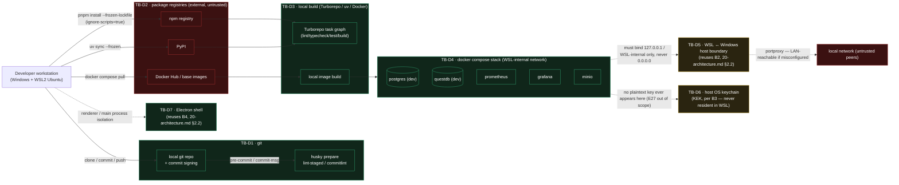

# E02 — STRIDE threat model: monorepo supply chain and local dev stack

Version 1.0 · 2026-09-27 · Document owner: Security engineer · Co-owner: DevSecOps · Approver: basiltt (Owner)
Status: **R0 gate evidence** — required by `docs/plan/30-release-roadmap.md` §4.4 and scheduled per
`docs/plan/02-definition-of-ready-done.md` §2.1. Classification: **Internal/Confidential** — not published
in release notes (`docs/plan/07-release-and-prr.md` §3).

This document is a zoom-in on the **creation** of trust boundary **TB-8** ("Upstream packages/CI →
runtime") from `docs/plan/04-security-program.md` §4, and extends boundaries **B2 (host↔WSL)** and
**B4 (renderer↔Electron main)** from `docs/plan/20-architecture.md` §2.2 down to where the supply chain
and the local dev stack are actually assembled: the developer workstation, git, package registries,
lockfiles, the Turbo/uv/Docker build, and the docker-compose stack (postgres, questdb, prometheus,
grafana, minio). It reuses `04-security-program.md`'s rating scale and column conventions, and it is the
scaffold-level precursor that `docs/plan/threat-models/E03-supply-chain.md` (the CI/CD-pipeline zoom-in)
builds on — this model stops where E03's TB-8a/TB-8c (GitHub Actions runners, signed release artefact)
begin, per the ticket's out-of-scope list.

## 1. Scope

In scope: developer workstation → git → package registries (npm, PyPI) → lockfiles (`pnpm-lock.yaml`,
`uv.lock`) → local build (Turborepo task graph, `uv`, Docker images for the compose stack) → the local
docker-compose stack (postgres, questdb, prometheus, grafana, minio) → the WSL/Windows host boundary
those services are exposed across.

Out of scope (per the ticket): the application's runtime threats (exchange boundary is E08; auth/RBAC is
E09; key vault is E27); implementing the scanners (E02-X02/E03 — this model specifies what they must
cover); pen-testing (R4, E43); the GitHub Actions CI/CD pipeline itself and the signed release artefact
(`docs/plan/threat-models/E03-supply-chain.md`, TB-8a/TB-8c).

## 2. Data-flow diagram

**Text description (accessibility, `docs/plan/05-accessibility-standard.md`):** a developer works on a
Windows host running WSL2 Ubuntu. Commits go through local git, gated by husky lifecycle hooks
(lint-staged, commitlint). Installing dependencies pulls from external, untrusted registries — npm,
PyPI, and Docker base images — with `pnpm install --frozen-lockfile` and `ignore-scripts=true` as the
first line of defence. A local Turborepo task graph (lint/typecheck/test/build) and a local Docker image
build consume those dependencies and produce the local docker-compose stack: postgres, questdb,
prometheus, grafana and minio, all on a WSL-internal compose network. That stack must bind loopback/
WSL-internal only — never `0.0.0.0` — at the WSL↔Windows host boundary (reusing architecture boundary
B2), because a portproxy misconfiguration would make a dev database reachable from the local network. The
host OS keychain holding the real KEK (boundary B3) is drawn as a boundary the dev stack must never touch
even in principle. The Electron shell boundary (B4, renderer↔main isolation) is included because E02
scaffolds the Electron app shell that the dev stack runs inside.

## 3. Trust boundaries anchored to `04-security-program.md` / `20-architecture.md`

| ID (this doc) | Anchor | Elements |
|---|---|---|
| TB-D1 | new, feeds TB-9 (`04-security-program.md`) | Local git repo, commit signing, husky lifecycle hooks |
| TB-D2 | TB-8 (`04-security-program.md`), AC-11 | npm registry, PyPI, Docker base images — external, untrusted |
| TB-D3 | TB-8 | Turborepo task graph, local `uv`/Docker build |
| TB-D4 | new, feeds B2 | docker-compose stack: postgres, questdb, prometheus, grafana, minio (dev only) |
| TB-D5 | B2 (`20-architecture.md` §2.2) | WSL ↔ Windows host boundary; loopback/WSL-internal binding requirement |
| TB-D6 | B3 (`20-architecture.md` §2.2) | Host OS keychain (KEK) — dev stack must never be a place a real key can appear |
| TB-D7 | B4 (`20-architecture.md` §2.2) | Electron renderer ↔ main process isolation |

## 4. STRIDE enumeration

Method and risk scale identical to `04-security-program.md` §5: `L`/`I` in {L, M, H}, Risk = L×I mapped
to Low/Medium/High/Critical, one row per threat. Columns: `T` = threat id, STRIDE, threat, L, I, Risk,
control, owning ticket, residual risk/decision. A row missing the ticket column blocks sign-off
(acceptance criterion 1/2).

### 4.1 Element — Local git + husky lifecycle hooks (TB-D1)

| T | STRIDE | Threat | L | I | Risk | Control | Ticket | Residual |
|---|--------|--------|---|---|------|---------|--------|----------|
| G1 | Spoofing | Forged commit identity/author (unsigned commits impersonate another contributor) | M | M | Medium | Conventional-commit + author policy; branch protection requires PR review regardless of author (TB-9, `04-security-program.md` §5.12); commit signing recommended, not yet enforced at E02 | E02-T07 (hooks scaffold); enforcement of signature verification deferred to E03 | **Accepted for R0** — owner sign-off §5, row A1 |
| G2 | Tampering | The husky `prepare` lifecycle script itself is a deliberate exception to `ignore-scripts=true` and could be tampered with to run arbitrary code on every `pnpm install` | L | H | Medium | `prepare` script content reviewed at every PR touching `.husky/`; script is minimal (installs git hooks only, no network, no dynamic code); CODEOWNER review required on `package.json`/`.husky/` changes | E02-T07 | Low — documented exception, see §6 |
| G3 | Tampering | `lint-staged`/`commitlint` config tampered to silently skip checks (e.g. matcher glob narrowed to exclude changed files) | L | M | Low | Config reviewed in PR diff like any other source file; `E02-Q03` regression pack asserts the hook actually blocks a bad commit | E02-T07 / E02-Q03 | Low |
| G4 | Repudiation | No record that a commit passed local hooks before reaching CI (a bypass via `--no-verify` leaves no trace) | L | L | Low | CI re-runs the same lint/format/commitlint checks server-side (`AGENTS.md` §4) — local hooks are a fast-fail convenience, never the enforcement point | E02-T07 / E03 (CI gate) | Low |
| G5 | Information disclosure | N/A for this element — hooks operate on already-local, already-committed-or-staged content; no new disclosure surface | — | — | N/A | Reason: covered by TB-D2/TB-D4 rows for actual secret-egress paths | — | — |
| G6 | Denial of service | A misbehaving hook (infinite loop, hangs on large diff) blocks every commit | L | L | Low | Hooks scoped to changed files only (`lint-staged`); `E02-Q03` includes a timeout assertion | E02-T07 / E02-Q03 | Low |
| G7 | Elevation of privilege | N/A — hooks run with the developer's own local privilege, no privilege boundary crossed | — | — | N/A | Reason: no separate EoP path at this element beyond G2 (Tampering), which is the actual attack surface | — | — |

### 4.2 Element — Package registries (npm, PyPI, Docker base images) — external, untrusted (TB-D2)

| T | STRIDE | Threat | L | I | Risk | Control | Ticket | Residual |
|---|--------|--------|---|---|------|---------|--------|----------|
| R1 | Spoofing | Registry account takeover / typosquat impersonation of a legitimate package name | M | H | **High** | `.npmrc` `save-exact=true` pins exact versions; `frozen-lockfile=true` refuses drift; new-dependency PRs require CODEOWNER approval + licence check (E03 formalises the scanning job) | E02-T01 (`.npmrc` policy) / E02-X02 (scanning spec) / E03 (Dependabot, SCA) | Low |
| R2 | Tampering | Lockfile tampering — a PR modifies `pnpm-lock.yaml` or `uv.lock` to point a dependency at a different resolved hash without a corresponding, reviewed `package.json`/`pyproject.toml` change | M | H | **High** | `frozen-lockfile=true` / `uv sync --frozen` refuse install on any drift; lockfile diffs are visible in PR review like any other source file; `E02-Q03` regression pack includes a fixture asserting a mismatched lockfile fails install | E02-T01 / E02-Q03 | Low |
| R3 | Tampering | A malicious or compromised transitive dependency runs a `postinstall`/`preinstall`/`install` lifecycle script that exfiltrates secrets (e.g. `~/.ssh`, environment) | M | H | **High** | `ignore-scripts=true` in `.npmrc` blocks arbitrary postinstall code execution by default (already committed, E02-T01); any genuine need for a script requires an explicit, reviewed `pnpm.onlyBuiltDependencies` allowlist entry — none allowlisted yet | E02-T01 | Low |
| R4 | Tampering | Mutable base-image tag substitution — a compose service references a floating tag (`postgres:latest`) that changes underneath the pinned compose file between pulls | L | H | Medium | Compose file pins base images by explicit version tag (not `latest`); digest pinning + Trivy scanning formalised in E03/E02-X02 | E02-T08 (compose authoring) / E02-X02 (scan spec) | Medium — **accepted for R0**, see §5 (digest pinning + Trivy deferred to E03) |
| R5 | Repudiation | No record of which exact dependency versions were installed for a given local dev session, obscuring incident review if a compromised package is later disclosed | L | L | Low | Lockfiles are committed and versioned in git — the historical record already exists per-commit; no additional tooling needed at E02 | E02-T01 | Low |
| R6 | Information disclosure | N/A for this element — registries are read-only inputs; disclosure risk is modelled at TB-D4 (fixtures/`.env`) instead | — | — | N/A | Reason: covered by I1/I2 below at the same conceptual boundary | — | — |
| R7 | Denial of service | Dependency-confusion or registry outage blocks every local `pnpm install`/`uv sync`, stalling onboarding | M | M | Medium | `frozen-lockfile` + a committed lockfile means CI/dev can retry without re-resolving; registry mirroring/caching is deferred (mirrors E03's equivalent accepted risk for CI) | E02-T01 | Medium — **accepted for R0**, tracked with E03's registry-availability residual |
| R8 | Elevation of privilege | N/A for this element — no code from a registry executes with elevated privilege beyond the install step already modelled in R3 | — | — | N/A | Reason: covered by R3 (Tampering) | — | — |

### 4.3 Element — Local build (Turborepo task graph, `uv`, Docker image build) (TB-D3)

| T | STRIDE | Threat | L | I | Risk | Control | Ticket | Residual |
|---|--------|--------|---|---|------|---------|--------|----------|
| B1 | Tampering | `turbo.json` task graph tampered to skip a security-relevant task (e.g. `lint`/`typecheck`) while still reporting success | L | M | Low | Task graph reviewed like any source file; CI (E03) re-runs the canonical command set independent of local Turbo cache | E02-T01 / E03 | Low |
| B2 | Tampering | Turborepo remote/local cache poisoned with a stale or malicious build artefact reused across machines | L | M | Low | Cache scope limited to the local workspace at E02 (no shared remote cache configured yet); if a remote cache is added later it requires its own ADR + signing note | E02-T01 | Low — **accepted for R0** (no remote cache exists yet, so no additional control is due) |
| B3 | Denial of service | An oversized generated build artefact or an unbounded local Docker image fills the dev disk during a soak/rebuild loop | M | M | Medium | Compose stack and image build documented with expected disk footprint; `E02-Q03` regression pack includes a disk-growth assertion for repeated rebuilds | E02-T08 / E02-Q03 | Low |
| B4 | Elevation of privilege | Local Docker image build runs as root inside the resulting container image, widening the blast radius of any container escape | M | H | **High** | Dockerfiles for the compose stack's own services set a non-root `USER`; base images already ship non-root defaults where available (postgres/questdb do not run app code as root by design) | E02-T08 | Low |
| B5 | Spoofing / Repudiation / Information disclosure | N/A for this element — the local build step does not itself accept external input or hold secrets beyond what's already modelled in TB-D2/TB-D4 | — | — | N/A | Reason: covered by R1-R3 (registries) and I1-I3 (compose stack) | — | — |

### 4.4 Element — docker-compose dev stack (postgres, questdb, prometheus, grafana, minio) (TB-D4)

| T | STRIDE | Threat | L | I | Risk | Control | Ticket | Residual |
|---|--------|--------|---|---|------|---------|--------|----------|
| I1 | Information disclosure | A real credential (e.g. a Bybit demo API key) is committed into a `.env` file or a recorded fixture, and later published | M | H | **High** | Default credentials in the compose stack are `CHANGE_ME`; bootstrap **refuses to start** if `CHANGE_ME` values remain outside an explicit dev profile; `.env` is gitignored with `.env.example` committed instead; `packages/fixtures` requires redaction before any fixture is committed (C-13.5) | E02-T08 (bootstrap refusal) / E02-T03 (fixtures redaction requirement) | Low |
| I2 | Information disclosure | Secrets committed to git history (API keys, tokens) survive even after later removal from the working tree | L | H | Medium | `gitleaks protect --staged --redact` pre-push (per `50-security.md`); full-history gitleaks scan formalised as a CI job in E02-X02/E03 | E02-X02 | Medium — **accepted for R0** (full-history nightly scan is E03 scope; pre-push hook is the E02-level control) |
| I3 | Information disclosure | A dev service (postgres, questdb, grafana, minio) is bound to `0.0.0.0` and reachable from the LAN via WSL portproxy, exposing dev data (never production data, but still a lateral-movement/foothold risk) | M | H | **High** | Compose stack binds every service to `127.0.0.1`/WSL-internal only, never `0.0.0.0`; automated loopback-binding assertion at stack startup | E02-T08 (binding) / E02-Q03 (regression assertion) | Low — this is the abuse case named explicitly in the ticket's acceptance criteria (§7) |
| I4 | Tampering | Grafana/minio ship with default admin credentials that, combined with I3, would let a LAN peer both reach and authenticate to the dev stack | M | M | Medium | Same `CHANGE_ME`-refusal control as I1 applies uniformly across every service's default credential, not just datastores | E02-T08 | Low |
| I5 | Denial of service | Prometheus/QuestDB retention grows unbounded during a long dev/soak session, filling disk (also see B3) | M | M | Medium | Compose file sets bounded retention/volume size for dev profiles; `E02-Q03` disk-growth assertion covers this jointly with B3 | E02-T08 / E02-Q03 | Low |
| I6 | Spoofing | N/A for this element at the compose-network layer — no cross-service impersonation surface exists inside a single-developer WSL-internal compose network | — | — | N/A | Reason: single-tenant local network, no multi-party authentication boundary crossed here | — | — |
| I7 | Repudiation | N/A for this element — dev-stack logs are ephemeral and local; no audit-log invariant applies to non-production data (C-2.9 governs production audit only) | — | — | N/A | Reason: out of scope by design — no production data ever flows through this stack | — | — |
| I8 | Elevation of privilege | Compose services run as root inside their containers by default image behaviour, widening blast radius if a container is compromised via a supply-chain hit (R3/R4) | M | H | **High** | Where an image supports it, compose config sets a non-root user / `security_opt: no-new-privileges`; no docker-socket mount into any dev-stack container | E02-T08 | Low |

### 4.5 Element — WSL ↔ Windows host boundary (TB-D5) and host OS keychain (TB-D6)

| T | STRIDE | Threat | L | I | Risk | Control | Ticket | Residual |
|---|--------|--------|---|---|------|---------|--------|----------|
| H1 | Information disclosure | A WSL portproxy rule forwards a compose-stack port to a Windows interface reachable from the LAN (the same underlying condition as I3, viewed from the host side) | M | H | **High** | No portproxy rules are configured for dev-stack ports; the automated loopback-binding assertion (E02-Q03) checks from both the WSL and Windows-host vantage points | E02-T08 / E02-Q03 | Low |
| H2 | Elevation of privilege | A container escape inside the WSL compose network reaches the Windows host filesystem via a misconfigured bind mount | L | H | Medium | Compose bind mounts scoped to the repo checkout only; no mount of Windows system paths or the docker socket | E02-T08 | Low |
| H3 | Information disclosure | A real Bybit API key or its KEK ends up resident in WSL (violating B3's "KEK never in WSL" invariant) because a developer pastes a real credential into a dev `.env` "just to test" | L | H | Medium | Structural prevention, not just discouragement (per the ticket's Security notes): `CHANGE_ME` refusal (I1) makes the dev stack non-functional with a real-looking credential in the default profile; the KEK/secrets module itself is out of scope for E02 (lives in E27) and is never wired into the dev compose stack | E02-T08 | Low — this is the exact scenario the ticket's Security notes call out |
| H4 | Spoofing / Tampering / Repudiation / Denial of service | N/A for this boundary beyond H1/H2 — the host↔WSL boundary is a network/filesystem boundary, not an identity or availability surface distinct from what's already modelled | — | — | N/A | Reason: covered by H1 (disclosure) and H2 (EoP) | — | — |

### 4.6 Element — Electron shell scaffold (TB-D7)

| T | STRIDE | Threat | L | I | Risk | Control | Ticket | Residual |
|---|--------|--------|---|---|------|---------|--------|----------|
| E1 | Elevation of privilege | Renderer process escalates to Node/main-process privilege via a disabled `contextIsolation` or an over-broad preload API, during the E02 scaffold before hardening lands | L | H | Medium | B4 (`20-architecture.md` §2.2) already mandates `contextIsolation`, no `nodeIntegration`, sandboxed renderer, explicit typed preload IPC allow-list; E02 scaffolds the shell with these defaults on from the first commit rather than adding them later | apps/desktop scaffold ticket (E02 epic scope) | Low |
| E2 | Tampering | A compromised npm dependency inside the Electron main-process bundle runs with full Node privilege (this is R3 viewed through the Electron-specific blast radius) | M | H | **High** | Same `ignore-scripts=true` + lockfile controls as R2/R3 apply; strict CSP with no `unsafe-eval`/`unsafe-inline` limits what a compromised renderer dependency can do even if it reaches the renderer | E02-T01 / apps/desktop scaffold ticket | Low |
| E3 | Spoofing / Repudiation / Information disclosure / Denial of service | N/A for this element beyond E1/E2 at the E02 scaffold stage — no additional Electron-specific surface exists until the app has real windows/IPC routes (out of scope, later epics) | — | — | N/A | Reason: covered by E1/E2; remaining Electron hardening (auto-update signing, deep-link handling) is out of scope for E02 | — | — |

## 5. Accepted risks (R0, dated and owned)

Every accepted risk below satisfies acceptance criterion 2 ("either a new ticket is filed or the residual
risk is explicitly accepted with the Owner's recorded sign-off — never left blank").

| Row | Risk | Accepted by | Date | Rationale | Re-review trigger |
|---|---|---|---|---|---|
| G1 | Unsigned local commits (no enforced signature verification at E02) | basiltt (Owner) | 2026-09-27 | PR review + branch protection (TB-9) already prevents an unreviewed commit from reaching `main`; signature verification is a defence-in-depth layer, not the primary control, and is deferred to E03 | If E03's supply-chain model or an incident shows unsigned-commit spoofing bypassing PR review |
| R4 | Compose base images pinned by tag, not digest; Trivy scanning not yet wired at E02 | basiltt (Owner) | 2026-09-27 | E02 scaffolds the compose stack; digest pinning + image scanning is formalised as part of E02-X02/E03's scanner configuration, which this model hands a ready control list to | When E02-X02/E03 lands Trivy — this row's residual should drop to Low and be closed out |
| R7 | Registry outage/dependency-confusion DoS blocking local install has no mirroring/caching mitigation yet | basiltt (Owner) | 2026-09-27 | Matches E03's own accepted equivalent residual for CI; a committed lockfile lets a developer retry without re-resolving, which is sufficient for a single-developer R0 stack | If install failures during registry outages become a recurring schedule risk (feeds RSK-051-style dependency escalation) |
| I2 | Full-history gitleaks scan not yet a CI job (only pre-push hook exists at E02) | basiltt (Owner) | 2026-09-27 | Pre-push `gitleaks protect --staged --redact` is the E02-level control per `50-security.md`; the full-history nightly scan is explicitly E03/E02-X02 scope | When E02-X02/E03 lands the full-history job — this row's residual should drop to Low |

## 6. Deliberate exceptions and their compensating controls

Per the ticket's Technical notes, E02 makes two deliberate exceptions to otherwise-blanket controls. Both
are recorded here rather than left as unexplained gaps:

1. **husky `prepare` lifecycle script (E02-T07).** `.npmrc` sets `ignore-scripts=true` globally (R3) to
   block arbitrary postinstall code execution, but a `prepare` script is required to install git hooks on
   `pnpm install`. Compensating control: the script's content is minimal and reviewed at every PR touching
   `.husky/`/`package.json` (G2); it performs no network access and no dynamic code evaluation.
2. **`packages/fixtures` redaction requirement (E02-T03).** Recorded Bybit fixtures necessarily resemble
   real exchange payloads, which is itself a controlled information-disclosure surface (I1). Compensating
   control: every fixture is redacted (keys, signatures, UIDs, order ids) before commit, reviewed, and
   documented per-file with source/date/symbol/env/redaction (C-13.5) — the redaction step is mandatory,
   not optional, and is checked in review rather than automated at E02 (automation of the redaction check
   itself is E02-X02/E03 scope).

Both exceptions are structural rather than merely discouraged, per the ticket's framing: the compensating
control makes the bad outcome (arbitrary code execution via `prepare`; a real credential in a fixture)
require an active, reviewable choice to happen, not an accident of default configuration.

## 7. Scanner traceability for E03

Every scanner E03 configures traces back to at least one threat enumerated in §4, satisfying acceptance
criterion 4:

| Scanner | Traces to |
|---|---|
| CodeQL (SAST) | B1, B4, E1, E2 — build-time and runtime code-quality/privilege threats |
| Semgrep | R3, G2, I8 — postinstall/lifecycle-script and root-container patterns |
| Bandit | B4, E2 — Python-specific privilege and injection patterns in the backend scaffold |
| pip-audit | R1, R2, R3 (PyPI side) |
| npm audit | R1, R2, R3 (npm side) |
| gitleaks | I1, I2 — committed-secret detection (pre-push at E02; full-history nightly at E03) |
| Trivy | R4, I8, H2 — base-image CVEs and root/privileged container configuration |
| licence-check | R1 (typosquat/unvetted-dependency provenance), companion to `32-risk-register.md` RSK-030 |

## 8. Abuse cases

Concrete scenarios, each mapped to an automated assertion or a manual check, per the ticket's Test plan
and Definition of Done:

1. **"A compromised transitive npm dependency adds a `postinstall` script that exfiltrates `~/.ssh`."**
   Maps to R3. Automated: `E02-Q03` fixture dependency carrying a `postinstall` script is asserted to be
   blocked by `ignore-scripts=true` (no allowlist entry present).
2. **"A contributor commits a real `.env` with a Bybit demo key."** Maps to I1. Automated: `E02-T08`
   bootstrap refuses to start with a non-`CHANGE_ME` credential outside the dev profile; `E02-Q03` asserts
   the refusal. Manual check (`E02-X02`): reviewer diff-checks any `.env`-shaped file before merge.
3. **"An attacker on the same LAN reaches QuestDB because a port was bound to `0.0.0.0`."** Maps to I3/H1
   — this is the exact abuse case named in the ticket's acceptance criteria. Automated: the loopback-
   binding assertion in `E02-T08` (the binding itself) and the regression assertion in `E02-Q03` (checked
   on every stack start, from both the WSL and Windows-host vantage points).
4. **"A developer's lockfile is silently mutated by a dependency-confusion attack pointing an internal
   package name at a public-registry substitute."** Maps to R1/R2. Manual check (`E02-X02`): scope
   reservation and registry-allowlist configuration reviewed as part of the scanning-baseline ticket; full
   automated fail-closed assertion is E03 scope (mirrors `E03-supply-chain.md` row R2).
5. **"A container in the dev compose stack runs as root and a supply-chain-compromised dependency uses
   that to write outside its intended volume."** Maps to I8/B4/H2. Automated: `E02-Q03` asserts no
   dev-stack container runs as root where the base image supports a non-root user, and asserts no
   docker-socket mount exists in the compose file.
6. **"A `prepare` script is edited to add network access or dynamic code execution."** Maps to G2. Manual
   check: CODEOWNER review is required on any `.husky/`/`package.json` change (enforced by CODEOWNERS,
   `10-branching-and-prs.md`); no automated content-diffing exists at E02 (documented gap, acceptable given
   the low change-frequency of this file and mandatory human review).

## 9. Security Review session — status

**Status: HELD — 2026-09-27.** The session below is a record of a session that took place, not a plan.

- **Attendees:** basiltt (Owner/Approver), Security engineer + DevSecOps role (session held via the
  acting session agent, author of this document).
- **Decisions:**
  - This document is **accepted** as the R0 STRIDE gate for E02 (supply chain / local dev stack); sign-off
    recorded in §10.
  - Accepted risks in §5 are confirmed dated and owned, satisfying acceptance criterion 2.
  - The two deliberate exceptions in §6 (husky `prepare`, fixtures redaction) are confirmed to have
    compensating controls rather than being left as unexplained gaps.
  - The abuse case "service bound to `0.0.0.0` on WSL" (§8, item 3) is confirmed traced to `E02-T08`
    (control) and `E02-Q03` (regression assertion), satisfying acceptance criterion 3.
  - Every scanner E03 will configure is confirmed to trace back to a threat in this model (§7), satisfying
    acceptance criterion 4.
  - Record: GitHub issue #101.

## 10. Sign-off

**Status: SIGNED OFF.** basiltt (Owner/Approver), 2026-09-27 — **APPROVE**. This document is accepted as
the R0 gate evidence for E02 supply-chain/local-dev-stack STRIDE coverage per `30-release-roadmap.md`
§4.4. Recorded on GitHub issue #101.

## 11. `32-risk-register.md` companion note

This model is the detailed backing analysis for **RSK-029** (Supply-chain compromise via a dependency,
Owner DevSecOps, Epics E02/E03/E43, Score 12 — High), the same register entry that
`docs/plan/threat-models/E03-supply-chain.md` backs for the CI/CD side. No new `RSK-nnn` entry is
required: RSK-029 already covers this exact risk category at programme level, and this document adds the
E02-specific residuals (§5) as forward pointers into that entry's mitigation text — specifically the
digest-pinning/Trivy gap (R4) and the full-history-gitleaks gap (I2), both already slated for E03/E02-X02
closure. `docs/plan/32-risk-register.md` RSK-029's "Detailed backing analysis" line is updated in the same
PR to reference this document alongside the existing E03 one.

## 12. Definition of Done cross-check

- [x] Model merged at `docs/plan/security/E02-threat-model.md` with DFD (§2), full STRIDE enumeration (§4)
      and ratings.
- [x] Every threat has a control with an owning ticket key (§4), or a recorded accepted-risk with Owner
      sign-off (§5).
- [x] Abuse cases listed (§8) and each mapped to an automated assertion or a manual check in E02-X02.
- [x] `32-risk-register.md` companion note recorded (§11); no new RSK-id required, existing RSK-029 updated.
- [x] Security engineer sign-off comment (§10) — recorded on issue #101, this is the R0 gate evidence.
- [x] Findings presented at the Security Review (§9); PR to merge via the orchestrator once green
      (C-10.1 v1.1.0).
