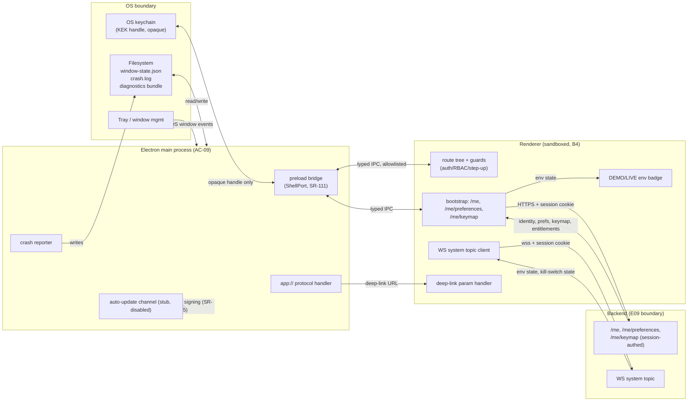

# E10 — STRIDE threat model: app shell, routing and Electron wrapper

Version 1.0 · 2026-09-29 · Document owner: Security engineer · Approver: basiltt (Owner)
Status: **R0 gate evidence** — required by `docs/plan/02-definition-of-ready-done.md` §2.1 and by this
ticket's Definition of Done. Classification: **Internal/Confidential**.

This document extends `docs/plan/04-security-program.md` §5.9 ("Area 9 — Electron shell", threats
E1..E8), which already covers the Electron main-process hardening baseline (SR-110..SR-118). It does
**not** duplicate E1..E8. It adds the surface E10's roadmap-line scope introduces that §5.9 does not yet
cover: the route tree and RBAC/step-up guards (E10-T01), the shell bootstrap (`/me`, `/me/preferences`,
`/me/keymap`, WS `system` topic — E10-T04), the `ShellPort` IPC boundary (E10-K01, merged), the
window-state file, the crash log and diagnostics bundle, the `app://` protocol handler, and deep-link
parameters. It reuses `04-security-program.md`'s L/I/Risk rating scale (§5) and column conventions.

## 1. Scope

In scope: the renderer↔Electron-main boundary as exercised by the `ShellPort` API (E10-K01), the
renderer↔backend boundary as exercised by shell bootstrap calls and the WS `system` topic, the
OS↔main-process boundary (keychain/credential store passthrough, filesystem for window-state/crash-log/
diagnostics, tray, `app://` protocol handler), the client-side route tree and its guards, and deep-link
parameter handling.

Out of scope (per the ticket): backend auth/RBAC threat modelling (E09's model, `04-security-program.md`
§5.6); the exchange boundary (E08's model); penetration testing (R4/E43); implementing controls — this
document produces the model and the required-control list only.

## 2. Trust boundaries referenced

- **B4** (renderer ↔ Electron main), `docs/plan/20-architecture.md` §2.3 — the `ShellPort`/preload
  bridge, per E10-K01's decision to route every IPC call through a fixed, typed, allowlisted channel set
  (`ALLOWED_IPC_CHANNELS`, SR-111).
- **Renderer ↔ backend** — bootstrap REST calls and the WS `system` topic, both authenticated by the
  existing session cookie (E09's boundary; this model only adds the shell-specific consumers of it).
- **OS ↔ main process** — filesystem (window-state file, crash log, diagnostics bundle directory),
  OS credential store (if used for KEK handle caching), the `app://` custom protocol handler, and OS
  window/tray APIs.

## 3. Data-flow diagram

## 4. STRIDE table — Area 9 extension (E10 surface)

Per-element threats not already covered by `04-security-program.md` §5.9 (E1..E8). IDs continue that
table's numbering.

| T | STRIDE | Threat | L | I | Risk | Mitigations | Residual |
|---|--------|--------|---|---|------|-------------|----------|
| E9 | Spoofing | A non-app origin is loaded into a `BrowserWindow` (e.g. via a crafted `window.open` target or a compromised dependency redirecting navigation) | L | H | **High** | SR-113 (existing) `will-navigate`/`setWindowOpenHandler` deny non-local origins; **new: SR-166** requires the route tree's root layout to assert `window.location.origin` matches the packaged app origin on mount and refuse to render otherwise, as defence-in-depth alongside the main-process navigation guard | Low |
| E10 | Spoofing | A forged `app://` request reaches application logic instead of only serving packaged static assets | L | M | Medium | **New: SR-167** the `app://` protocol handler MUST be a read-only static-file server scoped to the packaged asset root (path-traversal-checked), never a dispatcher for IPC actions or app state changes — E7 already establishes this for "intents"; SR-167 extends it explicitly to path traversal and non-asset requests | Low |
| E11 | Spoofing | A malicious deep-link parameter causes an unintended action on load (e.g. `candleviewer://open?accountId=…&arm=live`) without user confirmation | M | H | **High** | **New: SR-168** deep-link parameters MUST be schema-validated and MUST NOT directly trigger a state-changing action (arm/disarm, order placement, account switch); a deep link may only pre-fill a route/view, and any resulting state change still requires the normal in-app confirmation/step-up path (this generalises E7's protocol-handler control to the deep-link parameter contract specifically) | Low |
| E12 | Tampering | The window-state file is edited on disk to influence main-process behaviour on next launch (e.g. injecting an unexpected `webPreferences` override, oversized window bounds causing a DoS-like unusable UI, or a crafted last-route value the renderer trusts) | L | M | Medium | **New: SR-169** window-state is schema-validated on read (size/route/bounds bounds-checked) and never used to construct `webPreferences` or any main-process security setting (those remain SR-110 hard-coded constants, never file-derived); malformed state falls back to defaults, logged, never crashes the app | Low |
| E13 | Tampering | The crash log is edited on disk to inject content that is later displayed unescaped or replayed into a diagnostics action | L | L | Low | Crash log is treated as untrusted input on read (same as any log): rendered only as pre-formatted text, never interpreted or executed; diagnostics bundle export (E14) re-redacts rather than trusting prior redaction | Low |
| E14 | Repudiation | A client-side action (e.g. a guard denying navigation, or a rule/order attempt blocked purely client-side) is not audited server-side, and this absence is later mistaken for an audit gap rather than by-design client-only UX | L | L | Low | **Explicitly documented, not a control gap**: per C-2.21 statecharts record / synchronous code enforces, and per this ticket's design note, the client-side route guard is *not* a security control — it is UX only. Server-side RBAC/risk checks (E09, C-12.4) are the enforcement point and *those* writes are audited (C-2.9). This row exists so a future reader does not misread the absence of a client-side audit trail as a gap | N/A (by design) |
| E15 | Information disclosure | The diagnostics bundle (crash log + recent state + environment info) leaks session tokens, API-key metadata, or other secrets when exported for support/debugging | M | H | **High** | **New: SR-170** the diagnostics bundle export MUST run through the same redaction filter as application logging (SR-006/SR-121), applied at bundle-assembly time, not relying on upstream redaction alone (defence-in-depth against a future log call site that bypasses SR-121); the bundle is INTERNAL classification and export requires explicit user action (never automatic upload) | Low |
| E16 | Information disclosure | The `/me` response (identity, preferences, entitlements) is persisted to disk (e.g. cached in the window-state file or IndexedDB) beyond the session, surviving logout on a shared/managed host | L | M | Medium | **New: SR-171** `/me` and preference/keymap responses MUST be held only in memory (Zustand/Jotai state) for the session lifetime and MUST NOT be written to the window-state file or any persistent renderer storage; window-state persists only UI layout (panel positions, last route path without query params) | Low |
| E17 | Information disclosure | The DEMO/LIVE environment badge misrepresents the active environment (stale state after a WS reconnect, a race between bootstrap and WS `system` topic, or a rendering bug), leading a user to act on the wrong environment | M | **Critical** | **Critical** | **New: SR-172** the environment badge's source of truth is the WS `system` topic (not a one-time bootstrap value); on any WS disconnect the badge MUST enter a visibly-degraded "unconfirmed" state (never silently keep showing the last-known environment) rather than blocking on reconnect; the badge state and the trading-enabled state MUST be derived from the same signal so they cannot diverge; this is modelled as an information-disclosure/tampering threat, not a UI cosmetic issue, per this ticket's design note | Low |
| E18 | Denial of service | A crash loop repeatedly restarts the renderer/main process, making the app permanently unusable or masking a real incident under repeated relaunches | M | M | Medium | E10-S04's repeated-crash guard (referenced by this ticket's Performance notes) caps auto-relaunch attempts within a window and then surfaces a static "app failed to start, see crash log" screen instead of looping; each crash is still logged and counted for E19 | Low |
| E19 | Denial of service | A reconnect storm against the backend (WS `system` topic or bootstrap REST) from many shell instances or a tight reconnect loop exhausts backend or client resources | M | M | Medium | E10-T04's capped exponential backoff with jitter (bounded by C-2.18 queue discipline) bounds reconnect rate; existing backend rate limiting (SR-044) is the second layer; **new: observability requirement** reconnect-rate is exported as a metric (feeds E04, see §6) | Low |
| E20 | Denial of service | Unbounded window creation (e.g. a deep link or IPC call that opens a new `BrowserWindow` per invocation without a cap) exhausts host memory/GPU resources | L | M | Medium | **New: SR-173** window creation MUST be capped (a fixed maximum count of open windows); any request beyond the cap is refused and logged, never queued unboundedly (C-2.18 applies to window creation too, not only async queues) | Low |
| E21 | Elevation of privilege | The preload bridge (`ShellPort`) is abused by a compromised renderer to invoke an IPC channel outside its intended use (argument confusion, replay, or a channel that was scoped for one route being reachable from another) | L | H | **High** | SR-111 (existing) already requires a fixed, typed, allowlisted API with both-sides argument validation; E10-K01 (merged) confirms this design for `ElectronShellAdapter`. This row exists to name the residual: argument validation is necessary but not sufficient if a channel itself grants more capability than the calling route needs — **new: SR-174** each `ShellPort` channel's capability is scoped to the minimum the shell needs (no generic "read any file" / "run any command" channel exists at all, by construction, not just by convention) | Low |
| E22 | Elevation of privilege | A client-side route guard (auth/RBAC/step-up check in the renderer) is mistaken for, or relied upon as, an authorisation boundary — e.g. a future feature ships a sensitive action gated only by the router without a server-side check | M | H | **High** | Restated from the design note as a first-class threat (not just documentation): the route guard is explicitly labelled non-authoritative in code (a comment/type marker at the guard definition site is recommended for E10-T01) and in this model; RBAC and risk are enforced server-side per C-12.4/C-2.12; every PR touching a guarded route is checked in review for a matching server-side check — this is a process control, tracked as a review checklist item rather than a new SR (no automatable signal exists yet; if repeat violations occur, escalate to a lint rule) | Low |
| E23 | Elevation of privilege | A step-up re-authentication requirement is bypassed by direct navigation to a route (typing a URL, following a stale bookmark) or by restoring a previously-open window that cached a pre-step-up state | M | H | **High** | **New: SR-175** step-up state MUST be re-validated against the backend (not read from renderer memory/cache) on every route entry that requires it, including on window restore after sleep/relaunch; a restored window MUST NOT trust its pre-suspend step-up status without a fresh server round-trip | Low |

## 5. Abuse-case list (handed to E10-X03 and E10-Q01)

1. Attempt to load `http://attacker.example` inside a shell window via a crafted external link, deep
   link, or dependency-injected navigation (targets E3, E9).
2. Send a request to the `app://` handler with a path-traversal payload (`app://../../etc/passwd`-style)
   and confirm it is refused (targets E10).
3. Construct a deep link with parameters that, if honoured directly, would arm live trading or place an
   order; confirm the app requires in-app confirmation regardless (targets E7, E11).
4. Hand-edit `window-state.json` with an oversized/malformed payload and a route pointing at a
   step-up-gated screen; relaunch and confirm no crash and no step-up bypass (targets E12, E23).
5. Export the diagnostics bundle after a session with an active login and grep the bundle for the session
   cookie value, any `Authorization`/`X-BAPI-SIGN`-shaped string, or a raw API key (targets E15).
6. Disconnect network mid-session and confirm the DEMO/LIVE badge visibly degrades rather than continuing
   to show the last-known environment (targets E17).
7. Attempt to invoke a `ShellPort` IPC channel with arguments/route context outside its intended scope
   and confirm both-sides validation refuses it (targets E21).
8. Restore a previously-open window after simulating a step-up expiry server-side; confirm the restored
   window re-validates step-up rather than trusting cached state (targets E23).
9. Trigger repeated renderer crashes and confirm the relaunch cap engages and surfaces a static failure
   screen rather than looping indefinitely (targets E18).
10. Force a WS `system` topic reconnect loop and confirm capped backoff with jitter, not an unbounded
    retry rate (targets E19).

## 6. Observability (feeds E04)

Threats requiring detection rather than (only) prevention, per this ticket's Observability note:

- **E17** (env badge divergence): alert if the WS-reported environment and the last bootstrap-reported
  environment disagree for longer than one reconnect cycle.
- **E19** (reconnect storm): export reconnect-attempt rate per shell instance; alert on sustained
  above-baseline rate (ties into SR-125's "WS desync rate" metric family).
- **E20** (unbounded window creation): export current open-window count; alert if it approaches the cap
  (SR-173) repeatedly rather than only refusing at the cap.
- **E23** (step-up re-validation failures): count and alert on repeated step-up re-validation failures on
  window restore, per SR-125's "step-up failures" metric family — this is the shell-specific instance of
  an existing backend metric, not a new metric family.

## 7. Accessibility × security intersection

Per this ticket's Accessibility note: the DEMO/LIVE environment state and the trading-disabled state MUST
be perceivable non-visually (announced via a polite `aria-live` region on change, and exposed via
accessible name/role on the badge element, not colour alone — consistent with `30-frontend-react.md`'s
"colour is never the only signal" rule). A screen-reader user who cannot perceive a LIVE/DEMO change is
exposed to the same loss scenario as E17's sighted-user case; this is the same threat (E17), not a
separate one, and its control (SR-172) must be verified with an accessibility-tree assertion, not only a
visual one.

## 8. Traceability: threat → control → test

| Threat | Control | Owner ticket | Verified by |
|---|---|---|---|
| E9 | SR-166 (new) | E10-T01 | e2e |
| E10 | SR-167 (new) | E10-T02 | unit, ci-gate |
| E11 | SR-168 (new) | E10-T01 | unit, e2e |
| E12 | SR-169 (new) | E10-T04 | unit |
| E13 | existing logging discipline (SR-006/SR-121 pattern) | E10-T04 | unit |
| E14 | N/A — documented non-control | — | manual-review (this document) |
| E15 | SR-170 (new) | E10-T04 | unit, manual-review |
| E16 | SR-171 (new) | E10-T04 | unit |
| E17 | SR-172 (new) | E10-T04 | e2e, integration |
| E18 | E10-S04 repeated-crash guard | E10-S04 | integration |
| E19 | E10-T04 capped backoff + SR-044 | E10-T04 | integration |
| E20 | SR-173 (new) | E10-T02 | unit |
| E21 | SR-111 (existing) + SR-174 (new) | E10-T02 | unit, manual-review |
| E22 | process control (review checklist) | E10-T01 | manual-review |
| E23 | SR-175 (new) | E10-T01 | e2e, integration |

Every threat rated Medium or above names an existing SR-### control or proposes a new one (SR-166..
SR-175), each with an owner ticket, per this ticket's acceptance criteria. No Critical or High threat is
left without a named control; E17 (Critical) has a named control (SR-172) and no escalation to
Owner/Architect is required. No accepted-risk entry is needed by this model.

## 9. Requirement for E10-T02 (per acceptance criteria "the model shapes implementation")

E10-T02 (hardened Electron main/preload) must implement SR-166, SR-167, SR-169, SR-173 and SR-174 as
in-scope acceptance criteria, since they are main-process/preload-boundary controls. E10-T01 must
implement SR-168, SR-175 and the E22 process control. E10-T04 must implement SR-170, SR-171, SR-172 and
the E12/E19 mitigations. If any of these tickets' PRs do not implement their assigned control, that is a
blocking follow-up before E10 can close, per this ticket's acceptance criteria and Definition of Done.
