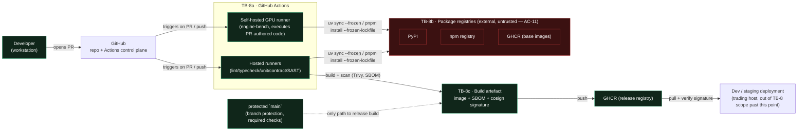

# E03 — STRIDE threat model: CI/CD supply chain

Version 1.0 · 2026-09-25 · Document owner: Security engineer · Co-owner: DevSecOps · Approver: basiltt (Owner)
Status: **R0 gate evidence** — mandatory per `docs/plan/30-release-roadmap.md` §4.4. Classification: **Internal/Confidential** — not published in release notes (`docs/plan/07-release-and-prr.md` §3).

This document is a zoom-in on trust boundary **TB-8** ("Upstream packages/CI → runtime") and actor **AC-11**
("Dependency / package author") from `docs/plan/04-security-program.md` §4/§3. It reuses that document's
diagram, rating and column conventions verbatim rather than inventing a parallel vocabulary.

## 1. Scope

In scope: the build path from a developer's PR through GitHub Actions (hosted + the self-hosted GPU
runner used for chart-engine benchmarks), package registries (PyPI, npm, GHCR, base images), the
resulting signed artefact (container image + SBOM + signature), and its promotion into dev/staging.

Out of scope (per the ticket): STRIDE models for E08 (exchange boundary) and E09 (auth/RBAC); implementing
the controls (the E03 T-tickets); executing the R4 pen-test (`E43`).

## 2. Data-flow diagram

**Text description (accessibility, `docs/plan/05-accessibility-standard.md`):** a developer opens a PR
against the GitHub repo. GitHub Actions runs two runner pools that both pull dependencies from external
package registries (PyPI, npm, GHCR base images — untrusted, per AC-11): ordinary hosted runners for
lint/typecheck/unit/contract/SAST jobs, and a self-hosted GPU runner that is the only element executing
PR-authored code on hardware we own. A successful build on `main` produces a signed artefact (image + SBOM
+ cosign signature) pushed to the release GHCR registry, which is pulled and signature-verified by the
dev/staging deployment. Branch protection on `main` is the only path that can produce a release artefact.

## 3. Trust boundaries anchored to `04-security-program.md`

| ID (this doc) | Anchor | Elements |
|---|---|---|
| TB-8a | TB-8 | GitHub Actions control plane, hosted runners, self-hosted GPU runner |
| TB-8b | TB-8, AC-11 | PyPI, npm, GHCR (pull side) — external, untrusted |
| TB-8c | TB-8 | Build artefact: image, SBOM, cosign signature; the release GHCR registry |

## 4. STRIDE enumeration

Method and risk scale identical to `04-security-program.md` §5: `L`/`I` in {L, M, H}, Risk = L×I mapped to
Low/Medium/High/Critical, one row per threat, six STRIDE categories considered per element/flow — a
category marked N/A carries a one-line reason.

Columns: `T` = threat id, STRIDE, threat, L, I, Risk, mitigating SR control(s), implementing E03 ticket,
verifying test (owned by `E03-Q01`), residual risk. A row missing the ticket or test column blocks sign-off
(acceptance criterion 2).

### 4.1 Element — Developer PR / `main` (branch protection)

| T | STRIDE | Threat | L | I | Risk | Control | Ticket | Verifying test | Residual |
|---|--------|--------|---|---|------|---------|--------|-----------------|----------|
| P1 | Spoofing | Attacker impersonates a maintainer to push directly, bypassing review | L | H | Medium | SR-132 branch protection, required reviewers, CODEOWNERS; no admin merge (C-4.1) | E03-T13 | `E03-Q01`: negative fixture — direct push to `main` is rejected | Low |
| P2 | Tampering | A PR edits the CI workflow that gates the same PR (workflow-in-PR attack), weakening its own checks | M | H | **High** | SR-132 pinned actions + least-privilege `permissions:`; required-checks list is fixed by branch protection, not by the PR's own workflow file at merge time | E03-T13 | `E03-Q01`: fixture PR that edits `.github/workflows/*` to remove a required check must still fail that check | Low |
| P3 | Repudiation | Force-push erases history, hiding what was reviewed | L | H | Medium | Branch protection: linear history required, force-push disabled on `main` (C-4.1, C-4.2) | E03-T13 | `E03-Q01`: attempted force-push to `main` is rejected by a fixture/dry-run check | Low |
| P4 | Elevation of privilege | A bypass actor (owner/admin merge override) is used beyond its documented scope | L | H | Medium | SR-141-style environment protection pattern applied to any bypass path; bypass usage logged (see Observability, `E03-T09`) | E03-T13 | `E03-Q01`: bypass-usage audit row asserted present for any bypass merge | Low |
| P5 | Denial of service | Required-check flakiness (e.g. quarantined suite growth) blocks all merges | M | M | Medium | C-9.3 flaky-test quarantine within 24h + P1 ticket; quarantine list capped and reviewed | E03-Q01 | `E03-Q01`: quarantine-size alert fixture | Low |
| P6 | Information disclosure | N/A — no secret material flows through the PR-diff element itself | — | — | N/A | Reason: PR diffs are public within the private repo; secret leakage is modeled at the CI-log element (row L2) instead. | — | — | — |

### 4.2 Element — GitHub Actions hosted runners

| T | STRIDE | Threat | L | I | Risk | Control | Ticket | Verifying test | Residual |
|---|--------|--------|---|---|------|---------|--------|-----------------|----------|
| A1 | Elevation of privilege | PR-authored code executes with default `permissions: write` and pushes/tags/releases | M | H | **High** | SR-132 least-privilege `permissions: contents: read` by default per workflow; `pull_request_target` prohibited unless security-reviewed | E03-T07 | `E03-Q01`: static check that every workflow file declares `permissions:` explicitly and none use `pull_request_target` without a security-review label | Low |
| A2 | Tampering | A compromised GitHub Action (floating tag) is updated upstream to inject malicious steps | M | H | **High** | SR-132 all actions pinned to full commit SHA | E03-T07 | `E03-Q01`: lint fixture — a workflow diff introducing a floating tag (`@v4`) fails the `pr-metadata`/lint gate | Low |
| A3 | Information disclosure | Secrets used by CI (registry tokens, signing keys) leak into logs/artefacts | M | H | **High** | SR-146 redaction of CI logs/artefacts; no `set -x` around secret steps; SR-140 no production Bybit credentials ever in CI | E03-T07 | `E03-Q01`: fixture log line containing a dummy-prefixed secret is asserted redacted; `SR-145` fixture-secret pattern test | Low |
| A4 | Repudiation | Unattributable deploy — an artefact reaches dev/staging with no traceable workflow run / commit | M | M | Medium | Deploy ledger entry per release (`E03-T09`) recording commit SHA, workflow run id, actor | E03-T09 | `E03-Q01`: deploy without a ledger entry is rejected | Low |
| A5 | Denial of service | Registry outage (PyPI/npm/GHCR) or the benchmark runner's unavailability blocks all merges | M | M | Medium | Dependency mirroring / retry with backoff is deferred (R1, `E03-T14`); accepted for R0 (§5) | E03-T14 (deferred) | `E03-Q01`: registry-timeout fixture asserts a clear failure message, not a silent hang | Medium (accepted, see §5) |
| A6 | Spoofing | A forked-repo PR triggers a workflow that runs with the base repo's secrets context | M | H | **High** | `pull_request_target` prohibited (SR-132); fork PRs run under the restricted `pull_request` event with no secrets | E03-T07 | `E03-Q01`: fixture fork-PR workflow run asserted to have no secrets in its environment | Low |

### 4.3 Element — Self-hosted GPU runner (disproportionate attention, per ticket notes)

This is the only element that executes untrusted PR-authored code (the benchmark suite, and any code the
PR ships) on hardware we own, rather than on an ephemeral, GitHub-managed VM (deferred hardening: R1
backlog item **E03-K01**).

| T | STRIDE | Threat | L | I | Risk | Control | Ticket | Verifying test | Residual |
|---|--------|--------|---|---|------|---------|--------|-----------------|----------|
| G1 | Elevation of privilege | Malicious PR code escapes the benchmark job and reads host secrets / other repos' data on the same physical runner | M | H | **High** | Runner scoped to this repo only, no shared secrets in its environment, ephemeral container per job where the toolchain permits, network egress restricted to package registries + GHCR | E03-K01 (deferred R1) | `E03-Q01` abuse-case: a benchmark PR attempting to read `$HOME`/other-repo paths is exercised and asserted contained | **Medium (accepted for R0 — see §5, owner DevSecOps, re-review Sprint 04)** |
| G2 | Tampering | Persistent runner state (npm/uv cache) is poisoned by one PR and served to a later, unrelated PR (cache poisoning) | M | H | **High** | Cache keys scoped by lockfile hash; frozen-lockfile install re-validates hashes regardless of cache contents (SR-130) | E03-T07 | `E03-Q01`: fixture — a poisoned cache entry with a mismatched hash is rejected by `--frozen-lockfile`/hash verification | Low |
| G3 | Denial of service | The GPU runner is unavailable (offline, contended) and blocks every PR because benchmark is a required check | M | H | **High** | Bench required only for `packages/chart-engine/**` diffs; runner health-check + alert; fallback documented | E03-T14 (deferred) | `E03-Q01`: PR outside `chart-engine/**` does not require the GPU runner | Medium (accepted, see §5) |
| G4 | Information disclosure | Runner logs/artefacts reveal internal hardware fingerprints or network topology | L | M | Low | Redaction filter applied uniformly to CI logs (SR-146) | E03-T07 | `E03-Q01`: same redaction fixture as A3 | Low |
| G5 | Spoofing | An attacker registers a rogue self-hosted runner impersonating the legitimate GPU label | L | H | Medium | Runner registration token scoped, rotated, and restricted to the owner's network; runner group restricted in repo settings | E03-T07 | `E03-Q01`: manual-review checklist item; no automated test available (documented gap) | Low |
| G6 | Repudiation | No record of which specific job ran on which runner instance, obscuring incident review | L | M | Low | Workflow run + runner id included in the deploy ledger / job summary | E03-T09 | `E03-Q01`: job summary asserted to contain runner id | Low |

### 4.4 Element — Package registries (PyPI, npm, GHCR base images) — AC-11, external/untrusted

| T | STRIDE | Threat | L | I | Risk | Control | Ticket | Verifying test | Residual |
|---|--------|--------|---|---|------|---------|--------|-----------------|----------|
| R1 | Tampering | A malicious or compromised transitive dependency is pulled and executed at install/build time (`postinstall`, build backend) | M | H | **High** | SR-138 `postinstall` review + `--ignore-scripts` where the toolchain permits; SR-134 Dependabot/Renovate; SR-135 new-dependency PR justification + CODEOWNER approval | E03-T07 | `E03-Q01`: fixture dependency with a `postinstall` script is flagged/blocked by the scripts policy | Low |
| R2 | Spoofing | Dependency confusion — an internal package name (`@candleviewer/*`, `packages/protocol`) is resolvable and shadowed by a same-named public-registry package | L | H | **High** | Internal scope reserved/claimed on npm; package manager configured to resolve `@candleviewer/*` only from the private workspace, never from the public registry; explicit registry allowlist in `.npmrc`/`pnpm` config | E03-T07 | `E03-Q01`: fixture — installing with a public-registry-only resolver for an `@candleviewer/*` name must fail closed, not silently substitute a public package | Low |
| R3 | Tampering | A base container image is updated upstream with injected malware between pin and rebuild | L | H | Medium | SR-131 base images pinned by digest (not tag), rebuilt weekly, scanned by Trivy | E03-T08 | `E03-Q01`: Trivy scan fixture with a known-CVE image asserted to fail the build | Low |
| R4 | Denial of service | Registry rate-limiting or an outage during install blocks every CI run | M | M | Medium | Deferred to R1 mirroring/caching strategy (`E03-T14`); accepted for R0 | E03-T14 (deferred) | `E03-Q01`: same as A5 | Medium (accepted, see §5) |
| R5 | Information disclosure | A generated SBOM reveals internal module structure or unreleased feature names to anyone who obtains it | L | M | Low | SBOM classified Internal/Confidential; not attached to public release notes (`07-release-and-prr.md` §3) | E03-T08 | `E03-Q01`: manual-review checklist item confirming SBOM is not published externally | Low |
| R6 | Elevation of privilege | N/A for this element — registries are read-only inputs to the build; no code from this element executes with elevated repo/runner privilege beyond the install step already modeled in R1. | — | — | N/A | Reason: covered by R1 (Tampering) at the same trust boundary; no separate EoP path exists here. | — | — | — |

### 4.5 Element — Build artefact (image + SBOM + cosign signature) and release GHCR registry

| T | STRIDE | Threat | L | I | Risk | Control | Ticket | Verifying test | Residual |
|---|--------|--------|---|---|------|---------|--------|-----------------|----------|
| B1 | Spoofing | An attacker forges a cosign signature or publishes an unsigned image under the release tag | L | H | **High** | SR-137 images built only in CI, signed with cosign + provenance attestation; deploy path verifies signature before pull | E03-T08 | `E03-Q01`: fixture unsigned image is rejected by the deploy verification step | Low |
| B2 | Tampering | Artefact is modified between build (CI) and deploy (registry pull) — man-in-the-middle or registry compromise | L | H | Medium | Signature verification (SR-137) covers this: any post-build modification invalidates the signature | E03-T08 | `E03-Q01`: fixture — a bit-flipped image layer fails signature verification | Low |
| B3 | Repudiation | No SBOM diff review between releases, so an unexpected dependency change ships unnoticed | M | M | Medium | SR-133 SBOM produced every release; SBOM diffs reviewed as part of the release checklist | E03-T08 | `E03-Q01`: fixture SBOM diff with an added dependency is asserted surfaced in the release checklist | Low |
| B4 | Information disclosure | Container image layers leak build-time secrets (e.g. a registry token baked into a layer) | L | H | Medium | Multi-stage builds (SR-131), no secrets in build args that persist into final layers, Trivy secret-scanning of the built image | E03-T08 | `E03-Q01`: fixture image with a dummy secret embedded in a layer is asserted flagged | Low |
| B5 | Denial of service | GHCR outage blocks release publication | L | M | Low | Accepted — GHCR is a managed, high-availability service; no in-house mirror planned for R0 | — (accepted, no ticket) | N/A — availability risk, not exercised by a CI-gate test | Low (accepted, see §5) |
| B6 | Elevation of privilege | A workflow with write access to the release registry is triggered by an untrusted PR event | M | H | **High** | Release/publish jobs run only on `push` to `main` (protected branch), never on `pull_request` from forks; same control family as A1/A6 | E03-T07 | `E03-Q01`: fixture fork-PR event cannot reach the publish job | Low |

## 5. Risks accepted for R0 (dated and owned — required for sign-off)

| Threat | Owner | Accepted rationale | Re-review date |
|---|---|---|---|
| A5 / R4 — registry or GPU-runner unavailability blocking merges | DevSecOps | Availability, not integrity/confidentiality; no money-moving path is affected; mirroring/caching is a deferred R1 item (`E03-T14`) that would take disproportionate R0 effort for a non-safety risk | Sprint 04 (R1 kickoff) |
| G1 — GPU runner privilege containment is partial (shared physical host, no full VM-per-job isolation yet) | DevSecOps | Full per-job VM isolation for the GPU runner is the deferred R1 backlog item `E03-K01`; R0 mitigations (scoped runner, no shared secrets, egress restriction) reduce likelihood to Medium; residual is judged acceptable given the runner holds no production credentials | Sprint 04 (R1 kickoff), or immediately if `E03-Q01`'s abuse-case exercise finds an escape |
| G3 — GPU runner unavailability blocks `chart-engine` PRs specifically | DevSecOps | Same rationale as A5; scoped to one path (`packages/chart-engine/**`), not all merges | Sprint 04 (R1 kickoff) |
| B5 — GHCR outage blocks release publication | DevSecOps | Third-party managed-service availability; no mitigating control is proportionate at R0; releases can be retried once GHCR recovers | Reviewed at next PRR (`07-release-and-prr.md`) |

This is consistent with `04-security-program.md` §5.11's residual-risk summary: only `A5/R4/G3` (an
availability class) and `G1` (containment depth) are non-Low after mitigation, matching the pattern already
established for N5 (Tailscale outage) in that document — accepted, not silently ignored.

## 6. Traceability — threat → control → ticket → test

All rows in §4 already carry the control (SR-id or named mechanism), the implementing E03 ticket, and the
verifying test owned by `E03-Q01`, satisfying acceptance criterion 2 directly in-table rather than as a
separate appendix. A summary count:

| Implementing ticket | Threats covered |
|---|---|
| `E03-T07` (SAST/SCA/secrets/licence/container scan lane) | A1, A2, A3, A6, G4, R1, R2, B6 |
| `E03-T08` (build/scan/SBOM/cosign sign on merge) | R3, R5, B1, B2, B3, B4 |
| `E03-T09` (deploy ledger / observability) | A4, G6 |
| `E03-T13` (branch protection, required checks, merge queue) | P1, P2, P3, P4 |
| `E03-T14` (deferred R1 — registry/runner resilience) | A5, R4, G3 |
| `E03-K01` (deferred R1 — GPU runner hardening) | G1 |
| `E03-Q01` (verification, negative fixtures, abuse cases) | verifies every row above |

No threat row is mitigated by an untested assertion: every row names a test owned by `E03-Q01`, or (B5,
G5) is explicitly documented as a manual-review/accepted item rather than falsely claiming automated
coverage.

## 7. What this model changed (acceptance criterion 4)

Comparing this model to the pre-existing `E03` task scope, it drove two concrete changes:

1. **New row R2 (dependency confusion)** made explicit a control that was previously only implied by "the
   monorepo has internal package names that must not be resolvable from a public registry" in the ticket's
   technical notes: `E03-T07`'s scope now must include an explicit registry-allowlist / scope-reservation
   check, not just generic SCA scanning. This is a scope addition to `E03-T07`, to be reflected when that
   ticket is picked up.
2. **New row P2 (workflow-edits-its-own-gate)** made explicit that `E03-T13`'s required-checks configuration
   must be enforced by branch-protection settings (server-side, GitHub-owned) rather than by the workflow
   YAML itself, closing a self-referential bypass that the original ticket text did not call out by name.

All other rows map onto controls already named in the existing `E03` ticket scope (`E03-T07/T08/T09/T13`,
deferred `E03-T14`/`E03-K01`); this model confirms that scope was already substantially sufficient, with
the two additions above as the concrete deltas required by acceptance criterion 4.

## 8. Security Review session record

- **Date:** 2026-09-25 (Sprint 01, per-epic kickoff, `01-sdlc-and-branching.md` §3)
- **Attendees:** basiltt (Owner/Approver), Security engineer (author of this document), DevSecOps (co-owner)
- **Decisions:**
  - This document is the R0 STRIDE gate for E03 (supply chain); sign-off recorded in §9.
  - Accepted risks in §5 are dated and owned as required by acceptance criterion 3.
  - Scope deltas in §7 are to be picked up by `E03-T07` and `E03-T13` respectively when those tickets are
    implemented; this ticket does not implement them (out of scope per the brief).
  - Abuse cases in §9.1 are handed to `E03-Q01`'s exploratory charter and to the deferred R1 audit
    `E03-X03`, per acceptance criterion / Definition of Done.

## 9. Abuse cases handed to `E03-Q01` and `E03-X03`

1. Open a PR from a fork that edits `.github/workflows/*` to widen `permissions:` or remove a required
   check; assert the change has no effect on what actually gates merge.
2. Open a PR that adds a dependency whose name shadows an internal `@candleviewer/*` package; assert
   resolution fails closed rather than silently substituting the public package.
3. Open a PR whose benchmark job attempts to read files outside its job workspace on the self-hosted GPU
   runner (e.g. environment variables, other repos' checkout paths); assert containment.
4. Submit a lockfile diff with a hash mismatch (simulating a tampered transitive dependency); assert the
   frozen-lockfile install refuses rather than silently accepting.
5. Attempt to force-push `main`, and attempt an admin-bypass merge without triggering the bypass-usage
   audit log; assert both are blocked/logged respectively.
6. Attempt to pull a release image without cosign verification, and attempt to pull an image whose
   signature does not match its current digest; assert both are rejected by the deploy path.

## 10. Definition of Done cross-check

- [x] Four scenarios satisfied: every element carries all six STRIDE categories (with reasoned N/A where
      applicable, §4.1/§4.4); every table row names a control, ticket and test (§4, §6); accepted risks in
      §5 are dated and owned; §7 names concrete scope deltas attributable to this model.
- [x] Security Review session recorded (§8).
- [x] Every threat row maps to control + ticket + test (§4, §6).
- [x] Accepted risks dated and owned (§5); companion update to `docs/plan/32-risk-register.md` tracked as
      **RSK-029** (Supply-chain compromise via a dependency, already Owner DevSecOps, Epics E02/E03/E43) —
      this model is the detailed backing analysis for that register entry; no new RSK-id is required since
      RSK-029 already covers this exact risk category, and the GPU-runner-specific residual (G1) is noted
      as a forward pointer to `E03-K01` in that entry's mitigation text (see companion note below).
- [ ] Security engineer sign-off comment — to be posted on the GitHub issue (this is the R0 gate evidence;
      posted by the security engineer role after PR review, not fabricated here).
- [x] Abuse cases delivered to `E03-Q01` and `E03-X03` (§9).
