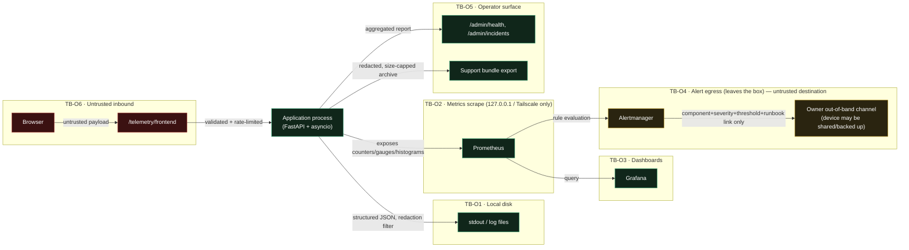

# E04 — STRIDE threat model: observability baseline

Version 1.0 · 2026-09-29 · Document owner: Security engineer (session agent) · Co-owner: Architect (session agent)
Approver: basiltt (Owner) — pending. Status: **R0 gate evidence** per `docs/plan/30-release-roadmap.md` §4.4.
Classification: **Internal/Confidential** — this document describes weaknesses; it MUST NOT ship in any
support bundle or public artefact (`docs/plan/04-security-program.md` §5, this ticket's Security notes).

This document runs **first** in E04 (`E04-X01`), before `E04-T01` freezes the redaction rule set, so it
shapes implementation instead of grading it. It reuses `04-security-program.md` §5's diagram, rating and
column conventions verbatim (C-16.5) rather than inventing a parallel vocabulary.

## 1. Scope

In scope — the six E04 trust boundaries named in the ticket:

- **TB-O1** application process → stdout / log files (local disk).
- **TB-O2** application → Prometheus (`/metrics` scrape).
- **TB-O3** Prometheus → Grafana (dashboards).
- **TB-O4** Alertmanager → the owner's out-of-band channel — **the only egress in this epic**.
- **TB-O5** operator → `/admin/health`, `/admin/incidents`, support bundle.
- **TB-O6** browser → `/telemetry/frontend` (inbound, untrusted).

Out of scope (per the ticket and `30-release-roadmap.md` §4.4): STRIDE models for auth/RBAC (`E09`), the
exchange boundary (`E08`), supply chain (`E03`, already modelled in `docs/plan/threat-models/E03-supply-chain.md`);
penetration testing (R4 / `E43`).

## 2. Data-flow diagram

**Text description (accessibility, `docs/plan/05-accessibility-standard.md`):** the application process
writes structured logs to local disk (TB-O1) and exposes metrics to a locally/Tailscale-bound Prometheus
(TB-O2), which Grafana queries for dashboards (TB-O3) and which evaluates alert rules through Alertmanager.
Alertmanager is the only component that sends data off the box, to the owner's out-of-band channel, which
may be a shared or backed-up device (TB-O4 — the epic's sole egress point). An operator reaches
`/admin/health`, `/admin/incidents` and can request a support bundle (TB-O5). A browser posts to
`/telemetry/frontend`, the only inbound, untrusted data path in the epic (TB-O6).

## 3. Trust boundaries anchored to `04-security-program.md`

| ID (this doc) | Anchor | Elements |
|---|---|---|
| TB-O1 | new (this doc) | Application process, structured log sink, log files on local disk |
| TB-O2 | new (this doc) | `/metrics` scrape endpoint, Prometheus |
| TB-O3 | new (this doc) | Prometheus, Grafana dashboards |
| TB-O4 | new (this doc), A-17 | Alertmanager, owner out-of-band channel — **the only egress in E04** |
| TB-O5 | new (this doc) | `/admin/health`, `/admin/incidents`, support-bundle generator/export |
| TB-O6 | new (this doc) | Browser, `/telemetry/frontend` — untrusted inbound |

## 4. STRIDE enumeration

Method and risk scale identical to `04-security-program.md` §5: `L`/`I` in {L, M, H}, Risk = L×I mapped
to Low/Medium/High/Critical, one row per threat, six STRIDE categories considered per element — a
category marked N/A carries a one-line reason. Columns: `T` = threat id, STRIDE, threat, L, I, Risk,
mitigating SR control(s), implementing E04 ticket, verifying test, residual risk. A row missing the
ticket or test column blocks sign-off (acceptance criterion 2).

### 4.1 Element — TB-O1: application process → log sink → log files

| T | STRIDE | Threat | L | I | Risk | Control | Ticket | Verifying test | Residual |
|---|--------|--------|---|---|------|---------|--------|-----------------|----------|
| L1 | Spoofing | A forged inbound `X-Correlation-Id` header poisons log attribution, letting one actor's actions be blamed on another's trace | M | M | Medium | Correlation id is server-generated per request/WS-connection when absent or malformed; an inbound id is accepted only if it matches the expected format and is treated as advisory, never as an identity claim | `E04-T02` | unit: malformed/foreign-format inbound correlation id is replaced, not trusted | Low |
| L2 | Tampering | An operator or attacker with disk access edits or truncates log files to hide evidence | L | M | Low | Log files ship append-only where the OS allows (no in-place rewrite by the app itself); file permissions restrict write access to the service account (SR-124) | `E04-T01` | manual-review: file permission check in the deployment runbook | Low |
| L3 | Repudiation | An operator's log-level override (DEBUG escalation) is not itself audited, so nobody can later prove who widened logging and when | M | H | **High** | Log-level override is an audited admin action (actor, before/after level, timestamp, expiry) per C-2.9 | `E04-T02` | integration: override call asserted to write an audit row before taking effect | Low |
| L4 | Information disclosure | Key secret, session token, signature header or full order payload written to application logs or exception tracebacks (K1, U5) | M | H | **High** | SR-006 central redaction filter at the handler level (SR-121), SR-007 `Secret[str]` wrapper, SR-120 structured JSON with a fixed field set (no free-form interpolation of secret-bearing values), SR-122 hard ban on tokens/signatures/TOTP at any level | `E04-T01` | unit: fixture log line containing a dummy secret/token/signature value is asserted redacted at every configured sink, including third-party loggers (`httpx`, `websockets`, `sqlalchemy`) | Low |
| L5 | Denial of service | A DEBUG-level override (or a bug that logs per-tick data) floods log volume, exhausting disk or the log pipeline | M | M | Medium | Log-level override is time-boxed with an automatic expiry (SR-123); size/age-based rotation (SR-124); disk high-watermark alert (SR-125) | `E04-T02` | integration: override auto-expires; rotation fixture caps file growth | Low |
| L6 | Elevation of privilege | N/A for this element — the log sink itself grants no additional privilege; privilege escalation via the override control is modelled at TB-O5 (row H6) instead. | — | — | N/A | Reason: the log sink is a passive writer; the actionable EoP surface is the admin endpoint that requests the override, covered under TB-O5. | — | — | — |

### 4.2 Element — TB-O2: `/metrics` scrape endpoint and Prometheus

| T | STRIDE | Threat | L | I | Risk | Control | Ticket | Verifying test | Residual |
|---|--------|--------|---|---|------|---------|--------|-----------------|----------|
| M1 | Spoofing | An unauthenticated scraper (any process able to reach the port) polls `/metrics` and is treated as a trusted internal consumer | M | M | Medium | Private bind (`127.0.0.1` / Tailscale-internal only, C-12.9); no public internet exposure (C-1.3) is a network-layer control, not app-layer auth, and is documented as such | `E04-T03` | ci-gate: config lint asserts the metrics listener binds to a private address only | Low |
| M2 | Tampering | A compromised or buggy component pushes falsified metric values, masking a real incident (e.g. a fake healthy `bybit_rate_remaining`) | L | M | Low | Metrics are pulled (scrape model), not pushed by arbitrary components; only the process's own registry can set its values; no remote-write ingestion path exists in R0 | `E04-T03` | unit: registry API surface reviewed — no external mutation entrypoint | Low |
| M3 | Repudiation | N/A — metrics are aggregate counters/gauges with no actor attribution to repudiate; repudiation of the *actions* they measure is covered by audit (C-2.9) elsewhere, not by this element. | — | — | N/A | Reason: metrics are anonymous aggregates by design; per-actor repudiation is an audit-log concern, modelled at TB-O1/TB-O5. | — | — | — |
| M4 | Information disclosure | Metric labels act as an inference channel: `orders_total{state,env}` reveals trading activity, and an account-id label such as `bybit_rate_remaining{account}` (illustrative of the anti-pattern this threat models — not a shipped label) would reveal account count and timing to anyone who can reach the endpoint | M | H | **High** | Label-content rule (proposed SR-169, §6.1): no account id, order id, symbol-level granularity, or key material in any label value; any pre-existing label of this shape MUST be replaced before general availability. `E04-T03` owns removing/renaming any account-id-bearing label as part of implementing the metrics catalogue; label cardinality and content reviewed at catalogue declaration time (this doc's cross-check, §8) | `E04-T03` | ci-gate: metric catalogue lint rejects any label matching an identifier pattern (account/order id shape) | Low |
| M5 | Denial of service | Cardinality explosion from an unbounded label (e.g. a raw account id or symbol used as a label instead of a bounded enum) exhausts Prometheus memory | M | H | **High** | Label allowlist is bounded and enumerated at declaration time; a cardinality-guard rejects/drops any label value outside the declared set at collection time | `E04-T03` | integration: fixture emits an out-of-set label value; asserted dropped/clamped, not passed through | Low |
| M6 | Elevation of privilege | N/A — the scrape endpoint is read-only and grants no privilege beyond what the network-layer bind already governs (row M1). | — | — | N/A | Reason: no write/command surface exists on this element. | — | — | — |

### 4.3 Element — TB-O3: Prometheus → Grafana dashboards

| T | STRIDE | Threat | L | I | Risk | Control | Ticket | Verifying test | Residual |
|---|--------|--------|---|---|------|---------|--------|-----------------|----------|
| G1 | Spoofing | N/A — Grafana queries Prometheus over a private, trusted internal link; no external identity is asserted at this hop. | — | — | N/A | Reason: single-owner deployment, private network only (C-12.9); auth spoofing at the Grafana UI login is out of scope (E09). | — | — | — |
| G2 | Tampering | An attacker (or a well-meaning operator) edits a Grafana dashboard JSON so a panel never renders a breach signal (e.g. deletes the failed-login panel) | L | H | Medium | Dashboards are provisioned as reviewed JSON in the repository (`E04-S01`), loaded read-only/provisioned rather than hand-edited in the UI; drift from the committed JSON is detectable | `E04-S01` | ci-gate: dashboard JSON is the single source of truth, diffed in PR review; manual-review: UI edits do not persist across a redeploy | Low |
| G3 | Repudiation | A dashboard change that removes a security-relevant panel is not reviewed or attributed | L | M | Low | Dashboard JSON changes go through normal PR review (git blame = attribution); no direct-to-Grafana-UI edit path is the deployed default | `E04-S01` | manual-review: PR history is the audit trail | Low |
| G4 | Information disclosure | Grafana is exposed beyond the private network, or a shared/public dashboard link leaks trading-activity data | M | H | **High** | Private bind only (C-12.9), no public internet exposure (C-1.3); Grafana anonymous/public-dashboard features disabled by configuration | `E04-S01` | ci-gate: config lint asserts anonymous access and public dashboard sharing are disabled | Low |
| G5 | Denial of service | N/A — Grafana/Prometheus resource exhaustion here is a subset of the cardinality-explosion threat already modelled at M5; no distinct DoS surface exists purely at the query hop. | — | — | N/A | Reason: covered by M5 at the same data source. | — | — | — |
| G6 | Elevation of privilege | An operator role without a legitimate need reaches dashboard-edit or datasource-admin capability in Grafana | L | M | Low | Grafana viewer-only role for non-owner operators is the deployed default; admin capability restricted to the Owner account | `E04-S01` | manual-review: role configuration checked against the provisioning JSON | Low |

### 4.4 Element — TB-O4: Alertmanager → owner out-of-band channel (disproportionate attention, per ticket notes)

This is the **only element in E04 that sends data off the box**, to a third-party channel, to a device
that may be shared or backed up, unencrypted-at-rest at the destination. The content policy below is
therefore a *security control*, not a formatting preference (ticket Technical notes item 1).

| T | STRIDE | Threat | L | I | Risk | Control | Ticket | Verifying test | Residual |
|---|--------|--------|---|---|------|---------|--------|-----------------|----------|
| E1 | Spoofing | A spoofed alert notification (forged sender, phishing message mimicking the alert format) tricks the owner into acting on a fake incident, or into ignoring a real one buried among fakes | M | H | **High** | Alert channel uses a dedicated, owner-controlled endpoint (not a general-purpose inbox shared with untrusted senders); message template is fixed and documented so a forged message is visually distinguishable; SR-126 P1/informational distinguishability | `E04-T05` | drill: alert-drill fixture confirms the delivered message matches the fixed template; manual-review of channel provisioning | Low |
| E2 | Tampering | An attacker (or an over-broad automation) silences or mutes an Alertmanager rule so a real incident produces no notification | M | H | **High** | Alert-rule silences require an audited, time-boxed action (mirrors the log-level-override pattern, L3); rule changes go through PR review like dashboards (G2) | `E04-T05` | integration: silence action asserted to write an audit row and auto-expire; ci-gate: rule-file changes reviewed in PR | Low |
| E3 | Repudiation | An alert is acknowledged/dismissed by an operator with no record of who did it or when | M | M | Medium | Incident acknowledgement is an audited admin action (actor, timestamp, incident id) per C-2.9 | `E04-T05` | integration: acknowledgement call asserted to write an audit row | Low |
| E4 | Information disclosure | Alert payload carries account ids, order ids, or key-adjacent material off-box, to a channel outside the trust boundary and possibly backed up to a third-party cloud | M | H | **Critical** | Content policy: alert payloads contain **only** component, severity, threshold and runbook link — never account ids, order ids or key material (ticket Technical notes item 1); enforced by a payload template, not per-call discipline | `E04-T05` | unit: alert payload fixture asserted to match the allowed-field schema; any extra field fails the test | Low |
| E5 | Denial of service | Alert-storm (many rules firing at once during a real incident) either floods the owner's channel into unusability or is rate-limited so hard that the real signal is dropped | M | M | Medium | Grouping/deduplication in Alertmanager (SR-126 distinguishability preserved); rate limits on notification frequency tuned so P1s are never suppressed, only informational repeats | `E04-T05` | drill: alert-storm fixture confirms P1 delivery is never suppressed while informational repeats are throttled | Low |
| E6 | Elevation of privilege | N/A — Alertmanager has no operator-facing privilege surface beyond the audited silence/acknowledge actions already modelled (rows E2/E3). | — | — | N/A | Reason: no additional privileged action exists at this element. | — | — | — |

### 4.5 Element — TB-O5: operator surface (`/admin/health`, `/admin/incidents`, support bundle)

| T | STRIDE | Threat | L | I | Risk | Control | Ticket | Verifying test | Residual |
|---|--------|--------|---|---|------|---------|--------|-----------------|----------|
| H1 | Spoofing | A non-owner actor reaches the admin health/incidents surface by session-fixation or token replay | L | H | Medium | RBAC + session controls are governed by E09 (out of scope here); this element inherits that boundary and adds no new authentication mechanism of its own | `E04-T04` | integration: forbidden-role and cross-account cases per `30-frontend-react.md`/E09 conventions | Low |
| H2 | Tampering | An operator or attacker manipulates the aggregated health report to hide a degraded subsystem from the Owner | L | M | Low | Health report is computed server-side from live component checks each request, not cached/editable state; no admin write path affects the report content | `E04-T04` | unit: report reflects an injected-unhealthy fixture component immediately | Low |
| H3 | Repudiation | Support-bundle export or incident acknowledgement happens with no record of who requested it | M | H | **High** | Both are audited admin actions (actor, timestamp, scope requested) per C-2.9 | `E04-T04`, `E04-S02` | integration: export/acknowledge call asserted to write an audit row before the file/response is returned | Low |
| H4 | Information disclosure | A support bundle contains secrets, full order payloads, or PII that then leaves the box in an email/ticket attachment | M | H | **Critical** | SR-006/SR-121 redaction filter applied to every artefact assembled into the bundle; secret-scan (gitleaks-style) run over the assembled bundle before it is offered for download; size cap prevents wholesale data-dump inclusion | `E04-S02` | unit: fixture bundle containing a planted secret/token is asserted rejected by the pre-export scan | Low |
| H5 | Denial of service | Support-bundle generation (log collection, metric snapshot, DB queries) exhausts disk or CPU during an active incident — precisely when the box is least able to spare it | M | H | **High** | Size cap and time-box on bundle generation; generation runs at lower priority / with resource limits; a running generation cannot be triggered concurrently more than once | `E04-S02` | integration: fixture asserts generation is capped and a second concurrent request is rejected/queued, not run in parallel | Low |
| H6 | Elevation of privilege | A Manager account-scoped to a subset of accounts (C-12.4) reaches `/admin/health` detail fields or the log-level override, both of which are Owner-only surfaces | M | H | **High** | RBAC scope check server-side on every route (C-12.4); Manager tokens receive a reduced/summary health payload only, scoped to their assigned accounts, never the override endpoint | `E04-T02`, `E04-T04` | integration: forbidden-role test — Manager token against the override endpoint and against detailed/out-of-scope health fields both return 403 | Low |

### 4.6 Element — TB-O6: browser → `/telemetry/frontend` (untrusted inbound)

| T | STRIDE | Threat | L | I | Risk | Control | Ticket | Verifying test | Residual |
|---|--------|--------|---|---|------|---------|--------|-----------------|----------|
| F1 | Spoofing | A script from an unrelated origin submits telemetry, polluting frontend-latency data with junk from outside the app | M | L | Low | CORS restricted to the app's own origin; CSRF-style token not required (endpoint is write-only telemetry, no state change of value) but origin check is enforced | `E04-T06` | integration: cross-origin POST fixture is rejected | Low |
| F2 | Tampering | A malicious client sends fabricated latency/error values to mask a real frontend problem or to trigger a false alert | L | L | Low | Telemetry is advisory (dashboards/aggregate trends), never a direct alert trigger by a single client's report; aggregation requires volume before surfacing, limiting single-actor influence | `E04-T06` | unit: single anomalous sample does not by itself cross an alert threshold | Low |
| F3 | Repudiation | N/A — telemetry submissions are anonymous, unauthenticated client reports by design; there is no actor identity to repudiate beyond what correlation ids already provide (modelled at L1). | — | — | N/A | Reason: no privileged action is taken on the basis of a single unauthenticated report. | — | — | — |
| F4 | Information disclosure | A telemetry payload from the browser accidentally or maliciously includes PII, URLs with tokens, or other sensitive client-side state | M | M | Medium | Payload schema is a strict allowlist (pydantic `extra="forbid"`) of latency/error-shape fields only; no free-form string fields that could carry a token or URL | `E04-T06` | unit: fixture payload with an extra/free-form field is rejected at the schema boundary | Low |
| F5 | Denial of service | A telemetry-endpoint flood (scripted or accidental) from many browser instances exhausts server resources or storage | M | H | **High** | Rate limiting per client/IP on the endpoint (shares the rate-limit governor pattern used elsewhere, C-2.18 bounded queues); endpoint drops excess rather than blocking | `E04-T06` | integration: flood fixture confirms bounded queue + drop, not unbounded accept or event-loop block | Low |
| F6 | Elevation of privilege | The telemetry endpoint accepts a payload shape that is later interpreted as a command or influences server behaviour beyond storing/aggregating a metric (e.g. a field parsed and used as a query fragment or log-level directive) | L | H | Medium | Payload is strictly data (numeric/enum fields only), never parsed as an instruction; no field on this endpoint maps to any privileged action | `E04-T06` | unit: fixture asserts no telemetry field can trigger the log-level override or any other admin action | Low |

## 5. Accepted risks (High/Critical without an in-epic control)

None. Every High/Critical residual risk identified in §4 (rows L3, L4, M4, M5, E1, E2, E4, H3, H4, H5, H6,
F5) has a control landing inside E04, linked to a specific child ticket, and each control's residual risk
after mitigation is rated Low. No accepted-risk entry is required for this ticket's Definition of Done
item 3. If a future review finds one of these controls insufficiently implemented, the specific row above
is amended and, if the residual cannot be brought to Low, an Owner-signed accepted-risk entry with a date
is added here at that time.

## 6. Mapping to existing SRs, and proposed new SRs

| Threat rows | Existing SR(s) | Gap? |
|---|---|---|
| L1 (correlation-id spoofing) | none directly — new control | **New SR proposed: SR-167** (below) |
| L2, L3, L5 | SR-124 (log file hygiene), and the log-level-override audit pattern (new) | Override-audit gap — **New SR proposed: SR-168** |
| L4 | SR-006, SR-007, SR-120, SR-121, SR-122 | Covered |
| M1 | C-12.9 (private bind), no direct SR-number for the metrics port specifically | Covered by C-12.9; no new SR needed (network-layer control, already binding) |
| M4, M5 (label content / cardinality) | SR-125 (security-relevant metrics list) covers *what* is exported; nothing yet governs label *content* rules | **New SR proposed: SR-169** (below) |
| G2, G4 | SR-124-adjacent (artefact hygiene), C-12.9 (private bind), C-1.3 (no public exposure) | Covered by existing constitution rules; dashboard-as-code is an `E04-S01` implementation detail, no new SR needed |
| E1, E2, E3, E4, E5 | SR-126 (alert routing + P1 distinguishability) covers routing/distinguishability; **content policy (E4) and audited silence/ack (E2/E3) are new** | **New SR proposed: SR-170** (content policy) — see below; audit obligations already fall under C-2.9, no new SR needed |
| H3, H4, H5, H6 | SR-005/SR-006 (secret handling in the bundle), C-12.4 (RBAC), C-2.9 (audit) | Covered by existing SRs/constitution rules for H3/H4/H6; H5 (bundle-generation DoS) has no existing SR | **New SR proposed: SR-171** (bundle resource bounds) |
| F1, F2, F4, F5, F6 | C-2.18 (bounded queues) covers F5 partially; no SR governs telemetry payload schema strictness | **New SR proposed: SR-172** (below) |

### 6.1 Proposed diff to `04-security-program.md` §6.9 (new SRs SR-167…SR-172)

The following rows are proposed as an addition to §6.9 ("Logging, monitoring and redaction"), using the
next free SR id after the highest currently declared (SR-166, verified by scanning every `SR-nnn` id in
`04-security-program.md`'s current text):

| SR | Requirement | Verification |
|---|---|---|
| SR-167 | An inbound `X-Correlation-Id` (or equivalent trace-id header) MUST be validated against a fixed format before use; a server-generated id MUST replace any header that is missing, malformed, or does not match the expected format. An inbound id is never treated as an identity or authorization claim. | unit |
| SR-168 | Any runtime log-level override MUST be an audited admin action (actor, before/after level, timestamp) that expires automatically within a bounded time window; it MUST NOT persist across a process restart without being re-issued. | integration |
| SR-169 | Metric label values MUST NOT contain account ids, order ids, or any other unbounded identifier; every label's value set MUST be declared (enum or bounded pattern) at catalogue-registration time, and a value outside the declared set MUST be dropped or clamped rather than admitted, to prevent both inference disclosure and cardinality-driven denial of service. | ci-gate, integration |
| SR-170 | Alert payloads delivered off-box (Alertmanager → the owner's out-of-band channel) MUST contain only component, severity, threshold and runbook link; account ids, order ids, symbol-level granularity beyond what a runbook link already discloses, and any key-adjacent material MUST NOT appear in the payload. | unit |
| SR-171 | Support-bundle generation MUST be size-capped, time-boxed, and MUST reject a second concurrent generation request while one is in progress, so that generation cannot itself exhaust disk or CPU during an active incident. | integration |
| SR-172 | `/telemetry/frontend` payloads MUST be validated against a strict schema (`extra="forbid"`, enumerated/numeric fields only, no free-form string fields); no field on this endpoint may be parsed as, or otherwise influence, a privileged server-side action. | unit |

This diff is proposed, not yet merged into `04-security-program.md` — it is reviewed as part of this
ticket's sign-off (§9) and lands in its own follow-up edit to that document once the Owner/Architect
confirm the numbering above does not collide with any SR added by a concurrently-merging ticket (the
project's single-writer-file convention, `70-multi-agent.md` §2, applies to `04-security-program.md` the
same way it applies to `machine_hashes.lock`).

## 7. Data-classification table

| Artefact | Classification | Protection | Notes |
|---|---|---|---|
| Application logs (stdout / log files) | Internal-Confidential | SR-006/SR-121 redaction at handler level; SR-124 file permissions and rotation | May contain correlation ids, actor ids, routes — never secrets/tokens post-redaction |
| Metrics (`/metrics` scrape output) | Internal-Confidential | Private bind (C-12.9); label-content rule (SR-169 proposed) | Aggregate/anonymous by construction; risk is inference, not direct secret exposure |
| Traces (if/when added; none in R0 scope per `E04-T06` latency-budget instrumentation) | Internal-Confidential | Same redaction filter applies to any span attributes | Scoped for future epics; flagged here so the classification is not missed later |
| Grafana dashboards (provisioned JSON) | Internal-Confidential | Private bind; anonymous/public sharing disabled; JSON reviewed in PR | Dashboard JSON itself contains only queries/panel config, no live data |
| Alert payloads (delivered off-box) | **Internal-Confidential, egress-restricted** | SR-170 content policy (component+severity+threshold+runbook link only) | The one artefact class that leaves the box — held to the strictest content rule in this doc |
| Support bundles | Internal-Confidential | SR-006 redaction, secret-scan pre-export, size cap (SR-171) | MUST NOT be attached to any public artefact or ticket without manual redaction review (ticket Security notes) |
| `system_events` rows (audit trail entries produced by this epic's audited actions) | Internal-Confidential, append-only | C-2.9 audit invariants: no `UPDATE`/`DELETE` grants (C-5.7) | Covers log-level-override, bundle-export, alert-silence/ack, incident-acknowledgement audit rows |
| This threat-model document itself | Internal-Confidential | Lives in the repository (private); excluded from support bundles and release notes | Per ticket Security notes — describes weaknesses |

## 8. Cross-check against SR-125's security-relevant metrics list

`04-security-program.md` SR-125 requires export/alerting on: failed logins, lockouts, step-up failures,
permission-check failures, credential verification failures, rate-limit rejections, rule circuit-breaker
trips, audit chain verification failures, egress IP changes, clock drift, disk high-watermark, WS desync
rate. Cross-checked against this model's threats:

- Disk high-watermark is the control cited for L5 (log-volume flood) above — confirmed present in SR-125's
  list, no gap.
- Rate-limit rejections is the control category relevant to F5 (telemetry flood) and M1-adjacent concerns —
  confirmed present, no gap.
- No item in SR-125's list currently covers **support-bundle generation failures/aborts** or **alert-silence
  usage** as their own alertable signal; both are recommended additions to the SR-125 metric catalogue
  when `E04-T03` declares the catalogue. This is a scope note for `E04-T03`, not a blocking gap for this
  ticket, and is handed to that ticket per the ticket's own Observability section.
- This cross-check is handed to `E04-T03` for catalogue declaration, satisfying this ticket's Observability
  requirement.

## 9. Abuse cases handed to `E04-X02` and `E04-Q02`

1. Submit a request with a forged `X-Correlation-Id` in an unexpected format; assert the server-generated
   id is used instead and no downstream log attribution trusts the header value (L1/SR-167).
2. Trigger a runtime log-level override, then wait past its expiry window without renewing; assert DEBUG
   logging automatically reverts and the override's audit row records actor and both timestamps (L3/SR-168).
3. Attempt to reach `/metrics` from a network location outside the private bind; assert the connection is
   refused at the network layer, not merely unauthenticated at the app layer (M1).
4. Submit a fixture metric emission with a label value containing a synthetic account-id-shaped string;
   assert it is dropped/clamped by the cardinality guard rather than admitted (M4/M5/SR-169).
5. Edit a provisioned Grafana dashboard JSON directly in the running UI (not via PR) to remove a
   security-relevant panel; assert the change does not survive a redeploy from the committed JSON (G2).
6. Trigger an alert and inspect the payload delivered to the out-of-band channel; assert it contains only
   component/severity/threshold/runbook-link fields and no account/order identifiers (E4/SR-170).
7. Silence an Alertmanager rule and attempt to let the silence persist indefinitely; assert it auto-expires
   and the silence action itself produced an audit row (E2).
8. As a Manager account-scoped token, attempt to reach the log-level override endpoint and the
   out-of-scope `/admin/health` detail payload; assert both return 403 (H6).
9. Request two support-bundle exports concurrently; assert the second is rejected/queued rather than run
   in parallel, and that the resulting bundle fails a planted-secret fixture scan if one is embedded (H4/H5).
10. Post a telemetry payload with an extra free-form string field (e.g. attempting to smuggle a URL/token);
    assert the schema boundary (`extra="forbid"`) rejects it (F4/SR-172).
11. Flood `/telemetry/frontend` from many simulated clients; assert the endpoint drops excess under a
    bounded queue rather than blocking the event loop or accepting unboundedly (F5).

## 10. Security Review session — status

**Status: pending — owner review outstanding.** Per this ticket's Agent-delivery adaptations (owner
decision 2026-09-25), Architect/Security-engineer sign-off substitutes for the Owner's `approved` comment
on GitHub issue #160, or Owner merge of the PR. This document is drafted and ready for that review; it is
not blocked on a missing countersignature per the adaptation clause, and "owner approval pending" is
recorded here rather than treated as a blocker.

- **Prepared by:** session agent, acting as Security engineer and Architect roles per the adaptation.
- **Findings for presentation at the Security Review** (Definition of Done item 8): the six new SRs in
  §6.1 (SR-167…SR-172), the two High/Critical residuals requiring the tightest new controls
  (E4 alert-payload content policy, H4 support-bundle secret-scan), and the SR-125 catalogue cross-check
  gap noted in §8 for `E04-T03`.

## 11. Sign-off

**Status: owner approval pending.** Recorded per the ticket's Agent-delivery adaptations: proceed without
blocking; the Owner's `approved` comment on GitHub issue #160, or merge of the associated PR, constitutes
the Architect/Security-engineer sign-off required by this ticket's Definition of Done.

## 12. Definition of Done cross-check

- [x] STRIDE table complete across all six categories and all six trust boundaries (§4.1–§4.6), with
      reasoned N/A rows where a category does not apply to an element.
- [x] Every threat mapped to an existing SR or a proposed new SR with a verification method (§6, §6.1).
- [x] Every High/Critical residual risk (§4, §5) has a control landing inside E04, linked to a specific
      child ticket; §5 records that no accepted-risk entry is needed at this time.
- [x] Abuse-case list (§9) handed to `E04-X02` and to `E04-Q02`'s charter 3.
- [x] Data-classification table complete (§7).
- [ ] Security engineer and Architect sign-off recorded — **pending Owner action** (§10, §11) per the
      Agent-delivery adaptations; not a blocker for opening this PR.
- [x] `04-security-program.md` diff proposed (§6.1); not yet merged — follow-up edit tracked below.
- [ ] `docs/plan/32-risk-register.md` — reviewed (§13); no new risk surfaced beyond what RSK-047 already
      covers, so no register edit is made in this PR (see §13 for the reasoning).
- [ ] Findings presented at the Security Review — **scheduled for the Owner's next review pass**; §10
      records what is prepared for that session.

## 13. Risk-register cross-check

`docs/plan/32-risk-register.md` RSK-047 ("Observability gaps hide a live problem until it costs money")
already covers the *absence* of observability as a risk category. This model additionally surfaces a
distinct risk — *information disclosure through the observability stack itself* (metric-label inference,
alert-payload egress, support-bundle content) — which is not the same failure mode as RSK-047 and is not
yet a named register entry. Per this ticket's Definition of Done item ("`32-risk-register.md` updated if a
new risk is surfaced"), the following register addition is proposed for the Owner's review rather than
applied directly in this PR (register edits are a single-writer file per `70-multi-agent.md` §2, and this
PR does not yet know if a concurrently open PR has claimed the next RSK id):

- **Proposed RSK-05x** — "Observability stack becomes an information-disclosure channel (metric-label
  inference, alert-payload egress content, support-bundle contents)" — Category: Security. Owner: Security
  engineer / DevSecOps. Mitigations: SR-169, SR-170, SR-171 (§6.1), plus the existing SR-005/SR-006 family.
  Gate: R0 (this document is the backing STRIDE analysis).

This is flagged as a follow-up edit to `32-risk-register.md` rather than applied inline here, to avoid a
race on the next free RSK id with any other ticket currently modifying that file.

