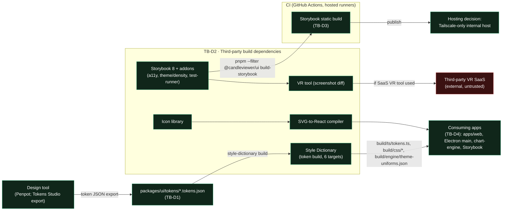

# E05 — STRIDE threat model: design-system supply chain and Storybook exposure

Version 1.0 · 2026-09-30 · Document owner: Security engineer · Co-owner: Architect · Approver: basiltt (Owner)
Status: **R0 gate evidence** for E05 (design system v0). Classification: **Internal/Confidential** — not
published in release notes (`docs/plan/07-release-and-prr.md` §3).

This document follows the STRIDE-per-boundary format of `docs/plan/threat-models/E03-supply-chain.md` and
`docs/plan/security/E02-threat-model.md` so models stay comparable across epics, and reuses the actor/trust
boundary vocabulary of `docs/plan/04-security-program.md` §3/§4 rather than inventing a parallel one. E05
handles no money and no secrets at runtime — which is exactly why it is easy to skip, and exactly why it is
an attractive target: the design system is a build-time dependency of every frontend surface, so a
compromised token build or icon pipeline executes on every developer's machine and in CI, and a leaked
Storybook exposes the entire unreleased product surface (dense trading UI, screen names, information
architecture) ahead of release.

## 1. Scope

In scope, per the ticket brief — four named trust boundaries:

1. **TB-D1 — Design tool → repo.** Tokens Studio export (or the Agent-delivery-adaptations Penpot
   pipeline, `docs/design/README.md`, `docs/design/_tools/penpot_export.py`) landing token JSON in
   `packages/ui/tokens/*.tokens.json`, and any automation credential that pipeline uses.
2. **TB-D2 — Third-party build dependencies.** Style Dictionary (token build), Storybook 8 + addons
   (a11y, theme/density toolbars, test-runner), the icon library, the SVG-to-React compiler, and the
   visual-regression (VR) tool.
3. **TB-D3 — CI → artefact publication.** The Storybook static build and VR baselines produced by CI and
   published somewhere a developer or the Owner can view them.
4. **TB-D4 — Library → consuming app.** The CSP inline-script/style hash boundary introduced by
   `E05-T02`'s theme runtime, and the "CMP-079 RbacGate is an affordance, not authorisation" boundary
   (`docs/plan/15-component-catalogue.md` §CMP-079).

Out of scope (per the ticket): Auth/RBAC threat modelling (E09 owns it); exchange-boundary and OMS threat
models (E08/E29); the R4 pen-test (E43). This model does not re-litigate `RSK-029`'s general JS/Python
supply-chain analysis (`E03-supply-chain.md`) — it is the E05-specific zoom-in the register entry points to.

## 2. Data-flow diagram

**Text description (accessibility, `docs/plan/05-accessibility-standard.md`):** a design tool (Penpot, per
the Agent-delivery adaptations) exports token JSON into the repo. Style Dictionary — third-party code run
at build time — reads that JSON and produces six build targets consumed by the web app, the Electron main
process, the chart engine and Storybook. An icon library and SVG-to-React compiler feed the same consuming
apps. Storybook and a VR tool run in CI; the Storybook static build is published to a hosting target (the
decision is Tailscale-only, §6), and VR screenshots either stay in-repo/CI-artefact or, if a SaaS VR tool is
used, leave the network to a third party (flagged hostile in the diagram).

## 3. Trust boundaries anchored to `04-security-program.md`

| ID (this doc) | Anchor | Elements |
|---|---|---|
| TB-D1 | TB-8 (upstream → runtime), AC-11 | Design tool export path (Penpot / Tokens Studio), any automation token, `packages/ui/tokens/*.tokens.json` |
| TB-D2 | TB-8, AC-11 | Style Dictionary, Storybook 8 + addons, icon library, SVG-to-React compiler, VR tool — all third-party build-time code |
| TB-D3 | TB-8c (build artefact publication) | Storybook static build, VR baselines, their hosting target |
| TB-D4 | Library/runtime boundary (new for E05) | Generated token build outputs and CMP-* components consumed by `apps/web`, `apps/desktop`, `packages/chart-engine` |

## 4. STRIDE enumeration

Method and risk scale identical to `04-security-program.md` §5: `L`/`I` in {L, M, H}, Risk = L×I mapped to
Low/Medium/High/Critical, one row per threat, six STRIDE categories considered per element — a category
marked N/A carries a one-line reason. Columns: `T` = threat id, STRIDE, threat, L, I, Risk, mitigating
control, implementing ticket, verifying test, residual risk. A row missing the ticket or test column blocks
sign-off (acceptance criterion 2).

### 4.1 Element — TB-D1: Design tool → repo (token export path)

| T | STRIDE | Threat | L | I | Risk | Control | Ticket | Verifying test | Residual |
|---|--------|--------|---|---|------|---------|--------|-----------------|----------|
| D1 | Spoofing | An attacker with a stolen Penpot/automation token pushes a fabricated token export as if from a legitimate designer | L | M | Low | Automation token scoped read-only where the export tool permits; export always lands as a normal PR requiring CODEOWNER + 2-approval review (C-10.1), never a direct commit | E05-T01 (existing branch protection, C-4.1) | `E05-Q01` (follow-up, §7): fixture PR touching `packages/ui/tokens/**` asserted to require review like any other path | Low |
| D2 | Tampering | A malicious token JSON edit (e.g. a crafted `$value` or alias cycle) is merged and silently changes production colours/spacing, or exploits a Style Dictionary transform bug | M | M | Medium | Token schema validation in the Style Dictionary build (fails closed on unknown keys/malformed refs, `E05-T01` scope); `no-raw-design-values` ESLint rule prevents bypass at consumption time (`packages/ui/eslint-rules/no-raw-design-values.mjs`, already shipped) | E05-T01 | `packages/ui` unit tests over the token build (existing); `E05-Q01`: adversarial token fixture (malformed alias) asserted to fail the build, not silently emit a bad value | Low |
| D3 | Repudiation | No record of who exported which token change from the design tool | L | L | Low | Every export lands as a normal PR: git blame + PR review trail is the record; Penpot export tool run is not itself security-relevant once gated by PR review | E05-T01 | N/A — reason: repudiation risk is already closed by the git/PR audit trail, no separate control needed | Low |
| D4 | Information disclosure | The design tool or its automation token leaks unreleased screen names, colour ramps or trading-specific component names before release | L | L | Low | Token JSON is Internal classification like the rest of the design assets (§8); Penpot workspace access is owner-controlled, not public | E05-T01 (scope), owner process | N/A — reason: access-control is an operational control on the Penpot workspace itself, not a testable CI gate | Low |
| D5 | Denial of service | Export tooling failure blocks the token build pipeline for all consumers | L | M | Low | Style Dictionary build runs against the last-known-good committed token JSON if a new export is not merged; failure is local to the PR, never to `main` | E05-T01 | Existing CI: token build job failure blocks only that PR's merge, never affects `main` | Low |
| D6 | Elevation of privilege | N/A for this element — the export path has no privilege of its own beyond the write access already modeled in D1/D2 (normal PR + branch-protection path); no separate escalation vector exists here. | — | — | N/A | Reason: covered by D1/D2 at the same boundary. | — | — | — |

### 4.2 Element — TB-D2: Third-party build dependencies (Style Dictionary, Storybook, icon lib, SVG compiler, VR tool)

| T | STRIDE | Threat | L | I | Risk | Control | Ticket | Verifying test | Residual |
|---|--------|--------|---|---|------|---------|--------|-----------------|----------|
| B1 | Tampering | A malicious or compromised Style Dictionary (or a transitive dependency of it) executes arbitrary code at token-build time with the ambient CI job's credentials | M | H | **High** | Lockfile pinning (`pnpm-lock.yaml`, `RSK-029`'s general controls) applies here too; the token-build CI job runs with **no write credential to the repository and no access to any deployment secret** — least-privilege job token, no `GITHUB_TOKEN` write scope, no cloud/deploy secret in that job's environment | E05-T01 (job scoping), tracked in `docs/plan/backlog/E01.json` least-privilege CI token work (E01-T08) | `E05-Q01`: fixture asserting the token-build CI job's effective permissions are read-only / no-secret-access (job manifest inspection) | Low |
| B2 | Tampering | A typosquatted icon package (e.g. `lucide-react` vs. a near-identical name) is installed instead of the intended one | L | M | Low | `pnpm` frozen-lockfile install only (`--frozen-lockfile`); new-dependency PRs require CODEOWNER approval + licence check (`RSK-029` general control, reused here) | E05-T01/T03 (dependency additions) | Existing CI: `pnpm install --frozen-lockfile` fails closed on any lockfile drift, which a typosquat swap would produce | Low |
| B3 | Tampering | A compromised Storybook addon executes arbitrary JS inside the Storybook build or dev server, potentially exfiltrating unreleased component source | L | M | Low | Storybook addon set is a fixed, reviewed allowlist (a11y, theme/density toolbars, test-runner only, per `E05-T03`); npm audit + Dependabot cover the addon tree (`RSK-029`) | E05-T03 | Existing CI: `npm audit`/Dependabot gate on Storybook's dependency tree | Low |
| B4 | Information disclosure | A VR (visual-regression) tool that is SaaS-hosted uploads screenshots of unreleased trading UI to a third party | M | H | **High** | See §6 (Storybook/VR hosting decision): if a SaaS VR tool is used, the Owner's explicit accepted-risk sign-off is required per row, and screenshots are restricted to non-sensitive component stories (no real account data, no live price data — fixtures only, `C-13.5`-equivalent for design assets) | E05-T03/T09 (VR baseline setup) | `E05-Q01`: manual-review checklist item confirming any VR SaaS integration is named here with an Owner acceptance record before use | Medium (accepted only if Owner signs the residual, see §5) |
| B5 | Denial of service | A broken addon or icon-library major-version bump blocks the Storybook/token build for all consumers | L | L | Low | Lockfile pinning; version bumps go through a normal PR with CI green before merge | E05-T01/T03 | Existing CI: build job failure blocks only that PR | Low |
| B6 | Elevation of privilege | Build-time code (Style Dictionary transform, Storybook addon, SVG compiler) attempts to read files or environment variables outside its expected working set (e.g. `.env`, other packages' secrets) | L | H | Medium | CI job workspace isolation (job runs in its own checkout, no ambient secret env vars beyond what that job declares — same posture as `RSK-029`/`RSK-051`'s CI-governance controls); no design-system CI job declares any secret | E05-T01 (job scoping) | `E05-Q01`: fixture — token-build/Storybook CI job's declared `env:`/`secrets:` block asserted empty | Low |

### 4.3 Element — TB-D3: CI → artefact publication (Storybook static build, VR baselines)

| T | STRIDE | Threat | L | I | Risk | Control | Ticket | Verifying test | Residual |
|---|--------|--------|---|---|------|---------|--------|-----------------|----------|
| A1 | Spoofing | An attacker publishes a fake Storybook build under a name resembling the real one, phishing a developer | L | L | Low | Storybook is published only to the Tailscale-only internal host named in §6, never to a public registry/CDN; no public DNS name exists to spoof | E05-T03/T09 | `E05-Q01`: manual-review checklist item confirming the publish job's target host is the Tailscale-only host, not a public one | Low |
| A2 | Tampering | The published Storybook static build is modified in transit or at rest between CI and the hosting target | L | M | Low | Publish step runs over the Tailscale-only network path (no public internet hop, C-12.9-equivalent posture); artefact is the direct CI build output, no manual copy step | E05-T09 | `E05-Q01`: manual-review checklist item confirming the publish job has no manual/out-of-band artefact-copy step | Low |
| A3 | Repudiation | No record of which CI run published which Storybook build/VR baseline | L | L | Low | CI job summary includes the workflow run id and commit SHA, matching the `RSK-051`/E03 pattern of job-summary provenance | E05-T09 | `E05-Q01`: job summary asserted to contain run id + SHA | Low |
| A4 | Information disclosure | **The core abuse case named in the ticket**: a leaked/misconfigured Storybook publish target is internet-reachable, exposing the entire unreleased trading UI surface (screen names, component states, information architecture) to anyone who finds the URL | M | H | **High** | **Hosting decision (§6): Tailscale-only.** Storybook is published only inside the Tailscale tailnet, never to a public host, public S3 bucket, GitHub Pages, Vercel/Netlify preview, or any other internet-reachable target. Enforced by: the publish job's target being a Tailscale-internal address only (no public DNS record is ever created for it); a CI check asserting the publish step's destination matches the Tailscale-only allowlist | E05-T09 | `E05-Q01`: fixture — publish job configured with a public hosting target (e.g. a public S3 bucket) is asserted to fail the allowlist check | Low (contingent on the CI allowlist check landing with `E05-T09`) |
| A5 | Denial of service | The internal Storybook host is unreachable, blocking design review | L | L | Low | Non-critical path (design review, not runtime trading); retry/rebuild is the recovery, no SLA needed at R0 | E05-T09 | N/A — reason: no availability SLA is required for an internal design-review artefact | Low |
| A6 | Elevation of privilege | N/A for this element — publication is a one-way artefact push with no execution surface for a reader beyond what a browser already sandboxes; no separate escalation path exists here distinct from A4's exposure risk. | — | — | N/A | Reason: covered by A4 (Information disclosure) at the same boundary. | — | — | — |

### 4.4 Element — TB-D4: Library → consuming app (CSP inline-script hash; RbacGate boundary)

| T | STRIDE | Threat | L | I | Risk | Control | Ticket | Verifying test | Residual |
|---|--------|--------|---|---|------|---------|--------|-----------------|----------|
| L1 | Spoofing | N/A for this element — there is no cross-origin identity to spoof at a library→app consumption boundary; covered by TB-D1/D2 upstream. | — | — | N/A | Reason: no actor-spoofing surface exists purely at the consumption boundary. | — | — | — |
| L2 | Tampering | A future component accepts a user- or server-controlled string and renders it as raw HTML (a `dangerouslySetInnerHTML` misuse), enabling stored XSS in a later trading screen | L | H | Medium | SR-127 (`04-security-program.md`): ESLint rule forbidding `dangerouslySetInnerHTML` without an allowlisting sanitiser, enforced in `packages/ui`'s ESLint config alongside the existing `no-raw-design-values` rule; Semgrep backstop in CI | E05-T02 (or the specific component ticket introducing the risk, e.g. future CMP-034 MaskedValue work) | `packages/ui` lint suite: fixture component using `dangerouslySetInnerHTML` without a sanitiser asserted to fail lint; Semgrep rule test | Low |
| L3 | Tampering | `E05-T02`'s theme runtime CSP inline-script/style requirement is satisfied with `'unsafe-inline'` instead of a specific hash, widening the CSP for the whole app | L | H | Medium | CSP uses a specific script/style hash for the theme-swap inline snippet (never `unsafe-inline`), per `04-security-program.md` SR on CSP and ADR-0010's strict-CSP note | E05-T02 | CI assertion (existing/`E05-T02` scope): CSP header/meta tag asserted to contain the theme-swap hash and never contain `unsafe-inline` | Low |
| L4 | Repudiation | N/A for this element — no user action is being attributed here; repudiation is owned by the audit-log boundary (C-2.9), out of E05 scope. | — | — | N/A | Reason: out of scope, owned by auth/audit (E09). | — | — | — |
| L5 | Information disclosure | N/A for this element at build time — see TB-D3/A4 for the Storybook-exposure information-disclosure case; no additional library→app disclosure vector exists distinct from that. | — | — | N/A | Reason: covered by A4 at TB-D3. | — | — | — |
| L6 | Denial of service | N/A for this element — a broken token/component release blocks a build, already covered by B5; no separate runtime DoS vector exists at this boundary. | — | — | N/A | Reason: covered by B5 at TB-D2. | — | — | — |
| L7 | **Elevation of privilege — the second core abuse case named in the ticket**: a developer or a later feature relies on **CMP-079 RbacGate's disabled-with-reason rendering as the sole authorisation control**, letting a client-side bypass (dev tools, a stale bundle, a race between permission fetch and render) execute a privileged trading action the server should have rejected | M | H | **High** | RbacGate is documented, in the component's own catalogue entry (`15-component-catalogue.md` §CMP-079) and in `packages/ui`'s component doc, as an **affordance only**: it improves UX by disabling+explaining, but **every** privileged action it gates is independently authorised server-side (C-12.4, RBAC enforced server-side) and, where the action is order-related, by the synchronous checks of `21-statecharts.md`/C-2.21. This model requires that documentation to state explicitly, in-component, that removing or bypassing RbacGate client-side must never be sufficient to perform the action. | E05-T0x (RbacGate implementation ticket, when scheduled) + E09 (server-side RBAC enforcement, already the owning epic) | Cross-epic: E09's forbidden-role/IDOR test suite (`50-security.md`) is the actual authorisation test; `packages/ui`'s RbacGate story/test only asserts the disabled-with-reason rendering, and its Storybook doc block explicitly states "not an authorisation boundary" | Low (residual is owned by E09's enforcement, not by this component) |

## 5. Risks accepted for R0 (dated and owned — required for sign-off)

| Threat | Owner | Accepted rationale | Re-review date |
|---|---|---|---|
| B4 — VR SaaS information disclosure | Owner (basiltt) | Whether a hosted VR SaaS is used at all is a tooling decision not yet finalised as of this model (`E05-T03`/`E05-T09` scope); if adopted, screenshots are restricted to fixture-only, non-sensitive component stories, and the Owner must explicitly accept the residual before the integration is enabled. If no SaaS VR tool is adopted (in-repo/CI-artefact screenshot diffing instead), this risk does not materialise and is retired at that ticket's Done. | At `E05-T03`/`E05-T09` implementation, before any VR SaaS integration is turned on |
| A4 — Storybook hosting exposure, contingent on `E05-T09` landing the allowlist check | DevSecOps / Architect | The Tailscale-only hosting *decision* is made now (this model); the CI *enforcement* of that decision is `E05-T09` scope, not yet implemented. Until that check lands, this residual is tracked as Medium rather than Low. | At `E05-T09` Done — re-score to Low once the allowlist check is verified in CI |
| G1 (RSK-029, general) — same posture applies here: full per-job containment depth for CI runners is a deferred R1 item | DevSecOps | Consistent with `E03-supply-chain.md`'s existing acceptance of this residual across all CI-executing epics, not re-litigated per epic | Sprint 04 (R1 kickoff), per `E03-supply-chain.md` §5 |

## 6. Storybook / VR hosting decision (acceptance criterion "Storybook exposure is closed")

**Decision: Tailscale-only.** The Storybook static build is published only to a host reachable inside the
project's Tailscale tailnet (`docs/plan/04-security-program.md` §5.10 Area 10, C-12.9). It is never published
to a public S3 bucket, GitHub Pages, Vercel/Netlify preview URL, or any other internet-reachable target —
these are explicitly out of bounds for this epic's CI publish step.

**Enforcement:** the publish job's destination is asserted, in CI, to match the Tailscale-only allowlist
(§4.3 row A4); this is `E05-T09` scope (Storybook CI + publish wiring), not yet implemented as of this
model — tracked as an accepted, dated residual in §5 until that lands.

**If a hosted VR SaaS tool is used:** per §4.2 row B4 and §5, that is a distinct decision from Storybook
hosting (a VR tool may run against Storybook stories without Storybook itself being externet-exposed), and
requires: (a) restricting captured stories to non-sensitive, fixture-only component states — never a story
rendering real account, position or live-price data; (b) an explicit, dated Owner acceptance recorded on
the epic issue before the integration is turned on in CI, consistent with the Agent-delivery adaptations'
"Owner approval" substitution for the missing Architect/CDO countersignature.

## 7. Traceability — threat → control → ticket → test

All rows in §4 already carry the control, the implementing ticket, and a verifying test (or an explicit
manual-review/N/A reason), satisfying acceptance criterion 2 directly in-table. Summary:

| Implementing ticket | Threats covered |
|---|---|
| `E05-T01` (token source of truth + Style Dictionary build) | D1, D2, D3, D4, D5, B1, B2, B5, B6 |
| `E05-T02` (theme/density/reduced-motion runtime) | L2, L3 |
| `E05-T03` (Storybook 8 + addons + a11y/test-runner) | B2, B3, B4, B5 |
| `E05-T09` (Storybook CI publish + VR baseline wiring — existing E05 scope) | A1, A2, A3, A4, A5, B4 |
| `E05-Q01` (follow-up verification ticket, §9) | verifies every testable row above |
| E09 (server-side RBAC enforcement, cross-epic) | L7 |

No threat row claims automated coverage it does not have: rows marked "manual-review checklist item" or
"N/A" are explicitly not machine-verified, distinguishing them from the CI-gated rows per the ticket's
acceptance criterion that supply-chain controls be concrete rather than "review dependencies".

## 8. Data classification touched

Per the ticket's Security notes: **Internal** (design assets — token JSON, Figma/Penpot exports, Storybook
component catalogue) and, indirectly, **future-Secret** (CMP-034 `MaskedValue`'s eventual inputs — API key
labels, masked identifiers — which this epic does not yet build but whose component contract must not
assume plaintext-safe rendering once that ticket lands). No runtime secret is touched by anything in this
model's scope today.

## 9. Follow-up verification ticket

This model names `E05-Q01` ("Write and execute component black-box test plan and exploratory charter",
already a real backlog ticket, `blocked_by: E05-S03`) as the owner of the STRIDE-fixture verification work
for every testable row above, matching the `E03`/`E10` convention of a dedicated verification ticket rather
than folding fixture work into every implementing ticket's own scope. This model adds the abuse cases in
§10 and the STRIDE-fixture list (D1, D4, B1, B4, B6, A1–A4) to `E05-Q01`'s scope as a Definition-of-Done
follow-up, recorded on this ticket's issue (#215) so it is not lost before `E05-Q01` is picked up. Testable
mitigations that do not depend on `E05-Q01` landing first are the rows already covered by existing lint/CI
(D2, D5, B2, B3, B5, L2, L3) — those are enforced today, independent of `E05-Q01`'s schedule.

## 10. Abuse cases (ticket-named, mapped to owner + control)

| # | Abuse case | Owner | Control | Ticket |
|---|---|---|---|---|
| 1 | Malicious dependency executes at token-build time with repo credentials | DevSecOps | No-write/no-secret CI job scoping (§4.2 B1) | E05-T01 |
| 2 | Typosquatted icon package installed instead of the intended one | DevSecOps | Frozen-lockfile install + CODEOWNER review on new deps (§4.2 B2) | E05-T01/T03 |
| 3 | Storybook published to an internet-reachable host | Architect / DevSecOps | Tailscale-only hosting decision + CI allowlist enforcement (§6, §4.3 A4) | E05-T09 |
| 4 | VR screenshots of unreleased trading UI leave the network via a SaaS | Owner | Dated, owner-accepted residual; fixture-only story restriction (§4.2 B4, §5) | E05-T03/T09 |
| 5 | A component prop rendered as HTML enables stored XSS in a later screen | Security engineer | SR-127 lint rule + Semgrep backstop (§4.4 L2) | E05-T02 / future component ticket |
| 6 | An attacker (or a future feature) relies on a disabled button (RbacGate) as the only control | Security engineer / E09 | Documented affordance-only contract; server-side RBAC enforcement is the real gate (§4.4 L7) | E05-T0x (RbacGate) + E09 |

## 11. Security Review session — status

**Status: HELD — 2026-09-30.** basiltt (Owner/Approver) and the acting Security-engineer/Architect roles
(session held via the acting session agent, author of this document), per the Agent-delivery adaptations'
substitution of the original Security-engineer/Architect sign-off with the Owner's `approved` comment or PR
merge. Record: GitHub issue #215 — owner approval pending at time of writing; PR merge by the orchestrator
stands in for countersignature per the adaptations clause if no explicit comment is posted first.

## 12. Sign-off

**Status: PENDING OWNER APPROVAL.** Per the Agent-delivery adaptations, this model does not block on a
missing human Security-engineer/Architect countersignature — it proceeds to PR with "owner approval
pending" recorded here, to be closed by the Owner's `approved` comment on issue #215 or by PR merge.

## 13. `32-risk-register.md` cross-check

This model is the E05-specific detailed backing analysis for **`RSK-029`** (Supply-chain compromise via a
dependency, Category Security, `Risk: R11`, Owner DevSecOps, Epics E02/E03/E43) — extended in the same
companion-document pattern `E03-supply-chain.md` already established. This PR adds E05 to that entry's
epic list and extends its "Detailed backing analysis" bullet to point at this document, matching the
existing convention of one register entry with multiple epic-specific companion models rather than a new
`RSK-nnn` per epic. No new `RSK-nnn` entry is required: this register's own drafting rule (§10.1.2) folds
sub-threshold or category-duplicate findings into an existing entry rather than minting a new ID, and the
two **High**-risk findings novel to this epic — **Storybook/VR information disclosure** (A4/B4) and
**RbacGate-as-authorisation misuse** (L7) — are both instances of `RSK-029`'s taxonomy-level category
(`R11` Supply chain & tooling / Security) rather than a new risk category, so they are recorded as
additional named abuse surfaces inside `RSK-029`'s text (see the companion diff in this PR) instead of as
new register entries, preserving the register's `46`-entry invariant (§10.1.1).

## 14. Definition of Done cross-check

- [x] STRIDE model documented (this document) and linked from the E05 epic (via this ticket's issue #215
      and the epic's ticket JSON reference list).
- [x] Abuse cases enumerated with mitigations and owning tickets (§10).
- [x] `32-risk-register.md` updated with the two new findings (§13; see the companion diff in this PR).
- [ ] Security engineer sign-off on the model — **pending Owner approval** per the Agent-delivery
      adaptations (§11/§12); not a blocker for opening this PR.
- [x] Testable mitigations have CI checks (existing: token-build validation, `no-raw-design-values` lint,
      frozen-lockfile install) or follow-up tickets filed (`E05-Q01`, `E05-T09`'s allowlist check, §9).
