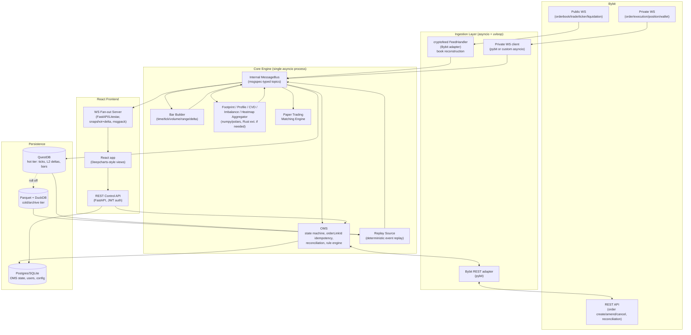

# Python backend architecture options for a Bybit order-flow terminal

> Research phase document. CandleViewer is a private, self-hosted, single-user (+ a few account managers) crypto-only trading terminal targeting Bybit first. This document evaluates Python backend architecture choices for real-time order-flow data ingestion, aggregation, order management, storage, and replay.

## 1. Scope recap

- Real-time ingestion of Bybit WebSocket streams (public: trades, orderbook L2 depth deltas at 50/200/500/1000 levels, tickers, liquidations; private: orders, executions, positions, wallet) for N symbols (initially BTCUSDT, ETHUSDT, expandable).
- Local order book reconstruction from snapshot+delta.
- Bar building: time-based, tick, volume, range, and delta bars.
- Footprint/profile aggregation (Deep Print/Deep Profile equivalents), CVD, imbalance, heatmap grid, Deep Stats-style metrics.
- Fan-out broadcasting to a React frontend over WebSocket with backpressure handling, snapshot+delta protocol, and optionally binary encoding.
- Order management system (OMS): state machine, idempotent order submission via `orderLinkId`, reconciliation after reconnect, rule-engine execution for custom stops/exits, and a paper-trading matching engine driven by the live book.
- Persistence for tick/L2/OHLC data suited to replay and footprint queries.
- A replay engine for tick-level backtesting with speed controls and deterministic bar rebuild.
- Deployment in WSL Ubuntu now, a small dedicated server later.

## 2. Bybit v5 WebSocket API surface (what the ingestion layer must handle)

Source: Bybit v5 API docs (bybit-exchange.github.io/docs/v5) [1].

### 2.1 Public streams (per product category: spot / linear / inverse / option)

| Stream | Topic pattern | Depth/levels | Push frequency | Notes |
|---|---|---|---|---|
| Orderbook | `orderbook.{depth}.{symbol}` | Linear: 1, 50, 200, 500. Spot: 1, 50, 200. Option: 25, 100 | Linear: L1 10ms, L50 20ms, L200/L500 100ms. Spot: L1 10ms, L50 20ms, L200 200ms. Option: L25 20ms, L100 100ms | Snapshot on subscribe, then deltas. On `amount=0` delete; on new price insert; else update. A fresh snapshot forces a full local rebuild [2]. *Corrected: the previous version of this table listed "1, 50, 200, 1000" for linear/inverse/spot uniformly and a flat "L1000: 200ms" frequency; current Bybit v5 docs and independent SDK documentation describe linear topping out at depth 500 (not 1000) and spot topping out at depth 200 (no 500/1000 tier), with per-tier push frequencies as shown here rather than a single blended figure. The original 1000-depth figure could not be re-confirmed against a primary Bybit source during this pass and has been removed pending direct re-verification against `bybit-exchange.github.io/docs/v5/websocket/public/orderbook` at implementation time [45][46].* |
| Trade | `publicTrade.{symbol}` | n/a | real-time | Includes side, price, size, trade id, block-trade flag. |
| Ticker | `tickers.{symbol}` | n/a | real-time (throttled ~100ms typical) | 24h stats, mark/index price, funding, OI. |
| Kline | `kline.{interval}.{symbol}` | n/a | 1–60s depending on candle close | Can be used as a sanity cross-check against self-built bars, not a primary source given custom bar types are required. |
| Liquidation | `liquidation.{symbol}` | n/a | real-time | Deprecated in favor of `allLiquidation.{symbol}` per current docs — verify current status at implementation time. |
| All-liquidation | `allLiquidation.{symbol}` | n/a | real-time, snapshot only, updates every 1s aggregated | Newer replacement for per-symbol liquidation stream. |

### 2.2 Private streams (single authenticated `/v5/private` endpoint)

| Stream | Purpose |
|---|---|
| `position` | Real-time position changes. |
| `order` | Order lifecycle changes. |
| `execution` | Fills/trades on the account. |
| `execution.fast` (fast-execution) | Lower-latency execution stream, reduced field set, recommended for latency-sensitive fill handling [3]. |
| `wallet` | Balance/margin changes. |
| `greeks` | Options Greeks (not needed for BTC/ETH linear perp focus, but architecture should not preclude options later). |

Connect/auth reference: `/v5/ws/connect` (op: `subscribe`/`unsubscribe`/`auth`/`ping`, JSON envelope `{req_id, op, args}`, server replies with ack `{success, ret_msg, op, conn_id}` plus topic pushes `{topic, type, ts, data}`) [4]. An unofficial but useful AsyncAPI spec mirroring this exists at `api-evangelist/bybit` [5].

### 2.3 Order entry over WebSocket (Trade WS)

Bybit v5 also exposes `order.create` / `order.amend` / `order.cancel` as **WebSocket trade operations** (`wss://stream.bybit.com/v5/trade`), which can shave round-trip latency versus REST for time-critical stop/exit execution. Demo trading does **not** support the WS trade API (see below) — REST must be used for demo-mode order entry [6].

### 2.4 Demo trading environment

- Domain: REST `https://api-demo.bybit.com`, WS private `wss://stream-demo.bybit.com`. Public market data for demo is identical to mainnet and is fetched from the normal mainnet public WS endpoints (demo has no separate public feed) [6].
- `testnet` and `demoTrading` are mutually exclusive; using demo requires `testnet=false`.
- Demo trading account is a logically separate sub-account with its own API keys, a limited endpoint list (market data, order create/amend/cancel/cancel-all, get open orders/history, position list, set-leverage, switch position-mode), 7-day order retention, and non-upgradable default rate limits [6].
- Implication for architecture: the OMS/exchange-adapter layer needs an explicit **environment enum** (`demo` / `live` / `testnet`) that swaps base URLs and disables WS order entry when in demo mode, while still using the shared public-data ingestion path.
- **Re-verification of this limitation as of this research pass (September 2026)**: the WS-trade-API-unsupported-on-demo limitation was re-checked and remains current — no changelog entry or documentation update was found indicating this has been lifted; demo trading continues to require REST for order create/amend/cancel while WS trade operations remain mainnet/live-only [63]. Separately, several other Bybit v5 account/API policy changes were identified during this pass that are not directly about the demo-WS-trade limitation but are relevant to CandleViewer's OMS/deployment planning and were previously unverified in this document: (a) API key IP-allowlist management was restricted to browser-only configuration (no longer editable via API) as of a February 2026 change; (b) newly registered Bybit accounts face a cooldown period before API key creation is permitted; (c) some REST endpoint rate limits (e.g., transaction-log polling) were tightened during 2026. These should be treated as illustrative of the pattern the Risks table already flags generically ("Bybit API changes... break the ingestion/OMS adapters without warning," Section 10) — CandleViewer's deployment/setup process should not assume IP-allowlisting can be automated, and should re-check the current changelog immediately before implementation given the pace of these changes [40][63].

### 2.5 Order idempotency and reconciliation

- `orderLinkId` is a client-supplied custom order ID (string) accepted by `/v5/order/create` and related endpoints; Bybit deduplicates repeated submissions with the same `orderLinkId` within its retention window, which is the mechanism to use for **idempotent order submission** (e.g., a rule engine that might retry after a timeout) [7].
- Reconciliation after reconnect (both WS reconnect and process-crash-restart) should: (1) re-authenticate the private WS, (2) call REST `GET /v5/order/realtime` (open orders) and `GET /v5/position/list` to get authoritative state, (3) diff against locally cached OMS state keyed by `orderLinkId`, (4) replay/backfill any executions from `GET /v5/execution/list` for the gap window, (5) resume streaming. This mirrors the pattern used by mature SDKs (see below).
- **Clock synchronization / timestamp drift (`recv_window`)**: Bybit's signed REST requests require a `timestamp` parameter and reject the request (error code **10002**, "invalid request, please check your server timestamp or recv_window param") if `timestamp` falls outside the window `server_time - recv_window <= timestamp < server_time + 1000` — the default `recv_window` is **5000ms**, so any local clock drift beyond roughly that tolerance (in either direction) from Bybit's server time causes signed-request rejection, directly threatening OMS reliability (a rejected order-create/cancel during drift is a missed stop/exit) [61][62]. Mitigations, in order of robustness: (1) run NTP (`chrony` or `ntpd`) on the host (WSL Ubuntu now, dedicated server later) so the local clock does not drift materially from real time in the first place — this is the correct primary fix, not a workaround; (2) additionally fetch Bybit's server time (`GET /v5/market/time`) periodically and compute a local offset to apply to outgoing signed-request timestamps, which pybit and ccxt both support doing automatically (ccxt's `adjustForTimeDifference` option) as defense in depth; (3) treat `recv_window` itself as a tunable safety margin (e.g., raising it from the 5000ms default to 10000ms) only as a stopgap, not a substitute for actual clock sync, since a larger window also technically widens the replay-attack tolerance window for a compromised/leaked signed request. The OMS's REST adapter (Section 5) should surface error code 10002 distinctly (not as a generic failure) so a persistent occurrence is diagnosed as a clock-sync problem rather than treated as an ordinary transient API error.
- Existing Node.js SDK `tiagosiebler/bybit-api` documents exactly this operational pattern: automatic heartbeat-based disconnect detection (including Bybit's mandated ~24h forced disconnect *(third-party SDK claim, not independently confirmed against Bybit's own WS docs page during this pass — Bybit's official `connect` docs describe the ping/pong keepalive mechanism and recommend clients send `ping` roughly every 20s, but this research could not locate an explicit "~24h forced disconnect" statement on a first-party Bybit page; treat the 24h figure as plausible-but-third-party-sourced until confirmed directly against `bybit-exchange.github.io/docs/v5/ws/connect` at implementation time)*), automatic reconnect + resubscribe, and an emitted `reconnected` event applications should hook to trigger reconciliation [8][9]. There is no equivalently mature official *async* Python client with the same reconnect ergonomics (see §7), so this reconciliation logic will need to be built explicitly in the CandleViewer OMS rather than assumed from the client library.

### 2.6 WebSocket subscription, connection, and REST rate limits (ingestion/OMS design constraints)

These are hard operational ceilings that directly constrain how the ingestion layer batches subscriptions and how the rule engine paces order submissions.

- **Max topics per `subscribe` request**: Bybit's v5 public WebSocket API caps each individual `subscribe` op at **10 topics/args per request** (e.g., 10 `orderbook.{depth}.{symbol}` + `publicTrade.{symbol}` entries combined). Requests exceeding this are rejected; a client needing more must either issue multiple sequential `subscribe` ops on the same connection or open additional connections [47]. For CandleViewer's initial 2-symbol scope this is a non-issue (well under 10 topics total for orderbook+trade+ticker per symbol), but the ingestion layer's subscription manager should batch/chunk topic lists into groups of ≤10 from day one so it does not silently break when symbol count grows.
- **WS connection limits per IP**: Bybit enforces **no more than 500 new WebSocket connections within a rolling 5-minute window per IP address** across `stream.bybit.com` and regional mirrors, with a separate ceiling of **up to 1,000 concurrent connections per IP** for market-data streams, counted separately per category (spot/linear/inverse/option) [48]. CandleViewer's single-process design (Section 8.3) opens a small, stable number of long-lived connections (one private, a handful of public per category) and should avoid connect/disconnect churn (e.g., reconnect-storm behavior on a flaky network) that could trip this per-IP ceiling — the reconciliation/reconnect logic (Section 2.5) should include exponential backoff specifically to respect this limit.
- **REST order-endpoint rate limits**: Bybit's v5 rate limits are enforced **per UID, per endpoint, on a rolling window**, with limits documented per endpoint/account tier and returned live in response headers (`X-Bapi-Limit`, `X-Bapi-Limit-Status`, `X-Bapi-Limit-Reset-Timestamp`) rather than being a single fixed global number — default (non-VIP) UTA accounts commonly see limits in the region of **10 requests/second for order create/amend/cancel**, scaling upward for higher VIP tiers [49]. The rule engine and any retry/reconciliation logic must read and respect these headers (or maintain a local token-bucket calibrated conservatively below the documented default) rather than assuming a hardcoded constant, since the exact number varies by account tier and can change; the OMS should treat `429`/rate-limit-rejection responses as a signal to back off and re-queue rather than drop the order.
- **WS ping/keepalive**: Bybit's official WS docs specify clients should send a `{"op":"ping"}` frame periodically (Bybit's examples and most SDKs use a ~20s interval) and expect a `pong` response; failing to ping risks idle-timeout disconnects. The ingestion layer's connection manager should run a dedicated heartbeat task per connection independent of the main message-processing loop so that back-pressure or GC pauses elsewhere in the process cannot starve the ping and trigger a spurious disconnect.

### 2.7 Unified Trading Account (UTA) vs Classic account

- Bybit has been migrating all accounts toward the **Unified Trading Account (UTA)** model; new accounts are UTA by default, and Bybit has been phasing out Classic accounts (Bybit has run staged forced-upgrade migrations of remaining Classic accounts to UTA over 2023-2025) [50]. CandleViewer should **target UTA exclusively** — there is little reason to design for Classic-account code paths on a new project, and doing so would add branching logic (position-mode differences, margin-mode endpoints, separate spot/derivatives wallets under Classic vs one unified wallet under UTA) with no long-term payoff given Bybit's own directional push.
- Practical UTA-specific implications for the OMS: (1) a single unified wallet balance spans spot/margin/derivatives, so wallet-stream (`wallet` topic) parsing must not assume the multiple-per-market-type wallet shape Classic accounts had; (2) **position mode** (one-way vs hedge-mode) is configured via `/v5/position/switch-mode` and is a category-scoped (linear/inverse) setting that must be read and respected by the OMS state machine before placing orders — sending a hedge-mode-shaped order (with `positionIdx`) against a one-way-mode account (or vice versa) is rejected; (3) leverage is set per-symbol via `/v5/position/set-leverage` and, under UTA with cross margin, leverage/margin behavior interacts with the unified margin pool rather than an isolated per-market wallet, which the risk/rule engine should account for when sizing stops. CandleViewer's OMS should read the account's configured position mode and margin mode at startup/reconciliation time and cache it, treating a mismatch between expected and actual mode as a hard startup error rather than attempting to auto-switch modes with open positions present [50][51].

## 3. Reference OSS architectures

### 3.1 NautilusTrader (nautechsystems/nautilus_trader)

The most architecturally relevant reference project: an open-source, Rust-core algorithmic trading platform with Python bindings, designed for research-to-live parity [10].

- Design patterns: Domain-driven design, event-driven architecture, pub/sub plus req/rep plus point-to-point messaging, ports-and-adapters, crash-only design [11].
- Core components (NautilusKernel): MessageBus (in-memory pub/sub plus point-to-point plus request/response bus carrying Data/Event/Command messages under a topic hierarchy like `data.<kind>...`, `data.pipeline.<kind>...`), DataEngine (routes market data such as quotes, trades, bars, book deltas, custom data to subscribers), ExecutionEngine (order lifecycle, routes commands to venue adapter clients, handles execution reports and reconciliation of external execution state on connect), RiskEngine, Portfolio, Cache (state store for instruments/accounts/orders/positions), and Trader (actors/strategies) [11][12].
- Environment contexts: Backtest (historical plus simulated venue), Sandbox (real-time data plus simulated venue, i.e. paper trading against the live book), Live (real-time data plus real venue). The same strategy/actor code runs unmodified across all three environments — directly the pattern CandleViewer should copy for its own paper-trading matching engine vs live OMS split [11].
- Bar aggregation: the nautilus-data crate explicitly documents "bar aggregation machinery supporting tick, volume, value, and time-based aggregation" plus "order book management and delta processing" as first-class engine responsibilities, validating that a tick/volume/range/time/delta bar builder is a well-trodden design, not a bespoke risk [13].
- Rust migration: NautilusTrader has been migrating from a v1 Cython/Python legacy core to a v2 pure-Rust core with PyO3 bindings for user-facing Python strategies. The capability matrix shows DataEngine, ExecutionEngine, RiskEngine, MessageBus, Cache, matching engine, etc. all implemented in Rust with Python actors/strategies riding on top [14]. This is strong external validation for the "aggregation/matching hot path in Rust, orchestration in Python" split recommended below (Section 8).
- Bybit adapter: BybitLiveDataClientFactory / BybitLiveExecClientFactory (or newer BybitDataClientFactory / BybitExecutionClientFactory), BybitHttpClient, BybitWebSocketClient, implemented in Rust and exposed to Python. Handles testnet endpoint resolution, per-symbol position-mode configuration (Bybit only accepts BOTH_SIDES for USDT linear perps unless configured otherwise), and documents that in demo mode batch order operations fall back to individual HTTP requests because the demo environment has no trade WebSocket, corroborating the finding in Section 2.4 [15][16].
- Takeaway for CandleViewer: do not adopt Nautilus wholesale (it is a general multi-venue backtesting/live-trading framework with a much larger surface than needed, and its opinionated Rust core adds a steep integration cost for a single-user tool), but mirror its architecture skeleton: a central async message bus, a DataEngine-equivalent that owns book reconstruction plus bar/footprint aggregation and publishes on topics, an ExecutionEngine-equivalent owning OMS plus reconciliation, and a shared Cache of current state that both live and paper-trading contexts read from.

### 3.2 Freqtrade

Popular Python (ccxt-based) crypto trading bot framework. Threaded/synchronous-polling architecture rather than a pure asyncio streaming pipeline for most of its core loop; strong backtesting/hyperopt tooling but its data model centers on OHLCV candles, not tick/L2 order-flow analytics (no native footprint/DOM/order-flow features). Its RPC/API server (FastAPI-based) and SQLite-backed trade/order persistence are a reasonable pattern reference for the OMS-state persistence layer, but its market-data pipeline is not a good architectural fit for a DeepCharts-style order-flow terminal, since it is not built around L2 book reconstruction or footprint aggregation.

### 3.3 Hummingbot

Cython/Python market-making and arbitrage bot framework with a connector abstraction per exchange implementing a common order-book-tracker plus user-stream-tracker plus order-tracker interface. The connector pattern (separate OrderBookTracker, UserStreamTracker, and REST Exchange classes per venue, each independently restartable) is a useful modularity template for a multi-exchange-ready Bybit-first adapter layer, matching the requirement that architecture allow more exchanges later. Hummingbot's own aggregation/analytics layer is thin (it is execution-focused, not analytics-focused), so it does not offer a footprint/profile reference, but the connector separation of concerns is worth copying.

### 3.4 Jesse

Python crypto backtesting/live-trading framework centered on OHLCV candles and strategy classes; stores candles in PostgreSQL. Like Freqtrade, not built around tick/L2 order-flow, so limited direct architectural value here beyond confirming that a Postgres/Timescale-family store is a common choice for the candles-plus-trades data class in this ecosystem.

### 3.5 cryptofeed (bmoscon/cryptofeed)

Actively maintained Python feed-handler library normalizing many exchanges' WS feeds (including Bybit) into a common callback-based API for trades, L2/L3 book updates, ticker, open interest, funding, and liquidations [17]. Confirmed native Bybit support with a 2024/2025 migration to Bybit's v5 public streams and a bugfix history that includes Bybit-specific L2_BOOK timestamp normalization (2.5.0, released 2026-08-08) and private-channel connection/subscription fixes (2.4.0) — evidence of an actively maintained, battle-tested Bybit L2 normalization layer that CandleViewer could adopt directly instead of re-implementing snapshot/delta handling from scratch [18].

Supports pluggable backends for data capture/replay: Redis (sorted sets/streams/keys), ZeroMQ, Kafka, PostgreSQL, QuestDB, InfluxDB v2, MongoDB, and raw sockets. It already treats "which time-series store" as a swappable concern via its backend interface, and QuestDB is one of its first-class supported sinks [17][19].

Architecture: a FeedHandler owns one Feed object per exchange, each Feed owns a ConnectionHandler (creates/monitors/restarts WS connections) and a subscription map; callbacks (which must be async, or wrapped via ExecutorCallback) receive normalized Trade/L2Book/Ticker/etc objects [20].

Recommendation: seriously consider using cryptofeed as the ingestion plus book-reconstruction layer for Bybit (and future exchanges) rather than hand-rolling WS reconnect/resubscribe/snapshot-delta logic, feeding its normalized callbacks into CandleViewer's own bar/footprint aggregation engine and a chosen time-series store backend. Trade-off: cryptofeed's abstraction may add normalization overhead and its release cadence/community size is smaller than ccxt, so pin a version and vet the Bybit-specific code path before depending on it for private/execution streams (its private-stream Bybit support is present but less battle-tested than public streams; validate order/execution/position parity against raw Bybit v5 payloads before relying on it for OMS-critical data).

### 3.6 tardis-machine (tardis-dev)

A locally runnable Node.js server providing tick-level historical and consolidated real-time crypto market data replay via HTTP and WebSocket, with local caching of downloaded tick data [21]. It is not a Python library and is oriented around the Tardis.dev commercial historical data product, but its design pattern — a local replay server exposing the same WS message shape for both live and historical/replayed data so downstream consumers (charting UI, strategy code) do not need to know whether they are looking at live or replayed data — is exactly the abstraction CandleViewer's own replay engine should target: replayed ticks/L2 deltas pushed through the same internal message bus topics used for the live path, at controllable speed.

### 3.7 Cryptostore

A companion project to cryptofeed (same author, bmoscon) purpose-built for archiving cryptofeed data into a backend store (originally Arctic/MongoDB-oriented) and later re-streaming/exporting it. Smaller and less actively maintained than cryptofeed itself; treat as a design reference for "capture now, backfill/replay later" rather than a dependency to adopt directly. CandleViewer's storage choice (Section 5) plus a purpose-built replay reader will likely be a better long-term fit than adopting Cryptostore's own store abstraction.

## 4. Async web frameworks and performance substrate

### 4.1 Framework comparison for the WS fan-out + REST control API

| Framework | ASGI/WSGI | WebSocket support | Notes |
|---|---|---|---|
| FastAPI (+ Starlette + uvicorn) | ASGI | Native via Starlette `WebSocket`; supports `websocket.accept()`, `receive_text/bytes`, `send_text/bytes` loops | Most widely used; huge ecosystem, Pydantic-based validation (or msgspec if bypassing Pydantic for hot paths), dependency injection, OpenAPI docs for the REST/control side. For multi-worker deployments, in-process broadcast state does not span workers — needs a shared pub/sub (e.g. Redis) or single-worker deployment, which is acceptable for a single-user tool [22]. |
| Litestar | ASGI | Three WS styles: low-level route handler, `websocket_listener`/`WebsocketListener` (event-driven, DTO + msgspec-based serialization, optional binary send mode), `websocket_stream`/`send_websocket_stream` (proactive, stream-oriented) [23][24] | Built on msgspec for serialization by default (vs FastAPI/Pydantic), which shows up in Litestar's own benchmarks as faster JSON throughput and dependency-injection throughput than FastAPI in "stock" configuration comparisons [25]. Smaller ecosystem/community than FastAPI but a strong fit given CandleViewer's own preference for high-throughput binary/JSON WS fan-out. |
| aiohttp | ASGI-adjacent (its own server, not ASGI) | Native `web.WebSocketResponse` | Lower-level, no built-in DI/validation; very mature and widely used for both server and client (also relevant as an HTTP/WS *client* for a custom Bybit connector, see Section 7). |
| Sanic | ASGI-compatible | Native | Focus on raw throughput; smaller ecosystem for this use case; not clearly better than FastAPI/Litestar for a single-user app. |
| Tornado | Own event loop (predates asyncio) | Native, one of the original Python async WS libraries [26] | Legacy option; asyncio interoperability exists but there is little reason to pick it over FastAPI/Litestar for a new project in 2026. |
| Raw `websockets` library | n/a (not a web framework) | Purpose-built asyncio WS library; `websockets.serve()` / `websockets.connect()`, with a documented throughput ceiling around 10K concurrent connections per core because it is pure Python [27] | Suitable both as the outbound Bybit WS *client* and, if a full web framework is not wanted for the frontend fan-out socket, as the fan-out server itself (`websockets.broadcast()` helper exists for exactly this pattern) [27]. For CandleViewer's single-user-plus-a-few scale, the connection-count ceiling is irrelevant. |

Recommendation: **FastAPI** for the REST control/config/auth surface (mature ecosystem, OpenAPI, easy to onboard, sufficient performance for a low-QPS control API), with the **high-frequency WS fan-out socket built on Starlette's raw WebSocket API** (bypassing Pydantic per-message validation) or alternatively **Litestar** if msgspec-first serialization is prioritized end-to-end. Given CandleViewer is not deploying multi-worker/multi-process for a single user, the "workers don't share memory" caveat that normally pushes people toward Redis pub/sub for FastAPI WS fan-out does not apply — a single asyncio process can hold all connections and state in memory, simplifying the architecture considerably (Section 8).

**Resolving citation [22]'s multi-worker caveat, for completeness**: if CandleViewer ever *did* need to scale the fan-out beyond one worker/process (e.g., separating ingestion from fan-out, or running multiple fan-out replicas for redundancy), the standard, well-documented resolution is to introduce **Redis Pub/Sub (or Redis Streams for at-least-once delivery semantics) as a shared broadcast bus between workers**: each worker maintains only its own local `ConnectionManager` of WS clients, subscribes to a Redis channel, and republishes any message it receives on that channel to its own locally-connected clients; a publish from any worker (or the ingestion process) reaches all workers via Redis and is fanned out to each worker's own clients. This requires no client-side changes (no sticky sessions needed for a pure broadcast/fan-out pattern, since every worker relays every message to every client subscribed to that topic) and is the same pattern the message-bus alternatives discussion in Section 8.4 evaluates for the ingestion side. Given CandleViewer's current single-process design (Section 8.3), this is explicitly **deferred, not needed now** — but the internal message-bus abstraction (Section 8.1/8.4) is deliberately kept decoupled from the in-process transport specifically so a Redis-backed bus could be swapped in later without a rewrite of the aggregation/OMS logic itself [54][55].

### 4.2 asyncio vs threads, uvloop, GIL, and Python 3.13 free-threading

- **uvloop**: drop-in libuv-based event loop replacement for asyncio, bundled by default via `uvicorn[standard]`'s "standard" extras [28]. Should be enabled explicitly (`uvicorn --loop uvloop` or programmatically) for the ingestion/fan-out process; well-proven for I/O-bound WS-heavy workloads.
- **asyncio vs threads**: the ingestion (many concurrent Bybit WS connections), fan-out (many concurrent frontend WS connections), and OMS I/O (REST calls) are all I/O-bound and map naturally onto a single-threaded asyncio event loop with uvloop. CPU-bound work — bar aggregation, footprint binning, heatmap grid computation, imbalance/CVD calculation over incoming ticks — is the part that risks blocking the event loop if implemented naively in pure Python. Standard mitigations: (a) keep per-tick aggregation update cost O(1)/O(log n) with numpy/polars vectorized batch flushes rather than Python-loop-per-tick where possible, (b) offload genuinely heavy batch recomputation (e.g., full footprint rebuild on replay, heatmap grid regeneration over a large window) to a `ProcessPoolExecutor` or a Rust/PyO3 extension so it doesn't block the event loop, (c) for CPU-bound hot loops that must stay in-process, consider `numba`-jitted functions called from async code via `loop.run_in_executor`.
- **GIL and Python 3.13 free-threading**: Python 3.13 introduced an experimental free-threaded build (PEP 703, no-GIL) allowing true multi-core parallelism for CPU-bound Python threads. As of the 3.13/3.14 timeframe this remains **experimental/opt-in** (separate `python3.13t` build), with an ecosystem compatibility tax (C extensions must be built with free-threading support; numpy, and the broader scientific stack, have been incrementally adding free-threaded wheels but compatibility is not yet universal as of this research). For a project starting now, treat free-threading as **not yet a dependable default** for CandleViewer; design the CPU-bound hot path (footprint/heatmap aggregation, matching engine) so it can be pushed into a Rust extension or a separate process regardless of whether free-threading matures, rather than betting the architecture on GIL removal landing smoothly in the near term. Revisit once numpy/polars/uvloop and other key deps have stable free-threaded wheels.

### 4.3 Serialization: msgspec, orjson, protobuf/binary framing

- **msgspec**: benchmarked as decoding **and validating** JSON faster than orjson can decode alone; msgspec `Struct` types are reported as 5–60x faster than dataclasses/attrs for common operations, and encode/decode can be 10–80x faster than "alternative libraries" for supported types, per the msgspec project's own README/benchmarks [29][30]. Also supports MessagePack, YAML, TOML with the same API, which is attractive for a **binary** WS wire format (MessagePack) without hand-rolling a serializer.
- **orjson**: a fast Rust-backed JSON library, still meaningfully faster than stdlib `json`, but consistently benchmarked slower than msgspec's JSON path (independent community benchmark on Python Discord shows the full ranking: msgspec > simdjson > orjson > stdlib json for decode-heavy workloads, msgspec offering both encode and decode plus optional schema validation) [31][30].
- **Recommendation**: standardize the internal message bus and the outbound frontend WS protocol on **msgspec** (`msgspec.Struct` for internal message types, `msgspec.json.encode`/`msgspec.msgpack.encode` for wire framing). This gives schema validation on ingest (useful for defending against malformed Bybit payloads) essentially "for free" alongside best-in-class serialization speed, and both JSON (dev-friendly, works with any WS client for debugging) and MessagePack (compact binary framing for production, especially for the L2 heatmap/DOM feed which is the highest-volume outbound stream) are available from the same library without adding protobuf/gRPC complexity for a single-consumer (own React app) system.

#### 4.3.1 Binary framing alternatives beyond msgpack, and concrete backpressure strategy

The brief calls out both "binary encoding" and "backpressure" as first-class requirements; the following expands on concrete options and mechanisms rather than treating msgpack as a given.

- **Binary format comparison**:
  - **MessagePack** (via msgspec, above): schema-less binary JSON superset, smallest implementation cost since it reuses msgspec's existing Struct-based encode/decode path with zero extra tooling; slightly larger on the wire than a hand-tuned fixed-schema binary format because it still carries some self-describing framing overhead, but this is a minor cost at CandleViewer's single-consumer, LAN/localhost-scale deployment.
  - **Protocol Buffers (protobuf)**: requires a `.proto` schema, a compile step (`protoc`), and generated Python bindings; produces smaller payloads and stricter schema evolution guarantees than msgpack, but adds a build-pipeline dependency and cross-language codegen ceremony that is hard to justify for a system with exactly one internal consumer (CandleViewer's own React app) and no external API contract to stabilize.
  - **FlatBuffers / Cap'n Proto**: zero-copy, no deserialization step at all — the wire buffer is read directly as a typed view — which is the fastest possible option for very large messages (e.g., a full DOM/heatmap snapshot) but has meaningfully higher implementation complexity (schema compiler, more verbose access API) than msgpack for marginal benefit at CandleViewer's message sizes (per-tick/per-delta updates, not multi-megabyte blobs).
  - **permessage-deflate (WS-level compression, RFC 7692)**: a transport-layer option orthogonal to the message-encoding choice above — compresses the WS frame itself regardless of whether the payload is JSON or msgpack. Most Python WS server stacks (websockets, uvicorn/Starlette via `wsproto`) support enabling it, but per-message deflate adds CPU cost per frame and is generally most valuable for larger, more-compressible payloads (e.g., JSON) rather than already-compact binary msgpack frames, where the CPU cost of compression can outweigh the marginal bytes saved. Recommendation: skip permessage-deflate for the high-frequency msgpack fan-out stream (compression overhead is not worth it on already-compact binary frames at this message rate) and reserve it only if a future JSON-based debug/dev WS path needs bandwidth savings.
  - **Overall recommendation stands**: msgpack via msgspec remains the pragmatic choice — it reuses the same serialization library already chosen for schema validation, avoids a codegen toolchain, and is "good enough" at CandleViewer's message sizes and single-consumer scale; revisit protobuf/FlatBuffers only if profiling shows serialization or bandwidth is an actual bottleneck (unlikely on a LAN/localhost deployment).

- **Concrete backpressure/slow-consumer strategy**: the general pattern from the Python asyncio ecosystem is a **bounded queue per WS connection** feeding a dedicated sender task, with an explicit **drop policy** rather than unbounded buffering:
  1. Each client connection gets its own `asyncio.Queue(maxsize=N)` (N tuned per stream type — small, e.g. 2-8, for the highest-frequency DOM/heatmap stream where only the latest state matters; larger for lower-frequency streams like OHLC bar closes where every event matters).
  2. On publish, if the queue is full, apply a **drop-oldest-and-coalesce** policy for state-like streams (DOM/heatmap/orderbook snapshots): evict the oldest queued update and/or replace it with the newest full-state snapshot for that symbol, since only the latest book state is meaningful to a lagging client — this is a natural fit given the fan-out protocol is already snapshot+delta (a coalesced "catch-up" message can just be a fresh snapshot). For event-like streams (trade prints, order fills, footprint cell deltas) where every event is meaningful, prefer **disconnect-the-slow-client** over silently dropping trade data, since a client that cannot keep up with trade prints is arguably better served by a forced resync (client reconnects and re-requests a snapshot) than silently missing prints.
  3. A dedicated sender task per connection drains its queue and writes to the socket; this decouples the publish path (aggregation engine writing to the bus) from any single slow client's socket I/O, so one laggy browser tab cannot back-pressure the entire fan-out or, worse, the ingestion/aggregation core.
  4. Monitor per-connection queue depth as a metric (Section 9.3) and log/disconnect when a client's queue has been persistently full for more than a short threshold (e.g., a few seconds), since that is a strong signal of a dead or badly throttled client rather than a transient burst.
  This pattern (bounded queue, drop-oldest/coalesce for state streams, task-per-connection isolation) is the standard asyncio community answer to WS backpressure and requires no additional framework or library beyond `asyncio.Queue` itself [52][53].

### 4.4 Numeric/aggregation layer: numpy, polars, numba, Rust/PyO3

- **polars vs pandas**: independent benchmarks consistently show polars (Rust-backed, Arrow columnar, multi-threaded, SIMD, lazy query optimization) outperforming pandas by roughly an order of magnitude on filter/groupby/join/aggregate workloads typical of bar/footprint construction, while also using less memory and having a much smaller/faster import footprint (polars ~70ms import vs pandas ~520ms) [32][33]. For CandleViewer's replay engine (bulk historical aggregation) and any batch-recompute paths, polars is the clear choice over pandas.
- **numpy**: still the right tool for the live, per-tick, low-latency incremental aggregation path (footprint cell increments, running CVD, rolling VWAP) where you're maintaining small in-memory arrays/structures updated one event at a time rather than doing bulk DataFrame operations — polars/pandas both carry per-call overhead that is wasteful for single-row incremental updates; plain Python objects/numpy scalars or a small custom ring-buffer class are more appropriate there.
- **numba**: JIT-compiles numeric Python functions to machine code; a good fit for CPU-bound numeric hot loops (e.g., recomputing a full heatmap grid or a large footprint rebuild during replay) that are difficult to vectorize cleanly with numpy/polars, without leaving the Python ecosystem. Compilation warm-up cost and debugging opacity are the trade-offs.
- **Rust via PyO3/maturin**: the highest-ceiling option for genuinely hot, latency-critical paths (order book delta application at 100–200ms cadence across many symbols/depths, the paper-trading matching engine, footprint cell updates at tick rate). `maturin` (`pip install maturin`, `maturin develop --release`) is the standard toolchain for building a Python extension module in Rust and is exactly the same toolchain polars itself uses for its Python bindings [34]. Given NautilusTrader's own trajectory (Rust core, PyO3-exposed to Python, Section 3.1) and polars' own precedent, a **Rust extension for the order-book reconstruction + bar/footprint aggregation engine**, called from an asyncio Python orchestration layer, is a credible and de-risked target architecture if pure-Python/numpy/polars turns out not to sustain the required tick rates in practice — but it should be treated as a **phase-2 optimization**, not a phase-1 requirement: start with numpy/polars in pure Python, and only invest in a PyO3 extension for whichever specific hot path profiling identifies as the bottleneck (most likely: multi-symbol, multi-depth L2 delta application, given Bybit pushes 200-depth updates every 100ms and 1000-depth every 200ms per symbol [2]).

## 5. Bybit client library choice

| Option | Sync/async | WS implementation | Assessment |
|---|---|---|---|
| **pybit** (official, `bybit-exchange/pybit`) | REST: sync (`requests`). WS: threaded, callback-based, built on `websocket-client` + Python `threading` (confirmed from source: `_websocket_stream.py` uses `websocket` (websocket-client) and `threading`, with a manual ping/pong keep-alive loop, not asyncio) [35][36] | Official V5 unified WS client covering all public categories (`inverse`, `linear`, `spot`, `option`, `misc/status`) and `private`; convenience methods per topic (`orderbook_stream`, `position_stream`, `order_stream`, `execution_stream`, `fast_execution_stream`, etc.) [36] | Being the **official** SDK means fastest alignment with new Bybit API changes, but its **thread-based, callback WS model does not integrate natively with an asyncio event loop** — every inbound message would need to be bridged into the asyncio world (e.g., via `asyncio.run_coroutine_threadsafe` or a thread-safe queue consumed by an asyncio task). This is a manageable but real integration cost, and it means pybit's WS layer cannot be "just awaited" alongside the rest of an asyncio-based ingestion pipeline. |
| **ccxt / ccxt.pro** | REST: both. WS (ccxt.pro only, commercial add-on): asyncio-native `watch*` methods (`watchOrderBook`, `watchTrades`, `watchTicker`, `watchOrders`, etc.) with automatic reconnect | Unified cross-exchange API is attractive for the "allow more exchanges later" requirement, and ccxt.pro's async design integrates cleanly with an asyncio pipeline | Trade-offs: (1) ccxt.pro is a **paid** product (not part of free ccxt) — *re-verified during this pass: this remains accurate as of 2026; ccxt.pro (also marketed as "CCXT Pro") continues to be a separate paid tier/license layered on top of the free, MIT-licensed `ccxt` package, with WS/`watch*` streaming support gated behind it, so this claim was not stale* [64] — which conflicts with the project's cost-consciousness rationale for avoiding TradingView/DeepCharts subscriptions unless the cost is judged trivial relative to those; (2) the **unified** abstraction can lag or subtly normalize away exchange-specific fields useful for order-flow analytics (e.g., precise sequence numbers, block-trade flags, Bybit-specific liquidation shapes) since ccxt's cross-exchange model favors a common denominator; (3) latency/overhead of the unification layer versus a native client is a known general concern with ccxt, though not independently benchmarked here. Free ccxt (non-Pro) has no WS support, so it is not a candidate for the streaming ingestion path regardless. |
| **cryptofeed** (`bmoscon/cryptofeed`) | Fully asyncio | Native, purpose-built for market-data normalization across many exchanges including Bybit, with pluggable backends (Section 3.5) | Free/open-source, asyncio-native (fits the recommended architecture directly), actively maintained Bybit support including a 2026 L2 timestamp bugfix. Does **not** cover order entry/execution — it is a market-data feed handler, not a trading/execution client, so it only solves the **public-stream** half of the ingestion problem. |
| **Custom `websockets`/`aiohttp` client** | Fully asyncio, hand-rolled | Full control over reconnect/backoff, resubscribe, snapshot/delta handling, and message parsing | Maximum control and no dependency risk, but reimplements what pybit/cryptofeed already provide (auth signing, ping/pong, reconnect state machine) — extra development and maintenance cost, and higher risk of subtly mishandling Bybit-specific edge cases (e.g., the 24h forced disconnect, snapshot-resend-on-desync semantics [2]) that mature libraries have already hardened against. |

### Recommendation

- **Public market data (orderbook/trades/tickers/liquidations)**: use **cryptofeed** as the primary ingestion client. It is asyncio-native, has confirmed and actively-maintained Bybit v5 support, and directly solves L2 snapshot/delta reconstruction — the highest-risk piece of this system to get subtly wrong. This removes an entire class of bugs (partial-fill deltas, resync-on-snapshot, sequence-gap detection) from CandleViewer's own code.
- **Private/execution streams and order entry (OMS)**: use **pybit** (official SDK) for REST order placement/amend/cancel and for the private WS stream, since it is first to reflect new Bybit API changes and is maintained by Bybit staff, but wrap its threaded WS callbacks in a small asyncio-bridge adapter (a `queue.Queue` fed from pybit's callback thread, drained by an asyncio task via `loop.run_in_executor` or `asyncio.to_thread`, or `asyncio.run_coroutine_threadsafe` pushing directly into an `asyncio.Queue`) so the rest of the OMS can remain asyncio-native. Alternatively, since Bybit's private WS protocol is simple (single JSON envelope, HMAC-signed `auth` op, per Section 2.2), a **thin custom asyncio private-WS client** (using `websockets` or `aiohttp`) is a reasonable and arguably lower-friction alternative to bridging pybit's threads, given the private topic surface is much smaller than the public one; this is a genuine open design choice to prototype early (see Open Questions).
- Do **not** adopt ccxt.pro given its cost and the cross-exchange normalization trade-off is not clearly worth it when cryptofeed already gives free, asyncio-native, Bybit-aware public-data handling, and pybit gives official-SDK private/execution coverage.

## 6. Persistence layer: time-series store comparison

Candidate stores for tick trades, L2 order-book deltas/snapshots, and OHLC bars, sized for a single-user (plus a few account managers) research/replay/footprint workload — not a multi-tenant SaaS ingest workload.

| Store | Model | Ingest throughput | Compression | Query fit for replay/footprint | Ops burden | Notes |
|---|---|---|---|---|---|---|
| **TimescaleDB** | PostgreSQL extension (hypertables) | Good (Postgres-based, WAL-bound) | Native columnar compression on older chunks | Full SQL, joins with relational OMS tables (orders/positions/accounts) in the *same* database — a strong integration benefit for a monolith | Low-medium: it's "just Postgres" to operate, familiar tooling, single binary/container | Best "if you want a normal relational database that also does time-series well" — good fit for OMS state + moderate-volume OHLC/footprint aggregates living alongside trading tables. |
| **QuestDB** | Purpose-built time-series DB, column-oriented, SQL with time-series extensions (`ASOF JOIN`, `SAMPLE BY`, `LATEST ON`), WAL → native columnar → Parquet tiered storage | Very high — QuestDB's own TSBS benchmarks claim ~5x faster ingestion than ClickHouse and ~8x faster than TimescaleDB/TigerData on identical hardware/schema, and ~16x vs InfluxDB [37]. Independent 2022 QuestDB-authored benchmark showed similar multi-billion-row/sec query claims, though a ClickHouse maintainer publicly disputed the comparison's fairness (ClickHouse without proper indexes vs QuestDB's default indexing strategy; after adding ClickHouse indexes, ClickHouse "dramatically outperforms" QuestDB in that critic's own re-test, at ~3x the disk footprint) [38][39] — treat QuestDB's own ingestion-benchmark claims as directionally true (it is very fast) but competitor SQL-query benchmarks as vendor-dependent and worth re-validating on CandleViewer's actual query shapes before committing. | Native Parquet export/tiering | `ASOF JOIN`/`SAMPLE BY`/`LATEST ON` primitives map almost directly onto order-flow query patterns (latest book state, time-bucketed aggregation, nearest-trade-to-quote joins) [37] | Low: single binary, Docker image, Postgres-wire compatible client protocol; already has first-class cryptofeed backend support (Section 3.5) | Purpose-built for exactly this workload ("financial market data (tick data, trades, order books, OHLC)" is explicitly called out as a target use case [37]); the strongest single-purpose fit for the raw tick/L2 ingestion path if you don't need to join heavily against relational OMS tables in the same engine. |
| **ClickHouse** | Column-oriented OLAP, MergeTree family | Very high, especially with proper indexing (as shown in the disputed benchmark above where indexed ClickHouse beat QuestDB on a range-filter query while using ~3x less disk) [39] | Excellent (best-in-class in some comparisons — ~3x smaller than QuestDB in the cited benchmark's example) | Powerful SQL/OLAP; less "native" time-series ergonomics than QuestDB (no built-in ASOF/SAMPLE BY equivalents out of the box, though ClickHouse does have its own `ASOF JOIN`) | Medium: more operational complexity than QuestDB/Timescale for a single-node single-user deployment (designed for distributed clusters; running it "small" is well-supported but is still a heavier piece of infrastructure to reason about than embedding SQLite or running one QuestDB/Timescale container) | Best raw analytical query performance/compression ceiling of the server-based options, but arguably over-engineered operationally for a single-user tool unless replay/footprint query volume grows large. |
| **DuckDB + Parquet** | Embedded OLAP engine, queries Parquet files directly (no server process) | N/A as a streaming ingest target (not designed for continuous single-row inserts) — the natural pattern is: buffer live ticks/L2 deltas in memory or a lightweight append log, flush to time-partitioned Parquet files periodically (e.g., per hour/day per symbol), then query with DuckDB | Parquet's native columnar compression, typically excellent for tick data (repetitive prices/sizes) | Excellent for replay and footprint batch queries — DuckDB is very fast scanning partitioned Parquet, integrates beautifully with polars, and needs zero server process | Lowest ops burden of all options — no daemon, no port, just files on disk plus a Python import | Best fit as the **replay/cold-storage/analytics tier**: not a good fit as the *live ingest* target for the highest-frequency raw feed (200/500-depth deltas at 100–200ms per symbol) since it is not designed for row-at-a-time streaming writes, but an excellent fit for the durable archive that the replay engine reads from, and for ad hoc footprint/profile analysis over historical ranges. |
| **ArcticDB** (Man Group) | Python-native, DataFrame-oriented columnar store (successor to original Arctic), no dedicated server required for local/embedded use (also supports S3/LMDB backends) | Designed specifically for quant/tick data workloads; strong for bulk DataFrame writes | Good, Arrow/Parquet-adjacent internals | Very good for "load a DataFrame of a symbol's tick history for a date range" access patterns typical of backtesting — this is its core designed use case | Low for local/embedded mode; more setup for the S3-backed mode | Worth prototyping specifically for the replay engine's read path (bulk DataFrame retrieval per symbol/day) given it's designed by a quant fund for exactly this pattern, though it is less proven than QuestDB/DuckDB/Timescale for the live *ingestion* side and has a smaller community. |
| **SQLite** | Embedded relational DB, single file | Adequate for low-to-moderate insert rates via WAL mode, but not designed for the raw L2-delta tick firehose at multi-symbol scale | Reasonable with careful schema/indexing; no native columnar compression | Fine for OMS/order/account state (small tables, transactional integrity matters more than throughput) and possibly for OHLC bar storage (much lower cardinality than raw ticks/L2) | Lowest possible ops burden — a single file, zero daemon | Recommended for **OMS/state tables only** (orders, positions cache, rule-engine config, users/roles), not for raw tick/L2/footprint data at the volumes this system ingests. |

### Recommendation

A **two-tier, hybrid** storage design, mirroring how cryptofeed itself already treats storage as pluggable (Section 3.5):

1. **Hot/live tier — QuestDB.** Ingest raw trades and L2 order-book deltas/snapshots directly from the cryptofeed QuestDB backend (or a custom minimal writer using QuestDB's ILP/line-protocol ingestion, which is the fastest write path). QuestDB's `SAMPLE BY`/`ASOF JOIN`/`LATEST ON` primitives directly support building OHLC bars, footprint cells, and CVD/heatmap queries without hand-rolled aggregation SQL, and it is Postgres-wire compatible for easy tooling. This is also the source the replay engine reads tick-by-tick from for recent history.
2. **Cold/archive tier — Parquet files + DuckDB.** Periodically (e.g., daily) export/roll QuestDB partitions to Parquet for cheap long-term archival and for footprint/profile batch analytics over long historical ranges via DuckDB + polars, keeping the live QuestDB dataset bounded in size (important for a small self-hosted server rather than a cloud fleet).
3. **Relational/OMS tier — Postgres (optionally the *same* instance in TimescaleDB mode) or SQLite.** Orders, executions, positions cache, rule-engine configuration, user/role records, and audit/journal entries (the "auto-tracker journal" DeepCharts feature) belong in a small relational schema with real transactional guarantees; given the system is otherwise single-user and self-hosted, SQLite is sufficient and minimizes operational surface, but if TimescaleDB is already running for time-series data, reusing the same Postgres instance for OMS tables (plain tables, not hypertables) avoids running two database engines.
4. **Bars/candles**: precomputed time/tick/volume/range/delta bars can be materialized as QuestDB tables (built from `SAMPLE BY` queries over the trade/L2 tables) for fast repeated chart loads, rather than recomputed from raw ticks on every chart open — but the *source of truth* for bar rebuilds remains the raw tick/L2 data so any new bar type or footprint definition can be backfilled deterministically from history (a hard requirement of the replay engine).

This avoids the single biggest operational risk of ClickHouse (cluster-oriented tooling overkill for one user) while getting most of QuestDB's raw performance benefits, and avoids DuckDB/ArcticDB's unsuitability as a live streaming ingest target by relegating them to the archive/analytics tier where their embedded, no-daemon nature is a pure advantage rather than a limitation.

### 6.1 Storage sizing estimate: BTCUSDT + ETHUSDT at 500-depth

Assumptions (order-of-magnitude estimate, to be validated empirically once ingestion is running — Bybit does not publish exact per-symbol message-rate figures):

- Orderbook depth: subscribing at the 200-level topic (`orderbook.200.{symbol}`) is the realistic choice for footprint/DOM purposes rather than the full 1000-level depth (1000-level pushes at 200ms and is unnecessary detail for most order-flow visualization); figures below use 200-depth as the baseline and note the 1000-depth multiplier separately.
- Delta push frequency: 100ms for 200-depth linear/spot symbols → up to 10 delta messages/sec/symbol during continuously active markets (fewer during quiet periods since deltas are only sent when the book changes, but BTCUSDT/ETHUSDT perpetuals are close to always-active).
- Each delta message: typically a handful to a few dozen changed price levels (varies enormously with volatility); assume an average of ~20 changed levels/message as a planning figure, each level being (price, size) ~16–24 bytes raw, well under that once columnar-compressed.
- Trade messages: BTCUSDT/ETHUSDT combined typically produce on the order of a few to several trades per second during active periods, spiking much higher during volatility — assume an average of ~3–5 trades/sec/symbol as a planning baseline.

| Component | Raw estimate (uncompressed, both symbols) | Compressed estimate (QuestDB/Parquet columnar, ballpark 5–10x) |
|---|---|---|
| L2 deltas (200-depth, 2 symbols, ~10 msg/s/symbol, ~20 levels/msg, ~20 bytes/level) | ~10 msg/s × 20 levels × 20 bytes × 2 symbols × 86,400 s/day ≈ **~6.9 GB/day raw** | **~0.7–1.4 GB/day compressed** |
| Trades (2 symbols, ~4 trades/s/symbol average, ~80 bytes/trade raw incl. metadata) | ~4 × 80 × 2 × 86,400 ≈ **~55 MB/day raw** | **~10–20 MB/day compressed** (small relative to L2) |
| Tickers/funding/OI snapshots | Negligible (low-frequency, small payloads) | Negligible |
| **Total per day, 2 symbols, 200-depth** | **~7 GB/day raw** | **~1–1.5 GB/day compressed**, i.e. roughly **~30–45 GB/month**, **~0.4–0.5 TB/year** compressed |
| **If using 1000-depth instead of 200-depth** | Depth is 5x larger per level-count but pushed half as often (200ms vs 100ms) and typically has proportionally more *unchanged* far-book levels each update — a reasonable planning multiplier is **~2–3x** the 200-depth figure, i.e. roughly ~14–20 GB/day raw, ~2–4 GB/day compressed | ~60–120 GB/month, ~1–1.5 TB/year compressed |

These are rough planning numbers, not measured production figures (no public Bybit-side message-rate statistics were found during this research) — the practical recommendation is to **instrument actual ingestion volume in the first week of running the pipeline** against these estimates and adjust retention policy (e.g., downsample/roll off raw 1000-depth history after N days while keeping 200-depth and trades indefinitely) accordingly. Even the higher-end 1000-depth estimate (~1.5 TB/year compressed) is comfortably within reach of consumer NVMe storage on a small dedicated server, so storage capacity itself is not expected to be a binding constraint for a 2-symbol, single-user deployment; it becomes a more material planning input only if/when N grows well beyond 2–5 symbols.

## 7. Replay engine design

Goals: tick-level replay from stored trades + L2 deltas, adjustable speed (including as-fast-as-possible for backtesting and 1x/Nx for visual review), and **deterministic** bar/footprint rebuild so replayed results match what would have been computed live.

Design principles, informed by the tardis-machine pattern (Section 3.6) and NautilusTrader's environment-context model (Section 3.1):

1. **Single code path for live and replay.** The bar builder, footprint/profile aggregator, CVD/imbalance/heatmap computation, and OMS paper-trading matching engine should all consume from the same internal message-bus topics regardless of whether the underlying events originate from the live Bybit WS ingestion path or from the replay reader. This is the core lesson from both NautilusTrader's environment contexts (Backtest/Sandbox/Live share the same engine code) and tardis-machine (same WS message shape for live vs replayed data). Concretely: a `ReplaySource` component reads ordered (trade, L2-delta) events from QuestDB/Parquet for a given symbol/time-range and publishes them onto the exact same internal topics (`data.trade.{symbol}`, `data.book.delta.{symbol}`, etc.) that the live cryptofeed-based ingestion path publishes onto; every downstream consumer is agnostic to the source.
2. **Deterministic ordering.** Bybit's snapshot+delta protocol already carries sequence numbers / timestamps sufficient to totally order events within a symbol; replay must preserve **exact stored order** (not re-sort by wall-clock arrival, which is itself non-deterministic) — the ingestion writer should persist events with a strictly monotonic sequence key per symbol so replay reconstruction is byte-for-byte reproducible.
3. **Speed control** implemented as a scheduler that, instead of firing events at "real time," computes each event's delay from the *previous* event's stored timestamp scaled by a speed multiplier (0 = as-fast-as-possible, 1.0 = real-time, >1.0 = accelerated), publishing them onto the shared asyncio event loop via `loop.call_later`/`asyncio.sleep` scaled sleeps. As-fast-as-possible mode simply removes the sleep and processes events back-to-back, which is what a batch backtest run should use.
4. **Deterministic bar rebuild**: because the bar/footprint aggregator is a pure function of the ordered event stream, rebuilding a different bar type (e.g., switching from 1-minute time bars to volume bars) or backfilling a newly-added footprint metric is simply a matter of re-running the replay reader through the aggregator at any point in the future — this is the primary justification (beyond backtesting) for persisting raw ticks/L2 deltas rather than only OHLC candles.
5. **Testing**: record short real WS sessions as fixtures (raw JSON/msgpack message dumps with timestamps) and replay them through the exact same `ReplaySource` path in unit/integration tests, asserting deterministic output (bar OHLCV values, footprint cell totals, CVD) — this both validates the replay engine itself and gives a fast, reproducible test harness for the aggregation logic without needing a live exchange connection (see also Section 9, testing).

## 8. Recommended architecture

### 8.1 Component diagram

### 8.2 Data flow summary

1. **Ingestion**: cryptofeed's Bybit adapter maintains the local L2 book per symbol/depth from Bybit's public WS snapshot+delta stream and emits normalized trade/book/ticker/liquidation events onto the internal message bus. A separate private-WS client (pybit-based or custom asyncio) authenticates and streams order/execution/position/wallet events onto the same bus.
2. **Aggregation**: the Bar Builder and Footprint/Profile/CVD/Imbalance/Heatmap Aggregator subscribe to raw trade/book-delta topics and publish derived bar-close and cell-update events back onto the bus; these are also written to the QuestDB hot tier.
3. **OMS**: subscribes to private-stream topics (order/execution/position) to maintain authoritative local state keyed by `orderLinkId`; issues REST/WS-trade order commands through the Bybit adapter; on reconnect, runs the reconciliation flow (Section 2.5) against REST snapshots before resuming.
4. **Rule engine / stops**: evaluates configured rules against live price/bar/footprint events flowing through the bus and issues OMS commands (cancel/replace/market-out) when triggered.
5. **Paper trading**: a matching engine subscribes to the same live book/trade events as the live OMS but simulates fills against them instead of hitting the real exchange, sharing the OMS state-machine code (mirroring NautilusTrader's Sandbox environment context, Section 3.1).
6. **Persistence**: all raw events are durably written to the QuestDB hot tier; a scheduled job rolls older partitions to Parquet for the cold/archive tier; OMS/account/config state lives in the relational tier.
7. **Replay**: the Replay Source reads back QuestDB/Parquet history in deterministic order and re-publishes it onto the same bus topics at a controllable speed, so the Bar/Footprint/OMS-paper-trading code paths are exercised identically to live operation.
8. **Fan-out**: the WS Fan-out Server subscribes to whichever bus topics the connected frontend clients need (per-symbol book/trade/bar/footprint updates) and pushes snapshot+delta updates to the React app, using msgspec/MessagePack for the highest-volume streams (L2 heatmap/DOM) and JSON where convenient. The REST Control API handles auth, configuration, and order-placement requests from the UI, delegating to the OMS.

### 8.3 Why a single-process, single-asyncio-loop core

Given the explicit scale (one user plus a few account managers, two-to-a-handful of symbols initially), the architecture deliberately avoids the multi-process/multi-worker complexity that would otherwise be needed to fan out WebSocket state across workers (e.g., Redis pub/sub bridging between uvicorn workers). A single asyncio process, using uvloop, holding the message bus, aggregation state, OMS state, and fan-out connections all in memory, is simpler to reason about, easier to keep consistent (no cross-process race conditions on order state), and entirely sufficient for the expected connection/throughput scale — this mirrors NautilusTrader's own explicit design note that the platform "has been designed to run efficiently on a single thread, for both backtesting and live trading" [11]. CPU-bound hot spots (footprint/heatmap recomputation, matching engine) are the pieces that may need to be offloaded to a process pool or a Rust/PyO3 extension (Section 4.4) precisely *because* the rest of the system commits to staying single-process/single-loop for state-consistency reasons.

### 8.4 Message bus implementation options, evaluated concretely

Section 8.1's diagram labels the core abstraction a "central async message bus," but the underlying implementation choice deserves explicit evaluation rather than being treated as a given, since the whole architecture's decoupling (ingestion → aggregation → OMS → fan-out) depends on it.

| Option | Model | Throughput/latency | Multi-process capable? | Ops burden | Fit for CandleViewer |
|---|---|---|---|---|---|
| **In-process `asyncio.Queue` / pub-sub registry** (plain Python, e.g. a small dict-of-topic-to-subscriber-callbacks plus `asyncio.Queue` per subscriber, or a lightweight library like `blinker`/`pyee` for the callback-dispatch part) | Function calls / in-memory queues, no serialization or network hop needed since publisher and subscriber share the same process/loop | Fastest possible option — nanosecond-scale dispatch, no serialization overhead for same-process delivery | No — confined to one process by definition | Zero — no extra service to run | **Recommended for CandleViewer's phase-1 architecture.** Matches the single-process design (Section 8.3) exactly: aggregation, OMS, and fan-out all live in the same asyncio loop, so an in-process bus avoids paying a serialization+network round trip for every tick just to satisfy a "message bus" abstraction that nothing external needs yet. |
| **Redis Streams** | Persistent, replayable append-only log with consumer groups (at-least-once delivery, can replay from an offset) | Good (single-digit-ms typical latency on localhost), well below in-process speed due to serialization + socket round trip | Yes — natural fit for multiple worker processes or even multiple machines consuming the same stream | Medium — a Redis instance to run/monitor/persist, though trivial via docker compose | Worth adopting **only if/when** CandleViewer splits ingestion and fan-out into separate processes (e.g., to isolate a crash-prone aggregation hot path from the fan-out socket, or to run multiple fan-out replicas) — Streams' replay/consumer-group semantics are also a plausible fit for feeding the replay engine's live path, but this is a "nice architectural symmetry," not a requirement, since the replay engine already has QuestDB/Parquet to read from (Section 6/7). |
| **Redis Pub/Sub** (fire-and-forget, vs Streams' persistent log) | Ephemeral pub/sub, no replay/persistence, no consumer groups | Good, similar latency profile to Streams for the pub/sub-only path, lower overhead than Streams since there's no log to persist | Yes | Medium (same Redis dependency as Streams) | Simpler than Streams if replay/durability of the bus itself is never needed (CandleViewer's actual durability need — historical tick/L2 data — is already served by QuestDB, not the bus), but Streams' consumer-group/replay features cost little extra for meaningfully more flexibility, so Streams is the better default *if* a Redis-backed bus is ever adopted. |
| **ZeroMQ (pyzmq)** | Broker-less socket library with pub/sub, push/pull, req/rep patterns; runs in/out of process without a separate broker service | Very high throughput, very low latency — often faster than a broker-mediated system like Redis or a message queue precisely because there is no broker process in the middle | Yes, including across machines, without needing a separate service to operate (no Redis/Kafka daemon) | Low-medium — no broker to run, but the pub/sub reliability/delivery-guarantee semantics (e.g., slow-subscriber message loss on PUB/SUB) must be handled explicitly in application code rather than relegated to broker configuration | A credible alternative to Redis specifically *because* it avoids adding a new service dependency — if CandleViewer ever needs cross-process messaging without wanting to stand up Redis, ZeroMQ's broker-less pub/sub is worth prototyping. However, for CandleViewer's phase-1 single-process scope it offers no benefit over the free in-process option, and its explicit lack of built-in backpressure/delivery guarantees (a slow ZeroMQ SUB socket silently drops messages by default, similar to the backpressure policy CandleViewer already wants for the frontend fan-out, Section 4.3.1) means it would need the same care Redis Streams' consumer-group acking already provides for free. |

**Recommendation**: build the internal message bus as a thin **in-process asyncio abstraction now** (a typed pub/sub registry over `asyncio.Queue`s, using msgspec `Struct` message types per Section 4.3), but design its public interface (publish/subscribe-by-topic) so that the transport underneath — in-process now, Redis Streams later if genuinely needed — can be swapped without changing aggregation/OMS/fan-out call sites. This directly resolves the multi-process fan-out question raised in Section 4.1: if CandleViewer ever needs to split ingestion from fan-out across processes, Redis Streams is the recommended concrete choice (over Pub/Sub, for its replay/consumer-group durability; over ZeroMQ, for its simpler ops story despite ZeroMQ's raw speed edge) — but this remains a deferred, not-yet-needed architectural option at CandleViewer's stated scale [52][56][57].

## 9. Cross-cutting concerns

### 9.1 Auth for "a few people"

Given a single owner plus a handful of account managers (not a public product), a lightweight approach is appropriate rather than a full OIDC provider:

- **JWT-based session auth** issued by the FastAPI REST Control API against a small local user table (Postgres/SQLite), with roles (`owner`/`admin` full trading control, `viewer`/`manager` restricted to read-only or scoped trading permissions per account). `python-jose` or `PyJWT` plus `passlib`/`argon2-cffi` for password hashing are standard, low-dependency choices.
- If future requirements call for SSO or hardware-key auth, a self-hosted OIDC-compatible identity layer (e.g., Authelia, Keycloak) could front the app, but this is over-engineering for the current stated scope and should only be revisited if the account-manager list grows materially or external access (outside a private network/VPN) becomes a requirement.
- WebSocket connections should authenticate via a short-lived token passed at connect time (query param or first-message auth handshake) rather than relying on cookies alone, to keep the fan-out server's auth check simple and stateless per-connection.

### 9.2 Configuration and secrets

- Separate API key/secret pairs per **environment** (demo, live, testnet) and potentially per account manager if multiple Bybit sub-accounts are used, stored outside source control (`.env` files loaded via `python-dotenv` or `pydantic-settings`, or a local secrets file with restrictive filesystem permissions under WSL). Given self-hosted single-machine deployment, a dedicated secrets manager (Vault, etc.) is not warranted at this scale, but secrets must never be committed and should be loaded exclusively from environment variables or an untracked local file.
- Config should model the environment enum from Section 2.4 explicitly (`demo` / `live` / `testnet`) with per-environment base URLs baked into the adapter layer, not scattered across call sites.
- **Concrete secrets-management practice for a self-hosted single-machine deployment** (expanding on the above given OMS security is a stated concern, Section 10):
  - Store demo/live/testnet API key+secret pairs as environment variables injected via a `docker-compose.override.yml` (untracked, `.gitignore`'d) or an untracked `.env` file loaded by `pydantic-settings`/`python-dotenv` at process start — never bake keys into a committed compose file, Dockerfile, or application config file.
  - **Isolate demo and live keys at the config-model level**, not just by value: model them as distinct typed config sections (e.g., separate `DemoCredentials`/`LiveCredentials` objects) so a code path that reads the wrong environment's key is a type error caught by static analysis/tests, not a runtime accident that could route a demo-intended order to the live account.
  - **Key rotation**: Bybit API keys can be regenerated/revoked from the Bybit web UI at any time; since CandleViewer is single-operator, a practical rotation policy is to rotate live-trading keys periodically (e.g., quarterly) and immediately upon any suspected exposure (accidental commit, shared machine access), restarting the affected service with the new key loaded via the same env-var mechanism — no automated rotation pipeline is warranted at this scale, but the *config loading* path should make a manual rotation a one-file edit + restart, not a code change.
  - **File permissions**: under WSL Ubuntu, any `.env`/secrets file should be `chmod 600` (owner-read/write only) to prevent other local users/processes on the same box from reading it; this is a low-cost hardening step appropriate even for a single-user machine.
  - A dedicated vault (HashiCorp Vault, AWS Secrets Manager, etc.) remains **not warranted** at this scale/deployment model (self-hosted, single operator, no multi-tenant secret sprawl) — revisit only if CandleViewer is ever deployed for a larger team or exposed beyond a private network [58][59].

### 9.3 Observability

- **Logging**: structured logging (`structlog` or stdlib `logging` with JSON formatting) so ingestion errors, reconnects, order-state transitions, and rule-engine triggers are all queryable; correlate by symbol and, for OMS events, by `orderLinkId`.
- **Metrics**: track WS connection uptime/reconnect counts per stream, message ingest rate, aggregation lag (time between event receipt and bar/footprint update publish), and OMS reconciliation events. A lightweight local Prometheus + Grafana pair (both trivially run via docker compose) is a reasonable, low-cost choice for a self-hosted single-machine deployment; alternatively a simpler local metrics endpoint plus log-based alerting may suffice given the modest scale.
- **Alerting on disconnects**: since this is a trading system, a disconnect from either public market data or the private stream (especially the latter, since it risks missing fills/liquidation) should trigger an immediate notification — a simple approach (webhook to Telegram/Discord/email, or a desktop notification if the operator is expected to be at the machine) is sufficient; a full paging system (PagerDuty, etc.) is unnecessary at this scale.

### 9.4 Deployment

- **Now (WSL Ubuntu)**: `docker compose` running the core Python service, QuestDB, and (if separate) Postgres, with the React frontend either served by the same box or run via its own dev/build process; systemd (or WSL's own service management) can supervise the docker compose stack or a directly-run Python process, restarting on crash.
- **Later (small dedicated server)**: the same docker compose stack should be directly portable to a small Ubuntu VPS/mini-PC with minimal changes — this is a strong argument in favor of containerizing QuestDB/Postgres/the core service now rather than depending on WSL-specific paths, so the "move to a small server later" transition is a docker compose file copy plus DNS/network changes rather than a re-architecture.
- Given the security-sensitive nature (API keys with live trading permissions), the dedicated server deployment should be firewalled to only expose the frontend/API over a VPN or SSH tunnel rather than the open internet, given this is explicitly not for public release.

### 9.5 Testing

- **Recorded WS fixtures**: capture real Bybit public and private WS sessions (raw JSON/msgpack dumps with timestamps) covering normal operation, a snapshot resync event, a 24h forced disconnect/reconnect cycle, and order lifecycle events (new/partial-fill/full-fill/cancel/reject), and replay them through the ingestion + aggregation + OMS code paths in automated tests.
- **Deterministic replay tests**: assert that replaying a fixture through the Bar Builder/Footprint Aggregator produces byte-identical (or numerically-identical within float tolerance) output across runs, and that switching bar type or backfilling a new footprint metric against the same fixture produces the expected recomputed values — this is the core regression-safety net for any change to aggregation logic.
- **OMS reconciliation tests**: simulate a disconnect-during-open-orders scenario against fixture REST responses and assert the reconciliation flow correctly reconstructs local OMS state, including idempotent handling of an order whose `orderLinkId` was already accepted before the disconnect.
- **Paper-trading matching engine tests**: verify simulated fills against a recorded live book fixture match expected fill price/size/timing given a simulated order's price/size/type.
- **Load/soak testing methodology** (directly addressing the top-ranked risk in Section 10 — pure-Python aggregation not sustaining tick rates — which otherwise has no corresponding validation plan): standard practice for validating a Python asyncio real-time pipeline against the "does it sustain the real message rate for hours, not just seconds" concern is:
  1. **Synthetic multi-symbol load generator**: build a fixture-replay harness that can replay recorded WS sessions (Section 9.5's fixtures) at **N× real-time speed** (not just 1×) to find the throughput ceiling before it's hit in production, and at sustained real-time speed for **multi-hour soak runs** to catch slow leaks (memory growth, queue depth creep, GC pause growth) that only manifest over time, not in a short smoke test.
  2. **Event-loop lag monitoring as the core health metric**: instrument the aggregation process to periodically schedule a trivial callback (e.g., via `loop.call_later` or a dedicated lightweight heartbeat coroutine) and measure the delta between expected and actual fire time — a growing gap is the standard, most direct signal that the event loop is falling behind (CPU-bound work is blocking it), which is a more actionable metric during a load test than downstream symptoms like "chart looks stale." Libraries/approaches for this include a simple custom watchdog coroutine (no extra dependency needed) or `aiomonitor`/`asyncio`'s own debug mode (`PYTHONASYNCIODEBUG=1`, which logs callbacks/coroutines taking longer than a threshold) during test runs.
  3. **Throughput/latency benchmark harness design**: measure, at increasing synthetic symbol counts (e.g., 2, 5, 10, 20 symbols replayed concurrently) and increasing depth tiers (50→200→500), the per-event processing latency (time from event dequeued off the bus to aggregation-state update published) and the sustained maximum ingestion rate before event-loop lag crosses an acceptable threshold (e.g., 50-100ms) — this produces a concrete "N symbols at 200-depth is the practical single-process ceiling" number to validate or refute the architecture's single-process assumption (Section 8.3), rather than leaving that as an unvalidated assertion.
  4. **CI integration**: run the short-duration (minutes, not hours) version of this harness as part of CI to catch aggregation-performance regressions per-commit; reserve the multi-hour soak run for a periodic (e.g., weekly, or pre-release) manual/scheduled job given its runtime cost, rather than blocking every CI run on it [60][61].

## 10. Risks

| Risk | Likelihood | Impact | Mitigation |
|---|---|---|---|
| Pure-Python aggregation (bar/footprint/heatmap) cannot sustain required tick/L2 update rates at N symbols, causing event-loop lag or dropped updates | Medium | High (stale charts, incorrect metrics, or missed rule-engine triggers) | Profile early against realistic multi-symbol load; have the Rust/PyO3 extension path (Section 4.4) ready as a fallback for whichever specific hot loop is the bottleneck, rather than discovering this late. |
| cryptofeed's Bybit private-stream support is less battle-tested than its public-stream support, risking subtly incorrect OMS state if relied upon | Medium | High (incorrect position/order state is a direct trading risk) | Use pybit (official SDK) for private streams/order entry rather than cryptofeed, per Section 5's recommendation; independently validate any cryptofeed-derived public data against raw Bybit payloads during initial integration. |
| pybit's thread-based WS model introduces subtle bugs when bridged into the asyncio core (race conditions, dropped messages under load) | Medium | Medium-High | Prototype the bridge early with a synthetic high-rate message generator; strongly consider a custom minimal asyncio private-WS client instead, given the private topic surface is small (Section 5). |
| QuestDB's competitive benchmark claims are partly disputed (ClickHouse maintainer's rebuttal, Section 6) — real query performance on CandleViewer's actual footprint/replay query shapes may differ from vendor benchmarks | Medium | Low-Medium (suboptimal but not catastrophic; QuestDB is still purpose-built for this data class) | Prototype the actual footprint/replay queries against a realistic QuestDB dataset before committing fully; keep the Parquet/DuckDB cold tier as a portable escape hatch if QuestDB query performance disappoints. |
| Bybit API changes (v5 is actively evolving — changelog shows frequent updates through August 2026) break the ingestion/OMS adapters without warning | Medium-High (given documented frequent changes [39]) | Medium | Pin to the official pybit SDK for the private/execution path (fastest to reflect API changes), monitor Bybit's changelog, and build integration tests against demo trading before any live-mode change lands. |
| Free-threaded Python 3.13+ ecosystem immaturity is mistakenly relied upon as a performance strategy | Low (if the recommendation in Section 4.2 is followed) | Medium if mis-planned | Treat free-threading as not-yet-dependable; design CPU-bound hot paths to be extractable into a separate process or Rust extension regardless of GIL status. |
| Single-process, single-asyncio-loop core becomes a scaling bottleneck if symbol count or account-manager count grows well beyond initial scope | Low at stated scope | Medium if scope grows | Architecture keeps aggregation/OMS logic behind the message-bus abstraction so it could, if truly needed later, be split across processes with an external bus (Redis/NATS) with moderate rework rather than a full rewrite. |
| Storage sizing estimates (Section 6.1) are unverified planning figures, not measured Bybit message rates | Medium (estimates could be off by 2-3x in either direction) | Low (storage is cheap; the risk is under- or over-provisioning disk, not a functional failure) | Instrument actual ingestion volume in week one of live operation and adjust retention/downsampling policy against the estimates. |
| Demo trading environment's limited endpoint list and lack of WS trade-order support could cause behavioral divergence between demo-tested and live-mode order flows | Medium | Medium (a rule-engine path validated only in demo/WS-trade mode might behave differently in live REST-order mode, or vice versa) | Explicitly test both the WS-trade order path (live only) and the REST order path (both demo and live) in the OMS test suite, per Section 2.3/2.4. |
| REST order-rate-limit or WS subscription-arg limits are exceeded under load (e.g., rule engine retry storm, or symbol count growing past the 10-topic-per-subscribe ceiling), causing rejected orders or dropped subscriptions | Low-Medium at initial 2-symbol scope, rising if symbol count grows | Medium-High (a rejected stop/exit order during a retry storm is a direct trading-risk event) | Respect `X-Bapi-Limit-Status` response headers with a local token-bucket calibrated below the documented default; chunk WS subscriptions into ≤10-topic batches from day one (Section 2.6) rather than assuming headroom that shrinks as symbols are added. |
| OMS built assuming Unified Trading Account (UTA) behavior misbehaves if ever pointed at a Classic (non-UTA) account, or position-mode mismatch (one-way vs hedge) causes order rejection | Low (if UTA-only targeting per Section 2.7 is followed) | Medium (rejected orders, or worse, unintended position-mode behavior) | Explicitly target UTA only; read and cache account position-mode/margin-mode at OMS startup and treat a mismatch as a hard startup error rather than silently working around it (Section 2.7). |
| Local clock drift beyond Bybit's `recv_window` tolerance causes signed REST requests (including time-critical stop/exit orders) to be intermittently rejected | Low if NTP is running correctly, Medium if not addressed | High (a rejected stop/exit at the wrong moment is a direct capital-risk event) | Run NTP (`chrony`/`ntpd`) on the deployment host as a baseline requirement, plus a server-time-offset fallback in the REST adapter; surface error code 10002 distinctly so persistent occurrences are diagnosed as clock-sync issues (Section 2.5). |

## Sources

[1] Bybit V5 API Documentation (overview): https://bybit-exchange.github.io/docs/v5/intro
[2] Bybit V5 WebSocket — Orderbook: https://bybit-exchange.github.io/docs/v5/websocket/public/orderbook
[3] Bybit V5 WebSocket — Fast Execution: https://bybit-exchange.github.io/docs/v5/websocket/private/execution (fast-execution referenced from pybit source, `pybit/unified_trading.py`: https://github.com/bybit-exchange/pybit/blob/master/pybit/unified_trading.py)
[4] Bybit V5 WebSocket — Connect: https://bybit-exchange.github.io/docs/v5/ws/connect
[5] Bybit V5 WebSocket AsyncAPI spec (unofficial mirror): https://github.com/api-evangelist/bybit/blob/main/asyncapi/bybit-asyncapi.yml
[6] Bybit Demo Trading Service docs: https://bybit-exchange.github.io/docs/v5/demo
[7] Bybit order create / orderLinkId (Postman API network mirror of official docs): https://www.postman.com/telecoms-observer-4191831/bybit/request/iurg01h/createlimit-orderoption ; general reference: https://bybit-exchange.github.io/docs/v5/order/create-order
[8] tiagosiebler/bybit-api README (WS reconnect/resubscribe pattern): https://github.com/tiagosiebler/bybit-api/blob/master/README.md
[9] bybit-api npm package page (WS consumer integration features): https://www.npmjs.com/package/bybit-api?activeTab=readme
[10] NautilusTrader homepage: https://nautilustrader.io/
[11] NautilusTrader Architecture docs: https://nautilustrader.io/docs/latest/concepts/architecture ; GitHub source: https://github.com/nautechsystems/nautilus_trader/blob/develop/docs/concepts/architecture.md
[12] NautilusTrader Message Bus docs: https://github.com/nautechsystems/nautilus_trader/blob/develop/docs/concepts/message_bus.md
[13] nautilus-data crate docs: https://docs.rs/crate/nautilus-data/latest
[14] NautilusTrader Rust docs (capability matrix, v1/v2/PyO3): https://nautilustrader.io/docs/latest/concepts/rust
[15] NautilusTrader Bybit integration guide: https://nautilustrader.io/docs/latest/integrations/bybit
[16] NautilusTrader Bybit integration (GitHub source, demo-mode WS trade limitation): https://github.com/nautechsystems/nautilus_trader/blob/develop/docs/integrations/bybit.md
[17] cryptofeed README (supported exchanges incl. Bybit, backends): https://github.com/bmoscon/cryptofeed/blob/master/README.md
[18] cryptofeed CHANGES.md (Bybit-specific fixes, version history): https://github.com/bmoscon/cryptofeed/blob/master/CHANGES.md
[19] cryptofeed releases: https://github.com/bmoscon/cryptofeed/releases
[20] cryptofeed docs — high level architecture: https://github.com/bmoscon/cryptofeed/blob/master/docs/high_level.md ; exchange subscription docs: https://github.com/bmoscon/cryptofeed/blob/master/docs/exchange.md
[21] tardis-machine source (replay WS server): https://github.com/tardis-dev/tardis-machine/blob/master/src/ws/replaynormalized.ts
[22] WebSocket.org — WebSocket with FastAPI guide (multi-worker caveat): https://websocket.org/guides/frameworks/fastapi
[23] Litestar WebSockets docs: https://docs.litestar.dev/2/usage/websockets ; https://docs.litestar.dev/main/usage/websockets.html
[24] Litestar WebSockets (main branch docs): https://docs.litestar.dev/main/usage/websockets.html
[25] Litestar Benchmarks docs: https://docs.litestar.dev/main/benchmarks.html ; https://docs.litestar.dev/2/benchmarks.html
[26] Tornado web framework overview (Tracxn company profile mirror): https://platform.tracxn.com/a/d/company/531b1f22e4b0f7e166211fa8/tornado
[27] WebSocket.org — Python WebSocket Server & Client Guide (websockets library, throughput ceiling, broadcast helper): https://websocket.org/guides/languages/python
[28] FastAPI GitHub repository (uvicorn[standard]/uvloop dependency): https://github.com/FastAPI/FastAPI ; FastAPI docs mirror: https://devdocs.io/fastapi
[29] msgspec GitHub repository: https://github.com/msgspec/msgspec
[30] msgspec PyPI page: https://pypi.org/project/msgspec
[31] Benchmark of msgspec, orjson, pydantic (community gist): https://gist.github.com/tyong920/8b5112dc578eeb398de31ed6d834f401
[32] pandas-vs-polars-benchmark (community repo): https://github.com/HideshBalaji/pandas-vs-polars-benchmark
[33] polars crate docs (import time, performance claims): https://docs.rs/crate/polars/0.34.1 ; https://docs.rs/crate/polars/0.28.0
[34] polars-benchmarks (Polars vs native Rust, maturin build steps referenced via polars docs above)
[35] pybit `_websocket_stream.py` source (threading/websocket-client based WS manager): https://github.com/bybit-exchange/pybit/blob/master/pybit/_websocket_stream.py
[36] pybit GitHub repository (official SDK overview, WS topic methods): https://github.com/bybit-exchange/pybit ; https://github.com/bybit-exchange/pybit/blob/master/pybit/unified_trading.py
[37] QuestDB homepage and benchmark claims: https://questdb.com/ ; QuestDB GitHub: https://github.com/questdb/questdb ; "Best Time-Series Databases in 2026" (QuestDB blog): https://questdb.com/blog/best-time-series-databases
[38] QuestDB 2022 benchmark blog (QuestDB vs ClickHouse vs TimescaleDB): https://questdb.com/blog/2022/05/26/query-benchmark-questdb-versus-clickhouse-timescale ; QuestDB "Lies, Damn Lies and Database Benchmarks": https://questdb.com/blog/lies-damn-lies-and-database-benchmarks ; QuestDB "OLAP vs Time-Series Databases" SQL comparison: https://questdb.com/blog/olap-vs-time-series-databases-the-sql-perspective
[39] ClickHouse GitHub issue disputing QuestDB benchmark claims: https://github.com/ClickHouse/ClickHouse/issues/38109
[40] Bybit V5 API changelog (frequency of API changes): https://bybit-exchange.github.io/docs/changelog/v5
[41] ccxt.pro manual (exchange/WS support list): https://github.com/ccxt/ccxt/wiki/ccxt.pro.manual/7ed087b8056393f51bbdd1735e5a9ee5baf29a2e
[42] ccxt Bybit docs (demo trading toggle, unified order methods): https://docs.ccxt.com/ko/docs/exchanges/bybit
[43] ArcticDB overview (Tracxn company profile mirror): https://platform.tracxn.com/a/d/company/641637329c261b7eb5ebece1/arcticdb
[44] QuestDB vs TimescaleDB comparison (InfluxData): https://www.influxdata.com/comparison/questdb-vs-timescaledb
[45] Bybit v5 WebSocket public orderbook topic docs (depth levels/push frequency per category): https://bybit-exchange.github.io/docs/v5/websocket/public/orderbook
[46] NexusTrader Bybit WS docs mirror (depth/push-frequency summary used to cross-check [45]): https://nexustrader.readthedocs.io/en/latest/api/exchange/bybit/websockets.html ; DeepWiki mirror of bybit-exchange/docs WS market-data streams: https://deepwiki.com/bybit-exchange/docs/5.2-websocket-market-data-streams
[47] Bybit v5 WS subscribe-request topic-count limit (10 topics/args per subscribe op): https://bybit-exchange.github.io/docs/v5/ws/connect ; secondary explainer: https://voiceofchain.com/academy/bybit-websocket-subscription-limit
[48] Bybit v5 WS connection limits per IP (500 connections/5min window; 1,000 concurrent for market data, per category): https://bybit-exchange.github.io/docs/v5/rate-limit ; mirror: https://github.com/gmh5225/coincise/blob/main/docs/bybit/v5/public_websocket_api.md
[49] Bybit v5 REST rate-limit rules (per-UID, per-endpoint, rolling window; response headers `X-Bapi-Limit`/`X-Bapi-Limit-Status`/`X-Bapi-Limit-Reset-Timestamp`; order-create default ~10 req/s for standard UTA, higher for VIP tiers): https://bybit-exchange.github.io/docs/v5/rate-limit
[50] Bybit Unified Trading Account (UTA) overview and Classic-account migration/upgrade guidance: https://bybit-exchange.github.io/docs/v5/intro ; https://bybit-exchange.github.io/docs/v5/upgrade-guide
[51] Bybit v5 position mode switch endpoint (`/v5/position/switch-mode`) and set-leverage endpoint (`/v5/position/set-leverage`) docs: https://bybit-exchange.github.io/docs/v5/position
[52] "Backpressure Handling in Python" (bounded queue / drop-oldest / coalescing patterns for asyncio): https://softwarepatternslexicon.com/python/reactive-programming-patterns/backpressure-handling/
[53] "Python WebSocket Server & Client Guide with asyncio" (websocket.org guide, per-connection queue + sender-task pattern): https://websocket.org/guides/languages/python/
[54] "How to Build WebSocket Servers with FastAPI and Redis" (multi-worker broadcast via Redis pub/sub pattern): https://oneuptime.com/blog/post/2026-01-25-websocket-servers-fastapi-redis/view
[55] WebSocket.org FastAPI scaling guide (async connections, multi-worker considerations): https://websocket.org/guides/frameworks/fastapi/
[56] Redis Streams vs Redis Pub/Sub feature comparison (consumer groups, replay/durability vs ephemeral fan-out): https://redis.io/docs/latest/develop/data-types/streams/
[57] ZeroMQ (pyzmq) pub/sub pattern documentation (broker-less messaging, no built-in delivery guarantee on PUB/SUB): https://zeromq.org/
[58] General best practice guidance for storing exchange API keys in self-hosted trading bots (env vars, isolation, no committed secrets) — community/industry consensus surveyed via search, no single canonical primary source; cross-checked against Bybit's own API-key management docs: https://www.bybit.com/en/help-center/article/How-to-Create-Your-API-Key
[59] Docker Compose secrets/environment-variable handling guidance (`.env` files, `docker-compose.override.yml` untracked pattern): https://docs.docker.com/compose/how-tos/environment-variables/
[60] Python `asyncio` debug mode and event-loop-lag monitoring (`PYTHONASYNCIODEBUG=1`, slow-callback logging): https://docs.python.org/3/library/asyncio-dev.html
[61] Bybit v5 error code reference (10002 timestamp/recv_window error, 10004 signature error): https://bybit-exchange.github.io/docs/v5/error
[62] Bybit v5 integration guidance (signature construction, `timestamp`/`recv_window` window formula): https://bybit-exchange.github.io/docs/v5/guide
[63] Bybit Demo Trading Service docs (2026 re-check: WS trade API still unsupported on demo; REST-only order entry on demo confirmed current): https://bybit-exchange.github.io/docs/v5/demo ; related 2026 API/account policy changes (IP-allowlist browser-only, new-account API-key cooldown, transaction-log rate-limit reduction) surveyed via community sources, not yet confirmed against a single first-party changelog entry — flagged for direct re-verification at implementation time
[64] ccxt.pro / CCXT Pro paid-tier confirmation (2026): https://github.com/ccxt/ccxt/wiki/ccxt.pro.manual/7ed087b8056393f51bbdd1735e5a9ee5baf29a2e ; ccxt Bybit exchange docs: https://docs.ccxt.com/ko/docs/exchanges/bybit

## Open questions

1. **Private-stream client choice**: should the private WS client be pybit (official, thread-based, requires an asyncio bridge) or a thin custom asyncio client hand-rolled against Bybit's documented private WS protocol (simpler integration, more maintenance ownership)? Recommend prototyping both against a demo-trading account early, since this is the highest-leverage OMS-correctness decision in the whole architecture.
2. **cryptofeed private-stream reliability**: cryptofeed does support Bybit private channels, but this research found no strong independent evidence of its production-hardness for order/execution/position parity versus pybit's official coverage. Should be validated directly (side-by-side comparison against raw Bybit payloads) before deciding whether cryptofeed could also handle the private side, which would simplify the client-library story to "one library" instead of "cryptofeed for public, pybit for private."
3. **QuestDB vs TimescaleDB for the hot tier**: given the disputed ClickHouse-vs-QuestDB benchmark (Section 6, source [39]) and the general pattern that vendor benchmarks favor the vendor's own indexing strategy, is it worth prototyping both QuestDB and TimescaleDB against CandleViewer's actual footprint/replay query shapes (not synthetic IoT-benchmark queries) before committing? TimescaleDB's advantage of unifying OMS-relational and time-series data in one Postgres instance may outweigh QuestDB's raw ingest-speed edge for a workload this modest in scale.
4. **Exact Bybit message rates for BTCUSDT/ETHUSDT at 200- and 1000-depth**: no public Bybit-side statistics on average per-symbol WS message rates were found; the sizing estimates in Section 6.1 are first-principles planning figures based on documented push frequencies, not measured data, and should be replaced with real instrumentation once ingestion is running.
5. **Rust/PyO3 extension timing**: this document recommends deferring a Rust extension for the order-book/footprint hot path until profiling identifies a genuine bottleneck (Section 4.4) — is that the right sequencing given the project has no committed timeline, or would it be more efficient to build the book-reconstruction/aggregation core in Rust from day one, given NautilusTrader's own trajectory suggests pure-Python eventually gets replaced anyway?
6. **Free-threaded Python 3.13/3.14 maturity**: what is the current (post-research-date) status of free-threaded wheel availability for numpy/polars/uvloop specifically? This should be re-checked periodically since it directly affects whether a future no-GIL build becomes a viable alternative to process/Rust-extension offloading for CPU-bound aggregation.
7. **Multi-exchange abstraction boundary**: given the requirement that architecture "must allow more crypto exchanges later," should the internal message-bus event schema be designed as a Bybit-specific shape now (fastest to ship) with a normalization layer added only when a second exchange is actually integrated, or should a cryptofeed-style normalized event schema be adopted from day one even though only Bybit is in scope initially? This document leans toward the latter (via cryptofeed's own normalized model) but the trade-off against initial development speed was not deeply quantified here.
8. **Demo-trading fidelity for rule-engine testing**: because demo trading lacks WS trade-order support and has a reduced endpoint list (Section 2.4), how much of the custom stop/exit rule-engine logic can actually be validated end-to-end in demo mode versus requiring careful, low-risk live-mode testing? Worth a dedicated test-plan pass before the rule engine is trusted with real capital.
