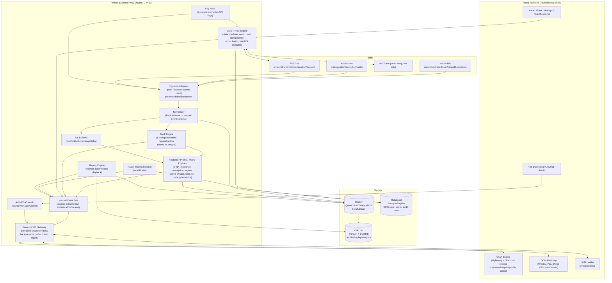
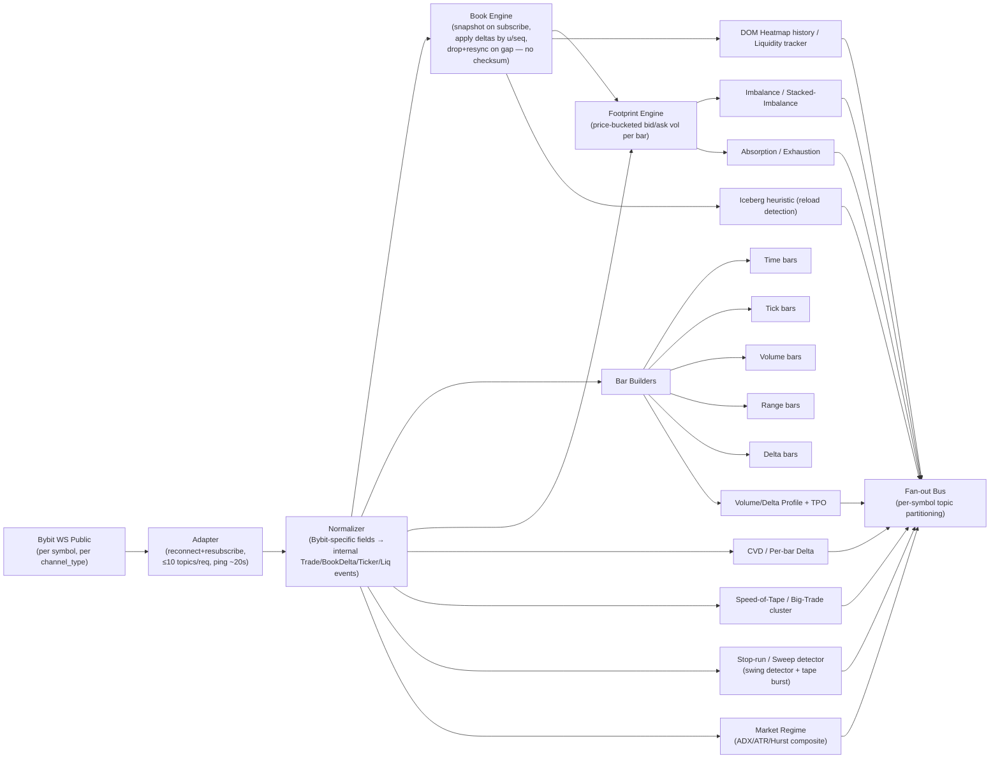

# 22 — Architecture Options

Scope: candidate system architecture for CandleViewer (private, self-hosted, Bybit-first, crypto-only order-flow terminal). Research-phase document — no tickets, no code. Synthesizes digests 06, 08, 09, 10, 11, 12, 23.

---

## 1. Component diagram

---

## 2. Ingestion data-flow (detail)

Notes:
- Single ingestion code path shared by live WS and historical replay (feed the same normalizer/book/bar/aggregation pipeline from either a live socket or a recorded-tick reader) — avoids dual logic drift (digest 08 recommendation).
- Bybit has no MBO/L3 feed: iceberg, stop-run, and order-count-style footprint fields are heuristic proxies from L2 deltas + trade tape, not certainties — must be labeled "(estimated)" in UI per digest 23.
- Recorder (WS→storage) must run from day one; REST has no deep tick/book history — bulk CSVs only fill pre-launch gaps (digest 06 §15).

---

## 3. Storage comparison (this scale) and recommendation

Target scale: 2 initial symbols (BTCUSDT, ETHUSDT), expandable; depth 200 typical, occasionally 500/1000; single-owner + few managers; no external customers.

| Option | Ingest throughput | Compression/columnar | Query fit (footprint/replay) | Ops complexity | Verdict |
|---|---|---|---|---|---|
| QuestDB | Very high (vendor-claimed; disputed vs ClickHouse but directionally fast) | Native Parquet export/tiering | `ASOF JOIN`/`SAMPLE BY`/`LATEST ON` map directly to bar/footprint/CVD construction | Low — single binary, Postgres-wire compatible | **Recommended hot tier** |
| TimescaleDB | Good (Postgres/WAL-bound) | Native columnar on old chunks | Full SQL, easy joins with OMS tables in same DB | Low-medium ("just Postgres") | Strong alternative if unified-DB simplicity valued over raw ingest speed |
| ClickHouse | Very high w/ proper indexing | Excellent (best-in-class in cited rebuttal) | Powerful OLAP SQL, less native time-series ergonomics | Medium — cluster-oriented, heavier for single node | Over-engineered ops for single-user scale unless growth expected |
| DuckDB + Parquet | N/A for live streaming inserts | Excellent (Parquet columnar) | Excellent for replay/footprint batch queries (polars-friendly) | Lowest (no daemon) | **Recommended cold/archive + replay-read tier**, not live ingest |
| ArcticDB | Strong bulk DataFrame writes | Good, Arrow/Parquet-adjacent | Very good for "load DataFrame per symbol/date-range" | Low local, more setup for S3 | Worth a prototype spike for replay read path; less proven community |
| SQLite | Adequate low/moderate rate, not L2 firehose | Reasonable, no native columnar | Fine for OMS/state tables | Lowest (single file) | **Recommended for OMS/relational tables only** |

**Recommendation: two-tier hybrid.**
1. Hot/live: QuestDB — ILP line-protocol ingest, `SAMPLE BY`/`ASOF JOIN`/`LATEST ON` build bars/footprint/CVD/heatmap history directly.
2. Cold/archive: Parquet + DuckDB — periodic (e.g. daily) roll-off from QuestDB, bounds live dataset size, cheap long-term storage, batch analytics via polars.
3. Relational/OMS: SQLite (or Postgres if already running Timescale) for orders/executions/positions cache, rule-engine config, users/roles, append-only audit log.
4. Bars/candles materialized as QuestDB tables via `SAMPLE BY` for fast repeated chart loads; raw tick/L2 remains source of truth for backfilling new bar types later.

Because the QuestDB-vs-ClickHouse/Timescale benchmark claims are vendor-disputed (digest 11), this is a **should-prototype-before-committing** recommendation, not a final decision — see Spikes (§8).

### GB/day estimates (digest 11 §6.1, planning-only, unmeasured)
- 200-depth orderbook, 2 symbols (BTCUSDT+ETHUSDT), all streams (trade/book/ticker/liquidation): **~7 GB/day raw** → **~1–1.5 GB/day compressed**.
- Monthly: **~30–45 GB/month** compressed. Yearly: **~0.4–0.5 TB/year**.
- If depth 1000 used instead of 200: **~2–3x** → roughly **~1–1.5 TB/year**.
- These are first-principles estimates, not measured against live traffic — instrument the recorder in week 1 and correct retention/downsampling policy accordingly (could be off 2-3x per digest 11 risk table).
- Retention policy (digest 12 §6): tick/trade full-resolution rolling 30–90 days then downsample to 1-min bars; OHLCV bars retained indefinitely at 1m+; audit/journal/order history retained indefinitely.

---

## 4. Browser protocol (snapshot + delta, binary)

- **Pattern**: on subscribe, frontend receives a full snapshot for each active symbol/stream (book top-N, latest N bars, profile state); thereafter only deltas are pushed — mirrors Bybit's own orderbook snapshot+delta model, applied one layer up between backend and browser.
- **Backpressure**: per-connection outbound queue with coalescing — if client falls behind, collapse multiple pending deltas into one (e.g. latest book state) rather than unbounded buffering; drop-and-resnapshot if queue exceeds a threshold (same "no checksum, resync on desync" philosophy as Bybit's own book feed, digest 06 §14).
- **Wire format**: JSON initially (fast to build/debug); MessagePack identified as the upgrade path once the DOM heatmap (~100ms cadence, tens of thousands of cells over hours) or footprint payloads show serialization/bandwidth pressure. Protobuf considered but not selected — no dedicated research into Python/TS codegen DX yet (open question, digest 10 Q6).
- **Fan-out shape**: one backend-side subscription per symbol/channel regardless of client count (single WS per symbol upstream, per digest 12 feature #79); per-client filtering/downsampling happens at the fan-out layer, not by re-subscribing upstream per client.
- **Transport**: WebSocket end-to-end frontend↔backend; backend↔Bybit is Bybit's own WS (public+private) plus REST for order entry (demo) / reconciliation.
- **Latency targets** (digest 12 §6): WS→screen ≤150–250ms total (backend ingest ~20–50ms, internal fan-out ~5–20ms, frontend render ~16–50ms); order round-trip (click→ack) ≤300–500ms.

---

## 5. Chart engine decision matrix

| Option | 100k+ candles | Footprint | Heatmap | Multi-pane | Drawing tools | License/cost | Effort |
|---|---|---|---|---|---|---|---|
| **Lightweight Charts v5 + custom primitives (RECOMMENDED)** | Excellent | Buildable via Custom Series | Buildable via separate WebGL layer (not native) | Native | Buildable via primitives | Apache-2.0, free | Medium (chassis) + heavy custom work for footprint/heatmap |
| KlineCharts v9/v10 (fallback #1) | Good | No, custom | No, custom | Native | Native OOB toolbar | Apache-2.0, free | Medium — friendlier overlay/drawing-tools model if LWC primitives prove too constraining |
| Custom Canvas/WebGL (D3+Canvas or raw WebGL from scratch) | Buildable | Buildable | Buildable | Buildable | Buildable | Free (BSD/ISC) | Very High — add 4–8 weeks just to reach LWC parity (pan/zoom, axis decimation, sync, DPI) before any order-flow feature; not recommended |
| SciChart.js | Excellent (WebGL) | No | Yes, native 2D heatmap | Yes | No | Commercial (~$117/dev/mo) | High — no trading chassis, would still need to build candle/order-flow layer on top |
| LightningChart JS Trader (fallback #2) | Excellent (WebGL) | No | Yes, native | Yes | Some | Commercial (~$4,900/yr 1st dev, unconfirmed current pricing — quote-gated) | Medium-High — natively solves heatmap, accept cost as risk-reduction price |
| TradingView Advanced Charts | Excellent | No | No | Yes, richer | Yes, native | Proprietary, approval-gated, free but licensing friction | Medium + approval delay — **not recommended**, conflicts with anti-lock-in goal, Pine Script `request.footprint()` not even exposed outside consumer product |

**Recommendation**: Lightweight Charts v5 as chassis (candles/time-scale/multi-pane/crosshair native; footprint via Custom Series + LOD text-hiding; volume/delta profile via pane primitive; chart-trading and drawing tools via series/pane primitives) **plus a dedicated WebGL layer (PixiJS or regl) inside OffscreenCanvas/Worker** for the DOM heatmap specifically, composited under/behind the LWC canvas and synced to its price axis. DOM ladder built as a virtualized list (`@tanstack/react-virtual`), not a chart. This is the only combination that meets 100k+ candle performance, keeps licensing risk low, and isolates the one truly WebGL-shaped problem (heatmap) from the rest of the chart.

Effort estimates (single experienced dev, digest 10):
- Base LWC integration: 3–5 days.
- Footprint custom series (cell rendering, LOD, delta/imbalance coloring): **2–3 weeks — single largest line item, and largest unresolved engineering-risk question** (no public benchmark for text-heavy footprint-cell rendering at realistic densities).
- Volume/delta profile pane: 3–5 days.
- Drawing-tools primitive kit: 1–2 weeks.
- Chart-trading order/position lines: 1 week.
- Big-trade bubbles + VWAP/indicator overlays: 3–5 days.
- DOM heatmap (WebGL layer, texture/instancing, OffscreenCanvas wiring, perf validation): 2–4 weeks.
- DOM ladder: 1–2 weeks.
- **Total custom-rendering surface: ~11–17 weeks**, before backend integration or non-charting features.

Packaging: Tauri (recommended default over Electron for memory footprint running alongside Python backend/WSL) — smoke-test WebGL heatmap inside Tauri's WebView2 (Windows) early; fallback to Electron is low-regret since app code is shell-independent.

---

## 6. OMS + rule engine

- **State machine**: order lifecycle New → PartiallyFilled → Filled / Cancelled / Rejected / Triggered, driven authoritatively by private WS (`order`, `execution`/`execution.fast`) — never trust the synchronous REST create-order response as fill confirmation, it is an accept-ack only (digest 06 §5).
- **Idempotency**: every order carries a client-generated `orderLinkId` (≤36 chars); Bybit dedupes submissions within its retention window — this is the mechanism for safe retry-on-timeout.
- **Reconciliation** (after reconnect/crash), in order: (1) re-auth private WS, (2) `GET /v5/order/realtime` + `GET /v5/position/list` for authoritative state, (3) diff vs local cache keyed by `orderLinkId`, (4) backfill fills via `GET /v5/execution/list` for the gap window, (5) resume streaming.
- **Bybit-native vs emulated table**:

| Capability | Native on Bybit? | CandleViewer approach |
|---|---|---|
| Market/Limit, TP/SL, trailing (price-distance) | Native | Direct REST/WS mapping |
| Trailing stop as % | Not native (price-distance only) | Client-side translation layer |
| OCO | UI-only (spot/spot-margin), **not exposed via API** | Emulate: race two orders, cancel loser on fill notification |
| Iceberg (hidden qty) | No `orderType=Iceberg`/`displayQty` field on `/v5/order/create` despite UI ticket | Emulate as client-side order slicing |
| TWAP | Not a native order type | Emulate via timed repeated `order/create` calls |
| Scaled orders (ladder) | Not native | Emulate as N individual limit orders (equal/linear/geometric distribution) |
| Chase/pegged limit | Native (Iceberg-ticket sub-algo: Chase Limit Taker/Maker/Offset) | Use native where available; confirm exact params (max distance, refresh interval) empirically — unresolved in digest 09 |
| Break-even automation, ATR/structure-based trailing, time stops, daily-loss lockout | Not native anywhere reviewed | App-side rule engine (below) |

- **Rule DSL** (digest 09 §7): `rule.id`, `enabled`, `scope`{symbol, account, applies_to}, `trigger`{on_price_update / on_bar_close / on_order_fill / on_timer / on_indicator}, `conditions`[] (implicit AND, `any_of` for OR), `actions`[]. Metric vocabulary spans OHLCV/derived (atr, ema, swing_high/low, cvd_divergence, spread_bps) and order-flow heuristics (iceberg_present_at_level, in_stop_hunt_zone, tape_speed_zscore, market_regime). Action vocabulary: place_order, modify_stop_loss/take_profit, cancel_order, move_to_breakeven, scale_in/out, flatten_all_positions, halt_new_orders, widen_stop, arm_chase_limit, start_iceberg_slice.
- **Failover risk**: emulated stops (OCO, iceberg, TWAP, rule-based trailing) only work while the backend process is alive and connected — this is the single biggest correctness risk in the OMS. Mitigate with (a) an always-on **native hard SL** floor placed on the exchange itself as a backstop under any emulated/soft stop, (b) reconciliation/heartbeat monitoring with alerting if Bybit WS/REST connection drops beyond a threshold (recommend 10–30s per digest 12) while positions are open, (c) a dead man's switch (`disconnected-cancel-all`) as a last resort where appropriate.
- **Clock drift**: signed REST requires `timestamp` within `server_time - recv_window <= ts < server_time+1000` (default recv_window 5000ms); violation = error 10002. Mitigate via host NTP (primary), periodic `GET /v5/market/time` offset calc (secondary), raising recv_window only as a stopgap. Surface 10002 distinctly in OMS logs as a clock-sync diagnosis, not a generic order-rejection.
- **Rate-limit design**: REST rate limit is **per-UID, shared across all API keys on that UID** — implement a single shared rate-limit tracker per UID (not per key), self-throttling off `X-Bapi-Limit`/`X-Bapi-Limit-Status` response headers.

---

## 7. Paper-trading matcher & replay engine

**Paper trading**:
- Two modes, not mutually exclusive:
  1. **Bybit demo trading** (`api-demo.bybit.com`, private WS confirmed at `wss://stream-demo.bybit.com` per digest 12 — resolves earlier assumption of no demo WS) — real exchange-side matching against live market data, but REST-only order entry (WS Trade / order-entry-over-WS is NOT supported on demo), 7-day order retention, reduced endpoint surface, non-upgradable rate limits.
  2. **Local simulated fill engine** — needed to cover gaps demo can't (e.g. testing emulated OCO/iceberg/TWAP/rule-engine logic that depends on WS order-entry timing, or when demo's reduced endpoint set blocks a feature). Match against locally recorded L2 book + tape using conservative fill assumptions (e.g. marketable orders fill at best opposing price up to available depth; resting limit orders fill only when tape trades through the price with adequate opposing volume) — this is a simplification vs a full price-time-priority queue simulation; acceptable at CandleViewer's 1m+-oriented usage, per Nautilus/Freqtrade-style precedent in digest 09.
- Both modes must produce P&L display identical to the live UI (digest 12 feature #56) and be switchable per session with an explicit, hard-to-fat-finger environment toggle (see §9 Env/key management) — no live order placement while the session badge reads Demo/Paper, and vice versa.
- Rule-engine validation caveat: because demo lacks WS order-entry and has a reduced endpoint set, not all rule-engine logic can be end-to-end validated in demo — needs a dedicated test plan distinguishing what's demo-verifiable vs what requires careful live-mode testing before trusting real capital (open question, digest 11).

**Replay engine**:
- Deterministic tick/bar replay driven from the recorder's own local tick DB (hot QuestDB tier + cold Parquet archive) — Bybit has no historical MBO/replay API, so replay fidelity is capped by how long the recorder has been running for a given symbol (digest 23 caveat, applies also to Profile and Journal views).
- **Single ingestion code path** shared with live mode: replay feeds the same normalizer → book engine → bar builders → aggregation engines pipeline as live WS, just sourced from stored ticks instead of a socket (digest 08 recommendation) — this avoids maintaining two parallel aggregation implementations.
- Controls: symbol + date/time range picker, playback speed 0.5x–100x with scrub, simulated-order/paper-fill toggle (route replayed bars through the same paper matcher), choose which panes stay "live" during replay vs following replay time, loop/bookmark markers. Hotkeys: space=play/pause, ←/→=step bar, Shift+←/→=step tick, R=jump to real-time.
- Empty/partial-history states (recorder hasn't run long enough for the requested range) must be an explicit, designed UI state, not an error.

---

## 8. Env/key management (demo / live / testnet)

- Explicit three-way environment enum: `demo` / `live` / `testnet` — `testnet` and `demoTrading` are mutually exclusive at the Bybit level, must not be conflated in config.
- Per-environment: distinct base URLs (REST + WS public/private, and WS trade where supported), distinct API key sets (demo keys are not interchangeable with live/testnet keys), distinct local storage namespace so a stray query can't accidentally cross environments.
- WS Trade (order-entry-over-socket) is **live-only**; demo must always route order entry through REST. This is a structural branch in the OMS adapter, not just a config flag.
- Key storage: envelope encryption — KEK held outside the DB (OS keyring/TPM/YubiKey+age/gpg-smartcard on the WSL/host boundary; WSL has no reliable headless keyring, so the KEK lives on the Windows host side), keys never plaintext in config/source/DB/backups. TLS on all internal hops. Startup self-check refuses to enter "trading" mode if a stored key has Withdrawal enabled (must always be OFF) or is missing an IP whitelist bound to the trading box.
- Rotation: Bybit exposes create/delete-key endpoints, making scripted rotation feasible — schedule periodic rotation (e.g. 90/180-day) plus immediate rotation on suspected compromise. Note new-account API-key-creation is blocked for 48h after registration — budget as onboarding lead time for new managers, not a bug.
- Sub-account model: one Bybit sub-account per managed strategy/manager for blast-radius isolation (own wallet/margin, cannot draw down Main or other managers). Numeric cap: 5 standard sub-accounts on a non-KYC-business Main (20 with Business KYC) — the environment/key architecture must surface this cap in the Admin UI, since it directly bounds how many live managers can exist.
- Environment switch UX (View 20, digest 23): explicit typed/held confirmation on Demo→Live, no hotkey-driven switching, distinct visual accent for Live sessions (e.g. red-accented chrome) to prevent an operator mistaking environments mid-session.

---

## 9. Auth / roles

- App-level RBAC independent of Bybit's own account roles:
  - **Owner**: full admin — view/edit all managers' sub-accounts, create/revoke keys, initiate transfers (via Bybit UI, outside CandleViewer), global kill-switch.
  - **Manager**: scoped to their assigned sub-account(s) only — place/modify/cancel orders, view positions; cannot see other managers; cannot manage keys.
  - **Viewer**: read-only across whatever scope is granted (owner-as-reviewer use case).
- Enforced server-side on every route, never trust the frontend for scope — maintain a strict mapping table: app user → allowed sub-account(s) → API key id(s).
- App-level 2FA (TOTP), independent of Bybit's own 2FA, required for login.
- Network isolation: backend not exposed to the public internet; access via Tailscale (WireGuard mesh) with per-port ACLs. WSL2 caveat: binding to `0.0.0.0` can leak to LAN/internet via portproxy/UPnP misconfiguration — bind services to `127.0.0.1`/WSL-internal only and run the Tailscale client on the Windows host side; verify with netstat/firewall audit. The Bybit IP whitelist entry is the real outbound egress IP (home/server public IP) — a separate concern from the Tailscale inbound path for managers; don't conflate the two.
- Append-only audit log: every order action (place/amend/cancel/fill) with timestamp, user, sub-account, symbol, side, size, price/type, Bybit order ID, raw payload (secrets redacted); every auth event; every key-management event. Owner + Viewer roles can read it; nobody can edit/delete it.

---

## 10. Deployment: WSL docker-compose now → VPS later

- **Phase 1 (current, WSL Ubuntu on the owner's machine)**: docker-compose stack — Python backend service(s), QuestDB, (optionally) Postgres/SQLite for OMS/relational tables, Tailscale sidecar/host client. Frontend runs as a Tauri desktop app talking to the local backend over Tailscale/localhost. Keeps everything on hardware the owner already controls, zero hosting cost, fastest iteration.
- Known WSL-specific risks to design around from day one (so migration to VPS is a redeploy, not a rewrite): clock drift after sleep/resume (NTP/chrony mandatory), no reliable headless keyring (KEK lives on Windows host side per §8), `0.0.0.0` binding leak risk (§9), and needing the box to be powered on/awake continuously for uptime targets — a laptop that sleeps is a direct conflict with the "watchdog force-flatten if connection drops" requirement.
- **Phase 2 (small dedicated VPS or home server that stays always-on)**: same docker-compose topology moved to a small always-on box (or a lightweight VPS) once uptime requirements exceed what a personal WSL machine reliably provides, or once symbol/manager count grows enough that resource contention with the owner's other WSL usage becomes a problem. Migration should be "copy compose file + data volumes + restore Tailscale identity," not an architecture change, provided the bus/queue abstraction (§1 BUS) is kept between subsystems rather than in-process calls only — this keeps a later process split (e.g. Redis/NATS between ingestion and fan-out) a moderate rework instead of a rewrite (digest 11 risk-table item).
- Region/host note: some Bybit REST hosts are geo-restricted (US/Mainland China IPs → 403) — VPS region selection must respect this alongside owner/manager residency vs Bybit's regional entity restrictions (digest 12 §4).

---

## 11. Spikes to run before committing

1. **Footprint custom-series rendering spike** (highest engineering risk, digest 10 Q1/Q8): build a minimal Lightweight Charts v5 Custom Series rendering dense, text-labeled footprint cells at realistic bar-count/price-level densities; measure FPS/CPU. No public benchmark exists for this — must be hands-on before committing 2-3 weeks of budget to it.
2. **DOM heatmap in Tauri WebView2 smoke test** (digest 10 Q2): confirm sustained ~100ms-cadence WebGL texture updates behave acceptably inside Tauri's bundled WebView2 (Windows) before committing to Tauri over Electron.
3. **Private-stream client choice**: prototype both `pybit`'s thread+bridge WS client and a hand-built asyncio private-WS client against the demo account under synthetic high-rate load; pick based on observed reliability (races/dropped messages), not defaults — flagged as the highest-leverage OMS-correctness decision in digest 11.
4. **Hot-tier storage prototype**: run QuestDB and TimescaleDB against CandleViewer's actual footprint/replay query shapes (not vendor synthetic benchmarks) before committing, given the disputed QuestDB-vs-ClickHouse ingest claims.
5. **Sub-account demo-trading eligibility test** (digest 06 open Q1): empirically verify whether a Bybit sub-account (not just the Main login) can independently enable Demo Trading — this directly affects whether "one sub-account per manager" also gets each manager their own paper-trading sandbox.
6. **Bulk-CSV / kline / orderbook-history schema inspection** (digest 06 §15, digest 08 open Q4): download and inspect a real `public.bybit.com` CSV/.csv.gz sample (trade, and ideally kline/orderbook if published) to confirm timestamp units and headers before building the backfill importer.
7. **Live rate-limit header verification**: capture real `X-Bapi-Limit`/`X-Bapi-Limit-Status`/`X-Bapi-Limit-Reset-Timestamp` headers from a real UID to confirm the documented ~600 req/5s IP limit and per-endpoint trade-group numbers (digest 06 §13, digest 08 open Q11) before finalizing the shared per-UID rate-limit tracker.
8. **Real fee-rate + max-API-keys-per-UID check**: call `GET /v5/account/fee-rate` and the live dashboard's API-key-management screen with a real key to resolve the currently-unresolved VIP fee schedule and the conflicting max-keys-per-UID figures (5/10/20/30/100) before writing key-provisioning logic (digest 12 §1).
9. **Instrument the recorder for real data-rate/storage numbers**: run the WS recorder against BTCUSDT/ETHUSDT for at least a few days pre-build to replace the first-principles ~7GB/day (raw) / ~1-1.5GB/day (compressed) estimate with a measured one, before finalizing retention/downsampling policy and hot-tier disk sizing.
10. **Chase-Limit-Order native mechanics check**: confirm via live order-ticket UI/testnet whether Bybit's Chase Limit exists independent of the Iceberg ticket, and its exact numeric params (max chase distance, refresh interval) — needed before deciding how much of "chase/pegged limit" can be delegated to Bybit-native behavior vs emulated (digest 09 open Q7).

---

## 12. Recommended option + 2 alternatives

### Recommended: Hybrid pragmatic stack
- Chart chassis: **Lightweight Charts v5** + custom Canvas primitives for footprint/profile/drawing/chart-trading, **dedicated WebGL layer (PixiJS/regl)** for the DOM heatmap only.
- Storage: **QuestDB (hot) + Parquet/DuckDB (cold) + SQLite/Postgres (OMS/relational)**.
- Backend: Python asyncio, Bybit adapter via `pybit` for private/execution path (official, prioritize correctness) with option to hand-roll asyncio client if spike #3 shows it's more reliable; single ingestion pipeline shared by live and replay.
- OMS: REST-first order entry (WS Trade as a later optimization, not v1 requirement, per digest 06 §11), native Bybit primitives used wherever they exist (TP/SL, trailing, Chase Limit), everything else (OCO, iceberg, TWAP, scaled orders, ATR/structure trailing, rule engine) emulated app-side with a native hard-SL backstop.
- Deployment: docker-compose on WSL now, same compose topology on a small always-on VPS/home-server later, Tailscale-only network exposure throughout.
- **Trade-offs**: highest total engineering effort of the three options (footprint+heatmap custom rendering alone ≈ 11-17 weeks), but zero recurring licensing cost, no vendor lock-in, and full control over every order-flow heuristic — matches the project's explicit anti-lock-in, self-hosted, single-owner posture.

### Alternative A: Licensed WebGL chart platform (LightningChart JS Trader)
- Same backend/storage/OMS as above, but replace the Lightweight-Charts-plus-custom-WebGL chart layer with **LightningChart JS Trader** (~$4,900/yr first dev, pricing now quote-gated — needs direct sales confirmation), which natively solves the WebGL heatmap and gives strong multi-pane/candle performance out of the box.
- **Trade-offs**: meaningfully lower heatmap-specific engineering effort (removes the highest-risk custom-WebGL spike), but footprint is still not native anywhere, so most of the custom-series effort remains; introduces a recurring commercial cost and a second proprietary dependency (alongside Bybit itself) that cuts against the project's self-hosted/no-lock-in framing. Worth reconsidering only if spike #2 (heatmap-in-Tauri) or the footprint spike (#1) come back badly.

### Alternative B: KlineCharts-based chassis
- Same backend/storage/OMS, but swap chart chassis to **KlineCharts v9/v10** (Apache-2.0, crypto/quant-purpose-built), which ships a drawing-tools toolbar and overlay/drag-event system out of the box, at the cost of a smaller ecosystem and a nontrivial v9→v10 migration history.
- **Trade-offs**: saves roughly the 1–2 week drawing-tools-primitive-kit line item versus Lightweight Charts, since KlineCharts' overlay system already supports order-line dragging and annotation tools natively; footprint and heatmap are still fully custom either way (neither library has them). Reasonable fallback if the LWC-primitives spike (#1) proves the primitives API too constraining for footprint rendering, but not recommended as the first choice given LWC's larger ecosystem, TradingView-adjacent mindshare, and confirmed 100k+-candle performance.

---

## Section list (for reference)
1. Component diagram
2. Ingestion data-flow (detail)
3. Storage comparison and recommendation (+ GB/day estimates)
4. Browser protocol (snapshot + delta, binary)
5. Chart engine decision matrix
6. OMS + rule engine
7. Paper-trading matcher & replay engine
8. Env/key management (demo/live/testnet)
9. Auth / roles
10. Deployment: WSL docker-compose now → VPS later
11. Spikes to run before committing (10)
12. Recommended option + 2 alternatives
