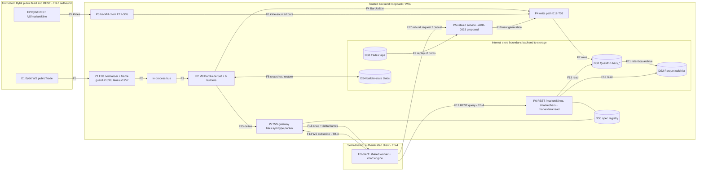

# E12 — STRIDE threat model: Bar builders, backfill and the `bars` topic

- Ticket: E12-X01 (issue #346). Owner: Security engineer (CODEOWNER). Status: Draft for Security + Architect review.
- Method: `docs/plan/04-security-program.md` §5 template (L x I = risk), STRIDE per epic (C-12.1). Reuses the
  exchange-boundary trust model of E08 (`e08-exchange-boundary.md`, W1-W11), the E08 ingestion controls
  (frame guard and print rejection, #1898; priority lanes, #1957) and the storage model of E07
  (`E07-storage.md`); those threats are **referenced, not duplicated**. Format mirrors `E22-big-trades.md`.
- Path note: the ticket names `docs/plan/security/threat-models/e12-bars.md`. Every merged model (E07, E22, E24,
  E25, E08, E09, E16, E35, E49) lives under `docs/security/threat-models/` and GOV-008
  (`scripts/check_threat_model_ticket_map.py`) only scans that directory, so this model follows the precedent
  location and is named `E12-bars.md`.
- **Data classification: public market data only.** Bars are aggregates of public prints and public klines.
  No secrets, no PII, no account or key material, no per-user data except the user's own chart settings
  (E12-S12, not modelled here beyond a pointer). That classification is what justifies the light controls below;
  per-user recorded data or account-scoped tape would **invalidate it** and re-open §6.
- **Headline:** E12 moves no money and holds no keys, so its real security property is **integrity of
  evidence** (`04-security-program.md` O8). A tampered or quietly wrong bar is an input to footprint, profiles,
  CVD, replay, the journal and, later, rule conditions that place live orders (E35). Availability of the
  user-controlled `bar_type`/`param`/window surface is the second concern. The generic web threats are handled
  by E09 and E17 and are only referenced.
- Gate note: this file enumerates weaknesses only; no credentials or hosts appear.
- ADR-0033 (PR #1968) is **Proposed**, not Accepted. Everything this model takes from it (generation-pointer
  rebuild, cancellation token, 250 000-bar cap, bounded 2-worker executor, `bar_rebuild_busy`) is cited as
  _proposed_ and is a control only once the ADR is ratified and E12-S12 lands it.

## 1. Scope

In scope: Bybit `publicTrade` (E08) -> normaliser -> bus -> M8 `BarBuilderSet` (E12-T03) with the six builders
(E12-S01..S04) -> write path into QuestDB `bars_*` (E12-T02, `21-database-schema.md` §4.8) and Parquet cold
tier (E07) -> read helpers -> REST `GET /market/klines` and `GET /market/bars` (E12-T05) and WS
`bars.{symbol}.{bar_type}.{param}` (E12-T06, `23-ws-protocol.md` §6.1/§14.3) -> chart engine (E12-S06..S11).
Also in scope: the Bybit REST kline backfill (E12-S05), builder-state snapshot blobs (E12-T03), the in-process
`BarSpec`/`spec_hash` model and wire mapping (E12-T01, merged in #1906) and the proposed rebuild path
(ADR-0033 / E12-S12). Test-only probe and diagnostics surfaces (`SCR-046`, E12-Q03 probe) are in scope for
the production-reachability check only.

Out of scope: executing abuse cases (E12-X02), writing SAST/DAST rules (E12-X03), auth/session/RBAC design
(E09), key handling (E27), WS envelope, handshake and backpressure mechanics (E17; this model covers the
`bars` topic's _use_ of them), recorder retention execution (E16), pen-testing.

## 2. Data-flow diagram and trust boundaries

Text description of the diagram (the diagram is not the only carrier): Public trades enter from Bybit across
**TB-7**, are validated by the E08 ingestion boundary, and reach the bar builders over the in-process bus.
Builders emit `BarUpdate`s to a write path that persists rows into QuestDB across the **internal store
boundary** (F7, F8, F10, F11, F13 all cross it). A separate backfill client pulls klines across TB-7 and writes
kline-sourced rows through the same write path. The authenticated client reaches the REST endpoints and the WS
gateway across **TB-4**; it supplies `bar_type`, `param`, `from`, `to`, `limit`, `history` and rebuild
requests, all of which are hostile input. The server never trusts the client for anything it renders.

Elements for the per-element STRIDE enumeration (§4): external entities **E1, E2, E3**; processes **P1-P7**;
data stores **DS1-DS5**; flows **F1-F17**. Every element and flow appears in at least one row of §4 (the
coverage matrix at the end of §4 lists where).

Boundaries: **TB-7** (F1, F5: all upstream content untrusted; E08 and #1898 own frame and print plausibility,
E12 adds only what is specific to bars: kline-vs-tape source precedence and kline response validation).
**TB-4** (F12, F14, F17: authenticated and RBAC-scoped by E09; the client is trusted to enforce nothing).
**Internal store boundary** (F7, F8, F10, F11, F13: QuestDB, Parquet and blob files are on the trusted host but
are a distinct integrity domain; writers must be only the bars write path, and readers must treat a row's
`build_version` and `spec_hash` as claims to verify, not facts). F2-F4, F9, F15 are in-process or loopback.

## 3. Numeric bounds: contract today, and recommended values

Every bound must be enforced by validation **before** any query, allocation, subscription or rebuild is created;
truncation after the fact is not a control (budget #13: API read p95 < 150 ms). The recommended values are
proposals for E12-T05/T06/T03/S12 and for the `E12-X03` rules to assert. Constants live in one module
(`candleviewer/bars/limits.py`, named in the map in §11) with an assert test that pins each value.

| Surface                       | Contract today                                                                                     | Gap                                                              | Recommended bound (SR)                                                                                                                                                                                                                                                                            |
| ----------------------------- | -------------------------------------------------------------------------------------------------- | ---------------------------------------------------------------- | ------------------------------------------------------------------------------------------------------------------------------------------------------------------------------------------------------------------------------------------------------------------------------------------------- |
| `limit` per REST page         | 22-api `BarLimit`: 1..5000, default 1000                                                           | no byte or time ceiling                                          | keep **max 5000**, **default 1000**; add a response ceiling of **2 MiB** (413-style `response_too_large`, not truncation) and a **2 s** query timeout (SR-E12-01)                                                                                                                                 |
| Window `from..to` (time bars) | none beyond `limit`                                                                                | `from=0` forces a scan of a year of `bars_time`                  | window must satisfy `ceil((to-from)/interval) <= 250 000` bars (same figure as the proposed rebuild cap) **and** `to-from <= 400 d`; cursor pagination does the rest, so a legitimate 30-day 1 m backfill (43 200 bars, 9 pages of 5000) is allowed (SR-E12-02)                                   |
| Window (non-time bars)        | none; non-time bars are not wall-clock aligned                                                     | window says nothing about bar count                              | `to-from <= 31 d` **and** a pre-query estimate from stored print count `<= 250 000` bars, else `422 bar_window_too_large` naming the supported size; the 31 d figure covers the 24-month cold tier by paging windows, not by one request (SR-E12-02)                                              |
| `param` shape                 | `PARAM_MAX_LEN` 24, dot-free, per-type whitelist (`from_wire`, merged #1906); `_UINT` <= 18 digits | no numeric **floor or ceiling**: `tick:1`, `range:1`, `volume:1` | `tick` **100..1 000 000**, `volume` and `delta` **>= 1 lot-multiple of `qty_step` x 10** and **<= 10^12**, `range` and `renko` **2..100 000** ticks (`1` is a bar per tick-move; `reversal_bricks` already `>= 1`). Reject below-floor with the limit in the 422 message, never clamp (SR-E12-03) |
| Concurrent specs              | E12-T03: "hard cap ... clear error" (no numbers)                                                   | numbers absent                                                   | **8 specs per user**, **32 specs per symbol**, **512 process-wide** (all `BarBuilderSet` registrations, ref-counted, 30 s grace). Cap check precedes registration; `spec_cap_exceeded` names which cap (SR-E12-04)                                                                                |
| Rebuilds                      | ADR-0033 (Proposed): 250 000 bars, 2-worker bounded executor, `bar_rebuild_busy`                   | no per-user limit, no rate limit, no audit                       | **1 concurrent rebuild per user**, **6 starts per user per 10 min**, **2 process-wide** (the executor), **250 000 bars** per rebuild; a new request from the same user **cancels or refuses**, never queues; every start/cancel/finish writes an audit record (SR-E12-05, SR-E12-06)              |
| `bars.*` subscriptions        | 23-ws §6.1: `history` <= 1 000; per-connection budget 8 MiB / 2 000 frames (§8.4)                  | per-user bars-topic count absent; shares E21/E26 budget (G4)     | **<= 16 `bars.*` subscriptions per connection** and **<= 8 distinct specs per user** (the SR-E12-04 cap is the real limiter); `history` validated `1..1000`; `bars.*` fair share of the connection budget **<= 50 %** (a share, not a queue) so book/trades frames are not starved (SR-E12-07)    |
| Backfill pages                | E12-S05: 1 000 rows per Bybit page, "days-to-load window"                                          | no ceiling on pages or window per call                           | **<= 400 pages (400 000 rows) per backfill job**, **1 job per `(symbol, interval)`**, backoff with full jitter from 1 s to 60 s, abort and keep partial after **5** consecutive rate-limit responses (SR-E12-08)                                                                                  |
| Builder-state blob            | E12-T03: msgpack, atomic write, corruption-safe read                                               | no size ceiling on read; no authenticity                         | read refuses a blob **> 8 MiB** or whose declared `state_version` or `spec_hash` mismatches; discard = cold start, counted (SR-E12-12)                                                                                                                                                            |

Cross-check against performance budgets (#5 builder throughput, #11 WS fan-out, #13 API read p95): the
caps above leave every documented legitimate path intact. The 250 000-bar figure is the ADR-0033 prototype
cap (rebuild of 1M prints measured at 0.82-1.05 s on the quiet-machine baseline, 83-106 MB peak RSS), so a
rebuild at the cap is well inside the 10 s rebuild budget even at the 2x slowdown note in the ADR. The
31 d non-time window is the smallest value that still lets a user fill the chart default of 1 000 bars on
every supported parameter at typical liquidity; it is a starting value and `E12-Q05` must confirm it against
real tape density before E12-T05 freezes it.

## 4. STRIDE table

Risk = L x I (Low/Med/High). Disposition: **M** mitigated by a named ticket, **A** accepted (Owner sign-off
recorded in §12), **R** referenced (owned and mitigated by another epic's model). Verification layers follow
`04-security-program.md`: unit, integration, contract, load, manual-review; adversarial cases go to E12-X02,
static enforcement to E12-X03, availability to E12-Q05/Q06. Provenance of every control is tagged in §11.
Element ids are from §2. Row ids are `BR-nn`.

### 4.1 Spoofing

| ID    | Element  | Threat                                                                                                                                   | L   | I   | Risk   | Existing control / mitigation                                                                                                                                                                                                    | Owner   | Verify              | Disp. |
| ----- | -------- | ---------------------------------------------------------------------------------------------------------------------------------------- | --- | --- | ------ | -------------------------------------------------------------------------------------------------------------------------------------------------------------------------------------------------------------------------------- | ------- | ------------------- | ----- |
| BR-01 | E1, F1   | Spoofed or compromised upstream host injects prints that become bars (a forged tick moves a renko brick or a delta bar)                  | L   | H   | Medium | TLS with the pinned CA set and host allow-list in the E08 adapter (TB-7); SR-040 frame schema validation and the E08 frame guard / print rejection (#1898); explicit `category=linear` (SR-054)                                  | E08     | integration, manual | R     |
| BR-02 | E2, F5   | Spoofed or tampered kline REST response is backfilled into `bars_time` as if exact                                                       | L   | M   | Low    | Same TLS and allow-list; **strict response schema** (SR-040) for `/v5/market/kline` rows: monotonic open time, `high >= max(o,c)`, `low <= min(o,c)`, volume >= 0, tick-aligned; reject the page and keep prior data (SR-E12-09) | E12-S05 | unit, contract      | M     |
| BR-03 | E1, E2   | Wrong `category` or symbol (spot or inverse prints) mixed into a linear bar series                                                       | L   | H   | Medium | SR-054: `category=linear` explicit on every call; symbol validated against `instruments-info` before a builder is registered; builders keyed by `(symbol, spec_hash)`, never by topic text                                       | E12-T03 | unit, integration   | M     |
| BR-04 | P6, P7   | Caller impersonates another session to read or cancel its rebuild                                                                        | L   | L   | Low    | Session auth and RBAC from E09 (`marketdata:read`); rebuild cancel bound to the requesting principal with Owner override (ADR-0033, Proposed) (SR-E12-06)                                                                        | E12-S12 | integration         | M     |
| BR-05 | DS1, DS4 | A process other than the bars write path writes rows or blobs that carry a plausible `spec_hash` and `build_version` (forged provenance) | L   | H   | Medium | Single writer: only M8's write path holds the QuestDB ILP credential for `bars_*`; blob directory is service-user only; readers verify row and blob claims (BR-08, BR-12)                                                        | E12-T02 | integration, review | M     |

### 4.2 Tampering (integrity of evidence)

| ID    | Element    | Threat                                                                                                                             | L   | I   | Risk     | Existing control / mitigation                                                                                                                                                                                                                                                                                                            | Owner            | Verify                 | Disp. |
| ----- | ---------- | ---------------------------------------------------------------------------------------------------------------------------------- | --- | --- | -------- | ---------------------------------------------------------------------------------------------------------------------------------------------------------------------------------------------------------------------------------------------------------------------------------------------------------------------------------------- | ---------------- | ---------------------- | ----- |
| BR-06 | F1, F2, P2 | Out-of-order or duplicate prints produce divergent bars between live, replay and rebuild                                           | M   | H   | **High** | E08 dedup by `tradeId` and ordering at ingestion; builders are pure functions of one ordered stream (E12-T01 model, BI-1..BI-6); golden conformance across all six builders (E12-Q02); same builder code for live, replay and rebuild (C-2.15)                                                                                           | E12-Q02, E12-T04 | unit, property, golden | M     |
| BR-07 | P3, F6     | Kline backfill overwrites tick-built rows, or fills delta fields with zero, so a "zero delta" lie reaches CVD and rules            | M   | H   | **High** | Kline-sourced rows carry **null** delta fields (E12-S05 scope); source precedence tape > kline > Parquet; the `bars_time` write refuses to overwrite a `source=tape` row with a `source=kline` row (SR-E12-10); `meta.sources` states provenance                                                                                         | E12-S05, E12-T02 | unit, integration      | M     |
| BR-08 | F7, DS1    | Bar values altered in the store (direct SQL, bad migration, DEDUP UPSERT on `(ts, symbol, bar_param)` replaces a good row)         | L   | H   | Medium   | DEDUP UPSERT keys per `21-database-schema.md` §4.8; single writer (BR-05); `assert_persistable` rejects synthetic bars at the storage boundary (merged #1906); **row checksum column** over canonical OHLCV and delta so a read detects post-write edits (SR-E12-11)                                                                     | E12-T02          | integration            | M     |
| BR-09 | F10, P5    | A rebuild silently changes history without a `build_version` bump, or a half-finished rebuild becomes visible                      | M   | H   | **High** | `build_version` constant per builder family bumped by code change (E12-T02); rebuild writes a new **generation** and flips a pointer atomically, failed or cancelled generations are deleted (ADR-0033, **Proposed**); a rebuild at the same `build_version` must reproduce closed bars bit-for-bit or fail its parity check (SR-E12-13) | E12-T02, E12-S12 | integration, golden    | M     |
| BR-10 | F13, P6    | Reader serves rows at an older `build_version` than current code without saying so                                                 | M   | M   | Medium   | E12-T02: read serves them, schedules a background rebuild and marks `meta.sources`; every response also carries `build_version` and `spec_hash` (SR-E12-14)                                                                                                                                                                              | E12-T05          | contract               | M     |
| BR-11 | P1, P2     | Pathological print (zero qty, off-tick, extreme size, NaN) shapes a bar, a renko brick count or a delta threshold                  | M   | H   | **High** | E08 plausibility layer rejects at ingestion (#1898); `Qty` and `Price` are `Decimal` with `allow_inf_nan=False` and `gt=0` on specs (merged #1906); builder refuses a print that would emit more than **1 000 bricks** in one step (SR-E12-15)                                                                                           | E12-S04, E08     | unit, property         | M     |
| BR-12 | F8, DS4    | Tampered, truncated or hostile builder-state blob restored on boot (wrong spec, huge allocation, forged watermark skipping trades) | L   | H   | Medium   | msgpack with explicit `state_version`; corruption-safe read cold-starts (E12-T03); size ceiling, `spec_hash` check and watermark <= tape head check; `restore()` refuses on tick-size mismatch (ADR-0033, Proposed) (SR-E12-12)                                                                                                          | E12-T03          | unit, integration      | M     |
| BR-13 | P7, F16    | Frame tampering or reordering on the `bars` topic yields a client series that disagrees with the store                             | L   | M   | Low      | TLS on the tailnet hop; per-topic sequence numbers and gap-driven resync (23-ws §7); a `close` update is never coalesced away (E12-T06)                                                                                                                                                                                                  | E12-T06, E17     | contract               | R     |
| BR-14 | F7, F13    | Decimal -> DOUBLE conversion at the storage boundary changes a price so two reads or a rebuild differ                              | M   | M   | Medium   | Conversion at the storage boundary only, with a documented, tested rounding rule (E12-T02); model stays exact; parity test compares re-read to rebuilt at stored precision                                                                                                                                                               | E12-T02, E12-Q02 | unit, golden           | M     |
| BR-15 | DS5, P6    | `spec_hash` collision or a registry entry replaced so a `bar_param` resolves to a different spec                                   | L   | M   | Low      | sha256 over a canonical form with golden vectors (merged #1906); registry insert-only per hash; params re-parsed from the wire grammar, never trusted from a stored string                                                                                                                                                               | E12-T01          | unit                   | M     |
| BR-16 | DS2, F11   | Parquet archive diverges from QuestDB (partial write, schema drift) so cold reads differ from hot reads                            | L   | M   | Low      | E07 archive adapter verifies row counts and a content hash before dropping a hot partition (E07 model); bars-specific: cold read-through uses the same row validator as hot reads                                                                                                                                                        | E07, E12-S05     | integration            | R     |

### 4.3 Repudiation

| ID    | Element | Threat                                                                                                              | L   | I   | Risk   | Existing control / mitigation                                                                                                                                                                                                                                 | Owner            | Verify        | Disp. |
| ----- | ------- | ------------------------------------------------------------------------------------------------------------------- | --- | --- | ------ | ------------------------------------------------------------------------------------------------------------------------------------------------------------------------------------------------------------------------------------------------------------- | ---------------- | ------------- | ----- |
| BR-17 | P6, P7  | No record of which build produced a served bar, so a disputed trade decision cannot be reconstructed                | M   | H   | High   | `build_version` and `spec_hash` on every REST row and every WS snapshot, plus `meta.sources` and `generated_at` (SR-E12-14); builder code version recorded in the build info exposed by `/system` so a `build_version` maps to a commit                       | E12-T05, E12-T06 | contract      | M     |
| BR-18 | P5, F17 | Rebuild triggers (who, which spec, which range, outcome) are not recorded, so a history change cannot be attributed | M   | M   | Medium | Audit record per rebuild start, cancel and finish (actor, spec_hash, range, generation, old and new `build_version`) via the append-only audit path (C-2.9 pattern; SR-E12-06); a background rebuild by the `build_version` trigger is attributed to `system` | E12-S12, E12-T02 | integration   | M     |
| BR-19 | P3      | Backfill silently replaces a window so a later reader cannot tell which tier or run supplied it                     | L   | M   | Low    | Per-row `source` tag (`tape`, `kline`, `parquet`) and a backfill run log (symbol, interval, window, page count, outcome) (SR-E12-10)                                                                                                                          | E12-S05          | integration   | M     |
| BR-20 | DS1     | Replay or journal consumes a bar later found wrong and the affected window cannot be listed                         | L   | M   | Low    | `bars_gap_detected_total` and rebuild audit give the time ranges; a rebuilt window is listed by generation id so dependants (replay, journal) can be re-evaluated                                                                                             | E12-T02, E16     | manual-review | M     |

### 4.4 Information disclosure

| ID    | Element | Threat                                                                                                                                                     | L   | I   | Risk   | Existing control / mitigation                                                                                                                                                                                                                              | Owner            | Verify                   | Disp. |
| ----- | ------- | ---------------------------------------------------------------------------------------------------------------------------------------------------------- | --- | --- | ------ | ---------------------------------------------------------------------------------------------------------------------------------------------------------------------------------------------------------------------------------------------------------- | ---------------- | ------------------------ | ----- |
| BR-21 | P6, P7  | Bars endpoints or topic reachable without `marketdata:read` (missing permission check on a route, or on a WS subscribe)                                    | L   | M   | Low    | Shared RBAC dependency from E09 on both routes and the subscribe path (`x-rbac: marketdata:read`, scope none); forbidden-role test on every route and on the topic (C-12.4)                                                                                | E12-T05, E12-T06 | contract, integration    | M     |
| BR-22 | P6      | `include_delta` exposes recorded tape detail (delta, `min_delta`, `max_delta`, CVD) for symbols or windows the session should not see                      | L   | L   | Low    | The data is public aggregate market data (§6); the symbol must pass `instruments-info` validation and the caller's allowed-symbol list where one exists (SR-054); delta is null, never zero, on kline windows. **Re-opens if tape becomes account-scoped** | E12-T05          | contract                 | M     |
| BR-23 | P6      | Cross-user leakage through a shared cache or registry (another user's rebuild progress, subscription ack or error echoing their spec)                      | L   | L   | Low    | Acks and errors built from the caller's request only; registry keyed internally and never surfaced; progress frames sent only to the starter; IDOR test on `rebuild_id`                                                                                    | E12-S12, E12-T06 | integration              | M     |
| BR-24 | P6      | Verbose 422 or 500 bodies disclose internals (stack, SQL, file paths, QuestDB table names)                                                                 | L   | L   | Low    | RFC 7807 mapping at the edge only, no raw exception text (C-12.6); `BarSpecError` messages are fixed sentences that echo at most 32 characters of the input (merged #1906); parameterised SQL (Semgrep raw-SQL rule)                                       | E12-T05          | contract                 | M     |
| BR-25 | F7, F13 | `param` or `symbol` reaches QuestDB as text and enables SQL or ILP injection (the value becomes a `bar_param` SYMBOL, a cache key and a topic segment)     | L   | H   | Medium | Strict per-type whitelist and `_UINT` regex in `from_wire`, 24-char cap, dot-free (merged #1906); **store `spec_hash`, never raw `param`, in the `bar_param` column**; parameterised queries only; ILP escaping in the write path                          | E12-T02, E12-X03 | unit, fuzz, static       | M     |
| BR-26 | P1-P7   | Diagnostics or probe surface (`SCR-046`, the E12-Q03 probe, builder debug dumps, `bar_spec_registered` log with full spec) reachable in a production build | M   | M   | Medium | Probe and diagnostics are compiled out of production bundles and registered only behind a non-production environment check; `E12-X03` gate fails a production build that contains them; spec log lines carry no user identifiers (SR-E12-16)               | E12-X03, E12-Q03 | static, e2e (prod build) | M     |

### 4.5 Denial of service

| ID    | Element  | Threat                                                                                                                            | L   | I   | Risk     | Existing control / mitigation                                                                                                                                                                                                                                                                  | Owner            | Verify             | Disp. |
| ----- | -------- | --------------------------------------------------------------------------------------------------------------------------------- | --- | --- | -------- | ---------------------------------------------------------------------------------------------------------------------------------------------------------------------------------------------------------------------------------------------------------------------------------------------- | ---------------- | ------------------ | ----- |
| BR-27 | F12, P6  | Huge `limit` (or a loop of pages) forces large responses and memory                                                               | M   | M   | Medium   | `limit` max 5000 (22-api `BarLimit`) plus the 2 MiB response ceiling and 2 s query timeout; cursor pagination (SR-E12-01)                                                                                                                                                                      | E12-T05          | contract, load     | M     |
| BR-28 | F12, P6  | Enormous `from..to` window, e.g. `from=0`, scans a year of partitions                                                             | H   | H   | **High** | SR-E12-02: window validated before any query (bar-count estimate `<= 250 000` for time bars, 31 d and stored-print estimate for non-time); `bar_window_too_large` 422                                                                                                                          | E12-T05          | contract, load     | M     |
| BR-29 | F12, F14 | Pathological `param` (`tick:1` over a month, `range:1`, `volume:1`) emits one bar per print and builds an unbounded series        | H   | H   | **High** | SR-E12-03 floors (`tick` >= 100, `volume`/`delta` >= 10 qty steps, `range`/`renko` >= 2 ticks) enforced in `from_wire` callers before registration; 250 000-bar cap per read/rebuild; floors are numbers E12-X03 can assert                                                                    | E12-T05, E12-T03 | unit, fuzz         | M     |
| BR-30 | F14, P2  | Many distinct specs (`tick:100..tick:100000`) registered per user explode the per-symbol builder fan-out and CPU on every trade   | M   | H   | **High** | SR-E12-04 caps: 8 per user, 32 per symbol, 512 process; 30 s ref-counted grace; `spec_cap_exceeded` names the cap; registration precedes any allocation                                                                                                                                        | E12-T03          | unit, load         | M     |
| BR-31 | F17, P5  | Rebuild storm: rapid parameter changes start overlapping rebuilds that exhaust CPU, memory or the QuestDB write path              | H   | H   | **High** | SR-E12-05: 1 concurrent per user (a new request cancels the previous one), 6 starts per 10 min, 2 process-wide on the dedicated bounded executor (`bar_rebuild_busy`), 250 000-bar cap (`bar_rebuild_too_large`); disconnect cancels (ADR-0033, **Proposed**)                                  | E12-S12          | load, chaos        | M     |
| BR-32 | F16, P7  | Slow `bars.*` consumer backpressures the publisher or ingestion                                                                   | M   | M   | Medium   | Per-connection bounded queue and conflation of stale market frames, close on overflow (SR-073, E17, 23-ws §8.4); the publisher never awaits a client; `bars.*` share <= 50 % of the connection budget (SR-E12-07); `close` updates are not coalesced so overflow resnapshots rather than drops | E12-T06, E17     | load, chaos        | M     |
| BR-33 | F5, P3   | Backfill hammers Bybit and trips per-IP or per-UID limits (code 10018, 403) so the order path or live market data is rate-limited | M   | H   | **High** | E12-S05 backoff with jitter; **backfill runs in the lowest ingestion lane** so it can never take budget from stop, cancel or live-feed paths (#1957 lanes, C-12.7 reserve); SR-E12-08 ceilings (400 pages per job, 1 job per key, abort after 5 consecutive limits)                            | E12-S05, E08     | integration, chaos | M     |
| BR-34 | F7, P4   | QuestDB outage or slow WAL makes the write path buffer unboundedly or drop updates silently                                       | M   | H   | **High** | E12-T02: bounded in-flight buffer with queue-and-await, never a silent discard (C-2.18); on a full buffer the builder keeps building in memory to its bound, then raises a health signal and refuses new specs; recovery replays from the tape watermark                                       | E12-T02, E12-Q06 | chaos              | M     |
| BR-35 | F1, P2   | Feed gap or clock skew yields phantom or stalled time-bar closes that trigger rebuilds or a CPU spin                              | M   | M   | Medium   | Clock-driven closes use the injected clock with a skew tolerance; gap is recorded as a gap, never invented as a bar (`densify()` bars are never persisted); `bars_gap_detected_total`                                                                                                          | E12-S01, E12-Q06 | chaos              | M     |
| BR-36 | F13, P6  | Many identical expensive reads (same cold-tier window) are not coalesced                                                          | M   | L   | Low      | Per-user API rate limit (E09/E17 shared); single-flight on identical `(symbol, spec_hash, from, to)` queries; cache-first reads (E12-S05)                                                                                                                                                      | E12-T05          | load               | M     |
| BR-37 | F8, DS4  | Snapshot every 60 s per `(symbol, spec_hash)` with many specs causes write amplification and IO stalls                            | L   | M   | Low      | SR-E12-04 spec cap bounds the blob count (<= 512 x 8 MiB worst case, in practice KBs); writes staggered and off the event loop                                                                                                                                                                 | E12-T03          | load               | M     |
| BR-38 | F14, F16 | `history` option and repeated subscribe/unsubscribe produce snapshot storms against the read path                                 | M   | M   | Medium   | `history` validated `1..1000`; per-connection subscribe rate and the 16-topic cap (SR-E12-07, E17); snapshot served from the same read path as REST so the SR-E12-01/02 limits apply                                                                                                           | E12-T06          | load               | M     |

### 4.6 Elevation of privilege

| ID    | Element | Threat                                                                                                                                          | L   | I   | Risk | Existing control / mitigation                                                                                                                                                                                                                                                            | Owner            | Verify     | Disp. |
| ----- | ------- | ----------------------------------------------------------------------------------------------------------------------------------------------- | --- | --- | ---- | ---------------------------------------------------------------------------------------------------------------------------------------------------------------------------------------------------------------------------------------------------------------------------------------- | ---------------- | ---------- | ----- |
| BR-39 | P1-P7   | **No privileged operation exists in E12.** There is no order, key, account or admin path; every route and the topic need only `marketdata:read` | L   | L   | Low  | Reasoned in §6. The rebuild start/cancel path (ADR-0033, Proposed) is the only state-changing operation and is scoped to the caller's own series by RBAC; any future **admin rebuild** (all-users, forced rebuild of a `build_version`) is a privileged action and **re-opens this row** | E12-S12, E12-X04 | review     | A     |
| BR-40 | P6, P7  | Parameter or option smuggling (`bar_type` crafted to reach a handler not meant for it, e.g. `pnf`, `heikin_ashi`, `atr:*`)                      | L   | L   | Low  | `from_wire` is a closed whitelist; `pnf`, `heikin_ashi` and `atr:*` return a 422 naming the reason and alternatives (merged #1906; ADR-0033 Proposed defers `atr:*`)                                                                                                                     | E12-T05          | unit, fuzz | M     |

### 4.7 Coverage matrix

Every element has at least one row: **E1** BR-01, BR-03, BR-06; **E2** BR-02, BR-33; **E3** BR-04, BR-21..23,
BR-27..32; **P1** BR-11, BR-35, BR-26; **P2** BR-06, BR-30, BR-35; **P3** BR-07, BR-19, BR-33; **P4**
BR-34; **P5** BR-09, BR-18, BR-31; **P6** BR-10, BR-17, BR-21..28, BR-36, BR-40; **P7** BR-13, BR-17, BR-32,
BR-38; **DS1** BR-05, BR-08, BR-20; **DS2** BR-16; **DS3** BR-06 (tape is owned by E07/E16, referenced);
**DS4** BR-05, BR-12, BR-37; **DS5** BR-15. Flows: F1 BR-01, BR-06; F2 BR-06; F3/F4 BR-06, BR-35; F5 BR-02,
BR-33; F6 BR-07; F7 BR-08, BR-14, BR-34; F8 BR-12, BR-37; F9/F10 BR-09; F11 BR-16; F12 BR-27..29; F13 BR-10,
BR-25, BR-36; F14 BR-30, BR-38; F15 BR-13; F16 BR-13, BR-32; F17 BR-18, BR-31.

## 5. Evidence-integrity chain, end to end

The T and R rows (BR-06..BR-20) matter most, so the chain is stated once. A served bar is trustworthy when
all of the following hold, and each link names the control that keeps it true:

1. **Input is plausible** (E08 frame guard and print rejection, #1898; BR-01, BR-11).
2. **Input is ordered and unique** (E08 dedup; BR-06).
3. **The builder is a pure function of that input** and of a `spec_hash` (merged #1906; golden vectors;
   E12-Q02, E12-T04; BR-06, BR-15).
4. **The write is the only write** (single writer, no synthetic rows, source precedence; BR-05, BR-07, BR-08).
5. **History only changes through a visible, attributable event** (`build_version` bump, generation swap,
   audit record; BR-09, BR-18).
6. **The response says what produced it** (`build_version`, `spec_hash`, `meta.sources`,
   `recording_started_at`, null-not-zero delta; BR-10, BR-17, BR-07).
7. **The reader can detect a post-write edit** (row checksum; BR-08).

A break at any link is a High-impact event, which is why every T/R row has a verification layer and an
observability signal in §10. Exactness: `Bar` is exact (`Decimal`); the DOUBLE column is a storage
representation, so the **parity test compares at stored precision** and never claims bit-exact equality with the
model (BR-14).

## 6. Classification and elevation of privilege

**Classification: public market data only.** Bars are aggregates of public prints and public klines. The only
per-user data adjacent to E12 is `chart_settings.bar_mode` (E12-S12, Postgres), which holds a bar type and a
parameter and is scoped to the caller by session. No secret, key, account id, order or PII enters any E12
store, frame, log line or metric label. Consequences:

- Light controls are proportionate: `marketdata:read` with scope none is the right permission (BR-21, BR-22).
- This classification is a **precondition**, not a fact to assume. Account-scoped tape (e.g. "my fills as bars"),
  per-user recorded data or any private stream feeding a builder **invalidates this model**; the D-rows and the
  I-rows must then be re-derived and the model re-reviewed before the ticket is Ready.

**Elevation of privilege (BR-39, BR-40): none expected, and why.** E12 introduces no order, key, account, role
or admin operation. Every route and the topic need only `marketdata:read`. The one state-changing operation is a
user rebuilding **their own** requested series (proposed, ADR-0033), which creates server-side data derived from
public tape and is scoped and rate-limited (SR-E12-05/06). Re-open conditions, to be checked at E12-X04 and by
any ticket that touches these: (a) an admin or Owner "rebuild all", "force `build_version`" or "purge bars"
action; (b) a rule-engine condition that consumes bars and places orders (E35 owns that model, but it must
state that bar integrity is its input assumption); (c) any new bar type with a new parameter shape (§8
maintenance note).

## 7. Controls, constants and drift prevention

SR-E12-nn are epic-local requirement ids (convention of `SR-E22-nn`, `E16-FR-nn`), to be promoted into
`04-security-program.md` numbering when E12-T05 lands. All numbers are from §3.

| ID        | Requirement                                                                                                                                                            | Rows                | Verify              |
| --------- | ---------------------------------------------------------------------------------------------------------------------------------------------------------------------- | ------------------- | ------------------- |
| SR-E12-01 | `limit` <= 5000 (default 1000); 2 MiB response ceiling; 2 s query timeout; reject, never truncate                                                                      | BR-27               | contract, load      |
| SR-E12-02 | Window caps validated before any query: time bars <= 250 000 bars and <= 400 d; non-time <= 31 d and <= 250 000 estimated bars; `bar_window_too_large` 422             | BR-28               | contract, fuzz      |
| SR-E12-03 | Param floors and ceilings in one module: `tick` 100..1 000 000; `volume`/`delta` >= 10 qty steps and <= 10^12; `range`/`renko` 2..100 000 ticks; reject, never clamp   | BR-29               | unit, fuzz          |
| SR-E12-04 | Spec caps: 8 per user, 32 per symbol, 512 process-wide; cap check precedes registration; ref-counted with 30 s grace                                                   | BR-30, BR-37, BR-38 | unit, load          |
| SR-E12-05 | Rebuild limits: 1 concurrent per user (new cancels old), 6 starts per 10 min per user, 2 process-wide on the bounded executor, 250 000 bars (ADR-0033, Proposed)       | BR-31               | load, chaos         |
| SR-E12-06 | Rebuild start, cancel and finish write an audit record; cancel and progress are bound to the requesting principal (Owner override); disconnect cancels                 | BR-04, BR-18, BR-23 | integration         |
| SR-E12-07 | `bars.*` <= 16 subscriptions per connection and <= 50 % of the connection budget; `history` 1..1000; subscribe rate limited; overflow resnapshots, `close` not dropped | BR-32, BR-38        | load, contract      |
| SR-E12-08 | Backfill: <= 400 pages per job, 1 job per `(symbol, interval)`, jittered backoff 1..60 s, abort after 5 consecutive rate limits, lowest ingestion lane                 | BR-33               | integration, chaos  |
| SR-E12-09 | Kline response validated strictly (monotonic, OHLC consistency, tick alignment, non-negative volume); a bad page is rejected and prior data kept                       | BR-02               | unit, contract      |
| SR-E12-10 | Per-row `source` tag; kline never overwrites tape; backfill run log                                                                                                    | BR-07, BR-19        | unit, integration   |
| SR-E12-11 | Row checksum over canonical OHLCV and delta, verified on read; mismatch is an integrity event, not a silent serve                                                      | BR-08               | integration         |
| SR-E12-12 | Builder-state blob: size ceiling 8 MiB, `state_version` and `spec_hash` verified, watermark <= tape head, tick-size mismatch refuses; discard = counted cold start     | BR-12, BR-37        | unit                |
| SR-E12-13 | A rebuild at an unchanged `build_version` reproduces closed bars exactly (at stored precision) or its generation is discarded; a changed version is bumped and audited | BR-09               | golden, integration |
| SR-E12-14 | Every REST response and WS snapshot carries `build_version`, `spec_hash`, `meta.sources`, `generated_at`; `build_version` maps to a commit                             | BR-10, BR-17        | contract            |
| SR-E12-15 | A single print may emit at most 1 000 bricks or bars; excess is rejected as implausible and counted                                                                    | BR-11               | unit, property      |
| SR-E12-16 | No diagnostics or probe surface (`SCR-046`, E12-Q03 probe, builder debug dumps) in a production build; spec log lines carry no user identifier                         | BR-26               | static, e2e (prod)  |

Drift prevention: the numbers live in `candleviewer/bars/limits.py` (module to be created by E12-T05, see §11)
with a test that asserts each value and fails when a doc and the module disagree; `E12-X03` rules reference
the module, not literals.

## 8. Cross-references and shared mechanism

- **E08** (`e08-exchange-boundary.md`): W1 (hostile frame), W6 (reconnect churn), W11 (candle `confirm` before
  closed); #1898 frame guard and print rejection and #1957 priority lanes are _existing controls_ this model
  relies on and does not duplicate.
- **E07** (`E07-storage.md`): QuestDB/Parquet integrity, archive verification and retention execution; BR-16.
- **E16** (`e16-recorder.md`): recorded tape scope and purge; E12 reads, never writes, the tape.
- **E17**: WS envelope, heartbeats, backpressure (BR-13, BR-32); **E21/E26** share the per-user subscription
  budget (the G4 gap in the E22 model). The `bars.*` figures here must be reconciled with that shared budget.
- **E09**: authentication and `marketdata:read` (BR-21).
- **E35**: rule engine; if rule conditions consume bars, bar integrity (§5) is an input assumption it must state.
- **ADR-0033 (Proposed, #1968)**: rebuild generation swap, cancellation token, executor, 250 000-bar cap and
  the cancel contract are **proposed**; BR-09 and BR-31 are only fully mitigated once the ADR is Accepted and
  E12-S12 ships it.
- **Maintenance note:** a ticket that adds a bar type or a new parameter shape re-opens the **D** rows
  (BR-27..BR-31), the SR-E12-03 floors and the §3 table before it is Ready. A change of data classification
  (§6) re-opens the whole model.

## 9. Abuse cases (handed to E12-X02, E12-Q05/Q06)

| #     | Abuse case                                                                                                  | Rows         | Owner            |
| ----- | ----------------------------------------------------------------------------------------------------------- | ------------ | ---------------- |
| AC-01 | `from=0&limit=5000` on `bars_time` and on each non-time type                                                | BR-28        | E12-X02          |
| AC-02 | `tick:1`, `range:1`, `volume:1`, `renko:1` and the 18-digit boundary; below-floor and above-ceiling values  | BR-29        | E12-X02          |
| AC-03 | `param` fuzz: unicode, `..`, quotes, ILP/SQL metacharacters, 25-char and 24-char boundary, `atr:`, `10:3`   | BR-25, BR-40 | E12-X02, E12-X03 |
| AC-04 | 9th spec per user, 33rd per symbol, spec churn at 10 Hz                                                     | BR-30        | E12-X02          |
| AC-05 | Rebuild storm: 50 parameter changes in 10 s; disconnect mid-rebuild; cancel by a different user             | BR-31, BR-04 | E12-X02, E12-Q05 |
| AC-06 | Slow `bars.*` consumer next to a healthy `book.*` client; 17th subscription; `history=1001`                 | BR-32, BR-38 | E12-Q05, E12-Q06 |
| AC-07 | Hostile kline page: non-monotonic times, `high < low`, negative volume, 100 000-row page                    | BR-02        | E12-X02          |
| AC-08 | Replay a stale rebuild over a newer generation; rebuild at unchanged `build_version` with a mutated builder | BR-09        | E12-X02          |
| AC-09 | Hand-edit a `bars_*` row; restore a truncated, oversized and wrong-spec blob                                | BR-08, BR-12 | E12-X02          |
| AC-10 | Out-of-order and duplicate print injection at the builder input; a print spanning 10^6 bricks               | BR-06, BR-11 | E12-X02, E12-Q02 |
| AC-11 | Request without `marketdata:read`; subscribe without it; IDOR on `rebuild_id`                               | BR-21, BR-23 | E12-X02          |
| AC-12 | Production build scan for `SCR-046`, probe routes and debug dumps                                           | BR-26        | E12-X03          |
| AC-13 | QuestDB outage with builders live; feed gap and clock skew on time bars                                     | BR-34, BR-35 | E12-Q06          |
| AC-14 | Backfill under 10018 responses next to live order flow                                                      | BR-33        | E12-Q06          |

## 10. Observability signals

Anything modelled as a threat with no detection signal generates an instrumentation ticket (§11); the signals
below already exist in the ticket text or are requested.

| Signal                                                             | Detects      | Source ticket               |
| ------------------------------------------------------------------ | ------------ | --------------------------- |
| `bars_rebuild_total{trigger}` rate per user                        | BR-09, BR-31 | E12-S12 (name per X01 body) |
| `bar_rebuild_cancelled_total`, `bar_rebuild_duration_seconds`      | BR-31        | ADR-0033 (Proposed)         |
| `api_request_rejected_total{reason="limit_exceeded"}`              | BR-27..BR-30 | E12-T05                     |
| `ws_client_disconnect_overflow_total`                              | BR-32        | E17                         |
| `bars_gap_detected_total`                                          | BR-06, BR-35 | E12-T03                     |
| `exchange_response_invalid_total`                                  | BR-01, BR-02 | E08 / E12-S05               |
| `bars_row_checksum_mismatch_total`                                 | BR-08        | requested (SR-E12-11)       |
| `bars_blob_discarded_total{reason}`                                | BR-12        | requested (SR-E12-12)       |
| `bars_source_overwrite_refused_total`                              | BR-07        | requested (SR-E12-10)       |
| `bars_spec_cap_rejected_total{cap}`                                | BR-30        | requested (SR-E12-04)       |
| `bars_backfill_pages_total`, `bars_backfill_aborted_total{reason}` | BR-33        | requested (SR-E12-08)       |

## 11. Control-to-ticket map

Every E12-* ticket appears here; a missing row is a model defect (enforced by GOV-008,
`scripts/check_threat_model_ticket_map.py`). A ticket with no control says so explicitly. Provenance tags:
`[ticket body]` = already in the ticket text; `shipped in #N` = merged; `required by this model - not yet in
the ticket; requested on #N` = a new obligation this model adds, posted as a comment on that ticket (the plan
JSON is not edited from here). ADR-0033 items are Proposed.

| Ticket                                        | Obligation                                                                                                                                                                                                                                                                                                                                                                                                        |
| --------------------------------------------- | ----------------------------------------------------------------------------------------------------------------------------------------------------------------------------------------------------------------------------------------------------------------------------------------------------------------------------------------------------------------------------------------------------------------- |
| E12-T01                                       | `BarSpec` strict validation, `spec_hash`, `from_wire` whitelist, `assert_persistable`, `Decimal` model (BR-11, BR-15, BR-24, BR-25) `shipped in #1906`. The numeric floors and ceilings of SR-E12-03 are **not** in `from_wire` today (only `gt=0`, <= 18 digits): `required by this model - not yet in the ticket; requested on #398` (enforced in E12-T05's `limits.py`, so the merged module is not reopened)  |
| E12-T02                                       | Dedup keys, `build_version` and rebuild trigger, bounded write buffer, storage-boundary rounding (BR-08, BR-10, BR-14, BR-34) `[ticket body]`; per-row `source` tag with kline-never-overwrites-tape (SR-E12-10), row checksum column (SR-E12-11), `bar_param` stores `spec_hash` not raw text (BR-25), single ILP writer credential (BR-05): `required by this model - not yet in the ticket; requested on #345` |
| E12-T03                                       | Per-user and per-symbol spec cap and corruption-safe blob read (BR-12, BR-30) `[ticket body]`; the **numbers** 8 / 32 / 512, blob size ceiling 8 MiB, `spec_hash`/watermark checks and `spec_cap_exceeded` naming the cap (SR-E12-04, SR-E12-12): `required by this model - not yet in the ticket; requested on #397`                                                                                             |
| E12-T04                                       | Determinism harness BI-1..BI-6 and golden fixtures underpin BR-06 and SR-E12-13 `[ticket body]`; no control of its own beyond consuming SR-E12-13                                                                                                                                                                                                                                                                 |
| E12-T05                                       | Validation before query, `BarLimit`, cursor pagination, RBAC, `meta.sources` (BR-21, BR-27, BR-28) `[ticket body]`; `candleviewer/bars/limits.py`, SR-E12-01/02/03 numbers, `bar_window_too_large`, response ceiling and timeout, `build_version`/`spec_hash` on every response (SR-E12-14), single-flight reads: `required by this model - not yet in the ticket; requested on #398`                             |
| E12-T06                                       | Subscribe-time `marketdata:read`, `history` <= 1 000, 250 ms coalescing with `close` never dropped, gap resync (BR-13, BR-21, BR-32) `[ticket body]`; 16 subscriptions per connection and <= 50 % fair share, subscribe rate limit, `build_version`/`spec_hash` in snapshots (SR-E12-07, SR-E12-14): `required by this model - not yet in the ticket; requested on #399`                                          |
| E12-S01                                       | Clock-driven closes with skew tolerance; gaps recorded, never invented (BR-35) `[ticket body]`                                                                                                                                                                                                                                                                                                                    |
| E12-S02                                       | Exact tick/volume splitting and volume conservation (BR-06) `[ticket body]`                                                                                                                                                                                                                                                                                                                                       |
| E12-S03                                       | Range/delta builders with no phantom bars (BR-06) `[ticket body]`                                                                                                                                                                                                                                                                                                                                                 |
| E12-S04                                       | Renko single-allocation volume (BR-06) `[ticket body]`; at most 1 000 bricks or bars per print, excess rejected and counted (SR-E12-15): `required by this model - not yet in the ticket; requested on #532`                                                                                                                                                                                                      |
| E12-S05                                       | Paging, cache-first, jittered backoff incl. 10018, null delta on kline rows (BR-07, BR-33) `[ticket body]`; strict kline response schema (SR-E12-09), 400-page and 1-job-per-key ceilings, abort after 5 consecutive limits, lowest ingestion lane (SR-E12-08), `source` tag and run log (SR-E12-10): `required by this model - not yet in the ticket; requested on #394`                                         |
| E12-S06                                       | Candlestick/OHLC rendering: no control; renders server truth only, shows `confirm: false` per 23-ws §6.1                                                                                                                                                                                                                                                                                                          |
| E12-S07                                       | Series types (line, area, baseline, hollow, Heikin-Ashi): no control; client transforms of server bars, never written back                                                                                                                                                                                                                                                                                        |
| E12-S08                                       | Volume sub-pane: no control                                                                                                                                                                                                                                                                                                                                                                                       |
| E12-S09                                       | LOD decimation: bounded visible set supports BR-27/BR-32 client side; no server control                                                                                                                                                                                                                                                                                                                           |
| E12-S10                                       | Forming bar shown distinctly (`confirm: false`): supports BR-13 and the unconfirmed-bar rule `[ticket body]`                                                                                                                                                                                                                                                                                                      |
| E12-S11                                       | Symbol/timeframe switch: unsubscribes before subscribing so the SR-E12-07 caps hold across rapid switching (BR-38)                                                                                                                                                                                                                                                                                                |
| E12-S12                                       | Cancellable rebuild flow: generation swap, bounded executor, 250 000-bar cap, disconnect cancels, owner-scoped cancel (BR-04, BR-09, BR-31) (ADR-0033, Proposed); per-user concurrency 1 and 6 starts per 10 min, audit record on start/cancel/finish, IDOR test on `rebuild_id`, same-version parity or discard (SR-E12-05/06/13): `required by this model - not yet in the ticket; requested on #535`           |
| E12-K01                                       | Spike delivered ADR-0033 (Proposed, #1968): rebuild cancellation measurements, 250 000-bar cap and executor sizing consumed by SR-E12-05; no runtime control                                                                                                                                                                                                                                                      |
| E12-K02                                       | Bar-semantics reference and ADR addendum: must cite SR-E12-03/04 values verbatim and the null-not-zero and `confirm` rules; no runtime control                                                                                                                                                                                                                                                                    |
| E12-Q01                                       | Black-box plan: boundary tables for SR-E12-01/02/03/04 (AC-01, AC-02, AC-04)                                                                                                                                                                                                                                                                                                                                      |
| E12-Q02                                       | Golden conformance for all six builders: BR-06, BR-14 `[ticket body]`                                                                                                                                                                                                                                                                                                                                             |
| E12-Q03                                       | E2E and the probe: the probe must not reach a production build (SR-E12-16, AC-12); asserted by E12-X03                                                                                                                                                                                                                                                                                                            |
| E12-Q04                                       | Contract tests: forbidden-role case on both routes and the topic, `build_version`/`spec_hash` presence, every documented 422 (BR-21, BR-10, SR-E12-14)                                                                                                                                                                                                                                                            |
| E12-Q05                                       | Load and performance: AC-01, AC-05, AC-06; reconciles the caps with budgets #5, #11, #13 and confirms the 31 d non-time window against real tape density                                                                                                                                                                                                                                                          |
| E12-Q06                                       | Chaos: feed gaps, store outage, clock skew, backfill under 10018 (AC-13, AC-14; BR-33, BR-34, BR-35)                                                                                                                                                                                                                                                                                                              |
| E12-Q07                                       | Accessibility audit: no control                                                                                                                                                                                                                                                                                                                                                                                   |
| E12-Q08                                       | Epic sign-off: verifies the X01/X02 findings are triaged and AC-01..AC-14 results recorded; consumes SR-E12-xx outputs only                                                                                                                                                                                                                                                                                       |
| E12-X01                                       | This model                                                                                                                                                                                                                                                                                                                                                                                                        |
| E12-X02                                       | Executes AC-01..AC-14 (§9)                                                                                                                                                                                                                                                                                                                                                                                        |
| E12-X03                                       | Semgrep/CI rules: no raw `param` in SQL/ILP, no `SCR-046`/probe/debug dump in a production build, assert `limits.py` constants, no float on order-affecting values; consumes SR-E12-03/16: `required by this model - not yet in the ticket; requested on #453`                                                                                                                                                    |
| E12-X04                                       | Sign-off: re-reviews this model against what was built; checks the BR-39 re-open conditions (admin rebuild, rule consumption, new bar type) and that every High residual is mitigated or Owner-accepted                                                                                                                                                                                                           |
| E12-D01 / D02 / D03                           | Design: no control; parameter-entry copy shows the SR-E12-03 limit in the rejection message                                                                                                                                                                                                                                                                                                                       |
| E12-D04 / D05 / D06                           | Design: no control; consume SR-E12-xx outputs only                                                                                                                                                                                                                                                                                                                                                                |
| E12-D07 / D08 / D09                           | Design: no control; D08 must design the `bar_rebuild_busy`, `bar_rebuild_too_large` and `bar_window_too_large` states (BR-29, BR-31)                                                                                                                                                                                                                                                                              |
| E12-D10 / D11 / D12                           | Design: no control (motion, a11y review, handoff)                                                                                                                                                                                                                                                                                                                                                                 |
| E12-D13                                       | Design QA: no control                                                                                                                                                                                                                                                                                                                                                                                             |
| E12-T07                                       | Series-rendering bench gate: no security control; bounds the render path of BR-27                                                                                                                                                                                                                                                                                                                                 |
| E08 / E07 / E16 / E17 / E21 / E26 / E09 / E35 | Referenced controls: E08 #1898 frame guard and #1957 lanes `shipped in #1898` and `shipped in #1957`; E07 archive verification; E17 backpressure; shared subscription budget with E21/E26; E09 RBAC; E35 states bar integrity as an input assumption                                                                                                                                                              |

New obligations posted: 8 ticket comments (#345, #394, #397, #398, #399, #453, #532, #535). No new tickets are
filed by this model; each ask is a scope addition to an existing, unstarted ticket. Where a ticket's reviewer
rejects a number, the number in §3 must be amended here in the same PR that changes the ticket.

## 12. Residual risks, review and sign-off

- Accepted: BR-39 (no privileged operation; re-opens on an admin rebuild), BR-22 (public aggregate data under
  the §6 classification), BR-13 and BR-16 (referenced to E17 and E07).
- **Residual (not eliminated):**
  - BR-09 and BR-31 stay open until ADR-0033 is Accepted and E12-S12 ships it; today only the existing
    `build_version` rule and the architecture-level rebuild description apply. Inherent High, residual
    Medium once shipped.
  - BR-06/BR-07/BR-08 evidence integrity: inherent High, residual Medium. A trusted-host attacker with
    write access to QuestDB can still alter rows between checksum verification points; the checksum detects
    but does not prevent. Accepted at the project's single-host threat model (`04-security-program.md` §3),
    tracked as **RSK-058**.
  - BR-28..BR-31 availability caps are starting values; a legitimate user at the per-user caps on a hot
    symbol still costs real CPU. Tracked as **RSK-059**.
- A High residual with no mitigation and no Owner acceptance blocks the E12 epic DoD (ticket acceptance
  scenario). Currently none: every High row has a mitigating ticket; BR-09/BR-31 are the ones to watch.
- Accepted risks await Owner approval (agent-delivery adaptation). Security-engineer sign-off is a PR comment
  by the independent security reviewer; architect review via PR review. Draft until then; E12-T05, T06, T03
  and S12 must not start before both. The 2-hour workshop of the ticket's technical notes is replaced by this
  agent-written model plus the two independent reviews.

### Review log

| Date       | Reviewer               | Result          |
| ---------- | ---------------------- | --------------- |
| 2026-10-07 | author (E12-X01 agent) | Draft submitted |
