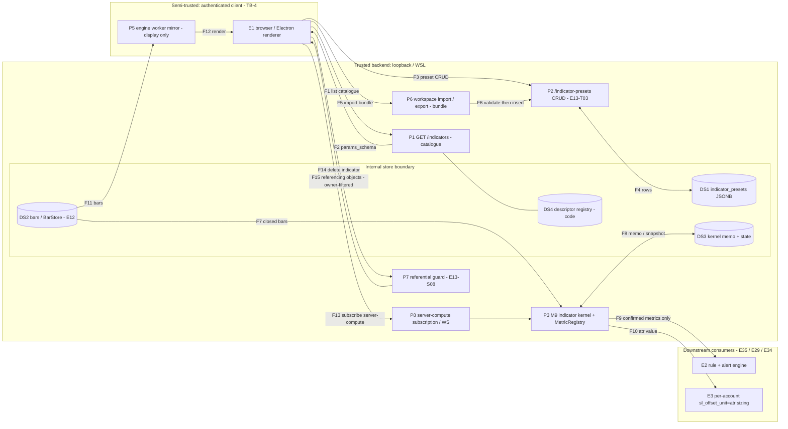

# E13 — STRIDE threat model: Indicator framework, presets and metric exposure

- Ticket: E13-X01 (issue #428). Owner: Security engineer (CODEOWNER). Status: **Draft** for Security + Architect +
  chart-engine lead review. Accepted risks (§12) await Owner sign-off.
- Method: `docs/plan/04-security-program.md` §5 template (L x I = risk), STRIDE per element (C-12.1). Format mirrors
  `E12-bars.md`. Reuses E09 (auth/RBAC), E12 (bars, the input of every kernel), E17 (WS envelope) and E35 (rule
  engine) controls; those threats are **referenced, not duplicated**.
- Inputs: ADR-0034 (**Proposed**, merged in #2050) and `docs/plan/spikes/e13-o4.md` (E13-K01 #348, closed).
  Everything taken from ADR-0034 (9 `server` / 19 `client_worker` split, bit-for-bit parity, banned `pow/exp/log`,
  retention-windowed worker memory) is cited as _proposed_ and is a control only once the ADR is ratified and
  E13-T04 finalises it.
- Path note: the ticket names `e13-indicators.md` under `docs/security/threat-models/`; this file follows the
  merged precedent (`E12-bars.md`) and the GOV-008 scan directory.
- **Data classification.** Market data (public). Presentation preferences — preset `params`/`style`, names,
  favourites (user-private, not secret). **The moment a rule or a stop offset consumes an indicator value, that
  value becomes safety-relevant** (§5): ATR feeds `sl_offset_unit="atr"` (`24-internal-schemas.md`, account
  profile: `sl_atr_period`, `sl_atr_multiple`) and confirmed Zig Zag `swing_high`/`swing_low` can feed
  structure-based trailing stops. The "indicators are cosmetics" assumption is therefore false for the `server`
  set, and this model treats the metric-integrity boundary as the headline concern.
- **Headline:** (1) integrity of any indicator value that reaches a rule or stop (O1, O8 of
  `04-security-program.md`); (2) broken object-level authorization on user presets; (3) authenticated users
  scheduling backend compute and storing unbounded JSONB. Generic web threats stay with E09/E17.
- Gate note: enumerates weaknesses only; no credentials or hosts appear.

## 1. Scope

In scope: the five data flows named by the ticket — browser <-> `GET /indicators` (`listIndicators`); browser <->
`/indicator-presets` CRUD (E13-T03); kernel -> `MetricRegistry` -> rule/alert consumers (E13-T02, E13-S08);
worker mirror -> display (E13-T01); `WorkspaceBundle.indicator_presets` import/export. Also: `compute: server`
subscriptions, the S08 referencing-objects guard, VWAP anchors (E13-S07), and the Zig Zag `provisional` contract
(E13-S05).

Out of scope: the rule engine's own model (E35, `e35-rule-engine.md`) and OMS / fan-out (E29/E34) — this model
**hands off the metric-integrity boundary** to them explicitly (§5); E13-X02 executes abuse cases; penetration
testing (E43, pre-R4); E15 workspace persistence beyond the bundle's `indicator_presets` array.

## 2. Data-flow diagram and trust boundaries

Text description: an authenticated client reads the catalogue and renders forms from its server-supplied
`params_schema` (F1-F2). It saves, edits and imports presets whose `params`/`style` are free JSON until the server
validates them (F3-F6). The authoritative kernel (P3) reads closed bars, memoises per `(symbol, spec_hash,
params)` and publishes **confirmed** values to the registry for rules (F9) and ATR to stop sizing (F10). The
worker (P5) computes its own display copy from client bars (F11-F12) and **never** feeds F9/F10. The client can
also schedule `compute: server` work (F13) and ask to delete an indicator that rules reference (F14-F15).

Elements: external entities **E1-E3**; processes **P1-P3, P5-P8** (P4 folded into E2); stores **DS1-DS4**; flows
**F1-F15**. Every element appears in §4 (coverage matrix 4.7).

Boundaries: **TB-4** (F1, F3, F5, F13, F14: authenticated, RBAC-scoped by E09; the client enforces nothing).
**Internal store boundary** (F4, F8). **TB-8** (this model's name for the F9/F10 hand-off to E35/E29/E34: only
values that are `server`-computed, closed-bar and non-provisional may cross it).

## 3. Numeric bounds: contract today, and recommended values

Measured inputs (E13-K01, `spikes/e13-o4.md`; E13-Q03 re-measures on reference hardware): worker full compute at
100k bars worst case 14.8 ms (Ichimoku), ten active indicators 86.1 ms; incremental 0.12 us per closed bar worst
case; worker output memory 46.5 MiB for 61 f64 series x 100k (cap 8 MB shared); **Python scalar (server) kernel
full compute at 100k bars up to 496 ms (Ichimoku) and 333 ms (VWAP + 3 sigma)**, i.e. 30-40x the worker.
The server cost is the DoS lever: a full recompute is O(bars x instances), the incremental path is O(1).
Every bound is validated **before** any allocation, subscription or compute is scheduled; truncation afterwards is
not a control. Values are **proposals** for E13-T02/T03/T01/S08 and E13-Q03 to confirm; they are not settled.

| Surface                          | Contract today                                                                                     | Gap                                                          | Recommended bound (SR)                                                                                                                                                                                                         |
| -------------------------------- | -------------------------------------------------------------------------------------------------- | ------------------------------------------------------------ | ------------------------------------------------------------------------------------------------------------------------------------------------------------------------------------------------------------------------------ |
| Indicator `period`/window params | 22-api `params: object, additionalProperties: true`; `params_schema` is advisory JSON Schema        | no ceiling; `period=5000` x many instances                   | every numeric param in `params_schema` carries `minimum`/`maximum`; server rejects (422, bound named), never clamps. Default ceiling **period <= 500**, hard ceiling **<= 2000** only where the descriptor says so (SR-E13-01) |
| Instances per chart              | none                                                                                               | unbounded stack                                              | **<= 20 indicator instances per chart**, **<= 6 sub-panes** (each sub-pane is a viewport + GL pass); excess refused with the cap named (SR-E13-02)                                                                              |
| `compute: server` instances      | ADR-0034: 9 server indicators, "Rate/instance caps ... are E13-X01's to specify"                    | none                                                         | **<= 8 server instances per user**, **<= 32 per symbol**, **<= 128 process-wide**; ref-counted by `(symbol, spec_hash, params)`; the cap check precedes registration (SR-E13-03)                                               |
| Server full recompute / backfill | scalar kernels, memoised                                                                           | far-past anchor forces a full scan                           | per-request window **<= 250 000 bars** (same figure as E12 SR-E12-02); **<= 2 concurrent full recomputes process-wide** on a bounded executor; a request over the cap is refused, never queued (SR-E13-04)                     |
| VWAP `custom_ts` anchor          | E13-S07: `custom_ts` free                                                                          | `custom_ts=0` triggers an unbounded historical backfill       | anchor must satisfy the SR-E13-04 window and be `>=` the symbol listing time and `<=` now; else `422 anchor_out_of_range` (SR-E13-05)                                                                                          |
| Preset `params` / `style` JSONB  | T03: "size caps on both JSONB columns" (no numbers)                                                | numbers absent                                               | **`params` <= 4 KiB, `style` <= 4 KiB, depth <= 4, <= 64 keys**, `name` <= 80 (contract); body cap checked before JSON parse (SR-E13-06)                                                                                       |
| Presets per user                 | none                                                                                               | unbounded rows                                               | **<= 500 live presets per user**; bundle import **<= 200 presets and <= 1 MiB** per request (SR-E13-07)                                                                                                                        |
| `style` values                   | T03: validated against the closed E13-D04 token list                                               | `style: {}` accepts anything today (schema `additionalProperties`) | closed set of keys and values; unknown key or non-token value is rejected, not dropped (SR-E13-08)                                                                                                                             |
| Catalogue size                   | 28 v1 descriptors                                                                                  | `params_schema` is server-supplied and rendered              | the client form renderer accepts a **closed JSON Schema subset** (type, enum, min/max, default, title); no `$ref`, `pattern` with backtracking, HTML in titles (SR-E13-09)                                                      |
| Worker retention                 | ADR-0034 rule 4                                                                                    | 46.5 MiB for 10 indicators at 100k                           | retention window `bars_window <= budget_bytes / (output_series x 8)`; shared 8 MB cap enforced (SR-E13-10)                                                                                                                     |

Cross-check against budgets (6 `06-performance-and-load-standard.md` §4.3: <= 2 ms/frame indicator redraw; first
visible window <= 250 ms at 100k): 20 instances at the measured worst-case 14.8 ms full compute stays near 300 ms
worker CPU off the main thread, and the caps leave every documented legitimate path intact. The server cap of 8 per
user x 0.5 s worst-case full recompute bounds one user to ~4 s of single-core work per refresh storm, which the
2-recompute executor then serialises. The numbers are starting values; E13-Q03 must confirm them on reference
hardware before E13-T02/T03 freeze them (Python measurements here are 3.14 local; CI on 3.12 is authoritative).

## 4. STRIDE table

Risk = L x I (Low/Med/High). Disposition: **M** mitigated by a named ticket, **A** accepted (Owner sign-off
recorded in §12), **R** referenced (owned by another epic's model), **N/A** with a reason. Verification layers
follow `04-security-program.md`: unit, integration, contract, load, manual-review; adversarial cases go to
E13-X02 (executes §9) and E13-Q06 (black-box). Provenance of every control is tagged in §11. Row ids are `IR-nn`.
Data flows: **DF1** catalogue (F1-F2), **DF2** presets CRUD (F3-F4), **DF3** kernel -> registry -> consumers
(F7-F10, F13-F15), **DF4** worker mirror -> display (F11-F12), **DF5** bundle import/export (F5-F6).

### 4.1 Spoofing

| ID | Flow / element | Threat | L | I | Risk | Control | Owner | Verify | Disp. |
| -- | -------------- | ------ | - | - | ---- | ------- | ----- | ------ | ----- |
| IR-01 | DF2, P2, F3 | Read, update or delete another user's preset by guessing its UUID (BOLA); `GET /indicator-presets` list leaks other users' rows | M | M | Medium | `x-rbac scope: self`; every query is `owner_user_id = :principal OR owner_user_id IS NULL` (reads) / `= :principal` (writes), enforced in the repository, not the router; foreign id returns **404** (not 403) so existence is not an oracle; authorization denial logged (SR-050, SR-051) | E13-T03 | integration, contract | M |
| IR-02 | DF2, DS1 | Non-owner mutates or deletes a built-in (`owner_user_id IS NULL`), or a user claims a built-in as theirs | M | M | Medium | built-ins immutable at the service layer (write path rejects `owner IS NULL`); "customise" copies into a user-owned row; `is_builtin` and `owner_user_id` are server-managed and never read from the body (IR-10) | E13-T03 | integration, contract | M |
| IR-03 | DF1, F2 | Spoofed catalogue response (network adversary) injects a hostile `params_schema` | L | M | Low | TLS on the tailnet/loopback (SR-049, TB-4); catalogue is code-defined (DS4), not user-writable; renderer subset (SR-E13-09) is defence in depth | E09 / E13-T02 | review | R |
| IR-04 | DF4, P5 | A worker/renderer-computed value is presented to a consumer as if it were the kernel's (display value posing as authoritative metric) | M | H | **High** | the registry has **no client write path**: no REST/WS frame accepts a metric value; F9/F10 originate only in P3; the worker has no import edge into `orderflow`/`risk` (import-linter, C-3.1); see §5 | E13-T02, E13-S08 | unit, integration, review | M |
| IR-05 | DF3, P8, F13 | Subscribe to, or unsubscribe, another user's server-compute subscription by id | L | L | Low | subscriptions are connection- and principal-bound; ids never accepted from the client for another principal (E17) | E13-T02 | integration | R |
| IR-06 | DF5, F5 | Bundle sets `owner_user_id` of another user or of NULL (built-in) on an imported preset | M | M | Medium | import ignores/rejects owner fields; owner is always the session principal; `is_builtin` forced false (IR-10) | E13-T03 | contract, integration | M |

### 4.2 Tampering (integrity of values that reach rules and stops)

| ID | Flow / element | Threat | L | I | Risk | Control | Owner | Verify | Disp. |
| -- | -------------- | ------ | - | - | ---- | ------- | ----- | ------ | ----- |
| IR-07 | DF2, DF5, F3/F5 | Hand-edited preset or bundle with out-of-range params (`period=-1`, `0`, `1e9`, NaN, `"1e400"`, wrong JSON type, extra keys) | H | M | **High** | `params` validated against the descriptor's `params_schema` with `minimum`/`maximum` **before** persistence (SR-040, SR-E13-01), `extra=forbid`; reject with 422 naming the bound, never clamp | E13-T03 (uses T02 schema) | unit, contract, property | M |
| IR-08 | DF2, DF5 | Unknown `indicator_code` (matches `^[a-z0-9_]{2,32}$` but is not a catalogue id) stored and later fails at render/rule time; **drift:** the OpenAPI example uses `atr_trail`, and `IndicatorPresetInput.indicator_code` allows 40 chars while the DB check allows 32 | M | M | Medium | `indicator_code` must be a member of the descriptor registry (422 `unknown_indicator`); align schema `maxLength: 32`, fix the example, in the same contract PR (C-6.1) | E13-T03 | contract | M |
| IR-09 | DF2, DF5 | `style` contains a value that is not an enumerated token (colour string, CSS, URL, script-like text, huge number) | H | M | **High** | closed key set and closed value set from the E13-D04 token list; unknown key or non-token value rejected, never silently dropped (SR-E13-08); renderer maps tokens to colours, never injects strings | E13-T03, E13-D04 | unit, contract | M |
| IR-10 | DF2, DF5 | Body carries `is_builtin: true`, `owner_user_id`, `id`, `deleted_at`, `created_at` to forge a built-in or revive a row | H | M | **High** | `IndicatorPresetInput` becomes `additionalProperties: false` / pydantic `extra="forbid"` + `frozen`; server-managed columns are set by the service only | E13-T03 | contract, integration | M |
| IR-11 | DF3, F9 | A **provisional** Zig Zag swing (last unconfirmed leg, repaints) is published to the registry and a rule/stop acts on a leg that later disappears | M | H | **High** | E13-S05: the kernel does **not** publish provisional values into the registry at all; `provisional=true` on the worker channel only; E35 adds its own assertion (RE-series); named test lives in E13-S05 and is asserted again by E13-X02 AC-11 | E13-S05, E35 | unit, integration | M |
| IR-12 | DF3, DF4, F10 | A worker-computed (display-only) value is used where the authoritative kernel value is required — specifically ATR feeding `sl_offset_unit="atr"` | M | H | **Critical** | see §5: ATR for stop sizing is read only from the `server` kernel via `MetricRegistry.resolve()`; worker ATR is display-only; test `test_atr_stop_offset_source_is_kernel` (E13-S08) plus a static check that `risk`/`oms` import no chart-engine contract; owner decision recorded in §12 | E13-T02, E13-S08, E29 | unit, integration, static | M |
| IR-13 | DF3, DF4 | Kernel and worker diverge (op order change, banned `pow/exp/log` introduced) so the chart shows a value the rule does not use | M | M | Medium | ADR-0034 (Proposed) bit-for-bit parity with NaN-aware exact equality on the recorded window with a densified gap + seeded 100k set (E13-Q05); `indicator_parity_mismatch_total` alerts at ERROR on any non-zero value for a rule-eligible metric | E13-Q05, E13-T04 | unit, parity | M |
| IR-14 | DF1, DF2, F2/F3 | Prototype-pollution keys (`__proto__`, `constructor`) or deeply nested JSON in `params`/`style`/`params_schema` corrupt client objects | L | M | Low | closed key set (IR-09), depth <= 4 (SR-E13-06); client parses into `Map`/null-prototype objects, never `Object.assign` into live config | E13-S01, E13-T03 | unit | M |
| IR-15 | DF3, F9 | A user-chosen display name (SCR-036) such as `atr(14, 5m)` collides with, or is mistaken for, a metric key | M | M | Medium | metric key derives from the T01 instance key, never the display name (E13-S08); duplicates get an ordinal; picker shows key + source | E13-S08 | unit, e2e | M |
| IR-16 | DF3, F14 | Referential-guard bypass: client-only check, or a race between the guard check and a rule being armed, deletes an indicator an armed rule uses | M | H | **High** | guard is server-authoritative and checked inside the same transaction/lock that arming takes; save-time resolution fails closed (unresolvable key rejects, never runtime-skips) | E13-S08, E35 | integration | M |
| IR-17 | DF3, F7 | Kernel consumes wrong/forming/backfill-overwritten bars (E12 BR-06/07/08) so the indicator is silently wrong | L | H | Medium | rule-facing values use **closed** bars only; integrity of bars is E12's (`E12-bars.md`) | E12 | integration | R |
| IR-18 | DS1 | Out-of-band edit of `indicator_presets` rows by a process with DB access | L | L | Low | trusted-host model (`04-security-program.md` §3); presentation data only; re-validated on read/render (IR-07/09) | — | review | A |

### 4.3 Repudiation

| ID | Flow / element | Threat | L | I | Risk | Control | Owner | Verify | Disp. |
| -- | -------------- | ------ | - | - | ---- | ------- | ----- | ------ | ----- |
| IR-19 | DF2, DF5 | Preset create/update/delete/import and built-in "customise" leave no record of who did what | M | L | Low | structured audit/analytics event `indicator_preset.{created,updated,deleted,imported,customised}` with `actor_id`, `preset_id`, `indicator_code`, before/after content hash, `traceId` (SR-060, SR-062, SR-065); no params body in the event beyond the hash | E13-T03 | unit, integration | M |
| IR-20 | DF3, F9/F10 | A disputed rule or stop decision cannot be tied to the kernel build, params and bar generation that produced the indicator value | M | H | **High** | descriptor `version` + kernel `build_version` returned by `resolve()` and recorded in the rule firing log and stop-sizing audit (E35 / E29); E13 supplies the fields, those epics persist them | E13-T02, E35, E29 | integration | M |
| IR-21 | DF3, F13 | Server-compute subscriptions created/removed with no attribution, so a load incident cannot be traced to a user | M | L | Low | log `user`, `spec_hash`, caps hit; metric `indicator_subscriptions` per user bucket (not a user-id label, to bound cardinality) | E13-T02 | unit | M |
| IR-22 | DF1, DF4 | N/A DF1 and DF4: read-only catalogue and a display-only mirror change no state, so there is nothing to repudiate | — | — | — | — | — | — | N/A |

### 4.4 Information disclosure

| ID | Flow / element | Threat | L | I | Risk | Control | Owner | Verify | Disp. |
| -- | -------------- | ------ | - | - | ---- | ------- | ----- | ------ | ----- |
| IR-23 | DF3, F15 | The S08 "referencing objects" list on a blocked delete leaks another user's rule or alert **names** and ids | M | M | Medium | listing is filtered by principal: own objects by name; objects of other users appear only as a count ("2 other objects"), Owner role may see names (E09 RBAC); the guard still blocks | E13-S08 | integration, contract | M |
| IR-24 | DF1-DF5 | 422/500 bodies echo internal paths, stack frames, SQL, schema file paths or the full submitted JSON | M | M | Medium | RFC 7807 with generic `detail`; validation errors carry only a JSON-pointer into the **public** `params_schema` and the violated bound; no exception text or filesystem path; redaction filter on logs (SR-006) | E13-T02, E13-T03 | unit, contract | M |
| IR-25 | DF1, F2 | Catalogue serialiser exposes internal fields (kernel module paths, unreleased/experimental indicators, server-only metrics such as non-v1 `hurst`) | L | L | Low | explicit response model allowlist (`IndicatorDescriptor` fields only); non-v1 metrics excluded | E13-T02 | contract | M |
| IR-26 | DF5, F5 | Export includes other users' presets, built-ins as owned, or any credential-bearing field | L | M | Low | export is `scope: self` and credential-free by schema; contract test asserts no foreign `owner_user_id` | E13-T03 | contract | M |
| IR-27 | DF3, DS3 | Kernel memo keyed `(symbol, spec_hash, params)` is shared across users and leaks one user's configuration to another | L | L | Low | key and value contain only public-data-derived content; no user id is part of either; **accepted** because sharing is the point of memoisation and indicators are derived from public data | E13-T02 | review | A |
| IR-28 | DF4, F11 | Worker/mirror exposes data beyond the user's entitlements | L | L | Low | N/A beyond public market data + the user's own preferences (classification above); no account data enters the worker | — | review | N/A |

### 4.5 Denial of service

| ID | Flow / element | Threat | L | I | Risk | Control | Owner | Verify | Disp. |
| -- | -------------- | ------ | - | - | ---- | ------- | ----- | ------ | ----- |
| IR-29 | DF4, P5 | `period=5000` x many instances saturates the engine worker and starves the chart | H | M | **High** | param ceilings (SR-E13-01), instance cap 20 (SR-E13-02), retention-windowed outputs (SR-E13-10); full compute is off-main-thread and cancellable; budget 2 ms/frame (§4.3 of 06) | E13-T01, E13-T02 | unit, perf (Q03) | M |
| IR-30 | DF3, P3 | Same parameter abuse in the **backend** kernel: scalar Python is 30-40x slower than the worker (up to ~0.5 s per full 100k-bar compute) | H | H | **High** | param ceilings; bounded 2-recompute executor; incremental O(1) path after first compute; memoised `(symbol, spec_hash, params)`; refuse over cap, never queue (SR-E13-01/03/04) | E13-T02 | load, unit | M |
| IR-31 | DF3, P8, F13 | Unbounded `compute: server` subscriptions per user (or subscribe/unsubscribe churn) | H | H | **High** | 8 per user / 32 per symbol / 128 process (SR-E13-03) with a 30 s grace; subscribe rate limit (SR-044); `indicator_subscriptions` gauge + alert | E13-T02 | integration, load | M |
| IR-32 | DF2, DF4 | Unbounded sub-pane creation (each is a viewport + GL pass + pane state) | M | M | Medium | **<= 6 sub-panes, <= 20 instances** enforced in the engine API and re-checked on preset/template load (SR-E13-02) | E13-T01, E13-S03 | unit, e2e | M |
| IR-33 | DF2, DF5 | Oversized JSONB in `params`/`style` (megabytes, deep nesting) exhausts the API process or Postgres | H | M | **High** | request-body cap before parse, `params`/`style` <= 4 KiB, depth <= 4, <= 64 keys, DB `CHECK (octet_length(params::text) <= 4096)` as belt-and-braces (SR-E13-06) | E13-T03 | unit, contract | M |
| IR-34 | DF3, F7 | Far-past `custom_ts` VWAP anchor triggers an unbounded historical backfill/recompute | H | H | **High** | anchor window <= 250 000 bars and `anchor_out_of_range` 422 (SR-E13-04/05); same executor limits as IR-30 | E13-S07, E13-T02 | unit, load | M |
| IR-35 | DF2, DF5 | Preset-count flood or a 10 000-item bundle import | M | M | Medium | 500 presets per user; bundle <= 200 presets and <= 1 MiB; whole import is one validated transaction (SR-E13-07) | E13-T03 | unit, contract | M |
| IR-36 | DF3, DS3 | Memo poisoning: many distinct near-identical params (`multiple=2.0001..`) fill the memo and state store | M | M | Medium | memo is bounded LRU sized by the instance caps; param precision/step enforced by schema (`multipleOf`) | E13-T02 | unit | M |
| IR-37 | DF1, F2 | Hostile or huge `params_schema` makes the client form renderer hang (regex backtracking, recursion) | L | M | Low | closed JSON Schema subset, no `$ref`/arbitrary `pattern` (SR-E13-09); catalogue is code-defined | E13-S01 | unit | M |
| IR-38 | DF4 | Worker memory growth: 46.5 MiB for ten indicators at 100k bars against an 8 MB shared cap | H | M | **High** | ADR-0034 retention: `bars_window <= budget_bytes / (output_series x 8)`; `indicator_output_bytes{where}` gauge (SR-E13-10) | E13-T01, E13-Q03 | perf | M |
| IR-39 | DF3, F13 | Slow consumer of server-computed series backpressures the kernel | M | M | Medium | bounded per-client queues and fair share per E17/C-2.18 | E17 | integration | R |

### 4.6 Elevation of privilege

| ID | Flow / element | Threat | L | I | Risk | Control | Owner | Verify | Disp. |
| -- | -------------- | ------ | - | - | ---- | ------- | ----- | ------ | ----- |
| IR-40 | DF2, P2 | A role without `workspaces:write` (read-only/viewer) writes presets; a role without `marketdata:read` reads the catalogue | M | M | Medium | RBAC enforced server-side per route (C-12.4); each endpoint has a forbidden-role and a cross-user case (IDOR) in its tests | E13-T03, E13-T02 | contract, integration | M |
| IR-41 | DF3, P8 | Client chooses where an indicator runs (`compute: server` for a non-eligible indicator, or `client_worker` to dodge caps) | M | M | Medium | `compute` is derived from the descriptor (ADR-0034: eligibility drives placement), never read from a request; requests naming it are rejected | E13-T02 | contract | M |
| IR-42 | DF3 | An indicator becomes rule-eligible without passing the safety review (flip from `client_worker` to `server` in a PR) | L | H | Medium | ADR-0034 rule 2: eligibility change flips placement in the same PR and requires CODEOWNER review of the descriptor; E35 owns rule-side validation | E13-S08, E35 | review | R |
| IR-43 | DF5, F6 | Bundle import is used to reach rules, alerts, drawings or layouts of the user (or others) | L | M | Low | the E13 path accepts only `indicator_presets`; other arrays are E15's (referenced); import is re-validated, never trusted | E13-T03, E15 | contract | R |
| IR-44 | DF1 | N/A DF1 EoP beyond IR-40/41: the catalogue endpoint is read-only, `scope: none`, public-derived data | — | — | — | — | — | — | N/A |

### 4.7 Coverage matrix

| Flow | S | T | R | I | D | E |
| ---- | - | - | - | - | - | - |
| DF1 catalogue | IR-03 | IR-14 | IR-22 (N/A) | IR-24, IR-25 | IR-37 | IR-40, IR-44 (N/A) |
| DF2 presets | IR-01, IR-02 | IR-07-10, IR-14, IR-18 | IR-19 | IR-01, IR-24 | IR-32, IR-33, IR-35 | IR-40 |
| DF3 kernel -> registry -> consumers | IR-04, IR-05 | IR-11-13, IR-15-17 | IR-20, IR-21 | IR-23, IR-27 | IR-30, IR-31, IR-34, IR-36, IR-39 | IR-41, IR-42 |
| DF4 worker -> display | IR-04 | IR-12, IR-13 | IR-22 (N/A) | IR-28 (N/A) | IR-29, IR-38 | IR-41 |
| DF5 bundle | IR-06 | IR-07-10 | IR-19 | IR-26 | IR-35 | IR-43 |

Elements P1-P3, P5-P8, DS1-DS4, E1-E3 and F1-F15 each appear in at least one row. Counts: 44 rows; High or Critical: IR-04, 07, 09, 10, 11, 12 (Critical), 16, 20, 29, 30, 31, 33, 34, 38.

## 5. The safety-relevant path: ATR -> stop offset, and provisional swings

Stated explicitly, as the ticket requires:

1. **ATR feeds `sl_offset_unit="atr"`.** The per-account profile (`24-internal-schemas.md`, `sl_offset_unit`
   in `ticks|percent|r_multiple|atr`, `sl_atr_period=14`, `sl_atr_multiple=2.0`, and `tp_offset_unit`) sizes a
   protective stop from an ATR value. The native stop-loss invariant (C-2.6, SR-056) means that stop is the only
   protection of a live position; a wrong ATR is a wrong stop distance on real money.
2. **A display-only worker value must never be the source for a stop offset.** ATR for stop sizing is read **only**
   from the authoritative backend kernel (M9, `compute: server`) through `MetricRegistry.resolve(name, scope)`,
   from **closed** bars. The worker copy (E13-T01) is a display mirror; no code path, request field, WS frame or
   persisted preset lets a client-supplied number become `sl_atr_*` input (SR-052: client values are hints;
   sizing is server-side). C-2.16 already keeps the engine exchange- and network-free, so it cannot be an input
   source; this model adds the explicit negative requirement and a test.
3. **Control and owning test.** Control: SR-E13-11 (single authoritative source, registry-only read, closed bars,
   no client write path). Owning tests: `test_atr_stop_offset_source_is_kernel` (E13-S08: stop sizing reads the
   registry; a worker-only ATR with a deliberately different value must not change the offset) and the E13-Q05
   parity pack (kernel == worker on the recorded window, so a divergence is detected before it is relied on).
   E13-X02 AC-10 re-executes it adversarially. Static: import-linter keeps `risk`/`oms` free of any chart-engine
   contract (C-3.1), and E13-X02/X03 may add a Semgrep rule if a pattern emerges.
4. **Zig Zag.** Confirmed `swing_high`/`swing_low` may feed structure-based trailing stops; the provisional leg
   must not. Control: E13-S05 does not publish provisional values into the registry at all (source exclusion);
   E35 asserts it again at evaluation (defence in depth). A non-confirmed swing reaching a rule is IR-11.
5. **Parity as a security signal.** On a rule-eligible metric a parity mismatch means the chart and the rule use
   different numbers. `indicator_parity_mismatch_total{indicator}` is therefore an **ERROR-level** security-adjacent
   event, not only a bug (§10). It does not itself stop trading; the kernel value stays authoritative.
6. **Hand-off.** What a rule does with a value (hysteresis, staleness, ineligible-metric rejection, firing log) is
   E35; how a stop is sized and submitted is E29/E34. E13 guarantees only: closed, confirmed, kernel-sourced,
   versioned values at the registry boundary (TB-8). If any of E13's guarantees is weakened the E35/E29 models must
   be re-opened (§12).

## 6. Classification and elevation of privilege

- **Public:** OHLCV bars, trades-derived series, the catalogue (descriptors, `params_schema`, defaults).
- **User-private (not secret):** preset names, `params`, `style`, favourites, bundle `indicator_presets`.
  Compromise of these discloses a trading style, not a credential. Not confidential enough for field encryption;
  must still be scoped to the owner (IR-01, IR-26).
- **Safety-relevant (integrity-critical):** any registry value consumed by a rule, alert action or stop-offset
  profile; kernel `build_version`; the provisional flag. Needs integrity controls, not confidentiality.
- **Re-classification trigger:** a per-user derived series that encodes account data (PnL-, position- or
  size-based indicators) would make indicator output account-scoped and re-open I rows and RBAC scope; indicators
  with `inputs` beyond bars/trades require a model amendment.
- No privileged operation exists in E13. Owner has no special E13 power except seeing other users' referencing
  object names (IR-23); there are no admin overrides, no key material and no order path.

## 7. Controls, constants and drift prevention

- Constants live in one backend module (`candleviewer/orderflow/indicators/limits.py`, owner E13-T02) and one
  TS counterpart generated or asserted against it (no hand-copied numbers); a unit test pins every value and the
  contract test asserts the OpenAPI `maxLength`/`minimum`/`maximum` match.
- Contract drift to fix in the contract-first PR (C-6.1) before consumers: `IndicatorPresetInput` has no
  `style`/`pane_target`/`is_favourite` yet the table has them; `additionalProperties: true` on `params`;
  `indicator_code` `maxLength: 40` vs DB 32; example uses `atr_trail` (not a v1 code); `is_default` vs
  `is_favourite`. These are IR-08/IR-10 and are requested on E13-T03 (§11).
- Requirement ids reused: SR-006, SR-040, SR-044, SR-049, SR-050, SR-051, SR-052, SR-056, SR-060, SR-062, SR-065.
  New ids `SR-E13-01..11` below are local to this model (they are proposals; the SR registry in 04-security-program
  is amended only by its owner).

| ID | Control | Rows | Ticket |
| -- | ------- | ---- | ------ |
| SR-E13-01 | Per-parameter `minimum`/`maximum`/`multipleOf` in every `params_schema`; reject, don't clamp | IR-07, 29, 30 | E13-T02, E13-T03 |
| SR-E13-02 | <= 20 instances and <= 6 sub-panes per chart | IR-29, 32 | E13-T01 |
| SR-E13-03 | 8 / 32 / 128 server instances per user / symbol / process, ref-counted | IR-30, 31 | E13-T02 |
| SR-E13-04 | Window <= 250 000 bars; 2 concurrent full recomputes; refuse, never queue | IR-30, 34 | E13-T02 |
| SR-E13-05 | `custom_ts` anchor range check (`anchor_out_of_range`) | IR-34 | E13-S07 |
| SR-E13-06 | `params`/`style` <= 4 KiB, depth <= 4, <= 64 keys; body cap before parse; DB CHECK | IR-14, 33 | E13-T03 |
| SR-E13-07 | <= 500 presets per user; bundle <= 200 presets / 1 MiB | IR-35 | E13-T03 |
| SR-E13-08 | `style` closed key and value set from E13-D04 tokens | IR-09 | E13-T03, E13-D04 |
| SR-E13-09 | Client renders a closed JSON Schema subset | IR-03, 37 | E13-S01 |
| SR-E13-10 | Worker retention window formula; `indicator_output_bytes{where}` | IR-38 | E13-T01 |
| SR-E13-11 | Stop sizing/rules read only the kernel via the registry, closed bars, no client write path | IR-04, 12 | E13-T02, E13-S08 |

## 8. Cross-references and shared mechanism

- E09 `e09-auth-rbac.md`: session, RBAC (`workspaces:*`, `marketdata:read`), IDOR test pattern (IR-01, IR-40).
- E12 `E12-bars.md`: bar integrity (IR-17) and the 250 000-bar figure reused by SR-E13-04.
- E17 (WS envelope, backpressure) for IR-05, IR-39. E35 `e35-rule-engine.md` for rule-side metric validation
  and provisional exclusion; E29/E34 for stop sizing. E15 for workspace persistence. E07 for storage.
- `04-security-program.md` §8.2 audit catalogue: the `indicator_preset.*` events are a candidate addition.

## 9. Abuse cases (handed to E13-X02 execution and E13-Q06 black-box)

Each case is executable as written. "A" and "B" are two seeded users with `workspaces:write`; "V" is a
read-only role. IDs are fixtures the test creates. Observation = the HTTP status/body and the named metric/log.

| #     | Exact action | Expected rejection | Observable evidence | Rows | Owner |
| ----- | ------------ | ------------------ | ------------------- | ---- | ----- |
| AC-01 | As B: `GET /indicator-presets/{A's preset id}`, then `PUT` and `DELETE` the same id | `404` for all three; A's row unchanged | response code and body (no A data); `updated_at`/`deleted_at` unchanged; authz-denial log entry | IR-01 | E13-X02 |
| AC-02 | As B: `GET /indicator-presets` | list contains only B's rows and built-ins | no `owner_user_id` of A in any item | IR-01 | E13-X02 |
| AC-03 | As A: `PUT` and `DELETE` a built-in (`owner_user_id` NULL) | `403` or `404`; built-in unchanged | row hash unchanged; denial log | IR-02 | E13-X02 |
| AC-04 | As A: `POST` with `is_builtin:true`, `owner_user_id:<B>`, `id:<fixed>`, `deleted_at:<x>` | `422` (unknown fields) | no row created; if created: `is_builtin=false` and owner = A (test fails) | IR-06, 10 | E13-X02 |
| AC-05 | `POST` `atr` with `params.period` in `{-1, 0, 5000, 1e9, "14", null, NaN, 1.5}` and extra key `x:1` | `422` per value, naming the bound | response `errors[].pointer` and bound; row count unchanged | IR-07 | E13-X02 |
| AC-06 | `POST` with `indicator_code` in `{"nope","atr_trail","a"*33,"ATR","../x","ema;drop"}` | `422 unknown_indicator`/schema error | row count unchanged; no code echoed unescaped | IR-08 | E13-X02 |
| AC-07 | `POST` `ema` with `style` `{"line":"#ff0000"}`, `{"line":"url(javascript:1)"}`, `{"__proto__":{"x":1}}`, `{"w":1e308}` | `422` for each | no row; none dropped silently (strip == fail) | IR-09, 14 | E13-X02 |
| AC-08 | `POST` with `params` of 5 KiB, of depth 6, of 65 keys, and a 2 MiB body | `422`/`413` before parse for the body | response time < 150 ms; no 500; memory flat | IR-33 | E13-X02, E13-Q06 |
| AC-09 | Import a `WorkspaceBundle` of 201 presets, one of 1.1 MiB, and one mixing valid and one invalid preset | `422`/`413`; **nothing** imported (atomic) | preset count for the user unchanged | IR-35, 43 | E13-X02 |
| AC-10 | Seed worker ATR(14)=X and kernel ATR(14)=Y (X != Y); size a stop with `sl_offset_unit="atr"` | offset derived from Y; a request carrying a client ATR is rejected | audit/sizing record `source=kernel` + `build_version`; test `test_atr_stop_offset_source_is_kernel` | IR-04, 12 | E13-X02 |
| AC-11 | Feed a Zig Zag series ending in a provisional leg; resolve `swing_high`/`swing_low` and run a trailing-stop rule | the provisional value is not in the registry; rule sees only the last confirmed swing; leg later vanishes with no action taken | `registry.resolve` returns the confirmed value; no firing log for the provisional | IR-11 | E13-X02 |
| AC-12 | As A: create 9 `compute: server` instances, then a 33rd on one symbol from several users, then churn subscribe/unsubscribe at 10 Hz | 9th refused naming the per-user cap; rate-limited churn | `indicator_subscriptions` gauge, `indicator_cap_rejected_total`; kernel CPU bounded | IR-31 | E13-X02, E13-Q06 |
| AC-13 | Request `vwap` `anchor=custom_ts` with `ts=0`, with a future ts, and with ts older than the 250 000-bar window | `422 anchor_out_of_range` | no backfill job started; executor depth unchanged | IR-34 | E13-X02 |
| AC-14 | Add 21 indicators and 7 sub-panes via UI and via a preset/template load | 21st and 7th refused with the cap named | chart instance count; `indicator_output_bytes` below cap | IR-32 | E13-Q02, E13-Q06 |
| AC-15 | 10 `period=2000` server instances at 100k bars on one symbol, then 20 concurrent users doing the same | over-cap refused; <= 2 full recomputes at once; other API p95 < 150 ms | `indicator_compute_seconds`, executor depth, API p95 | IR-30 | E13-Q03, E13-Q06 |
| AC-16 | As B, delete an indicator referenced by A's armed rule | blocked; response lists only counts for A's objects (no names) | response body contains no A rule/alert name | IR-23 | E13-X02 |
| AC-17 | Delete a referenced indicator by direct API call (UI guard bypassed), and race it with arming a rule | blocked; fail-closed | rule state unchanged; guard log | IR-16 | E13-X02 |
| AC-18 | Trigger validation errors and a forced 500 on each endpoint | RFC 7807 generic body | body contains no path, frame, SQL or submitted JSON (regex assertions) | IR-24 | E13-X02 |
| AC-19 | As V (read-only): `POST /indicator-presets`; as unauthenticated: `GET /indicators` | `403` / `401` | codes; no row | IR-40 | E13-X02 |
| AC-20 | `POST` with `compute:"server"` for a `client_worker` indicator (and the reverse) | rejected or ignored with `422` | placement unchanged | IR-41 | E13-X02 |
| AC-21 | Perturb a kernel op order (or add `pow`) in a copy; run the parity pack | parity fails | `indicator_parity_mismatch_total` > 0 at ERROR | IR-13 | E13-Q05 |
| AC-22 | Serve a catalogue with `$ref`, 10 000-char title and nested depth 50 to the form renderer (test double) | renderer rejects, shows a safe error | no hang (< 100 ms), no HTML injected | IR-37 | E13-Q06 |

## 10. Observability signals

- Preset access: authorization-denial log (principal, preset id, route) and `indicator_preset_denied_total`.
- `indicator_subscriptions` (per-user bucketed gauge, no user-id label) and `indicator_cap_rejected_total{cap}` for
  SR-E13-02/03/04/07.
- `indicator_compute_seconds{indicator,where}`, `indicator_output_bytes{where}` (ADR-0034, proposed).
- **`indicator_parity_mismatch_total{indicator}`**: ERROR-level; any non-zero value for a rule-eligible indicator
  pages (security-adjacent: chart and rule disagree).
- `indicator_provisional_published_total` must be 0 forever: a tripwire for IR-11 (counter incremented by a
  defensive assertion in the registry publisher, which also refuses the publish).
- Audit/analytics events `indicator_preset.*` (IR-19).

## 11. Control-to-ticket map

Every E13-* ticket appears here; a missing row is a model defect (enforced by GOV-008,
`scripts/check_threat_model_ticket_map.py`). Provenance tags: `[ticket body]` = already in the ticket text;
`required by this model - not yet in the ticket` = a new obligation this model adds. **No follow-up issue or
ticket comment has been created by this PR**; the new obligations below are listed for the orchestrator to
triage and are requested on the named existing tickets (no unassigned control exists: each has an owner).

| Ticket | Obligation |
| ------ | ---------- |
| E13-T01 | Instance cap 20, sub-pane cap 6 (SR-E13-02) and retention-window memory formula (SR-E13-10, `[ticket body]` in ADR-0034): numbers `required by this model - not yet in the ticket`; worker has no write path to the registry (IR-04) |
| E13-T02 | Descriptor `minimum`/`maximum` on every numeric param (SR-E13-01); server caps 8/32/128, 2-recompute executor, 250 000-bar window (SR-E13-03/04); memoisation `[ticket body]`; `compute` never client-chosen (IR-41); closed response model, generic errors (IR-24/25); `limits.py`; kernel `build_version` returned by `resolve()` (IR-20): numbers and `limits.py` `required by this model - not yet in the ticket` |
| E13-T03 | `params`/`style` validation and size caps `[ticket body]` (numbers 4 KiB/depth 4/64 keys, SR-E13-06, required by this model); owner-scoped repository, 404 on foreign id (IR-01); built-in immutability `[ticket body]`; `extra="forbid"` and server-managed `is_builtin`/`owner_user_id` (IR-10); `indicator_code` registry membership and `maxLength` 32 / example fix (IR-08); 500 presets, bundle 200/1 MiB atomic import (SR-E13-07); audit events `indicator_preset.*` (IR-19): items after the first two are `required by this model - not yet in the ticket` |
| E13-T04 | Finalises ADR-0034 (Proposed); records that the SR-E13-xx limits and the metric-integrity boundary are consequences; parity wording unchanged |
| E13-S01 | Closed JSON Schema subset renderer, null-prototype parsing of params (SR-E13-09, IR-14, IR-37): `required by this model - not yet in the ticket`; instance/sub-pane cap UX |
| E13-S02 | No control of its own; consumes SR-E13-01 bounds for period params |
| E13-S03 | Sub-pane creation counts against the 6-pane cap (IR-32); no other control |
| E13-S04 | **ATR is the stop-sizing indicator**: ATR kernel is `server`, `exact`, closed bars (IR-12); no other control |
| E13-S05 | Provisional Zig Zag never published to the registry `[ticket body]` (IR-11); tripwire counter and defensive publisher assertion: `required by this model - not yet in the ticket` |
| E13-S06 | No control; `volume`/`cvd` are `server`, same caps |
| E13-S07 | `custom_ts` anchor range check (SR-E13-05, IR-34): `required by this model - not yet in the ticket`; same kernel as E14 |
| E13-S08 | Server-authoritative referential guard `[ticket body]` run in the arming lock/transaction (IR-16); owner-filtered referencing list (IR-23); metric key independent of display name `[ticket body]` (IR-15); `test_atr_stop_offset_source_is_kernel` (SR-E13-11, IR-12): items after the first are `required by this model - not yet in the ticket` |
| E13-K01 | Spike delivered ADR-0034 (Proposed) and the measured costs used in §3; no control of its own |
| E13-Q01 | Black-box plan: consumes AC-01..AC-22 and the §3 boundary table; no control of its own |
| E13-Q02 | Playwright: AC-14 (caps in UI); forbidden-role UI behaviour |
| E13-Q03 | Confirms every §3 number on reference hardware before T02/T03 freeze them; executes AC-15; closes the Electron measurement |
| E13-Q04 | Accessibility audit: no security control |
| E13-Q05 | Parity pack; executes AC-21; asserts `indicator_parity_mismatch_total` behaviour (IR-13) |
| E13-Q06 | Black-box execution of AC-08, AC-12, AC-14, AC-15, AC-22 and chaos; QA sign-off |
| E13-X01 | This model |
| E13-X02 | Executes AC-01..AC-20 (§9) and verifies each control row; CI/Semgrep rules where a pattern emerges; sign-off |
| E13-D01 / D02 / D03 | Design: no control; copy for rejection messages names the bound (IR-07) |
| E13-D04 | Closed token-name list that SR-E13-08 validates against: `[ticket body]` in T03; palette tokens are the allowed value set |
| E13-D05 / D06 / D07 | Design: no control; D07 must check that cap and rejection states exist |
| E09 / E12 / E15 / E17 / E29 / E34 / E35 | Referenced controls: IR-01/40 (E09), IR-17 (E12), IR-43 (E15), IR-05/39 (E17), IR-12/20 (E29/E34), IR-11/20/42 (E35) |

New obligations (not yet posted): requested scope additions on E13-T01 (#425), E13-T02 (#426), E13-T03 (#427),
E13-S01 (#423), E13-S05 (#462), E13-S07 (#464) and E13-S08 (#465). If a ticket owner rejects a number, the number
in §3 must be amended here in the same PR that changes the ticket.

## 12. Residual risks, review and sign-off

- Accepted (awaiting Owner sign-off): IR-18 (trusted-host DB edit of presentation data), IR-27 (memo shared
  across users; derived from public data).
- **Residual (not eliminated):**
  - IR-12 (ATR source) and IR-11 (provisional swing) are mitigated at the **source** by E13; whether a stop or a
    rule actually reads only the registry is enforced in E29/E34/E35 and by the named test. Inherent
    Critical/High, residual Medium once `test_atr_stop_offset_source_is_kernel` and E35's assertion exist;
    until E13-S08 lands there is no control, so E13-S08 must not be merged without it. Tracked as **RSK-060**.
  - IR-13/IR-20: parity is proven on recorded and synthetic data only; a platform libm difference in a future
    kernel (`pow/exp/log`, banned) would break it. ADR-0034 is Proposed.
  - IR-29..IR-34, 38: all caps are starting values and unmeasured on reference hardware (E13-Q03); a user at
    the per-user caps on a hot symbol still costs real CPU. Tracked as **RSK-061**.
- No High residual is unmitigated or un-owned. Items to watch: IR-12, IR-16, IR-30 (depend on tickets not yet
  built and on a Proposed ADR).
- Status is **Draft**: the Owner accepts the risks in §12 (agent-delivery adaptation); the Security-engineer
  sign-off is a PR comment by the independent security reviewer; Architect and chart-engine lead review via PR
  review. E13-T02, T03 and S08 must not start before both.

### Review log

| Date       | Reviewer               | Result          |
| ---------- | ---------------------- | --------------- |
| 2026-10-08 | author (E13-X01 agent) | Draft submitted |
