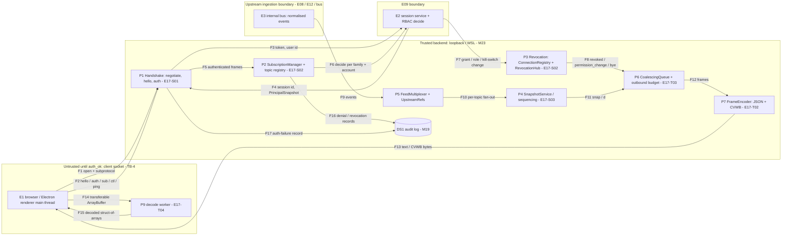

# E17 — STRIDE threat model: Client WS protocol and gateway

- Ticket: E17-X01 (issue #381). Owner: Security engineer (CODEOWNER). Status: **Draft** for Architect +
  Security-engineer review. Accepted residual risks (§10) await Owner sign-off.
- Method: `docs/plan/04-security-program.md` §5 template (L x I = risk), STRIDE per element and per flow
  (C-12.1). Format mirrors `E13-indicators.md`. Reuses the E09 auth/RBAC model (`e09-auth-rbac.md`, U-rows);
  those threats are **referenced, not duplicated**. Upstream Bybit connection security is E08's model.
- Inputs: `docs/plan/23-ws-protocol.md` (§2-§11, §16.2), ADR-0005, and the merged gateway code under
  `services/api/candleviewer/ws/` (E17-S01 lifecycle/gateway, E17-S02 topics/permissions/revocation/upstream,
  E17-T02 binary codec) at the commit this PR is based on.
- **Data classification (per flow).** Public market-data topics: **internal**. Private topics (`orders`,
  `positions`, `executions`, `wallet`, `trade_groups`, `rules`, `alerts`, `recorder`): **confidential**,
  account- or owner-scoped. `auth_ok` / `permission_change` payload: **confidential** (enumerates the account
  scope). Access tokens: **secret**.
- **Headline concerns** (`30-release-roadmap.md` §5.4): (1) WS authentication, including the bounded
  unauthenticated window (§4); (2) topic authorisation evaluated continuously, not once (§5); (3) resource
  exhaustion of a deliberately stateful server (§6).
- Gate note: enumerates weaknesses at design level only; no credentials, hosts or exploit detail appear.

## 1. Scope

In scope: the `/ws/v1` endpoint and module M23 — subprotocol negotiation, `hello`/`welcome`, `auth`/`auth_ok`
and in-place re-auth, heartbeats and close codes (E17-S01); the topic registry, parser, per-topic permission
matrix, limits and live revocation (E17-S02); snapshot+delta sequencing and resync (E17-S03, not built yet);
coalescing and the outbound budget (E17-T03, not built yet); the CVWB binary codec on both ends (E17-T02); the
web client and its decode worker (E17-T04, not built yet); error registry (E17-T05) and observability (E17-T06).

Out of scope: implementing controls (owned by the tickets in §9); executing adversarial tests (E17-X02);
the auth/session/RBAC systems themselves (E09); upstream Bybit connection security (E08); private-topic
payload semantics (E29/E34); replay clock and session lifecycle (E26).

### 1.1 State of the build at review time

The model is written against a partially built epic. Rows marked **(planned)** describe a control that is
specified in `23-ws-protocol.md` but not merged yet; their rating assumes the named ticket ships it. Known
open gaps, already tracked:

| Gap                                                                                                                                                                                                                 | Tracked in            | Rows affected       |
| ------------------------------------------------------------------------------------------------------------------------------------------------------------------------------------------------------------------- | --------------------- | ------------------- |
| No global cap on pre-auth sockets (bounded only by the 10 s auth timeout); `authenticate` / principal resolution are not wrapped in `asyncio.timeout`; outbound queue has no literal `maxsize` (bound is in `push`) | #2155                 | WS-S03, WS-D01, D02 |
| Web client offers subprotocols but never sends `hello`/`auth`                                                                                                                                                       | #2155 (E17-T04 scope) | WS-S05, WS-E05      |
| Gateway is mounted in `app.py`, but session authentication and principal snapshots fail closed until the identity store is wired; end-to-end wiring is still open on E17-S01                                        | #377                  | WS-S01, WS-E01      |
| `cv.v1.msgpack` is offered by the contract but **not served** (only `cv.v1.json` is negotiated); no msgpack decoder is exposed to untrusted input today                                                             | E17-T07 / ADR-0005    | WS-T08              |
| Coalescing, the 8 MiB / 2 000-frame budget and the overflow ladder (E17-T03); snapshot/resync and the resync rate limit (E17-S03)                                                                                   | #412, #411            | WS-D03..D06         |

## 2. Data-flow diagram and trust boundaries

Text description: a client opens a socket offering a subprotocol (F1) and must send `hello` then `auth` with
an access token in the first frames (F2); the token is resolved by E09 to a session and a principal snapshot
(F3-F4). Only after `auth_ok` do `sub`/`unsub`/`ctl` reach the SubscriptionManager (F5), which asks E09's
`decide` per topic family and per account (F6). Grant, role, kill-switch, session-revocation and user-disable
events (F7) re-evaluate every live subscription and push `permission_change`/`revoked`/`bye` (F8). Market
events from the bus (F9) are multiplexed per topic (F10), sequenced (F11), coalesced and bounded (F12) and
encoded once per emission (F13). In the browser, binary bodies cross to a worker as transferables (F14) and
come back decoded (F15). Denials, revocations and repeated auth failures are audited (F16-F17).

Elements: external entities **E1-E3**; processes **P1-P7, P9** (P8 reserved for the E26 replay router, out of
scope); store **DS1**; flows **F1-F17**. Every element appears in the coverage matrix (§3.7).

Boundaries:

- **TB-4 client socket -> Handshake** (F1, F2): untrusted until `auth_ok`; semi-trusted (authenticated,
  RBAC-scoped) after it. The client enforces nothing.
- **Handshake -> E09** (F3, F4, F6, F7): the gateway consumes E09's `decide` and session service; it holds no
  copy of the rules.
- **Upstream ingestion boundary** (F9): bus content is trusted for integrity (E08/E12 models) but treated as
  unbounded in rate.
- **Encoder -> socket** (F12, F13): the server's own frames become untrusted input for the client decoder.
- **Browser main <-> worker** (F14, F15): same origin, but the worker parses untrusted bytes; a decoder fault
  must stay in the worker.

## 3. STRIDE table

Risk = L x I (Low/Med/High). Disposition: **M** mitigated by a named ticket (merged or planned), **A**
accepted (Owner sign-off in §10), **R** referenced (owned by another epic's model), **N/A** with a reason.
Verification layers follow `04-security-program.md`: unit, integration, contract, fuzz, load, chaos,
manual-review; adversarial cases go to E17-X02 (§7). Row ids are `WS-xnn`.

### 3.1 Spoofing

| ID     | Flow / element | Threat                                                                                               | L   | I   | Risk   | Control                                                                                                                                                                                                                 | Owner          | Verify            | Disp. | Residual |
| ------ | -------------- | ---------------------------------------------------------------------------------------------------- | --- | --- | ------ | ----------------------------------------------------------------------------------------------------------------------------------------------------------------------------------------------------------------------- | -------------- | ----------------- | ----- | -------- |
| WS-S01 | F2-F4, P1      | Captured access token replayed on a new socket                                                       | L   | H   | Medium | Short-lived opaque access token validated by E09 on every `auth`; session revocation closes every socket of the session (`RevocationHub`, 4401); token expiry closes with `token_expired` (SR-074, SR-012/013; E09 U13) | E17-S01 / E09  | integration       | M, R  | Low      |
| WS-S02 | F2, P1         | Stolen token used from another tailnet host                                                          | L   | H   | Medium | Tailnet-only reachability (SR-045/047); token TTL; session revocation path as WS-S01; device binding is E09's scope (U-rows), not re-modelled here                                                                      | E09            | manual-review     | R     | Low      |
| WS-S03 | F1, P1         | Unauthenticated socket held open to consume slots during the 10 s window                             | M   | M   | Medium | 10 s auth timeout, 3 auth attempts, 3 unauthenticated frames, inbound rate limit before auth, frame-size cap before decode; **global pre-auth cap and auth-await timeout are open (#2155)** — see §4                    | E17-S01, #2155 | unit, load, chaos | M     | Medium   |
| WS-S04 | F2, P1         | Re-auth on a live socket switches it to a different user                                             | L   | H   | Medium | In-place re-auth must resolve to the same `user_id` or counts as a failed attempt; subscriptions re-evaluated against the refreshed principal (`apply_snapshot`)                                                        | E17-S01        | unit              | M     | Low      |
| WS-S05 | F2, P1         | `hello` claims another client build / shell / capabilities to unlock behaviour                       | M   | L   | Low    | `hello` fields are advisory only: no authorisation, limit or feature decision reads them; `welcome.limits` are server constants. Rule: no future control may key off `hello` content                                    | E17-S01        | unit, review      | M     | Low      |
| WS-S06 | F1, P1         | Cross-site page in the user's browser opens a socket to the gateway (cross-site WebSocket hijacking) | L   | H   | Medium | Auth is a first-frame bearer token, not ambient cookies, so a foreign page cannot authenticate without the token; Origin allow-list on the upgrade is requested as defence in depth (SR-E17-01)                         | E17-S01        | integration       | M     | Low      |

### 3.2 Tampering

| ID     | Flow / element | Threat                                                                                                                        | L   | I   | Risk   | Control                                                                                                                                                                                                                      | Owner            | Verify         | Disp. | Residual |
| ------ | -------------- | ----------------------------------------------------------------------------------------------------------------------------- | --- | --- | ------ | ---------------------------------------------------------------------------------------------------------------------------------------------------------------------------------------------------------------------------- | ---------------- | -------------- | ----- | -------- |
| WS-T01 | F13-F15, P9    | Hostile CVWB body: unbounded `record_count`, truncated body, wrong magic, unknown kind or flag bits (T-W1 on our own framing) | M   | M   | Medium | Decoder checks header length, magic, kind, then exact body length against the real buffer **before** any allocation sized from a wire count; raises one typed error (SR-128); fuzz corpus on Python and TS decoders (SR-155) | E17-T02, E17-X02 | unit, fuzz     | M     | Low      |
| WS-T02 | F2, P1         | Oversized or deeply nested inbound JSON exhausts the parser                                                                   | M   | M   | Medium | 256 KiB cap on the raw frame **before** decoding (close 1009); a parse failure (including nesting depth) must count as a protocol violation, never an unhandled fault (SR-E17-02)                                            | E17-S01          | unit, fuzz     | M     | Low      |
| WS-T03 | F5, P2         | Option injection: unknown keys, wrong types, out-of-range values in `opts`                                                    | M   | M   | Medium | Per-family declarative option schema; unknown keys and bad values rejected per topic (`invalid_options`), never coerced (SR-040)                                                                                             | E17-S02          | unit, contract | M     | Low      |
| WS-T04 | F5, P2         | Topic-name injection: extra segments, wildcards, path-like or unknown family names to escape the registry                     | M   | H   | Medium | Deny-by-default registry: a topic resolves only to a registered family pattern with typed segments; unknown -> `unknown_topic`; symbol segments checked against the instrument cache (SR-074)                                | E17-S02          | unit, fuzz     | M     | Low      |
| WS-T05 | F2, F5         | Envelope field injection: forged `ts`, `s`, `e`, or server-only fields in client frames                                       | L   | M   | Low    | Client envelopes carry only `t`/`id`/`p`; server never echoes client fields except `id`; sequence numbers are server-assigned per (connection, topic) (E17-S03, planned)                                                     | E17-S01, E17-S03 | unit           | M     | Low      |
| WS-T06 | F5, P2         | `sub` entry carries extra fields (`user`, account ids outside opts) to influence leases or scope                              | L   | H   | Medium | Unknown topic-entry fields rejected; bar leases bound to the authenticated principal id, never a client value                                                                                                                | E17-S02          | unit           | M     | Low      |
| WS-T07 | F9-F11, P4     | Stale or replayed sequence lets a client apply a delta across a gap                                                           | M   | M   | Medium | Server never emits a delta across an upstream gap; `snap` with `upstream_desync`; client gap detection triggers resync (E17-S03, E17-T04, planned)                                                                           | E17-S03, E17-T04 | integration    | M     | Low      |
| WS-T08 | F2, P1         | msgpack decoder exposed to untrusted input without size/depth bounds                                                          | L   | M   | Low    | Not reachable today: only `cv.v1.json` is negotiated. When msgpack ships, it must get the same pre-decode size cap, depth/length limits and fuzz target (SR-E17-03)                                                          | E17-T07          | fuzz, review   | M     | Low      |

### 3.3 Repudiation

| ID     | Flow / element | Threat                                                                           | L   | I   | Risk   | Control                                                                                                                                                                                                        | Owner            | Verify      | Disp. | Residual |
| ------ | -------------- | -------------------------------------------------------------------------------- | --- | --- | ------ | -------------------------------------------------------------------------------------------------------------------------------------------------------------------------------------------------------------- | ---------------- | ----------- | ----- | -------- |
| WS-R01 | F5, F16        | Subscription to a private topic leaves no trail                                  | M   | M   | Medium | Denied and rejected private-topic attempts write `ws.subscribe.denied`; **successful** private-topic subscriptions must also be recorded (actor, family, account ids, connection id) (SR-E17-04)               | E17-S02, E17-T06 | integration | M     | Low      |
| WS-R02 | F7, F8, F16    | A revocation leaves no record                                                    | L   | M   | Low    | Every `revoked` frame writes `ws.subscription.revoked` with reason and removed accounts; session-revocation and user-disabled closes are counted (`ws_revoked_total`) and must also be audited (SR-E17-04)     | E17-S02          | integration | M     | Low      |
| WS-R03 | F17            | Repeated auth failures not attributable                                          | M   | L   | Low    | Third failure writes a `warning` audit entry; failures counted per connection and (SR-E17-05) aggregated per source so spraying across sockets is visible                                                      | E17-S01, E17-T06 | integration | M     | Low      |
| WS-R04 | F16, DS1       | Audit write failure silently drops the record (best-effort audit on the WS path) | L   | M   | Low    | Audit emission is best-effort so the reply is never held hostage; a failed write logs a warning and must increment an alerting metric (SR-E17-04). Accepted: denial still happens even when the record is lost | E17-T06          | unit        | A     | Low      |

### 3.4 Information disclosure

| ID     | Flow / element | Threat                                                                                            | L   | I   | Risk   | Control                                                                                                                                                                                                                               | Owner            | Verify       | Disp. | Residual |
| ------ | -------------- | ------------------------------------------------------------------------------------------------- | --- | --- | ------ | ------------------------------------------------------------------------------------------------------------------------------------------------------------------------------------------------------------------------------------- | ---------------- | ------------ | ----- | -------- |
| WS-I01 | F1, F2         | Token in URL query string, log line, metric label or error message                                | M   | H   | Medium | Query string never read; token only in the `auth` frame body; logs bind connection/session/user ids, never the token (SR-122); `err` frames built by one builder, `internal_error` never carries text; no token-bearing metric labels | E17-S01, E17-T05 | unit, review | M     | Low      |
| WS-I02 | F5, F6         | Cross-account data leak through scope narrowing                                                   | M   | H   | Medium | Requested accounts intersected with the principal's grants via E09 `decide`; effective list echoed in `sub_ok.effective`; fan-out filters events by the subscription's account set (E29/E34 producers, planned)                       | E17-S02          | integration  | M     | Low      |
| WS-I03 | F5             | Differential errors reveal which account ids exist                                                | M   | M   | Medium | One code and message (`account_scope_denied`) for absent, foreign and non-existent accounts                                                                                                                                           | E17-S02          | unit         | M     | Low      |
| WS-I04 | F2, P1         | `connection_id`, `git_sha`, `server_version`, `request_id` exposed to a Viewer or pre-auth client | M   | L   | Low    | Exposed in `welcome` **before auth** to anyone who reaches the port. Accepted on a tailnet-only service: no secret, aids support; revisit if exposure changes                                                                         | Owner            | review       | A     | Low      |
| WS-I05 | F8, `system`   | `system` topic content not filtered by role                                                       | M   | M   | Medium | `system` is implicit for every authenticated user; its payload must carry only role-neutral health/flag/kill-switch state, with role-specific fields filtered before emission (SR-E17-06)                                             | E17-S03, E17-T06 | unit         | M     | Low      |
| WS-I06 | F4, F8         | `auth_ok` / `permission_change` reveals the full permission and account list                      | L   | L   | Low    | Only the caller's own scope; confidential classification; never logged in full                                                                                                                                                        | E17-S01          | review       | M     | Low      |
| WS-I07 | F14, P9        | Decoded private data leaks through worker `postMessage` to another context                        | L   | M   | Low    | Worker is same-origin and dedicated to the app; no cross-origin messaging; CSP (SR-127)                                                                                                                                               | E17-T04          | review       | M     | Low      |

### 3.5 Denial of service

| ID     | Flow / element | Threat                                                                                    | L   | I   | Risk   | Control                                                                                                                                                                                                        | Owner            | Verify      | Disp. | Residual |
| ------ | -------------- | ----------------------------------------------------------------------------------------- | --- | --- | ------ | -------------------------------------------------------------------------------------------------------------------------------------------------------------------------------------------------------------- | ---------------- | ----------- | ----- | -------- |
| WS-D01 | F12, P6        | Slow consumer grows server memory                                                         | H   | M   | High   | Today: 1 024-frame push bound, close `4429 slow_consumer`. Planned: 8 MiB / 2 000-frame budget and the four-step ladder (SR-073). The 8 MiB number is **both** the DoS control and the performance budget (§6) | E17-T03, #2155   | unit, chaos | M     | Low      |
| WS-D02 | F3, P1         | Slow auth/principal lookup stalls the handshake while sockets accumulate                  | L   | M   | Low    | Auth timeout closes the socket; wrapping the awaits in `asyncio.timeout` is open (#2155, C-2.18)                                                                                                               | #2155            | unit        | M     | Low      |
| WS-D03 | F11, P4        | Resync loop forces repeated snapshot rebuilds                                             | M   | M   | Medium | 5 resyncs / topic / minute, then `resync_rate_limited` and revocation (planned)                                                                                                                                | E17-S03          | unit, chaos | M     | Low      |
| WS-D04 | F5, P2/P5      | Subscription / symbol exhaustion                                                          | M   | M   | Medium | 50 topics per `sub`, 200 subscriptions and 40 symbols per connection, 8 connections per user; shared upstream refs with grace release                                                                          | E17-S02          | unit, load  | M     | Low      |
| WS-D05 | F2, P1         | Inbound frame flood                                                                       | M   | M   | Medium | 30 frames/s and 300/min, before and after auth; second breach closes `4429`; 3 protocol violations close `4400`                                                                                                | E17-S01          | unit        | M     | Low      |
| WS-D06 | F2, P1         | Oversized inbound frame                                                                   | M   | M   | Medium | 256 KiB checked on raw bytes before decode, close 1009                                                                                                                                                         | E17-S01          | unit        | M     | Low      |
| WS-D07 | F1, P1         | Connection exhaustion per user and globally                                               | M   | M   | Medium | 8 per user after auth (oldest idle closed); pre-auth bounded only by timeout until #2155 adds a global pre-auth cap                                                                                            | E17-S01, #2155   | load        | M     | Medium   |
| WS-D08 | F10-F13        | Expensive-topic amplification: 200-depth book plus 2 000-column heatmap across 40 symbols | M   | M   | Medium | Per-family throttles and minimum 50 ms; encode-once-send-many; symbol cap; adaptive throttle classes (E17-T03); budgets measured by k6 (E17-Q03)                                                               | E17-T03, E17-Q03 | load        | M     | Medium   |
| WS-D09 | F7, P3         | Revocation fan-out blocked by one stalled socket                                          | L   | M   | Low    | Subscriptions dropped synchronously before I/O; each send under a 2 s timeout; stalled socket unregistered and closed                                                                                          | E17-S02          | unit        | M     | Low      |
| WS-D10 | F15, P9        | Decode fault or huge frame crashes the browser main thread                                | M   | L   | Low    | Decode in a worker (E17-T04); decoder errors are typed and non-fatal; 4 MiB outbound frame cap with chunked snapshots                                                                                          | E17-T04, E17-S03 | unit, e2e   | M     | Low      |

### 3.6 Elevation of privilege

| ID     | Flow / element | Threat                                                                 | L   | I   | Risk   | Control                                                                                                                                                                          | Owner        | Verify             | Disp. | Residual |
| ------ | -------------- | ---------------------------------------------------------------------- | --- | --- | ------ | -------------------------------------------------------------------------------------------------------------------------------------------------------------------------------- | ------------ | ------------------ | ----- | -------- |
| WS-E01 | F5, F6         | Subscribing to another account's private topic by a hand-crafted frame | M   | H   | Medium | Family permission + per-account `decide` on every `sub`; nothing pre-auth reaches the SubscriptionManager; matrix-driven tests per role x topic x grant (SR-074, SR-151)         | E17-S02      | integration        | M     | Low      |
| WS-E02 | F7, P3         | Stale permission set survives a grant or role change                   | M   | H   | Medium | Grant/role change re-resolves the principal and re-evaluates every live subscription; drops/narrows synchronously; `revoked` within 1 s (§5)                                     | E17-S02, E09 | integration, chaos | M     | Low      |
| WS-E03 | F5, P2         | A `replay_session_id` reaches a private topic                          | L   | H   | Medium | Private families reject `replay_session_id` (`invalid_options`); replay id must be a UUID; replay routing ownership check is E26                                                 | E17-S02, E26 | unit               | M, R  | Low      |
| WS-E04 | F7, F8         | Kill-switch state not honoured on the socket                           | L   | H   | Medium | `auth_ok` carries kill-switch state; transitions re-evaluate every connected user; order entry is REST and enforced synchronously by the OMS (C-2.21). The WS only mirrors state | E17-S02, E29 | integration        | M, R  | Low      |
| WS-E05 | F2, P1         | Frame handled before `hello`/`auth_ok` reaches a privileged handler    | L   | H   | Medium | Explicit lifecycle state machine; pre-auth only `auth`/`ping`/`pong`; `sub`/`unsub`/`ctl` dispatched only with an authorisation context present                                  | E17-S01      | unit               | M     | Low      |

### 3.7 Coverage matrix

| Element / flow                 | S                                                            | T                  | R             | I             | D            | E        |
| ------------------------------ | ------------------------------------------------------------ | ------------------ | ------------- | ------------- | ------------ | -------- |
| P1 Handshake (F1-F4)           | S01-S06                                                      | T02, T05, T08      | R03           | I01, I04, I06 | D02, D05-D07 | E05      |
| P2 SubscriptionManager (F5-F6) | S04                                                          | T03, T04, T06      | R01           | I02, I03      | D04          | E01, E03 |
| P3 Revocation (F7-F8)          | S01                                                          | —                  | R02           | I06           | D09          | E02, E04 |
| P4 Snapshot / sequencing (F11) | —                                                            | T05, T07           | —             | I05           | D03          | —        |
| P5 Multiplexer (F9-F10)        | N/A: internal bus is authenticated by process boundary (E08) | T07                | —             | I02           | D04, D08     | —        |
| P6 Coalescing (F12)            | —                                                            | —                  | —             | —             | D01, D08     | —        |
| P7 Encoder (F13)               | —                                                            | T01                | —             | I01           | D08          | —        |
| P9 Worker (F14-F15)            | —                                                            | T01                | N/A: no actor | I07           | D10          | —        |
| DS1 Audit (F16-F17)            | —                                                            | R (E09 hash chain) | R01-R04       | —             | —            | —        |

Every STRIDE category has analysed rows. Counts: 40 rows; one High (WS-D01, inherent); residual Medium:
WS-S03, WS-D07, WS-D08 (open items, §10).

## 4. WS authentication and the 10-second unauthenticated window

The window cannot be removed. Browser WebSockets cannot set an `Authorization` header, and a query-string
token is worse: it lands in proxy logs and browser history. The gateway therefore accepts the socket, then
requires `hello` as the first frame and `auth` with a bearer token within 10 s (`23-ws-protocol.md` §4.2-§4.3).
The argument is that the window is **bounded and cheap**:

- **Bounded in time.** `AUTH_TIMEOUT_S = 10` is evaluated by the per-connection watchdog against an injected
  clock; expiry sends `bye auth_timeout` and closes `4401`.
- **Bounded in attempts.** Three failed `auth` frames close `4401` with a `warning` audit entry. Three
  non-`auth` frames before `auth_ok` close the socket. Anything other than `hello` first closes `1002`.
- **Bounded in rate and size, before auth as well as after.** The 30/s and 300/min inbound limiter runs on
  every frame except `pong`, independent of auth state; the 256 KiB cap is checked on raw bytes before any
  decoding.
- **Small, fixed allocation.** Before `auth_ok` a socket holds the connection object, one writer task, a
  bounded outbound queue and a rate-limiter deque capped at 301 timestamps. No subscription state, upstream
  reference, bar lease or registry entry is created until `auth_ok`. This is not literally "nothing beyond the
  socket", but it is constant-size per connection and independent of attacker input.
- **Not unique to an identity.** The 8-connections-per-user cap applies only after auth, because before auth
  there is no user. That is why a global pre-auth cap is needed.

**Gaps (tracked, #2155):** there is no global cap on concurrent pre-auth sockets, and the `authenticate` and
principal-resolution awaits are not wrapped in `asyncio.timeout`. Until both land, the number of pre-auth
sockets is limited only by arrival rate x 10 s.

**Residual risk.** An unauthenticated party who can reach the port can occupy connection slots and a small
amount of memory per slot for 10 s at a time. Exposure is Tailscale-only with loopback/WSL-internal binds
(SR-045, SR-047), so "who can reach the port" means **a device already on the tailnet**. This is stated, not
assumed: if the exposure model changes (N3 in `04-security-program.md` §5.10), WS-S03 and WS-D07 rise to
High and the pre-auth cap becomes a release blocker. Rated **Medium** until #2155 merges, then Low.

Related: token replay, token theft, and re-auth identity switching are WS-S01, WS-S02, WS-S04; the session
model itself is E09's (U13).

## 5. Topic authorisation is continuous, not once

A check at `sub` time is necessary but not sufficient, because a subscription can outlive the grant that
justified it. The merged design (E17-S02) has three parts:

1. **At subscribe.** The family's permission is checked with E09's `decide`; for account-scoped families each
   requested account is checked individually and the set is narrowed silently. An empty result returns one
   generic `account_scope_denied` (no existence oracle). Private families refuse `replay_session_id`.
2. **On change.** Role, permission, account-grant and kill-switch changes call the registry, which resolves a
   fresh principal snapshot and re-evaluates **every** live subscription of the user. Subscriptions that lost
   their permission or all accounts are removed; partial losses are narrowed in place. Removal happens
   **synchronously before any send**, so no further frame can be routed for a withdrawn account even if the
   client is not reading. `revoked` frames follow, each send under a 2 s timeout, and stalled sockets are
   closed. Session revocation closes every socket of the session; a disabled user gets `bye` + `4403`.
3. **On re-auth.** In-place re-auth resolves a new snapshot, must keep the same user, and re-evaluates.

**Gap analysis.** Once a subscription is narrowed or dropped, emission reads the subscription's own account
set, so a withdrawn account cannot be emitted after the synchronous step. The remaining windows are about
**which snapshot is applied**, not about emission:

- _Snapshot ordering._ Principal resolution is asynchronous, so the design must guarantee that the
  snapshot applied to a connection is never older than the latest grant change, including for a connection
  that is mid-handshake when the change happens. Requirement **SR-E17-07**: snapshots carry a monotonic
  version, an older snapshot never replaces a newer one, and a connection re-checks the version after it
  registers. Owner: E17-S02 follow-up (§9). Test: E17-Q02 reconnect race and AC-14.
- _Reconnect race_ (E17-Q02). A client that reconnects during a revocation gets a fresh `auth` against the
  current grants. With SR-E17-07 it cannot inherit a stale snapshot.
- _Producer-side filtering._ Private-topic producers (E29/E34) must route events by account through the
  subscription's account set, not by user. Recorded as a referenced control (WS-I02).

Detection: `ws_revoked_total{reason}`, the `ws.subscription.revoked` and `ws.subscribe.denied` audit actions,
and a metric for denied cross-account subscribes per identity (§8).

## 6. Resource exhaustion — where a security limit and a performance budget are the same number

The gateway deliberately holds per-connection state and queues. Every bound below is a DoS control **and** a
performance limit. **Neither may be relaxed for the other's reasons**: for example, loosening the 8 MiB
outbound budget to help a slow link silently removes WS-D01's control. A change to any number here needs a
security review in the same PR.

| Number                                 | Value                           | Security role (row)          | Performance role               | Status                                         |
| -------------------------------------- | ------------------------------- | ---------------------------- | ------------------------------ | ---------------------------------------------- |
| Auth timeout / attempts                | 10 s / 3                        | Pre-auth window (S03, D07)   | Reconnect latency              | merged                                         |
| Inbound frame cap                      | 256 KiB                         | Parser exhaustion (T02, D06) | —                              | merged                                         |
| Inbound rate                           | 30/s, 300/min                   | Frame flood (D05)            | Server CPU per connection      | merged                                         |
| Topics per `sub`                       | 50                              | D04                          | Subscribe latency              | merged                                         |
| Subscriptions / symbols per connection | 200 / 40                        | D04, D08                     | Load profile (8 x 40, E17-Q03) | merged                                         |
| Connections per user                   | 8                               | D07                          | Load profile                   | merged                                         |
| Outbound budget                        | 8 MiB or 2 000 frames           | Slow consumer (D01)          | Epic AC: memory per connection | planned E17-T03 (1 024-frame push bound today) |
| Max outbound frame                     | 4 MiB, chunked snapshots        | D10                          | Snapshot latency               | planned E17-S03                                |
| Resync rate                            | 5 / topic / min                 | Resync loop (D03)            | Snapshot rebuild cost          | planned E17-S03                                |
| Min throttle                           | 50 ms (0 for orders/executions) | Amplification (D08)          | Budget #3 tick-to-screen       | planned E17-T03                                |
| Fan-out send timeout                   | 2 s                             | Revocation fan-out (D09)     | —                              | merged                                         |
| Heartbeat interval / timeout           | 15 s / 45 s                     | Dead-socket reclamation      | Disconnect detection           | merged                                         |

Amplification (WS-D08): one authenticated user can hold 8 x 40 symbols with 200-depth books and 2 000-column
heatmaps. Encode-once-send-many keeps CPU flat in client count, but per-user cost is real and unmeasured until
E17-Q03. Tracked as **RSK-063**.

## 7. Abuse-case seeds (handed to E17-X02)

Each seed is executable as written against a test stack. "M1" is a Manager granted account A only; "V" is a
read-only role; "O" is the Owner. Expected = frame/close code plus the named metric or audit action.

| #     | Action                                                                                                                                     | Expected                                                                                                   | Rows            |
| ----- | ------------------------------------------------------------------------------------------------------------------------------------------ | ---------------------------------------------------------------------------------------------------------- | --------------- |
| AC-01 | Open with `?access_token=<valid>` in the URL and send no `auth`                                                                            | Token ignored; `auth_timeout` + 4401 after 10 s                                                            | S03, I01        |
| AC-02 | Send `sub` before `hello`; send `sub` after `hello` but before `auth`                                                                      | 1002 close; then `not_authenticated`, closed after 3                                                       | E05             |
| AC-03 | Send 3 `auth` frames with invalid tokens                                                                                                   | 4401 + `warning` audit entry                                                                               | S03, R03        |
| AC-04 | Re-auth on a live M1 socket with a valid token of another user                                                                             | Counted as failure; socket identity unchanged                                                              | S04             |
| AC-05 | As M1, `sub positions` with `exchange_account_ids` = [B]; then [A, B]; then a random UUID                                                  | `account_scope_denied` (same message for B and random); [A,B] narrowed to [A]; audit `ws.subscribe.denied` | E01, I02, I03   |
| AC-06 | As V, `sub orders`                                                                                                                         | `forbidden`; audit                                                                                         | E01             |
| AC-07 | `sub` `positions` with a `replay_session_id`                                                                                               | `invalid_options`                                                                                          | E03             |
| AC-08 | Topic names: extra segments, `*`, `../`, unknown family, unknown symbol, 10 KiB name                                                       | `unknown_topic` / `invalid_topic`, never a fault                                                           | T04             |
| AC-09 | `opts` with unknown keys, wrong types, NaN-like strings, huge numbers; `sub` entry with extra fields                                       | `invalid_options` per topic; batch continues                                                               | T03, T06        |
| AC-10 | Frame of 256 KiB + 1 byte; JSON nested 100 000 levels deep within the size cap                                                             | 1009; protocol violation (not a 1011 fault)                                                                | T02, D06        |
| AC-11 | 31 frames in 1 s, twice                                                                                                                    | `client_rate_limited`, then 4429                                                                           | D05             |
| AC-12 | Stop reading the socket for 60 s while subscribed to the reference workspace                                                               | Memory stays within budget; ladder then 4429; audit + metric                                               | D01             |
| AC-13 | M1 subscribed to `positions` [A]; O withdraws A                                                                                            | `revoked` within 1 s naming A; no further A frame; audit `ws.subscription.revoked`                         | E02, R02        |
| AC-14 | Withdraw A while M1 is mid-`auth` on a new socket, and while M1 re-auths on a live socket (reconnect race)                                 | Final state reflects the withdrawal on every socket                                                        | E02 (SR-E17-07) |
| AC-15 | Open 9 sockets as M1                                                                                                                       | Oldest idle closed `too_many_connections`                                                                  | D07             |
| AC-16 | Open many sockets and never send `auth`                                                                                                    | Each closed at 10 s; after #2155, excess refused at the global pre-auth cap                                | S03, D07        |
| AC-17 | 6 client `resync` requests on one topic within a minute                                                                                    | `resync_rate_limited`, subscription revoked                                                                | D03             |
| AC-18 | Fuzz CVWB decoders (Python + TS) with header-only, wrong magic, unknown kind/flags, `record_count` near 2^32, truncated and trailing bytes | Typed decode error only; no allocation sized from the wire count before the length check                   | T01, D10        |
| AC-19 | Subscribe 40 symbols x `book.*.200` + heatmap on 8 sockets                                                                                 | Throttles hold; no other client sees a sequence gap or latency regression                                  | D08             |
| AC-20 | Grep logs, metric labels and `err` frames during AC-01..AC-19 for the token value                                                          | Zero hits                                                                                                  | I01             |
| AC-21 | As V, read `system` after a kill-switch engage                                                                                             | Only role-neutral fields                                                                                   | I05, E04        |
| AC-22 | Offer only `cv.v1.msgpack`                                                                                                                 | Refused at negotiation (not served)                                                                        | T08             |
| AC-23 | Open a socket with a foreign `Origin` header                                                                                               | Rejected at upgrade once SR-E17-01 ships; cannot authenticate without a token today                        | S06             |

## 8. Observability: threats that must be detectable

Prevention is not enough; these must be visible as abuse, each with an audit action **and** a metric:

| Signal                              | Audit action                         | Metric (no user-id label; per-identity in audit) | Rows     | Status                                   |
| ----------------------------------- | ------------------------------------ | ------------------------------------------------ | -------- | ---------------------------------------- |
| Repeated `auth_failed` per identity | auth-failure `warning` (3rd failure) | `cv_ws_errors_total{code="auth_failed"}`         | S03, R03 | merged; per-source aggregation SR-E17-05 |
| Slow-consumer closes per identity   | slow-consumer `warning` (epic AC)    | `cv_ws_overflow_total{action}`                   | D01      | planned E17-T03/T06                      |
| Resync-rate-limit revocations       | `ws.subscription.revoked`            | `ws_revoked_total{reason="resync_rate_limited"}` | D03      | planned E17-S03                          |
| Denied cross-account subscribes     | `ws.subscribe.denied`                | `cv_ws_subscribe_total{result}`                  | E01, I03 | merged                                   |
| Revocation close failures           | —                                    | `ws_revocation_close_failures_total` (alerts)    | E02      | merged                                   |
| Audit write failures on the WS path | —                                    | counter required (SR-E17-04)                     | R04      | requested E17-T06                        |

## 9. Control-to-ticket map

Every E17-* ticket appears here; a missing row is a model defect (GOV-008,
`scripts/check_threat_model_ticket_map.py`). Requirement ids: `SR-074`, `SR-073`, `SR-040`, `SR-128`,
`SR-155`, `SR-122`, `SR-151` (existing) and `SR-183..SR-189` (added to `04-security-program.md` §6.18 by this
PR; local aliases `SR-E17-01..07` in the rows above map 1:1 to SR-183..SR-189).

| Ticket                      | Obligation                                                                                                                                                                                                                              |
| --------------------------- | --------------------------------------------------------------------------------------------------------------------------------------------------------------------------------------------------------------------------------------- |
| E17-K01                     | Spike (closed); no control. Its binary-vs-JSON decision fixes which decoders are exposed (T01, T08)                                                                                                                                     |
| E17-T01                     | Generated WS schemas are the strict validation source (SR-040); `ws_message_schemas` gate keeps doc and code equal                                                                                                                      |
| E17-T02                     | CVWB bounds-checked decode (SR-128) and fuzz corpus (SR-155) — merged; T01                                                                                                                                                              |
| E17-S01                     | Handshake, timeouts, attempts, rate limit, frame cap, re-auth identity, no query-string token (S01-S06, T02, D05-D07, E05, I01); Origin allow-list SR-183; nested-JSON handling SR-184; #2155 follow-ups (pre-auth cap, await timeouts) |
| E17-S02                     | Registry, option schema, per-account `decide`, generic denial, revocation, audit (T03-T06, I02, I03, E01-E03, R01, R02, D04, D09); snapshot versioning SR-189 (follow-up filed)                                                         |
| E17-S03                     | Sequencing, `upstream_desync` snap, resync rate limit, 4 MiB chunking (T05, T07, D03, D10); `system` payload filtering SR-188                                                                                                           |
| E17-T03                     | 8 MiB / 2 000-frame budget, overflow ladder, coalescing, throttles (D01, D08)                                                                                                                                                           |
| E17-T04                     | Web client `hello`/`auth` (#2155), worker decode, gap detection, no token in URL (T07, D10, I07)                                                                                                                                        |
| E17-T05                     | Single error builder; `internal_error` carries no text (I01)                                                                                                                                                                            |
| E17-T06                     | Detection metrics and audit-failure counter (§8, SR-186, SR-187)                                                                                                                                                                        |
| E17-T07                     | Protocol freeze; msgpack bounds and fuzz target before it is served (SR-185, T08)                                                                                                                                                       |
| E17-T08                     | Statechart-backed topic must register through the same family registry and permission matrix; no bypass of `decide` (E01)                                                                                                               |
| E17-Q01                     | Conformance suite asserts §6 limits and close codes; consumes AC-02, AC-08, AC-10, AC-11                                                                                                                                                |
| E17-Q02                     | Chaos: slow consumer (AC-12), reconnect race (AC-14), restart                                                                                                                                                                           |
| E17-Q03                     | k6 load: confirms §6 numbers and AC-19; feeds RSK-063                                                                                                                                                                                   |
| E17-Q04                     | E2E: kill-switch over WS (AC-21), revocation UI (AC-13)                                                                                                                                                                                 |
| E17-X01                     | This model                                                                                                                                                                                                                              |
| E17-X02                     | Executes AC-01..AC-23; decoder fuzzing; SAST rule that no WS handler reads the query string or logs a token                                                                                                                             |
| E17-D01 / D02 / D03 / D04   | Design: no security control; degraded/revoked states must not imply data is current                                                                                                                                                     |
| E09 / E08 / E26 / E29 / E34 | Referenced: session and RBAC (S01, S02, E02), upstream (P5), replay ownership (E03), producer account routing (I02), kill switch (E04)                                                                                                  |

**Gaps that become work.** Every control gap is already a ticket or owned by a named open E17 ticket: #2155
(pre-auth cap, await timeouts, web hello/auth) and the new follow-up for SR-189 (snapshot versioning) on
E17-S02. SR-183..SR-188 are requested as scope on the open tickets named above.

## 10. Residual risks, review and sign-off

- **Accepted (awaiting Owner sign-off):** WS-I04 (build and connection identifiers visible pre-auth on a
  tailnet-only service); WS-R04 (best-effort audit on the WS path: the denial still happens).
- **Residual Medium (not eliminated):**
  - WS-S03 / WS-D07: pre-auth slot exhaustion by a tailnet device until #2155 adds a global cap and auth-await
    timeouts. Low once merged. Tracked as **RSK-063**'s first trigger.
  - WS-D08: per-user amplification on hot symbols is bounded but unmeasured until E17-Q03. **RSK-063**.
- **Contingent Low:** WS-D01, WS-D03, WS-T07, WS-D10 and WS-I05 are rated on planned controls (E17-T03, E17-S03,
  E17-T04); re-triaged at each PR's security review if the control is missing. WS-E02 is Low contingent on
  SR-189. **RSK-064** records the continuous-authorisation risk until then.
- No High residual. The pre-auth argument (§4) holds only for tailnet-only exposure.
- Status is **Draft**: the Owner accepts the residual risks above (agent-delivery adaptation); the
  Security-engineer sign-off is a PR comment by the independent security reviewer; Architect review via PR
  review.

### Review log

| Date       | Reviewer               | Result          |
| ---------- | ---------------------- | --------------- |
| 2026-10-10 | author (E17-X01 agent) | Draft submitted |
