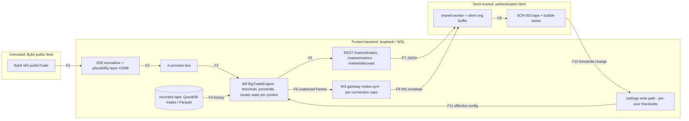

# E22 — STRIDE threat model: Big trades and bubbles (tape, BigTradeEngine, clustering)

- Ticket: E22-X01 (issue #609). Owner: Security engineer (CODEOWNER). Status: Draft for Security + Architect review.
- Method: `docs/plan/04-security-program.md` §5 template (L x I = risk), STRIDE per epic (C-12.1). Reuses the
  exchange-boundary trust model of E08 (`e08-exchange-boundary.md`, W1-W11) and the adversarial register
  `services/api/tests/security/ingestion/E08_X02_FINDINGS.md`; those threats are **referenced, not duplicated**.
  Format mirrors `E24-derivatives.md` and `E25-detectors.md`.
- **Data classification: public market data plus internal user settings (per-symbol thresholds).** No secrets,
  no PII, no account or key material. Confirmed in §6 and D9-D13, not assumed.
- **Headline:** the real exposure of this epic is **availability**. A public-data surface that can be made
  expensive by one authenticated client degrades every other view, including the R3 trading surfaces.
  The STRIDE rows for S/T/R/I/E are short on purpose; §3 and the D-rows carry the weight.
- Gate note: this file enumerates weaknesses only; no credentials or hosts appear.

## 1. Scope

In scope: Bybit `publicTrade` (E08) -> normaliser -> bus -> M9 `BigTradeEngine` (E22-T01: thresholds,
percentiles, deterministic clustering) -> REST `GET /market/trades` and `/market/metrics` and WS
`trades.{symbol}` (E22-T02) -> shared worker -> SCR-053 tape (CMP-195 and friends) and the bubble series
(CMP-112, E22-S03) -> client ring buffer (E22-S05); plus the `settings` write path for per-symbol thresholds
(E22-S02) and whale alerts (E22-S06, flood control only; rule-side threats belong to E35/E25).
Out of scope: executing the abuse cases (E22-X02), implementing mitigations (owner tickets),
pen-testing, E21/E26 models (§8 cross-references the shared subscription-budget).

## 2. Data-flow diagram and trust boundaries

Boundaries: **TB1->TB2** (F1: all upstream content untrusted; handled by E08 and its #1898 plausibility
layer); **TB2->TB3** (F7, F8: authenticated and RBAC-scoped; **the client is trusted to enforce nothing**,
including thresholds); **TB3->TB2** (F10: client-supplied subscription options and settings values are
hostile input). F2-F6 and F11 are in-process or loopback.

## 3. Numeric bounds: contract today, and recommended values

Every bound below must be enforced by validation **before** any query, allocation or subscription is
created; truncation after the fact is not a control (budget #13, API read p95 < 150 ms).

| Surface                           | Contract today                                                                                    | Gap                                                                          | Recommended bound (SR)                                                                                                                                                                                            |
| --------------------------------- | ------------------------------------------------------------------------------------------------- | ---------------------------------------------------------------------------- | ----------------------------------------------------------------------------------------------------------------------------------------------------------------------------------------------------------------- |
| `GET /market/trades` `limit`      | 1-500, default 100 (`Limit`)                                                                      | none                                                                         | keep 500 (SR-E22-02)                                                                                                                                                                                              |
| `GET /market/trades` `to - from`  | RFC 3339, no max                                                                                  | **G1: unbounded window**                                                     | **max 6 h per request**, additionally capped by `limit`; over-window -> 400 `invalid_time_range` (SR-E22-01)                                                                                                      |
| `GET /market/trades` `min_size`   | any `Decimal`, 0 allowed                                                                          | **G2: `0` returns the full tape**                                            | floor = **max(instrument `lot_size`, 1 tick-notional)**; value below floor, negative or non-finite -> 400 `invalid_min_size` (SR-E22-03)                                                                          |
| `cluster_window_ms` (REST and WS) | 0-5000                                                                                            | wide upper end for a per-print O(n) scan                                     | keep **0-5000 at the contract**, enforce an engine cap of **2000 ms** for WS live clustering and 5000 ms only on REST with window <= 15 min (SR-E22-04)                                                           |
| `cluster_tolerance_ticks`         | 0-20                                                                                              | none                                                                         | keep 0-20 (SR-E22-04)                                                                                                                                                                                             |
| Cluster state per symbol          | unspecified                                                                                       | **G3: unbounded**                                                            | hard cap **4096 open cluster keys** and **16384 buffered prints per symbol**; oldest evicted, `bigtrade_state_truncated_total` incremented, never silent (SR-E22-05)                                              |
| `trades.{symbol}` subscriptions   | connection: `max_symbols_per_connection` 40, `max_subscriptions` 200, `max_topics_per_request` 50 | **G4: caps are per connection, not per user**                                | add **per-user cap of 60 `trades.*` subscriptions across all connections** (3 connections x 20 distinct symbols), and a **per-user cap of 5 concurrent connections** (SR-E22-06). Shared budget with E21/E26 (§8) |
| `trades.*` option diversity       | one subscription per (symbol, opts)                                                               | **G5: same symbol with N distinct `min_size` values multiplies engine work** | cap **2 distinct option sets per symbol per connection**; identical option sets share one engine fan-out (SR-E22-07)                                                                                              |
| Frame cadence                     | `min_throttle_ms` 50, default 100; snapshot last 200                                              | none                                                                         | keep; `min_size=floor` on a hot symbol must still honour 100 ms coalescing (SR-E22-08)                                                                                                                            |
| Per-client outbound queue         | C-2.18 (bounded)                                                                                  | policy for `trades` unspecified                                              | **256 frames**, overflow = drop oldest and emit `dropped` count on next frame (already in the frame schema); 3 consecutive full-queue seconds -> `resync_required`, never block the engine (SR-E22-08)            |
| Client ring buffer                | E22-S05 estimates memory                                                                          | no hard ceiling                                                              | hard ceiling **50 000 prints** and **32 MiB**, whichever first; bubble visible set capped at **5 000** (LOD ladder from E22-K01) (SR-E22-09)                                                                      |
| Bubble burst rendering            | accessibility §7.3: <= 3 flashes/s                                                                | not wired to bubbles                                                         | burst pop animations coalesced to **<= 3 Hz** per bubble layer; above that, state change is instantaneous (SR-E22-10, link to E47-S04)                                                                            |
| Settings values                   | per-symbol threshold in `settings`                                                                | server re-validation unspecified                                             | same floor and range as `min_size` plus max **200 symbols** per user; unknown symbol -> 400 (SR-E22-11)                                                                                                           |

Cluster window and tolerance are **estimated** inputs (`trade_cluster`, window default 50 ms); the exact
tape is never altered by them. This is a trust control: the CMP-227 EstimatedBadge must be present whenever
clustering is on (SR-E22-12).

## 4. STRIDE table

Risk = L x I (Low/Med/High). Disposition: **M** mitigated by named ticket, **A** accepted (Owner
sign-off recorded in §9), **R** referenced (owned and mitigated by another epic's model).

| T   | STRIDE | Threat                                                                                                                                                                                                   | Flow     | L   | I   | Risk     | Mitigation / owner ticket                                                                                                                                                                                                                                                                                                                                                                                       | Disp.               |
| --- | ------ | -------------------------------------------------------------------------------------------------------------------------------------------------------------------------------------------------------- | -------- | --- | --- | -------- | --------------------------------------------------------------------------------------------------------------------------------------------------------------------------------------------------------------------------------------------------------------------------------------------------------------------------------------------------------------------------------------------------------------- | ------------------- |
| D1  | S      | Unauthenticated or expired session subscribes to `trades.*` or reads `/market/trades`                                                                                                                    | F7/F8    | L   | M   | Low      | Session auth on WS handshake and per-subscribe, `x-rbac marketdata:read` on REST; 401/403 negative tests; E17 gateway + E22-T02, verified E22-X02                                                                                                                                                                                                                                                               | M                   |
| D2  | S      | Forged or replayed WS frame claims another user's subscription id                                                                                                                                        | F8       | L   | L   | Low      | Server-side ownership of `sub_id` per connection; no client identity trusted (E17)                                                                                                                                                                                                                                                                                                                              | R                   |
| D3  | T      | Malformed or implausible upstream print (NaN, off-tick, zero qty, extreme size) shapes thresholds, percentiles or bubbles                                                                                | F1       | M   | H   | High     | Owned by E08: `parse_*` rejection and `trade_prints_rejected_total` (E08_X02 A-05, B-08), ingest-boundary plausibility and tick-grid rejection (#1898, fixes B-07). E22 adds a defensive assert in T01 that engine inputs are `Decimal` > 0 and on tick, rejecting and counting otherwise (SR-E22-13). Percentile windows use a **trimmed** estimator so a single outlier cannot move the threshold (SR-E22-14) | R + M               |
| D4  | T      | Client-supplied `min_size`, `cluster_*` or settings value out of range, or crafted to widen work                                                                                                         | F10      | H   | M   | High     | Server-side validation against §3 (SR-E22-03/04/11); engine, REST and WS share **one constants module** (§7); 400 with `ws_subscribe_rejected_total{reason}`                                                                                                                                                                                                                                                    | M (E22-T01/T02/S02) |
| D5  | T      | Client-side threshold diverges from the server's (tape, bubbles and alerts disagree; false sense of enforcement)                                                                                         | F9       | M   | M   | Med      | Single evaluation in `BigTradeEngine` (epic invariant); frames carry the **effective** option set (`effective` in subscribe ack); Semgrep forbids threshold literals in `apps/web/src` (§7); parity harness E22-T04                                                                                                                                                                                             | M                   |
| D6  | T      | Estimated cluster presented as an exact print                                                                                                                                                            | F5-F9    | M   | H   | High     | `cluster_size` and `estimated` flag carried end to end, badge in E22-S04 (SR-E22-12); contract test in E22-T02; DOM test E22-S04 and Playwright E22-Q02                                                                                                                                                                                                                                                         | M                   |
| D7  | R      | Threshold or cluster setting changes unattributed                                                                                                                                                        | F10/F11  | M   | L   | Low      | `settings.change` audit entry with actor, key, before/after (global AC #2); owner E22-S02/T02. Read-only market data needs no audit record                                                                                                                                                                                                                                                                      | M                   |
| D8  | R      | Subscription or read abuse not attributable to a user                                                                                                                                                    | F7/F8    | L   | L   | Low      | Request/subscribe log with `traceId` and user id (C-12.6); `ws_subscribe_rejected_total{reason}`                                                                                                                                                                                                                                                                                                                | A                   |
| D9  | I      | Account, key, or user identifier leaks into trade frames, logs, metrics or analytics events                                                                                                              | F5-F9    | L   | M   | Low      | None exist in the data model; `trades` schema is `additionalProperties:false` with no identity fields; metric label allow-list (`cv-obs-metric-label-allowlist`) forbids user or symbol-user labels; E22-X02 greps frames and logs (AC12)                                                                                                                                                                       | M                   |
| D10 | I      | Subscription ack or error reveals **another user's** filters, subscriptions or per-symbol thresholds (e.g. `effective` echoes a shared engine instance's options; 409 "already subscribed" across users) | F8       | L   | M   | Low      | `effective` is built from the caller's request only; shared engine fan-out is keyed internally and never surfaced; errors are caller-scoped (SR-E22-15); E22-X02 AC13 diff of two users' acks                                                                                                                                                                                                                   | M                   |
| D11 | I      | `/market/trades` or `dropped` counts used as a side channel to infer other clients' load or filters                                                                                                      | F7/F8    | L   | L   | Low      | `dropped` counts only the caller's own filtered prints; no global counters in responses                                                                                                                                                                                                                                                                                                                         | A                   |
| D12 | I      | Verbose validation errors or logs disclose internals (stack, SQL, file paths)                                                                                                                            | F7       | L   | L   | Low      | RFC 7807 mapping at the edge only, no raw exception text (C-12.6); parameterised SQL (Semgrep raw-SQL rule)                                                                                                                                                                                                                                                                                                     | M                   |
| D13 | I      | Settings endpoint returns another user's thresholds (IDOR)                                                                                                                                               | F10      | L   | M   | Low      | Scope = own user id from session, never from the body; IDOR test (AC14)                                                                                                                                                                                                                                                                                                                                         | M                   |
| D14 | D      | Unbounded `GET /market/trades` window, e.g. `from=0` on a recorded symbol                                                                                                                                | F7       | H   | H   | **High** | G1 / SR-E22-01: max 6 h window, validate before query; query timeout 2 s; E22-T02; `bigtrade_range_rejected_total`; abuse cases AC1-AC3                                                                                                                                                                                                                                                                         | M                   |
| D15 | D      | `min_size=0` (or sub-lot) on REST or on a hot-symbol subscription streams the full tape to a client                                                                                                      | F7/F8    | H   | H   | **High** | G2 / SR-E22-03 floor; `dropped` stays meaningful; load test E22-Q03 at 2 000 prints/s                                                                                                                                                                                                                                                                                                                           | M                   |
| D16 | D      | Extreme or adversarial `cluster_window_ms` / tolerance burns CPU in the per-print scan and grows cluster state                                                                                           | F3/F7/F8 | M   | H   | High     | SR-E22-04 caps, SR-E22-05 bounded state with truncation metric; clustering is O(1) amortised via keyed open clusters, never a rescan of the window; unit and hypothesis tests in E22-T01                                                                                                                                                                                                                        | M                   |
| D17 | D      | One client opens many `trades.*` subscriptions (across symbols, option sets, or several connections)                                                                                                     | F8       | H   | H   | **High** | SR-E22-06/07: per-user cap across connections, option-set cap, connection cap; shared subscription-budget mechanism with E21/E26 (§8); `ws_subscribe_rejected_total{reason}`; abuse cases AC4-AC7                                                                                                                                                                                                               | M                   |
| D18 | D      | Slow or stalled client makes the gateway buffer unbounded frames, starving the event loop or memory                                                                                                      | F8       | M   | H   | High     | C-2.18: bounded per-client queue (256), drop-oldest with `dropped`, forced resync after sustained overflow, engine never awaits a client (SR-E22-08); chaos scenario for slow consumer (C-13.6) named by E22-Q03                                                                                                                                                                                                | M                   |
| D19 | D      | Per-symbol memory growth: percentile windows, cluster state and buffered prints across 40+ symbols                                                                                                       | F3       | M   | H   | High     | SR-E22-05 hard caps; percentile window uses fixed-size streaming sketch (not stored prints) ; `bigtrade_state_truncated_total`, per-symbol gauge; soak in E22-Q03                                                                                                                                                                                                                                               | M                   |
| D20 | D      | Upstream trade flood or reconnect storm amplifies into engine and fan-out overload                                                                                                                       | F1       | M   | M   | Med      | E08 bounded ingress queue, backoff with jitter; E08_X02 resource-exhaustion tests; chaos (C-13.6)                                                                                                                                                                                                                                                                                                               | R                   |
| D21 | D      | Bubble-burst render storm: thousands of bubbles pop in one frame, exceeding the 3 Hz flash ceiling and starving the main thread                                                                          | F9       | M   | H   | High     | SR-E22-09/10: visible bubble cap 5 000, LOD ladder (E22-K01), burst animation coalesced to <= 3 Hz, `prefers-reduced-motion` instant state; flash-audit script (a11y §9 item 5) on the bubble component; E47-S04 owns the shared flash gate, E22-S03 wires it                                                                                                                                                   | M                   |
| D22 | D      | Client ring buffer grows until the tab is killed (browser memory exhaustion)                                                                                                                             | F9       | M   | M   | Med      | SR-E22-09 hard ceiling 50 000 prints / 32 MiB, oldest evicted, visible "buffer trimmed" state (E22-S05)                                                                                                                                                                                                                                                                                                         | M                   |
| D23 | D      | Whale-alert flood: every big print raises a notification or alert evaluation                                                                                                                             | F5       | M   | M   | Med      | E22-S06 flood control (per-symbol rate limit, grouped notifications); evaluation uses the same bounded engine output                                                                                                                                                                                                                                                                                            | M                   |
| D24 | D      | A mitigation itself breaches budget #13 or the 2 000 prints/s tape budget                                                                                                                                | F7/F8    | L   | M   | Low      | Validation O(1) before query; thresholds coordinated with E22-Q03 budgets                                                                                                                                                                                                                                                                                                                                       | M                   |
| D25 | E      | Viewer writes another user's settings, or any user changes the **global** default threshold                                                                                                              | F10      | L   | H   | Medium   | Settings write is own-scope only; global defaults are Owner-only (`settings:write` + scope); IDOR and forbidden-role tests (AC14, AC15)                                                                                                                                                                                                                                                                         | M                   |
| D26 | E      | `marketdata:read` missing or mis-granted on a route or topic; `trades.*` subscribable by a role without the permission                                                                                   | F7/F8    | L   | M   | Low      | Contract lint requires `x-rbac` on every operation; WS subscribe checks the same permission server-side (C-12.4); negative tests 401/403                                                                                                                                                                                                                                                                        | M                   |
| D27 | E      | State-changing or privileged path introduced under E22                                                                                                                                                   | all      | n/a | n/a | n/a      | **Asserted absent** apart from the settings write: all other operations are public-data reads; no order, account, secret, auth or audit path (§6). E22-X02 enumerates E22 operations and fails on any non-GET other than the settings route                                                                                                                                                                     | A                   |

## 5. Estimated vs exact, traced end to end (D6)

| Hop         | Carrier                                                                                                                                                    | Required invariant                                                                                                                                          | Proving test (owner)            |
| ----------- | ---------------------------------------------------------------------------------------------------------------------------------------------------------- | ----------------------------------------------------------------------------------------------------------------------------------------------------------- | ------------------------------- |
| Engine (M9) | Aggressor side from Bybit `S` is exact; clustered prints carry `cluster_size` > 1 and confidence `estimated` (24-internal-schemas, metric `trade_cluster`) | Cannot build a clustered display print without the flag                                                                                                     | Unit + hypothesis, E22-T01      |
| REST        | `PublicTrade` items include `cluster_size`; series-level `estimated` when `cluster_window_ms` > 0                                                          | Field `required` when clustering requested                                                                                                                  | Provider contract test, E22-T02 |
| WS          | `trades.schema.json` carries `cluster_size` (default 1)                                                                                                    | **Gap G6:** add a frame-level `estimated` boolean (true when window > 0) so a client cannot infer exactness from the absence of a field; interface-first PR | Frame-schema test, E22-T02      |
| Component   | CMP-227 EstimatedBadge shown whenever clustering is on (SCR-053)                                                                                           | Required prop, no default                                                                                                                                   | RTL + axe, E22-S04              |
| DOM         | Badge text plus `aria-label`, not colour alone                                                                                                             | Rendered whenever clustering on                                                                                                                             | Playwright, E22-Q02             |

## 6. Information disclosure and elevation of privilege

Information: every field in `trades.{symbol}` and `PublicTrade` is public exchange data
(`id`, `ts_ms`, `price`, `size`, `side`, flags). The schemas are `additionalProperties:false` and contain no
user, account or key field. The residual question is cross-user inference (D10, D11): a shared engine
instance serving several subscribers is an optimisation that must not become an oracle. The requirement
(SR-E22-15) is that **no response, ack, error or metric depends on another user's options**.

Privilege: the only state-changing operation is the per-user threshold write (D25). RBAC (`marketdata:read`,
`settings:write` own-scope) is enforced server-side (C-12.4); hiding a control in the UI is not a control.
`services/api/secrets/`, `auth/`, `audit/` are untouched except for emitting `settings.change`.

## 7. Controls, constants and drift prevention

**Single source of constants.** The bounds in §3 live in one module, proposed
`services/api/candleviewer/orderflow/limits.py` (E22-T01), imported by the engine, the REST validator and
the WS option validator. Nothing else may hold a literal copy. Constants (all `Final`):

| Constant                                                    | Value                                              | SR        |
| ----------------------------------------------------------- | -------------------------------------------------- | --------- |
| `TRADES_MAX_WINDOW`                                         | 6 h (15 min when `cluster_window_ms` > 2000)       | SR-E22-01 |
| `TRADES_MAX_LIMIT`                                          | 500                                                | SR-E22-02 |
| `MIN_SIZE_FLOOR`                                            | per instrument: max(`lot_size`, one tick-notional) | SR-E22-03 |
| `CLUSTER_WINDOW_MS_MAX`                                     | 5000 REST, 2000 WS                                 | SR-E22-04 |
| `CLUSTER_TOLERANCE_TICKS_MAX`                               | 20                                                 | SR-E22-04 |
| `CLUSTER_KEYS_MAX` / `PRINTS_BUFFER_MAX`                    | 4096 / 16384 per symbol                            | SR-E22-05 |
| `TRADES_SUBS_PER_USER_MAX` / `CONNECTIONS_PER_USER_MAX`     | 60 / 5                                             | SR-E22-06 |
| `OPTION_SETS_PER_SYMBOL_MAX`                                | 2                                                  | SR-E22-07 |
| `CLIENT_QUEUE_MAX_FRAMES`                                   | 256                                                | SR-E22-08 |
| `RING_BUFFER_MAX_PRINTS` / `_BYTES` / `VISIBLE_BUBBLES_MAX` | 50 000 / 32 MiB / 5 000                            | SR-E22-09 |
| `BUBBLE_FLASH_MAX_HZ`                                       | 3                                                  | SR-E22-10 |
| `THRESHOLD_SYMBOLS_PER_USER_MAX`                            | 200                                                | SR-E22-11 |

Requirement ids not tied to a constant: SR-E22-12 (estimated badge whenever clustering is on), SR-E22-13
(engine input assert: `Decimal` > 0 and on tick), SR-E22-14 (trimmed percentile estimator), SR-E22-15 (no
response, ack, error or metric depends on another user's options).

**Tests that must assert the constants** (so bounds cannot drift silently):

1. A unit test in E22-T01 imports `limits.py` and asserts every value above verbatim; changing a value
   requires editing the test and therefore a reviewed diff (CODEOWNER on `orderflow/limits.py`).
2. A contract test in E22-T02 asserts the OpenAPI `maximum`/`minimum` of `cluster_window_ms`,
   `cluster_tolerance_ticks`, `limit` and the WS schema equal the constants, and that the window cap and
   `min_size` floor are documented (closes G1, G2 by interface-first PR).
3. A boundary-table test (value, value+1, 0, negative, non-finite) per constant in E22-Q01.
4. A client-side test in E22-S05 asserts the ring-buffer ceiling and visible-bubble cap read from the same
   generated constants as the server (`packages/protocol`), not literals.

**SAST (Semgrep) named, not authored here (follow-up for E22-X02 / infra owners):**

- Forbid big-trade threshold or cluster literals in `apps/web/src` (server is the sole source of truth; D5).
- Forbid `asyncio.Queue()` without `maxsize` and unbounded appends of prints in `orderflow/` (C-2.18).
- Forbid building a clustered print without the `estimated` flag (D6).
- Contract lint: every E22 operation declares `x-rbac`; the settings route declares `settings:write`.

## 8. Cross-references and shared mechanism

- **Subscription budget.** E21 (STRIDE: unbounded subscription depth) and E26 face the same vector. The
  mitigation must be **one** gateway-level per-user budget (subscriptions, connections, option sets) in
  the E17 gateway, parameterised per topic family, not a separate cap per epic. E22-T02 consumes it; if it
  does not exist yet, E22-T02 lands the interface (budget protocol plus a fake) first, per interface-first
  (CLAUDE.md §10.4). Tracked as gap **G4**.
- **Upstream integrity.** D3 and D20 rely on E08 and #1898; this model adds no duplicate parser checks.
- **Flash ceiling.** `05-accessibility-standard.md` §7.3 (3 flashes/s) and E47-S04 own the shared gate;
  E22 wires the bubble component into it (D21).
- **Shared fate with trading.** Load-shedding degrades market-data views only; it must never consume the
  order-path reserve (C-12.7). `trades.*` gateway queues are separate from order/ack queues.

## 9. Abuse cases (handed to E22-X02 and E22-Q01/Q03)

| ID   | Abuse case                                                                               | Expected result                                                                          | Threat   | Owner    |
| ---- | ---------------------------------------------------------------------------------------- | ---------------------------------------------------------------------------------------- | -------- | -------- |
| AC1  | `GET /market/trades` with `from`=epoch 0, `to`=now                                       | 400 `invalid_time_range`, no DB query                                                    | D14      | X02, Q01 |
| AC2  | `limit=501`, `0`, `-1`, non-integer; tampered or >512 B `cursor`                         | 400, no query                                                                            | D14      | Q01      |
| AC3  | Window exactly 6 h (accepted) and 6 h + 1 ms (rejected); `from` > `to`                   | boundary honoured                                                                        | D14      | Q01      |
| AC4  | Subscribe `trades.BTCUSDT` with `min_size=0`, negative, `NaN`, `1e-30`, below floor      | rejected with `ws_subscribe_rejected_total{reason}`; first subscription unaffected       | D15      | X02      |
| AC5  | Same symbol with 3+ distinct option sets on one connection                               | third rejected                                                                           | D17      | X02      |
| AC6  | 41st distinct symbol on one connection; 201st subscription; 51 topics in one request     | rejected, first 40 unaffected                                                            | D17      | X02      |
| AC7  | 6 connections for one user; 61 subscriptions over 3 connections                          | 6th connection / 61st sub rejected                                                       | D17      | X02      |
| AC8  | `cluster_window_ms` 5001, 2001 on WS, `-1`, non-integer; tolerance 21                    | 400 / reject                                                                             | D16      | Q01, X02 |
| AC9  | Hostile 5 000-prints/s burst of adversarial same-price/same-side keys at window 2000 ms  | cluster keys <= 4096, `bigtrade_state_truncated_total` increments, CPU in budget, no OOM | D16, D19 | Q03      |
| AC10 | Slow consumer stops reading while 2 000 prints/s flow                                    | queue <= 256, `dropped` reported, forced resync, engine and other clients unaffected     | D18      | Q03      |
| AC11 | Upstream NaN, off-tick, zero or extreme-size print reaching the engine                   | rejected and counted at E08; engine assert holds; percentile unmoved beyond trim         | D3       | X02      |
| AC12 | Scan WS frames, REST bodies, logs, metric labels for key, token, user or account fields  | none                                                                                     | D9       | X02      |
| AC13 | Two users subscribe with different options to one symbol; diff acks, errors, `effective` | each sees only their own options                                                         | D10      | X02      |
| AC14 | Viewer writes another user's threshold (IDOR); user reads another's                      | 403/404, no change                                                                       | D13, D25 | X02      |
| AC15 | Non-Owner changes the global default threshold; settings write with 201 symbols          | 403 / 400                                                                                | D25, D4  | X02      |
| AC16 | No token / role without `marketdata:read` on REST and WS subscribe                       | 401 / 403                                                                                | D1, D26  | X02      |
| AC17 | 5 000 simultaneous bubble pops; measure flash rate and frame time                        | <= 3 Hz flash, 60 fps held, `prefers-reduced-motion` honoured                            | D21      | Q03, Q04 |
| AC18 | Feed 1 M prints into the client ring buffer                                              | stops at 50 000 / 32 MiB, trimmed state shown                                            | D22      | Q03      |
| AC19 | Enumerate E22 operations and WS topics                                                   | no non-GET other than the settings route                                                 | D27      | X02      |

## 10. Observability signals

`ws_subscribe_rejected_total{reason}` (`min_size_floor`, `cluster_range`, `sub_cap_user`,
`sub_cap_connection`, `option_sets`, `rbac`), `bigtrade_state_truncated_total{kind}` (`cluster_keys`,
`prints_buffer`), `bigtrade_range_rejected_total{endpoint}`, `bigtrade_fanout_dropped_total`,
`bigtrade_client_resync_total`, per-connection subscription gauge, REST request-size and window-size
histogram, client `ringbuffer_trimmed` event. Labels follow the metric allow-list (no user id). Alert on
sustained rejection (abuse) and any non-zero truncation outside a load test.

## 11. Control-to-ticket map

| Ticket          | Obligation                                                                                                                                                                       |
| --------------- | -------------------------------------------------------------------------------------------------------------------------------------------------------------------------------- |
| E22-T01         | `limits.py` and its assert test; bounded cluster/percentile state (SR-E22-04/05/13/14); estimated flag                                                                           |
| E22-T02         | Validation before query (SR-E22-01/02/03/04); caps via shared budget (SR-E22-06/07); queue policy (SR-E22-08); caller-scoped acks (SR-E22-15); contract tests; closes G1, G2, G6 |
| E22-S02         | Server re-validation, own-scope settings, `settings.change` audit (SR-E22-11; D7, D13, D25)                                                                                      |
| E22-S03         | Visible-bubble cap and burst coalescing (SR-E22-09/10)                                                                                                                           |
| E22-S04         | EstimatedBadge required prop (SR-E22-12)                                                                                                                                         |
| E22-S05         | Ring-buffer ceiling and trimmed state (SR-E22-09)                                                                                                                                |
| E22-S06         | Flood control (D23)                                                                                                                                                              |
| E22-K01         | LOD ladder consistent with the 5 000 cap                                                                                                                                         |
| E22-T04         | Parity harness (D5)                                                                                                                                                              |
| E22-Q01         | AC1-AC3, AC8 boundary tables                                                                                                                                                     |
| E22-Q03         | AC9, AC10, AC17, AC18; budgets vs controls (D24)                                                                                                                                 |
| E22-Q04         | AC17 flash audit                                                                                                                                                                 |
| E22-X02         | AC4-AC8, AC11-AC16, AC19; Semgrep follow-ups                                                                                                                                     |
| E17 / E21 / E26 | Shared subscription budget (G4)                                                                                                                                                  |
| E47-S04         | Flash-rate gate consumed by bubbles                                                                                                                                              |

SR-E22-nn are epic-local requirement ids (convention of `E16-FR-nn` / `E35-FR-nn`), to be promoted into
`04-security-program.md` numbering when E22-T02 lands. Interface-first gaps: **G1** window cap, **G2**
`min_size` floor (22-api), **G3** state caps (24-internal-schemas), **G4** per-user budget (23-ws `limits`),
**G5** option-set cap, **G6** frame-level `estimated` flag (23-ws §14.2).

## 12. Residual risks, review and sign-off

- Accepted: D8 (read abuse attributable only via request logs), D11 (no cross-user side channel), D27 (no
  privileged path beyond own-scope settings write).
- Residual: a legitimate user at the per-user cap on hot symbols still costs real CPU; bounded, not
  eliminated (RSK-057). Percentile thresholds on thin symbols are statistically noisy (labelled, not removable).
- Accepted risks await Owner approval (agent-delivery adaptation). Security-engineer sign-off is a PR
  comment by the independent security reviewer; architect review via PR review. Draft until then;
  E22-T01/T02 must not start before both.

### Review log

| Date       | Reviewer               | Result          |
| ---------- | ---------------------- | --------------- |
| 2026-10-06 | author (E22-X01 agent) | Draft submitted |
