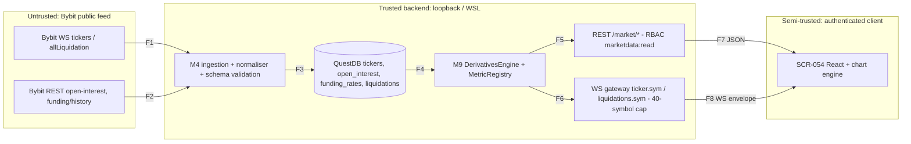

# E24 — STRIDE threat model: Derivatives metrics (OI, funding, liquidations)

- Ticket: E24-X01 (issue #617). Owner: Security engineer (CODEOWNER). Status: Draft for Security + Architect review.
- Method: `docs/plan/04-security-program.md` §5 template (L x I = risk). Reuses the market-data trust
  boundaries of E08 (`e08-exchange-boundary.md`, W1-W11) and E17; only derivatives-specific flows are added.
- **Data classification: public market data (lowest tier).** No secrets, no PII, no account data, no key
  material. Do not over-scope controls (no encryption-at-rest or audit-write requirement is added here).
- Gate note: this file only enumerates weaknesses; no credentials or hosts appear.

## 1. Scope

In scope: Bybit public WS (`tickers`, `allLiquidation`) -> M4 ingestion/normalisation -> QuestDB
(`tickers`, `open_interest`, `funding_rates`, `liquidations`; schema §4.4-4.7) -> M9 `DerivativesEngine`
-> REST (`/market/open-interest`, `/market/funding`, `/market/liquidations`, `/market/metrics`) and WS
(`ticker.{symbol}`, `liquidations.{symbol}`) -> SCR-054 (CMP-036/126/127/186/188/199/227).
Out of scope: implementing mitigations (owner tickets), pen-testing (pre-R4), other epics' models.

## 2. Data-flow diagram and trust boundaries

Boundaries: **TB1->TB2** (F1, F2: all upstream content is untrusted input); **TB2->TB3** (F7, F8:
authenticated, RBAC-scoped; client is not trusted to enforce anything). F3-F6 are in-process / loopback.

## 3. Numeric bounds (DoS), as specified in the contracts

| Surface                                                            | Bound                                                                                                                                                                                                     | Source                                                              |
| ------------------------------------------------------------------ | --------------------------------------------------------------------------------------------------------------------------------------------------------------------------------------------------------- | ------------------------------------------------------------------- |
| `/market/open-interest`, `/market/funding`, `/market/liquidations` | `limit` 1-500, default 100; `cursor` maxLength 512, expires 1 h                                                                                                                                           | 22-api `components.parameters.Limit/Cursor`                         |
| Same three                                                         | `from`/`to` RFC 3339; inverted or over-window -> 400 `invalid_time_range`                                                                                                                                 | 22-api error registry; **max window value is unspecified (gap G1)** |
| `/market/metrics`                                                  | `metric` 1-12 repeats; `params` maxLength 2048; `param` maxLength 24                                                                                                                                      | 22-api `getMetrics`                                                 |
| `/market/liquidations`                                             | `cluster_window_ms` 0-60000                                                                                                                                                                               | 22-api                                                              |
| `/market/open-interest`                                            | `interval` enum 5min..1d; upstream page <=200                                                                                                                                                             | 22-api                                                              |
| WS `ticker.{symbol}` / `liquidations.{symbol}`                     | `max_symbols_per_connection` 40, `max_subscriptions` 200, `max_topics_per_request` 50, inbound frame 262144 B, outbound 4194304 B, `min_throttle_ms` 50; `liquidations` snapshot last 100, 500 ms cadence | 23-ws welcome `limits`, §14.9 topic table                           |
| Read latency budget                                                | API read p95 < 150 ms (budget #13): bounds must be enforced by validation before query, never by post-hoc truncation                                                                                      | 06-performance                                                      |

Gap G1: no maximum `to - from` window is numerically defined for the three history endpoints. Owner
ticket E24-T01/T02/T03 must add one (proposal: 31 d for `liquidations`, 400 d for OI/funding at the
requested interval, always also capped by `limit`) via an interface-first change to 22-api, before consumers.

## 4. STRIDE table

Risk = L x I (Low/Med/High). Every row has a disposition: **M** = mitigated by named ticket,
**A** = accepted (Owner sign-off recorded in §8), **T** = transferred.

| T   | STRIDE | Threat                                                                                            | Flow  | L   | I   | Risk | Mitigation / owner ticket                                                                                                                                                                                 | Disp.       |
| --- | ------ | ------------------------------------------------------------------------------------------------- | ----- | --- | --- | ---- | --------------------------------------------------------------------------------------------------------------------------------------------------------------------------------------------------------- | ----------- |
| D1  | S      | Spoofed or malformed upstream frame (wrong topic, symbol, shape) accepted into the store          | F1/F2 | M   | M   | Med  | Strict schema validation + topic/symbol allow-list in normaliser, reject and count `deriv_upstream_schema_rejected_total`; TLS + pinned host allow-list (E08 W-series). E24-T01/T02/T03; verified E24-X02 | M           |
| D2  | S      | Client claims another connection's subscription / forged WS frame                                 | F8    | L   | L   | Low  | Server-side session auth and RBAC on WS subscribe (E17); no client-supplied identity trusted                                                                                                              | M (E17)     |
| D3  | T      | Predicted/accruing funding rendered as settled (flag lost between engine, schema, transport, DOM) | F4-F8 | M   | H   | High | End-to-end flag trace in §5; contract test in E24-T04; component test E24-S04; E2E E24-Q02                                                                                                                | M           |
| D4  | T      | Estimated liquidation zone presented as exchange fact                                             | F5-F8 | M   | H   | High | `estimated=true` mandatory on zone series; badge + off-by-default + acknowledgement in E24-S07; methodology limits in E24-K01; flag trace §5                                                              | M           |
| D5  | T      | `ws_ticker`-sourced OI point mixed with `rest` point at a different granularity                   | F3/F5 | M   | M   | Med  | Per-point `source` and `interval` columns; engine never merges across sources/granularity; response carries `source`; E24-T01 + E24-T05 (ADR-0017 provenance) + parity test E24-T06                       | M           |
| D6  | T      | Upstream value tampered post-validation (store write by other module)                             | F3    | L   | M   | Low  | Single writer (ingestion) per table; import-linter module boundaries (C-3.x)                                                                                                                              | M (E02/E08) |
| D7  | T      | Liquidation counts read as exact when Bybit batches (<=1 push/symbol/500 ms)                      | F1/F7 | H   | M   | Med  | `note` field on `LiquidationBatch`; copy "lower bound" in E24-S05                                                                                                                                         | M           |
| D8  | R      | No record of which source a displayed value came from                                             | F3-F8 | M   | M   | Med  | Persist `source` (`rest`/`ws_ticker`/`ws_liq`) per row; expose in API items and UI tooltip; E24-T05                                                                                                       | M           |
| D9  | R      | Read/subscription abuse not attributable                                                          | F7/F8 | L   | L   | Low  | Standard request log with `traceId` and user id (C-12.6); no audit record needed for read-only public data                                                                                                | A           |
| D10 | I      | Leak of secrets/PII via these endpoints                                                           | all   | L   | L   | Low  | None exist in this epic (public data); logs pass the redaction filter. Asserted, not assumed: E24-X02 greps responses for key-like fields                                                                 | A           |
| D11 | I      | Endpoint loses `marketdata:read` `x-rbac`, exposing data to unauthenticated callers               | F7    | L   | M   | Low  | Contract lint requires `x-rbac` on every operation; negative test (no token -> 401, role lacking permission -> 403) in E24-X02/Q01                                                                        | M           |
| D12 | D      | Unbounded `from`/`to` or `limit` on history endpoints                                             | F7    | H   | H   | High | Numeric caps §3, G1 window cap; validate before querying; 400 `invalid_time_range`; signal `deriv_range_rejected_total`; negative tests E24-Q01/X02                                                       | M           |
| D13 | D      | `/market/metrics` abuse via 12 metrics x wide range x large `params`                              | F7    | M   | M   | Med  | `maxItems` 12, `params` <=2048, window cap shared with D12, per-user rate limit; query timeout; E24-T04                                                                                                   | M           |
| D14 | D      | `liquidations` subscription beyond 40-symbol cap                                                  | F8    | M   | M   | Med  | Server rejects with symbol-cap error; `deriv_sub_cap_rejected_total`; E17 gateway + E24-T03 test                                                                                                          | M           |
| D15 | D      | Liquidation cascade amplifies fan-out to every client                                             | F6/F8 | M   | H   | High | 500 ms coalescing, `min_throttle_ms` 50, bounded per-client queues with drop/coalesce (C-2.18), batch cap per frame; load script E24-Q03                                                                  | M           |
| D16 | D      | Upstream flood or reconnect storm via `allLiquidation`/`tickers`                                  | F1    | M   | M   | Med  | Bounded ingress queue, backoff with jitter (E08); chaos scenarios (C-13.6)                                                                                                                                | M (E08)     |
| D17 | D      | Mitigation itself breaches read p95 <150 ms                                                       | F7    | L   | M   | Low  | Validation is O(1) pre-query; bench in E24-Q03                                                                                                                                                            | M           |
| D18 | E      | Privilege escalation via this epic                                                                | all   | n/a | n/a | n/a  | **Asserted absent**: every operation is a read of public data; no state-changing or privileged endpoint, no order/account/secret path (§6)                                                                | A           |

## 5. The estimated/predicted flag, traced end to end (D3, D4)

| Hop              | Carrier                                                                                                           | Required invariant                                                                                                                                                                                  | Proving test (owner)                                |
| ---------------- | ----------------------------------------------------------------------------------------------------------------- | --------------------------------------------------------------------------------------------------------------------------------------------------------------------------------------------------- | --------------------------------------------------- |
| Engine (M9)      | `confidence="estimated"` / `settled=False` on every funding-accruing and zone point (24-internal-schemas §7, §10) | Cannot construct such a point without the flag (no default `True` for settled)                                                                                                                      | Unit + hypothesis in E24-T04                        |
| REST JSON schema | series-level `estimated: "true"` and per-item `settled`/`predicted` (22-api `/market/funding`, `/market/metrics`) | Schema marks the field `required`; omission fails validation                                                                                                                                        | Provider contract test E24-T04 (Schemathesis)       |
| WS envelope      | `TickerUpdate.funding_rate` has **no** flag field today (23-ws §14.8)                                             | **Gap G2:** add required `funding_settled`/`predicted` boolean (or document that ticker funding is always predicted) via interface-first PR; zone/estimated metrics carry the flag in their payload | Frame-schema test E24-T04                           |
| Component props  | CMP-126/127/186 take a required `estimated`/`predicted` prop (no default)                                         | TypeScript forbids omission                                                                                                                                                                         | Type test + RTL test E24-S04/S07                    |
| DOM              | Visible badge text plus `aria-label`, not colour only                                                             | Badge rendered whenever prop true                                                                                                                                                                   | Component test E24-S04/S07; Playwright E24-Q02; axe |

The single named cross-layer test: **E24-T04 "flag preservation contract test"** drives an estimated
point from engine fixture to REST and WS schema validation and fails if the flag is absent or false;
E24-Q02 asserts the badge in the real DOM.

## 6. Elevation of privilege: asserted absent

No operation in E24 is state-changing or privileged: all four REST operations are `GET` with
`marketdata:read`, scope `none`; the two WS topics are read-only subscriptions. No order, account,
secret, auth, audit or admin path is touched (`services/api/secrets/`, `auth/`, `audit/` untouched).
E24-X02 verifies by enumerating the OpenAPI operations under E24 and failing on any non-GET.

## 7. Abuse cases (handed to E24-X02 and E24-Q01)

| ID   | Abuse case                                                                      | Expected result                                                 | Threat | Owner    |
| ---- | ------------------------------------------------------------------------------- | --------------------------------------------------------------- | ------ | -------- |
| AC1  | `from`=epoch 0, `to`=now on `/market/liquidations`                              | 400 `invalid_time_range`, no DB query                           | D12    | X02, Q01 |
| AC2  | `limit=501`, `limit=0`, `limit=-1`, non-integer                                 | 400 validation                                                  | D12    | Q01      |
| AC3  | `from` > `to`                                                                   | 400 `invalid_time_range`                                        | D12    | Q01      |
| AC4  | Tampered/expired/oversized `cursor` (>512)                                      | 400 `invalid_cursor`                                            | D12    | Q01      |
| AC5  | `/market/metrics` with 13 `metric` values; `params` 2049 B; unknown metric code | 400                                                             | D13    | X02      |
| AC6  | Subscribe `liquidations.*` for 41 symbols on one connection                     | cap error, first 40 unaffected                                  | D14    | X02      |
| AC7  | Subscribe >200 subscriptions / >50 topics in one request                        | rejected                                                        | D14    | X02      |
| AC8  | Replay a simulated 1000-print cascade in 1 s                                    | per-client rate stays <= 20 frames/s, queues bounded, no resync | D15    | Q03      |
| AC9  | Upstream frame with extra/missing fields, wrong symbol, negative size           | rejected, metric incremented, store unchanged                   | D1     | X02      |
| AC10 | Call each endpoint without token / with role lacking `marketdata:read`          | 401 / 403                                                       | D11    | X02      |
| AC11 | Feed `ws_ticker` OI at 1 s and `rest` OI at 5min for same symbol                | never merged into one series; `source` visible                  | D5     | Q01, T06 |
| AC12 | Funding point with `settled=false` through every layer                          | badge visible in DOM                                            | D3     | Q02      |
| AC13 | Response scan for key/token-like fields                                         | none                                                            | D10    | X02      |

## 8. Observability signals

`deriv_upstream_schema_rejected_total{topic}`, `deriv_range_rejected_total{endpoint}`,
`deriv_sub_cap_rejected_total{topic}`, `deriv_fanout_dropped_total{topic}`,
`deriv_source_mix_blocked_total`. Alert on sustained non-zero rejection rates (possible abuse or
upstream contract change).

## 9. Test obligations recorded on owning tickets

Every E24-* ticket appears here; a missing row is a model defect (enforced by GOV-008,
`scripts/check_threat_model_ticket_map.py`). Provenance tags: `ticket body`, `shipped in #NNNN`,
or `required by this model - not yet in the ticket; requested on #NNN`.

| Ticket  | Controls and provenance                                                                                                                                                                                                                                                                                                                                                                                                                                                                                                                       |
| ------- | --------------------------------------------------------------------------------------------------------------------------------------------------------------------------------------------------------------------------------------------------------------------------------------------------------------------------------------------------------------------------------------------------------------------------------------------------------------------------------------------------------------------------------------------- |
| E24-X01 | Self-row: this model (D1-D18, abuse cases AC1-AC13, gaps G1/G2); shipped in #1705; no runtime control                                                                                                                                                                                                                                                                                                                                                                                                                                         |
| E24-X02 | Verifies D1, D10-D14 and AC1, AC5-AC10, AC13 on a running build; non-GET enumeration (§6) [ticket body]                                                                                                                                                                                                                                                                                                                                                                                                                                       |
| E24-T01 | OI ingest and `/market/open-interest`: `x-rbac` `marketdata:read`, 401/403, schema validation, per-point `source`, D5/D8/D11 [ticket body] history window cap G1, `invalid_time_range`, D12 [required by this model - not yet in the ticket; requested on #665] `interval` column and topic/symbol allow-list, D1/D5 [required by this model - not yet in the ticket; requested on #665] `deriv_range_rejected_total`, `deriv_upstream_schema_rejected_total` [required by this model - not yet in the ticket; requested on #665] |
| E24-T02 | Funding service and `/market/funding`: `predicted`/`estimated` flags, never persisted as settled, D3 [ticket body; in flight: E24-T02 PR #1914] `x-rbac`, range/limit caps, D11/D12 [ticket body; in flight: E24-T02 PR #1914] `settled` flag required on every item, G2 [required by this model - not yet in the ticket; requested on #666] schema validation, allow-list and window cap G1, D1/D12 [required by this model - not yet in the ticket; requested on #666]                                                          |
| E24-T03 | Liquidation socket and `/market/liquidations`: `note` lower-bound field, 500 ms coalescing, bounded fan-out, D7/D15 [ticket body] schema validation before write, D1 [ticket body] 40-symbol cap on `liquidations`, `deriv_sub_cap_rejected_total`, D14 [required by this model - not yet in the ticket; requested on #667] window cap G1, `x-rbac` `marketdata:read`, D11/D12 [required by this model - not yet in the ticket; requested on #667]                                                                                |
| E24-T04 | DerivativesEngine and MetricRegistry: `estimated: true` descriptors, single-source values, D4 [ticket body] flag-preservation contract test across REST + WS, G2, D3 [required by this model - not yet in the ticket; requested on #723] `maxItems` 12, `params` <=2048, window cap, per-user rate limit, query timeout, D13 [required by this model - not yet in the ticket; requested on #723]                                                                                                                                     |
| E24-T05 | ADR-0017 provenance: `source` persisted and exposed, D5/D8 [ticket body] records the `predicted`/`estimated` trace of §5 [required by this model - not yet in the ticket; requested on #784]                                                                                                                                                                                                                                                                                                                                               |
| E24-T06 | No control; verifies D5 with the golden-fixture parity harness (source/interval never merged) [ticket body]                                                                                                                                                                                                                                                                                                                                                                                                                                   |
| E24-S03 | No control; consumes the T02 `predicted` flag for the settlement countdown; the misrepresentation control lives in S04                                                                                                                                                                                                                                                                                                                                                                                                                        |
| E24-S04 | Funding UI: `predicted` text + distinct style + (estimated) badge, driven by the flag and failing closed when stripped, D3 [ticket body] required badge prop with DOM test [required by this model - not yet in the ticket; requested on #779]                                                                                                                                                                                                                                                                                             |
| E24-S05 | Liquidation feed: 'lower bound' copy, D7 [ticket body] announcement throttling under burst, D15 [required by this model - not yet in the ticket; requested on #780]                                                                                                                                                                                                                                                                                                                                                                        |
| E24-S07 | Liquidation zones: off by default, acknowledgement dialog audited, `estimated: true` badge on every zone and legend, methodology disclosure, excluded from automated actions, D4 [ticket body]                                                                                                                                                                                                                                                                                                                                                |
| E24-S01 | No control; renders OI from the server with `source` shown; consumes T01 output                                                                                                                                                                                                                                                                                                                                                                                                                                                               |
| E24-S02 | No control; presentation of engine-classified OI quadrants; consumes T04 output                                                                                                                                                                                                                                                                                                                                                                                                                                                               |
| E24-S06 | No control; presentation of per-bar liquidation notional; consumes T03/T04 output                                                                                                                                                                                                                                                                                                                                                                                                                                                             |
| E24-S08 | No control; presentation of basis and ratios; consumes T04 output                                                                                                                                                                                                                                                                                                                                                                                                                                                                             |
| E24-K01 | No control; spike on liquidation-zone methodology limits feeding D4; shipped in #1722                                                                                                                                                                                                                                                                                                                                                                                                                                                         |
| E24-Q01 | Negative bound tests AC1-AC4 and AC11, D5/D12 [ticket body] 401/403 negative tests, D11 [required by this model - not yet in the ticket; requested on #771]                                                                                                                                                                                                                                                                                                                                                                                |
| E24-Q02 | E2E: (estimated) badge on every zone, partial-history chip [ticket body] AC12 DOM badge for `settled=false` funding, D3 [required by this model - not yet in the ticket; requested on #772]                                                                                                                                                                                                                                                                                                                                                |
| E24-Q03 | AC8 cascade load, 500 prints/s, fan-out amplification test, D15; budget #13 and p95 <150 ms, D17 [ticket body]                                                                                                                                                                                                                                                                                                                                                                                                                                |
| E24-Q04 | No control; verifies accessibility of the honesty affordances (badges, announcement throttling)                                                                                                                                                                                                                                                                                                                                                                                                                                               |
| E24-Q05 | No control; epic QA sign-off assembling the Q02/Q03/T06 regression pack                                                                                                                                                                                                                                                                                                                                                                                                                                                                       |
| E24-D01 | No control; design/research ticket, no runtime behaviour                                                                                                                                                                                                                                                                                                                                                                                                                                                                                      |
| E24-D02 | No control; design/research ticket, no runtime behaviour                                                                                                                                                                                                                                                                                                                                                                                                                                                                                      |
| E24-D03 | No control; hi-fi design; verifies the estimated/predicted badge specs consumed by S04/S07                                                                                                                                                                                                                                                                                                                                                                                                                                                    |
| E24-D04 | No control; design/research ticket, no runtime behaviour                                                                                                                                                                                                                                                                                                                                                                                                                                                                                      |
| E24-D05 | No control; design/research ticket, no runtime behaviour                                                                                                                                                                                                                                                                                                                                                                                                                                                                                      |
| E24-D06 | No control; design/research ticket, no runtime behaviour                                                                                                                                                                                                                                                                                                                                                                                                                                                                                      |

Open gaps for interface-first PRs: **G1** (history window cap in 22-api), **G2** (funding
predicted/settled flag in 23-ws §14.8).

## 10. Review and sign-off

- Accepted risks D9, D10, D18 await Owner sign-off (agent-delivery adaptation: owner approval).
- Security engineer sign-off: recorded as a PR comment by the independent security reviewer; this
  document is Draft until then. Architect review likewise via PR review.
