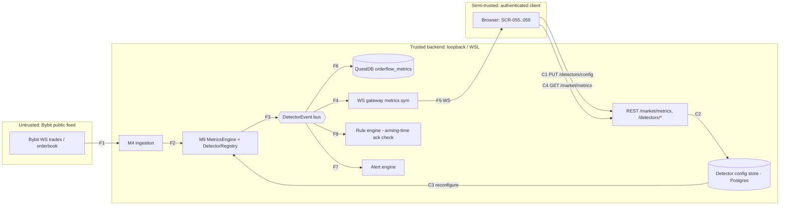

# E25 — STRIDE threat model: Estimated detectors (iceberg, stop-run, absorption, exhaustion, big trade)

- Ticket: E25-X01 (issue #621). Owner: Security engineer (CODEOWNER). Status: Draft for Security + Architect review.
- Method: `docs/plan/04-security-program.md` §5 template (L x I = risk). Reuses E08 market-data boundaries
  (`e08-exchange-boundary.md`) and the E24 model (`E24-derivatives.md`) for shared REST/WS read paths.
- **Why this is not "just analytics":** detector output (`DetectorEvent`) can feed armed rules that place orders,
  and detector thresholds are user-writable (`PUT /detectors/config`). A low-privilege-looking settings write
  therefore reaches the trading control path. Data classification of the _data_ is public market data;
  _configuration_ is internal; _audit records_ are security-relevant and append-only (C-2.9).
- This file enumerates weaknesses and controls only; no credentials or hosts appear.

## 1. Scope

In scope: Bybit WS -> M4 ingestion -> M9 book/tape -> `MetricsEngine` -> `DetectorRegistry` -> `DetectorEvent`
bus -> {WS fan-out `metrics.{symbol}`, `orderflow_metrics` (QuestDB), alert engine, rule engine}; and the
control flow `browser -> PUT /detectors/config -> config store (Postgres) -> registry reconfigure`; plus
`GET /market/metrics`, `GET /detectors/config`, `GET /detectors/methodology`, `/market/regime/explain`
and SCR-055..059. Out of scope: implementing controls (owner tickets), pen-testing (pre-R4), the rule
engine's own model (E35), the recorder's (E16).

## 2. Data-flow diagram and trust boundaries

Boundaries: **TB1->TB2** (F1: untrusted input); **TB3->TB2** (C1, C4, WS subscribe: authenticated, client
never trusted to enforce bounds); **F8 / C3** are the sensitive in-process edges: the event bus into the
rule engine, and the config store into the detector registry.

## 3. Numeric bounds as specified today (DoS and tampering)

| Surface                 | Bound                                                                                                                                                               | Source                  |
| ----------------------- | ------------------------------------------------------------------------------------------------------------------------------------------------------------------- | ----------------------- |
| `/market/metrics`       | `metric` 1-12 repeats; `params` maxLength 2048                                                                                                                      | 22-api `getMetrics`     |
| WS `metrics.{symbol}`   | `max_symbols_per_connection` 40, `max_subscriptions` 200, `max_topics_per_request` 50, inbound 262144 B, `min_throttle_ms` 50                                       | 23-ws welcome `limits`  |
| `DetectorConfig`        | `additionalProperties: false`; ranges e.g. `iceberg.min_reloads` 2-50, `window_ms` 200-60000, `stop_run.lookback_bars` 2-500, `absorption.min_volume_multiple` 1-50 | 22-api `DetectorConfig` |
| `PUT /detectors/config` | RBAC `settings:write`, scope `self`                                                                                                                                 | 22-api                  |
| `GET /detectors/config` | RBAC `marketdata:read`                                                                                                                                              | 22-api                  |

Gaps found while modelling (to be fixed by interface-first PRs before consumers, C-6.1):

- **G1** `exhaustion.min_delta_divergence` has `minimum: 0` but **no `maximum`**; `big_trade.absolute_usd`
  (`Decimal`) has no minimum/maximum. Unbounded values let a writer disable a detector in effect (never
  fires) or make one fire on noise. Owner: E25-T02 (add bounds in 22-api).
- **G2** Nested objects (`iceberg`, ...) do not declare `additionalProperties: false`; only the root does.
  Mass-assignment of unknown nested keys must be rejected server-side. Owner: E25-T02.
- **G3** No maximum range/`to - from` window or `recompute` rate limit is specified for the recompute and
  backfill paths. Owner: E25-T01/T02 (proposal: window <= 7 d, 1 recompute / 30 s / user / symbol).
- **G4** `DetectorEvent` has no specified `requires_acknowledgement` field; US-DET-006's NFR is a sentence
  only until it exists (see §5). Owner: E25-T03/T04 contract, honoured by rule engine at arming time.
- **G5** Scope `self` on `settings:write` is ambiguous for a config that affects shared armed rules (§4 E1).

## 4. STRIDE table

Risk = L x I (Low/Med/High). Disposition: **M** mitigated by named ticket, **A** accepted (Owner sign-off, §10).

| T   | STRIDE | Threat                                                                                              | Flow      | L   | I   | Risk | Mitigation / owner ticket                                                                                                                                                   | Disp.       |
| --- | ------ | --------------------------------------------------------------------------------------------------- | --------- | --- | --- | ---- | --------------------------------------------------------------------------------------------------------------------------------------------------------------------------- | ----------- |
| S1  | S      | Unauthenticated or cross-session subscription to `metrics.{symbol}`                                 | F5        | L   | L   | Low  | Server-side session auth + RBAC on WS subscribe (E17); no client-supplied identity trusted                                                                                  | M (E17)     |
| S2  | S      | Session fixation / hijack of the settings dialog to issue `PUT /detectors/config`                   | C1        | L   | H   | Med  | Session rotation on login, token auth not cookie-ambient, TOTP-backed session (E09/E17); SCR-056 uses the same authenticated client, no separate credential                 | M (E09)     |
| S3  | S      | Spoofed upstream trade/book frames feeding detectors                                                | F1        | M   | M   | Med  | Schema + symbol allow-list in normaliser, TLS and host allow-list (E08 W-series)                                                                                            | M (E08)     |
| T1  | T      | Threshold change alters armed-rule behaviour (e.g. lower `min_reloads` so iceberg fires constantly) | C1-C3, F8 | M   | H   | High | RBAC `settings:write` server-side; bounds enforced server-side; audited change; armed rules re-checked on config version change; ack gate (§5). E25-T02, E25-S05            | M           |
| T2  | T      | Bypass of UI bounds by calling the API directly                                                     | C1        | H   | M   | High | Server validates every field against 22-api bounds (pydantic `extra="forbid"`, ranges); G1 adds missing maxima. E25-T02; test E25-Q02                                       | M           |
| T3  | T      | Mass-assignment via unexpected keys (root or nested) on `DetectorConfig`                            | C1        | M   | M   | Med  | `extra="forbid"` at every nesting level (G2); 422 and `detector.config_rejected` event. E25-T02                                                                             | M           |
| T4  | T      | Methodology content altered so an estimate reads as fact                                            | C4        | L   | M   | Low  | Methodology is a server-versioned read-only resource; `estimated` mandatory in schema; badge prop required. E25-T01, E25-S05                                                | M           |
| T5  | T      | `estimated` flag dropped between engine, REST, WS, DOM                                              | F3-F5     | M   | H   | High | End-to-end flag trace (§6); contract test E25-T03/T04; component test E25-S05; E2E E25-Q01                                                                                  | M           |
| R1  | R      | Threshold change with no attributable actor                                                         | C1        | M   | H   | High | Append-only audit record (C-2.9): actor, role, before/after, traceId; event `detector.threshold_changed`. E25-T02                                                           | M           |
| R2  | R      | Armed rule fired on a detector event with no record of parameters in force                          | F8        | M   | H   | High | `params_snapshot` (thresholds + config version) on every `DetectorEvent`; rule-action audit stores event id + snapshot. E25-T03/T04, E35                                    | M           |
| R3  | R      | Enabling/disabling a detector unattributed                                                          | C1        | L   | M   | Low  | `detector.enabled_changed` audited like R1. E25-T02                                                                                                                         | M           |
| I1  | I      | Error responses leak table names, paths, stack traces or exchange credentials                       | C1/C4     | L   | M   | Low  | RFC 7807 mapping at the edge only; redaction filter (C-12.6); response scan test E25-X02                                                                                    | M           |
| I2  | I      | Recorded-history availability leaks other users' recording configuration                            | C4        | L   | L   | Low  | Availability derived from shared market recordings only, never per-user config; test E25-Q02                                                                                | M           |
| I3  | I      | Detector events expose account/position data                                                        | F5        | L   | M   | Low  | Events carry market data only; no account fields in schema (contract test)                                                                                                  | A           |
| D1  | D      | Unbounded `metrics[]` selection                                                                     | C4        | M   | M   | Med  | `maxItems` 12 validated before query; E25-T01                                                                                                                               | M           |
| D2  | D      | Oversized REST backfill range                                                                       | C4        | H   | H   | High | Window cap (G3), `limit` bounds, 400 `invalid_time_range`, validate before querying; E25-T01/Q03                                                                            | M           |
| D3  | D      | Repeated `recompute` requests                                                                       | C4        | M   | M   | Med  | Per-user/symbol rate limit, single-flight coalescing, `detector.recompute_rate_limited`; E25-T01                                                                            | M           |
| D4  | D      | Unbounded per-price iceberg state (memory growth)                                                   | F2        | M   | H   | High | Bounded LRU per symbol with `window_ms` eviction and hard max entries; `detector_state_evicted_total`; E25-T03                                                              | M           |
| D5  | D      | Unbounded stop-run/absorption history (`lookback_bars` 500)                                         | F2        | L   | M   | Low  | Ring buffers sized from validated config maxima; E25-T04                                                                                                                    | M           |
| D6  | D      | Subscription amplification across many symbols                                                      | F5        | M   | M   | Med  | 40-symbol cap, 200 subscriptions, `min_throttle_ms` 50, bounded per-client queues (C-2.18); E17 + E25-Q03                                                                   | M           |
| D7  | D      | Event storm floods rule/alert engines (threshold set so every trade fires)                          | F7/F8     | M   | H   | High | Per-detector debounce, bounded bus queue with coalesce, per-rule rate cap in rule engine; E25-T03/T04                                                                       | M           |
| E1  | E      | Viewer changes detector configuration                                                               | C1        | M   | H   | High | `settings:write` enforced server-side; Viewer lacks it; resolve G5 (elevated role or per-user detector instances for config affecting shared armed rules). E25-T02, E25-Q02 | M           |
| E2  | E      | Detector-driven rule action escapes the acknowledgement requirement of US-DET-006 NFR               | F8        | M   | H   | High | `requires_acknowledgement` + `estimated` honoured at arming time (§5), enforced synchronously (C-2.21); E25-T03/T04 contract, E25-S05 warning, E35                          | M           |
| E3  | E      | Detector event bypasses native-SL / risk checks                                                     | F8        | L   | H   | Med  | Detector events never create orders directly; any order passes OMS risk + native SL (C-2.6)                                                                                 | M (E29/E35) |

## 5. The armed-rule path (detector event to order)

Path: `DetectorRegistry` -> `DetectorEvent` -> bus -> rule engine condition -> armed rule action -> OMS.

Controls, all server-side and synchronous (C-2.21: statecharts record, synchronous code enforces):

1. Every detector-derived event carries `estimated=true` and `requires_acknowledgement=true` (G4);
   heuristics over anonymous data are never facts. The flags cannot default to false in the schema.
2. **Arming-time check:** the rule engine refuses to arm a rule whose trigger depends on a detector event
   unless the user has recorded an explicit acknowledgement (versioned text, actor, timestamp, audited).
   The check repeats when the detector config version changes after arming (rule disarms or re-prompts),
   so a threshold edit cannot silently change an armed rule.
3. **No sole-trigger live orders:** a detector event alone cannot open a live position; the rule must
   combine it with a non-estimated condition or require per-fire confirmation (rule-engine policy, E35).
   Paper/demo may auto-fire. The live-enablement gate (C-2.11) is unaffected.
4. Rule action audit stores event id, `params_snapshot`, config version and acknowledgement id (R2).
5. Orders still pass OMS risk caps, native SL (C-2.6) and the kill switch; no flag may bypass (C-4.14).
6. UI (E25-S05): arming warning with a keyboard and screen-reader operable confirmation.

## 6. Estimated flag trace (T5)

| Hop            | Carrier                                                                  | Invariant                     | Proving test                   |
| -------------- | ------------------------------------------------------------------------ | ----------------------------- | ------------------------------ |
| Engine         | `DetectorEvent.estimated`, `requires_acknowledgement`, `params_snapshot` | Cannot construct without them | Unit + hypothesis, E25-T03/T04 |
| REST/WS schema | `required` in 22-api / 23-ws `metrics.{symbol}` payload                  | Omission fails validation     | Contract test E25-T04          |
| Rule engine    | Arming-time check                                                        | Unacknowledged arm refused    | E35 + E25-Q01                  |
| DOM            | Badge text + `aria-label`, not colour only                               | Rendered whenever true        | E25-S05, axe, E25-Q01          |

## 7. Abuse cases (handed to E25-Q01; automatable ones to Q02/Q03)

| ID   | Abuse case                                                                      | Expected result                                                                      | Threat | Owner |
| ---- | ------------------------------------------------------------------------------- | ------------------------------------------------------------------------------------ | ------ | ----- |
| AC1  | Viewer role calls `PUT /detectors/config`                                       | 403, audited rejection `detector.config_rejected` with actor                         | E1, R1 | Q02   |
| AC2  | PUT with `iceberg.min_reloads` 1 and 51, `window_ms` 199                        | 422, config unchanged                                                                | T2     | Q02   |
| AC3  | PUT with unknown root key and unknown nested key                                | 422, config unchanged                                                                | T3     | Q02   |
| AC4  | PUT `exhaustion.min_delta_divergence=1e308` / negative `big_trade.absolute_usd` | 422 (after G1)                                                                       | T2     | Q02   |
| AC5  | Valid PUT by authorised user                                                    | audit record with actor, before/after, traceId; `detector.threshold_changed` emitted | R1     | Q02   |
| AC6  | Arm a rule triggered by an iceberg event without acknowledgement                | arming refused                                                                       | E2     | Q01   |
| AC7  | Change a threshold after arming an acknowledged rule                            | rule re-prompts or disarms                                                           | T1, E2 | Q01   |
| AC8  | `/market/metrics` with 13 `metric` values; `params` 2049 B                      | 400                                                                                  | D1     | Q03   |
| AC9  | Backfill `from`=epoch 0                                                         | 400 `invalid_time_range`, no query                                                   | D2     | Q03   |
| AC10 | 50 `recompute` calls in 10 s                                                    | rate limited, single-flight, p95 holds                                               | D3     | Q03   |
| AC11 | Replay 1M distinct-price prints through the iceberg detector                    | memory bounded, evictions counted                                                    | D4     | Q03   |
| AC12 | Subscribe `metrics.*` for 41 symbols                                            | cap error, first 40 unaffected                                                       | D6     | Q03   |
| AC13 | Estimated event through every layer                                             | badge visible in DOM                                                                 | T5     | Q01   |
| AC14 | Scan error responses and events for key/path/table-name strings                 | none                                                                                 | I1, I3 | X02   |

## 8. Observability signals

Events: `detector.threshold_changed`, `detector.enabled_changed`, `detector.config_rejected{actor,reason}`,
`detector.recompute_rate_limited`. Metrics: `detector_state_evicted_total`, `detector_event_dropped_total`,
`detector_ack_refused_total`. Alert on sustained rejections (possible abuse) and unexpected config changes.

## 9. Control-to-ticket map and automation

Every E25-* ticket appears here; a missing row is a model defect (enforced by GOV-008,
`scripts/check_threat_model_ticket_map.py`). Provenance tags: `ticket body`, `shipped in #NNNN`,
or `required by this model - not yet in the ticket; requested on #NNN`.

| Ticket  | Controls / obligations (provenance tag per control)                                                                                                                                                                                                                                                                                                                                                                                                                                                                                                                                                                                                   |
| ------- | ----------------------------------------------------------------------------------------------------------------------------------------------------------------------------------------------------------------------------------------------------------------------------------------------------------------------------------------------------------------------------------------------------------------------------------------------------------------------------------------------------------------------------------------------------------------------------------------------------------------------------------------------------- |
| E25-X01 | Self-row: this model (S1-E3, abuse cases AC1-AC14, gaps G1-G5); shipped in #1707 (`docs/security/threat-models/E25-detectors.md`); no runtime control                                                                                                                                                                                                                                                                                                                                                                                                                                                                                                 |
| E25-X02 | Verifies T1-T3, R1, E1, I1/I3 and AC14 on a running build; Viewer 403, bounds, unknown keys, audit immutability [ticket body]                                                                                                                                                                                                                                                                                                                                                                                                                                                                                                                         |
| E25-T01 | MetricsEngine and `/market/metrics`: window recompute on change, explicit warm-up/null values [ticket body] `maxItems` 12, window cap G3, `invalid_time_range`, D1/D2 [required by this model - not yet in the ticket; requested on #726] per-user/symbol recompute rate limit, single-flight, `detector.recompute_rate_limited`, D3 [required by this model - not yet in the ticket; requested on #726] methodology read-only, T4 [required by this model - not yet in the ticket; requested on #726]                                                                                                                                    |
| E25-T02 | Detector framework, config and endpoints: server-side bounds with permitted range in the error, no audit record on rejection, T2 [ticket body] audited change (detector, key, before, after, actor), confirmed only after live reconfiguration, R1 [ticket body] `extra="forbid"` at every nesting level, G2, T3 [required by this model - not yet in the ticket; requested on #727] `settings:write` RBAC and G5 elevated role, E1 [required by this model - not yet in the ticket; requested on #727] `detector.config_rejected`, `detector.enabled_changed`, R3 [required by this model - not yet in the ticket; requested on #727] |
| E25-T03 | Absorption and iceberg detectors: `estimated: true` on every event, T5 [ticket body] `params_snapshot` and `requires_acknowledgement`, G4, R2/E2 [required by this model - not yet in the ticket; requested on #728] bounded LRU per symbol with hard max entries, `detector_state_evicted_total`, D4 [required by this model - not yet in the ticket; requested on #728] per-detector debounce, bounded bus queue, D7 [required by this model - not yet in the ticket; requested on #728]                                                                                                                                                |
| E25-T04 | Stop-run detector: `estimated: true` on every event, T5 [ticket body] `params_snapshot` and `requires_acknowledgement`, G4, R2/E2 [required by this model - not yet in the ticket; requested on #797] ring buffers sized from validated config maxima, D5 [required by this model - not yet in the ticket; requested on #797] per-detector debounce, bounded bus queue, D7 [required by this model - not yet in the ticket; requested on #797]                                                                                                                                                                                            |
| E25-T05 | Regime classifier and `/market/regime/explain`: explicit `insufficient_data`, composition actually used [ticket body] `estimated` flag on the regime metric and transition events, T5 [required by this model - not yet in the ticket; requested on #729]                                                                                                                                                                                                                                                                                                                                                                                       |
| E25-T06 | Stacked imbalance runs: no control; bounded server-side recompute and published state [ticket body]; threshold changes use the T02 audited path (T1)                                                                                                                                                                                                                                                                                                                                                                                                                                                                                                  |
| E25-T07 | Methodology content and flags: entry per estimated signal with the no-L3/MBO honesty sentence, T4 [ticket body] content served as a server-versioned read-only resource, T4 [required by this model - not yet in the ticket; requested on #798]                                                                                                                                                                                                                                                                                                                                                                                                 |
| E25-S01 | No control; consumes `metrics.{symbol}` and renders the estimated badge, T5 (component test of badge presence)                                                                                                                                                                                                                                                                                                                                                                                                                                                                                                                                        |
| E25-S02 | No control; renders imbalance stacks from server state, no client recompute (T1)                                                                                                                                                                                                                                                                                                                                                                                                                                                                                                                                                                      |
| E25-S03 | No control; renders regime sub-signal breakdown from `/market/regime/explain`, T5                                                                                                                                                                                                                                                                                                                                                                                                                                                                                                                                                                     |
| E25-S04 | No control; renders the read-only methodology resource, T4                                                                                                                                                                                                                                                                                                                                                                                                                                                                                                                                                                                            |
| E25-S05 | Settings dialog: range validation messages, high-sensitivity warning, armed rules named before apply, T1/E2 [ticket body] required badge prop, keyboard/SR operable confirm, T4/E2 [required by this model - not yet in the ticket; requested on #795]                                                                                                                                                                                                                                                                                                                                                                                          |
| E25-S06 | No control; renders markers and the DetectorEventCard with the `params_snapshot` in force, R2/T5                                                                                                                                                                                                                                                                                                                                                                                                                                                                                                                                                      |
| E25-D01 | No control; design research for the estimated-signal honesty copy (T5)                                                                                                                                                                                                                                                                                                                                                                                                                                                                                                                                                                                |
| E25-D02 | No control; design only, wireframes of the armed-rule warning states (E2)                                                                                                                                                                                                                                                                                                                                                                                                                                                                                                                                                                             |
| E25-D03 | No control; design only, estimated badge on SCR-055..057 (T5)                                                                                                                                                                                                                                                                                                                                                                                                                                                                                                                                                                                         |
| E25-D04 | No control; design only, SCR-058/059 including the arming warning (E2)                                                                                                                                                                                                                                                                                                                                                                                                                                                                                                                                                                                |
| E25-D05 | No control; design-system badge component with required `estimated` prop (T5)                                                                                                                                                                                                                                                                                                                                                                                                                                                                                                                                                                         |
| E25-D06 | No control; accessibility review of the arming warning and confirm path (E2)                                                                                                                                                                                                                                                                                                                                                                                                                                                                                                                                                                          |
| E25-D07 | No control; handoff sign-off, design PRs need Owner approval                                                                                                                                                                                                                                                                                                                                                                                                                                                                                                                                                                                          |
| E25-D08 | No control; verifies built surfaces show the estimated badge and warnings (T5, E2)                                                                                                                                                                                                                                                                                                                                                                                                                                                                                                                                                                    |
| E25-K01 | No control; spike on recorded fixtures only, no network (C-13.5); informs D4/D7 bounds                                                                                                                                                                                                                                                                                                                                                                                                                                                                                                                                                                |
| E25-Q01 | Black-box AC6, AC7, AC13; honesty checklist per surface, T5/E2 [ticket body]                                                                                                                                                                                                                                                                                                                                                                                                                                                                                                                                                                          |
| E25-Q02 | E2E for AC1-AC5: unauthorised change, range rejection, applied state only after backend confirmation [ticket body] AC3, AC4 unknown-key and extreme-value cases [required by this model - not yet in the ticket; requested on #787]                                                                                                                                                                                                                                                                                                                                                                                                                |
| E25-Q03 | DoS caps under load AC8-AC12, determinism and frame budget, D1-D6 [required by this model - not yet in the ticket; requested on #788]                                                                                                                                                                                                                                                                                                                                                                                                                                                                                                                 |
| E25-Q04 | No control; accessibility audit of SCR-055..059 and markers (E2 warning operability)                                                                                                                                                                                                                                                                                                                                                                                                                                                                                                                                                                  |
| E25-Q05 | No control; regression pack and QA sign-off, verifies Q01-Q03 results                                                                                                                                                                                                                                                                                                                                                                                                                                                                                                                                                                                 |
| E35     | Arming-time acknowledgement enforcement (§5), E2/R2 [ticket body]                                                                                                                                                                                                                                                                                                                                                                                                                                                                                                                                                                                     |

Automation raised (for E25-X02 / infra owners via follow-up; no workflow files change in this PR):

- **SAST (Semgrep):** forbid detector threshold literals/defaults in `apps/web/src` (the server is the sole
  source of truth; client constants invite drift and a false sense of enforcement).
- **SAST:** forbid constructing a `DetectorEvent` without `estimated` (T5).
- **Contract lint:** every mutating `/detectors/*` operation must declare `x-rbac` with `settings:write` (E1).
- **DAST (ZAP):** scan `/detectors/config` and `/market/metrics` as Viewer/Manager/Owner.

## 10. Residual risks, review and sign-off

- Accepted: I3 (events carry no account data, asserted by contract test).
- Residual after controls: heuristics produce false positives by nature; labelled, not removable.
- Open interface-first gaps: G1-G5 (22-api, 23-ws, 24-internal-schemas), owner E25-T02/T03/T04.
- Accepted risks await Owner approval (agent-delivery adaptation). Security-engineer sign-off is recorded
  as a PR comment by the independent security reviewer; architect review via PR review. Draft until then;
  E25-T02 must not start before both.
