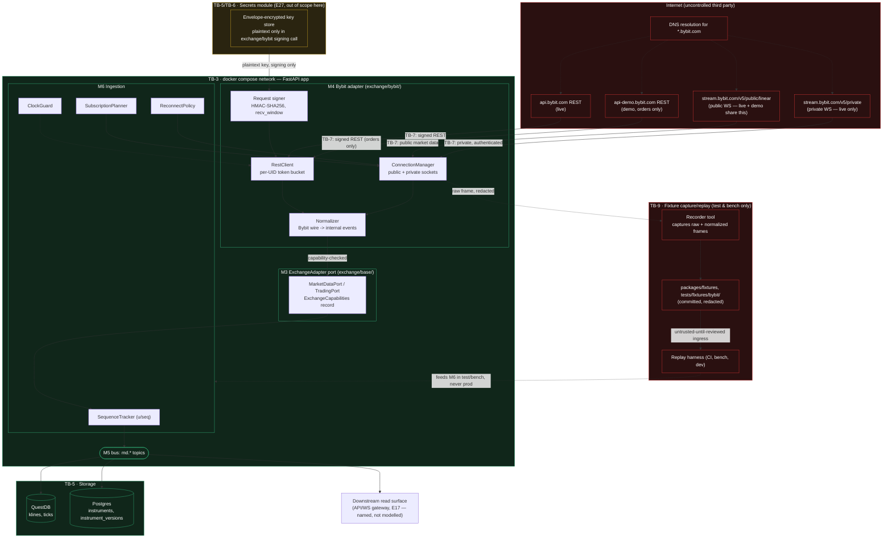

# E08 — STRIDE threat model: Exchange boundary and ingestion pipeline

- Ticket: E08-X01 (issue #187)
- Owner: Security engineer (CODEOWNER)
- Status: Draft — pending Architect + epic-owner review session (see §7)
- Re-derives and extends `docs/plan/04-security-program.md` §5.5 (W1–W11, area "WebSocket ingestion &
  fan-out") and the exchange-API-key area (§5.1, K-series, referenced not repeated) against the concrete
  design landed in E08-T01 (`services/api/candleviewer/exchange/base/`, `exchange/bybit/`) and
  `docs/plan/24-internal-schemas.md` §14 (ports, adapter rules), plus the ingestion component design in
  `docs/plan/20-architecture.md` §3.1–3.4 (C4 L3 M3–M6).
- Classification: this document itself is sensitive only in that it enumerates weaknesses; no live
  credentials, host allowlists beyond what `20-architecture.md`/`24-internal-schemas.md` already publish,
  or egress IPs appear below.

## 1. Scope

In scope: **M3 `ExchangeAdapter` port** (`exchange/base/ports.py` — `MarketDataPort`, `TradingPort`
structural types and the `ExchangeCapabilities` record), **M4 Bybit adapter**
(`exchange/bybit/` — REST + public/private WS, signing, error mapping), **M5 in-process bus**
(`bus/bus.py`, topic contract), and **M6 ingestion** (`ingestion/` — `ConnectionManager`,
`SubscriptionPlanner`, `Heartbeat/Watchdog`, `ReconnectPolicy`, `Normalizer`, `SequenceTracker`,
`RestClient`, `ClockGuard`), together with the downstream write paths into QuestDB (klines, ticks) and
Postgres (`instruments`, `instrument_versions`), and the fixture capture/replay ingress used by
`packages/fixtures` and `tests/fixtures/bybit/`.

Out of scope (per ticket "Out of scope" section, restated so this document is self-contained):
auth/RBAC and session threats (`E09-X01`), key-vault storage and permission verification (E27),
OMS/order-path threats (E29), supply-chain/dependency threats (E03, referenced as an adjacent model),
the client-side WS gateway (E17, boundary named but not modelled here), and executing the adversarial
tests (`E08-X02`) or configuring scanners (`E08-X03`) — this document defines what those verify.

Trading-capability threats (`TradingPort`, order placement, native SL) are named only where the
ingestion path could reach them by capability creep (STRIDE "Elevation of privilege", §3.6); the order
path's own threat surface belongs to E29 and is not re-derived here.

## 2. Data-flow diagram

Trust boundaries follow `04-security-program.md` §4 (TB-1..TB-9), specifically TB-7 (backend → Bybit).
This diagram is the exchange-boundary detail behind TB-7 and adds the M3–M6 internal boundaries the
programme-level diagram does not show.

Elements analysed below (§3): DNS resolution, the live/demo REST hosts, the public/private WS hosts, the
request signer, `RestClient`, `ConnectionManager`/`Normalizer` (M4), the `ExchangeAdapter` port and
`ExchangeCapabilities` record (M3), `SequenceTracker`/`ClockGuard`/`SubscriptionPlanner`/`ReconnectPolicy`
(M6), the bus, QuestDB/Postgres write paths, the downstream read surface (named only), and the fixture
capture/replay path. Every element and every labelled flow above has at least one row in §3, or an
explicit "not applicable" note.

## 3. STRIDE analysis

Table shape follows `04-security-program.md` §5 (`T` id, STRIDE category, threat, L, I, Risk, mitigations,
residual), extended with a **Verify** column naming the test/metric that proves the mitigation — a row
with no verification is itself a finding (flagged `[FINDING]`). Threat ids keep the `W*` prefix from §5.5
(WebSocket ingestion & fan-out) where a §5.5 threat is being re-derived against the concrete E08-T01
design; new ids introduced by this deeper pass use an `E8*` prefix so they don't collide with §5.5's
existing `W1`–`W11` (which cover fan-out/gateway concerns partially out of this ticket's scope) or with
the exchange-API-key `K*` series (§5.1, referenced not re-derived).

### 3.1 Spoofing

| T    | Threat                                                                                                                                                           | L   | I   | Risk   | Mitigations                                                                                                                                                                                                                                                                                                                    | Verify                                                                                                                                                                                                                                 | Residual |
| ---- | ---------------------------------------------------------------------------------------------------------------------------------------------------------------- | --- | --- | ------ | ------------------------------------------------------------------------------------------------------------------------------------------------------------------------------------------------------------------------------------------------------------------------------------------------------------------------------ | -------------------------------------------------------------------------------------------------------------------------------------------------------------------------------------------------------------------------------------- | -------- |
| W10  | Demo public market data taken from a demo WS endpoint that does not exist, or demo/live endpoints mixed within one session                                       | M   | M   | Medium | SR-040a: demo has **no public WS**; mainnet public streams feed demo sessions; `ExchangeCapabilities.has_public_ws=False` for demo is read by `ConnectionManager`, not branched on by callers; one `ExchangeAdapter` client instance per environment, no shared mutable base URL                                               | `test_environment_capability_record_is_immutable_per_instance`, `test_demo_env_never_dials_a_public_ws_url`, integration test asserting two `ExchangeAdapter` instances (live, demo) cannot share connection state                     | Low      |
| E8-1 | TLS interception (hostile proxy/MITM) presents a forged Bybit certificate                                                                                        | L   | H   | Medium | Standard TLS cert validation via `httpx`/`websockets` defaults (no custom trust-all context anywhere in `exchange/bybit/`); cert pinning is explicitly **not** added (Bybit rotates certs; pinning would create an availability risk) — accepted as a standing platform assumption shared with every other outbound HTTPS call | `test_no_ssl_verify_disabled_in_exchange_bybit` (static grep-based CI check for `verify=False`/`ssl.CERT_NONE`)                                                                                                                        | Low      |
| E8-2 | Hostile/poisoned DNS answer for `api.bybit.com` or `stream.bybit.com` redirects the adapter to an attacker-controlled endpoint                                   | L   | H   | Medium | TLS certificate validation (E8-1) still requires a cert matching the resolved hostname, so DNS spoofing alone cannot succeed without also forging a valid cert; base URLs are configuration-only (§14.3), never derived from user input, closing the "attacker supplies the host" variant                                      | Covered by E8-1's cert-validation test; no separate DNS-specific test is added (would require controlling DNS in CI, out of scope)                                                                                                     | Low      |
| E8-3 | A stub/fixture exchange (`FakeExchange`, `synthetic_feed.py`) is mistaken for the live exchange in a non-test runtime path                                       | L   | H   | Medium | `FakeExchange` and `synthetic_feed` live under `exchange/base/fakes.py` / `ingestion/synthetic_feed.py`, imported only from `tests/` and dev-mode config; the app-wiring module fails to start if a fake adapter is selected while `ENV=live`/`ENV=demo` (fail-closed on environment/adapter mismatch)                         | `test_app_refuses_to_start_with_fake_adapter_in_live_or_demo_env`                                                                                                                                                                      | Low      |
| E8-4 | An attacker-controlled WS endpoint is injected via a mis-set base-URL config value (e.g. an operator typo or a compromised config source)                        | L   | H   | Medium | Base URLs are validated at startup against an allowlist derived from `ExchangeCapabilities`/the environment capability matrix (SR-040a); a URL outside the allowlist fails app startup rather than silently connecting                                                                                                         | `test_app_refuses_to_start_with_non_allowlisted_exchange_host`                                                                                                                                                                         | Low      |
| E8-5 | Environment confusion: a live-keyed request signed and sent to the demo host, or vice versa, because one client instance's config was mutated after construction | L   | H   | Medium | `ExchangeCapabilities`/environment is immutable per adapter instance (frozen pydantic model); the signer receives its host + key pair bound together at construction, never re-resolved per call; SR-040a "one client instance per environment, no shared mutable base URL"                                                    | `test_exchange_capabilities_record_is_frozen` (mutation raises), `test_signer_host_and_key_are_bound_at_construction_not_per_call` — **this is the test named by the ticket's "Edge case: environment confusion" acceptance scenario** | Low      |

### 3.2 Tampering

| T     | Threat                                                                                                                                                              | L   | I   | Risk     | Mitigations                                                                                                                                                                                                                                                                                                                                                                                                      | Verify                                                                                                                                                                                                                      | Residual |
| ----- | ------------------------------------------------------------------------------------------------------------------------------------------------------------------- | --- | --- | -------- | ---------------------------------------------------------------------------------------------------------------------------------------------------------------------------------------------------------------------------------------------------------------------------------------------------------------------------------------------------------------------------------------------------------------- | --------------------------------------------------------------------------------------------------------------------------------------------------------------------------------------------------------------------------- | -------- |
| W2    | Order-book desync (Bybit L2 has no checksum) yields a wrong book that drives trading/detector decisions with **no visible signal**                                  | M   | H   | **High** | SR-038 `SequenceTracker` tracks `u`/`seq` monotonicity per topic; any gap invalidates the book (`DESYNCED`), triggers unsubscribe/resubscribe + fresh snapshot, buffers deltas until the snapshot lands; book is flagged `stale`/`DESYNCED` and DOM/heatmap trading affordances are suppressed while stale — **deterministic invalidate-and-resync, never a best-effort patch or silent forward-fill**           | `test_sequence_gap_marks_book_desynced_not_patched`, `test_stale_book_suppresses_trading_affordances`, RSK-010's divergence metric (periodic REST cross-check)                                                              | Low      |
| E8-6  | A delta is applied across a detected gap ("silent patch") instead of triggering resync                                                                              | L   | H   | **High** | `BookState.apply()` refuses to apply any delta once `SequenceTracker.check()` has returned `Gap`; the only path out of `DESYNCED` is a fresh `BookSnapshot` — enforced by the state machine `INIT → SNAPSHOT_PENDING → LIVE → DESYNCED → SNAPSHOT_PENDING` (20-architecture.md §3.2), not by a convention                                                                                                        | `test_book_state_rejects_apply_while_desynced` (hypothesis: any delta sequence with an injected gap never silently advances `LIVE` state)                                                                                   | Low      |
| E8-7  | A crossed book (bid ≥ ask) is reconstructed and rendered without invalidation                                                                                       | L   | H   | **High** | Hard invariant: any `BookState.apply()`/`snapshot()` producing a crossed top-of-book raises immediately rather than publishing (RSK-010 mitigation) — this is treated as equivalent to a sequence gap for resync purposes                                                                                                                                                                                        | `test_crossed_book_raises_and_triggers_resync` (property test over synthetic delta sequences)                                                                                                                               | Low      |
| E8-8  | A malformed/hostile exchange frame (oversized array, deeply nested JSON, non-numeric price/size field) crashes the `Normalizer` or triggers unbounded allocation    | M   | M   | Medium   | Strict schema validation (pydantic v2, `extra="forbid"` inbound DTOs) plus explicit size caps on every frame before normalization; malformed frames are rejected and counted, never partially applied                                                                                                                                                                                                            | `test_normalizer_rejects_oversized_frame`, `test_normalizer_rejects_non_numeric_price_size`, fuzz test (hypothesis/atheris) on the decoder — mirrors SR-155                                                                 | Low      |
| E8-9  | Instrument filter values (tick size, min notional, lot size) altered in transit or by a stale cache entry, so a later order passes validation it should have failed | M   | H   | **High** | `instruments`/`instrument_versions` (Postgres) are the source of truth for filters, written only by the ingestion path's instrument-refresh job, versioned (each change is a new `instrument_versions` row, never an in-place update to the currently-referenced version); order-path rounding (owned by E29/`exchange/base`) reads the versioned record, not a mutable in-memory dict that ingestion could race | `test_instrument_version_is_append_only_never_mutated_in_place`, `test_order_validation_reads_pinned_instrument_version` (cross-referenced to E29, flagged here as a boundary condition this epic must not silently assume) | Low      |
| E8-10 | A fixture is edited in the repo (by hand or a compromised PR) to encode wrong expectations, masking a real regression                                               | L   | H   | Medium   | Fixtures are recorded via the recorder tool only, redacted, and reviewed like code; a fixture-provenance header (source, date, symbol, env, redaction — C-13.5/`40-testing.md`) is checked in CI; hand-edited fixture bytes with no matching recorder-tool provenance line fail a lint check                                                                                                                     | `test_fixture_provenance_header_present_and_well_formed` (CI lint), PR review requirement (human-verified, not automatable — flagged as a process control)                                                                  | Low      |
| E8-11 | A cached kline row is overwritten with unconfirmed (`confirm=false`) data, corrupting the persisted/replay-visible bar                                              | M   | M   | Medium   | SR-040b: a kline frame is only written to QuestDB or fed to bar builders/rule engine once `confirm == true`; unconfirmed frames update an in-memory "forming bar" preview only, never touch the persisted store                                                                                                                                                                                                  | `test_unconfirmed_kline_never_persisted`, `test_confirmed_kline_write_is_idempotent_on_replay`                                                                                                                              | Low      |
| E8-12 | A REST order-acknowledgement response is misread as a fill, corrupting downstream state fed by this same normalization layer                                        | L   | H   | Medium   | Out of this ticket's primary scope (order path = E29) but the _normalization_ boundary is shared: `Normalizer` never emits a fill-shaped event from a REST accept-ack; fills originate only from private WS `order`/`execution` streams (SR-040b, SR-058)                                                                                                                                                        | `test_normalizer_rest_ack_never_produces_fill_event` — named here as a boundary assertion this epic's `Normalizer` must uphold even though fill _handling_ is E29's                                                         | Low      |
| E8-13 | Clock drift beyond `recv_window` causes signed requests to be silently rejected or, worse, accepted with a stale timestamp interpreted as valid by a lenient client | M   | M   | Medium   | `ClockGuard` polls `GET /v5/market/time`, computes offset, and **blocks trading mode** (fails closed, does not silently proceed) when drift exceeds `recv_window/2`; alert `bybit_clock_drift_ms`                                                                                                                                                                                                                | `test_clock_guard_blocks_signing_above_drift_threshold`, `test_clock_guard_alert_fires_on_drift`                                                                                                                            | Low      |
| E8-14 | `RestClient`'s per-UID token-bucket state is corrupted by a concurrent-access bug, permitting request patterns above the real Bybit budget                          | L   | M   | Medium   | Token bucket is owned by a single asyncio task per UID (no cross-task mutation without a lock); property test asserts monotonic budget consumption under concurrent callers                                                                                                                                                                                                                                      | `test_token_bucket_concurrency_property` (hypothesis: N concurrent acquire calls never exceed the configured budget)                                                                                                        | Low      |

### 3.3 Repudiation

| T     | Threat                                                                                                                                                             | L   | I   | Risk   | Mitigations                                                                                                                                                                                                                                                                                              | Verify                                                                                                         | Residual |
| ----- | ------------------------------------------------------------------------------------------------------------------------------------------------------------------ | --- | --- | ------ | -------------------------------------------------------------------------------------------------------------------------------------------------------------------------------------------------------------------------------------------------------------------------------------------------------- | -------------------------------------------------------------------------------------------------------------- | -------- |
| E8-15 | An ingestion anomaly (gap, desync, malformed frame, clock-drift block) occurs with no durable record of what arrived, so the on-call cannot reconstruct root cause | M   | M   | Medium | Every `SequenceGap`, `DESYNCED` transition, rejected frame, and `ClockGuard` block emits a structured log event (`traceId`, topic, seq/u values, ts) **and** a Prometheus counter (§8 Observability); raw frames around an anomaly are retained by the recorder's raw log (redacted) for forensic replay | `test_sequence_gap_emits_structured_log_and_metric`, `test_desync_transition_is_logged_with_topic_and_seq`     | Low      |
| E8-16 | Inability to reconstruct _why_ a book desynced after the fact (only the fact of desync is recorded, not the triggering frame)                                      | M   | M   | Medium | The frame that triggered the gap (previous `u`/`seq` and the offending frame's `u`/`seq`) is logged verbatim (no secrets present in a public-channel book frame); the recorder's raw log additionally retains the byte-level frame for replay-based root-cause analysis                                  | `test_gap_log_includes_previous_and_offending_seq_values`                                                      | Low      |
| E8-17 | Capture tooling records a fixture without provenance (host, time, stream, env), so a later regression cannot be traced to what was actually observed               | L   | M   | Medium | Recorder tool stamps a provenance header on every captured fixture (source, date, symbol, env, redaction note) per `40-testing.md`/C-13.5; CI lint enforces the header is present and well-formed (shared control with E8-10)                                                                            | `test_fixture_provenance_header_present_and_well_formed` (same test as E8-10 — one control, two threat angles) | Low      |
| E8-18 | Reconnect/resubscribe activity is indistinguishable from a genuine upstream outage in the logs, masking a local bug that causes excessive reconnects               | L   | M   | Low    | `ConnectionManager` logs a distinct event per reconnect attempt with `attempt_number`, `delay_ms`, and the triggering reason (heartbeat timeout, gap-driven resubscribe, explicit close); `bybit_reconnect_total{reason=...}` is a labelled metric, not a single counter                                 | `test_reconnect_event_logged_with_reason_label`                                                                | Low      |

### 3.4 Information disclosure

| T     | Threat                                                                                                                                                                         | L   | I   | Risk     | Mitigations                                                                                                                                                                                                                                                                                                                         | Verify                                                                                                                                          | Residual |
| ----- | ------------------------------------------------------------------------------------------------------------------------------------------------------------------------------ | --- | --- | -------- | ----------------------------------------------------------------------------------------------------------------------------------------------------------------------------------------------------------------------------------------------------------------------------------------------------------------------------------- | ----------------------------------------------------------------------------------------------------------------------------------------------- | -------- |
| E8-19 | API key, signature, or `X-BAPI-*` header leaked into logs, metrics labels, error messages, traces, or a committed fixture                                                      | M   | H   | **High** | SR-006 redaction filter applied to every logger sink used by `exchange/bybit/`; the signer never returns the signature/headers to callers beyond what's needed to make the request; a fixture-recording redaction pass strips all `X-BAPI-*` headers and any `sign`/`api_key` query params before a fixture is ever written to disk | `test_redaction_filter_strips_bapi_headers_and_signature`, `test_recorder_redacts_signed_request_before_fixture_write`, gitleaks in CI (SR-142) | Low      |
| E8-20 | The egress IP or account identity is exposed in a client-visible error message surfaced from an exchange error                                                                 | L   | M   | Medium   | Internal exchange error taxonomy (§14.2 rule 1: "No `retCode` integer escapes the adapter package") maps every Bybit error to a domain error with a sanitised message; the adapter's raw error body is logged internally (redacted) but never returned verbatim to an HTTP/WS client                                                | `test_exchange_error_taxonomy_never_leaks_raw_retcode_or_body_to_client`                                                                        | Low      |
| E8-21 | Upstream error bodies (which may include account-identifying details in the message text) are echoed to clients                                                                | L   | M   | Medium   | Same control as E8-20 — the mapping layer is the single chokepoint; verified by the same test                                                                                                                                                                                                                                       | (shared with E8-20)                                                                                                                             | Low      |
| E8-22 | The private WS authentication payload (API key + signed expiry) is logged at connect time for debugging                                                                        | L   | H   | Medium   | Connect/auth logging paths use the same redaction filter (SR-006) as request logging; a structured "ws_auth_attempt" log event carries no key material, only environment/account-ref/result                                                                                                                                         | `test_ws_private_auth_log_event_contains_no_key_material`                                                                                       | Low      |
| E8-23 | A stack trace from an unhandled exception inside `exchange/bybit/` includes the signed request (query string with `sign=` param) via a caught-and-rethrown exception's message | M   | H   | **High** | Exceptions raised from the signer/RestClient carry a sanitised message only; the original request object (which may contain the signature) is never interpolated into an exception's `args`/`str()`; a Sentry/observability scrubber additionally redacts `sign=`/`api_key=` query-string patterns as defence in depth              | `test_signer_exceptions_never_include_raw_query_string`, redaction-filter test asserting `sign=` pattern scrubbed even if it reaches the sink   | Low      |

### 3.5 Denial of service

| T     | Threat                                                                                                                                                                         | L   | I   | Risk     | Mitigations                                                                                                                                                                                                                                                                                                                                                             | Verify                                                                                                                                                                                          | Residual |
| ----- | ------------------------------------------------------------------------------------------------------------------------------------------------------------------------------ | --- | --- | -------- | ----------------------------------------------------------------------------------------------------------------------------------------------------------------------------------------------------------------------------------------------------------------------------------------------------------------------------------------------------------------------- | ----------------------------------------------------------------------------------------------------------------------------------------------------------------------------------------------- | -------- |
| E8-24 | Rate-limit exhaustion (`10018`) caused by our own paging/refresh behaviour (e.g. instrument-list refresh, historical backfill)                                                 | M   | H   | **High** | `RestClient`'s per-UID token bucket covers _every_ internal caller, including refresh/backfill jobs — there is no side channel that bypasses the bucket; `X-Bapi-Limit-Status` response headers feed self-throttling before `10018` is hit                                                                                                                              | `test_all_rest_callers_share_one_uid_token_bucket` (architecture/import-linter style test asserting no second RestClient path exists), `test_self_throttle_on_limit_status_header_before_10018` | Low      |
| E8-25 | Rate-limit exhaustion induced by an internal caller outside the ingestion module (e.g. a misbehaving admin tool hitting the same UID budget)                                   | M   | M   | Medium   | Shared UID budget is enforced at a single chokepoint (`RestClient`) that every internal caller must go through — architecturally, no other module holds an independent Bybit HTTP client (§14.2 rule "adapters own reconnect... consumers see only a continuous event stream")                                                                                          | `test_import_linter_rejects_second_bybit_http_client_outside_adapter`                                                                                                                           | Low      |
| W6    | Reconnect storms breach Bybit's ≤500 connections/5 min/IP limit and get the IP throttled, blocking market data for every symbol                                                | M   | M   | Medium   | SR-039 `ReconnectPolicy` — exponential backoff 0.5s→30s with full jitter; connection-attempt token bucket hard-caps new connections regardless of how many reconnect triggers fire concurrently; pooled long-lived sockets, one per channel type with multi-topic `args` rather than one connection per symbol                                                          | `test_reconnect_policy_token_bucket_caps_connections_per_5min_window` (property test: any burst of trigger events yields ≤ the configured cap of actual connection attempts), load test         | Low      |
| E8-26 | Unbounded queue growth from a slow consumer (e.g. a stalled `Normalizer` or a backed-up bus subscriber) causes memory exhaustion                                               | M   | H   | **High** | Bounded `asyncio.Queue` (size 4096 per topic-class) everywhere in the ingestion path (C-2.18); trades/executions apply real backpressure to the socket read (queue full ⇒ await, never unbounded buffer); book deltas are handled by _invalidating the book and forcing a re-snapshot_ rather than by dropping silently or buffering unboundedly                        | `test_ingest_queue_is_bounded_and_backpressures_reader`, `test_book_delta_overflow_triggers_resnapshot_not_silent_drop`, `ingest_queue_full_total` metric                                       | Low      |
| E8-27 | Memory exhaustion from an oversized or malformed payload before size caps are applied                                                                                          | M   | M   | Medium   | Transport-level frame-size cap enforced before JSON/msgspec parsing (reject-before-decode, not decode-then-check) — shared control with E8-8                                                                                                                                                                                                                            | `test_oversized_frame_rejected_before_decode`                                                                                                                                                   | Low      |
| E8-28 | A symbol-thrash pattern (rapid subscribe/unsubscribe across many symbols) creates unbounded upstream subscriptions or upstream-side rate penalties                             | L   | M   | Medium   | `SubscriptionPlanner` computes the minimal desired topic set (union of client subscriptions + recorded symbols + open positions) and diffs against the current subscription state before issuing subscribe/unsubscribe frames, so churn is bounded by actual demand changes, not naive per-request resubscription; packs into ≤10-topic batches, ≤21k chars per request | `test_subscription_planner_diffs_against_current_state_no_redundant_churn`                                                                                                                      | Low      |
| E8-29 | Heartbeat/staleness detection itself becomes a DoS vector: an aggressive staleness timeout causes healthy-but-briefly-quiet topics to be torn down and resubscribed repeatedly | L   | L   | Low      | Per-topic staleness timers are tuned per data class (book 2s, trades 10s, ticker 5s per `20-architecture.md` §3.1) rather than one global timeout, reflecting each topic's real cadence; a resubscribe from staleness still goes through the same connection-rate token bucket as any other reconnect (shared control with W6)                                          | `test_staleness_timers_are_per_topic_class_not_global`                                                                                                                                          | Low      |

### 3.6 Elevation of privilege

The market-data path (M3–M6) is intentionally read-only. The threat here is **capability creep**: a
trading-capable key or a `TradingPort` call becoming reachable from the ingestion path.

| T     | Threat                                                                                                                                                                                                                                 | L   | I   | Risk     | Mitigations                                                                                                                                                                                                                                                                                                                              | Verify                                                                                                                                               | Residual |
| ----- | -------------------------------------------------------------------------------------------------------------------------------------------------------------------------------------------------------------------------------------- | --- | --- | -------- | ---------------------------------------------------------------------------------------------------------------------------------------------------------------------------------------------------------------------------------------------------------------------------------------------------------------------------------------- | ---------------------------------------------------------------------------------------------------------------------------------------------------- | -------- |
| E8-30 | Market-data ingestion code path is given (or accidentally reuses) a trading-capable key instead of a read-only one                                                                                                                     | L   | H   | **High** | Key provisioning (E27, out of scope here) issues distinct key labels/scopes per intended use; the ingestion module's `MarketDataPort` construction path asserts the supplied key's declared scope excludes trading permissions before first use — a defence-in-depth check at the M3/M4 boundary, not solely a provisioning-time control | `test_market_data_adapter_refuses_a_trading_scoped_key`                                                                                              | Low      |
| E8-31 | A `TradingPort` call becomes reachable from `services/api/candleviewer/ingestion/`, `book/`, or `bars/` — capability creep via a convenience import                                                                                    | L   | H   | **High** | Module-boundary lint (import-linter, CONSTITUTION §3) forbids `ingestion/`, `book/`, `bars/`, `orderflow/` from importing `TradingPort` or anything under `exchange/bybit/`'s trading surface; only `oms/` (E29) may import `TradingPort`                                                                                                | `test_import_linter_forbids_ingestion_modules_from_importing_tradingport` (architecture test, mirrors the existing `tests/unit/architecture/` suite) | Low      |
| E8-32 | The Bybit adapter's error-mapping layer (§14.2 rule 1) is bypassed by a caller that reaches into `exchange/bybit/` internals directly instead of through `exchange/base` ports, gaining access to raw `retCode`s or unmapped behaviour | L   | M   | Medium   | `exchange/bybit/__init__.py` exports only the port implementations; internal modules (`service.py`, signer, normalizer) are not part of the public interface — enforced by `__all__` plus the same import-linter boundary rule                                                                                                           | `test_import_linter_forbids_deep_imports_into_exchange_bybit_internals`                                                                              | Low      |

## 4. Asset classification

| Asset                                                                                                  | Confidentiality           | Integrity    | Availability | Notes                                                                                                                                                                                                                                                 |
| ------------------------------------------------------------------------------------------------------ | ------------------------- | ------------ | ------------ | ----------------------------------------------------------------------------------------------------------------------------------------------------------------------------------------------------------------------------------------------------- |
| Market data (book, trades, klines, ticker, liquidations)                                               | Low                       | **Critical** | High         | Public information; the risk is _wrong_ data driving charts, detectors and eventually orders, not disclosure. §3.2 (Tampering) is the dominant category for this asset.                                                                               |
| Exchange credentials used for signed public/market REST + private WS calls                             | **Secret**                | High         | High         | Inherited classification from A-01/A-02 (`04-security-program.md` §2); this document does not re-derive key-lifecycle threats (owned by §5.1 K-series / E27) but does model the _leakage surface_ specific to the ingestion/adapter code path (§3.4). |
| Instrument metadata (`instruments`, `instrument_versions`: tick size, lot size, min notional, filters) | Low                       | **Critical** | Medium       | Feeds order-path validation (E29); a tampered or stale filter value is a money-safety issue even though the data itself is public.                                                                                                                    |
| Recorded fixtures (`packages/fixtures`, `tests/fixtures/bybit/`)                                       | Medium (must be redacted) | **Critical** | Low          | Integrity-critical because they define "expected" behaviour for every downstream test; must never carry live secrets (redaction is mandatory, not best-effort).                                                                                       |
| Ingestion internal state (`SequenceTracker` counters, `ClockGuard` offset, connection-rate budget)     | Low                       | **Critical** | High         | Not persisted beyond process lifetime, but its correctness is what makes every other integrity control (§3.2) actually hold at runtime.                                                                                                               |

## 5. Control mapping and gaps

Every threat above names a mitigating SR id and/or a specific code-level construct plus its test. Where
an existing programme-level SR (§5.5 W-series, §6.2 SR-030..SR-040b) already covers a threat, the row
re-derives it against the E08-T01 concrete design rather than re-numbering it. New, design-specific
constructs introduced by this pass (E8-1..E8-32) do not yet have formal `SR-1xx` numbers reserved in
`04-security-program.md` §6; the follow-up items below route each to either a formal SR-number docs PR
or a new/existing E08 ticket:

| Gap                                                                                                                                                                                                     | Routes to                                                                                                                    |
| ------------------------------------------------------------------------------------------------------------------------------------------------------------------------------------------------------- | ---------------------------------------------------------------------------------------------------------------------------- |
| E8-1..E8-5 (spoofing/environment constructs) need SR numbers alongside SR-040a in `04-security-program.md` §6.3                                                                                         | Follow-up docs PR before `E08-T*` implementers cite them by final number (mirrors the pattern used by E09-X01 §4)            |
| E8-9 (instrument-version pinning across the ingestion/order-path boundary) needs a joint test with E29                                                                                                  | New ticket in E29's backlog, cross-referenced from this document                                                             |
| E8-30 (key-scope assertion at the M3/M4 boundary) is defence-in-depth beyond E27's provisioning-time control                                                                                            | Confirm E27's provisioning already emits a scope claim the adapter can assert against; if not, file a gap ticket against E27 |
| No mitigation row in §3 is left without a named verification test; where the test does not yet exist in the repo, its intended name is given so `E08-T*`/`E08-Q*` implementers create exactly that test | `E08-T02`..`E08-T0N` (adapter/ingestion implementation tickets), `E08-Q02`/`E08-Q03` (contract/integration test tickets)     |

## 5a. Enforcing controls (E08-X03)

`E08-X03` converts three of the mitigations above from claims into automated CI gates. Each rule lives
in `.semgrep/` (with a true-positive/true-negative fixture under `.semgrep/tests/`, checked by
`tools/ci/check_semgrep_rule_tests.py`) and runs in the `security` lane (`.github/workflows/_job-security.yml`,
`semgrep` job) on every PR touching `exchange/`, `ingestion/` or `bus/` (the lane's existing `js`/`py`/`infra`
path filters already cover these paths; see `pr.yml`).

| Threat model reference                                                                                               | Enforcing rule id                                                        |
| -------------------------------------------------------------------------------------------------------------------- | ------------------------------------------------------------------------ |
| P3 — Bybit vocabulary must not leak outside `exchange/bybit/` (`20-architecture.md` §0, `24-internal-schemas.md` C9) | `cv-bybit-vocabulary-leak` (extends the existing `cv-adapter-isolation`) |
| E8-4/E8-5 — one client instance per environment, base URL/host bound at construction only (SR-040a)                  | `cv-exchange-base-url-mutation`                                          |
| Raw exchange responses/headers/secrets must never reach a log, metric label or span attribute (K-series, C-12.6)     | `cv-raw-response-logging` (extends the existing `cv-log-secret`)         |
| Ingestion reads must be size-bounded (RSK-011 availability umbrella)                                                 | `cv-unbounded-read`                                                      |
| A swallowed exception on the ingestion hot path must not become a silent wrong-data bug                              | `cv-broad-except-on-ingest`                                              |
| Price/quantity fields in the adapter/ingestion path use `Decimal`, never `float`                                     | `cv-decimal-discipline`                                                  |

Secret-scanning (gitleaks, `.gitleaks.toml`) and the fixture pre-commit check
(`packages/fixtures/scripts/verify.mjs`) additionally carry Bybit-specific patterns
(`bybit-api-key`, `bybit-hmac-signature`, `bybit-bapi-header`) so a captured fixture containing an
`X-BAPI-*` header or a signature cannot be committed.

## 6. Residual-risk register update

`docs/plan/32-risk-register.md` already tracks this area at **RSK-010** (L2 book desync — R2) and
**RSK-011** (ingestion drops under volatility bursts — R2). This model does not retire either — both
remain live and are refined by this pass:

- **RSK-010** — description extended by E8-6 (silent-patch-across-gap explicitly forbidden by
  construction, not just by review) and E8-7 (crossed-book invariant treated as equivalent to a gap).
  No score change (still Critical, L3×I5) — these are refinements of the same root cause the register
  already names, not a new risk class.
- **RSK-011** — description extended by E8-26 (bounded-queue backpressure verified per topic-class, book
  deltas resnapshot rather than drop) and E8-24/E8-25 (rate-limit exhaustion is a distinct availability
  failure mode from message-loss-under-burst, tracked here as a sibling concern under the same
  ingestion-availability umbrella). No score change.
- **New entry proposed:** none. E8-19/E8-22/E8-23 (credential-leakage-via-the-adapter-path) are bounded
  by, and do not exceed, the existing K-series (§5.1) blast radius already captured for key-secret
  disclosure via logs/traces (K1) — adding a duplicate RSK entry would double-count that scenario.
  E8-30/E8-31 (capability creep) are new _controls_, not a new _risk_: the underlying risk (a
  trading-capable path reachable where it shouldn't be) is already the subject of RSK-016 ("An order
  reaches the exchange without a native stop-loss") and O-series threats (§5.2); if the Architect/epic
  review (§7) disagrees, a new RSK id should be drafted in a follow-up PR per the register's own
  change process (`32-risk-register.md` §11), to avoid breaking its invariant ID immutability inline here.

## 7. Review session record

_(To be completed at the scheduled review with the Architect and epic owner — this section is left as
the template the session fills in, per the ticket's Definition of Done. This PR delivers the model for
that review; it does not itself constitute the review. Per the ticket's "re-reviewed when the design
changes" scenario, this model is also revisited when `E08-K01`'s depth-tier ADR lands and before R0 exit.)_

- Date:
- Attendees: Architect, Epic owner (E08), Security engineer (author)
- Comments:
- Confirmed: the DFD's boundary between M3-M6 and the code layout under `services/api/candleviewer/`
  matches (validated per §3's "does the boundary in the diagram exist in the package structure?" test
  plan item).
- Risk-register changes confirmed: RSK-010, RSK-011 refined per §6.
- Security-engineer sign-off: pending this session.

### 7.1 Revision history

| Rev | Date       | Change                                                                               | Reviewer                                                                 |
| --- | ---------- | ------------------------------------------------------------------------------------ | ------------------------------------------------------------------------ |
| 1   | 2026-09-29 | Initial model (this document), derived against E08-T01's merged ports/adapter design | Security engineer (author) — pending Architect/epic-owner co-sign per §7 |

## 8. Observability — detection signal per threat

Every threat in §3 names its detection signal inline in the "Verify" column where that signal is a
metric or alert (e.g. `ingest_queue_full_total`, `bybit_clock_drift_ms`, `bybit_reconnect_total`). Threats
whose only current signal is a test (not a runtime metric/alert) are monitoring gaps, listed here for
`E08-T06` (alerting ticket) to close:

| Threat                                       | Current signal                | Gap                                                                                                                             |
| -------------------------------------------- | ----------------------------- | ------------------------------------------------------------------------------------------------------------------------------- |
| E8-9 (instrument filter tampering/staleness) | None at runtime — only a test | Needs a metric comparing the currently-referenced `instrument_versions` row age against a max-staleness budget                  |
| E8-17 / E8-10 (fixture provenance)           | CI lint only                  | No runtime signal needed — dev/CI-time control, explicitly out of the runtime alerting scope                                    |
| E8-28 (symbol-thrash subscription churn)     | None at runtime — only a test | Needs a `subscription_churn_total` counter so an operator sees thrash before it becomes a W6-adjacent reconnect-storm precursor |

Every other threat row's "Verify" column doubles as its detection signal (metric or structured log
event); none of the remaining rows are monitoring gaps.
