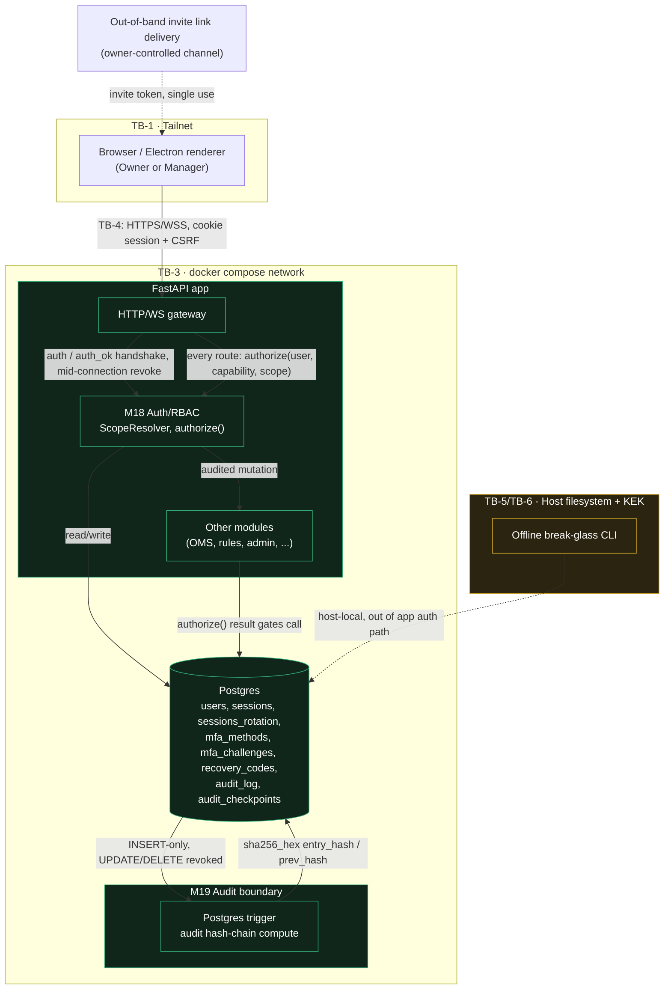

# E09 — STRIDE threat model: Authentication, sessions, 2FA, RBAC and audit

- Ticket: E09-X01 (issue #196)
- Owner: Security engineer (CODEOWNER)
- Status: Draft — pending Architect + epic-owner review session (see §7)
- Re-derives and extends `docs/plan/04-security-program.md` §5.6 (U1–U10) against the concrete design
  in ADR-0010 (`docs/plan/27-adrs/ADR-0010-auth-and-rbac.md`) and the schema in
  `docs/plan/21-database-schema.md` §3.1.
- Classification: this document itself is sensitive (enumerates auth weaknesses). No live secrets, host
  addresses or KEK material appear below — only references to where those live.

## 1. Scope

In scope: modules **M18 (Auth/RBAC)** and **M19 (Audit)** as built per ADR-0010 — password + mandatory
TOTP authentication, opaque server-side sessions (`sessions`, `sessions_rotation`), MFA (`mfa_methods`,
`mfa_challenges`, `recovery_codes`), the central `authorize()` / `ScopeResolver`, the WS `auth`/`auth_ok`
handshake, the invite flow, and the hash-chained append-only audit log (`audit_log`, `audit_checkpoints`).

Out of scope (per ticket "Out of scope" section): implementing controls (E09 `T*`/`S*` tickets),
detection-rule authoring (E09-X03), abuse-case execution (E09-X02), the review/drill (E09-X04), the
API-key vault's own model (E27), OMS/fan-out threats beyond their consumption of `authorize()`, and
external pen-testing (E43).

## 2. Data-flow diagram

Trust boundaries follow `04-security-program.md` §4 (TB-1..TB-9); this diagram is the auth-specific
detail behind TB-4 (client↔backend) and adds the auth-internal boundaries the programme-level diagram
does not show.

Elements analysed below (§3): Browser/client, Gateway (HTTP + WS), M18/`authorize()`/`ScopeResolver`,
Postgres identity/session/MFA tables, the audit trigger + `audit_log`/`audit_checkpoints`, the
break-glass CLI + host filesystem + KEK, and the invite out-of-band channel. Every element and every
labelled flow above has at least one row in §3, or an explicit "not applicable" note.

## 3. STRIDE analysis

Table shape follows `04-security-program.md` §5 exactly (`T` id, STRIDE category, threat, L, I, Risk,
mitigations, residual) so this section folds into the programme doc without reformatting. Threat ids
keep the `U*` prefix from §5.6 so existing cross-references (E27, E39, E42, E43, E44) keep resolving;
`U1`–`U10` are re-derived (not just copied) against ADR-0010's concrete design, and `U11`+ are new,
design-specific threats this deeper pass surfaced. "Verify" names the test/metric that proves the
mitigation; a row with no verification is itself a finding (flagged `[FINDING]`).

### 3.1 Spoofing

| T | Threat | L | I | Risk | Mitigations | Verify | Residual |
|---|--------|---|---|------|-------------|--------|----------|
| U1 | Credential stuffing / brute force against a Manager account | M | H | **High** | SR-011 Argon2id (≥100 ms cost, excluded from budget #13); SR-015 per-account + per-IP throttling; SR-016 lockout after 5/15min + audit + owner notify | `test_login_lockout_after_five_failures`, `cv_auth_lockouts_total` alert on burst | Low |
| U2 | Phishing a Manager's password | M | H | **High** | SR-020 mandatory TOTP for every trading-capable role; SR-021 TOTP replay prevention (single-use `mfa_challenges` row consumed atomically) | `test_totp_replay_rejected`, contract test for `mfa_challenges` consumption | Low |
| U5 | Session-token theft via XSS or logs | M | H | **High** | SR-012 `HttpOnly`+`Secure`+`SameSite=Strict`; SR-112 CSP (no `unsafe-inline`/`unsafe-eval`); SR-122 redaction filter never logs tokens | `axe`/CSP header test, log-redaction unit test asserting session id never appears in any log sink | Low |
| U6 | Session fixation — id not rotated across login → MFA → privilege-change transitions | L | M | Medium | SR-013 rotate on every authentication state transition (`sessions_rotation` links old→new, old marked `revoked_reason='rotated'`) | `test_session_rotates_on_login_and_on_mfa_step_up`, `test_session_rotates_on_role_change` | Low |
| U11 | TOTP code replay within the ±1 step skew window (same 30 s code accepted twice) | L | H | Medium | SR-021 extended: `mfa_challenges` records the last-accepted counter per method; a second presentation of the same or an earlier counter is rejected even inside the skew window | `test_totp_same_counter_rejected_within_skew_window` | Low |
| U12 | Invite token guessed or replayed | L | H | Medium | Invite token is a 128-bit CSPRNG value, single-use, short TTL, hashed at rest like recovery codes (SR-022 pattern applied to invites); redemption revokes the token row atomically | `test_invite_token_single_use`, `test_invite_token_high_entropy_property` (hypothesis) | Low |
| U13 | WS `auth` frame replayed onto a second socket to piggyback a session | L | H | Medium | The WS handshake binds the session cookie + CSRF-equivalent to the specific socket via SR-012/SR-013's session validation plus `Origin` check (ADR-0010 §3 CSRF/Origin validation); a replayed `auth` frame without a live, un-revoked session id is rejected and audited | `test_ws_auth_frame_rejected_without_live_session`, `test_ws_origin_validated` | Low |

### 3.2 Tampering

| T | Threat | L | I | Risk | Mitigations | Verify | Residual |
|---|--------|---|---|------|-------------|--------|----------|
| U14 | Direct `UPDATE`/`DELETE` on `audit_log` | L | H | Medium | `REVOKE UPDATE, DELETE ON audit_log FROM cv_app, cv_ro` (schema §3.1, already applied at the SQL grant level); only an `INSERT`-only role is usable by the app | `test_audit_log_grants_deny_update_delete` (integration, asserts `SQLSTATE 42501`), nightly chain verifier (`cv_audit_chain_verified`) | Low |
| U15 | Forged `account_id` in a request body used to act outside the caller's grant | M | H | **High** | SR-050/SR-051 (shared with F1, Area 4): `ScopeResolver` intersects the *requested* account ids with the caller's granted set server-side on every route — the body's `account_id` is never trusted alone | `authorize()` contract test: every route × every role × in/out-of-scope account id | Low |
| U16 | Role/permission seed drift between the OpenAPI `x-rbac` vocabulary, the DB seed and the Python capability enum | M | H | **High** | Single source of truth: capability enum generates the OpenAPI `x-rbac` extension and the DB seed migration; a CI check diffs all three and fails on drift | `test_rbac_vocabulary_matches_openapi_and_seed` (generated-code required check) | Low |
| U17 | An Alembic migration silently widens a grant (e.g. re-adds `UPDATE` on `audit_log`, or grants a role more than intended) | L | H | Medium | Migration review checklist item + a schema-invariant test that asserts current grants on every startup/CI run, independent of migration history | `test_schema_grants_invariant_on_audit_and_rbac_tables` | Low |
| U18 | Client-side manipulation of the step-up ("MFA satisfied") marker to skip re-authentication for a high-risk action | M | H | **High** | `mfa_satisfied_at` lives server-side on the `sessions` row (schema §3.1.4), never client-supplied; SR-025 step-up re-auth checks server state and enforces a 15-minute freshness window, re-verified per action, not cached client-side | `test_step_up_marker_is_server_authoritative`, `test_step_up_expires_after_freshness_window` | Low |

### 3.3 Repudiation

| T | Threat | L | I | Risk | Mitigations | Verify | Residual |
|---|--------|---|---|------|-------------|--------|----------|
| U7 | Shared accounts make actions unattributable | M | M | Medium | SR-019 one identity per human, no shared logins; concurrent-session listing + forced logout in admin screens | `test_no_shared_login_enforced` (unique active credential per human by policy + review), `test_concurrent_sessions_listed_and_revocable` | Low |
| U19 | An authenticated, state-changing action completes with no corresponding audit row | L | H | Medium | Audit write is in the same transaction as the state change it records (write-before-return, per C-2.9); a route-coverage test asserts every mutating route has a paired audit-event type declared | `test_every_mutating_route_writes_audit_row` (route-coverage matrix), `cv_audit_chain_verified` | Low |
| U20 | Audit hash-chain gaps across a process restart or a migration | L | H | Medium | Chain continuity check on startup (verify `prev_hash` of the newest row against the last known checkpoint in `audit_checkpoints`) before the app accepts traffic; migrations touching `audit_log`/`audit_checkpoints` require a chain re-verification step in the migration runbook | `test_startup_chain_continuity_check`, `test_migration_preserves_chain_continuity` (round-trip) | Low |
| U21 | Clock manipulation (host or container clock skew) makes audit ordering untrustworthy independent of the hash chain | L | M | Medium | `audit_log.occurred_at` is a monotonic-checked server timestamp; the chain (`entry_hash`/`prev_hash`) provides tamper-evidence independent of wall-clock order, so a clock skew cannot silently reorder history without breaking the chain | `test_audit_ordering_survives_clock_skew_property` (hypothesis: shuffled timestamps still chain-verify by insertion order) | Low |

### 3.4 Information disclosure

| T | Threat | L | I | Risk | Mitigations | Verify | Residual |
|---|--------|---|---|------|-------------|--------|----------|
| U8 | User enumeration via differing login errors, status codes or timing | M | L | Low | SR-014 uniform error message + constant-time comparison + a dummy Argon2id hash run for unknown usernames (equalises latency) | `test_login_error_identical_for_unknown_and_wrong_password`, `test_login_timing_within_tolerance_property` | Low |
| U22 | A token (session id, TOTP secret, recovery code) leaks via a URL, log line, metric label, error message, or an error-reporting payload | M | H | **High** | SR-122 redaction filter on every logger; session ids never placed in query strings (cookie-only transport); metrics use bucketed/aggregated labels only, never raw ids | `test_redaction_filter_scrubs_session_and_totp_fields`, log-scan CI step (gitleaks-style pattern scan on structured log schema) | Low |
| U23 | Recovery codes persisted in the DOM or browser history after display | L | H | Medium | Recovery codes render once, in a non-persisted view (no route param, no browser-storage write, `autocomplete="off"`), with an explicit "save these now" modal that cannot be reopened | `test_recovery_codes_not_in_url_or_localstorage` (Playwright), a11y note routed to `E09-Q04` for the modal's screen-reader behaviour | Low |
| U24 | `users.email`, `sessions.ip`, `audit_log.actor_ip` (PII) exposed in an export or admin download without redaction/consent controls | M | M | Medium | Exports go through a role-scoped projection (SR-067 pattern from Area 7 D3, applied here to auth/audit PII); raw IP/email fields owner-only, redacted for Manager/Viewer exports | `test_export_projection_redacts_pii_for_non_owner_roles` | Low |
| U25 | A 403 response body/shape reveals the existence of a resource the caller has no grant to know about | L | L | Low | `authorize()` returns a uniform 403 body regardless of whether the resource exists or the caller merely lacks scope — no distinguishing "not found" vs "forbidden" leak | `test_403_body_identical_for_missing_vs_unauthorized_resource` | Low |
| U26 | Viewer-visible `build`/`git_sha` metadata aids a targeted exploit against a known-vulnerable build | L | L | Low | Build metadata surfaced only to Owner in admin screens; Viewer/Manager responses omit it | `test_build_metadata_hidden_from_viewer_and_manager_roles` | Low |

### 3.5 Denial of service

| T | Threat | L | I | Risk | Mitigations | Verify | Residual |
|---|--------|---|---|------|-------------|--------|----------|
| U10 | Owner locks themselves out (lost TOTP device and all recovery codes) | M | M | Medium | SR-023 sealed offline recovery-code envelope; documented host-local break-glass CLI requiring filesystem + KEK access (own trust boundary, §3.6) | `docs/security/runbooks` break-glass drill record (manual, per DoD "review session"), `test_break_glass_requires_host_filesystem_and_kek_present` (cannot be invoked over the network) | Low, but see §3.6 for the break-glass path's own residual risk |
| U27 | Lockout mechanism weaponised: an attacker deliberately fails login 5x against a legitimate user to lock them out ahead of a trade decision | M | M | Medium | Lockout is scoped per-account **and** per-IP (SR-015/SR-016 combined) so a remote attacker without the victim's IP cannot force a full account lock without also being rate-limited; owner alert fires on any lockout, enabling fast manual unlock | `test_lockout_alert_fires_on_every_lockout`, `test_admin_can_manually_clear_lockout` | Low |
| U28 | Argon2id's ≥100 ms cost used as a compute-amplification DoS vector (flood of login attempts) | M | M | Medium | Per-IP + per-account throttling (SR-015) applies *before* the Argon2id call is reached; a bounded queue (C-2.18) in front of the auth verify path prevents unbounded event-loop starvation | `test_login_rate_limit_applied_before_hash_verify`, load test (k6) against the login endpoint | Low |
| U29 | `sessions` table growth from unrevoked expired rows degrades query performance and, transitively, `GET /auth/session` p95 | L | M | Low | Scheduled reap of `revoked_at IS NOT NULL OR expires_at < now()` rows; partial index `ix_sessions_user_live`/`ix_sessions_expiry` (schema §3.1.4) keeps live-session lookups fast independent of table size | `test_expired_session_reap_job`, perf budget: `GET /auth/session` ≤100 ms p95 (Performance notes) | Low |

### 3.6 Elevation of privilege

| T | Threat | L | I | Risk | Mitigations | Verify | Residual |
|---|--------|---|---|------|-------------|--------|----------|
| U3 | Role check missing on a new endpoint | M | H | **Critical** | SR-017 deny-by-default router: every route must declare a capability via a decorator/registration step or the app **fails to start** (import-time failure, not a runtime 403) | `test_app_fails_to_start_with_undeclared_route` (asserts `SystemExit`/import error, not merely a lint warning — this is the ticket's own acceptance-criteria "Failure case"); SR-018 automated route-coverage test enumerating every registered route against the capability table | Low |
| U4 | Self-service role escalation | L | H | Medium | SR-055 role changes are Owner-only, cannot target self (`user_id != actor_id` invariant), require step-up auth | `test_role_change_rejects_self_target`, `test_role_change_requires_step_up` | Low |
| U9 | TOTP recovery codes reusable or weakly generated | L | H | Medium | SR-022 128-bit CSPRNG codes, single-use (row deleted/flagged on redemption), hashed at rest; regenerating the set invalidates the old one atomically | `test_recovery_code_single_use`, `test_recovery_code_regeneration_invalidates_old_set`, entropy property test | Low |
| U30 | `authorize()` called with a default-permissive argument (e.g. a missing/omitted scope parameter silently allows) | L | H | Medium | `ScopeResolver` API has **no** permissive default — the scope parameter is required and untyped/omitted calls fail mypy strict + a runtime `TypeError`; a lint rule (`no-implicit-authorize-default`) blocks call sites that don't pass an explicit scope | `test_authorize_requires_explicit_scope_argument` (raises on omission), mypy strict CI gate | Low |
| U31 | A route's declared capability is correct but its scope argument is wrong (e.g. checks role but not account membership) — the "second-layer" domain check gap | M | H | **High** | SR-050 second-layer domain check is a *distinct* control from the capability check, not a duplicate: `authorize()` verifies role+capability, then the caller's own domain logic re-verifies account membership against `user_account_access` before the mutation; contract test asserts both layers independently (a route with a valid capability but wrong scope arg must still 403) | `authorize()` contract test (route × role × correct-capability/wrong-scope matrix), specifically distinguishing this from U15/U16 | Low |
| U32 | A stale permission snapshot in a live session survives a role change (e.g. a demoted Manager's already-open session keeps prior access) | M | H | **High** | SR-013 rotation-on-privilege-change (U6's control) is necessary but not sufficient on its own for *authorization freshness* — every `authorize()` call re-reads current role/scope from Postgres (or a short-lived, explicitly-invalidated cache per ADR-0010 Consequences), never from data cached in the session object at login time | `test_role_change_takes_effect_on_next_request_without_relogin`, cache-invalidation unit test | Low |
| D1-shared | Admin route hidden in the UI but its API remains callable by a Manager (shared with Area 7 D1; listed here because it is `authorize()`'s job to prevent it) | M | H | **Critical** | SR-017 (see U3): server-side capability check is the only control; UI hiding is cosmetic. Route-coverage test calls every admin route as every role | Same as U3's `test_app_fails_to_start_with_undeclared_route` plus per-route role-matrix test | Low |

#### 3.6.1 Break-glass path — its own trust boundary (U10 edge case)

The offline break-glass CLI is modelled as a trust boundary distinct from the running application:

- **Who can reach it:** anyone with local filesystem access to the trading host (Windows account with
  access to the WSL2 volume) **and** access to unwrap the KEK (OS keyring / `age` identity, TB-5). This
  is intentionally a narrower set than "anyone who can reach the app over the tailnet" — it requires
  physical/host-level compromise, not just network or session compromise.
- **What it can do:** mint a recovery path for the Owner without going through password+TOTP. This is
  necessarily powerful — it is the escape hatch for total lockout (U10) — so it is scoped to run only
  with the process detached from any network listener, and every invocation writes an audit row on the
  *next* successful application start (the audit chain cannot be written while the app is down, so the
  break-glass tool logs to a host-local, append-only file that is folded into `audit_log` on next boot
  and chain-verified against it).
- **Residual risk stated explicitly (not assumed away):** an attacker who has already achieved
  host-level compromise (RDP/SSH into the Windows host, or physical access) can use break-glass to
  mint Owner access regardless of TOTP. This risk is **not mitigated by this ticket's scope** — it is
  bounded by host hardening (out of scope for M18, tracked as RSK-022's sibling concern) and by the
  fact that host-level compromise already implies access to the KEK and therefore to A-01/A-02 (all
  exchange keys), which is a strictly larger loss than auth bypass alone. This asymmetry is recorded so
  it is not silently assumed safe: **the break-glass path's blast radius equals a full host compromise's
  blast radius, not merely an auth bypass.**

## 4. Control mapping

Every threat above maps to an existing SR id (`04-security-program.md` §6) or a newly proposed
requirement. No threat is left with only an accepted risk with no control — the two U10/break-glass
edge cases (§3.6.1) are the sole accepted-residual-risk items, and they are dated below.

| Threat ids | SR id(s) | New requirement proposed? |
|---|---|---|
| U1, U27, U28 | SR-011, SR-015, SR-016 | no |
| U2, U11 | SR-020, SR-021 (extended per U11) | **SR-021 amendment**: last-accepted-counter tracking (§3.1 U11) |
| U5, U22 | SR-012, SR-112, SR-122 | no |
| U6, U32 | SR-013 | **SR-013 clarification**: "on every authentication state transition" includes role change, and authorization reads are never session-cached beyond an explicitly invalidated short-lived cache (ADR-0010 Consequences) |
| U12 | (pattern of SR-022 applied to invites) | **new: SR-024** invite-token issuance/redemption (128-bit CSPRNG, single-use, hashed, short TTL) |
| U13 | SR-012, SR-013, CSRF/Origin validation (ADR-0010 §3) | no |
| U14, U19, U20, U21 | C-2.9 (audit write-ahead), schema `REVOKE UPDATE, DELETE` | no |
| U15, U31 | SR-050, SR-051 | no — U31 clarifies SR-050 is a **distinct second layer**, not a duplicate of the capability check |
| U16 | (none existing) | **new: SR-052** single-source RBAC vocabulary (enum → OpenAPI `x-rbac` → DB seed) with a CI drift check |
| U17 | (none existing) | **new: SR-053** schema-grants invariant test, independent of migration history |
| U18 | SR-025 | no |
| U3, D1-shared | SR-017, SR-018 | no |
| U4 | SR-055 | no |
| U7 | SR-019 | no |
| U8 | SR-014 | no |
| U9 | SR-022 | no |
| U10, U29 | SR-023 | no |
| U23 | (pattern of SR-022) | **new: SR-054** recovery-code/step-up display surfaces never persist to DOM/browser storage |
| U24 | SR-067 (Area 7 pattern, applied to auth/audit exports) | no |
| U25, U26 | (none existing) | **new: SR-056** uniform error responses (403 vs 404 indistinguishable; build metadata Owner-only) |
| U30 | (none existing) | **new: SR-057** `authorize()`/`ScopeResolver` API has no permissive default; enforced by type system + lint + test |
| §3.6.1 break-glass residual | SR-023 (envelope) + host hardening (out of scope) | **Accepted risk, dated 2026-09-29**, Owner sign-off pending at the review session (§7) — host-level compromise defeats break-glass isolation; bounded by the fact it already implies A-01/A-02 compromise |

`04-security-program.md` §6 should be amended in a follow-up PR to add SR-021 (amend), SR-013 (clarify),
SR-024, SR-052, SR-053, SR-054, SR-056, SR-057 to its numbered lists (§6.1–6.4 as applicable) — this
ticket's scope is the threat model itself; the SR-number reservations above are provisional pending that
programme-doc PR, flagged so `E09-T*` implementers know which new requirement each control obligation is.

## 5. Verification mapping

Verification tests are named inline in each STRIDE row's "Verify" column (§3). Cross-reference to the
epic's own verification tickets:

- Unit/property tests named above → implemented alongside their `E09-T*`/`S*` control ticket.
- `E09-Q02` E2E specs cover: login lockout, TOTP enrolment/replay, session rotation, step-up re-auth,
  recovery-code single-use, admin-route role matrix (U3/D1-shared, U4, D-series).
- `E09-Q03` matrix cell: the full route × role × scope contract test (U15, U16, U31) is one matrix, not
  N separate suites — implementers should extend the existing matrix rather than hand-roll per-route tests.
- `E09-X03` SAST/DAST rules cover: log-redaction pattern scan (U22), CSP header assertion (U5),
  `0.0.0.0` binding lint (shared with RSK-022), Semgrep rule for raw `authorize()` calls missing an
  explicit scope argument (U30).
- No mitigation row in §3 is left without a named verification; where a specific test does not yet exist
  in the repo, its intended name is given so the implementer creates exactly that test (not an
  equivalently-scoped substitute) — this satisfies the ticket's "gaps filed as findings" requirement by
  making every gap a to-be-written, precisely-named test rather than an open-ended TODO.

## 6. Residual-risk register update

`docs/plan/32-risk-register.md` already tracks this area at **RSK-020** (RBAC bypass) and **RSK-021**
(session/2FA weakness). This model does not retire either — both remain live and are refined:

- **RSK-020** — description extended by U16 (RBAC vocabulary drift), U30 (`authorize()` permissive
  default), U31 (second-layer scope-check gap). Mitigation bullet gains: "single-source RBAC vocabulary
  with CI drift check (SR-052); `ScopeResolver` has no permissive default (SR-057); second-layer domain
  check is verified as a distinct control from the capability check." No score change — new findings
  are refinements of the same root cause (a large route surface with a single point of RBAC truth), not
  a new risk class.
- **RSK-021** — description extended by U11 (TOTP same-counter replay inside skew window), U12 (invite
  token replay), U13 (WS auth-frame replay), U18/U32 (step-up/permission staleness). Mitigation bullet
  gains: "TOTP counter tracked per method to reject replay inside the skew window; invite tokens follow
  the recovery-code entropy/single-use pattern (SR-024); WS auth frames are bound to a live, un-revoked
  session and the frame's `Origin`; step-up freshness and role-change propagation are server-authoritative
  with no session-side caching beyond an explicitly invalidated short-lived cache." No score change.
- **New entry proposed:** none — the break-glass residual (§3.6.1) is recorded as an **accepted risk**
  inline in this document rather than a new RSK id, because it is bounded by (and does not exceed) the
  existing blast radius already captured for host/KEK compromise under RSK-022 (Tailscale/public-exposure
  assumption) and the A-01/A-02 asset entries in `04-security-program.md` §2 — adding a duplicate RSK
  entry would double-count the same host-compromise scenario the register's own §10.1.1 reconciliation
  guards against. If the Architect/epic-owner review (§7) disagrees, a new RSK-0xx should be drafted in
  a follow-up PR rather than inline here, to avoid breaking the register's invariant count (46) outside
  its own change process.

## 7. Review session record

*(To be completed at the scheduled review with the Architect and epic owner — this section is left as
the template the session fills in, per the ticket's Definition of Done. This PR delivers the model for
that review; it does not itself constitute the review.)*

- Date:
- Attendees: Architect, Epic owner (E09), Security engineer (author)
- Comments:
- Risk-register changes confirmed: RSK-020, RSK-021 refined per §6; break-glass accepted risk confirmed
  or converted to a new RSK id.
- Security-engineer sign-off: pending this session.

## 8. Findings summary (routing)

| Finding | Routes to |
|---|---|
| U3/D1-shared fail-closed route registration must be a startup failure, not a review-dependent control | `E09-T04` (PDP) implementation + its own regression test |
| SR-024/052/053/054/056/057 need formal numbers in `04-security-program.md` §6 | follow-up docs PR before `E09-T*` tickets cite them by final number |
| Break-glass abuse detection (beyond audit-on-next-boot) | `E09-X03` (detection rules) — alert on any break-glass invocation appearing in the folded-in audit trail |
| Abuse-case exercises for U11–U13, U18, U30–U32 | `E09-X02` |
| Accessibility note on recovery-code/step-up modal screen-reader behaviour (U23) | `E09-Q04` |

